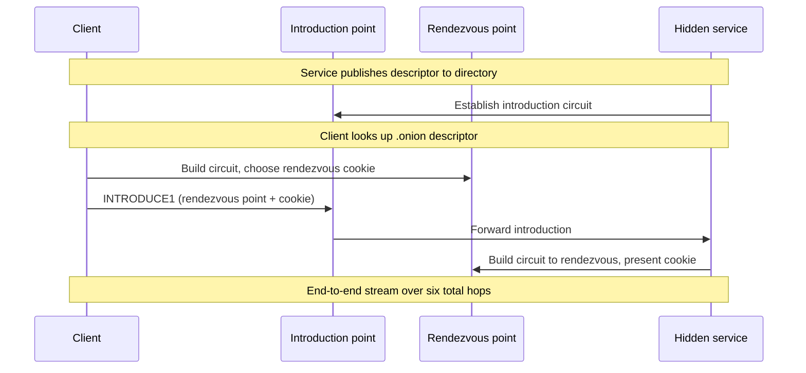

# Tor and Anonymity Networks

## Why this matters

Anonymity networks are part of the modern threat landscape and part of the modern defensive toolkit, and a security professional needs to understand both sides. A SOC analyst who cannot recognise Tor traffic on the wire will miss data-exfiltration channels that hide inside it. A pen-tester who refuses to learn Tor will hand the OSINT phase to teammates who do. A policy team that bans Tor outright without understanding it will block the threat-intel researcher and the journalist source contact while doing nothing to stop the malware that already pivoted to a custom transport.

The legitimate uses are real. Researchers track ransomware operators on hidden-service forums. Journalists protect sources who would lose their jobs or their lives if their browsing patterns were correlated with a specific newspaper. Dissidents in censored regions reach the outside Internet through bridges. Whistleblowers submit documents through SecureDrop. None of those use cases work without something like Tor — a cryptographic system that separates "who you are" from "what you do" against an adversary who can watch large parts of the network.

The flip side is unforgiving. Tor is not magic. A user who installs Tor Browser and then logs into their real Google account inside it has tied their anonymous circuit to their real identity. An exit node operator can read every plaintext byte that leaves their relay — and many run with exactly that intent. A clueless user who reads a blog post claiming "Tor makes you anonymous" and then conducts business that needs operational discipline will be deanonymised by a browser fingerprint, a JavaScript timing leak, or a DNS query that bypassed the SOCKS proxy. Tor is a tool with a specific threat model, and using it outside that threat model often hurts more than it helps.

Examples in this lesson use the fictional `example.local` organisation. Tor concepts and protocol versions are kept current so the lesson works as a field reference.

## Core concepts

Tor is onion routing plus a directory system plus a browser plus an opinionated default configuration. The cryptography is well understood; the operational discipline around it is where anonymity is won or lost.

### The threat model Tor solves — separating who you are from what you do

Tor defends against a network observer who can watch part of the path between a user and the destination, but not all of it at once. Specifically, Tor breaks the link between the user's source IP address and the destination they reach. An ISP that watches the user's link sees encrypted traffic to a Tor entry guard but not the destination. A web server sees a connection from a Tor exit node but not the originating IP. A government that watches one country's transit links sees fragments of circuits, not full flows.

What Tor does not defend against is a global passive adversary who can watch every link simultaneously and correlate timing and volume. Nor does it defend against the user themselves — if a user logs into a service that already knows them, no amount of onion routing hides that identity. Nor does it defend against application-layer leaks: cookies, browser fingerprints, DNS queries that escape the proxy, document metadata. The threat model is deliberately scoped, and using Tor effectively means staying inside it.

### Onion routing — three relays, nested encryption, why three is the magic number

A Tor circuit is a path through three volunteer-operated relays: an entry guard, a middle relay, and an exit relay. The client wraps the original packet in three nested layers of encryption, each layer keyed for one relay. The entry guard peels off the outermost layer and sees the address of the middle relay; the middle relay peels off its layer and sees the address of the exit relay; the exit relay peels off the final layer and sees the original packet, which it forwards to the destination. The metaphor is an onion — peel a layer, expose the next.

Three is the minimum number of relays at which no single relay knows both endpoints. The entry guard sees the user's IP but not the destination. The exit relay sees the destination but not the user. The middle relay knows neither — it sees only the entry and exit relays. Two relays would let the entry collude with the exit. Four or more would add latency without a meaningful anonymity gain against the threat model Tor scopes for.

The encryption itself uses ephemeral session keys negotiated through ntor — a curve25519-based handshake that gives forward secrecy per circuit. A relay that is later compromised or seized cannot retroactively decrypt traffic from circuits that have already torn down, because the session keys never left the participants' RAM and were destroyed when the circuit closed.

### Tor circuit lifecycle — circuit build, stream multiplexing, circuit rotation

The client builds a circuit by sending a `CREATE` cell to the entry guard, completing a Diffie-Hellman handshake to establish a shared key, then tunnelling an `EXTEND` request through that hop to add the middle relay, and again through both hops to add the exit relay. Each extension is a fresh DH handshake keyed for the new hop, so the client ends up with three separate session keys — one per relay.

Once the circuit is up, the client multiplexes TCP streams over it. Multiple browser tabs, multiple connections to the same site, multiple sites — all share the same circuit until rotation. By default Tor rotates circuits every 10 minutes for new streams, while existing streams continue on their original circuit. The entry guard, however, is sticky: a client picks a small set of guards and reuses them for months, because rotating guards every circuit would expose the user to a malicious guard sooner rather than later.

### Tor Browser — Firefox ESR plus extensions plus safe defaults

Tor Browser is not "a browser with Tor enabled". It is a hardened fork of Firefox ESR with patches that defeat browser fingerprinting, timing attacks, and cross-origin tracking, bundled with NoScript, HTTPS-Everywhere (now folded into HTTPS-Only mode), and a SOCKS proxy configuration that forces every connection through the local Tor daemon. The default window size is fixed to a common bucket so window-size fingerprinting yields little. Fonts, WebGL, and a long list of fingerprintable APIs are either disabled or normalised across all users.

"Just install Tor on your normal browser" is the wrong answer. A normal Chrome or Firefox configured with a SOCKS proxy to Tor will leak through WebRTC, leak through DNS prefetching, leak through extension fingerprints, leak through the user's bookmarks and saved logins, and stand out from the Tor Browser fingerprint crowd by every metric. The SOCKS proxy moves bytes; Tor Browser is what makes those bytes look like every other Tor user's bytes.

Tails and Whonix go further — Tails is a live operating system that boots from a USB stick and routes everything through Tor, leaving no trace on the host disk; Whonix is a pair of VMs (a gateway that runs Tor and a workstation that has no other network path) that enforces the proxy at the virtual network layer. Both eliminate the class of leaks where one application accidentally bypasses the Tor SOCKS configuration, at the cost of more setup work.

### Hidden services and `.onion` — rendezvous points, no-exit-needed model

A hidden service (now called an onion service) lets a server be reachable through Tor without exposing its IP address. The server picks a few introduction points (Tor relays), publishes its public key and the introduction-point list to the Tor directory, and waits. A client that wants to reach the service looks up the descriptor by the service's `.onion` address (a base32 encoding of the public key), picks a random rendezvous point, sends an introduction request to one of the introduction points, and the server connects out to the rendezvous point. Both client and server build three-hop circuits to the rendezvous, so end-to-end the traffic crosses six relays — three from each side.

There is no exit node. The traffic never leaves the Tor network. Neither side learns the other's IP. Onion v3 (RFC-style spec at the Tor project) uses Ed25519 keys and a 56-character address; onion v2 was deprecated in 2021 because of weaker crypto and address-enumeration attacks.

### Bridges and pluggable transports — bypassing censorship

Tor relay IPs are public, so a censor can simply block the entire relay list. Bridges are unlisted Tor entry points whose IPs are not in the public directory; users obtain them through email, Telegram, the Tor Browser bridge request flow, or out-of-band. Pluggable transports wrap the Tor traffic in something that does not look like Tor on the wire: `obfs4` randomises the byte stream, `meek` tunnels through a CDN front (Azure, formerly Amazon CloudFront), `snowflake` uses WebRTC connections to volunteer browser-extension proxies. Each transport raises the cost of detection differently — `obfs4` defeats simple signature matching, `meek` defeats domain-based blocking, `snowflake` defeats both at the cost of variable performance.

### Tor exit nodes — the abuse problem, why ISPs flag exit-node IPs

The exit relay sees the cleartext of any non-HTTPS traffic and is the IP that destination services see. Anything bad a Tor user does — credential stuffing, scraping, abuse comments, brute force, exploit traffic — appears to come from the exit. Exit operators are constantly fielding abuse complaints, DMCA notices, and law-enforcement requests, even though they have no logs and no way to identify the actual user. Many ISPs refuse to host exit relays, and many websites block all Tor exit IPs by consulting the published exit list. Running an exit is an act of public service and a permanent abuse-handling job; running a non-exit relay (entry or middle) is much lower-risk and still useful.

### VPN over Tor vs Tor over VPN — what each gives you, what neither gives you

**Tor over VPN** — the user connects to a VPN first, then runs Tor on top. The user's ISP sees a VPN connection but not Tor. The VPN provider sees Tor traffic but not the destination. The Tor entry guard sees the VPN's IP, not the user's. This is what most "Tor over VPN" guides recommend; it hides Tor use from the local ISP and is appropriate where Tor itself is suspicious to local authorities.

**VPN over Tor** — the user connects to Tor first, then connects to a VPN through the Tor exit. The destination sees the VPN's IP, not a Tor exit IP. This is occasionally useful for accessing services that block all Tor exits, but it ties the user's Tor circuit to a stable VPN account, which usually has a payment trail. Most threat models treat VPN over Tor as worse than plain Tor.

Neither configuration defends against application-layer deanonymisation, neither hides browsing from the VPN provider in the first case, and neither protects against a global passive adversary. Both add complexity and both tie the user to a specific VPN provider whose logging and jurisdiction matter.

### I2P — alternative anonymity network

I2P (Invisible Internet Project) is a peer-to-peer anonymity network that takes a different shape from Tor. Where Tor builds long-lived circuits through volunteer relays optimised for outbound clearnet access, I2P builds short-lived unidirectional tunnels among all participating nodes — every I2P user is also a relay. I2P is optimised for hidden services (called eep-sites, addressed `.i2p`) and peer-to-peer applications inside the network. It has a much smaller user base than Tor and weaker support for clearnet exits. I2P is relevant when researching certain malware command-and-control patterns, certain file-sharing communities, and as a comparison point for understanding anonymity-network design choices.

### Other approaches — Mixnets, Lokinet, Nym

**Mixnets** (the original anonymity-network design from Chaum's 1981 paper) batch and shuffle messages at each hop to defeat timing analysis, at the cost of latency. Tor does not mix — it ships packets immediately, which is why it is fast enough for browsing but vulnerable to global passive correlation. **Lokinet** is a mixnet-flavoured anonymity network based on Oxen blockchain incentives. **Nym** is a more recent mixnet design that pays mix nodes through a token to incentivise relay operation. Each makes different trade-offs between latency, throughput, and resistance to a global adversary; none has Tor's user base or maturity, and most security work in 2026 still defaults to Tor.

A note on the Tor consensus. Every hour, a set of nine directory authorities votes on which relays exist and which flags they have (Guard, Exit, Stable, Fast, BadExit). Clients download the resulting consensus document and use it to pick relays. The directory-authority operators are named individuals at organisations like the Tor Project, Mozilla, and Karlstad University; compromise of a majority would break the network, which is why the operator list is small, public, and independently funded.

## Onion routing diagram

The first diagram shows a Tor circuit: the client builds three nested encryption layers, each peeled at one relay, with the exit forwarding cleartext (or HTTPS) to the destination.

```mermaid
flowchart LR
    client["Tor client\n(Tor Browser)"]
    entry["Entry guard\n(knows client IP)"]
    middle["Middle relay\n(knows neither end)"]
    exit["Exit relay\n(knows destination)"]
    dest["Destination\nexample.com"]

    client -- "3 layers encrypted" --> entry
    entry -- "2 layers encrypted" --> middle
    middle -- "1 layer encrypted" --> exit
    exit -- "cleartext / HTTPS" --> dest

    classDef trust fill:#d8f0d8,stroke:#2e7d32,color:#0a3a0a;
    classDef untrust fill:#ffeacc,stroke:#b15a00,color:#3a1a0a;
    class client,entry,middle,exit trust;
    class dest untrust;
```



The second diagram shows hidden-service rendezvous: client and server each build a three-hop circuit to a rendezvous point, so neither learns the other's IP.



## When Tor helps vs when it hurts

| Scenario | Effect | Why |
|---|---|---|
| Dissident under high-threat surveillance | Helps | Hides destination from ISP; bridges hide Tor itself |
| Journalist contacting a confidential source | Helps | Source's network metadata is not tied to journalist |
| Threat researcher accessing a hidden-service forum | Helps | Researcher's corporate IP is not exposed to the forum operator |
| Whistleblower using SecureDrop | Helps | Designed end-to-end for this; onion service, no exit |
| User logged into their real Google account inside Tor Browser | Does not help | Identity is already attached to the session |
| User running a VPN to a paid account, then Tor on top | Helps partially | Hides Tor from ISP, but VPN payment trail still exists |
| User with cookies, extensions, or browser changes from Tor Browser default | Hurts | Fingerprint stands out from the Tor Browser crowd |
| Clueless user assuming "Tor = magical safety" | Hurts | Will leak via DNS, WebRTC, document metadata, or login |
| Employee using Tor to bypass corporate DLP | Hurts (the org) | Insider threat indicator; bypass for sanctioned controls |
| Malware using Tor for command-and-control | Hurts (defenders) | Hard to block at egress without breaking legitimate use |

The pattern: Tor helps when the user has both a legitimate threat model and the operational discipline to stay inside it. It hurts when either is missing.

## Hands-on / practice

Five exercises that build an intuition for Tor behaviour. None require running an exit relay, and the SOC exercise uses only public data.

### 1. Install Tor Browser and inspect a circuit

Download Tor Browser from `torproject.org` (verify the GPG signature against the Tor Browser developers' key — do not skip this step). Launch it, visit a regular `https://` site, and click the lock icon to view the circuit. You will see three relays listed by country and IP.

Answer: which relay is the entry guard, which the middle, which the exit? What changes if you click "New Tor Circuit for this Site"? What stays the same across multiple sites in the same session?

### 2. Use `nyx` to monitor a relay's activity

On a Linux box, install `tor` and `nyx` (the Tor relay monitor formerly known as `arm`). Run `tor` as a client, then run `nyx` and observe the live circuits, bandwidth usage, and consensus updates.

```bash
sudo apt install tor nyx
sudo systemctl start tor
sudo nyx
```

Answer: how many circuits does your client build during a normal browsing session? How long do they live? What does the consensus document tell you about how Tor decides which relays you can use?

### 3. Run a Tor relay (non-exit) on a VPS

Stand up a small VPS, install `tor`, and configure a non-exit middle relay. Use a generous bandwidth limit but cap monthly transfer to fit your VPS plan.

```bash
# /etc/tor/torrc
ORPort 9001
ContactInfo abuse@example.local
Nickname ExampleLocalRelay
ExitRelay 0
RelayBandwidthRate 5 MBytes
RelayBandwidthBurst 10 MBytes
AccountingMax 500 GBytes
```

Restart `tor`, watch the log for "Self-testing indicates your ORPort is reachable from the outside", and check `metrics.torproject.org` 24 hours later for your relay. Answer: why is `ExitRelay 0` important here? What changes if you flip it to `1`, and what abuse-handling commitment does that make?

### 4. Access a known `.onion` service

Inside Tor Browser, visit DuckDuckGo's onion address (look it up on `torproject.org` — onion addresses change and you should always verify them). Notice the URL bar shows the onion icon, no exit relay is involved, and the connection is end-to-end inside Tor.

Answer: how many relays does the circuit display now, and why is it different from a clearnet site? What changes about the trust model when the destination is a hidden service rather than a public website?

### 5. Identify Tor traffic on a SOC sensor using the public exit list

Download the official Tor exit-relay list (a plain-text list of IPs published at `check.torproject.org/torbulkexitlist`). Load it into your SIEM as a watchlist. Run a query against the last 24 hours of perimeter logs for any inbound or outbound traffic where the remote IP appears in the list.

Answer: how many hits do you see? Are they expected (a researcher's workstation, a security-tool integration) or unexpected? How would you distinguish "user accessing Tor for legitimate research" from "malware beaconing through Tor"? Document the triage steps as a runbook.

## Worked example — `example.local` writes a Tor policy

`example.local` has 600 staff including a small threat-intelligence team that needs hidden-service access for ransomware tracking, a journalism support function (the company runs a tip line), and a much larger general workforce. The CISO asks for a written Tor policy — not a blanket ban, not a free-for-all, but a defensible position that recognises legitimate uses and detects abuse.

**Sanctioned uses.** Threat-intelligence researchers use Tor Browser on dedicated, fully isolated workstations on a separate VLAN with its own egress that bypasses corporate DLP. The workstations are imaged from a hardened baseline weekly, contain no corporate credentials, and route only through Tor or through approved threat-intel platforms. The journalism tip line runs SecureDrop on a hidden service hosted on equipment the IT team manages but that contains no production data. Both use cases are documented, owners named, and reviewed annually by Legal and Information Security.

**Prohibited uses.** General-population staff are not permitted to install Tor Browser on managed corporate endpoints. The endpoint configuration baseline blocks the Tor Browser installer hash and known Tor daemon binaries via application allowlisting. Staff who have a business need apply to InfoSec, who provision a dedicated workstation in the same model used by the threat-intel team if the case is approved.

**Detection and monitoring.** The SOC ingests the Tor exit list daily and alerts on any corporate egress to a current Tor entry guard. Bridges are harder — by design they are unlisted — but `obfs4` traffic to non-business destinations on uncommon ports gets a lower-priority alert. Outbound DNS to `.onion` names from the corporate resolver is impossible (the resolver does not resolve `.onion`), so any attempt is itself a signal. The SOC distinguishes the threat-intel VLAN egress (expected Tor traffic) from general-workforce egress (alarm) by source subnet, which makes the alert trustworthy.

**Insider-threat angle.** A staff member running Tor to bypass DLP is a stronger insider-threat indicator than the same person running a public VPN, because the population of "people with a legitimate reason to bypass corporate egress controls inside the org" is small and known. The policy makes this explicit: unsanctioned Tor use is a security incident, triaged like any DLP bypass, with HR and Legal in the loop.

**Bridge handling.** The threat-intel team also occasionally needs `obfs4` bridges for region-locked research targets. The team maintains a small private list of bridges obtained directly from the Tor Project's bridge distribution service, rotated quarterly, and the bridge IPs are added to the threat-intel VLAN egress allowlist for outbound `obfs4` ports. The SOC is briefed on the rotation so the bridge traffic does not generate false positives.

**Verification.** Six months in, the metrics: zero unsanctioned Tor connections from the general-workforce VLAN; threat-intel team running 4-6 Tor sessions per researcher per week, all from the dedicated workstations; SecureDrop tip line received and processed several legitimate submissions; the SOC produced quarterly reports showing the Tor watchlist coverage and any near-misses. The policy is unglamorous, but the security posture is defensible to the board, to Legal, and to staff who asked legitimate questions.

## Troubleshooting and pitfalls

- **"Tor makes me anonymous."** No — Tor breaks the network-level link between source and destination, but anonymity is an opsec property, not a software feature. A user logged into a real account, a user with a unique browser fingerprint, or a user whose writing style identifies them is not anonymous regardless of Tor.
- **Browser fingerprinting still works in Tor Browser if you change settings.** Resizing the window, installing extensions, changing fonts, enabling WebGL — each move pushes the user out of the default Tor Browser fingerprint bucket and makes them more identifiable.
- **Exit nodes can read cleartext.** Anything not wrapped in HTTPS is visible to the exit operator. Use HTTPS-Only mode (default in Tor Browser) and verify certificate warnings instead of clicking through them.
- **Tor over Tor is bad.** Layering Tor inside Tor doubles latency without doubling anonymity, breaks the guard model, and creates timing patterns that aid correlation. Pick one circuit.
- **Configuring traffic to leak around Tor.** A SOCKS proxy applied to one application does not protect other applications, DNS, WebRTC, or operating-system telemetry. Use Tor Browser, or use a system-wide solution like Whonix or Tails that routes everything through the Tor daemon.
- **Onion v2 fingerprinting (deprecated).** Onion v2 addresses were 16 characters and used 1024-bit RSA, allowing enumeration and impersonation. Onion v3 (56 characters, Ed25519) replaced it; v2 was disabled in 2021. Any v2 link in old documentation is dead.
- **Websites that block all Tor exits.** Many sites consult the public exit list and refuse to serve Tor users at all, especially banks and identity-bound services. Tor cannot help here; the user must either choose a different service or accept that this destination will not work over Tor.
- **Malware abusing Tor.** Adversaries embed Tor or `meek` transports into malware to hide command-and-control. Defenders cannot block "all Tor" without breaking legitimate use; the practical control is to detect the unsanctioned source rather than the protocol itself.
- **JavaScript exposing identity in Tor Browser.** Tor Browser ships with NoScript enabled but with a permissive default to keep the web usable. A high-threat user should set the security level to Safest (which disables JavaScript on non-HTTPS sites and many JS features even on HTTPS) — at the cost of breaking many sites.
- **DNS leaks bypass the SOCKS proxy.** A misconfigured client that resolves DNS locally before connecting through the SOCKS proxy leaks every hostname to the local resolver. Tor Browser handles this; manual SOCKS configurations frequently do not.
- **WebRTC IP leaks.** A regular browser with a SOCKS proxy still exposes the local IP through WebRTC's STUN candidates. Tor Browser disables WebRTC; manual proxy setups need explicit blocking.
- **Document metadata.** A PDF or DOCX downloaded over Tor and opened in a regular application can fetch external resources, embed username metadata, or call home through a regular IP. Inspect documents in an isolated VM, never on the host that uses Tor.
- **Bridges burned by enumeration.** A censor that obtains the bridge list via the same channel users do can block them all. Pluggable transports like `meek` and `snowflake` raise the cost of enumeration but do not eliminate it.
- **Exit node running TLS-MITM at the application layer.** A malicious exit cannot break HTTPS to a properly configured site, but it can inject content into HTTP-only sites, downgrade weakly configured TLS, or strip content. HTTPS-Only mode plus certificate-pinning where available is the defence.
- **Time-correlation attacks.** A global passive adversary that watches both the user's link and the destination can correlate traffic timing and volume regardless of how many relays sit in the middle. Tor does not defend against this; mixnet designs (Nym, Loopix) attempt to.
- **Running an exit relay from your home connection.** Abuse complaints, DMCA notices, and law-enforcement contact arrive at your ISP under your name. Run exits from infrastructure with appropriate abuse handling, or run a non-exit relay instead.
- **Logging at the relay you run.** Tor relays should not log client IPs. The reference `tor` daemon does not by default; some packaged builds add logging that breaks the anonymity guarantee of the relay you are providing. Audit your config.
- **Trusting `.onion` links from random sources.** Phishing on hidden services is rife — fake mirrors of legitimate services, fake marketplaces, fake forums. Verify onion addresses through independent channels (the official torproject.org page for Tor's own services; signed mirror lists for SecureDrop instances).
- **Forgetting that Tor changes nothing about the destination.** A site that requires login, a service that profiles by behaviour, an application that loads third-party trackers — none of those change just because the user reached them through Tor. Anonymity at the network layer does not produce anonymity at the application layer.

## Key takeaways

- Tor is onion routing — three relays, three nested encryption layers, no single relay knows both endpoints. The cryptography is sound; the operational discipline around it is where anonymity is won or lost.
- The threat model Tor solves is a network observer who sees part of the path. It does not defend against application-layer leaks, against the user logged into their real identity, or against a global passive adversary.
- Tor Browser is the right tool for most legitimate Tor use — a hardened Firefox ESR with safe defaults that put the user inside the common fingerprint bucket. "Just install Tor on Chrome" is the wrong answer.
- Hidden services (`.onion`, onion v3) reach a server without exposing its IP, with both client and server building three-hop circuits to a rendezvous point. No exit node is involved.
- Bridges and pluggable transports (`obfs4`, `meek`, `snowflake`) let users reach Tor from networks that block the public relay list. Each transport raises a different detection cost.
- Tor exit nodes see cleartext for non-HTTPS traffic and absorb the abuse from anything bad a Tor user does. Running an exit is a public service and a permanent abuse-handling job; running a non-exit relay is much lower-risk.
- Tor over VPN hides Tor use from the local ISP; VPN over Tor lets a destination see a VPN IP instead of an exit IP. Neither is magic, and both add complexity.
- I2P, Lokinet, and Nym are alternatives with different trade-offs. Tor is the default in 2026 because of user base, code maturity, and tooling.
- Tor genuinely helps the high-threat dissident, the journalist source, and the threat researcher. It hurts the clueless user who assumes Tor = anonymity and the employee who uses it to bypass corporate DLP.
- For SOC teams, the practical control is to detect Tor from unsanctioned sources rather than to block the protocol. The public exit list is a free, high-signal watchlist.
- Policy is the work — sanctioned use cases on isolated workstations, prohibited uses backed by application allowlisting, detection tuned to source rather than protocol, insider-threat triage when an unsanctioned connection appears.
- The security work is unglamorous: write the policy, isolate the threat-intel team, ingest the exit list, monitor the source subnets, and triage the alerts that come in.

Done well, Tor is invisible to the general workforce and dependable for the small population that legitimately needs it. Done badly, it is either an unenforceable ban that a determined insider walks around or a free-for-all that exfiltrates corporate data through onion services.

The cryptography of Tor is not the hard part. The hard part is the small population of legitimate users keeping their operational discipline, the SOC telling sanctioned traffic from unsanctioned, and the policy team writing rules that survive contact with a real research workflow.

## References

- Dingledine, Mathewson, Syverson — *Tor: The Second-Generation Onion Router* (USENIX Security 2004) — [svn.torproject.org/svn/projects/design-paper/tor-design.pdf](https://svn.torproject.org/svn/projects/design-paper/tor-design.pdf)
- Tor Project documentation — [support.torproject.org](https://support.torproject.org/)
- Tor Project — *Tor Browser User Manual* — [tb-manual.torproject.org](https://tb-manual.torproject.org/)
- Tor Metrics — relay statistics, consensus data, performance — [metrics.torproject.org](https://metrics.torproject.org/)
- Tor Project — *Onion Services* (v3 spec) — [community.torproject.org/onion-services/](https://community.torproject.org/onion-services/)
- Tor Project — *Pluggable Transports* — [tb-manual.torproject.org/circumvention/](https://tb-manual.torproject.org/circumvention/)
- EFF — *Surveillance Self-Defense: Tor* — [ssd.eff.org/module/how-use-tor](https://ssd.eff.org/module/how-use-tor)
- NIST SP 800-150 — *Guide to Cyber Threat Information Sharing* — [csrc.nist.gov/publications/detail/sp/800-150/final](https://csrc.nist.gov/publications/detail/sp/800-150/final)
- I2P Project documentation — [geti2p.net/en/docs](https://geti2p.net/en/docs)
- Nym whitepaper — *The Nym Network* — [nymtech.net/nym-whitepaper.pdf](https://nymtech.net/nym-whitepaper.pdf)
- Tor Project — *Tor Project blog* (advisories, design notes, deprecations) — [blog.torproject.org](https://blog.torproject.org/)
- Related reading: [Virtual Private Networks (VPN)](./vpn.md) · [Secure Network Protocols](./secure-protocols.md) · [Secure Network Design](./secure-network-design.md) · [OSI Model](../foundation/osi-model.md) · [Social Engineering](../../red-teaming/social-engineering.md) · [Threat Intel and Malware](../../general-security/open-source-tools/threat-intel-and-malware.md)
