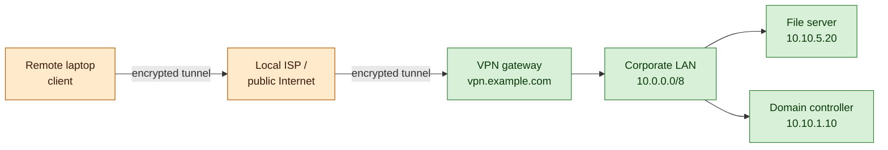
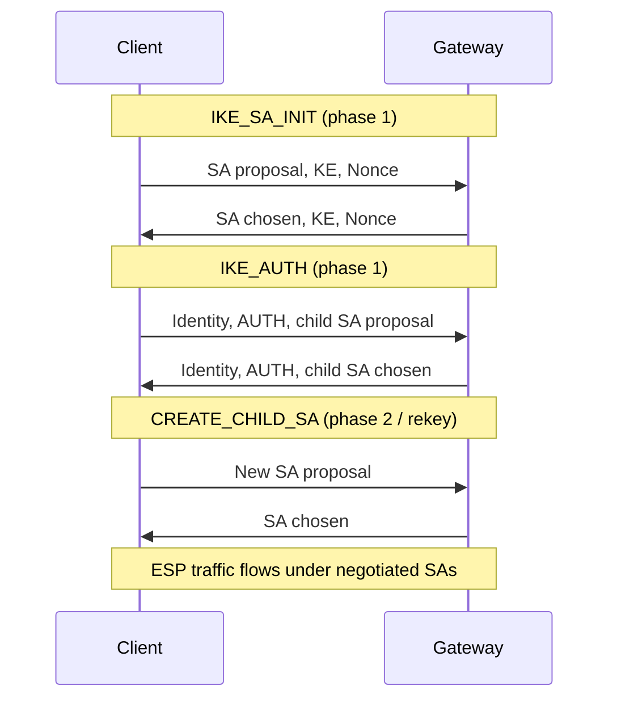

# Virtual Private Networks (VPN)

## Why this matters

A VPN is how a remote workforce reaches private resources. When a laptop sits in a hotel room, an airport lounge, or a home office, the network between that laptop and the corporate data centre is the public Internet — a network the organisation does not own, cannot inspect, and cannot trust. The VPN is the cryptographic shell that turns that hostile path into something safe enough to carry directory authentication, file shares, line-of-business applications, and management tooling.

Site-to-site VPNs play the same role between buildings. Two offices, a head office and a cloud VPC, an on-premises data centre and a SaaS provider — each pair is glued together by a tunnel that pretends the public Internet between them is a private leased line. Without those tunnels, every BGP announcement, every NetBIOS broadcast, every Active Directory replication packet would have to be either rebuilt as a public-facing service or shipped over expensive private circuits.

The flip side is unforgiving. A misconfigured VPN leaks everything. A split-tunnel configuration that was meant to keep YouTube traffic off the corporate egress can silently expose endpoints to a hostile coffee-shop network. A kill-switch that is not enforced leaves a laptop talking to production over plaintext when the tunnel drops. A DNS resolver that ignores the tunnel and queries the local ISP exposes every internal hostname the user touches. PPTP is still in production at organisations that have never read a security advisory. A weak IKEv1 pre-shared key, recovered from a configuration backup committed to GitHub, hands an attacker the keys to a site-to-site tunnel.

Examples in this lesson use the fictional `example.local` organisation. RFC numbers and protocol versions are kept current so the lesson works as a field reference.

## Core concepts

A VPN is a system of cryptographic tunnels and the policy around them. The tunnel is the easy part — every modern operating system can stand one up in minutes. The policy — what is tunnelled, what is not, what happens when it fails, who is allowed in, what they can reach once inside — is where security is won or lost.

### What a VPN actually is — encrypted tunnel, virtual private network over a public one

A virtual private network creates a private network on top of a public one by encapsulating private packets inside public packets and encrypting the inner payload. The "virtual" part is encapsulation — the original packet, with its private source and destination addresses, is wrapped in a new outer packet whose addresses route it across the Internet. The "private" part is encryption — anyone who captures the outer packet sees only ciphertext, not the inner addresses or payload.

Encapsulation is the same idea as putting a sealed envelope inside a courier bag. The courier reads the bag's label and delivers it; the recipient opens the bag and finds the envelope addressed to a private internal name. The courier never sees the inner address. A VPN works the same way at the IP layer.

### Authentication and encryption — what a VPN does at startup, what it does to every packet

At startup the two ends of the VPN authenticate each other. Authentication uses pre-shared keys (PSK), X.509 certificates, public-key fingerprints (WireGuard), or modern federated identity (SAML/OIDC for SSL VPN portals). After authentication the two ends negotiate session keys — short-lived symmetric keys derived through Diffie-Hellman or similar — that will encrypt every subsequent packet.

For every packet thereafter the VPN does three things: encrypt the inner packet so an observer cannot read it, authenticate the encrypted blob so a tamperer cannot modify it without detection, and protect against replay so a captured packet cannot be re-injected later. The exact algorithms differ between IPsec, OpenVPN, and WireGuard, but the three properties are the same.

### VPN protocols overview — comparison

| Protocol | Layer | Crypto | Status | Notes |
|---|---|---|---|---|
| IPsec (IKEv2 + ESP) | L3 | AES-GCM, ChaCha20-Poly1305, SHA-2 | Recommended | Industry standard for site-to-site and remote access |
| OpenVPN | L4-ish (over UDP/TCP) | TLS-based, AES-GCM | Recommended | Mature open-source; UDP 1194 default |
| WireGuard | L3 | Curve25519, ChaCha20-Poly1305, BLAKE2s | Recommended | Modern, minimal, in mainline Linux kernel |
| L2TP/IPsec | L2 over L3 | AES via IPsec | Acceptable | Legacy compatibility; IPsec does the real work |
| SSL/TLS VPN | L7 | TLS 1.2/1.3 | Recommended | Browser-based remote access; clientless or thick |
| PPTP | L2 | MS-CHAPv2, MPPE | Broken | Do not use; trivially decryptable |
| IKEv1 | L3 | varies | Deprecated | Use IKEv2 |

### IPsec — AH, ESP, SA, IKE; transport mode vs tunnel mode

IPsec is a suite of network-layer protocols defined in RFC 4301. Because it operates at OSI layer 3, every higher-layer protocol — TCP, UDP, ICMP, BGP, OSPF — is protected without modification.

**Authentication Header (AH, RFC 4302)** provides integrity and origin authentication for the entire packet, including the immutable parts of the IP header. AH does not encrypt. Because AH covers the IP header, it cannot survive NAT — any address rewrite breaks the signature. AH is rarely deployed in practice.

**Encapsulating Security Payload (ESP, RFC 4303)** provides confidentiality, integrity, and origin authentication for the payload. ESP is what almost every IPsec deployment actually uses, because it encrypts as well as authenticates and traverses NAT when wrapped with NAT-T (UDP 4500).

**Security Association (SA)** is a unidirectional agreement between two endpoints on which algorithms and which keys to use. Bidirectional traffic needs two SAs. The SA Database (SAD) holds the active SAs; the Security Policy Database (SPD) decides which packets get which SA.

**Internet Key Exchange (IKE)** negotiates the SAs. IKEv2 (RFC 7296) on UDP 500, with NAT-Traversal on UDP 4500, is the modern standard. IKEv1 (RFC 2409) is deprecated — keep it disabled. IKE runs in two phases: phase 1 establishes a secure channel between the two IKE daemons, phase 2 negotiates the IPsec SAs that protect the actual traffic.

IPsec has two modes. **Transport mode** protects only the payload; the original IP header stays visible. It is used host-to-host inside a trusted boundary. **Tunnel mode** wraps the entire original packet inside a new outer IP packet, hiding the inner addresses. It is used gateway-to-gateway (site-to-site VPN) and remote-access-client to gateway.

### OpenVPN — TLS-based, UDP/TCP, mature open-source

OpenVPN is a userspace VPN that uses SSL/TLS for the control channel and a custom data-channel format for the encrypted payload. It runs over UDP 1194 by default, with TCP fallback for environments that block UDP. OpenVPN's authentication model is flexible — X.509 certificates, username/password, two-factor with PAM, or any combination. AES-GCM is the modern data cipher; older builds used AES-CBC with a separate HMAC.

OpenVPN's strengths are maturity and portability. It runs on every operating system, traverses restrictive firewalls (TCP/443 fallback often gets through), and is well-understood by auditors. Its weakness is performance — userspace crypto is slower than kernel-mode IPsec or WireGuard, and the per-packet overhead is higher.

### WireGuard — modern minimal protocol, fewer lines of code, Curve25519 + ChaCha20-Poly1305

WireGuard is a deliberately minimal VPN protocol. It uses a fixed cryptographic suite (Curve25519 for key exchange, ChaCha20-Poly1305 for the data channel, BLAKE2s for hashing, HKDF for key derivation, SipHash24 for the table lookup) and refuses to negotiate alternatives. The fixed suite means there is no cipher downgrade attack and no algorithm-agility logic to audit.

The implementation is a few thousand lines of code, compared with hundreds of thousands for OpenVPN or strongSwan. The protocol is in the mainline Linux kernel since version 5.6 and runs in userspace on macOS, Windows, BSD, iOS, and Android. Authentication is by static public-key pairs — each peer knows the other's public key in advance, like SSH host keys.

WireGuard is faster than IPsec and OpenVPN in most benchmarks, simpler to configure, and easier to audit. Its limitations: it is connectionless (no built-in concept of "the tunnel is up"), it requires static public keys rather than certificates (which complicates large-scale enrolment), and it assigns IPs statically inside the tunnel (no built-in DHCP-like dynamic addressing).

### SSL/TLS VPN — browser-based remote access, no thick client

An SSL/TLS VPN runs the tunnel over HTTPS, terminating on a gateway that presents either a clientless web portal or a thick client downloaded on first use. Clientless mode is convenient for emergency access — any browser becomes a remote-access client — but is limited to web applications and a handful of legacy protocols proxied through the portal. Thick-client SSL VPN (Cisco AnyConnect, Pulse Secure, Fortinet FortiClient) wraps arbitrary IP traffic in TLS and gives the user a full network-layer VPN.

The strength of SSL VPN is firewall traversal — TCP/443 outbound is open everywhere. The weakness is that the gateway is itself an Internet-facing application and has a long history of critical vulnerabilities, so patching cadence on SSL VPN gateways is non-negotiable.

### PPTP — broken by design

PPTP (Point-to-Point Tunneling Protocol, RFC 2637) was Microsoft's first VPN protocol and is broken. The MS-CHAPv2 authentication is reducible to a single DES key crack, the MPPE encryption derives keys from the user password, and the entire protocol has been demonstrated insecure since 2012. There is no configuration that makes PPTP safe.

PPTP persists because old documentation references it, because some consumer routers still have a "VPN" tickbox that enables it, and because organisations with no security review never remove what they once installed. If PPTP appears on any port-scan output of a production network, it is a finding — disable it, replace it, and block TCP 1723 and GRE protocol 47 at the perimeter.

### VPN types — Remote Access, Site-to-Site, Cloud, Mobile, SSL

**Remote Access VPN** connects an individual user to a central network. Examples: a laptop running WireGuard or AnyConnect, a phone running the IKEv2 profile pushed by MDM. The tunnel terminates on the user's device and on a gateway in the corporate edge.

**Site-to-Site VPN** connects entire networks. The tunnel terminates on gateways at each end, and devices behind those gateways are unaware of the VPN — they see the remote site as just another route. Site-to-site is the workhorse for branch-office connectivity.

**Cloud VPN** is site-to-site VPN where one of the sites is a public cloud (AWS, Azure, GCP). The cloud provider runs a managed VPN gateway; the on-premises end runs whatever IPsec implementation the network team prefers. Cloud VPN is often the on-ramp before a customer migrates to a more sophisticated transit pattern (Direct Connect, ExpressRoute, dedicated interconnect).

**Mobile VPN** is remote-access VPN tuned for handsets — automatic reconnection across cell-tower and Wi-Fi handoffs, sleep/wake handling, low-power crypto. IKEv2 with MOBIKE (RFC 4555) is a good fit because it can switch underlying IP addresses without renegotiating SAs.

**SSL VPN** is remote-access VPN that runs over TLS, as covered above. It is sometimes treated as its own category because the deployment pattern (browser portal, web-app proxy) differs from a network-layer client VPN.

### Split-tunnel vs full-tunnel — security trade-offs

In **full-tunnel** mode every packet from the client goes through the VPN. Public Internet traffic to YouTube, software updates, public DNS — all of it travels via the corporate gateway, gets inspected by corporate egress controls, and exits to the Internet from the corporate IP space. Full-tunnel maximises visibility but saturates the corporate egress and slows the user experience.

In **split-tunnel** mode only traffic destined for corporate networks goes through the VPN; everything else goes out the local Internet connection directly. Split-tunnel is faster and cheaper but exposes the endpoint to the local network — a hostile Wi-Fi can interact with the laptop directly, the corporate egress controls cannot inspect general Internet traffic, and DNS or routing tricks can leak corporate traffic to the local link.

The trade-off is performance versus visibility. Most modern enterprises use split-tunnel for general staff with a tightly defined corporate route table, and full-tunnel for high-sensitivity groups (finance, executives, anyone touching regulated data).

### Kill-switch — preventing leaks when the tunnel drops

A kill-switch is a local firewall rule, enforced by the VPN client or the operating system, that blocks all non-tunnel traffic if the VPN is not up. If the tunnel drops because the network changed, because the gateway restarted, or because the client crashed, the kill-switch prevents the laptop from suddenly talking to corporate destinations over the public Internet in plaintext — or worse, leaking the user's identity to an external service that should only ever see corporate egress addresses.

A kill-switch only works if it is enforced at the OS firewall, not as a hint inside the VPN client. MDM (Intune, Jamf) is the common way to deploy kill-switch policy on laptops and phones.

### DNS leakage — why DNS over the tunnel matters

DNS leakage happens when the VPN tunnel is up but DNS queries go to the local resolver (the coffee-shop ISP, the home router) instead of the corporate resolver inside the tunnel. The user sees their internal hostnames resolve correctly because Windows or macOS falls back to the local resolver, but every internal hostname they touch is now logged at the local ISP — and split-DNS configurations can route traffic to the wrong endpoint.

The fix is to push the corporate DNS server into the VPN profile, force all DNS queries through the tunnel, and verify with a leak test (browser-based services like dnsleaktest.com) that the user's resolved DNS server is the corporate one. WireGuard and modern IPsec clients support DNS push and DNS interception; older clients sometimes need an explicit firewall rule blocking outbound UDP 53 outside the tunnel.

### Always-on VPN — modern enterprise pattern

Always-on VPN means the VPN client connects automatically the moment the device has a network, before the user logs in, and stays connected for the life of the session. It is the modern default for managed laptops and phones. Always-on VPN combined with a kill-switch and corporate DNS push gives the device the same security posture wherever it is — no user action, no choice to skip the VPN "just for this network", no quietly going around it.

Microsoft's Always On VPN, Cisco AnyConnect's Trusted Network Detection, and any modern MDM-pushed WireGuard or IKEv2 profile can implement this pattern.

## VPN tunnel diagram

The first diagram shows a remote-access VPN session: the client crosses the public Internet to a gateway and reaches a corporate LAN; the dashed boundary is where encryption ends.



The second diagram is the IKEv2 phase 1 / phase 2 handshake that brings the IPsec tunnel up.



## Remote Access vs Site-to-Site comparison

| Aspect | Remote Access VPN | Site-to-Site VPN |
|---|---|---|
| Functionality | Individual user reaches a central network from anywhere | Whole networks linked across geographies |
| Purpose | Per-user connectivity for remote work | Network-to-network connectivity for offices, data centres, cloud VPCs |
| Termination | Client software on a laptop or phone, gateway at corporate edge | Gateway-to-gateway, transparent to end devices |
| Authentication | Per-user (cert, MFA, password) | Per-site (cert or PSK on the gateways) |
| Routing | Client picks up routes via the tunnel; split or full tunnel | Static routes or dynamic routing (BGP over IPsec) |
| Advantages | Cheap, scalable, lets staff work anywhere; granular per-user policy | Stable, always-on, lower per-packet overhead, transparent to applications |
| Disadvantages | Client lifecycle management, per-user identity overhead, endpoint risk | Specialist setup, harder to debug, fragile under address changes |
| Optimal use | Mobile workforce, contractors, BYOD | Branch offices, cloud VPC interconnect, partner networks |

The two patterns are complementary. A typical enterprise runs both — site-to-site to glue the topology together, remote-access to plug users into it.

## Hands-on / practice

Five exercises that build an intuition for VPN behaviour. None require commercial equipment.

### 1. Set up a WireGuard server and connect a client

On a Linux VM, install `wireguard-tools`, generate keys, and bring up a `wg0` interface.

```bash
# Server (10.10.0.1/24)
umask 077
wg genkey | tee server.key | wg pubkey > server.pub
cat <<EOF > /etc/wireguard/wg0.conf
[Interface]
Address = 10.10.0.1/24
ListenPort = 51820
PrivateKey = $(cat server.key)
[Peer]
PublicKey = <client public key>
AllowedIPs = 10.10.0.2/32
EOF
wg-quick up wg0
```

Configure a peer client with `AllowedIPs = 10.10.0.0/24` and verify with `wg show` that the handshake completes. Answer: how would you change `AllowedIPs` to make this a full-tunnel client? What does `PersistentKeepalive` do, and when do you need it?

### 2. Configure IPsec site-to-site between two pfSense (or OPNsense) firewalls

Stand up two pfSense VMs on different subnets and bring up an IKEv2/ESP tunnel between them. Use AES-256-GCM, SHA-256, DH group 14 minimum, certificate authentication preferred over PSK. Verify the tunnel with `Status > IPsec` and ping a host on the far side.

Answer: what is the difference between phase 1 and phase 2 lifetimes? What is dead-peer detection (DPD) doing, and what happens if you disable it?

### 3. Verify a tunnel with `tcpdump` showing ESP/UDP-encapsulated traffic

While the IPsec tunnel from exercise 2 is up, capture traffic on the WAN interface of one gateway and observe ESP packets (protocol 50) or UDP-encapsulated ESP on UDP 4500 if NAT-T is in use.

```bash
tcpdump -i eth0 -n 'esp or (udp port 4500) or (udp port 500)'
```

Answer: which packets are ESP and which are IKE? Can you decrypt them without the keys? What does the absence of UDP 4500 traffic tell you about NAT on the path?

### 4. Drop the tunnel and confirm kill-switch behaviour

On a client laptop with kill-switch enforced, manually disconnect the VPN (or block the gateway IP at the local firewall) and observe what happens to other network traffic.

```bash
# Linux example with nftables enforcing the kill-switch
nft add rule inet filter output oifname != "wg0" ip daddr 10.0.0.0/8 drop
```

Disconnect `wg0` and try to reach `10.10.5.20` — the connection should be refused locally rather than escaping out the default route. Answer: what would the leak look like without the kill-switch? Does your DNS still resolve `internal.example.local` after the tunnel drops, and what would that tell you?

### 5. Configure DNS-over-tunnel and verify no leakage with dnsleaktest.com

In your VPN client (WireGuard `DNS = 10.10.0.53` or AnyConnect profile), set the corporate DNS resolver. Connect, then visit `dnsleaktest.com` and run the extended test.

Answer: which DNS servers does the test report? If the local ISP's resolver still appears, what is going wrong — is it the OS resolver order, IPv6 leaking outside the tunnel, or a misconfigured split-tunnel route? Re-test after you fix it. Document the fix as a one-page runbook entry — this is the artefact that helps the next engineer.

## Worked example — `example.local` rolls out modern remote-work VPN

`example.local` has 600 staff: roughly 450 knowledge workers on laptops, 100 contractors with BYOD, and 50 finance and legal staff with stricter requirements. The on-premises data centre runs Active Directory, file shares, and a handful of legacy fat-client applications. A new cloud VPC in AWS hosts the modern application stack. Pre-pandemic the remote-work pattern was an old SSL VPN portal with a thick client; post-pandemic the security team rebuilds the entire VPN estate.

**Strategy.** WireGuard always-on for laptops, OpenVPN for the legacy fat-client applications that misbehave on WireGuard's static-IP model, IPsec site-to-site to the cloud VPC, kill-switch enforced via MDM (Intune for Windows, Jamf for macOS).

**Laptop VPN.** Every managed laptop receives a WireGuard configuration through Intune. The configuration lists the corporate gateway (`vpn.example.com`), pushes the corporate DNS resolver (`10.10.0.53`), routes the corporate CIDRs (`10.0.0.0/8`, `172.20.0.0/16`) through the tunnel, and leaves general Internet traffic on the local link — split-tunnel for the knowledge-worker population. The Intune policy enforces the kill-switch by adding a Windows Filtering Platform rule that blocks outbound traffic to corporate CIDRs unless the WireGuard interface is up. Always-on is enabled via the WireGuard "always on" toggle and a Group Policy that prevents users from disabling it.

**Finance and legal full-tunnel.** The same WireGuard profile is published with `AllowedIPs = 0.0.0.0/0, ::/0` for the `EXAMPLE\finance` and `EXAMPLE\legal` AD groups. Their traffic exits through the corporate egress firewall, gets inspected by the next-gen firewall and the proxy, and is logged for compliance. The user experience is slightly slower; the visibility for the SOC is dramatically better.

**Legacy applications.** Two finance applications use a fat client that hard-codes a server IP and an old AD authentication path that does not survive WireGuard's static-route model in some failure scenarios. The team stands up an OpenVPN gateway, with AES-256-GCM and certificate authentication, and pushes the OpenVPN profile to the laptops that need those applications. OpenVPN runs on UDP 1194 with TCP/443 fallback; both ports are opened on the perimeter to the OpenVPN gateway only.

**Site-to-site to the cloud VPC.** The on-premises perimeter pair of pfSense firewalls forms an IKEv2 tunnel to two AWS VPN gateways (one per AZ for redundancy). The IKEv2 SAs use certificate authentication issued by the internal CA, AES-256-GCM, SHA-384, DH group 19, with PFS rekeying every hour. BGP runs over the tunnel for dynamic routing, so a gateway failure flips traffic to the surviving tunnel without manual intervention.

**Decommissioning PPTP.** A configuration audit finds a small business unit running an old PPTP server for a vendor's site survey laptops. The team migrates the vendor to WireGuard, gives them a one-month overlap, and at the end of that month removes the PPTP server, blocks TCP 1723 and GRE protocol 47 at the perimeter, and closes the audit finding.

**DNS leak testing.** Every laptop runs an automated test on first VPN connection that queries an internal canary hostname plus an external DNS leak test endpoint; the result is logged to the SOC. The first run flags 12 laptops where IPv6 was leaking around the IPv4-only WireGuard tunnel. The fix — disable IPv6 on the WireGuard interface or route IPv6 into the tunnel — is rolled into the Intune profile, and the canary verifies the fix on the next connection.

**Verification.** Three months in, the metrics: 100% of laptop connections come from WireGuard or OpenVPN (no PPTP, no rogue SSL VPN portals); 100% of connections have the kill-switch enforced; DNS leak tests pass on every device; site-to-site to AWS has 99.97% availability across both tunnels; the SOC has visibility into finance and legal egress that it did not have before. The programme is unglamorous, but the security posture moved measurably.

## Troubleshooting and pitfalls

- **PPTP still in use.** Some legacy "VPN" tickbox on a consumer router or a forgotten Windows server keeps PPTP alive. Scan for TCP 1723 and GRE protocol 47, decommission, and block at the perimeter.
- **Certificate expiry breaking SSL VPN.** The TLS certificate on the SSL VPN gateway is the thing the entire remote-access estate depends on. Expiry locks everyone out at once. Monitor 30/14/7 days ahead and automate renewal.
- **MTU/MSS clamping.** Encapsulation adds bytes; the inner packet plus IPsec/WireGuard overhead can exceed the path MTU. Symptoms are large transfers stalling while small ones work. Lower the tunnel MTU (typically 1380-1420 bytes) or clamp TCP MSS at the gateway.
- **Asymmetric routing.** Traffic enters via the VPN tunnel but tries to leave via the default Internet gateway, breaking stateful firewalls. Verify routes on both ends and on any intermediate router.
- **Split-tunnel exposing endpoints to local network.** A laptop in split-tunnel mode is directly on a hostile coffee-shop network for everything outside the corporate route. Use full-tunnel for high-risk groups, or harden the endpoint firewall to block lateral inbound.
- **Full-tunnel saturating the corporate egress.** If the entire workforce full-tunnels through one egress pipe, video calls, software updates, and SaaS application traffic all compete. Capacity-plan the egress, or split-tunnel non-corporate traffic.
- **DNS leak with split-DNS misconfigured.** Internal names need to resolve via internal DNS, public names via public DNS, with the split-tunnel routing matching the DNS view. Misalignment leaks names or sends traffic to the wrong endpoint.
- **Weak pre-shared keys.** A six-character PSK on an IKEv2 site-to-site tunnel is recoverable in seconds offline. Use long random PSKs (32+ characters) or move to certificates.
- **WireGuard static-IP requirement misunderstood.** WireGuard's `AllowedIPs` doubles as the routing decision and the cryptographic destination check. Operators expecting DHCP-style dynamic addressing get surprised. Plan a per-peer static IP allocation.
- **IKEv1 still allowed.** IKEv1 main mode and aggressive mode have known weaknesses (offline PSK recovery in aggressive mode). Disable IKEv1 entirely; force IKEv2.
- **NAT traversal issues.** Without NAT-T (UDP 4500), IPsec ESP packets get dropped by NAT devices. Symptoms: tunnel comes up, no traffic flows. Enable NAT-T or move to UDP-encapsulated ESP.
- **AH used through NAT.** AH cannot survive NAT — it signs the IP header. Use ESP unless you are inside a routed environment with no NAT, which is rare.
- **Kill-switch only enforced inside the VPN client.** A kill-switch implemented as a hint inside the VPN application can be bypassed by killing the application. Enforce at the OS firewall via MDM.
- **IPv6 leaks around an IPv4-only tunnel.** A tunnel that only routes IPv4 leaves IPv6 going out the local link. Either disable IPv6 on the tunnel interface or route IPv6 into the tunnel.
- **Forgotten always-on toggle.** A user who can disable the VPN "for this Wi-Fi" will. Lock the toggle via MDM/Group Policy.
- **VPN gateway as Internet-facing trophy.** SSL VPN, IPsec, and WireGuard gateways are first-class Internet-facing services and have a long CVE history. Patch on a hardware-vendor cadence, monitor authentication failures, and put the management plane on a separate network.
- **Identity not federated.** A VPN that has its own user database and password drift from corporate AD/IdP is one credential rotation cycle away from being out of date. Federate to SAML/OIDC.
- **Logging only on the gateway.** The VPN gateway sees handshake and connection events but not what flows inside the tunnel. Pair gateway logs with endpoint and corporate egress logs to get the full picture.
- **Backup configurations leaking PSKs and certs.** A pfSense or strongSwan configuration export dropped into a Git repository ships PSKs and private keys with it. Treat configuration backups as secrets.

## Key takeaways

- A VPN is encapsulation plus encryption — a private tunnel built on top of a public network. The mechanics are well understood; the policy around the tunnel is where security is won or lost.
- IPsec (IKEv2 + ESP), OpenVPN, and WireGuard are the modern protocol choices. PPTP is broken; IKEv1 is deprecated; L2TP/IPsec is acceptable only for legacy compatibility.
- IPsec uses AH for authentication-only (rare), ESP for encryption plus authentication (the default), SA for the per-direction agreement, and IKE for key negotiation. Tunnel mode for site-to-site, transport mode for host-to-host.
- WireGuard is the modern default for new remote-access deployments — small code base, fixed cipher suite, kernel-mode performance, simple configuration.
- OpenVPN remains the right answer where SSL/TLS-style authentication and TCP/443 fallback are needed, especially for legacy clients.
- SSL VPN is the right answer for browser-based emergency access; thick-client SSL VPN like AnyConnect is a full network-layer VPN over TLS.
- Remote-access and site-to-site VPN serve different purposes — per-user mobility versus network-to-network plumbing — and most enterprises run both.
- Split-tunnel is faster but exposes the endpoint; full-tunnel is slower but gives the SOC visibility. Pick based on the population and the threat model.
- Kill-switch enforcement at the OS firewall, always-on configuration via MDM, and DNS-over-tunnel are the three controls that make a remote-access VPN actually safe in practice.
- DNS leakage is the most common silent failure — push the corporate resolver, force DNS through the tunnel, verify with a leak test on every device.
- VPN gateways are Internet-facing applications. Patch them, monitor them, and put their management plane on a separate network.
- The security work is unglamorous: inventory every VPN, retire PPTP, enforce IKEv2, federate identity, push corporate DNS, enforce always-on, and verify with a periodic re-scan.

Done well, the VPN is invisible to users and dependable for the SOC. Done badly, it is the single biggest source of leaked credentials, leaked traffic, and Internet-exposed administrative interfaces in the estate.

## References

- RFC 4301 — *Security Architecture for the Internet Protocol* (IPsec) — [datatracker.ietf.org/doc/html/rfc4301](https://datatracker.ietf.org/doc/html/rfc4301)
- RFC 4302 — *IP Authentication Header* (AH) — [datatracker.ietf.org/doc/html/rfc4302](https://datatracker.ietf.org/doc/html/rfc4302)
- RFC 4303 — *IP Encapsulating Security Payload* (ESP) — [datatracker.ietf.org/doc/html/rfc4303](https://datatracker.ietf.org/doc/html/rfc4303)
- RFC 7296 — *Internet Key Exchange Protocol Version 2 (IKEv2)* — [datatracker.ietf.org/doc/html/rfc7296](https://datatracker.ietf.org/doc/html/rfc7296)
- RFC 4555 — *IKEv2 Mobility and Multihoming Protocol (MOBIKE)* — [datatracker.ietf.org/doc/html/rfc4555](https://datatracker.ietf.org/doc/html/rfc4555)
- WireGuard whitepaper — *WireGuard: Next Generation Kernel Network Tunnel* — [wireguard.com/papers/wireguard.pdf](https://www.wireguard.com/papers/wireguard.pdf)
- OpenVPN documentation — [openvpn.net/community-resources/](https://openvpn.net/community-resources/)
- NIST SP 800-77 Rev. 1 — *Guide to IPsec VPNs* — [csrc.nist.gov/publications/detail/sp/800-77/rev-1/final](https://csrc.nist.gov/publications/detail/sp/800-77/rev-1/final)
- NIST SP 800-113 — *Guide to SSL VPNs* — [csrc.nist.gov/publications/detail/sp/800-113/final](https://csrc.nist.gov/publications/detail/sp/800-113/final)
- CIS Benchmarks — VPN-related sections in network device benchmarks — [cisecurity.org/cis-benchmarks](https://www.cisecurity.org/cis-benchmarks)
- Related reading: [Secure Network Protocols](./secure-protocols.md) · [Secure Network Design](./secure-network-design.md) · [Wireless Security](./wireless-security.md) · [OSI Model](../foundation/osi-model.md) · [IP Addressing](../foundation/ip-addressing.md) · [Network Devices](../foundation/network-devices.md) · [Cryptography Basics](../../general-security/cryptography/cryptography-basics.md) · [PKI](../../general-security/cryptography/pki.md)
