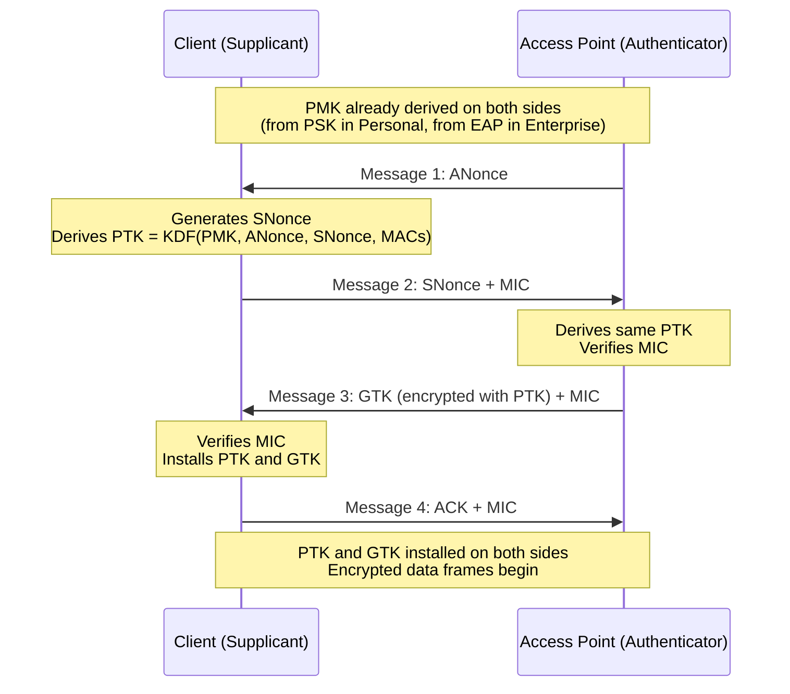

# Wireless Network Security

## Why this matters

Wireless is the default way humans attach to enterprise networks. Laptops, phones, tablets, IoT sensors, conference-room displays, and manufacturing floor devices almost never plug into a wall any more. The radio signal does not stop at the exterior wall of the building: the same RF energy that reaches a desk on the third floor also reaches the car park, the pavement, and the apartment block across the road. An attacker does not need to bypass a door badge, a security guard, or a perimeter firewall to start probing the authentication protocol — they only need to be within antenna range.

That changes the threat model in three specific ways. First, every frame that leaves an access point (AP) is observable by any adversary with a compatible radio, so the only meaningful control on confidentiality is the cryptographic protocol itself. Second, an attacker can stand up a rogue AP advertising the same SSID as the corporate network and trick clients into associating with it, so server-side authentication is as important as client-side. Third, the RF characteristics of the site — walls, interference, channel congestion, neighbour APs — shape both legitimate user experience and attacker opportunity, so wireless security is not only a protocol question but an antenna-and-site-survey question too.

This lesson covers the protocol generations (WEP, WPA, WPA2, WPA3), the authentication frameworks that sit on top (PSK, SAE, 802.1X with RADIUS, the EAP family), the convenience protocols that historically weakened wireless deployments (WPS, captive portals), and the physical-layer practices — site surveys, heat maps, Wi-Fi analysers, channel overlays, WAP placement, and controller hardening — that determine whether the protocol layer actually delivers what it promises. Examples use the fictional `example.local` organisation and the `EXAMPLE\` domain; port numbers, RFC references, and algorithm names are given so that the lesson doubles as a field reference.

## Core concepts

Wireless security is a layered problem. The cryptographic primitive (RC4, AES, GCMP) sits at the bottom. A key establishment mechanism (PSK, SAE, 4-way handshake) negotiates session keys above it. An authentication framework (EAP, 802.1X, RADIUS) decides who is allowed to reach the handshake in the first place. RF design decides where the signal goes and where rogue signals could appear. All four layers have to be correct; any single weak layer collapses the rest.

### Protocol generations — WEP, WPA, WPA2, WPA3

The history of Wi-Fi security is a history of broken protocols being replaced as the community learns what the last generation got wrong. Understanding the flaws in each generation is not historical curiosity — the older protocols are still running on consumer kit, older enterprise APs, and legacy industrial devices, and every one of them is a liability.

**WEP (Wired Equivalent Privacy)** was the first Wi-Fi encryption standard, shipped with 802.11-1997. WEP uses the RC4 stream cipher with either a 64-bit or 128-bit key, where the effective key is 40 or 104 bits combined with a 24-bit initialization vector (IV) transmitted in the clear in every frame header. The 24-bit IV space is only 16,777,216 values, which a busy network exhausts in hours; once IVs repeat, statistical attacks against the underlying RC4 key become trivial. Tools such as `aircrack-ng` can recover a 128-bit WEP key from a few minutes of captured traffic on an active network. WEP offers neither confidentiality nor integrity in any meaningful modern sense and has no place on any network outside a teaching lab.

**WPA (Wi-Fi Protected Access)** was released in 2003 as a transitional fix while WPA2 was being finalised. WPA kept RC4 as the cipher but wrapped it in the **Temporal Key Integrity Protocol (TKIP)**, which generates a fresh per-packet key from a base key plus a sequence counter and adds the **Michael** message integrity code to detect tampering. TKIP was an improvement but was designed to run on existing WEP-era hardware, so the underlying cipher was still RC4 and practical attacks against TKIP were published within a few years. WPA also introduced EAP-based authentication as an alternative to pre-shared keys. Like WEP, WPA is deprecated; both are listed in Security+ historical notes but should not be deployed.

**WPA2** (IEEE 802.11i, 2004) replaced RC4/TKIP with **AES** in **CCMP (Counter Mode with Cipher Block Chaining-Message Authentication Code Protocol)**. AES-CCMP provides both confidentiality (AES counter mode) and integrity (CBC-MAC), and AES itself has withstood two decades of cryptanalytic attention without practical weakening. WPA2 comes in two flavours: **WPA2-Personal** (also called WPA2-PSK) uses a pre-shared passphrase, typically 8 to 63 ASCII characters, combined with the SSID to derive the pairwise master key; **WPA2-Enterprise** replaces the PSK with 802.1X authentication against a central server. WPA2 is still the most widely deployed wireless security protocol on the planet, but it has two important weaknesses: the 4-way handshake can be captured and brute-forced offline against the PSK, and it does not provide forward secrecy — a compromised PSK lets an attacker decrypt every past and future session recorded on that network. The KRACK vulnerability (2017) showed that even the handshake itself could be forced to reinstall keys under certain conditions, though this has been patched in client stacks.

**WPA3** (released 2018) addresses the WPA2 weaknesses. WPA3-Personal replaces the PSK-plus-4-way-handshake with **Simultaneous Authentication of Equals (SAE)**, a Dragonfly-based key exchange that is resistant to offline dictionary attacks and provides forward secrecy — capturing the handshake no longer gives an attacker anything useful. WPA3-Enterprise adds a 192-bit security mode with modern primitives:

- **Authenticated encryption:** 256-bit Galois/Counter Mode Protocol (GCMP-256)
- **Key derivation and confirmation:** 384-bit HMAC with SHA-384
- **Key establishment and authentication:** Elliptic Curve Diffie-Hellman (ECDH) and ECDSA over a 384-bit curve
- **Robust management frame protection:** 256-bit Broadcast/Multicast Integrity Protocol Galois Message Authentication Code (BIP-GMAC-256)

WPA3 also mandates Protected Management Frames (PMF), which prevents the deauthentication and disassociation attacks that are trivially easy against WPA2. WPA3 Enhanced Open provides opportunistic encryption on open networks — no password, but still AES protection against passive eavesdropping — replacing the completely unencrypted "guest Wi-Fi" of the WPA2 era.

### Authentication frameworks — PSK, SAE, and the 4-way handshake

Wi-Fi authentication separates into two worlds. **Personal mode** uses a shared secret known to everyone on the network. **Enterprise mode** uses per-user identities authenticated against a central server. Personal is easy; enterprise is secure.

**PSK (Pre-Shared Key)** has one password for the whole network. The AP and client both know it; the password plus the SSID is fed through PBKDF2 to produce the **Pairwise Master Key (PMK)**. A 4-way handshake then derives a per-session **Pairwise Transient Key (PTK)** from the PMK and two random nonces. PSK is fine for a home network; in any setting where more than a handful of people know the password, PSK becomes a liability because anyone who ever knew the password can decrypt traffic if they captured the handshake, and there is no way to revoke a single person's access without changing the key for everyone.

**SAE (Simultaneous Authentication of Equals)**, specified in RFC 7664, is the WPA3-Personal replacement for PSK. SAE uses the Dragonfly key exchange — a password-authenticated key agreement where both parties prove knowledge of the password without ever transmitting it or a derivative of it that an attacker could brute-force offline. Because SAE performs a fresh elliptic-curve Diffie-Hellman exchange for every session, each session has independent keys: compromise of the password does not decrypt past sessions, and a captured SAE exchange yields nothing useful to an offline attacker. SAE is a peer-to-peer protocol, so it does not require a centralised authentication server and fits naturally in home and small-office deployments. RFC 7664 recommends setting the security parameter `k` to at least 40 to prevent timing side channels.

**The 4-way handshake** is the key-confirmation dance that runs after the authentication step in WPA2 (and, with modifications, in WPA3). It takes a PMK that both sides already know — derived from the PSK in Personal mode, or from the EAP exchange in Enterprise mode — and produces a fresh session key (the PTK) plus a group key (the GTK) for broadcast traffic.

The four messages are:

1. **Message 1 (AP to Client):** The AP generates a random nonce (**ANonce**) and sends it to the client along with a reference to the PMK.
2. **Message 2 (Client to AP):** The client generates its own nonce (**SNonce**), derives the PTK from `PMK + ANonce + SNonce + MAC addresses`, and sends SNonce back with a **Message Integrity Code (MIC)** computed under the new PTK. The MIC proves the client derived the same PTK.
3. **Message 3 (AP to Client):** The AP derives the same PTK, verifies the client's MIC, and sends the **Group Temporal Key (GTK)** encrypted under the PTK along with its own MIC. The GTK is used for broadcast and multicast frames.
4. **Message 4 (Client to AP):** The client confirms installation of the keys with a final MIC.

After Message 4, both sides install the PTK and the GTK and begin encrypting data frames. The entire exchange usually completes in a few hundred milliseconds.

The security of the handshake rests on the secrecy of the PMK. In WPA2-PSK, the PMK is derived deterministically from the passphrase and SSID, so capturing the handshake gives an attacker everything needed to mount an offline brute-force attack against the passphrase. Tools such as `hashcat` and `aircrack-ng` do exactly this, and a weak passphrase (say, fewer than 12 characters or a dictionary word) falls in minutes to hours on modern GPUs. WPA3-SAE eliminates this attack by never producing an offline-crackable derivative of the password.

### EAP family — EAP, PEAP, EAP-FAST, EAP-TLS, EAP-TTLS

In WPA2-Enterprise and WPA3-Enterprise, the PMK is not derived from a shared passphrase — it is delivered to the client by an authentication server after the client has proven its identity through an **EAP (Extensible Authentication Protocol)** exchange. EAP is a framework, defined in RFC 3748, for passing authentication messages between a client (supplicant) and a server (authentication server) through any transport. On Wi-Fi, the transport is 802.1X; on wired networks, it is also 802.1X; in dial-up and PPP, EAP rides on PPP.

EAP itself is not an authentication method — it is the envelope. The actual authentication happens in one of many EAP methods, each with different trade-offs between security and deployment complexity.

**PEAP (Protected EAP)** wraps an inner EAP exchange in a TLS tunnel. The server authenticates to the client with a certificate, establishing the TLS tunnel, and then the client authenticates inside the tunnel — usually with a username and password via MS-CHAPv2 (PEAP-MSCHAPv2) or via EAP-GTC. PEAP is a joint Cisco/Microsoft/RSA specification and is widely supported. Its main appeal is that clients only need to trust the server certificate; they do not need their own certificates. The main weakness is that it is only as strong as the inner method — MS-CHAPv2 has known weaknesses — and it is only safe if the client is strictly configured to validate the server certificate. A misconfigured client that accepts any certificate lets an attacker with a rogue AP and any certificate harvest credentials.

**EAP-FAST (EAP Flexible Authentication via Secure Tunneling)**, RFC 4851, was proposed by Cisco as a replacement for the broken LEAP protocol. Like PEAP, EAP-FAST establishes a TLS tunnel before running inner authentication, but instead of a server certificate it uses a **Protected Access Credential (PAC)** — a pre-provisioned shared secret — to establish the tunnel. This removes the certificate-lifecycle burden but shifts the problem to PAC provisioning, which must itself be done securely.

**EAP-TLS**, RFC 5216, is the strongest common EAP method. Both server and client authenticate to each other with X.509 certificates; there are no passwords in the exchange at all. An attacker mounting a rogue AP attack cannot complete the mutual authentication because they do not have a valid client certificate, and an attacker who captures the exchange cannot brute-force it because there is nothing to brute-force. EAP-TLS is the gold standard for WPA2/WPA3-Enterprise and is increasingly the default in zero-trust network designs. The cost is certificate lifecycle management — every client device needs a certificate, and those certificates must be issued, renewed, and revoked. Modern enterprise MDM platforms (Intune, Jamf) have automated most of this.

**EAP-TTLS (Tunneled TLS)** is the middle path. The server authenticates to the client with a certificate, establishing a TLS tunnel; the client then authenticates inside the tunnel using any legacy method — PAP, CHAP, MS-CHAP, MS-CHAPv2. Client certificates are supported but not required, which makes EAP-TTLS easier to deploy than EAP-TLS when rolling out certificates to every client is impractical. The security properties are similar to PEAP: the tunnel protects the inner exchange from eavesdropping and MITM, so long as the client is configured to validate the server certificate strictly.

The pragmatic ordering for new deployments: **EAP-TLS** where certificate management is feasible, **PEAP-MSCHAPv2** or **EAP-TTLS-MSCHAPv2** where it is not, **EAP-FAST** where Cisco infrastructure recommends it, and never LEAP or bare EAP-MD5.

### 802.1X and RADIUS federation — supplicant, authenticator, authentication server

**IEEE 802.1X** is the port-based authentication standard that carries EAP messages between a client and an authentication server through a network device (the AP or a switch). It defines three roles:

- **Supplicant:** The client device requesting network access. On Wi-Fi this is the laptop, phone, or IoT device running a WPA2/WPA3-Enterprise profile.
- **Authenticator:** The network device that controls the port — the wireless access point, or a wired edge switch. It blocks all non-EAP traffic on the port until the authentication succeeds, then opens the port for normal traffic.
- **Authentication server:** The server that actually validates credentials. This is almost always a **RADIUS (Remote Authentication Dial-In User Service)** server today, usually backed by Active Directory, LDAP, or a certificate authority for EAP-TLS.

The flow on Wi-Fi is: the supplicant associates with the AP, which holds the port in a blocked state. The AP sends EAP-over-LAN (EAPoL) frames to the supplicant, which replies with its identity. The AP encapsulates the EAP messages in RADIUS packets and forwards them to the RADIUS server on the wired side. The RADIUS server runs the chosen EAP method against its identity store and eventually returns either Access-Accept (with a derived PMK the AP can use for the 4-way handshake) or Access-Reject. The AP either unblocks the port or keeps the client out.

**RADIUS federation** extends this model across administrative domains. The canonical example is **eduroam** — the education roaming service that lets a student from any participating university authenticate at any other participating university's Wi-Fi using their home credentials. A chain of RADIUS proxies routes the authentication request from the visited institution back to the home institution through a tiered federation. Because the credentials traverse multiple networks, eduroam mandates EAP methods that use certificates and tunnels (EAP-TTLS, PEAP, or EAP-TLS) so that intermediate RADIUS servers never see the actual credential material. Similar federations exist in healthcare (ScienceDMZ's identity federations), research, and some large enterprise conglomerates.

### Convenience protocols — WPS and captive portals

Two features were added to Wi-Fi to make it easier for non-technical users, and both became security liabilities.

**WPS (Wi-Fi Protected Setup)** was designed to let home users join a Wi-Fi network by pressing a button on the router or entering an 8-digit PIN. The PIN method was the disaster. The WPS protocol splits the 8-digit PIN into two halves that can be brute-forced independently, reducing the effective search space from 10^8 to 10^4 + 10^3 (the last digit is a checksum). A tool called **Reaver** can recover a WPS PIN in a few hours, and recovering the PIN yields the full WPA/WPA2 passphrase. Every Wi-Fi Alliance certified router had WPS enabled by default for years, which meant that enabling WPA2 with a strong passphrase on such a router still left the network vulnerable. The only effective mitigation is to disable WPS entirely. The Wi-Fi Alliance replaced WPS with **Wi-Fi Easy Connect** (also called DPP, Device Provisioning Protocol), which uses QR codes and public-key cryptography to provision devices without the PIN weakness.

**Captive portals** are the "accept the terms of service and click Connect" pages that hotels, coffee shops, and airports use to gate Wi-Fi access. Technically, a captive portal is an HTTP-level interception: the AP allows DHCP, DNS, and HTTP traffic but redirects every HTTP request to a local authentication page until the user completes whatever check the operator requires (accepting terms, entering a room number, paying a fee, providing an email address). Captive portals are not an encryption mechanism — the underlying Wi-Fi is often completely open, meaning anyone on the same network can sniff traffic. Even when the captive portal itself is over HTTPS, the lack of link-layer encryption means a malicious actor on the same network can intercept traffic to sites that do not enforce HTTPS. WPA3 Enhanced Open provides opportunistic link-layer encryption that sits underneath the captive portal and closes this gap without requiring user credentials.

### Physical and RF design — site surveys, heat maps, analysers, channel overlays, placement

Wireless security is not purely a protocol problem. The radio signal is the attack surface, and how that signal is shaped — where it reaches, where competing signals appear, how strong it is at each point — determines both user experience and attacker opportunity.

**Site surveys** are the systematic mapping of RF conditions in a facility. A **predictive survey** uses software to model signal propagation based on the floor plan, wall materials, and planned AP positions. An **on-site survey** (also called a validation or passive survey) measures actual signal strength after deployment, mapping the result against the prediction. Surveys produce concrete outputs: AP placement, channel assignments, power levels, antenna types, and expected coverage. They also detect rogue APs — unauthorised devices broadcasting an SSID on the corporate network — which is itself a recurring security incident in large estates.

**Heat maps** are the visualisation layer on top of a survey. A heat map overlays a floor plan with a graded colour scale showing received signal strength indicator (RSSI), signal-to-noise ratio (SNR), or throughput at each point. Weak-signal zones show up as holes that need another AP; strong-signal zones in unexpected places (car parks, neighbouring offices) show where attackers could comfortably sit and probe.

**Wi-Fi analysers** are the instruments that produce the measurements. A Wi-Fi analyser is an RF device — sometimes a dedicated hardware tool, sometimes a laptop with a compatible card and software such as Ekahau, NetSpot, or WiFi Explorer — that reports signal strength, channel occupation, interfering sources, beacon rates, and nearby SSIDs. Analysers are also the primary tool for detecting rogue APs and misconfigured neighbours.

**Channel overlays** address the fact that Wi-Fi channels overlap. In the 2.4 GHz band, 11 channels are defined in most regulatory domains, each 20 MHz wide, but they are spaced only 5 MHz apart. Only channels 1, 6, and 11 are genuinely non-overlapping in a standard 20 MHz deployment; any other channel assignment causes co-channel interference that degrades throughput for everyone. The 5 GHz band has far more non-overlapping channels (roughly 24, depending on regulatory domain and whether DFS channels are in use), which is why most modern enterprise deployments push clients onto 5 GHz where possible. The 6 GHz band (Wi-Fi 6E) adds another huge block of clean spectrum but is only usable by WPA3-capable clients.

**WAP placement** balances RF coverage against power and wired-network availability. An AP needs Ethernet (typically PoE) and an unobstructed mounting point; optimal RF coverage might put the AP in the middle of the ceiling, but the Ethernet drop is only available in the corridor. Mesh Wi-Fi extenders relay RF between APs without a wired uplink; they are convenient for home and small-office use but halve available throughput on every hop, so they are rarely appropriate for enterprise. Outside of pure coverage, placement also affects security: an AP mounted near an exterior wall extends usable signal into the car park and street, giving attackers a comfortable working position.

### Controller and AP hardening

Enterprise Wi-Fi typically runs under a **wireless LAN controller (WLC)** that manages a fleet of APs centrally. The controller is an attractive target: one compromised controller is every AP and every associated client. Hardening it matters.

- **Physical security:** APs mounted within reach of the public or in unmonitored exterior locations are tamper targets. An attacker with physical access can factory-reset an AP, read any cached keys, or replace it with a rogue. Mount APs out of reach, seal console ports, and alert on unexpected reboots.
- **Management plane:** The controller and APs are managed over the network. Restrict management access to a dedicated management VLAN, use SSH and HTTPS (never Telnet or plain HTTP), enforce strong admin credentials with MFA, and send management logs to a central SIEM.
- **Firmware:** AP and controller vendors publish firmware updates that patch both functional bugs and security vulnerabilities. Track advisories, test updates in a lab, and roll them out on a schedule. Firmware downgrades to an older, vulnerable version should require explicit authorisation.
- **Rogue AP detection:** Controllers can scan neighbouring RF for unknown SSIDs and unauthorised APs. Enable the feature, tune it to the facility, and investigate every alert — many rogue APs are benign (a user brought a personal travel router) but occasionally one is an attacker.
- **Evil twin prevention:** An attacker can broadcast a clone of the corporate SSID from a rogue AP. Clients configured to auto-connect to the SSID will associate with whichever AP is strongest. WPA2/WPA3-Enterprise with strict server-certificate validation defeats this because the rogue cannot present a valid server certificate; WPA2-PSK does not defeat it without additional controls.
- **Protected Management Frames (PMF):** WPA3 mandates PMF, which prevents the spoofed deauthentication/disassociation frames that attackers use to force clients off the legitimate AP and onto a rogue. Enable PMF in transitional mode on WPA2 deployments and require it on WPA3.
- **Client isolation:** On guest networks, enable client isolation so that associated clients cannot reach each other at layer 2. This limits lateral movement from an infected guest device.
- **Rate-limiting and DoS protection:** Beacon flooding, association flooding, and deauthentication floods are easy attacks from cheap hardware. Controllers have rate limits for these frame types; turn them on.

## 4-way handshake diagram

The sequence below shows the four messages of the WPA2 4-way handshake, with the key material that flows and is derived at each step. WPA3-SAE replaces the PMK derivation step but preserves the same four-message structure.



The key-material summary:

- **PMK (Pairwise Master Key):** Root secret for the session. In WPA2-PSK, `PMK = PBKDF2(passphrase, SSID, 4096, 256)`. In WPA2-Enterprise, the PMK is delivered by the RADIUS server after the EAP exchange.
- **ANonce / SNonce:** Random 256-bit values, one from each side, to ensure fresh key derivation per session.
- **PTK (Pairwise Transient Key):** Per-session key derived from `PMK + ANonce + SNonce + AP MAC + Client MAC`. Split into the key-confirmation key (KCK), key-encryption key (KEK), and temporal keys for data encryption.
- **GTK (Group Temporal Key):** Broadcast/multicast key shared by all clients on the AP. Rotated periodically by the AP.
- **MIC (Message Integrity Code):** Keyed-hash authentication tag proving knowledge of the PTK.

## Hands-on / practice

Five exercises that work in a controlled lab. Only capture traffic on networks you own or have explicit written permission to test.

### 1. Capture a WPA2 handshake with Wireshark

Set a lab AP to WPA2-PSK with a known passphrase. Put a second machine's Wi-Fi adapter into monitor mode and start Wireshark filtering on `eapol`. Force a client to re-associate by toggling Wi-Fi on it, and capture the four EAPoL-Key frames.

```bash
# Put the adapter into monitor mode
sudo airmon-ng check kill
sudo airmon-ng start wlan0
# Lock onto the target channel and SSID
sudo airodump-ng --bssid AA:BB:CC:DD:EE:FF -c 6 -w handshake wlan0mon
# In another terminal, force a client to reauthenticate
sudo aireplay-ng --deauth 5 -a AA:BB:CC:DD:EE:FF wlan0mon
```

Answer: Which EAPoL-Key frames appear in the capture and what fields carry ANonce, SNonce, and the MIC? Run `aircrack-ng -w /usr/share/wordlists/rockyou.txt handshake-01.cap` against the capture. What happens if the passphrase is 8 characters of lowercase letters? What happens if it is a randomly generated 20-character string? The difference between the two outcomes is the security argument for WPA3-SAE.

### 2. Validate SAE behaviour on WPA3-SAE

Configure the lab AP for WPA3-Personal (SAE only, not transitional mode). Repeat the capture exercise and run the same passphrase brute force.

```bash
# Same airodump-ng capture as before
sudo airodump-ng --bssid AA:BB:CC:DD:EE:FF -c 6 -w sae-capture wlan0mon
# Attempt to crack
hashcat -m 22000 sae-capture.hc22000 /usr/share/wordlists/rockyou.txt
```

Answer: Why does hashcat either refuse or fail to extract a usable hash from an SAE capture? Confirm that WPA3 transition mode (WPA2/WPA3 mixed) is still vulnerable to the downgrade attack if clients will accept WPA2. Document the configuration that makes the AP SAE-only.

### 3. Configure 802.1X with RADIUS and EAP-TLS

Stand up a FreeRADIUS server on a Linux VM, issue a server certificate and a client certificate from an internal CA, and configure a lab AP to point to the RADIUS server for WPA2-Enterprise or WPA3-Enterprise authentication.

```conf
# /etc/freeradius/3.0/clients.conf
client example-ap {
    ipaddr = 10.0.0.10
    secret = SharedSecretFromAP
}

# /etc/freeradius/3.0/mods-enabled/eap fragment
eap {
    default_eap_type = tls
    tls-config tls-common {
        private_key_file = /etc/freeradius/certs/server.key
        certificate_file = /etc/freeradius/certs/server.pem
        ca_file = /etc/freeradius/certs/ca.pem
        verify { check_crl = yes }
    }
}
```

Install the client certificate and CA on a test laptop, join the SSID, and watch the RADIUS debug log (`radiusd -X`). Answer: Which EAP-TLS messages appear? What happens if you remove the client certificate? What happens if the server certificate is signed by a CA the client does not trust?

### 4. Run a heat-map survey of a small office

Use Ekahau Heatmapper, NetSpot, or similar software to survey a room or floor. Walk the space while the software records signal strength at each point, then review the generated heat map.

Answer: Where are the coverage holes? Where does the signal leak into areas it should not reach (adjacent offices, the car park)? Where would an attacker comfortably sit? Propose one change to AP placement, channel assignment, or transmit power that reduces signal leakage without hurting legitimate coverage.

### 5. Detect a rogue AP

Configure a second AP (or a USB Wi-Fi dongle with `hostapd` on a laptop) to broadcast the same SSID as the lab's legitimate network. Use the primary controller's rogue-AP detection feature (or a Wi-Fi analyser) to locate it.

```conf
# hostapd.conf on the rogue
ssid=example-corp
hw_mode=g
channel=6
wpa=2
wpa_passphrase=GuessMe
wpa_key_mgmt=WPA-PSK
```

Answer: How quickly does the controller detect the new BSSID advertising the legitimate SSID? Does it generate an alert, auto-quarantine, or merely log? What would change if the rogue advertised a different BSSID but the same SSID as the corporate network, versus a different SSID altogether? What client-side configuration prevents an enterprise laptop from associating with the rogue?

## Worked example — `example.local` migrates from WPA2-PSK to WPA3-Enterprise with EAP-TLS

`example.local` operates three office buildings, a warehouse, and a retail showroom. Wireless is deployed to all five sites using a centralised controller at headquarters, with around 180 APs total and 2,500 daily active clients. The current state is a mix: the main corporate SSID is **WPA2-PSK** with a single shared passphrase rotated annually (badly), a separate guest SSID is completely open with a captive portal, and the warehouse uses a third SSID with **WPA2-Enterprise + PEAP-MSCHAPv2** for handheld scanners. A penetration test flagged the following: the WPA2-PSK passphrase was brute-forced from a captured handshake in 14 hours on a cloud GPU rig, the open guest Wi-Fi allowed a tester on an adjacent desk to intercept unencrypted guest traffic, and two consumer-grade APs with WPS enabled were found plugged into the warehouse switch gear by a well-meaning operations team member. The CISO authorises a six-month wireless hardening programme.

**Inventory and baseline.** The `EXAMPLE\netops` team produces an asset list of every AP (model, firmware, location, SSID membership), every controller, and every client type. A Wi-Fi analyser sweep documents neighbouring networks, channel congestion, and any unknown BSSIDs. Three rogue APs are identified — the two WPS-enabled consumer units, and an old test AP in a storage cupboard — and are physically removed or quarantined.

**Certificate infrastructure.** The internal CA `EXAMPLE-CA` already issues certificates for LDAPS and internal HTTPS. A new intermediate, `EXAMPLE-WIFI-CA`, is created specifically for Wi-Fi authentication — separating Wi-Fi certificates from other enterprise PKI lets the Wi-Fi team rotate or revoke without affecting other services. The RADIUS server (`radius.example.local`, running FreeRADIUS 3 on Ubuntu Server) is issued a server certificate from the Wi-Fi CA. Every managed endpoint enrolled in `EXAMPLE\Intune` is provisioned with a client certificate via SCEP at device-enrolment time. BYOD devices are out of scope for corporate Wi-Fi and are redirected to a dedicated `example-byod` SSID (see below).

**Corporate SSID migration.** A new SSID, `example-corp`, is stood up in WPA3-Enterprise mode with EAP-TLS pointed at `radius.example.local`. The legacy `example-wifi` SSID running WPA2-PSK is kept operational during transition. Users are moved in waves: the IT department first (the best guinea pigs), then by business unit over six weeks. Once the last user is migrated and a week has passed without a support ticket, the legacy SSID is decommissioned and its passphrase is invalidated. Clients that cannot do EAP-TLS — old printers, a handful of presentation displays — are moved to the warehouse-style SSID (see below) with PEAP-MSCHAPv2 as an exception, documented and time-limited.

**Warehouse handhelds.** The handheld scanners run an older Android version that supports PEAP but not EAP-TLS. Rather than force a device refresh mid-programme, the warehouse SSID is kept on PEAP-MSCHAPv2 but moved to WPA3-Enterprise transitional mode (WPA2/WPA3 mixed). A hardware refresh is scheduled for the following fiscal year; at that point the scanners will move to EAP-TLS. The PEAP client configurations are all updated to require server-certificate validation and to pin the Wi-Fi CA — the previous configuration trusted any certificate, which would have allowed a rogue AP to harvest credentials.

**Guest SSID.** The open `example-guest` SSID is replaced with `example-guest` in WPA3-Personal (SAE) with a passphrase that rotates weekly and is displayed at reception; for venues that need truly open access (the retail showroom), **Wi-Fi Enhanced Open (OWE)** is enabled so that the RF traffic is encrypted even without a password. The captive portal is kept for acceptable-use acknowledgement and is moved behind HTTPS with a certificate from the public CA. Client isolation is enabled on the guest VLAN so guests cannot reach each other.

**BYOD.** A new `example-byod` SSID is stood up in WPA2-Enterprise with PEAP-MSCHAPv2, authenticated against `EXAMPLE\` AD accounts, but the VLAN is segregated and can only reach the internet — no access to internal resources. Staff who want to use a personal device connect here.

**WPS and captive portals.** Every remaining AP is audited for WPS; any device with WPS is either reconfigured to disable it or replaced. Consumer APs are banned from the corporate network by policy, enforced with 802.1X on wired ports so that only authorised switches and APs can obtain IP addresses on the management VLAN. The captive portal on the guest SSID is replaced with a Wi-Fi Easy Connect (DPP) QR-code workflow for staff who occasionally need to onboard IoT devices to a sandboxed lab VLAN.

**Controller and AP hardening.** The controllers and APs are moved to a dedicated management VLAN, reachable only from the network operations bastion. Management is over HTTPS and SSH, with MFA enforced for admin login via the `EXAMPLE\wifi-admins` group in AD. Firmware is upgraded to the current vendor stable release and tracked for advisories. Rogue AP detection is enabled in active-containment mode on the corporate SSID — unknown APs advertising `example-corp` are automatically deauthenticated while an alert fires to the SOC. PMF is required on WPA3 SSIDs and enabled in transitional mode on the legacy one.

**Site survey and RF tuning.** A fresh site survey is run across all five locations now that the network is in its new shape. Several APs are moved to reduce signal leakage into the adjacent car park at the main office; transmit power is reduced from the factory default on APs near exterior walls; channel assignments on the 2.4 GHz band are forced to 1, 6, and 11 (the controller's auto-assign had drifted to 3 and 8 over time, which was causing co-channel interference). The result is a 20% improvement in measured throughput and a 3 dBm drop in exterior signal strength.

**Verification.** A follow-up penetration test six months later finds no WPA2-PSK handshakes available to capture (the SSID is gone), SAE captures on the guest and BYOD SSIDs are not brute-forceable, the EAP-TLS SSID is not reachable without a valid client certificate, and every WPS interface is disabled. The rogue APs from the baseline are gone and a new test rogue is detected within 90 seconds of being powered on. The CISO signs the control off as "operating effectively".

The programme is, again, not innovative — no exotic cryptography, no novel architecture. It is WPA3-Enterprise with EAP-TLS correctly deployed, a sensible guest network, PKI that actually works, and an RF design that does not leak. That is enough to move the wireless risk from "severe" to "acceptable".

## Troubleshooting and pitfalls

- **Clients configured to trust any server certificate.** The single most common WPA2/WPA3-Enterprise misconfiguration. A supplicant that does not validate the RADIUS server certificate will cheerfully hand credentials to any rogue presenting any certificate. Group Policy or MDM profiles must require certificate validation and pin the specific CA or the specific server common name.
- **Weak WPA2-PSK passphrases.** A passphrase shorter than 12 characters or based on a dictionary word will fall to offline brute-force in hours. Any serious deployment needs either a long random passphrase (20+ characters) or, preferably, a move to WPA3-SAE or WPA2/WPA3-Enterprise.
- **WPS left enabled.** Consumer and SMB routers frequently ship with WPS enabled by default. Enabling WPA2 with a strong passphrase does not help if WPS is on — Reaver will still recover the passphrase through the WPS PIN. Audit for WPS explicitly.
- **Transition mode downgrades.** WPA2/WPA3 transition-mode SSIDs accept clients that only speak WPA2. An attacker can force a transitional client to downgrade to WPA2 and then brute-force the 4-way handshake. Go WPA3-only as soon as the client estate supports it.
- **Evil twin APs.** An attacker broadcasts a clone of the corporate SSID. Clients with "auto-connect" and weak server-certificate validation will associate. Defence is strict certificate validation for Enterprise, strong passphrases for Personal, and PMF to prevent the deauth-before-association that attackers use to force clients onto the rogue.
- **Rogue APs plugged into internal switches.** A user with good intentions plugs a personal router into a desk port to "extend Wi-Fi". This becomes a bridge between the untrusted side and the trusted network. Enforce 802.1X on wired ports, disable unused switch ports, and alert on unexpected MAC addresses.
- **Captive portal treated as security.** A captive portal is a sign-in page, not an encryption mechanism. Open Wi-Fi behind a captive portal is still open Wi-Fi. Deploy OWE (WPA3 Enhanced Open) to encrypt the air even when the portal controls access.
- **RADIUS shared secrets weak or reused.** The shared secret between the AP and the RADIUS server authenticates the RADIUS traffic itself. Weak or reused secrets allow an attacker who gets on the wired network to impersonate an AP. Use long random secrets and rotate them.
- **Server certificate from the public CA.** RADIUS server certificates should usually be from a private CA you control. A public-CA certificate means any attacker can obtain a certificate with a similar name and — if clients are misconfigured — use it to spoof the RADIUS server. Private CAs scoped to Wi-Fi are the better pattern.
- **Client certificate lifecycle gaps.** EAP-TLS is only as strong as the certificates on the clients. Expired certificates break connectivity; revoked certificates must actually be checked (CRL or OCSP) by the RADIUS server; orphaned certificates from decommissioned devices need to be revoked.
- **MAC-address filtering as a primary control.** Wireless MAC addresses are broadcast in every frame and are trivial to spoof. MAC filtering has some operational value for inventory but no security value in isolation.
- **Hidden SSIDs as a security control.** Hiding an SSID (suppressing beacon broadcasts) does not hide the network — every client that knows the SSID probes for it actively, revealing the name in the clear. At best it is obscurity; at worst, it leaks the SSID from every laptop as it travels to coffee shops.
- **Deauthentication floods.** Without PMF, an attacker can spoof deauth frames and knock every client off the AP. PMF (mandatory in WPA3, optional in WPA2) prevents this.
- **Channel overlap on 2.4 GHz.** Using channels other than 1, 6, or 11 in a 20 MHz deployment causes adjacent-channel interference. Auto-channel features in controllers sometimes pick overlapping channels under load. Audit channel assignments periodically.
- **5 GHz DFS channel unavailability.** Dynamic Frequency Selection channels in the 5 GHz band are shared with radar, and clients will lose connectivity when the AP is forced to vacate a channel. If your estate is near an airport, a military base, or a weather radar, expect sporadic DFS events.
- **Firmware not patched.** Controllers and APs ship with bugs. Vendors publish fixes. Operators who do not install them are one published CVE away from a bad day. Track advisories and roll updates on a schedule.
- **Mesh extenders used for coverage.** A mesh AP backhauled over RF halves throughput for clients on that AP. Mesh is convenient at home but rarely appropriate in an enterprise survey — every AP should have a wired uplink.
- **Controller exposed to the wider network.** The WLC is a high-value target. If its management interface is reachable from user VLANs or the internet, it is a matter of time. Restrict management to a dedicated VLAN reachable only from a bastion with MFA.
- **RADIUS server single point of failure.** All Wi-Fi authentication flows through RADIUS. A single instance means an outage is an estate-wide outage. Deploy at least two servers with high-availability pairing and monitor for failover.
- **PAC provisioning for EAP-FAST.** EAP-FAST moves the trust anchor from a certificate to the Protected Access Credential. Anonymous PAC provisioning is vulnerable to a man-in-the-middle during first contact; authenticated provisioning requires another trust anchor, bringing back the certificate problem. Many deployments prefer EAP-TLS or PEAP because of this.
- **RADIUS accounting ignored.** RADIUS produces accounting records showing who authenticated, when, and to which AP. These records are invaluable for incident response. Forward them to the SIEM and retain per policy.
- **Legacy handheld devices stuck on old protocols.** Barcode scanners, medical devices, and factory-floor equipment sometimes only support WPA2-PSK or PEAP-MSCHAPv2. Isolate them on a dedicated SSID and VLAN, accept the risk explicitly, and plan the hardware refresh.

## Key takeaways

- Wi-Fi security evolved through four generations — WEP, WPA, WPA2, WPA3 — and every prior generation has demonstrated practical breakage. WEP and WPA are obsolete; WPA2 is still safe with a strong passphrase and Enterprise mode; WPA3 is the current standard.
- WPA2-PSK allows offline brute-force of a captured 4-way handshake; WPA3-SAE replaces this with the Dragonfly exchange and provides forward secrecy.
- The 4-way handshake derives a fresh per-session PTK from the PMK plus two nonces, then distributes the GTK for broadcast. Understanding the four messages is core to reasoning about Wi-Fi security.
- Enterprise authentication uses 802.1X with RADIUS to validate per-user identities through EAP. EAP-TLS (mutual certificates) is the strongest; PEAP and EAP-TTLS are acceptable when certificate deployment to clients is not feasible.
- 802.1X has three roles: supplicant (client), authenticator (AP or switch), and authentication server (RADIUS). RADIUS federations like eduroam extend this model across organisations.
- WPS is broken and must be disabled. Captive portals are not encryption. OWE (WPA3 Enhanced Open) is the modern replacement for unauthenticated open Wi-Fi.
- Site surveys, heat maps, Wi-Fi analysers, and careful channel assignment keep the RF envelope matched to the physical space and reduce signal leakage into uncontrolled areas.
- WAP placement trades off coverage against signal leakage — APs near exterior walls are convenient targets for attackers sitting outside the building.
- Controller and AP hardening covers the management plane, firmware lifecycle, rogue AP detection, evil-twin prevention, and PMF. A compromised controller is a compromised estate.
- Protected Management Frames defeat deauthentication and disassociation attacks; enable PMF wherever the client estate supports it.
- The highest-leverage wireless hardening is usually moving one SSID at a time from WPA2-PSK to WPA3-Enterprise with EAP-TLS, with a short transition window and an aggressive decommissioning of the legacy network.
- Wireless security is layered — cryptography, key establishment, authentication, and RF design — and the overall posture is set by the weakest layer. Audit all four.

An enterprise that can answer "which wireless protocol are we on, which EAP method, which CA issues the certificates, where do the APs sit on the floor plan, and when was the last rogue-AP sweep" has a wireless security story that holds up to both an audit and a red team. An enterprise that cannot is trusting the radio waves to behave.

## References

- IEEE 802.11-2020 — *Wireless LAN Medium Access Control (MAC) and Physical Layer (PHY) Specifications* — https://standards.ieee.org/ieee/802.11/7028/
- IEEE 802.1X-2020 — *Port-Based Network Access Control* — https://standards.ieee.org/ieee/802.1X/7345/
- RFC 3748 — *Extensible Authentication Protocol (EAP)* — https://datatracker.ietf.org/doc/html/rfc3748
- RFC 5216 — *The EAP-TLS Authentication Protocol* — https://datatracker.ietf.org/doc/html/rfc5216
- RFC 4851 — *Flexible Authentication via Secure Tunneling (EAP-FAST)* — https://datatracker.ietf.org/doc/html/rfc4851
- RFC 5281 — *EAP Tunneled TLS Authentication Protocol (EAP-TTLS)* — https://datatracker.ietf.org/doc/html/rfc5281
- RFC 7664 — *Dragonfly Key Exchange* — https://datatracker.ietf.org/doc/html/rfc7664
- RFC 2865 — *Remote Authentication Dial In User Service (RADIUS)* — https://datatracker.ietf.org/doc/html/rfc2865
- Wi-Fi Alliance — *WPA3 Specification* — https://www.wi-fi.org/discover-wi-fi/security
- Wi-Fi Alliance — *Wi-Fi Easy Connect* — https://www.wi-fi.org/discover-wi-fi/wi-fi-easy-connect
- NIST SP 800-97 — *Establishing Wireless Robust Security Networks* — https://csrc.nist.gov/publications/detail/sp/800-97/final
- NIST SP 800-153 — *Guidelines for Securing Wireless Local Area Networks (WLANs)* — https://csrc.nist.gov/publications/detail/sp/800-153/final
- KRACK attack paper — *Key Reinstallation Attacks* — https://www.krackattacks.com/
- Dragonblood attack paper — *WPA3 vulnerabilities* — https://wpa3.mathyvanhoef.com/
- eduroam — *Education Roaming* — https://eduroam.org/
- OWASP Wireless Security Cheat Sheet — https://cheatsheetseries.owasp.org/
