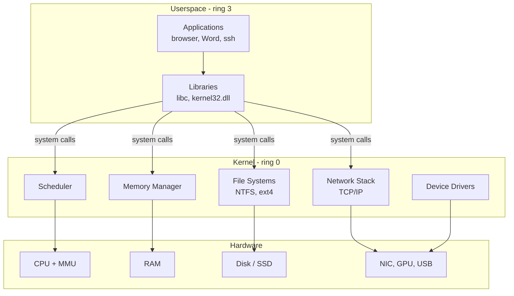
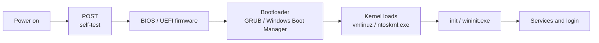

# Operating Systems — Overview

The operating system is the layer that turns a pile of silicon into something useful. It arbitrates the CPU between hundreds of competing processes, hands each one its own slice of virtual memory, hides the differences between an NVMe SSD and a USB stick behind a single file API, mediates every system call from `notepad.exe` or `cat`, and draws the first and last line of the security boundary on the machine. Every other security control — antivirus, EDR, BitLocker, AppLocker, SELinux, firewall rules — is enforced by code running inside the OS or inside the kernel that the OS owns.

For an infosec engineer this is not optional knowledge. You will read Windows event logs at 03:00, troubleshoot a SELinux denial that broke a production deploy, write a PowerShell hardening script, hunt a process hollowing technique on a Windows 11 endpoint, then SSH into a Ubuntu 24.04 web server and read `/var/log/auth.log` — all in the same shift. The attackers know both platforms; you need to know both platforms. This page is the foundation: what an OS is, the concepts that show up in every other lesson, and a side-by-side map of how Windows and Linux solve the same problems differently.

## What belongs in this category

This category covers everything the operating system itself owns: how to administer it, how to harden it, and how to read the trail it leaves behind. Lessons split cleanly into Windows-side material (services, AppLocker, BitLocker) and Linux-side material (basic commands, fundamentals), with this overview on top as the conceptual map. Read this page first if you are new to OS internals; come back here whenever you need a quick refresher on terminology shared between the two platforms.

| Lesson | Platform | What it covers |
|---|---|---|
| [Windows services](/operating-systems/windows/services) | Windows | What a Windows service is, `services.msc`, `sc.exe`, common services to know. |
| [AppLocker](/operating-systems/windows/applocker) | Windows | Application allow-listing — rules, modes, audit vs enforce. |
| [BitLocker](/operating-systems/windows/bitlocker) | Windows | Full-disk encryption with TPM, recovery keys, PowerShell management. |
| [Linux basic commands](/operating-systems/linux/basic-commands) | Linux | The 30 commands you need to be useful at a Linux shell. |
| [Run commands](/operating-systems/windows/run-commands) | Windows | Win+R shortcuts every admin memorises. |
| [WSL](/operating-systems/windows/wsl) | Windows | Windows Subsystem for Linux — running Ubuntu inside Windows 11. |

## Core OS concepts

Six concepts cover most of what an OS actually does. Every other topic — services, drivers, containers, hypervisors — sits on top of these.

**Kernel and userspace.** The kernel is the small, privileged piece of code that runs in *kernel mode* (CPU ring 0 on x86), can touch any byte of physical memory, and talks to hardware directly. Everything else — your shell, your browser, the antivirus agent, even most drivers on modern systems — runs in *userspace* (ring 3) where the CPU refuses to let them touch RAM or devices except through the kernel. The boundary between the two is the system call interface, and crossing it is *the* expensive operation in computing.

**Processes and threads.** A *process* is an instance of a running program with its own virtual address space, file descriptors, and security context. A *thread* is one execution path inside a process; multiple threads share the same address space and can step on each other's data. The OS scheduler picks which thread runs on which CPU core for which slice of microseconds. On Windows you see processes in Task Manager and `Get-Process`; on Linux you see them with `ps aux` and `top`.

**Virtual memory.** Every process believes it owns the full address space (4 GB on 32-bit, 128 TB on 64-bit). The kernel + the CPU's MMU translate those *virtual* addresses to *physical* RAM pages on the fly, page out cold memory to disk, and refuse access when one process tries to read another's memory. This is what makes "process isolation" real and what stops a buggy app from corrupting the whole system.

**File systems.** A file system is the on-disk data structure that turns blocks of storage into a hierarchy of named files and directories with permissions, timestamps, and metadata. NTFS on Windows, ext4/Btrfs/XFS on Linux, APFS on macOS. The same physical disk holds the same bytes; the file system decides what they mean.

**Device drivers.** A driver is the kernel-mode code that knows how to talk to one specific piece of hardware — a GPU, a NIC, a USB device. A bad driver crashes the kernel (BSOD on Windows, kernel panic on Linux). Most malware that wants to hide deeply ends up loading a driver, which is why both OSes now require driver signing.

**System calls.** The narrow doorway between userspace and the kernel. `open()`, `read()`, `write()`, `fork()`, `execve()` on Linux; `NtCreateFile`, `NtReadFile`, `NtAllocateVirtualMemory` on Windows. Every interesting thing a program does — opening a file, sending a network packet, starting a process — eventually becomes a system call, which is why EDR products instrument them so heavily.

## Types of OS

Not every operating system is a desktop. The trade-offs change wildly depending on what hardware it runs on and what guarantees it must give.

| Type | Examples | What it optimises for |
|---|---|---|
| Desktop | Windows 11, Ubuntu Desktop, macOS | Interactive responsiveness, GUI, broad hardware support. |
| Server | Windows Server 2022, RHEL 9, Ubuntu Server 24.04 | Throughput, uptime, remote management, no GUI by default. |
| Embedded | VxWorks, embedded Linux, FreeRTOS | Small footprint, fixed hardware, sometimes no MMU. |
| Real-time (RTOS) | QNX, VxWorks, Zephyr | Hard deadline guarantees — used in cars, medical devices, avionics. |
| Mobile | Android, iOS | Battery life, sandboxed apps, touch UX, app-store distribution. |

For day-to-day infosec work the first two matter most: a typical company runs Windows 11 on user laptops and a mix of Windows Server and Linux on servers, with mobile devices managed through MDM.

## Boot process

Booting is the controlled sequence that turns "power off" into "login screen." Knowing the steps matters because every step is a place an attacker (or a misconfigured update) can break things.

- **POST** — the firmware checks RAM, CPU and connected devices respond.
- **BIOS / UEFI** — old systems used BIOS; modern ones use UEFI, which supports Secure Boot (only signed bootloaders run), GPT partitions larger than 2 TB, and a proper pre-OS environment.
- **Bootloader** — picks which OS to boot if there are several, then loads the kernel into memory. GRUB on Linux, Windows Boot Manager on Windows.
- **Kernel** — initialises memory, mounts the root filesystem, loads essential drivers.
- **init** — the first userspace process. On modern Linux this is `systemd` (PID 1); on Windows it is `wininit.exe`, which then spawns `services.exe`, `lsass.exe`, `winlogon.exe`. From here the rest of the system fans out.

When troubleshooting a "won't boot" ticket, narrowing down *which* of these steps fails — does POST complete? does the bootloader appear? does the kernel load and then panic? — is the whole game.

## Multi-user and security basics

Both Windows and Linux are multi-user systems and have been for decades. The shape of the security model is similar even when the names differ.

- **Accounts.** Every user has an identity (a SID on Windows, a UID on Linux) and belongs to one or more groups. The OS uses identity + group membership to decide what each request is allowed to do.
- **Privilege levels.** There is always a privileged "god" account — `Administrator` / `SYSTEM` on Windows, `root` (UID 0) on Linux — and ordinary users who must request elevation to do administrative work (UAC on Windows, `sudo` on Linux).
- **DAC vs MAC.** *Discretionary Access Control* lets the owner of a resource decide who else can use it (classic Unix `chmod`, Windows ACLs). *Mandatory Access Control* enforces system-wide policies that even the owner cannot override (SELinux, AppArmor, Windows integrity levels, sandbox profiles).
- **Access tokens.** When you log in, Windows builds an *access token* containing your SID, group SIDs, and privileges; every process you launch carries that token. The kernel checks the token against the resource's ACL on every access. Linux works similarly using effective UID/GID and capabilities.
- **SELinux / AppArmor.** Two implementations of MAC on Linux. SELinux (default on RHEL/Fedora) labels every file and process and enforces a centralized policy. AppArmor (default on Ubuntu/SUSE) uses per-binary path-based profiles. Both can stop a compromised service from doing things outside its profile even if the attacker has root.
- **Windows integrity levels.** A second axis on top of ACLs. A Low-integrity process (a sandboxed browser tab) cannot write to a Medium-integrity resource (your Documents folder) even if the ACL would otherwise allow it. This is what stops a browser exploit from instantly trashing your profile.

## Windows vs Linux at a glance

The two ecosystems converge on the same problems and pick different defaults. This table is the short version.

| Topic | Windows | Linux |
|---|---|---|
| Kernel | NT kernel (`ntoskrnl.exe`), hybrid | Linux kernel (`vmlinuz`), monolithic with modules |
| Default shell | PowerShell 7, `cmd.exe` | bash, zsh |
| Package manager | `winget`, MSI/MSIX, Microsoft Store | `apt` (Debian/Ubuntu), `dnf`/`yum` (RHEL/Fedora), `pacman` (Arch) |
| Permission model | NTFS ACLs + integrity levels + UAC | POSIX `rwx` + ACLs + SELinux/AppArmor + capabilities |
| Service manager | Service Control Manager (`services.msc`, `sc.exe`) | `systemd` (`systemctl`) |
| Default log location | Event Viewer (`%SystemRoot%\System32\winevt\Logs`) | `/var/log/`, `journalctl` for systemd journal |
| Admin user | `Administrator`, `SYSTEM` | `root` |
| Remote management | RDP, WinRM, PowerShell Remoting | SSH |
| Filesystem layout | Drive letters (`C:\`, `D:\`), `C:\Windows`, `C:\Users` | Single tree under `/`, everything mounted underneath |
| Default file system | NTFS | ext4 (varies — XFS on RHEL, Btrfs on openSUSE) |
| EOL versioning | Named releases (Server 2022, Windows 11 24H2) | Distro-specific (Ubuntu 24.04 LTS, RHEL 9.x) |
| Endpoint security | Defender for Endpoint, BitLocker, AppLocker, WDAC | SELinux/AppArmor, LUKS, auditd, eBPF tooling |

## Processes, services, files, memory — things every tool shows you

The same four concepts show up in every operating system; only the tool names change. Memorise this table and you can stop being surprised when a Linux ticket lands on a Windows-shaped brain or vice versa.

| Concept | Windows GUI | Windows CLI | Linux CLI |
|---|---|---|---|
| Running processes | Task Manager | `Get-Process`, `tasklist` | `ps aux`, `top`, `htop` |
| Services / daemons | `services.msc` | `Get-Service`, `sc.exe query` | `systemctl list-units --type=service` |
| File permissions | Right-click → Properties → Security | `icacls`, `Get-Acl` | `ls -l`, `getfacl`, `stat` |
| Memory usage | Task Manager → Performance | `Get-Counter '\Memory\Available MBytes'` | `free -h`, `cat /proc/meminfo` |
| Disk usage | This PC | `Get-PSDrive`, `Get-Volume` | `df -h`, `du -sh *` |
| Listening ports | Resource Monitor | `netstat -ano`, `Get-NetTCPConnection` | `ss -tulpn`, `netstat -tulpn` |
| Logged-in users | Task Manager → Users | `query user`, `quser` | `who`, `w`, `last` |
| System logs | Event Viewer | `Get-WinEvent` | `journalctl`, `tail -f /var/log/syslog` |
| Network config | `ncpa.cpl` | `Get-NetIPAddress`, `ipconfig /all` | `ip addr`, `ifconfig` |

## Hands-on bootstrap

Three exercises you can do today on a single laptop with VirtualBox, VMware Workstation, or Hyper-V. Total time is about an hour.

1. **Spin up two VMs.** Install Windows 11 (evaluation ISO from Microsoft) and Ubuntu 24.04 LTS (ISO from ubuntu.com). Give each 4 GB RAM and 40 GB disk. Boot both. Notice how different the two installers feel — Windows asks for a Microsoft account; Ubuntu asks for a username.
2. **List running processes.** On Windows: `Get-Process | Sort-Object CPU -Descending | Select-Object -First 20`. On Ubuntu: `ps aux --sort=-%cpu | head -20`. Compare what is running by default. Windows has dozens of `svchost.exe` instances; Ubuntu has `systemd`, a few `kworker` threads, and not much else.
3. **Compare default listening ports.** On Windows: `netstat -ano | findstr LISTENING`. On Ubuntu: `sudo ss -tulpn`. A fresh Windows 11 typically listens on more ports than a fresh Ubuntu Server — RPC, SMB, RDP if enabled, plus several `svchost.exe` ports. A fresh Ubuntu Server may only listen on `ssh` (22) and a DHCP client port. This is the attack-surface difference between the two defaults, made visible in 30 seconds.

## Worked example — what example.local uses

`example.local` is a 200-employee company with a hybrid estate. About 70% of endpoints are Windows 11 domain-joined workstations managed through Group Policy and Intune; the SOC sees those as the primary phishing target. The other 30% — and 90% of the server fleet — runs Linux: Ubuntu 24.04 hosts running nginx as the public reverse proxy, PostgreSQL on RHEL 9 for the application database, Docker hosts for the internal dev tools, and a single Windows Server 2022 forest holding `EXAMPLE\` Active Directory.

The on-call engineer therefore needs both vocabularies in the same hour. A typical Tuesday includes:

- A Defender for Endpoint alert on a Windows laptop — needs `Get-Process`, `Get-WinEvent`, and a look at the `HKCU\Software\Microsoft\Windows\CurrentVersion\Run` registry key.
- A failed nginx restart on a Ubuntu host — needs `systemctl status nginx`, `journalctl -u nginx`, and a glance at `/etc/nginx/nginx.conf`.
- A database connection storm on PostgreSQL — needs `ss -tulpn`, `pg_stat_activity`, and a check that SELinux is not blocking the new socket path.

Anyone who only knows one platform spends the day handing tickets to a colleague. Anyone who knows both reads the trail directly. That is why this category teaches both side by side.

## Key takeaways

- The OS owns the security boundary; everything else (EDR, AV, encryption) runs inside it.
- Six concepts — kernel/userspace, processes, virtual memory, file systems, drivers, system calls — explain most of what every OS does.
- Windows and Linux solve the same problems with different defaults; the *concepts* transfer, the *commands* must be learned per platform.
- The boot chain (POST → firmware → bootloader → kernel → init) is the path for both troubleshooting and persistence — know the stations.
- Multi-user security stacks DAC (ACLs), MAC (SELinux/AppArmor/integrity levels) and elevation (UAC/`sudo`); good hardening uses all three.
- Most "I don't know what I'm looking at" moments dissolve when you map the new tool to the concept it shows (process, service, file, memory, port, log, user).
- Spend a weekend with one Windows VM and one Ubuntu VM open side by side and the unfamiliarity disappears faster than any book.

## References

- *Operating Systems: Three Easy Pieces* (Remzi & Andrea Arpaci-Dusseau) — the standard free textbook on OS concepts. https://pages.cs.wisc.edu/~remzi/OSTEP/
- Microsoft Learn — Windows for IT pros documentation. https://learn.microsoft.com/en-us/windows/
- Linux man pages, online and searchable. https://man7.org/linux/man-pages/
- The Linux Documentation Project — Filesystem Hierarchy Standard. https://refspecs.linuxfoundation.org/FHS_3.0/fhs/index.html
- Microsoft Docs — Windows internals reference. https://learn.microsoft.com/en-us/windows-hardware/drivers/kernel/
