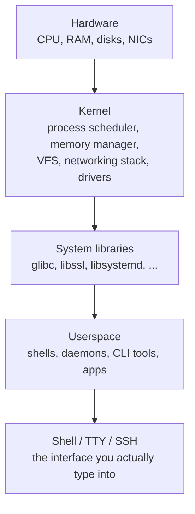

# Linux Fundamentals

Every infosec engineer needs to read Linux fluently — not because Linux is trendy, but because the things you defend, attack, and investigate all run on it. Web servers, database servers, mail relays, DNS resolvers, firewalls, VPN gateways, load balancers, Kubernetes nodes, container images, most SIEM log collectors, every major pentest distribution, and the majority of cloud workloads are Linux. Windows wins the corporate desktop; Linux wins everything else. If you cannot navigate a shell, read `/var/log/auth.log`, or tell whether a service is managed by `systemd` or SysV, you will be blind on the half of the estate where most incidents actually happen.

This lesson is the baseline literacy. It is not a command reference — see [Linux Basic Commands](/operating-systems/linux/basic-commands) for that — and it is not a deep kernel internals course. It is the mental model: what Linux is made of, how the pieces fit together, where configuration and logs live, how permissions work, and the handful of commands you will type every day as a SOC analyst, sysadmin, or pentester. After this, Kali, Alpine-in-a-container, a locked-down RHEL server and a Proxmox host all look like the same operating system wearing different shirts.

## Architecture in 2 minutes

A Linux system is four layers stacked on hardware. Understanding the stack tells you which layer owns a problem.



- **Kernel.** One binary (`/boot/vmlinuz-*`). Schedules processes, manages memory, arbitrates access to hardware, enforces permissions, implements the TCP/IP stack. It is the only thing that runs in privileged CPU mode.
- **System libraries.** Shared code (`/lib`, `/usr/lib`). `glibc` gives programs a C standard library; `libssl` gives them TLS; `libsystemd` gives them the journal. If a library is updated and a running daemon still has the old one mapped, you need to restart the daemon — this is why `needrestart` exists on Debian.
- **Userspace.** Everything that is not the kernel. Daemons (`sshd`, `nginx`), CLI tools (`ls`, `grep`), language runtimes (`python`, `node`), your own processes. Runs in unprivileged mode and talks to the kernel through **system calls** (`open`, `read`, `socket`, etc.).
- **Shell.** `bash`/`zsh`/`sh` — a program like any other, but the one you spend your life inside. It parses commands, expands globs, manages pipelines, and runs scripts.

"Linux" strictly means the kernel. What you install is a **distribution** — the kernel plus GNU tools, a package manager, an init system, and defaults that make it usable.

## Distributions (what actually changes between distros)

There are thousands of distros. You do not need to memorize them — you need to recognize the **family** a given box belongs to, because the family decides which commands work.

| Family | Examples | Init | Default package manager | Default firewall | Security extras |
|---|---|---|---|---|---|
| Debian | Debian, Ubuntu, Kali, Mint | systemd | `apt` / `dpkg` (`.deb`) | `ufw` or `nftables` | AppArmor by default |
| RHEL | RHEL, Rocky, AlmaLinux, CentOS Stream, Fedora | systemd | `dnf` (was `yum`) / `rpm` (`.rpm`) | `firewalld` / `nftables` | SELinux by default |
| Arch | Arch, Manjaro, BlackArch | systemd | `pacman` | `iptables`/`nftables` (bring-your-own) | AUR, very current packages |
| Alpine | Alpine, most container base images | OpenRC (not systemd) | `apk` | `iptables`/`nftables` | `musl` libc, tiny footprint |
| SUSE | openSUSE, SLES | systemd | `zypper` / `rpm` | `firewalld` | SELinux/AppArmor |

Practical consequences:

- On a Debian/Ubuntu box, you `apt install nginx`. On a Rocky box, `dnf install nginx`. On Alpine, `apk add nginx`. Same daemon — different wrapper.
- AppArmor (Debian family) uses path-based profiles; SELinux (RHEL family) uses labels. Both will silently block a daemon from doing something "unexpected," and both show up in logs when they do.
- Container base images are overwhelmingly Alpine or Debian-slim. If your containerized tool fails to start, the first question is which family it is — an `apt` command inside an Alpine image is a classic first-day mistake.

Memorizing fifty distros is pointless. Recognizing Debian-family vs RHEL-family vs Alpine in ten seconds is the skill.

## Filesystem hierarchy

Linux has one tree rooted at `/`. Everything — disks, devices, network shares, virtual filesystems — is mounted somewhere inside it. There is no `C:\` and no separate `D:\`; another disk shows up at `/mnt/data` or wherever you mounted it. The standard is documented in `man 7 hier` and the Filesystem Hierarchy Standard (FHS).

| Path | Purpose | Example |
|---|---|---|
| `/bin`, `/sbin` | Essential binaries (core commands, admin tools). On modern distros these are symlinks to `/usr/bin`, `/usr/sbin`. | `/bin/bash`, `/sbin/ip` |
| `/boot` | Kernel, initramfs, bootloader config. | `/boot/vmlinuz-6.8.0`, `/boot/grub/grub.cfg` |
| `/etc` | System-wide configuration. **All text**, no binaries. The first place you look to understand a server. | `/etc/ssh/sshd_config`, `/etc/nginx/nginx.conf` |
| `/home` | User home directories. Personal files, dotfiles, per-user config. | `/home/alice`, `/home/alice/.ssh/` |
| `/root` | Home directory of the `root` user. Not under `/home`. | `/root/.bash_history` |
| `/var` | Variable data — logs, spool queues, caches, databases. Grows over time. | `/var/log/auth.log`, `/var/lib/mysql/` |
| `/tmp` | World-writable scratch space. Wiped on reboot on most distros. | `/tmp/unzipped-archive/` |
| `/opt` | Third-party software that does not follow FHS packaging. | `/opt/splunkforwarder/`, `/opt/nessus/` |
| `/usr` | User-land programs and read-only data. Largest directory by size. | `/usr/bin/python3`, `/usr/share/man/` |
| `/usr/local` | Software compiled/installed by the admin, not the distro. | `/usr/local/bin/custom-script` |
| `/proc` | Virtual filesystem exposing kernel and process state. Not real files. | `/proc/cpuinfo`, `/proc/1234/status` |
| `/sys` | Virtual filesystem exposing devices, drivers, kernel parameters. | `/sys/class/net/eth0/`, `/sys/kernel/` |
| `/dev` | Device files. Everything is a file, including disks (`/dev/sda`) and terminals (`/dev/pts/0`). | `/dev/null`, `/dev/random`, `/dev/sda1` |
| `/run` | Runtime state (PIDs, sockets) since last boot. Tmpfs — wiped on reboot. | `/run/sshd.pid`, `/run/systemd/` |
| `/mnt`, `/media` | Mount points for manual mounts (`/mnt`) and removable media (`/media`). | `/mnt/backup/`, `/media/usb0/` |

**Two rules that save time.** First: configuration lives in `/etc`, variable data lives in `/var`, everything else is essentially read-only. Second: `/proc` and `/sys` are not disk — they are windows into the kernel. Reading `/proc/net/tcp` shows you every open TCP connection on the box without any tool.

## Users, groups, permissions

Linux is multi-user by design. Every process runs as some user with some set of groups, and every file is owned by one user and one group.

### Accounts

Three files store account data:

- **`/etc/passwd`** — one line per user. Fields: name, x (placeholder), UID, GID, GECOS, home, shell. World-readable.
- **`/etc/shadow`** — password hashes and aging. Root-readable only.
- **`/etc/group`** — groups and their members.

```text
# /etc/passwd
alice:x:1001:1001:Alice,,,:/home/alice:/bin/bash

# /etc/shadow (truncated)
alice:$y$j9T$...:20100:0:99999:7:::
```

- **UID 0** is always `root`. Nothing else.
- UID 1–999 are system accounts (`sshd`, `www-data`, `postgres`, ...). Most have `/usr/sbin/nologin` as their shell so nobody can log in as them.
- UID 1000+ are human accounts.

### Privilege escalation with `sudo`

Logging in as root is discouraged. Instead, humans have their own account and use `sudo` to run individual commands as root. The policy lives in `/etc/sudoers` (edit with `visudo`, never a plain text editor — `visudo` validates the syntax, a broken sudoers file can lock you out):

```text
# Allow members of group 'sudo' to run anything, with a password
%sudo   ALL=(ALL:ALL) ALL

# Let the backup user run rsync as root without a password
backup  ALL=(root) NOPASSWD: /usr/bin/rsync
```

### File permissions

Every file carries three permission sets: owner, group, other. Each set has read (`r`), write (`w`), execute (`x`). `ls -l` shows them:

```text
$ ls -l /etc/shadow /bin/ls /home/alice/
-rw-r----- 1 root    shadow  1534 Apr 10 12:01 /etc/shadow
-rwxr-xr-x 1 root    root  142144 Mar 15 09:22 /bin/ls
drwx------ 3 alice   alice    4096 Apr 22 18:03 /home/alice/
```

Read it as: type (`-` file, `d` dir, `l` symlink), then owner/group/other triplets.

| Octal | Meaning | When to use |
|---|---|---|
| `755` (`rwxr-xr-x`) | Owner full, others read+execute | Binaries, scripts, directories |
| `644` (`rw-r--r--`) | Owner read+write, others read | Regular files (config, docs) |
| `600` (`rw-------`) | Owner only | Secrets, SSH private keys |
| `700` (`rwx------`) | Owner only, executable | Personal scripts, `~/.ssh/` |
| `777` (`rwxrwxrwx`) | World-writable | **Almost never correct** |

Change with `chmod`:

```bash
chmod 755 deploy.sh          # numeric
chmod u+x deploy.sh          # symbolic: add execute for user
chmod -R g+w /srv/shared     # recursive
chown alice:devops file.txt  # change owner and group
```

### Special bits: SUID, SGID, sticky

On top of rwx, three bits change behaviour:

- **SUID** (`rwsr-xr-x`, octal `4xxx`) — when the file is executed, it runs **as its owner**, not as the caller. `/usr/bin/passwd` is SUID root so normal users can update their own hash in `/etc/shadow`.
- **SGID** (`rwxr-sr-x`, octal `2xxx`) — same idea for group. On a directory, new files inherit the directory's group.
- **Sticky bit** (`rwxrwxrwt`, octal `1xxx`) — on a directory, users can only delete files they own. This is why `/tmp` is `drwxrwxrwt`.

SUID binaries are also a classic **privilege escalation** path. If an attacker can drop a SUID-root shell, or abuse a buggy SUID binary like a misconfigured `find` or `vim.basic`, they go from `www-data` to root. One of the first things a pentester runs on a new box is `find / -perm -4000 -type f 2>/dev/null` to list every SUID binary and compare against GTFOBins. We will go deeper on this in the pentest lessons — for now, just know that "a SUID binary owned by root" is not scenery, it is attack surface.

## Shell basics you can't skip

The shell is a program that parses what you type, expands it, and runs it. Three popular ones:

- **`bash`** — GNU Bourne Again Shell. Default on Debian, Ubuntu, RHEL. Every serious Linux engineer knows `bash`.
- **`zsh`** — Z shell. Default on macOS and many developer laptops. Better completion, prompt themes (Oh My Zsh).
- **`fish`** — friendly, opinionated, not POSIX-compatible. Great for day-to-day interactive work, not for portable scripts.

For scripts that must run anywhere, write to `#!/bin/sh` (POSIX). For interactive use, pick whichever you enjoy.

### Redirection and pipes

```bash
cmd > file            # stdout to file (overwrite)
cmd >> file           # stdout to file (append)
cmd 2> errors.log     # stderr to file
cmd > out.log 2>&1    # stdout and stderr together
cmd < input.txt       # stdin from file
cmd1 | cmd2           # stdout of cmd1 becomes stdin of cmd2
cmd &                 # run in background
```

`2>&1` is the one everyone forgets: "redirect file descriptor 2 (stderr) to wherever fd 1 (stdout) is going right now." Order matters: `> out.log 2>&1` merges them; `2>&1 > out.log` does not.

### Globbing

```bash
ls *.log            # every file ending in .log
ls access-202?.log  # single-character wildcard
ls file[12].txt     # file1.txt or file2.txt
ls **/*.conf        # recursive (bash >= 4 with shopt -s globstar)
```

### Environment variables

```bash
echo $PATH       # colon-separated list of directories searched for commands
echo $HOME       # your home directory
echo $USER       # your username
export API_KEY=secret   # make available to child processes
env              # dump the whole environment
```

`$PATH` deserves special respect. When you type `nginx`, the shell looks in each `$PATH` directory in order and runs the first match. A writable directory earlier in `$PATH` than `/usr/bin` is a privilege escalation trick.

### Dotfiles

Startup scripts in your home:

- `~/.bashrc` — runs for every interactive shell. Aliases and prompt live here.
- `~/.bash_profile` / `~/.profile` — runs once at login. Environment variables go here.
- `~/.ssh/config` — per-user SSH client config.
- `~/.bash_history` — command history. Juicy in investigations.

## Package managers

Every distro family has its own. Same job — install, remove, update, search — different syntax.

| Task | Debian / Ubuntu (`apt`) | RHEL / Rocky (`dnf`) | Arch (`pacman`) | Alpine (`apk`) |
|---|---|---|---|---|
| Refresh index | `apt update` | `dnf check-update` | `pacman -Sy` | `apk update` |
| Install | `apt install nginx` | `dnf install nginx` | `pacman -S nginx` | `apk add nginx` |
| Remove | `apt remove nginx` | `dnf remove nginx` | `pacman -R nginx` | `apk del nginx` |
| Upgrade all | `apt upgrade` | `dnf upgrade` | `pacman -Syu` | `apk upgrade` |
| Search | `apt search nginx` | `dnf search nginx` | `pacman -Ss nginx` | `apk search nginx` |
| Show info | `apt show nginx` | `dnf info nginx` | `pacman -Si nginx` | `apk info nginx` |
| List files in pkg | `dpkg -L nginx` | `rpm -ql nginx` | `pacman -Ql nginx` | `apk info -L nginx` |
| Which pkg owns file | `dpkg -S /path` | `rpm -qf /path` | `pacman -Qo /path` | `apk info --who-owns /path` |

### Universal packaging

On top of the native managers, three cross-distro formats exist:

- **Snap** (Canonical, `snapd`) — containerized packages. Used heavily on Ubuntu desktop. `snap install code`.
- **Flatpak** — similar idea, more popular in the Fedora/KDE ecosystem. `flatpak install flathub org.videolan.VLC`.
- **AppImage** — a single executable file that bundles everything. No installer needed. `chmod +x foo.AppImage && ./foo.AppImage`.

In infosec contexts you almost always want the native package from the distro repository or an official vendor repo — it is what security updates target. Flatpak/Snap are convenient but lag on security advisories.

## systemd: services, units, journal

On essentially every modern Linux (Debian/Ubuntu/RHEL/Arch/SUSE/Fedora since 2015 or so), **systemd** is PID 1. It starts the system, supervises services, runs timers (the modern replacement for cron on systemd systems), manages logging, handles user sessions, and more. Alpine and a few niche distros still use older init systems (OpenRC, runit, SysV); outside them, you can assume systemd.

### Units

Everything systemd manages is a **unit**: a service, a socket, a timer, a mount, a target. Unit files live in two places:

- `/lib/systemd/system/` (or `/usr/lib/systemd/system/`) — shipped by packages. Don't edit these directly.
- `/etc/systemd/system/` — your overrides and your own units. This wins over the vendor copy.

A minimal service unit:

```ini
# /etc/systemd/system/myapp.service
[Unit]
Description=My Python app
After=network-online.target
Wants=network-online.target

[Service]
Type=simple
User=myapp
WorkingDirectory=/opt/myapp
ExecStart=/usr/bin/python3 /opt/myapp/app.py
Restart=on-failure
RestartSec=5

[Install]
WantedBy=multi-user.target
```

After creating or editing a unit file, always run `systemctl daemon-reload` before `start` or `restart` — systemd caches units.

### Day-to-day commands

```bash
systemctl status sshd          # is it running? last exit code? recent log lines?
systemctl start  sshd          # start now
systemctl stop   sshd          # stop now
systemctl restart sshd         # stop + start
systemctl reload sshd          # ask daemon to re-read config (no downtime)
systemctl enable sshd          # start at boot
systemctl disable sshd         # do not start at boot
systemctl enable --now sshd    # enable and start in one go
systemctl list-units --failed  # what's broken right now
systemctl list-timers          # scheduled jobs
```

### journalctl

systemd collects **all** logs (from the kernel, from every service) into a structured binary journal. You query it with `journalctl`:

```bash
journalctl -u sshd              # all logs from sshd
journalctl -u sshd -f           # follow (tail -f)
journalctl -u sshd --since "1 hour ago"
journalctl -u sshd -p err       # only errors and worse
journalctl -k                   # kernel ring buffer
journalctl _UID=1001            # all logs from UID 1001
journalctl --since today --grep "Failed password"
```

By default the journal is volatile (RAM, wiped on reboot). Make it persistent by creating `/var/log/journal/` and restarting `systemd-journald`.

### Legacy: SysV and `service`

Older boxes (and some minimal container images) use SysV init scripts in `/etc/init.d/` and the `service` command (`service ssh status`). systemd ships a compatibility shim for `service`, so the command usually still works — but on anything modern, reach for `systemctl` first. If `systemctl` fails, you know the box is not systemd-based.

## Processes, signals, and basic inspection

A **process** is a running program. Linux gives each one a PID, a parent (PPID), a user and group, open files, memory maps, and a state. Inspect them with `ps`, `top`, `htop`.

```text
$ ps aux | head
USER       PID %CPU %MEM    VSZ   RSS TTY      STAT START   TIME COMMAND
root         1  0.0  0.1 167456 11892 ?        Ss   Apr22   0:12 /sbin/init
root       823  0.0  0.2  15664  8932 ?        Ss   Apr22   0:03 /usr/sbin/sshd -D
www-data  1402  0.1  1.4 215340 58120 ?        S    Apr22   2:41 nginx: worker process
postgres  1501  0.0  2.2 418220 89240 ?        Ss   Apr22   0:55 postgres: main
alice    20411  0.0  0.1  13876  3520 pts/0    R+   10:14   0:00 ps aux
```

Columns that matter: USER (who owns it), PID, %CPU, %MEM, TTY (`?` means no terminal — a daemon), STAT (`S` sleeping, `R` running, `Z` zombie, `D` uninterruptible disk wait), COMMAND.

```bash
ps aux                      # every process, BSD-style output
ps -ef                      # every process, System V output
ps -eo pid,user,pcpu,comm   # pick your columns
top                         # interactive, updates live
htop                        # nicer top (may need install)
pgrep -a nginx              # PIDs and command lines matching "nginx"
pidof sshd                  # PID of a named process
```

### Signals

You stop or reconfigure processes by sending them **signals**:

| Signal | Number | What it does |
|---|---|---|
| `SIGHUP` | 1 | Reload config (convention, not enforced) |
| `SIGINT` | 2 | Ctrl-C — polite interrupt |
| `SIGTERM` | 15 | "Please shut down cleanly." The default of `kill`. |
| `SIGKILL` | 9 | Forced kill. Kernel-level. Process cannot trap or ignore it. |
| `SIGSTOP` / `SIGCONT` | 19 / 18 | Pause / resume |

```bash
kill 1234          # send SIGTERM to PID 1234
kill -HUP 823      # SIGHUP to sshd (reload config)
kill -9 4567       # SIGKILL — only when SIGTERM fails
pkill nginx        # signal every process whose name matches
killall -HUP nginx # same idea
```

`SIGKILL` is the hammer. Use `SIGTERM` first, give the daemon a couple of seconds, and only then reach for `-9`. Daemons that cannot catch signals (zombie, uninterruptible wait `D`) will not respond even to `SIGKILL` — that usually means stuck I/O on a dying disk or a broken NFS mount.

### Load average and `uptime`

```text
$ uptime
 10:14:02 up 3 days,  2:17,  2 users,  load average: 0.42, 0.58, 0.63
```

Load average is the average number of processes runnable or waiting on I/O over the last 1, 5, and 15 minutes. On an 8-core machine, a load of 8 means fully utilised; 16 means every core is doing something and another core's worth of work is queued. Compare load to core count, not to an absolute number.

## Networking cheat-sheet

`ifconfig` and `route` are deprecated. Modern tools are `ip` (interfaces, routes) and `ss` (sockets).

```bash
ip a                  # list all interfaces and their IPs
ip -br a              # brief one-line-per-interface view
ip r                  # routing table
ip r get 1.1.1.1      # which interface + gateway would reach that IP?
ip neigh              # ARP / neighbour table

ss -tulpn             # listening TCP + UDP sockets, with PID
ss -tanp              # every TCP connection
ss -s                 # summary counts

ping -c 4 example.local
traceroute example.local
mtr example.local     # traceroute + ping, continuous
dig example.local
dig @8.8.8.8 example.local any
```

### DNS config

- `/etc/hosts` — static entries. Checked before DNS.
- `/etc/resolv.conf` — DNS servers the resolver uses. On systemd-resolved systems this is a symlink to a stub; the real config is `/etc/systemd/resolved.conf`.
- `/etc/nsswitch.conf` — order of lookup sources (`files dns` means /etc/hosts first, then DNS).

### Interface configuration

- **NetworkManager** (`nmcli`, `nmtui`) — default on RHEL-family desktops and servers, Fedora, Ubuntu desktop.
- **netplan** — YAML config in `/etc/netplan/*.yaml` rendered to either NetworkManager or systemd-networkd. Ubuntu Server default.
- **systemd-networkd** — direct config under `/etc/systemd/network/`. Common in minimal / cloud images.
- **`/etc/network/interfaces`** — legacy Debian `ifupdown`.

```bash
nmcli device status
nmcli con show
nmcli con modify "Wired connection 1" ipv4.addresses 10.0.0.50/24 ipv4.gateway 10.0.0.1 ipv4.method manual
nmcli con up "Wired connection 1"
```

### Firewalls

Three layers that all ultimately talk to the kernel's `netfilter` subsystem:

- **`ufw`** (Ubuntu): friendly front-end. `ufw allow 22/tcp`, `ufw enable`.
- **`firewalld`** (RHEL): zone-based. `firewall-cmd --add-service=ssh --permanent && firewall-cmd --reload`.
- **`nftables`** / **`iptables`** (everyone): the raw rule language. `ufw` and `firewalld` generate these rules.

On a fresh server, decide on a firewall tool and never mix them. `ufw` and `firewalld` stomping on each other is a common source of mystery outages.

## Logs where they actually live

Logs end up in two main places depending on distro: plain text under `/var/log/`, and the systemd journal queryable via `journalctl`. On most modern Linux both exist — the text files are written by `rsyslog` reading from the journal.

| File / target | What it contains | Distro |
|---|---|---|
| `/var/log/syslog` | General system messages | Debian/Ubuntu |
| `/var/log/messages` | General system messages | RHEL-family |
| `/var/log/auth.log` | Authentication (SSH, sudo, PAM, login) | Debian/Ubuntu |
| `/var/log/secure` | Authentication | RHEL-family |
| `/var/log/kern.log` | Kernel ring buffer | Debian/Ubuntu |
| `/var/log/dmesg` | Kernel boot messages | Everyone |
| `/var/log/apt/` | Package install history | Debian/Ubuntu |
| `/var/log/dnf.log` | Package install history | RHEL-family |
| `/var/log/nginx/access.log`, `error.log` | Web server | If nginx is installed |
| `/var/log/audit/audit.log` | SELinux / Linux audit framework | RHEL-family |
| `journalctl` (systemd journal) | Everything systemd services print | All systemd systems |

### Incident-triage example — SSH brute-force

A common first-day-on-the-job task: a server has been sluggish, you suspect brute-force. Open `/var/log/auth.log` (Debian/Ubuntu) or `/var/log/secure` (RHEL) and grep:

```text
$ sudo grep "Failed password" /var/log/auth.log | tail
Apr 22 10:11:02 web01 sshd[20411]: Failed password for root from 203.0.113.42 port 51884 ssh2
Apr 22 10:11:04 web01 sshd[20411]: Failed password for root from 203.0.113.42 port 51884 ssh2
Apr 22 10:11:06 web01 sshd[20413]: Failed password for invalid user admin from 203.0.113.42 port 52022 ssh2
Apr 22 10:11:08 web01 sshd[20413]: Failed password for invalid user oracle from 203.0.113.42 port 52022 ssh2
Apr 22 10:11:10 web01 sshd[20413]: Failed password for invalid user ubuntu from 203.0.113.42 port 52022 ssh2
```

Now count the offending IPs:

```bash
sudo grep "Failed password" /var/log/auth.log \
    | awk '{print $(NF-3)}' \
    | sort | uniq -c | sort -rn | head
```

Or with the journal:

```bash
sudo journalctl -u ssh --since "24 hours ago" --grep "Failed password" \
    | awk '{print $(NF-3)}' | sort | uniq -c | sort -rn | head
```

Output tells you which IPs are hammering SSH — feed them into `fail2ban`, a firewall block, or a SIEM detection rule.

## Hands-on

Five exercises to do on any Ubuntu 24.04 VM. Spin up a throwaway VM (or a container) before you touch a production box.

### 1. Create a user and a secondary group

```bash
sudo groupadd devops
sudo useradd -m -s /bin/bash -G devops alice
sudo passwd alice           # set the password
id alice                    # uid, gid, groups
groups alice
getent passwd alice         # line from /etc/passwd
```

`-m` creates the home directory, `-s` sets the login shell, `-G` adds secondary groups.

### 2. Find all SUID binaries

```bash
find / -perm -4000 -type f 2>/dev/null
```

Expected on Ubuntu: `/usr/bin/passwd`, `/usr/bin/su`, `/usr/bin/sudo`, `/usr/bin/mount`, `/usr/bin/umount`, `/usr/bin/chsh`, `/usr/bin/chfn`, `/usr/bin/newgrp`, `/usr/bin/gpasswd`. Anything outside that list on a freshly-installed system is worth investigating. Cross-check with [GTFOBins](https://gtfobins.github.io/) — a "regular-looking" SUID binary that turns out to be `find` or `vim` means someone put it there on purpose.

### 3. Enable `sshd`, tail its journal, watch a brute-force

```bash
sudo apt install -y openssh-server
sudo systemctl enable --now ssh
sudo systemctl status ssh
sudo journalctl -u ssh -f
```

From another host (or a container) try a few bad logins:

```bash
for u in root admin test; do
  sshpass -p wrong ssh -o StrictHostKeyChecking=no "$u@<vm-ip>" true 2>/dev/null
done
```

Watch the `Failed password` lines scroll by on the VM. This is exactly what `fail2ban` is reading.

### 4. Write a toy systemd unit and survive a reboot

```bash
sudo tee /opt/hello.py >/dev/null <<'EOF'
#!/usr/bin/env python3
import time
while True:
    print("hello from systemd")
    time.sleep(5)
EOF
sudo chmod +x /opt/hello.py

sudo tee /etc/systemd/system/hello.service >/dev/null <<'EOF'
[Unit]
Description=Hello from systemd
After=network-online.target

[Service]
ExecStart=/opt/hello.py
Restart=on-failure

[Install]
WantedBy=multi-user.target
EOF

sudo systemctl daemon-reload
sudo systemctl enable --now hello
journalctl -u hello -f
sudo reboot
# after it comes back:
systemctl status hello
```

### 5. Count failed SSH logins in the last 24 hours

```bash
sudo journalctl -u ssh --since "24 hours ago" --grep "Failed password" \
    | awk '{print $(NF-3)}' \
    | sort | uniq -c | sort -rn
```

Answer: first column is attempts, second column is source IP. If the top IP has thousands of hits it is a bot; block it.

## Worked example — hardening a fresh example.local web VM

You have just been handed a vanilla Ubuntu 24.04 server named `web01.example.local` that will host a public website. Here is the full day-1 hardening, in order.

```bash
# 0. Get current and keep current
sudo apt update
sudo apt -y full-upgrade
sudo apt -y install unattended-upgrades fail2ban ufw

# 1. Create a non-root admin user, add to sudo, copy your pubkey over
sudo adduser --gecos "Ops" ops
sudo usermod -aG sudo ops
sudo mkdir -p /home/ops/.ssh
sudo cp ~/.ssh/authorized_keys /home/ops/.ssh/authorized_keys
sudo chown -R ops:ops /home/ops/.ssh
sudo chmod 700 /home/ops/.ssh
sudo chmod 600 /home/ops/.ssh/authorized_keys

# 2. Disable root SSH + password auth — keys only, non-root only
sudo sed -i 's/^#\?PermitRootLogin.*/PermitRootLogin no/'         /etc/ssh/sshd_config
sudo sed -i 's/^#\?PasswordAuthentication.*/PasswordAuthentication no/' /etc/ssh/sshd_config
sudo systemctl restart ssh

# 3. Firewall: only 22, 80, 443
sudo ufw default deny incoming
sudo ufw default allow outgoing
sudo ufw allow 22/tcp
sudo ufw allow 80/tcp
sudo ufw allow 443/tcp
sudo ufw enable
sudo ufw status verbose

# 4. Automatic security updates
sudo dpkg-reconfigure --priority=low unattended-upgrades
# verify
systemctl status unattended-upgrades
cat /etc/apt/apt.conf.d/20auto-upgrades

# 5. fail2ban on SSH
sudo tee /etc/fail2ban/jail.local >/dev/null <<'EOF'
[sshd]
enabled  = true
port     = ssh
maxretry = 5
findtime = 10m
bantime  = 1h
EOF
sudo systemctl enable --now fail2ban
sudo fail2ban-client status sshd

# 6. Forward logs to the central collector at logs.example.local:514 (rsyslog)
echo '*.* @@logs.example.local:514' | sudo tee /etc/rsyslog.d/50-remote.conf
sudo systemctl restart rsyslog
```

After this, confirm you can SSH as `ops`, that `root` login is refused, that `ufw status` shows only 22/80/443, that `fail2ban-client status` lists the `sshd` jail, and that the log collector is receiving messages.

## Common traps and pitfalls

- **Running everything as root.** Even as an admin, log in as a normal user and `sudo` individual commands. A typo as root can destroy the system; as a user it destroys your own files at worst.
- **Editing `/etc/sudoers` with `nano`.** Use `sudo visudo`. It locks the file, validates the syntax, and refuses to save a broken file that would lock you out of sudo.
- **Skipping `apt upgrade`.** `apt update` refreshes the *list* of available packages; it does not install anything. `apt upgrade` is what actually applies updates. People confuse these weekly.
- **Forgetting `systemctl daemon-reload`.** Edit a unit file, run `systemctl restart myapp`, nothing happens — because systemd is still using the old unit from its cache. Always `daemon-reload` after editing units.
- **`hostnamectl` vs `/etc/hostname`.** Set hostname with `sudo hostnamectl set-hostname web01.example.local`. Hand-editing `/etc/hostname` is only half the job on systemd systems and will de-sync from `/etc/machine-info` and kernel state.
- **Assuming `service` always works.** It usually does on systemd boxes thanks to the compatibility shim, but on minimal containers (Alpine, distroless) there is no `service` command at all. Use `systemctl` on systemd, `rc-service` on OpenRC, and know which you are on.
- **Leaving default firewall rules untouched.** A fresh Ubuntu cloud image has `ufw` installed but not enabled. A fresh RHEL has `firewalld` enabled with a permissive `public` zone. Always audit the running rules (`ufw status verbose`, `firewall-cmd --list-all`, `nft list ruleset`).
- **Mixing package managers on the same host.** Pinning `apt` packages, then also installing from Snap, then also `pip install --system` — now upgrades come from three places and none of them agree. Pick one source of truth per category.

## Key takeaways

- Linux is kernel + libraries + userspace + shell. Knowing which layer owns a problem tells you where to look.
- The distribution family (Debian / RHEL / Arch / Alpine) decides which package manager and firewall you will use, not the specific distro name.
- Everything is a file, and everything lives under `/`. Configuration in `/etc`, variable data in `/var`, kernel views in `/proc` and `/sys`.
- Permissions are owner/group/other × rwx, plus SUID/SGID/sticky. `chmod 755` for executables, `600` for secrets, `777` almost never.
- `systemd` runs modern Linux. `systemctl` drives services, `journalctl` reads the logs, unit files in `/etc/systemd/system/` are where your own work lives.
- Processes are inspected with `ps`/`top`/`ss`; they are stopped with `SIGTERM` first and `SIGKILL` only when needed.
- For incidents, `/var/log/auth.log` (or `secure`) plus `journalctl -u <service>` answer most of the first round of questions.
- Hardening is a checklist, not a mood: non-root SSH, key-only auth, a firewall, unattended upgrades, fail2ban, centralized logs. Do it on day one.

## References

- The Linux Foundation — free "Introduction to Linux" (LFS101): https://training.linuxfoundation.org/training/introduction-to-linux/
- `man 7 hier` — Linux Filesystem Hierarchy manual page (type `man 7 hier` on any Linux box).
- Filesystem Hierarchy Standard: https://refspecs.linuxfoundation.org/fhs.shtml
- Arch Wiki (distro-agnostic reference quality): https://wiki.archlinux.org/
- Red Hat Enterprise Linux documentation: https://docs.redhat.com/en/documentation/red_hat_enterprise_linux/
- Ubuntu Server Guide: https://documentation.ubuntu.com/server/
- Debian Administrator's Handbook (free online): https://debian-handbook.info/
- systemd documentation: https://systemd.io/
- `journalctl` manual: https://www.freedesktop.org/software/systemd/man/journalctl.html
- GTFOBins (SUID/sudo abuse reference): https://gtfobins.github.io/
- [Linux Basic Commands](/operating-systems/linux/basic-commands) — the companion quick-reference lesson on this site.
