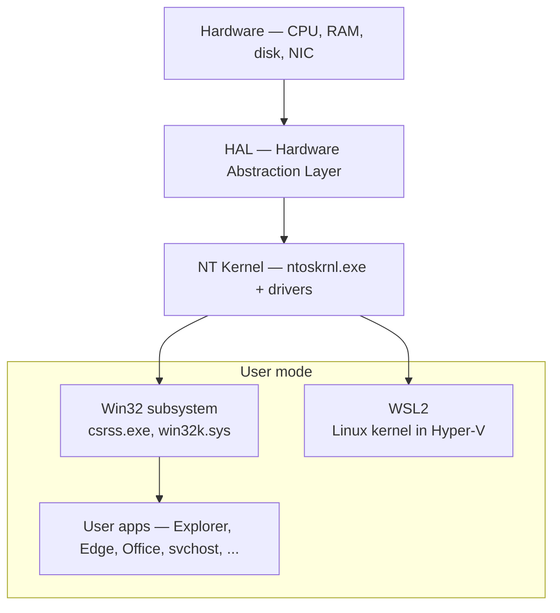

# Windows Fundamentals

Windows still runs the vast majority of enterprise endpoints. Active Directory, Group Policy, Exchange, file servers, finance apps, line-of-business tooling — the stack a SOC analyst touches on any given day is mostly Windows. Even shops that brand themselves "cloud native" end up with a pile of Windows 10/11 laptops walking out the door and a few dozen Server 2022 instances hosting identity and collaboration. That is why every SOC analyst opens Event Viewer to the **Security** log at least once a day: because logons, privilege escalations and process executions on those boxes are the single richest investigative trail in the environment.

This lesson is the foundation. It does not make you a Windows Internals author. It does give you the working vocabulary and the muscle memory to read a Windows box the way a responder does — know what a normal process tree looks like, where persistence hides, which event IDs matter, and how to get answers out of the registry, the event log and PowerShell without reaching for a GUI.

## Architecture in 2 minutes

Windows is a layered OS. The hardware sits at the bottom. On top of it, a very thin **Hardware Abstraction Layer (HAL)** hides CPU and chipset differences so the kernel above it does not have to care. The kernel (`ntoskrnl.exe`) and the device drivers live in **kernel mode** — ring 0, full access to memory and hardware, one bug away from a bugcheck (the blue screen). Everything else — Explorer, your browser, `svchost.exe`, the AV agent's user-mode parts — lives in **user mode** (ring 3), where each process gets its own virtual address space and can only touch the kernel through controlled system calls.

Above the kernel sit **environment subsystems**. The Win32 subsystem (`csrss.exe` plus `win32k.sys`) is what every normal Windows app talks to. There used to be POSIX and OS/2 subsystems; today the meaningful alternative is **WSL2**, which runs a real Linux kernel inside a lightweight Hyper-V VM and surfaces it as `wsl.exe`. That is a very different model from the classic subsystem idea — it is virtualization, not emulation.



Two practical consequences for defenders:

- A process running as **SYSTEM** in user mode is already very powerful, but it is not the kernel. A kernel-mode rootkit (signed driver abuse, BYOVD) is a categorically worse problem than any user-mode malware.
- Detection that looks at user-mode API calls misses anything implemented as a driver. That is why EDRs ship kernel callbacks and ETW providers, not just userland hooks.

## Processes, threads, services

A **process** is one running instance of a program. It owns a virtual address space, a handle table, a security token and one or more threads. A **thread** is what the CPU actually schedules; a process with one thread runs on one core at a time, a process with many threads can spread across cores. Every process has a **PID** (process ID) and every thread has a **TID** (thread ID). A PID is not a name and it is not stable across reboots — do not write detection logic that trusts a PID alone.

Processes have parents. When `explorer.exe` (the shell) spawns `chrome.exe`, Chrome's parent process is Explorer. When a user double-clicks a malicious macro in Word, the process tree usually reads `winword.exe → cmd.exe → powershell.exe` — and that parent/child relationship is one of the most reliable detection signals in the Windows world. Memorize the normal tree:

```
System (PID 4)
 └─ smss.exe
     ├─ csrss.exe  (one per session)
     ├─ wininit.exe  (session 0)
     │   ├─ services.exe
     │   │   └─ svchost.exe × many
     │   ├─ lsass.exe
     │   └─ fontdrvhost.exe
     └─ winlogon.exe  (one per interactive session)
         ├─ LogonUI.exe
         ├─ userinit.exe  → explorer.exe
         ├─ dwm.exe
         └─ fontdrvhost.exe
```

**`services.exe`** is the Service Control Manager. A **service** is just a long-running background process that SCM starts, stops and restarts on your behalf — the Windows analogue of a Linux systemd unit. Service definitions live in the registry under `HKLM\SYSTEM\CurrentControlSet\Services\`. Each service entry specifies the executable to run, the account to run it as, the startup type (Automatic, Manual, Disabled, Delayed-Start, Triggered) and its dependencies.

Many services run inside **`svchost.exe`** rather than in their own executable. This is a consolidation trick: dozens of small services (DNS Client, Themes, Windows Update, Audio…) share one `svchost` host process instead of each spawning its own. On modern Windows 10/11 with enough RAM, services are split more aggressively — you will often see 40+ `svchost.exe` instances, which is normal.

Basic triage commands:

```powershell
# Processes
tasklist
Get-Process
Get-Process | Where-Object { $_.ProcessName -eq 'svchost' } | Select-Object Id, ProcessName, Path

# With parent PID
Get-CimInstance Win32_Process |
    Select-Object ProcessId, ParentProcessId, Name, CommandLine |
    Sort-Object ParentProcessId

# Services
Get-Service
Get-Service -Name Spooler | Format-List *
sc.exe qc Spooler
```

Service triage is a core blue-team skill. You should know, in a sleep-deprived state at 3 AM, whether it is normal for `spoolsv.exe` to be running (yes, it's Print Spooler), whether `svchost.exe` can have a parent of `explorer.exe` (no — the legitimate parent is always `services.exe`), and whether `powershell.exe` spawning from `winword.exe` is something anyone in the business ever has a legitimate reason to do (almost never). Task Manager, the built-in `tasklist` and `Get-Process` will show you the basics. For a real look at the tree, use Sysinternals **Process Explorer** (`procexp64.exe`) — it shows parent/child, signed-vs-unsigned, and the command line each process was launched with.

## The registry

The Windows **registry** is a hierarchical key-value database that stores almost every piece of configuration on the system — OS settings, user preferences, installed-program metadata, driver parameters, service definitions, scheduled task blobs, and a long list of things malware loves to hide in. It is organized into five root keys, called **hives**:

| Hive | Alias | What it holds | Where it lives on disk |
|---|---|---|---|
| `HKEY_LOCAL_MACHINE` | `HKLM` | Machine-wide configuration, services, installed software | `C:\Windows\System32\config\SOFTWARE`, `SYSTEM`, `SECURITY`, `SAM` |
| `HKEY_CURRENT_USER` | `HKCU` | Settings for the currently logged-in user | `C:\Users\<user>\NTUSER.DAT` |
| `HKEY_USERS` | `HKU` | Profiles of every user loaded on the machine | One subkey per user, backed by `NTUSER.DAT` |
| `HKEY_CLASSES_ROOT` | `HKCR` | File associations, COM/OLE registrations | Merged view of `HKLM\Software\Classes` and `HKCU\Software\Classes` |
| `HKEY_CURRENT_CONFIG` | `HKCC` | Current hardware profile | Volatile view of `HKLM\SYSTEM\CurrentControlSet\Hardware Profiles\Current` |

Three tools, roughly in order of how often you will use them:

- **`regedit.exe`** — the GUI. Fine for clicking around and making one-off edits.
- **`reg.exe`** — the classic command-line tool. Great for scripts and remote sessions where you do not have PowerShell.
- **PowerShell** — registry hives appear as drives (`HKLM:\`, `HKCU:\`) and you query them with `Get-ItemProperty`, `Set-ItemProperty`, `New-ItemProperty`, `Remove-ItemProperty`. This is the idiomatic modern way.

```powershell
# What autostarts from the current user's Run key?
Get-ItemProperty -Path 'HKCU:\Software\Microsoft\Windows\CurrentVersion\Run'

# Enumerate installed services
Get-ChildItem 'HKLM:\SYSTEM\CurrentControlSet\Services' |
    Select-Object PSChildName

# reg.exe equivalent — useful when you are not in PowerShell
reg query "HKLM\SOFTWARE\Microsoft\Windows NT\CurrentVersion\Winlogon" /v Userinit
```

Keys a responder checks reflexively:

- `HKLM\SOFTWARE\Microsoft\Windows\CurrentVersion\Run` — machine-wide autostart
- `HKCU\Software\Microsoft\Windows\CurrentVersion\Run` — per-user autostart
- `HKLM\SYSTEM\CurrentControlSet\Services` — every service, including malicious ones installed as services for persistence
- `HKLM\SOFTWARE\Microsoft\Windows NT\CurrentVersion\Winlogon` — `Userinit`, `Shell` values are classic hijack targets
- `HKLM\SOFTWARE\Microsoft\Windows NT\CurrentVersion\Image File Execution Options` — image-hijack / debugger abuse
- `HKLM\SOFTWARE\Microsoft\Windows\CurrentVersion\Explorer\Shell Folders` — startup folder path resolution

## Event logs — where SOCs live

Windows writes operational and security events to **Event Log** channels. Historically there were three logs — Application, System, Security. Modern Windows adds hundreds of per-component operational channels under **Applications and Services Logs**, and Windows Event Forwarding (WEF) lets you aggregate them into a **Forwarded Events** channel on a central collector.

The channels a SOC cares about:

| Log | What goes there |
|---|---|
| **Security** | Logons, privilege use, process creation (if enabled), object access, policy change |
| **System** | Drivers, services, OS-level events |
| **Application** | Anything an application chose to log, including third-party AVs |
| **Forwarded Events** | Whatever you configured WEF to collect from endpoints |
| **Microsoft-Windows-Sysmon/Operational** | If you installed Sysmon, process/network/file events richer than 4688 |
| **Microsoft-Windows-PowerShell/Operational** | Script block logging (EID 4104) |
| **Microsoft-Windows-TaskScheduler/Operational** | Task creation and execution |

Security event IDs every analyst should recognize on sight:

| Event ID | Meaning | Why it matters |
|---|---|---|
| **4624** | Successful logon | Includes logon type — 2 interactive, 3 network, 10 RDP, 11 cached |
| **4625** | Failed logon | Brute force, mis-typed password, account lockout precursor |
| **4634** | Logoff | Paired with 4624 to reconstruct sessions |
| **4648** | Logon with explicit credentials | `runas`, scheduled task running as another user, lateral movement |
| **4672** | Special privileges assigned | Admin-equivalent login; expect to see this right after a 4624 for admins |
| **4688** | Process creation | Requires `Audit Process Creation` policy; add command-line logging for full value |
| **4689** | Process termination | Pair with 4688 |
| **4698** | Scheduled task created | Common persistence mechanism |
| **4720** | User account created | Noisy in AD but gold on a workstation |
| **4722 / 4724 / 4738** | Enabled / password reset / modified | Account lifecycle |
| **4732 / 4733** | Member added to / removed from a local group | Watch for additions to Administrators |
| **7045** | Service installed (System log) | PSExec, Impacket, services-based persistence |

Two commands do 80% of what you need:

```powershell
# Recent failed logons
Get-WinEvent -LogName Security -FilterXPath "*[System[EventID=4625]]" -MaxEvents 20 |
    Select-Object TimeCreated, Id, @{n='User';e={$_.Properties[5].Value}}, @{n='Src';e={$_.Properties[19].Value}}

# Recent process creations
Get-WinEvent -LogName Security -FilterXPath "*[System[EventID=4688]]" -MaxEvents 50 |
    Format-Table TimeCreated, Id, Message -Wrap

# wevtutil — works on every Windows since Vista, including Server Core
wevtutil qe Security /q:"*[System[EventID=4625]]" /c:10 /rd:true /f:text
```

## Users, groups, SIDs, tokens

Every security principal on a Windows system — user, group, service account, computer account — is identified by a **Security Identifier (SID)**, not by its name. The name is a label; the SID is the primary key. When you rename a user, the SID stays. When you delete and recreate a user with the same name, the SID is different and every ACL pointing at the old SID is now orphaned.

SIDs look like `S-1-5-21-3623811015-3361044348-30300820-1013`. The `S-1-5-21-…` block identifies the domain or the local machine; the last number (the **RID**, Relative Identifier) identifies the principal within it. Well-known SIDs are fixed and worth memorizing:

| SID | Principal |
|---|---|
| `S-1-5-18` | `NT AUTHORITY\SYSTEM` |
| `S-1-5-19` | `NT AUTHORITY\LOCAL SERVICE` |
| `S-1-5-20` | `NT AUTHORITY\NETWORK SERVICE` |
| `S-1-5-32-544` | `BUILTIN\Administrators` |
| `S-1-5-32-545` | `BUILTIN\Users` |
| `S-1-5-32-555` | `BUILTIN\Remote Desktop Users` |
| `S-1-1-0` | `Everyone` |
| `S-1-5-11` | `Authenticated Users` |

Users come in two flavours: **local** accounts that live in the machine's SAM (`C:\Windows\System32\config\SAM`), and **domain** accounts that live in Active Directory and are authenticated by a domain controller. On a domain-joined box, local accounts still exist — the built-in Administrator and the local service accounts — and they are a frequent lateral-movement target because they usually share passwords across a fleet. LAPS (now **Windows LAPS**) solves that for the built-in Administrator.

When you log in, LSASS builds an **access token** for your session. The token carries your SID, the SIDs of every group you are a member of, your privileges (`SeDebugPrivilege`, `SeBackupPrivilege`, …) and an **integrity level**. Windows integrity levels, low to high:

- **Untrusted** — AppContainer isolation
- **Low** — sandboxed IE, Edge renderer
- **Medium** — a normal user process
- **High** — an elevated (UAC-prompted) process
- **System** — kernel, SCM, services running as SYSTEM

**UAC** (User Account Control) is the reason your day-to-day shell runs at Medium even when your account is in Administrators. When you click "Run as administrator", LSASS issues a new token with the High integrity level and the membership in `BUILTIN\Administrators` no longer **filtered out**. That is why a cmd window you opened from the Start menu cannot install a driver, but one you opened with "Run as administrator" can — same user, different token.

```powershell
# Whoami — you will type this more than any other command
whoami /all          # SID, groups, privileges, integrity level

# Local users and groups
Get-LocalUser
Get-LocalGroup
Get-LocalGroupMember -Group Administrators
```

## PowerShell the right way

PowerShell is the modern Windows administrative language. Its killer features for a responder:

- **Cmdlets** are verb-noun (`Get-Process`, `Stop-Service`) and composable.
- **Objects, not text** — a pipeline carries typed objects, so `Get-Process | Where-Object CPU -gt 100 | Stop-Process` does not depend on parsing columns.
- **Remoting** over **WinRM** on TCP **5985** (HTTP) and **5986** (HTTPS). `Enter-PSSession` and `Invoke-Command` let you run the same pipeline on one box or a thousand. In production, use 5986 with certificate-based HTTPS — 5985 plaintext has no business existing on a modern network.

Execution policy is routinely misunderstood. It is **not a security boundary**. It is a guardrail against accidentally running unsigned scripts:

- **Restricted** — no scripts. The user-friendliness of a brick.
- **RemoteSigned** — local scripts run; downloaded scripts must be signed. The sensible default for servers.
- **AllSigned** — everything must be signed. High-security, high-friction.
- **Bypass** — nothing is blocked, nothing warns. An attacker's favourite one-liner.

Anyone can set execution policy for their own session (`Set-ExecutionPolicy -Scope Process Bypass`) or invoke PowerShell with `-ExecutionPolicy Bypass` from cmd. So **do not rely on execution policy to stop malware**. What actually helps is **logging**:

- **Module logging** — logs pipeline execution for specified modules.
- **Script block logging** — logs the *content* of every script block PowerShell compiles. This captures obfuscated one-liners after PowerShell de-obfuscates them, and it lands in `Microsoft-Windows-PowerShell/Operational` as Event ID **4104**. Enable this.
- **Transcription** — writes a per-session transcript to disk (set `EnableTranscripting` and `OutputDirectory` via GPO).

```powershell
# Check what is currently on
Get-ItemProperty 'HKLM:\Software\Policies\Microsoft\Windows\PowerShell\ScriptBlockLogging'
Get-ItemProperty 'HKLM:\Software\Policies\Microsoft\Windows\PowerShell\Transcription'

# WinRM state
Get-Service WinRM
winrm enumerate winrm/config/listener
```

## NTFS and permissions

**NTFS** is the default Windows file system. Beyond basic reads and writes it supports journaling, alternate data streams, hard and symbolic links, per-file compression and encryption (EFS), and — most importantly for security — **ACLs** on every object.

Every NTFS object (and every registry key, service, named pipe and process) has a **security descriptor** with two ACLs:

- **DACL** — the **Discretionary** Access Control List — who can do what (read, write, execute, delete, take ownership).
- **SACL** — the **System** Access Control List — which accesses should be *audited* (recorded as Security events). If you never populate the SACL on a file, you never get audit events for it.

Each ACL is a list of **ACEs** (Access Control Entries). An ACE binds a SID to a set of rights, allow-or-deny, with inheritance flags. Inheritance is the default: when you set permissions on a folder, children inherit them unless you explicitly break inheritance.

Compare briefly with POSIX for Linux-literate readers. POSIX `rwx` gives three bits each for owner, group and "other" — nine bits total, plus setuid/setgid/sticky. NTFS is far more granular: dozens of distinct rights (ReadData, WriteData, AppendData, Delete, ChangePermissions, TakeOwnership, …), each bindable to any number of principals. Linux equivalents close the gap only with POSIX ACLs (`setfacl`). If you come from Linux: NTFS is "what Linux would be if everything had a rich ACL by default."

```cmd
REM List ACL on a folder
icacls C:\Logs

REM Grant a group read+execute, applied recursively with inheritance
icacls C:\Logs /grant "EXAMPLE\SecOps:(OI)(CI)(RX)" /T

REM Reset to inherited permissions
icacls C:\Logs /reset /T

REM Take ownership — responders do this on locked-down folders
takeown /F C:\Logs /R /A
```

**Shares** are a separate layer of permissions on top of NTFS. When a user reaches a share over SMB, the effective permission is the **most restrictive** of the share permission and the NTFS permission. The common guidance: set share permissions to `Everyone: Full Control` and do the real gating in NTFS, where the tooling is richer and the evaluation is the same locally and over the network.

## Built-in security features

Windows ships a useful set of defensive layers out of the box. You do not need a third-party AV on a well-configured, patched, Defender-enabled endpoint.

| Threat | Built-in mitigation |
|---|---|
| Commodity malware | **Microsoft Defender Antivirus** — real-time, cloud-assisted, built into the OS |
| Credential theft from LSASS | **Credential Guard** — isolates LSASS secrets in a VBS-protected enclave |
| Unsigned / untrusted code | **WDAC (App Control for Business)** and **AppLocker** |
| Untrusted downloads, phishing lures | **SmartScreen** — reputation-based reputation for files and URLs |
| Ransomware / macro abuse / LOLBins | **Attack Surface Reduction (ASR)** rules |
| Lost-laptop data loss | **BitLocker** — full-volume disk encryption |
| Kernel tampering, BYOVD | **HVCI** (Memory Integrity) — kernel CI in VBS |
| Unsigned scripts | **PowerShell Constrained Language Mode** (paired with WDAC) |
| Exposed admin tokens | **UAC**, **Protected Users group**, **Just Enough Admin** |

A few notes:

- **Defender** is not "the free one." On modern Windows it is a full EDR-capable stack when paired with Microsoft Defender for Endpoint, and it competes on detection tests with every paid vendor.
- **ASR rules** are the highest signal-to-effort control you can deploy today. A few rules — block Office child processes, block obfuscated scripts, block credential stealing from LSASS — close the door on the bulk of commodity intrusions.
- **AppLocker** and **WDAC** are covered in their own lesson: see [AppLocker](applocker.md). Prefer WDAC for greenfield; AppLocker is the practical easier starting point.

## Scheduled tasks and startup

Four places code can start itself on a Windows box, in decreasing order of subtlety:

1. **Services** — `HKLM\SYSTEM\CurrentControlSet\Services`. Runs as SYSTEM by default.
2. **Scheduled tasks** — Task Scheduler. Can run on boot, on logon, on a timer, on an event.
3. **Run / RunOnce registry keys** — `HKLM\...\Run`, `HKCU\...\Run` and the `RunOnce` variants. Runs on logon.
4. **Startup folder** — `%APPDATA%\Microsoft\Windows\Start Menu\Programs\Startup` (per-user) and `C:\ProgramData\Microsoft\Windows\Start Menu\Programs\Startup` (all users). Shortcuts here launch at logon.

Persistence mechanisms overwhelmingly live in these four places. Sysinternals **Autoruns** enumerates every autostart extensibility point Windows has — there are dozens beyond the four above (AppInit DLLs, image hijacks, Winlogon Notify, COM hijacks, WMI event subscriptions) — and filtering Autoruns output by "not Microsoft signed" is one of the fastest compromise-check workflows you can run.

```powershell
# All scheduled tasks, author and action
Get-ScheduledTask |
    Select-Object TaskPath, TaskName, @{n='Author';e={$_.Principal.UserId}}, State

# Drill into one task
Get-ScheduledTask -TaskName 'OneDrive Standalone Update Task-S-1-5-21-...' |
    Select-Object -ExpandProperty Actions

# Classic command still works
schtasks /query /fo LIST /v | Select-Object -First 80
```

## Hands-on

All exercises run on any modern Windows 10 / 11 or Server 2022 box. Open PowerShell as Administrator.

### 1. Find services running as LocalSystem

```powershell
Get-CimInstance -ClassName Win32_Service |
    Where-Object { $_.StartName -eq 'LocalSystem' } |
    Select-Object Name, DisplayName, PathName, State |
    Sort-Object Name
```

Every one of these has full-machine authority. Skim the list and ask: do I recognize every executable path? Anything under `C:\Users\`, `C:\ProgramData\` or `C:\Windows\Temp\` running as SYSTEM is a screaming red flag.

### 2. Enable 4688 process-creation auditing and capture events

```powershell
# Enable the audit policy
auditpol /set /subcategory:"Process Creation" /success:enable

# (Optional) include the command line in 4688 events
$key = 'HKLM:\SOFTWARE\Microsoft\Windows\CurrentVersion\Policies\System\Audit'
New-Item  -Path $key -Force | Out-Null
New-ItemProperty -Path $key -Name ProcessCreationIncludeCmdLine_Enabled -Value 1 -PropertyType DWord -Force

# Generate a few child processes
cmd /c whoami
powershell -NoProfile -Command "Get-Date"
notepad.exe; Start-Sleep 2; Stop-Process -Name notepad -Force

# Read the last 5
Get-WinEvent -LogName Security -FilterXPath "*[System[EventID=4688]]" -MaxEvents 5 |
    Format-List TimeCreated, Id, Message
```

### 3. Local users and groups three ways

```powershell
net user
net localgroup
net localgroup Administrators
Get-LocalUser
Get-LocalGroup
Get-LocalGroupMember Administrators
```

Compare the three. `net` is the oldest and still universal. `Get-Local*` cmdlets are the modern equivalent and work against objects. Confirm the built-in Administrator account is named and enabled status matches your expectation — many baselines disable it.

### 4. Query the user Run key

```powershell
Get-ItemProperty 'HKCU:\Software\Microsoft\Windows\CurrentVersion\Run'
Get-ItemProperty 'HKLM:\Software\Microsoft\Windows\CurrentVersion\Run'
Get-ItemProperty 'HKCU:\Software\Microsoft\Windows\CurrentVersion\RunOnce'
```

Every value under these keys is an autostart. Unknown entries pointing to `AppData`, `Temp` or unsigned binaries need an explanation.

### 5. Last 10 failed logons in three lines

```powershell
Get-WinEvent -LogName Security -FilterXPath "*[System[EventID=4625]]" -MaxEvents 10 |
    Select-Object TimeCreated, @{n='TargetUser';e={$_.Properties[5].Value}}, @{n='WorkstationName';e={$_.Properties[13].Value}}, @{n='SourceIP';e={$_.Properties[19].Value}} |
    Format-Table -AutoSize
```

Or with `wevtutil` for Server Core:

```cmd
wevtutil qe Security /q:"*[System[EventID=4625]]" /c:10 /rd:true /f:text
```

## Worked example — first look at a compromised example.local workstation

You receive a ticket: user `j.karimov` on `WKS-031.example.local` says "my laptop is slow and my antivirus icon disappeared." You have RDP access as a local admin. Below is the order an analyst runs commands — fast, read-only first, destructive last.

1. **Snapshot the process tree.** Do not close any windows; you want to see what is actually running.

   ```powershell
   Get-Process | Sort-Object CPU -Descending | Select-Object -First 20
   Get-CimInstance Win32_Process |
       Select-Object ProcessId, ParentProcessId, Name, CommandLine |
       Sort-Object ParentProcessId |
       Format-Table -AutoSize
   ```

   Look for: unsigned binaries, unusual parent-child relationships (`winword.exe → powershell.exe`, `explorer.exe → cmd.exe`), processes running from user-writable paths, encoded PowerShell command lines.

2. **Running services, focused on non-Microsoft.**

   ```powershell
   Get-CimInstance Win32_Service |
       Where-Object { $_.State -eq 'Running' -and $_.PathName -notlike '*Windows*' } |
       Select-Object Name, DisplayName, StartName, PathName |
       Sort-Object Name
   ```

3. **Registry autostart.**

   ```powershell
   'HKLM:\Software\Microsoft\Windows\CurrentVersion\Run',
   'HKCU:\Software\Microsoft\Windows\CurrentVersion\Run',
   'HKLM:\Software\Microsoft\Windows\CurrentVersion\RunOnce',
   'HKCU:\Software\Microsoft\Windows\CurrentVersion\RunOnce' |
       ForEach-Object { Get-ItemProperty $_ -ErrorAction SilentlyContinue }
   ```

4. **Scheduled tasks created by something other than `Microsoft` or `SYSTEM`.**

   ```powershell
   Get-ScheduledTask |
       Where-Object { $_.Principal.UserId -notmatch 'SYSTEM|LOCAL|NETWORK' -and $_.TaskPath -notlike '\Microsoft\*' } |
       Select-Object TaskPath, TaskName, State, @{n='Action';e={($_.Actions | ForEach-Object Execute) -join '; '}}
   ```

5. **Security 4688 and 4624 for the last hour.**

   ```powershell
   $since = (Get-Date).AddHours(-1)
   Get-WinEvent -FilterHashtable @{LogName='Security'; Id=4688,4624; StartTime=$since} |
       Format-Table TimeCreated, Id, Message -Wrap
   ```

6. **Recent files in staging directories.** Malware stages under `C:\Users\Public`, `C:\ProgramData`, `C:\Windows\Temp` and `%TEMP%`.

   ```powershell
   Get-ChildItem C:\Users\Public, C:\ProgramData, C:\Windows\Temp, $env:TEMP `
       -File -Recurse -ErrorAction SilentlyContinue |
       Where-Object { $_.LastWriteTime -gt (Get-Date).AddDays(-2) } |
       Sort-Object LastWriteTime -Descending |
       Select-Object FullName, LastWriteTime, Length -First 30
   ```

7. **Defender status** — because the user said the icon disappeared.

   ```powershell
   Get-MpComputerStatus | Select-Object AMServiceEnabled, RealTimeProtectionEnabled, AntivirusEnabled, IsTamperProtected
   Get-MpPreference    | Select-Object ExclusionPath, ExclusionProcess, DisableRealtimeMonitoring
   ```

   A suspect host will often show Defender disabled, exclusion paths added for the attacker's staging folder, or tamper protection off. Each of those is by itself an incident.

At this point you should have enough to decide: isolate the box, escalate to IR, pull a memory image with `winpmem`, preserve Event Logs with `wevtutil epl`, and hand it over.

## Common traps and pitfalls

- **Trusting Task Manager alone.** Task Manager hides things. Use `procexp64.exe` (Process Explorer) — it shows the full tree, signature status, loaded DLLs, and the exact command line. Pair with `Autoruns` for persistence.
- **Security log wraparound.** Default Security log size is tiny (often 128 MB). On a busy box, that holds a few hours of 4624/4625/4688. By the time you investigate, the evidence is gone. Raise it to 1–4 GB via `wevtutil sl Security /ms:4294967296` or GPO, and forward to a SIEM.
- **UAC disabled.** Every lazy "fix" blog tells you to turn UAC off. Do not. A shell without UAC is an elevation-free environment for every dropper that lands on it.
- **Running daily work in an elevated prompt.** Your browser, Teams and Outlook should never run at High integrity. When your every-day session is elevated, a single macro or browser exploit inherits admin. Keep two sessions or use `runas`.
- **No 4688 = silence.** Process creation is not audited by default on older Windows images. You get zero 4688 events and think the box is clean. Turn the policy on (and include the command line) before you trust "there's nothing in the Security log."
- **Live response vs post-mortem artifacts.** `Get-Process` on a live box only sees what is running *now*. Memory-only malware and recently-terminated processes are gone. For the historical picture, you need memory imaging and Event Log / Sysmon / EDR telemetry — not just what's on disk this minute.

## Key takeaways

- Windows is user mode on top of a small kernel-mode core. Kernel-mode compromise is categorically worse than user-mode.
- Services are long-running processes SCM manages; their definitions live in `HKLM\SYSTEM\CurrentControlSet\Services` and `svchost.exe` hosts most of them.
- The registry is the single most important configuration store on the system. Learn the responder keys; `HKCU/HKLM Run`, `Services`, `Winlogon`, `Image File Execution Options`.
- Security Event IDs 4624, 4625, 4672, 4688, 4698, 4720, 7045 cover the majority of everyday investigations.
- Every principal has a SID; names are labels. Well-known SIDs (`S-1-5-18`, `S-1-5-32-544`) should be second nature.
- UAC turns an Administrators-group logon into a Medium-IL shell; "Run as administrator" is what elevates the token.
- PowerShell is powerful and heavily logged when you configure it to be — turn on script-block logging and transcription.
- Built-in Defender + ASR + BitLocker + Credential Guard + WDAC/AppLocker is already a strong baseline before you buy anything.

## References

- Mark Russinovich, David Solomon, Alex Ionescu. *Windows Internals*, 7th edition, Parts 1 and 2. Microsoft Press.
- Microsoft Learn — Windows security baselines: https://learn.microsoft.com/en-us/windows/security/operating-system-security/device-management/windows-security-configuration-framework/windows-security-baselines
- Microsoft Learn — Audit policy recommendations: https://learn.microsoft.com/en-us/windows-server/identity/ad-ds/plan/security-best-practices/audit-policy-recommendations
- Microsoft Learn — Events to monitor: https://learn.microsoft.com/en-us/windows-server/identity/ad-ds/plan/appendix-l--events-to-monitor
- Sysinternals suite (Process Explorer, Autoruns, Procmon, PsTools): https://learn.microsoft.com/en-us/sysinternals/
- Microsoft Defender for Endpoint documentation: https://learn.microsoft.com/en-us/defender-endpoint/
- Attack Surface Reduction rules reference: https://learn.microsoft.com/en-us/defender-endpoint/attack-surface-reduction-rules-reference
- PowerShell logging guidance: https://learn.microsoft.com/en-us/powershell/scripting/windows-powershell/wmf/whats-new/script-logging
- Well-known SIDs: https://learn.microsoft.com/en-us/windows-server/identity/ad-ds/manage/understand-security-identifiers
- User Account Control: https://learn.microsoft.com/en-us/windows/security/application-security/application-control/user-account-control/
