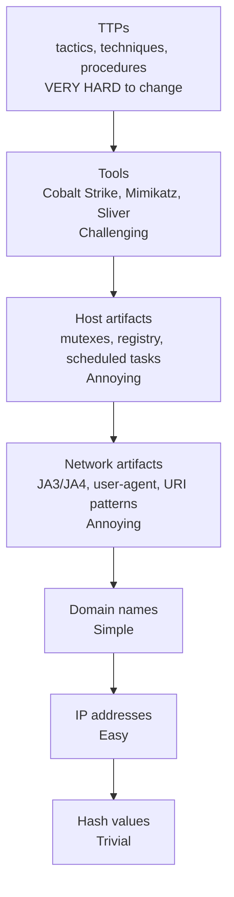

# Attack Indicators (IOC and IOA)

Every intrusion leaves traces. A process spawns where one shouldn't. A DNS query goes to a domain that was registered yesterday. A service account logs in from a country it has never logged in from. An EXE is dropped into `C:\Users\Public\` with a name that matches no known software. None of these are attacks by themselves — they are **indicators**, the fingerprints that an attacker (or their malware) leaves behind. The discipline of **detection engineering** is the work of recognising those fingerprints early enough to stop the breach before it becomes the news.

This lesson covers the two big families — **IOC (Indicators of Compromise)** and **IOA (Indicators of Attack)** — the **Pyramid of Pain** that ranks indicators by how hard they are for attackers to change, the major categories of host, network, behavioural and identity indicators, the rule formats blue teams use to encode them (YARA, Sigma, Snort/Suricata, STIX), and the failure modes that make most "we have IOCs in the SIEM" programs ineffective.

## Why this matters

Attacker dwell time — the gap between initial compromise and detection — is still measured in **weeks** for the average breach, and **months** when ransomware is preceded by quiet data theft. During that window the attacker maps the network, escalates privileges, finds the backups, exfiltrates everything worth selling, and only then encrypts. Catching the intrusion on day one versus day forty is the difference between "we contained it before any data left" and "we are on the front page and our customers' SSNs are on a leak site."

Indicators are how that catch happens. A SOC analyst does not see "an attack"; they see a pile of telemetry — process events, DNS queries, login records, file writes — out of which a small handful match patterns that humans, vendors, threat-intel feeds, and prior incidents have learned to associate with malicious activity. The **quality of the indicator set** and the **speed of the detection pipeline** decide whether the response starts at minute five or week eight.

There is a second reason to care: indicators are the shared currency of the security industry. CISA, vendors, ISACs, regulators, and incident-response firms all communicate in indicator terms. A SOC that cannot ingest, deploy, and tune indicator feeds is fundamentally disconnected from the rest of the field. Conversely, a SOC that can *only* consume indicators and never write its own behavioural detections is permanently one step behind every adversary who buys a fresh server.

Finally, indicators are also a *teaching* tool. Reading a fresh CTI report, mapping its IOCs and TTPs to your environment, and walking junior analysts through "what would each of these have looked like in our logs?" is one of the most effective ways to build SOC intuition. Real-world artefacts ground theory in a way no training course matches.

## Core concepts

### IOC (Indicators of Compromise) vs IOA (Indicators of Attack)

The two terms are often used interchangeably; they are not the same.

- An **IOC** is **backward-looking, forensic** — it answers "has this thing already happened on my network?" Examples: a file hash from a known ransomware sample, an IP address seen in a CTI feed, a domain used by a known APT, a registry key written by a specific RAT. IOCs are the natural output of incident response — once an attack is investigated, its artefacts become IOCs that other defenders can hunt for. They are concrete, easy to share, and **trivially evaded** by an attacker who recompiles the binary, rotates infrastructure, or buys a new domain.
- An **IOA** is **forward-looking, behavioural** — it answers "is something attack-like happening right now?" Examples: `winword.exe` spawning `powershell.exe` (Office macro behaviour), `lsass.exe` being read by a non-system process (credential dumping), a service account authenticating to 50 endpoints in 60 seconds (lateral movement), a sudden surge of failed Kerberos pre-auths (Kerberoasting). IOAs do not depend on the specific tool — they describe the **technique** — so they survive the attacker swapping Mimikatz for a new credential dumper.

Mature programs use both: IOCs as a cheap front-line filter and IOA-style behavioural rules as the durable layer underneath.

A useful mental model: an IOC is a *photograph of a known criminal*; an IOA is a *behaviour profile of "someone trying to break into the building."* The photograph fails the moment the criminal grows a beard; the behaviour profile keeps working as long as breaking-and-entering exists.

The two also differ in **provenance**. IOCs come from after-the-fact incident response, sandbox detonation, or vendor research — someone else found the bad thing and labelled it. IOAs are built proactively from understanding *how attacks work*, which means a SOC that writes its own IOAs is effectively doing internal threat research. That work is more expensive than subscribing to a feed, but the rules pay rent for years.

### The Pyramid of Pain (David Bianco)

In 2013, David Bianco published the **Pyramid of Pain**, a model that ranks indicator types by how much it hurts the attacker when you detect on them. The bottom of the pyramid is trivial for the attacker to change; the top is expensive and slow.

From bottom to top:

1. **Hash values** — trivial. Recompiling the binary or flipping a single byte produces a new hash.
2. **IP addresses** — easy. Attackers rotate VPS instances and Tor exits constantly; cloud IPs are disposable.
3. **Domain names** — moderate. Registering a new domain costs money and time, but is still routine.
4. **Network artifacts** — annoying. URI patterns, user-agent strings, JA3/JA4 TLS fingerprints, beacon intervals — changing these means rebuilding parts of the implant.
5. **Host artifacts** — annoying. Mutex names, service names, registry paths, named pipes, scheduled tasks coded into the malware.
6. **Tools** — challenging. Detecting the *toolkit itself* (Cobalt Strike, Mimikatz, Sliver) forces the attacker to switch tools or develop a new one.
7. **TTPs** (Tactics, Techniques, and Procedures) — **tough**. Detecting the *technique* — process injection, Kerberoasting, OAuth consent phishing — forces the attacker to learn a different way to operate. This is the only layer that scales.

The strategic implication is brutal: dropping a thousand hashes into your SIEM gives you a thousand alerts on yesterday's attackers and zero on today's. Detection engineering pays off when it climbs the pyramid.

The cost-of-evasion table below summarises the same idea quantitatively: a defender who detects only on hashes faces an attacker whose evasion cost is "press F7 to recompile"; a defender who detects on TTPs faces an attacker whose evasion cost is "hire and train a new operator with a different skill set."

### Host-based indicators

What the attacker leaves on a compromised endpoint:

- **File hashes** — MD5, SHA-1, SHA-256 of dropped binaries (low pyramid value).
- **Suspicious file paths** — `C:\Users\Public\`, `%TEMP%`, `%APPDATA%\Roaming\Microsoft\` for non-Microsoft binaries; `/tmp/`, `/dev/shm/` on Linux.
- **Registry keys** — autorun locations (`HKCU\Software\Microsoft\Windows\CurrentVersion\Run`), service definitions, COM hijacks, AppInit DLLs, Image File Execution Options (IFEO) abuse.
- **Scheduled tasks** — created by `schtasks.exe` or via the Task Scheduler API for persistence; pay attention to tasks that run as SYSTEM or with `/RU "NT AUTHORITY\SYSTEM"`.
- **Services** — new services pointing at unsigned binaries or `cmd.exe /c <payload>`; service binary paths in user-writable directories.
- **Persistence mechanisms** — WMI event subscriptions (`__EventFilter` + `__EventConsumer` + `__FilterToConsumerBinding`), BITS jobs, startup folder shortcuts, Office add-ins, DLL search-order hijacks.
- **Autoruns** — anything Sysinternals `autoruns.exe` would flag; baseline a clean image and diff against production.
- **Suspicious processes** — `powershell.exe -enc <base64>`, `rundll32.exe` with unusual exports, `regsvr32.exe /s /u /i:http://...` (Squiblydoo), `mshta.exe` running remote scripts, `wmic process call create`, `bitsadmin /transfer`.
- **Driver loads** — kernel drivers loaded from non-system paths or unsigned drivers; Bring Your Own Vulnerable Driver (BYOVD) exploitation.
- **Memory artefacts** — strings extracted from process memory, injected DLLs detected with tools like Volatility's `malfind`, RWX memory regions in non-JIT processes.

### Network-based indicators

What the attacker leaves on the wire:

- **DNS queries** to newly-registered domains (NRDs — registered in the past 30 days), DGA-generated names, or known malicious domains. Look for high-entropy subdomain labels (DNS tunnelling) and TXT-record responses larger than typical.
- **HTTP user-agents** that are hard-coded into malware (`Mozilla/4.0` — too old, suspicious; or unique strings from RAT families). Empty user-agents from non-browser endpoints are equally suspicious.
- **JA3 / JA4 TLS fingerprints** — hashes of TLS ClientHello parameters that fingerprint the *client library*. Cobalt Strike's default profile, Sliver, Metasploit, and curl all have distinct JA3s.
- **Beaconing patterns** — implant phones home every 60 seconds with low-jitter; a rolling FFT of connection intervals reveals the regularity. Even with random jitter, the *median* interval often clusters tightly.
- **C2 traffic** — DNS tunneling, HTTPS to a Cloudflare-fronted domain, ICMP data channels, websocket implants, domain fronting against major CDNs.
- **Unusual destinations** — workstation talking directly to a domain controller's RPC port (135, 49152+), or to `169.254.169.254` cloud metadata service, or to TOR directory authorities.
- **Anomalous traffic volume / direction** — server uploading more than it downloads (data exfiltration), client speaking SMB outbound to the internet, or RDP from the internet to a workstation.
- **Certificate anomalies** — self-signed certificates on internet-facing services, Let's Encrypt certificates issued to lookalike domains, certificates with suspicious organisation fields.

### Behavioural indicators

What patterns of activity look attack-like:

- **Unusual process trees** — `outlook.exe -> winword.exe -> powershell.exe -> rundll32.exe` is almost never benign.
- **Lateral movement** — workstation connecting to many other workstations on SMB/445 or WinRM/5985 in quick succession; PsExec / WMI / DCOM activity from a non-admin host.
- **Abnormal authentication** — service account login during off-hours, admin user logging in from a workstation they have never used, NTLM authentications when Kerberos would be expected.
- **Off-hours access** — bulk data reads at 03:14 from an account that always works 09:00–18:00.
- **Living-off-the-land binary (LOLBin) abuse** — `certutil -urlcache -f http://… payload.exe`, `bitsadmin /transfer`, `wmic process call create`, `msbuild.exe inline-task`, `installutil.exe`.
- **Volume / velocity anomalies** — a user account suddenly downloads ten thousand files; an API key suddenly does a thousand operations a minute.
- **Sequence anomalies** — login → password change → MFA disable → privileged role assignment, all within five minutes.

### Identity-based indicators

In cloud and federated environments, identity *is* the perimeter:

- **Impossible travel** — a user authenticates from London at 14:00 and from Singapore at 14:20.
- **Unusual MFA prompts** — repeated push notifications outside business hours (MFA fatigue / push bombing); legacy-protocol login attempts that bypass MFA.
- **Privilege escalation** — a normal user is suddenly added to a privileged role group (`Global Administrator`, `Domain Admins`).
- **OAuth consent grants** — a user grants an unfamiliar third-party app `Mail.Read` or `Files.ReadWrite.All`.
- **Token theft** — primary refresh token used from an unfamiliar device or country; session-cookie replay from a different IP than the original sign-in.
- **Disabled MFA / new MFA factor** registered just before high-value access; MFA method swap from authenticator app to SMS just before a password reset.
- **Service principal abuse** — an Entra service principal granted unusually broad scopes; client-credential flow used from a new IP range.

### Common malware indicators

A short field guide to the artefacts that recur in real samples:

- **Known C2 IPs** — published in CTI feeds (CISA AIS, AlienVault OTX, Mandiant, Microsoft Defender TI).
- **Mutex names** — many malware families create a uniquely-named mutex to avoid double-infection (`Global\<random-but-fixed-string>`); these are durable indicators across builds because changing the mutex requires editing source.
- **File paths** — RAT droppers often write to a fixed subfolder (`%APPDATA%\Roaming\<vendor-fake>\`), or impersonate a vendor (`%PROGRAMDATA%\Adobe\<random>`).
- **Named pipe / RPC pipe names** — Cobalt Strike's default `\\.\pipe\msagent_*` is famously detected; Sliver, Meterpreter, and others have similar tells.
- **Registry persistence** — RUN keys, services, scheduled tasks (see host indicators), Winlogon `Userinit` / `Shell` modification.
- **Scheduled tasks** — `\Microsoft\Windows\<malware-name>` or generic-looking names like `\GoogleUpdateTaskMachineUA` that don't actually correspond to Google.
- **PowerShell cmdline** — `-NoProfile -ExecutionPolicy Bypass -EncodedCommand <base64>` is the canonical "this is malware" pattern; `IEX (New-Object Net.WebClient).DownloadString(…)` is its older cousin.
- **Office macro signals** — `AutoOpen`, `Document_Open`, calls to `Shell` or `WScript.Shell`, base64 strings in document XML.
- **Ransom-note artefacts** — filename patterns (`README_DECRYPT.txt`, `_HOW_TO_RECOVER_FILES.html`), TOR onion addresses, BTC/Monero wallets, mailing addresses for "support."

### Detection rule formats

Once you know what to look for, you encode it as a rule that runs continuously:

- **YARA** — pattern-matching against file content (strings + byte sequences + boolean conditions). Used by AV, EDR, and threat-hunting on file shares. Strong for static analysis of binaries and documents.
- **Sigma** — generic SIEM rule format (YAML) that compiles to Splunk SPL, Elastic KQL, Sentinel KQL, QRadar AQL, etc. The *de facto* standard for sharing log-based detection rules.
- **Snort / Suricata** — network IDS rules (`alert tcp any any -> any 80 (content:"…"; sid:…;)`) for packet-level detection; Suricata also supports JA3 matching natively.
- **STIX 2.1 / TAXII 2.1** — JSON-based standard for representing and exchanging threat intelligence (indicators, malware, threat actors, relationships) in machine-readable form. TAXII is the transport.
- **MISP attribute model** — practical event/attribute schema used by the open-source MISP threat-sharing platform; interoperates with STIX.
- **OpenIOC** — older Mandiant XML format, mostly superseded by STIX 2.1 but still encountered in legacy feeds.

A mature program ingests STIX from CTI feeds, deploys hashes/IPs/domains to EDR/firewall directly, writes Sigma rules for the behavioural layer, and writes YARA for file-based hunts.

A minimal YARA rule for a hypothetical loader:

```yara
rule Quartzlock_Loader_v1
{
    meta:
        author      = "example.local SOC"
        description = "Detects Quartzlock loader by mutex + PDB path"
        date        = "2026-04-28"
    strings:
        $mutex   = "Global\\QzLk-2026-44a1" ascii wide
        $pdb     = "C:\\build\\quartzlock\\loader.pdb" ascii
        $magic   = { 51 4C 4B 31 } // "QLK1"
    condition:
        uint16(0) == 0x5A4D and 2 of them
}
```

A minimal Sigma rule for the Office-macro-into-PowerShell pattern:

```yaml
title: Office Application Spawns Encoded PowerShell
id: 6e2c1f0a-2c34-4f0a-9c45-3a3b89e5c0a1
status: experimental
description: Detects Word/Excel/PowerPoint launching PowerShell with -EncodedCommand
logsource:
    product: windows
    category: process_creation
detection:
    selection:
        ParentImage|endswith:
            - '\winword.exe'
            - '\excel.exe'
            - '\powerpnt.exe'
        Image|endswith: '\powershell.exe'
        CommandLine|contains: '-EncodedCommand'
    condition: selection
falsepositives:
    - Internal automation that legitimately launches PowerShell from Office (rare, document and exclude)
level: high
```

### Attribution challenges

Indicators do not prove who did it. Common confounders:

- **False flags** — APT37 deliberately leaving Russian-language strings in samples to misdirect; ransomware groups borrowing each other's ransom notes.
- **Recycled infrastructure** — a VPS that hosted ransomware in March hosts a phishing kit in October, run by a different actor.
- **Code reuse** — leaked Mimikatz, leaked Conti source, public Cobalt Strike cracks — the same technique appears in unrelated incidents.
- **Operator vs developer** — the same tool is rented to multiple intrusion crews (Initial Access Brokers, ransomware affiliates), so a hash hit only tells you which *toolkit* was used, not who used it.

Treat attribution as a working hypothesis, not a fact. Defensive decisions should not depend on it. Public attribution is a regulator, journalist, and government concern; defenders care about *what to block* and *what to detect next*.

## Pyramid of Pain diagram



Read top-to-bottom: detecting at the TTP layer hurts the attacker the most; detecting on hashes hurts them the least. A program that climbs the pyramid wins; one that lives on hash feeds churns alerts forever.

Concretely, a defender who deploys ten thousand hashes from a feed forces an attacker to spend zero minutes (recompile is automated in their build pipeline). A defender who detects on the JA3 fingerprint of the attacker's TLS library forces the attacker to switch libraries, retest C2 stability, and risk operational mistakes. A defender who alerts on the *technique* of credential dumping forces the attacker to invent a new technique — work measured in months by a small subset of operators. The pyramid is not a ranking of indicator quality in the abstract; it is a ranking of *how many hours of attacker time each detection costs*.

## Indicator categories at a glance

| Category | Pyramid tier | Source | Typical lifespan | Example |
|---|---|---|---|---|
| File hash | Hash (lowest) | EDR, AV, sandbox | Hours to days | `SHA-256: 9f86d…` of dropper |
| C2 IP | IP | Firewall, proxy logs | Hours to days | `185.220.101.0/24` Tor exit |
| C2 domain | Domain | DNS logs, proxy | Days to weeks | `cdn-update.example.tld` |
| URI pattern | Network artifact | Web proxy, IDS | Weeks | `/admin.php?id=` Cobalt Strike profile |
| User-agent | Network artifact | Proxy, web logs | Weeks | Hard-coded `RuRAT/1.0` string |
| JA3/JA4 | Network artifact | NDR, Suricata | Weeks to months | Sliver default JA3 |
| Mutex | Host artifact | EDR, memory dump | Months (often years) | `Global\<malware-id>` |
| Named pipe | Host artifact | EDR, Sysmon | Months | `\\.\pipe\msagent_<random>` |
| Scheduled task name | Host artifact | Sysmon, audit log | Months | `\Microsoft\Windows\<fake>` |
| Tool signature | Tool | YARA, EDR | Quarters | Cobalt Strike beacon DLL |
| Technique (TTP) | TTP (highest) | Behavioural rule | Years | T1003 LSASS dump |

The lifespan column is approximate — feed quality and attacker discipline shift each value — but the shape is reliable: lifespan grows as you climb the pyramid.

## Hands-on / practice

1. **Write a YARA rule for a sample binary.** Pick a benign EXE you control (`example.local`'s in-house IT-tool installer). Identify three unique strings (a copyright line, a PDB path, an unusual import name) and one byte pattern (the import-table fingerprint). Combine into a rule with `2 of ($s*) and $b1`. Test with `yara my_rule.yar samples/` against the original and a recompiled version. Discuss which of your indicators survives recompilation and which does not — that gap is the difference between a hash-tier and a host-artifact-tier detection.
2. **Write a Sigma rule for a Windows authentication anomaly.** Express "any logon from a non-corporate country to a privileged group account" in Sigma YAML. Map fields to the Windows `Security` log (`EventID: 4624`, `LogonType: 10`, `TargetUserName`, `IpAddress`). Convert to Splunk SPL with `sigmac -t splunk` and validate it returns the seeded test event. Bonus: convert the same rule to KQL with `sigma convert -t microsoft365defender` and confirm the field mapping.
3. **Query VirusTotal for an IOC and pivot through related indicators.** Take a SHA-256 from a public CTI feed; in VT, pivot from the file to its contacted domains, those domains to other files that contacted them, those files to embedded URLs. Document at what step the indicator value crossed from "narrow IOC" to "infrastructure cluster" — that pivot is the heart of threat-intel work, and it is the moment your single feed hash turns into ten new hashes, six new domains, and one ASN to monitor.
4. **Identify Cobalt Strike beacon traffic in a Wireshark PCAP.** Load a public CS beacon PCAP (Malware Traffic Analysis archives have several). Look for: TLS ClientHello with the default JA3 (`a0e9f5d64349fb13191bc781f81f42e1`), regular 60-second beacon intervals (Statistics → Conversations → sort by duration), URI paths like `/dot.gif`, `/submit.php?id=…`. Note which indicators climb the pyramid — the JA3 is a network artifact (annoying for attacker to change), the URI paths are tied to the Malleable C2 profile (host artifact-tier).
5. **Build a JA3 fingerprint from a TLS ClientHello.** Capture a single TLS session with Wireshark, expand the ClientHello, copy out the values: `TLSVersion,Ciphers,Extensions,EllipticCurves,EllipticCurvePointFormats`, concatenate with commas and dashes per the JA3 spec, then MD5. Compare against the [open JA3 database](https://github.com/salesforce/ja3) — does your client library show up? Repeat the exercise for JA4 (which is more resilient to extension shuffling) and compare resilience.

## Worked example — `example.local` SOC processes a CTI feed

It is 09:14 on a Tuesday at `example.local`. The SOC analyst on shift, Aysel, opens her ticket queue and finds one item from the threat-intel platform: a fresh STIX 2.1 bundle pushed via TAXII from the industry ISAC. The bundle describes a new ransomware campaign, "Quartzlock," with **40 file hashes**, **12 C2 domains**, **6 IP addresses**, **3 PowerShell command-line patterns**, and **2 MITRE ATT&CK technique mappings** (T1059.001 PowerShell, T1486 Data Encrypted for Impact).

Aysel does not just dump the lot into the SIEM. She works the pyramid bottom-up:

**Bottom of pyramid — fast deployment.** The 40 hashes go straight into the EDR's custom-IOC blocklist via API; a hit will quarantine the file and alert. The 6 IPs go into the firewall's deny-list. The 12 domains go into the recursive DNS resolver's RPZ (response-policy zone), so any internal lookup gets redirected to a sinkhole. Total time: ~20 minutes. Total durability: low — the attacker rotates these in days. But they are free (the work is automation, not analysis) and they cover the case where Quartzlock-the-affiliate hits `example.local` tomorrow with the same toolkit they used yesterday.

**Middle of pyramid — Sigma rules.** Aysel inspects the PowerShell command-line patterns. Two of them are classic `-NoProfile -EncodedCommand` invocations launched from `winword.exe`. She writes a Sigma rule keyed on `ParentImage: '*\winword.exe'` AND `Image: '*\powershell.exe'` AND `CommandLine: '*-EncodedCommand*'`. This is much harder for the attacker to evade than the specific encoded payload — they would need to change *how* the macro launches the implant, not what it executes. She reviews the rule against 30 days of historical data: zero hits. Good — the rule is specific enough to be quiet but generic enough to catch tomorrow's mutation of the same technique.

**Top of pyramid — TTP-level hunt.** Aysel pulls the ATT&CK Navigator, marks T1059.001 and T1486, and confirms `example.local` already has Sigma coverage for both. But she notices the campaign's reported initial-access vector — OAuth consent phishing (T1566.002 / T1528) — does not have a SOC dashboard. She files a backlog item to build one: query Microsoft Entra audit logs for `Add OAuth2PermissionGrant` events targeting `Mail.Read` or `Files.ReadWrite.All` for unfamiliar app IDs. This rule will detect Quartzlock *and* every other actor using the same technique, for as long as the technique exists.

**One week later.** The hash-block fired three times — three users tried to open a phishing attachment, the EDR quarantined it. Useful, but those payloads are already different hashes by now. The Sigma rule fired once — a contractor's macro-enabled spreadsheet, false positive, tuned out. The OAuth-consent dashboard fired zero times — but it's there, and on the day Quartzlock or its successor lands at `example.local`, that dashboard is what catches it.

Aysel's after-action note in the ticket: *"Hashes/IPs/domains pushed and they will age out within a week — that is fine, they cost us nothing. The Sigma rule is a structural improvement; the OAuth-consent dashboard is the real win. Climb the pyramid."*

The lesson her team takes from this is that an indicator workflow is a pipeline, not a list. Each layer of the pyramid corresponds to a different deployment target, a different durability budget, and a different expected hit rate. Hashes are cheap and high-volume; behavioural rules are slow to write and low-volume; TTP-level dashboards are expensive but evergreen. A balanced program funds all three.

A second `example.local` lesson worth highlighting: when the SOC writes a new behavioural detection, they pair it with a **detection-as-code** pull request. The Sigma YAML lives in a Git repo with the rest of their security automation; CI lints it, validates field references, and runs it against a unit-test corpus of synthetic events. A rule that does not fire on a known-good example fails the build. A rule that fires on the negative-case event fails the build. This gives the team confidence that what is in the SIEM today is what the engineer wrote, and that next month's schema change to the log source will not silently break the rule. Indicator deployment without this kind of feedback loop is how SOCs end up "covered on paper" but blind in practice.

## From indicators to detections — a workflow

A practical pipeline that most well-run SOCs converge on:

1. **Ingest.** STIX/TAXII feeds, vendor APIs, ISAC bundles, internal IR output, sandbox detonations. Normalise into a single threat-intel platform (MISP, OpenCTI, ThreatConnect, vendor TIP).
2. **Score.** Weight indicators by source reliability, age, observed-in-the-wild count, and severity tag. Drop anything below threshold.
3. **Deploy.** Push hashes/IPs/domains to enforcement points (EDR custom IOC list, firewall, secure web gateway, DNS RPZ). Push logs-only indicators to the SIEM watchlist.
4. **Correlate.** Build SIEM rules that combine indicator hits with behavioural context — "domain X resolved" plus "and the resolving host then ran PowerShell within 60s" is a real alert; the domain hit alone is noise.
5. **Hunt.** On a recurring cadence, take the most-trusted feed indicators and hunt retrospectively across 90-day logs for partial matches the live rules might have missed.
6. **Tune.** Track false-positive rate per indicator and per rule weekly. Retire indicators that age out; rewrite rules that drift.
7. **Share.** Sanitise findings and contribute back to the ISAC, MISP community, or vendor feed. Defence is a collective effort.

Steps 4–7 are where most programs underinvest. Ingest and deploy are easy to automate and easy to demo; correlate, hunt, tune, share are where actual detection value compounds.

Two metrics worth tracking against this pipeline:

- **Mean time to deploy (MTTD-deploy)** — from feed receipt to the indicator being live in enforcement and SIEM. Target: under 30 minutes for high-confidence feeds.
- **Indicator-to-alert ratio** — for every 1,000 indicators ingested, how many fired at least one true-positive alert in 90 days. A healthy program has this between 0.5% and 5%; below 0.5% suggests stale feeds, above 5% suggests indicators are being conflated with full detection rules.

## Troubleshooting & pitfalls

- **IOC age.** Most public IOCs are stale within 7–14 days. A feed older than two weeks blocks last fortnight's attacker, not this week's.
- **False positives from hash-only detection.** Hashes are precise but brittle; relying solely on them produces zero false positives but very few true positives once attackers recompile.
- **Attribution-driven hunts.** Hunting "for APT29" rather than "for the technique APT29 used" misses every other actor doing the same thing — and most APTs share techniques.
- **Single-indicator alerts.** One IOC match is rarely an incident — correlate with at least one other signal (process anomaly, lateral-movement pattern, off-hours auth) before paging.
- **Public-feed quality issues.** Free feeds carry stale data, mislabelled samples, and parked-domain noise. Tier feeds by quality, weight rules by feed reliability, and review false-positive rates monthly.
- **Missing the TTP-layer hunt.** Programs that buy a feed and dump it into the SIEM never climb the pyramid. Budget engineering hours for Sigma/behavioural rules, not just feed integrations.
- **"We have IOCs in the SIEM" doesn't mean detection works.** A loaded indicator with no matching log source, broken parser, or silenced alert delivers zero detection. Test end-to-end with a purple-team exercise.
- **Hash collisions and partial matches.** MD5 is broken — use SHA-256 minimum. Beware "fuzzy" hashes (ssdeep, imphash) when used alone — they are clustering tools, not exact-match indicators.
- **TLD reputation as a proxy.** Blocking `.zip`, `.click`, or `.top` outright catches some malware but also bans a long tail of legitimate sites; treat TLD signals as a feature in a model, not a blanket ban.
- **JA3 fingerprint drift.** Modern TLS libraries (BoringSSL, Go 1.20+) shuffle extensions on each connection — JA3 alone no longer pins a client. Use JA4, JA4S, or behavioural correlation.
- **DNS over HTTPS / DNS over TLS** breaks DNS-based indicator visibility unless the network forces internal resolvers and blocks egress to public DoH endpoints.
- **Encrypted SNI / ECH** will erode SNI-based indicator visibility further — plan for it before it reaches your network.
- **Indicator overload.** A SIEM with five million active IOCs runs slower than one with fifty thousand carefully curated ones, and produces no better detections.
- **Stale exclusion lists.** "Allow-list this hash for the IT scanner exception" never gets removed, and three years later the exclusion is the gap an attacker uses.
- **No feedback loop.** When an IOC fires, capture *what was useful and what wasn't* — alert quality declines silently otherwise.
- **Confusing IOC with detection logic.** An IOC is data; a detection rule is a sensor + condition + response. The IOC is one input to the rule.
- **Missing logs at the right layer.** Sigma rule for `Sysmon Event ID 1` is useless if Sysmon isn't deployed. Audit log coverage *first*, write rules *second*.
- **Privacy and legal exposure.** Sharing IOCs cross-organisation can leak business context (filenames, internal IPs, usernames). Sanitise before posting to public sharing platforms; use TLP (Traffic Light Protocol) markings.
- **Tool detection is not technique detection.** Detecting Mimikatz is good; an attacker using Cobalt Strike's built-in `lsadump` does the same thing without the Mimikatz binary. Detect the technique (`lsass.exe` handle access), not just the tool.
- **Unvalidated rule expiry.** Rules accumulate; without a periodic review, half of them silently stop firing because the underlying log source changed schema. Schedule quarterly detection reviews.
- **Over-trusting vendor reputation feeds.** Vendor reputation databases lag reality and frequently mislabel hosting providers; supplement, never solely rely.

## Key takeaways

- **IOC is forensic, IOA is behavioural** — use both, but invest more in IOAs because they survive attacker iteration.
- **Climb the Pyramid of Pain** — every hour spent on TTP-level detection beats ten hours on hash feeds.
- **Hosts, network, behaviour, identity** are the four indicator surfaces — coverage gaps in any one are exploited routinely.
- **YARA, Sigma, Snort/Suricata, STIX/TAXII** are the standard languages — learn at least Sigma and YARA, and consume STIX feeds.
- **Common malware indicators** (mutexes, named pipes, registry persistence, PowerShell cmdline patterns) sit higher on the pyramid than hashes — write rules for them.
- **Attribution is uncertain** — defensive action does not depend on knowing the actor; it depends on detecting the technique.
- **Detection coverage is engineered, not bought** — feeds are an input; behavioural rules and validated alerting pipelines are the product.
- **Test end-to-end** — purple-team exercises confirm an indicator actually fires an alert that reaches a human.
- **Indicator hygiene compounds** — quarterly reviews of feed quality, rule firing rates, and exclusion lists save more time than they cost.
- **Detection-as-code** — putting Sigma/YARA rules in Git with CI tests turns brittle SIEM content into versioned, reviewable, testable engineering artefacts.
- **Share back** — sanitised contributions to MISP, ISACs, or vendor research strengthen the whole community and earn reciprocal access to better feeds.

## References

- David Bianco — [The Pyramid of Pain (original blog post)](https://detect-respond.blogspot.com/2013/03/the-pyramid-of-pain.html)
- MITRE ATT&CK framework — [attack.mitre.org](https://attack.mitre.org/)
- MITRE ATT&CK Navigator — [mitre-attack.github.io/attack-navigator](https://mitre-attack.github.io/attack-navigator/)
- STIX 2.1 specification — [oasis-open.github.io/cti-documentation/stix/intro](https://oasis-open.github.io/cti-documentation/stix/intro)
- TAXII 2.1 specification — [oasis-open.github.io/cti-documentation/taxii/intro](https://oasis-open.github.io/cti-documentation/taxii/intro)
- YARA documentation — [yara.readthedocs.io](https://yara.readthedocs.io/)
- Sigma project — [github.com/SigmaHQ/sigma](https://github.com/SigmaHQ/sigma)
- Mandiant APT1 report — [mandiant.com/resources/reports/apt1-exposing-one-chinas-cyber-espionage-units](https://www.mandiant.com/resources/reports/apt1-exposing-one-chinas-cyber-espionage-units)
- Mandiant M-Trends annual reports — [mandiant.com/m-trends](https://www.mandiant.com/m-trends)
- Lockheed Martin Cyber Kill Chain — [lockheedmartin.com/en-us/capabilities/cyber/cyber-kill-chain.html](https://www.lockheedmartin.com/en-us/capabilities/cyber/cyber-kill-chain.html)
- JA3/JA4 fingerprinting — [github.com/salesforce/ja3](https://github.com/salesforce/ja3) and [github.com/FoxIO-LLC/ja4](https://github.com/FoxIO-LLC/ja4)
- Suricata IDS — [suricata.io](https://suricata.io/)
- Snort IDS — [snort.org](https://www.snort.org/)
- CISA Known Exploited Vulnerabilities catalog — [cisa.gov/known-exploited-vulnerabilities-catalog](https://www.cisa.gov/known-exploited-vulnerabilities-catalog)
- Sysinternals Autoruns — [learn.microsoft.com/en-us/sysinternals/downloads/autoruns](https://learn.microsoft.com/en-us/sysinternals/downloads/autoruns)
- Sysmon — [learn.microsoft.com/en-us/sysinternals/downloads/sysmon](https://learn.microsoft.com/en-us/sysinternals/downloads/sysmon)
- MISP — [misp-project.org](https://www.misp-project.org/)
- AlienVault OTX — [otx.alienvault.com](https://otx.alienvault.com/)
- Malware Traffic Analysis archives — [malware-traffic-analysis.net](https://www.malware-traffic-analysis.net/)
- Florian Roth, "How to write Sigma rules" — [github.com/Neo23x0/sigma](https://github.com/Neo23x0/sigma)
- OpenCTI — [opencti.io](https://www.opencti.io/)
- CISA Automated Indicator Sharing (AIS) — [cisa.gov/ais](https://www.cisa.gov/ais)
- Traffic Light Protocol (TLP) v2.0 — [first.org/tlp](https://www.first.org/tlp/)
- Atomic Red Team — [atomicredteam.io](https://atomicredteam.io/)
- ATT&CK Evaluations — [attackevals.mitre-engenuity.org](https://attackevals.mitre-engenuity.org/)

## Common misconceptions

- **"More feeds = better detection."** Past a certain volume, additional feeds add noise faster than signal. Curate ruthlessly; one well-tuned feed of two thousand high-confidence indicators beats ten feeds of fifty thousand each.
- **"IOCs detect zero-days."** They don't, by definition — an IOC is what *previous* victims found. Behavioural / TTP rules catch novel campaigns; IOCs catch repeats.
- **"YARA is for malware analysts, not SOC."** YARA is also a search engine across file shares, mail attachments, EDR file inventories, and S3 buckets. SOC analysts use it daily for retro hunts.
- **"We block at the firewall, we are safe."** Firewall blocks stop only the specific IP/port. Attackers move infrastructure faster than the firewall feed updates.
- **"MITRE ATT&CK coverage = detection coverage."** Coverage on a heatmap means a rule *exists* — not that it fires correctly, ships to a human, and gets actioned in time. Distinguish coverage from efficacy.
- **"Threat intel is a separate team."** In small organisations, the SOC analyst, IR engineer, and CTI consumer are the same person. Even in large ones, isolating CTI from detection engineering produces beautiful reports nobody acts on.
- **"Open-source feeds are good enough."** They are an excellent baseline, especially CISA AIS, MISP communities, and vendor-published research blogs — but high-end commercial feeds add coverage of long-dwell, targeted-attack indicators that volunteer aggregators rarely surface. Combine.
- **"AI/ML will replace IOCs."** ML-driven detection (UEBA, anomaly scoring) complements indicator-based detection but does not replace it. ML is strong on volume anomalies, weak on rare-event known-bad. Use both.

## Related lessons

- [Social engineering](./social-engineering.md) — phishing and pretexting, the most common precursor to the indicators above.
- [Initial access](./initial-access.md) — how attackers get the first foothold; many indicators in this lesson are evidence of that step.
- [Penetration testing](./penetration-testing.md) — purple-team exercises that validate your detection coverage end-to-end.
- [OWASP Top 10](./owasp-top-10.md) — web-app indicators (SQLi attempts, XSS payloads in logs) overlap with the network/behavioural categories.
- [Investigation and mitigation](../blue-teaming/investigation-and-mitigation.md) — the blue-team workflow that consumes indicators and turns alerts into incidents.
- [Digital forensics](../blue-teaming/digital-forensics.md) — extracting host indicators from disk, memory, and network captures.
- [Threat intel and malware analysis tools](../general-security/open-source-tools/threat-intel-and-malware.md) — open-source tooling for ingesting and pivoting on indicators.
- [SIEM and monitoring](../general-security/open-source-tools/siem-and-monitoring.md) — where the rules from this lesson actually run.
