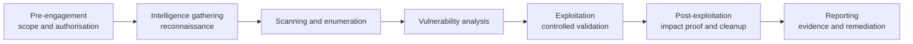

# CEH M01 — Introduction to Ethical Hacking

This lesson is the short, exam-focused starting point for the **Certified Ethical Hacker (CEH v13)** path. It connects the concepts that later modules use without copying a complete CEH textbook. Detailed topics are linked to their canonical lessons in this site.

> **Safety rule:** only test systems that you own or have explicit written permission to assess. A public address, a classroom network, or a bug that you discovered by accident is not automatically in scope.

## Learning objectives

By the end of this lesson, you should be able to:

- explain ethical hacking and its legal limits;
- distinguish common threat-actor types;
- separate threat, vulnerability, exploit, risk, attack vector, and TTP;
- compare vulnerability scanning, penetration testing, and red teaming;
- map a test to its main phases and frameworks;
- choose a safe lab exercise and answer common M01 questions.

## What is ethical hacking?

**Ethical hacking** is an authorised security assessment that uses attacker-like techniques to find, validate, and report weaknesses so they can be fixed. The ethical difference is not the tool or the command. It is the combination of:

1. **Permission** — the asset owner has authorised the work.
2. **Scope** — targets, methods, time windows, and limits are defined.
3. **Purpose** — the goal is to reduce risk, not to obtain personal benefit.
4. **Evidence and reporting** — results are handled securely and communicated to the owner.

An ethical hacker should prove the smallest amount of impact needed. Do not dump an entire database, disrupt availability, persist after the test, or access unrelated data merely because a vulnerability makes it possible.

### Legal and ethical boundaries

Before testing, confirm:

- the written authorisation and the person who signed it have authority over the assets;
- exact in-scope IP ranges, domains, applications, accounts, and cloud tenants;
- prohibited targets and techniques, especially denial-of-service, phishing, physical entry, and social engineering;
- test windows, emergency contacts, stop conditions, and provider rules;
- evidence storage, personal-data handling, retention, and secure deletion;
- the reporting and responsible-disclosure channel.

If scope is unclear, stop and ask the owner. Do not interpret silence as permission. Testing a third-party host, cloud service, or employee account may require separate authorisation from that third party.

The existing [Penetration Testing](./penetration-testing.md) lesson covers Rules of Engagement, authorisation letters, PTES, reporting, and legal considerations in more depth.

## Threat terminology

These terms describe different parts of the same security problem:

| Term | Meaning | Example |
|---|---|---|
| **Asset** | Something valuable that must be protected | Customer database |
| **Threat** | A possible cause of harm | Criminal group targeting customer data |
| **Vulnerability** | A weakness that can be abused | Unpatched web server |
| **Exploit** | A method, code, or action that uses a vulnerability | A crafted request that triggers the flaw |
| **Impact** | The resulting harm | Data disclosure or service outage |
| **Risk** | The possibility and consequence of loss | High likelihood multiplied by high impact |
| **Attack vector** | The route used to reach a target | Phishing email, exposed service, stolen credential |
| **Attack surface** | The total set of reachable paths and assets | Public services, users, vendors, APIs, and devices |
| **TTP** | Tactics, techniques, and procedures used by an actor | Credential phishing followed by cloud-account abuse |

An exploit is not the same as a vulnerability: the vulnerability is the weakness; the exploit is how it is used. A threat is not automatically a risk until likelihood and impact are considered.

## Threat-actor taxonomy

Labels are useful shortcuts, not proof of attribution:

| Actor | Typical motivation or capability |
|---|---|
| **White hat** | Authorised professional or researcher |
| **Black hat** | Unauthorised actor seeking profit, access, disruption, or other benefit |
| **Gray hat** | Acts without clear permission, even if the claimed intention is helpful |
| **Script kiddie** | Uses existing tools and instructions with limited original skill |
| **Insider** | Employee, contractor, or partner with legitimate access; may be malicious or negligent |
| **Hacktivist** | Ideologically motivated actor seeking publicity or disruption |
| **Organised cybercrime** | Financially motivated groups, including ransomware operations |
| **Nation-state / APT** | Well-resourced actor conducting long-term espionage, influence, or disruption |

For deeper actor categories, naming conventions, and ATT&CK group mapping, see [Threat Actors and Threat Intelligence](./threat-actors-and-intel.md).

## Information security and the CIA triad

[Information Security and Cybersecurity](../general-security/information-security-vs-cybersecurity.md) explains the wider discipline and why cybersecurity is its digital-focused subset.

The **CIA triad** asks what a control protects:

- **Confidentiality** — unauthorised people cannot read the information.
- **Integrity** — information and systems cannot be changed without authorisation.
- **Availability** — authorised users can access them when needed.

Use the canonical [CIA Triad](../general-security/cia-triad.md) lesson for controls, DAD, data states, encryption, and DLP. For M01, remember that an attack can affect one, two, or all three pillars.

## Scan, penetration test, and red team

| Activity | Main question | Typical result |
|---|---|---|
| **Vulnerability scan** | Which known weaknesses or misconfigurations may exist? | Broad, automated findings requiring validation |
| **Penetration test** | Can weaknesses be chained to produce meaningful impact? | Scope-bounded technical evidence and remediation |
| **Red team** | Can a realistic adversary achieve a goal without being detected? | Goal-based attack simulation and detection/response lessons |

A scanner prioritises breadth and repeatability. A penetration tester validates findings and limits impact. A red team emulates an adversary and measures prevention, detection, and response. They complement one another; they are not interchangeable.

## Methodology map

The following map is a study model, not permission to attack real targets:

The phases can loop. A new finding can require more reconnaissance, and a stop condition can end testing before exploitation. In CEH questions, match the activity to its phase rather than assuming every engagement is strictly linear.

### Frameworks and standards

- **PTES** — a seven-phase penetration-testing execution model; useful for engagement flow.
- **NIST SP 800-115** — technical security testing guidance with planning, discovery, attack, and reporting concepts.
- **OWASP WSTG** — application-testing guidance; use it with the [OWASP Top 10](./owasp-top-10.md).
- **MITRE ATT&CK** — a knowledge base of adversary tactics and techniques, not a complete testing methodology.
- **Cyber Kill Chain** — a high-level model of attack progression; it is not identical to PTES.
- **OSSTMM** — a measurement-oriented security-testing methodology.

The detailed [Penetration Testing](./penetration-testing.md) and [Threat Actors and Threat Intelligence](./threat-actors-and-intel.md) lessons explain these frameworks further.

## Short standards note

For M01, recognise the purpose of these references rather than memorising every control:

| Reference | Why it matters |
|---|---|
| **NIST SP 800-115** | Technical security testing guidance |
| **PTES** | Penetration-test execution phases |
| **OWASP WSTG / Top 10** | Web application testing and common risks |
| **MITRE ATT&CK** | Adversary behaviour and TTP mapping |
| **CIS Controls** | Prioritised defensive safeguards |
| **ISO/IEC 27001** | Information-security management system requirements |

## Exam notes

- Permission and scope make a test ethical; a tool does not.
- Vulnerability is a weakness; exploit is the method that abuses it.
- Risk combines likelihood and impact.
- Attack vector is one route; attack surface is the total exposure.
- TTP means tactics, techniques, and procedures.
- White-box testing gives the tester extensive knowledge; black-box gives little; gray-box is in between.
- A vulnerability scan is not a penetration test.
- A red team is goal-oriented and tests detection and response as well as prevention.
- PTES describes engagement execution; ATT&CK describes adversary behaviour.
- CIA classifies security objectives, not attacker motivation.
- Written authorisation, Rules of Engagement, and stop conditions are essential.
- Information warfare concerns influence and information operations; cybercrime is primarily criminal activity for unlawful gain.
- AI/ML can be used defensively or offensively, but it is not a replacement for authorisation, scope, or security fundamentals.
- Compliance requirements can influence testing frequency and evidence, but compliance is not the same as security.

## Safe lab exercise

Use a deliberately vulnerable local VM, a container, or a platform that explicitly grants permission. Do not use public targets.

1. Write a one-page scope: target, time window, allowed methods, prohibited methods, and emergency stop condition.
2. Inventory the lab asset without sending traffic outside the lab network.
3. Classify three observations as threat, vulnerability, exploit, impact, or risk.
4. Select a preventive and a detective control for each observation.
5. Write a short report with evidence, risk, and remediation; do not retain unnecessary sensitive data.

## Mini quiz

1. What makes the same scanning tool ethical in one situation and unauthorised in another?
2. Is an unpatched service a threat, vulnerability, or exploit?
3. Which activity is primarily broad and automated: a vulnerability scan or a red-team engagement?
4. Which framework maps adversary behaviour to tactics and techniques?
5. What document defines targets, methods, time windows, and prohibited actions?
6. How do attack vector and attack surface differ?
7. Which testing model gives the tester partial knowledge?
8. Why should a tester stop when a finding reaches unrelated third-party data?

### Answers

1. Written permission and defined scope.
2. A vulnerability.
3. A vulnerability scan.
4. MITRE ATT&CK.
5. The Rules of Engagement and related authorisation documents.
6. A vector is one route; the surface is the total set of exposed routes and assets.
7. Gray-box testing.
8. It is outside scope and may create legal, privacy, and operational harm.

## Next lessons

Continue with [Footprinting and Reconnaissance](./osint-basics.md), then use the networking foundations before studying the later CEH modules. For testing boundaries and engagement workflow, revisit [Penetration Testing](./penetration-testing.md).
