# Network Attacks

Every defended application eventually meets the network. A well-hardened web app still trusts that the bytes it receives came from the client whose IP is in the TCP header; a perfect identity provider still trusts that the user typing the password is sitting on the other side of an unhijacked TLS tunnel; a flawless backup pipeline still trusts that DNS resolves the storage endpoint to the right IP. **Network attacks** are the family of techniques that break those trust assumptions — by sniffing traffic the protocol assumed was private, by spoofing identity at L2 or L3, by inserting an attacker into the conversation, by drowning the server in volume, by poisoning the lookups everyone depends on, by forging the routes that move packets between continents.

This lesson covers the major branches of the network-attack tree — **sniffing**, **spoofing** (ARP, MAC, IP, DNS), **MITM**, **DoS / DDoS**, **DNS attacks**, **session hijacking**, **wireless attacks**, **routing attacks** (BGP), and **Layer 2 attacks** (VLAN hopping, STP, DHCP starvation) — and pairs each with the defense that actually works against it. Red-team operators read this to understand what to throw at a network; blue-team operators read it to understand what to detect and where to invest.

## Why this matters

You can write the most secure application code on Earth, ship it through an unimpeachable CI pipeline, run it on a hardened operating system, and still be owned because somebody on the same coffee-shop Wi-Fi as your CFO ran `arpspoof` and watched her session cookie sail by in plaintext. You can run a flawless cloud control plane and still see your customers redirected to a phishing site because a small ISP in another hemisphere announced your prefix to the global routing table for fifteen minutes. You can have perfect TLS everywhere and still lose to a Slowloris attack that ties up every worker thread in your reverse proxy with one-byte-per-second HTTP headers. Network attacks are how strong-on-paper systems lose in practice.

Network attacks also matter because they are **legacy-rich**. The protocols that carry the modern internet — ARP, IP, DNS, BGP, 802.11 — were designed in eras when authentication and integrity were luxuries. Their successors (DNSSEC, RPKI, 802.1X, WPA3, IPsec) exist, but adoption is uneven, deployment is expensive, and a single un-upgraded device, branch office, or peering session is enough to keep the attacker's playbook alive. A defender who does not understand the original protocols cannot evaluate why the upgrade matters, where it has gaps, or what to monitor when the upgrade fails.

Finally, network attacks are **the prerequisite layer** for most other red-team objectives. An attacker who controls the network controls credentials, sessions, lookups, and reachability — and from there, application compromise, identity compromise, and data exfiltration follow. Understanding the offensive side is the only way to design defenses that survive contact with a real adversary rather than a tabletop scenario.

A useful framing: most security investment in the past decade has been at the application layer (SAST, DAST, WAF, secrets management) and at the identity layer (MFA, conditional access, zero-trust). Both are necessary; neither absolves the network. A WAF cannot stop a Slowloris that targets the WAF itself. MFA cannot stop session-cookie replay. Strong authentication does not help if DNS resolves your IdP's hostname to an attacker's host. The network is the layer everything else trusts, and that trust is exactly what attacks in this lesson exploit.

## Core concepts

### Sniffing and passive eavesdropping

The original network attack: **listen to traffic that is not addressed to you**. On a 1990s shared-medium Ethernet hub or a wireless network without strong encryption, every frame reached every host, and any NIC put into **promiscuous mode** could read all of it. Tools like `tcpdump`, Wireshark, `dsniff`, and `ettercap` made this trivial. Switched networks largely killed casual sniffing on wired LANs — frames are forwarded only to the destination port — but **MAC flooding** (filling the switch CAM table until it fails open and behaves like a hub) and **port mirroring abuse** keep the attack alive in the right environment. On wireless, sniffing remained easy until WPA2/WPA3 made over-the-air payloads opaque.

The single biggest reason sniffing matters less today than in 2005 is **TLS everywhere**. HTTPS, secure SMTP, secure DNS, encrypted instant messaging, and end-to-end encrypted apps mean that even a perfectly positioned eavesdropper sees only ciphertext metadata — IP, port, SNI (until ECH lands), packet sizes, timing. That metadata still leaks plenty (websites visited, app fingerprints, even typed-content estimation via packet-size analysis), but the era of grabbing plaintext passwords off a Starbucks Wi-Fi is mostly over. Mostly — every legacy application that still ships an HTTP-only login flow, every IoT device with hard-coded plaintext telemetry, every internal admin panel on `http://intranet.example.local` is a counter-example.

The defender's mental model should distinguish **passive** sniffing (just listening, indistinguishable from the network and therefore undetectable) from **active** sniffing (where the attacker has to do something — MAC flood, ARP poison, deauth — to put themselves on the wire). Passive sniffing on switched, fully-TLS networks is mostly a dead end; active sniffing is what shows up in real intrusions, and active sniffing always leaves artefacts that the network can be instrumented to catch.

### Spoofing attacks

Spoofing means **claiming to be someone you are not at the network layer**. The variants:

- **ARP poisoning (LAN)** — RFC 826 ARP has no authentication. An attacker on the same broadcast domain sends gratuitous ARP replies claiming the IP of the gateway maps to the attacker's MAC. Every host in the subnet updates its ARP table and starts sending its outbound traffic through the attacker. From there: full MITM at L2. Tools: `arpspoof`, `ettercap`, `bettercap`. Defense: **Dynamic ARP Inspection (DAI)** on managed switches, paired with DHCP snooping.
- **MAC spoofing** — an attacker changes their NIC's MAC address to impersonate an authorised device, bypassing MAC-filter-only access controls (which are not a real control). Defense: 802.1X port authentication.
- **IP spoofing** — an attacker forges the source IP of outgoing packets. Useful for reflection/amplification DDoS (the response goes to the spoofed victim) and for evading IP-based ACLs in the rare case the attacker can also see the return traffic. **BCP 38 / RFC 2827 ingress filtering** by ISPs is the long-standing fix; deployment is incomplete, which is why amplification attacks still work.
- **DNS spoofing** — an attacker injects forged DNS responses, either by racing legitimate responses (cache poisoning) or by sitting on-path. Result: victims resolve `bank.example.local` to the attacker's IP. Defense: **DNSSEC** for response authentication, plus DoT/DoH for transport confidentiality.

What unifies all four is the absence of **cryptographic origin authentication** in the original protocol design. ARP, IP, DNS-over-UDP, and even early BGP all assumed a benign network where peers told the truth about their identity. Spoofing attacks exploit that assumption directly. The defenses are essentially "graft authentication onto the protocol after the fact" (DAI, DNSSEC, RPKI, IPsec), which is why deployment lags: it costs more than the original design ever intended.

### MITM (Man-in-the-Middle)

MITM is the umbrella technique: the attacker positions themselves between two endpoints so all traffic flows through them. The L2 path uses ARP poisoning; the L3 path uses DNS spoofing or BGP hijacking; the L7 path uses **SSL stripping** or **rogue certificate** issuance.

- **ARP-based MITM** — see above; once ARP is poisoned, the attacker forwards traffic and reads/modifies it on the way through.
- **DNS-based MITM** — answer the victim's DNS query with the attacker's IP, then proxy the connection to the real destination while logging credentials.
- **SSL stripping (sslstrip, Moxie Marlinspike, 2009)** — many users type `bank.example.local` into their browser, which issues HTTP first; a redirect normally bumps them to HTTPS. A MITM intercepts that initial HTTP request, fetches the HTTPS version on the user's behalf, and serves the response back over plain HTTP. The user never sees the lock icon — but if they do not notice, they enter credentials over plaintext. **HSTS** (HTTP Strict Transport Security) and HSTS preloading are the modern fixes; the browser refuses to ever speak HTTP to a preloaded host.
- **HTTPS interception via fake certs** — if the attacker can get the victim to trust a malicious CA (corporate proxy, compromised root, bug-installed root), they can mint valid-looking certificates for any domain. **Certificate Transparency**, **HPKP successors** (Expect-CT, now deprecated; CAA records), and proper root-store hygiene constrain this.
- **Man-in-the-Browser (MITB)** — a variant where malware sits inside the victim's browser (as a malicious extension or browser-helper object) and modifies traffic *after* TLS has decrypted it. From the application's perspective everything looks legitimate; from the user's perspective the displayed page looks legitimate; only the data on the wire and the data the user sees diverge. Banking trojans (Zeus, SpyEye historically; more recent variants persist) make heavy use of MITB. Defenses are endpoint-side: app integrity attestation, behaviour-based EDR, transaction confirmation out of band.

### DoS and DDoS

Denial of service is volume or resource exhaustion against a target. Three classic categories:

- **Volumetric** — fill the pipe with junk. UDP floods, ICMP floods, generic packet floods. Mitigation requires **upstream scrubbing** (Cloudflare, Akamai, AWS Shield, Azure DDoS Protection); a victim's own bandwidth is never enough.
- **Protocol** — exploit stateful protocol weaknesses. **SYN flood** sends countless TCP SYNs without ever completing the handshake, exhausting the target's half-open connection table. **Smurf attack** broadcasts an ICMP Echo with the victim's spoofed source IP, so every host on the subnet replies to the victim. Defenses: **SYN cookies** (Linux: `net.ipv4.tcp_syncookies=1`), broadcast-amplification disabled by default everywhere modern.
- **Application-layer** — attack at L7 with low-volume but expensive requests. **Slowloris** opens many HTTP connections and sends headers one byte at a time, holding connection slots open indefinitely. **HTTP flood** issues legitimate-looking requests at high rate, exhausting CPU or DB connections behind the front-end. Defenses: connection limits, per-IP rate limits, WAFs with behavioural rules, caching layers in front of dynamic origins.

DDoS — *distributed* denial of service — uses a botnet (hundreds of thousands to millions of compromised IoT devices, routers, or hosts) to launch the attack from many sources at once. **DDoS-for-hire markets** (booters / stressers) sell hours of attack traffic for tens of dollars; the market has shifted in the past decade from amateur-built botnets to commercial services renting compromised IoT capacity (Mirai variants and successors).

A separate dimension worth naming is **operational technology (OT)** DoS. Industrial control networks (SCADA, traffic-light controllers, refinery PLCs, manufacturing-line servos) run protocols designed before the internet was hostile (Modbus, DNP3, S7); a flood of malformed or even legitimate messages can take a controller offline and stop a physical process. The blast radius is physical — production halted, safety-system actuated, fuel valves stuck — so OT DoS sits in a different risk class from "the marketing site is slow." Segmentation, deep-packet protocol awareness on the IT/OT boundary, and engineering-team incident playbooks are the controls.

### DNS attacks

DNS is the internet's address book; whoever controls answers controls reachability.

- **Cache poisoning (Kaminsky 2008)** — Dan Kaminsky showed that a remote attacker could inject forged answers into a recursive resolver's cache by racing the legitimate response and exploiting predictable transaction IDs. Patches added **source port randomisation**, raising the entropy attackers must guess. Long-term fix: **DNSSEC**.
- **DNS hijacking** — compromise the registrar, the authoritative server, or the recursive resolver, and change the records directly. High-profile cases (Sea Turtle, DNSpionage) showed nation-state actors hijacking entire ccTLDs.
- **DNS amplification (reflective DDoS)** — attacker sends DNS queries with the victim's spoofed source IP to open resolvers; the resolver responds with a much larger answer (`ANY` queries, large TXT records) to the victim. Amplification factors of 50x are routine. Defense: **close open resolvers** to the internet; ISP **BCP 38 ingress filtering** to drop spoofed source IPs at the edge.
- **DNS tunnelling** — encode arbitrary data in DNS query labels and TXT-record responses to exfiltrate data or maintain C2 over a port (53) that almost every network allows. Detection: monitor for high-entropy subdomain labels, abnormal query volumes per client, large TXT responses.

### Session hijacking

Once authentication succeeds, the server typically issues a **session token** (cookie, JWT, opaque ID) the client presents on subsequent requests. Steal the token and you are the user.

- **Cookie theft** — XSS that exfiltrates `document.cookie`, malware that scrapes browser cookie stores, MITM that captures cookies set without `Secure`/`HttpOnly` flags.
- **Session fixation** — attacker sets a known session ID on the victim's browser before login, then reuses the same ID after the victim authenticates. Defense: regenerate the session ID on privilege change.
- **Predictable session IDs** — old frameworks generated IDs from `time + PID`, allowing brute-force prediction. Defense: cryptographically strong random IDs, sufficient length (≥128 bits of entropy).
- **Token replay** — primary refresh tokens stolen from a compromised endpoint replayed from another machine. Defense: **token-binding** to device, conditional access on device posture, short token lifetimes.

### Wireless attacks

Wireless networks broadcast — anyone in range receives the signal — so authentication and encryption do all the work.

- **Rogue AP** — an unauthorised access point plugged into the corporate LAN by an insider (often unintentionally), bridging the trusted internal network to whoever associates with the rogue.
- **Evil Twin** — an AP broadcasting the same SSID as the legitimate corporate network, with a stronger signal in some location, luring clients to associate. Combined with a captive portal that asks for AD credentials, it is a credential-harvesting goldmine.
- **Deauth attacks** — 802.11 management frames were unauthenticated until 802.11w (Protected Management Frames). An attacker sends spoofed deauth frames from the AP's MAC, kicking clients off; combined with a stronger Evil Twin, clients reassociate to the attacker.
- **KRACK (Key Reinstallation Attacks, 2017)** — flaws in the WPA2 4-way handshake allowed nonce reuse, breaking confidentiality of the data stream. Patched in clients and APs; legacy firmware lingers.
- **WPS PIN brute-force** — WPS PINs are 8 digits but split internally, making brute-force a 10⁴ + 10³ space — minutes to hours. Defense: disable WPS.

See [wireless security](../networking/secure-design/wireless-security.md) for the corresponding defenses.

### Routing attacks

The internet routes by trust. Each Autonomous System (AS) tells its neighbours which prefixes it owns; neighbours believe it. **BGP hijacking** abuses that trust:

- **Prefix hijack** — an AS announces a prefix it does not own, drawing some or all traffic for that prefix to itself. Sometimes accidental (Pakistan accidentally hijacked YouTube globally in 2008); sometimes deliberate (Russian-government-linked hijacks of cryptocurrency exchanges to steal credentials).
- **AS path forgery** — an AS prepends or alters AS path attributes to manipulate route preference.
- **Route leaks** — a customer AS accidentally announces routes from one provider to another, becoming a transit for traffic it cannot handle.

**RPKI (Resource Public Key Infrastructure)** plus **ROA (Route Origin Authorisation)** and emerging **BGPsec** (RFC 8205) are the cryptographic answer. Adoption is improving but uneven; the largest networks have made the biggest gains in the past five years.

### Layer 2 attacks

The local switch is a trust boundary too:

- **VLAN hopping (double-tagging)** — an attacker on a trunk-adjacent port crafts a frame with two 802.1Q tags; the first switch strips the outer and forwards the inner-tagged frame onto a VLAN the attacker should not reach. **Switch spoofing** abuses Dynamic Trunking Protocol (DTP) by negotiating trunk mode from an access port. Defenses: explicit `switchport mode access` on user ports, disable DTP, set the native VLAN to an unused ID.
- **STP attacks (BPDU spoofing)** — sending crafted BPDUs to become root bridge, redirecting traffic. Defense: **BPDU Guard** on edge ports, root guard on uplinks.
- **DHCP starvation** — exhaust the DHCP pool with thousands of forged requests, then run a rogue DHCP server. Defense: **DHCP snooping** on the switch.
- **CAM table overflow** — a close cousin of MAC flooding; once the switch's content-addressable-memory table fills, the switch fails open and floods unknown destinations to all ports, restoring hub-like behaviour and re-enabling sniffing. Defense: **port security** (limit MAC count per port).

The Layer 2 attack surface is the easiest place to forget about because most network engineers treat the access switch as plumbing. It is not — it is a trust boundary, and an attacker who plugs into a single conference-room port can quietly own the broadcast domain unless the access ports are configured defensively.

## Network attack taxonomy diagram

```mermaid
flowchart TB
    L2["L2 - Data Link"]
    L3["L3 - Network"]
    L4["L4 - Transport"]
    L7["L7 - Application"]

    L2 --> ARP["ARP poisoning"]
    L2 --> MAC["MAC spoofing / flood"]
    L2 --> VLAN["VLAN hopping"]
    L2 --> STP["STP / BPDU attacks"]
    L2 --> DHCPS["DHCP starvation"]

    L3 --> IPSP["IP spoofing"]
    L3 --> ICMP["ICMP floods / Smurf"]
    L3 --> BGP["BGP hijacking / route leaks"]

    L4 --> SYN["SYN flood"]
    L4 --> UDP["UDP flood"]

    L7 --> SLOW["Slowloris / HTTP flood"]
    L7 --> DNSP["DNS poisoning / amp"]
    L7 --> SSLS["SSL stripping"]
    L7 --> SESS["Session hijacking"]
```

Read top-down: as you climb the stack, attacks move from forging frame-level identity to subverting the application's own logic. A defender needs coverage at every layer because attackers chain — an Evil Twin (L2 wireless) opens the door to ARP poisoning (L2) which enables SSL strip (L7).

## Attack vs defense table

| Attack | Layer | Primary mitigation | Notes |
|---|---|---|---|
| Sniffing | L1/L2 | TLS everywhere, switched networks, WPA3 | Metadata still leaks even with TLS |
| ARP poisoning | L2 | Dynamic ARP Inspection (DAI) + DHCP snooping | Useless on unmanaged switches |
| MAC spoofing | L2 | 802.1X port authentication | MAC filtering alone is not a control |
| VLAN hopping | L2 | Disable DTP, explicit access mode, unused native VLAN | Default Cisco config is vulnerable |
| STP / BPDU | L2 | BPDU Guard, Root Guard | Edge ports must never accept BPDUs |
| DHCP starvation | L2 | DHCP snooping | Rogue DHCP detection part of same feature |
| IP spoofing | L3 | BCP 38 / RFC 2827 ingress filtering | ISP-side; deployment incomplete |
| BGP hijacking | L3 | RPKI + ROA, BGPsec, peer filtering | Adoption ramping but partial |
| ICMP / Smurf | L3 | Disable directed broadcast, rate-limit ICMP | Default-disabled now |
| SYN flood | L4 | SYN cookies, connection rate limits | Linux `tcp_syncookies=1` by default |
| UDP / amplification | L3/L4 | Upstream scrubbing, close open resolvers | DDoS-mitigation partner essential |
| Slowloris / HTTP flood | L7 | Connection caps, WAF behavioural rules, CDN | Reverse proxies need slow-loris defenses on |
| DNS cache poisoning | L7 | DNSSEC, port randomisation | DNSSEC adoption uneven |
| DNS amplification | L7 | Close open resolvers, BCP 38 | Reflector list curated by industry |
| DNS tunnelling | L7 | DNS query analytics, egress filtering | High-entropy label detection |
| SSL stripping | L7 | HSTS + HSTS preload | Only works if first request never reaches the wire |
| Session hijacking | L7 | `Secure`/`HttpOnly`/`SameSite`, token binding, regen on auth | XSS prevention also in scope |
| Rogue AP | wireless | Wireless IDS, NAC, 802.1X | Detection is half the battle |
| Evil Twin | wireless | 802.1X-EAP, certificate pinning, user training | Captive-portal phishing is the lure |
| KRACK | wireless | Patched WPA2 firmware, WPA3 | Long-tail of unpatched APs |
| WPS PIN brute-force | wireless | Disable WPS | No legitimate enterprise need |

## How attacks chain in real intrusions

Network attacks rarely show up alone. A real engagement composes several techniques into a chain, and the chain — not any single primitive — is what bypasses the defender's per-control thinking. Five chains worth recognising:

- **Coffee-shop credential theft.** Attacker associates to the same public Wi-Fi as the target, runs `bettercap` to ARP-poison the gateway, attempts SSL strip on the target's traffic. If any internal corporate site uses HTTP-only or has a non-preloaded HSTS bootstrap, credentials fall into the attacker's lap. Defense composition: corporate VPN, HSTS preload on every internal hostname, certificate pinning on mobile apps.
- **Lobby Evil Twin into corporate domain.** Attacker drops a battery-powered AP broadcasting the corporate SSID, harvests AD credentials via captive portal, replays them against the corporate VPN portal from a residential IP. Defense composition: 802.1X-EAP-TLS for Wi-Fi (no password to steal), conditional access on device posture, WIDS for rogue AP detection.
- **Open resolver to amplification.** Attacker scans the internet for misconfigured open recursive DNS servers, builds an attack list, and reflects spoofed-source DNS queries off them at a victim — the victim's own bandwidth saturates while none of the traffic comes from the attacker's IP. Defense composition: BCP 38 ingress filtering at upstream ISPs, scrubbing partner with anycast capacity, hardened response-rate-limiting on any of *your* recursive resolvers facing the public.
- **BGP hijack into TLS interception.** Attacker convinces a peering relationship to accept their announcement of the victim's prefix, redirects traffic through their AS, and either mints valid certificates from a CA willing to validate via DNS challenges (now redirected) or simply downgrades to HTTP for non-HSTS clients. Defense composition: RPKI ROAs published, CAA records pinning issuers, HSTS preload, CT log monitoring.
- **Internal LAN pivot.** Attacker gets a foothold via phishing on a corporate workstation, then uses ARP poisoning on the local subnet to MITM other workstations, harvest NTLM challenge-responses with `Responder`, relay them via `ntlmrelayx` to a server with SMB signing disabled, and pivot. Defense composition: SMB signing required everywhere, LLMNR/NBNS disabled, network segmentation reducing the blast radius of any single LAN.

Each chain shows the same pattern: a strong-on-paper defense (TLS, HSTS, AD, BGP) is undermined by a weak link several layers below or above it. Designing for the chain — not the individual control — is the core lesson.

## Hands-on / practice

1. **ARP poison a test LAN with `arpspoof` and confirm DAI blocks it.** Build an isolated lab with two clients and a managed switch (Cisco Catalyst, Juniper EX, or any vendor with DAI support). From a third Linux host connected to the same VLAN, run `arpspoof -i eth0 -t 10.0.0.20 10.0.0.1` to redirect client A's gateway traffic. Confirm via `arp -a` on the victim that the gateway MAC has been replaced. Then enable DHCP snooping and DAI on the switch (`ip dhcp snooping` and `ip arp inspection vlan 10`) and repeat — DAI should drop the spoofed reply and log a violation. Capture the switch log line.
2. **sslstrip demo against a deliberately-vulnerable site.** Stand up a test web app at `http://shop.example.local` that issues an HTTP-to-HTTPS redirect on the login path but does not set HSTS. From an attacker host, run `iptables -t nat -A PREROUTING -p tcp --destination-port 80 -j REDIRECT --to-port 8080` and `sslstrip -l 8080`, with ARP poisoning of the victim. Show that the user enters credentials over HTTP. Then add an `Strict-Transport-Security: max-age=31536000; includeSubDomains; preload` header to the site, clear browser state, and verify the strip fails on subsequent visits.
3. **Capture an Evil Twin attack with a hostapd lab.** On a spare laptop with a Wi-Fi card supporting AP mode, run `hostapd` configured to broadcast the same SSID as a test corporate network, with a captive portal collecting a fake "domain login." Use a second device to associate to the rogue AP (place the rogue closer than the legitimate AP) and submit credentials. Then deploy a wireless IDS (open-source: `Kismet`, commercial: Aruba/Cisco WIPS) and verify it detects the duplicate-SSID condition and signal-strength anomaly within minutes.
4. **Observe a SYN flood with `hping3` and verify SYN cookies.** Against an isolated test web server, run `hping3 -S -p 80 --flood --rand-source <target>`. Watch `ss -s` on the target — `synrecv` count climbs rapidly. With `net.ipv4.tcp_syncookies=0`, the listen queue saturates and new connections are refused. Set `net.ipv4.tcp_syncookies=1`, repeat the attack, and confirm legitimate clients still connect (cookies are issued in the SYN-ACK rather than reserving state).
5. **Trigger a DNS amplification reflection in a closed lab.** Stand up an open recursive resolver in a closed lab network (BIND or unbound with `recursion yes` to all). From an attacker host, send `dig ANY isc.org @resolver` with a spoofed source IP via `scapy` — observe the resolver respond to the spoofed victim with a much larger packet. Document the amplification factor. Then close the resolver (`allow-query { internal; };`), reissue the spoofed query, and confirm the resolver refuses.

## Worked example — `example.local` rogue AP exercise

It is the third Wednesday of the quarter; `example.local` runs a scheduled red-team / blue-team exercise. The red-team operator, Rashad, has been given a single objective: "demonstrate a wireless compromise of a corporate user without ever entering a server room or touching the wired network." His budget: a Raspberry Pi with two USB Wi-Fi adapters, one battery pack, and four hours.

**Red-team execution.** Rashad walks into the `example.local` lobby at 09:00 carrying a backpack. The Pi boots from battery, runs `hostapd` configured to broadcast `ExampleLocal-Guest` — the SSID of the public Wi-Fi network the receptionist gives to visitors — and a captive portal that mirrors the real `example.local` corporate sign-in page. The second adapter runs deauth bursts targeting the legitimate guest AP's MAC address every 90 seconds. Within twenty minutes, three guests (and two employees on lunch break who associate with the guest network from habit) have authenticated against the captive portal with what they believe are corporate credentials. Rashad logs the credentials locally — exfiltration is out of scope for this exercise — and packs up at 12:30.

**Blue-team detection.** At 09:18 the wireless IDS deployed across the lobby AP cluster fires alert `WIDS-DUP-SSID-001`: a non-managed AP is broadcasting `ExampleLocal-Guest` at -42 dBm from a location that does not match any legitimate AP in the registered inventory. The on-shift SOC analyst, Aysel, opens the alert. The detection logic is straightforward: every legitimate AP advertises a vendor-OUI whitelist plus a registered BSSID; a new BSSID announcing the same SSID, especially with an aggressive deauth pattern visible on the same channel, is the textbook Evil Twin signature.

**Containment.** Aysel does not chase the rogue device physically — that is facilities' job. Instead she pushes a NAC policy update: corporate-issued devices that have been observed associating with `ExampleLocal-Guest` in the past 24 hours are quarantined into a remediation VLAN until they have rotated their cached Wi-Fi credentials. She also pings facilities with the BSSID and approximate signal-direction data so they can locate the device. By 10:15, two employee laptops are in remediation; by 10:45, facilities locates "an unattended backpack near the lobby coffee station" (Rashad has gone for coffee himself, deliberately) and opens an incident.

**Lessons feeding into policy.** The post-exercise review produces three concrete changes to the wireless-security policy: (a) the corporate guest network is renamed to a non-spoofable convention combining a token issued in the visitor management system, defeating "associate from habit" ([wireless-security](../networking/secure-design/wireless-security.md)); (b) all `example.local`-issued laptops are reconfigured to use 802.1X EAP-TLS for corporate Wi-Fi, with certificate pinning, so even a perfect Evil Twin cannot harvest passwords because there are none to harvest; (c) the WIDS alert threshold for duplicate-SSID events is lowered from "5 minutes sustained" to "30 seconds sustained," because the red-team exercise showed credentials harvested in well under five minutes.

The point is not that the red team won or lost — it is that the exercise produced concrete, prioritised, owner-assigned blue-team work, validated against a real adversary action rather than a tabletop.

A second observation worth recording: the exercise also revealed an organisational gap. Aysel's NAC quarantine pushed two laptops into a remediation VLAN, but the helpdesk ticket process for "remove from quarantine" was not documented; both employees lost an hour to a ticket bouncing between teams. The wireless-security policy update therefore included a procedural item — a one-page runbook for remediation-VLAN exit — alongside the technical changes. Network-attack exercises always reveal both technical and procedural gaps; planning for the procedural side is the difference between an exercise that improves the program and an exercise that just generates a report.

Finally, the exercise reinforced a cultural point: the red team did not "beat" the blue team. Detection happened in eighteen minutes, containment in roughly an hour, and the lessons were captured the same week. A mature program treats red-team findings as an investment yield — work the blue team gets credit for absorbing — not as a scoreboard. `example.local`'s after-action review is run as a learning forum, not a blame session, and the metrics tracked are detection latency and time-to-remediation, not "did the red team win." That cultural framing is what makes the exercise worth running quarterly.

## Operational hardening checklist

A pragmatic minimum set of controls that closes the obvious gaps. Most are configuration, not capital expenditure; the work is discipline.

**Layer 2 / wired access**

- DHCP snooping enabled on all access switches.
- Dynamic ARP Inspection enabled on all VLANs that carry user devices.
- Port security (max-MAC) on user-facing ports.
- BPDU Guard on all edge ports; Root Guard on uplinks.
- DTP disabled, ports explicitly set to access mode, native VLAN set to a dedicated unused ID.
- 802.1X enabled on user ports where the endpoint posture permits it.

**Wireless**

- WPA3-Enterprise where clients support it; WPA2-Enterprise EAP-TLS as fallback.
- 802.11w (Protected Management Frames) enabled to defeat deauth.
- WPS disabled on every controller and every standalone AP.
- Wireless IDS deployed with rogue-AP / Evil Twin / deauth alerts wired into SOC.
- Guest network on a dedicated VLAN with no path to internal resources.

**DNS**

- Authoritative zones signed with DNSSEC; signing key rotation procedure documented and tested.
- Internal recursors enforce DNSSEC validation.
- Public-facing recursors closed (only your customers / employees) with response-rate limiting.
- DNS query logging fed to SIEM, with high-entropy-label and large-TXT detections.
- Endpoint DoH/DoT pinned to corporate resolvers; egress to public DoH endpoints blocked.

**Routing / BGP**

- ROAs published for every prefix you originate; covering one zero-prefix invalid-coverage ROA for unallocated space.
- Peering filters drop RPKI-invalid routes inbound.
- Prefix-list filtering on every BGP session; no implicit "accept all from peer."
- BGP monitoring service (RIPE RIS, BGPmon, vendor) alerting on hijack candidates.

**TLS / web**

- HSTS on every hostname; preload submission for high-value hostnames.
- CAA records pinning issuers.
- Certificate Transparency log monitoring for unauthorised issuance.
- TLS terminator configured against modern Mozilla "intermediate" or stricter; legacy-protocol versions disabled.

**DDoS**

- Contracted scrubbing partner with proven runbook.
- L7 rate limits / WAF rules tested against synthetic attack traffic.
- BCP 38 ingress filtering on networks you operate.
- Anycast for high-availability services that can be deployed that way.

The checklist is deliberately a *floor*, not a ceiling — every item below should be in place before you reach for the more advanced controls (zero-trust microsegmentation, SDP gateways, encrypted transport everywhere). Walk the floor first.

## Troubleshooting & pitfalls

- **ARP defenses on unmanaged switches.** DAI is a managed-switch feature. A "we have a switch in the closet" branch office with consumer-grade gear has zero defense against ARP poisoning. Inventory every switch by capability before claiming coverage.
- **BGP RPKI deployment lag.** Even in 2026, large fractions of the global routing table are not covered by ROAs, and many networks accept invalid routes anyway because dropping them would isolate too many origins. Adoption is improving; do not assume coverage.
- **DDoS without a scrubbing partner.** Volumetric attacks measured in hundreds of Gbps cannot be absorbed by a customer's own bandwidth. Have a contracted relationship with a scrubbing provider before the attack, not during.
- **DNSSEC adoption gaps.** Many TLDs are signed; many domains under them are not. Even where signed, validating resolvers are not universal — a recursor that accepts unsigned responses gives you no guarantee.
- **KRACK on legacy AP firmware.** Patches exist; long-tail unmanaged APs in branch offices and home-router-style consumer gear may never receive them. Inventory firmware versions, not just models.
- **"We have HTTPS so we are safe" missing SSL strip on legacy redirects.** A site that issues HSTS only on the HTTPS response is still vulnerable on the *first* request from a new browser. HSTS preloading is the only durable answer.
- **Open resolvers still abundant.** Despite a decade of cleanup, open recursive DNS resolvers persist in the millions, fueling amplification attacks. Close yours and audit your provider's posture.
- **HSTS does not protect first-visit ever.** Until preloaded, HSTS depends on the user having visited HTTPS at least once. Preload list submission is the durable fix.
- **Self-signed certificate bypass training.** Users trained to "click through certificate warnings" are perfectly conditioned for an Evil Twin captive portal that prompts them to accept a fake certificate. Train against the warnings, not around them.
- **Wireless IDS false positives.** A noisy WIDS alert stream gets ignored. Tune duplicate-SSID and rogue-AP rules against your actual environment (cafeterias, neighbouring tenants, personal hotspots) before going live.
- **DNS over HTTPS exfiltration.** Endpoint DoH bypasses internal recursive resolvers and the egress-monitoring story they enable. Force endpoints to use internal resolvers; block egress to public DoH endpoints if your policy requires DNS visibility.
- **Encrypted SNI / ECH coming.** SNI-based filtering is on borrowed time. Plan for telemetry that does not depend on plaintext SNI.
- **BPDU Guard not enabled on edge ports.** Default switch configs vary; verify per-port. A user plugging in a home switch can still elect itself root bridge if BPDU Guard is not active on the access port.
- **Layer 2 attacks via virtual switches.** Hypervisor and cloud virtual switches have their own VLAN-hopping and ARP behaviours; do not assume the cloud platform "handled it." Read the platform's specific documentation for your VPC / vSwitch.
- **Rate limiting that blocks legitimate users during DDoS.** Naive per-IP rate limits punish CGNAT users and entire corporate egress IPs. Use behavioural / challenge-response (JS challenges, CAPTCHA) tiered by risk, not flat rate caps.
- **Session-fixation regressions.** Session ID regeneration after auth is well-known; new frameworks and microservice rewrites still ship without it. Add it to your security review checklist.
- **WPS PIN attacks against IoT / consumer gear in employee homes.** Remote-work era means employee home networks are a corporate attack surface. Provide guidance and enforce VPN-or-equivalent isolation for corporate access.
- **MITM tools are commodity.** `bettercap`, `mitm6`, `Responder` are one-line installs. Assume any local-network attacker has them; design for hostile LAN.
- **NetFlow blind spots.** Network-flow telemetry that samples 1:1000 misses short bursts; tune sampling to your attack model or layer in full-capture for high-value segments.
- **Cloud "private" networks are not magic.** AWS VPC, Azure VNet, GCP VPC peering still trust their participants at L2/L3 within the segment; ARP / NDP poisoning works against poorly-segmented cloud topologies the same way it does on-prem.
- **IPv6 forgotten.** Many networks dual-stack without applying the same controls — RA Guard, DHCPv6 snooping, IPv6 ACLs — and `mitm6` rogue-DHCPv6 attacks succeed against the IPv6 path even when IPv4 is locked down.

## Key takeaways

- **Network attacks span every layer** — L2 ARP, L3 BGP, L4 SYN flood, L7 SSL strip — defenders need coverage at all of them.
- **TLS everywhere killed casual sniffing**, but did not kill MITM (SSL strip, fake certs, hostile-CA scenarios still work).
- **MITM is the umbrella technique**; ARP poisoning, DNS spoofing, BGP hijacking, and Evil Twin are different paths to the same MITM position.
- **DDoS requires upstream help** — scrubbing partners, anycast CDNs, and bandwidth no single customer owns.
- **DNS is critical and underdefended** — DNSSEC, closed resolvers, and DNS query analytics are not optional.
- **Wireless attacks are mechanical** — Evil Twin, deauth, KRACK, WPS — defenses (802.1X-EAP, WPA3, WIDS) are well-known and underdeployed.
- **BGP runs on trust** — RPKI/ROA is the cryptographic answer; coverage is partial.
- **L2 attacks** (VLAN hopping, BPDU spoofing, DHCP starvation) are managed-switch hygiene; unmanaged gear is indefensible.
- **Defense pairs offence** — every attack in this lesson has a known mitigation; the gap is implementation discipline, not unknown research.
- **Red-team exercises beat tabletop** — running a real Evil Twin produces real defensive change in a way slide decks never do.
- **Cloud and IPv6 inherit the gaps** — every L2 / L3 attack you mitigate on-prem must be re-evaluated for the cloud-virtual-network and IPv6 paths.
- **Procedural runbooks matter as much as detections** — quarantining a device is half the work; getting it back into service is the other half, and gaps there reduce exercise willingness.

## Reference images

These illustrations are from the original training deck and complement the lesson content above.

  <figure><figcaption>Slide 3</figcaption></figure>
  <figure><figcaption>Slide 5</figcaption></figure>
  <figure><figcaption>Slide 6</figcaption></figure>
  <figure><figcaption>Slide 6</figcaption></figure>
  <figure><figcaption>Slide 7</figcaption></figure>
  <figure><figcaption>Slide 7</figcaption></figure>

## References

- RFC 826 — [Address Resolution Protocol](https://www.rfc-editor.org/rfc/rfc826)
- RFC 2827 / BCP 38 — [Network Ingress Filtering](https://www.rfc-editor.org/rfc/rfc2827)
- RFC 4035 — [Protocol Modifications for the DNS Security Extensions (DNSSEC)](https://www.rfc-editor.org/rfc/rfc4035)
- RFC 7257 — [Information about a possible DDoS landscape](https://www.rfc-editor.org/rfc/rfc7257)
- RFC 8205 — [BGPsec Protocol Specification](https://www.rfc-editor.org/rfc/rfc8205)
- MITRE ATT&CK Network techniques — [attack.mitre.org/techniques/enterprise](https://attack.mitre.org/techniques/enterprise/)
- Cloudflare DDoS Threat Reports — [blog.cloudflare.com/tag/ddos-reports](https://blog.cloudflare.com/tag/ddos-reports/)
- OWASP Automated Threat Handbook — [owasp.org/www-project-automated-threats-to-web-applications](https://owasp.org/www-project-automated-threats-to-web-applications/)
- Moxie Marlinspike, sslstrip — [moxie.org/software/sslstrip](https://moxie.org/software/sslstrip/)
- Mathy Vanhoef, KRACK Attacks — [krackattacks.com](https://www.krackattacks.com/)
- Dan Kaminsky DNS vulnerability — [dankaminsky.com/2008/07/24/130](https://dankaminsky.com/2008/07/24/130/)
- NIST SP 800-81 — [Secure Domain Name System (DNS) Deployment Guide](https://csrc.nist.gov/publications/detail/sp/800-81/2/final)
- IETF RPKI Working Group — [datatracker.ietf.org/wg/sidrops/about](https://datatracker.ietf.org/wg/sidrops/about/)
- Cisco Dynamic ARP Inspection — [cisco.com/c/en/us/td/docs/switches](https://www.cisco.com/c/en/us/support/switches/index.html)
- HSTS preload list — [hstspreload.org](https://hstspreload.org/)
- Suricata IDS — [suricata.io](https://suricata.io/)
- Wireshark — [wireshark.org](https://www.wireshark.org/)
- bettercap — [bettercap.org](https://www.bettercap.org/)
- ENISA Threat Landscape — [enisa.europa.eu/topics/threat-risk-management/threats-and-trends](https://www.enisa.europa.eu/topics/threat-risk-management/threats-and-trends)

## Detection signals at a glance

A blue-team mental shortcut: each attack family produces characteristic telemetry. Knowing the signals lets you decide whether your sensor coverage is real or only on paper.

- **ARP poisoning** — multiple ARP replies for the same IP from different MACs in a short window; ARP replies that were never preceded by a request; `arpwatch` MAC change events; switch-side DAI violation logs. Sensor: switch syslog, network IDS, `arpwatch` daemon on a sentinel host per VLAN.
- **MAC flooding / CAM overflow** — sudden spike in unique MACs seen on a port; switch entering hub-like flooding mode; high CPU on the switch's MAC-learning process. Sensor: switch SNMP / streaming telemetry.
- **DNS poisoning / hijacking** — DNS responses from unexpected resolvers; DNSSEC validation failures rising; sudden TTL changes for high-value records; new IP for a long-stable hostname. Sensor: passive DNS feed, internal recursive resolver logs.
- **DNS amplification (you as reflector)** — outbound traffic from your DNS server vastly exceeds the matching inbound query volume; queries arriving from the public internet for `ANY` or large records. Sensor: NetFlow, resolver query logs.
- **DNS tunnelling** — high-entropy subdomain labels, abnormally large TXT responses, abnormal query volume per client. Sensor: DNS analytics platform (bro/zeek `dns.log`, vendor SDNS).
- **SYN flood** — half-open connection table climbing; `synrecv` count spike; new-connection failure on the listening service. Sensor: kernel metrics, load-balancer telemetry, network IDS.
- **Slowloris / HTTP flood** — concurrent HTTP connection count climbs without proportional bandwidth; many connections in `ESTABLISHED` with no data; request-rate spike with low-cardinality URI. Sensor: reverse-proxy / WAF metrics.
- **SSL strip** — surprising appearance of HTTP traffic from clients that should always be HTTPS; missing HSTS headers in responses logged by mitm-aware monitoring. Sensor: client-side HSTS reporting, WAF logs at HTTPS terminator.
- **Rogue AP / Evil Twin** — duplicate-SSID alerts, BSSID outside vendor inventory, unusual deauth burst patterns, signal-strength anomalies. Sensor: managed wireless infrastructure WIDS.
- **BGP hijack / route leak** — unexpected AS path for your prefix in route-collector views (RIPE RIS, RouteViews); ROA validation failures; sudden traffic-volume shifts at peering points. Sensor: route-monitoring service (BGPmon, RIPE RIS), ROA validator.

The pattern: every attack in this lesson has at least one cheap, durable detection signal. The defender's gap is usually not "we don't know what to look for" — it is "we never wired the sensor up to a person."

## Common misconceptions

- **"Switched networks are immune to sniffing."** They are immune to *passive* sniffing. ARP poisoning, MAC flooding, and SPAN-port abuse all defeat the switching fabric.
- **"HTTPS makes MITM impossible."** HTTPS makes passive eavesdropping useless, but SSL stripping, hostile-CA, and Man-in-the-Browser scenarios all bypass it. HSTS preload, CT monitoring, and endpoint integrity matter as much as the cert.
- **"DDoS is a bandwidth problem, throw more pipe at it."** Volumetric DDoS exceeds any single customer's bandwidth budget; protocol and L7 attacks are not bandwidth attacks at all. Scrubbing partners and L7-aware defenses do the work.
- **"DNSSEC is too complicated to deploy."** Authoritative-side DNSSEC tooling has matured significantly; the harder problem is enabling validation on the recursive-resolver side and dealing with the operational impact of signing-key rotation. The first step is cheap; the rollout discipline is the work.
- **"BGP is a research problem, not my problem."** Every multi-homed organisation announces prefixes and accepts routes; ROA publication takes a small amount of work and meaningfully reduces hijack exposure. The work-to-risk ratio favours acting.
- **"Wireless attacks are an old problem solved by WPA3."** WPA3 is excellent against passphrase brute-force and offline cracking; it does nothing about Evil Twin, deauth (without 802.11w), captive-portal phishing, or rogue APs plugged into your wired LAN. Wireless security is a defense-in-depth problem.
- **"Layer 2 attacks need physical access."** Insiders, contractors, kiosks in lobbies, network-attached printers, IoT devices, conference-room VoIP phones — all sit on internal VLANs and can be hijacked or replaced without ever picking a lock.

## Related lessons

- [Attack indicators (IOC and IOA)](./attack-indicators.md) — what network attacks leave behind for blue teams to find.
- [Initial access](./initial-access.md) — Evil Twin and rogue AP frequently feature here.
- [Penetration testing](./penetration-testing.md) — how these attacks slot into a structured test engagement.
- [Secure network design](../networking/secure-design/secure-network-design.md) — the architecture that resists most attacks in this lesson.
- [Wireless security](../networking/secure-design/wireless-security.md) — corresponding defenses for the wireless section.
- [Secure protocols](../networking/secure-design/secure-protocols.md) — TLS, DNSSEC, IPsec, and the protocols that close gaps.
- [DNS](../networking/foundation/dns.md) — how DNS works, prerequisite for understanding poisoning and amplification.
- [Ethernet and ARP](../networking/foundation/ethernet-and-arp.md) — the L2 protocols whose lack of authentication this lesson exploits.
- [Investigation and mitigation](../blue-teaming/investigation-and-mitigation.md) — the blue-team workflow that contains and remediates network incidents.
