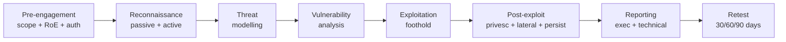

# Penetration Testing

A **penetration test** (pen test) is an authorised, time-boxed simulated attack against an organisation's people, processes and technology. The point is not to "scan the network" — automated scanners already do that. The point is to chain together findings the way a real attacker would, prove which ones lead to material business impact, and hand back a report the engineering organisation can act on. A scanner tells you "Apache 2.4.49 is installed and has CVE-2021-41773." A pen-tester tells you "I used that path-traversal to read your `wp-config.php`, used those DB credentials to dump your `users` table, cracked four passwords in thirty seconds, logged into your VPN as a finance director and reached the SAP production database." Those are different deliverables.

## Why this matters

Sophisticated organisations run a full external pen test **at least annually** and additionally before any major launch — a new public web app, a new acquisition coming online, a major architecture change, an ISO 27001 / SOC 2 / PCI-DSS audit window. Regulators expect it: PCI-DSS 4.0 mandates annual pen tests on any Cardholder Data Environment, HIPAA's Security Rule requires "regular evaluation," and most cyber-insurance policies now ask for the most recent pen-test report before they will renew. The deliverable also drives the next 12 months of remediation backlog — a critical finding from the November pen test typically becomes a P0 ticket the next morning.

The other reason this matters is **legal**. Penetration testing without written authorisation is a felony in essentially every jurisdiction the lessons in this course apply to. In the United States the **Computer Fraud and Abuse Act (CFAA, 18 U.S.C. § 1030)** criminalises unauthorised access to a "protected computer" with penalties up to 10 years per count. In the United Kingdom the **Computer Misuse Act 1990** does the same. In Azerbaijan, **Articles 271–273 of the Criminal Code** (unauthorised access, illegal interception, and creation/distribution of malicious software) carry custodial sentences. The line between a paid professional engagement and a criminal investigation is a single signed piece of paper — the **authorisation letter**, sometimes called the "get out of jail" letter. No paper, no pen test.

## Core concepts

### Pen test vs vulnerability scan vs red team

These three terms are routinely confused — they are *not* the same activity.

- **Vulnerability scan** — automated, breadth-first, usually unauthenticated. Nessus, OpenVAS, Qualys point at a CIDR range and produce a list of CVEs and misconfigurations. Cheap, repeatable, runs weekly. Catches *known* issues. Cannot tell you whether a finding is exploitable in your environment.
- **Penetration test** — manual, depth-first, time-boxed, scope-bounded. Skilled humans take scanner output as a starting point, eliminate false positives, chain findings, and prove business impact. Annual or semi-annual.
- **Red team engagement** — goal-oriented, threat-emulation. The objective is "exfiltrate the M&A folder from `\\fs01\finance$` without being detected by the SOC," not "list all the vulnerabilities." Usually multi-month, smaller scope, much wider in technique (phishing, OSINT, physical access, custom malware). Tests detection and response, not just prevention. See [Initial Access Techniques](./initial-access.md).
- **Bug bounty programme** — a public or private invitation to outside researchers to test continuously, paid per validated finding. Complements pen tests by adding always-on coverage and crowdsourced creativity. Only legal under the published programme rules — testing without an active programme is unauthorised access, regardless of intent.

A pen test answers "what is exploitable?" A red team answers "would we notice in time?" A vulnerability scan answers "what known issues exist?" Mature security programs run all three at different cadences — scans weekly, pen tests annually, red teams every 18–24 months once the basic vulnerability hygiene is in place. Spending red-team money on an organisation that has not yet patched its public-facing CVEs is a waste; spending pen-test money on a perimeter that hasn't been scanned in a year is asking the firm to re-discover findings the organisation could have closed for free.

There is also a quality continuum *within* pen testing itself. A "compliance pen test" priced at the cheapest end is often a single tester running a scanner for two days and writing up the output — exactly the anti-pattern above. A "real" pen test budgets for manual triage, exploitation chains, business-impact mapping, and a senior engineer's time on the report. Pricing differences of 5–10× between the two are common; the cheaper deliverable is rarely worth what it costs.

### Test types

By **knowledge given to the tester:**

- **Black box** (a.k.a. *unknown environment*) — tester is given only the company name and a target URL or IP range. Mirrors an external attacker. High realism, low coverage — many findings won't be reached in the time budget. Most useful for measuring "what could a stranger do in five days?"
- **White box** (a.k.a. *crystal box*, *clear box*, *known environment*) — tester gets source code, architecture diagrams, valid credentials, network maps. Highest coverage per dollar; mirrors an insider with full visibility. Most useful for finding the *true* depth of issues in a system the team already knows is critical.
- **Gray box** (a.k.a. *partially known environment*) — somewhere in the middle. The most common real-world flavour: tester gets a low-privileged user account and a list of in-scope hosts, but no source code. The cost-effective default for most engagements; lets the tester eliminate entire dead-end paths quickly without removing the realism of having to discover what is exploitable.

By **vantage point:**

- **External** — from the public internet, against the perimeter (web apps, VPN, mail, exposed APIs).
- **Internal** — from inside the corporate network, simulating a malicious employee or an attacker who already has a foothold.

By **target type:** network infrastructure, web application, mobile app, wireless (Wi-Fi, Bluetooth), cloud (AWS/Azure/GCP), API, ICS/OT, physical (badge cloning, lock picking, tailgating), and **social engineering** (phishing, vishing, pretexting — see [Social Engineering & Awareness](./social-engineering.md)).

A given engagement usually combines several of these: a typical "external pen test" includes external network + perimeter web app + a small phishing simulation. An "internal pen test" usually includes assumed-breach + AD enumeration + lateral movement + data exfiltration. Pricing tends to scale with the number of in-scope assets *and* with the variety of test types, because each type requires a different specialist skill set.

### Engagement types

- **Full-scope external** — start from zero, breach the perimeter, work inwards. Most realistic, slowest.
- **Assumed-breach** — the engagement *starts* with the tester already on a corporate workstation (the client provisions a laptop or VM). Skips the "land" phase and uses the budget on lateral movement, privilege escalation and exfiltration. Great value if the perimeter has been tested recently.
- **Purple team** — testers and the SOC / blue team work side-by-side and openly. Each attack technique is detonated, the SOC checks whether their detection fired, gaps are filled in real time. Optimises detection coverage rather than producing a list of vulnerabilities.
- **Adversary emulation** — a special case of red-teaming where the tester emulates a *specific* threat actor (e.g., FIN7, APT29) using their published TTPs from MITRE ATT&CK. Useful for organisations with a clear known threat model.
- **Tabletop exercise** — not technical at all; a discussion-based walkthrough of how the team would respond to a hypothetical incident. Cheap, fast, and a useful complement to a technical pen test.

The colour-coded team taxonomy used in the field: **red team** = offence, **blue team** = defence, **white team** = exercise organisers and judges, **purple team** = red and blue working jointly. Some organisations also use *yellow* (builders/developers) and *green* (devops) for adjacent roles, but red/blue/white/purple are the four to know.

### Rules of Engagement (RoE)

The **RoE** is the contract that turns illegal hacking into legal pen testing. A complete RoE document specifies:

- **In-scope targets** — exact IP ranges, FQDNs, applications, AD domains. If it isn't listed, it is *not* in scope.
- **Out-of-scope / prohibited targets** — third-party SaaS the company doesn't own, partner systems, employees' personal devices, anything in production that would cost money to break (payment gateways, billing systems mid-cycle).
- **Permitted techniques** — is phishing allowed? Physical entry? Denial-of-service testing? Default is *no* unless explicitly listed.
- **Time windows** — testing hours, blackout dates (peak shopping, financial close, board meetings).
- **Emergency contacts** — 24/7 phone numbers on both sides. If the tester accidentally breaks production at 02:00 they need to reach the on-call engineer in seconds.
- **Evidence handling** — how findings, screenshots and any extracted data are stored, encrypted, and destroyed at engagement end.
- **Authorisation letter** — a signed, dated document on company letterhead, naming the testers and the scope, that the tester carries while testing. Police-stop insurance.

A small but vital detail: the person *signing* the RoE and the authorisation letter must have the legal authority to authorise testing on the assets in scope. A junior IT manager signing for a SaaS app hosted on a partner's infrastructure does not produce a valid authorisation. For cloud-hosted assets the cloud provider's pen-test policy must also be checked — most have permissive defaults today but explicitly prohibit certain techniques (DDoS, traffic flooding, social engineering of provider staff).

### PTES — the seven phases

The **Penetration Testing Execution Standard** is the most widely-used methodology framework. Its seven phases:

1. **Pre-engagement Interactions** — scoping, RoE, contracts, authorisation, success criteria.
2. **Intelligence Gathering** — reconnaissance, OSINT, target enumeration.
3. **Threat Modelling** — what attacker would target this org, and how?
4. **Vulnerability Analysis** — discover and validate weaknesses.
5. **Exploitation** — convert weaknesses into access; establish foothold.
6. **Post-Exploitation** — privilege escalation, lateral movement, business-impact proof.
7. **Reporting** — written deliverable with executive summary, findings, evidence, remediation.

The phases are not strictly linear in practice. A finding in post-exploitation often sends the tester back to recon to map a new internal subnet; a refused exploit attempt in phase 5 sends them back to vulnerability analysis to find an alternative path. Treat the seven phases as a *checklist* rather than a *Gantt chart*.

### Other methodologies

- **OSSTMM** (Open Source Security Testing Methodology Manual, ISECOM) — focuses on measurable security ratings and operational controls testing across five channels: human, physical, wireless, telecommunications, and data networks. Verbose and heavyweight; popular for compliance-driven work.
- **NIST SP 800-115** — the US federal guide to technical security testing. Defines the **planning / discovery / attack / reporting** four-phase model. Less prescriptive than PTES, but the de-facto reference for US public-sector engagements.
- **OWASP WSTG** (Web Security Testing Guide) — application-layer testing checklist, used by every web pen-tester. Maps to the [OWASP Top 10](./owasp-top-10.md).
- **OWASP MSTG / MASTG** — the mobile equivalent of WSTG, covering iOS and Android application testing.
- **MITRE ATT&CK** — not a methodology but a *behavioural* taxonomy of real attacker techniques, increasingly used to map findings ("we performed T1110.003 — Password Spraying") and to align with detection engineering.
- **PCI-DSS Penetration Testing Guidance** — sector-specific supplement to PCI-DSS 11.4 that defines what counts as an acceptable annual pen test for any organisation handling cardholder data.

In practice most engagements pick one *primary* methodology (usually PTES) and borrow the OWASP and MITRE taxonomies for finding-level structure. The methodology choice should be stated in the report so the client knows what they are getting and so future tests can be compared like-for-like.

### Reconnaissance

Recon is split into **passive** (no packets touch the target) and **active** (packets do touch the target).

**Passive sources:**

- **OSINT on the company** — LinkedIn (employee names, roles, technologies named in job posts), GitHub (leaked secrets in repos and commit history; tools like `trufflehog`, `gitleaks`), the company's own marketing pages and SEC filings.
- **DNS** — `dig`, `dnsrecon`, `amass passive`. Subdomain enumeration via wordlists and via **Certificate Transparency logs** (`crt.sh` returns every TLS cert ever issued for a domain — instant subdomain inventory).
- **Search engines and Google dorks** — `site:example.local filetype:pdf`, `inurl:admin`, `intitle:"index of"`.
- **Shodan / Censys / FOFA** — internet-wide scan databases. Search for `org:"Example Local"` and see every exposed service the company owns.
- **Breach databases** — HaveIBeenPwned, Dehashed and similar services. Old credential dumps are an excellent source of password-spraying material; an `EXAMPLE\` user who reused a 2018 LinkedIn breach password may still be using it.
- **Wayback Machine and archive sites** — old versions of the company website often expose endpoints, parameters or third-party integrations that were later removed but might still respond.

**Active sources:**

- **Port scanning** with `nmap -sS -p- -T3` then service-version scanning with `nmap -sV -sC` on found ports.
- **Banner grabbing** — `nc target 25` reveals the SMTP server and version; HTTP `Server:` headers leak nginx/IIS/Apache versions.
- **Web crawling and content discovery** — `gobuster`, `feroxbuster`, `dirsearch` find hidden directories and admin paths.
- **Subdomain bruteforce** — `subfinder`, `amass enum -active`.

The boundary between passive and active matters legally: passive recon (reading a public LinkedIn page) is unambiguously legal everywhere. Active recon (a TCP SYN scan against a third-party-owned IP) is, in some jurisdictions, an offence on its own. Confirm in writing that every IP being scanned is owned by the client or hosted by a provider whose AUP permits it.

### Vulnerability identification

Once recon produces an asset inventory, vulnerabilities are identified by a combination of automated scanning and manual analysis:

- **Network scanners:** Nessus, OpenVAS, Qualys, Rapid7 InsightVM. Produce CVE-tagged findings.
- **Web app scanners:** Burp Suite Pro, OWASP ZAP, Acunetix, Netsparker. Spider the app and probe forms for SQLi, XSS, IDOR.
- **Cloud-config scanners:** ScoutSuite, Prowler, CloudSploit for AWS/Azure/GCP misconfiguration.
- **Container and IaC scanners:** Trivy, Checkov, kube-bench for Docker images, Kubernetes manifests, Terraform.
- **Manual triage** — a competent tester re-runs the top scanner findings by hand. Scanners produce 30–60% false positives on first pass, especially around HTTPS cert chains, "vulnerable" version strings that have been backported by distros, and authenticated checks that misfired. The pen-test value is mostly in this triage step. See [Vulnerability and AppSec Tools](../general-security/open-source-tools/vulnerability-and-appsec.md) for the canonical toolset.

A practical workflow: import scanner output into a single notes database (Obsidian, Notion, or even a spreadsheet), de-duplicate, then walk top-down with a triage column (`confirmed` / `false positive` / `needs lab` / `out of scope`). Findings marked `confirmed` go into the report draft immediately; `needs lab` entries get a parallel lab build to safely test the exploit; `false positive` entries get a one-line note for the appendix so the client knows you didn't ignore them.

### Exploitation

Goal: turn a confirmed vulnerability into **access**, with the smallest blast radius and without crashing production. Common tooling:

- **Metasploit Framework** — modular exploitation framework with thousands of modules indexed by CVE. Use `db_nmap` to import scan data, `search type:exploit cve:2021-44228` to find a module, `set RHOSTS` / `run` to detonate.
- **Manual exploits** — for vulns where the public Metasploit module is unreliable or doesn't exist; download from Exploit-DB, ExploitDB CLI (`searchsploit`), or write a custom one.
- **Exploitation discipline** — *do not* run anything untested against a production system. Stand up a copy of the target version in a lab first. If the only option is to test in production, get explicit written acknowledgement of the risk in the RoE.
- **Web exploitation** — Burp Repeater, sqlmap, custom payloads. The full toolkit is covered in [OWASP Top 10](./owasp-top-10.md).

A useful rule: prefer the *least invasive* proof. If a `time-based blind SQLi` proves with a 5-second `SLEEP(5)` that the database executes attacker SQL, you do not need to dump the entire `users` table to make the case in the report. Take the screenshot, log the timing, move on. Heavy data extraction is what causes RoE complaints — and where the data is regulated (PII, PHI, payment card data) it can also create a *new* compliance incident the test was meant to prevent.

### Post-exploitation

Once a foothold is established the tester pivots to demonstrate impact:

- **Privilege escalation (Linux)** — `LinPEAS`, `linux-exploit-suggester`, kernel-exploit databases. Look for SUID binaries, writable PATH, sudo misconfig (`sudo -l`), capabilities, cron jobs running as root, world-writable files in `/etc`, weak permissions on systemd unit files.
- **Privilege escalation (Windows)** — `WinPEAS`, `Seatbelt`, `PowerUp`. Look for unquoted service paths, writable services, `AlwaysInstallElevated`, kerberoastable accounts, GPP cpasswords in old `SYSVOL` shares, token impersonation, and DLL-hijack opportunities.
- **Credential dumping** — `Mimikatz` (`sekurlsa::logonpasswords`) on Windows for in-memory creds and Kerberos tickets. `secretsdump.py` from Impacket against a domain controller for the entire NTDS.dit hash database. On Linux, `/etc/shadow` if root, plus SSH keys in user home dirs and credentials in environment files.
- **Lateral movement** — `pass-the-hash` (`pth-winexe`, Impacket `wmiexec`), `pass-the-ticket`, `Kerberoasting` (request service-ticket → crack offline → service-account password), `PsExec`/`PSRemoting`, BloodHound to map AD attack paths, abuse of cross-trust relationships in multi-domain forests.
- **Cloud lateral movement** — once a workstation is owned, look for AWS CLI profiles, Azure CLI tokens, GCP credentials, kubeconfig files, and `~/.docker/config.json`. A laptop with `aws sso login` cached can pivot directly into the production cloud account.
- **Business-impact proof** — instead of "I was Domain Admin," show "I read the M&A folder, dumped the production DB, accessed the CEO's mailbox." That is what wakes the executive team up.

Two distinctions of escalation worth knowing precisely. **Vertical privilege escalation** is gaining higher rights on the *same* identity layer — a normal user becoming an administrator on the same machine. **Horizontal privilege escalation** is taking over *another* user's account at the same privilege level — Alice reading Bob's email. Both matter; engagements that report only vertical escalation often miss the horizontal IDOR-style findings that are equally serious. **Pivoting** is the cousin technique: from a compromised host inside one network segment, repeat the discovery process to reach machines that were not visible from outside. A pen test of a segmented environment will typically pivot two or three times — perimeter web app → DMZ host → internal jump server → privileged enclave.

### Persistence and cleanup

Real attackers maintain persistence across reboots — backdoor accounts, scheduled tasks, registry Run keys, WMI event subscriptions. **Pen-testers only persist if the RoE explicitly allows it**, and even then for a strictly bounded purpose (e.g., testing whether the SOC notices a new scheduled task). At the **end of the engagement** every artifact created during testing must be removed: tooling binaries, created accounts, modified registry keys, scheduled tasks, files dropped during exploitation. A residual backdoor left after a test is the kind of mistake that ends careers and contracts.

Cleanup is also an evidence problem. The standard discipline is: keep an **artifact log** updated in real time as the test runs (every account created, every file dropped, every scheduled task added, every registry value modified, with the host, time, and tester name). At engagement end, walk the log top to bottom, remove each item, and verify removal by re-running the *discovery* — not by trusting that the removal worked. Have a second tester independently verify. The same log feeds the report's evidence appendix.

### Reporting

The report is the deliverable — everything else is plumbing. Standard structure:

1. **Executive summary** — one page, business language. Overall risk rating, top three findings, headline recommendation. The CFO reads this.
2. **Methodology and scope** — what was tested, when, with what RoE.
3. **Technical findings** — one entry per finding with: title, CVSS score, affected assets, reproduction steps, screenshots/PoC output, business impact, remediation, references.
4. **Evidence appendix** — full tool output, request/response captures, screenshots.
5. **Remediation roadmap** — prioritised list with effort estimates.
6. **Retest plan** — agreement that critical/high findings will be retested within 30/60/90 days at no extra cost.

Each finding entry should also carry a **CVSS v3.1 vector string** (e.g. `AV:N/AC:L/PR:N/UI:N/S:U/C:H/I:H/A:H`) so that downstream ticketing and SLA logic can be automated, and a **MITRE ATT&CK mapping** so detection engineering can pick up the same finding ("we performed T1078 — Valid Accounts; here is the Sigma rule that should fire next time"). A report that lacks both is harder to action than one that includes both, even if the underlying technical content is identical.

### Vulnerability scan vs pen test — a side-by-side

| Dimension | Vulnerability scan | Penetration test |
|---|---|---|
| **Driver** | Automated tool | Skilled human |
| **Cadence** | Weekly / continuous | Annual / semi-annual |
| **Output** | List of CVEs and CVSS scores | Narrative of attack chains + business impact |
| **Cost** | Low (tool licence + analyst time) | High (multi-tester, multi-week) |
| **False positive rate** | 30–60% on first pass | Near zero in the final report |
| **Catches unknown issues** | Rarely | Yes — chained logic flaws, business-logic bugs |
| **Proves impact** | No | Yes |
| **Replaces the other** | Never | Never |

The two are complementary. Run scans continuously to catch *known* issues fast and cheap; run pen tests periodically to catch what the scanner can't see and to prove what the scanner-flagged items actually mean for the business.

## Pen-test phase diagram

## Career and certification path

A short detour for readers who want to *do* this professionally. The standard progression:

- **Foundations** — networking (CompTIA Network+ or equivalent), Linux administration, scripting (Python, Bash, PowerShell). Most pen-test interviews fail at "explain the TCP handshake," not at "explain Kerberoasting."
- **Entry-level certs** — CompTIA PenTest+, eLearnSecurity eJPT. Cheap, get you past HR filters.
- **Mid-level** — **OSCP** (Offensive Security Certified Professional) is still the most-asked-for badge in pen-test job descriptions; the 24-hour exam is gruelling but builds genuine skill. CRTP / CRTE for Active Directory specialists.
- **Senior** — **OSCE3** (OSEP + OSED + OSWE), **CREST CRT/CCT**, **GIAC GPEN/GXPN**, **OSWE** for web-app specialists. CREST is mandatory for many UK and EU public-sector engagements.
- **Specialisation** — wireless (OSWP), mobile (OSMR), cloud (vendor-specific), ICS/OT (GICSP). Generalists earn well; specialists earn very well but are scheduled months ahead.

The other half of the job is *writing*. A pen-tester who can technically own the AD forest in a day but writes a report a CFO can't follow earns half what an equivalent technician with strong writing earns. Practice writing executive summaries on every box you do.

## Hands-on / practice

Pick the exercises that match the lab capacity you have. None of these should be performed against systems you do not own or do not have explicit written permission to test.

1. **Beginner box on a training platform.** Sign up for [HackTheBox](https://www.hackthebox.com/) or [TryHackMe](https://tryhackme.com/) and complete one beginner-rated Linux box end-to-end (e.g. *Lame*, *Blue*, *Pickle Rick*). Document each step (recon → exploitation → privesc → flag) in a markdown file as if it were a mini-report. Note how long each phase took.
2. **Triage a Nessus scan.** Build a small lab — `Metasploitable2` and `Metasploitable3` work — and run `nmap -sV -sC -p- 10.10.10.0/24` followed by an authenticated Nessus scan. Take the resulting findings list and **manually verify the top 10**. Mark each as *true positive*, *false positive*, or *informational*. Write down what made the false positives false.
3. **Exploit chain with Metasploit.** On the same lab, pick one Metasploit exploit module (e.g. `exploit/unix/ftp/vsftpd_234_backdoor` or `exploit/windows/smb/ms17_010_eternalblue`), run it through, and document the *full chain*: how the vuln was discovered, the module's mechanism, the post-exploit steps, what privileges were obtained, and how a defender would detect or prevent each step.
4. **Credential dumping + lateral movement on a small AD lab.** Stand up a 2-host AD lab — one DC + one workstation — using GOAD (Game Of Active Directory) or a custom build. From a low-priv user, run BloodHound to map paths, perform Kerberoasting, crack the service account, then `wmiexec.py` to the DC. Each step gets a screenshot. Note which Windows event IDs would have fired.
5. **Write an executive summary.** Take the output of exercise 2 or 3 and write a one-page executive summary aimed at a non-technical board member. Include: an overall risk rating, three sentences on what the most important finding means in business terms, and a top-three remediation list. This is the writing skill clients pay for.

The first time you do exercise 4 a useful debrief is to revisit the [Red Team Tools](../general-security/open-source-tools/red-team-tools.md) lesson and the [Security Assessment](../general-security/assessment/security-assessment.md) lesson — the tools and the methodology framing both make more sense once you have actually used them on a lab.

## Worked example — `example.local` annual external pen test

The scenario: `example.local` is a 2 000-employee SaaS company contracting their fifth annual external pen test. The 2026 engagement is **4 weeks**, with **3 testers**, and the scope is corporate web apps + perimeter + a phishing simulation campaign. Out-of-scope: the production payment processor (third-party), the customer data plane (separate test scheduled in Q3), partner SaaS.

**Week 0 — pre-engagement.** A two-hour scoping call locks the IP ranges (`203.0.113.0/24` plus three Azure subnets), the FQDN list (12 web apps), and the phishing pretext (a fake "EXAMPLE Benefits 2026 enrollment" email). The RoE bans DoS testing, bans testing during the financial close week (week 3 of the engagement is a quiet week), and mandates a 30-minute notification to the SOC before any active scanning. The authorisation letter is signed by the CISO and CFO. The Slack war-room is created.

**Week 1 — reconnaissance and vulnerability analysis.** Day 1–2 is OSINT: 1 200 employee names from LinkedIn, 14 GitHub repos owned by the company (one contains a 2023-vintage AWS access key — first finding), 87 subdomains from `crt.sh`. Day 3–5 is active recon: nmap on the perimeter, content-discovery on each web app, Burp passive scan crawling. End of week: 240 candidate findings in the team's Notion DB.

**Week 2 — exploitation.** Triage cuts the list to 38 confirmed issues. Highlights: a **reflected XSS** in the customer-facing marketing CMS chained with a CSRF on the admin password change → admin account takeover (proven against a sandbox copy). A **Java deserialization** flaw in a legacy reporting endpoint → unauthenticated RCE (proven via DNS callback only — no shell dropped on prod). The phishing campaign goes live: 312 employees clicked, 47 entered creds on the lookalike portal, 4 of those bypassed MFA (push-notification fatigue), and one of those four was a domain admin.

**Week 3 — post-exploitation.** Using the harvested credentials in an assumed-breach VM, the team Kerberoasts six service accounts, cracks two (one is `EXAMPLE\svc-jenkins` with a 2018-vintage password). From the Jenkins service account they reach the build agent, which has a saved Azure managed identity → Azure subscription Contributor role. Full attack-path: phish → MFA fatigue → workstation → BloodHound → Kerberoast → Jenkins → Azure. Lateral demonstrated; no data exfiltrated. All persistence artifacts logged for cleanup.

**Week 4 — cleanup and reporting.** Every dropped tool, created account, scheduled task and registry change is enumerated and removed; the SOC verifies the cleanup against their own EDR telemetry. The 86-page report is delivered: 4 critical, 11 high, 19 medium, 4 low findings. Executive summary names the phishing-to-Azure path as the headline. Retest agreed for 60 days on critical/high findings; the AWS key from week 1 is rotated within 4 hours of the initial alert.

The bill: roughly £85 000. The mitigated risk: a single one of the critical findings — the Java RCE on the public-facing reporting endpoint — could have been the front door to a six- or seven-figure breach. The phishing finding drove a complete rework of the MFA policy from push-approve to number-matching, which would have prevented the actual 2025 breach at a peer company.

A few engagement-management details worth highlighting from this run. First, the **war-room Slack channel** with the SOC was used roughly twice a day — every active scan was pre-announced, every spike in alerts that the SOC investigated was then confirmed or denied as test traffic. Second, the **artifact log** ended the engagement with 41 entries; the cleanup pass took an extra half-day but produced a clean handover. Third, the **report draft** went through three review rounds — internal QA, technical lead review, and a final client-readback meeting — over the last week. None of those steps look glamorous and all of them are what separates a usable deliverable from a 200-page PDF nobody opens.

## Troubleshooting & pitfalls

- **Testing without written authorisation.** No signed letter on letterhead = no test. Verbal "yeah, go for it" from a manager is not authorisation. Police, the FBI and prosecutors do not accept it.
- **Scope drift.** Tester finds a juicy out-of-scope target ("the partner billing API looks vulnerable") and pokes it "just to check." That is now a federal crime against a third party. Stop, ask, get the scope amended *in writing*, or do not touch.
- **Aggressive scans crashing prod.** A `nmap -T5` or a `nikto` against a fragile legacy app on a Friday afternoon takes the company down for the weekend. Tune scan rates, coordinate windows, ask first.
- **Not coordinating with the SOC.** The SOC sees pen-test traffic, opens incident tickets, mobilises on-call, burns hours. Either pre-notify so they ignore (less realistic), or run silent and make the engagement a detection test (more valuable, must be agreed up front).
- **Leaving backdoors after the test.** Created `EXAMPLE\pentest_admin`, scheduled task `PT_Beacon`, modified `HKLM\...\Run` — and at the end of the engagement only "remembered" to remove two of the three. Now the client has a residual implant. Maintain a written artifact log; verify removal by *re-running the discovery*, not from memory.
- **Treating a vulnerability scan as a pen test.** A 400-page Nessus PDF is *not* a pen test report. Selling one as the other is malpractice; buying it as one is wasting the budget.
- **Report dumping raw scanner output as findings.** Each line copy-pasted from Nessus, no triage, no business context. Useless to engineering and embarrassing to the firm. Each finding in a real report is hand-written, with a reproduction recipe a developer can follow.
- **No remediation tracking.** Findings handed to the client and never followed up. Six months later the same critical is on the next year's report, unchanged. Ticket every finding with an owner, due date, and rebuild it into the patch-management process. See [Vulnerability Management](../general-security/assessment/vulnerability-management.md).
- **No retest.** Client patches "fix" a finding, nobody verifies, the patch doesn't actually close the issue. Always include a retest within 30/60/90 days at zero extra cost in the SoW.
- **Client refuses to remediate critical findings.** Document the refusal in writing, name the accepting executive, record the residual risk in the risk register. Don't argue with the customer; do not let the responsibility land on the testing firm.
- **Pivoting through the corporate VPN you are testing from.** Tester's own laptop becomes part of the attack surface. Use a hardened, dedicated testing VM, isolated network egress, full-disk encryption, no production credentials saved, wiped at engagement end.
- **Storing client data on personal storage.** Findings PDFs, exfiltrated files, screenshots end up in the tester's personal Dropbox. Massive contractual and possibly legal breach. Use the firm's approved encrypted vault only; destroy after the contractual retention window.
- **Ignoring physical safety.** Physical pen tests have ended in arrests when the tester didn't have the authorisation letter on them. Always carry a hard copy. Always have an escort contact's number memorised, not only on the phone.
- **Phishing in a regulated industry without sign-off.** Some jurisdictions or sector regulators require advance notification before phishing employees (especially for healthcare, schools, government). Check before you click "send."
- **Burning a 0-day in scope.** If a tester finds a 0-day in commercial software during an engagement, the responsible-disclosure policy needs to be agreed *in advance*. Disclosing without process can void contracts and burn vendor relationships.
- **Treating cloud and on-prem the same.** AWS/Azure/GCP have **provider-side rules**. AWS no longer requires permission for most pen testing of your own resources, but DDoS, port flooding and "DNS zone walking" are still prohibited. Read the cloud provider's pen-test policy before the engagement.
- **Not redacting reports.** Final report contains plaintext passwords, real PII, full session tokens. Redact before delivery; encrypt in transit; expire access after a reasonable window.
- **Pen-test fatigue.** Same firm, same scope, same findings, year after year — the test stops finding anything new. Rotate firms every 2–3 years, change the scope, add an assumed-breach component, run a purple-team variant. The goal is the *findings*, not the *certificate*.
- **Confusing CVSS score with business risk.** A CVSS 9.8 finding on a host with no sensitive data and no network reach is a lower business risk than a CVSS 6.5 on the customer database. The scanner does not know your environment; the report should state the *contextualised* risk in addition to the raw score.
- **Skipping the readout meeting.** Delivering the PDF and disappearing. The 60-minute live readback with engineering and the security team is where misunderstandings get cleared up and remediation owners commit to dates. Never skip it.
- **Testing from a residential IP without telling the ISP.** Some providers throttle, block, or report scanning traffic. Run from a known-good cloud VM or a firm-managed jump host so the egress is predictable and contractually covered.
- **No version control on findings.** A finding's status changes (open → in remediation → fixed → retested). Track each in a ticketing system from day one; spreadsheets get out of sync within weeks and lose the audit trail regulators want.
- **Treating the report as the end of the job.** Delivery is the start of remediation, not the end of work. Pen-test firms with the highest customer satisfaction stay engaged through the retest cycle and answer follow-up questions for free.
- **Mixing test traffic with production traffic from the same source IP.** Once the SOC is tuned to ignore "the pen-test IPs," real attackers using the same IP range get a free pass. Allocate dedicated, time-limited testing IPs and revoke them at engagement end.
- **Promising "no impact" guarantees.** No competent pen-tester can promise zero impact — exploitation can always go wrong. The honest commitment is "we will exercise the agreed level of caution and stop on any sign of unintended impact." Document this; never write a contract that promises zero risk.

## Detection and evasion

Real engagements often include a *detection* dimension: which techniques does the SOC catch, and which slip through? A few practical points:

- **EDR evasion is a distinct skill.** Modern endpoint products (CrowdStrike, SentinelOne, Microsoft Defender for Endpoint) catch most off-the-shelf Mimikatz, PsExec, and Cobalt Strike payloads. Bypassing them safely in an authorised test requires understanding AMSI, ETW, parent-process spoofing, and indirect syscalls. None of this should be done without RoE coverage; bypasses leave footprints that auditors will notice.
- **Slow-and-low** scanning (`nmap --scan-delay 5s`, BloodHound queries spread across days) is the classic evasion lever — most detection rules are tuned to catch fast bursts, not patient enumeration.
- **Living-off-the-land** binaries (LOLBins like `certutil`, `wmic`, `regsvr32`) blend in with normal admin traffic; they are also exactly what real attackers use.
- **A purple-team variant** of an engagement reverses the framing: the SOC is told what is coming, and the goal is to fix detection gaps in real time. This is often a higher-value spend than a covert test for organisations that are still maturing their detection programme.

A pen test that produces "we owned the AD forest and no SOC alert fired" is a useful detection-gap finding even if there is no patchable software vulnerability behind it. Report it as a finding; map it to MITRE ATT&CK; treat the missing detection rule as the remediation.

## A note on Drones, Wi-Fi and the physical layer

A few specialised techniques worth naming because they appear in the source material and on real engagements:

- **War-driving** — driving (or walking) around a target's facility with a wireless scanner (`Kismet`, `airodump-ng`, modern Wi-Fi 6 capable adapters) to map every SSID, channel, encryption mode, and client device. Cheap, legal in most jurisdictions if you are not authenticating to the networks, and reveals an enormous amount about a campus's wireless posture.
- **War-flying** — using a drone to do the same thing at altitude, reaching wireless networks that don't reach the ground floor. Useful for a 30th-floor office where the only Wi-Fi exposure is by line-of-sight to an adjacent building. Subject to local drone-flight regulations everywhere — confirm with the client and the local aviation authority before launching.
- **War-shipping** — mailing a small Wi-Fi-equipped device (Raspberry Pi with a 4G modem and a Wi-Fi adapter) into the target office in a parcel. The device wakes up inside the building, joins the corporate Wi-Fi (or auto-attacks it), and tunnels back to the tester. Allowed only with explicit RoE coverage; can be seized under postal regulations.
- **Footprinting** — the umbrella term for the entire reconnaissance phase. Older textbooks use it interchangeably with "recon."

These are advanced techniques that should not appear in a first or second pen test of an organisation. They earn their place in mature programmes that have already closed the obvious software and configuration gaps.

## Engagement economics

A useful mental model for buyers: the cost of a pen test is roughly proportional to **scope size × test depth × specialist rarity**.

- **Scope size** — number of in-scope IPs, FQDNs, applications, AD domains. A 50-host external pen test is a 5–10 day engagement. A 5 000-host internal review is a 6–8 week one.
- **Test depth** — a compliance-bar pen test is shallower than an assumed-breach + full lateral movement test, which is shallower than a multi-month red team. Expect a 3–5× price multiplier between the shallowest and deepest variants of the same scope.
- **Specialist rarity** — generalist web/network testers are widely available. Specialists for SCADA/ICS, mainframe, hardware, or specific cloud-native tooling (Kubernetes admission controllers, eBPF) command 1.5–2× rates and have to be scheduled months ahead.

The single biggest cost-control lever is **not under-scoping**. A pen test that misses half the attack surface because the budget couldn't cover all the assets has the same shape as a pen test that found nothing — except the latter is honest.

The second lever is **test cadence**. Annual is the default; quarterly is justified for very high-change environments (a SaaS company shipping daily); a single all-encompassing test every two years is rarely a good answer for any organisation that values its findings.

## Defender-side preparation

A useful counterpart for the blue team. When a pen test is incoming, the defender's job is *not* to "fix everything before they arrive" — that defeats the purpose of the test. The job is to make sure the test produces good data:

- **Confirm the SOC knows the engagement is happening** (or knows it isn't, if the engagement is a covert detection test). A 4 a.m. pager going off because of pen-test traffic when nobody warned the on-call engineer is an avoidable cost.
- **Have logging working before the testers arrive.** If EDR isn't shipping events to the SIEM, the test will be reported as "we did all this and nothing was alerted" and the SOC won't know whether the missing alerts were a detection gap or a logging gap.
- **Snapshot the environment.** A clean snapshot of critical hosts before testing helps recovery if anything goes sideways and gives a baseline to diff against during cleanup.
- **Designate a single point of contact** who is reachable 24/7 and has the authority to pause the engagement.
- **Triage findings as they arrive in the report** — do not wait for the final 80-page PDF. Most firms will share findings as they are confirmed; a critical finding in week 1 should not wait until week 4 to start remediation.

## Key takeaways

- A penetration test is an authorised, scope-bounded, depth-first simulated attack run by humans — distinct from an automated vulnerability scan and from a goal-oriented red-team engagement.
- The legal foundation is the **signed authorisation letter** plus a written **Rules of Engagement**. Without both, testing is a crime under the CFAA, the UK CMA, the Azerbaijani Criminal Code, or your local equivalent.
- **PTES** is the most widely used seven-phase methodology; **NIST SP 800-115** and **OSSTMM** are the other big references; **OWASP WSTG** is the web-app-specific checklist.
- Recon (passive + active) and vulnerability triage are where most of the value is created — not in the exploit detonation.
- Post-exploitation — privesc, credential dumping, lateral movement — is what turns a finding list into a *business impact* story executives will actually fund.
- Persistence is allowed only if the RoE permits it; **cleanup at the end is non-negotiable**.
- The deliverable is the **report**: executive summary for the board, technical findings for engineering, evidence appendix, prioritised remediation, and an explicit retest plan.
- A pen test is a *snapshot in time*. Keep running scanners weekly, run pen tests annually + before major launches, and rotate firms every 2–3 years to prevent diminishing returns.

## How to read a pen-test report

A practical guide for the receiving organisation. The first time a security manager gets a pen-test PDF, the temptation is to skip to "the criticals" and start patching. A more useful workflow:

1. **Read the executive summary first.** It is the only part most senior stakeholders will read; if you cannot translate it into a one-paragraph status update for the CISO, ask the testing firm to rewrite.
2. **Validate the scope and methodology.** Did the test cover what you thought it did? If not, the findings list is misleading by omission, not by content.
3. **Sort findings by *exploitability in your environment*, not by CVSS.** A CVSS 9.8 on an air-gapped lab host with no production data is lower priority than a CVSS 6.0 on the customer-facing portal.
4. **For each Critical/High, file a ticket within 48 hours** with an owner, due date, and a linked retest commitment. The ticket is the artifact you will be audited against six months from now.
5. **Schedule a calendar entry for retest** before the report is even closed. Without a date, retests slip.

## Common misconceptions

- **"Pen testing means hacking."** It is also reading, writing, scoping calls, status reports, and walking findings through engineering review. The exploitation phase is often the smallest slice of the calendar.
- **"A clean pen test means we are secure."** A clean pen test means *this team*, with *this scope*, in *this time budget*, did not find a way in. New CVEs land monthly; new attack techniques land yearly; every change ships fresh attack surface. Pen tests are evidence, not certificates.
- **"Pen tests find every bug."** They find the bugs reachable in the time budget by the tools and techniques the testers chose. A good pen test surfaces 60–80% of the high-severity issues a sophisticated attacker would also find given the same scope.
- **"We don't need a pen test, we have a SOC."** A SOC catches *attacks in progress* against *known patterns*. A pen test finds the *holes that let the attack succeed in the first place*. Different jobs.
- **"OSCP / CRTP / etc. is enough — the certificate proves the tester is good."** The certificate proves a baseline; experience and report-writing skill separate competent testers from great ones. Always ask for redacted past reports as part of vendor selection.

## References

- **PTES — Penetration Testing Execution Standard:** [pentest-standard.org](http://www.pentest-standard.org/)
- **OSSTMM — Open Source Security Testing Methodology Manual (ISECOM):** [isecom.org/OSSTMM.3.pdf](https://www.isecom.org/OSSTMM.3.pdf)
- **NIST SP 800-115 — Technical Guide to Information Security Testing and Assessment:** [csrc.nist.gov/publications/detail/sp/800-115/final](https://csrc.nist.gov/publications/detail/sp/800-115/final)
- **OWASP WSTG — Web Security Testing Guide:** [owasp.org/www-project-web-security-testing-guide](https://owasp.org/www-project-web-security-testing-guide/)
- **MITRE ATT&CK Framework:** [attack.mitre.org](https://attack.mitre.org/)
- **CREST — accreditation body for penetration testers:** [crest-approved.org](https://www.crest-approved.org/)
- **OSCP — Offensive Security Certified Professional curriculum:** [offensive-security.com/pwk-oscp](https://www.offensive-security.com/pwk-oscp/)
- **HackTheBox / TryHackMe** — practical training labs: [hackthebox.com](https://www.hackthebox.com/), [tryhackme.com](https://tryhackme.com/)
- **Exploit-DB** — public archive of exploit code: [exploit-db.com](https://www.exploit-db.com/)
- **GTFOBins / LOLBAS** — living-off-the-land binary references: [gtfobins.github.io](https://gtfobins.github.io/), [lolbas-project.github.io](https://lolbas-project.github.io/)
- **Impacket** — Python suite for AD network protocol attacks: [github.com/fortra/impacket](https://github.com/fortra/impacket)
- **BloodHound** — AD attack-path mapping: [bloodhound.specterops.io](https://bloodhound.specterops.io/)
- **Cyber-insurance pen-test requirements** — most major carriers (Beazley, Chubb, AIG) publish minimum testing requirements for cover.
- **Related lessons:** [OWASP Top 10](./owasp-top-10.md), [Social Engineering & Awareness](./social-engineering.md), [Initial Access Techniques](./initial-access.md), [Security Assessment](../general-security/assessment/security-assessment.md), [Vulnerability Management](../general-security/assessment/vulnerability-management.md), [Red Team Tools](../general-security/open-source-tools/red-team-tools.md), [Vulnerability and AppSec Tools](../general-security/open-source-tools/vulnerability-and-appsec.md)
