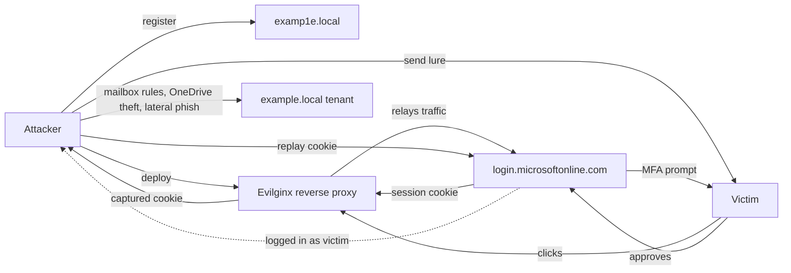

# Social Engineering

**Social engineering** is the art of manipulating people into handing over information, clicking a link, wiring money or holding a door open. Every firewall, EDR agent and zero-trust proxy can be perfect — and the attack still lands, because an employee trusted a voice on the phone that said "this is IT, I need your code." Humans are the most-exploited attack surface on the internet, by a wide margin.

The numbers are consistent year after year. The **Verizon Data Breach Investigations Report (DBIR) 2024** attributes roughly **68%** of breaches to a non-malicious human element — somebody clicked, somebody was tricked, somebody misconfigured. The **IBM X-Force Threat Intelligence Index 2024** puts phishing as the initial access vector in about **30%** of incidents and notes that credential theft (most of it harvested through social engineering) has climbed **71%** year over year. The **FBI IC3 2023 report** tallies **$12.5B** in reported cybercrime losses, of which roughly **$2.7B** is Business Email Compromise alone.

You cannot patch a human, so you train, verify and engineer defences that assume the human will fail.

## Why it works — six psychological levers

Robert Cialdini's six principles of influence show up in almost every phish, vishing call or pretext. An attacker rarely uses just one; the strong ones stack three or four.

| Lever | What it exploits | Real-phish one-liner |
|---|---|---|
| **Authority** | People obey perceived power | "This is the CEO. I need a wire transfer done before the board meeting." |
| **Urgency** | Rushed brains skip checks | "Your mailbox will be deleted in 1 hour — confirm now." |
| **Scarcity** | Fear of missing out | "Only 3 spots left for the bonus payout — click to claim yours." |
| **Social proof** | We copy what others do | "HR already signed off — 15 of your colleagues submitted theirs today." |
| **Familiarity / Liking** | We trust people who seem like us | Pretext calls from a "colleague" who uses internal slang and first names. |
| **Reciprocity** | We pay back favours | A USB drop labelled *"Payroll bonuses Q4"* left in the car park. |

A skilled attacker also leans on **commitment/consistency** (getting a small "yes" first) and **authority-by-proxy** ("legal said I could ask you directly"). Every one of these is a shortcut around slow, deliberate thinking — what Daniel Kahneman calls **System 1**.

The defender's job is to insert friction at exactly the moment System 1 wants to take over. A required dual-approval, a mandatory callback, a "is this a phish?" button next to every message — each of these forces the brain to switch into deliberate System 2 mode for a few seconds. That is usually enough.

## Attack taxonomy

| Technique | Channel | Target | Indicator | Example |
|---|---|---|---|---|
| **Phishing** | Email | Mass | Lookalike domain, urgency language | "Your Microsoft 365 password expires today — reset here" |
| **Spear-phishing** | Email | Named individual | Uses real name/title from LinkedIn | "Emil — please review the attached Q3 variance" from a spoofed CFO |
| **Whaling** | Email | C-suite / board | Lure about M&A, lawsuits, earnings | "Confidential — SEC subpoena, open immediately" |
| **Vishing** | Voice call | Helpdesk / user | Caller ID spoof, reads insider jargon | "This is Sarah from IT, I'm pushing an MFA prompt — approve it" |
| **Smishing** | SMS | User | Short URL, delivery/bank theme | "Azerpost: package held, pay AZN 1.50 fee: hxxp://azpost-delivery[.]tk" |
| **Pharming** | DNS / hosts file | Browser | Correct URL, wrong IP | Malware edits hosts file to redirect `banking.local` |
| **Pretexting** | Any | Helpdesk / HR | Invented scenario, builds rapport | "I'm the new auditor from KPMG, can you pull user list for me?" |
| **Baiting** | Physical / online | User | USB drop, "free" download | USB stick labelled "CEO salaries 2024" in the lobby |
| **Quid-pro-quo** | Voice / chat | User | Attacker offers "help" | Fake IT tech offers to "fix VPN" in exchange for credentials |
| **Tailgating** | Physical | Facility | No badge, arms full, smiling | Stranger follows a badged employee through a secure door |
| **Piggybacking** | Physical | Facility | Like tailgating but with consent | Employee knowingly holds door for someone they don't recognise |
| **Shoulder-surfing** | Physical | User | Watching over shoulder | Glancing at a laptop password in a café |
| **Dumpster-diving** | Physical | Facility | Sorting the bin | Retrieving org charts, password sticky notes, invoices |
| **Watering-hole** | Web | Niche audience | Compromise a site the target visits | Planting malware on a industry forum developers frequent |
| **BEC** | Email | Finance / HR | Thread-hijack, wire change | CFO "reply" to an existing thread changing payout bank details |
| **MFA bombing / prompt fatigue** | Push MFA | User | Repeated push approvals | Dozens of prompts at 2 AM until the user taps "Approve" |
| **SIM-swap** | Carrier social eng. | Phone number | SMS 2FA stops arriving | Attacker ports the target's number to a new SIM and resets banking |
| **Deepfake voice / video** | Call / Teams | Exec / finance | AI-cloned voice, off-camera asks | "CFO" on a video call asks for an urgent HKD 200M transfer (Arup, 2024) |

## Deep dive: modern phishing

A 2024-era phish is not a typo-riddled Nigerian prince letter. It is a polished, MFA-aware, reverse-proxied credential theft built in about forty minutes with open-source tools.

### End-to-end kill chain

1. **Reconnaissance.** The attacker scrapes LinkedIn for names at `example.local`, looks at the company's job ads to learn internal tooling ("experience with ServiceNow and Azure AD required"), and pulls email formats from `hunter.io`.
2. **Infrastructure.** Register a lookalike domain — `examp1e.local` (digit `1` for `l`), `exampIe.local` (capital `I` for lowercase `l`), or `example-it[.]com`. Buy a cheap TLS cert, stand up an **Evilginx** or **Modlishka** reverse proxy that serves the *real* Microsoft login page from `login.microsoftonline.com` through the attacker's server.
3. **Lure.** A convincing email from `it-support@examp1e.local` — "Your mailbox is over quota. Click here to extend storage." The link points at the Evilginx domain.
4. **Credential + cookie capture.** The victim types their password on what looks like the real Microsoft page. Evilginx relays it upstream, the real site asks for MFA, the victim taps approve, and the **session cookie** is handed to the attacker. MFA did not save them — the cookie is already logged in.
5. **Session hijack.** The attacker loads the stolen cookie into their own browser and is now signed in as the victim, with no further prompts.
6. **Post-exploitation.** Attacker adds a mail forwarding rule, registers their own authenticator app on the victim's account, exfiltrates OneDrive, and pivots to internal Teams messages to launch the next phish from inside.



**Why this bypasses MFA.** Push and TOTP prove a human was present at login time. They do not protect the *session* after login. Once the cookie is stolen, it is as good as a password — valid until it expires (often 90 days) or the user signs out everywhere.

### Things that actually break this kill chain

- **FIDO2 / passkeys** — the cryptographic challenge is bound to the *origin* the browser sees. The attacker's domain is `examp1e.local`, the key only signs for `microsoftonline.com`. AiTM gets nothing useful.
- **Conditional Access on session token risk** — Azure AD can detect "session cookie used from a new IP / new device / impossible-travel location" and re-prompt for MFA, breaking the replay window.
- **Token binding / continuous access evaluation (CAE)** — re-validates the session against the IdP every few minutes; revokes within ~60 seconds when sign-out or risk fires.
- **Impossible-domain detection at the mail gateway** — flag `examp1e.local` and other Levenshtein-distance-1 domains automatically.
- **Browser isolation for any link from outside** — even if the user clicks, the page renders on a remote, throwaway browser; cookies never enter the corporate browser.

## Deep dive: Business Email Compromise (BEC)

BEC is the highest-dollar social-engineering category on the planet. It does not need malware and often does not even need a credential. The attacker only needs a plausible email.

According to the **FBI IC3 2023 annual report**, BEC caused **$2.9B** in reported losses from **21,489** complaints that year — roughly **$135,000 per incident** on average. The real number is higher; most BEC never gets reported.

### Four BEC flavours you will actually see

**CEO / CFO wire-transfer fraud.** The attacker spoofs or compromises the executive's mailbox and tells finance to wire funds for a "confidential acquisition." Urgency + authority + "don't tell anyone, it's a board matter" is the classic pattern.

**Invoice redirect.** Attacker compromises a vendor's mailbox (or one of their suppliers), waits for a legitimate invoice thread, and sends a polite "our bank details have changed, please update" reply. The next real invoice gets paid to the attacker.

**Vendor-impersonation.** No compromise needed — the attacker registers `vendor-billing[.]com` and sends fake invoices that look like they come from a known supplier. Works especially well against companies with decentralised AP processes.

**Payroll diversion.** Attacker spoofs an employee and emails HR: "I changed banks, please update my direct-deposit details for this Friday's run." One payroll cycle later, the salary lands in a mule account.

### Why BEC beats technology

Gateway sandboxes look for attachments and links. A BEC email has neither — it is a plain-text reply inside a real thread. Your spam filter sees a short, polite, grammatically clean English message that asks to update bank details. **Only a human or a dual-approval workflow catches it.**

## Deep dive: MFA bypass by social means

MFA raises the bar. It does not eliminate social engineering — attackers just shifted the attack one layer up.

### Prompt fatigue / MFA bombing

Attacker has the password (from a breach dump, infostealer log or previous phish) and triggers login prompts in a loop — often at 2–4 AM when the target is half-asleep. Eventually the user taps "Approve" just to make the phone stop buzzing. This is how **Uber was breached in September 2022** — the attacker bought a contractor's credentials from Genesis Market and bombed them with push prompts until one was approved.

### Adversary-in-the-Middle (AiTM)

The Evilginx/Modlishka pattern above. The attacker proxies the real login page, so the victim completes MFA legitimately and the attacker walks away with the session cookie. Microsoft reported an AiTM campaign in 2022 that hit over **10,000 organisations**.

### SIM swap

Attacker social-engineers the mobile carrier — "I lost my phone, please transfer my number to this new SIM." SMS-based MFA codes start arriving at the attacker's phone. This works against crypto exchanges, bank accounts and, famously, Twitter CEO Jack Dorsey's account in 2019.

### Callback vishing + MFA reset

Attacker calls the helpdesk pretending to be a locked-out executive. The helpdesk, trying to be helpful, resets MFA enrolment. Attacker enrols their own device. This is roughly what happened in the **MGM Resorts breach (September 2023)** — about ten minutes of vishing against the helpdesk led to a nine-figure loss.

### Ranking MFA by resistance to social engineering

| MFA type | Phishing resistance | Notes |
|---|---|---|
| SMS code | **Weak** | Vulnerable to SIM swap, AiTM, smishing of the code |
| TOTP (Google/Microsoft Authenticator number code) | **Medium** | AiTM-defeatable; not SIM-swappable |
| Push-approve | **Medium** | Prompt fatigue + AiTM both work |
| Number-matching push | **Stronger** | Defeats fatigue, still AiTM-defeatable |
| **FIDO2 / WebAuthn (hardware key, passkey)** | **Strong** | Cryptographically bound to the real domain — AiTM fails |

The short version: **if it's high-value, use a FIDO2 hardware key or platform passkey.** Push MFA is better than passwords alone, but it is not phishing-resistant.

## Indicators a user should recognize

A checklist that fits on one laminated A4 card next to the monitor. Non-technical staff can be taught this in a 15-minute stand-up.

**Before clicking, stop if any of these are true:**

- The message creates **urgency** ("within 1 hour", "today only", "immediate action required").
- The message claims **authority** ("CEO", "Legal", "IT", "HR") and pressures you to bypass normal process.
- It asks for **money movement** or a **change of payment details** — even if the sender looks right.
- The sender address uses a **lookalike domain** (`examp1e.local`, `example-corp.com`, `example.support`).
- Hovering over a link shows a **URL that does not match** the displayed text.
- The sender is a **free webmail address** (Gmail, Outlook.com, ProtonMail) claiming to be an internal employee or executive.
- The message contains a **"do not tell anyone"** / **"keep this confidential"** clause.
- An **attachment** is unexpected — especially `.zip`, `.iso`, `.htm`, `.one`, password-protected docs, or a link to "view in OneDrive/SharePoint" that goes to a non-Microsoft domain.
- The **reply-to** address differs from the **from** address.
- You get an **MFA prompt you did not trigger** — never approve it. That is an attacker with your password.
- Any request that **bypasses normal workflow** ("don't go through the portal, just email me the file").

**The rule when in doubt:** verify out-of-band. Hang up, look the person up in the directory, call them back on the number you already have. A real CEO does not mind a five-minute callback.

## Organizational defenses

Defence must work on three axes at once. Technology alone catches the clumsy attacks. Process catches the expensive ones. Human training reduces the success rate of the ones that slip through.

| Layer | Control | Tool / action |
|---|---|---|
| **Technical** | SPF record | DNS TXT: allow only your real mail servers to send from your domain |
| **Technical** | DKIM signing | Configure the mail provider to sign outbound mail with a private key; publish the public key in DNS |
| **Technical** | DMARC enforcement | Publish `p=reject` after a monitoring period; aggregate reports to a DMARC analyser |
| **Technical** | Mail gateway with sandbox | Microsoft Defender for O365, Proofpoint TAP, Mimecast — detonate links and attachments in a VM |
| **Technical** | FIDO2 / passkey MFA | Hardware keys (YubiKey, Feitian) or platform passkeys for admins, finance, execs |
| **Technical** | Conditional Access / risk-based sign-in | Azure AD Conditional Access: block impossible-travel and unfamiliar-location sign-ins |
| **Technical** | Browser isolation | Cloudflare Browser Isolation, Menlo, Talon — render risky links in a remote browser |
| **Technical** | Outbound link rewriting | Safe Links-style URL wrapping for post-delivery link inspection |
| **Technical** | DNS filtering | Block newly-registered domains and known phishing infra at the resolver |
| **Process** | Dual approval for wire transfers | Any outbound payment over a threshold needs two signatories and a callback |
| **Process** | Out-of-band verification callback | Every change of bank details verified by phone to a number on file — not the one in the email |
| **Process** | Vendor onboarding / change control | Written procedure to change payment details; no email-only changes |
| **Process** | Incident reporting button | One-click "Report phishing" button in Outlook/Gmail; SOC acknowledges within 30 min |
| **Process** | Helpdesk identity verification | Scripted verification for password/MFA resets (challenge questions, manager callback, in-person) |
| **Human** | Simulated phishing cadence | Monthly or quarterly campaigns with a variety of lures; track click and report rates |
| **Human** | Targeted re-training | Only those who click repeatedly get assigned a short targeted module — not the whole company |
| **Human** | Positive reinforcement | Reward users who report real phish. **Never publicly shame clickers** — it kills reporting culture |
| **Human** | Role-specific training | Finance gets BEC drills, execs get whaling drills, helpdesk gets vishing drills |
| **Human** | New-hire onboarding | Social-engineering module on day one, not buried in the annual compliance refresher |

### DNS records worth getting right

```dns
; SPF — only these IPs/hosts may send mail as example.local
example.local.  IN TXT  "v=spf1 include:_spf.google.com ~all"

; DKIM — public key for selector "google"
google._domainkey.example.local. IN TXT "v=DKIM1; k=rsa; p=MIIBIj...AB"

; DMARC — start at p=none (monitor), move to p=quarantine, end at p=reject
_dmarc.example.local. IN TXT "v=DMARC1; p=reject; rua=mailto:dmarc@example.local; ruf=mailto:dmarc@example.local; pct=100; adkim=s; aspf=s"
```

`p=reject` is the finish line. A domain sitting at `p=none` for two years is the same as having no DMARC at all — anyone can spoof you.

## Hands-on

### Exercise 1 — Inspect real email headers

Grab an `.eml` file from a suspicious message (in Outlook: **File → Save As → .eml**). Open it in a text editor and look for:

```text
Received: from evil.example.local (mail.evil-host.com [203.0.113.44])
        by mx.example.local (Postfix) with ESMTPS id ABC123
        for <victim@example.local>; Mon, 14 Apr 2025 08:12:03 +0400
Authentication-Results: mx.example.local;
        spf=fail (sender IP is 203.0.113.44) smtp.mailfrom=ceo@example.local;
        dkim=none;
        dmarc=fail action=quarantine header.from=example.local
From: "Orkhan Mammadov, CEO" <ceo@example.local>
Reply-To: orkhan.ceo@protonmail.com
Subject: URGENT — wire transfer needed before 10:00
```

Every `Received:` header is written top-down newest-first — the *bottom* one is where the mail actually originated. Walk the chain. SPF fail, DKIM none, DMARC fail, `Reply-To` on a free webmail, display-name spoof of the CEO — that is a BEC, full stop.

### Exercise 2 — Analyse 3 live phish

Open **PhishTank** (`https://www.phishtank.com/`) or **OpenPhish** (`https://openphish.com/`). Pick three recent submissions and for each one, identify:

- The brand being impersonated (Microsoft, DHL, a bank).
- The lure (password expiry, delivery fee, invoice).
- The psychological lever(s) used (urgency? authority? scarcity?).
- Where the form posts (view source — look for `action=`).
- Whether there is a real TLS cert and how old the domain is (`whois`).

Document the three in a small report. After ten of these you start spotting kits at a glance.

### Exercise 3 — Set up SPF + DKIM + DMARC on a test domain

On a domain hosted at **Cloudflare**, protecting mail sent via **Google Workspace**:

1. **SPF** — add TXT at the apex:
   ```text
   v=spf1 include:_spf.google.com ~all
   ```
2. **DKIM** — in Google Admin → Apps → Google Workspace → Gmail → Authenticate email → generate new record. Copy the selector (e.g. `google`) and the public key. In Cloudflare add a TXT record:
   ```text
   Name:  google._domainkey
   Value: v=DKIM1; k=rsa; p=MIIBIjANBgkq...AB
   ```
   Back in Google Admin click **Start authentication**.
3. **DMARC monitoring** — TXT at `_dmarc`:
   ```text
   v=DMARC1; p=none; rua=mailto:you@example.local; pct=100
   ```
4. Send mail to `check-auth@verifier.port25.com` — it replies with a full SPF/DKIM/DMARC pass/fail report. All three must be `pass`.
5. After 2–4 weeks of clean aggregate reports, move `p=none` → `p=quarantine` → `p=reject`.

### Exercise 4 — Red-flag a BEC email

The mail below landed in AP on a Friday afternoon. List every red flag before reading the answer.

```text
From: "Orkhan Mammadov" <o.mammadov@exampIe.local>
Reply-To: orkhan.m.ceo@gmail.com
To: accounting@example.local
Subject: Wire transfer – confidential
Date: Friday, 16:47

Hi Leyla,

I'm in a board meeting and cannot take calls. Please process a wire of
EUR 84,320 to the account below TODAY for the Hamburg acquisition.
Paperwork will follow on Monday — keep this strictly between us until
then, the deal is not yet public.

    Beneficiary: Nordstern Holdings GmbH
    IBAN:        DE89 3704 0044 0532 0130 00
    BIC:         COBADEFFXXX

Thanks for moving fast on this.
Orkhan
```

Red flags: capital-I-for-lowercase-l lookalike in `exampIe.local`; Reply-To on a Gmail address; urgency ("TODAY"); authority (CEO); secrecy ("keep this strictly between us"); unusual payment (new beneficiary, no prior relationship); end-of-week timing (banks close); bypass of normal workflow (no PO, no approver). Eight independent signals. Verify out-of-band, do not pay.

## Worked example — example.local SecOps table-top exercise

A 60-minute incident-response drill the whole SOC, IT, legal, and finance can run together.

**Scenario.** Leyla in Accounts Payable emails the SOC on Monday 09:12: "I think I was phished. On Friday I got a wire request from the CEO and processed it — EUR 84,320 to a German account. The CEO just told me he never sent it."

### Minute 0–10 — Intake

- Open incident `INC-2025-0417` in the ticketing system. Severity **High**.
- Interview Leyla: get the full email, headers (`.eml`), wire reference, bank, timestamps.
- Snapshot her mailbox and endpoint before anything is deleted or modified.

### Minute 10–20 — Verification

- Confirm the CEO did not send it (voice call on his known mobile, not email).
- Pull the email headers — SPF fail, Reply-To Gmail, display-name spoof. Classic BEC, no account compromise on our side.
- Search mail logs for the same sender / subject / IBAN pattern across the whole tenant. Any other recipients? Any other employees who clicked or replied?

### Minute 20–35 — Containment

- **Bank.** Call the sending bank's fraud line immediately. If the wire is under 24–72 hours old there is a recall window (SWIFT MT192 / SEPA recall). Most recovered BEC funds come from moving within hours.
- **Mail.** Add the sender domain, Reply-To address, and the German IBAN to block / alert lists. Quarantine any remaining matching messages in the tenant.
- **Identity.** Even though it was not an account compromise, force a password reset and MFA re-enrolment on Leyla's account. Review sign-in logs for the past 30 days. Check for any mailbox rules created by her (or by an attacker on her behalf).
- **Law enforcement / regulator.** File with local cybercrime unit and — for EU transfers — consider reporting to IC3 even as a non-US entity; the FBI's Recovery Asset Team coordinates internationally.

### Minute 35–50 — Communication

- Brief the CFO and CEO: facts only, no blame, what we know, what we are doing.
- Prepare a short note for all of AP and Finance: "A BEC attempt targeted us on Friday. If you received a similar mail, do not act; forward to soc@example.local."
- Legal is in the loop for bank recovery and potential insurance claim.
- **Do not** publicly name or shame Leyla. She reported it, which is exactly the behaviour we want to reinforce.

### Minute 50–60 — Lessons learned

Document and actually change:

- Was there a **dual-approval** gate on wires above EUR 50k? If no, implement one this week.
- Was there an **out-of-band callback** step on new beneficiaries? If no, add it.
- Did the mail gateway flag the lookalike domain `exampIe.local`? If no, add lookalike-domain detection (many gateways have a "cousin domain" feature).
- Is DMARC on `p=reject`? If `p=none`, move at least to `p=quarantine` this sprint.
- Schedule a BEC-specific simulated phishing campaign for Finance within 30 days.
- Praise Leyla publicly for reporting. The next person who is phished needs to know reporting is safe.

A healthy organisation rehearses this drill at least once a year. Vary the scenario: invoice redirect from a real vendor, payroll diversion, an MFA fatigue attempt against an admin, a deepfake voice call to the CFO. Each variant exposes a different gap.

### What the playbook should already say (before the incident)

- Who calls the bank fraud line, and the number is taped inside the SOC duty laptop — not stored only in the email system that may itself be compromised.
- Who in legal is on call. Outside business hours too.
- Which insurance broker handles cyber claims and what the notification deadline is (often 24–72 hours).
- The pre-approved internal communications template — fill in the blanks, send.
- A printed copy of the playbook in the SOC. Yes, paper. If your tenant is locked you do not want to be reading the runbook from SharePoint.

## Measuring program effectiveness

You cannot improve what you do not measure. A serious anti-phishing program tracks at minimum:

| Metric | Target | What it tells you |
|---|---|---|
| **Click rate** on simulated phish | < 5% mature, < 15% starting | Raw susceptibility |
| **Report rate** on simulated phish | > 25% | Whether reporting is easy and rewarded |
| **Report-to-click ratio** | > 2:1 | Sensor density vs. failure rate |
| **Median time to first report** of a real phish | < 5 minutes | Speed of the human sensor network |
| **Repeat-clicker rate** (clicks ≥ 3 sims in 12 months) | < 2% | Where targeted re-training must focus |
| **Time from report to mailbox-wide purge** | < 30 minutes | SOC response maturity |
| **DMARC enforcement** on owned domains | `p=reject` on 100% | Spoofing surface area |

Click rate alone is misleading — a low click rate with a low report rate means people are silently clicking and never telling you. A higher click rate with a strong report rate is healthier; you can see the attacks land and respond.

## Pitfalls and bad practices

- **Public shaming clickers.** Posting "Top 10 clickers" on Teams, naming people in all-hands decks. Result: people hide clicks, reporting rates crash, next real phish lands silently. Ban this.
- **Phishing sims without HR / legal signoff.** A realistic "your bonus was cancelled" sim can cause genuine panic — clear the scenario and the timing with HR first.
- **One annual compliance video.** Two hours of click-through training once a year changes nothing. Monthly micro-learning beats yearly theatre.
- **No reporting button.** If reporting a phish requires forwarding as attachment with three clicks, people won't do it. One-click Report button, SOC acknowledgement within the hour.
- **DMARC stuck at `p=none` forever.** Monitoring is step one. If you never move to `quarantine` and then `reject`, attackers can spoof your domain freely.
- **SMS-only MFA for privileged accounts.** Admins, finance approvers and execs must be on phishing-resistant MFA (FIDO2 / passkey), not SMS.
- **Helpdesk that resets MFA on a phone call.** The MGM breach happened in ten minutes of vishing. Require in-person or video verification for MFA resets of privileged accounts.
- **No callback step on vendor bank-detail changes.** The single highest-ROI process control against invoice-redirect BEC.
- **Training the same people who already pass.** Targeted re-training is for the repeat clickers. Leave the rest alone — they resent forced re-takes and tune out.
- **Treating users as the weakest link rhetorically.** They are your last line of sensors. Treat them as allies; they'll report more.

## Key takeaways

- Social engineering is responsible for ~68% of breaches because attacking humans scales and a good pretext is cheaper than an exploit.
- The six Cialdini levers — Authority, Urgency, Scarcity, Social proof, Liking, Reciprocity — show up in almost every phish. Learn to spot them.
- Modern phishing uses reverse-proxy kits like Evilginx to bypass MFA by stealing session cookies, not passwords.
- BEC loses more money than ransomware. Technology rarely catches it; process (dual approval + out-of-band callback) does.
- Push MFA is weak to prompt fatigue and AiTM. Hardware FIDO2 keys and passkeys are the phishing-resistant standard.
- SPF + DKIM + DMARC at `p=reject` is table stakes. A domain at `p=none` is a domain attackers can spoof.
- Train humans as sensors, not culprits. Positive reinforcement and one-click reporting outperform shame.
- Every high-value finance action needs an out-of-band verification step — always on a number you already have, never the number in the email.
- Rehearse a BEC table-top exercise at least once a year. The first time you run the playbook should not be during a real incident.

## References

- Verizon DBIR 2024 — `https://www.verizon.com/business/resources/reports/dbir/`
- IBM X-Force Threat Intelligence Index 2024 — `https://www.ibm.com/reports/threat-intelligence`
- FBI IC3 2023 Internet Crime Report — `https://www.ic3.gov/Media/PDF/AnnualReport/2023_IC3Report.pdf`
- CISA Phishing Guidance — `https://www.cisa.gov/news-events/news/phishing-guidance-stopping-attack-cycle-phase-one`
- MITRE ATT&CK T1566 Phishing — `https://attack.mitre.org/techniques/T1566/`
- MITRE ATT&CK T1621 Multi-Factor Authentication Request Generation — `https://attack.mitre.org/techniques/T1621/`
- NIST SP 800-63B Digital Identity Guidelines — `https://pages.nist.gov/800-63-3/sp800-63b.html`
- KnowBe4 Phishing by Industry Benchmarking Report — `https://www.knowbe4.com/phishing-by-industry-benchmarking-report`
- Cofense Annual State of Phishing Report — `https://cofense.com/annual-state-of-phishing-report/`
- Microsoft: AiTM phishing campaign targeting 10,000+ orgs — `https://www.microsoft.com/en-us/security/blog/2022/07/12/from-cookie-theft-to-bec-attackers-use-aitm-phishing-sites-as-entry-point-to-further-financial-fraud/`
- M-Trends 2024 (Mandiant) — `https://www.mandiant.com/m-trends`
