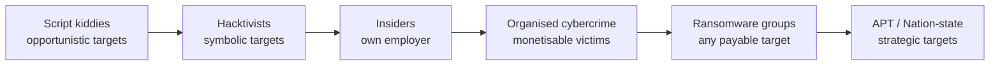

# Threat Actors and Threat Intelligence

A defender who does not know who attacks, why they attack, or how they operate is a defender buying products on faith. Threat intelligence is the discipline of converting that ignorance into structured knowledge: which actor groups care about your sector, what techniques they have used in the last six months, what infrastructure they reuse, what tooling they prefer, and — crucially — what you would see in your logs if they showed up tomorrow. The output of that work is not a glossy report; it is a list of detection rules, hardening priorities, and tabletop scenarios that bend your control budget toward the threats that actually exist.

This lesson covers the **taxonomy of threat actors** (nation-state, APT, organised crime, ransomware affiliates, hacktivists, insiders, script kiddies, terrorist groups, competitors), the **attributes** that distinguish them (sophistication, resources, intent, persistence, location), the **naming conventions** vendors use (Mandiant APT-numbers, CrowdStrike's animal zoo, Microsoft elements, Talos T-IDs), the four flavours of **Threat Intelligence** (Strategic, Operational, Tactical, Technical — sometimes written as CTI/TTI/OTI/STI), the **lifecycle** that turns raw collection into usable defence, the **sharing standards** (STIX 2.1, TAXII 2.1, MISP, OpenCTI), and the analytical models — **MITRE ATT&CK**, the **Cyber Kill Chain**, the **Diamond Model** — that give CTI work structure.

## Why this matters

"Advanced threat" is not a single thing. For a regional hospital, the realistic adversary is a ransomware affiliate scanning for unpatched edge devices on Shodan and a phishing crew that buys access from an Initial Access Broker — the controls that actually matter are MFA on remote access, EDR on every endpoint, immutable backups, and a patch SLA on internet-facing services. For a tier-1 bank, add a different layer: organised cybercrime targeting SWIFT, payment-card theft rings, and nation-state financial-intelligence operations — and the controls list grows to include red-team exercises, transaction-anomaly detection, and dedicated CTI feeds. For a defence ministry, add nation-state actors with multi-year operations, custom implants, and supply-chain compromise — and the controls extend to network segmentation by clearance, hardware roots of trust, and counter-intelligence partnerships.

Without threat intelligence, every organisation buys the same security stack from the same vendors and hopes. With threat intelligence, the SOC can answer *which* of those controls are loadbearing this quarter, *which* detections are missing for the actor groups that target this sector, and *which* incidents reported elsewhere are early warning of what is heading toward `example.local`. Threat intel does not replace controls; it prioritises them, sequences them, and tells you when an external campaign means you should ratchet up alert thresholds tonight rather than next quarter.

The second reason to care is operational. CTI is the substrate underneath detection engineering, incident response, vulnerability management, and red-teaming. A SOC that cannot ingest a STIX bundle, query MISP, read an ATT&CK Navigator layer, or write a Diamond-Model analysis of last week's incident is a SOC that cannot meaningfully participate in the defender community. The work compounds; the absence compounds too.

## Core concepts

### Threat actor categories

The categories overlap — many actors play multiple roles — but the labels still help shape risk models.

- **Nation-state actors** — government-employed or government-contracted operators conducting espionage, sabotage, or influence operations. Long timelines (years), large budgets, custom tooling, willing to burn zero-days on high-value targets. Examples cluster around the "big four" (Russia, China, Iran, DPRK) plus Western services.
- **Advanced Persistent Threat (APT)** — coined by Mandiant in 2013 for the long-running Chinese intrusion sets they tracked; now used loosely for any well-resourced actor running a sustained campaign. The defining traits remain: **advanced** technique (not off-the-shelf scripts), **persistent** presence (months to years of dwell), and **threat** to a specific class of target.
- **Organised cybercrime** — for-profit gangs running phishing, banking trojan, BEC (business email compromise), and identity-theft operations at industrial scale. Less interested in geopolitics, more interested in cash flow. Often loosely structured around brokers, developers, and operators.
- **Ransomware groups (eCrime)** — a specialisation of organised cybercrime, increasingly run as Ransomware-as-a-Service (RaaS) where developers rent the locker to affiliates. Examples: LockBit, BlackCat/ALPHV, Conti (defunct, leaked), Cl0p, Akira. Double-extortion (encrypt + leak) is the modern norm.
- **Hacktivists** — politically or ideologically motivated, defacing sites, leaking data, or running DDoS to make a point. Skill ranges from script-kiddie noise (Anonymous-branded operations) to state-coordinated front groups masquerading as grassroots actors.
- **Insiders (malicious)** — employees, contractors, or vendors who deliberately abuse legitimate access. Motives include money (selling data), revenge (post-firing sabotage), or ideology (whistleblowing-as-leak). Hardest class to detect because the access is not "unauthorized" until you look at intent.
- **Insiders (negligent)** — accidental data leaks, weak passwords, lost laptops, credentials pasted into public Git. Larger volume than malicious insiders, but each incident is usually smaller in impact.
- **Script kiddies** — low-skill actors using off-the-shelf tools (Metasploit modules, leaked Cobalt Strike cracks, public exploit kits). The rest of the field still treats them with caution because tools are powerful and targets are abundant.
- **Terrorist groups** — actors using cyber capabilities to support ideological campaigns; rare in dedicated cyber operations but real in propaganda, recruitment, and occasionally infrastructure attacks.
- **Competitors** — corporate espionage targeting trade secrets, customer lists, or pricing information. May commission third-party intrusions or recruit insiders rather than running attacks directly.

A single incident often involves multiple categories: an Initial Access Broker (organised crime) sells access to a ransomware affiliate (eCrime) who deploys a locker shared with a state-aligned operator (nation-state) for plausible cover. Attribution is messy; the categories above are heuristics, not boxes.

### Threat actor attributes

Every category sits somewhere on five axes:

- **Sophistication.** Off-the-shelf tooling and known CVEs at the low end; custom implants, zero-days, and bespoke supply-chain operations at the high end.
- **Resources.** Time, money, headcount, infrastructure. A nation-state can sustain a five-year operation with dedicated teams; a script kiddie has weekends and a credit card.
- **Intent.** Espionage, financial gain, disruption, ideology, prestige. Intent shapes what they steal, what they break, and how loud they are.
- **Persistence.** Smash-and-grab vs long-dwell. Ransomware crews want hours; APTs want years; hacktivists want headlines.
- **Internal vs external.** Insiders start with legitimate access; external actors must earn or steal it. The detection surface differs sharply.

A risk model worth its salt scores expected adversaries on these axes and uses the result to rank control investments. "Nation-state APT" alone is a label; "high-sophistication, well-resourced, espionage-intent, multi-year persistence, external" is a brief.

### Naming conventions — and why they are messy

Every major vendor invented their own naming scheme, and they do not align. The same actor often has five names.

- **Mandiant** — APT-numbered designations (`APT1`, `APT28`, `APT29`, `APT41`) plus FIN- prefixes for financially-motivated groups (`FIN7`, `FIN8`) and UNC- prefixes for unattributed clusters (`UNC2452`).
- **CrowdStrike** — animal-themed by country: `BEAR` for Russia (Fancy Bear, Cozy Bear, Voodoo Bear), `PANDA` for China (Wicked Panda, Goblin Panda), `KITTEN` for Iran (Charming Kitten, Static Kitten), `CHOLLIMA` for DPRK (Stardust Chollima, Lazarus), `SPIDER` for eCrime (Wizard Spider, Carbon Spider), `JACKAL` for hacktivism, `BUFFALO` for Vietnam.
- **Microsoft (since 2023)** — periodic-table-style "weather × element" pairings: `Forest Blizzard` (Russia GRU = APT28), `Midnight Blizzard` (Russia SVR = APT29), `Strawberry Tempest` (eCrime), `Volt Typhoon` (China). The category prefix encodes country/intent: Blizzard = Russia, Typhoon = China, Sandstorm = Iran, Sleet = DPRK, Tempest = financially-motivated, Storm-NNNN = unattributed.
- **Cisco Talos** — T-IDs (`T-APT28`-style) and descriptive names; less famous than the above but well-cited in research.
- **Kaspersky, ESET, Recorded Future, SecureWorks** — each have their own internal naming. Kaspersky uses descriptive labels; SecureWorks uses element-prefixed names (`Cobalt Spider`).

The result: APT28 = Fancy Bear = Forest Blizzard = Sofacy = STRONTIUM (old Microsoft) = Pawn Storm = Sednit = Tsar Team. Conti = Wizard Spider (in part). LockBit operators were tracked as Bitwise Spider. The MITRE ATT&CK Groups page is the most-used Rosetta Stone — it lists every alias for each tracked actor.

Why naming matters: when CTI from Vendor A says "Forest Blizzard targeted defence sector," your SIEM rules tagged `APT28` need to fire on the same intel. Build alias maps into your TIP (threat-intel platform) so the names normalise on ingest.

### Famous APT example actors

A short field guide. Always cross-reference with the [MITRE ATT&CK Groups page](https://attack.mitre.org/groups/) for current TTPs.

- **APT28 / Fancy Bear / Forest Blizzard** (Russia, GRU Unit 26165) — military-intelligence espionage; election interference; defence-sector targeting; uses XAgent, GAMEFISH, Drovorub.
- **APT29 / Cozy Bear / Midnight Blizzard / NOBELIUM** (Russia, SVR) — strategic intelligence collection; SolarWinds supply-chain compromise (2020); Microsoft 365 token theft against Western governments and tech firms.
- **APT41 / Winnti / BARIUM / Wicked Panda** (China) — dual espionage + financially-motivated; gaming-industry supply-chain attacks; ProxyLogon mass exploitation; uses Winnti, ShadowPad.
- **Lazarus Group / Hidden Cobra / Stardust Chollima** (DPRK) — financial heists (Bangladesh Bank, SWIFT), cryptocurrency theft (Axie Infinity, Ronin), destructive operations (Sony 2014, WannaCry attribution).
- **Charming Kitten / APT35 / Mint Sandstorm** (Iran, IRGC) — credential phishing against journalists, dissidents, government officials; long-running social-engineering operations.
- **Conti / Wizard Spider** (eCrime, defunct after 2022 leaks) — ransomware operator that pioneered the "cartel" model; source code leaked, fragments live on in Black Basta and Royal.
- **LockBit / Bitwise Spider** (eCrime) — RaaS dominant in 2022–2024 until law-enforcement disruption (Op Cronos, Feb 2024); fast affiliate model with technical maturity.
- **FIN7 / Carbanak / Carbon Spider** (eCrime, Eastern Europe) — payment-card theft; pivoted into ransomware partnerships; sophisticated social engineering.
- **Volt Typhoon** (China) — living-off-the-land critical-infrastructure pre-positioning; minimal malware footprint; long-dwell access in US utilities.

The list is not exhaustive — ATT&CK tracks well over 150 named groups. The point is that each group has identifiable TTPs and target preferences, and intelligence about *those* TTPs is what feeds detection engineering.

### Insider threat

Insider attacks divide into **malicious** and **negligent** categories, and the patterns differ sharply.

Malicious-insider patterns:

- **Ego / revenge** — sysadmin who was passed over for promotion sabotages backups before quitting; outgoing developer commits a logic bomb timed to the next year.
- **Financial** — sales rep emails customer list to themselves before joining a competitor; database admin sells query access on the dark web.
- **Ideological / espionage** — leaks classified material, often to media or foreign service; rare but high-impact.
- **Coercion** — insider blackmailed or compromised into providing access to external attackers.

Negligent-insider patterns:

- Falling for phishing (massively the largest source of "insider" credentials).
- Hard-coded credentials in public Git repositories.
- Lost or stolen unencrypted laptops.
- Reuse of personal passwords on corporate accounts.
- Misconfigured cloud storage (public S3 buckets, anonymous-access SharePoint).

Detection relies heavily on **UBA / UEBA** (User and Entity Behaviour Analytics) — modelling each user's normal pattern and alerting on deviation. A finance analyst suddenly downloading the full customer database, or a developer authenticating from a new country at 02:00, are statistical anomalies that pure rule-based detection misses. Combine UEBA with **DLP** (Data Loss Prevention), **mandatory leave** (forces handover, surfaces unattended sabotage), and **separation of duties** (no single person can both create and approve a payment).

### Threat Intelligence (TI) types

CTI work splits into four tiers, each consumed by a different audience.

- **Strategic Threat Intelligence (STI)** — board / C-suite tier. Multi-quarter trends: which actor groups are most active in our sector, what regulatory shifts are coming, what merger / geopolitical events change our risk profile. Outputs: written briefings, trend reports, risk ratings. Cadence: monthly to quarterly.
- **Operational Threat Intelligence (OTI)** — SOC operations tier. Active-campaign awareness: who is attacking us right now, what infrastructure they use, which targets they hit this week. Outputs: campaign profiles, intrusion-set tracking, target-selection analysis. Cadence: daily to weekly.
- **Tactical Threat Intelligence (TTI)** — detection-engineering and red-team tier. Adversary TTPs: which techniques (mapped to ATT&CK) does each group use, in what sequences. Outputs: ATT&CK Navigator layers, Sigma/YARA rules derived from TTPs, purple-team scenarios. Cadence: weekly to monthly.
- **Technical / "CTI" feed-style intelligence** — automated tier. IOCs: hashes, IPs, domains, URLs, file paths. Outputs: STIX bundles, MISP events, EDR/firewall enforcement updates. Cadence: minutes to hours.

The acronyms vary across literature — some texts use **CTI** as the umbrella term for all four, others use it specifically for technical IOC-style feeds. The four-tier model (Strategic / Operational / Tactical / Technical) is the most common breakdown. A program that has Technical and Tactical but no Strategic is a SOC that misses board-level conversations; a program with Strategic but no Technical is a beautiful slide deck nobody can act on.

### TI lifecycle

The classic six-step CTI lifecycle, drawn from intelligence-community doctrine:

1. **Direction** — leadership defines requirements: what questions need answering, which actors and sectors matter, what risk decisions hang on the answers. Without direction, CTI becomes feed hoarding.
2. **Collection** — gather raw data from OSINT, commercial feeds, ISACs, internal IR output, sandbox detonations, dark-web monitoring, partner sharing.
3. **Processing** — normalise, deduplicate, translate, enrich. Convert PDFs and tweets into structured records (STIX objects, MISP attributes). Tag with TLP markings.
4. **Analysis** — correlate, pattern-match, attribute (carefully), generate hypotheses. Diamond Model and Kill Chain analyses live here. Output: finished intelligence — a written conclusion with confidence scoring.
5. **Dissemination** — push the right tier of intelligence to the right consumer: STIX bundles to the SIEM, briefings to the board, ATT&CK layers to the SOC, IR playbooks to the responders.
6. **Feedback** — did the intelligence answer the question, change a decision, or fire a useful alert? Feed the answer back into Direction. Without feedback, the cycle becomes a treadmill.

Programs that skip Feedback and Direction are the ones that produce a hundred reports nobody reads.

### TI sources

A balanced program ingests across multiple source classes.

- **Open OSINT** — Twitter/X infosec community, vendor blogs (Mandiant, CrowdStrike, Microsoft Threat Intelligence, Talos, Unit 42, Securelist), GitHub indicator repos, conference talks (DEF CON, BSides, Virus Bulletin), academic papers.
- **Commercial feeds** — Mandiant Advantage, CrowdStrike Falcon Intel, Recorded Future, Flashpoint, Intel 471, Group-IB. Higher signal-to-noise than free sources, with curated attribution and dark-web coverage; expensive.
- **ISACs / ISAOs** — sector-specific sharing communities: FS-ISAC (finance), H-ISAC (healthcare), E-ISAC (energy), Auto-ISAC (automotive), MS-ISAC (state/local government). Membership costs vary; intelligence value is sector-targeted.
- **Government feeds** — CISA Automated Indicator Sharing (AIS), CISA Known Exploited Vulnerabilities (KEV) catalogue, NCSC (UK), ANSSI (France), BSI (Germany), JPCERT (Japan), national CSIRTs. Free; quality varies.
- **Peer sharing** — bilateral exchanges with trusted partners, often via MISP communities. Highest signal because it is your peers' actual incidents.
- **Internal IR** — every incident your own team handles produces indicators. This is the most valuable source for *your* environment because it is by definition relevant.
- **Dark-web monitoring** — credential-leak markets, ransomware leak sites, initial-access-broker forums. Useful as a signal that an attack has already happened (your credentials for sale) or is being planned (your domain mentioned).

### Sharing standards

Machine-readable interchange formats let CTI move between organisations without manual translation.

- **STIX 2.1 (Structured Threat Information eXpression)** — JSON-based data model from OASIS. Defines object types: `indicator`, `malware`, `threat-actor`, `intrusion-set`, `campaign`, `attack-pattern`, `tool`, `course-of-action`, `report`, `relationship`, `sighting`. Expresses not just IOCs but the relationships between them.
- **TAXII 2.1 (Trusted Automated eXchange of Indicator Information)** — HTTPS-based transport for STIX. Defines collections, channels, and pull/push semantics. Most commercial and government feeds publish via TAXII.
- **MISP (Malware Information Sharing Platform)** — open-source threat-sharing platform with its own attribute model; bidirectional STIX import/export. The community-driven backbone of inter-organisation sharing in many sectors.
- **OpenCTI** — open-source CTI knowledge graph from Filigran. Imports STIX, MISP, and proprietary feeds; lets analysts pivot through actor-tool-technique-target relationships visually. Increasingly the standard for analyst-facing CTI work.
- **OpenIOC** — older Mandiant XML format, mostly superseded by STIX 2.1 but still encountered.
- **TLP (Traffic Light Protocol) v2.0** — marking standard for sharing restrictions: TLP:CLEAR (no restrictions), TLP:GREEN (community), TLP:AMBER (organisation), TLP:AMBER+STRICT (need-to-know), TLP:RED (named individuals only).

### MITRE ATT&CK

The most influential CTI framework in current use. ATT&CK catalogues adversary behaviour as a matrix of **tactics** (the *why* — Initial Access, Execution, Persistence, Privilege Escalation, Defense Evasion, Credential Access, Discovery, Lateral Movement, Collection, Command and Control, Exfiltration, Impact) and **techniques** (the *how* — `T1566.001 Spearphishing Attachment`, `T1059.001 PowerShell`, `T1003.001 LSASS Memory`). Many techniques have **sub-techniques** for finer granularity.

Three matrices: **Enterprise** (Windows, macOS, Linux, cloud, containers, identity, network), **Mobile** (iOS, Android), **ICS** (industrial control systems). The Enterprise matrix is what most SOCs work in.

The **ATT&CK Navigator** is a web tool for layering: pick a threat group, see which techniques they use, overlay your detection coverage, identify gaps. A common artefact is a "heatmap" — green for techniques with good coverage, yellow for partial, red for no coverage — used to drive detection-engineering backlog.

ATT&CK is not perfect: technique definitions sometimes overlap, mappings drift over time, and "coverage" on a heatmap is not the same as "detection that fires reliably." But it is the lingua franca — every modern CTI report, every detection-engineering exercise, every red-team after-action references ATT&CK technique IDs.

### Cyber Kill Chain (Lockheed Martin)

The 2011 Lockheed Martin Cyber Kill Chain is the older, simpler model:

1. **Reconnaissance** — target research, OSINT collection.
2. **Weaponisation** — combine exploit + payload into a deliverable.
3. **Delivery** — phishing, drive-by, USB drop, supply-chain.
4. **Exploitation** — code execution on target.
5. **Installation** — implant persistence.
6. **Command and Control (C2)** — establish remote control channel.
7. **Actions on Objectives** — exfiltrate, encrypt, destroy, pivot.

The Kill Chain remains useful for executive briefings and for ransomware-style intrusions where the linear flow holds. It is criticised for not modelling lateral movement well and for assuming a single linear sequence — modern intrusions loop through phases multiple times. ATT&CK and Kill Chain are complementary: Kill Chain for the strategic narrative, ATT&CK for the technical detail.

### Diamond Model

The Diamond Model (Caltagirone, Pendergast, Betz, 2013) frames every intrusion event as four linked nodes:

- **Adversary** — the actor (individual, group, intrusion-set).
- **Capability** — tools, malware, techniques used.
- **Infrastructure** — IPs, domains, accounts, servers used.
- **Victim** — target organisation, person, system.

Each event connects all four; pivots along any edge produce new investigations (same C2 used against another victim → suggests same adversary; same adversary using a new tool → expands capability profile). The Diamond Model is the cleanest analytical scaffold for actor-level CTI work; it pairs well with ATT&CK (capability detail) and Kill Chain (event sequencing).

Extensions to the Diamond Model add **meta-features** (timestamp, phase, result, methodology, resources, direction) and **socio-political** + **technology** axes that connect adversary intent to victim impact. In practice, most analysts use the four-node core and tag events with ATT&CK technique IDs on the capability node and Kill Chain phase on the meta layer. The model's strength is that it forces analysts to fill in *every* node — leaving "victim" blank in a finished intelligence product is now uncomfortably visible, which surfaces collection gaps that would otherwise hide.

### Dark web and leak-site monitoring

A non-trivial slice of operational CTI comes from monitoring places defenders historically did not look: ransomware leak sites, credential markets, initial-access broker forums, and Tor-hosted dump sites. Three reasons it matters:

- **Early-warning signal.** When `example.local` credentials appear on a combo-list or RDP-access listing, the right response is not "investigate later" — it is "rotate, MFA-require, and hunt for prior abuse tonight." Continuous monitoring shrinks the gap between leak and response.
- **Pre-attack intelligence.** Initial Access Brokers list victim organisations on forums weeks before ransomware deployment. A SOC that monitors broker feeds for its own organisation can sometimes preempt the ransomware phase entirely.
- **Post-attack confirmation.** A ransomware group's leak site is the authoritative public record of which organisations refused to pay; appearance there is itself a forensic timestamp.

Practical access is via paid services (Recorded Future, Flashpoint, KELA, DarkOwl) or via internal Tor-routed collection (legal-review required). Most mid-market organisations buy rather than build; the legal and operational-security overhead of running collection from a corporate IP is not worth the savings.

## Threat actor sophistication diagram

Read left-to-right as a rough sophistication and resource gradient. It is rough: a skilled hacktivist can outclass a junior eCrime operator, and a negligent insider needs no skill at all. The ordering captures the typical median, not the extremes.

The "what they target" axis is just as important as the sophistication axis. Script kiddies sweep the internet for any vulnerable target; APTs hand-pick a single defence contractor and stalk it for 18 months. A control that is excellent against one end of the spectrum is often useless against the other. Patching internet-facing CVEs within 48 hours protects you from the script kiddies and most ransomware affiliates; it does almost nothing against an APT that has burned a zero-day on you specifically. Knowing where on this spectrum your realistic adversary sits is the first input to any control-investment decision.

## Threat actors at a glance

| Category | Sophistication | Resources | Intent | Persistence | Typical targets |
|---|---|---|---|---|---|
| Script kiddies | Low | Personal | Prestige | Days | Anything vulnerable |
| Hacktivists | Low to high | Crowdsourced | Ideological | Weeks | Symbolic / political |
| Negligent insiders | N/A | N/A | None (accidental) | One-off | Own employer (accidental) |
| Malicious insiders | Variable | Insider access | Money / revenge | Days to months | Own employer |
| Hackers (researchers, grey hat) | High | Personal | Curiosity / bounty | Variable | Bug-bounty scope |
| Competitors | Moderate | Corporate | Espionage | Months | Direct competitor |
| Organised cybercrime | Moderate to high | Criminal economy | Money | Months | Monetisable victims |
| Ransomware groups (eCrime) | Moderate to high | RaaS economy | Money | Days to weeks dwell | Any payable target |
| Hacktivist front groups | Variable | State-funded sometimes | Influence | Months | Political / strategic |
| Nation-state / APT | Very high | National | Espionage / sabotage | Years | Strategic targets |
| Terrorist groups | Low to moderate | Variable | Ideological / disruption | Weeks to months | Symbolic infrastructure |

The table is a heuristic, not a taxonomy: real incidents involve combinations (an insider sells access to an Initial Access Broker who sells to a ransomware affiliate who deploys a locker also used by a state-aligned operator for cover), and the attribute values are medians not absolutes. Use the table to seed a risk model, not to argue about who exactly attacked whom.

## Hands-on / practice

1. **Map an APT to your defences via MITRE ATT&CK.** Pick an actor likely to target `example.local`'s sector — say APT29 if you're a government supplier or FIN7 if you're a retailer. Open the MITRE ATT&CK Groups page, list the techniques attributed to the group, and load them into ATT&CK Navigator as a layer. Now overlay your detection coverage: green for "we have a Sigma rule that fires," yellow for "log source exists but no rule," red for "no log source." The red boxes are your detection-engineering backlog. Document the top five gaps and estimate engineering hours.
2. **Produce a STIX 2.1 bundle from a CTI report.** Take a recent public vendor blog (Mandiant, Microsoft, Talos) on a specific intrusion. Extract every IOC mentioned (hashes, IPs, domains) plus the threat actor name, the malware family, and the techniques used. Build a STIX 2.1 JSON bundle with `indicator`, `malware`, `threat-actor`, `attack-pattern`, and `relationship` objects linking them. Validate with the [OASIS STIX validator](https://oasis-open.github.io/cti-stix-validator/). Bonus: import the bundle into MISP and confirm it round-trips.
3. **Query MISP for IOCs related to a recent incident.** Stand up a MISP instance (community demo or local Docker) and join the CIRCL feed. Search for a recent high-profile campaign by tag or keyword (`tag:tlp:white AND galaxy:threat-actor="APT29"`). Export the matched events as STIX and as a flat IOC list. Practise filtering: only IOCs less than 30 days old, only those tagged `confidence:high`. The exercise is about workflow, not specific data.
4. **Build a Diamond-Model analysis for a red-team finding.** Take the most recent internal red-team or pentest report. Map it to the Diamond Model: Adversary (the red-team operator), Capability (the tools and techniques used), Infrastructure (the C2 redirectors, phishing domains, dropper VPSs), Victim (the targeted users / systems / business processes). Now answer the pivot questions: what other capabilities could this adversary deploy against the same victim? What other victims could the same infrastructure target? The exercise is intelligence reasoning, not IOC listing.
5. **Subscribe to a national CSIRT advisory feed.** Pick the CSIRT relevant to `example.local`'s jurisdiction (CISA AIS, NCSC, CERT.AZ, CERT-EU, JPCERT). Subscribe to their advisory feed via TAXII (where available) or RSS. Set up an automated ingestion: each advisory parsed, IOCs deployed to enforcement, ATT&CK technique mappings cross-referenced against your detection coverage. Track for one month: how many advisories arrived, how many produced action, how many were already covered by existing controls.

## Worked example — `example.local` builds a CTI program

`example.local` is a mid-size logistics company; new CISO arrives, finds no formal CTI program — just a Recorded Future feed nobody reads and a folder of bookmarked vendor blogs. She charters a six-month plan.

**Month 1 — Direction.** Workshop with the executive team to define the three risk questions CTI must answer: (1) which threat actor groups are most likely to target `example.local`'s sector and geography? (2) which TTPs are these groups currently using? (3) where do our detections fall short against those TTPs? Output: a written CTI Requirements document, signed off by the CISO and the COO. This becomes the Direction input that prevents the program from drifting into feed-hoarding.

**Month 2 — Top-three actor identification.** The CTI lead surveys public reporting (Mandiant M-Trends, Verizon DBIR, ENISA Threat Landscape) and sector-specific ISAC briefings. Result: three actor groups stand out for logistics targeting in the region — (a) a Russia-aligned APT focused on supply-chain disruption, (b) a ransomware affiliate cluster (multiple LockBit-derived groups) targeting mid-market logistics, (c) Initial Access Brokers selling RDP/VPN access to whichever ransomware crew pays. Profiles are written for each, with confidence ratings (high / medium / low) per claim.

**Month 3 — TTP mapping to ATT&CK.** For each of the three actor groups, pull the techniques from the ATT&CK Groups page and from primary CTI reports. Build an ATT&CK Navigator layer per group, then a combined "all three" layer using the union. The combined layer covers 47 distinct techniques across 11 tactics. This is the **threat model** — the techniques `example.local` should detect first.

**Month 4 — Gap analysis.** Cross-reference the 47 techniques against current SOC detection coverage. Use a three-tier score per technique: green (Sigma rule exists, validated by purple-team test), yellow (log source available, no rule), red (log source missing). Result: 14 green, 21 yellow, 12 red. The 12 red items become the *blocking* backlog; the 21 yellow items become the engineering backlog.

**Month 5 — Roadmap and quick wins.** Produce a six-month roadmap to close the gaps:

- Months 1–2: deploy Sysmon to endpoints to fix five red items (host-process visibility).
- Months 2–3: enable Microsoft Entra audit log integration to fix three red items (identity / OAuth-consent visibility).
- Months 3–4: write 15 Sigma rules covering yellow items, prioritised by ATT&CK frequency-of-use.
- Months 4–5: stand up MISP, join two ISAC communities, subscribe to CISA AIS, integrate into the SIEM watchlist.
- Months 5–6: run two purple-team exercises against the most-likely-attack-path scenarios from each actor profile; close any new gaps surfaced.

**Month 6 — Operational rhythm and feedback.** The CTI program transitions from setup into operations: weekly intel briefing for the SOC, monthly ATT&CK-coverage update for the CISO, quarterly strategic briefing for the executive team. Each external CTI report is logged with a "did this change a decision?" flag; the lifecycle Feedback step is now real. After six months, the CISO has answers to the three Direction questions, a measurable detection-coverage improvement, and a CTI program that pays rent rather than collects feeds.

The lesson `example.local`'s team takes from this is that CTI is not a product purchase — it is a function. The Recorded Future feed, the MISP node, the ATT&CK Navigator, the ISAC membership are all inputs; the *output* is a prioritised, evidence-backed control plan that the executive team can read and the SOC can act on.

A second outcome worth flagging: the program now produces an internal CTI artefact every week — a one-page note titled "what changed and what we did about it." The note is read by the SOC lead, the IR lead, and the CISO, and is filed into the TIP. After six months the file is a searchable archive of how the threat landscape evolved against `example.local` specifically. That archive is more valuable than any commercial feed because it is calibrated to one organisation's environment, controls, and priorities. New analysts onboarded to the team read the archive cold and absorb six months of context in two days.

A third outcome: the CTI program creates a feedback loop into vulnerability management. When the ATT&CK gap analysis identified that initial-access-via-edge-device exploitation was the dominant pattern across all three actor groups, the patch SLA on internet-facing systems dropped from 30 days to 7 days, and a weekly external-attack-surface scan was commissioned. That is CTI changing a control budget — exactly what the program exists to do.

## Troubleshooting & pitfalls

- **Vanity-driven attribution.** Naming the actor in every report feels rigorous but rarely changes a defensive decision. Spend the same minutes mapping techniques instead.
- **"We have a feed in the SIEM" without analyst time.** A subscription does not become detection until someone reads, scores, deploys, and tunes the indicators. Budget analyst hours, not just license fees.
- **IOCs without context.** A list of 5,000 hashes with no actor / campaign / TLP / first-seen date is a list of false positives waiting to happen. Demand structured context on every feed.
- **Ignoring the strategic-tier TI.** If the board never sees a CTI briefing, security investment becomes a finance-driven cost line. Strategic TI is how the security team earns budget.
- **Over-trusting one vendor.** Every commercial feed has gaps; every government feed lags; every open-source feed has noise. Triangulate across at least three source classes.
- **False-flag operations confusing attribution.** State actors sometimes plant misdirecting artefacts (foreign-language strings, recycled tools from other groups). Treat attribution as hypothesis, not fact.
- **Hoarding TI vs sharing.** A team that consumes feeds but never contributes to MISP / ISACs eventually loses access to the best peer feeds. Sharing is reciprocal.
- **Stale ATT&CK mappings.** Vendor reports map techniques as of the date written; ATT&CK itself evolves. Re-baseline coverage layers every quarter.
- **Coverage-on-paper vs detection-in-practice.** A green ATT&CK box means a rule exists, not that it fires correctly, ships to a human, or gets actioned. Validate with purple-team exercises.
- **Alert fatigue from CTI.** Dumping every feed indicator into a SIEM with single-IOC alerting drowns the SOC. Correlate at least two signals before paging.
- **Confusing TI with OSINT collection.** Reading vendor blogs is OSINT; *deciding* what changes in your defence is intelligence. Output, not input, defines a TI program.
- **Confidence inflation.** Every analyst is tempted to label findings "high confidence" because it sounds authoritative. Use a structured scale (Admiralty / source-information matrix) and stick to it.
- **Skipping the Feedback step.** Without a "did this matter?" loop, the CTI lifecycle becomes a treadmill of dissemination with no learning.
- **Over-classifying.** TLP:RED on everything kills sharing; TLP:CLEAR on operational details leaks tradecraft. Train analysts to mark deliberately.
- **Naming-scheme confusion.** Two teams tagging the same actor with different vendor names produce uncorrelated rules. Maintain an alias map; ATT&CK Groups page is the canonical reference.
- **Ignoring insider threat.** UEBA / DLP / mandatory-leave / separation-of-duties controls drop off most external-facing CTI programs. Insiders cause real losses; budget for them.
- **No retention strategy.** TI data ages. A SIEM watchlist that grew for three years without pruning slows queries and surfaces irrelevant alerts.
- **Detection without response runbooks.** A new high-fidelity rule that fires at 03:00 and nobody knows what to do is a false-negative machine. Every rule needs a runbook.
- **Skipping internal IR data.** The most valuable feed is your own incident output — sanitise and feed it back into your TI platform with the same rigour as commercial feeds.
- **Over-investing in attribution as a deterrent.** Naming and shaming is government policy; for a private SOC it changes nothing about what to detect or block tomorrow.
- **Confusing tools with techniques.** Detecting Cobalt Strike (a tool) is good; the same actor can switch to Sliver and bypass the rule. Map detections to ATT&CK techniques so they survive tool rotation.
- **No retention-period strategy on TI.** TI data older than 12–18 months is reference, not operational. Tier the storage; do not let an aging watchlist drown current alerts.
- **CTI in a silo.** A CTI team that does not embed with detection engineering, IR, vuln management, and red-team produces beautiful reports that nobody acts on.
- **Treating ATT&CK as a checklist.** Coverage on every box does not mean adequate detection — it means a rule exists. Validate with adversary emulation (Atomic Red Team, Caldera).

## Key takeaways

- **Threat actors are categories, not boxes** — most incidents involve multiple categories (broker → affiliate → operator); use the taxonomy as a heuristic.
- **Sophistication × resources × intent × persistence × location** — five attributes that matter more than the label you slap on a group.
- **Naming is messy** — APT28 = Fancy Bear = Forest Blizzard. Maintain alias maps; ATT&CK Groups is the Rosetta Stone.
- **Strategic / Operational / Tactical / Technical** — four CTI tiers, four audiences. A program that hits only one tier is incomplete.
- **The lifecycle is a loop** — Direction, Collection, Processing, Analysis, Dissemination, Feedback. Skipping Feedback turns CTI into a treadmill.
- **STIX 2.1 + TAXII 2.1 are the lingua franca** — every modern feed publishes via TAXII; every TIP imports STIX.
- **MITRE ATT&CK is the technique vocabulary** — every CTI report, every detection rule, every red-team after-action references ATT&CK technique IDs.
- **Diamond Model and Kill Chain** — analytical scaffolds; pair them with ATT&CK for full intrusion narratives.
- **CTI without action is theatre** — the only valid output of CTI is changed defensive priorities, deployed detections, or executive risk decisions.
- **Share back to earn access** — peer sharing through MISP and ISACs is reciprocal; takers eventually lose access to the best feeds.
- **Internal IR is your most valuable feed** — every incident your team handles produces indicators calibrated exactly to your environment.
- **Dark-web monitoring is early warning** — leaked credentials, broker listings, and leak-site mentions arrive before the breach is confirmed.
- **Build alias maps** — APT28 / Fancy Bear / Forest Blizzard / Sofacy are the same actor; without aliasing your rules and reports are uncorrelated.
- **TLP markings discipline sharing** — over-classification kills sharing; under-classification leaks tradecraft. Train analysts to mark deliberately.
- **Detection coverage is the metric** — not feed count, not report volume, not headcount. ATT&CK technique coverage validated by adversary emulation is the only honest measure.
- **CTI compounds over time** — an internal archive of "what changed and what we did" is more valuable after twelve months than any commercial feed. Start writing it now.
- **The TI lifecycle is a loop, not a list** — Direction defines the questions, Feedback closes them; the middle four steps are mechanics.

## Common misconceptions

- **"More feeds = better intelligence."** Past a point, additional feeds add noise faster than signal. Curate ruthlessly.
- **"Attribution is what CTI is for."** Attribution is occasionally interesting and rarely useful. Detection and prioritisation are the real outputs.
- **"Threat intel is for big companies only."** Even a five-person team benefits from a CISA AIS subscription, an MS-ISAC membership (if eligible), and a quarterly review of the Verizon DBIR. The investment scales down better than people expect.
- **"We don't have anything attackers want."** Every organisation has credentials, payment data, identity-as-a-service value (your domain reputation phishes other people's customers), and ransom-payable systems. Threat models that conclude "we're not a target" are usually wrong.
- **"AI/ML will replace CTI analysts."** ML helps with volume (clustering indicators, deduplicating reports, surfacing anomalies); it does not replace the judgement step where an analyst decides what changes in defence. Use both.

## Reference images

These illustrations are from the original training deck and complement the lesson content above.

  <figure><figcaption>Slide 2</figcaption></figure>
  <figure><figcaption>Slide 3</figcaption></figure>
  <figure><figcaption>Slide 4</figcaption></figure>
  <figure><figcaption>Slide 5</figcaption></figure>
  <figure><figcaption>Slide 6</figcaption></figure>
  <figure><figcaption>Slide 7</figcaption></figure>
  <figure><figcaption>Slide 9</figcaption></figure>
  <figure><figcaption>Slide 12</figcaption></figure>
  <figure><figcaption>Slide 15</figcaption></figure>

## References

- MITRE ATT&CK framework — [attack.mitre.org](https://attack.mitre.org/)
- MITRE ATT&CK Navigator — [mitre-attack.github.io/attack-navigator](https://mitre-attack.github.io/attack-navigator/)
- MITRE ATT&CK Groups — [attack.mitre.org/groups](https://attack.mitre.org/groups/)
- Lockheed Martin Cyber Kill Chain — [lockheedmartin.com/en-us/capabilities/cyber/cyber-kill-chain.html](https://www.lockheedmartin.com/en-us/capabilities/cyber/cyber-kill-chain.html)
- Caltagirone, Pendergast, Betz — "The Diamond Model of Intrusion Analysis" (2013) — [activeresponse.org/wp-content/uploads/2013/07/diamond.pdf](https://www.activeresponse.org/wp-content/uploads/2013/07/diamond.pdf)
- STIX 2.1 specification — [oasis-open.github.io/cti-documentation/stix/intro](https://oasis-open.github.io/cti-documentation/stix/intro)
- TAXII 2.1 specification — [oasis-open.github.io/cti-documentation/taxii/intro](https://oasis-open.github.io/cti-documentation/taxii/intro)
- MISP project — [misp-project.org](https://www.misp-project.org/)
- OpenCTI — [opencti.io](https://www.opencti.io/)
- CISA Known Exploited Vulnerabilities catalogue — [cisa.gov/known-exploited-vulnerabilities-catalog](https://www.cisa.gov/known-exploited-vulnerabilities-catalog)
- CISA Automated Indicator Sharing (AIS) — [cisa.gov/ais](https://www.cisa.gov/ais)
- ENISA Threat Landscape — [enisa.europa.eu/topics/cyber-threats/threats-and-trends](https://www.enisa.europa.eu/topics/cyber-threats/threats-and-trends)
- Verizon Data Breach Investigations Report (DBIR) — [verizon.com/business/resources/reports/dbir](https://www.verizon.com/business/resources/reports/dbir/)
- Mandiant M-Trends annual report — [mandiant.com/m-trends](https://www.mandiant.com/m-trends)
- NCSC UK threat reports — [ncsc.gov.uk/section/keep-up-to-date/threat-reports](https://www.ncsc.gov.uk/section/keep-up-to-date/threat-reports)
- Microsoft Threat Actor Naming taxonomy — [microsoft.com/en-us/security/blog/2023/04/18/](https://www.microsoft.com/en-us/security/blog/2023/04/18/)
- CrowdStrike adversary universe — [adversary.crowdstrike.com](https://adversary.crowdstrike.com/)
- Traffic Light Protocol (TLP) v2.0 — [first.org/tlp](https://www.first.org/tlp/)
- ATT&CK Evaluations — [attackevals.mitre-engenuity.org](https://attackevals.mitre-engenuity.org/)
- OASIS STIX validator — [oasis-open.github.io/cti-stix-validator](https://oasis-open.github.io/cti-stix-validator/)

## Related lessons

- [Attack indicators (IOC and IOA)](./attack-indicators.md) — the artefact-level companion to actor-level CTI.
- [Network attacks](./network-attacks.md) — the network-layer techniques the actors above actually use.
- [Social engineering](./social-engineering.md) — the most common initial-access vector across every actor category.
- [Initial access](./initial-access.md) — the earliest Kill Chain phase where TTP-based detection pays off.
- [Penetration testing](./penetration-testing.md) — adversary emulation that validates your CTI-driven detection coverage.
- [OWASP Top 10](./owasp-top-10.md) — web-app attack surface that hacktivists and eCrime groups routinely target.
- [Investigation and mitigation](../blue-teaming/investigation-and-mitigation.md) — the blue-team workflow that consumes CTI and turns it into incident response.
- [Digital forensics](../blue-teaming/digital-forensics.md) — produces the internal IR feed that becomes your most valuable CTI source.
- [Threat intel and malware analysis tools](../general-security/open-source-tools/threat-intel-and-malware.md) — open-source tooling for ingesting, pivoting, and analysing CTI.
- [SIEM and monitoring](../general-security/open-source-tools/siem-and-monitoring.md) — where the rules derived from CTI actually run.
