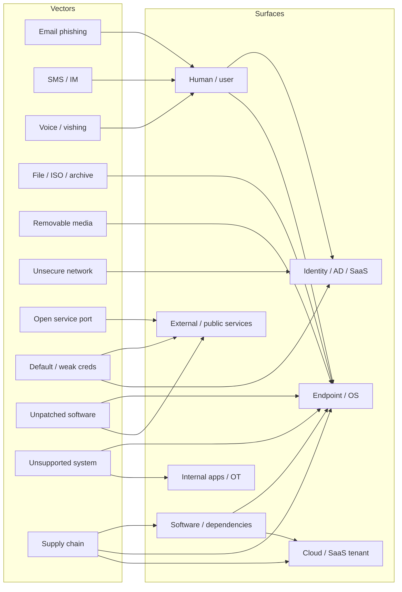

# Threat Vectors and Attack Surfaces

A "threat vector" is the *path* an attacker takes to reach you; an "attack surface" is the *sum of paths that exist*. The difference matters because defenders own the surface — every service, user, vendor, and unpatched binary on it — while attackers only need to find one workable vector through it. The arithmetic is brutal: a defender who must guard a thousand doors loses to an attacker who only has to walk through one.

This lesson is about taking that arithmetic seriously. We will inventory the vectors that actually deliver compromise in 2026 — message-based, file-based, voice, removable media, unsecure networks, open ports, default credentials, vulnerable and unsupported software, and the half-dozen flavours of supply-chain attack — and we will map them to the attack surfaces they target, so a defender can read the news, ask "do we have *that*?", and pick up a phone before the campaign reaches `example.local`.

## Why this matters

Most breaches are not the result of exotic zero-days. The Verizon DBIR, the CISA KEV catalogue, and every annual Mandiant report tell the same story year after year: phishing, stolen credentials, exposed services, and unpatched n-day vulnerabilities deliver the overwhelming majority of incidents. The attackers who *do* burn zero-days save them for high-value targets and then quietly use the same boring vectors as everyone else for the rest of their work. A defender who treats vector enumeration as a "basics" exercise and skips it for "advanced" topics is optimising the wrong end of the kill chain.

The second reason is asymmetry. Attackers enumerate exhaustively — Shodan crawls, certificate transparency logs, leaked credential dumps, OSINT against your staff's LinkedIn, third-party breach intel about your vendors, every `nuclei` template in the public catalogue. They will find the surface you forgot. Defenders who do not run *the same scans against themselves* are operating with a strictly smaller view than their adversaries. Continuous Attack Surface Management (CAASM) and External Attack Surface Management (EASM) tools exist because somebody figured out that an asset inventory built from procurement records is fiction; the real inventory is whatever Shodan, Censys, and your own DNS provider can see.

The third reason is supply chain. The 3CX, SolarWinds, Kaseya, and MOVEit incidents reshaped the question from "is *our* software patched?" to "is every piece of software *we install* trustworthy?" — and the answer for most organisations is "we don't know, we never asked." A modern attack-surface inventory must include the software supply chain, the MSP/MSSP relationships, and the OAuth grants in your tenant, not just the public IPs.

Finally, the framing of "vector versus surface" is the difference between *reactive* and *proactive* defence. A purely reactive shop sees a phishing email, blocks the sender, and moves on; a proactive shop asks "phishing is the vector — what is the *surface* it landed on, and how do we shrink that surface?" The answer is rarely "block one more sender." It is "tighten OAuth-consent policy, deploy phishing-resistant MFA, segment the user from the file servers they should not be reaching, and rehearse the IR playbook." That kind of work only happens when the team thinks in surfaces, not in alerts.

## Threat actors — quick recap

The full deep-dive on actors, attribution, threat-intel feeds, and the naming-convention zoo lives in [Threat actors and intel](./threat-actors-and-intel.md). This lesson is about *what they do*; that lesson is about *who they are*. The table below is the thirty-second briefing that lets the rest of this page make sense.

| Actor | Resources | Persistence | Typical motive |
|---|---|---|---|
| Nation-state | Very high | Years | Espionage, sabotage, influence |
| APT | High | Months to years | Sustained access to specific targets |
| Organised crime | Moderate to high | Weeks to months | Financial gain (ransomware, BEC, fraud) |
| Hacktivist | Low to moderate | Hours to days | Ideology, publicity, defacement |
| Insider (malicious) | Variable | Until detected | Money, revenge, ideology |
| Insider (negligent) | n/a | n/a | Mistakes, not malice |
| Unskilled attacker | Low | One-shot | Notoriety, mischief, opportunistic gain |
| Shadow IT user | n/a | n/a | Productivity (not adversarial) |

Notice that two rows in that table — negligent insiders and shadow IT users — are not adversaries at all. They are users solving real problems with the wrong tools, and they enlarge the attack surface as a side effect. The defender's job is to find the surface they create *before* an actual adversary does.

## Core concepts — Threat vectors

### Message-based

Email, SMS, instant-messaging, and now QR codes deliver the largest single share of initial-access compromises in every industry survey. The reason is simple: a message platform reaches every user's inbox by design, the user is conditioned to act on messages, and the attacker only needs one click out of thousands.

- **Email phishing** — the workhorse. Generic credential-harvest pages, targeted spear-phishing referencing internal projects, business email compromise (BEC) intercepting wire-transfer chains, malicious attachments, and OAuth-consent phishing where the user is tricked into granting an attacker app permission to their mailbox or cloud drive without ever typing a password.
- **SMS smishing** — short text messages with malicious links, often impersonating banks, couriers ("your package is waiting"), tax authorities, or the CEO ("buy gift cards, urgent"). Because mobile browsers truncate URLs, a hostile domain looks legitimate at a glance.
- **Instant messaging** — Slack, Microsoft Teams, WhatsApp, Telegram, Signal. Attackers who compromise one staff account use it to phish their colleagues from inside the trusted channel, where users have their guard down. External Teams federation, in particular, has been abused to deliver malware from attacker tenants that look like vendors.
- **QR-code phishing (quishing)** — a QR code in a poster, parking sign, or email body opens a phishing URL that bypasses email gateway scanners, since the gateway sees only an image. The user resolves the code on a phone, which is often outside the corporate proxy and EDR.

The defender's response to message-based vectors is layered: gateway filtering and DMARC/DKIM/SPF cut the obvious volume, phishing-resistant MFA (FIDO2 keys, platform passkeys) defeats credential harvest at the door, and conditional-access policies that flag unusual sign-in geographies catch the residue. None of those layers is sufficient alone; together they push attackers toward the harder vectors.

### Image-based

Image vectors are smaller in volume but disproportionately interesting to red teams, because image parsers run untrusted data with high privileges in many components.

- **Steganography** — payloads hidden inside otherwise-legitimate images and decoded by a separate loader on the host. Common in second-stage delivery, where the image bypasses content filters that whitelist by extension.
- **Malicious image parsers** — historical Windows GDI bugs (MS04-028 JPEG, the long line of Windows graphics CVEs), libpng and libwebp issues, and PDF rasteriser bugs. A single crafted image opening in a preview pane has been enough for code execution in multiple incidents.
- **SVG smuggling** — SVG files contain XML and can embed scripts; attackers use them to deliver redirects or embedded HTML smuggling payloads that survive email gateway inspection.

### File-based

Files remain a primary delivery mechanism even after Microsoft tightened macro defaults. Attackers responded by switching containers.

- **Office macros** — `.docm`, `.xlsm`, `.pptm` with VBA. Microsoft now blocks internet-tagged macros by default, which has shifted attackers but not eliminated macros (especially for documents arriving from "trusted" file shares with Mark-of-the-Web stripped).
- **ISO and IMG smuggling** — an attacker mails a `.zip` containing a `.iso` containing a `.lnk` that runs a payload. Until recent Windows changes, mounted ISOs did not propagate Mark-of-the-Web to their contents, so SmartScreen and macro-block prompts were silently bypassed.
- **Archive smuggling** — `.zip`, `.7z`, password-protected archives where the password is in the email body. The archive bypasses content scanning; the user supplies the password and walks the payload past the gateway by hand.
- **OneNote and HTML smuggling** — a `.one` notebook with an embedded malicious attachment, or a `.html` file with JavaScript that reassembles a binary in the browser and prompts the user to save and run it. Both became routine after macro lockdown.

The pattern across file vectors is the same: attackers find a container the gateway does not deeply inspect, hide a payload inside, and rely on the user to extract and execute it. Application-control policies (AppLocker, WDAC) that block scripts and unsigned binaries from user-writable directories reduce this surface dramatically; full deployment is operationally hard but pays back the first time a phishing payload silently fails to launch.

### Voice call

Voice calls bypass every text-based content filter you own, and recent generative-AI advances make them dramatically more convincing.

- **Vishing** — a phone call posing as IT support, the bank, or a courier to extract credentials, MFA codes, or remote-control consent (the classic "log in to TeamViewer for me"). Often paired with a prior phishing email so the call seems to confirm a legitimate reset.
- **Deepfake voice** — a few seconds of a CEO's voice from YouTube or an earnings call is enough to clone for a one-minute "wire-transfer instruction" call to finance. Several `example.local`-class organisations have lost six- and seven-figure sums to this in 2024–2026.
- **MFA-fatigue calls** — the attacker triggers a stream of MFA push prompts and calls the user pretending to be IT, asking them to "approve the prompt to clear the queue." A surprisingly high success rate against tired users at the end of a shift.

Voice is also the vector with the worst telemetry coverage. Email, file delivery, and even SMS have central choke points; voice calls hit each user's personal phone with no log the SOC can query. That is part of why voice is rising as a vector: the controls that exist elsewhere do not exist here.

### Removable media

Removable media looks dated, and then somebody plugs in a USB stick they found in the parking lot.

- **USB drops** — sticks scattered in the lobby or executive parking, sometimes labelled "Salaries 2026" to maximise curiosity. Once plugged in, autorun (where still enabled), HID emulation (BadUSB), or a single user double-click delivers the payload.
- **BadUSB** — the device identifies itself to the OS as a keyboard and types commands at machine speed. The user plugged in a "USB charger" that is actually a Rubber Ducky.
- **Hardware implants** — pre-installed compromise in cables (`O.MG cable`), mice, keyboards, or peripheral docks. Higher-effort, mostly seen in targeted operations and supply-chain interdiction scenarios.
- **Juice jacking** — public USB charge ports rigged to exfiltrate phone data or push a payload. The advised mitigation for travelling staff is a "USB condom" data-blocker or a wall-outlet USB-PD adapter.

Endpoint USB-control policies (allowlist by VID/PID, block HID-emulation from new devices, encrypt all writeable removable media) compress this surface to near-zero. The cost is operational friction for staff who legitimately use USB peripherals, which is why the policy is rarely fully enforced.

### Vulnerable software

The single most boring and most reliable attacker pathway: software with a known unpatched flaw on a network the attacker can reach.

- **n-day exploitation** — public CVE, public proof-of-concept, no patch deployed. The CISA Known Exploited Vulnerabilities catalogue is the operational priority list — every entry is something somebody is *currently* exploiting in the wild.
- **Browser exploits** — increasingly rare against fully-patched modern browsers, but remain a vector against unmanaged laptops, kiosks, and unpatched contractors.
- **Exploit kits** — automated drive-by-download frameworks (RIG, Magnitude historically) that fingerprint the browser and serve the matching exploit. Dwindled in commodity crime but still present in targeted operations.

### Unsupported systems

A vendor stops shipping patches; the device keeps running. From the attacker's perspective, the day after end-of-support is when CVE discovery becomes a one-way street.

- **End-of-life Windows** — XP, 7, Server 2008, Server 2012 in 2026. Often hiding in industrial control rooms, point-of-sale terminals, and forgotten file servers.
- **End-of-support firmware** — old Cisco, Fortinet, Citrix, F5 appliances past their software-maintenance contract. The Citrix Bleed, Fortinet SSL-VPN, and Ivanti Connect Secure bug streams of recent years all hit fleets full of out-of-support hardware.
- **Unpatched IoT** — cameras, printers, badge readers, thermostats, smart-TV signage. Default credentials and decade-old Linux kernels living one Wi-Fi network away from production.

The economic answer to unsupported systems is rarely "replace overnight." It is "isolate, monitor closely, and budget the replacement project on a timeline." The technical risk of running EOL systems is real; the operational risk of ripping them out without a tested replacement is also real. The mistake is pretending neither risk exists.

### Unsecure networks

Networks the user connects to outside the corporate perimeter, or networks the corporation runs without segmentation.

- **Open Wi-Fi** — a coffee shop AP with no encryption, or a hotel network that lets every guest see every other guest's traffic. Modern OSes default to HTTPS-everywhere, but credential-harvest portals and session-hijack attacks still work against unsuspecting users.
- **Captive portals** — the airport "agree to terms" page is a reliable phishing template; users have been trained to enter credentials and accept certificate warnings on these pages.
- **Rogue access points** — an attacker stands up an AP named `example-corp-guest`, the laptop auto-connects, and the attacker MITMs unencrypted traffic and harvests NTLM hashes via responder.
- **Public Wi-Fi traveller patterns** — staff at conferences, on planes, in hotels are out of the corporate proxy and often out of the EDR's update window. A small but persistent share of intrusions traces back to a hotel-Wi-Fi compromise.

Always-on VPN, certificate-pinned client agents, and DNS-over-HTTPS to a corporate resolver compress this surface for managed devices. The *unmanaged* device (staff personal phone, contractor laptop, BYOD tablet) remains a soft target — if it can reach corporate resources, its compromise is your problem.

### Open service ports

The internet is a continuous port scan. Anything you expose is being probed within minutes.

- **Internet-exposed RDP (3389)** — perennial top entry point for ransomware affiliates. Brute-forced or credential-stuffed; the loaded gun behind the bulk of "how did they get in" stories.
- **Exposed SMB (445)** — EternalBlue and successors live forever on flat-network internet edges; modern attackers prefer credential-stuffed admin shares but the vector still appears.
- **Database ports** — MongoDB (27017), Elasticsearch (9200), Redis (6379), Cassandra, Memcached — historically shipped with no authentication by default and were repeatedly mass-ransomed. Many still are.
- **Management interfaces** — Jenkins, Kubernetes API server, Docker daemon, vCenter, ESXi, iLO/iDRAC. A single management port exposed to the internet is often an entire data-centre takeover waiting to happen.

The Shodan and Censys public catalogues turn this surface from "find every IP we own and scan it ourselves" into "search the public index and it tells us what we forgot." A fifteen-minute Shodan query against an organisation's known IP ranges almost always returns a surprise.

### Default credentials

Vendor-shipped defaults remain effective because somebody, somewhere, never changed them.

- **Network devices** — `admin/admin`, `admin/password`, vendor-specific defaults (Cisco's `cisco/cisco`, MikroTik's blank, Ubiquiti's `ubnt/ubnt`). Whole botnets recruit by trying the top 50 pairs against every IP on the internet.
- **IoT devices** — cameras, NVRs, SCADA HMIs ship with documented credentials. The Mirai-class botnets that took down DynDNS in 2016 ran on this fact and the descendants of Mirai still do.
- **Admin panels** — Tomcat manager, phpMyAdmin, Joomla/WordPress admin, GitLab/Gitea instances, Grafana, Kibana. Internet-facing dashboards with the install-time defaults intact are a routine red-team finding.
- **Cloud-bucket misconfigurations** — S3 buckets, Azure blobs, GCS buckets left world-readable or, worse, world-writeable. "Default credentials" extends to "default IAM policies that nobody tightened."

Default-credential vectors are particularly cruel because they survive every other security investment in the budget. An organisation can deploy EDR, segment the network, run quarterly pentests, and still lose to a single Grafana panel on `monitor.example.local` answering `admin/admin`. The mitigation is mundane: a baseline-config check that flags any system reachable on a corporate network with vendor defaults intact. Mundane, and yet routinely missing.

## Core concepts — Attack surfaces

### External / public

Everything the open internet can see — and therefore the first surface attackers enumerate.

- **DNS** — every subdomain in your zone, every CNAME pointing to a third party, every dangling record left over after a service was decommissioned. Subdomain takeover (a CNAME pointing to an unclaimed S3 bucket or Heroku app) is a recurring red-team finding.
- **Public IPs** — the address blocks routed to your border, including cloud-provider IPs that rotate as workloads scale. EASM tools track these so you do not have to maintain the spreadsheet.
- **Certificates** — every TLS certificate logged in Certificate Transparency exposes a hostname; CT log mining is the cheapest reconnaissance technique in the toolkit.
- **Exposed services** — what Shodan and Censys see when they crawl your IPs. The Shodan view is what your adversary sees; if you have not looked at it, you are blind to half your own attack surface.

### Internal / corporate

The surface inside the perimeter — historically smaller and trustier, in modern reality often the larger and softer half.

- **Corporate network** — workstations, file servers, print servers, internal apps, lab and test environments, all the legacy that "we'll decommission next year" for ten years.
- **Identity stack** — Active Directory, Entra ID/Azure AD, federation with SaaS, the service accounts and group nesting that nobody fully maps. A modern intrusion almost always pivots through identity; a defender who cannot draw the AD path from a workstation to Domain Admin is missing half the picture.
- **Internal apps** — the in-house ticketing system, the wiki, the intranet, the HR portal. Often less hardened than internet-facing apps because "they are internal."
- **Operational technology (OT)** — for industrial environments, the PLCs, HMIs, SCADA servers, and engineering workstations on a network that "is air-gapped" except for the three jump hosts and the contractor laptop.

Internal-surface enumeration is what `bloodhound` and `purplehound` exist to do for the identity layer, what `nessus` and `qualys` do for the host layer, and what `crackmapexec` / `nxc` do for the SMB and credential layer. Defenders who only run external scanners discover that attackers landing inside (via phishing, vendor compromise, or stolen creds) have a much richer surface to work with than the perimeter scan ever suggested.

### Supply chain

The surface you do not own but inherit.

- **Software supply chain** — the SolarWinds-Sunburst (2020) compromise, the 3CX desktop client compromise (2023), the JetBrains TeamCity-led intrusions, the dozens of npm and PyPI packages hijacked through maintainer-account takeover. Every dependency in your build is part of your attack surface.
- **Hardware supply chain** — pre-installed implants on networking gear (the Bloomberg Supermicro story remains contested but the threat model is real), counterfeit components, modified firmware shipped from manufacture. Mostly a high-value-target concern, but the line is moving.
- **MSP and MSSP compromise** — the Kaseya VSA incident (2021) showed that compromising one managed-service provider gives an attacker simultaneous access to thousands of downstream customers. If your MSP runs an agent on every endpoint, your MSP *is* your endpoint security.
- **Open-source dependency hijacking** — typo-squatted npm packages, malicious post-install scripts, abandoned-package takeovers, and the long tail of "I added a transitive dependency four years ago and have no idea who maintains it now." Software Bill of Materials (SBOM) practices exist precisely to make this surface visible.

Supply chain is the surface where the *defender's leverage shrinks* the most. Internal patching is up to you; vendor patching is up to them. The compensating controls are a different shape: contracts that require breach notification within hours, SBOMs you can scan against the day a CVE drops, EDR that can quarantine a vendor agent the moment it goes hostile, and segmentation that prevents a single MSP compromise from becoming a fleet compromise. Treat supply-chain controls as risk *transfer with insurance*, not risk *avoidance*.

### Cloud and SaaS

The surface that did not exist for most organisations a decade ago and that few have inventoried even now.

- **Misconfigured buckets** — open S3, Azure blob, GCS — the perennial "third-party data leak" headline.
- **OAuth grant abuse** — a phishing flow that asks the user to "log in with Microsoft" to grant a malicious app permission to read every email in their mailbox. No password ever leaves the user, MFA is not bypassed in the usual sense, and traditional security controls miss the consent screen entirely.
- **Shadow IT and shadow SaaS** — staff signing up for personal Dropbox, Trello, ChatGPT, Notion, and pasting corporate data in. The data crosses the perimeter without ever touching the firewall.
- **CI/CD pipelines** — GitHub Actions, GitLab CI runners, secrets in pipeline variables. A compromised CI runner has the keys to production; this surface is one of the highest-leverage in modern environments.

Cloud-Security Posture Management (CSPM) tools, SaaS-Security Posture Management (SSPM) tools, and Identity Threat Detection and Response (ITDR) tools all exist because the cloud surface is too large and changes too fast for manual review. Whether to buy or build, the underlying observation is consistent: cloud is the surface most likely to drift between scans, so continuous monitoring is the only durable answer.

### Human / social

The user is an attack surface, and the only one with their own goals.

Phishing, vishing, BEC, and social engineering all attack the user directly. No firewall rule and no endpoint agent fully closes this surface; awareness training reduces but does not eliminate it. The honest defender's stance is "users will click; what compensating controls do we have for after they do?" — MFA, conditional access, EDR on every endpoint, network segmentation that limits blast radius, and tested IR playbooks.

A subtle point: the human surface is non-uniform. Finance teams handle wire transfers and are the prime BEC target; executives have public profiles and are spear-phished individually; IT staff have privileged credentials and get vishing calls posing as vendors; junior staff get told to "test something for me, just run this script." A single awareness programme that treats every employee identically misses these distinct sub-surfaces. Role-based phishing simulations and role-aware controls (e.g., dual approval for finance wires, just-in-time elevation for IT admins) compress each sub-surface separately.

## Vector → surface diagram

The diagram is a heuristic, not a partition: a phishing email can hit Identity (consent grant) directly, supply-chain compromise can land on every fleet endpoint at once, and a single open RDP port bridges External straight into Internal. Read it as "where do I look first when *this* vector fires?"

## Hands-on / practice

1. **Run a Shodan-style external scan against `example.local`.** Use Shodan, Censys, or `amass enum -d example.local` plus `nmap -sV` against the resulting IPs. Document every open port, every TLS certificate hostname, and every banner version. Compare the result to your asset inventory — anything in the scan that is not in the inventory is shadow infrastructure and starts a separate ticket.
2. **Identify EOL software in a CMDB.** Pull the asset list, cross-reference operating systems and firmware versions against Microsoft, Cisco, Fortinet, and other vendor end-of-life calendars. Produce a prioritised list of EOL assets, what each one is exposed to, and the cost of replacing or compensating-control-ing each.
3. **Simulate a phishing campaign with GoPhish.** Stand up a GoPhish server on `lab.example.local`, write three campaigns (credential harvest, attachment, OAuth consent), send to a controlled pilot group with prior leadership approval, and measure click-through and reporter rates. Use the result to tune awareness training, not to punish individuals.
4. **Audit external attack surface with Amass + nmap + nuclei.** Run `amass enum -passive -d example.local` to enumerate subdomains, resolve each to an IP, port-scan each IP, and run `nuclei` templates for known CVEs against responsive services. Compare to last quarter's run; track the *delta* — new subdomains, new exposed services, new vulnerabilities — that is your attack-surface drift metric.
5. **Review one third-party vendor's posture.** Pick a critical vendor, request their SOC 2 Type II report, ISO 27001 certificate, or equivalent. Read the scope, the exceptions, the auditor's findings, and the bridge letter (if the report is more than six months old). Map their controls to the data and access you have given them. Document the residual risk and whether you accept it.

## Worked example — `example.local` runs an attack-surface assessment

`example.local` is a 1,200-employee regional logistics company. After a peer in the industry got hit by a ransomware affiliate via an unpatched Citrix appliance, the CISO commissioned an attack-surface assessment with three workstreams: external recon, internal interview, and supply-chain review.

**External recon.** A two-engineer team ran Amass against `example.local` and discovered 47 subdomains, 11 of which the IT inventory had no record of. Three were dangling CNAMEs pointing to decommissioned cloud apps (one had been parked by a squatter for six months). Shodan showed two RDP ports exposed on contractor lab machines and a Jenkins instance on an old IP that was supposed to have been decommissioned. Certificate Transparency turned up `vpn-staging.example.local`, which IT did not know was reachable. The team produced a list of 22 findings ranked by exploit-availability.

**Internal interview.** Over two weeks, the team ran short interviews with department leads — finance, HR, marketing, ops, R&D — asking only "what tools do you use that IT did not give you?" The result was a shadow-IT register: 43 SaaS products in active use, 9 of them paid by individual credit card, 4 holding production-data exports. Of the 9 unsupported Windows Server 2012 instances on the corporate network, 6 were running departmental apps the owners had forgotten about and one was the sole copy of a financial reconciliation app. The interview output was a "before we patch, we need to know what these are" inventory that no scanner could have produced.

**Supply chain.** The team listed the top 20 vendors by criticality — payment processor, two MSPs, the SaaS HRIS, the helpdesk-ticketing vendor, the email-security gateway, the EDR vendor, and the rest. For each: latest SOC 2 report on file, scope of access (read-only? full agent on every endpoint?), incident-notification clauses, and dependency-on-a-dependency map. The MSP that managed the WAN routers had agents on every endpoint and a SOC 2 dated 19 months ago — top of the remediation list to either refresh or replace.

**Prioritised reduction plan.** The CISO took the three workstream outputs and produced a 90-day plan: kill the dangling DNS records and the Jenkins exposure today; migrate the 9 EOL servers in 60 days, with compensating controls (network isolation + EDR + monitoring) as bridge; require contracted SOC 2s on every Tier-1 vendor within the year; integrate the shadow-IT register into the procurement workflow so new SaaS goes through a five-question security review before purchase.

Six months later, the assessment ran again. The external surface delta was down 60% — fewer subdomains, no dangling records, RDP closed, Jenkins decommissioned. The shadow-IT register grew despite the procurement review (because users keep finding tools), but the four "production-data" cases were retired in favour of approved alternatives. The supply-chain review surfaced one MSP that quietly stopped responding to security questionnaires; the contract was renegotiated. None of these wins were exotic. All of them came from *enumerating the surface attackers see and shrinking it deliberately*.

The lesson `example.local` took away was process, not technology. The Amass and Shodan scans were already in their toolkit; what changed was a quarterly cadence, an executive sponsor for the supply-chain review, and a procurement-integration step for shadow IT. The same controls run twice a year tell you very little; the same controls run continuously surface the deltas, and the deltas are where attackers enter.

## Troubleshooting & pitfalls

- **Focusing on external while internal is wide open.** "We are perimeter-secure" buys nothing in 2026. Most ransomware affiliates land via phishing or stolen creds and *start* on the inside. Internal segmentation, identity hardening, and lateral-movement detection are the modern priorities.
- **Treating supply chain as "their problem".** SolarWinds, Kaseya, 3CX, and MOVEit all delivered compromise *through* a vendor whose SLAs were "their problem" until the day they became your incident. SBOMs and SOC 2 reviews are not paperwork — they are reachable surfaces.
- **Users still click despite training.** Awareness training reduces click rates from "embarrassing" to "manageable" but never to zero. Plan for the click; do not bet on its absence.
- **No continuous attack-surface management (CAASM).** A point-in-time external scan once a year is a snapshot of last year's mistakes. The internet is dynamic; your attack surface changes hourly. Continuous discovery is now table stakes.
- **Shadow IT discovered only after breach.** If the first time the SOC sees a SaaS product is a breach-notification email from its vendor, the inventory failed. Ask users *before* the incident — they will tell you, and most of the answers are mundane.
- **EOL systems excluded from scans.** The system that is "off the patch list because it cannot be patched" is still pingable, still reachable, and still part of the attack surface. EOL is not "no longer in scope" — it is "needs *more* compensating control attention," not less.
- **Default credentials on lab gear that "isn't production".** Lab and staging environments routinely connect to production AD, hold production data exports, and serve as the pivot path of choice for attackers who know that lab is where security policy goes to retire.
- **Open RDP "for one weekend".** RDP exposed for one weekend gets brute-forced in hours. There is no such thing as "temporarily" exposing a management port — there is only "exposed."
- **Cloud-bucket configuration drift.** A bucket created private last quarter is public this quarter because somebody changed a policy to debug an integration and forgot to revert. Continuous configuration scanning (CSPM) is the answer; manual review is not.
- **OAuth consent grants invisible to MFA.** A user can grant a malicious app `Mail.Read` on their tenant *with* MFA and *without* leaking a password. Modern identity logging must include consent-grant events and admin-consent workflows must be enforced.
- **Phishing simulations as morale weapons.** Running aggressive phishing tests and publicly shaming clickers turns the user community against the security team and makes them less likely to report real incidents. Train, do not punish.
- **Ignoring SMS and voice as "not real attack vectors".** Vishing and smishing deliver real BEC and credential-harvest losses. The fact that the SOC has poor visibility into them does not make them less real.
- **Treating removable media as a 2010 problem.** USB-borne attacks are diminished but not gone, especially in OT environments where media is the only data-path between segmented zones. BadUSB and HID-emulation devices remain effective.
- **Vendor risk reviews that are checklist theatre.** A SOC 2 report says "an auditor confirmed they have controls." It does not say the controls are *effective*, and it does not cover anything outside the scope statement. Read the scope and the exceptions; the executive summary is marketing.
- **One-time penetration test instead of continuous testing.** A pentest is a sample of the surface as of a given week. Attackers run continuous testing for free. Continuous validation (BAS, purple-team exercises, red-team retainers) closes the gap.
- **Logs missing for the surface that mattered.** When the post-mortem asks "did anyone log into that decommissioned VPN?" and the answer is "we stopped collecting logs from it last year," the surface was effectively invisible. Log-collection coverage is part of the attack-surface inventory.
- **MSP/MSSP trust assumed, not verified.** Your MSP's agent runs as SYSTEM on every endpoint. If the MSP is compromised, you are compromised. Audit them like you audit yourself, or accept that you have outsourced the breach as well.
- **"Encryption at rest" comforting nobody.** Buckets, databases, and backups all "encrypt at rest" by default. The breaches happen through *application access*, not by stealing the disk. Configuration and IAM, not at-rest encryption, are the live attack surfaces.
- **Treating CT logs as confidential.** Hostnames in Certificate Transparency are world-readable; an internal-sounding subdomain like `admin-test.example.local` exposed to the world via a public certificate is enumerable in seconds. Wildcard certificates or internal-only CAs are the right answer for sensitive hostnames.
- **Procurement bypass via personal credit card.** "Free trials" of SaaS pulled into production via a manager's company card never go through procurement, never see a security review, and never appear in the SaaS-management tool. The fix is a procurement policy that flags any recurring SaaS expense regardless of payment method.
- **Dependency pinning without scanning.** Pinning `lodash@4.17.20` is good hygiene; never updating it because "we pinned" is bad hygiene. Pinning *plus* a CVE feed against the lockfile is the working answer.

## Key takeaways

- **Vectors are paths; surfaces are inventories.** Defenders own the inventory; attackers find the path.
- **The boring vectors deliver most breaches.** Phishing, stolen creds, exposed services, and unpatched n-days. The 80/20 rule has not moved.
- **Enumerate yourself before adversaries do.** Shodan, Censys, CT logs, Amass — what attackers see is what you must inventory.
- **Supply chain is your surface too.** SolarWinds, Kaseya, 3CX. SBOMs and vendor reviews are not paperwork.
- **Shadow IT is signal, not betrayal.** It tells you where business needs are unmet by IT — engage, do not punish.
- **EOL is "more compensating controls", not "out of scope".** The system you cannot patch needs the most isolation and monitoring.
- **OAuth, SaaS, and consent grants are first-class surfaces.** Identity-layer controls matter as much as network-layer ones.
- **Users will click.** Plan for the click; MFA, EDR, segmentation, and IR readiness are the compensating controls.
- **Continuous wins over annual.** Attack surface drifts hourly; assessments must be continuous to keep up.
- **Vector enumeration is a recurring exercise.** New vectors emerge — quishing, OAuth-consent phishing, deepfake voice — and the catalogue must be maintained.
- **Compensating controls beat vector enumeration on bad days.** When you cannot close a vector quickly, layer mitigations until the surface behind it is hardened.
- **The diagram is the discussion.** Walking the vector-to-surface map with engineering, operations, and risk is how priorities are negotiated.
- **The work compounds.** Every quarter the surface shrinks if you keep at it; every quarter it grows if you do not.
- **Defenders should think like attackers.** A red-team mindset over the inventory finds gaps that a checklist never will.
- **Document the residual.** What you cannot close, write down — accepted, with owner and review date.

## Reference images

These illustrations are from the original training deck and complement the lesson content above.

  <figure><figcaption>Slide 2</figcaption></figure>
  <figure><figcaption>Slide 3</figcaption></figure>
  <figure><figcaption>Slide 4</figcaption></figure>
  <figure><figcaption>Slide 5</figcaption></figure>
  <figure><figcaption>Slide 6</figcaption></figure>
  <figure><figcaption>Slide 7</figcaption></figure>
  <figure><figcaption>Slide 8</figcaption></figure>
  <figure><figcaption>Slide 9</figcaption></figure>
  <figure><figcaption>Slide 18</figcaption></figure>
  <figure><figcaption>Slide 18</figcaption></figure>
  <figure><figcaption>Slide 19</figcaption></figure>
  <figure><figcaption>Slide 19</figcaption></figure>
  <figure><figcaption>Slide 24</figcaption></figure>

## References

- MITRE ATT&CK — Initial Access tactic — [attack.mitre.org/tactics/TA0001](https://attack.mitre.org/tactics/TA0001/)
- OWASP Attack Surface Analysis Cheat Sheet — [cheatsheetseries.owasp.org/cheatsheets/Attack_Surface_Analysis_Cheat_Sheet.html](https://cheatsheetseries.owasp.org/cheatsheets/Attack_Surface_Analysis_Cheat_Sheet.html)
- NIST SP 800-161r1 (Cybersecurity Supply Chain Risk Management) — [csrc.nist.gov/pubs/sp/800/161/r1/final](https://csrc.nist.gov/pubs/sp/800/161/r1/final)
- CISA Known Exploited Vulnerabilities catalog — [cisa.gov/known-exploited-vulnerabilities-catalog](https://www.cisa.gov/known-exploited-vulnerabilities-catalog)
- Verizon Data Breach Investigations Report (DBIR) — [verizon.com/business/resources/reports/dbir](https://www.verizon.com/business/resources/reports/dbir/)
- Shodan — [shodan.io](https://www.shodan.io/)
- Censys — [censys.io](https://search.censys.io/)
- Amass (OWASP) — [github.com/owasp-amass/amass](https://github.com/owasp-amass/amass)
- Nuclei (ProjectDiscovery) — [github.com/projectdiscovery/nuclei](https://github.com/projectdiscovery/nuclei)
- GoPhish — [getgophish.com](https://getgophish.com/)
- CISA Stop Ransomware — [cisa.gov/stopransomware](https://www.cisa.gov/stopransomware)

## Related lessons

- [Threat actors and intel](./threat-actors-and-intel.md) — the deep dive on who attacks and how to track them.
- [Social engineering](./social-engineering.md) — the human-vector techniques used in phishing, vishing, and pretexting.
- [Malware types](./malware-types.md) — what gets delivered through the vectors above.
- [Initial access](./initial-access.md) — the foothold step that follows successful vector exploitation.
- [Network attacks](./network-attacks.md) — what attackers do once inside, including lateral movement off open ports.
- [Attack indicators (IOC and IOA)](./attack-indicators.md) — the artefacts each vector leaves in your telemetry.
- [Penetration testing](./penetration-testing.md) — the disciplined exercise of probing your own attack surface.
- [Vulnerability management](../general-security/assessment/vulnerability-management.md) — the patch and remediation programme that closes "vulnerable software" as a vector.
- [Mitigation techniques](../blue-teaming/mitigation-techniques.md) — the defensive patterns that compress the attack surface.
- [Investigation and mitigation](../blue-teaming/investigation-and-mitigation.md) — the blue-team workflow when a vector lands a payload.
