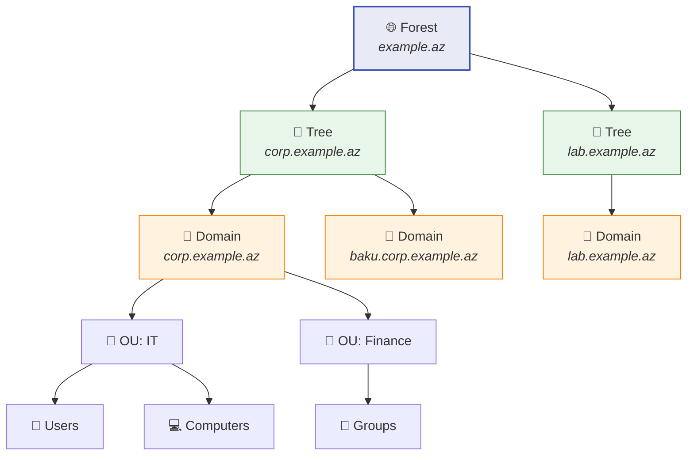
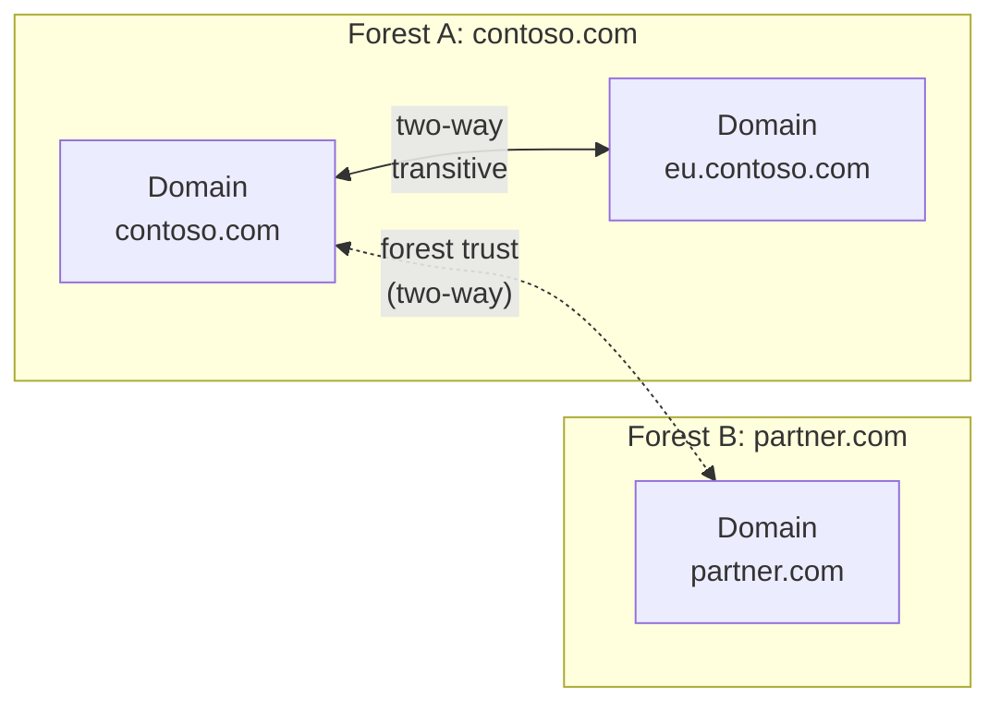

# Active Directory Domain Services (AD DS)

Active Directory Domain Services (AD DS) is Microsoft's directory service for centralized identity and resource management in Windows Server environments.

Its core jobs include:

- authentication
- authorization
- centralized user and computer management
- Group Policy delivery
- directory replication across domain controllers

## Core building blocks

AD DS combines logical and physical components.

| Type | Component | What it does |
| --- | --- | --- |
| Physical | Domain Controller (DC) | Stores directory data and handles authentication |
| Physical | Site | Maps AD behavior to physical network topology and subnets |
| Logical | Forest | Top-level AD boundary containing one or more domains |
| Logical | Tree | Domains that share a contiguous namespace |
| Logical | Domain | Administrative and replication partition within the forest |
| Logical | OU | Container used to organize objects and apply delegation or policy |

## Logical hierarchy



This hierarchy is logical. It is separate from the physical placement of domain controllers and sites.

## Forest

A forest is the top-level AD DS container. Microsoft describes a forest as a collection of one or more domains that share:

- a common schema
- a common configuration partition
- a common global catalog
- automatic two-way transitive trusts between domains in the same forest

In practice, many organizations should prefer a single forest unless they have a strong reason to separate them.

Typical reasons for multiple forests:

- hard administrative separation
- mergers or inherited environments
- distinct security or compliance boundaries
- incompatible design requirements between environments

> Based on Microsoft guidance, the forest, not the domain, is the real security boundary in Active Directory design.

## Domain

A domain is both a naming boundary and a replication boundary inside a forest. It stores users, groups, computers, and other directory objects.

Domains help with:

- identity management
- delegated administration
- replication scoping
- policy structure

Important nuance:

- a domain is useful for administration and replication
- a forest is still the stronger security boundary

## Tree

A tree is a set of domains that share a contiguous DNS namespace.

Example:

```text
corp.example.az
  -> baku.corp.example.az
  -> ganja.corp.example.az
```

Trees matter less in day-to-day administration than forests and domains, but they help explain namespace design.

## Organizational Units (OUs)

An OU is a container inside a domain. It is commonly used for:

- grouping users or computers
- applying Group Policy
- delegating admin rights to a subset of objects

Good OU design usually follows administrative need, not org-chart aesthetics alone.

## Domain Controllers

A domain controller stores the AD DS database and participates in authentication and replication.

Key responsibilities:

- process user and computer logons
- replicate directory changes
- host directory partitions
- often provide DNS in Windows environments

Practical guidance:

- run at least two DCs per important domain
- avoid treating a single DC as acceptable production design
- protect DCs as tier-0 or equivalent infrastructure

## Global Catalog

A global catalog (GC) is a domain controller role that stores:

- a full writable replica of its own domain
- a partial replica of every other domain in the forest

This helps users and services search across the forest without knowing which domain owns the object.

The global catalog is especially important in:

- cross-domain object lookups
- logon behavior involving universal groups
- forest-wide directory searches

## Sites

A site represents physical network topology, usually based on IP subnets.

Sites help AD DS decide:

- which DC is closest to a client
- how replication traffic should flow
- how to reduce WAN-heavy replication behavior

This is why the logical AD model and the physical deployment model should be planned separately.

## Trusts

Trusts allow identities in one domain or forest to be recognized in another.



Common trust ideas:

| Trust type | Meaning |
| --- | --- |
| Transitive | Trust can extend through the relationship chain |
| Non-transitive | Trust is limited to the directly connected pair |
| One-way | One side trusts the other |
| Two-way | Both sides trust each other |

Within a single forest, domains are automatically linked by two-way transitive trusts.

## Replication

Any directory change made on one domain controller is replicated to the other domain controllers in that domain.

Replication design matters because it affects:

- recovery behavior
- convergence time after changes
- WAN bandwidth usage
- overall directory health

Replication issues are often one of the fastest ways for an AD environment to become unstable.

## Hybrid identity note

Many environments integrate on-premises AD DS with Microsoft Entra ID.

That usually means:

- users originate or are managed on-premises
- identities synchronize to cloud services
- sign-in, policy, and access design span both worlds

This is not the same thing as saying Entra ID is just "cloud AD." The products overlap in identity strategy, but they are not identical services.

## Basic installation example

For a new forest, Microsoft documents the simplest PowerShell starting point as:

```powershell
Install-WindowsFeature AD-Domain-Services -IncludeManagementTools
Install-ADDSForest -DomainName "corp.example.az"
```

After installation, validate the resulting environment rather than assuming promotion alone means the design is healthy.

## Practical design rules

- default to one forest unless you can defend multiple forests
- use domains for structure and replication, not as your main security story
- design OUs around policy and delegation
- plan sites from real subnet and WAN layout
- treat domain controllers as critical security infrastructure
- verify replication and backup posture before calling the environment healthy

## Useful links

- AD DS overview: [https://learn.microsoft.com/en-us/windows-server/identity/ad-ds/get-started/virtual-dc/active-directory-domain-services-overview](https://learn.microsoft.com/en-us/windows-server/identity/ad-ds/get-started/virtual-dc/active-directory-domain-services-overview)
- Logical model: [https://learn.microsoft.com/en-us/windows-server/identity/ad-ds/plan/understanding-the-active-directory-logical-model](https://learn.microsoft.com/en-us/windows-server/identity/ad-ds/plan/understanding-the-active-directory-logical-model)
- Install AD DS: [https://learn.microsoft.com/en-us/windows-server/identity/ad-ds/deploy/install-active-directory-domain-services--level-100-](https://learn.microsoft.com/en-us/windows-server/identity/ad-ds/deploy/install-active-directory-domain-services--level-100-)
- Functional levels: [https://learn.microsoft.com/en-us/windows-server/identity/ad-ds/plan/raise-domain-forest-functional-levels](https://learn.microsoft.com/en-us/windows-server/identity/ad-ds/plan/raise-domain-forest-functional-levels)
