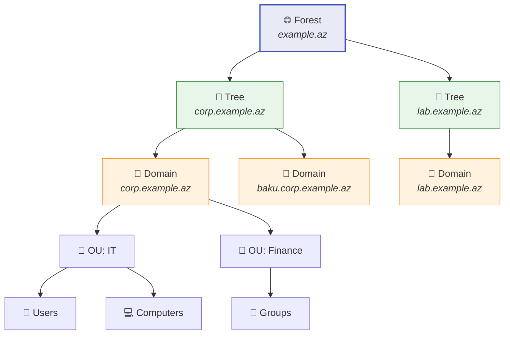
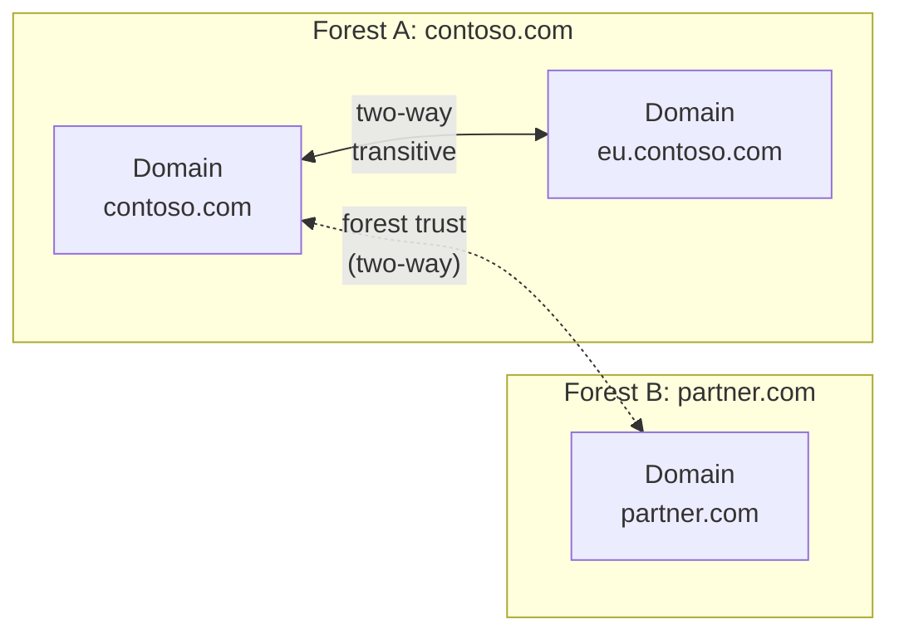

# Active Directory Domain Services (AD DS)

Active Directory Domain Services (AD DS) is Microsoft's directory service for centralized identity and resource management in Windows Server environments.

Its core jobs include:

- authentication
- authorization
- centralized user and computer management
- Group Policy delivery
- directory replication across domain controllers

## Core building blocks

AD DS combines logical and physical components.

| Type | Component | What it does |
| --- | --- | --- |
| Physical | Domain Controller (DC) | Stores directory data and handles authentication |
| Physical | Site | Maps AD behavior to physical network topology and subnets |
| Logical | Forest | Top-level AD boundary containing one or more domains |
| Logical | Tree | Domains that share a contiguous namespace |
| Logical | Domain | Administrative and replication partition within the forest |
| Logical | OU | Container used to organize objects and apply delegation or policy |

## Terminology, identifiers, and core objects

Before going deeper into hierarchy and replication, it is worth pinning down the vocabulary AD uses for things stored in the directory. Most attacks and most misconfigurations come back to one of these terms.

### Object

An object is a single element in the directory: a user, group, computer, printer, application, or any other thing AD knows about. Microsoft groups objects into two broad roles:

- resources, such as printers or shared folders
- security principals, such as users, computers, or groups

Everything else (attributes, permissions, policy targeting) is built on top of the object concept.

### Attribute

Each object carries a fixed set of attributes that describe it. A user has attributes like `displayName`, `givenName`, `sAMAccountName`, `mail`, `pwdLastSet`, and `memberOf`. A computer has attributes like its hostname, DNS name, and `operatingSystem`.

Each AD attribute also has an LDAP name that tools use when running directory queries. Knowing those LDAP names is what makes [LDAP enumeration](../../red-teaming/network-attacks.md) effective from any authenticated account.

### Schema

The schema is the blueprint of the directory. It defines:

- which classes of object can exist (user, computer, group, printer, and so on)
- which attributes each class must have or may have
- which attribute values are mandatory versus optional

Creating a real object from a class is called instantiation, and the resulting object is an instance of that class. Schema changes are forest-wide and effectively irreversible, so extending the schema is treated as a sensitive change controlled by Schema Admins and FSMO roles (see [FSMO roles](./fsmo.md)).

### GUID

A GUID (Globally Unique Identifier) is a 128-bit value assigned to every object in AD when it is created and stored in the `objectGUID` attribute. Key properties:

- unique across the entire forest (and effectively across the world)
- assigned to every object, not only security principals
- never changes, even if the object is renamed or moved between OUs

Searching by GUID is the most reliable way to identify a specific object during enumeration or recovery.

### SID

A SID (Security Identifier) is the unique identifier for a security principal. Important behaviour:

- issued by the domain controller for each user, computer, or group
- never reused, even after the principal is deleted
- placed into the access token at logon, along with the SIDs of every group the principal belongs to
- compared against ACLs whenever the principal touches a securable object

Some SIDs are well-known and identical on every Windows system (for example the `Everyone` group). For deeper coverage of identity, principals, and tokens see [IAM and account management](../../general-security/iam-account-management.md).

### Security principal

A security principal is anything the operating system can authenticate: a user, a computer, or a process running under one of those accounts (for example a service running as a domain account). Only security principals get a SID and can appear in ACLs.

Local accounts on a workstation are also security principals, but they are managed by the local Security Accounts Manager (SAM) and not by AD. That distinction is what motivates controls like [LAPS for local administrator passwords](./laps.md).

### Distinguished Name (DN)

A Distinguished Name is the full path to an object inside the directory. It is read right-to-left, from the domain root down to the object.

```text
CN=john.doe,OU=IT,OU=Employees,DC=example,DC=local
```

Component meanings:

| Part | Stands for | Example |
| --- | --- | --- |
| `CN` | Common Name | `CN=john.doe` |
| `OU` | Organizational Unit | `OU=IT` |
| `DC` | Domain Component | `DC=example,DC=local` |

The leftmost component is also called the RDN (Relative Distinguished Name) and must be unique inside its parent container. Tools, scripts, and Group Policy targeting all rely on DN format.

### SPN (Service Principal Name)

An SPN uniquely identifies a service instance running under a specific account. Kerberos uses the SPN to know which account's secret key it should encrypt the service ticket for, so the client never has to know the underlying account name.

Common SPN format examples:

```text
HTTP/web01.example.local
MSSQLSvc/sql01.example.local:1433
CIFS/fileserver.example.local
LDAP/dc01.example.local
```

If an SPN is registered against a regular user account (typical for service accounts), an attacker with any authenticated session can request a service ticket for it and try to crack the resulting hash offline. That technique is Kerberoasting, covered in [initial access](../../red-teaming/initial-access.md), and it is one reason `ms-DS-MachineAccountQuota` and service-account hardening matter.

### ACL and ACE

Every securable AD object carries an Access Control List (ACL). The ACL is an ordered collection of Access Control Entries (ACEs). Each ACE names a trustee (a SID for a user, group, or logon session) and lists what is allowed, denied, or audited.

Permissions on AD objects are inheritable: an ACE applied to an OU can flow down to child OUs and the objects inside them, unless inheritance is broken explicitly. Common abusable rights include `GenericAll`, `WriteDACL`, `WriteOwner`, and `ForceChangePassword` on user or group objects, which is why ACL review is part of any AD hardening pass. See also [PKI and certificate trust](../../general-security/cryptography/pki.md) and [non-repudiation in AAA](../../general-security/aaa-non-repudiation.md).

### NTDS.DIT

`NTDS.dit` is the Active Directory database file. It is stored on every domain controller, by default at:

```text
C:\Windows\NTDS\ntds.dit
```

It contains every naming context that DC hosts: configuration, schema, and the domain partition (plus partial replicas if the DC is also a Global Catalog). Crucially, it also contains the password hashes of every domain account.

Anyone who walks away with an offline copy of `NTDS.dit` (plus the SYSTEM hive for the boot key) can extract every credential in the domain. That is why:

- domain controllers are treated as tier-0 assets
- backups of NTDS.dit must be protected as if they were the domain itself
- Volume Shadow Copy and "ntdsutil ifm" output need the same controls as a live DC

### Object types in practice

The most common object classes you will work with day-to-day:

- **Users** — leaf object, security principal, has both SID and GUID. Carries hundreds of possible attributes (name, manager, last logon, password metadata, group membership). Primary identity for human and service accounts.
- **Computers** — leaf object, security principal with SID and GUID. Represents a domain-joined workstation or server. Local SYSTEM on a domain-joined machine effectively holds that computer's domain credentials.
- **Groups** — container object that can hold users, computers, and other groups; security principal with SID and GUID. Two flavours by purpose: security groups (used in ACLs) and distribution groups (mail-only, no security use). Three scopes by reach: domain-local, global, and universal — universal groups are stored in the Global Catalog and are how cross-domain membership works.
- **Shared Folders** — published in AD as a pointer to a UNC path. Has a GUID but no SID, so it is not a security principal. Access control lives on the file system, not on the directory object.
- **Organizational Units (OUs)** — containers used as the unit for delegated administration and Group Policy targeting. Granting rights on an OU (for example "reset password") flows to every user underneath it. Group Policy [linked to an OU](./group-policy.md) applies to objects in that subtree.

This vocabulary is what the rest of the lesson builds on.

## Logical hierarchy



This hierarchy is logical. It is separate from the physical placement of domain controllers and sites.

## Forest

A forest is the top-level AD DS container. Microsoft describes a forest as a collection of one or more domains that share:

- a common schema
- a common configuration partition
- a common global catalog
- automatic two-way transitive trusts between domains in the same forest

In practice, many organizations should prefer a single forest unless they have a strong reason to separate them.

Typical reasons for multiple forests:

- hard administrative separation
- mergers or inherited environments
- distinct security or compliance boundaries
- incompatible design requirements between environments

> Based on Microsoft guidance, the forest, not the domain, is the real security boundary in Active Directory design.

## Domain

A domain is both a naming boundary and a replication boundary inside a forest. It stores users, groups, computers, and other directory objects.

Domains help with:

- identity management
- delegated administration
- replication scoping
- policy structure

Important nuance:

- a domain is useful for administration and replication
- a forest is still the stronger security boundary

## Tree

A tree is a set of domains that share a contiguous DNS namespace.

Example:

```text
corp.example.az
  -> baku.corp.example.az
  -> ganja.corp.example.az
```

Trees matter less in day-to-day administration than forests and domains, but they help explain namespace design.

## Organizational Units (OUs)

An OU is a container inside a domain. It is commonly used for:

- grouping users or computers
- applying Group Policy
- delegating admin rights to a subset of objects

Good OU design usually follows administrative need, not org-chart aesthetics alone.

## Domain Controllers

A domain controller stores the AD DS database and participates in authentication and replication.

Key responsibilities:

- process user and computer logons
- replicate directory changes
- host directory partitions
- often provide DNS in Windows environments

Practical guidance:

- run at least two DCs per important domain
- avoid treating a single DC as acceptable production design
- protect DCs as tier-0 or equivalent infrastructure

## Global Catalog

A global catalog (GC) is a domain controller role that stores:

- a full writable replica of its own domain
- a partial replica of every other domain in the forest

This helps users and services search across the forest without knowing which domain owns the object.

The global catalog is especially important in:

- cross-domain object lookups
- logon behavior involving universal groups
- forest-wide directory searches

## Sites

A site represents physical network topology, usually based on IP subnets.

Sites help AD DS decide:

- which DC is closest to a client
- how replication traffic should flow
- how to reduce WAN-heavy replication behavior

This is why the logical AD model and the physical deployment model should be planned separately.

## Trusts

Trusts allow identities in one domain or forest to be recognized in another.



Common trust ideas:

| Trust type | Meaning |
| --- | --- |
| Transitive | Trust can extend through the relationship chain |
| Non-transitive | Trust is limited to the directly connected pair |
| One-way | One side trusts the other |
| Two-way | Both sides trust each other |

Within a single forest, domains are automatically linked by two-way transitive trusts.

## Replication

Any directory change made on one domain controller is replicated to the other domain controllers in that domain.

Replication design matters because it affects:

- recovery behavior
- convergence time after changes
- WAN bandwidth usage
- overall directory health

Replication issues are often one of the fastest ways for an AD environment to become unstable.

## Hybrid identity note

Many environments integrate on-premises AD DS with Microsoft Entra ID.

That usually means:

- users originate or are managed on-premises
- identities synchronize to cloud services
- sign-in, policy, and access design span both worlds

This is not the same thing as saying Entra ID is just "cloud AD." The products overlap in identity strategy, but they are not identical services.

## Basic installation example

For a new forest, Microsoft documents the simplest PowerShell starting point as:

```powershell
Install-WindowsFeature AD-Domain-Services -IncludeManagementTools
Install-ADDSForest -DomainName "corp.example.az"
```

After installation, validate the resulting environment rather than assuming promotion alone means the design is healthy.

## Practical design rules

- default to one forest unless you can defend multiple forests
- use domains for structure and replication, not as your main security story
- design OUs around policy and delegation
- plan sites from real subnet and WAN layout
- treat domain controllers as critical security infrastructure
- verify replication and backup posture before calling the environment healthy

## Useful links

- AD DS overview: [https://learn.microsoft.com/en-us/windows-server/identity/ad-ds/get-started/virtual-dc/active-directory-domain-services-overview](https://learn.microsoft.com/en-us/windows-server/identity/ad-ds/get-started/virtual-dc/active-directory-domain-services-overview)
- Logical model: [https://learn.microsoft.com/en-us/windows-server/identity/ad-ds/plan/understanding-the-active-directory-logical-model](https://learn.microsoft.com/en-us/windows-server/identity/ad-ds/plan/understanding-the-active-directory-logical-model)
- Install AD DS: [https://learn.microsoft.com/en-us/windows-server/identity/ad-ds/deploy/install-active-directory-domain-services--level-100-](https://learn.microsoft.com/en-us/windows-server/identity/ad-ds/deploy/install-active-directory-domain-services--level-100-)
- Functional levels: [https://learn.microsoft.com/en-us/windows-server/identity/ad-ds/plan/raise-domain-forest-functional-levels](https://learn.microsoft.com/en-us/windows-server/identity/ad-ds/plan/raise-domain-forest-functional-levels)
