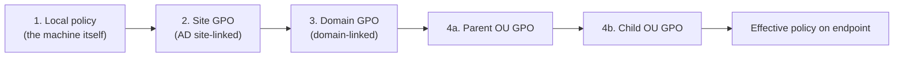
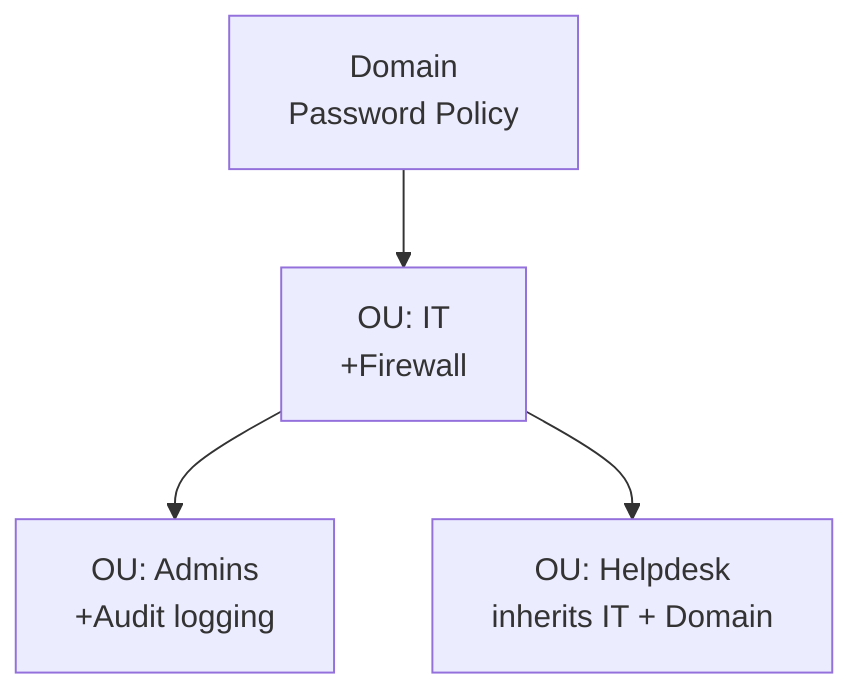

# Group Policy (GPO)

**Group Policy** is the main Windows domain mechanism for pushing settings to users and computers — you write the rule once on a domain controller, it replicates out, and every joined machine pulls it. Without GPO, configuring 200 workstations means walking to 200 workstations; with GPO it is one click.

A single **Group Policy Object (GPO)** has two halves that live in two places:

| Part | Stored in | Purpose |
|---|---|---|
| Group Policy Container (GPC) | Active Directory | Metadata — the GPO object, links, permissions |
| Group Policy Template (GPT) | SYSVOL share | Files — registry.pol, scripts, templates |

Because of that split, "GPO health" depends on **both** AD replication *and* SYSVOL replication being healthy. The GPO can exist in AD and still fail on a client because SYSVOL didn't replicate.

Physical path:

```
\\dc01.example.local\SYSVOL\example.local\Policies\{GUID}\
    ├── Machine\         ← Computer Configuration
    │   └── Registry.pol
    ├── User\            ← User Configuration
    │   └── Registry.pol
    └── GPT.INI          ← version number
```

Every GPO gets its own GUID directory. `{31B2F340-016D-11D2-945F-00C04FB984F9}` is always the Default Domain Policy.

## Computer vs User configuration

Every GPO has two halves that apply at different moments:

| | Computer Configuration | User Configuration |
|---|---|---|
| When does it apply? | At **boot** | At **logon** |
| Who does it apply to? | The machine, regardless of who logs in | The user, regardless of which machine they log in on |
| Typical settings | Firewall, Windows Update, audit policy | Desktop wallpaper, drive maps, Start menu |

So if the rule is "this laptop must block USB", use Computer Configuration. If the rule is "wherever Aynur logs in, her wallpaper is the corporate one", use User Configuration.

## LSDOU — the processing order

GPOs apply in a fixed order. Later-applied wins on conflict:



- **L — Local** (the machine's own policy store)
- **S — Site** (AD site-linked)
- **D — Domain** (domain-linked)
- **OU** — walked from parent down to child

> Later wins. If Domain allows USB but the OU denies USB, the OU rule wins — it applied last.

### Worked example

```
example.local (domain)
│   └── GPO: Default Domain Policy (min password = 6 chars)
│
├── Teachers (OU)
│   └── GPO: Teacher policy (USB allowed, wallpaper A)
│
└── Students (OU)
    └── GPO: Student policy (USB blocked, wallpaper B)
    │
    └── Year 1 (child OU)
        └── GPO: Year1 policy (wallpaper C)
```

A user in **Year 1** ends up with:

- Password min = 6 chars (from Domain)
- USB blocked (from Students OU)
- Wallpaper C (from Year 1, overriding wallpaper B)

## When GPOs refresh

- **Computer policy** — at boot, then every **90 minutes ± 30 minutes** randomised.
- **User policy** — at logon, same 90 min refresh afterwards.
- **Domain Controllers** — every **5 minutes**.

Force a refresh now:

```powershell
gpupdate /force
```

Some changes (software installation, folder redirection) need a full logoff/reboot — `/force` alone won't trigger them.

## GPO ≠ GPO link

These are different things, and mixing them up is the number-one confusion in GPO:

- **Creating** a GPO puts the policy object into the **Group Policy Objects** container.
- **Linking** it attaches the GPO to a site / domain / OU, which is what actually makes it *apply*.

A GPO with no link applies to nobody. And the same GPO can be linked to **several** OUs — you write the rule once and attach it wherever it should live.

## Group Policy Management Console (GPMC)

Open with **Server Manager → Tools → Group Policy Management** or `gpmc.msc`.

The tree:

```
Group Policy Management
└── Forest: example.local
    ├── Domains
    │   └── example.local
    │       ├── Default Domain Policy
    │       ├── Default Domain Controllers Policy
    │       ├── Domain Controllers (OU)
    │       ├── Students (OU)              ← your OUs
    │       ├── Teachers (OU)
    │       ├── IT (OU)
    │       └── Group Policy Objects       ← where all GPOs live
    ├── Sites
    └── Group Policy Modeling
```

### The two default GPOs

AD creates two GPOs automatically:

| | Default Domain Policy | Default Domain Controllers Policy |
|---|---|---|
| Linked to | Domain root | Domain Controllers OU |
| Contains | Password, lockout, Kerberos policy | Audit policy, user rights on DCs |
| Safe to edit? | Only for password/lockout. Create a new GPO for anything else. | With care — DC-specific settings only. |

Rule of thumb: **don't pile random settings into the defaults.** If the defaults are broken, restoring them is painful. Create a new, purpose-built GPO instead.

## Creating and linking

### Create + link in one shot (GUI)

1. GPMC → right-click the target **OU**.
2. **Create a GPO in this domain, and Link it here…**
3. Give it a name (e.g. `USR-Student-Desktop`) → OK.

### Link an existing GPO elsewhere

Right-click another OU → **Link an Existing GPO…** → pick from the list.

### Disable a link without deleting it

Right-click the link in the OU → untick **Link Enabled**.

### PowerShell

```powershell
New-GPO     -Name   "USR-Student-Desktop" -Comment "Desktop restrictions for students"
New-GPLink  -Name   "USR-Student-Desktop" -Target "OU=Students,OU=Example-Users,DC=example,DC=local"

# Link same GPO to another OU
New-GPLink  -Name   "USR-Student-Desktop" -Target "OU=Lab,OU=Example-Computers,DC=example,DC=local"

# Disable a link
Set-GPLink  -Name   "USR-Student-Desktop" -Target "OU=Students,OU=Example-Users,DC=example,DC=local" -LinkEnabled No

# Delete the GPO entirely
Remove-GPO  -Name   "USR-Student-Desktop" -Confirm:$false
```

### Editing

Right-click a GPO → **Edit…** opens the **Group Policy Management Editor**. The tree inside:

```
Computer Configuration / User Configuration
  ├── Policies
  │   ├── Software Settings
  │   ├── Windows Settings
  │   └── Administrative Templates
  └── Preferences
```

## Policies vs Preferences

This is the other frequent stumble.

| | **Policies** | **Preferences** |
|---|---|---|
| Enforcement | Mandatory — user can't change | Suggested — user may override |
| Removal | GPO removed → setting reverts | GPO removed → setting **stays** ("tattooing") |
| Registry path | `HKLM\Software\Policies\*` / `HKCU\Software\Policies\*` | Normal registry paths |
| Flexibility | Simple on/off | Item-level targeting, create/replace/update/delete modes |
| Typical examples | Password policy, USB block, Control Panel off | Drive maps, printers, shortcuts, registry pokes |

### When to use which

| Scenario | Policy or Preference? |
|---|---|
| Block USB | Policy |
| Set desktop wallpaper | Policy |
| Map a network drive | Preference |
| Put a shortcut on the desktop | Preference |
| Add a printer | Preference |
| Poke a registry value | Preference |
| Disable Control Panel | Policy |
| Configure Windows Update | Policy |

## Common templates to know

### Password policy

Password and lockout policy is effective **at the domain level only** — linking it to an OU does nothing. For per-group rules use **Fine-Grained Password Policies (FGPP)**.

**GPMC** → **Default Domain Policy** → Edit → **Computer Configuration → Policies → Windows Settings → Security Settings → Account Policies → Password Policy**.

| Setting | Recommended |
|---|---|
| Enforce password history | 5 |
| Maximum password age | 90 days |
| Minimum password age | 1 day |
| Minimum password length | 8 characters |
| Password must meet complexity | Enabled |

**Account Lockout Policy** sits next to it:

| Setting | Recommended |
|---|---|
| Account lockout threshold | 5 |
| Account lockout duration | 30 min |
| Reset counter after | 30 min |

```powershell
# See what is currently in force
Get-ADDefaultDomainPasswordPolicy

# Unlock an account that tripped the threshold
Search-ADAccount -LockedOut
Unlock-ADAccount -Identity "e.mammadov"
```

### Desktop wallpaper (Policy, User Configuration)

Put the image on a share everyone can read: `\\DC01\GPO-Resources\wallpaper.jpg`.

**User Configuration → Policies → Administrative Templates → Desktop → Desktop → Desktop Wallpaper** → Enabled, fill in path and style (Fill/Fit/Stretch/Center/Tile).

### Block USB storage (Policy, Computer Configuration)

**Computer Configuration → Policies → Administrative Templates → System → Removable Storage Access**:

- **All Removable Storage classes: Deny all access** → Enabled.

Or be more surgical with just **Removable Disks: Deny read access / Deny write access**.

To let IT admins keep USB while blocking everyone else, combine this with **Security Filtering** (below).

### Lock down the user shell (Policy, User Configuration)

- **Prohibit access to Control Panel and PC settings** — Enabled.
- **System → Prevent access to the command prompt** — Enabled, and set the script-blocking sub-option.
- **System → Prevent access to registry editing tools** — Enabled.
- **System → Don't run specified Windows applications** — Enabled, list the exe names.
- **System → Run only specified Windows applications** — the nuclear option; only listed apps can run. Use carefully.

### Drive mapping (Preference, User Configuration)

**User Configuration → Preferences → Windows Settings → Drive Maps** → **New → Mapped Drive**:

- Action: **Create** (or Replace / Update / Delete)
- Location: `\\DC01\SharedData`
- Reconnect: on
- Label: `Shared`
- Drive Letter: `S:`

### Printer deployment (Preference, User Configuration)

**User Configuration → Preferences → Control Panel Settings → Printers → New → Shared Printer**:

- Share Path: `\\DC01\HP-LaserJet`
- Action: Create
- Optionally: set as default printer

### Desktop shortcut (Preference, User Configuration)

**User Configuration → Preferences → Windows Settings → Shortcuts → New → Shortcut**:

- Name: `Example Portal`
- Target Type: URL
- Location: Desktop
- Target URL: `http://portal.example.local`

### Logon banner (Policy, Computer Configuration)

**Computer Configuration → Policies → Windows Settings → Security Settings → Local Policies → Security Options**:

- **Interactive logon: Message title for users attempting to log on** — company / academy name.
- **Interactive logon: Message text…** — e.g. "This system is for authorised use only. Activity may be monitored."

User must click OK before logon continues — which also matters for legal notice in many jurisdictions.

### WSUS client (Policy, Computer Configuration)

**Computer Configuration → Policies → Administrative Templates → Windows Components → Windows Update → Manage updates offered from Windows Server Update Services**:

- **Specify intranet Microsoft update service location** — both URLs `http://DC01:8530`.
- **Configure Automatic Updates** → Enabled → option 4 (auto download, scheduled install) → day / time.

### Audit policy (Policy, Computer Configuration)

**Computer Configuration → Policies → Windows Settings → Security Settings → Advanced Audit Policy Configuration → Audit Policies**:

- **Account Logon → Audit Credential Validation** → Success, Failure
- **Logon/Logoff → Audit Logon** → Success, Failure
- **Object Access → Audit File System** → Success, Failure
- **Account Management → Audit User Account Management** → Success, Failure

Events land in **Event Viewer → Windows Logs → Security**.

## Security filtering

Default target of any GPO is **Authenticated Users** — effectively everyone. To scope it down:

1. Select the GPO in GPMC.
2. **Security Filtering** pane → **Remove** Authenticated Users.
3. **Add** → pick a group (e.g. `GRP-Students`, `GRP-Teachers`).

> **Do not forget**: after removing Authenticated Users, the GPO's **Delegation** tab must still grant **Domain Computers** **Read** permission — otherwise Computer Configuration silently stops applying. Add it via **Delegation → Advanced → Add → Domain Computers → Read: Allow** (do *not* tick *Apply group policy*).

## WMI filtering

WMI filters run a query on the client; the GPO only applies if the query returns something.

Create one at **GPMC → WMI Filters → New**. Useful queries:

```sql
-- Windows 11 workstations only
SELECT * FROM Win32_OperatingSystem
WHERE Version LIKE "10.0.2%" AND ProductType = "1"

-- Laptops only (have a battery)
SELECT * FROM Win32_Battery
WHERE BatteryStatus IS NOT NULL

-- Machines with at least 8 GB RAM
SELECT * FROM Win32_ComputerSystem
WHERE TotalPhysicalMemory >= 8589934592

-- Servers only
SELECT * FROM Win32_OperatingSystem
WHERE ProductType = "2" OR ProductType = "3"
```

Attach by selecting the GPO → **WMI Filtering** pane → pick the filter.

WMI filters are cheap but not free — a badly written query evaluated fleet-wide will slow logon. Prefer Security Filtering when a group will do.

## Inheritance, Block, Enforced



By default higher-level GPOs flow down. Two overrides exist:

- **Block Inheritance** on an OU → it stops accepting inherited GPOs from above.
- **Enforced** on a GPO link → that GPO *keeps* applying even past a Block Inheritance.

So the precedence, strongest to weakest:

1. **Enforced GPO** at higher level (domain)
2. **Enforced GPO** at OU
3. **OU GPO** (child > parent)
4. **Domain GPO**
5. **Site GPO**
6. **Local policy**

Watch out: Block Inheritance also blocks things you probably want, like the domain password policy. Reach for Enforced + Block only when the OU model cannot solve it cleanly.

## Loopback processing

Normal model: Computer policy comes from the computer's OU, User policy from the user's OU. Loopback flips that so User Configuration from the **computer's** OU wins — useful for shared machines (labs, kiosks) where *anyone* who logs in should get the same restrictions.

**Computer Configuration → Policies → Administrative Templates → System → Group Policy → Configure user Group Policy loopback processing mode** → Enabled.

- **Replace** — the user's normal User Configuration is ignored; only the computer OU's User Configuration applies.
- **Merge** — both apply; on conflict the computer OU wins.

## Troubleshooting

### `gpresult` — what actually applied

```powershell
# For the logged-on user/computer
gpresult /r

# Full HTML report
gpresult /h C:\GPO-Report.html

# Someone else
gpresult /user EXAMPLE\e.mammadov /r

# Just one scope
gpresult /scope computer /r
gpresult /scope user /r
```

Read the output for the **Applied Group Policy Objects** list (what ran) and the **GPOs not applied** list (what was filtered out):

```
The following GPOs were not applied because they were filtered out:
    Teacher policy
        Filtering: Not Applied (Security)
```

- **Not Applied (Security)** — Security Filtering excluded this user/computer.
- **Not Applied (Empty)** — the GPO has no configured settings.

### Force a refresh

```powershell
gpupdate /force                            # both scopes
gpupdate /target:computer /force           # just computer
gpupdate /target:user /force               # just user
```

### Resultant Set of Policy (RSoP)

```powershell
rsop.msc
```

Gives a merged view of every policy currently in effect, with **Winning GPO** next to each setting.

### Event logs

```
Event Viewer → Applications and Services Logs → Microsoft → Windows → GroupPolicy → Operational
```

```powershell
Get-WinEvent -LogName "Microsoft-Windows-GroupPolicy/Operational" -MaxEvents 50 |
    Select-Object TimeCreated, Id, Message |
    Format-Table -AutoSize
```

### Common failures

| Symptom | Check |
|---|---|
| GPO not applying at all | Correct OU? Link enabled? `gpresult` "filtered out"? Ran `gpupdate /force`? |
| User Configuration not applying | Is the *user* in the right OU (not the computer)? Is User Configuration enabled on the GPO? |
| Computer Configuration not applying | Is the *computer* in the right OU? After removing Authenticated Users, did you grant Domain Computers **Read**? Have you rebooted? |
| Conflicting GPOs | HTML report of `gpresult`; "Winning GPO" next to each setting tells you who won. |
| SYSVOL-related weirdness | `dcdiag /test:sysvolcheck`, `dcdiag /test:netlogons`, `net share | findstr SYSVOL` |

## Backup and restore

### Backup

```powershell
New-Item -Path "C:\GPO-Backup" -ItemType Directory -Force

# One GPO
Backup-GPO -Name "USR-Student-Desktop" -Path "C:\GPO-Backup"

# All of them
Backup-GPO -All -Path "C:\GPO-Backup"
```

GUI: GPMC → **Group Policy Objects** → right-click a GPO → **Back Up…** (or **Back Up All…** on the container).

### Restore

```powershell
Restore-GPO -Name "USR-Student-Desktop" -Path "C:\GPO-Backup"
Restore-GPO -All -Path "C:\GPO-Backup"
```

GUI: right-click the GPO → **Restore from Backup…**.

### Cross-domain moves

Backup/restore stays within one domain. To move a GPO to a different domain, **Group Policy Objects** → right-click → **Import Settings…** and point at the backup folder. If the GPO references domain-specific values (UNC paths, SIDs), you may need a **Migration Table** to rewrite them.

## Full lab scenario

Step-by-step build of a realistic environment.

### 1. OU structure

```powershell
New-ADOrganizationalUnit -Name "Example-Users"     -Path "DC=example,DC=local"
New-ADOrganizationalUnit -Name "Example-Computers" -Path "DC=example,DC=local"

# Users
New-ADOrganizationalUnit -Name "Teachers"  -Path "OU=Example-Users,DC=example,DC=local"
New-ADOrganizationalUnit -Name "Students"  -Path "OU=Example-Users,DC=example,DC=local"
New-ADOrganizationalUnit -Name "IT"        -Path "OU=Example-Users,DC=example,DC=local"

# Computers
New-ADOrganizationalUnit -Name "Lab"       -Path "OU=Example-Computers,DC=example,DC=local"
New-ADOrganizationalUnit -Name "Office"    -Path "OU=Example-Computers,DC=example,DC=local"
```

### 2. Test users

```powershell
New-ADUser -Name "Elvin Mammadov" -SamAccountName "e.mammadov" `
           -UserPrincipalName "e.mammadov@example.local" `
           -Path "OU=Students,OU=Example-Users,DC=example,DC=local" `
           -AccountPassword (ConvertTo-SecureString "Student@123" -AsPlainText -Force) `
           -Enabled $true

New-ADUser -Name "Kamran Aliyev" -SamAccountName "k.aliyev" `
           -UserPrincipalName "k.aliyev@example.local" `
           -Path "OU=Teachers,OU=Example-Users,DC=example,DC=local" `
           -AccountPassword (ConvertTo-SecureString "Teacher@123" -AsPlainText -Force) `
           -Enabled $true

New-ADUser -Name "Rashad Huseynov" -SamAccountName "r.huseynov" `
           -UserPrincipalName "r.huseynov@example.local" `
           -Path "OU=IT,OU=Example-Users,DC=example,DC=local" `
           -AccountPassword (ConvertTo-SecureString "ITAdmin@123" -AsPlainText -Force) `
           -Enabled $true
```

### 3. Security groups

```powershell
New-ADGroup -Name "GRP-Students"  -GroupScope Global -GroupCategory Security `
            -Path "OU=Students,OU=Example-Users,DC=example,DC=local"
New-ADGroup -Name "GRP-Teachers"  -GroupScope Global -GroupCategory Security `
            -Path "OU=Teachers,OU=Example-Users,DC=example,DC=local"
New-ADGroup -Name "GRP-IT-Admins" -GroupScope Global -GroupCategory Security `
            -Path "OU=IT,OU=Example-Users,DC=example,DC=local"

Add-ADGroupMember -Identity "GRP-Students"  -Members "e.mammadov"
Add-ADGroupMember -Identity "GRP-Teachers"  -Members "k.aliyev"
Add-ADGroupMember -Identity "GRP-IT-Admins" -Members "r.huseynov"
```

### 4. Shared resources

```powershell
New-Item     -Path "C:\GPO-Resources" -ItemType Directory -Force
New-SmbShare -Name "GPO-Resources" -Path "C:\GPO-Resources" -ReadAccess "EXAMPLE\Domain Users"

New-Item     -Path "C:\SharedData\Common"    -ItemType Directory -Force
New-Item     -Path "C:\SharedData\Teachers"  -ItemType Directory -Force
New-SmbShare -Name "SharedData" -Path "C:\SharedData" -ReadAccess "EXAMPLE\Domain Users"
```

### 5. GPOs

**Password policy** — edit the Default Domain Policy as listed above.

**USR-Student-Desktop** (linked to Students OU):

- Desktop wallpaper → `\\DC01\GPO-Resources\wallpaper.jpg`
- Prohibit access to Control Panel
- Prevent access to command prompt
- Prevent access to registry editing tools

**CMP-USB-Block** (linked to Example-Computers OU):

- All Removable Storage classes: Deny all access — Enabled
- Security filtering: Remove Authenticated Users → Add `GRP-Students`
- Delegation: add `Domain Computers` with Read

**USR-Drive-Mapping** (linked to Example-Users OU):

- Preferences → Drive Maps → `\\DC01\SharedData` as `S:`, Reconnect on, Create

**CMP-Login-Banner** (linked to domain):

- Security Options → logon message title and text

### 6. Test

```powershell
gpupdate /force
gpresult /r
gpresult /h C:\GPO-Test.html
Start-Process "C:\GPO-Test.html"
```

### 7. Backup

```powershell
New-Item -Path "C:\GPO-Backup" -ItemType Directory -Force
Backup-GPO -All -Path "C:\GPO-Backup"
```

## Naming conventions and best practices

Give GPOs names you can read in a list.

```
Good:                        Bad:
    SEC-Password-Policy      New Group Policy Object
    USR-Student-Desktop      GPO1
    CMP-USB-Block            Test
    CMP-WSUS-Client          Policy
    USR-Drive-Mapping-Sales  aaa
```

Prefixes that scale:

- `SEC-` — security policy
- `USR-` — user configuration
- `CMP-` — computer configuration
- `SW-` — software installation
- `PRN-` — printer policy

Other rules of thumb:

1. Don't stuff 20 settings into one GPO. Small, single-purpose GPOs are easier to disable when one thing goes wrong.
2. Test against a Test OU before pushing domain-wide.
3. Write what the GPO does in its Comment field. Future-you will be grateful.
4. Disable the unused half — if a GPO has only Computer settings, mark *User configuration disabled* on the GPO. Faster logon.
5. Schedule `Backup-GPO -All` so you have yesterday's copy when someone "just tweaks" the Default Domain Policy.
6. Keep total GPO count down. 50+ GPOs per OU path is a sign something needs consolidating.
7. If you remove Authenticated Users from Security Filtering, re-add **Domain Computers** with **Read**.
8. Avoid Block Inheritance if at all possible. Redesign the OU tree instead.
9. Enforced is for settings that **must** win — password policy, audit, security. Not for convenience.

## PowerShell cheat sheet

```powershell
# --- Create / delete / link ---
New-GPO      -Name "Name"
New-GPLink   -Name "Name" -Target "OU=X,DC=example,DC=local"
Remove-GPO   -Name "Name"
Remove-GPLink -Name "Name" -Target "OU=X,DC=example,DC=local"

# --- Inspect ---
Get-GPO -All
Get-GPO -Name "Name"
Get-GPInheritance -Target "OU=X,DC=example,DC=local"
Get-GPOReport     -Name "Name" -ReportType Html -Path "C:\report.html"

# --- Backup / restore ---
Backup-GPO  -All  -Path "C:\Backup"
Backup-GPO  -Name "Name" -Path "C:\Backup"
Restore-GPO -Name "Name" -Path "C:\Backup"

# --- Registry-based policy ---
Set-GPRegistryValue    -Name "Name" -Key "HKCU\..." -ValueName "X" -Type DWord -Value 1
Remove-GPRegistryValue -Name "Name" -Key "HKCU\..." -ValueName "X"

# --- Permissions ---
Get-GPPermission -Name "Name" -All
Set-GPPermission -Name "Name" -PermissionLevel GpoRead -TargetName "Group" -TargetType Group

# --- Client side ---
gpupdate  /force
gpresult  /r
gpresult  /h C:\report.html
rsop.msc

# --- Health ---
dcdiag /test:sysvolcheck
Get-WinEvent -LogName "Microsoft-Windows-GroupPolicy/Operational" -MaxEvents 20
```

## Practical takeaways

- A GPO is two halves — AD object + SYSVOL files. Both must replicate for it to apply.
- Creating a GPO is not linking it. No link = applies to nobody.
- Computer Configuration fires at boot, User Configuration at logon.
- LSDOU, later wins. The OU-level rule normally beats the domain-level rule.
- Password policy works domain-wide only. Use FGPP for per-group rules.
- Policies are enforced and revert when removed. Preferences tattoo and stay.
- Don't edit the default GPOs beyond password and audit. Make new, named GPOs.
- Keep each GPO focused on one thing. Disable the half you don't use.
- If you narrow Security Filtering, re-add Domain Computers with Read, or Computer Configuration silently stops.
- `gpresult /h` first, theories second.
