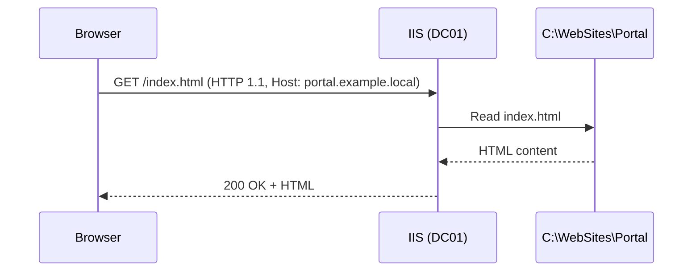

# IIS (Internet Information Services)

**IIS** is Microsoft's web server. Whatever Apache and Nginx are on Linux, IIS is on Windows. It hosts the intranet portals, internal APIs, and HTTP front-ends for a lot of Microsoft infrastructure — RD Web Access and WSUS both sit on top of IIS, so many servers already run it whether or not the admin noticed.

A typical request cycle:



What IIS is commonly used for:

| Use | Example |
| --- | --- |
| Internal portal | Company intranet |
| Web application | ASP.NET apps, APIs |
| FTP server | File upload / download |
| HTTPS hosting | Any TLS-protected site |
| Reverse proxy | Front-end for backend services (with URL Rewrite + ARR) |
| RD Web Access | The RDS web portal |
| WSUS | WSUS' own web interface |

### Core web-server vocabulary

| Term | Meaning |
| --- | --- |
| HTTP | Application-layer request protocol (TCP 80 by default) |
| HTTPS | HTTP over TLS (TCP 443) |
| URL | `http://portal.example.local/docs/readme.html` |
| Request | What the browser sends (`GET`, `POST`, headers, body) |
| Response | What the server sends back (status, headers, body) |
| Status code | 200 OK, 404 Not Found, 500 Server Error, etc. |
| Binding | IP + port + host name combination a site listens on |
| Virtual directory | A URL path that points to a folder somewhere else on disk |
| Application Pool | An isolated `w3wp.exe` process that hosts one or more sites |

## Installing the role

```powershell
Install-WindowsFeature Web-Server -IncludeManagementTools
Install-WindowsFeature Web-Asp-Net45
Install-WindowsFeature Web-Windows-Auth
Install-WindowsFeature Web-Dyn-Compression
```

GUI path: **Server Manager → Add Roles and Features → Web Server (IIS)**. Reasonable defaults plus these role services:

```
Web Server
├── Common HTTP Features
│   ├── Default Document
│   ├── Directory Browsing
│   ├── HTTP Errors
│   └── Static Content
├── Health and Diagnostics
│   ├── HTTP Logging
│   └── Request Monitor
├── Performance
│   └── Static Content Compression
├── Security
│   ├── Request Filtering
│   └── Windows Authentication   (domain auth for intranet sites)
├── Application Development
│   ├── ASP.NET 4.8
│   └── .NET Extensibility 4.8
└── Management Tools
    └── IIS Management Console
```

Verify with a browser to `http://localhost` — the IIS default page should load.

Open IIS Manager from **Server Manager → Tools → Internet Information Services (IIS) Manager**, or run `inetmgr`.

```
IIS Manager
└── DC01
    ├── Application Pools        each hosts one or more sites
    │   ├── DefaultAppPool
    │   └── .NET v4.5 Classic
    └── Sites
        └── Default Web Site     auto-created on port 80
```

## Creating a site

Keep each site in its own folder.

```powershell
New-Item -Path "C:\WebSites\Portal" -ItemType Directory -Force
Set-Content -Path "C:\WebSites\Portal\index.html" -Value "<h1>Internal Portal</h1>"
```

GUI: **IIS Manager → Sites → Add Website**:

- Site name: `Portal`
- Application pool: `Portal` (auto-created)
- Physical path: `C:\WebSites\Portal`
- Binding: `http`, port `8080` (Default Web Site already owns port 80)

PowerShell:

```powershell
Import-Module WebAdministration
New-IISSite -Name "Portal" `
  -PhysicalPath "C:\WebSites\Portal" `
  -BindingInformation "*:8080:"

Get-IISSite
```

Browse `http://localhost:8080` to confirm.

## Multiple sites on one server with host headers

One server, one IP, port 80 — but many sites. IIS uses the HTTP `Host:` header to route:

```
http://portal.example.local    → site Portal
http://intranet.example.local  → site Intranet
http://helpdesk.example.local  → site Helpdesk
```

Steps:

1. Create the site files in their own folders
2. Add the site with a binding that has a host header and port 80
3. Add a matching DNS A record so browsers can resolve the host name

```powershell
New-Item -Path "C:\WebSites\Intranet" -ItemType Directory -Force
Set-Content -Path "C:\WebSites\Intranet\index.html" -Value "<h1>Intranet</h1>"

New-IISSite -Name "Intranet" `
  -PhysicalPath "C:\WebSites\Intranet" `
  -BindingInformation "*:80:intranet.example.local"

# Update the Portal site to also use host-header + port 80
Set-WebBinding -Name "Portal" -BindingInformation "*:8080:" `
  -PropertyName Port -Value 80
Set-WebBinding -Name "Portal" -BindingInformation "*:80:" `
  -PropertyName HostHeader -Value "portal.example.local"

# DNS
Add-DnsServerResourceRecordA -ZoneName "example.local" -Name "portal"   -IPv4Address 10.0.0.4
Add-DnsServerResourceRecordA -ZoneName "example.local" -Name "intranet" -IPv4Address 10.0.0.4
```

Test: `Resolve-DnsName portal.example.local`, then open the URLs in a browser.

## Application pools

Each site runs inside an **application pool** — an isolated `w3wp.exe` worker process. Pools give you:

- Crash isolation (one site falling over does not take another down)
- Per-site memory limits, recycling, and CPU throttling
- Different .NET runtimes per site
- Distinct identities for permission separation

```
IIS
├── App Pool Portal-Pool    → w3wp.exe  → Portal site
├── App Pool Intranet-Pool  → w3wp.exe  → Intranet site
└── App Pool DefaultAppPool → w3wp.exe  → Default Web Site
```

Create and assign:

```powershell
New-WebAppPool -Name "Portal-Pool"
Set-ItemProperty "IIS:\Sites\Portal" -Name applicationPool -Value "Portal-Pool"
```

### Pool settings that matter

| Setting | Purpose | Sensible default |
| --- | --- | --- |
| Identity | Which Windows account the worker runs as | `ApplicationPoolIdentity` |
| Maximum Worker Processes | How many `w3wp.exe` per pool | `1` (web gardens are unusual) |
| Idle Time-out (minutes) | Stop the pool after N minutes of inactivity | `20` |
| Regular Time Interval (minutes) | Recycle on a schedule | `1740` (29 hours, staggers the recycle) |
| Private Memory Limit (KB) | Recycle when memory grows past this | `0` (unlimited) or `1048576` for 1 GB |

### Pool identity choices

| Identity | Notes |
| --- | --- |
| **ApplicationPoolIdentity** | Virtual account created per pool. Safest default. |
| NetworkService | Built-in account with network credentials |
| LocalSystem | Full local admin — never use, large attack surface |
| Custom domain account | `EXAMPLE\svc_web` — for apps that need specific domain permissions |

## HTTPS

HTTP is plaintext; anyone on the path can read and modify the traffic. HTTPS wraps HTTP in TLS.

### Certificate sources

| Source | Good for |
| --- | --- |
| Self-signed | Lab and throw-away test |
| Internal CA (AD CS) | Internal sites on domain-joined clients that trust the CA |
| Public CA (Let's Encrypt, DigiCert, Sectigo) | Anything on the public internet |

### Self-signed (lab)

```powershell
$cert = New-SelfSignedCertificate `
  -DnsName "portal.example.local","intranet.example.local","dc01.example.local" `
  -CertStoreLocation "cert:\LocalMachine\My" `
  -NotAfter (Get-Date).AddYears(5) `
  -FriendlyName "Example Web Certificate"
```

Self-signed certs produce a browser warning. That's fine for a lab; not fine for anything real.

### Binding the certificate

GUI: **IIS Manager → site → Bindings → Add → type https, port 443, host name, SSL certificate**.

PowerShell:

```powershell
New-WebBinding -Name "Portal" -Protocol "https" `
  -Port 443 -HostHeader "portal.example.local" -SslFlags 1

$cert    = Get-ChildItem Cert:\LocalMachine\My |
           Where-Object { $_.FriendlyName -eq "Example Web Certificate" }
$binding = Get-WebBinding -Name "Portal" -Protocol "https"
$binding.AddSslCertificate($cert.Thumbprint, "My")
```

### HTTP → HTTPS redirect

Drop a `web.config` in the site root (requires the **URL Rewrite** module, downloadable from Microsoft):

```xml
<?xml version="1.0" encoding="UTF-8"?>
<configuration>
  <system.webServer>
    <rewrite>
      <rules>
        <rule name="HTTP to HTTPS" stopProcessing="true">
          <match url="(.*)" />
          <conditions>
            <add input="{HTTPS}" pattern="off" />
          </conditions>
          <action type="Redirect" url="https://{HTTP_HOST}/{R:1}" redirectType="Permanent" />
        </rule>
      </rules>
    </rewrite>
  </system.webServer>
</configuration>
```

## Authentication

| Mode | How it works | Use for |
| --- | --- | --- |
| Anonymous | No login | Public sites |
| Windows Authentication | Sends the user's domain credentials automatically via Kerberos / NTLM | Intranet sites — most common |
| Basic Authentication | Username / password in plaintext — **only safe over HTTPS** | Simple APIs |
| Forms Authentication | Custom login form in the app | ASP.NET web apps |

Intranet pattern — disable anonymous, enable Windows Authentication so domain users sign in transparently:

```powershell
Set-WebConfigurationProperty `
  -Filter "/system.webServer/security/authentication/anonymousAuthentication" `
  -Name "enabled" -Value "false" -PSPath "IIS:\Sites\Portal"

Set-WebConfigurationProperty `
  -Filter "/system.webServer/security/authentication/windowsAuthentication" `
  -Name "enabled" -Value "true"  -PSPath "IIS:\Sites\Portal"
```

## Virtual directories and applications

**Virtual directory** — a URL path that maps to a folder outside the site's physical path. Runs in the parent site's app pool.

```powershell
New-WebVirtualDirectory -Site "Portal" -Name "docs" -PhysicalPath "D:\Documents"
# URL: http://portal.example.local/docs
```

**Application** — like a virtual directory, but runs in its own app pool. Use this when a sub-path has independent runtime needs (different .NET version, memory limits, etc.).

```
http://portal.example.local/api  →  C:\WebApps\MyAPI  (own App Pool)
```

## Logging

IIS writes a W3C-format log per site. Default path:

```
C:\inetpub\logs\LogFiles\
├── W3SVC1\    Default Web Site
├── W3SVC2\    Portal
└── W3SVC3\    Intranet
```

Key fields:

| Field | Meaning |
| --- | --- |
| `date time` | When |
| `cs-method` | HTTP verb |
| `cs-uri-stem` | Requested path |
| `c-ip` | Client IP |
| `sc-status` | HTTP status |
| `time-taken` | Response time in ms |

Common status codes:

| Code | Name | Meaning |
| --- | --- | --- |
| 200 | OK | Success |
| 301 / 302 | Redirect | Permanent / temporary redirect |
| 304 | Not Modified | Cached copy is still good |
| 400 | Bad Request | Malformed request |
| 401 | Unauthorized | Authentication required |
| 403 | Forbidden | Authenticated but not allowed |
| 404 | Not Found | No such resource |
| 500 | Internal Server Error | The app threw |
| 503 | Service Unavailable | App pool is stopped |

```powershell
Get-Content "C:\inetpub\logs\LogFiles\W3SVC2\*.log" -Tail 20
Select-String -Path "C:\inetpub\logs\LogFiles\W3SVC2\*.log" -Pattern " 500 "
```

For rich per-request tracing, enable **Failed Request Tracing** at the site level — logs land in `C:\inetpub\logs\FailedReqLogFiles\`.

## Performance

- **Compression** — enable static and dynamic compression (**Compression** feature at the server level). Gzip / Brotli cuts HTTP payload sizes dramatically.
- **Output caching** — cache rendered responses for high-traffic static resources (**Output Caching** at the site level).
- **Connection limits** — set `Maximum concurrent connections` per site to protect against run-away clients.

## Troubleshooting

**404 Not Found**

- File path actually exists? `Test-Path "C:\WebSites\Portal\index.html"`
- Default document is registered? **Default Document** list should include `index.html`

**403 Forbidden**

- The app pool's identity needs `Read` on the physical path. Check `icacls "C:\WebSites\Portal"`
- IP restrictions or request filtering not blocking

**500 Internal Server Error**

- Check **Event Viewer → Application** for the exception
- `web.config` syntax errors produce 500s before the app even runs
- App pool might be recycling / stopped: `Get-WebAppPoolState -Name "Portal-Pool"`; if stopped, `Start-WebAppPool -Name "Portal-Pool"`

**503 Service Unavailable**

- App pool is stopped. Investigate *why* in Event Viewer before you restart it — blind restarts hide problems

**Port conflicts**

```powershell
netstat -ano | findstr ":80"
Get-Process -Id <PID>
```

Useful commands:

```powershell
Get-IISSite
Get-IISAppPool
Get-WebAppPoolState -Name "Portal-Pool"

Restart-WebAppPool -Name "Portal-Pool"   # preferred over iisreset
iisreset                                 # nuclear option — restarts every pool and the service

Test-NetConnection localhost -Port 80
Test-NetConnection localhost -Port 443
```

## PowerShell cheat sheet

```powershell
# Install
Install-WindowsFeature Web-Server -IncludeManagementTools
Install-WindowsFeature Web-Asp-Net45, Web-Windows-Auth

# Sites
Get-IISSite
New-IISSite -Name "Name" -PhysicalPath "C:\..." -BindingInformation "*:80:hostname"
Remove-IISSite -Name "Name"

# Bindings
Get-WebBinding -Name "Name"
New-WebBinding  -Name "Name" -Protocol "https" -Port 443 -HostHeader "hostname" -SslFlags 1

# App pools
Get-IISAppPool
New-WebAppPool -Name "PoolName"
Set-ItemProperty "IIS:\Sites\SiteName" -Name applicationPool -Value "PoolName"
Restart-WebAppPool -Name "PoolName"

# Certificates
New-SelfSignedCertificate -DnsName "hostname" -CertStoreLocation "cert:\LocalMachine\My"

# Authentication
Set-WebConfigurationProperty `
  -Filter "/system.webServer/security/authentication/windowsAuthentication" `
  -Name "enabled" -Value "true" -PSPath "IIS:\Sites\Name"

# Virtual directories
New-WebVirtualDirectory -Site "Name" -Name "alias" -PhysicalPath "C:\..."

# Diagnostics
iisreset
Get-WebAppPoolState -Name "PoolName"
netstat -ano | findstr ":80"
Get-Content "C:\inetpub\logs\LogFiles\W3SVC2\*.log" -Tail 50
```

## Practical takeaways

- One site, one application pool — the isolation is cheap and saves grief
- Use host headers, not separate ports, for multiple sites on one server
- Prefer `ApplicationPoolIdentity` over `NetworkService`; never `LocalSystem`
- HTTPS on everything, even internal — use AD CS so internal clients trust the cert out of the box
- Don't expose an intranet site anonymously just because it's "only internal" — use Windows Authentication
- Watch `w3wp.exe` recycle counts and 500/503 rates; silent failures get discovered by users
- `Restart-WebAppPool` on the problem pool beats `iisreset` for the whole server

## Useful links

- IIS overview: [https://learn.microsoft.com/en-us/iis/get-started/whats-new-in-iis-10/new-feature-overview-for-iis-100](https://learn.microsoft.com/en-us/iis/get-started/whats-new-in-iis-10/new-feature-overview-for-iis-100)
- Install IIS: [https://learn.microsoft.com/en-us/iis/install/installing-iis-85/installing-iis-85-on-windows-server-2012-r2](https://learn.microsoft.com/en-us/iis/install/installing-iis-85/installing-iis-85-on-windows-server-2012-r2)
- IIS PowerShell: [https://learn.microsoft.com/en-us/powershell/module/iisadministration/](https://learn.microsoft.com/en-us/powershell/module/iisadministration/)
- URL Rewrite module: [https://www.iis.net/downloads/microsoft/url-rewrite](https://www.iis.net/downloads/microsoft/url-rewrite)
