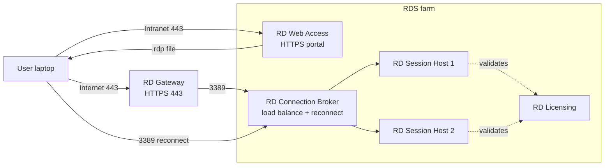

# Remote Desktop Services (RDS)

**RDS** lets many users log in to one Windows Server at the same time and run full desktops or individual applications from it. The user's own PC only shows the screen — the CPU, RAM and disk belong to the server. This is how most companies deliver line-of-business apps (1C, SAP, AutoCAD), how remote workers reach internal tools, and how a single upgraded server replaces dozens of fat clients.

RDS is not the same thing as **RDP**. RDP is the wire protocol (TCP 3389). Every Windows Server already speaks RDP and allows two admin sessions by default — that is *not* RDS. RDS is a set of roles on top of RDP that adds multi-user session hosting, a web portal, a load balancer, a licensing server and an HTTPS gateway. Installing the roles is what unlocks "many users at once."

| | RDP | RDS |
|---|---|---|
| What | Remote Desktop **Protocol** | Remote Desktop **Services** (role bundle) |
| Ports | 3389 | 3389 + 443 (Gateway/Web) + 135/LDAP for Broker |
| Concurrent users | 2 admin sessions | As many as CAL count allows |
| Licence | None | RDS CAL per user or per device |
| Used for | Admin connects to a box | Many users run apps on one server |

## Typical use cases

| Scenario | Why RDS fits |
|---|---|
| Remote work | Users connect from home/travel to a central desktop |
| Thin clients | Weak endpoints offload real work to a strong server |
| Expensive software | One install on the server instead of 50 desktops |
| BYOD | Personal laptops and tablets connect without touching company data |
| Contractors / interns | Spin up a temporary account, clean session, no endpoint build |
| Security | Data never leaves the server — only pixels do |

## Components

RDS is not a single role. It is five roles that cooperate. In a Quick Start deployment three of them land on the same server; in production they are usually split out.



### RD Session Host (RDSH)

Hosts the user sessions. Every login opens a separate session with its own desktop and processes, but they all share the server's CPU and RAM. Plan **2–4 GB RAM per active user** — a 32 GB server comfortably carries 8–16 users, more if they just run Outlook/Office and less if they run CAD.

### RD Web Access (RDWA)

A browser portal at `https://DC01/RDWeb`. Users sign in, see the desktops and RemoteApps they are entitled to, click one, and get a `.rdp` file that launches the session.

### RD Connection Broker

When there is more than one Session Host, the Broker picks the least-loaded one for new logins. It also does **session reconnect** — if a user drops and logs back in, the Broker routes them back to their existing session instead of starting a new one.

### RD Gateway

Publishes RDS to the internet over HTTPS/443. Never expose 3389 directly — the Gateway tunnels RDP inside TLS so the attack surface from outside is the same as any web server.

### RD Licensing

After 120 days of grace period, users stop being able to connect until a Licensing server is active and RDS CALs (Client Access Licences) are installed — either **Per User** or **Per Device**.

## Deployment

There are two paths in the wizard:

- **Quick Start** — Session Host, Web Access and Connection Broker all go on one server. Right for labs and small shops.
- **Standard Deployment** — each role on its own server. Right for production.

This lesson uses Quick Start on `DC01`. A production environment should not run RDS on a domain controller; this is only acceptable in a lab.

### GUI install

1. **Server Manager** → **Manage** → **Add Roles and Features**.
2. On **Installation Type** pick **Remote Desktop Services installation** (not the usual Role-based path).
3. **Deployment Type** → **Quick Start**.
4. **Deployment Scenario** → **Session-based desktop deployment**.
5. **Server Selection** → add `DC01`.
6. Tick **Restart the destination server automatically if required** and click **Deploy**.

After the restart the server has RD Session Host, RD Web Access and RD Connection Broker. RD Licensing and RD Gateway are separate, optional add-ons.

### PowerShell install

```powershell
# Core roles
Install-WindowsFeature RDS-RD-Server          -IncludeManagementTools
Install-WindowsFeature RDS-Web-Access         -IncludeManagementTools
Install-WindowsFeature RDS-Connection-Broker  -IncludeManagementTools

# Optional add-ons
Install-WindowsFeature RDS-Licensing          -IncludeManagementTools
Install-WindowsFeature RDS-Gateway            -IncludeManagementTools
```

## Session collections

A **collection** is the unit you manage — a group of session hosts, an allow-list of users, and a set of session rules applied uniformly to everyone inside.

### Create a collection

**Server Manager** → **Remote Desktop Services** → **Collections** → **Tasks** → **Create Session Collection**.

Walk through the wizard:

- **Collection name**: `Example-Desktop`.
- **RD Session Host**: add `DC01`.
- **User Groups**: remove the default `Domain Users` if you want to restrict access — e.g. allow only `GRP-Teachers` and `GRP-IT-Admins`.
- **User Profile Disks**: optional. Keeps each user's profile on a separate VHDX on a file share so it follows them across hosts. Skip for a lab.

Or with PowerShell:

```powershell
New-RDSessionCollection `
    -CollectionName   "Example-Desktop" `
    -SessionHost      "dc01.example.local" `
    -ConnectionBroker "dc01.example.local"
```

### Tune the collection

After creation, select the collection → **Tasks** → **Edit Properties**. The four tabs that matter:

**Session**

| Setting | What it does | Reasonable default |
|---|---|---|
| End a disconnected session | Closes stale sessions so their RAM is freed | 6–24 hours |
| Active session limit | Hard cap on total session length | Unlimited or 12h |
| Idle session limit | Disconnects idle users | 30–60 minutes |
| When session limit is reached | Disconnect (keeps state) or End session (loses it) | Disconnect |

**Security**

- **Security Layer** → **SSL (TLS)**.
- **Encryption Level** → **High**.
- **Network Level Authentication (NLA)** → **Enabled**. NLA authenticates the user *before* a session is built, which shuts down brute-force and DoS attempts against the login screen.

**Client Settings (device redirection)**

By default the client's audio, clipboard, drives, printers, smart cards, and USB devices are forwarded into the session. That is convenient — and a data-exfiltration path. Turn off **Drives** and **Clipboard** if users can reach sensitive data, or impose it via GPO.

**PowerShell equivalent:**

```powershell
Set-RDSessionCollectionConfiguration `
    -CollectionName               "Example-Desktop" `
    -DisconnectedSessionLimitMin  360 `
    -IdleSessionLimitMin          60 `
    -MaxRedirectedMonitors        2 `
    -ClientDeviceRedirectionOptions AudioVideoPlayBack, Clipboard `
    -ConnectionBroker             "dc01.example.local"
```

## RemoteApp

A **RemoteApp** is a single application published from the server so it looks like a local window on the user's desktop — no server wallpaper, no taskbar, just the app. Under the hood it is still a full RDS session, but the user sees only the window of `calc.exe` (or Word, or an ERP client).

### Publish via GUI

**Collections** → *Example-Desktop* → **RemoteApp Programs** → **Tasks** → **Publish RemoteApp Programs**. The wizard lists every app the server already has (Calculator, Notepad, WordPad, PowerShell, plus anything installed like Office). Tick the ones to publish and finish.

For apps that are not auto-discovered, click **Add…** and point at the `.exe` path (for example `C:\Program Files\MyApp\myapp.exe`).

### Publish via PowerShell

```powershell
# See what is publishable
Get-RDAvailableApp `
    -CollectionName   "Example-Desktop" `
    -ConnectionBroker "dc01.example.local"

New-RDRemoteApp `
    -CollectionName   "Example-Desktop" `
    -DisplayName      "Calculator" `
    -FilePath         "C:\Windows\System32\calc.exe" `
    -ConnectionBroker "dc01.example.local"

New-RDRemoteApp `
    -CollectionName   "Example-Desktop" `
    -DisplayName      "WordPad" `
    -FilePath         "C:\Program Files\Windows NT\Accessories\wordpad.exe" `
    -ConnectionBroker "dc01.example.local"

# Check what is already published
Get-RDRemoteApp `
    -CollectionName   "Example-Desktop" `
    -ConnectionBroker "dc01.example.local"
```

### Web portal

Users open `https://DC01/RDWeb` in a browser, sign in with their domain credentials, and see every desktop and RemoteApp they are entitled to. Clicking an app downloads a `.rdp` file that immediately launches the session. In a lab the self-signed certificate triggers a browser warning — replace it with a real certificate in production.

## RD Gateway

The Gateway role lets users reach the collection from the internet without exposing port 3389. The client speaks HTTPS (443) to the Gateway; the Gateway terminates TLS and forwards RDP to the Session Host inside the LAN.

```
Home user ── HTTPS 443 ──▶ RD Gateway ── RDP 3389 ──▶ RDSH (LAN)
```

### Install & configure

```powershell
Install-WindowsFeature RDS-Gateway -IncludeManagementTools

# Self-signed cert (replace with a real one in production)
$cert = New-SelfSignedCertificate `
    -DnsName            "gateway.example.local" `
    -CertStoreLocation  "cert:\LocalMachine\My"
```

Then open **Server Manager** → **Tools** → **Remote Desktop Gateway Manager** and:

1. Server → **Properties** → **SSL Certificate** tab: bind the certificate.
2. **Server Farm**: list the RDSH servers behind this gateway.
3. **RD CAP** (Connection Authorization Policy) — *who* is allowed to connect. Typically a domain user group.
4. **RD RAP** (Resource Authorization Policy) — *which* servers they are allowed to reach.

PowerShell equivalents:

```powershell
New-Item -Path "RDS:\GatewayServer\CAP" `
         -Name "Example-CAP" `
         -UserGroups "EXAMPLE\Domain Users" `
         -AuthMethod 1

New-Item -Path "RDS:\GatewayServer\RAP" `
         -Name "Example-RAP" `
         -UserGroups "EXAMPLE\Domain Users" `
         -ComputerGroupType 2
```

## RD Licensing

The grace period is **120 days** from the moment the first Session Host is installed. After that, connections fail until a Licensing server is active and has RDS CALs.

### Install

```powershell
Install-WindowsFeature RDS-Licensing -IncludeManagementTools
```

Then **Tools** → **Remote Desktop Licensing Manager** → right-click the server → **Activate Server** (online activation with Microsoft).

### Point the deployment at the Licensing server

**Server Manager** → **Remote Desktop Services** → **Overview** → **Tasks** → **Edit Deployment Properties** → **RD Licensing**. Add the Licensing server and choose the mode:

- **Per User** — one CAL per named user, regardless of device. More flexible.
- **Per Device** — one CAL per physical endpoint, regardless of how many users share it.

PowerShell to set the mode:

```powershell
$obj = Get-WmiObject `
    -Namespace "Root/CIMV2/TerminalServices" `
    -Class     Win32_TerminalServiceSetting
$obj.ChangeMode(4)   # 2 = Per Device, 4 = Per User
```

For a lab the 120-day grace period is enough; for production you must buy CALs.

## GPO controls

Collection properties apply per-collection. For fleet-wide behaviour the right knob is Group Policy:

```
Computer Configuration → Policies → Administrative Templates →
    Windows Components → Remote Desktop Services → Remote Desktop Session Host
```

The settings that matter:

**Session Time Limits**

| Setting | Recommended |
|---|---|
| Set time limit for disconnected sessions | 6 hours |
| Set time limit for active but idle sessions | 30 minutes |
| Set time limit for active sessions | 12 hours |
| End session when time limits are reached | Enabled |

**Device and Resource Redirection**

- **Do not allow Clipboard redirection** — Enabled if copy-paste out of the session is a concern.
- **Do not allow drive redirection** — Enabled to stop users mounting their C: inside the session.
- **Do not allow printer redirection** — only if printing is a known exfil path.

**Security**

- **Require use of specific security layer** → Enabled → **SSL**.
- **Require user authentication using NLA** → Enabled.
- **Set client connection encryption level** → Enabled → **High**.

**Connections**

- **Restrict Remote Desktop Services users to a single session** → Enabled. One session per user keeps resource usage predictable.
- **Limit number of connections** → the maximum the server is sized for (e.g. 50).

## Monitoring

### Active sessions

```powershell
Get-RDUserSession `
    -CollectionName   "Example-Desktop" `
    -ConnectionBroker "dc01.example.local" |
    Select-Object UserName, SessionState, CreateTime, ServerName

# classic command, still the quickest
qwinsta /server:DC01
```

Typical `qwinsta` output:

```
 SESSIONNAME       USERNAME      ID  STATE   TYPE
 services                         0  Disc
 console                          1  Conn
 rdp-tcp#0         e.mammadov     2  Active
 rdp-tcp#1         k.aliyev       3  Active
 rdp-tcp#2         a.rustamli     4  Disc
```

- **Active** — user is connected right now.
- **Disc** — user disconnected but the session is still alive (so state is preserved on reconnect).

### Disconnect or log off a user

```powershell
# Disconnect — keeps the session open
Disconnect-RDUser   -HostServer "dc01.example.local" -UnifiedSessionID 3 -Force

# Log off — closes the session
Invoke-RDUserLogoff -HostServer "dc01.example.local" -UnifiedSessionID 3 -Force

# Classic
logoff 3 /server:DC01
```

### Send a message to sessions

Useful for "server reboots in 10 minutes" warnings:

```powershell
# One user
msg e.mammadov /server:DC01 "Server will reboot in 10 minutes. Please save your work."

# Everyone on the server
msg * /server:DC01 "The server will go down for maintenance in 10 minutes."
```

## Troubleshooting

### "An internal error has occurred"

Check, in order:

```powershell
Get-Service TermService, SessionEnv, UmRdpService
```

All three must be Running. Then look at the usual suspects:

- **NLA mismatch** — client too old to speak NLA.
- **Certificate** — self-signed cert expired or not trusted.
- **Licensing grace period expired** — everything stops working on day 121:
  ```powershell
  (Invoke-WmiMethod -Path Win32_TerminalServiceSetting -Name GetGracePeriodDays).DaysLeft
  ```

### "The number of connections to this computer is limited"

The server only has the default 2 admin sessions — RDS roles were never installed, or the Collection's connection limit is lower than the current user count. Either install/repair the RDS roles or close disconnected sessions.

### Slow sessions

Check what is actually heavy:

```powershell
Get-Process  | Sort-Object CPU -Descending | Select-Object -First 10
Get-Counter  '\Memory\Available MBytes'
Get-Counter  '\Processor(_Total)\% Processor Time'
qprocess     /server:DC01
```

A Session Host dying at the user count is usually RAM-starved long before it is CPU-starved; `Available MBytes` under 500 is the red flag.

### Printer redirection not working

Verify in this order: the GPO is not blocking printer redirection, the collection still has it enabled, and the printer driver is installed on the server — the client's driver is not forwarded.

### Event logs

```
Event Viewer → Applications and Services Logs → Microsoft → Windows →
├── TerminalServices-LocalSessionManager/Operational     (session open/close)
├── TerminalServices-RemoteConnectionManager/Operational (connect attempts)
└── TerminalServices-Gateway/Operational                 (RD Gateway)
```

```powershell
Get-WinEvent `
    -LogName   "Microsoft-Windows-TerminalServices-LocalSessionManager/Operational" `
    -MaxEvents 20 |
    Select-Object TimeCreated, Id, Message
```

## PowerShell cheat sheet

```powershell
# --- Install ---
Install-WindowsFeature RDS-RD-Server          -IncludeManagementTools
Install-WindowsFeature RDS-Web-Access         -IncludeManagementTools
Install-WindowsFeature RDS-Connection-Broker  -IncludeManagementTools
Install-WindowsFeature RDS-Licensing          -IncludeManagementTools
Install-WindowsFeature RDS-Gateway            -IncludeManagementTools

# --- Collections ---
New-RDSessionCollection -CollectionName "Name" -SessionHost "dc01.example.local" -ConnectionBroker "dc01.example.local"
Get-RDSessionCollection -ConnectionBroker "dc01.example.local"

# --- RemoteApp ---
Get-RDAvailableApp -CollectionName "Name" -ConnectionBroker "dc01.example.local"
New-RDRemoteApp    -CollectionName "Name" -DisplayName "App" -FilePath "C:\...\app.exe" -ConnectionBroker "dc01.example.local"
Get-RDRemoteApp    -CollectionName "Name" -ConnectionBroker "dc01.example.local"
Remove-RDRemoteApp -CollectionName "Name" -Alias "app" -ConnectionBroker "dc01.example.local"

# --- Sessions ---
Get-RDUserSession    -CollectionName "Name" -ConnectionBroker "dc01.example.local"
Disconnect-RDUser    -HostServer "dc01.example.local" -UnifiedSessionID 3 -Force
Invoke-RDUserLogoff  -HostServer "dc01.example.local" -UnifiedSessionID 3 -Force
qwinsta /server:DC01
msg * /server:DC01 "Message"

# --- Monitoring ---
Get-Counter '\Terminal Services Session(*)\% Processor Time'
Get-Counter '\Terminal Services\Active Sessions'
Get-Counter '\Terminal Services\Inactive Sessions'

# --- Troubleshooting ---
Get-Service          TermService, SessionEnv, UmRdpService
Test-NetConnection   DC01 -Port 3389
qprocess             /server:DC01
```

## Practical takeaways

- RDP is the protocol, RDS is the role bundle — do not mix the terms.
- Quick Start is fine for labs; production splits the roles and keeps RDS off domain controllers.
- A collection is the unit you manage — users, hosts and session rules live there.
- Turn NLA on and force TLS; leaving `Negotiate` on is a downgrade waiting to happen.
- Clipboard and drive redirection are convenient *and* the easiest exfiltration path — decide per environment.
- RemoteApp looks like a local window; users usually cannot tell it is remote.
- Never expose 3389 on the internet — put an RD Gateway in front.
- The 120-day grace period is a hard countdown; once it lapses, nobody logs in.
- Most "slow RDS" complaints are RAM exhaustion on the Session Host, not the network.
