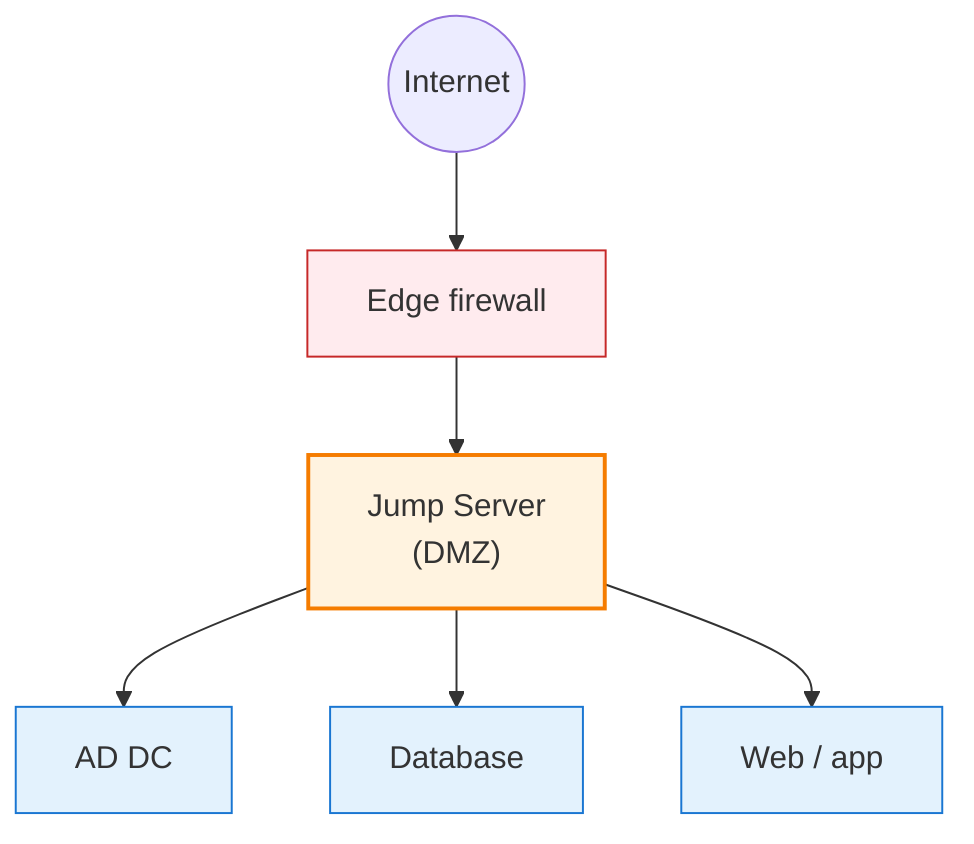

# Jump Server (Bastion Host)

A **Jump Server** (or bastion host) is a hardened, narrowly scoped server that administrators connect to first in order to reach other systems on an internal network. Instead of exposing every internal server to direct access, all administrative traffic is funneled through this single, controlled entry point.


```
User (internet) → Jump Server (DMZ) → Internal servers (AD, DB, web…)
```

## Why a Jump Server

Exposing domain controllers, databases, and internal application servers directly — even via VPN — gives attackers a wide surface to probe. A jump server reduces that surface and centralizes control:

- The internal network is not directly reachable from the internet
- All admin sessions pass through a single, monitored choke point
- Every connection can be logged: who connected, when, to which server
- Only authorized identities can reach the server at all

## Enterprise scenario

Typical flow in a large environment:

1. A system administrator needs to work from outside the office
2. Direct access to the domain controller (or prod DB, hypervisor, etc.) is not allowed
3. The admin first connects to the jump server over VPN/RDP/SSH with MFA
4. From the jump server, they reach the internal target with their privileged identity

## Where it sits in the network



A jump server typically lives in a DMZ (or a dedicated management network), with tight firewall rules governing both the traffic that reaches it and the traffic it can initiate inward.

## Core characteristics

- Minimal software footprint — only what administrators need
- Strong authentication (MFA, smart cards, or certificates)
- Session recording / centralized logging
- Accessed through RDP (Windows) or SSH (Linux)
- No general internet browsing from the jump server itself

## Using a Jump Server

### SSH (Linux / Unix)

The cleanest way to reach an internal host through a jump server is `ssh -J` (ProxyJump):

```bash
ssh -J user@jump-host user@internal-server
```

This creates a single authenticated SSH connection to the jump host and tunnels a second SSH session to the internal host through it. You do not need to log in twice manually.

In `~/.ssh/config`:

```
Host internal
  HostName 10.0.0.5
  User emil
  ProxyJump jumpuser@jump.example.com
```

After that, `ssh internal` handles the jump transparently.

### RDP (Windows)

1. Connect to the jump server with Remote Desktop using MFA
2. From the jump server session, launch another Remote Desktop connection to the internal target
3. Both sessions can be recorded centrally (Windows Event Forwarding, privileged access management tools)

## Windows jump server checklist

When you stand one up as a dedicated Windows Server VM:

- Place it on a DMZ or management VLAN with a static IP
- Limit inbound firewall rules to RDP (TCP/3389) from known admin networks only
- Enable **Network Level Authentication (NLA)** for RDP
- Require MFA for admin sign-in (via conditional access or a PAM solution)
- Install only the tools administrators actually need — no general-purpose software
- Forward all RDP and security events to a central log collector / SIEM
- Patch aggressively — treat it like a tier-0 asset

## Security recommendations

- **MFA** — always required; no password-only access
- **Principle of least privilege** — users only get the rights they need to reach their targets
- **Session logging** — collect and retain logs centrally; a local log on a compromised host is useless
- **No internet egress** — the jump server should not be able to browse the web or reach external repositories
- **Continuous monitoring** — alert on unusual login times, failed attempts, or new outbound destinations
- **Patch cadence** — apply security updates on a tight schedule

## Cloud equivalents

Cloud providers offer managed bastion services that implement the jump-server pattern without you maintaining a VM:

- Azure Bastion
- AWS Systems Manager Session Manager
- GCP Identity-Aware Proxy (IAP) TCP forwarding

These tighten the model further — often no public IP on the bastion, short-lived credentials, and session logging out of the box.

## Practical takeaways

- Put a jump server between admins and any tier-0 system (DCs, hypervisors, databases)
- Combine it with MFA and least privilege — a jump server without MFA is just a bigger target
- Never let the jump server browse the internet or run general-purpose software
- Treat the jump server itself as a high-value asset: patch, monitor, and segment it accordingly

## Useful links

- Azure Bastion: [https://learn.microsoft.com/en-us/azure/bastion/bastion-overview](https://learn.microsoft.com/en-us/azure/bastion/bastion-overview)
- Privileged Access Workstations (PAW): [https://learn.microsoft.com/en-us/security/privileged-access-workstations/privileged-access-deployment](https://learn.microsoft.com/en-us/security/privileged-access-workstations/privileged-access-deployment)
- OpenSSH ProxyJump: [https://man.openbsd.org/ssh_config#ProxyJump](https://man.openbsd.org/ssh_config#ProxyJump)
