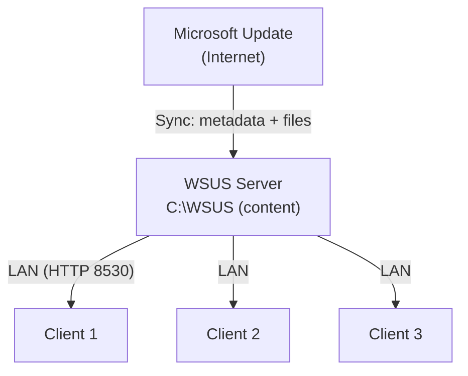
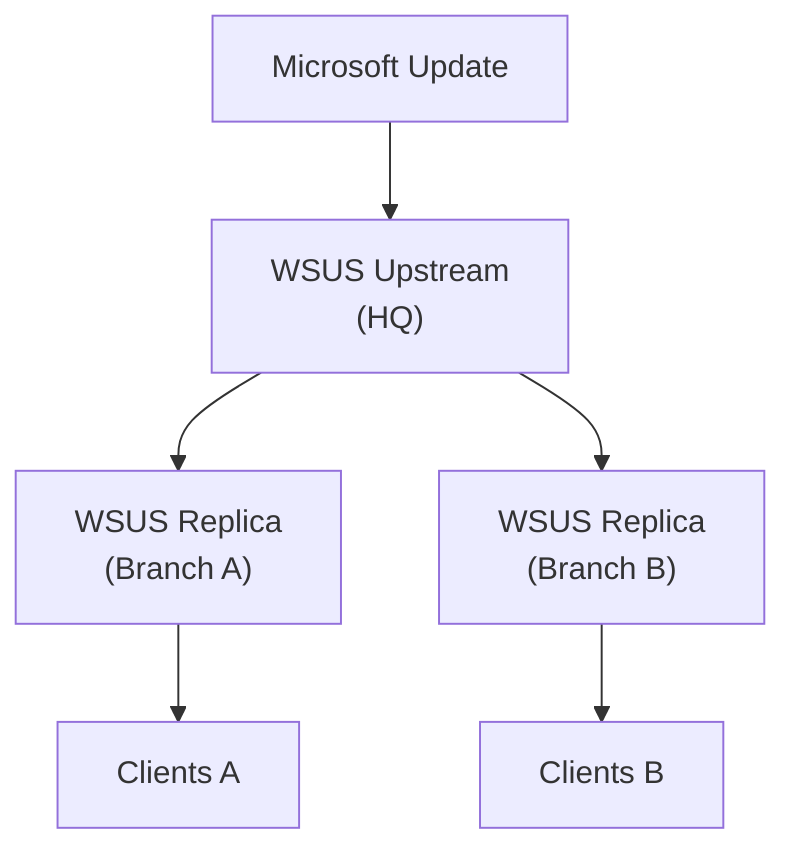

# WSUS (Windows Server Update Services)

Every Windows machine in a domain needs patches — security fixes, bug fixes, defender definitions. Left alone, every machine downloads them straight from Microsoft Update. That is fine for two laptops; it is a problem for two hundred.

What WSUS buys you:

- Updates are downloaded **once** to the WSUS server, then distributed across the LAN — huge bandwidth savings
- A console that shows, per machine, which updates are needed / installed / failed
- Approval control: the admin decides what gets installed and what gets blocked
- Timing control via GPO — patch at 03:00, not at 14:00 on a Monday
- Ring-based rollout: approve to a **Test** group first, wait, then approve to production

## Architecture



For multi-site organisations a second tier is useful:



The **upstream** server syncs from Microsoft; **downstream / replica** servers sync from the upstream and only need enough bandwidth for metadata, not the raw content over the WAN.

## Components and database choice

| Component | Purpose |
| --- | --- |
| WSUS Service | The core service, hosted in IIS |
| WSUS Database | Update metadata + computer inventory (WID or SQL Server) |
| Content Directory | Where update binaries actually live (default `C:\WSUS`) |
| WSUS Console | MMC snap-in for administration |

| | WID (Windows Internal Database) | SQL Server |
| --- | --- | --- |
| Cost | Free, built in | Licensed |
| Scale | Up to ~20,000 clients | Large enterprise |
| Remote console | Only from the server itself | From anywhere |
| Recommendation | Labs, small to mid-size orgs | Large enterprise, shared SQL infrastructure |

A lab or a single-site domain is fine with WID.

## Prerequisites

- At least 10 GB free, 40+ GB recommended — update binaries are large
- 4 GB+ RAM recommended
- IIS is pulled in automatically by the role
- Outbound HTTPS to Microsoft Update

## Installing the role

```powershell
Install-WindowsFeature UpdateServices -IncludeManagementTools
Install-WindowsFeature UpdateServices-WidDB
Install-WindowsFeature UpdateServices-Services

# Post-install configuration — creates the DB, wires up content directory
& "C:\Program Files\Update Services\Tools\wsusutil.exe" postinstall CONTENT_DIR=C:\WSUS
```

GUI path: **Server Manager → Add Roles and Features → Windows Server Update Services**. Pick **WID Connectivity + WSUS Services**, set the content path, finish the wizard, then run **Post-Installation tasks** from the Server Manager notifications.

The `wsusutil postinstall` step is **mandatory** — without it the database is not created and the console will not launch.

## Initial configuration wizard

First launch of the WSUS console walks through a wizard (available later under **Options → WSUS Server Configuration Wizard**):

1. **Upstream server** — `Synchronize from Microsoft Update`, unless this is a replica of another WSUS server
2. **Proxy** — set if your network requires it for outbound internet
3. **Connect to upstream** — pulls the product and classification catalogue. Allow 5–15 minutes.
4. **Languages** — tick only the languages you actually ship. Every extra language costs disk.
5. **Products** — the Microsoft products you want updates for. A typical Windows shop: `Windows Server 2025`, `Windows 11`, `Microsoft Defender Antivirus`, `Microsoft Edge`. Skip Office / SQL / .NET if you don't run them — they balloon storage.
6. **Classifications** — tick `Critical Updates`, `Security Updates`, `Definition Updates`, `Update Rollups`. Skip `Drivers` (usually not worth managing through WSUS) and `Feature Packs / Service Packs / Upgrades` unless you have a plan for them.
7. **Sync schedule** — once a day, overnight (e.g. 03:00)
8. **Begin initial synchronization** — the first sync takes hours because of the full metadata download. Subsequent syncs are minutes.

## Computer groups

By default every client lands in `Unassigned Computers`. You want your own groups so you can stage rollouts.

A common layout:

- `Test` — a handful of machines that get updates first
- `Servers` — domain servers
- `Workstations` — regular user machines
- `Lab` — non-production

Create groups in the console (**Computers → All Computers → Add Computer Group**), then decide how machines end up in them:

| Method | Where membership is set | When to use |
| --- | --- | --- |
| Server-side targeting | In the WSUS console, manually | Small fleets; one-off moves |
| Client-side targeting | Via GPO (`Enable client-side targeting`) | Any real deployment — membership follows OU / policy |

For client-side targeting, enable it under **Options → Computers → "Use Group Policy or registry settings on computers"**, then set the target group name in a GPO.

## Approvals

Update statuses:

| Status | Meaning |
| --- | --- |
| Not Approved | No decision yet |
| Approved for Install | Clients in the target group will install it |
| Approved for Removal | Clients will uninstall it |
| Declined | Hidden from the view; clients do not see it |

### Manual approval

**Updates → All Updates → filter Approval: Any Except Declined, Status: Needed**. Right-click an update → **Approve** → choose a group and action. Typical flow: approve to `Test`, let it bake for a week, then approve to `Workstations` and `Servers`.

### Auto-approval rules

**Options → Automatic Approvals → New Rule**. A sane starter rule:

- Classifications: `Critical Updates`, `Security Updates`, `Definition Updates`
- Products: `Windows Server 2025`, `Windows 11`, `Microsoft Defender`
- Approve for: `Test`
- Name: `Auto-Approve Security to Test`

Defender definition updates are the one thing you usually auto-approve to **every** group — they change daily, are low risk, and waiting a week defeats the point.

### Declining

Right-click an update → **Decline** if it does not apply to you (obsolete architectures, language packs you don't ship, products you don't run). Declined updates free up disk during cleanup.

## Pointing clients at WSUS with GPO

Without a GPO, clients have no idea WSUS exists. Create a GPO, link it to the domain (or an OU), and edit these settings:

Under **Computer Configuration → Policies → Administrative Templates → Windows Components → Windows Update → Manage updates offered from Windows Server Update Services**:

| Setting | Value |
| --- | --- |
| Specify intranet Microsoft update service location | Enabled — `http://DC01:8530` for both the update and statistics URLs |
| Enable client-side targeting | Enabled — `Workstations` (or whichever WSUS group matches this OU) |
| Do not connect to any Windows Update Internet locations | Enabled — force clients to only use WSUS |

Under **Manage end user experience**:

| Setting | Value |
| --- | --- |
| Configure Automatic Updates | Enabled — option **4** (auto-download + schedule install), daily at 03:00 |
| No auto-restart with logged on users for scheduled automatic updates installations | Enabled |

Port `8530` is the WSUS HTTP port. HTTPS uses `8531` — required if you want the WSUS-client traffic to be TLS, which most hardened environments do.

### Apply and verify on a client

```powershell
gpupdate /force

# Confirm the policy landed
reg query "HKLM\SOFTWARE\Policies\Microsoft\Windows\WindowsUpdate" /s
# Expect: WUServer = http://DC01:8530

Restart-Service wuauserv

# Trigger a detection and report
wuauclt /detectnow
wuauclt /reportnow

# Server 2019+ and Windows 10/11
usoclient StartScan
```

The client should appear in the WSUS console within 15–30 minutes. If it does not, start with `Test-NetConnection DC01 -Port 8530` from the client.

## Reporting

Built-in reports under **WSUS Console → Reports**:

| Report | Use |
| --- | --- |
| Update Status Summary | Per-update status across the environment |
| Update Detailed Status | Which machine needs / failed which update |
| Computer Status Summary | Per-machine rollup |
| Computer Detailed Status | Which updates any one machine is missing |
| Synchronization Results | Sync history |

PowerShell:

```powershell
$wsus = Get-WsusServer -Name "DC01" -PortNumber 8530

# Last sync
$wsus.GetSubscription().GetLastSynchronizationInfo()

# Updates still needed or failing in the environment
Get-WsusUpdate -UpdateServer $wsus -Status FailedOrNeeded |
  Select Update, ComputersNeedingThisUpdate

# Inventory
Get-WsusComputer -UpdateServer $wsus |
  Select FullDomainName, IPAddress, LastReportedStatusTime, LastSyncTime
```

## Cleanup

WSUS databases grow quickly and slow the console to a crawl. Clean up monthly.

Console: **Options → Server Cleanup Wizard** — tick everything:

- Unused updates and update revisions
- Computers not contacting the server
- Unneeded update files
- Expired updates
- Superseded updates

PowerShell:

```powershell
Invoke-WsusServerCleanup `
  -CleanupObsoleteUpdates `
  -CleanupUnneededContentFiles `
  -CompressUpdates `
  -DeclineExpiredUpdates `
  -DeclineSupersededUpdates
```

If the console is still slow after cleanup, raise the **WsusPool** IIS application pool's private memory limit (default 1.8 GB → 4 GB+) and reindex the WID database using Microsoft's published reindex script.

## Troubleshooting

**Client is not showing up in the console**

1. Confirm the GPO applied: `gpresult /r | findstr WSUS`, then `reg query` the `WindowsUpdate` policy key
2. `Get-Service wuauserv` — is the service running
3. `Test-NetConnection DC01 -Port 8530` from the client
4. `wuauclt /detectnow` + `wuauclt /reportnow`, wait 15 minutes

**Sync fails**

1. Outbound internet works: `Test-Connection microsoft.com`
2. Proxy is configured where required
3. Firewall is not blocking WSUS ports on the way out
4. Restart services: `Restart-Service WsusService; iisreset`

**Disk is full**

1. Run the cleanup wizard
2. Decline products / classifications you don't use and re-run cleanup
3. `Get-ChildItem C:\WSUS -Recurse | Measure-Object Length -Sum` to see where the space went
4. Move the content directory to a larger volume (`wsusutil movecontent`)

Key log locations:

| Log | Path |
| --- | --- |
| Client update activity | `C:\Windows\SoftwareDistribution\` and `Get-WindowsUpdateLog` |
| WSUS change / control | `C:\Program Files\Update Services\LogFiles\` |

## Practical takeaways

- Never patch straight to production — `Test` group first, wait, then promote
- Auto-approve Defender definitions everywhere; approve security updates manually to rings
- Decline products and classifications you do not use — smaller catalogue, smaller database, smaller disk
- Run the cleanup wizard monthly and raise WsusPool memory once the DB is non-trivial
- Store content on a separate volume from the OS disk
- A server you do not patch is a server you will eventually lose — WSUS exists to make patching boring

## Useful links

- WSUS overview: [https://learn.microsoft.com/en-us/windows-server/administration/windows-server-update-services/get-started/windows-server-update-services-wsus](https://learn.microsoft.com/en-us/windows-server/administration/windows-server-update-services/get-started/windows-server-update-services-wsus)
- Deploy WSUS: [https://learn.microsoft.com/en-us/windows-server/administration/windows-server-update-services/deploy/deploy-windows-server-update-services](https://learn.microsoft.com/en-us/windows-server/administration/windows-server-update-services/deploy/deploy-windows-server-update-services)
- Configure WSUS with GPO: [https://learn.microsoft.com/en-us/windows-server/administration/windows-server-update-services/deploy/4-configure-group-policy-settings-for-automatic-updates](https://learn.microsoft.com/en-us/windows-server/administration/windows-server-update-services/deploy/4-configure-group-policy-settings-for-automatic-updates)
- Manage WSUS with PowerShell: [https://learn.microsoft.com/en-us/powershell/module/updateservices/](https://learn.microsoft.com/en-us/powershell/module/updateservices/)
