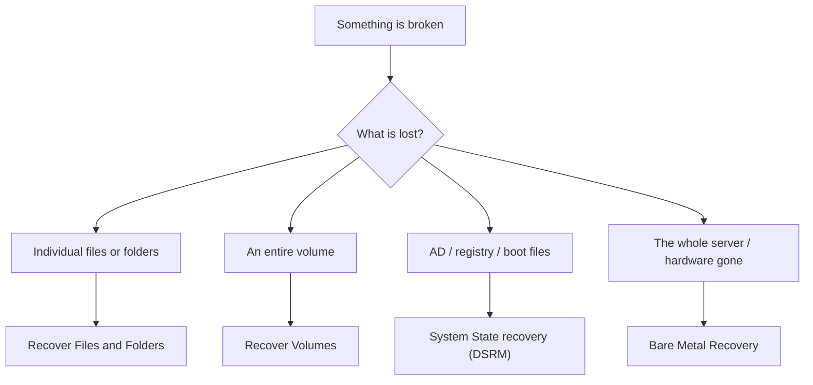

# Windows Server Backup

Backup is the last safety net. When a disk fails, ransomware encrypts a share, an admin deletes the wrong OU, or an update breaks the operating system, a working backup is often the only path back to production.

Typical situations where backup is the difference between a bad hour and a lost week:

- A disk fails and all data on it is gone
- Ransomware encrypts files and demands payment
- An administrator accidentally deletes an important OU or GPO
- The Active Directory database becomes corrupted and nobody can sign in
- A failed update leaves the OS unbootable
- A user deletes an important file and wants it back

> No backup means no data. Untested backup means no backup.

## The 3-2-1 rule

A solid backup strategy follows the **3-2-1 rule**:

```
3 — Keep three copies of the data (original + two backups)
2 — Store them on two different media types (disk, tape, cloud)
1 — Keep one copy offsite (different physical location)
```

Ransomware can encrypt a backup that sits on the same LAN. An offsite copy is what survives that.

## Backup types

| Type | What it copies | Pros | Cons | Typical schedule |
| --- | --- | --- | --- | --- |
| **Full** | Everything | Easy, single-file restore | Slow, large | Weekly |
| **Incremental** | Only what changed since the **last backup** (full or incremental) | Fast, small | Restore needs the full and every incremental since | Daily |
| **Differential** | Everything that changed since the **last full** | Restore needs only the full and the last differential | Grows every day | Daily |
| **System State** | AD database, registry, boot files, SYSVOL, CA DB | Recovers AD/GPO without restoring the OS | Not a full server image | Daily on DCs |
| **Bare Metal Recovery (BMR)** | OS, drivers, apps, config, data | Rebuilds a server on empty hardware | Largest image | Weekly |

### Incremental vs differential — worked example

```
Sunday (Full):         50 GB

        Incremental                        Differential
Sun   50 GB (full)                   Sun   50 GB (full)
Mon    2 GB (changed since Sun)      Mon    2 GB (since Sun)
Tue    3 GB (changed since Mon)      Tue    5 GB (since Sun)
Wed    1 GB (changed since Tue)      Wed    6 GB (since Sun)
Thu    4 GB (changed since Wed)      Thu   10 GB (since Sun)

Restore on Thursday:
  Incremental:   Full + Mon + Tue + Wed + Thu  (5 files)
  Differential:  Full + Thu                    (2 files)
```

Windows Server Backup uses a block-level incremental engine under the hood but presents restore as a single operation.

### What System State covers

| Component | Notes |
| --- | --- |
| Registry | All system configuration |
| Boot files | Required to start the OS |
| Active Directory database | `NTDS.dit`, only on domain controllers |
| SYSVOL | GPO files and login scripts, only on DCs |
| Certificate Services DB | If AD CS is installed |
| Cluster DB | If the server is a cluster node |

On a domain controller, **System State is the most important backup you take** — it is what lets you recover AD after a disaster.

## Backup strategy fundamentals

Before touching the install wizard, decide what you are actually defending against, how fast you need to recover, and how far back you need to be able to go. The Windows Server Backup feature is just one tool — the strategy around it is what determines whether a real incident becomes a one-hour recovery or a one-week outage.

### RTO and RPO

Two numbers drive every backup design. Agree them with the business, write them down, and design the backup schedule to meet them.

| Term | Question it answers | Driven by | Typical example |
| --- | --- | --- | --- |
| **RTO** (Recovery Time Objective) | How long can the service be down before the business is hurt? | Restore speed, hardware availability, runbook quality | 4 hours for a file server |
| **RPO** (Recovery Point Objective) | How much data can we afford to lose, measured in time? | Backup frequency, replication lag | 24 hours for an HR share, 15 minutes for AD |

```
                RPO                                    RTO
   |<------------>|                       |<----------------------->|
 last good        incident             restore                   service
 backup            occurs               starts                    back up
```

If the business says RPO is 1 hour, a nightly backup does not meet the need — you need hourly snapshots, log shipping, or replication. If RTO is 1 hour, a tape that ships from offsite by courier does not meet the need — you need a local restore tier.

### Geographic dispersal — the "1" in 3-2-1

The "1 offsite" copy is not a luxury, it is the only thing that survives:

- **Site-wide disasters** — fire, flood, earthquake, prolonged power loss
- **Ransomware that traverses the LAN** — modern strains hunt down backup shares and encrypt them
- **Insider sabotage** — an admin with domain rights can delete on-prem backups in seconds

Pick a distance such that one event cannot destroy both copies. Across-the-room is not offsite. Across-town survives a building fire but not a regional flood. Cross-region cloud or a partner DC in another city survives both.

### Backup media tiers

Different storage media trade speed, cost, and durability. A mature strategy uses several:

| Tier | Strengths | Weaknesses | Where it fits |
| --- | --- | --- | --- |
| **Disk (D2D)** | Fast restores, random access, easy to script | Online — exposed to ransomware on the LAN | First-tier target for daily incrementals |
| **Tape (LTO)** | Cheap per TB, naturally air-gapped once ejected, decades of shelf life | Sequential, slow to restore, needs a robot or operator | Long-term retention, regulatory archive |
| **Cloud / object storage** | Offsite by definition, durable, scales | Egress cost, restore speed depends on bandwidth, vendor lock-in | The "1" copy in 3-2-1, DR landing zone |

A common pattern: nightly D2D to a local repository, weekly copy to cloud object storage, monthly tape pulled out of the library and stored in a fire safe.

### Replication is not backup

Replication keeps a second copy of live data continuously in sync. It is excellent for high availability, and it is **not a substitute for backup**.

| Mode | How it works | RPO | When to use |
| --- | --- | --- | --- |
| **Synchronous** | Write only acknowledged when both sides have it on disk | Near zero | Same-campus or metro, low-latency links |
| **Asynchronous** | Primary writes immediately, secondary catches up | Seconds to minutes | Cross-region, cloud DR, anywhere with WAN latency |

The trap: replication faithfully copies bad changes too. If a user deletes a folder, ransomware encrypts a share, or a script truncates a database, replication propagates the damage to the secondary in seconds. You still need point-in-time backups to recover the *previous* state.

Common replication technologies in an `example.local` environment:

- **AD replication** between domain controllers (built-in, multi-master)
- **DFS Replication** for file shares
- **Storage Replica** for volume-level synchronous or asynchronous mirroring
- **Hyper-V Replica** for VM-level asynchronous replication
- **SAN-to-SAN** replication between arrays in different data centres

### Backup retention — Grandfather-Father-Son (GFS)

A naive "keep 30 days of backups" works until someone notices a corruption that started 90 days ago. GFS solves this by keeping multiple rotation tiers:

| Tier | Frequency | Retention | Purpose |
| --- | --- | --- | --- |
| **Son** | Daily | 7–14 days | Recover from yesterday's mistake |
| **Father** | Weekly | 4–6 weeks | Recover from last month's mistake |
| **Grandfather** | Monthly (often a quarter-end full) | 12+ months | Audit, regulatory, deep history |

```
Mon Tue Wed Thu Fri  Sat  Sun     <- Sons (daily, kept 14 days)
                     [Father]      <- Weekly full (kept 6 weeks)
End of month: [Grandfather]        <- Monthly archive (kept 12 months+)
```

For regulated workloads (financial records, health data, GRC obligations), retention is set by law, not by IT preference — see [risk and privacy](../../grc/risk-and-privacy.md).

### Immutable, WORM, and air-gapped backups

Modern ransomware operators look for backups *first*. They sit in the network, find the backup server, delete or encrypt the repositories, and only then trigger the ransomware. A backup an attacker can delete is not a backup.

Three overlapping defences:

- **Immutable backups** — the backup target enforces "no delete, no overwrite" until a retention timer expires. Examples: S3 Object Lock, Azure Blob immutability policies, Veeam hardened repository, Wasabi immutable buckets.
- **WORM (Write Once Read Many)** — same idea at the storage layer; common on tape and on compliance-grade object storage. Once written, the medium itself refuses to be changed.
- **Air-gapped backups** — physically or logically disconnected from production. An ejected tape in a safe, a removable disk that lives offline, or a backup repository on a dedicated network reachable only during the backup window.

Practical rule: at least one copy of every important dataset must be either immutable or air-gapped. If your only backups live on a domain-joined Windows share that the helpdesk tier can write to, an attacker who phishes one helpdesk account can delete them all. See [investigation and mitigation](../../blue-teaming/investigation-and-mitigation.md) for the ransomware response side.

### High availability is not backup

These two are often confused, and the difference matters when an auditor or a CIO asks "are we covered?"

| Concern | High availability | Backup |
| --- | --- | --- |
| **Protects against** | Hardware failure, single-node outage | Data corruption, deletion, ransomware, long-tail recovery |
| **Time horizon** | Now (seconds of failover) | Past (yesterday, last month, last year) |
| **Examples** | Failover cluster, RAID, NIC teaming, redundant PSUs | Daily WSB job, monthly tape, immutable cloud copy |
| **What it does NOT save you from** | A user deletes a file — both nodes happily replicate the deletion | A motherboard dies at 3am with no spare hardware |

You need both. RAID and clustering keep the service running through hardware failure (see [RAID](../../general-security/raid.md)); backups let you walk back through time when something logical goes wrong.

### Worked sizing example

`DC01.example.local` hosts AD, DNS, and a 200 GB file share. Business says RPO 24h for files, 1h for AD; RTO 4h.

- **Daily** System State + critical-volume backup at 21:00 to a dedicated `D:` disk (Son tier, 14 days)
- **Hourly** AD-aware snapshots via VSS during business hours to meet the 1-hour AD RPO
- **Weekly** full server image copied to a cloud object-storage bucket with object-lock for 30 days (offsite, immutable)
- **Monthly** archive copy retained 12 months for the GFS Grandfather tier
- **Restore drill** every quarter — pick a random backup, restore to a sandbox VM, verify AD database mounts and a sample file opens

For open-source alternatives to Windows Server Backup (Veeam Community, Bacula, Restic, BorgBackup), see the [backup and storage tools](../../general-security/open-source-tools/backup-and-storage.md) reference.

## Installing Windows Server Backup

The feature is not installed by default.

```powershell
Install-WindowsFeature Windows-Server-Backup -IncludeManagementTools
```

GUI path: **Server Manager → Manage → Add Roles and Features → Features → Windows Server Backup**.

Open the console from **Server Manager → Tools → Windows Server Backup** or run `wbadmin.msc`.

```
Windows Server Backup
├── Local Backup
│   ├── Backup Schedule    — automated schedule
│   ├── Backup Once        — one-off backup
│   ├── Recover            — restore
│   └── Status             — current / last backup result
└── Messages
```

## Taking a backup

### One-off backup (Backup Once)

In the console, click **Backup Once… → Different options** and walk through:

1. **Backup configuration:** `Full server (recommended)` for a full image, or `Custom` to pick specific items
2. **Add items:** check `System State` (essential on a DC), plus any volumes or folders you need
3. **Destination:**
   - `Local drives` — a dedicated backup disk (best)
   - `Remote shared folder` — a UNC path such as `\\BackupServer\Backups`
4. Click **Backup**

PowerShell equivalents:

```powershell
# System State only (most important on a DC)
wbadmin start systemstatebackup -backuptarget:D: -quiet

# Full server (all critical volumes + System State)
wbadmin start backup -backuptarget:D: -include:C: -allcritical -systemstate -quiet

# Specific folder to a network share
wbadmin start backup `
  -backuptarget:\\BackupServer\Backups `
  -include:C:\SharedData `
  -user:EXAMPLE\backupadmin -password:P@ssw0rd -quiet
```

Typical duration on modest hardware:

| Backup | Rough time |
| --- | --- |
| System State | 5–15 min |
| Full server (~30 GB) | 15–45 min |
| Incremental (2–5 GB changed) | 5–10 min |

### Scheduled backup

Console: **Backup Schedule… → Full server or Custom → Once a day / more than once a day → choose destination**.

Destination types:

- **Dedicated backup disk** — the disk is reformatted and managed entirely by Windows Server Backup. Most reliable.
- **Backup to a volume** — a volume on another disk, can be shared with other data
- **Remote shared folder** — only one backup kept (each new backup overwrites the previous)

PowerShell:

```powershell
$policy = New-WBPolicy
Add-WBSystemState -Policy $policy
Add-WBBareMetalRecovery -Policy $policy

$target = New-WBBackupTarget -VolumePath "D:"
Add-WBBackupTarget -Policy $policy -Target $target

Set-WBSchedule -Policy $policy -Schedule 21:00
Set-WBPolicy -Policy $policy
```

## Recovery

Recovery decisions fall into a small number of buckets:



### File and folder recovery

Console: **Recover… → This server → pick a backup date → Files and folders → select path → Original location or Another location**.

```powershell
wbadmin get versions

wbadmin start recovery `
  -version:04/22/2026-21:00 `
  -itemtype:File `
  -items:C:\SharedData\important.docx `
  -recoveryTarget:C:\Recovered -quiet
```

### System State recovery

Needed when AD is corrupted, GPOs are missing, or the registry is broken. On a domain controller, System State recovery runs in **Directory Services Restore Mode (DSRM)**.

1. Reboot the DC
2. Press **F8** at boot, or set `bcdedit /set safeboot dsrepair` and reboot
3. Sign in with the **DSRM password** set when the DC was promoted
4. From an elevated prompt:

   ```
   wbadmin start systemstaterecovery -version:<version> -quiet
   ```

5. Reboot back to normal mode:

   ```
   bcdedit /deletevalue safeboot
   ```

A plain System State restore is **non-authoritative**: once the DC comes back online, the other DCs replicate newer data in and overwrite the restored state. That is what you want when you are just repairing the DC. It is **not** what you want if you are trying to bring back something that was deleted intentionally and has already replicated.

### Authoritative restore (undeleting AD objects)

Scenario: someone deleted the `Students` OU, and the deletion replicated to every DC.

1. Boot the DC into DSRM
2. Restore System State with `wbadmin start systemstaterecovery` (stay in DSRM)
3. Mark the object as authoritative with `ntdsutil`:

   ```
   ntdsutil
   > activate instance ntds
   > authoritative restore
   > restore subtree "OU=Students,DC=example,DC=local"
   > quit
   > quit
   ```

4. `bcdedit /deletevalue safeboot` and reboot

Because the OU is now marked authoritative, the restored version has a higher version number than the tombstones on other DCs, so it wins replication.

### Bare Metal Recovery

When the hardware is gone or the disk is wiped:

1. Boot from Windows Server installation media
2. Choose **Repair your computer** (not Install)
3. **Troubleshoot → System Image Recovery**
4. Point at the backup location
5. Let it restore and reboot

## AD Recycle Bin

Most AD deletions do not need a System State restore. Since Windows Server 2008 R2, AD has a **Recycle Bin** — deleted objects can be restored in place without any backup, as long as the recycle bin is enabled.

**It is disabled by default.** Enable it on day one:

```powershell
Enable-ADOptionalFeature `
  -Identity "Recycle Bin Feature" `
  -Scope ForestOrConfigurationSet `
  -Target "example.local" -Confirm:$false
```

Enabling the Recycle Bin is **one-way** — it cannot be disabled afterwards. There is no downside to turning it on.

Restoring a deleted object:

```powershell
# List deleted users
Get-ADObject -Filter {isDeleted -eq $true -and objectClass -eq "user"} -IncludeDeletedObjects

# Restore one by display name
Get-ADObject -Filter {displayName -eq "Ali Valiyev" -and isDeleted -eq $true} `
  -IncludeDeletedObjects | Restore-ADObject

# Restore a whole deleted OU (with everything inside)
Get-ADObject -Filter {isDeleted -eq $true -and name -like "*Students*"} `
  -IncludeDeletedObjects | Restore-ADObject
```

Deleted objects live in the recycle bin for the **tombstone lifetime** (180 days by default). After that they are permanently gone.

## Monitoring

### Status and last run

```powershell
Get-WBSummary                    # Last backup result
Get-WBJob -Previous 1            # Details of the most recent job
Get-WBPolicy | Select Schedule, BackupTargets
wbadmin get versions             # All retained backups
```

### Event log

```
Event Viewer → Applications and Services Logs → Microsoft → Windows → Backup → Operational
```

| Event ID | Meaning |
| --- | --- |
| 4 | Backup succeeded |
| 5 | Backup failed |
| 8 | Scheduled backup did not start |
| 9 | Backup was cancelled |
| 14 | Recovery succeeded |

```powershell
Get-WinEvent -LogName "Microsoft-Windows-Backup" -MaxEvents 20 |
  Select TimeCreated, Id, LevelDisplayName, Message
```

## Practical takeaways

- Take at least a daily System State backup on every domain controller
- Keep a weekly full server backup for quick BMR
- Follow 3-2-1; an LAN-only backup is a ransomware target, not a recovery plan
- Test restores on a regular schedule — a backup you have never restored is not a backup
- Enable AD Recycle Bin on day one of the forest
- Remember the DSRM password and store it in your password vault; without it you cannot restore System State
- Alert on backup job failures so a silent stop does not go unnoticed for weeks
- Keep at least 30 days of retention; longer for regulated data
- Document the restore runbook, including who is authorised to initiate DSRM

## Useful links

- Windows Server Backup overview: [https://learn.microsoft.com/en-us/windows-server/administration/windows-server-backup/windows-server-backup](https://learn.microsoft.com/en-us/windows-server/administration/windows-server-backup/windows-server-backup)
- `wbadmin` reference: [https://learn.microsoft.com/en-us/windows-server/administration/windows-commands/wbadmin](https://learn.microsoft.com/en-us/windows-server/administration/windows-commands/wbadmin)
- AD Recycle Bin step-by-step: [https://learn.microsoft.com/en-us/previous-versions/windows/it-pro/windows-server-2008-R2-and-2008/dd392261(v=ws.10)](https://learn.microsoft.com/en-us/previous-versions/windows/it-pro/windows-server-2008-R2-and-2008/dd392261(v=ws.10))
- Authoritative restore with `ntdsutil`: [https://learn.microsoft.com/en-us/windows-server/identity/ad-ds/manage/troubleshoot/perform-an-authoritative-restore](https://learn.microsoft.com/en-us/windows-server/identity/ad-ds/manage/troubleshoot/perform-an-authoritative-restore)
