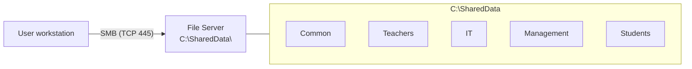

# File Server and NTFS Permissions

Every organisation shares files — documents, spreadsheets, project folders. How that sharing happens is the difference between a working IT environment and a breach waiting to happen.

Common bad patterns:

- Passing files on USB sticks (virus risk, version chaos)
- Emailing attachments (size limits, stale copies)
- Personal Google Drive / OneDrive accounts (no central control, no backup, no audit)

The right pattern is a **File Server**: shared folders that live on a server, governed by NTFS permissions, backed up as a unit, and scanned centrally.

## How a file server works

Clients talk to the file server over SMB (Server Message Block) on **TCP 445**.



From the client side, `\\DC01\SharedData` opens an SMB session to the server.

## Creating a share

Create the physical folders first, then share them.

```powershell
New-Item -Path "C:\SharedData" -ItemType Directory -Force

'Common','Teachers','IT','Management','Students' | ForEach-Object {
    New-Item -Path "C:\SharedData\$_" -ItemType Directory -Force
}
```

Three ways to publish the share:

### GUI — folder properties

Right-click the folder → **Properties → Sharing → Advanced Sharing** → tick **Share this folder**, set the **Share name**, and click **Permissions**. The common recommendation is to set Share permissions to `Everyone: Full Control` and then do the real access control at the NTFS layer (explained below).

### GUI — Server Manager

**Server Manager → File and Storage Services → Shares → Tasks → New Share → SMB Share – Quick**. Pick the path, share name, and permissions. This is the path that also exposes advanced options like Access-Based Enumeration.

### PowerShell

```powershell
New-SmbShare `
    -Name "SharedData" `
    -Path "C:\SharedData" `
    -FullAccess "EXAMPLE\Domain Admins" `
    -ChangeAccess "EXAMPLE\Domain Users"

# Per-department shares
New-SmbShare -Name "IT-Files"  -Path "C:\SharedData\IT"       -FullAccess "EXAMPLE\GRP-IT-Admins"
New-SmbShare -Name "Teachers"  -Path "C:\SharedData\Teachers" -FullAccess "EXAMPLE\GRP-Teachers"
```

### Connecting from a client

```
\\DC01\SharedData       (Run / Explorer address bar)
```

```powershell
New-PSDrive -Name "S" -PSProvider FileSystem -Root "\\DC01\SharedData" -Persist
# or
net use S: \\DC01\SharedData /persistent:yes
```

GPO drive mapping for automatic mounting is covered in the **Group Policy** lesson.

### Hidden shares

Adding `$` to the end of the share name hides it from network browsing — you need to know the full UNC path to reach it.

```powershell
New-SmbShare -Name "AdminFiles$" -Path "C:\AdminData" -FullAccess "EXAMPLE\Domain Admins"
# Access: \\DC01\AdminFiles$
```

Windows built-in hidden shares (`C$`, `D$`, `ADMIN$`, `IPC$`) exist for administrators and are controlled by `LocalAccountTokenFilterPolicy` / UAC remote restrictions.

### Management commands

```powershell
Get-SmbShare                               # all shares
Get-SmbShare -Name "SharedData" | fl *     # details
Get-SmbShareAccess -Name "SharedData"      # share ACL
Grant-SmbShareAccess -Name "SharedData" -AccountName "EXAMPLE\Domain Users" -AccessRight Change -Force
Revoke-SmbShareAccess -Name "SharedData" -AccountName "EXAMPLE\Domain Guests" -Force

Get-SmbSession      # who is currently connected
Get-SmbOpenFile     # which files are open, by whom
```

## Share permissions vs NTFS permissions

This is the single most misunderstood concept in Windows file sharing. **Both are evaluated, and the more restrictive one wins.**

| Aspect | Share permissions | NTFS permissions |
| --- | --- | --- |
| Apply when | Only over the network | Locally and over the network |
| Granularity | 3 levels: Read, Change, Full Control | 13+ granular rights |
| Scope | The folder only | Per-folder and per-file |
| Inheritance | None | Yes, flows to sub-items |

Combined effect (most restrictive wins):

| Share | NTFS | Effective over network |
| --- | --- | --- |
| Full Control | Read | Read |
| Read | Full Control | Read |
| Change | Modify | Modify |
| Full Control | Full Control | Full Control |

Because of this, the common best practice is to set Share to `Everyone: Full Control` (or `Authenticated Users: Full Control`) and enforce real access at the NTFS layer — one ACL to manage instead of two that need to agree.

## NTFS permission levels

Standard (basic) permissions cover almost all day-to-day needs:

| Permission | Read | Write | Execute | Delete | Change perms |
| --- | --- | --- | --- | --- | --- |
| Full Control | Yes | Yes | Yes | Yes | Yes |
| Modify | Yes | Yes | Yes | Yes | No |
| Read & Execute | Yes | No | Yes | No | No |
| List Folder Contents | Folders only | No | Yes | No | No |
| Read | Yes | No | No | No | No |
| Write | No | Yes | No | No | No |

Under the hood each standard permission is a combination of **advanced permissions** (Traverse Folder, Read Data, Write Attributes, Delete Subfolders and Files, etc.). Advanced permissions are rarely needed outside very specific scenarios.

### Allow vs Deny

Each ACE is either Allow or Deny. **Deny always wins over Allow**. A user in both `Teachers Allow Read` and `Exam Cheaters Deny Read` ends up with no read access.

Deny is almost always the wrong tool — prefer simply *not granting* Allow. Reserve Deny for genuine exception rules on top of a broader Allow.

## Setting NTFS permissions

### GUI

Right-click the folder → **Properties → Security → Edit → Add** → type the user or group, `Check Names`, OK. Tick the permissions and Apply.

### PowerShell

Example — `C:\SharedData\Teachers` where teachers have Modify, students have Read, IT admins have Full Control:

```powershell
$path = "C:\SharedData\Teachers"
$acl  = Get-Acl $path

function Add-NtfsRule {
    param($Acl, $Identity, $Rights)
    $rule = New-Object System.Security.AccessControl.FileSystemAccessRule(
        $Identity, $Rights,
        "ContainerInherit,ObjectInherit", "None", "Allow")
    $Acl.AddAccessRule($rule)
}

Add-NtfsRule $acl "EXAMPLE\GRP-Teachers"  "Modify"
Add-NtfsRule $acl "EXAMPLE\GRP-Students"  "Read"
Add-NtfsRule $acl "EXAMPLE\GRP-IT-Admins" "FullControl"

Set-Acl $path $acl
```

Verify with:

```powershell
icacls "C:\SharedData\Teachers"
```

## Inheritance

By default a child folder **inherits** its parent's permissions.

```
C:\SharedData\              Domain Users : Read
├── Common\                 inherited: Domain Users : Read
├── Teachers\               inherited: Domain Users : Read   <- plus explicit Modify for Teachers
└── IT\                     inherited: Domain Users : Read   <- might break inheritance
```

View inheritance: **Properties → Security → Advanced → "Inherited from"** column. `Parent Object` = inherited; `None` = explicit.

### Breaking inheritance

When a subfolder should not inherit: **Advanced → Disable inheritance**. Two options:

- **Convert inherited permissions into explicit permissions on this object** — keep a snapshot of current access and edit from there. Safer default.
- **Remove all inherited permissions from this object** — blank slate. Easy to lock yourself and Administrators out; use with care.

```powershell
$acl = Get-Acl "C:\SharedData\IT"
# $true, $true = protect, preserve current permissions (Convert)
# $true, $false = protect, remove inherited (Remove)
$acl.SetAccessRuleProtection($true, $true)
Set-Acl "C:\SharedData\IT" $acl
```

### Effective Access

To see what a user *actually* gets after every rule and inheritance is evaluated: **Properties → Security → Advanced → Effective Access**, pick a user, view effective access.

From the command line:

```
icacls "C:\SharedData\Teachers"
```

Reading `icacls` flags:

| Flag | Meaning |
| --- | --- |
| `(F)` | Full Control |
| `(M)` | Modify |
| `(RX)` | Read & Execute |
| `(R)` | Read |
| `(W)` | Write |
| `(OI)` | Object Inherit — applies to files |
| `(CI)` | Container Inherit — applies to subfolders |
| `(IO)` | Inherit Only — does not apply to this object |
| `(NP)` | No Propagate — only one level down |

## Ownership

Every file and folder has an **owner**, who can always change permissions — even without Full Control. By default the creator is the owner.

Change ownership:

```powershell
$acl  = Get-Acl "C:\SharedData\IT"
$acl.SetOwner([System.Security.Principal.NTAccount]"EXAMPLE\r.huseynov")
Set-Acl "C:\SharedData\IT" $acl
```

Local Administrators can always **take ownership** of any object. That is a security feature: no user can hide a file from a domain admin indefinitely.

## End-to-end example

Department layout:

```
C:\SharedData\
├── Common          everyone read + write
├── Teachers        teachers read + write, students read
├── IT              IT admins only
├── Management      management + IT admins read
└── StudentWork     students read + write, teachers read
```

Share once at the top; enforce everything with NTFS:

```powershell
New-SmbShare -Name "SharedData" -Path "C:\SharedData" `
  -FullAccess "Everyone" -FolderEnumerationMode AccessBased

function Grant-Access {
    param($Path, $Identity, $Rights)
    $acl = Get-Acl $Path
    $rule = New-Object System.Security.AccessControl.FileSystemAccessRule(
        $Identity, $Rights, "ContainerInherit,ObjectInherit", "None", "Allow")
    $acl.AddAccessRule($rule)
    Set-Acl $Path $acl
}

Grant-Access "C:\SharedData\Common"      "EXAMPLE\Domain Users"    "Modify"
Grant-Access "C:\SharedData\Teachers"    "EXAMPLE\GRP-Teachers"    "Modify"
Grant-Access "C:\SharedData\Teachers"    "EXAMPLE\GRP-Students"    "Read"
Grant-Access "C:\SharedData\IT"          "EXAMPLE\GRP-IT-Admins"   "FullControl"
Grant-Access "C:\SharedData\Management"  "EXAMPLE\Domain Admins"   "FullControl"
Grant-Access "C:\SharedData\Management"  "EXAMPLE\GRP-IT-Admins"   "Read"
Grant-Access "C:\SharedData\StudentWork" "EXAMPLE\GRP-Students"    "Modify"
Grant-Access "C:\SharedData\StudentWork" "EXAMPLE\GRP-Teachers"    "Read"
```

## Access-Based Enumeration (ABE)

Without ABE, a user sees **every** subfolder inside a share, even ones they can't open. With ABE, users only see the folders they have permission to read.

```
ABE off (default)           ABE on
\\DC01\SharedData\          \\DC01\SharedData\
├── Common           OK     ├── Common           OK
├── Teachers         OK     ├── Teachers         OK
├── IT               visible but denied     (IT is hidden for non-members)
├── Management       visible but denied     (Management hidden)
└── StudentWork      OK     └── StudentWork      OK
```

Enable it:

```powershell
Set-SmbShare -Name "SharedData" -FolderEnumerationMode AccessBased -Force
```

Or in **Server Manager → File and Storage Services → Shares → Properties → Settings → Enable access-based enumeration**.

Best practice: on by default for every content share. There is no good reason for users to see folder names they will never be allowed to open.

## Quotas and file screening (FSRM)

**File Server Resource Manager** adds quotas, file screening, and reporting on top of a plain file server.

```powershell
Install-WindowsFeature FS-Resource-Manager -IncludeManagementTools
```

### Quota

A per-folder cap on disk usage. Without it, one user can fill the volume with movies.

```powershell
New-FsrmQuota `
  -Path "C:\SharedData\StudentWork" `
  -Size 5GB `
  -Description "5 GB limit per student work share"
```

Two flavours:

- **Hard quota** — the limit cannot be exceeded. Writes past the limit fail.
- **Soft quota** — the limit is advisory. Users can write past it; you get notified.

Thresholds at 80 / 90 / 100% can trigger email, event log, or script actions.

### File screening

Block file types from being written to a path — for example, no `.mp3`, `.mp4`, `.avi`, `.exe`, or `.torrent` in user shares.

```powershell
New-FsrmFileScreen -Path "C:\SharedData\StudentWork" `
  -Template "Block Audio and Video Files"
```

Custom templates let you define your own group of blocked extensions.

## PowerShell cheat sheet

```powershell
# --- Shares ---
New-SmbShare -Name "Name" -Path "C:\Path" -FullAccess "EXAMPLE\Group"
Get-SmbShare
Set-SmbShare -Name "Name" -FolderEnumerationMode AccessBased -Force
Get-SmbSession            # active connections
Get-SmbOpenFile           # files in use

# --- NTFS ---
icacls "C:\Path"
icacls "C:\Path" /grant "EXAMPLE\User:(OI)(CI)(M)"
icacls "C:\Path" /remove "EXAMPLE\User"
icacls "C:\Path" /reset

# --- Ownership ---
icacls "C:\Path" /setowner "EXAMPLE\Admin"

# --- Client ---
net use S: \\DC01\SharedData
net use S: /delete

# --- FSRM ---
New-FsrmQuota      -Path "C:\..." -Size 5GB
New-FsrmFileScreen -Path "C:\..." -Template "Block Audio and Video Files"
```

## Practical takeaways

- One share at the top, control at the NTFS layer — don't split access rules across both
- Apply permissions to **groups**, never individual users
- Enable Access-Based Enumeration on every content share — no good comes from showing folders users can't open
- Prefer not-granting-Allow over explicit Deny
- Turn on FSRM quotas from day one on user shares; one movie collection can fill a volume
- Turn on auditing for sensitive shares so you can answer "who deleted this?" later
- Document the intended ACL for each share — a folder with unknown history is a folder no one dares change

## Useful links

- File server overview: [https://learn.microsoft.com/en-us/windows-server/storage/file-server/file-server-smb-overview](https://learn.microsoft.com/en-us/windows-server/storage/file-server/file-server-smb-overview)
- SMB shares with PowerShell: [https://learn.microsoft.com/en-us/powershell/module/smbshare/](https://learn.microsoft.com/en-us/powershell/module/smbshare/)
- NTFS permissions reference: [https://learn.microsoft.com/en-us/previous-versions/windows/it-pro/windows-server-2003/cc783530(v=ws.10)](https://learn.microsoft.com/en-us/previous-versions/windows/it-pro/windows-server-2003/cc783530(v=ws.10))
- FSRM overview: [https://learn.microsoft.com/en-us/windows-server/storage/fsrm/fsrm-overview](https://learn.microsoft.com/en-us/windows-server/storage/fsrm/fsrm-overview)
