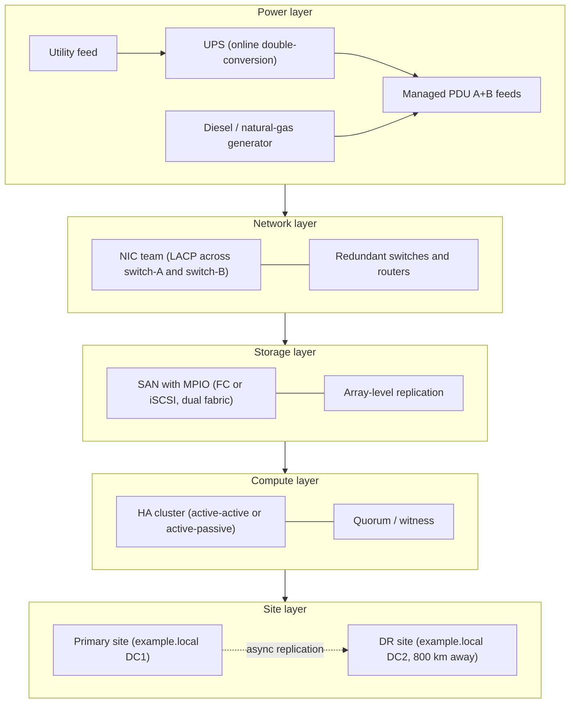

# Resilience and High Availability

Backup is what you do for *after* something goes wrong. Resilience is what you do so the service keeps running *during* a failure. They are different disciplines and a serious operation needs both.

A typical morning at `example.local` involves a UPS battery dropping a self-test alarm, a NIC link flapping on `FS01`, and a SAN path going amber on a Hyper-V host. None of this should make a single user notice. That property — that one component can die without anyone outside the ops team finding out — is what resilience buys you.

> Backup answers "can we get the data back?" Resilience answers "did the user even notice?"

For data-loss recovery, see [backup](./backup.md). For redundant disk groups inside a single server, see [RAID](../../general-security/raid.md). For traffic distribution and load balancers, see [network devices](../../networking/foundation/network-devices.md). This page is about everything else: power, network paths, storage paths, replication, sites, and clustering.

## Why this matters

A backup proves you can rebuild. Resilience prevents the rebuild from being needed today. Consider an `example.local` rack at 03:00 on a Saturday:

- The utility feed drops a phase. The UPS picks up the load in a single AC cycle. Five minutes later the diesel generator starts and takes over. Nobody pages anyone.
- A top-of-rack switch port for `DC01` fails. NIC teaming on the server detects link loss and shifts traffic to the second NIC, which is plugged into a different switch. AD authentication keeps working.
- A controller on the SAN reboots for a firmware update. MPIO on every host drops the failed path and continues over the surviving one. SQL Server logs a brief I/O latency spike and moves on.

Each of those is a real outage at the component level. The resilience stack is what stops them from becoming an outage at the *service* level.

## Cybersecurity resilience

Resilience is the design property that lets a system absorb a fault and return to nominal operation. It is broader than redundancy — redundancy is one of the techniques used to achieve it.

NIST puts resilience squarely inside the **Recover** function of the Cybersecurity Framework (CSF), alongside **Identify, Protect, Detect, and Respond**. NIST SP 800-34 (contingency planning) and SP 800-160 vol. 2 (cyber resilience engineering) treat resilience as the union of:

- **Anticipate** — design for known failure modes
- **Withstand** — keep operating while degraded
- **Recover** — return to full performance after the event
- **Adapt** — improve based on what was learned

| Concept | Question it answers | Example |
| --- | --- | --- |
| **Reliability** | Will it work when I ask it to? | A disk that runs for five years without errors |
| **Availability** | What fraction of the time is it up? | 99.9% (about 8.7 hours of downtime per year) |
| **Resilience** | Can it survive a fault and continue? | One PSU dies, server keeps running on the other |
| **Recovery** | Can we get back after a fault? | Restore from backup, rebuild the cluster |

The trap is to confuse high availability with resilience. A four-node cluster behind a load balancer has high uptime numbers, but if all four nodes are in the same rack on the same circuit, a single PDU trip takes the whole service down. True resilience means failure modes are independent across layers — power, network, storage, compute, and site.

## Geographic dispersal

A single facility, no matter how well engineered, is one fire / flood / fibre cut away from total loss. Geographic dispersal is the practice of running infrastructure in physically separate locations so no one event can take all of it out.

### Site tiers

The DR industry uses three classic labels for secondary sites:

| Site type | Hardware | Data | RTO | Cost |
| --- | --- | --- | --- | --- |
| **Hot** | Identical to production, running | Continuously replicated | Minutes | Highest |
| **Warm** | Provisioned but idle / minimal | Replicated daily or more | Hours | Medium |
| **Cold** | Empty space + power + network | Restored from backup tape | Days | Lowest |

A regulated bank might run hot-hot. A regional engineering firm might run hot-warm with async storage replication. A small office might be content with cold + offsite cloud backup.

### Active-active vs active-passive at the site level

Once you have two sites, you choose how they share the workload:

- **Active-active multi-region** — both sites serve traffic at all times; a failure removes capacity but no service. Requires careful data consistency design (synchronous replication, conflict resolution, or session-affinity routing).
- **Active-passive DR** — primary serves traffic, secondary is kept in sync but idle until failover. Simpler, cheaper, but the secondary spends most of its life unproven.

### Distance and latency

Geographic dispersal is not free — the speed of light in fibre is roughly 200 km/ms round-trip. Synchronous replication wants under ~5 ms RTT, which caps useful sync distance at around 100 km. Anything farther becomes asynchronous by physics.

Pick distance against the threats you actually face: a fire across the street is enough for "different building," a regional flood needs a different city, a national grid event needs a different country.

## Multipath I/O (MPIO)

Between a server and its block storage there is an I/O fabric — Fibre Channel, iSCSI, SAS, FCoE, or NVMe-oF. Each fabric has switches, cables, HBAs, and storage controllers, and any one of those can fail. Multipath I/O presents the *same LUN* to the OS over multiple physical paths and decides per-I/O which path to use.

MPIO buys two things:

- **Failover** — if one path goes down, I/O continues on the survivor
- **Load distribution** — multiple paths can be used in parallel for higher throughput

### Where MPIO lives

| Platform | Component | Notes |
| --- | --- | --- |
| **Windows Server** | MPIO feature + DSM (Device-Specific Module) | `Install-WindowsFeature Multipath-IO`; vendor DSMs from HPE/Dell/Pure plug in |
| **Linux** | `device-mapper-multipath` (DM-Multipath) | `/etc/multipath.conf`, `multipath -ll` to view paths |
| **VMware vSphere** | Native Multipathing Plug-in (NMP) + SATP/PSP | `esxcli storage nmp` family |
| **Storage array** | ALUA (Asymmetric Logical Unit Access) | Tells host which paths are optimised vs non-optimised |

### Path selection policies

| Policy | Behaviour | When to use |
| --- | --- | --- |
| **Failover only / Fixed** | One preferred path; switch only on failure | Active-passive arrays without ALUA |
| **Round Robin** | Rotate I/O across all active paths | Most modern AFAs (all-flash arrays) |
| **Least Queue Depth** | Pick the path with the fewest outstanding I/Os | Mixed-load environments |
| **Weighted Paths** | Manual priorities | Asymmetric link speeds |

A common deployment: two HBAs on the host, two fabrics (SAN-A and SAN-B), two controllers on the array, four paths total per LUN, round-robin policy, ALUA-aware DSM. Pulling any one cable, switch, or controller does not interrupt I/O.

## NIC teaming and link aggregation

A server with two physical network adapters can present a single logical interface to the OS. The team handles failover and, depending on mode, also load distribution.

### Teaming modes

| Mode | Standard | Switch involvement | Load balancing |
| --- | --- | --- | --- |
| **Active-backup** | None — host-side only | None | No (only one NIC active at a time) |
| **Switch-independent / Round Robin** | None | None | Per-packet or per-flow on the host |
| **LACP (802.3ad)** | IEEE 802.3ad | Yes — switch must be configured | Hash-based across all members |
| **Static / manual** | None | Yes — manually assigned | Hash-based, no negotiation |
| **PAgP** | Cisco proprietary | Yes — Cisco switches only | Auto-negotiated EtherChannel |

LACP is the open-standard answer and works across vendors. PAgP is Cisco's older, proprietary equivalent — same idea, but only between Cisco devices that both speak it. New deployments should use LACP unless you have a specific Cisco-only constraint.

### Single point of failure trap

NIC teaming with both cables in the *same switch* protects against a NIC failure but not a switch failure. Plug each NIC into a different switch (and configure MLAG / VPC / stacking on the switch side so LACP works across them) — that is the only way to survive a switch outage.

```
         host: team0 (LACP)
            |        |
        NIC eth0   NIC eth1
            |        |
        switch-A  switch-B           <- different switches, MLAG between them
            |        |
              core
```

## Power redundancy

Power is the foundation of the resilience stack. If the rack loses power, nothing above it matters. Four overlapping techniques:

### UPS (uninterruptible power supply)

A UPS bridges the seconds-to-minutes gap between utility loss and either generator start or graceful shutdown.

- **Sizing** — rated in **kVA** (apparent power) and **runtime at load**. A 10 kVA UPS at 80% load is feeding 8 kW; runtime falls fast as load rises.
- **Topology** — *online* (double-conversion, always inverting, conditions power) is the gold standard for servers. *Line-interactive* and *standby* are cheaper but expose the load to the transition glitch.
- **Runtime target** — typically 15-30 minutes in an enterprise rack. Long enough for the generator to start, or for hosts to gracefully shut down if it does not.
- **Maintenance** — battery self-test monthly, full load test annually. Lithium UPSs need less attention than VRLA but still need monitoring.

### Generator

When utility power is gone for hours, the UPS battery runs out. A generator provides indefinite runtime as long as fuel is available.

| Fuel | Pros | Cons |
| --- | --- | --- |
| **Diesel** | Energy-dense, long shelf life of fuel | Fuel polishing needed; emissions rules; weekly test runs |
| **Natural gas** | Piped supply (no on-site tank to refill) | Depends on the gas grid surviving the same event |
| **Propane** | Stored on-site like diesel; cleaner burn | Lower energy density |

Generators must be **load-tested** regularly — running unloaded for ten minutes a month proves the engine starts but not that it can carry the actual datacenter load.

### Dual power supplies (A+B feeds)

Server PSUs fail more often than the boards they power. A modern server has two hot-swappable PSUs and ideally each plugs into a *different* PDU on a *different* circuit, fed from a *different* UPS branch.

```
  utility -----+-----------+----- utility (or generator)
               |           |
              UPS-A       UPS-B
               |           |
              PDU-A       PDU-B            <- A+B feeds
               |           |
            PSU-1        PSU-2             <- both PSUs in the same server
                  server
```

Pulling either PDU does nothing. Pulling both kills the server.

### Managed PDU

The PDU is the strip the servers plug into. A *managed* PDU adds:

- **Per-outlet remote switching** — power-cycle a hung server from your laptop
- **Per-outlet current monitoring** — spot a server drawing far more than its peers
- **Aggregate phase load** — keep the rack balanced across legs of three-phase power
- **Environmental sensors** — temperature/humidity at the rack
- **Alerts** — email / SNMP / syslog when current exceeds a threshold or an outlet trips

A populated rack can pull 10-30 kVA. Without a managed PDU, you have no idea which servers are the hot ones until something melts.

## Replication patterns

Replication keeps a second copy of *live* data continuously up to date. It is a resilience tool, not a backup tool — see [backup](./backup.md) for why deletions and ransomware faithfully replicate.

| Mode | How it works | RPO | Latency cost | Typical use |
| --- | --- | --- | --- | --- |
| **Synchronous** | Write returns to the app only when both sites have it on disk | Zero | Adds round-trip latency to every write | Metro / campus, sub-5 ms RTT |
| **Asynchronous** | Primary acknowledges immediately; secondary catches up | Seconds to minutes | None on the write path | Cross-region, WAN |
| **Snapshot-based** | Periodic point-in-time copies shipped to the secondary | Snapshot interval (15 min, 1 h, 24 h) | None | DR, ransomware-resistant copies |

Snapshot-based replication is also the foundation of "immutable secondary" patterns — the snapshots on the DR array are read-only and survive even if the primary is encrypted by ransomware.

Common technologies in an `example.local` environment:

- **Storage Replica** (Windows Server) for volume-level sync or async mirroring
- **Hyper-V Replica** for VM-level async replication
- **DFS Replication** for file shares — see [file server](./file-server-ntfs.md)
- **AD multi-master replication** between domain controllers — see [AD DS](../active-directory/active-directory-domain-services.md)
- **SAN-to-SAN array replication** (HPE Peer Persistence, Dell PowerStore Metro, Pure ActiveCluster)

## Storage Area Network (SAN)

A SAN is a dedicated, high-speed network that presents block storage to servers. Servers see SAN-attached storage as if it were local disks (LUNs), but the actual storage lives in a shared array that many hosts can connect to.

### Transport protocols

| Protocol | Layer | Speed today | Notes |
| --- | --- | --- | --- |
| **Fibre Channel (FC)** | Dedicated FC fabric | 16/32/64 Gb/s | Lowest latency, separate cabling |
| **iSCSI** | TCP/IP over Ethernet | 10/25/100 GbE | Cheaper, runs on existing network gear |
| **FCoE** | FC frames over Ethernet | 10-100 GbE | Less common today, mostly legacy |
| **NVMe-oF** | NVMe over FC, RoCE, or TCP | 25-200 GbE | Lowest latency, taking over high-performance workloads |

A typical SAN rack: redundant FC switches in two fabrics (SAN-A and SAN-B), each host with two HBAs (one per fabric), each array controller with ports in both fabrics. MPIO ties it all together — pulling any one switch, cable, HBA, or controller is a non-event.

### LUN masking and zoning

A SAN is a shared resource, so it has to enforce isolation:

- **Zoning** — done on the FC switch; controls which initiator (HBA WWN) can see which target (array port WWN)
- **LUN masking** — done on the array; controls which LUN is visible to which initiator

Both must be configured correctly or two unrelated hosts can write to the same LUN and corrupt each other's filesystems.

## NAS vs SAN

NAS (Network Attached Storage) and SAN look similar from far away — both put storage on the network — but they operate at different layers.

| Property | NAS | SAN |
| --- | --- | --- |
| **Access level** | File | Block |
| **Protocol** | SMB, NFS | FC, iSCSI, NVMe-oF |
| **Client sees** | A network share | A local disk / LUN |
| **Filesystem owner** | The NAS device | The client OS |
| **Concurrent multi-host** | Native (it is the point) | Needs a cluster filesystem (CSV, VMFS, GFS2) |
| **Typical use** | User shares, home directories, backup target | VM datastores, databases, transactional workloads |
| **Typical latency** | Higher (TCP, file-level) | Lower (block, often dedicated fabric) |

Pick NAS when several clients need to share the same files. Pick SAN when a server needs raw block storage that behaves like a local disk and the workload is latency-sensitive. Many environments run both — see [storage and filesystems](./storage-filesystems-servers.md) for the broader storage taxonomy.

## High availability clustering

Clustering is what turns "two servers" into "one service that survives a server failure." Two patterns dominate.

### Active-active

All cluster nodes serve traffic at all times. The cluster software handles distribution (or a load balancer in front of it does — see [network devices](../../networking/foundation/network-devices.md)).

- **Pros** — every node's hardware is doing useful work; failure removes capacity but not service
- **Cons** — needs a workload that can be split safely (stateless web tier, sharded database, parallel app servers); requires careful data-consistency design
- **Examples** — web farms behind a load balancer, Exchange DAG with multiple active mailbox copies, SQL Server Always On read-scale

### Active-passive (failover)

One node runs the workload; the other(s) sit idle waiting to take over.

- **Pros** — simple model; works for legacy workloads that cannot run in two places at once (a single SQL writer, a stateful file server)
- **Cons** — half (or more) of the hardware is idle most of the time; the standby is unproven until failover happens
- **Examples** — Windows Server Failover Cluster (WSFC) with a single role, classic SQL Server Failover Cluster Instance, file server cluster

### Shared storage vs shared-nothing

| Pattern | How nodes see data | Failure model |
| --- | --- | --- |
| **Shared storage** | All nodes mount the same SAN LUN (CSV in WSFC, VMFS in vSphere) | Any node can pick up any role |
| **Shared-nothing** | Each node owns a local copy; data is replicated between them | Storage Spaces Direct (S2D), Galera, modern NoSQL |

Shared storage needs MPIO and a SAN. Shared-nothing trades the SAN for a faster east-west network and replication.

### Quorum and split-brain

The deadliest cluster failure is **split-brain** — both halves of the cluster lose contact with each other, each decides it is the survivor, and both start writing. Recovery from that is messy and often involves data loss.

The defence is **quorum** — a voting mechanism that ensures only one partition can be active at a time. Common approaches:

- **Node majority** — needs more than half the nodes alive (works for odd counts)
- **Node + disk majority** — adds a witness disk on shared storage
- **Node + file share witness** — adds a witness on an SMB share (cheap, off the cluster)
- **Cloud witness** (Azure / S3) — a tiny blob in cloud storage that acts as a tiebreaker

A two-node cluster with no witness is a split-brain incident waiting to happen. Always configure a witness.

## Resilience stack

The layers stack from the wall socket up to the user:



Each layer's failure must be independent of the layers below it. A single tripped breaker that takes out both A and B feeds is a layering bug, not a power problem.

## Hands-on / practice

1. **NIC teaming on Windows Server.** On a server with two NICs, configure a **LACP team** via Server Manager (or `New-NetLbfoTeam` in PowerShell). Plug each NIC into a different switch (or a switch that supports MLAG). Pull one cable while a continuous `ping -t` runs from another host — verify zero (or one) lost packets and that traffic continues on the survivor.
2. **Linux DM-Multipath against a test iSCSI target.** Install `multipath-tools`, point the initiator at an iSCSI target advertised on two interfaces, edit `/etc/multipath.conf` for your array, run `multipath -ll`, and confirm two active paths. Disable one initiator NIC and watch the path drop.
3. **UPS sizing for a 10 kW rack.** A rack draws 10 kW (12.5 kVA at 0.8 PF). Compute the UPS rating needed for 80% loaded operation, plus the runtime in minutes assuming a 15 kVA UPS with a 30-minute autonomy curve. Document the assumptions: efficiency, end-of-discharge voltage, battery age derating.
4. **Two-node Hyper-V failover cluster with shared CSV storage.** Build two Hyper-V hosts joined to `example.local`, present a shared LUN over iSCSI, run the Failover Cluster validation wizard, create the cluster with a file-share witness, and add the LUN as a Cluster Shared Volume. Migrate a running VM between nodes (Live Migration) to verify there is no downtime.
5. **Active-passive failover by pulling a power cord.** With the cluster from exercise 4 active on Node-A, physically pull *one* of Node-A's PSU cables (do not kill the whole node — that is exercise 4b). Verify the second PSU keeps the node alive. Then unplug both, and watch the cluster fail the VM over to Node-B. Time the outage.

## Worked example — building a regional DR site

`example.local` runs a single datacenter (DC1) in the city centre. Compliance reviewers ask: what survives a city-wide event?

**Design.** Add a secondary datacenter (DC2) in another region, 800 km away, connected by a redundant 1 Gb/s WAN.

| Layer | Primary (DC1) | Secondary (DC2) | Mechanism |
| --- | --- | --- | --- |
| **Power** | Utility + UPS + diesel generator | Utility + UPS + diesel generator | Independent grids |
| **Network** | Dual ISPs, BGP-routed | Dual ISPs, BGP-routed | DNS flip on failover |
| **Storage** | All-flash SAN | All-flash SAN | Async array replication, 15-min RPO |
| **AD** | DC01, DC02 (full DCs) | DC03 (full DC in DC2 site) | Native AD multi-master replication |
| **VM workloads** | Hyper-V cluster, ~40 VMs | Hyper-V cluster, idle | Hyper-V Replica every 5 min |
| **DNS / public entry** | `app.example.local` → DC1 VIP | Pre-staged record at DC2 VIP | DNS TTL = 60 s, manual cutover |

**Targets.** RPO 15 minutes (acceptable: lose at most last quarter-hour of writes). RTO 4 hours (manual cutover, ops team needs time to verify integrity before flipping DNS).

**Failover drill (run quarterly).**

1. Declare a simulated DC1 outage at 09:00 on a Saturday.
2. Stop replication to capture the consistent point-in-time on DC2.
3. Promote DC2 storage replicas to read-write.
4. Bring up VMs on the DC2 Hyper-V cluster from their replica copies.
5. Verify AD on DC03 is healthy and the FSMO roles can be seized.
6. Flip the DNS record for `app.example.local` to the DC2 VIP.
7. Have a test user from outside the office network access the service and confirm it works.
8. Document elapsed time, anything that broke, and feed it back into the runbook.

The first drill of any DR site always finds something — a missing firewall rule, a forgotten certificate, an undocumented dependency on a service that lives only in DC1. That is the point.

## Troubleshooting and pitfalls

- **HA cluster never tested.** A cluster you have not failed over in a year is hope, not high availability. Schedule controlled failovers monthly.
- **NIC team on a single switch.** Both NICs in the same physical switch survives a NIC failure, not a switch failure. Cross switches.
- **LACP misconfigured between vendors.** Mismatched hash modes or unsupported LAG IDs cause flapping. Use LACP, match modes on both ends, and watch interface counters.
- **UPS not load-tested in 5 years.** Batteries age silently. A self-test passes a no-load check; a real outage with a full rack pulls more current than the UPS can sustain. Annual full-load test is the only proof.
- **Generator never run under load.** A weekly no-load start proves the engine cranks. It does not prove the alternator can carry 50 kW for six hours. Run a *loaded* test at least annually.
- **A+B feeds plugged into the same PDU.** Surprisingly common in racks built in a hurry. Trace each cord back to its source.
- **"Geo-redundant" really being two racks in same building.** If the secondary is on the same power feed and the same fibre entry, it is not geo-redundant.
- **Async replication losing the trickle of in-flight writes during failover.** Last few seconds of writes never made it. Document the RPO honestly and design for it.
- **Split-brain when quorum is lost.** Two-node clusters with no witness, or witnesses that share a failure domain with the cluster. Always have an independent witness.
- **MPIO with the wrong path-policy.** Round-robin on an active-passive array hammers both controllers and one of them rejects every other I/O. Match the policy to what the array advertises (ALUA SATP).
- **Dual PSUs from the same circuit.** Same rack-strip, same breaker. One trip kills both.
- **Storage replica without bandwidth headroom.** WAN saturates during a heavy write burst, replication falls behind, RPO silently doubles.
- **DNS TTL too long for failover.** A 24-hour TTL means clients still hit the dead site for a day after you flip the record. Use 60-300 s on records that participate in DR.
- **AD time skew between sites.** Kerberos breaks at >5 minutes of drift. Make sure both sites are NTP-synced to the same trusted source.
- **Forgetting to update firewall rules at the DR site.** The primary's rules grew over time; the DR copy is six months out of date. Treat firewall config as code and replicate it.
- **Quorum witness on the same SAN as the cluster.** Witness should fail independently of the data. A file-share or cloud witness is usually safer than a disk witness on the same array.
- **Single ISP per site.** "Dual datacenter" with one upstream provider per site is one BGP misconfig away from a regional outage.
- **No documented runbook for the failover.** When DC1 is on fire at 02:00, the ops team needs a step-by-step, not a whiteboard discussion.

## Key takeaways

- Resilience is for during a failure; backup is for after. You need both.
- Build the resilience stack from the ground up: power -> network -> storage -> compute -> site. Each layer must fail independently of the one above and below it.
- LACP is the open-standard NIC teaming protocol. PAgP is Cisco-only. Cross your team across two switches or you have a single point of failure.
- MPIO is mandatory on any production SAN host. Match the path-selection policy to what the array advertises (ALUA, active-active, active-passive).
- Power redundancy is four overlapping layers: UPS for seconds, generator for hours, dual supplies for component failure, managed PDU for visibility and remote control.
- Synchronous replication = zero RPO, latency cost. Async = small RPO, no latency cost. Snapshots = strongest defence against logical corruption and ransomware.
- SAN gives you shared block storage with MPIO; NAS gives you shared files. They solve different problems.
- Active-active for capacity, active-passive for simplicity. Both need a quorum witness to avoid split-brain.
- Geographic dispersal must be far enough that a single event cannot destroy both sites. The first drill always finds something — that is why you drill.
- An untested resilience plan is a story, not a control.

## References

- NIST SP 800-34 Rev. 1, *Contingency Planning Guide for Federal Information Systems* — [https://csrc.nist.gov/pubs/sp/800/34/r1/upd1/final](https://csrc.nist.gov/pubs/sp/800/34/r1/upd1/final)
- NIST SP 800-160 Vol. 2 Rev. 1, *Developing Cyber-Resilient Systems* — [https://csrc.nist.gov/pubs/sp/800/160/v2/r1/final](https://csrc.nist.gov/pubs/sp/800/160/v2/r1/final)
- NIST Cybersecurity Framework (CSF) 2.0 — Recover function — [https://www.nist.gov/cyberframework](https://www.nist.gov/cyberframework)
- IEEE 802.3ad / 802.1AX (Link Aggregation) — [https://standards.ieee.org/ieee/802.1AX/7430/](https://standards.ieee.org/ieee/802.1AX/7430/)
- CIS Benchmarks (storage and OS hardening) — [https://www.cisecurity.org/cis-benchmarks](https://www.cisecurity.org/cis-benchmarks)
- Microsoft MPIO overview — [https://learn.microsoft.com/en-us/windows-server/storage/mpio/mpio-overview](https://learn.microsoft.com/en-us/windows-server/storage/mpio/mpio-overview)
- Microsoft Failover Clustering quorum modes — [https://learn.microsoft.com/en-us/windows-server/failover-clustering/manage-cluster-quorum](https://learn.microsoft.com/en-us/windows-server/failover-clustering/manage-cluster-quorum)
- HPE Storage user guides (3PAR / Primera / Alletra Peer Persistence) — [https://www.hpe.com/info/storage](https://www.hpe.com/info/storage)
- Dell PowerStore / PowerMax replication docs — [https://www.dell.com/support](https://www.dell.com/support)
- Pure Storage ActiveCluster documentation — [https://support.purestorage.com](https://support.purestorage.com)
- See also: [backup](./backup.md), [storage and filesystems](./storage-filesystems-servers.md), [file server NTFS](./file-server-ntfs.md), [Active Directory Domain Services](../active-directory/active-directory-domain-services.md), [RAID](../../general-security/raid.md), [network devices and load balancers](../../networking/foundation/network-devices.md), [risk and privacy](../../grc/risk-and-privacy.md), [investigation and mitigation](../../blue-teaming/investigation-and-mitigation.md)
