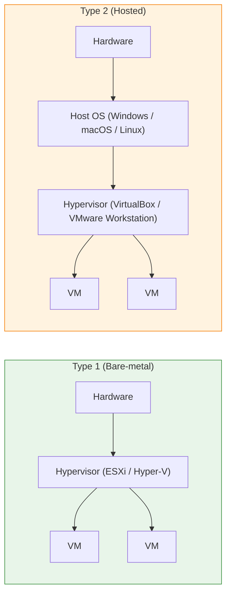

# Hypervisors and Virtualization

Virtualization lets multiple guest operating systems share the physical resources of one host. The piece that makes this possible — scheduling CPU, partitioning memory, and exposing virtual hardware to each VM — is the **hypervisor**.

Common virtualization products:

- VMware — vSphere / ESXi (industry standard for enterprise)
- Microsoft — Hyper-V
- Open source — KVM, Xen

## What a hypervisor does

A hypervisor sits between physical hardware and guest operating systems. It presents each VM with a virtualized CPU, memory, disk, and network, and keeps guests isolated from each other.

In VMware terminology **vSphere** and **ESXi** are closely related: ESXi is the bare-metal hypervisor installed on a host, while vSphere is the broader product line (ESXi + vCenter + management tooling).

## Type 1 vs Type 2

**Type 1 (bare-metal)**
- Runs directly on hardware
- Lower overhead, higher performance
- Used in production: VMware ESXi, Microsoft Hyper-V, Xen, KVM

**Type 2 (hosted)**
- Runs as an application on top of a host OS
- Lower performance, easier to install
- Used for labs and desktops: VirtualBox, VMware Workstation, Parallels

## Type 1 internal design

Within the Type 1 family there are two architectural approaches:

| Design | Where drivers live | Hypervisor size | Example |
| --- | --- | --- | --- |
| Microkernel | Inside each VM | Small footprint | Hyper-V |
| Monolithic | Inside the hypervisor | Larger footprint | ESXi |

Microkernel designs push device drivers into a privileged parent partition (for Hyper-V, the root partition running Windows). Monolithic designs bundle drivers into the hypervisor itself.

## Type 1 vs Type 2 at a glance

| | Type 1 | Type 2 |
| --- | --- | --- |
| Install target | Hardware directly | On top of a host OS |
| Performance | High | Moderate |
| Isolation | Strong | Weaker (depends on host OS) |
| Typical use | Production | Test, lab, development |
| Examples | ESXi, Hyper-V, KVM | VirtualBox, VMware Workstation |

## Virtual machines

A virtual machine is a software representation of a physical computer. Each VM gets its own virtual CPU, RAM, disk, and NICs, and runs its own guest operating system independently of others on the same host.

## Categories of virtualization

| Category | What it virtualizes | Example |
| --- | --- | --- |
| Server / compute | Physical server capacity | VMware vSphere, Hyper-V |
| Network | Switches, routers, firewalls | VMware NSX |
| Storage | Storage pools | VMware vSAN |
| Desktop | End-user desktops | VDI — Citrix, Horizon |

## Hyper-threading

Hyper-threading exposes each physical core as two logical cores to the operating system and hypervisor scheduler. It helps throughput when workloads spend time waiting on memory or I/O, but it does not double actual compute capacity. Many enterprise licenses count physical cores, not logical threads.

## Out-of-band server management

Most enterprise servers ship with dedicated management interfaces that let you administer the hardware even when the OS is offline:

| Vendor | Tool |
| --- | --- |
| HPE | iLO (Integrated Lights-Out) |
| Dell | iDRAC |
| Lenovo | XClarity Controller |

Additionally, vendor install helpers (HPE Intelligent Provisioning, Dell Lifecycle Controller) live in the server firmware and streamline OS deployment without separate smart CDs.

## Practical takeaways

- In production, always prefer Type 1 hypervisors
- Hyper-threading boosts throughput but does not replace physical cores for license counting
- Match datastore and network design to the hypervisor vendor (VMFS/NFS for ESXi, CSV for Hyper-V)
- Treat the out-of-band management interface (iLO/iDRAC) as part of your attack surface — segment it

## Useful links

- Hyper-V overview: [https://learn.microsoft.com/en-us/windows-server/virtualization/hyper-v/hyper-v-technology-overview](https://learn.microsoft.com/en-us/windows-server/virtualization/hyper-v/hyper-v-technology-overview)
- VMware vSphere docs: [https://docs.vmware.com/en/VMware-vSphere/index.html](https://docs.vmware.com/en/VMware-vSphere/index.html)
- Virtualization decision guide: [https://learn.microsoft.com/en-us/azure/architecture/guide/technology-choices/compute-decision-tree](https://learn.microsoft.com/en-us/azure/architecture/guide/technology-choices/compute-decision-tree)
