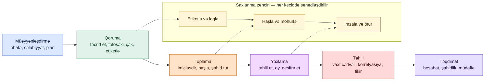

# Rəqəmsal Forensika

## Bunun əhəmiyyəti

İnsident cavabı "nə baş verdi və biz bunu necə dayandıracağıq" sualına cavab verir. Rəqəmsal forensika "biz baş verənləri hakim, arbitr və ya tənzimləyicinin qarşısında dayandığında dəstəkləyəcək formada sübut edə bilərikmi" sualına cavab verir. İki intizam alət və lüğəti paylaşır, lakin onların fərqli məqsədləri və fərqli qaydaları var. Tədqiqat sürət naminə sübutu güzəştə gedə bilər; forensika edə bilməz. Bir insident məhkəmə işinə, İR-in xitamına, sığorta iddiasına, tənzimləyici icra hərəkətinə və ya müqavilə mübahisəsinə çevrilmək ehtimalı olduqda, iş daha yüksək standartı təmin etməlidir. "Biz baş verənləri bilirik" ilə "biz baş verənləri sübut edə bilərik" arasındakı fərq forensik cəhətdən sağlam prosesdir — və bu proses ilk analitik klaviaturaya toxunduğu andan başlayır.

`example.local`-də reallıq budur ki, əksər insidentlər məhkəməyə düşmür və əksəriyyəti heç vaxt buna ehtiyac duymur. Lakin düşənlər ən vacib olanlardır: müştəri bazası ilə evdən çıxan daxili işçi, maliyyə hesabatlarını dəyişdirən podratçı, pozulma bildirişi üzərində məhkəməyə müraciət edən üçüncü tərəf, pozulmanın aradan qaldırıldığının sübutunu istəyən tənzimləyici. Bu işlərin hər birində "sübutunuzu göstərin" sualına cavab təşkilatın qalib gəlib-gəlməyəcəyini müəyyən edir. Forensika müşahidə olunan fəaliyyəti sübuta çevirən intizamdır — düzgün sırada tutulmuş, tutulma anında haşlanmış, saxlanma zəncirində nəql edilmiş, təkrarlana bilən alətlərlə təhlil edilmiş və qeyri-texniki hakimin oxuya biləcəyi və düşmən ekspertin sökə bilməyəcəyi dildə hesabatlanmışdır.

Bu dərs forensik prosesin tamını araşdırır — dəyişkənlik sırası, imicləşdirmə, yaddaş təhlili, fayl-sistemi və registr artefaktları, şəbəkə, mobil və bulud forensikası, anti-forensik aşkarlama və məhkəmələrin bütün bunlara tətbiq etdiyi hüquqi standartlar. Nümunələr xəyali `example.local` təşkilatından istifadə edir. Prinsiplər texnologiyaya neytraldır; menyular satıcılar arasında fərqlənir, lakin intizam eynidir.

Forensik məşğuliyyətin yazılı şəkildə cavablandırmalı olduğu suallar:

- **Mənşə** — bu məlumatlar haradan gəldi və yol tutulmadan məhkəmə zalına qədər yenidən qurulabilir mi?
- **Bütövlük** — məlumatlar tutulmadan bəri dəyişdirilibmi və biz bunun belə olmadığını necə sübut edirik?
- **Saxlanma zənciri** — sübuta toxunan hər bir şəxs, etdikləri hər bir hərəkət, sənədləşdirilmiş hər bir ötürmə?
- **Təkrarlana bilirlik** — rəqib ekspert eyni alətləri eyni imicə qarşı işlədə və eyni nəticəyə gələ bilərmi?
- **Əhatə intizamı** — yoxlama icazə verilmiş hüquqi əhatə daxilində qaldımı, yoxsa orderə və ya məşğuliyyət məktubuna daxil olmayan məlumatlara keçdimi?
- **Qəbuledilirlik** — iş Daubert, Frye, ISO/IEC 27037 və təqdim olunacağı yerin yerli qaydalarını təmin edirmi?

Bu altı sual müdafiə oluna bilən forensik praktikanın onurğa sütunudur. Dərsin qalan hissəsi onlara cavab verən texnikalara həsr olunub.

## Əsas anlayışlar

Forensika hüquqdan, elmdən və komputerdən lüğət götürür. Lüğət vacibdir; hesabatda diqqətsiz dil rəqib ekspertin işin etibarını sarsıtmaq üçün ən asan yoludur.

### Forensika İR-ə qarşı — fərqli məqsədlər, fərqli qaydalar

İnsident cavabı və rəqəmsal forensika üst-üstə düşür, lakin onlar fərqli nəticələri optimallaşdırır. Onları qarışdırmaq mavi komandanın etdiyi ən tez-tez səhvlərdən biridir.

- **İnsident cavabı** məhdudlaşdırma və bərpa üçün optimallaşdırır. Saat rəqibin daban tutmasıdır; xərc funksiyası qalma müddəti və zərərdir. İR daban tutmasını şəbəkədən daha tez çıxara bildiyi halda sübut bütövlüyünün bir qədər itkisini qəbul edə bilər.
- **Rəqəmsal forensika** məhkəmə səviyyəli həqiqət üçün optimallaşdırır. Saat hüquqi cədvəldir; xərc funksiyası qəbuledilirlikdir. Forensika cavabı yavaşlatdığı təqdirdə belə sübut bütövlüyünün itkisini qəbul etməyəcək, çünki alternativ məhkəmədə uğursuz olan tədqiqatdır.

Real məşğuliyyətdə iki intizam paralel işləyir. İR komandası zərəri məhdudlaşdırır; forensika komandası sübutu qoruyur. Onlar telemetriyanı paylaşır, lakin onların hərəkətləri elə sıralanır ki, məhdudlaşdırma forensikanın hələ də ehtiyac duyduğu şeyi məhv etməsin. Müdafiə oluna bilən proqram hər iki komandanı ilk saatdan otaqda saxlayır, vahid insident komandiri hər mübahisəli hərəkətdə hansı intizamın əvvəl getdiyinə qərar verir.

### Dəyişkənlik sırası — RFC 3227

RFC 3227 ən dəyişkən sübutun əvvəl tutulmasını qaydaya saldı. Sıra fizika tərəfindən, üstünlüklə deyil, diktə olunur: ən tez yox olan məlumat əvvəl tutulur, tədqiqat aktının onu məhv etməsindən əvvəl.

1. **CPU registrləri, keş və çipdaxili vəziyyət** — mikrosaniyələr içində yox olur. Xüsusi aparat tədqiqatı xaricində nadir hallarda tutulur.
2. **RAM və kernel yaddaşı** — sistem yenidən yükləndiyi anda yox olur. Sistem hələ də işləyərkən WinPMEM, LiME, AVML və ya satıcı agentləri ilə canlı tutulur.
3. **Şəbəkə vəziyyəti** — marşrutlama cədvəlləri, ARP keş, qurulmuş bağlantılar, dinləyən portlar, DNS həlledici keşi. Host izolyasiya edilməzdən əvvəl `netstat`, `ss`, `arp`, `ip route` və ya daxili EDR əmrləri ilə tutulur.
4. **Proses vəziyyəti** — işləyən proseslər, açıq fayl tutqacları, yüklənmiş modullar, quraşdırılmış fayl sistemləri. Canlı tutulur; bağlanışda itirilir.
5. **Müvəqqəti fayl sistemi və swap** — pagefile, hibernasiya faylı, `/tmp`, brauzer keşi. Bəzi hallarda yenidən yükləmələr arasında qalır, lakin normal istismarda dəyişkəndir.
6. **Disk yaddaşı** — fayl sistemi məzmunu, slack space, ayrılmamış klasterlər, jurnal qeydləri. Üzərində yazılana qədər qalıcı.
7. **Uzaqdan loglanmış məlumatlar** — SIEM logları, bulud audit izləri, mərkəzi serverdə syslog. Qalıcı, lakin saxlama siyasətlərinə və provayder silinməsinə tabedir.
8. **Arxiv mediasi və ehtiyat nüsxələri** — uzunmüddətli saxlama. Tutulan sonuncudur və ən sabitdir.

Praktik qayda: heç vaxt sistemi yenidən yükləməyin, tədqiqatın icazə vermədiyi proqram təminatı işlətməyin, şəbəkəyə qoşmayın və yaddaş imicləşdirilənə qədər kabeli çıxarmayın. Cavabdehin etdiyi hər hərəkət dəyişkən vəziyyəti dəyişdirir.

### Saxlanma zənciri — nədir, məhkəmələr niyə tələb edir

Saxlanma zənciri sübutun kimə, nə vaxt məxsus olduğunu və onunla nə etdiklərini, ələ alınma anından məhkəmə zalına təqdimata və nəticədə məhv etməyə qədər sənədləşdirilmiş qeydidir. Məhkəmələr bunu tələb edir, çünki yolu yenidən qurulmayan sübuta etibar etmək olmaz: sübutun 48 saat masada nəzarətsiz qaldığını göstərə bilən müdafiə eksperti onun saxtalaşdırıldığı barədə inandırıcı arqumentə malikdir.

Müdafiə oluna bilən saxlanma zənciri hər artefakt üçün qeyd edir:

- **Element təsviri** — marka, model, seriya nömrəsi, tutum, identifikasiya nişanları, fotoşəkillər.
- **Etiket nömrəsi** — elementə bağlanmış unikal seriyalı etiket və hər sonrakı log girişində istinad edilir.
- **Əldə etmə qeydi** — onu kim topladı, harada, nə vaxt (UTC-də), hansı səlahiyyət əsasında, hansı alətlərlə, hansı şahidlərlə.
- **Əldə etmə zamanı haş dəyərləri** — adətən SHA-256, tez-tez köhnə uyğunluq üçün MD5 ilə cütləşdirilmiş, logda qeyd edilmiş və sübut etiketində çap edilmişdir.
- **Saxlama qeydi** — element hərəkətlər arasında harada saxlanılır, açar kimdədir, hansı ətraf mühit nəzarətləri tətbiq olunur.
- **Giriş logu** — element saxlamadan hər çıxdıqda, kim götürdü, niyə, nə vaxt geri qaytarıldı və onunla nə edildi.
- **İmzalar** — hər ötürmə tarix və saatla hər iki tərəf tərəfindən imzalanmışdır.

Tək bir giriş itkin və ya təsdiqlənə bilməz olduqda zəncir qırılır. Qırılmış zəncir mütləq ölümcül deyil — boşluq izah edildikdə məhkəmələr hələ də sübutu qəbul edə bilərlər — lakin hər qırılma rəqib vəkilin qəbuledilirliyə etiraz etməsi üçün dayanacaqdır.

### Forensik imicləşdirmə — bit-bit kopyalar, yazma blokerləri, ikiqat haşlama

Forensik imicləşdirmə yaddaş cihazının bit-bit kopyasını yaradır, ayrılmamış sahə, slack space və məntiqi kopyanın əldən buraxacağı bərpa edilmiş fraqmentlər daxil olmaqla. İmic analitikin işlədiyi şeydir; orijinal sübut saxlamasında qalır və mümkün qədər az toxunulur.

Müdafiə oluna bilən imici müəyyən edən üç intizam:

- **Yazma blokerləri.** Aparat (Tableau, WiebeTech) və ya proqram (Linux-un `read-only` quraşdırılması, Windows registr açarı blokerləri) mənbəyə hər hansı yazmanın qarşısını alır. Yazma blokeri olmadan, imicləşdirmə aktı mənbə diskindəki vaxt damğalarını və jurnalları dəyişdirir, rəqib ekspert bunu istismar edəcək. Hüquqi səviyyəli iş üçün aparat blokerləri üstünlük verilir.
- **Hər addımda haş yoxlaması.** Mənbə imicləşdirməzdən əvvəl haşlanır. İmic imicləşdirildikdən sonra haşlanır. İki haş uyğun gəlməlidir. Uyğun gəlmirsə, imic etibarsızdır və proses yenidən başlayır. Sonradan hazırlanan iş kopyaları haşlanır və haşlar saxlanma zənciri ilə qeyd olunur.
- **İkiqat haşlama — MD5 və SHA-256.** MD5 kriptoqrafik olaraq qırılmışdır, lakin məhkəmələr və köhnə alətlər hələ də onu gözləyir; SHA-256 müasir standartdır. Hər ikisinin qeyd olunması imicin sübut saxlamasında oturduğu illər ərzində gözləntilərdəki dəyişikliklərdən xilas olmasını təmin edir. `dcfldd`, `dc3dd`, FTK Imager və Guymager kimi alətlər hər iki haşı təbii olaraq istehsal edir.

İmic formatı özü vacibdir. Xam `dd` imicləri ən portativdir. Expert Witness Format (E01) sıxılma, metadata və işin idarə olunması xüsusiyyətlərini dəstəkləyir. AFF4 müasir açıq standartdır. Format seçimi iş faylında sənədləşdirilir ki, gələcək hər hansı analitik imici müvafiq alətlərlə aça bilsin.

### Yaddaş forensikası — tutulma və təhlil

RAM sistemin işləmə vəziyyətini saxlayır: proses ağacları, açıq şəbəkə bağlantıları, yüklənmiş modullar, deşifrə edilmiş material, yalnız yaddaşda yaşayan zərərli proqram, açıq mətndə etimadnamələr. Heç biri yenidən yükləmədən sağ çıxmır. Buna görə də yaddaş forensikası canlı sistemə cavab verən ən yüksək təsirli fəaliyyətdir.

**Tutulma alətləri:**

- **WinPMEM** — Windows üçün açıq mənbəli yaddaş əldə etmə. İmzalanmış sürücü kimi işləyir, AFF4 və ya xam imic istehsal edir, tam fiziki ünvan sahəsini tutur.
- **LiME (Linux Memory Extractor)** — Linux üçün kernel modulu. İşləyən kernelə qarşı tərtib edir; xam yaddaş dampı istehsal edir.
- **AVML (Acquire Volatile Memory for Linux)** — Microsoft-un istifadəçi rejimi tutulma aləti, kernel modullarının yüklənməsinin məhdudlaşdırıldığı bulud iş yüklərində faydalıdır.
- **Satıcı EDR agentləri** — əksər müasir EDR-lər insident cavab hərəkəti çərçivəsində yaddaş anlıq görüntüsünü tetikləyə bilər, çox vaxt analitikin fiziki girişə ehtiyacı olmadan.

**Təhlil alətləri:**

- **Volatility 3** — Volatility çərçivəsinin müasir Python yenidən yazılması. Pluginlər proses ağaclarını, şəbəkə bağlantılarını, yaddaşa yüklənmiş registr hivelarını, kernel modullarını, gizli prosesləri və enjekt edilmiş kodu təhlil edir.
- **Rekall** — üst-üstə düşən funksionallığa malik fork, daha az aktiv saxlanılır, lakin bəzi alət dəstlərində hələ də istifadə olunur.
- **MemProcFS** — yaddaş imicini virtual fayl sistemi kimi nümayiş etdirir, analitikə prosesləri, tutqacları və modulları normal fayl sistemi alətləri ilə nəzərdən keçirməyə imkan verir.

Tipik bir yaddaş təhlili proses ağacını (`windows.pstree`), prosess başına yüklənmiş modulları, şəbəkə bağlantılarını (`windows.netscan`), əmr xətti arqumentlərini, API qarmaqlarını və enjekt edilmiş və ya gizli modulları çəkir. Bu görünüşlərdən hər hansı birindəki anomaliyalar adətən tədqiqatın yerini dəyişdiyi yerlərdir.

### Fayl sistemi forensikası — MFT, inodlar, slack space, silinmə bərpası

Fayl sistemləri qeyri-şəffaf konteynerlər deyil; istifadəçi tərəfindən görünən fayllardan daha çox şey qeyd edən strukturlaşdırılmış verilənlər bazalarıdır. Forensik dəyər əməliyyat sistemindən onlara dair görünüş istəməkdənsə, həmin strukturları birbaşa oxumaqdan gəlir.

- **NTFS Master File Table (MFT)** — NTFS həcmindəki hər fayl və qovluq vaxt damğaları, icazələr, atributlar və (kiçik fayllar üçün) faylın özü ilə bir MFT qeydinə malikdir. MFT qeydləri silinmədən sonra üzərində yazılana qədər sağ qalır; `analyzeMFT.py`, MFTECmd və The Sleuth Kit-in `fls`/`icat` kimi alətləri onları birbaşa təhlil edir.
- **NTFS vaxt damğaları** — fayl başına dörd vaxt damğası (Yaradılma, Modifikasiya, Giriş, MFT dəyişikliyi) iki atributda saxlanılır (`$STANDARD_INFORMATION` və `$FILE_NAME`). Vaxt damğası saxtalaşdırma alətləri adətən birini yeniləyir, digərini yox; ikisi arasındakı uyğunsuzluq özü sübutdur.
- **ext4 inodları** — Linux ekvivalenti. `debugfs`, `extundelete` və Sleuth Kit təhlilini idarə edir. ext4 jurnal girişləri silinmədən sonra belə son fayl əməliyyatlarını bərpa edə bilər.
- **Slack space** — faylın sonundan onun yaşadığı klasterin sonuna qədər istifadə olunmamış baytlar. Slack tez-tez yeni faylın tam üzərində yazmadığı əvvəllər silinmiş faylların fraqmentlərini ehtiva edir.
- **Ayrılmamış sahə** — hazırda fayla təyin olunmamış, lakin əvvəlki fayllardan bərpa edilə bilən məlumat ehtiva edə biləcək klasterlər. Fayl-yığma alətləri (PhotoRec, Foremost, Scalpel) fayl sisteminə güvənmək yerinə fayl imzalarını tanıyaraq ayrılmamış sahədən faylları bərpa edir.
- **Silinmə davranışı** — əksər fayl sistemləri silinmiş faylları sıfırlamır. Klasterləri təkrar istifadəyə yararlı kimi qeyd edir və yeni yazıların tədricən üzərində yazmasına icazə verir. Bərpa klasterlər təkrar istifadə olunana qədər mümkündür ki, məşğul diskdə saatlar, sakit diskdə isə illər ola bilər.

The Sleuth Kit və Autopsy bu əməliyyatların əksəriyyətinə vahid interfeys təmin edir. SleuthKit əmr xətti kitabxanasıdır; Autopsy onun üzərindəki qrafik interfeysdir. Hər ikisi açıq mənbədir və hər ikisi təlim keçmiş analitikin məhkəmədə müdafiə edə biləcəyi nəticə verir.

### Windows registr forensikası

Windows registri konfiqurasiyadan daha çox şey qeyd edən iyerarxik konfiqurasiya verilənlər bazasıdır. Windows tədqiqatında ən faydalı artefaktların əksəriyyəti registr hivelarında yaşayır.

- **UserAssist** (`HKCU\Software\Microsoft\Windows\CurrentVersion\Explorer\UserAssist`) — Start menyusundan və ya qabıqdan başladılan GUI proqram icralarını qeyd edir. Dəyərlər ROT13 ilə gizlədilmişdir; RegRipper kimi alətlər onları deşifrə edir. "İstifadəçi bu proqramı işlətdimi" üçün faydalıdır.
- **ShimCache / AppCompatCache** (`HKLM\SYSTEM\CurrentControlSet\Control\Session Manager\AppCompatCache`) — proqram-uyğunluq çərçivəsinin gördüyü icra olunabilenləri qeyd edir. Qeydlər fayl silinsə də sağ qalır, ShimCache-i "bu ikili sistemdə hər hansı bir nöqtədə var idi" üçün əsas mənbə edir.
- **AmCache** (`%SystemRoot%\AppCompat\Programs\Amcache.hve`) — icra olunabilənləri, quraşdırma tarixlərini və SHA-1 haşlarını qeyd edən daha yeni Windows artefaktı. AmCacheParser standart alətdir.
- **Prefetch** (`%SystemRoot%\Prefetch\*.pf`) — icra olunabilən başlatmaları, işləmə saylarını, son işləmə vaxtlarını və yüklənmiş DLL-ləri qeyd edən Windows performans optimallaşdırma faylları. PECmd onları təhlil edir. Prefetch Windows-da "bu proqram işlədimi" üçün ən təmiz artefaktlardan biridir.
- **ShellBags** (`HKCU\Software\Microsoft\Windows\Shell\Bags`) — istifadəçinin Explorer-də göz gəzdirdiyi qovluqları qeyd edir, ondan bəri ayrılmış çıxarıla bilən mediadakı qovluqlar daxil olmaqla. İstifadəçinin müəyyən qovluğa keçdiyini sübut etmək üçün faydalıdır.
- **USB cihazı tarixi** (`HKLM\SYSTEM\CurrentControlSet\Enum\USBSTOR`) — qoşulmuş hər USB yaddaş cihazını satıcı, məhsul, seriya nömrəsi və ilk/son qoşulma vaxtları ilə qeyd edir.
- **Run açarları və davamlılıq** (`HKCU\Software\Microsoft\Windows\CurrentVersion\Run`, üstəgəl on iki qardaş açar) — rəqib davamlılığı tez-tez burada qeydiyyatdan keçir.

RegRipper bu artefaktları təhlil etmək üçün kanonik açıq mənbəli alətdir; Eric Zimmerman-ın alətləri (Registry Explorer, RECmd) müasir Windows-yerli ekvivalentlərdir.

### Şəbəkə forensikası — PCAP, NetFlow, DNS

Şəbəkə forensikası fəaliyyəti naqildən və şəbəkə cihazlarının artıq logladığı metadatadan yenidən qurur. Hostların özlərinin loglamayacağı, rəqibin hostlar arasında etdiklərini tutaraq host əsaslı forensikanı tamamlayır.

- **PCAP (tam paket tutulması)** — yüklər daxil olmaqla, tutulan hər paketin tam məzmunu. Wireshark, tshark, NetworkMiner və Brim/Zui PCAP-ları təhlil edir. NetworkMiner xüsusilə tutulmadan ötürülən faylları, etimadnamələri və SSL sertifikatlarını çıxarmaq üçün faydalıdır. Tam PCAP saxlamaq baha başa gəlir, buna görə də adətən yalnız sıxma nöqtələrində və yalnız qısa saxlama pəncərəsində saxlanılır.
- **NetFlow / IPFIX / sFlow** — hər axın üçün metadata: mənbə, təyinat, port, protokol, bayt sayı, paket sayı, başlama və bitmə vaxtları. NetFlow miqyasda saxlamaq ucuzdur və aylar ərzində kimin kiminlə danışdığının demək olar ki, tam qeydini verir. Orta ölçülü təşkilat üçün ən qənaətli şəbəkə forensikası məlumat mənbəyidir.
- **DNS sorğu logları** — hər ad həlli, ideal olaraq həlledicidə tutulur. DNS əmr-və-nəzarət bekonlaşdırması, rəqib domenlərinə eksfiltrasiya və DGA əsaslı zərərli proqram üçün ən təmiz siqnaldır. DNS sorğularını tutan müəssisələr tutmayan müəssisələrin həll edə bilməyəcəyi işləri həll edir.
- **Firewall və proxy logları** — bağlantı logları, bloklanmış cəhdlər, URL kateqoriyaları, proxy vasitəsilə fayl ötürmələri. Xüsusilə proxy logları faydalıdır, çünki onlar yoxlama nöqtəsində TLS-i deşifrə edir və əsl URL-ləri qeyd edir.
- **TLS metadatası** — yoxlamasız belə, JA3/JA3S barmaq izləri, SNI sahələri və sertifikat metadatası şifrlənmiş trafikdə müştəriləri və serverləri müəyyən edir.

Şəbəkə məlumatlarına dair forensik intizam host məlumatları ilə eynidir: sənədləşdirilmiş alətlərlə tutmaq, haşlamaq, saxlanma zəncirində saxlamaq, iş kopyasından təhlil etmək.

### Mobil forensika — iOS, Android, MDM narahatlıqları

Mobil cihazlar müasir tədqiqatlarda ən yüksək sıxlıqlı sübut mənbələridir: mesajlaşma proqramları, məkan məlumatları, foto metadatası, kontaktlar, proqram fəaliyyəti və biometrik tarix. Mobil forensika həm də intizamın ən texniki məhdud sahəsidir, çünki cihaz istehsalçıları çıxarmaya aktiv şəkildə müqavimət göstərir.

- **iOS** — tam fayl sistemi çıxarılması ya checkm8 üslubunda boot istismarı (köhnə cihazlar) ya da Cellebrite UFED, GrayKey və ya MSAB XRY kimi satıcı aləti tələb edir. Məntiqi çıxarış (iTunes ehtiyat nüsxəsi) həmişə mövcuddur, lakin fayl sisteminin çoxunu əldən buraxır. Şifrləmə aparat bağlıdır; parol və cihazın təhlükəsiz anklavının əməkdaşlığı olmadan fayl sistemi oxunmazdır.
- **Android** — satıcılar arasında parçalanmışdır. ADB ehtiyat nüsxəsi, fərdi bərpa imicləşdirmə və çip-off çıxarılması (fləşi fiziki olaraq lehimsizləşdirmə və oxuma) əsas üsullardır. Tam disk şifrləməsi indi standartdır, iOS ilə eyni parol problemini gətirir.
- **Proqram məlumatları** — əksər proqramlar məlumatları forensik alətin çıxarıb təhlil etdiyi SQLite verilənlər bazalarında saxlayır. Signal, WhatsApp, iMessage, Telegram və əksər bank proqramlarının hər birinin yetkin alətlərin deşifrə etdiyi öz strukturu var.
- **MDM bypass narahatlıqları** — Mobile Device Management cihazı uzaqdan silə bilər. Tədqiqat altındakı cihaz dərhal Faraday çantasına və ya təcrid olunmuş radio mühitinə qoyulmalıdır, şübhəli (və ya MDM administratorları) uzaqdan silmə əmri verməzdən əvvəl. Cihaz yenidən açıla bilirsə, təyyarə rejimi kifayət deyil.
- **Bulud ehtiyat nüsxələri** — iCloud, Google hesabı ehtiyat nüsxələri və satıcı bulud sinxronizasiyası tez-tez cihaz məlumatlarının kopyalarını ehtiva edir. Fiziki cihaz əldə edilə bilmədikdə bunlar məhkəmə çağırışı hədəfləridir.

Mobil forensika əksər mavi komandaların satıcı alətləri ilə xarici mütəxəssisə ehtiyac duyduğu sahədir. Buradakı dərs operativdir: cihazı düzgün qoruyun, ələ keçirməni sənədləşdirin və sübut itirilməzdən əvvəl mütəxəssisi gətirin.

### Bulud forensikası — provayder logları, anlıq görüntülər, yurisdiksiyalar

Bulud iş yükləri forensik tənliyi dəyişdirir. Provayder altdakı aparata sahibdir; müştəri konfiqurasiyaya və məlumatlara sahibdir. Buludda forensika qismən log təhlili, qismən API-əsaslı sübut toplanması və qismən müqavilə hüququdur.

- **Provayder audit logları** — AWS CloudTrail, Azure Monitor / Activity Log, Google Cloud Audit Logs. Bunlar API hərəkətlərini, onları kimin etdiyini, nə vaxt və haradan etdiklərini qeyd edir. Onlar əməliyyat sistemi hadisə logunun bulud ekvivalentidir və ən vacib tək mənbədir.
- **Anlıq görüntü sübutu** — kompromis edilmiş bulud VM və ya həcm üçün forensik prosedur diski və yaddaşı (provayderin dəstəklədiyi yerdə) anlıq görüntüləməkdir və sonra ya bulud daxilində təhlil etmək, ya da forensik mühitə ixrac etməkdir. Anlıq görüntülər bit-bit kopyalardır və fiziki imiclər kimi haşlanır.
- **SaaS audit izləri** — Microsoft 365, Google Workspace, Salesforce, Slack və əksər müəssisə SaaS alətləri audit API-lərini ifşa edir. Saxlama daxilində müvafiq alt çoxluğunu çəkmək adətən provayderin standart saxlamasına qarşı yarışdır, bu çox vaxt yalnız 90 gündür.
- **Yurisdiksiya məsələləri** — bulud məlumatları çoxlu hüquqi yurisdiksiyalarda saxlanıla, təkrarlana və ya emal edilə bilər. Bir ölkədə etibarlı olan məhkəmə çağırışı başqa ölkədə provayderə bağlana bilməz. Audit hüquqlu məlumat emalı müqavilələrini qabaqcadan müzakirə etmək bunu qismən həll edir; aradan qaldırmır.
- **Audit hüququ** — müştərinin provayderə qarşı yeganə forensik hüquqları müqaviləyə yazılanlardır. Açıq audit hüququ maddəsi olmadan, müştərinin provayderin ifşa etdiyi standart loglardan kənar müəyyən sübut tələb etmək üçün rəsmi yolu olmaya bilər.

Praktik bulud forensikası proqramı qabaqcadan hazırlayır: tam audit loglamasını aktivləşdirir, saxlamanı standartlardan kənara çatdırır, logları müştəri-idarə olunan saxlama qatına ixrac edir, istifadədə olan hər bulud platforması üçün anlıq görüntü prosedurunu sənədləşdirir və forensik girişi açıq şəkildə adlandıran müqavilələri saxlayır.

### Anti-forensika — və onu necə aşkar etmək

Tutulmamağa əhəmiyyət verən rəqiblər sübutu məhv etmək üçün anti-forensik alət işlədir. Bu alətlərin buraxdığı artefaktları tanımaq özünün alt-intizamıdır.

- **Timestomping** — vaxt cədvəli təhlilini pozmaq üçün fayl vaxt damğalarını dəyişdirmək. `timestomp` (Metasploit), `SetMACE` və `nTimestomp` kimi alətlər NTFS-də `$STANDARD_INFORMATION` atributunu dəyişdirir, lakin adətən `$FILE_NAME`-i dəyişmir. İkisi arasındakı uyğunsuzluq özü göstəricidir.
- **Təhlükəsiz silmə** — `sdelete`, `shred` və BleachBit kimi alətlər faylların üzərində bir neçə dəfə yazır. Aşkar etmə gözlənilən artefaktların yoxluğunu görməklə və silmədən sağ qalan paralel sübut (prefetch, AmCache, MFT qeydləri) bərpa etməklə işləyir.
- **Şifrlənmiş həcmlər** — VeraCrypt, TPM-dəstəkli emanetsiz BitLocker, gizli həcmlər. Açar olmadan məlumat bərpa edilə bilməz; forensik dəyər şifrlənmiş həcmin var olduğunu və istifadə edildiyini göstərməkdən gəlir.
- **Log təmizləməsi** — `wevtutil cl`, `Clear-EventLog`. Hadisə-log-təmizlənmiş hadisəsini özü yaradır; gözlənilən logların yoxluğu və təmizlənmiş hadisənin mövcudluğu güclü göstəricidir.
- **Brauzer artefakt silicilər** — brauzer tarixini, kukileri və keşi təmizləmək. Aşkar etmə tez-tez kölgə kopyalarına, silicinin özü üçün prefetch girişlərinə və təmizlənmiş məlumatları saxlayan pagefile fraqmentlərinə güvənir.
- **Land-üzərində-yaşamaq ikililəri (LOLBins)** — antivirus tərəfindən aşkar edilə bilən ikililər buraxmamaq üçün zərərli proqram əvəzinə qanuni Windows alətləri (PowerShell, certutil, bitsadmin) istifadə etmək. Aşkar etmə imza əsaslı deyil, davranış əsaslıdır.

Ümumi prinsip: artefaktlar artıqdır. Qətiyyətli silici əsas sübutu məhv edə bilər, lakin eyni fəaliyyət adətən üç və ya dörd başqa yerdə izlər buraxır. Forensik analitikin işi bu artıq artefaktların harada yaşadığını bilməkdir.

### Hüquqi və sübut standartları — Daubert, Frye, ISO/IEC 27037

İş hüquqi standartı təmin etməlidir və bu standart yurisdiksiyadan və yerdən asılıdır.

- **Daubert standartı** (ABŞ federal məhkəmələri, əksər ABŞ ştatları) — ekspert şahidliyi sınaqdan keçirilə bilən, həmkar baxışından keçən, məlum xəta dərəcəsinə malik, əməliyyatına dair standartlara malik və müvafiq icmada ümumi qəbul edilmiş metodologiyaya əsaslanmalıdır. Daubert-ə cavab verən forensik alətlər sənədləşdirilmiş, təkrarlana bilən və nəşr olunmuş təsdiq nəticələrinə malikdir.
- **Frye standartı** (bəzi ABŞ ştat məhkəmələri) — elmi cəmiyyətdə ümumi qəbula yönəlmiş köhnə test. Daubert-i təmin edən əksər forensik alətlər Frye-i təmin edir.
- **ISO/IEC 27037** — rəqəmsal sübutun müəyyənləşdirilməsi, toplanması, əldə edilməsi və qorunması üçün beynəlxalq təlimat. Müdafiə oluna bilən forensik məşğuliyyətin yerinə yetirməli olduğu prosessual tələbləri müəyyən edir.
- **ISO/IEC 27042** — rəqəmsal sübutun təhlili və şərhi üçün beynəlxalq təlimat. Səlahiyyət, analitik proses və hesabatlamanı əhatə edir.
- **ISO/IEC 27041** — insident tədqiqat üsullarının yararlılıq və adekvatlığının təminatına dair təlimat.
- **NIST SP 800-86** — insident cavabına forensik texnikaların inteqrasiyasına dair ABŞ federal təlimatı. Praktik və alət-bilikli.
- **Yerli qaydalar** — işin baxılacağı yerdə sübut qaydaları. Müdafiə oluna bilən proqram məşğuliyyətdən əvvəl, sonra deyil, hüquqi məsləhətçi ilə məsləhətləşir.

Forensik analitikin hesabatı rəqib ekspertin hər sətri oxuyacağını və metodologiyada uğursuzluqlar axtaracağını gözləməlidir. Faktlara sadiq qalmaq, təsdiq edilmiş alətlərdən istifadə etmək, hər addımı sənədləşdirmək və motiv və ya niyyət haqqında spekulyasiyadan qaçmaq bu yoxlamadan sağ çıxır.

## Forensik proses diaqramı

Diaqram soldan sağa forensik məşğuliyyətin altı standart mərhələsindən oxuyur, mərhələlər arasında hər keçiddə tutulan saxlanma zənciri sənədləşdirilməsi ilə. Müəyyənləşdirmə məşğuliyyəti əhatə edir; qoruma sübutu kilidləyir; toplama onu nəzarət edilən şəraitdə tutur; yoxlama müvafiq artefaktları çıxarır; təhlil onları şərh edir; təqdimat hesabatı ehtiyac duyan auditoriyaya çatdırır.

Diaqramı mərhələlər arasında müqavilə kimi oxuyun. Müəyyənləşdirmə əhatəni təyin edir — icazə verilmiş əhatə olmadan, qalan işin hüquqi əsası yoxdur. Qoruma sübutu dondurur — qoruma olmadan, normal sistem fəaliyyəti işin əsaslandığı şeyi məhv edir. Toplama iş kopyaları istehsal edir — intizamlı imicləşdirmə və haşlama olmadan, sübut etirazlanabilir. Yoxlama texniki çıxarışdır — təhlilçiləri, yığıcıları, deşifrələyiciləri işlətmək. Təhlil şərhdir — vaxt cədvəlini qurmaq, mənbələr arasında korrelyasiya, müdafiə oluna bilən nəticələr formalaşdırmaq. Təqdimat çatdırılmadır — yazılı hesabat, şahidlik, məhkəmə zalı şahidliyi. Əməliyyat mərhələləri altındakı saxlanma zənciri izi ayrı bir iş axını deyil; sübutun qəbuledilən qalması üçün hər keçidin yerinə yetirməli olduğu sənədləşdirilmədir.

## Praktiki məşqlər

Forensik məşğuliyyətin tələb etdiyi əzələ yaddaşını quran beş məşq. Hər biri portfelin bir hissəsinə çevrilən artefakt — yaddaş imici, təsdiqlənmiş disk imici, bərpa edilmiş fayl dəsti, təhlil edilmiş registr hesabatı, PCAP-dan çıxarılmış fayl inventarı — istehsal edir.

Bunları sahibi olduğunuz və ya təhlil etmək üçün açıq icazəniz olan test məlumatlarına qarşı xüsusi laboratoriyada işlədin. Yazılı icazə olmadan real sistemlərə, hesablara və ya məlumatlara toxunmaq məşqi insidentə çevirir.

### 1. WinPMEM ilə yaddaşı tutun və Volatility 3 ilə təhlil edin

Test Windows endpoint-də tam RAM imicini tutmaq üçün WinPMEM işlədin. Sonra imici Volatility 3-də açın və cavablayın:

- Tutulma zamanı imicin SHA-256 haşı nədir və saxlanma zənciri logunda harada qeyd olunur?
- `windows.pstree` və `windows.pslist` işlədin. Valideyni mövcud olmayan və ya adı həmin yol üçün gözlənilən valideynlə uyğun gəlməyən proseslər varmı?
- `windows.netscan` işlədin. Hansı proseslər şəbəkə bağlantılarını saxlayır və hansı təyinatlara? Bu təyinatlardan hər hansı biri tanış deyilmi?
- `windows.cmdline` işlədin. Hər şübhəli proses hansı əmr xətti arqumentləri ilə işləyib?
- Proses yaddaşında enjekt edilmiş kod regionlarını axtarmaq üçün `windows.malfind` işlədin.

Təhlili bir səhifəlik yaddaş triaj hesabatı kimi sənədləşdirin. Bilinən-yaxşı sistemə qarşı təkrarlanmamış yaddaş təhlili 03:00-da normal tanımayan yaddaş təhlilidir.

### 2. USB çubuğunu `dd` və `dcfldd` ilə imicləşdirin, haşları yoxlayın

Üzərində bəzi test məlumatları olan kiçik USB çubuğunu götürün (məşq üçün 8 GB və ya daha kiçik kifayətdir). Onu iki dəfə imicləşdirin — bir dəfə adi `dd` ilə, bir dəfə `dcfldd` ilə. Cavablayın:

- İmicləşdirmədən əvvəl tutulan mənbə cihazının SHA-256 haşı nədir?
- `dcfldd` imicləşdirmə zamanı hansı haşları istehsal edir və onlar mənbə ilə uyğun gəlirmi?
- Hər alət nə qədər vaxt aldı və hər biri hansı yoxlama nəticəsi verdi?
- İmici iş maşınında yalnız oxuma kimi quraşdırın və fayl sisteminin sağlam olduğunu təsdiqləyin.
- Proseduru İR oyun kitabında runbook addımı kimi sənədləşdirin.

Real məşğuliyyətlər üçün aparat yazma blokerləri tələb olunur. Məşq avadanlıq gəlməzdən əvvəl imicləşdirmə intizamını başa düşməkdir.

### 3. Silinmiş faylları PhotoRec ilə bərpa edin

USB çubuğunu götürün, ona bəzi faylları kopyalayın (qarışıq fayl növləri — JPG, PDF, DOCX, TXT), sonra faylları normal silin. Cihaza və ya onun `dd` imicinə qarşı PhotoRec işlədin. Cavablayın:

- PhotoRec neçə fayl və hansı növləri bərpa etdi?
- Bərpa edilmiş fayllar orijinal fayl adlarını saxladı, yoxsa PhotoRec onları imza ilə yenidən adlandırdı?
- Bərpa edilmiş faylların hər hansı biri korlanmış və ya qismən idi? Niyə belə ola bilər?
- Mənbə fayllarına təhlükəsiz silmə alətindən (`sdelete -p 3`) istifadə etdikdən sonra eyni məşqi işlədin. Neçəsi hələ də bərpa edilə bilir?

PhotoRec-in dəyəri budur ki, fayl-sistemi metadatasından deyil, fayl imzalarından işləyir, beləliklə fayl sistemi quraşdırılmaq üçün çox zədələnmiş cihazlardan bərpa edir. Məşq həm yığmanın gücünü, həm də qəsdli silicilərə qarşı bərpanın hüdudlarını öyrədir.

### 4. RegRipper ilə Windows registr hivesini təhlil edin

Windows registr hivesini götürün (test VM-dən ixrac edin və ya ictimai DFIR təlim verilənlər bazalarından birindən nümunə hive dəstini yükləyin). Ona qarşı RegRipper işlədin və cavablayın:

- `userassist` plagini hansı girişlər istehsal edir və onlar hansı proqramların başladıldığı barədə nə deyir?
- `usbstor` plagini qoşulmuş USB cihazları haqqında nə göstərir?
- `run` plagini hansı davamlılıq yerlərini ifşa edir?
- Maraqlı olan üç başqa plagini seçin və onların nəticəsini istehsal edin.
- Artefaktlardan birini (məsələn, başladılmış proqram) fayl sistemi ilə müqayisə edin və ikilinin hələ də mövcud olduğunu təsdiqləyin.

RegRipper nəticəsini və qeydlərinizi registr triaj hesabatı kimi saxlayın. Yetkin analitiklərin hər Windows hivesində işlətdikləri standart plagin dəsti var; məşq sizinkini tapmaqdır.

### 5. PCAP tutun və Wireshark plus NetworkMiner ilə bütün HTTP fayllarını çəkin

Test laboratoriyasında, tutma aktiv olan `tshark` və ya Wireshark işlədərkən bəzi HTTP trafiki yaradın (bir neçə sadə səhifəyə baxın, bir neçə fayl yükləyin). PCAP-i saxlayın. Onu NetworkMiner-də açın və cavablayın:

- Tutulmada neçə fərqli host görünür?
- NetworkMiner HTTP axınlarından hansı faylları çıxarır və haşlar orijinallarla uyğun gəlirmi?
- Hansı etimadnamələr, varsa, tutuldu (HTTP basic auth, form-post parolları, kukilər)?
- Hansı user-agent sətirləri görünür və müştərilər haqqında nə deyirlər?
- İndi eyni tutmanı Wireshark-ın `File > Export Objects > HTTP` vasitəsilə işlədin və iki çıxarış nəticəsini müqayisə edin.

NetworkMiner və Wireshark üst-üstə düşən, lakin eyni olmayan ərazini əhatə edir. Məşq analitiki hər ikisini istifadə etməyə və birinin digərinin görmədiyi şeyləri görəcəyini tanımağa öyrədir.

## İşlənmiş nümunə — `example.local` daxili məlumat oğurluğu

`example.local`-də baş hesab meneceri cümə günü günortadan sonra istefa verir və növbəti bazar ertəsi birbaşa rəqibə keçidini elan edir. CRO bazar ertəsi səhər ayrılan işçinin müştəri məlumatlarını götürüb-götürmədiyini müəyyən etmək üçün forensik məşğuliyyət tələb edir. Əhatə noutbuk, onların əlində olan hər hansı USB cihazları, korporativ e-poçt və Slack hesabları və bulud-saxlama icarədarıdır. Forensik məşğuliyyət saxlanma zənciri tələbləri ilə HR və Hüquq tərəfindən yazılı şəkildə icazə verilir.

**Müəyyənləşdirmə (Bazar ertəsi 09:00–10:00).** Forensik lider Hüquqla məşğuliyyət məktubunu nəzərdən keçirir. Əhatə adlandırılmış hesablar və adlandırılmış cihazlarla məhdudlaşır, tarix aralığı istefadan əvvəlki 30 günü əhatə edir. Lider noutbukun işçini xəbərdar etmədən ələ keçirilməsi üçün İT ilə koordinasiya edir (avadanlıq yenilənməsi bəhanəsi ilə masalarından götürülür) və müvafiq hesabları dondurmaq üçün bulud-platforma admini ilə. Saxlanma zənciri sənədləşdirilməsi başlayır; noutbuk fotoşəkili çəkilir, etiketlənir (`example.local` sübut etiketi `EX-2026-0042`) və möhürlənmiş sübut çantasına qoyulur.

**Qoruma (Bazar ertəsi 10:00–11:30).** Noutbuk imzalanmış ötürmə altında forensik iş stansiyasına aparılır. Cihaz təfərrüatla fotoşəkili çəkilir (seriya nömrəsi, səth vəziyyəti, məşğul portlar). Güc vəziyyəti qeyd olunur (noutbuk yuxu rejimində qapalı qapaqla tapıldı; batareya yaddaş tutmaq üçün kifayətdir). Forensik iş stansiyası aparat yazma blokeri ilə konfiqurasiya edilir. Saxlanma zənciri logu hər addımı tutur.

**Toplama (Bazar ertəsi 11:30–15:00).** Yaddaş əvvəl tutulur. Forensik lider EDR-in cavab hərəkəti vasitəsilə WinPMEM-i tetikleyən USB-quraşdırılmış forensik mühiti yükləyir — hər hansı digər hərəkətdən əvvəl yaddaşı qoruyur. Tutulmuş SHA-256 haşı: `7c3a...`. Disk imici izləyir: aparat yazma blokeri qoşulur və `dcfldd` SHA-256 `b9d2...` və MD5 `f4ee...` ilə forensik imic istehsal edir. Haşlar mənbəyə qarşı yoxlama keçidi ilə uyğun gəlir. Bulud tərəfi: bulud-saxlama admin son 60 günü əhatə edən audit-log ixracı və adlandırılmış hesab üçün icarədar miqyaslı məzmun anlıq görüntüsü istehsal edir. E-poçt və Slack ixracları saxlanma zənciri sənədləşdirilməsi ilə platforma admin API-ləri vasitəsilə çəkilir. Bütün artefaktlar əldə etmə zamanı haşlanır.

**Yoxlama (Bazar ertəsi 15:00 — Çərşənbə 17:00).** İmic təhlil iş stansiyasına yalnız oxuma kimi quraşdırılır. Yaddaş imicinə qarşı Volatility 3 yuxudakı işləyən proses ağacını göstərir; maraq doğuran bir proses fərqlənir — `7zip.exe` təxminən doxsan dəqiqə əvvəl noutbuk möhürlənməzdən əvvəl başladıldı və çıxdı, valideyn prosesi `explorer.exe` və iş qovluğu `C:\Users\<işçi>\Documents\Customer-Lists\` idi. Disk imicinin MFT təhlili son zamanlar silinmiş `Customer-Export-2026-04.rar` faylını göstərir, qeydi hələ də ayrılmamış sahədəki məzmun fraqmentlərinə istinad edir. PhotoRec fraqmentləri yığır və müştəri qeydlərinin dörd CSV faylını ehtiva edən qismən RAR arxivini bərpa edir.

**Təhlil (Çərşənbə 17:00 — Cümə axşamı 12:00).** Forensik lider vaxt cədvəli qurur. UserAssist və Prefetch istefa günündə saat 14:18-də `7zip.exe`-nin başladılmasını təsdiqləyir. ShellBags istifadəçinin qısa müddət əvvəl müştəri-siyahı qovluq ağacında naviqasiya etdiyini göstərir. USBSTOR seriya `AAA12345` olan USB cihazının 14:22-də qoşulduğunu və 14:31-də ayrıldığını ifşa edir. Korporativ firewall-dan NetFlow qeydləri 14:24 və 14:29 arasında istehlakçı fayl-paylaşma xidmətinə təxminən 240 MB yükləməni göstərir — eyni doqquz dəqiqəlik pəncərə. Bulud-saxlama audit logu 14:11-də üç müştəri-seqment faylının autentikasiya edilmiş yüklənməsini göstərir. Slack ixracı müvafiq məzmun göstərmir. E-poçt ixracı `Notes.docx` və `Templates.zip` adlı qoşmaları olan fərdi ünvana iki gedən e-poçt göstərir; hər ikisi bərpa edilmişdir, hər ikisi müştəri-müvafiq material ehtiva edir. Forensik lider bunları çarpaz istinadlarla vahid vaxt cədvəlinə korrelyasiya edir və 14 səhifəlik hesabat istehsal edir.

**Təqdimat (Cümə axşamı 12:00 — Cümə 16:00).** Hesabat əhatəni, metodologiyanı, alət versiyalarını, hər mərhələdə haş dəyərlərini, vaxt cədvəlini, çarpaz istinadları və sübut xülasəsini əhatə edir. İşçinin niyyəti, motivi və ya hüquqi məsuliyyəti haqqında fikir bildirmir — bunlar Hüquq və məhkəmələr üçün məsələlərdir. Hesabat vəkil-müştəri imtiyazı altında Hüquqa, HR-ə və CRO-ya çatdırılır. Saxlanma zənciri sənədləşdirilməsi hesabatla birləşdirilir. Hüquq mülki iş üçün qərar verir; hesabat və əsas sübut paketi istənilən məhkəmə müddəti üçün forensik sübut anbarında saxlanılır.

**Nəticə.** Forensik məşğuliyyət müdafiə oluna bilən qeyd istehsal edir. Hüquq dörd ay ərzində ifşa etməmə şərtləri altında həll olan mülki iş təqib edir, işçi eksfiltrasiya edilmiş məlumatı qaytarır və onun yayılmaması haqqında andlı bəyanatlara imza atır. Forensik proses rəqib ekspert baxışı altında dayandı. Öyrənilən dərslər məşqi imtiyazlı məlumat-girişli işçinin hər hansı bir könüllü istefasından əvvəlki 30 gündə kütləvi yükləmə və arxivləmə fəaliyyətinin avtomatik monitorinqini daxil etmək üçün ayrılma oyun kitabını yeniləyir və standart ayrılma müqaviləsinə işçinin ayrılışda korporativ cihazların forensik baxışına razılığını tələb edən bənd əlavə edir.

## Problemlər və tələlər

- **Yaddaşı əvvəl imicləşdirmədən canlı sistemi açmaq.** Canlı sistemdə alət işlətmək aktı yaddaşın hissələrini üzərində yazır və işləmə vəziyyətini dəyişdirir. Sadə əmrlər belə olsa da, hər hansı digər hərəkətdən əvvəl yaddaşı tutun.
- **Canlı şəbəkə vəziyyətini tutmadan əvvəl şəbəkə kabelini çıxarmaq.** Qurulmuş bağlantılar, ARP keş, DNS həlledici vəziyyəti — hamısı bağlantı dəyişdiyi anda yox olur. Əvvəl tutun, sonra təcrid edin.
- **Yazma blokeri olmadan işləyən diski imicləşdirmək.** Əksər əməliyyat sistemlərində yalnız oxuma quraşdırmaları belə jurnala yazır. Aparat yazma blokeri yeganə etibarlı müdafiədir; proqram blokerləri ikincidir.
- **Mənbə və imic arasında haş uyğunsuzluğu.** Mənbənin SHA-256-sı imicin SHA-256-sına uyğun gəlmirsə, imic etibarsızdır və proses yenidən başlayır. "Sonra düzəldəcəyik"-i sənədləşdirmək işləri itirməyin yoludur.
- **Tək haş sənədləşdirilməsi.** Yalnız MD5 (qırılmış) və ya yalnız SHA-256 (köhnə uyğunluq yoxdur) istifadə etmək rəqib vəkilin istismar edəcəyi guşə-kəsmə hərəkətidir. Hər ikisini tutun.
- **Qırılmış saxlanma zənciri.** İtkin ötürmə logu, şahidsiz ötürmə, giriş qeydində izah olunmamış 12 saatlıq boşluq. Hər qırılma rəqib vəkil üçün dayanacaqdır; cəmləşmiş qırılmalar qəbuledilirliyi pozur.
- **Təsdiqlənməmiş forensik iş stansiyası.** Silinmiş, bilinən-təmiz baseline-la imicləşdirilmiş və forensik cəhətdən sağlam kimi sənədləşdirilməmiş iş stansiyasına imicləşdirmək çarpaz çirklənmə iddialarının yarandığı yoldur.
- **Canlı qarşılaşılan və imicləşdirmədən bağlanan açarsız şifrlənmiş disklər.** BitLocker-qorunan disk emanet girişi olmadan söndürüldükdə, məlumat itib. Həmişə bağlanmadan əvvəl şifrləmə vəziyyətini yoxlayın və açarları tutun.
- **Tutulan, lakin yoxlanılmayan yaddaş.** Yaddaş əldə etmə alətləri bəzən səssiz şəkildə kəsir və ya aralıqları atlayır. Volatility-in əsas sağlamlıq yoxlamalarından keçməyən tutulmuş yaddaş imici istifadə oluna bilən sübut deyil.
- **Ələ keçirilməzdən əvvəl artefaktları silən anti-forensik alətlər.** Ələ keçiriləcəyini bilən qətiyyətli rəqib siliciləri işlədəcək. Mobil cihazlar üçün sürətli ələ keçirilmə və Faraday-çantası məhdudlaşdırılması bu riski azaldır; mükəmməl qarşısını almaq mümkün deyil.
- **Çantalanmadan əvvəl uzaqdan silinmiş mobil cihaz.** Mobil-cihaz-idarəetmə uzaqdan silinmə saniyələr çəkir. Ələ keçirmə proseduru cihazın onlayn olduğunu və dərhal məhdudlaşdırılmasa silinəcəyini fərz etməlidir.
- **İnsident pəncərəsindən qısa olan bulud provayderi log saxlaması.** Çox sayda provayder defolt olaraq 90 günə qoyur. Altı ay əvvəlki insidentə qarşı dördüncü ayda başlayan tədqiqatın provayder audit izi yoxdur. Saxlamanı proaktiv şəkildə uzadın; müştəri-idarə olunan saxlama qatına ixrac edin.
- **Bulud sübutu üzərində yurisdiksiya bloklayıcıları.** Yurisdiksiya A-da olan məlumatlar yurisdiksiya B-dən gələn order altında qanuni şəkildə əldə edilə bilməz. Məşğuliyyətdən əvvəl, sonra deyil, provayderlə qabaqcadan müzakirə edin və məsləhətçi ilə məsləhətləşin.
- **Bulud müqaviləsində audit hüququ bəndinin olmaması.** Onsuz, müştərinin standart loglardan kənar sübutu məcbur etmək üçün rəsmi mexanizmi yoxdur. Bəndi hər bulud və SaaS müqaviləsinə əlavə edin.
- **İmtahan edənin icazə verilmiş əhatədən kənarlaşması.** Məşğuliyyət məktubundan kənar məlumatları nəzərdən keçirmək — yaxşı niyyətlə də olsa — işi basdırma motivlərinə və analitiki peşəkar məsuliyyətə məruz qoyur. Əhatədə qalın; lazım olduqda yazılı əhatə genişləndirilməsi istəyin.
- **Hesabatda spekulyasiya.** Niyyət, motiv və ya gələcək davranış haqqında fikir bildirmək kürsüdə nüfuzdan salınmağın ən sürətli yoludur. Artefaktların göstərdiklərinə sadiq qalın; məsləhətçinin nəticələri müzakirə etməsinə icazə verin.
- **Nəşr olunmuş təsdiqi olmayan alət.** Nəşr olunmuş təsdiq nəticələri olmayan fərdi və ya sənədləşdirilməmiş alət işlətmək Daubert həssaslığı yaradır. Mümkün olduqda təsdiq edilmiş alətlərdən istifadə edin; hər hansı fərdi alət üçün təsdiq addımlarını sənədləşdirin.
- **Forensik iş stansiyasında antivirus istisna olmaması.** AV sübut imicini skan edərək işin əsaslandığı faylların özlərini karantinə salacaq. Forensik iş stansiyası aktiv AV olmadan, izolyasiya edilmiş şəbəkə seqmentində, sənədləşdirilmiş güzəştlərlə işləyir.
- **Vaxt cədvəlində vaxt zonası qarışıqlığı.** Yerli vaxtdakı, UTC-dəki və epoxdakı loglar eyni işdə analitiklərin kürsüdə özlərini ziddiyyətə salması yoludur. Hesabat üçün UTC-də standartlaşdırın; aydınlıq əlavə etdiyi yerdə yalnız yerli vaxtı göstərin.
- **Orijinal medianın qorunmasında uğursuzluq.** İmicdən işləmək düzgündür; orijinalı məhv etmək və ya dəyişdirmək yox. Orijinal işin müddəti və sonrası üçün, əldə edildiyi vəziyyətdə sübut saxlamasında oturur.

## Əsas məqamlar

- Forensika müşahidə olunan fəaliyyəti məhkəmə-səviyyəli sübuta çevirən intizamdır. İnsident cavabı ilə üst-üstə düşür, lakin daha ciddi qaydalarla idarə olunur.
- Dəyişkənlik sırası (RFC 3227) tutulma ardıcıllığını diktə edir: əvvəl CPU və yaddaş, sonra şəbəkə vəziyyəti, sonra disk, sonra arxiv. Cavabdehin etdiyi hər hərəkət bir şeyi dəyişdirir.
- Saxlanma zənciri sübuta toxunan hər əlin sənədləşdirilmiş qeydidir. Qırılmalar qəbuledilirliyi pozur; tam zəncirlər çarpaz sorğudan sağ çıxır.
- Forensik imicləşdirmə yazma blokerləri, ikiqat haşlama (MD5 plus SHA-256) və imic haşının mənbə ilə uyğun gəldiyinin yoxlanılmasını tələb edir. Bundan az hər şey etirazlanabilir.
- Yaddaş forensikası canlı sistemdə ən yüksək təsirli fəaliyyətdir. WinPMEM, LiME və AVML tutur; Volatility 3 təhlil edir. Onu atlayın və iş yalnız RAM-ın saxladığını itirir.
- Fayl sistemi forensikası strukturları birbaşa oxuyur — MFT, inodlar, slack space, ayrılmamış klasterlər. Silinmə məlumatı sıfırlamır; bərpa tez-tez mümkündür.
- Windows registr forensikası yüksək dəyərli artefaktlar verir: UserAssist, ShimCache, AmCache, Prefetch, ShellBags, USBSTOR. RegRipper və Eric Zimmerman-ın alətləri onları təhlil edir.
- Şəbəkə forensikası sıxma nöqtələrində PCAP-ı, miqyasda NetFlow-u və həlledicidə DNS loglarını birləşdirir. Sərmayə məlumat mənbələrindədir; məlumat olduqdan sonra təhlil sadədir.
- Mobil forensika satıcı alətləri və dərhal Faraday-çantası məhdudlaşdırılması tələb edir. Uzaqdan silinmə saniyələr çəkir; ələ keçirmə proseduru düşmən uzaqdan hərəkətini fərz etməlidir.
- Bulud forensikası qismən log təhlili, qismən API çıxarışı, qismən müqavilə hüququdur. İnsidentdən əvvəl loglamanı, saxlamanı və audit hüququ bəndlərini qabaqcadan hazırlayın.
- Anti-forensik alətlər öz artefaktlarını buraxır. Artefakt növləri arasında artıqlıq analitikin dostudur; əgər silici bir mənbəni məhv etdisə, dörd başqası yəqin ki, qalır.
- Daubert, Frye, ISO/IEC 27037, ISO/IEC 27042 və NIST SP 800-86 qəbuledilirliyi idarə edən çərçivələrdir. Təsdiq edilmiş alətlər, sənədləşdirilmiş metodologiya və sıx əhatə intizamı hamısını təmin edir.
- Forensik hesabat faktlar və mənşədir, motiv haqqında fikir deyil. Artefaktların göstərdiklərinə sadiq qalın; məsləhətçinin nəticələri müzakirə etməsinə icazə verin.
- Təkrarlana bilirlik testdir. Eyni imicə qarşı eyni alətləri işlədən rəqib ekspert eyni nəticəyə gəlməlidir. Edə bilmirsə, işin qüsuru var.
- Forensik hazırlıq proqram öhdəliyidir. Qabaqcadan hazırlanmış alətlər, təlim keçmiş cavabdehlər, müqavilə audit hüququ, tədqiqat cədvəllərinə uyğunlaşdırılmış saxlama siyasətləri — insidentdən əvvəl qurulur, müddətində istifadə olunur.

Bu dərsin əvvəlindəki altı suala — mənşə, bütövlük, saxlanma zənciri, təkrarlana bilirlik, əhatə intizamı və qəbuledilirlik — yazılı şəkildə cavab verən, illik nəzərdən keçirilən, müstəqil ekspertə qarşı təsdiqlənən forensik praktika ilk real məhkəmə zalından sağ çıxan praktikadır. Edə bilməyən isə məhkəmənin eşitməyəcəyi sübut istehsal edən praktikadır.

Bu intizamın əsaslandığı nəzarət və çərçivələr üçün [insident tədqiqatı və azaldılması](./investigation-and-mitigation.md), [endpoint təhlükəsizliyi](./endpoint-security.md), [log təhlili](./log-analysis.md), [təhdid kəşfiyyatı və zərərli proqram təhlili](../general-security/open-source-tools/threat-intel-and-malware.md), [risk və məxfilik](../grc/risk-and-privacy.md) və [təhlükəsizlik idarəetməsi](../grc/security-governance.md) ilə bağlı dərslərə baxın.

## İstinadlar

- RFC 3227 — *Sübut Toplanması və Arxivləşdirilməsi üçün Təlimatlar* — [https://www.rfc-editor.org/rfc/rfc3227](https://www.rfc-editor.org/rfc/rfc3227)
- NIST SP 800-86 — *Forensik Texnikaların İnsident Cavabına İnteqrasiyası üçün Təlimat* — [https://csrc.nist.gov/publications/detail/sp/800-86/final](https://csrc.nist.gov/publications/detail/sp/800-86/final)
- ISO/IEC 27037 — *Rəqəmsal sübutun müəyyənləşdirilməsi, toplanması, əldə edilməsi və qorunması üçün təlimatlar* — [https://www.iso.org/standard/44381.html](https://www.iso.org/standard/44381.html)
- ISO/IEC 27042 — *Rəqəmsal sübutun təhlili və şərhi üçün təlimatlar* — [https://www.iso.org/standard/44406.html](https://www.iso.org/standard/44406.html)
- SANS Rəqəmsal Forensika və İnsident Cavab kurikulumu — [https://www.sans.org/cyber-security-courses/?focus-area=digital-forensics](https://www.sans.org/cyber-security-courses/?focus-area=digital-forensics)
- Volatility Foundation — *Volatility 3 sənədləşdirilməsi* — [https://volatility3.readthedocs.io/](https://volatility3.readthedocs.io/)
- The Sleuth Kit və Autopsy — [https://www.sleuthkit.org/](https://www.sleuthkit.org/)
- Eric Zimmerman-ın alətləri — [https://ericzimmerman.github.io/](https://ericzimmerman.github.io/)
- The DFIR Report — real intruziyalardan iş tədqiqatları — [https://thedfirreport.com/](https://thedfirreport.com/)
- ENISA — *Elektron Sübut — İlk Cavabdehlər üçün Əsas Bələdçi* — [https://www.enisa.europa.eu/publications/electronic-evidence-a-basic-guide-for-first-responders](https://www.enisa.europa.eu/publications/electronic-evidence-a-basic-guide-for-first-responders)
