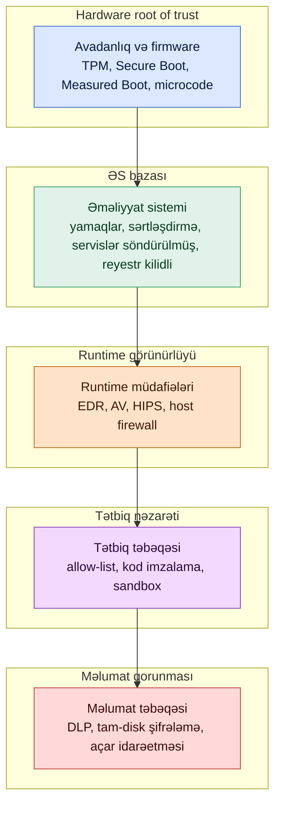

# Endpoint Təhlükəsizliyi

## Bunun əhəmiyyəti

Endpoint istifadəçinin oturduğu, parolların daxil edildiyi, sənədlərin açıldığı və zərərli e-poçt əlavələrinin ilk icra şansı tapdığı yerdir. Şəbəkə perimetri nə qədər güclü olsa da, köhnəlmiş brauzeri, şifrələnməmiş diski olan tək bir yamaqsız noutbuk bu müdafiənin çoxunu heçə endirə bilər. Endpoint təhlükəsizliyi — həmin noutbuku və ona bənzər minlərlə digərini bilinən-yaxşı vəziyyətdə saxlamağa çalışan nəzarət dəstidir; bu, aşkarlama və reaksiya qrupuna ziyankarı taclı daşlara yetişməmişdən əvvəl tutmaq üçün kifayət qədər vaxt qazandırır.

Endpoint təhlükəsizliyi həm də istifadəçiyə demək olar ki, başqa heç bir nəzarətdən yaxındır, bu da onun istifadəçi üçün əlverişli qalmasının vacib olduğunu bildirir. Hər şeyi qoruyan, lakin maliyyə komandasının cədvəl açmasına mane olan bir “locking” bir həftəyə sökülür. Bərpa ssenarisi olmayan disk-şifrələmə sxemi TPM (trusted platform module) ilk dəfə xarab olanda məlumat itkisinə səbəb olur. Hər yeniləmədə “tam sertifikasiya” gözləyən yamaq siyasəti məlum istismar edilən bir zəifliyi üç ay açıq saxlayır. Yaxşı endpoint təhlükəsizliyi — sərtləşdirilmiş baza, runtime aşkarlama və bütün bu mexanizmi cihazlara güvənən insanları əzmədən hərəkətdə saxlayan əməliyyat prosesi arasında balansdır.

Bu dərs firmware səviyyəsindən yuxarıya doğru yığılmanı izləyir: yükləmə bütövlüyü, əməliyyat sisteminin sərtləşdirilməsi, runtime müdafiələri, məlumat qorunması və nəhayət yamaq idarəetməsi. Nümunələr fiktiv `example.local` təşkilatı və `EXAMPLE\` domenindən istifadə edir. Məhsul kateqoriyaları neytral adlandırılır — prinsiplər vendorlar arasında eynidir; yalnız menyu və ikonalar fərqlənir.

Hər endpoint proqramının özü üçün cavab verməli olduğu suallar:

- **Bütövlük** — təşkilat verilmiş bir noutbukun təsdiqlədiyi proqram təminatından, təsdiqlədiyi firmware-dan və təsdiqlədiyi konfiqurasiyalardan yükləndiyini sübut edə bilərmi?
- **Görünürlük** — ziyankar bir şey işləyərsə, telemetriya onu mərkəzi konsola kifayət qədər sürətlə çatdırırmı?
- **Lokallaşdırma** — bir host kompromis edildikdə, insan kabeli çıxarmağı gözləmədən onu şəbəkədən və həssas məlumatlardan təcrid etmək mümkündürmü?
- **Məlumat qorunması** — cihaz oğurlanarsa, itərsə və ya səhv disk içərisində qalaraq silinməyə göndərilərsə, məlumat oxunmazdırmı?
- **Bərpa imkanı** — endpoint silinərsə, yenidən quraşdırılarsa və ya dəyişdirilərsə, istifadəçi təmiz, uyğun quruluşda nə qədər tez məhsuldar olacaq?
- **Əhatə** — cihazın hər sinfi (Windows, Linux, macOS, mobil, kiosk, server) həqiqətən qeydiyyata alınıbmı, yoxsa komandanın unutduğu adacıqlar varmı?

Bu altı sual müdafiə edilə bilən istənilən endpoint proqramının onurğasıdır. Dərsin qalan hissəsi bu suallara cavab verən nəzarətlər haqqındadır.

## Əsas anlayışlar

Endpoint təhlükəsizliyi yığma məsələsidir. Ən altda avadanlıq və onun firmware-ı yerləşir; onun üstündə əməliyyat sistemi, sonra runtime və proqramlar, sonra məlumat. Ciddi bir endpoint proqramı hər səviyyəyə nəzarət qoyur, çünki bir səviyyədəki nəzarət nadir hallarda başqa səviyyədən başlayan hücumu dayandırır. Qalanı buradan başlayır.

### Endpoint müdafiə yığını — antivirus, anti-malware, EDR və XDR

Endpoint müdafiəsi — təhlükəsizlik perimetrini şəbəkəyə qoşulan cihazlara qədər genişləndirmə konsepsiyasıdır. Tək bir məhsul hər şeyi əhatə etmir — müasir endpointlər bir yığın işlədir və hər təbəqə üstündəki və ya altındakı təbəqənin etmədiyini idarə edir.

**Antivirus (AV)** məhsulları zərərli proqramları, makroları və faylları müəyyən etməyə, neytrallaşdırmağa və ya silməyə çalışır. Başlanğıcda kompüter viruslarını aşkarlamaq üçün nəzərdə tutulmuşdu; müasir paketlərin əksəriyyəti indi virusları, qurdları, Trojanları, ransomware yükləyicilərini və istənməyən proqram təminatının geniş sinifini əhatə edir. Antivirus mühərrikləri iki tamamlayıcı üsulla skan edir. *İmza əsaslı skanlama* fayl və yaddaşdakı nümunələri məlum-pis hash və bayt ardıcıllıqları lüğəti ilə müqayisə edir. Məlum təhlükələr üçün sürətli və dəqiqdir, lakin yalnız lüğətin bildiklərini tutur — buna görə də lüğət hər bir neçə saatdan bir yenilənməlidir. *Evristik skanlama* konkret imzalar əvəzinə şübhəli davranış və quruluşa baxır: şifrələmə/deşifrələmə dövrləri, başqa prosesi boşaltma cəhdləri, özünü dəyişdirən kod, əmr qabığını doğuran makrolar. Evristika yeni təhlükələri tutur, lakin daha çox yalançı pozitivlər yaradır.

**Anti-malware** — klassik antivirus mühərrikinin buraxdığı hər şeyi əhatə edən daha geniş termindir: adware, spyware, potensial olaraq istənməyən proqramlar, məlumat oğurlayanlar və fişinq və ya yoluxmuş saytlar vasitəsilə yayılan kommersiya trojanları. Praktikada müasir kommersiya məhsulları antivirus və anti-malware mühərriklərini birlikdə qablaşdırır; fərq əsasən marketinq materiallarında qalır.

Antivirus və anti-malware məhsullarının alıcısının tələb etməli olduğu imkanlar:

- **Avtomatlaşdırılmış yeniləmələr** — imzalar və mühərrik komponentləri istifadəçi müdaxiləsi olmadan gündə bir neçə dəfə yenilənir.
- **Cədvəlli avtomatik skanlar** — tam disk və sürətli skan işləri növbə ilə, konkret disklər və fayl növlərinə yönəlmiş şəkildə işləyir.
- **Media skanlaması** — USB disklər, optik media və digər çıxarılan yaddaş qoşulanda avtomatik skan edilir.
- **Əl ilə tələb əsaslı skanlar** — istifadəçilər və ya adminlər konkret fayl, qovluq və ya diskin skanını başlada bilər.
- **E-poçt skanlaması** — daxil və çıxan mesajlar və əlavələr poçt müştərisinə çatmazdan əvvəl skan edilir.
- **Həll variantları** — yoluxmuş fayllar karantinə alına, təmizlənə və ya silinə bilər; istifadəçi sorğuları konfiqurasiya edilə bilər.

**Endpoint detection and response (EDR)** daha dərinə gedir. Antivirus “bu fayl pisdir?” sualını verdiyi halda, EDR “bu proses pis davranırmı?” sualını verir — və davamlı verir, proseslərdən, şəbəkə bağlantılarından, reyestr dəyişikliklərindən, modul yüklənmələrindən, skriptlərdən və alt-proses zəncirlərindən gələn telemetriya mərkəzi konsola axır. EDR analitikə hər endpointin nə etdiyinin axtarıla bilən qeydini, bir klikləmə ilə hostu şəbəkədən təcrid etmək imkanını və prosesi öldürə və ya ransomware şifrələmə işini geri qaytara bilən avtomatik reaksiya playbookları verir. EDR məhsullarının əksəriyyəti artıq antivirus, anti-malware, proqram yamaq tövsiyələri, host firewall nəzarəti və bəzi məlumat itkisinin qarşısının alınması əsaslarını tək bir agentdə ehtiva edir ki, bu da əməliyyatları sadələşdirir.

**Extended detection and response (XDR)** EDR modelini endpointdən kənara genişləndirir — e-poçt, identiklik, bulud iş yükləri və şəbəkə telemetriyası eyni korrelyasiya mühərrikini qidalandırır. EDR və XDR arasındakı sərhəd praktikada qeyri-səlisdir; faydalı zehni model budur ki, EDR endpoint hekayəsinə, XDR isə çarpaz-telemetriya hekayəsinə sahibdir.

**Unified endpoint management (UEM)** — qarışıq parkı (stolüstü, noutbuk, smartfon, planşet, kiosk) tək konsoldan idarə etmək və qorumağa yönəlmiş yan kateqoriyadır. UEM konfiqurasiya bazalarını tətbiq edir, proqramları göndərir və uyğunluq hesabat verir; adətən təhlükəsizlik komandasına cihazın ümumiyyətlə mövcud olduğunu bildirən sistemdir.

**Müdafiə yığınının xülasəsi:**

| Təbəqə | Aşkarlayır | Qarşısını alır | Cavab verir | Uyğun olduğu yer |
|---|---|---|---|---|
| Antivirus | İmza ilə məlum zərərli proqram, bəzi evristika | Uyğun gələn faylların icrası | Karantin, təmizlik, silmə | Kütləvi zərərli proqram, fişinq əlavələri |
| Anti-malware | Daha geniş istənməyən proqram, adware, spyware | Uyğun proqramın quraşdırılması | Silmə, bloklama | Qanuni proqramla gələn istehlakçı sinifli təhlükələr |
| EDR | Davranış, hadisələr zənciri, yaddaşda | Prosesi öldürmə, təcrid, geri qaytarma | Hostun təcridi, playbook hərəkətləri | Hədəfli hücumlar, lateral hərəkət, ransomware |
| XDR | Endpoint, e-poçt, identiklik, bulud arasında çarpaz siqnal korrelyasiyası | EDR üstəgəl korrelyasiyalı nəzarətlər | Vahid case, çarpaz-təbəqə playbook | Çoxmərhələli müdaxilələr |
| UEM | Uyğunluq sürüşməsi, çatışmayan nəzarətlər | Baza tətbiqi | Konfiqurasiya göndərmə, qeyri-uyğun cihazı karantin | Park gigiyenası və əhatə |

### Preventiv nəzarətlər — NGFW, host firewall, DLP, HIDS/HIPS, allow-list

Runtime aşkarlaması prevensiyanın ötürdüyünü tutur. Prevensiya hələ də daha ucuz nəzarətdir. Endpoint üzərində və ya yaxınında bir neçə preventiv texnologiya yaşayır.

**Next-generation firewall (NGFW)** yalnız mənbə, təyinat və portla deyil, özündən keçən trafiki yoxlayır. Klassik firewall L3/L4 səviyyəsində qərar verir; NGFW tətbiq yükünü — HTTP, DNS, TLS metadata, SMB — də oxuyur və gələn zərərli məzmunu və ya çıxan eksfiltrasiyanı bloklaya bilər. NGFW adətən endpointdə deyil, şəbəkə kənarında yerləşir, lakin hosta çatan pis trafikin həcmini azaltdığı üçün endpoint müdafiə hekayəsinin bir hissəsidir.

**Host əsaslı (şəxsi) firewallar** onun host ekvivalentidir. Hər əsas əməliyyat sistemi artıq bunu göndərir: Windows-da Windows Defender Firewall, Linux-da `iptables`/`nftables`, macOS-da Application Firewall, BSD-də `pf`. Bir endpointin həqiqi istifadə nümunəsinə uyğunlaşdırılmış host firewall perimetr firewall-un görə bilmədiyi trafiki tutur — məsələn, kompromis edilmiş noutbukun eyni Wi-Fi şəbəkəsindəki başqa cihaza pivot etməyə cəhdi.

**Data loss prevention (DLP)** həssas məlumatın mühitdən xəbərdar olmadan çıxmasının qarşısını almağa çalışır. Endpointdə DLP fayl fəaliyyətinə nəzarət edir: çıxarılan mediaya kopyalar, bulud yaddaş sinxronizasiya müştərilərinə yükləmələr və təsnif olunmuş məzmunun çıxan e-poçta əlavə edilməsi. Endpoint DLP-ni nizamlamaq çətindir — qaydalar sürüşür, agentlər performansa zərər verir, yalançı pozitivlər istifadəçiləri əsəbiləşdirir — buna görə də əksər yetkin proqramlar yüngül endpoint DLP-ni məhsulun mərkəzləşdiyi poçt və yaddaş xidmətlərindəki server tərəfli DLP ilə birləşdirir.

**Host əsaslı intrusion detection sistemləri (HIDS)** host fəaliyyətini — fayl bütövlüyü, log nümunələri, prosesin başlaması, şəbəkə soketləri — müdaxilə əlamətləri üçün izləyir. Tək hosta bağlı olduqları üçün həmin hostun konkret tətbiqlərinə uyğunlaşdırıla bilirlər və bu da səs-küyü azaldır. HIDS hesabat verir; hərəkət etmir. **Host əsaslı intrusion prevention sistem (HIPS)** — həm də cavab verə bilən HIDS-dir: bağlantını atmaq, prosesi öldürmək, soketi sıfırlamaq. Trade-off — HIPS həm də səhv cavab verə və qanuni iş axınını dayandıra bilər, buna görə də nizamlama və təhlükəsiz standart mövqe vacibdir.

**Tətbiq allow-list** (bəzən application whitelisting adlanır) əməliyyat sisteminin hansı icra edilə bilən faylları işlətməyə icazəli olduğunu məhdudlaşdırır. Qadağan olanı sadalamaq əvəzinə — mümkünsüz işdir — allow-list icazə verilənləri yol, nəşriyyatçı və ya kriptoqrafik hash ilə sadalayır və qalan hər şeyi bloklayır. Allow-list tək məqsədli maşınlarda güclüdür: verilənlər bazası serveri, kiosk və ya POS terminalı kiçik və məlum proqram dəstinə malikdir. Ümumi məqsədli istifadəçi noutbukunda allow-list-lər diqqətli kuratorluq və qanuni yeni proqram üçün qaçış yolu tələb edir.

### Yükləmə və firmware bütövlüyü — UEFI Secure Boot, Measured Boot, Boot Attestation, TPM, hardware root of trust

Firmware-a nəzarət edən hücum edən üstündəki hər şeyə nəzarət edir. Yükləmə bütövlüyü — avadanlıq, firmware və proqram yüklənməsinin gözlənilən vəziyyətdə olması və bunu sübut etmə imkanıdır.

**UEFI Secure Boot** Unified Extensible Firmware Interface-in xüsusiyyətidir; aktiv olduqda yükləmə zamanı yalnız imzalanmış sürücülər və əməliyyat sistemi yükləyiciləri işləyə bilər. Firmware özü istehsalçı tərəfindən imzalanmış və fləş yaddaşda saxlanılan kriptoqrafik açarlarla icazəsiz yeniləmələrdən qorunur. Secure Boot yükləmə səviyyəli zərərli proqramları — əməliyyat sistemindən əvvəl özünü quraşdıraraq antivirusdan tamamilə yayınan rootkitləri — bloklayır. Secure Boot Microsoft Windows və bütün əsas Linux distributivləri tərəfindən dəstəklənir.

**Measured Boot** Secure Boot-u tamamlayır: yükləmə zamanı yüklənən hər komponentin (firmware, bootloader, kernel, initial ramdisk) kriptoqrafik hash-ını hesablayır və alınan dəyərləri TPM-in platform configuration registerlərində (PCR) saxlayır. Ön-tərəfdən heç nəyi bloklamaq əvəzinə, Measured Boot sübut izi yaradır. Verifikator sonradan TPM-dən nə ölçdüyünü soruşa və məlum-yaxşı dəyərlərlə müqayisə edə bilər. Measured Boot istehsalçının imzaladığından kənara əhatəni genişləndirir.

**Boot attestation** həmin sübutun hesabat verilməsidir. TPM imzalı bəyanat — attestation — istehsal edə bilər: “yüklənən komponentlər bunlardır”. Uzaq server (VPN gateway, cihaz uyğunluq xidməti) attestation-ı qiymətləndirə və cihazın şəbəkəyə buraxılıb-buraxılmayacağına qərar verə bilər. Müasir sıfır-güvən arxitekturasında firmware-ı dəyişdirilmiş cihazın qəbulunu rədd etməyin yolu budur — hətta istifadəçi etimadnamələri doğru olsa belə.

**Trusted Platform Module (TPM)** — kriptoqrafik əməliyyatlara həsr olunmuş ana platada olan donanım çipi. Açarları yaradır və saxlayır, təsadüfi rəqəmlər istehsal edir və yuxarıda qeyd olunan platform configuration registerləri təqdim edir. TPM disk və əməliyyat sistemindən fiziki olaraq ayrıdır, buna görə də onda saxlanılan açarlar ƏS-də işləyən zərərli proqram tərəfindən oğurlana bilməz. BitLocker, FileVault və bir neçə Linux tam disk şifrələmə konfiqurasiyası disk-şifrələmə açarını saxlamaq üçün TPM-dən istifadə edir.

**Hardware root of trust** — sistemin bir səviyyəsinə dizayn etibarilə güvənilirsə, yuxarı səviyyələrin ona güvən zəncirini bağlaya biləcəyi konsepsiyadır. Root of trust-lar kiçik, təcrid olunmuş və bir neçə tapşırığa məhdudlaşdırılmışdır ki, hücum səthi minimal qalsın. TPM bir nümunədir; Apple-ın iOS/macOS silikonundakı Secure Enclave digəridir; istehsal zamanı CPU-ya yandırılmış imzalanmış boot ROM firmware-ı digəridir. Root of trust yükləmənin ilk mərhələsini yoxladıqdan sonra həmin mərhələ növbətini yoxlayır və s. — silikondan iş masası giriş ekranına qədər uzanan güvən zənciri.

### Disk şifrələməsi — FDE, SED, Opal, BitLocker, LUKS

Əməliyyat sistemini sərtləşdirmək ƏS işləyərkən məlumatı qoruyur. Disk şifrələməsi isə ƏS işləmədikdə qoruyur.

**Full-disk encryption (FDE)** diskə yazılan hər bloku şifrələyir. Maşın söndürüldükdə və ya istifadəçi girməmiş vəziyyətdə, məzmun açar olmadan oxunmazdır. Tipik FDE tətbiqləri — Windows-da BitLocker, macOS-da FileVault, Linux-da LUKS/dm-crypt — disk-şifrələmə açarını saxlamaq üçün TPM ilə inteqrasiya edir. TPM olan maşında açar yalnız yükləmə ölçmələri gözlənilən dəyərlərə uyğun gəldikdə buraxılır, bu da diskin çıxarılıb başqa maşına qoyulmasının hücum edənə giriş vermədiyi mənasına gəlir.

**Self-encrypting drive (SED)** şifrələməni disk nəzarətçisinin özünə köçürür. Hər yazma mediaya çatmadan əvvəl şifrələnir; hər oxuma nəzarətçi tərəfindən qəbul edildikdən sonra deşifrə edilir. Şifrələmə açarı diski heç vaxt tərk etmir, bu da performansı (kriptoqrafiyaya sərf olunan CPU dövrü yoxdur) və təhlükəsizliyi (açar sistem yaddaşından çıxarıla bilməz) yaxşılaşdırır. İstifadəçi və ya administrator yükləmədə diski kilidini açan identifikasiya açarı təqdim edir.

**Opal** — Trusted Computing Group-un SED idarəetməsi üçün standartıdır. Opal uyğun disklər standart interfeys təqdim edir ki, əməliyyat sistemləri və təhlükəsizlik paketləri istehsalçıdan asılı olmayaraq hər hansı Opal diskini qeydiyyata ala, kilidləyə və kilidini aça bilsin. Bu, icarəçilərə qarşılıqlı əməliyyat və əməliyyat sistemindən asılı olmayan idarəetmə hekayəsi verir.

Praktikada əksər `example.local` noutbukları **Windows üzərində BitLocker**-i TPM dəstəkli açar saxlanması ilə, Linux serverləri isə **LUKS**-u parol və ya TPM-mühürlü açarla işlədir. macOS maşınları oxşar formada **FileVault** istifadə edir. Dataya-mərkəz tərəfində Opal ilə SED-lər host əməliyyat sistemi şifrələmə vergisini götürmədən donanım-performans yolu təqdim edir.

**Disk şifrələmə variantlarının müqayisəsi:**

| Variant | Şifrələmə harada baş verir | Açar saxlanması | Performans | Tipik istifadə |
|---|---|---|---|---|
| BitLocker (proqram + TPM) | CPU, ƏS səviyyəsi | TPM mühürü | Müasir CPU-larda yaxşı | Windows noutbukları və stolüstü |
| LUKS / dm-crypt | CPU, ƏS səviyyəsi | TPM və ya parol | Yaxşı | Linux serverləri və stolüstü |
| FileVault | CPU, ƏS səviyyəsi | Secure Enclave | Yaxşı | macOS endpointləri |
| SED (vendor) | Disk nəzarətçisi | Diskdə, yüklemədə açılır | Ən yaxşı, CPU xərci yoxdur | Serverlər, həssas iş stansiyaları |
| Opal ilə SED | Disk nəzarətçisi, standartlaşdırılmış | Diskdə | Ən yaxşı | Çox-vendor parkları |

### Sistem sərtləşdirilməsi — hücum səthinin azaldılması, reyestr, açıq portlar/servislər, kod imzalanması, sandboxing

Sərtləşdirmə — sistemin nəzərdə tutulmuş iş üçün nəyə ehtiyacı olduğunu müəyyən etmək və qalan hər şeyi söndürmə prosesidir. Sistemin səthi nə qədər dardırsa, indi və ya gələcəkdə o qədər az zəiflik təqdim edə bilər.

**Hücum səthinin azaldılması** — ümumi termindir. İstifadə olunmayan portların bağlanması, istifadə olunmayan servislərin söndürülməsi, standart hesabların silinməsi, fayl icazələrinin sərtləşdirilməsi, parol siyasətinin tətbiqi və müəyyən rolun ehtiyac duymadığı funksiyaların söndürülməsini (məsələn, heç vaxt admin skriptləri işlətməyən maşınlarda Windows Script Host-un söndürülməsini) əhatə edir.

**Açıq portlar və servislər.** Maşınlardakı servislərə TCP və ya UDP portları vasitəsilə çatılır. Açıq olan, lakin faydalı funksiya göstərməyən port — pulsuz hücum səthidir. Hər dinləyən portu tələb olunan servisə xəritələşdirin; qalanı bağlayın və ya bloklayın. Windows-da `netstat -ano`, Linux-da `ss -tulpen` kimi alətlər və ayrı maşından hosta qarşı `nmap` müdafiəçiyə hücumçunun kəşfiyyat zamanı aldığı eyni görüntü verir.

**Reyestr.** Windows reyestri əməliyyat sistemi və tətbiq konfiqurasiyasının mərkəzi deposudur. O, güclü və təhlükəlidir — məhdudiyyətsiz reyestr girişi zərərli proqrama davam etmək, gizlənmək və ya yüksəltmək üçün asan yer verir. Reyestrin sərtləşdirilməsi redaktə alətlərini məhdudlaşdıran qrup siyasətlərini tətbiq etməyi, reyestri cədvəl üzrə ehtiyat nüsxəyə almağı və adi davamlılıq açarlarına (`Run`, `RunOnce`, servis açarları, image-file-execution-options) yazmaları EDR və ya HIDS vasitəsilə izləməyi əhatə edir.

**Kod imzalama** icra edilə bilən faylı rəqəmsal imza vasitəsilə onun nəşriyyatçısına bağlayır. Əməliyyat sistemi yükləyicisi faylı işə salmadan əvvəl imzanı yoxladıqda, istifadəçi kodun iddia edilən nəşriyyatçıdan gəldiyinə və imzalanmadan sonra dəyişdirilmədiyinə ağlabatan təminat alır. Kod imzalama Windows-da sürücü bütövlüyü üçün, Linux-da paket bütövlüyü üçün (GPG imzaları ilə `rpm`, `apt`) və yuxarıda müzakirə olunan allow-list siyasətləri üçün təməldir. Sərtləşdirmə proqramı daxili proqram təminatı üçün də, məhdud xarici nəşriyyatçı dəstinə güvənmək üçün də kod imzalanmasını tələb edir.

**Sandboxing** prosesi sistemin qalan hissəsindən təcrid edir. Brauzerlər hər nişanı sandbox-da işlədir ki, kompromis edilmiş renderer sandbox-dan kənardakı faylları oxuya bilməsin; PDF oxuyucuları, sənəd baxıcıları və e-poçt müştəriləri oxşar şey edir. Sandbox hücum edənin qaçmalı olduğu sərhəddir; sərhədin hər təbəqəsi istismar xərcini artırır. Virtuallaşdırma bütöv sistemlər üçün sandbox formasıdır — şübhəli fayl tək istifadəlik VM-də açıla və hosta risk olmadan araşdırıla bilər.

### Yamaq idarəetmə həyat dövrü — inventarizasiya, kateqoriyalaşdırma, test, yerləşdirmə, yoxlama

Hər əməliyyat sistemi və hər proqram zəifliklərlə göndərir; hər vendor nəhayət onları yamayır. “CVE dərc edildi”-dən başlayıb “parkdakı hər cihaz artıq açıq deyil”-lə bitən proses — yamaq idarəetməsidir.

**Yeniləmə iyerarxiyası.** Vendorlar fərqli ölçülü yeniləmələr üçün fərqli adlar istifadə edir. **Hotfix** — konkret problem üçün kiçik, hədəflənmiş yeniləmədir və tez işlənib buraxılır. **Patch** — bir neçə problemi həll edə biləcək və bəzən funksiya əlavə edə biləcək daha formal, daha böyük yeniləmədir. **Service pack** — çox sayda patch və hotfix-i tək quraşdırmada yığan böyük yığılmış paketdir — sistemi ən son məlum-yaxşı səviyyəyə bir dəfəyə çatdırmaq üçün nəzərdə tutulmuşdur.

**Həyat dövrü** layihə deyil, dövrdür:

1. **İnventarizasiya** — parkdakı hər cihazı, hər əməliyyat sistemini və hər tətbiqi bilin. Yamaq idarəetmə konsolu onu sadalaya bilmirsə, yamaqlanmayacaq.
2. **Kateqoriyalaşdırma** — yeniləmələri şiddətə görə (kritik, yüksək, orta, aşağı) və aktiv istismar edilən zəifliyi həll edib-etməməsinə görə təsnif edin. Məlum-istismar edilən zəifliklər “normal” kadansdan asılı olmayaraq növbənin əvvəlinə keçir.
3. **Test** — yeniləməni laboratoriya halqasında və ya kiçik pilot qrupda tətbiq edin. Yamağın təşkilatın həqiqətən işlətdiyi tətbiqləri pozmadığını təsdiqləyin.
4. **Yerləşdirmə** — adətən IT/təhlükəsizlik işçilərindən başlayıb daha geniş pilota və sonra tam parka çatan getdikcə böyüyən halqalara yayın. Bu model danışıqda “Patch Tuesday ring rollout” adlanır.
5. **Yoxlama** — yamaq konsolu hansı cihazların yeniləməni uğurla quraşdırdığını, hansının uğursuz olduğunu təsdiqləyir. Uğursuzluqlar aradan qaldırılır — onlar “diqqətə ehtiyac var” tabında sonsuza qədər qalmır.

**Üçüncü tərəf yeniləmələri** — əməliyyat sistemi istehsalçısı xaricində vendorların dərc etdikləridir: brauzerlər, PDF oxuyucuları, office paketləri, əlaqə müştəriləri, developer alətləri. Üçüncü tərəf tətbiqlərinin sayı və müxtəlifliyi proqramların həsr olunmuş alət olmadan zəif miqyaslanmasının səbəbidir. Üçüncü tərəf yamaq meneceri (bir neçə vendor tərəfindən təmin edilən korporativ alətlər və ya daha geniş UEM platformaları) ƏS-nin doğma yeniləmə sistemini əhatə etmədiyini örtür.

**Avtomatik yeniləmə** yamağın tətbiqi məsuliyyətini müştəriyə qaytarır. Əksər əməliyyat sistemləri və bir çox tətbiqlər indi yeniləmələri avtomatik yükləyən və tətbiq edən avtomatik yeniləmə funksiyası ilə göndərilir. Avtomatlaşdırma özü təhlükəsizlik nəzarətidir — NIST SP 800-53 bunu tanıyır — çünki insan intizamından asılı olan əl prosesi açıqlamadan sonra bir neçə gün ərzində drive-by istismarlara məğlub olur. Qalıq risk odur ki, pis yeniləmə qanuni iş axınını poza bilər; cavab — halqa əsaslı yayım, yeniləmə sağlamlığı haqqında telemetriya və sınaqdan keçirilmiş geri qaytarma yoludur.

## Endpoint dərinliyə-müdafiə diaqramı

Aşağıdakı diaqram aşağıdan yuxarı oxunur — bazada silikon, yuxarıda məlumat. Hər təbəqə altındakı təbəqələrin öz işini gördüyünü güman edir; hər təbəqə yuxarıdakı təbəqənin görə bilmədiyini tutur.

Diaqramı təbəqələr arasındakı müqavilə kimi oxuyun. Hardware root of trust yükləndiyi əməliyyat sisteminin təşkilatın təsdiqlədiyi olduğuna zəmanət verir. Əməliyyat sistemi bazası hücum edənin çata biləcəyi servislərin sayını azaldır. Runtime müdafiələri bir qədər zərərli kodun hələ də prevensiyadan keçəcəyini güman edir və davranışa görə tutmağa çalışır. Tətbiq nəzarətləri təsdiqlənməmiş faylların heç vaxt işləməsinə imkan vermir. Məlumat qoruması təmin edir ki, yuxarıdakı hər şey uğursuz olarsa — və cihaz itirilirsə, oğurlanırsa və ya kompromis edilirsə — məlumatın özü oxunmaz qalsın.

Heç bir tək təbəqə yetərli deyil. Firmware-ı yenidən yazılmış maşını EDR təkbaşına qoruya bilməz. Fişinq yükünün istifadəçi sessiyasında icra edilməsini TPM təkbaşına dayandıra bilməz. Dərinliyə-müdafiənin məğzi budur ki, hər təbəqə ilə hücum edənin xərci artır və təbəqələrdən birinin müdafiəçiyə görünən telemetriya yaratma ehtimalı da artır.

## Təcrübə / məşqlər

Öyrənənin ev laboratoriyasında, iş stansiyasında və ya kiçik test parkında tamamlaya biləcəyi beş məşq. Hər biri real portfoliya hissəsi olan artefakt — siyasət XML-i, GPO eksportu, firewall qaydaları, yamaq halqası tərifi — yaradır.

Başlamazdan əvvəl məşqləri həsr olunmuş test maşınında və ya virtual maşında qurun. Bəzi addımlar (servisləri söndürmə, firewall qaydaları yazma, Secure Boot-u çevirmə) istifadəçini istehsal cihazından bağlaya bilər. Hər test artefaktını `owner=<siz>` və `lifecycle=lab` ilə etiketləyin ki, təmizlik aydın olsun.

### 1. Windows endpointdə TPM ilə BitLocker-i aktivləşdirin

TPM 2.0 olan Windows 11 test noutbukunu götürün və BitLocker istifadə edərək tam-disk şifrələmə aktivləşdirin. Cavab verin:

- TPM mövcuddurmu, aktivdirmi və sahibi varmı? (`tpm.msc` və ya PowerShell-də `Get-Tpm`.)
- Bərpa açarı hara escrow edilib — domain AD obyekti, Entra ID/Azure AD cihaz qeydi, yoxsa seyfdə çap edilmiş zərf? (Heç kimin tapa bilmədiyi bərpa açarı — bərpa açarının olmamağı ilə eynidir.)
- Şifrələmə metodu XTS-AES-256-dırmı? Yeni disk üçün “yalnız istifadə edilmiş sahə” uyğundur, yoxsa yenidən istifadə edilmiş cihaz üçün tam disk şifrələməsinə ehtiyacınız var?
- UEFI-də aktivləşdirilmiş Secure Boot BitLocker ilə elə birləşirmi ki, yükləmə sırasının dəyişməsi bərpa istəklərini işə salsın?

`manage-bde -status` vasitəsilə BitLocker konfiqurasiyasını ixrac edin və açar qoruyucusunun yalnız `RecoveryPassword` deyil, `TPM` və ya `TPM+PIN` olduğunu təsdiqləyin.

### 2. Kiçik test parkında EDR agent yerləşdirin

İki və ya üç test endpointinə (Windows noutbukuna, Linux serverinə, istəyə bağlı olaraq macOS maşınına) EDR agenti quraşdırın. Onları idarəetmə konsolunda qeydiyyatdan keçirin və cavab verin:

- Konsol hər üç endpointi görürmü, gözlənilən versiya və gözlənilən siyasət ilə hesabat verirmi?
- Konsol vasitəsilə bir endpointi şəbəkədən təcrid edib sonra bağlantını bərpa edə bilirsinizmi?
- Agentin telemetriyası şübhəli URL-ə `Invoke-WebRequest` PowerShell icrasını qəsdən icra etdiyiniz zaman göstərirmi? Alert nə qədər tez gəlir?
- Agentin açdığı üç ən çox yayılmış alert üçün sənədli playbook varmı ki, analitik hər dəfə sıfırdan başlamasın?

### 3. Windows və Linux-da host-firewall qaydası yazın

Windows endpointində `New-NetFirewallRule` (PowerShell) və ya `netsh advfirewall` istifadə edərək çıxan trafiki müəyyən IP diapazonuna bloklayın, icazə verilmiş idarəetmə portları istisna olmaqla. Linux serverində ekvivalent `nftables` və ya `iptables` qaydaları yazın. Cavab verin:

- Qaydalar Windows-da düzgün profilə (Domain, Private, Public) və ya Linux-da düzgün interfeysə yönəldilibmi?
- Standart mövqe `deny` açıq allow qaydaları ilə, yoxsa `allow` açıq deny ilə? Siyasətiniz əslində hansını tələb edir?
- Bloklar üzərində loglar aktivdirmi ki, SIEM təkrar rədd edilmiş bağlantıları görə bilsin?
- Qayda yenidən yüklənmədən sağ çıxırmı? (`netsh advfirewall` qaydaları davamlıdır; iptables qaydaları `nftables` və ya `firewalld` onları idarə etmədikcə `iptables-save` tələb edir.)

Hər iki qaydanı versiya-nəzarətli fayllara ixrac edin ki, infrastruktur-as-code-dan nəzərdən keçirilə, müqayisə edilə və yenidən yerləşdirilə bilsinlər.

### 4. Windows Defender Application Control (WDAC) və ya AppLocker allow-list siyasəti yazın

Tək məqsədli bir maşın seçin — verilənlər bazası serveri, kiosk, build agenti. Onun qanuni olaraq işlətdiyi icra edilə bilənləri və skriptləri sadalayın. WDAC və ya AppLocker-də həmin konkret nəşriyyatçılara, yollara və ya hashlara icazə verən və qalan hər şeyi bloklayan siyasət yazın. Cavab verin:

- Siyasət `audit` rejimində başlayırmı? (Başlamalıdır. Tam audit dövrü olmadan enforce rejimi istifadəçiləri bağlayacaq.)
- Enforce-a yüksəltməzdən əvvəl audit nə qədər işləyir? (Bir həftə minimum; bir ay daha real.)
- İstisnalar necə idarə olunur — bilet vasitəsilə ad-hoc təsdiqlər, yoxsa siyasət boru xətti ilə əlavə olunan dar əhatəli qayda?
- Tətbiq olunan siyasət saat 03:00-da kritik tətbiqi bloklayarsa, geri qaytarma yolu nədir?

Siyasəti qrup siyasəti və ya Intune vasitəsilə göndərin və XML-i pull-request iş axını ilə Git deposunda saxlayın.

### 5. Patch Tuesday halqa rollout-u dizayn edin

Təxminən 1,500 endpointdən ibarət park üçün aylıq Microsoft təhlükəsizlik yeniləmələri üçün halqa əsaslı rollout planı tərtib edin. Cavab verin:

- Neçə halqa istifadə edirsiniz? (Üçdən beşə qədər tipikdir: pilot, erkən, geniş, gec.)
- Hansı komandalar pilot halqasında oturur və erkən xəbərdarlıq müqabilində erkən pozulma riskini qəbul edir?
- Halqalar arasında keçid nədir — telemetriya əsaslı (xətalarda artım yoxdur), zaman əsaslı (48 saat) və ya hər ikisi?
- Məlum-istismar edilən zəifliklər (CISA Known Exploited Vulnerabilities kataloqunda olanlar) necə idarə olunur? Onlar adətən normal halqaları atlayır və günlərlə deyil, saatlarla yerləşdirilir.
- CISO-ya hesabat kadansı nədir? (Şiddətə görə yamaqlanmış parkın həftəlik faizi adətən standartdır.)

Planı bir səhifəlik runbook kimi yazın, slayd dəsti yox. Onu endpoint bazasının kod kimi yaşaması üçün WDAC siyasəti və firewall qaydaları ilə eyni depoya qoyun.

## İşlənmiş nümunə — `example.local` 1,500 noutbuk və serveri sərtləşdirir

`example.local` təxminən 1,500 endpoint işlədir: üç ofisdə işçilərin istifadə etdiyi 1,200 Windows 11 noutbuku, iki dataya-mərkəzdə 180 Linux serveri (Ubuntu LTS və Red Hat), dizayn və marketinq komandaları üçün 90 macOS noutbuku və Active Directory, fayl servisləri və yamaq idarəetmə infrastrukturu işlədən 30 Windows Server hostu. Müxtəlif boşluqları — uyğunsuz BitLocker əhatəsi, üç idarə olunmayan pilot noutbuku, Red Hat parkında EDR agentinin olmaması — aşkar edən ransomware masa-üstü məşqindən sonra CISO endpoint-sərtləşdirmə proqramını təsdiqləyir. Hədəf — məlum-yaxşı baza, aylıq ölçülür, rüblük təkmilləşir.

**Yükləmə və firmware bazası.** Hər Windows 11 noutbuku vendor tərəfindən TPM 2.0 və UEFI Secure Boot aktiv edilmiş şəkildə satın alınır. Measured Boot Windows 11-də standart olaraq aktivdir; attestation `EXAMPLE\vpn-gateway` servisi vasitəsilə VPN qəbulu üçün tələb olunur, bu servis sessiya vermədən əvvəl cihaz-uyğunluq xidmətini sorğulayır. Serverlər mümkün olduqda TPM-dən, bütün x86_64 hostlarda Secure Boot-dan və Linux-da imzalanmış kernel modullarından istifadə edir. Firmware yamaqları normal yamaq kadansında gedir, istehsalçı kritik məsləhət dərc etdikdə isə bant-dışı yeniləmələrlə.

**Disk şifrələməsi.** Bütün Windows noutbukları TPM+PIN ilə BitLocker işlədir. Bərpa açarları Azure AD cihaz qeydlərinə və on-premises-bağlı maşınlar üçün Active Directory obyektinə escrow edilir. macOS noutbukları FileVault işlədir, bərpa açarları MDM-ə escrow edilir. Linux serverləri daha yeni avadanlıqda TPM-mühürlü açarlarla LUKS və daha köhnə serverlərdə parol əsaslı açılışlarla LUKS işlədir, parol isə break-glass girişli korporativ sirr menecerində saxlanılır.

**Endpoint müdafiə yığını.** AV, anti-malware, idarə olunan host firewall və baza DLP əsaslarını ehtiva edən tək bir EDR agenti hər endpointə yerləşdirilir. Əhatə KPI-dir: platforma komandası konfiqurasiya-idarəetmə verilənlər bazasında agenti olmayan hər cihazı göstərən həftəlik hesabatları dərc edir və `EXAMPLE\it-operations` komandasında quraşdırma və ya çıxarma üçün bir həftəlik SLA var. Linux serverlərində HIDS (fayl-bütövlüyü monitorinqi artı log əsaslı aşkarlama) dataya-mərkəzdə EDR agentini tamamlayır, çünki server bazası daha stabildir və fayl-bütövlüyü monitorinqi yüksək dəyərlidir.

**Host firewall bazası.** Windows Defender Firewall qrup siyasəti ilə idarə olunur. Standart mövqe biznes tətbiqləri və idarə olunan yeniləmələr üçün kiçik icazə-siyahısı olan çıxan `deny`, və açıq şəkildə lazım olan servislər istisna olmaqla daxil olan `deny`-dir. Linux serverləri konfiqurasiya idarəetməsi (Ansible) ilə yerləşdirilən `nftables` qaydalarını işlədir, hər server rolu öz qayda fraqmentlərini töhfə verir. Bütün blok hadisələri SIEM-ə ötürülür.

**Tətbiq nəzarəti.** Tək məqsədli iş yüklərini işlədən Windows Server hostları — build serverləri, yamaq-idarəetmə serverləri, Active Directory domain controller-ləri — `EXAMPLE\code-signing-ca` ilə imzalanmış audit loglarından yaradılan siyasətlərlə enforce rejimində WDAC işlədir. İstifadəçi noutbukları yalnız audit rejimində WDAC işlədir, çünki ümumi məqsədli cihazlarda enforce rejiminin məhsuldarlıq xərci bu yetkinlik səviyyəsində çox yüksək hesab edildi; audit logları bunun əvəzinə EDR-in aşkarlama qaydalarını qidalandırır.

**ƏS sərtləşdirməsi.** Hər Windows endpoint qrup siyasəti vasitəsilə tətbiq olunan az sayda sənədli istisnalarla CIS Level 1 benchmark-ını işlədir. Linux serverləri Ansible vasitəsilə CIS Level 1 benchmark-ını işlədir, uyğunluq konfiqurasiya-idarəetmə verilənlər bazasına hesabat verilir. Etibarlı skan hostundan hər serverə qarşı açıq-port skanları həftədə bir dəfə işləyir; gözlənilməz dinləyicilər 24 saat ərzində server sahibinə bilet işə salır.

**DLP.** Endpoint DLP Windows noutbuklarında yalnız-monitor rejimində yerləşdirilir, açıq şəkildə həssas nümunələrin qısa siyahısı üçün sərt-blok qaydaları ilə — kredit kartı nömrələri, dövlət ID-ləri, təsnifat başlığı ilə qeyd olunmuş mənbə kodu. DLP işinin əksəriyyəti mail gateway və bulud-yaddaş API-sində server tərəfində işləyir, burada həcm yığılır və yalançı pozitivlər mərkəzləşdirilmiş şəkildə nizamlana bilər.

**Yamaq idarəetməsi.** Windows və Microsoft tətbiq paketi üçün Microsoft yeniləmələri dörd-halqalı kadansda gedir: pilot (IT və təhlükəsizlik işçiləri, ~30 cihaz), erkən (mühəndislik güclü istifadəçilər, ~120 cihaz), geniş (ümumi park, ~1,000 cihaz), gec (tətbiq uyğunluğu məhdudiyyətləri olan son qalan halqa, ~50 cihaz). Keçidlər həm telemetriya əsaslı, həm də zaman əsaslıdır: halqa tətbiq-qəza telemetriyasında artım gördüsə yüksəlmir və əvvəlki halqadan 24 saat ərzində heç bir halqa yerləşmir. Məlum-istismar edilən zəifliklər halqaları atlayır və bütün halqalarda eyni vaxtda 72 saat ərzində yerləşdirilir. Linux serverləri ümumi serverlərdə təhlükəsizlik yeniləmələri üçün `unattended-upgrades` və kernel və kritik paketlər üçün baxım-pəncərə əsaslı `dnf/apt` rollout-u ilə yamaq edir. Üçüncü tərəf tətbiqləri (brauzerlər, PDF oxuyucu, əlaqə müştərisi) eyni halqa quruluşu ilə inteqrasiya olunmuş üçüncü tərəf yamaq meneceri vasitəsilə yamaq edir. Uyğunluq həftəlik hesabat verilir: “parkın son təhlükəsizlik bazasında faizi, şiddət və halqa üzrə”.

**Monitorinq və cavab.** EDR telemetriyası, HIDS hadisələri, firewall denies və yamaq-statusu hesabatları hamısı `EXAMPLE\secops` SIEM-ə qidalanır. Aşkarlama qaydaları illik masa-üstü məşqindən ilk on endpoint təhlükəsinə hədəflənmişdir (ransomware hazırlığı, etimadnamə tökmə, reyestr vasitəsilə davamlılıq, PowerShell yükləmə-beşiyi, Office makro doğum, imzasız sürücü yüklənməsi, qeyri-adi servis quraşdırılması, kerberoasting, cədvəlli tapşırıq sui-istifadəsi, RDP brute force). SOC 90 gün isti telemetriya və bir il soyuq saxlayır.

**İstifadəçi təcrübəsi.** Proqram istifadəçi təcrübəsi büdcəsi saxlayır: heç bir tək nəzarətə yazılı istisna olmadan giriş vaxtı, yükləmə vaxtı və ya qavranılan tətbiq gecikməsi üçün sənədli həddən çox əlavə etmək icazə verilmir. Məqsəd — təkrarlanan istifadəçi şikayətləri nəzarətləri aşındırmadan beş il sərt qalan bazadır.

**Altı aydan sonra ölçülə bilən nəticələr.** Park əhatəsi EDR agenti üçün 99%-ə, Windows-da BitLocker və macOS-da FileVault üçün 100%-ə və yeni Linux qurğularında LUKS üçün 100%-ə çatır (daha köhnə hostlarda biletlərlə izlənən remediasiya planı var). Microsoft təhlükəsizlik yeniləmələri üçün median yamaq-dan-yerləşdirmə vaxtı 21 gündən 6-ya düşür. `EXAMPLE\it-helpdesk` komandası TPM+PIN-ə keçiddən sonra BitLocker bərpa sorğularında artım görür; qısa istifadəçi-təhsil kampaniyası artı self-service portalı vasitəsilə daha sürətli bərpa-açarı əldə etməsi həll vaxtını on dəqiqədən az edir.

Nəticə — vəziyyəti məlum olan, sapmaları görünən və bərpa yolu sınaqdan keçirilmiş endpoint parkıdır. Proqramdakı heç bir tək nəzarət yeni deyil. Birləşmə — təbəqəli, ölçülmüş və idarə olunan — `example.local`-ı “ən yaxşı cəhd sərtləşdirmə”-dən “müdafiə edilə bilən baza”-ya aparan şeydir.

## Problemlərin aradan qaldırılması və tələlər

- **Antivirusun tək başına yetərli olduğunu güman etmək.** Müasir hücum edən diskdə imza ilə uyğunlaşdırıla bilən yükü buraxmayacaq. Antivirus kütləvi təhlükələri tutur; EDR hədəflənmişləri tutur. Yalnız AV-li yığın 2005-ci ildəndir.
- **Bəzi hostlarda çatışmayan EDR agenti.** Əhatə boşluqları — hücumçuların yaşadığı yerdir. Hər build boru xətti, hər qızıl image və hər çıxarma runbook-u EDR agentini məcburi kimi qəbul etməlidir. Həftəlik “agentsiz endpoint” siyahılarını dərc edin və sayı sıfır olana qədər təqib edin.
- **TPM olmayan BitLocker və ya zəif PIN.** Açar qoruyucusu yalnız şəbəkə paylaşımında saxlanılan bərpa parolu olan BitLocker həcmi təxminən həmin paylaşımın giriş nəzarəti qədər güclüdür. TPM və ya TPM+PIN istifadə edin; bərpa açarını yalnız break-glass proseslərinin çata biləcəyi yerdə saxlayın.
- **Bərpa açarı escrow-u yoxdur.** Ana plata ilk dəfə xarab olanda və istifadəçiyə bərpa açarı lazım olanda komanda escrow-un işləyib-işləmədiyini kəşf edəcək. Bu, cavabın “yox” olduğunu öyrənmək vaxtı deyil.
- **Sürücü quraşdırması üçün “müvəqqəti” söndürülmüş Secure Boot.** Müvəqqəti demək olar ki, həmişə daimi olur. Hər Secure Boot istisnası son tarixi olan bilet kimi izlənməli və audit qaydası onun aktiv olmalı cihazda söndürüldüyü zaman alert verməlidir.
- **Host firewall standart olaraq `allow outbound`-a qurulmuş.** Çıxan — ransomware-in komanda və idarəetməsi ilə danışdığı yoldur. İdarə olunan endpointlərdə düzgün standart allow-list ilə çıxan-deny-dir, başlanğıcda qurmaq narahatedici olsa belə.
- **Audit tamamlanmadan enforce rejimində tətbiq allow-list.** Tam audit dövrü olmadan tətbiq olunan allow-list saatlar ərzində qanuni alətləri bloklayacaq və istifadəçi iş axınlarını pozacaq. Enforce-a yüksəltməzdən əvvəl həmişə ən azı bir sprint audit işlədin.
- **Reyestr davamlılıq açarları izlənilmir.** `Run`, `RunOnce`, `Services` və `Image File Execution Options` açarları klassik davamlılıqdır. EDR oradakı qeyri-adi yazmalar haqqında alert vermirsə, ransomware playbook-unun ən asan hissəsini buraxır.
- **“Hər ehtimala qarşı” işləyən istifadə olunmayan servislər.** Windows Remote Management, Telnet client, SMBv1 və ya heç kimin istifadə etmədiyi masaüstü paylaşım aləti kimi servislər hücum səthidir. Onları standart olaraq söndürün; istisnaları əsaslandırın.
- **Qorunmayan yaddaşda saxlanılan disk şifrələmə açarları.** Köhnə tətbiqlər açıldıqdan sonra açarı qorunmayan RAM-da saxlayırdılar. Müasir TPM dəstəkli konfiqurasiyalar açar tutacağını TPM-də və qorunan yaddaşda saxlayırlar. Tətbiqinizi yoxlayın; cold-boot hücumları mövcuddur.
- **Yamaq kadansı çox yavaş.** Məlum istismar edilən zəiflik növbəti yamaq pəncərəsi üçün üç həftə gözləyirsə, təşkilat öz sürətindənsə hücum edənin sürətini seçib. Məlum istismar edilən — həmişə bant-dışı gedir.
- **Üçüncü tərəf proqramı yamaqlanmır.** Brauzerlər, office paketləri, PDF oxuyucuları və əlaqə müştəriləri adi istismar yoludur. Yalnız ƏS-ni əhatə edən yamaq proqramı real təhlükələrin çoxunu buraxır.
- **Avtomatik yeniləmə “stabillik üçün” söndürülür.** Avtomatik yeniləmə halqa rollout-u və geri qaytarma hekayəsinə ehtiyac duyur, lakin onu tamamilə söndürmək endpointin adminin son toxunduğu gündə donduğu mənasına gəlir. Bu stabillik deyil; yerində qocalmaqdır.
- **UEFI administrator parolu standart və ya məlum deyil.** UEFI quraşdırması qorunmursa, fiziki girişi olan hücum edən legacy yükləməni yenidən aktivləşdirə və Secure Boot-u keçə bilər. Hər endpointdə UEFI admin parolunu qurun və escrow edin.
- **Tutduğundan çox pozan HIPS qaydaları.** Həddindən artıq aqressiv HIPS qaydası qanuni servisi öldürə bilər. Əvvəlcə yalnız-monitor rejimində nizamlayın, yalançı pozitiv faizləri nəzarətdə olduqda yalnız prevent-ə yüksəldin.
- **Qanuni işi bloklayan DLP.** Nizamsız qaydalarla sərt-blok rejimində DLP bütün proqram üçün icra dəstəyini itirmənin ən sürətli yoludur. Monitorda başlayın, konkret yüksək-etibarlı qaydaları bloka yüksəldin və görünən istisna prosesi saxlayın.
- **Serverləri unutmaq.** Endpoint təhlükəsizliyi noutbuklara diqqət etməyə meyllidir. Dataya-mərkəzdə kompromis edilmiş Linux serveri istənilən noutbukdan daha qiymətli ola bilər. Serverlər rolun stabillik və işləmə gözləntilərinə uyğunlaşdırılmış eyni intizama ehtiyac duyur.
- **Hər təbəqə üçün tək vendora etibar etmək.** Hər təbəqədə bir vendor olan təbəqəli müdafiə — fəlakətdən tək bir tədarük zənciri kompromisi uzaqdır. Əməliyyat xərci dözümlü olduqda, xüsusilə prevensiya və aşkarlama arasında, diversifikasiya edin.
- **Bir dəfə yazılan və heç vaxt nəzərdən keçirilməyən sərtləşdirmə bazaları.** CIS, STIG və vendor bazaları yeniləmələr dərc edir. Üç il əvvəlki baza sənayənin o vaxtdan bəri əlavə etdiyi nəzarətləri buraxır; illik olaraq nəzərdən keçirin.
- **Yalnız uyğunluğu ölçmək, effektivliyi yox.** “Noutbukların 100%-də EDR var” zəruridir, lakin yetərli deyil. Sonrakı sual — “EDR son red-team məşqini aşkarladımı?”. Nəticələri ölçün, yalnız işarələri yox.

## Əsas nəticələr

- Endpoint təhlükəsizliyi yığındır. Hardware root of trust, ƏS sərtləşdirilməsi, runtime aşkarlama, tətbiq nəzarəti və məlumat qoruması — hər biri digərlərinin edə bilmədiyini edir.
- Antivirus və anti-malware kütləvi təhlükələri tutur; EDR davranış və hədəflənmiş təhlükələri tutur; XDR təbəqələr arasında korrelyasiya edir; UEM hər cihazın həqiqətən qeydiyyatda olduğunu təmin edir.
- Preventiv nəzarətlər — NGFW, host firewall, DLP, HIDS/HIPS, tətbiq allow-list — aşkarlamadan ucuzdur. Onlara əvvəl investisiya edin.
- Yükləmə bütövlüyü avadanlıqdan başlayır. UEFI Secure Boot imzasız yükləyiciləri bloklayır, Measured Boot yüklənəni qeyd edir, Boot Attestation sübutu hesabat verir və TPM bunu sübut edilə bilən edən açarları saxlayır.
- Tam-disk şifrələmə — Windows-da BitLocker, macOS-da FileVault, Linux-da LUKS, donanım əsaslı tətbiqlər üçün Opal ilə SED-lər — cihaz söndürüldükdə və ya oğurlandıqda məlumatı qoruyur. TPM və ya Secure Enclave-də açar saxlanması şifrələməni güvənilir edən şeydir.
- Sərtləşdirmə hücum səthini daraldır. İstifadə olunmayan portları bağlayın, istifadə olunmayan servisləri söndürün, reyestrə nəzarət edin, kod imzalanmasını tələb edin, riskli tətbiqləri sandbox-da saxlayın.
- Yamaq idarəetməsi — inventarizasiya, kateqoriyalaşdırma, test, yerləşdirmə, yoxlama — bir dəfəlik layihə deyil, həyat dövrüdür. Halqa əsaslı rolloutlar təhlükəsizlik və sürəti balanslaşdırır. Məlum-istismar edilən zəifliklər halqaları atlayır.
- Üçüncü tərəf tətbiqləri asan hücum yoludur. Yalnız əməliyyat sistemini əhatə edən yamaq proqramı məruz qalmanın çoxunu buraxır.
- Avtomatlaşdırma təhlükəsizlik nəzarətidir. Avtomatik yeniləmə, avtomatlaşdırılmış uyğunluq hesabatı və bazalar üçün policy-as-code əl prosesi ilə mümkün olmayan şəkildə parka miqyaslanır.
- Əhatə KPI-dir. Boşluqlar — EDR-siz cihazlar, BitLocker-siz noutbuklar, HIDS-siz serverlər — hücumçuların gizləndiyi yerlərdir. Əhatəni həftədə bir dəfə ölçün.
- İstifadəçi təcrübəsi məhdudiyyətdir. İşi mümkünsüz edən nəzarət söndürülür və ya yan keçilir. Hər nəzarətin istifadəçi təcrübəsi xərcini büdcələyin və ona hörmət edin.
- Endpoint təhlükəsizliyi heç vaxt tamamlanmır. Bazalar köhnəlir, təhlükələr dəyişir və park hər dörd-beş ildən bir dəyişir. Real nəzarət — proses və onu idarə edən insanlardır.

Dərsin əvvəlindəki altı suala — bütövlük, görünürlük, lokallaşdırma, məlumat qoruması, bərpa imkanı və əhatə — yazılı cavab verən, illik nəzərdən keçirilən və icraçı sponsor tərəfindən imzalanan endpoint proqramı — miqyaslanan proqramdır. Tayfa biliyi və son GPO adlarını xatırlayan adamla cavab verən proqram ilk insidentdən sonra sağ qalmayacaq.

## İstinadlar

- NIST SP 800-53 — *Security and Privacy Controls for Information Systems and Organizations* — https://csrc.nist.gov/publications/detail/sp/800-53/rev-5/final
- NIST SP 800-123 — *Guide to General Server Security* — https://csrc.nist.gov/publications/detail/sp/800-123/final
- NIST SP 800-155 — *BIOS Integrity Measurement Guidelines (Draft)* — https://csrc.nist.gov/publications/detail/sp/800-155/draft
- NIST SP 800-147 — *BIOS Protection Guidelines* — https://csrc.nist.gov/publications/detail/sp/800-147/final
- NIST SP 800-193 — *Platform Firmware Resiliency Guidelines* — https://csrc.nist.gov/publications/detail/sp/800-193/final
- NIST SP 800-40 — *Guide to Enterprise Patch Management Planning* — https://csrc.nist.gov/publications/detail/sp/800-40/rev-4/final
- Microsoft BitLocker sənədləri — https://learn.microsoft.com/en-us/windows/security/operating-system-security/data-protection/bitlocker/
- Microsoft Windows Defender Application Control — https://learn.microsoft.com/en-us/windows/security/application-security/application-control/windows-defender-application-control/
- UEFI Forum — *UEFI Specifications* — https://uefi.org/specifications
- Trusted Computing Group — *TPM 2.0 Library Specification* — https://trustedcomputinggroup.org/resource/tpm-library-specification/
- Trusted Computing Group — *Storage Opal* — https://trustedcomputinggroup.org/work-groups/storage/
- CIS Benchmarks — https://www.cisecurity.org/cis-benchmarks
- DISA Security Technical Implementation Guides (STIGs) — https://public.cyber.mil/stigs/
- CISA Known Exploited Vulnerabilities Catalog — https://www.cisa.gov/known-exploited-vulnerabilities-catalog
- MITRE ATT&CK for Enterprise — https://attack.mitre.org/matrices/enterprise/
- OWASP Endpoint Security Guide — https://owasp.org/
