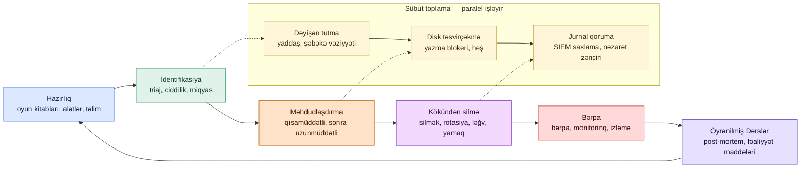

# Hadisənin Araşdırılması və Yumşaldılması

## Bunun əhəmiyyəti

Yığında olan hər təhlükəsizlik nəzarəti — firewall, EDR, SIEM, identifikasiya provayderi — siqnalları üzə çıxarmaq üçün mövcuddur. Siqnallar tək başına heç nəyi qorumur. Siqnalı müdafiə olunan təşkilata çevirən iş xəbərdarlıq işə düşdükdən sonra baş verir: kimsə xəbərdarlığı oxuyur, onun real olub-olmadığına qərar verir, miqyasını müəyyən edir, ziyanı məhdudlaşdırır, nüfuzu silir və öyrəndiklərini yazır. Bu iş hadisənin araşdırılması və yumşaldılmasıdır və onun sürəti və keyfiyyəti hadisənin aylıq hesabatda bir qeyd kimi, yoxsa yerli qəzetin baş səhifəsində bitəcəyini müəyyən edir.

Araşdırma həm də əksər mavi komandaların ən çətin saatlarını keçirdikləri yerdir. Aşkarlama mühəndisləri xəbərdarlıqları sazlayır; cavab mühəndisləri nəticələri yaşayır. Saat 03:00-da ofis IP-dən `EXAMPLE\sql-svc` üçün qeyri-adi bir girişə dair sakit xəbərdarlıq ya səhv konfiqurasiya edilmiş bir bakım işi, ya da bir müdaxilənin ilk addımıdır və onu götürən analitikin bunun hansı olduğunu anlamağa başlamaq üçün on beş dəqiqəsi var. Yaxşı aparılarsa, araşdırma dörd suala ardıcıllıqla cavab verir: nə baş verdi, nə qədər böyükdür, bunu necə dayandırırıq və bunun yenidən baş verməsinin qarşısını necə alırıq. Pis aparılarsa, heç birinə cavab vermir və təşkilat aylar sonra cavabın xəbərdarlıq gələn gecə artıq jurnallarda olduğunu kəşf edir.

Bu dərs `example.local`-da tətbiq edilən hadisəyə cavab həyat dövrünün tam müddətini — hazırlıq, identifikasiya, məhdudlaşdırma, kökündən silmə, bərpa və öyrənilmiş dərslər — və effektiv araşdırmanın asılı olduğu məlumat mənbələri, oyun kitabları və qərar nöqtələri üzərindən gedir. Nümunələr uydurma `example.local` təşkilatından və `EXAMPLE\` domenindən istifadə edir. Alətlər neytral şəkildə adlandırılır: prinsiplər SIEM, EDR və SOAR satıcıları arasında səyahət edir; yalnız menyular fərqlənir.

Hər hadisəyə cavab proqramının özü üçün cavablandırmalı olduğu suallar:

- **Sürət** — ilk xəbərdarlıqdan ilk məhdudlaşdırma fəaliyyətinə qədər neçə dəqiqə keçir?
- **Miqyas** — analitik hadisə elan etdikdə, ilk saat ərzində neçə hesabın, hostun və məlumat anbarının təsirləndiyini bilirlərmi, yoxsa hələ də təxmin edirlər?
- **Sübut** — hadisə daha sonra hüquqi bir məsələyə çevrilərsə, nəzarət zənciri toxunulmazdırmı və dəyişən sübut qorunubmu?
- **Məhdudlaşdırma keyfiyyəti** — məhdudlaşdırma fəaliyyəti rəqibi dayandırırmı, yoxsa onları xəbərdar edib zaman çizgisini yandırır?
- **Bərpa inamı** — komanda sistemləri yenidən onlayn etdikdə, sübutla nüfuzun aradan qaldırıldığını deyə bilərmi?
- **Öyrənmə** — növbəti hadisə əvvəlkindən faydalanırmı, yoxsa komanda hər rüb eyni dərsi yenidən öyrənir?

Bu altı sual müdafiə oluna bilən cavab proqramının onurğa sütunudur. Dərsin qalan hissəsi onlara cavab verən təcrübələrdən bəhs edir.

## Əsas anlayışlar

Hadisəyə cavab aşkarlama və əməliyyatlar arasında yerləşən bir intizamdır. Lüğəti hər ikisindən götürür və lüğət önəmlidir — sözləri sərbəst istifadə edən analitiklər heç kimin oxuya bilməyəcəyi hesabatlar hazırlayır.

### Hadisə vs olay vs xəbərdarlıq — terminologiya

Terminlər bir-birinin əvəzinə işlədilir və bu olmamalıdır. Burada dəqiqlik daha sonra saatlarla qarışıqlığa qənaət edir.

- **Olay** — sistem və ya şəbəkədə müşahidə edilə bilən hər hansı bir hadisə. İstifadəçi daxil oldu. Bir proses başladı. Bir paket ötürüldü. Olaylar monitorinqin xammalıdır; əksəriyyəti tamamilə xeyirxahdır.
- **Xəbərdarlıq** — aşkarlama qaydasının insan diqqətinə layiq görüldüyü olay və ya əlaqəli olaylar dəsti. Xəbərdarlıq bir hipotezdir. Doğru pozitiv, yalnış pozitiv və ya təkrar ola bilər.
- **Hadisə** — təhlükəsizlik təsiri olan təsdiqlənmiş mənfi olay. Kimsə sübut əsasında pis bir şeyin baş verdiyinə qərar vermişdir. Hadisənin ciddiliyi, sahibi, miqyası və bilet nömrəsi var.
- **Pozulma** — qorunan məlumatların təşkilatın nəzarətindən çıxdığı hadisənin alt çoxluğu. Pozulma həm tənzimləyici, həm də texniki bir termindir; bir çox yurisdiksiyada pozulma bildiriş öhdəliklərini tetikleyir.

Faydalı qayda: xəbərdarlıqlar triaj edilir, hadisələr araşdırılır, pozulmalar bildirilir. Sözləri qarışdırmaq cavabları qarışdırır.

### IR həyat dövrü — NIST SP 800-61 və PICERL

NIST Xüsusi Nəşr 800-61 İkinci Versiya dörd fazalı həyat dövrünü müəyyən edir: Hazırlıq; Aşkarlama və Təhlil; Məhdudlaşdırma, Kökündən Silmə və Bərpa; və Hadisədən Sonrakı Fəaliyyət. SANS İnstitutu PICERL akronimi altında altı fazalı bir variantı öyrədir — Hazırlıq, İdentifikasiya, Məhdudlaşdırma, Kökündən Silmə, Bərpa, Öyrənilmiş Dərslər. İkisi funksional olaraq eynidir; PICERL öyrətmək daha asandır, çünki hər fazanın bir adı var. Bu dərs PICERL istifadə edir.

**Hazırlıq.** Hadisədən əvvəl edilən hər şey. Yazılmış oyun kitabları, saxlanılan əlaqə siyahıları, növbətçi analitik üçün təmin edilmiş giriş, sınaqdan keçirilmiş sübut toplama alətləri, məlumatlandırılmış hüquqi məsləhətçi, hazırlanmış kommunikasiya şablonları, ildə iki dəfə keçirilən stolüstü oyunlar. Hadisəyə cavab keyfiyyətinin doxsan faizi hazırlıqda qərar verilir. Saat 03:00-da məhdudlaşdırma planını improvizasiya edən komanda pis improvizasiya edəcək.

**İdentifikasiya.** "Bir xəbərdarlıq işə düşdü"-dən "bu bir hadisədir"-ə keçid. Triaj ciddiliyi qərarlaşdırır, ilkin partlayış radiusunu müəyyənləşdirir və sahib təyin edir. Sübut toplama burada başlayır, çünki identifikasiya təşkilatın real bir şeyin baş verdiyi tezisinə ilk dəfə bağlandığı andır.

**Məhdudlaşdırma.** Ziyanın yayılmasını dayandırmaq üçün fəaliyyət. Qısamüddətli məhdudlaşdırma dəqiqələr ərzində edilə bilən hər hansı bir şeydir — hostu izolyasiya etmək, hesabı söndürmək, IP-ni firewall-da bloklamaq — çirkin olsa belə. Uzunmüddətli məhdudlaşdırma komandanın daha çox araşdırarkən işləməsinə imkan verən daha düşünülmüş versiyadır: karantin VLAN, ayrı sərtləşdirilmiş forensik təsvir, istehsal mühitinin seqmentləşdirilmiş kopiyası.

**Kökündən silmə.** Rəqibin nüfuzunun aradan qaldırılması. Təsirə məruz qalmış hostları silmək, etimadnamələri rotasiya etmək, sessiyaları ləğv etmək, davamlılıq mexanizmini öldürmək, girişə icazə verən zəifliyi bağlamaq. Kökündən silmə sübutla idarə olunmalıdır; gördüklərinizi kökündən silməklə görmədiklərinizi tərk etmək təşkilatların iki həftə sonra təkrar yoluxma ilə üzləşməsinin yoludur.

**Bərpa.** Təsirlənmiş sistemlərin normal əməliyyata qaytarılması, geri qayıdışı aşkarlamaq üçün sıxlaşdırılmış monitorinq ilə. Bərpa kökündən silmənin tam olduğuna inamla bağlıdır; bərpanı tələsdirmək eyni hadisənin bir sprint ərzində yenidən açılmasının yoludur.

**Öyrənilmiş dərslər.** İki həftə ərzində post-mortem, yazılı hesabat, kök səbəb təhlili və hər birinin sahibi və son tarixi olan fəaliyyət maddələri siyahısı ilə. Öyrənilmiş dərslər hadisələr arasında uzunmüddətli dəyər yaradan yeganə fazadır; onu atlamaq komandaya növbəti raundda eyni dərsi yenidən öyrətməyi vadar edir.

### Triaj — ilk 15 dəqiqə

Triaj analitikin xəbərdarlığa ilk cavabıdır: bu nədir, nə qədər ciddidir, kim bilməlidir. İlk on beş dəqiqə qalan hadisənin tonunu müəyyən edir.

İşləyən bir triaj kontrol siyahısı:

- **Xəbərdarlıq realdırmı?** Əsas aşkarlama məntiqini oxuyun. Qaydanın işə düşdüyü xam olaylara baxın. Xəbərdarlıqların təəccüblü bir hissəsi qanuni davranışa işə düşən səhv konfiqurasiya edilmiş qaydalardır.
- **Ciddilik nədir?** Müəyyən edilmiş bir miqyas istifadə edin — hər səviyyə üçün açıq nümunələri olan dörd və ya beş səviyyəli ciddilik. Ciddilik çağırma, eskalasiya və cavabın ölçüsünü idarə edir.
- **Aktiv sahibi kimdir?** İş stansiyası, server, hesab, verilənlər bazası — hər xəbərdarlıq bir aktivə toxunur və o aktivin bilməli olan sahibi var.
- **Başqa kimsə görür?** SIEM, EDR və identifikasiya provayderini çarpaz istinad edin. Tək bir xəbərdarlıq bir hipotezdir; əlaqəli xəbərdarlıqlar bir hadisədir.
- **Doğru insanları çağırın.** Müəyyən edilmiş bir çağırma siyasəti — sev-1 növbətçi liderə beş dəqiqə ərzində, sev-2 otuz dəqiqə ərzində çağırır — cavabın "kimə zəng edim" üzərində dayanmasının qarşısını alır.

Triajın çıxışı üç vəziyyətdən biridir: yalnış pozitiv (səbəb göstərib bağla), zərərsiz doğru pozitiv (annotasiya ilə bağla) və ya hadisə (bilet aç və miqyaslandırmaya keç).

### Miqyaslandırma — bu nə qədər böyükdür

Bir xəbərdarlıq hadisəyə çevrildikdən sonra növbəti sual nə qədər yayıldığıdır. Miqyaslandırma dörd suala cavab verir: hansı aktivlər təsirlənib, hansı hesablar iştirak edir, hansı məlumat risk altındadır və aktyor kimdir.

- **Aktivlər.** Xəbərdarlığı işə salan aktivdən başlayıb xaricə doğru hərəkət edin. Şəbəkə qonşuları, törədilən proseslər, yazılan fayllar, istifadə edilən etimadnamələr. Hər keçid miqyasa düyünlər əlavə edir.
- **Hesablar.** Kimin etimadnamələri iştirak edir? Xidmət hesabları, istifadəçi hesabları, maşın hesabları. Bir iş stansiyasında başlayan hadisə tez-tez orada giriş edilmiş tək imtiyazlı hesab vasitəsilə yayılır.
- **Məlumat.** Təsirlənmiş aktiv hansı məlumatı saxlayır və ya ona girişi var? PII, ödəniş məlumatları, intellektual mülkiyyət, müştəri verilənlər bazası. Məlumat miqyası tənzimləyici və hüquqi mövqeyi idarə edir.
- **Aktyor.** Bunu kim edir? Daxili xəta, daxili niyyət, kommodda zərərli proqram, hədəflənmiş hücumçu, avtomatlaşdırılmış skaner. Aktyor oyun kitabını dəyişir — ransomware komandası etimadnamə doldurma botneti kimi davranmır.

Miqyaslandırma iterativdir. İlk miqyas yanlışdır; üçüncü daha yaxındır; beşinci adətən müdafiə oluna biləndir. Hər keçidi biletdə sənədləşdirin ki, zaman çizgisi yenidən qurula bilsin.

### Sübut toplama — nəzarət zənciri, dəyişən vs qeyri-dəyişən, diskdən əvvəl yaddaş

Sübut hesabatdakı nəticələri dəstəkləyəndir və lazım olarsa, məhkəmədə dayanandır. Sübut ətrafındakı intizam hesablamadan daha qədimdir — prinsiplər fiziki araşdırmadan demək olar ki, toxunulmaz şəkildə ötürülür.

**Nəzarət zənciri** sübutu kimin, nə vaxt və onunla nə etdiyini sənədləşdirilmiş qeyddir. Sübut artefaktına toxunan hər fəaliyyət — tutma, kopyalama, ötürmə, təhlil, saxlama — vaxt damğası və operatorla qeydə alınır. Nəzarət zəncirindəki bir kəsilmə sübutun qəbul edilə bilməsində bir kəsilmədir.

**Dəyişən vs qeyri-dəyişən.** Dəyişən sübut sistem söndürüldükdə və ya proses çıxdıqda yox olur — RAM məzmunu, şəbəkə əlaqələri, işləyən proseslər, qoşulmuş fayl sistemləri, ARP cədvəlləri, DNS keşləri. Qeyri-dəyişən sübut yenidənyüklənmələrdə qalır — disk faylları, registr çətirləri, olay jurnalları (diskdəki hissələr), ehtiyat anlık görüntüləri. Dəyişkənlik sırası önəmlidir: RFC 3227 ən dəyişən sübutun araşdırma fəaliyyəti onu məhv etməzdən əvvəl ilk toplandığı qaydanı kodlaşdırdı.

**Diskdən əvvəl yaddaş.** Canlı sistemin işləyən prosesləri, açılmış şifrəli həcmləri, şəbəkə sessiyaları və söndürmə zamanı yox olan yaddaşda olan etimadnamələri var. Yaddaş əldə etmə alətləri — Windows-da WinPMEM, Linux-da LiME, bulud iş yükləri üçün AVML — sistem hələ də açıq olduğu zaman RAM təsvirini tutur. Disk təsvirçəkmə daha sonra, ideal olaraq yazma blokeri olan söndürülmüş cihazdan baş verir, analitiqin işlədiyi forensik kopiyanı yaradır, orijinalı isə sübut anbarında qalır.

**Heşləmə.** Tutulan hər artefakt tutma anında və hər girişdən əvvəl kriptoqrafik heş alır (SHA-256 müasir standartdır). Heşlər sübutun dəyişdirilmədiyini sübut edir.

### Məlumat mənbələri — hadisələri həqiqətən həll edən jurnallar

Tədqiqatçının leverajı korrelyasiya edə bildikləri məlumatdan gəlir. Yetkin proqramlar hər şeyi pis qeyd etmək əvəzinə kiçik bir yüksək dəyərli mənbə dəstinə investisiya edirlər.

- **Endpoint EDR telemetriyası** — proses ağacları, əmr sətirləri, prosesə görə şəbəkə əlaqələri, fayl yazıları, registr yazıları, modul yükləmələri. EDR endpointdə ən yüksək həll mənbəyi və müasir araşdırmalarda ən faydalı tək məlumat dəstidir.
- **Şəbəkə NetFlow və PCAP** — NetFlow hər axın üçün metadata verir (mənbə, təyinat, port, protokol, bayt sayı). PCAP seçilmiş tutma nöqtələrində tam paket məzmununu verir. NetFlow ucuz və geniş; PCAP bahalı və dardır. Hər ikisini boğaz nöqtələrində istifadə edin.
- **İdentifikasiya jurnalları** — Active Directory, Entra ID, SAML provayderləri, MFA alətlərindən autentifikasiya olayları. İdentifikasiya jurnalları "kimin etimadnamələri hara hərəkət etdi"-yə cavab verir və etimadnamə oğurluğu və yan hərəkət araşdırmaları üçün vacibdir.
- **Tətbiq jurnalları** — veb serverləri, verilənlər bazası serverləri, mail serverləri, SaaS audit izləri. Tətbiq jurnalları infrastruktur jurnallarının cavab verə bilmədiyi "istifadəçi içəri girdikdən sonra nə etdi" sualına cavab verir.
- **DNS jurnalları** — hər ad həllləməsi. DNS host firewall-un buraxdığı əmr-və-nəzarət trafikini tutur və hücumçu nəzarətindəki domenlərə məlumat eksfiltrasiyasında ən təmiz siqnalı verir.
- **Təhlükə kəşfiyyatı** — IOC fidləri, ATT&CK xəritələnmələri, satıcı hesabatları. Kəşfiyyat analitikin "bu əmr sətri X qrupunun ransomware faydalı yükünü etiraf etməsinin standart yoludur" tanımasına imkan verən şeydir.
- **Zəiflik və inventar məlumatı** — hər hostda hansı proqram var, hansı versiya, hansı məlum CVE-lər tətbiq olunur. İnventar məlumatı "bu host inandırıcı şəkildə giriş nöqtəsi ola bilərdimi"-yə cavab verir.

Hər mənbənin öz saxlama üfüqü, öz dəyəri və öz qəribəlikləri var. Bu mənbələr bir SIEM və EDR konsolunda gecə işləyən paket işləri ilə deyil, saniyələrlə işləyən çarpaz istinadlarla birləşdirildikdə araşdırma ən sürətlidir.

### Məhdudlaşdırma strategiyaları — qısamüddətli izolyasiya vs uzunmüddətli

Məhdudlaşdırma məlumatı ziyana qarşı satmadır. Komanda nə qədər çox müşahidə edirsə, rəqib haqqında bir o qədər çox şey öyrənir; komanda nə qədər çox müşahidə edirsə, rəqib bir o qədər çox ziyan verə bilər.

**Qısamüddətli məhdudlaşdırma** sürətli və çirkindir. Şəbəkə kabelini çəkin, EDR konsolu vasitəsilə hostu izolyasiya edin, hesabı söndürün, IP-ni perimetrdə bloklayın. Qısamüddətli məhdudlaşdırma vaxt qazandırır. Həm də rəqibi xəbərdar edir, bu bəzən qəbul ediləndir, bəzən deyil.

**Uzunmüddətli məhdudlaşdırma** mühəndisliklə qurulur. Təsirlənmiş hostu komandanın rəqib daha da yayılmadan müşahidə edə biləcəyi karantin VLAN-a köçürün. Orijinal forensika üçün qorunarkən istehsal iş yükləri üçün paralel sərtləşdirilmiş mühit qurun. Etimadnamələri bərpanı pozmayacaq şəkildə rotasiya edin. Qısamüddətli və uzunmüddətli arasında qərar komandanın təzyiq altında olmadığı zaman yazılmış oyun kitablarından faydalanan bir mühakimə zəngidir.

Faydalı qayda: şübhə içində olduqda, məhdudlaşdırın. Vaxtından əvvəl məhdudlaşdırmanın qiyməti bir neçə saatlıq itirilmiş araşdırmadır; gec məhdudlaşdırmanın qiyməti bütöv mülkiyyətdir.

### Kökündən silmə — zaman çizgisini yandırmadan nüfuzu silmək

Kökündən silmə rəqibin girişinin silindiyi mərhələdir. İş göründüyündən daha çətindir, çünki rəqiblər birdən çox nüfuz əkir: xidmət hesabı, başlanğıc skriptində arxa qapı, qanuni görünüşlü planlaşdırılmış tapşırıq, parol rotasiyasından sonra qalan oğurlanmış brauzer cookie-si.

Müdafiə oluna bilən kökündən silmə kontrol siyahısı:

- Təsirlənmiş hostları **silin və yenidən təsvirləyin**, onları "təmizləməyin". Təmizlənmiş host komandanın görmədiyi nüfuzun hələ də ola biləcəyi hostdur.
- **Etimadnamələri rotasiya edin** — təsirlənmiş hostlara toxunan hər hesab, onlarda işləyən hər xidmət hesabı, paylaşılan yerli admin parolu. Domen nəzarətçilərinə toxunulduqda Kerberos qızıl bilet imzalama açarını (`krbtgt`) iki dəfə rotasiya edin.
- **Sessiyaları ləğv edin** — identifikasiya provayderində, SaaS qatında, uzunömürlü tokenlər çıxaran hər yerdə. Sessiyaları ləğv edilməmiş rotasiya edilmiş parol yenə də rəqibi SaaS tətbiqlərində buraxır.
- **Giriş nöqtəsini bağlayın** — zəifliyi yamayın, səhv konfiqurasiyanı düzəldin, fişinq linkinə klikləyən istifadəçini yenidən təlim edin, qoşmanı buraxan e-poçt şluzu qaydasını yeniləyin.
- **Doğrulayın** — orijinal kompromis göstəriciləri qarşı hədəflənmiş aşkarlamalar işlədin, yenidən qurulan hostları skanlayın, sonrakı qırx səkkiz saat ərzində jurnalları izləyin. Doğrulanmamış kökündən silmə kökündən silmə deyil.

### Bərpa — sistemləri geri qaytarmaq

Bərpa təsirlənmiş sistemləri yenidən girişi aşkarlamaq üçün sazlanmış monitorinqlə istehsala qaytarır. Buradakı intizam səbrdir: hostu kökündən silmə doğrulanmazdan əvvəl istehsala qaytarmaq eyni hadisənin yenidən açılmasının yoludur.

İşləyən bir bərpa ardıcıllığı:

- Məlum-təmiz **ehtiyatdan bərpa edin** və ya qızıl təsvirlərdən yenidən qurun. Kompromisə uğramış vəziyyətdən irəliyə yuvarlamayın.
- Şəbəkəyə yenidən qoşulmazdan əvvəl giriş nöqtəsini bağlayan **yamağı tətbiq edin**.
- EDR, MDM, monitorinq və konfiqurasiya idarəçiliyinə **yenidən qeyd edin**.
- **Hədəflənmiş aşkarlama əlavə edin** — bu hadisədə görülən xüsusi göstəricilər üçün standartdan daha uzun saxlama ilə SIEM qaydası yazın. Rəqib eyni yolu yenidən sınaya bilər.
- Ən azı iki-dörd həftə **yenidən girişi izləyin**, SOC bu hadisənin xüsusi nümunələri üçün hazır olsun.

Bərpa kommunikasiyaların da dəyişdiyi vaxtdır. CISO idarə heyəti ilə danışır; tələb olunarsa, hüquq tənzimləyicilərlə danışır; müştəri-etibar komandası ictimai bəyanat hazırlayır. Bunların heç biri improvizasiya edilməməlidir.

### Öyrənilmiş dərslər — post-mortem və fəaliyyət maddələri

Post-mortem hadisənin bağlanmasından iki həftə ərzində struktur edilmiş bir görüşdür. Çıxış sabit strukturlu yazılı hesabatdır: zaman çizgisi, kök səbəb, nə yaxşı getdi, nə getmədi, fəaliyyət maddələri və bağlanmalı aşkarlama və qarşısının alınması boşluqlarının siyahısı. Hesabat liderlik tərəfindən nəzərdən keçirilir və fəaliyyət maddələri tamamlanmaya qədər izlənir.

Post-mortem qınamasızdır. Məqsəd sistem uğursuzluqlarını tapmaqdır, şəxsi günahı təyin etmək deyil — qınaqdan qorxan analitiklər real problemləri üzə çıxarmayacaqlar və növbəti hadisə eyni boşluqları təkrarlayacaq. Fəaliyyət maddələrinin sahibləri və son tarixləri var; son tarixləri olmayan öyrənilmiş dərslər hesabatları davranışı dəyişmir.

### Oyun kitabları və iş kitabları — əvvəlcədən qurulmuş qərar ağacları

Oyun kitabları sakitlikdə yazılır; xaosda işləyirlər. Xüsusi bir ssenari üçün oyun kitabı — etimadnamə oğurluğu ilə fişinq, iş stansiyasında ransomware, şübhəli daxili eksfiltrasiya — növbətçi analitikə təzyiq altında addımları kəşf etmədən izləyə biləcəkləri qərar ağacı verir. İş kitabı xidmət və ya sistem üçün əməliyyat ekvivalentidir: SIEM-i necə yenidən başlatmaq, firewall-u necə fail-over etmək, müəyyən bir bileti necə eskalate etmək.

Yaxşı bir oyun kitabı bir səhifə və ya daha azdır, əmr şəklində yazılır və stolüstü oyunlarda məşq edilir. Uzun oyun kitabları çürüyür; məşq edilmiş oyun kitabları cari qalır.

### SOAR — avtomatlaşdırma, qısaca

Təhlükəsizlik Orkestrasiyası, Avtomatlaşdırılması və Cavabı (SOAR) platformaları oyun kitabının hissələrini avtomatik olaraq icra edir: xəbərdarlığı təhlükə kəşfiyyatı ilə zənginləşdirin, EDR-ı əlaqəli fəaliyyət üçün sorğulayın, hostu izolyasiya edin, bilet açın, növbətçini çağırın. SOAR triajın yüksək həcmli, az mühakiməli hissələrində ən yaxşı işləyir. Analitik mühakiməsini əvəz etmək əvəzinə komandanın tutumunu miqyaslayır. Hər xəbərdarlıqda geri qaytarılmaz fəaliyyətləri işə salan avtomatlaşdırma məsuliyyətdir; insan fəaliyyəti təsdiqləyərkən zənginləşdirən və əvvəlcədən hazırlayan avtomatlaşdırma yaşayan modeldir.

## IR həyat dövrü diaqramı

Diaqram altı PICERL fazası vasitəsilə soldan sağa oxunur, paralel sübut toplama yolu əməliyyat fazalarının altından keçir. Öyrənilmiş Dərslər Hazırlığa qayıdır; dövrü proqramı yaxşılaşdıran şeydir.

Diaqramı fazalar arasında müqavilə kimi oxuyun. Hazırlıq identifikasiyanı mümkün edir — oyun kitabları olmadan triaj saatı sıfır anlayışdan başlayır. İdentifikasiya məhdudlaşdırmanı müdafiə oluna bilər edir — miqyas olmadan məhdudlaşdırma ya çox dar, ya da çox genişdir. Məhdudlaşdırma kökündən silməyi mümkün edir — yayılmanı məhdudlaşdırmadan rəqib komanda onları qovarkən nüfuzlar əkməyə davam edir. Kökündən silmə bərpanı təhlükəsiz edir — nüfuzu silmədən bərpa edilmiş sistem yalnız yeni bir hücum platformasıdır. Öyrənilmiş dərslər növbəti hadisəni daha qısa edir — onsuz dövrü eyni boşluqlarla təkrarlanır.

Aşağıdakı sübut yolu paraleldir, ardıcıl deyil. Yaddaş əldə etməsi identifikasiyanın hadisəni təsdiqlədiyi anda başlayır; disk təsvirçəkmə məhdudlaşdırma hostu sabitləşdirdikdən sonra davam edir; jurnal qoruma boyunca işləyir, çünki SIEM-in standart saxlanması həftələr çəkən bir araşdırma üçün nadir hallarda kifayətdir.

## Praktiki məşq

Araşdırmanın tələb etdiyi əzələ yaddaşını quran beş məşq. Hər biri bir artefakt — oyun kitabı, stolüstü transkript, yaddaş təsviri, bir səhifəlik brifinq, post-mortem — istehsal edir ki, portfolionun bir hissəsi olsun.

Bunları xüsusi bir laboratoriya mühitində və ya test infrastrukturunda açıq icazə ilə işlədin. İstehsal hesablarına, hostlarına və ya məlumatına icazəsiz toxunmaq məşqi hadisəyə çevirir.

### 1. Etimadnamə oğurluğu olan fişinq üçün oyun kitabı yazın

Müasir müəssisələrdə ən çox yayılmış ssenarini seçin: istifadəçi fişinq linkinə kliklədi, saxta giriş səhifəsinə etimadnamələrini daxil etdi və indi rəqibin etibarlı sessiyası var. Növbətçi analitik üçün bir səhifəlik oyun kitabı yazın. Cavab verin:

- İlk on dəqiqədə ilk üç fəaliyyət, sıraya görə nədir? (İpucu: sessiyaları ləğv edin, parol sıfırlamasını məcbur edin, MFA qeydiyyatını yoxlayın.)
- Hansı jurnalları çəkirsiniz və hansı sıraya görə? İdentifikasiya provayderi, mail şluzu, istifadəçinin hostundakı EDR, SaaS audit jurnalları.
- Hadisə vs zərərsiz-klikləndi-amma-etimadnamələr-yox elan etmənin tetikleyicisi nədir? Açıq olun.
- Sev-2 vs sev-1-də hansı maraqlı tərəflər çağırılır və hansı taymerdə?
- Nüfuzun aradan qalxdığını təsdiqləyən bərpa testi nədir — sınanmış sessiya yenidən oynama ilə yeni giriş, token-ləğvetmə auditi və ya təqib skanı?

Oyun kitabını qalan IR sənədləri ilə eyni Git deposunda altı ay sonra nəzərdən keçirmə tarixi ilə saxlayın.

### 2. Fayl serverində ransomware üçün stolüstü məşq keçirin

İki saatlıq stolüstü üçün IR komandasını, IT əməliyyatları lideri, hüquqi lideri və kommunikasiya liderini toplayın. Bir ssenari injekte edin: çərşənbə günü saat 14:30-da `EXAMPLE\fs-prod-01` fayl serverində EDR doxsan saniyə ərzində on iki xəbərdarlıq açır, kütləvi fayl yenidən adlandırma və kölgə-kopiya silməyi göstərir. Bunu keçin:

- Triaj və ciddilik təsnifatı — sev-1 necə, kim tərəfindən, hansı sübut əsasında elan edilir?
- Məhdudlaşdırma — serveri indi izolyasiya etmək, yoxsa yayılmanı miqyaslandırmaq üçün on dəqiqə daha izləmək?
- Kommunikasiya — CFO nə zaman öyrənir, müştəri-etibar komandası bəyanatı nə zaman tərtib edir, hüquq xarici məsləhətçini nə zaman cəlb edir?
- Bərpa — hansı ehtiyatlar təmizdir, bərpa nə qədər vaxt aparır, müştəriyə baxan təsir nədir?

Müzakirəni yazılı şəkildə tutun. Stolüstündən gələn fəaliyyət maddələri növbəti rübün hazırlıq işlərinin girişidir.

### 3. WinPMEM ilə dəyişən yaddaşı tutun

Test Windows endpointində tam RAM təsvirini tutmaq üçün WinPMEM (və ya oxşar yaddaş əldə etmə alətini) işlədin. Cavab verin:

- Təsvirin ölçüsü nədir və real hadisə zamanı bu ölçüdə təsvirləri harada saxlayacaqsınız? (Bir laptop 16-32 GB-dır; əlli laptopdan ibarət bir filo sıxışdırmadan əvvəl yarım terabaytdır.)
- Tutmada SHA-256 heşi nədir və nəzarət zənciri jurnalında necə qeyd edilir?
- Təsviri Volatility 3-də aça və işləyən prosesləri, şəbəkə əlaqələrini və yüklənmiş modulları siyahıya ala bilərsinizmi?
- Tutma nümayəndə endpointdə nə qədər vaxt apardı və tutma zamanı istifadəçinin görə bildiyi təsir nə idi?

Proseduru endpoint kompromisi üçün IR oyun kitabı daxilində iş kitabı addımı kimi sənədləşdirin. Heç vaxt məşq edilməmiş yaddaş əldə etməsi saat 03:00-da uğursuz olan yaddaş əldə etməsidir.

### 4. Aktiv hadisə üçün bir səhifəlik icraçı brifinqi yazın

Bir ssenari seçin — SaaS portala qarşı etimadnamə doldurma, tək iş stansiyasında ransomware, pozulma bildirən orta ölçülü təchizatçı — və hadisənin dörd saatına CISO və CFO-ya gedən bir səhifəlik brifinqi yazın. Brifinqdə olmalıdır:

- Məlum olanın və olmayanın iki cümləlik xülasəsi.
- Cari miqyas: neçə istifadəçi, neçə host, hansı məlumat sinifləri iştirak edir.
- İlk dörd saatda görülmüş tədbirlər, vaxt damğaları ilə.
- Növbəti dörd saatda liderlikdən tələb olunan qərarlar (hüquqi məsləhətçi cəlb etmə, müştəri bildiriş hədləri, tənzimləyici-bildiriş saatının başlaması).
- Növbəti status yeniləmə vaxtı.

Brifinq yarım səhifə fakt və yarım səhifə qərardır. Formatı bir dəfə real bir icraçı ilə sınayın. İterasiya edin.

### 5. Bağlanmış hadisə vasitəsilə post-mortem şablonu işlədin

Son rübdən aşağı ciddilikli hadisə götürün — qanuni xidməti bloklayan səhv konfiqurasiya edilmiş firewall qaydası, ekran şəklindəki təsadüfi parol sızıntısı — və ona qarşı tam post-mortem şablonu işlədin. Tutun:

- UTC-də jurnallardan gələn hər təsdiqlənmiş olay ilə zaman çizgisi.
- Bilavasitə səbəbdən sistemli olana keçərək "beş niyə" texnikasından istifadə edərək kök səbəb təhlili.
- Nə yaxşı getdi — işləyən təcrübələri qoruyun.
- Nə getmədi — xüsusi olun, sistemləri və prosesləri adlandırın, insanları yox.
- Hər biri sahibi, son tarixi və izləmə bileti olan fəaliyyət maddələri.
- Boyunca qınamasız ton.

Post-mortem sənədi təcrübəni yaxşılaşdırmaya çevirən artefaktdır. Bunları cədvəllə hazırlayan komanda hər dəfə hazırlamayan komandadan üstün gəlir.

## İşlənmiş nümunə — `example.local` etimadnamə doldurma hadisəsi

Çərşənbə axşamı saat 03:14-də, `example.local`-da SIEM `auth-stuffing-burst-v3` adlı korrelyasiya qaydasını işə salır: tək yaşayış-İSP IP blokundan son on beş dəqiqədə 200-dən çox fərqli istifadəçi adına qarşı 800-dən çox uğursuz autentifikasiya, ictimaiyyətə üzlü Microsoft 365 kirayəçisi `example.local`-a qarşı. Həmin cəhdlərdən iyirmi üçü uğurlu oldu.

**Triaj (03:14–03:25).** Standart sev-2 kanalı vasitəsilə çağırılan növbətçi SOC analitiqi xəbərdarlığı açır. Aşkarlama məntiqi sağlamdır — eyni mənbə, paylanmış hədəflər, yalnış-pozitiv hədindən yuxarı uğur dərəcəsi. 23 uğurlu autentifikasiya leveraj nöqtəsidir: analitik Entra ID-dən müvafiq giriş jurnallarını çəkir və uğurların MFA çağırışları olmadan interaktiv parol autentifikasiyaları olduğunu təsdiqləyir. Ciddilik sev-1-ə yüksəldilir və növbətçi IR lideri çağırılır.

**İdentifikasiya və miqyaslandırma (03:25–03:55).** IR lideri hadisə bileti açır və miqyası birləşdirir. 23 uğurlu autentifikasiyadan 14-ü növbəti sessiya üçün MFA tələb edən Şərti Giriş siyasətləri ilə qorunan hesablara aiddir — aktyorun parolu var, lakin ikinci faktoru tamamlaya bilmir. Doqquz hesab MFA-nın arxasında deyil; onlardan üçünə artıq sessiya tokenləri verilib və poçt qutularına daxil olmağa başlayıblar. Buna görə də miqyas üçü təsdiqlənmiş kompromisə uğramış hesabdır, hamısı marketinq şöbəsindədir, hamısının iki ay əvvəl artıq sona çatmış bir layihə üçün MFA-dan azad edildi. Aktyor əlaqəsiz pozulmadan sızdırılmış parol siyahısından istifadə edən etimadnamə doldurma botneti kimi görünür.

**Məhdudlaşdırma (03:55–04:20).** Qısamüddətli məhdudlaşdırma paralel işləyir:

- Üç təsdiqlənmiş kompromisə uğramış hesabın parolları helpdesk break-glass prosesi vasitəsilə sıfırlanır, əlaqə siyahısında nömrə olduqda istifadəçi telefonla xəbərdar edilir.
- Həmin üç hesab üçün aktiv sessiyalar Entra ID qatında ləğv edilir, aktyorun artıq istifadə etdiyi tokenləri etibarsız edir.
- Şərti Giriş `EXAMPLE\marketing` təhlükəsizlik qrupunun hamısı üçün dərhal istisnasız MFA tələb etmək üçün yenilənir. Kompromisə imkan verən MFA istisnası siyasətdən silinir və auditə əlavə edilir.
- Mənbə IP bloku identifikasiya provayderində adlandırılmış-yer blok siyahısına əlavə edilir; bu diapazondan gələn gələcək autentifikasiyalar açıq şəkildə rədd edilir.

**Kökündən silmə (04:20–05:30).** IR komandası nüfuzdan keçir:

- İlk uğurlu autentifikasiyadan məhdudlaşdırmaya qədər olan pəncərəni əhatə edən üç kompromisə uğramış hesab üçün poçt qutusu audit jurnalları çəkilir. İki hesab mesajları oxuyub; biri xarici ünvana tək mesaj yönləndirib. Yönləndirmə qaydası silinir və alıcı ünvanı hüquqi nəzərdən keçirmə üçün işarələnir.
- Üç hesabın hamısı üçün sessiya tokenləri yenidən ləğv edilir, bu dəfə dörd saatlıq pəncərədə başqa yerdə verilmiş tokenləri tutmaq üçün Microsoft Graph API-də təşkilat geniş token-ləğvetmə süpürmə ilə.
- `krbtgt` hesabı rotasiya edilmir — hadisə yerli Active Directory-yə toxunmadı — lakin IR lideri bu fəaliyyət üçün tetikleyici şərtləri biletdə qeyd edir.
- MFA sayəsində hücuma müqavimət göstərən 14 hesabın hələ də parolları sıfırlanır, çünki aktyor həmin parolların biliyini nümayiş etdirib və autentifikasiya uğursuz olsa belə kompromisə uğramış sayılmalıdır.

**Bərpa (05:30–08:00).** Təsirlənmiş istifadəçilər helpdesk doğrulama prosesi vasitəsilə təzə parollar alırlar. Kommunikasiya marketinq komandası üçün parol sıfırlamasını və siyasət dəyişikliyini izah edən qısa bildiriş tərtib edir. CISO 06:00-da bir səhifəlik statusla məlumatlandırılır; CFO miqyas möhkəmləşdikdən sonra 07:00-da daxil edilir. Monitorinq 72 saat ərzində yüksəldilmiş rejimdə davam edir: SOC-un üç hesab adı, mənbə IP bloku və gözlənilən coğrafiyalardan kənar hər hansı uğurlu autentifikasiyaya filtrlənmiş saxlanılmış görünüşü var.

**Öyrənilmiş dərslər (post-mortem, 8 gün sonra tamamlandı).** Post-mortem üç tapıntını müəyyən edir:

- **Kök səbəb** — müvəqqəti layihə üçün verilmiş MFA istisnası, layihə bitdikdə heç vaxt nəzərdən keçirilməyib. İstisna prosesinin son tarix mexanizmi yox idi. **Fəaliyyət maddəsi:** hər MFA istisnası indi yenilənmədikcə 30 gündən sonra avtomatik bitir, IAM komandasına aiddir, 21 gündə bitməlidir.
- **Aşkarlama boşluğu** — etimadnamə doldurma qaydası mövcud idi, lakin növbətçi liderə avtomatik çağırmadı; SOC analitikinin müşahidə etdiyi bir e-poçt yaratdı. **Fəaliyyət maddəsi:** sev-1 qaydaları indi birbaşa növbətçi rotasiya vasitəsilə çağırır, SIEM mühəndisliyi komandasına aiddir, 14 gündə bitməlidir.
- **Proses boşluğu** — helpdesk break-glass parol-sıfırlama proseduru səkkiz aydır sınanmamışdı; növbətçi analitik təzyiq altında iş kitabını sıfırdan oxumalı oldu. **Fəaliyyət maddəsi:** rüblük stolüstü artıq test hesabına qarşı canlı break-glass sıfırlamasını ehtiva edir, IR proqram menecerinə aiddir, 30 gündə bitməlidir və rüblük təkrarlanır.

**Nəticə.** Üç hesab orta hesabla 78 dəqiqə kompromisə uğradı; bir xarici e-poçt yönləndirilməsi yaradıldı; heç bir müştəri məlumatının eksfiltrasiya edildiyi təsdiqlənmədi. Öyrənilmiş dərslər marketinqin MFA əhatəsini fəaliyyət maddəsi pəncərəsində 92%-dən 100%-ə qaldırır və daha geniş istisna-bitiş siyasəti təşkilat geniş MFA əhatəsini 90 gün ərzində 97%-dən 99,6%-ə qaldırır. Növbəti rüblük stolüstü eyni ssenarini təzə injektlərlə və fərqli növbətçi komanda ilə işlədir; etimadnamə doldurma xəbərdarlıqlarında median triaj vaxtı 14 dəqiqədən 6-ya düşür.

## Problemlərin həlli və tələlər

- **Xəbərdarlığa hadisə kimi və ya əksinə yanaşmaq.** Xəbərdarlıqlar hipotezdir; hadisələr təsdiqlənmişdir. Çox tələsik yüksəltmə ciddilik statistikasını şişirdir; çox yavaş yüksəltmə cavabı gecikdirir. Yazılı triaj qaydasından istifadə edin.
- **Növbətçi rotasiyanın olmaması və ya heç kimin etibar etmədiyi rotasiya.** Növbətçi rotasiya işçi heyəti ilə təmin olunmalı, etibarlı şəkildə çağırılmalı və təşkilatın qalan hissəsi tərəfindən hörmət edilməlidir. İki saatda cavab verən növbətçi heç bir növbətçi ilə eynidir.
- **"Nə baş verdiyini bilirik" deyə sübut toplamağı atlamaq.** O zaman toplanmayan sübut sonradan yenidən qurula bilməz. Xüsusilə yaddaş sistem yenidən başladıldığı an itir. Əvvəlcə tutun, sonra təhlil edin.
- **Daha çox öyrənmək üçün gec məhdudlaşdırmaq.** Bir neçə əlavə saatlıq müşahidə nadir hallarda əlavə ziyana dəyər məlumatı yaradır. Məhdudlaşdırmaya doğru standart edin və hər iki yolu sənədləşdirin.
- **Çox erkən məhdudlaşdırma və rəqibi xəbərdar etmək.** Əks uğursuzluq: izolyasiya edilmiş host aktyora xəbər verir, o zaman çizgisini yandırır və dönür. Qərar kontekstuəldir; oyun kitabları növbətçiyə müdafiə oluna bilən standart verməlidir.
- **Rotasiyasız kökündən silmə.** Hostu silmək, lakin aktyorun oğurladığı etimadnamələri tərk etmək yarım işdir. Təsirlənmiş hostlara toxunan hər etimadnamə kompromisə uğramış sayılır.
- **Doğrulama olmadan bərpa.** Hostu kökündən silmə doğrulanmazdan əvvəl istehsala qaytarmaq eyni hadisənin iki həftə ərzində yenidən açılmasının yoludur. Doğrulama danışılmazdır.
- **Nəzarət zənciri yoxdur.** Hadisə daha sonra hüquqi məsələyə çevrilərsə və nəzarət zənciri pozulubsa, sübut qəbul edilməyə bilər. Hər emal fəaliyyətini vaxt damğası və operatorla qeydə alın, hətta iş yalnız texniki görünsə də.
- **Komanda yorulduğu üçün post-mortem-i atlamaq.** Post-mortem hadisələr arasında uzunmüddətli dəyər yaradan yeganə fazadır. Onu atlayan komanda hər dəfə eyni dərsi yenidən öyrənir.
- **Qınama dolu post-mortemlər.** Qınaqdan qorxan analitiklər real problemləri üzə çıxarmağı dayandırırlar. Post-mortem ton və faktda qınamasız olmalıdır, fərdi günaha deyil, sistemli uğursuzluğa yönəlmişdir.
- **Sahibləri və ya son tarixləri olmayan fəaliyyət maddələri.** Fəaliyyət maddələrinin sahibi olmayan post-mortem hesabatı heç nəyi dəyişməyən hesabatdır. Hər maddəni normal mühəndislik işi üçün istifadə olunan eyni sistemdə tamamlanmaya qədər izləyin.
- **Heç vaxt məşq edilməmiş oyun kitabları.** Yazılmış və qeydə alınmış, lakin stolüstündə heç vaxt işlədilməmiş oyun kitabı real hadisə ilə ilk təmasda uğursuz olan oyun kitabıdır. Ən azı ildə iki dəfə məşq edin.
- **Kommunikasiya şablonu yoxdur.** Hadisə real olduqda və icraçılar hər otuz dəqiqədə bir yenilik istədikdə, brifinq strukturunu tərtib etmək vaxtı keçib. Şablonlar bir səbəbə görə mövcuddur.
- **Tək bilik nöqtəsi.** Yalnız bir analitik müvafiq jurnalları çəkməyi bilirsə, hadisə həmin analitikin oyaq olmasından asılıdır. Çarpaz təlim verin və sənədləşdirin.
- **Jurnallar yetərincə uzun saxlanmır.** 30 günlük standart SIEM saxlama həftələr boyu davam edən hadisələr üçün çox qısadır. Yüksək dəyərli mənbələri müəyyən edin və onlar üçün saxlamanı 12-24 aya uzadın.
- **Təhlükə kəşfiyyat konteksti yoxdur.** Kontekstsiz IOC sadəcə bir heşdir. Təhlükə kəşfiyyatını SIEM və EDR-a bağlayın ki, analitik "qeyri-adi bir ikili işlədi" əvəzinə "bu X qrupu üçün standart hazırlama yoludur" görsün.
- **SOAR titrək xəbərdarlıqlarda geri qaytarılmaz fəaliyyətləri işə salır.** Hər orta-ciddilikli xəbərdarlıqda hostları avtomatik izolyasiya edən avtomatlaşdırma sonda kritik xidməti söndürəcək. Yalnış-pozitiv dərəcəsi yaxşı nəzarət altında olana qədər insanları geri qaytarılmaz fəaliyyətlər üçün döngüdə saxlayın.
- **IT hadisə prosesini təhlükəsizlik hadisəsi prosesi ilə qarışdırmaq.** Yavaş laptop bildirən istifadəçi IT biletidir. Fişinq klikini bildirən istifadəçi təhlükəsizlik hadisəsidir. Fərqli proseslər, fərqli SLA-lar, fərqli eskalasiya yolları. Onları qarışdırmaq hər ikisini yavaşladır.
- **Üçüncü tərəfləri unutmaq.** Bir çox hadisə təchizatçılara, SaaS satıcılarına və ya idarə olunan-xidmət provayderlərinə toxunur. Onların jurnalları, məhdudlaşdırma səlahiyyəti və bildiriş zaman çizgiləri cavabın hissəsidir. Əlaqələri əvvəlcədən danışın.
- **Orta-vaxt-tutmaq olmadan orta-vaxt-aşkarlamaq ölçmək.** Məhdudlaşdırmasız aşkarlama metrikin yarısıdır. Cüt — MTTD və MTTC — proqramın yaxşılaşıb-yaxşılaşmadığını göstərir.

## Əsas məqamlar

- Hadisəyə cavab xəbərdarlıqları müdafiə olunan təşkilata çevirən işdir. Araşdırmasız aşkarlama səs-küydür.
- Dəqiq terminologiyadan istifadə edin: olaylar, xəbərdarlıqlar, hadisələr, pozulmalar. Sözləri qarışdırmaq cavabları qarışdırır.
- PICERL həyat dövrü — Hazırlıq, İdentifikasiya, Məhdudlaşdırma, Kökündən Silmə, Bərpa, Öyrənilmiş Dərslər — hər mərhələni əhatə edir. NIST SP 800-61 eyni şeyi dörd mərhələdə deyir. Hər iki model işləyir; birini seçmək və davamlı istifadə etmək önəmlidir.
- Hazırlıq keyfiyyətin əksəriyyətinin qərar verildiyi yerdir. Oyun kitabları, çağırma, alətlər, sübut prosedurları, stolüstülər — hadisədən əvvəl qurulur, zamanı istifadə olunur.
- İlk on beş dəqiqədə triaj traektoriyanı təyin edir. Müəyyən edilmiş ciddilik miqyası, çağırma siyasəti və triaj kontrol siyahısı cavabın dayanmasının qarşısını alır.
- Miqyaslandırma iterativdir. İlk miqyas yanlışdır; hər keçidi sənədləşdirin ki, zaman çizgisi sonradan yenidən qurula bilsin.
- Sübut toplama dəyişkənlik sırasını izləyir — diskdən əvvəl yaddaş, dönəcək jurnallardan əvvəl şəbəkə vəziyyəti. Nəzarət zənciri danışılmazdır.
- Məhdudlaşdırma məlumatı ziyana qarşı satmadır. Şübhə zamanı məhdudlaşdırmaya doğru standart edin və hər iki yolda rasionalı sənədləşdirin.
- Kökündən silmə hər nüfuzun sübutla idarə olunan silinməsini tələb edir — hostları silin, etimadnamələri rotasiya edin, sessiyaları ləğv edin, giriş nöqtəsini bağlayın, doğrulayın.
- Bərpa inamla bağlıdır. Təmiz ehtiyatlardan bərpa edin, monitorinqə yenidən qeyd olun, yenidən girişi izləyin, aydın kommunikasiya edin.
- Öyrənilmiş dərslər uzunmüddətli dəyər yaradır. Sahibli fəaliyyət maddələri olan qınamasız post-mortemlər ağrını yaxşılaşmaya çevirir.
- Yüksək dəyərli məlumat mənbələri — EDR, NetFlow və PCAP, identifikasiya jurnalları, tətbiq jurnalları, DNS, təhlükə kəşfiyyatı, inventar — hadisələri həll edir. Bu bir neçə mənbəyə investisiya etmək hər şeyi pis qeyd etməkdən üstündür.
- SOAR mühakimə-yüngül işi miqyaslayır; analitik mühakiməsini əvəz etmir. Geri qaytarılmaz fəaliyyətlər üçün insanları döngüdə saxlayın.
- Əhatə cavab üçün də KPI-dir. Sınanmamış oyun kitabları, təlim olunmamış növbətçi analitikləri və məşq edilməmiş stolüstülər növbəti hadisənin tapacağı boşluqlardır.
- Həm aşkarlamanı, həm də məhdudlaşdırmanı ölçün. Orta-vaxt-aşkarlama və orta-vaxt-tutmaq birlikdə proqramın yaxşılaşıb-yaxşılaşmadığını göstərir.

Bu dərsin yuxarısındakı altı suala — sürət, miqyas, sübut, məhdudlaşdırma keyfiyyəti, bərpa inamı və öyrənmə — yazılı şəkildə cavab verən, illik nəzərdən keçirilmiş, icraçı sponsor tərəfindən imzalanmış hadisəyə cavab proqramı ilk real hadisəsindən sağ çıxan proqramdır. Ümid və növbətçinin instinktləri ilə cavab verən proqram sağ çıxmayacaq.

Bu cavab proqramının üzərində qurulan nəzarətlər və çərçivələr üçün, [endpoint təhlükəsizliyi](./endpoint-security.md), [jurnal təhlili](./log-analysis.md), [SIEM və monitorinq alətləri](../general-security/open-source-tools/siem-and-monitoring.md), [təhlükə kəşfiyyatı və zərərli proqram təhlili](../general-security/open-source-tools/threat-intel-and-malware.md) və [təhlükəsizlik nəzarətləri](../grc/security-controls.md) ilə bağlı müvafiq dərslərə baxın.

## İstinadlar

- NIST SP 800-61 Rev 2 — *Computer Security Incident Handling Guide* — [https://csrc.nist.gov/publications/detail/sp/800-61/rev-2/final](https://csrc.nist.gov/publications/detail/sp/800-61/rev-2/final)
- SANS Institute — *Incident Handler's Handbook* — [https://www.sans.org/white-papers/33901/](https://www.sans.org/white-papers/33901/)
- MITRE ATT&CK for Enterprise — [https://attack.mitre.org/matrices/enterprise/](https://attack.mitre.org/matrices/enterprise/)
- FIRST.org — Forum of Incident Response and Security Teams — [https://www.first.org/](https://www.first.org/)
- ENISA — *Good Practice Guide for Incident Management* — [https://www.enisa.europa.eu/publications/good-practice-guide-for-incident-management](https://www.enisa.europa.eu/publications/good-practice-guide-for-incident-management)
- RFC 3227 — *Guidelines for Evidence Collection and Archiving* — [https://www.rfc-editor.org/rfc/rfc3227](https://www.rfc-editor.org/rfc/rfc3227)
- NIST SP 800-86 — *Guide to Integrating Forensic Techniques into Incident Response* — [https://csrc.nist.gov/publications/detail/sp/800-86/final](https://csrc.nist.gov/publications/detail/sp/800-86/final)
- CISA — *Cyber Incident Response Playbook* — [https://www.cisa.gov/resources-tools/resources/federal-government-cybersecurity-incident-and-vulnerability-response-playbooks](https://www.cisa.gov/resources-tools/resources/federal-government-cybersecurity-incident-and-vulnerability-response-playbooks)
- Volatility Foundation — *Volatility 3* — [https://www.volatilityfoundation.org/](https://www.volatilityfoundation.org/)
- The DFIR Report — case studies of real intrusions — [https://thedfirreport.com/](https://thedfirreport.com/)
