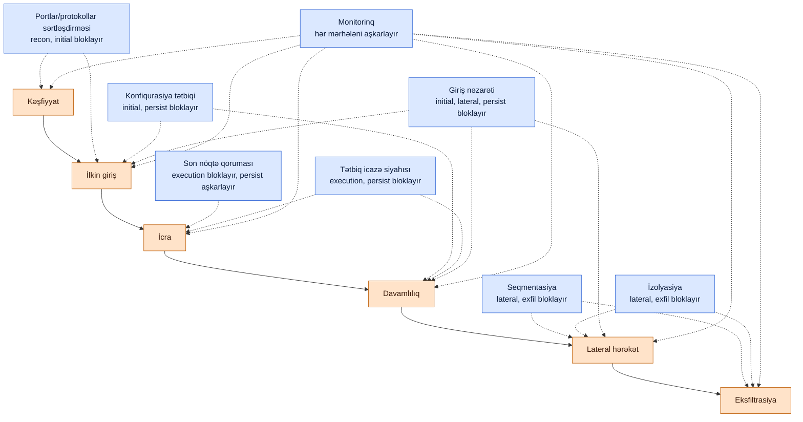

# Korporativ Mitigasiya Texnikaları

## Bu nə üçün vacibdir

Hücumların necə işlədiyini bilmək işin yarısıdır. Digər yarısı isə düzgün mitigasiyanı — yəni tətbiq və istismar olunarkən hücumun uğur qazanıb-qazanmamasını həqiqətən dəyişdirən nəzarəti seçməkdir. Mimikatz-ı təfərrüatlı şəkildə təsvir edə bilən, lakin LSASS-i sərtləşdirən konfiqurasiya bazasını, lateral hərəkəti bloklayan seqmentasiya qaydasını və ya imzasız ikiliyi dayandıran icazə siyahısını göstərə bilməyən komanda ev tapşırığını edib, lakin əsl işi etməyib. Mitigasiya — bir təhlükəsizlik proqramının görünən nəticəsidir; eyni zamanda auditorların yoxladığı hissədir.

Korporativ mitigasiya tək bir texnika deyil, səkkiz ailədir, hər biri hücum zəncirinin fərqli laylarına yönəlir. **Seqmentasiya** kompromisin nə qədər yayıldığını məhdudlaşdırır. **Giriş nəzarəti** kimin nəyə toxuna biləcəyinə qərar verir. **Tətbiq icazə siyahısı** hansı kodun işə salınmasına icazə verildiyinə qərar verir. **İzolyasiya** dəyərli sistemləri qalan hər şeydən uzaqda saxlayır. **Monitorinq** fəaliyyəti sübuta çevirir. **Konfiqurasiya tətbiqi** bazanın sürüşməsinin qarşısını alır. **Son nöqtə qoruması** hosta çatanı aşkarlayır və tutur. **İstifadə olunmayan portları və protokolları söndürmək** hücumçuların layiq olmadığı səthi aradan qaldırır.

Bu dərs hər ailəni gəzir, sonra onları hücum zəncirinə qarşı laylayır ki, kompromislər görünsün. Nümunələrdə fiktiv `example.local` təşkilatı və `EXAMPLE\` domeni istifadə olunur. Məhsul kateqoriyaları neytral şəkildə adlandırılıb — prinsiplər satıcılar arasında sərbəst hərəkət edir; yalnız menyular fərqlidir.

Hər mitigasiya proqramının özü üçün cavablandırmalı olduğu suallar:

- **Əhatə** — səkkiz ailənin hər birinin adı çəkilən sahibi, yazılı bazası və ölçülə bilən siqnalı varmı?
- **Sıralama** — büdcə sabit olduqda, sonradan ən çətin yerləşdirilən və beləliklə də əvvəlcə gələn ailə hansıdır?
- **Əməliyyat qabiliyyəti** — hər nəzarət siqnallarını oxuyan biri tərəfindən nəzərdən keçirilirmi, yoxsa o, yerləşdirilib unudulmuş bir qutudurmu?
- **Uyğunluq** — nəzarətlər bir-biri ilə döyüşürmü (iki AV agenti, ziddiyyətli firewall qaydaları, EDR icazə siyahısını pozur)?
- **Geri qaytarıla bilmə** — bir nəzarət saat 03:00-da legitim iş axınını pozduqda, "P1 hadisə açın" tələbindən daha sürətli sənədləşdirilmiş geri qayıdış varmı?
- **Auditə hazırlıq** — komanda bir saat ərzində hər nəzarətin işlədiyini və istisnaların izləndiyini sübut edə bilərmi?

Bu altı sual hər bir müdafiə oluna bilən mitigasiya proqramının onurğa sütunudur. Dərsin qalan hissəsi onlara cavab verən nəzarətlər haqqındadır.

## Əsas anlayışlar

Mitigasiya bir laylama məsələsidir. Heç bir tək ailə hər hücumu dayandırmır; kombinasiyalar əksəriyyətini dayandırır. Qalanı belədir.

### Seqmentasiya — VLAN-lar, mikro-seqmentasiya, təhlükəsizlik zonaları

Düz şəbəkə partlayış radiusunu çoxaldır. Hər host hər digər hostla əlaqə saxlaya bildikdə, tək bir dayaq nöqtəsi saatlar içində domen kompromisinə çevrilir. Seqmentasiya şəbəkəni daha kiçik parçalara bölür ki, aralarındakı trafik bir router, switch ACL-i və ya firewall tərəfindən nəzarət olunsun — və bir parçada baş verən kompromis həmin parçanın söhbət edə biləcəyi şeylərlə məhdudlaşdırılsın.

**Fiziki seqmentasiya** yüksək həssaslığa malik şəbəkələr üçün ayrı switch-lərdən, router-lərdən və kabellərdən istifadə edir (kart sahibi məlumatları, idarəetmə sistemləri, məxfi). Bahalıdır, lakin sərhəd inkaredilməzdir. **Subnetting** bir IP şəbəkəsini daha kiçik alt şəbəkələrə bölür ki, oxşar təhlükəsizlik ehtiyacları olan cihazlar qruplaşdırılıb şluzda nəzarət edilə bilsin. **Virtual LAN-lar (VLAN-lar)** tək bir switch daxilində 2-ci layda etiketlənmiş məntiqi seqmentlər yaradır; serverlər, istifadəçi iş stansiyaları, səs telefonları, printerlər və IoT cihazları hər biri öz VLAN-ını alır, VLAN-lararası trafik bir firewall vasitəsilə yönləndirilir.

**Mikro-seqmentasiya** müasir uzantıdır — hər iş yükü, çox vaxt hər proses üçün, iş yükünün harada yaşadığından asılı olmayaraq tətbiq olunan təhlükəsizlik siyasəti. Veb tier bir portda tətbiq tier ilə danışa bilər; tətbiq tier digər portda verilənlər bazası tier ilə danışa bilər; başqa heç nə icazə verilmir. Tətbiq adətən agent-əsaslı (mərkəzi nəzarətçi tərəfindən proqramlaşdırılan host firewall-ları) və ya parça-əsaslıdır (hipervizor və ya ağıllı NIC tərəfindən tətbiq edilən proqram-təminatlı şəbəkə). Mikro-seqmentasiya verilənlər mərkəzində və buludda, fiziki sərhədlərin artıq mövcud olmadığı yerdə vacibdir.

**Təhlükəsizlik zonaları** simlərin üzərindəki konseptual laydır: istehsalat vs korporativ, etibarlı vs etibarsız, yerli vs bulud, Tier 0 (domen nəzarətçiləri, PKI) vs Tier 1 (serverlər) vs Tier 2 (iş stansiyaları). Hər zonanın öz qəbul qaydaları və öz monitorinqi var. Düz mülk heç bir zonaya malik deyil; müdafiə oluna bilən mülk ən azı üç və ya dörd zonaya malikdir. [Təhlükəsiz şəbəkə dizaynı](../networking/secure-design/secure-network-design.md) bölməsində daha çox oxuyun.

Seqmentasiya həm də uyğunluğu mümkün edir — PCI DSS əhatə xaricində olan şəbəkələri bir çox tələblərdən azad edir, və HIPAA-nın qoruyucuları məlumat tanınan seqmentdə yaşadıqdan sonra arzu deyil, məcburi olur.

### Giriş nəzarəti — minimum imtiyaz, RBAC vs ABAC, default-deny

Giriş nəzarəti kim və ya nəyin hansı şərtlərdə hansı resursa toxunduğunu tənzimləyir. Onu iki əsas komponent daşıyır: nəyə icazə verildiyini deyən **giriş nəzarəti siyahıları (ACL-lər)** və resursun özündəki, hansı səviyyədə (oxu, yaz, icra, sil) icazə verildiyini deyən **icazələr**.

**Minimum imtiyaz** qaydadır ki, hər kəs — istifadəçilər, xidmətlər, skriptlər, planlaşdırılmış tapşırıqlar — iş üçün lazım olan minimum girişi alır, və artıq deyil. Satış meneceri satış hesabatına yalnız oxuma girişi alır; yalnız satış administratorunun yazma girişi var. Yedək xidmət hesabı interaktiv loginə ehtiyac duymur. Veb tətbiqinin verilənlər bazası istifadəçisi cədvəlləri silməyə ehtiyac duymur. Məqsəd kompromisin nə qədər çata biləcəyini məhdudlaşdırmaqdır, legitim işi lazım olduğundan daha çətin etmək deyil.

**Rol-əsaslı giriş nəzarəti (RBAC)** icazələri iş rolu ilə qruplaşdırır. Rollar istifadəçilərə təyin olunur; icazələr rollara təyin olunur. RBAC auditə qabildir ("`EXAMPLE\finance-readonly` rolunda kim var?") və ləğv etmək asandır ("istifadəçini roldan çıxarın"). İcazələrin kontekstdən asılı olmalı olduğu zaman — günün vaxtı, məkan, cihaz vəziyyəti — çətinlik çəkir.

**Atribut-əsaslı giriş nəzarəti (ABAC)** buna subyekt, resurs, hərəkət və mühit atributlarını qiymətləndirən siyasət mühərriki ilə cavab verir. "İstifadəçi `EXAMPLE\finance-staff` qrupundadırsa, cihaz uyğundursa, bağlantı korporativ IP-dəndirsə və iş saatlarındadırsa, `/finance/quarterly`-də oxumağa icazə ver." ABAC daha ifadəli və idarə etmək daha çətindir; yetkin proqramların əksəriyyəti hər ikisini qarışdırır.

**Default-deny** mövqedir: heç bir qayda hərəkətə açıq şəkildə icazə vermirsə, hərəkət bloklanır. Firewall-lar və router-lər üzərindəki şəbəkə ACL-ləri implisit deny-all ilə gəlir, allow qaydaları isə istisna kimi əlavə olunur. Fayl paylaşma icazələri və kimlik platforması şərti girişi eyni formanı izləməlidir. Əksi — adlandırılmış denylar ilə default-allow — hər izlənməmiş icazəni açıq saxlayır. Kimlik tərəfi üçün [AAA və inkar olunmazlıq](../general-security/aaa-non-repudiation.md) və [IAM və hesab idarəetməsi](../general-security/iam-account-management.md) bölmələrinə baxın.

### Tətbiq icazə siyahısı (whitelist) — vs deny-list, WDAC, AppLocker, SELinux, kod imzalama

**Tətbiq icazə siyahısı** işə salınmasına icazə verilənləri sayır; qalan hər şey bloklanır. **Deny-list** (block-list) əksini edir — qadağanları adlandırır. İcazə siyahıları daha güclüdür çünki pis proqram təminatının kainatı sərhədsizdir; təsdiqlənmiş proqram təminatının kainatı kiçik və tanınandır.

İcazə siyahısı qaydaları adətən üç identifikatordan birini istifadə edir: **yol** (ikilinin diskdə harada yaşadığı), **naşir** (onu kimin imzaladığı), və ya **kriptoqrafik hash** (dəqiq bit-bit kimliyi). Hash ən dəqiq və ən kövrəkdir — hər yamaq qaydanı etibarsız edir. Naşir satıcı proqram təminatı üçün ən əməliyyat qabiliyyətlidir. Yol bypass etmək üçün ən asandır (hücumçu ikiliyi icazə verilən qovluğa qoyur).

**Windows Defender Application Control (WDAC)** Windows-da kernel səviyyəli icazə siyahısıdır; siyasətlər XML-dir, təşkilat tərəfindən imzalanır və loader ikilini işə salmazdan əvvəl tətbiq olunur. **AppLocker** köhnə istifadəçi rejimi ekvivalentidir — yazmaq daha asan, motivli hücumçulara qarşı daha zəif. **SELinux** və **AppArmor** Linux-da hər ikilinin UID-indən asılı olmayaraq nə edə biləcəyini məhdudlaşdırır. **Kod imzalama** təməldir: imzalanmış ikilinin naşiri yoxlanıla biləndir, və imzasız ikili siyasətdə birbaşa rədd edilə bilər.

İcazə siyahısının xərci kuraturadır. Tək məqsədli maşınlar (kiosklar, satış nöqtələri, build agentləri, domen nəzarətçiləri) kiçik tanınan proqram dəstinə malikdir və tətbiqə asanlıqla dözür. Ümumi məqsədli istifadəçi laptopları enforce rejimindən əvvəl audit dövrü, istisna prosesi və geri qaytarılma yolu tələb edir. Bir çox təşkilatlar WDAC-i istifadəçi laptoplarında auditdə işlədir ki, aşkarlama qaydalarını qidalandırsın və serverlərdə enforce-da işlədir; bu müdafiə oluna bilən bir kompromisdir.

### İzolyasiya — sandboxing, VM/konteyner sərhədi, jump host, air gap, DMZ

İzolyasiya iki sistem arasında divar qoyur ki, bir tərəfdəki kompromis digər tərəfdəki kompromisə çevrilməsin. Divar bir **proses sandbox-ı** (brauzer tabı, PDF oxuyucu), bir **konteyner** (Linux-da namespace və cgroup sərhədi), bir **virtual maşın** (hipervizor sərhədi), bir **jump host** (administratorların məhdud zonaya istifadə etmələrinə icazə verilən yeganə yol), bir **air gap** (ümumiyyətlə şəbəkə yoxdur), və ya bir **DMZ** (düşmən və etibarlı arasında bufer şəbəkə) ola bilər.

Sandbox-lar ən ucuz izolyasiyadır; air gap-lər ən güclü və əməliyyat baxımından ən ağrılıdır. Qərar hansı aktivlərin hansı gücə layiq olduğudur. Veb brauzer sandbox-a layiqdir; domen nəzarətçisi privilegiyalı giriş iş stansiyası (PAW) qəbulu ilə Tier 0 jump host-a layiqdir; turbinlərə toxunan sənaye idarəetmə sistemi tək yönlü məlumat diodları olan air gap-ə layiqdir.

**Yamalama** və **şifrələmə** bəzən izolyasiya ilə qruplaşdırılır çünki hər ikisi pozulmanın nəticələrini azaldır: yamanmış sistem daxil olmaq üçün daha az yola malikdir; şifrələnmiş disk oğurlanmış məlumatları oxunmaz qoyur. Hər ikisi [Son nöqtə təhlükəsizliyi](./endpoint-security.md) bölməsində əhatə olunub.

### Monitorinq — adekvat sayılan nədir, log saxlama, SIEM qəbulu, alert tənzimləməsi

Monitorinq fəaliyyəti sübuta çevirən şeydir. Onsuz digər yeddi mitigasiya ailəsi kordur — bir nəzarət işləyə bilər və ya səssizcə uğursuz olur, və heç kim bilmir.

Bir müəssisə üçün **adekvat monitorinq** ən azından əhatə edir: hər kimlik təminatçısında autentifikasiya hadisələri, hər son nöqtədə proses yaradılması, hər seqment sərhədində şəbəkə axını, hər idarə olunan sistemdə konfiqurasiya dəyişikliyi və hər çıxış yolunda DLP hadisələri. Həcmlər realdır — 1 500 son nöqtə mülkü gündə yüz milyonlarla hadisə istehsal edir. Məqsəd onların hamısını oxumaq deyil, kifayət qədər kifayət qədər uzun saxlamaqdır ki, sual yarandıqda sübut orada olsun.

**Log saxlama** saxlama xərcini araşdırma çatma məsafəsi ilə balanslaşdırır. İsti saxlama (saniyələrdə axtarıla bilən) adətən 30-90 gündür; ilıq (dəqiqələr) altı aydan bir ilədəkdir; soyuq (saatlar, arxivləşdirilmiş) tənzimləmədən asılı olaraq bir ildən yeddi ilə qədərdir. Tipik bir hücumçunun davametmə vaxtından — sənaye tədqiqatları bunu təxminən 11-21 gün hesab edir — daha qısa saxlama o deməkdir ki, ən vacib hadisələr araşdırılmazdan əvvəl yox olur.

**SIEM qəbulu** logları mərkəzləşdirir ki, mənbələr arasında korrelyasiya mümkün olsun. SIEM həm də **alert tənzimləməsinin** yaşadığı yerdir: hər qayda səslidir başlayır, və ilk həftədə sağ qalan hər yalan müsbət analitik etibarını yandırır. Tənzimləmə həddləri qaldırmaq, xüsusi aktivlərə şamil etmək, məlum-yaxşı aktyorları basdırmaq və playbook-lar yazmaq deməkdir ki, alert işə düşdükdə cavab verən növbəti üç hərəkəti bilsin. [Log analizi](./log-analysis.md) və [Araşdırma və mitigasiya](./investigation-and-mitigation.md) bölmələrində daha çox oxuyun.

Çətin həqiqət: alertləri oxuyan adamlar olmadan monitorinq heç kimin açmadığı bir dəftərdir. SOC-u kadrlarla təmin etmək və ya idarə olunan aşkarlama partnyoruna ödəmək nəzarətin bir hissəsidir — ayrı bir bənd deyil.

### Konfiqurasiya tətbiqi — qızıl şəkillər, baza xətləri, sürüşmə aşkarlanması

Konfiqurasiya tətbiqi hər idarə olunan sistemi yazılı bazaya yaxın saxlayır və biri sürüşdükdə aşkarlayır. Nəzarətin üç hissəsi var: **baza** (yaxşının necə göründüyü), **yerləşdirmə** (yaxşının hər sistemə necə düşdüyü) və **aşkarlanma** (sürüşmənin necə fərq edilib düzəldildiyi).

**Baza xətləri** yazılı sənədlərdir. **CIS Benchmarks** iki sərtlik səviyyəsi üzrə platforma başına sərtləşdirmə tövsiyələri nəşr edir. **STIG** (Təhlükəsizlik Texniki Tətbiq Bələdçiləri) və **DISA** Windows, Linux, şəbəkə cihazları, verilənlər bazaları və tətbiqlər üçün DoD səviyyəli baza xətləri nəşr edir. **Satıcı baza xətləri** (Microsoft Security Baselines, Red Hat sərtləşdirmə bələdçiləri) öz platformalarını əhatə edir. Təşkilat birini həqiqət mənbəyi kimi seçir və istisnaları sənədləşdirir — tətbiq edə bilmədiyi və ya etməyəcəyi nəzarətlər və səbəbi.

**Qızıl şəkillər** yerləşdirmə artefaktıdır: hər yeni sistemi təmin etmək üçün istifadə olunan, baza xətti çəkilmiş və imzalanmış məlum-yaxşı əməliyyat sistemi qurulması. Şəkil aylıq yenidən qurulur ki, növbəti yerləşdirilmiş host ən son yamalarda və ən son baza xəttində olsun.

**Sürüşmə aşkarlanması** davamlı yoxlamadır. Konfiqurasiya idarəetmə alətləri — **Ansible**, **Puppet**, **Chef**, **Salt** — istənilən vəziyyəti Git anbarından çəkir və hər hostu cədvəl üzrə ona yaxınlaşdırır. **MDM** (mobil cihaz idarəetməsi) platformaları laptoplar və telefonlar üçün ekvivalentini edir. Host uyğunsuz tapıldıqda, alət ya bazanı yenidən tətbiq edir, ya da bilet qaldırır. Manual remediasiya miqyaslamır.

**İstismardan çıxarma** eyni ailəyə aiddir: bir sistem təqaüdə çıxdıqda, konfiqurasiya tətbiqi onu necə silməyi, hansı sübutu saxlamağı və kimliklərini və sertifikatlarını necə silməyi deyir. Heç kimin sahib olmadığı, lakin hələ də şəbəkədə olan qutu, bazanın tutmadığı bir konfiqurasiyadır.

### Son nöqtə qoruma həlləri — AV, EDR, XDR

Son nöqtə istifadəçilərin oturduğu, qoşmaların açıldığı və kimlik məlumatlarının daxil edildiyi yerdir. Son nöqtə qoruması cihazı bir sensora və bir boğaz nöqtəsinə çevirir.

**Antivirus (AV)** faylları imzalar və evristikalarla uyğunlaşdırırı. O, kommodal təhdidləri tutur — fişinq qoşmaları, drive-by yükləmələr, makro zərərli proqramı — və ucuzdur, lakin səlahiyyətli hücumçu imza ilə uyğunlaşdırılan bir yükü buraxmayacaq. Tək AV 2005-ci il nəzarətidir.

**Son nöqtə aşkarlanması və cavabı (EDR)** "bu fayl pisdir" deyil "bu proses pis davranır" sualını soruşur, proses yaradılmasından, şəbəkə soketlərindən, qeyd reyestrindən, skriptlərdən və valideyn-uşaq zəncirlərindən fasiləsiz telemetriya konsolaya axır. EDR izolyasiya (bir kliklə, host şəbəkədən kənar), playbook əsaslı cavab və məhkəmə-tibbi xronologiya təmin edir. Əksər EDR məhsulları AV, anti-malware, host firewall nəzarəti və baza DLP-i bağlayır.

**Genişləndirilmiş aşkarlanma və cavab (XDR)** EDR-ı bir mühərrikdə e-poçt, kimlik, bulud iş yükü və şəbəkə telemetriyası ilə korrelyasiya edir. EDR ilə XDR arasındakı sərhəd bulanıqdır; faydalı zehni model EDR-ın son nöqtə hekayəsinə sahib olduğu və XDR-ın çarpaz-telemetriya hekayəsinə sahib olduğudur.

**Hər biri nə vaxt kifayətdir.** Güclü seqmentasiya ilə tək məqsədli serverlərin homojen mülkü AV plus host-əsaslı müdaxilə qarşısının alınması ilə adekvat şəkildə qoruna bilər. Mobil istifadəçiləri, bulud tətbiqləri və kimlik təhdidləri olan ümumi məqsədli istifadəçi mülkü minimum EDR tələb edir. Çox-bulud, çox-kimlik, çox-platforma müəssisəsi XDR və ya buna oxşar davranan bir şey istəyir. Tam stack və kompromislər [Son nöqtə təhlükəsizliyi](./endpoint-security.md) bölməsində yaşayır.

### İstifadə olunmayan portları və protokolları söndürmək — hücum-səth azaldılması

Hər dinləyən port və hər aktivləşdirilmiş protokol hücum səthidir. Mitigasiya aktiv istifadədə olmayan hər şeyi söndürməkdir.

**Windows-da**, bu, SMBv1-i söndürmək (hər yerdə, hər dəfə, 2026-cı ildə istisnasız), DNS yetdiyi yerlərdə NetBIOS over TCP/IP-i söndürmək, Telnet müştərisini silmək, Windows Remote Management-i administrativ şəbəkələrə şamil etmək və əslində nəyin dinlədiyini saymaq üçün `Get-NetTCPConnection` və `Get-Service`-i istifadə etmək deməkdir. Group policy nəticəni mülkdə tətbiq edir.

**Linux-da**, ekvivalentlər istifadə olunmayan xidmətlər üçün `systemctl disable --now`, nəyin dinlədiyini görmək üçün `ss -tulpen`, `xinetd`/`inetd` idarə olunan xidmətləri silmək, zəif SSH şifrlərindən imtina etmək və FTP/Telnet-i tamamilə söndürməkdir. Konfiqurasiya idarəetməsi bazanı yazır; OpenSCAP skanı onu yoxlayır.

**Şəbəkə avadanlığında**, bu, istifadəçi-üzlü portlarda CDP/LLDP-ni söndürmək, istifadə olunmayan idarəetmə protokollarını söndürmək (HTTPS olmadan HTTP, SNMPv1/v2c, Telnet), idarəetmə müstəvisini xüsusi VLAN-a məhdudlaşdırmaq və istifadə olunmayan switch portlarını standart VLAN-da qoymaq əvəzinə bağlamaq deməkdir. Konkret protokol xəritəsi [Portlar və protokollar](../networking/foundation/ports-and-protocols.md) bölməsində yaşayır.

İntizam hər yerə tətbiq olunur: sistem buna ehtiyac duymursa, onu söndür və onun söndürülmüş qaldığını sübut et.

## Mitigasiya stack diaqramı

Diaqram hücum zənciri boyunca yuxarıdan aşağıya oxunur. Hər mitigasiya ailəsi pozduğu kill-chain mərhələ(lər)i ilə etiketlənmişdir; birlikdə onlar layered müdafiə təşkil edirlər ki, heç bir tək uğursuzluq oyunu bitirmir.

Diaqramı bir müqavilə kimi oxuyun. Tək bir mitigasiya bütün zənciri əhatə etmir; **monitorinq** hər mərhələyə toxunan yeganə ailədir, və o belə monitor etmək üçün hadisələri istehsal edən digərlərindən asılıdır. **Portlar/protokollar sərtləşdirməsi** kəşfiyyat və ilkin girişin xərcini qaldırır. **Konfiqurasiya tətbiqi** və **giriş nəzarəti** hücum səthini daraldır ki, ilkin girişin daha az yolu olsun. **Tətbiq icazə siyahısı** və **son nöqtə qoruması** hostda icra və davamlılığı dayandırır. **Seqmentasiya** və **izolyasiya** tək bir kompromisin domen kompromisinə çevrilməsinin qarşısını alır.

Laylamanın məqsədi hücumçu üçün xərcin hər layla artması və müdafiəçiyə görünən telemetriya istehsal edən bir layın ehtimalının onunla artmasıdır.

## Mitigasiya vs hücum xəritələmə cədvəli

Aşağıdakı cədvəl dörd ümumi hücum növünü hər birini ən birbaşa şəkildə həll edən iki və ya üç mitigasiya ailəsinə xəritələyir. Tam deyil — hər həqiqi hücum monitorinqdən faydalanır, və demək olar hər biri konfiqurasiya tətbiqindən faydalanır — lakin adlandırılmış ailələr hücumun uğur qazanıb-qazanmamasını dəyişən ailələrdir.

| Hücum | Əsas mitigasiyalar | İkinci dərəcəli | Niyə işləyir |
|---|---|---|---|
| Kimlik məlumatı oğurluğuna aparan fişinq | Giriş nəzarəti (MFA, şərti giriş), Son nöqtə qoruması (link/qoşma skanı), Konfiqurasiya tətbiqi (yerli admin yoxdur) | Monitorinq | MFA oğurlanmış parolun istifadəsini bloklayır; istifadəçi kliklədikdə EDR dropper-i tutur; baza dropper-in ehtiyac duyduğu yerli-admin yolunu silir |
| Ransomware | Tətbiq icazə siyahısı, Son nöqtə qoruması (geri qaytarma ilə EDR), Seqmentasiya | Monitorinq, Konfiqurasiya tətbiqi | İcazə siyahısı imzasız ikilinin işləməsini dayandırır; EDR şifrələnmiş faylları geri qaytarır; seqmentasiya bir hostun kompromisinin fayl paylaşımlarına çatmasının qarşısını alır |
| Lateral hərəkət (dayaq nöqtəsindən sonra) | Seqmentasiya, Giriş nəzarəti (tier admin, paylaşılan yerli hesablar yoxdur), İzolyasiya (jump host) | Monitorinq | İçəri girdikdən sonra hücumçunun tac daşlara yolları lazımdır; seqmentasiya yolları silir, tier kimlik məlumatlarını silir, jump host admin trafikini boğaz nöqtələrindən keçməyə məcbur edir |
| Təchizat zənciri (kompromis edilmiş satıcı ikilisi) | Tətbiq icazə siyahısı (naşir qaydaları), Konfiqurasiya tətbiqi (yalnız imzalanmış yeniləmələr), Monitorinq (satıcı agentlərindən yeni proseslər üzrə telemetriya) | Son nöqtə qoruması | Hash və ya naşir məhdudiyyətləri olan icazə siyahısı siyasətləri dəyişdirilmiş ikiliyi tutur; konfiqurasiya tətbiqi imzasız yeniləmələri rədd edir; SIEM qaydaları gözlənilməz satıcı uşaq proseslərini qeyd edir |

Eyni məşq miqyaslanır — istənilən hücum seçin, nəticəsini bükən iki və ya üç ailəni adlandırın, və dərs eynidir: müdafiə bir portfeldir, məhsul deyil.

## Praktiki / məşq

Öyrənənin ev laboratoriyasında və ya kiçik test mülkündə tamamlaya biləcəyi beş məşq. Hər biri bir artefakt istehsal edir — seqmentasiya planı, WDAC siyasəti, sərtləşdirilmiş host runbook, Sysmon konfiqurasiyası, FIM qaydalar dəsti — real portfelin bir hissəsi olur.

Başlamazdan əvvəl məşqləri xüsusi test maşınlarında və ya VM-lərdə qurun. Bəzi addımlar (xidmətləri söndürmək, firewall qaydalarını yazmaq, icazə siyahısını tətbiq etmək) istifadəçini istehsalat cihazından kənarda qoya bilər. Hər test artefaktını `owner=<sən>` və `lifecycle=lab` ilə etiketləyin ki, təmizləmə açıq olsun.

### 1. 3-VLAN seqmentasiya planı yazın

50 nəfərlik `example.local` ofisi üçün seqmentasiya dizayn edin: VLAN 10 istifadəçilər üçün, VLAN 20 serverlər üçün, VLAN 30 IoT (printerlər, kameralar, nişan oxuyucuları) üçün. Cavab verin:

- Ofisin işləməsi üçün hansı VLAN-lararası axınlar tələb olunur — çap, fayl paylaşımı, nişan girişi, AD autentifikasiyası, DNS — və hansı portları istifadə edirlər?
- Hansı VLAN standart marşrutu saxlayır və istifadəçilər və serverlər arasında firewall haradadır?
- VLAN-lar arasında standart mövqe nədir (adlandırılmış allowlar ilə deny, və ya adlandırılmış denylar ilə allow)?
- Şimal-cənub trafiki harada loglanır və şərq-qərb harada?
- Yeni cihaz VLAN-a necə qəbul olunur — DHCP scope, 802.1X port autentifikasiyası, və ya statik MAC cədvəli?

Bir səhifəlik diaqram artı bir ACL cədvəli kimi çatdırın. Onu [Təhlükəsiz şəbəkə dizaynı](../networking/secure-design/secure-network-design.md) ilə müqayisə edin.

### 2. WDAC icazə siyahısı siyasətini audit rejimində yerləşdirin

Tək məqsədli Windows maşını seçin — kiosk, build agenti, laboratoriyada domen nəzarətçisi. WDAC Wizard-dan diskdəki ikililərdən icazə siyahısı siyasəti yaratmaq üçün istifadə edin, sonra group policy vasitəsilə **audit** rejimində yerləşdirin. Cavab verin:

- Audit logu (kernel rejimi siyasəti üçün hadisə ID 3076) unutduğunuz ikiliyi aşkarlayırmı — xidmətlər, planlaşdırılmış tapşırıqlar, satıcı agentləri?
- Bir həftəlik auditdən sonra siyasəti iş yükünü pozmadan enforce-a yüksəldə bilərsinizmi?
- İstisnalar necə təqdim olunur — siyasət anbarına pull request, bilet, və ya ad-hoc təsdiq?
- Enforce kritik xidməti saat 03:00-da bağladıqda geri qaytarılma yolu nədir?

Siyasət XML-ini Git anbarına göndərin. Anbar, kiminsə laptopundakı qovluq deyil, həqiqət mənbəyidir.

### 3. İstifadə olunmayan xidmətləri söndürərək Ubuntu hostunu sərtləşdirin

Standart yüklənmiş Ubuntu LTS server götürün. Nəyin işlədiyini və dinlədiyini saymaq üçün `systemctl list-units --type=service --state=running` və `ss -tulpen` istifadə edin. Cavab verin:

- Hostun rolu üçün hansı xidmətlər tələb olunur (SSH, tətbiq, monitorinq agenti) və hansılar vestigialdır (serverdə CUPS, Avahi, ModemManager)?
- Hər vestigial xidmət üçün `systemctl disable --now <service>` işə salın və səbəbi sənədləşdirin.
- Dinləyən-port dəstini əvvəl və sonra `ss -tulpen` ixracları ilə müqayisə edin.
- Eyni dəyişiklik qızıl şəkilinizə tətbiq olunurmu ki, növbəti yerləşdirmə standart olaraq sərtləşdirilsin?

Dəyişikliyi Ansible playbook-u kimi tutun ki, mülk boyunca yaxınlaşsın, yalnız bu hostda deyil.

### 4. Son nöqtə monitorinqi üçün Sysmon-u konfiqurasiya edin

Windows test maşınında **Sysmon**-u kuratorlaşdırılmış konfiqurasiya ilə quraşdırın (SwiftOnSecurity və ya Olaf Hartong starter konfiqları yaxşı başlanğıc nöqtələridir). Cavab verin:

- Hansı hadisə ID-ləri aşkarlama üçün ən faydalıdır (1 proses yaradılması, 3 şəbəkə bağlantısı, 7 image yüklənməsi, 11 fayl yaradılması, 13 reyestr dəyəri təyin etmə, 22 DNS sorğusu)?
- Hadisələr Windows Event Forwarding və ya agent vasitəsilə mərkəzi log toplayıcısına yönləndirilir, yoxsa hostda tutulur?
- PowerShell-in `cmd.exe`-ni işə saldığını və ya `winword.exe`-nin shell-i işə saldığını tapan ov sorğunuz varmı — klassik makro zərərli proqram nümunələri?
- Konfiqurasiya yeni qaçma texnikalarını tutmaq üçün rüblük olaraq nəzərdən keçirilirmi?

Çatdırılan Sysmon XML-i və üç yazılmış ov sorğusudur.

### 5. `/etc` üzərində fayl-bütövlüyü monitorinqini tətbiq edin

Linux serverdə **AIDE**, **Tripwire** və ya EDR-ın daxili FIM-i istifadə edərək `/etc` üzərində fayl-bütövlüyü monitorinqini (FIM) yerləşdirin. Cavab verin:

- Baza nədir — təmiz qurmadan götürülmüş `/etc`-in məlum-yaxşı snapshot-u?
- FIM bazaya qarşı nə qədər tez-tez müqayisə edir (saatlıq server üçün tipikdir, gündəlik iş stansiyası üçün)?
- Dəyişiklik aşkarlandıqda alert hara gedir və onu kim oxuyur?
- Gözlənilən dəyişiklikləri — config-management işi, yamaq — gözlənilməz olanları basdırmadan necə idarə edirsiniz?

Gündə 200 alert istehsal edən FIM heç kimin oxumadığı FIM-dir. Gözlənilən dəyişikliklər filtrlənənə və gözlənilməz olanlar üzə çıxana qədər tənzimləyin.

## İşlənmiş nümunə — `example.local` səkkiz ailəni seqmentsiz kiçik ofisə yayır

`example.local` 90 nəfərlik ofisi düz /22-də bir switch stack-i, ISP-yə bir firewall və daxili seqmentasiya olmadan idarə edir. Son nöqtə əhatəsi yamaqlıdır — laptopların əksəriyyətində AV, EDR yoxdur, icazə siyahısı yoxdur, mərkəzi loglama yoxdur. Auditorların domen kompromisi ssenarisini 18 simulyasiya edilmiş dəqiqədə qaçırdığı tabletop-dan sonra CISO səkkiz mitigasiya ailəsini yaymaq üçün altı aylıq proqramı təsdiq edir. Büdcə sabitdir; sıralama vacibdir.

**Gün 0–30: əvvəlcə monitorinq və konfiqurasiya tətbiqi.** Monitorinq olmadan komanda heç bir digər dəyişikliyin təsirini ölçə bilməz. SIEM tədarük edilir (və ya idarə olunan aşkarlama partnyoru ilə müqavilə bağlanır). Hər domen-birləşmiş maşında Windows hadisə yönləndirməsi aktivləşdirilir. Sysmon pilot halqaya yerləşdirilir. Baza aşkarlama qaydaları — uğursuz girişlər, lateral SMB, şübhəli PowerShell — ilk həftəlik yalan müsbətlər üçün tənzimlənir. Paralel olaraq, **konfiqurasiya tətbiqi** düşür: hər Windows son nöqtəsinə group policy vasitəsilə CIS Level 1 bazası tətbiq olunur; Ansible rolu 12 Linux serverinə ekvivalentini tətbiq edir. Növbəti yerləşdirmə üçün qızıl şəkil yenidən qurulur. 30 gündə görünən təkmilləşmə: SOC "biz heç bir loga sahib deyilik" əvəzinə "bu baş verdimi" sualına cavab verə bilər.

**Gün 30–60: portlar/protokollar və son nöqtə qoruması.** SMBv1 mülk boyunca söndürülür (fayl-server komandası heç bir istehlakçının qalmadığını təsdiq edir). Telnet, FTP və köhnə çap spool sürücüsü baza xətlərindən silinir. Windows Remote Management hələ mövcud olmayan, lakin olacaq idarəetmə VLAN-ına şamil edilir. **EDR** dörd həftə ərzində tədarük edilir və hər son nöqtəyə yerləşdirilir; mövcud AV EDR-ın əvəz etdiyi yerdə silinir (hər ikisini işə salmaq qəzaları soruşur). `EXAMPLE\secops` SOC EDR-ın ilk yüz alertini tənzimləyir. 60 gündə görünən təkmilləşmə: istifadəçi laptoplarındakı məlum-pis icralar on dəqiqə içində alertlər yaradır və SOC bir kliklə hostu şəbəkədən kənarda qoya bilər.

**Gün 60–120: seqmentasiya və giriş nəzarəti.** Düz şəbəkə dörd VLAN-a bölünür — istifadəçilər, serverlər, IoT və firewall, switchlər və yamaq infrastrukturu üçün idarəetmə şəbəkəsi. VLAN-lararası trafik yeni daxili firewall-dan keçir; standart mövqe deny-dir. Miqrasiya səhnələnir ki, hər VLAN iki həftəlik müşahidə dövrü ilə onlayna gəlsin; SOC yeni qaydalarla bloklanan legitim trafikə baxır və tənzimləyir. Paralel olaraq **giriş nəzarəti** düşür: hər Windows son nöqtəsindəki yerli admin parolu Microsoft LAPS tərəfindən təsadüfiləşdirilir; dörd paylaşılan xidmət hesabı dövriyyəli kimlik məlumatları olan hər xidmət üçün adlandırılmış hesablara bölünür; kimlik təminatçısındakı şərti giriş hər admin və hər xarici giriş üçün MFA tələb edir. 120 gündə görünən təkmilləşmə: bir istifadəçi laptopundakı fişinq kompromisi artıq fayl serveri ilə təşviq edilmədən danışmır və ikinci faktor olmadan oğurlanmış parollar heç yerə getmir.

**Gün 120–180: tətbiq icazə siyahısı və izolyasiya.** **WDAC** hər istifadəçi laptopuna audit rejimində və üç domen nəzarətçisinə, iki yamaq idarəetmə serverinə və build serverinə enforce rejimində yerləşdirilir. İstifadəçi laptoplarından audit logları SIEM-i qidalandırır və yeni aşkarlama qaydaları istehsal edir. **İzolyasiya** sonuncu hissədir: privilegiyalı-giriş iş stansiyası proqramı o deməkdir ki, adminlər Tier 0-a yalnız xüsusi, sərtləşdirilmiş laptoplardan girir; jump host-lar server VLAN-ına girişi vasitəçilik edir; IoT VLAN-ı nişan-giriş serverinə bir icazə verilən axın istisna olmaqla qalanından tamamilə təcrid olunur. 180 gündə görünən təkmilləşmə: tabletop-da 18 dəqiqədə tamamlanan eyni red-team ssenarisi indi hücumçunun üç müstəqil nəzarəti bypass etməsini tələb edir və hər addımda telemetriya istehsal edir.

**Nə təxirə salındı.** XDR (komandanın indilik kifayət qədər üst-üstə düşən EDR və SIEM-i var). Tam DLP (monitor rejimli son nöqtə DLP işləyir, lakin hələ sərt bloklar yoxdur). Air-gap edilmiş yedək şəbəkəsi (növbəti maliyyə ili üçün planlaşdırılıb). Təxirə salınmış qərarları sənədləşdirmək — risk sahibləri imzalanaraq — çatdırılmanın bir hissəsidir.

**Nəticələr.** 180 gündə eyni auditor-rəhbərlikli tabletop yenidən işləyir. Simulyasiya edilmiş hücumçu fayl serverinə 18 dəqiqə əvəzinə 4 saatda çatır; alertlər səkkiz mərhələnin yeddisində işə düşür; SOC dayaq nöqtəsini 12 dəqiqə içində təcrid edir. Nəzarətlərin heç biri yenilik deyil; kombinasiya — laylanmış, ölçülmüş, idarə olunan — nəticəni dəyişən şeydir.

## Problemlərin həlli və tələlər

- **Mikro-seqmentasiya birinci gün legitim trafiki pozur.** Seqmentasiya həmişə heç kimin sənədləşdirmədiyi bir axını ortaya çıxarır. Monitor rejimində yerləşdirin, deny loglarına iki həftə baxın, sonra sıxın. Müşahidə dövrü olmadan kəsmək kəsintini təmin edir.
- **İcazə siyahısı developer iş axınını pozur.** Developer-lər kompilyasiya edir, yerli alətlər quraşdırır və imzasız skriptlər işə salır. İstisna yolu olmadan developer laptoplarında enforce rejimi bütün proqram üçün mühəndislik dəstəyini itirməyin sürətli yoludur. Developer son nöqtələrində audit və istehsalat serverlərində enforce müdafiə oluna bilən bir kompromisdir.
- **EDR AV ilə döyüşür.** Eyni hostda iki real-vaxt skanlama mühərriki fayl-sistem qarmaqlarına görə döyüşür, CPU yeyir və qəza edir. EDR yayıldıqda köhnə AV-ı silin və ya istisnaları açıq şəkildə konfiqurasiya edin.
- **Alertləri oxuyan adamlar olmadan monitorinq.** Gündə 400 oxunmamış alertə malik SIEM heç kimin açmadığı bir dəftərdir. Ya SOC-u kadrlarla təmin edin, ya idarə olunan aşkarlama partnyoru ilə müqavilə bağlayın, ya da qayda dəstini birinin əslində cavab verdiyinə qədər kiçildin.
- **Qızıl şəkillər 18 ay yenilənmir.** Şəkil bir anda baza xəttidir; ən azı aylıq olaraq yenidən qurulmalıdır. Köhnə şəkil köhnə yamalar və köhnə baza xətləri yerləşdirir və yeni hostun ilk işi geriyə düşməkdir.
- **"Biz artıq SMBv1-i söndürdük" beş ildir deyilir.** Yoxlayan siqnal olmadan nəzarət bir hekayədir. SMBv1-in söndürüldüyünü sübut edən rüblük süpürmə işə salın; əksini deyən hər hostda bilet qaldırın.
- **Hostda default-allow firewall.** Çıxış C2-nin istifadə etdiyi yoldur. Allow-list ilə default-deny çıxış qurmaq cansıxıcıdır, lakin birinci gün bir sinif çıxışı dayandırır.
- **Tier 0 adminləri adi laptoplardan girir.** E-poçt oxuyan və eyni iş stansiyasında veb-də gəzən domen administratoru iş stansiyası kompromis edildiyi anda hücumçuya domen administrator verir. PAW və ya jump host, istisnasız.
- **Yalnız yerləşdirən, heç vaxt aşkarlamayan konfiqurasiya tətbiqi.** Ansible host-ları yaxınlaşdırır; o, işlər arasındakı manual sürüşməni aşkarlamır. Skaner — OpenSCAP, EDR-ın uyğunluq modulu — bazanı vaxtaşırı yoxlamalı və sapmalarda bilet qaldırmalıdır.
- **Auditdən əvvəl tətbiq edilən icazə siyahısı.** WDAC və ya AppLocker-i tam audit dövrü olmadan enforce-a yüksəltmək saatlar içində istifadəçiləri kənarda qoyur. Ən azı bir sprint, ideal olaraq bir ay audit edin.
- **VLAN-lararası ACL-lər olmadan VLAN-lar.** Marşrutu hər şeyi marşrutlayan VLAN, 2-ci layda seqmentləşən və 3-cü layda olmayan bir VLAN-dır — yayım domenləri üçün faydalı, təhlükəsizlik üçün faydasız.
- **SMBv1-i söndürmək, lakin imza tələb olunmayan SMBv2-ni qoymaq.** SMBv1 başlıqdır; relay edilə bilən autentifikasiya ilə SMBv2 əsl lateral-hərəkət yoludur. SMB imzalamasını tələb edin.
- **Tənzimləmə olmadan sərt-blok rejimində son nöqtə DLP-si.** Marketinq komandasının "məxfi" sözünü ehtiva etdiyi üçün press-relizi göndərmə cəhdini bloklamaq icra dəstəyini itirməyin sürətli yoludur. Əvvəlcə monitorinq, tənzimləyin, sonra xüsusi qaydaları bloka yüksəldin.
- **Qarşısının alınması və aşkarlanması üçün bir satıcı.** Hər layda bir satıcı olan layered müdafiə bir təchizat zənciri kompromisindən fəlakətə uzaqdır. Əməliyyat xərci dözümlü olduğu yerlərdə diversifikasiya edin.
- **İcazə siyahısı üçün istisna prosesi yoxdur.** Developer yeni alət lazım olduqda, rəsmi yol "bilet açın və iki həftə gözləyin"dirsə, siyasətin ətrafında işləyəcəklər. İstisnaları sürətli, adlandırılmış və vaxt-sərhədli edin.
- **OS-i yamamaq, üçüncü-tərəf proqramını saymamaq.** Brauzerlər, PDF oxuyucuları, ünsiyyət müştəriləri və developer alətləri dominant istismar yoludur. Onları OS ilə eyni intizamla yamayın.
- **Bir dəfə yazılmış, heç vaxt nəzərdən keçirilməmiş sərtləşdirmə baza xətləri.** CIS, STIG və satıcı baza xətləri hər il yenilənir; təhdidlər hərəkət edir; üç illik baza sənayenin o vaxtdan əlavə etdiyi nəzarətləri əldən verir. Hər il nəzərdən keçirin.
- **Effektivliyi deyil, uyğunluğu ölçmək.** "Laptopların 100%-də EDR var" lazımdır, lakin kifayət deyil. Növbəti sual "EDR son red-team məşqini aşkar etdimi?" Nəticələr, qutuları yox.
- **Kimlikləri və sertifikatları tərk edən istismardan çıxarma.** Server təqaüdə çıxdıqda onun AD obyekti, xidmət principal-ı və sertifikatları da getməlidir. Getmiş, lakin kimlik məlumatları hələ də etibarlı olan qutu hazır dayaq nöqtəsidir.
- **Adlandırılmış heç kim ailəyə sahib deyil.** Səkkiz ailənin hər biri adlandırılmış sahibə — bir şəxs, bir komanda deyil — ehtiyac duyur. Adsız sahiblik nəzarət pozulduqda heç kim cavabdeh olmayana qədər diffuz olur.

## Əsas nəticələr

- Mitigasiya bir təhlükəsizlik proqramının görünən nəticəsidir. Hücumları bilmək işin yarısıdır; düzgün nəzarəti seçmək və idarə etmək digər yarısıdır — və auditorların yoxladığı hissədir.
- Səkkiz ailə seqmentasiya, giriş nəzarəti, tətbiq icazə siyahısı, izolyasiya, monitorinq, konfiqurasiya tətbiqi, son nöqtə qoruması və istifadə olunmayan portları/protokolları söndürməkdir. Hər biri hücum zəncirinin fərqli layına yönəlir.
- Seqmentasiya partlayış radiusunu məhdudlaşdırır. Düz şəbəkə dayaq nöqtəsini saatlar içində domen kompromisinə çevirir; VLAN-lar, mikro-seqmentasiya və təhlükəsizlik zonaları o zənciri pozur.
- Giriş nəzarəti minimum imtiyaz və default-deny üzərində işləyir, sadə hallar üçün RBAC və kontekstli olanlar üçün ABAC vasitəsilə ifadə olunur.
- Tətbiq icazə siyahısı deny-list-dən güclüdür çünki pis proqramın kainatı sərhədsizdir. WDAC, AppLocker, SELinux və kod imzalama onu əməliyyat qabiliyyətli edir.
- İzolyasiya iki sistem arasındakı divardır. Sandbox-lar ucuzdur; air gap-lər güclüdür; jump host-lar və DMZ-lər işləyə bilən ortadır.
- Monitorinq zəncirin hər mərhələsinə toxunan yeganə ailədir — lakin yalnız biri alertləri oxusa və saxlama davametmə vaxtından uzun olsa.
- Konfiqurasiya tətbiqi sistemləri baza xəttində saxlayır. Qızıl şəkillər, CIS/STIG baza xətləri və Ansible/Puppet/Chef/Salt/MDM sürüşməni aşkar edilə və bərpa oluna bilən edir.
- Son nöqtə qoruması AV-dan (kommodal təhdidlər) EDR-a (davranışsal, hədəflənmiş) XDR-a (çarpaz-telemetriya) qədər artır. Düzgün tier təhdid modeli və onu idarə edən insanlara uyğunlaşdırılmış olandır.
- İstifadə olunmayan portları və protokolları söndürmək hücumçuların layiq olmadığı hücum səthini aradan qaldırır. SMBv1, Telnet, FTP, NetBIOS-NS, SNMPv1/v2c — onları söndürün, söndürülmüş qaldıqlarını sübut edin.
- Sıralama vacibdir. Monitorinq və konfiqurasiya tətbiqi əvvəlcə gəlir çünki hər şey onlara ehtiyac duyur. İcazə siyahısı və izolyasiya sonuncu gəlir çünki onlar əməliyyat baxımından ən bahalıdırlar.
- Əhatə və sahiblik əsl KPI-lərdir. Səkkiz ailənin hər biri adlandırılmış sahibə, yazılı bazaya və ölçülə bilən siqnala ehtiyac duyur. Hər üçü olmadan ailə bir hekayədir, nəzarət deyil.

Səkkiz ailəni adlandıran, hər birinə sahib olan, hər birini ölçən və hər birini illik nəzərdən keçirən mitigasiya proqramı miqyaslanan proqramdır. Tribal biliklə və firewall-u sonuncu konfiqurasiya edən şəxslə cavab verən birinci hadisəsindən sağ çıxmayacaq.

## İstinad şəkilləri

Bu illüstrasiyalar orijinal təlim slaydından götürülüb və yuxarıdakı dərs məzmununu tamamlayır.

  <figure><figcaption>Slayd 10</figcaption></figure>
  <figure><figcaption>İstinad</figcaption></figure>
  <figure><figcaption>İstinad</figcaption></figure>

## İstinadlar

- NIST SP 800-53 — *İnformasiya Sistemləri və Təşkilatlar üçün Təhlükəsizlik və Məxfilik Nəzarətləri* (AC, CM, SI ailələri) — [csrc.nist.gov/publications/detail/sp/800-53/rev-5/final](https://csrc.nist.gov/publications/detail/sp/800-53/rev-5/final)
- NIST SP 800-46 — *Müəssisə Telework, Uzaq Giriş və BYOD Təhlükəsizliyi Bələdçisi* — [csrc.nist.gov/publications/detail/sp/800-46/rev-2/final](https://csrc.nist.gov/publications/detail/sp/800-46/rev-2/final)
- NIST SP 800-114 — *Telework və Bring Your Own Device (BYOD) Təhlükəsizliyi üçün İstifadəçi Bələdçisi* — [csrc.nist.gov/publications/detail/sp/800-114/rev-1/final](https://csrc.nist.gov/publications/detail/sp/800-114/rev-1/final)
- NIST SP 800-125B — *Virtual Maşın (VM) Qoruması üçün Təhlükəsiz Virtual Şəbəkə Konfiqurasiyası* — [csrc.nist.gov/publications/detail/sp/800-125b/final](https://csrc.nist.gov/publications/detail/sp/800-125b/final)
- CIS Controls v8 — Nəzarət 4: Müəssisə Aktivlərinin və Proqramının Təhlükəsiz Konfiqurasiyası — [cisecurity.org/controls](https://www.cisecurity.org/controls)
- CIS Benchmarks — [cisecurity.org/cis-benchmarks](https://www.cisecurity.org/cis-benchmarks)
- DISA Təhlükəsizlik Texniki Tətbiq Bələdçiləri (STIG-lər) — [public.cyber.mil/stigs](https://public.cyber.mil/stigs/)
- MITRE D3FEND — Müdafiə Texnikaları Bilik Bazası — [d3fend.mitre.org](https://d3fend.mitre.org/)
- MITRE ATT&CK Müəssisə üçün — [attack.mitre.org/matrices/enterprise](https://attack.mitre.org/matrices/enterprise/)
- Microsoft Windows Defender Application Control — [learn.microsoft.com/windows/security/application-security/application-control](https://learn.microsoft.com/en-us/windows/security/application-security/application-control/)
- Microsoft Security Compliance Toolkit — [microsoft.com/download/details.aspx?id=55319](https://www.microsoft.com/en-us/download/details.aspx?id=55319)
- CISA Məlum İstismar Edilmiş Zəifliklər Kataloqu — [cisa.gov/known-exploited-vulnerabilities-catalog](https://www.cisa.gov/known-exploited-vulnerabilities-catalog)
- Əlaqəli dərslər: [Son nöqtə təhlükəsizliyi](./endpoint-security.md), [Araşdırma və mitigasiya](./investigation-and-mitigation.md), [Rəqəmsal məhkəmə-tibbi təhqiqat](./digital-forensics.md), [Log analizi](./log-analysis.md), [Təhlükəsiz şəbəkə dizaynı](../networking/secure-design/secure-network-design.md), [Portlar və protokollar](../networking/foundation/ports-and-protocols.md), [AAA və inkar olunmazlıq](../general-security/aaa-non-repudiation.md), [IAM və hesab idarəetməsi](../general-security/iam-account-management.md), [Təhlükəsizlik nəzarətləri](../grc/security-controls.md), [Təhlükəsizlik idarəetməsi](../grc/security-governance.md)
