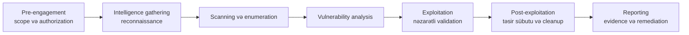

# CEH M01 — Etik Hakerliyə Giriş

Bu dərs **Certified Ethical Hacker (CEH v13)** istiqaməti üçün qısa və imtahan yönümlü başlanğıcdır. Sonrakı modullarda istifadə olunan anlayışları birləşdirir, lakin tam CEH dərsliyini köçürmür. Ətraflı mövzular saytın əsas məqalələrinə keçidlərlə verilir.

> **Təhlükəsizlik qaydası:** yalnız sahib olduğunuz və ya yazılı icazə ilə test etməyə səlahiyyətiniz olan sistemləri yoxlayın. Açıq IP ünvanı, universitet şəbəkəsi və ya təsadüfən tapılan zəiflik avtomatik olaraq test icazəsi demək deyil.

## Təlim məqsədləri

Dərsin sonunda siz:

- etik hakerliyi və onun hüquqi sərhədlərini izah edə;
- əsas threat actor növlərini ayıra;
- threat, vulnerability, exploit, risk, attack vector və TTP terminlərini fərqləndirə;
- vulnerability scanning, penetration testing və red teaming-i müqayisə edə;
- testin əsas mərhələlərini və framework-ləri xəritələndirə;
- təhlükəsiz laboratoriya tapşırığı seçə və M01 suallarını cavablandıra bilməlisiniz.

## Ethical hacking nədir?

**Etik hakerlik** zəiflikləri tapmaq, yoxlamaq və aradan qaldırılması üçün hesabat vermək məqsədilə attacker-ə bənzər üsullardan istifadə edən, icazəli təhlükəsizlik qiymətləndirməsidir. Etik fərq istifadə olunan alət və ya komandada deyil. Əsas şərtlər bunlardır:

1. **İcazə** — aktiv sahibi işi yazılı şəkildə təsdiqləyib.
2. **Scope** — hədəflər, üsullar, vaxt və məhdudiyyətlər müəyyənləşdirilib.
3. **Məqsəd** — məqsəd şəxsi fayda yox, riski azaltmaqdır.
4. **Evidence və reporting** — nəticələr təhlükəsiz saxlanılır və sahibə çatdırılır.

Etik haker yalnız lazım olan qədər təsir sübut etməlidir. Bütün verilənlər bazasını çıxarmaq, xidməti dayandırmaq, testdən sonra qalmaq və ya əlaqəsiz məlumatlara daxil olmaq düzgün deyil.

### Hüquqi və etik sərhədlər

Testdən əvvəl bunları təsdiqləyin:

- yazılı icazə və onu imzalayan şəxsin aktivlər üzərində səlahiyyəti;
- dəqiq in-scope IP diapazonları, domenlər, tətbiqlər, hesablar və cloud tenant-lar;
- qadağan edilmiş hədəf və üsullar, xüsusilə DoS, phishing, fiziki giriş və social engineering;
- test vaxtı, təcili əlaqə şəxsləri, dayandırma şərtləri və provider qaydaları;
- evidence saxlanması, şəxsi məlumatların işlənməsi və təhlükəsiz silinməsi;
- reporting və responsible disclosure kanalı.

Scope aydın deyilsə, dayanın və sahibdən soruşun. Sükutu icazə kimi qəbul etməyin. Üçüncü tərəfin hostu, cloud xidməti və ya əməkdaş hesabı üçün ayrıca icazə lazım ola bilər.

Ətraflı məlumat üçün [Penetration Testing](../../red-teaming/penetration-testing.md) məqaləsində Rules of Engagement, authorization letter, PTES, reporting və hüquqi məsələlərə baxın.

## Threat terminologiyası

Bu terminlər eyni təhlükəsizlik probleminin müxtəlif hissələrini izah edir:

| Termin | Mənası | Nümunə |
|---|---|---|
| **Asset** | Qorunmalı dəyər | Müştəri verilənlər bazası |
| **Threat** | Zərər yarada biləcək mümkün səbəb | Müştəri məlumatlarını hədəfləyən cinayətkar qrup |
| **Vulnerability** | İstismar edilə bilən zəiflik | Yenilənməmiş web server |
| **Exploit** | Zəiflikdən istifadə edən üsul, kod və ya əməl | Qüsuru işə salan hazırlanmış sorğu |
| **Impact** | Nəticədə yaranan zərər | Məlumatın açıqlanması və ya xidmətin dayanması |
| **Risk** | İtkənin baş vermə ehtimalı və nəticəsi | Yüksək ehtimal × yüksək təsir |
| **Attack vector** | Hədəfə çatmaq üçün istifadə edilən yol | Phishing məktubu, açıq xidmət, oğurlanmış credential |
| **Attack surface** | Çatmaq mümkün olan bütün yollar və aktivlər | Public service, user, vendor, API və cihazlar |
| **TTP** | Actor-un tactics, techniques və procedures-i | Credential phishing-dən sonra cloud hesabının ələ keçirilməsi |

Exploit vulnerability ilə eyni deyil: vulnerability zəiflikdir, exploit isə həmin zəiflikdən istifadə üsuludur. Threat yalnız likelihood və impact nəzərə alındıqda riskə çevrilir.

## Threat-actor taksonomiyası

Bu adlar faydalı qısa təsnifatdır, lakin attribution sübutu deyil:

| Actor | Tipik motivasiya və ya imkan |
|---|---|
| **White hat** | İcazəli professional və ya tədqiqatçı |
| **Black hat** | Mənfəət, giriş, pozuntu və ya başqa fayda üçün icazəsiz fəaliyyət göstərən actor |
| **Gray hat** | Məqsədini faydalı göstərsə də, aydın icazəsi olmayan actor |
| **Script kiddie** | Hazır alət və təlimatlardan istifadə edən, orijinal bacarığı məhdud şəxs |
| **Insider** | Qanuni girişi olan əməkdaş, podratçı və ya tərəfdaş; qəsdən və ya səhlənkar ola bilər |
| **Hacktivist** | İdeoloji motivli, diqqət və ya pozuntu axtaran actor |
| **Organised cybercrime** | Ransomware əməliyyatları daxil olmaqla maliyyə motivli qruplar |
| **Nation-state / APT** | Uzunmüddətli casusluq, təsir və ya pozuntu aparan resurslu actor |

Actor kateqoriyaları, naming convention və ATT&CK qrupları üçün [Threat Actors and Threat Intelligence](../../red-teaming/threat-actors-and-intel.md) məqaləsinə baxın.

## Information security və CIA triad

[Information Security and Cybersecurity](../../general-security/information-security-vs-cybersecurity.md) məqaləsi daha geniş təhlükəsizlik sahəsini və cybersecurity-nin onun rəqəmsal alt sahəsi olmasını izah edir.

**CIA triad** nəyi qoruduğumuzu göstərir:

- **Confidentiality** — icazəsiz şəxslər məlumatı oxuya bilməz.
- **Integrity** — məlumat və sistemlər icazəsiz dəyişdirilə bilməz.
- **Availability** — səlahiyyətli istifadəçilər lazım olduqda sistemə çata bilər.

CEH materiallarında CIA ilə yanaşı **authenticity** və **non-repudiation** da göstərilə bilər:

- **Authenticity** — istifadəçi, mesaj, sənəd və ya məlumat mənbəyi həqiqidir.
- **Non-repudiation** — etibarlı sübut göndərən və ya qəbul edənin əməli inkar etməsinə mane olur.

Authentication, sertifikatlar, digital signature və etibarlı audit qeydləri bu xüsusiyyətləri dəstəkləyə bilər. Onlar CIA-nı tamamlayır, əvəz etmir.

Control-lar, DAD, data states, encryption və DLP üçün əsas [CIA Triad](../../general-security/cia-triad.md) məqaləsinə keçin. M01 üçün yadda saxlayın ki, bir hücum CIA-nın bir, iki və ya bütün sütunlarına təsir edə bilər.

## Scan, penetration test və red team

| Fəaliyyət | Əsas sual | Tipik nəticə |
|---|---|---|
| **Vulnerability scan** | Hansı məlum zəiflik və səhv konfiqurasiyalar ola bilər? | Təsdiq tələb edən geniş, avtomatlaşdırılmış nəticələr |
| **Penetration test** | Zəifliklər birləşdirilərək real təsir yarada bilərmi? | Scope daxilində texniki sübut və remediation |
| **Red team** | Real adversary məqsədinə aşkarlanmadan çata bilərmi? | Məqsəd yönümlü attack simulation və detection/response dərsləri |

Scanner genişlik və təkrarlanmanı üstün tutur. Penetration tester nəticələri təsdiqləyir və təsiri məhdudlaşdırır. Red team adversary-ni təqlid edir və prevention ilə yanaşı detection və response-u da ölçür. Bunlar bir-birini tamamlayır, eyni fəaliyyət deyil.

## Methodology xəritəsi

Aşağıdakı xəritə yalnız tədris modelidir və real hədəfə hücum icazəsi deyil:

Fazalar praktikada dövr edə bilər. Yeni finding əlavə reconnaissance tələb edə bilər, stop condition isə exploitation-dan əvvəl testi bitirə bilər. CEH suallarında fəaliyyəti düzgün faza ilə əlaqələndirin; hər engagement-in düz xətt üzrə getdiyini düşünməyin.

### Framework və standards

- **PTES** — penetration test-in yeddi fazalı icra modeli.
- **NIST SP 800-115** — planning, discovery, attack və reporting anlayışları ilə texniki testing guidance.
- **OWASP WSTG** — application testing guidance; [OWASP Top 10](../../red-teaming/owasp-top-10.md) ilə birlikdə istifadə olunur.
- **MITRE ATT&CK** — adversary tactic və technique knowledge base-dir, tam testing methodology deyil.
- **Cyber Kill Chain** — attack progression üçün yüksək səviyyəli modeldir; PTES ilə eyni deyil.
- **OSSTMM** — security testing üçün ölçmə yönümlü methodology.

Ətraflı izah üçün [Penetration Testing](../../red-teaming/penetration-testing.md) və [Threat Actors and Threat Intelligence](../../red-teaming/threat-actors-and-intel.md) məqalələrinə keçin.

## Qısa standards qeydi

M01 üçün bu reference-lərin məqsədini tanımaq kifayətdir:

| Reference | Əhəmiyyəti |
|---|---|
| **NIST SP 800-115** | Texniki security testing guidance |
| **PTES** | Penetration-test icra fazaları |
| **OWASP WSTG / Top 10** | Web application testing və ümumi risklər |
| **MITRE ATT&CK** | Adversary davranışı və TTP mapping |
| **CIS Controls** | Prioritetləşdirilmiş müdafiə tədbirləri |
| **ISO/IEC 27001** | Information-security management system tələbləri |

## Əlavə M01 control anlayışları

Bu anlayışlar blueprint səviyyəsində imtahan qeydləridir. Burada terminləri əlaqələndirmək üçün qısa verilir; ayrıca müdafiə məqalələrini əvəz etmir.

- **Defense in depth** bir control uğursuz olduqda bütün mühitin açılmaması üçün bir neçə müstəqil qoruma qatından istifadə edir. Məsələn, MFA, network segmentation, endpoint protection, logging və test edilmiş backup hücumun müxtəlif mərhələlərini əhatə edir.
- **Risk management** asset, threat, vulnerability, likelihood və impact-i müəyyənləşdirir, sonra risk treatment seçir: azaltmaq, yayınmaq, ötürmək və ya qəbul etmək. Vulnerability kontekstdən asılı olmayaraq avtomatik ən yüksək prioritet deyil.
- **Threat modeling** nəyin qorunmalı olduğunu, kimin hücum edə biləcəyini, hücumun necə baş verə biləcəyini və hansı control-ların yolları azaltdığını soruşur. Bu, çox vaxt dizayn mərhələsində aparılan proaktiv analizdir.
- **Cyber threat intelligence (CTI)** actor, infrastruktur, indicator və TTP məlumatlarını müdafiə qərarlarına çevirir. Məqsəd yoxlanmamış feed toplamaq deyil, detection, prioritisation və response-u dəstəkləməkdir.
- **Incident management** security incident-i müəyyənləşdirməyə, containment, eradication, recovery və lessons learned mərhələlərinə hazırlaşır. Ethical test zamanı gözlənilməz təsir yaranarsa stop condition və escalation path olmalıdır.

Daha ətraflı izah üçün [Threat Modeling](../../general-security/threat-modeling.md), [Threat Intelligence](../../red-teaming/threat-actors-and-intel.md) və blue-team incident-response məqalələrinə baxın.

## Exam notes

- İcazə və scope testi etik edir; alət özü bunu etmir.
- Vulnerability zəiflikdir; exploit həmin zəiflikdən istifadə üsuludur.
- Risk likelihood və impact-i birləşdirir.
- Attack vector bir yoldur; attack surface bütün açıq yolların cəmidir.
- TTP tactics, techniques və procedures deməkdir.
- White-box geniş, black-box az, gray-box isə qismən məlumatla aparılır.
- Vulnerability scan penetration test deyil.
- Red team məqsəd yönümlüdür və detection/response-u da yoxlayır.
- PTES engagement icrasını, ATT&CK isə adversary davranışını təsvir edir.
- CIA təhlükəsizlik məqsədlərini təsnif edir, actor motivasiyasını yox.
- Written authorization, Rules of Engagement və stop condition vacibdir.
- Information warfare təsir və informasiya əməliyyatları ilə, cybercrime isə əsasən qanunsuz mənfəətlə bağlıdır.
- AI/ML müdafiə və hücumda istifadə edilə bilər, lakin authorization, scope və əsasları əvəz etmir.
- Compliance test tezliyinə və evidence-ə təsir edə bilər, lakin security ilə eyni deyil.

### Qanunlar və standards

Dəqiq qanun ölkədən, aktiv sahibindən və fəaliyyətdən asılıdır. İmtahan səviyyəsində universal qayda budur: icazəsiz giriş, interception, pozuntu, məlumat oğurluğu və malware yayılması cinayət ola bilər. Müqavilə və ya lab scope-u üçüncü tərəf provider sistemlərini ayrıca provider qaydaları icazə vermədən test etməyə səlahiyyət vermir. Computer-misuse laws, privacy və data-protection laws, breach-notification tələbləri, PCI DSS testing gözləntiləri və ISO/NIST guidance kimi reference-lərin məqsədini tanıyın; compliance etiketini hücum icazəsi hesab etməyin.

## Təhlükəsiz lab tapşırığı

Qəsdən zəif local VM, container və ya açıq şəkildə icazə verən platformadan istifadə edin. Public target istifadə etməyin.

1. Bir səhifəlik scope yazın: target, vaxt, icazəli və qadağan üsullar, emergency stop condition.
2. Lab aktivini lab şəbəkəsindən kənara trafik göndərmədən inventarlaşdırın.
3. Üç müşahidəni threat, vulnerability, exploit, impact və ya risk kimi təsnif edin.
4. Hər müşahidə üçün preventive və detective control seçin.
5. Evidence, risk və remediation olan qısa hesabat yazın; lazımsız həssas məlumat saxlamayın.

## Mini quiz

1. Eyni scanning alətini bir halda etik, digərində icazəsiz edən nədir?
2. Yenilənməmiş xidmət threat, vulnerability, yoxsa exploit-dir?
3. Əsasən geniş və avtomatlaşdırılmış fəaliyyət hansıdır: vulnerability scan, yoxsa red-team engagement?
4. Hansı framework adversary davranışını tactic və technique-lərlə xəritələndirir?
5. Target, üsul, vaxt və qadağaları hansı sənəd müəyyən edir?
6. Attack vector ilə attack surface arasındakı fərq nədir?
7. Hansı testing modeli testerə qismən məlumat verir?
8. Finding əlaqəsiz üçüncü tərəf məlumatına çatdıqda tester niyə dayanmalıdır?

### Cavablar

1. Yazılı icazə və müəyyən edilmiş scope.
2. Vulnerability.
3. Vulnerability scan.
4. MITRE ATT&CK.
5. Rules of Engagement və əlaqəli authorization sənədləri.
6. Vector bir yoldur; surface bütün açıq yolların və aktivlərin cəmidir.
7. Gray-box testing.
8. Bu scope-dan kənardır və hüquqi, məxfilik və əməliyyat zərəri yarada bilər.

## Növbəti dərslər

[Footprinting and Reconnaissance](./m02-footprinting-and-reconnaissance.md) ilə davam edin, sonra sonrakı CEH modulları üçün networking foundations mövzularını oxuyun. Test sərhədləri və engagement workflow üçün [Penetration Testing](../../red-teaming/penetration-testing.md) məqaləsinə qayıdın.
