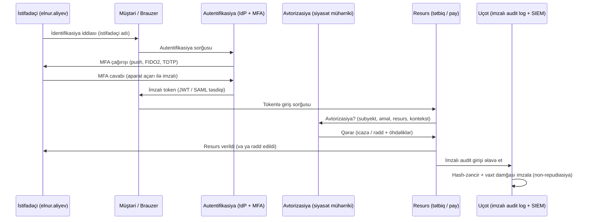

# AAA və Non-Repudiasiya

[CIA üçlüyü](./cia-triad.md) sənə **nəyi** qoruyacağını deyir — məxfilik, bütövlük, əlçatanlıq. **AAA** isə hər sistemin hər əməliyyat üçün cavablandırmalı olduğu növbəti üç suala cavab verir: *bu kimdir?* (Autentifikasiya), *nə etməyə icazəsi var?* (Avtorizasiya) və *əslində nə etdi?* (Uçot). AAA-ya bağlanan dördüncü xassə — **non-repudiasiya** — uçot qeydini hüquqi cəhətdən müdafiə oluna bilən sübuta çevirir: aktor sonradan əməliyyatın özünə aid olduğunu inkar edə bilməz.

Hər dəfə giriş axını dizayn etdikdə, hər dəfə RBAC rolu yazdıqda, hər dəfə auditor "bunun Elnur olduğunu necə bilirsən?" soruşduqda AAA-ya müraciət edəcəksən. CIA *risk* dilidirsə, AAA *girişin* dili, non-repudiasiya isə *məsuliyyətin* dilidir. Birlikdə nəzarət olunan əməliyyatın tam həyat dövrünü əhatə edirlər: kim olduğunu sübut et, icazə al, dəyişdirilməsi aşkar olunan iz qoy.

## Bu nə üçün vacibdir

Modeli aydınlaşdıran üç konkret vəziyyət:

1. Maliyyə əməkdaşı saat 23:47-də köçürməni təsdiqləyir. Səhəri gün bankın auditoru əməkdaşın həqiqətən düyməni basıb-basmadığını soruşur. **Autentifikasiya** bəli deyir — parol yazıldı və aparat açarına toxunuldu. **Avtorizasiya** bəli deyir — onun rolu $50 000-a qədər köçürmələrə icazə verirdi. **Uçotda** vaxt damğalı log sətri var. **Non-repudiasiya** məhz əməkdaşın "bu mən deyildim" deyə bilməsinə imkan verməyən şeydir — əməliyyat yalnız onun nəzarətindəki şəxsi açarla bağlanmışdı və log SIEM-ə düşməzdən əvvəl imzalanmışdı.
2. Şəbəkə administratoru `admin` adlı paylaşılmış etimadnamələrlə əsas kommutatora daxil olur. Saat 02:00-da nəsə səhv konfiqurasiya olunur və şəbəkə bir saat söndürülür. Dəyişiklik logu `admin etdi` deyir. AAA yoxdur — istifadəçi başına autentifikasiya olmadan nə avtorizasiya modeli, nə də məsuliyyət vardır. Paylaşılmış hesab dörd xassənin hamısını eyni anda pozdu.
3. SaaS müştərisi $9 000-lıq fakturanı mübahisələndirir, yenilənmədə **Razıyam** düyməsini basmadığını iddia edir. Satıcının müdafiəsi audit logudur: müştərinin IP-sindən TLS qorumalı HTTP POST, müştərinin WebAuthn tokeni ilə imzalanmış, server tərəfində imzalanmış vaxt damğası ilə. Bu yığın iş başında olan non-repudiasiyadır — onsuz mübahisə "o dedi-bu dedi" şəklinə düşür.

CIA sənə nəyi qoruyacağını deyir. AAA kimin nə edə biləcəyini deyir. Non-repudiasiya sonradan sübut verir. Bu qatlardan birini buraxsan, növbəti hadisə araşdırmasında təxmin etməli olacaqsan.

## Əsas anlayışlar

### Autentifikasiya terminologiyası

Hər gün istifadə edəcəyin kiçik lüğət:

- **İddia** — kimliyin elan edilməsi ("Mən `EXAMPLE\elnur.aliyev`-əm"). Hər kəs iddia edə bilər; tək başına heç nə sübut etmir.
- **İdentifikasiya** — həmin iddianın sistemə təqdim edilməsi (istifadəçi adının yazılması, vəsiqənin oxudulması).
- **Autentifikasiya** — sistemin iddianın doğru olduğunu yoxlaması (parolun yoxlanması, sertifikatın təsdiqi, barmaq izinin müqayisəsi).
- **Faktor** — autentifikasiya zamanı istifadə olunan dəlil kateqoriyası (bildiyin / sahib olduğun / olduğun / etdiyin / olduğun yer).
- **Etimadnamə** — təqdim olunan əsl dəlil (parol sətri, sertifikat, OTP kodu, biometrik şablon uyğunluğu).
- **Qarşılıqlı autentifikasiya** — hər iki tərəf bir-birini yoxlayır. Müştəri serverin TLS sertifikatını yoxlayır; server müştərinin mTLS sertifikatını və ya tokenini yoxlayır. Qarşılıqlı autentifikasiya olmadan serverə özünü oxşadan hücumçu etimadnamələri toplaya bilər.

İdentifikasiya "Mən Elnur olduğumu iddia edirəm" deməkdir. Autentifikasiya "sübut et" deməkdir. Bu iki addım eyni deyil və onları qarışdırmaq fişinqin necə işlədiyini izah edir — hücumçu sənin iddianı qəbul edir, lakin əsl server olduğunu heç vaxt sübut etmir.

### Autentifikasiya metodları və texnologiyaları

Müasir müəssisələr bunlardan bir neçəsini qarışdırır; nadir hallarda yalnız bir metod görəcəksən.

| Metod | Nədir | Güc | Tipik tələ |
|---|---|---|---|
| **Parol** | İstifadəçinin yazdığı paylaşılmış sirr. | Ucuz, hər yerdə. | Təkrar istifadə, fişinq, brute-force, sızmalarda aşkarlanma. |
| **PIN** | Adətən cihazla cütləşmiş qısa rəqəmli sirr. | Yalnız lokal — cihaz olmadan faydasız. | Çox vaxt zəif (4 rəqəm), arxadan baxılma. |
| **Sertifikat** | Cihazdakı şəxsi açara bağlı X.509 sertifikatı. | Güclü, qarşılıqlı autentifikasiyaya hazır. | PKI həyat dövrü (verilmə, yenilənmə, ləğv) çətindir. |
| **Smartkart / PKI kartı** | Sertifikat daşıyan kart; istifadəçi onu yerləşdirir və PIN daxil edir. | İki faktor birdən (sahib olmaq + bilmək). | İtirilmiş kartlar, oxuyucu uyğunluğu. |
| **TOTP** | Vaxt əsaslı birdəfəlik parol — paylaşılmış toxum və cari vaxt ilə hər 30 saniyədə dəyişir (RFC 6238). | Əksər hücumlara qarşı fişinqə davamlı, server gediş-gəlişi tələb etmir. | Toxum sızması hücumçuya eyni kod axınını verir. |
| **HOTP** | HMAC əsaslı birdəfəlik parol — kod hər istifadədə artır (RFC 4226). | Saat asılılığı yoxdur. | Token və server arasında sayğac uyğunsuzluğu. |
| **SMS** | İstifadəçinin telefonuna mesajla göndərilən kod. | Asan ilkin qoşulma. | SIM-swap hücumları, SS7 ələ keçirmə. Ən zəif geniş yayılmış faktor. |
| **Push bildirişi** | Telefondakı tətbiq "təsdiq et / rədd et" göstərir. | Aşağı sürtünmə. | Nömrə uyğunluğu yoxdursa MFA yorğunluğu / push bombardmanı. |
| **Telefon zəngi** | Kodun səsli oxunması. | Smartfon olmadan işləyir. | SMS ilə eyni SIM-swap təhlükəsi. |
| **Autentifikator tətbiqi** | Google Authenticator, Microsoft Authenticator, Authy — telefonda lokal TOTP/HOTP. | Operator asılılığı yoxdur. | Tətbiq toxumunun yedəkləmə gigiyenası. |
| **Aparat təhlükəsizlik açarı** | FIDO2 / WebAuthn token (YubiKey, Feitian, Token2). | Dizayn etibarilə fişinqə davamlı — mənbəyə bağlı. | Qiymət, itirilmiş tokenin bərpa axını. |
| **Statik kodlar** | Çap olunmuş və saxlanılan uzunömürlü kodlar. | Yalnız ehtiyat faktoru. | Aşkarlanma, fotoşəkil, poçtla göndərilmə. |
| **Kataloq xidməti autentifikasiyası** | Active Directory, LDAP — sistem parolu mərkəzi verilənlər bazası ilə yoxlayır. | Vahid həqiqət mənbəyi. | Bir sızma, hər hesab təsirlənir. |
| **Federasiya** | Etibar SAML və ya OIDC vasitəsilə kimlik provayderinə (Google, Microsoft Entra ID, Okta) həvalə edilir. | Hər yerdə güclü IdP nəzarətlərini təkrar istifadə et. | IdP kəsintisi hər şeyi söndürür. |
| **Attestasiya** | Etibarlı üçüncü tərəf (və ya cihazın TPM-i) kimlik / cihaz vəziyyəti üçün zamin durur. | Autentifikasiyanı tanınmış yaxşı cihaza bağlayır. | Attestasiya zəncirinin mürəkkəbliyi. |

### Beş faktor kateqoriyası

Klassik üç və müasir siyasət mühərriklərində tez-tez görünən iki atribut:

1. **Bildiyin bir şey** — parol, PIN, parol ifadəsi, təhlükəsizlik sualı. Ucuz; ən fişinqə açıqdır.
2. **Sahib olduğun bir şey** — aparat açarı, smartkart, autentifikator tətbiqi işlədən telefon, noutbukun TPM-indəki sertifikat. Tənliyə fiziki sahibliyi əlavə edir.
3. **Olduğun bir şey** — biometrik: barmaq izi, üz, iris, səs, damar, yeriş. Surətini çıxarmaq çətindir, kompromis halında dəyişdirilməsi mümkün deyil.
4. **Etdiyin bir şey** — davranış: yazma ritmi, sürüşdürmə nümunəsi, jest. Adaptiv, az sürtünməli, tək başına zəif gücdə.
5. **Olduğun yer** — yer: GPS, IP geolokasiya, şəbəkə seqmenti. Şərti girişdə *əlavə* faktor kimi əladır; tək başına zəifdir (VPN-lər yeri saxtalaşdırır).

Tək faktor — birfaktorlu autentifikasiyadır. **Fərqli** kateqoriyalardan iki — çoxfaktorlu autentifikasiyadır (MFA). İki parol MFA deyil — hər ikisi eyni faktordur və eyni hücum qarşısında düşər. Eyni şey "iki məsələ, bir faktor" üçün də keçərlidir: parol və ardınca təhlükəsizlik sualı iki *bildiyin*dir və hər ikisini soruşan fişinq səhifəsinə qarşı əlavə müdafiə təklif etmir.

İki faktorlu (2FA) tam olaraq iki kateqoriyanın birləşdirildiyi MFA-nın geniş yayılmış alt çoxluğudur. **Yüksələn autentifikasiya** baseline sessiyanın birfaktorlu (kataloqa baxmaq) olduğu, həssas əməliyyatın isə ikinci faktoru tetikleyici olduğu nümunədir (sifariş vermək, parolu dəyişmək). Yüksələn autentifikasiya rutin işdə sürtünməni aşağı, vacib anlarda isə yüksək saxlayır.

### MFA atributları

MFA seçimlərini müqayisə edərkən hər birini bu oxlar üzrə qiymətləndir:

- **Güc** — faktoru məğlub etmək nə qədər çətindir? FIDO2 açarı ən güclüdür, SMS isə geniş yayılmış ən zəif seçimdir.
- **Fişinqə davamlılıq** — faktor saxta sayta etimadnamə təqdim etməkdən imtina edirmi? WebAuthn mənbəyə bağlıdır və quruluşca fişinqə qarşı dayanır. TOTP, push, SMS — hamısı fişinqə açıqdır.
- **Təkrar oynatmaya davamlılıq** — ələ keçirilmiş etimadnamə təkrar istifadə oluna bilərmi? OTP-lər və imzalanmış çağırışlar təkrara qarşı durur; statik parollar yox.
- **Qiymət** — aparat tokenləri hərəsi $20-$60 üstəgəl çatdırılma və inventar tələb edir. Autentifikator tətbiqləri pulsuzdur, lakin istifadəçinin telefonunu tələb edir.
- **Sürtünmə** — girişdəki hər əlavə saniyə məcmu məhsuldarlığa baha başa gəlir və istifadəçiləri kölgə IT-yə doğru itələyir.
- **Bərpa edilə bilmə** — istifadəçi faktoru itirdikdə nə olur? İstifadəyə verməzdən əvvəl bərpa yolunu planlaşdır, yoxsa help-desk-in ən zəif halqa olur.

Yaxşı MFA proqramı **ən azı iki** güclü, fişinqə davamlı faktor seçir və SMS-ə yalnız ehtiyat kimi yanaşır. Hər seçimi altı oxun hamısı üzrə qiymətləndir — qiymət və sürtünmədə qalib gələn, lakin fişinqə davamlılıqda uduzan faktor help-desk-in ilk dəfə əsl hücumçu ilə üzləşdiyi anda saxta iqtisaddır.

### Biometriyaya dərin baxış

Biometrik faktorlar istifadəçi üçün unikal olmalı bioloji bir şeyi ölçür. Onlar rahatdır, paylaşmaq çətindir və şablon sızsa *yenidən verilə bilməz* — bu, qəbul etdiyin əsas kompromisdir.

| Modallıq | Nəyi ölçür | Güclü tərəflər | Zəif tərəflər |
|---|---|---|---|
| **Barmaq izi** | Barmağın iz nümunəsi; müasir sensorlar canlılıq axtarır (nəbz, dəri keçiriciliyi). | Ucuz, sürətli, telefon və noutbuklarda hər yerdə. | Silikon və ya foto qəliblərlə saxtalaşdırıla bilər; yaralar nümunəni dəyişir. |
| **Retina** | Gözün arxasındakı qan damarı nümunəsi; yaxın infraqırmızı skan. | Çox yüksək dəqiqlik, ömürlük sabit. | Müdaxiləli (gözə yaxın lazer), zəif istifadəçi qəbulu, bahalı oxuyucular. |
| **İris** | İrisin piqmentasiya nümunəsi; məsafədən fotoşəkilini çəkmək olar. | Çox yüksək dəqiqlik, təmassız. | Gizli şəkildə tutula bilər; yüksək keyfiyyətli fotolar bəzi oxuyucuları aldada bilər. |
| **Üz** | Üzün həndəsəsi — orientirlər arası məsafələr, bəzən IR nöqtələri ilə 3D dərinlik. | Hər müasir telefonda quraşdırılıb, təmassız, sürətli. | Əkiz / qardaş yanlış uyğunluqları; telefonu yatmış sahibinin qarşısında tutmaqla açıla bilər. |
| **Səs** | Tonal keyfiyyətlər və danışıq nümunələri. | Telefonla işləyir, əllər boş. | Tarixən yüksək FAR/FRR; AI səs klonlaması artıq əksər istehlakçı sistemlərini məğlub edir. |
| **Damar** | Yaxın infraqırmızı ilə oxunan əl ayası və ya barmaq damar nümunəsi. | Saxtalaşdırmaq çətindir — nümunə daxilidir. | Bahalı sensorlar, yavaş sənaye qəbulu. |
| **Yeriş** | Yeriş nümunəsi — addım uzunluğu, sürət, oynaq hərəkəti. | Məsafədən və passiv tutulur, izləmə üçün faydalı. | Ayaqqabı, zədə, əhval-ruhiyyə ilə dəyişir; bir dəfəlik autentifikasiya üçün zəif. |

Biometrik məlumat unikal, ləğv edilməz və [ISO/IEC 24745](https://www.iso.org/standard/75302.html) tərəfindən qorunur — şablonları çevrilmiş dəyərlər kimi saxla, heç vaxt xam yox, və onları aparat dəstəkli enklavlarda (TPM, Secure Enclave, StrongBox) saxla ki, verilənlər bazası sızması daimi kompromisə çevrilməsin.

### Biometrik metriklər — effektivlik, FAR, FRR, CER

Hər biometrik sistemin iki qaçılmaz uğursuzluq rejimi var:

- **Yanlış Qəbul Dərəcəsi (FAR)** — sistem *yox* deməli olduqda *bəli* deyir. Səhv adam içəri girir. Bu, **təhlükəsizlik** uğursuzluğudur.
- **Yanlış Rədd Dərəcəsi (FRR)** — sistem *bəli* deməli olduqda *yox* deyir. Düzgün adam bağlanır. Bu, **istifadə rahatlığı** uğursuzluğudur.

Hər iki dərəcə tək bir astana düyməsi ilə idarə olunur. Astananı sıxlaşdırırsan — FAR azalır, FRR isə artır; boşaldırsan — əksi olur. Hər ikisi sıfıra düşə bilməz.

- **Keçid Xəta Dərəcəsi (CER)** — Bərabər Xəta Dərəcəsi (EER) də adlandırılır — FAR-ın FRR-yə bərabər olduğu astana qurulmasıdır. CER biometrik sistemləri müqayisə etmək üçün istifadə etdiyin tək rəqəmdir: aşağı CER ümumilikdə daha yaxşı sensor və alqoritm deməkdir.
- **Effektivlik dərəcəsi** — qeydiyyat keyfiyyətini, ətraf mühit səs-küyünü və istifadəçi demoqrafiyasını nəzərə alaraq sistemin real dünyada nə qədər yaxşı işlədiyinin daha geniş ölçüsü.

Təcrübi qayda: astananı təşkilatın dözə biləcəyi qədər **FAR**-ı aşağı endirmək üçün seç. İstifadəçinin barmağını yenidən təqdim etməsi əsəbidir. İçəri girən hücumçu isə pozulmadır.

### Avtorizasiya modelləri

Autentifikasiyadan sonra sistem soruşur: *nə etməyə icazən var?* Beş əsas model:

| Model | İcazələr necə qərarlaşdırılır | Harada görürsən |
|---|---|---|
| **DAC — Diskresion Giriş Nəzarəti** | Resursun sahibi başqalarına giriş verir. | Windows fayl payında NTFS icazələri, Unix `chmod`. |
| **MAC — Məcburi Giriş Nəzarəti** | Sistem etiketlərə (Məxfi, Tam Məxfi) və icazə səviyyələrinə əsasən siyasəti tətbiq edir; istifadəçilər ləğv edə bilməz. | SELinux, hərbi və kəşfiyyat sistemləri. |
| **RBAC — Rola Əsaslanan Giriş Nəzarəti** | İcazələr rollara bağlanır; istifadəçilər rolları alır. | Active Directory qrupları, Kubernetes Roles, AWS IAM rolları. |
| **ABAC — Atributa Əsaslanan Giriş Nəzarəti** | Giriş atributları (istifadəçi şöbəsi, resurs etiketi, vaxt, cihaz vəziyyəti) qiymətləndirən siyasətlə qərarlaşdırılır. | Azure şərti giriş, şərtli AWS IAM, OPA / Rego siyasətləri. |
| **ReBAC — Münasibətə Əsaslanan Giriş Nəzarəti** | Giriş qrafdakı münasibətlərlə qərarlaşdırılır ("Elnur sənədin sahibi olan Layihə Komandasının üzvüdür"). | Google Zanzibar, müasir SaaS paylaşma modelləri. |

Hər beşinin üzərindən keçən **ən az imtiyaz prinsipi**dir — hər subyektə işini görmək üçün lazım olan minimum girişi ver, daha çox yox. Ən az imtiyaz *dizayn* (incə rollar, qısa ömürlü tokenlər), *əməliyyat* (müntəzəm giriş baxışları) və *mədəniyyət* (administratorların daimi giriş əvəzinə tam-zamanında yüksəlişi seçməsi) ilə tətbiq edilir.

Buna yaxından bağlı olan **vəzifələrin ayrılması** prinsipidir: heç bir tək rol həssas əməliyyatı baş-ayağa tamamlaya bilməz. Satıcını yaradan əməkdaş həmin satıcıya ödənişi təsdiq edə bilməz; kodu yazan mühəndis onu nəzərdən keçirilmədən istehsala göndərə bilməz. Vəzifələrin ayrılması fırıldaq problemini sövdələşmə problemi etmiş olur ki, bu da etmək üçün daha çətin və aşkar etmək üçün daha asandır.

Hər iki prinsipi **bilmək lazım olduğu qədər** ilə cütləş — hətta icazəli rol daxilində də istifadəçinin toxunmalı olduğu konkret qeydlərə girişi məhdudlaşdır. Kardiologiyadakı həkimin pasiyent qeydlərini oxumaq rolu var, lakin yalnız əslində müalicə etdiyi pasiyentlərin qeydlərini görməlidir. Müasir ABAC və ReBAC mühərrikləri bilmək lazım olduğu qədəri böyük miqyasda praktiki edir; köhnə RBAC əlavə yapışdırıcı tələb edir (məlumat-etiketlənməsi, dinamik qruplar, sorğu-vaxtı filtrləri).

### Uçot və audit izləri

Uçot üçüncü A-dır — *nə baş verdiyinin* qeydi. Faydalı audit izi hər imtiyazlı və ya həssas əməliyyat üçün tutur:

- **Kim** — autentifikasiya olunmuş subyekt identifikatoru (`EXAMPLE\elnur.aliyev`, sadəcə `admin` deyil).
- **Nə** — əməliyyat (`rolu ver`, `vəsait köçür`, `faylı sil`).
- **Nə vaxt** — etibarlı saat mənbəyindən UTC vaxt damğası (NTP-sinxronlu, ideal halda imzalı).
- **Harada** — mənbə IP, host adı, mümkünsə geolokasiya.
- **Niyə** — dəyişiklik biletinə istinad, biznes əsaslandırması, çağıran sistemə qayıdan sorğu ID-si.
- **Nəticə** — uğur, uğursuzluq, xəta kodu.

Saxlama tənzimləmə və məhkəmə-tibbi ehtiyacı izləyir: SIEM-də 90 gün isti adətən geniş yayılıb, tənzimlənən loglar (PCI, maliyyə, səhiyyə) üçün bir illik soyuq saxlama və yeddi illik arxiv. Log bütövlüyünü **yalnız əlavə olunan saxlama**, **WORM** mediası və ya **hash zəncirlənməsi** ilə qoru ki, əməliyyat imtiyazları olan insayder tarixi sakitcə redaktə edə bilməsin. Operatorun yenidən yaza biləcəyi loglar audit logları deyil — onlar gündəlik qeydləridir.

İşləyən uçot praktikasını tikdən qutu uçotundan üç əməliyyat detalı ayırır. Birinci, **vaxt sinxronizasiyası** — hər host etibarlı mənbəyə NTP-sinxronlu olmalıdır, ideal halda autentifikasiya olunmuş NTP ilə, çünki vaxt damğaları hər korelasiya qaydasının və hər hüquqi iddianın onurğasıdır. İkinci, **saat sürüşməsi tolerantlığı** — SIEM yüz host arasında hadisələri korelyasiya etdikdə, hətta bir neçə saniyəlik fərq "qeyri-mümkün səyahət" aşkarlamalarını səs-küyə çevirir. Üçüncü, **giriş tərəfi autentifikasiyası** — hər log mənbəyindən SIEM-ə kanal qarşılıqlı autentifikasiya olunmalı və şifrələnməlidir; saxta cihazdan saxtalaşdırılmış log girişi heç loga sahib olmamaqdan pisdir.

### Non-repudiasiya

**Non-repudiasiya** subyektin əməliyyatı yerinə yetirdiyini ağlabatan şəkildə inkar edə bilməməsi xassəsidir. O, birlikdə işləyən üç parçadan qurulur:

1. **Güclü autentifikasiya** — subyekt əməliyyat zamanı etibarlı şəkildə müəyyənləşdirilmişdir (MFA, aparat dəstəkli etimadnamə).
2. **Qeydin bütövlüyü** — audit log girişi sonradan dəyişdirilməmişdir (imzalı vaxt damğaları, yalnız əlavə olunan saxlama, hash zəncirlənməsi).
3. **Kriptoqrafik bağlama** — əməliyyat **yalnız subyektin nəzarətindəki şəxsi açarla** imzalanmışdır. Subyektin şəxsi açarı ilə rəqəmsal imza sənə bağlama verir; yoxlayıcı *kim imzaladı* və *nə imzalandı* məlumatlarını təsdiqləmək üçün uyğun açıq açardan istifadə edir.

Hər üçü qüvvədə olduqda, subyekt kriptoqrafiyaya etiraz etmədən "bu mən deyildim" və ya "log səhvdir" deyə bilmir — məhkəmələr və auditorlar bunu güclü dəlil hesab edir. AB-də [eIDAS reqlamenti](https://digital-strategy.ec.europa.eu/en/policies/eidas-regulation) və başqa yerlərdə milli e-imza qanunları məhz bu xassələrə görə kvalifikasiyalı rəqəmsal imzalara əl ilə yazılmış imzalarla eyni hüquqi çəki verir.

Üçündən birini pozsan — paylaşılmış açarlar, redaktə oluna bilən loglar, zəif autentifikasiya — non-repudiasiya çökür. Tipik uğursuzluq forması CI/CD-də paylaşılmış imzalama açarıdır: imza var, lakin bir neçə nəfərdə açar olmuşdur, ona görə də bir insana bağlanmır.

### Real dünyada AAA

Dörd protokol müəssisə AAA trafikinin əksəriyyətini daşıyır:

- **RADIUS** ([RFC 2865](https://datatracker.ietf.org/doc/html/rfc2865)) — Remote Authentication Dial-In User Service. UDP əsaslı, VPN, Wi-Fi (802.1X vasitəsilə WPA2/3 Enterprise) və şəbəkə cihazı girişi üçün geniş istifadə olunur. Autentifikasiya və avtorizasiya bir gediş-gəlişdə birləşir.
- **TACACS+** ([RFC 8907](https://datatracker.ietf.org/doc/html/rfc8907)) — TCP əsaslı, əslən Cisco. Autentifikasiya, avtorizasiya və uçotu üç müstəqil mesaj axınına ayırır, buna görə də şəbəkə administratorları kommutator və marşrutlaşdırıcılarda incə əmr avtorizasiyası üçün ona üstünlük verir.
- **Diameter** — telekom / 4G / 5G şəbəkələri üçün RADIUS-un xələfi. TCP/SCTP, etibarlı, daha böyük atribut çoxluqlarını dəstəkləyir.
- **Kerberos** — AD iş atı. Açar Paylanma Mərkəzindən (KDC) istifadə edən bilet əsaslı autentifikasiya. İstifadəçi bir dəfə autentifikasiya olur və parolu yenidən yazmadan xidmət biletləri ilə dəyişdirilən Bilet-Verən Bileti (TGT) alır.

### Bulud və yerli AAA — SAML/OIDC körpüsü

Yerli AAA tarixən Active Directory üstəgəl RADIUS üstəgəl smartkart oxuyucusu idi. Bulud tətbiqləri fərqli protokollar danışır və ikisi arasındakı körpü **federasiyadır**:

- **SAML 2.0** — XML əsaslı təsdiqlər. IdP (Active Directory Federation Services, Okta, Microsoft Entra ID) "bu istifadəçi autentifikasiya oldu, atributları bunlardır" deyən təsdiqi imzalayır. Bulud tətbiqi IdP-nin imzasına etibar edir.
- **OIDC** — OAuth 2.0 üzərində OpenID Connect. JSON tokenləri (JWT-lər), mobil və SPA tətbiqlərinə daha uyğun, müasir SaaS-də üstün.

Müasir AAA dizaynı ortaya tək bir kimlik provayderi qoyur: kimlik üçün AD və ya Entra ID, mərkəzi şəkildə tətbiq edilən MFA, şərti giriş siyasətləri (cihaz vəziyyəti, yer, risk balı) və hər aşağı axın bulud və yerli tətbiqə federasiya tokenləri. Domen daxilində yenə də Kerberos autentifikasiya edir, RADIUS yenə də Wi-Fi və VPN-i qoruyur, lakin hər şey vahid həqiqət mənbəyindən axır. Əməliyyat qatı üçün [IAM və MFA alətləri dərsi](./open-source-tools/iam-and-mfa.md) və [secrets və PAM dərsi](./open-source-tools/secrets-and-pam.md) ilə, yerli kimlik təməli üçün [Active Directory Domain Services](../servers/active-directory/active-directory-domain-services.md) ilə cütləş.

## AAA axın diaqramı

Autentifikasiya token istehsal edir. Avtorizasiya onu istehlak edir. Uçot nəticəni qeyd edir. Non-repudiasiya audit girişinin **imzalı və zəncirli** olmasından gəlir ki, sonradan aşkar edilmədən redaktə oluna bilməsin — bu loqla audit logu arasındakı fərqdir.

## Praktiki məşğələlər

Hər biri bir neçə saatlıq beş məşğələ. Onlar yuxarıdakı parçaları noutbukdan başqa laboratoriya tələb etmədən möhkəmləndirir.

### Məşğələ 1 — FAR/FRR cütlərindən CER hesabla

İki barmaq izi sensorunu qiymətləndirirsən. Satıcı müxtəlif astana parametrlərində aşağıdakı ölçmələri dərc edir (astana 1 = ən sıx, 5 = ən boş):

| Astana | Sensor A FAR | Sensor A FRR | Sensor B FAR | Sensor B FRR |
|---|---|---|---|---|
| 1 | 0.001 % | 8.0 % | 0.005 % | 6.0 % |
| 2 | 0.01 %  | 4.0 % | 0.05 %  | 3.0 % |
| 3 | 0.1 %   | 1.0 % | 0.4 %   | 0.4 % |
| 4 | 1.0 %   | 0.1 % | 2.0 %   | 0.05 % |
| 5 | 5.0 %   | 0.01 %| 7.0 %   | 0.005 % |

Hər sensor üçün CER-i (FAR-ın FRR ilə görüşdüyü yer) tap və yanlış qəbulun yenidən toxunmadan çox daha pis nəticə olduğu maliyyə komandası turniketi üçün birini tövsiyə et.

### Məşğələ 2 — Kommutator administrator girişi üçün RADIUS konfiqurasiya et

Laboratoriya Cisco və ya açıq mənbə FreeRADIUS qurulumunda şəbəkə cihazını Active Directory ilə dəstəklənən RADIUS serverinə qarşı administrator girişlərini autentifikasiya edəcək şəkildə konfiqurasiya et. Üç şeyi yoxla: (1) uğurlu giriş paylaşılmış `admin` hesabı ilə deyil, AD istifadəçi identifikatoru ilə qeyd olunur; (2) uğursuz giriş cəhdləri qeyd olunur və sürət-məhdudlaşdırılır; (3) kommutator və RADIUS serveri arasındakı paylaşılmış sirr fırlanır və yalnız secrets manager-ində saxlanılır, kommutatorun işləyən konfiqurasiyasında deyil.

### Məşğələ 3 — 3-qatlı tətbiq komandası üçün RBAC rolu dizayn et

Yeni komanda üç qatlı tətbiqə sahibdir: ictimai veb qatı, şəxsi API qatı və verilənlər bazası qatı. Dörd rol (`webops`, `appdev`, `dba`, `sre`) dizayn et və hər biri üçün qərar ver:

- Hansı mühitlərdə (dev / staging / prod) hansı növ girişləri var.
- Prod girişi PAM aləti vasitəsilə **daimi** yoxsa **tam-zamanındadır**.
- Hansı əməlləri təsdiq olmadan edə bilərlər (ən az imtiyaz) və hansıları dəyişiklik-idarəçilik təsdiqi tələb edir.
- Break-glass yüksəlişi necə qeyd olunur və nəzərdən keçirilir.

Nəticəni bir səhifəyə sığacaq avtorizasiya matrisi kimi sənədləşdir.

### Məşğələ 4 — Non-repudiasiya edilə bilən rəqəmsal imza istehsal et

Açar cütü (`openssl genrsa -out signer.key 4096` və uyğun CSR) yarat, müqavilə PDF-ini şəxsi açarla imzala, sonra imzanı açıq açarla yoxla. Sonra qəsdən sındır: PDF-in bir baytını redaktə et, yenidən yoxla və imzanın indi uğursuz olduğunu müşahidə et. Bir səhifəlik izah yaz: bu yığın — şəxsi açar + imza + bütövlük yoxlaması — niyə imzanı non-repudiasiya edə bilən edir və hansı şey bu xassəni pozar (paylaşılmış açar, zəif hash, çatışmayan vaxt damğası).

### Məşğələ 5 — Tamlıq üçün logging / SIEM konfiqurasiyasını nəzərdən keçir

Laboratoriyanda bir tətbiq və ya xidmət seç — domen kontrolleri, veb server, bulud hesabı — və loglarını bu yoxlama siyahısına qarşı audit et:

- Autentifikasiya uğurları və uğursuzluqları subyekt, mənbə IP və vaxt damğası ilə qeyd olunur.
- Həssas əməllər (administrator əmrləri, məlumat ixracları, imtiyaz vermələri) üçün avtorizasiya qərarları qeyd olunur.
- Loglar TLS və mesaj autentifikasiyası ilə saniyələr içində mərkəzi SIEM-ə yönləndirilir.
- Saxlama siyasəti tənzimləmə ehtiyaclarını qarşılayır (90 gün isti, bir il ilıq, tənzimlənən məlumat üçün yeddi il soyuq).
- Log faylları əməliyyat işçilərinin korlamasından qorunur (yalnız əlavə olunan, ayrı yazma hesabı, hash-zəncirli və ya imzalı).

Aşkar etdiyin boşluqları və onları bağlayacaq nəzarətləri yaz.

## İşlənmiş nümunə: example.local-da müasir AAA-nın tətbiqi

`example.local` [CIA üçlüyü dərsindəki](./cia-triad.md) eyni 80 nəfərlik şirkətdir. Onların işləyən Active Directory-si, bir neçə maliyyə noutbukunda smartkartlar və VPN üçün SMS əsaslı MFA var. Növbəti iki rüb ərzində vahid müasir kimlik yığını ətrafında yenidən qurmaq istəyirlər.

### Hədəf arxitektura

- **SSO** — Hyper-V klasterində yerləşdirilmiş Keycloak, kimlik mənbəyi üçün Active Directory ilə federasiya olunmuş. Hər daxili tətbiq (`portal.example.local`, daxili Jira, Confluence, daxili SaaS) Keycloak vasitəsilə OIDC istifadə edərək autentifikasiya olunur.
- **MFA** — mühəndislər və administratorlar üçün WebAuthn (FIDO2); hər kəs üçün Microsoft Authenticator vasitəsilə TOTP; SMS yalnız bərpa faktoru kimi.
- **Şəbəkə administrator girişi** — FreeRADIUS hər cihazda paylaşılmış `admin` hesabını əvəz edərək kommutator və firewall administrator girişi üçün Active Directory-yə autentifikasiya olur.
- **Wi-Fi** — 802.1X ilə WPA3 Enterprise, şirkətə məxsus noutbuklar üçün RADIUS dəstəkli sertifikat autentifikasiyası.
- **İmtiyazlı giriş** — PAM aləti (Teleport, HashiCorp Boundary və ya açıq mənbə ekvivalent) SSH və verilənlər bazası girişi üçün qısa ömürlü sertifikatlar verir; mühəndis noutbuklarında uzunömürlü SSH açarları yoxdur. Əməliyyat qatı üçün [secrets və PAM dərsinə](./open-source-tools/secrets-and-pam.md) bax.
- **Uçot** — hər Keycloak girişi, RADIUS autentifikasiyası, PAM sessiyası və administrator əmri mərkəzi SIEM-ə (Wazuh, Splunk və ya ELK) düşür. SIEM giriş boru kəməri kanalı TLS-ilə qoruyur və hər qeydi imzalayır.
- **Non-repudiasiya** — maliyyə tətbiqindəki yüksək dəyərli əməliyyatlar (köçürmələr > $5 000, müqavilə təsdiqləri) istifadəçinin WebAuthn açarı ilə imzalanır və yaranan imza server tərəfində etibarlı vaxt damğası ilə yalnız əlavə olunan obyekt saxlamasında saxlanılır.

### Tətbiq mərhələləri

1. **Rüb 1 — kimlik konsolidasiyası.** Keycloak qaldır. AD ilə federasiya et. Əvvəlcə `portal.example.local` və bir daxili tətbiqi miqrasiya et. IT və mühəndislik komandalarına WebAuthn açarları ver. Şərti girişi aktivləşdir (gözlənilməz ölkələrdən girişləri bloklayır, administratorlar üçün uyğun cihaz tələb edir).
2. **Rüb 1 — uçot onurğası.** SIEM-i yerləşdir. AD təhlükəsizlik logları, Keycloak hadisələri və firewall loglarını yönləndir. Saxlamanı təyin et və ilk üç aşkarlama qaydasını yaz (qeyri-mümkün səyahət, parol səpmə, MFA yorğunluğu).
3. **Rüb 2 — şəbəkə və imtiyazlı giriş.** FreeRADIUS-u kommutatorlara və firewall-lara çıxar. Paylaşılmış `admin` hesabını ləğv et. PAM alətini yerləşdir. Mühəndisləri uzunömürlü SSH açarlarından qısa ömürlü sertifikatlara miqrasiya et.
4. **Rüb 2 — non-repudiasiya.** Yüksək dəyərli köçürmələr üçün maliyyə tətbiqinə WebAuthn əsaslı imzalama əlavə et. İmzalı audit girişlərini dəyişdirilməz saxlamaya bağla. Saxta mübahisə ilə axını uçdan-uca sına.

### AAA-ya bağlanmış nəzarətlər

| Nəzarət | A — Autn | A — Avtz | A — Uçot | Non-repudiasiya |
|---|---|---|---|---|
| Keycloak SSO + WebAuthn | Güclü | Aşağı axın üçün iddialar verir | SIEM-ə giriş hadisələri | Aparat açarı bağlaması |
| Kommutatorlar üçün FreeRADIUS | İstifadəçi başına AD autn | TACACS+ tipli əmr avtz (planlaşdırılır) | SIEM-ə giriş cəhdləri | İstifadəçi-müəyyənləşdirilə bilən iz |
| PAM aləti qısa ömürlü sertifikatlar | Bastiona mTLS | Rola bağlı sessiya siyasəti | Tam sessiya yazısı | Təkrar oynatma-aşkar transkriptlər |
| İmzalı maliyyə əməliyyatları | Düymə basışında WebAuthn | RBAC rol yoxlaması | Yalnız əlavə olunan audit | İstifadəçiyə kriptoqrafik bağlama |
| Hash-zəncirli giriş ilə SIEM | yox | yox | Bəli | Dəyişiklik-aşkar loglar |

Kiçik şirkətdə "müasir AAA"nın görünüşü budur — bir məhsul deyil, hər əməlin autentifikasiya olunmuş aktoru, avtorizasiya qərarı, audit qeydi və (vacib əməllər üçün) sahibi daxil olmaqla heç kimin inkar edə bilməyəcəyi imzası olduğu uyğun yığın.

### Tətbiq üçün uğur metrikləri

İdarə heyəti arxitektura diaqramını oxumayacaq, lakin tətbiqin işlədiyini sübut edən dörd rəqəmi oxuyacaq:

- **MFA əhatəsi** — fişinqə davamlı MFA-da qeydiyyatdan keçmiş insan hesablarının faizi. Q1 sonuna qədər administratorlar üçün 100 %, Q2 sonuna qədər bütün işçilər üçün 95 %+ hədəfi.
- **Daimi imtiyaz** — daim aktiv administrator hüquqlarına sahib hesabların sayı. PAM qısa ömürlü sertifikatlar daimi vermələri əvəz etdiyi üçün Q2 sonuna qədər 90 % azalma hədəfi.
- **Loga orta vaxt** — hadisədən SIEM-ə düşməyə qədər saniyələr. Təhlükəsizlik-kritik mənbələr üçün 60 saniyədən az hədəf; daha uzunu aşkarlamaların gec işə düşməsi deməkdir.
- **Audit tamlığı** — imzalı və zəncirli audit girişi olan biznes-kritik əməllərin (girişlər, rol dəyişiklikləri, köçürmələr, məlumat ixracları) faizi. Yüksək dəyərli əməliyyatlar üçün 100 % hədəf; qismən əhatə mübahisələrdə qismən müdafiə deməkdir.

## Problemlərin həlli və tələlər

- **Zəif biometrik astanalar** — sensorlar istifadə rahatlığını üstün tutan default astana ilə göndərilirdi. Maliyyə və administrator girişi üçün astananı sıxlaşdır ki, FAR 0.01 %-dən xeyli aşağı olsun. Yenidən toxunan əsəbi istifadəçi içəri girən hücumçudan ucuzdur.
- **MFA yorğunluğu / push bombardmanı** — hücumçular istifadəçi təsdiq toxunana qədər push xəbərdarlıqlarını spam edir. **Nömrə uyğunluğu** (istifadəçi giriş ekranında göstərilən kodu yazır) və saatda hər istifadəçi üçün xəbərdarlıqları sürət-məhdudlaşdırmaqla məğlub edilir.
- **Məsuliyyəti pozan paylaşılmış xidmət hesabları** — bütün şəbəkə komandasının paylaşdığı `admin` üçüncü A-nı məhv edir. İstifadəçi başına RADIUS / TACACS+ autentifikasiyası və istifadə edildikdə xəbərdarlıq tetikleyici break-glass hesabları ilə əvəz et.
- **Əməliyyat işçilərinin yaza biləcəyi audit logları** — sistemi pozan administratorlar logu da yenidən yaza bilirsə, audit izi yoxdur. Logları ayrı hesab / kirayəçiyə göndər, yalnız əlavə olunan, ideal halda WORM və ya hash-zəncirli saxlama ilə.
- **Köhnə autentifikasiyada təkrar oynatma hücumları** — NTLMv1, Message-Authenticator olmadan adi RADIUS, imzalanmamış SAML cavabları. NTLMv1-i söndür, RADIUS-da Message-Authenticator tələb et, hər SAML təsdiqini imzala və təsdiqlə.
- **Oğurlanmış sessiyalar və oğurlanmış parollar** — hücumçunun etibarlı sessiya çərəzi və ya yenilənmə tokeni olduqda, MFA-nı tamamilə yan keçir. Qısa token müddətləri, tokenin cihaza bağlanması və həssas əməllər üçün yenidən autentifikasiya ilə yumşalt.
- **Şərti giriş olmadan bulud SSO** — cihaz və ya yer yoxlamaları olmayan federasiya SSO-su hər bulud tətbiqi üçün vahid açardır. "Biz SSO istifadə edirik" deməzdən əvvəl şərti girişi (idarə olunan cihaz, tanınmış şəbəkə, aşağı risk balı) qatla.
- **Biometrik şablon oğurluğu** — sızdırılmış barmaq izi şablonu daimidir: istifadəçi yeni barmaqlar yetişdirə bilməz. Şablonları [ISO/IEC 24745](https://www.iso.org/standard/75302.html)-ə uyğun çevrilmiş biometrik kriptosistemlər kimi saxla, aparat enklavlarında saxla və xam biometrik məlumatları heç vaxt mərkəzləşdirmə.
- **İmzalama açarı paylaşıldıqda non-repudiasiyanın pozulması** — üç mühəndisin əlində olan CI/CD imzalama açarı sənə bağlamanın *mahiyyəti* olmadan imzanın *formasını* verir. İstifadəçi başına aparat (HSM, smartkart, FIDO2) dəstəkli açarlardan və ya avtomatlaşdırma üçün attestasiya olunmuş iş yükü kimliklərindən istifadə et.
- **QR kod skrinşotları vasitəsilə TOTP toxum sızması** — QR kodun altında çap olunmuş toxum skrinşotun düşdüyü hər yerə (Slack, dəstək biletləri, foto yedəkləmələri) gedir. Toxumlara parol kimi yanaş, onları saxlayacaq cihazdan başqa heç yerə yapışdırma.
- **Güclü faktor kimi SMS** — SIM-swap və SS7 ələ keçirmə hər ikisi SMS-i məğlub edir. Ondan yalnız bərpa faktoru kimi istifadə et; administrator və ya maliyyə girişi üçün heç vaxt əsas ikinci faktor kimi yox.
- **Help-desk etimadnamə sıfırlamasının ən zəif halqaya çevrilməsi** — hücumçu help-desk-i çağırır, inamlı səslənir, parol sıfırlaması alır. Kimlik yoxlama skriptləri tətbiq et (qeydiyyatdan keçmiş nömrəyə geri zəng, video yoxlama, menecer təsdiqi) və hər sıfırlamanı SIEM-ə qeyd et.
- **Daimi imtiyazlı giriş** — tam hüquqlarla 24/7 daxil olan administratorlar uzunömürlü hədəfdir. PAM aləti vasitəsilə tam-zamanında yüksəlişə keç; təsdiq tələb et və sessiyanı vaxt-qutuya sal.
- **Federasiya IdP kəsintisinin hər şeyi söndürməsi** — IdP söndüyündə, hər federasiya tətbiqi söndürülür. IdP-ni izlə, kritik sistemlərdə break-glass lokal hesab planlaşdır və "SSO əlçatmaz olarsa nə olar" mövzusunda masa-üstü məşq apar.
- **Bulud IAM-da örtülü rədd söndürülüb** — əsas default-rədd olmadan açıq icazələr secrets bucket-lərinin necə açıq olmasıdır. Siyasət yığınının default-rədd ilə bitdiyini təsdiq et və açıq icazələri rüblük audit et.
- **Brauzerdə saxlanılan parolların MFA ilə qarışdırılması** — avtomatik doldurma rahatlıqdır, faktor deyil. Brauzerin onları "yadda saxladığını" düşünən istifadəçilər birfaktorlu işləyir.
- **Eyni aparat açarının yedəksiz təkrar istifadəsi** — yeganə YubiKey itirildikdə, istifadəçi saatlarla bağlanır. Hər imtiyazlı istifadəçi üçün iki açar ver; qeydiyyatda hər ikisini qeyd et.
- **Tətbiq qatında audit boşluğu** — infrastruktur logları yalnız girişi göstərir. *Nə* — hansı sətir dəyişdirildi, hansı fayl endirildi — tətbiq səviyyəli logging tələb edir. Biznes-kritik tətbiqlərini OS deyil, uçot tamlığı üçün audit et.

## Sürətli istinad lüğəti

| Termin | Birsətrlik məna |
|---|---|
| **AAA** | Autentifikasiya, Avtorizasiya, Uçot — giriş-nəzarət üçlüyü. |
| **MFA** | Çoxfaktorlu Autentifikasiya — fərqli kateqoriyalardan iki və ya daha çox faktor. |
| **2FA** | İki Faktorlu Autentifikasiya — MFA-nın iki-faktor alt çoxluğu. |
| **FIDO2 / WebAuthn** | Fişinqə davamlı, mənbəyə bağlı açıq açar autentifikasiya standartı. |
| **TOTP / HOTP** | Vaxt əsaslı / HMAC əsaslı birdəfəlik parollar (RFC 6238 / RFC 4226). |
| **FAR** | Yanlış Qəbul Dərəcəsi — səhv adam qəbul edilir (təhlükəsizlik uğursuzluğu). |
| **FRR** | Yanlış Rədd Dərəcəsi — düzgün adam rədd edilir (istifadə rahatlığı uğursuzluğu). |
| **CER / EER** | Keçid / Bərabər Xəta Dərəcəsi — FAR-ın FRR-yə bərabər olduğu astana. |
| **DAC / MAC / RBAC / ABAC / ReBAC** | Avtorizasiya modelləri — diskresion, məcburi, rola, atributa, münasibətə əsaslanan. |
| **Ən az imtiyaz** | Subyektlər lazım olan minimum girişi alır, daimi əlavələr yox. |
| **Vəzifələrin ayrılması** | Heç bir tək rol həssas əməliyyatı baş-ayağa tamamlamır. |
| **RADIUS / TACACS+ / Diameter / Kerberos** | Müəssisə trafikinin əksəriyyətini daşıyan dörd AAA protokolu. |
| **SAML / OIDC** | Yerli kimliyi bulud tətbiqlərinə körpüləyən iki federasiya protokolu. |
| **PAM** | Privileged Access Management — qısa ömürlü, audit olunmuş administrator girişi. |
| **Non-repudiasiya** | Xassə: aktor əməliyyatı yerinə yetirdiyini ağlabatan şəkildə inkar edə bilməz. |
| **WORM** | Write Once Read Many — yazıldıqdan sonra redaktə oluna bilməyən saxlama. |

## Əsas məqamlar

- AAA CIA-nın cavablandıra bilmədiyi giriş-nəzarət suallarına cavab verir: bu kimdir, nə edə bilər, nə etdi.
- Autentifikasiya faktorlardan qurulur: bildiyin / sahib olduğun / olduğun / etdiyin / olduğun yer. MFA **fərqli** kateqoriyalardan iki faktoru birləşdirir.
- Fişinqə davamlı faktorlar (FIDO2, WebAuthn, smartkartlar) imtiyazlı giriş üçün müasir baselin-dir; SMS yalnız ehtiyatdır.
- Biometrik keyfiyyət **Keçid Xəta Dərəcəsi** ilə xülasə olunur — astananı istifadəçilərinin dözə biləcəyi qədər **FAR**-ı aşağı endirmək üçün seç, çünki yanlış qəbul təhlükəsizlik uğursuzluğudur.
- Avtorizasiya modelləri (DAC, MAC, RBAC, ABAC, ReBAC) hamısı **ən az imtiyazə** xidmət edir; model alətdir, prinsip məqsəddir.
- Uçot yalnız operatorun redaktə edə bilmədiyi halda audit sayılır — yalnız əlavə olunan saxlama, hash zəncirlənməsi, imzalı vaxt damğaları.
- **Non-repudiasiya** üç ayaq üzərində durur: güclü autentifikasiya, qeydin bütövlüyü, istifadəçinin nəzarətindəki şəxsi açara kriptoqrafik bağlama. Hər hansı ayağı pozsan, xassə çökür.
- Müasir müəssisə AAA yığını hər şeyə bir kimlik mənbəyi federasiya edir: AD və ya Entra ID, şəbəkə üçün RADIUS, tətbiqlər üçün OIDC/SAML, imtiyaz üçün PAM, uçot üçün SIEM.

## İstinadlar

- [NIST SP 800-63B — Digital Identity Guidelines: Authentication and Lifecycle Management](https://pages.nist.gov/800-63-3/sp800-63b.html)
- [NIST SP 800-118 — Guide to Enterprise Password Management (Draft)](https://csrc.nist.gov/pubs/sp/800/118/final)
- [FIDO Alliance — FIDO2 / WebAuthn spesifikasiyaları](https://fidoalliance.org/fido2/)
- [W3C Web Authentication (WebAuthn) Level 3](https://www.w3.org/TR/webauthn-3/)
- [RFC 2865 — Remote Authentication Dial In User Service (RADIUS)](https://datatracker.ietf.org/doc/html/rfc2865)
- [RFC 8907 — The Terminal Access Controller Access-Control System Plus (TACACS+) Protocol](https://datatracker.ietf.org/doc/html/rfc8907)
- [RFC 6238 — TOTP: Time-Based One-Time Password Algorithm](https://datatracker.ietf.org/doc/html/rfc6238)
- [eIDAS Reqlamenti — Elektron İdentifikasiya və Etibar Xidmətləri](https://digital-strategy.ec.europa.eu/en/policies/eidas-regulation)
- [ISO/IEC 24745 — Biometric Information Protection](https://www.iso.org/standard/75302.html)
- [OWASP Authentication Cheat Sheet](https://cheatsheetseries.owasp.org/cheatsheets/Authentication_Cheat_Sheet.html)
