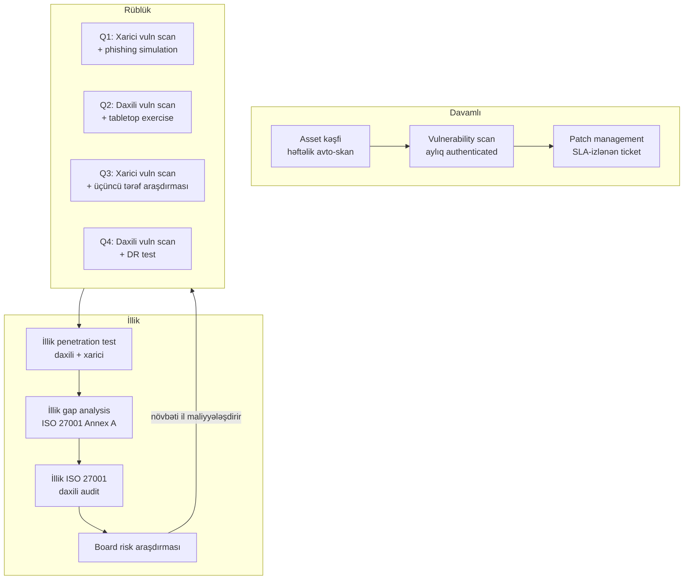

# Təşkilatın Təhlükəsizlik Qiymətləndirməsi

**Təhlükəsizlik qiymətləndirməsi** — strukturlaşdırılmış, vaxt çərçivəsində aparılan işdir və tək bir suala cavab vermək üçündür: *təşkilatın iddia etdiyi təhlükəsizlik səviyyəsi ilə real səviyyə arasındakı fərq nədir?* Bu nə bir test, nə də bir alətdir — bu, hədəfi müəyyənləşdirən, onun haqqında məlumat toplayan, tapıntıları biznesə təsirinə görə qiymətləndirən və biznesə gerçəkdən icra edilə bilən prioritet planı təqdim edən bir prosesdir.

Bu tərif insanların onunla qarışdırdığı şeylərdən qəsdən genişdir. **Vulnerability scan** yalnız bir giriş məlumatıdır — sənə deyir ki, hansı yamaq edilməmiş proqram açıqdır, amma o yamağın biznesə nə qədər təsiri olduğunu deməz. **Penetration test** qiymətləndirmənin içindəki bir texnikadır — boşluğun istismar edilə bildiyini sübut edir, lakin tək başına siyasətə, təlimə və üçüncü tərəf risklərinə baxmır. **Compliance audit** "siz bu standartın mətnindəki tələblərə cavab verirsiniz?" sualına cavab verir — bu cavab "bəli" ola bilər və şirkəti hələ də asanlıqla pozmaq mümkün ola bilər. Real qiymətləndirmə skan, manual sınaq, sənəd araşdırması və müsahibəni birlikdə işlədir, tapıntıları şirkətin pul qazandığı şəkildə çəkilərlə qiymətləndirir və icraçı komandanın imzalaya, maliyyələşdirə və bağlanışa qədər izləyə biləcəyi bir şey hazırlayır.

Bu dərs təhlükəsizlik qiymətləndirməsi materialının *proses* yarısıdır. Tamamlayıcı dərs olan [Təhlükəsizlik alətləri — iş alətləri dəsti](./security-tools.md) hər mərhələdə əl atdığın utilitlər kataloqudur. İstənilən sırada oxuya bilərsən; real işdə isə onların arasında daim hərəkət edəcəksən.

## Beş qiymətləndirmə növü yan-yana

Adətən altı növ iş forması olur — gap analysis, risk assessment, vulnerability assessment, penetration test, compliance audit və red-team exercise. Onlar bir-biri ilə üst-üstə düşür, eyni şirkət bir ildə bir neçəsini işlədə bilər, amma onlar fərqli suallara cavab verirlər və qiymətləri çox fərqlidir. Yanlış formanı seçmək — qiymətləndirmələrin uğursuz olmasının ən tez-tez səbəbidir: "pentest" istəyən və 200 səhifəlik compliance papkası alan board növbəti dəfə bu işi maliyyələşdirməyəcək.

| Növ | Cavab verdiyi sual | Miqyas | Dərinlik | Çıxış | Tipik qiymət (USD) | Tipik müddət |
|---|---|---|---|---|---|---|
| Gap analysis | "X framework-dən nə qədər uzağıq?" | Bütün control set (məs. ISO 27001 Annex A, NIST CSF) | Sənəd və müsahibə araşdırması | Control-bə-control gap matrisi, yol xəritəsi | 5k–25k | 2–4 həftə |
| Risk assessment | "Hansı risklərə əvvəlcə pul ayırmalıyıq?" | Crown-jewel asset və proseslər | Workshop-yönlü, keyfi + kəmiyyət | Likelihood × impact ilə risk reyestri | 8k–40k | 3–6 həftə |
| Vulnerability assessment | "Hansı yamaqsız/səhv konfiqurasiya açıqdır?" | Şəbəkə diapazonları, host-lar, web app-lar | Əsasən avtomatik skan, yüngül validation | Asset-başına sıralı tapıntı siyahısı | 3k–15k | 1–2 həftə |
| Penetration test | "Hücumçu real olaraq daxil olub dəyərə çata bilərmi?" | Müəyyənləşdirilmiş hədəflər və ssenarilər | Manual istismar, zəncirvari hücumlar | Hücum hekayəsi, sübut, düzəlişlər | 15k–80k | 2–4 həftə |
| Compliance audit | "Standartın mətninə cavab veririkmi?" | Miqyasdakı control set (PCI-DSS, ISO, HIPAA) | Sübut-yönlü, formal sınaq | Pass/fail hesabat, sertifikat, RoC | 20k–150k | 4–12 həftə |
| Red-team exercise | "Blue team gerçək hücumçunu nə qədər yaxşı aşkar edir?" | Bütün infrastruktur, insan da daxil | Həftələr/aylar boyu adversary emulation | Detection gap hesabatı, killchain hekayəsi | 60k–300k | 6–12 həftə |

Faydalı qayda: sağlam proqram **gap analysis və risk assessment-i ildə bir dəfə**, **vulnerability assessment-i rüblük**, **penetration test-i ən azı ildə bir dəfə** (internetə açıq sistemlər üçün), **compliance audit-i tənzimləyicinin tələb etdiyi tezlikdə** və **red-team exercise-i blue team kifayət qədər yetkin olanda** — adətən üçüncü-dördüncü ildə işlədir.

İki uğursuzluq forması müştəri yanlış formanı seçəndə təkrar-təkrar görünür:

- **Pentest aldı, vulnerability assessment lazım idi.** Pentester hücum yollarını zəncirləyir və beş istismar hekayəsi təqdim edir. Müştəri isə hər serverdə hər çatışmayan yamağın siyahısını istəyirdi. Hər ikisi düzgündür; yalnız biri istəklə üst-üstə düşürdü.
- **Compliance audit aldı, risk assessment lazım idi.** Audit framework əsasında təmiz hesabat verir. Altı ay sonra şirkət framework-ün tələb etmədiyi nəyəsə görə pozulur — və board həqiqətən çaş-baş qalır, çünki onlara dedilər ki, "keçdik".

Hər iki halda həll eynidir: SoW imzalamadan əvvəl bir cümlə yaz ki, hesabat hansı *qərarı* mümkün etməlidir, sonra real olaraq həmin qərarı verə bilən iş formasını seç.

## Mərhələ 1 — Miqyaslama və ön-iş

Miqyaslama (scoping) — qiymətləndirmənin uğur və ya uğursuzluğunun həll olunduğu yerdir. Bu mərhələnin nəticəsi yazılı razılaşmadır: tam olaraq nə test olunur, nə vaxt, kim tərəfindən və nə isə səhv getsə nə baş verir. Bu mərhələni atlamaq elə işlərə gətirib çıxarır ki, tester miqyasdan kənar şey tapır və "həddini aşmaqda" ittiham olunur, ya da miqyas daxilində heç nə tapmır və "tənbəl olmaqda" ittiham olunur.

Tipik bir iş üçün scoping sənədi bunları əhatə edir:

- **Biznes məqsədi** — bir paraqraf izah edir ki, *niyə* bu qiymətləndirmə aparılır. "SOC 2 audit-dən əvvəl", "merger-dən sonra inteqrasiya", "vendor breach-dən sonra board-un narahatlığı".
- **Miqyasdakı asset-lər** — açıq IP diapazonları, hostname-lər, URL-lər, AD domain-ləri, mobil app-lar, cloud account-ları. Həm IP-ləri, həm də insan oxuyan adı yaz; buradakı qeyri-müəyyənlik 02:00-da telefon zənglərinə səbəb olur.
- **Miqyasdan kənar asset-lər** — production database master-ləri, CEO-nun laptop-u, sənin sınaq lisenziyan olmayan üçüncü tərəf SaaS. Bunları yazılı şəkildə qeyd et.
- **Test pəncərələri** — tarix diapazonu və günün vaxt pəncərələri. Production hədəflər üçün adətən "B.e–C 19:00–06:00 yerli, plus həftəsonu".
- **Rules of engagement (RoE)** — hansı texnikalar icazəlidir (DoS bəli/xeyr, sosial mühəndislik bəli/xeyr, fiziki giriş bəli/xeyr), hansı sübutları saxlamaq olar, hansı dataları dərhal silmək lazımdır.
- **Kommunikasiya ağacı** — tester-in əsas və ehtiyat əlaqə şəxsi, müştərinin əsas və ehtiyat əlaqə şəxsi, Critical tapıntı görünəndə eskalasiya yolu, tester outage törətsə, getmə yolu. Telefon nömrələri, yalnız email yox.
- **Authorization letter** — tester-in özü ilə gəzdirdiyi imzalanmış "həbsxanadan çıxış" məktubu — layihəni, miqyası, tarixləri və müştəri imzalayanın əlaqə məlumatını yazır. Müştərinin SOC-u test trafikini görüb hüquq-mühafizə orqanlarına xəbər versə, bu məktub vəziyyəti həll edən şeydir.
- **NDA və data idarəsi** — tapıntılar, screenshot-lar və exfiltrate edilmiş datanın necə saxlanılması, şifrələnməsi, ötürülməsi və silinməsi.
- **Çatdırılma və qəbul** — hansı hesabatlar hazırlanır, hansı formatda, hansı review tsiklində və "hazırdır" nə deməkdir.
- **Kommersiya şərtləri** — saatlıq qiymət, change-control mexanizmi, re-test daxildir/yox, səfər üçün kim ödəyir.

Scoping sənədi hər iki tərəfdən imzalanır əvvəl heç bir trafik yaradılmadan. Tipik uğursuzluq formalarından biri — sənədlər geri qayıtmazdan əvvəl "yalnız discovery scan-larına" başlamaqdır. Discovery scan-ları *də* sınaqdır və hücumçunun yaradacağı eyni log-ları yaradır.

## Mərhələ 2 — Kəşf və məlumat toplama

Sənədlər imzalandıqdan sonra komandaya orada nəyin olduğunu bilmək lazımdır. Müştərilər daim öz asset inventory-lərinin nə qədər tam olduğunu çoxsayır; qiymətləndirmənin verdiyi ən dəyərli şeylərdən biri *dəqiq xəritədir*.

Kəşfin həm passiv, həm də aktiv tərəfi var.

**Passiv / sənəd əsaslı:**

- Müştərinin mövcud **asset inventory-ni** (CMDB, spreadsheet, nə varsa) çıxar və ona həqiqət kimi yox, *fərziyyə* kimi bax.
- **Şəbəkə diaqramları**, data-flow diaqramları və hər hansı arxitektura sənədi topla.
- **Siyasət və prosedur sənədləri** çıxar — təhlükəsizlik siyasəti, AUP, incident-response planı, change-control proseduru. Praktika ilə uyğun gəlməyən siyasət özü bir tapıntıdır.
- Hər miqyasdakı sistem üçün **sahibləri** müəyyənləşdir və qısa müsahibələr təşkil et. Sistemin sahibi həmişə sənəddə olmayan şeyləri bilir.
- **OSINT** keçidləri işlət — Shodan, Censys, certificate-transparency log-ları, müştərinin public DNS-i, employee LinkedIn (org-chart üçün), breach-data lookup (artıq sızdırılmış credential üçün). `theHarvester` və SpiderFoot kimi alətlər buradadır.

**Aktiv / şəbəkədə:**

- Miqyasdakı diapazonların canlı host-larını təsdiqləmək üçün nəzakətli **ping sweep** və **TCP/UDP port scan**.
- **Servis və versiya təsbiti** (`nmap -sV`) — hansı proqramla işlədiyini bilmək üçün.
- Reprezentativ hissədə **authenticated vulnerability scan** (Nessus, OpenVAS, Qualys) — authenticated scan unauthenticated-dən on dəfə çox tapır.
- Miqyasdakı URL-lərin **web crawl-u** (Burp Suite, ZAP) — endpoint və form-ları xəritələmək üçün.
- İş fiziki saytı əhatə edirsə **wireless survey**.

```bash
# Tipik 1-ci gün discovery sweep — example.local /24
nmap -sn 198.51.100.0/24                  # kim canlıdır
nmap -sS -sV -T4 -oA disc 198.51.100.0/24 # port + versiya, bütün format
nmap --script vuln -p 80,443,445 198.51.100.0/24
```

Kəşf mərhələsi **təsdiqlənmiş asset siyahısı** ilə bitir — miqyasda olduğu məlum olan hər host, sahibi, funksiyası, əməliyyat sistemi, açıq servisləri. Bundan sonrakı hər şey həmin siyahıya istinad edir.

Bu mərhələdə tipik təəccüb — **shadow IT**-dir — texniki olaraq miqyasda olan (müştərinin IP boşluğunda və ya domain-ində) lakin heç bir inventory-də olmayan asset-lər. Köhnə marketinq landing page-i $5/ay VPS-də, finance komandasının köhnə Hetzner box-da qaldırdığı Trello-bənzər alət, developer-in üç ildən bəri "müvəqqəti" S3 bucket-i. Adətən ən pis tapıntılar buradan gəlir. Onları asset siyahısına əlavə et, müştəriyə dərhal bildir və "iddia edilən inventory" ilə "kəşf edilən inventory" arasındakı fərqi özü-özlüyündə bir tapıntı kimi hesabata sal.

## Mərhələ 3 — Sınaq və validation

Sınaq (testing) — qiymətləndirmənin kəşf edilmiş zəifliklərin əhəmiyyəti olub-olmadığını sübut etdiyi yerdir. Əsas qayda — **blended assessment** — yalnız avtomatik skan həddindən artıq false positive verir, 1000-host mühitdə isə yalnız manual sınaq birinci subnet-i bitirməmiş vaxt qurtarır. Cavab — skannerlərin enini, insanların dərinliyini örtməsidir.

Hər asset sinfinə görə blended workflow:

- **Şəbəkə və host** — avtomatik skan → tester nəticələri triage edir → 10–20 ən yaxşı namizədin manual istismarı → sübut toplama.
- **Web tətbiqi** — authenticated scanner keçidi → tester OWASP WSTG checklist-inə qarşı tətbiqi əl ilə gəzir → xüsusən auth, session, access-control və injection fəsillərinin manual istismarı.
- **Active Directory** — BloodHound / PingCastle data toplama → tester Domain Admin-ə hücum yollarını araşdırır → yolun müştərinin xüsusi konfiqurasiyasında həqiqətən işlədiyinin manual təsdiqi.
- **Cloud** — read-only role əsaslı skan (ScoutSuite, Prowler, CloudSploit) → tester IAM və storage tapıntılarını əl ilə təsdiqləyir → cross-account və ya cross-tenant açıqlığı sınaqdan keçirir.
- **Proses / insanlar** — operatorlarla müsahibə, incident response walkthrough, RoE icazə verirsə opsional phishing kampaniyası.

**Fail-safe prosedurlar.** Real production-u sınamaq risklidir. Tester saxlayır:

- **Kill switch** — bütün işləyən alətləri dayandıran bir əmr və ya siqnal. RoE-də sənədləşdir.
- **Change log** — yaradılan hər account, yazılan hər fayl, dəyişən hər konfiqurasiya, vaxt damğası ilə. Bu, hesabatın 1-ci günündə təmizləmə checklist-inə çevrilir.
- **Don't-touch siyahı** — miqyasda olduğu kəşf edilən, lakin görünən şəkildə kövrək olan asset-lər (köhnə SCADA, köhnə healthcare cihazları). Onları "yalnız manual, müştəri yanında olarkən" kateqoriyasına keçir.

**Sübut toplama standartları.** Hesabatda görünəcək hər tapıntı təkrar-yaradıla bilən sübut tələb edir. Minimum:

- Vaxt damğası (timezone ilə).
- Mənbə IP və hədəf IP/URL.
- İstifadə olunan dəqiq əmr və ya HTTP request.
- Tam cavab, yarısının screenshot xülasəsi yox.
- Hücumun uğurlu olduğunu göstərən screenshot, həssas data sınaq mühitindən çıxmazdan əvvəl redakte edilmiş.

Sübutu hər iş üçün şifrələnmiş konteynerdə saxla. Müştəri sübutunu heç vaxt şəxsi qeyd alətinə, public AI chat-ə və ya işə-xas olmayan bir chat kanalına yapışdırma.

Audit-lərdən sağ çıxan sadə sübut-folder layout-u:

```text
engagement-2026-q2-example.local/
├── 00-scope/
│   ├── signed-sow.pdf
│   ├── auth-letter.pdf
│   └── roe.md
├── 10-discovery/
│   ├── nmap-disc.xml
│   ├── nessus-auth-2026-04-21.nessus
│   └── osint-notes.md
├── 20-testing/
│   ├── F-001-confluence-rce/
│   │   ├── request.txt
│   │   ├── response.txt
│   │   ├── screenshot-redacted.png
│   │   └── notes.md
│   └── F-002-tls10/
├── 30-report/
│   ├── draft-v1.docx
│   ├── final-v1.0.pdf
│   └── exec-briefing.pptx
└── 90-cleanup/
    ├── accounts-removed.md
    └── files-removed.md
```

Rəqəmli prefikslər folderləri istənilən fayl browser-də həyat dövrü sırasında saxlayır, `90-cleanup` folderi isə işin bağlandığını imzalamamışdan əvvəl lead-in baxdığı son şeydir.

## Mərhələ 4 — Analiz və risk reytinqi

Xam tapıntılar hələ hesabat deyil. Analiz mərhələsi hər texniki tapıntını icraçının şirkətdəki digər risklərlə müqayisə edə biləcəyi **biznes-çəkili riskə** çevirir.

Standart giriş — əsas zəifliyin **CVSS v3.1** base score-udur — bu, vendor-neytral 0–10 ciddilik verir. Yalnız CVSS yetərli deyil, çünki eyni CVE oturduğu asset-dən asılı olaraq fərqli real təsirə malikdir. Söndürülmüş lab box-da CVSS 9.8 RCE — kağız üzərində 9.8, reallıqda "low"-dur.

Əksər qiymətləndirmə komandalarının istifadə etdiyi praktik formula:

```text
Risk = Likelihood × Business Impact
```

- **Likelihood** CVSS exploitability + açıqlıq (internet-facing? authenticated? wild-da məlum exploit?) + kompensasiya control-larından (WAF? EDR? şəbəkə segmentasiyası?) qurulur.
- **Business Impact** asset kritikliyindən (gəlir gətirir? regulated data? safety-critical?) + blast radius (bir host vs. bütün AD forest) + bərpa xərcindən qurulur.

Hər ikisi eyni 1–5 şkala üzrə qiymətləndirilir, məhsul isə 1–25 grid-də düşür və **Critical / High / Medium / Low / Informational**-a təmiz uyğunlaşır.

| Reytinq | Bal | Mənası | Düzəliş üçün tipik SLA |
|---|---|---|---|
| Critical | 20–25 | Crown jewel-ə birbaşa yol, bu gün istismar edilə bilər | 7 gün |
| High | 12–19 | Ciddidir, səy və ya lateral movement ilə istismar edilə bilər | 30 gün |
| Medium | 6–11 | Real, lakin məhdud, və ya zəncirvari şərt tələb edir | 90 gün |
| Low | 3–5 | Hardening üçün, dərhal zərər yolu yoxdur | 180 gün və ya növbəti relizdə |
| Info | 1–2 | Yalnız məlumat üçün, əməliyyat tələb olunmur | yoxdur |

**Low + low → high zəncirləməsi.** Ən dəyərli analizin bir hissəsi burada baş verir. Verbose error səhifələri üçün bir "Low", self-registration üçün başqa bir "Low" və rate-limiting yoxluğu üçün üçüncü "Low" — birlikdə "High" account-takeover yoluna çevrilə bilər. Hər Low-u digər Low-larla ən azı bir dəfə müqayisə et və soruş: "hər ikisi məndə olsa, nə edə bilərəm?" Zənciri hesabatda açıq şəkildə sənədləşdir — bu, avtomatik alətlərin sənin əvəzinə tapa bilmədiyi yeganə şeydir.

**Reytinq nümunəsi.** Confluence instance-ində CVE-2023-22515 yamaqsızdır (CVSS 9.8). Instance internet-facing-dir, qarşısında WAF yoxdur və mühəndis wiki-ni — credential rotation runbook-ları daxil olmaqla — host edir. Likelihood = 5 (RCE, unauth, public exploit, kompensasiya control yoxdur). Business Impact = 5 (tam credential açıqlığı, AWS production-a lateral yol). Risk = 25 → Critical, 7-gün SLA. *Eyni* CVE-ni VPN arxasındakı daxili Confluence-də EDR və yalnız Entra-ID girişi ilə müqayisə et: Likelihood = 2 (yalnız daxili, MFA-gated), Impact = 4 (hələ də həssas runbook host edir). Risk = 8 → Medium, 90-gün SLA. Eyni CVE, eyni vendor patch — fərqli ticket, fərqli aciliyyət, icraçı sponsor ilə fərqli söhbət.

## Mərhələ 5 — Hesabat

Hesabat müştərinin saxladığı yeganə artefaktdır. İş bitdikdən aylar sonra tester yox olur, hesabat isə qalır. Ona çatdırılma kimi yanaş.

Yaxşı hesabatın ən azı iki auditoriyası və beləliklə ən azı iki qatı var. **Executive summary** — qiymətləndirmənin pulunu ödəyən insanlar üçündür — texniki olmayan biri tərəfindən beş dəqiqədə oxuna bilməli və riskdən başlamalıdır, texnikadan yox. **Texniki tapıntılar** — problemləri düzəldən insanlar üçündür — junior mühəndisin yalnız hesabat ilə təkrar-yaradıla bilməlidir.

İşə yarayan TOC:

```text
1. Executive Summary                               (1–2 səhifə)
   1.1 İşin məqsədi və miqyası
   1.2 Əsas tapıntılar (jargon yox)
   1.3 Risk vəziyyəti (heat map: hər ciddiliyə görə say)
   1.4 İlk 5 tövsiyə
2. İşin detalları                                  (1 səhifə)
   2.1 Tarixlər, komanda, miqyas təsdiqi
   2.2 Metodologiya xülasəsi (PTES / OWASP WSTG / NIST SP 800-115)
   2.3 Məhdudiyyətlər və fərziyyələr
3. Risk metodologiyası                             (1 səhifə)
   3.1 CVSS v3.1 + business-impact formulası
   3.2 Ciddilik tərifləri və SLA xəritəsi
4. Tapıntılar                                      (sənədin böyük hissəsi)
   Hər tapıntı üçün:
     - ID, başlıq, ciddilik, CVSS vektor, təsirlənmiş asset-lər
     - Təsvir (nədir, niyə əhəmiyyətlidir)
     - Sübut (əmrlər, request-lər, screenshot-lar)
     - Biznes təsiri (sadə dildə)
     - Tövsiyə (xüsusi, icra edilə bilən, versiyaya bağlanmış)
     - İstinadlar (CVE, vendor advisory, OWASP/CIS link)
5. Strateji tövsiyələr                             (2–3 səhifə)
   5.1 Proqram səviyyəsində mövzular (məs. "patch SLA tətbiq olunmur")
   5.2 30/60/90 yol xəritəsi
6. Əlavələr
   A. İstifadə olunan alətlər və versiyalar
   B. Sınaqdan keçmiş tam asset inventory
   C. Xam scanner çıxışı (ayrı şifrələnmiş əlavə)
   D. Re-test meyarları və qiyməti
```

**Re-test meyarları** — hamının unutduğu bölmədir. Hər Critical və High tapıntısı üçün "düzəldildi"-nin nə demək olduğunu açıq şəkildə yaz — patch versiyası, konfiqurasiya dəyişikliyi, müştərinin verməli olduğu sübut — və re-test-in nəyi əhatə edib nəyi etmədiyini. Bunsuz hər re-test yeni danışıqlara çevrilir.

Adətən eyni məzmundan iki hesabat hazırlanır: **board üçün executive briefing** (10–15 slayd, CVE nömrələri yox, remediation-ın ROI-si, peer benchmarking) və **tam texniki hesabat**. Heç vaxt board-a yalnız texniki hesabat çatdırma və mühəndisliyə yalnız briefing çatdırma — hər iki auditoriya hər iki qata ehtiyac duyur.

## Mərhələ 6 — Düzəliş izləmə

Ticket-də olmayan tapıntı düzəldilmir. Düzəliş izləmə (remediation tracking) — hesabatı bir dəfəlik sənəddən bağlı dövrəli təkmilləşməyə çevirən şeydir.

Mexanika:

1. Hesabat çatdırıldıqdan bir həftə ərzində hər tapıntı ticket-ə çevrilir — Jira, ServiceNow, Linear, müştəri nə işlədirsə. Bir tapıntı = bir ticket. Hesabatdakı tapıntı ID-si ticket başlığının prefiksidir ki, iki sistem birləşsin.
2. Hər ticket risk reytinqindən **ciddilik SLA-sını** miras alır. SLA saatı ticket groomed olduğu gün yox, hesabatın çatdırıldığı gün başlayır.
3. Hər ticket-in adlı **sahibi** (komanda yox, şəxs) və **bitmə tarixi** ("tezliklə" yox, SLA) var.
4. Ticket-lər ilk ay **həftəlik remediation standup-ında** və sonra aylıq governance görüşündə araşdırılır. Sürüşdürülmüş SLA-lar görünür olur — divar lövhəsində rənglə kodlanır, icraçı sponsora eskalasiya edilir.
5. Mühəndis "düzəldildi" deyəndə ticket **Closed**-ə yox, **Re-test üçün hazırdır**-a keçir.
6. **Verification re-scan** yalnız bağlanmış ticket-lərə qarşı işləyir — adətən orijinal test planının fokuslu re-run-u plus düzəlişin yeni açıqlıq yaratmadığının sürətli təsdiqi. Re-test orijinal hesabatın 4-cü bölməsindəki meyarlarla miqyaslanır.
7. **Closed-loop sign-off** — müştəri tapıntının düzəldildiyini imzalayır *və ya* adlı icraçı qəbul edənlə və bitmə tarixi ilə sənədləşdirilmiş risk acceptance-ı imzalayır.

Risk acceptance — qanunidir; risk *amneziyası* — yox. Qəbul edilən hər şey üçün acceptance bitmə tarixində yenidən baxış üçün calendar reminder olur, istisna yoxdur.

Növbəti on iki ay audit-dən sağ çıxan minimal Jira ticket şablonu:

```text
Title:        [F-014] High — Stored XSS in admin panel
Components:   AppSec, Web
Priority:     P1 (High ciddilikdən, 30-gün SLA)
Due date:     2026-05-23 (hesabat çatdırılmasından 30 gün)
Assignee:     @platform-lead
Description:  Hesabatdakı tapıntının kopyası,
              plus hesabat ID-si və hesabat versiyası.
Acceptance:   - Vendor patch v9.4.7 bütün admin node-larda deploy edildi
              - Partner re-test çıxışda input-un encode edildiyini təsdiqlədi
              - Təsirlənmiş endpoint üçün WAF qaydası saxlanıldı
Linked:       jira://SEC-2026-Q2 (proqram epic-i)
              confluence://reports/2026-Q2-final.pdf
```

Hər hesabat tapıntısının dəqiq bir ticket-i; hər ticket-in dəqiq bir hesabat tapıntısı var. Bu bir-birə uyğunluq növbəti qiymətləndirmənin "keçən dəfədən nə dəyişdi" sualını verib müdafiə oluna bilən cavab almasına imkan verən şeydir.

## Sağlam proqramda illik ritm

Tək, birdəfəlik qiymətləndirmə — teatrdır. Təhlükəsizlik göstəricisini hərəkət etdirən qiymətləndirmələr — calendar üzrə işləyən və bir-birini qidalandıranlardır.



Rüblük drumbeat böyük illik hadisələr arasındakı sürüşməni tutur. İllik hadisələr rüblük skanların qaçırdığı arxitektura səviyyəsində problemləri tutur. İlin sonunda board araşdırması ilin tapıntılarını növbəti ilin büdcəsinə çevirir — bu döngə olmadan proqram özünü ac qoyur.

## Hands-on

Bu məşğələlər notebook-da və ya peer review ilə paylaşılan dokda edilmək üçün hazırlanıb. Hər biri 30–60 dəqiqə çəkir; birlikdə real işin yaratdığı eyni artefaktları sənə gəzdirir.

### Məşğələ 1 — 200-user fictional SaaS üçün scoping sənədi

`example.local` üçün bir səhifəlik scoping sənədi yaz — 200-user B2B SaaS şirkəti, SOC 2 Type I audit-dən əvvəl ilk müstəqil təhlükəsizlik qiymətləndirməsini istəyir. Qiymətləndirmə bunları əhatə etməlidir:

- Production AWS account (3 VPC, ~80 EC2 instance, 4 RDS database).
- Müştəri-üzlü web app `app.example.local` və admin app `admin.example.local`.
- Korporativ Microsoft 365 tenant — SharePoint və Exchange Online daxil.
- Bütün işçilərə qarşı phishing simulation.
- *Miqyasdan kənar:* production database master-ləri və şirkətin sahib olmadığı üçüncü tərəf SaaS (Stripe, Salesforce və s.).

Scoping sənədi yuxarıdakı Mərhələ 1 siyahısının bütün bullet maddələrini ehtiva etməlidir. Bir səhifəyə hədəf qoy — bir səhifəyə sığdırmırsansa, miqyasın həddən artıq qeyri-müəyyəndir.

### Məşğələ 2 — Biznes-çəkili risk balları

Aşağıdakı beş tapıntını `Risk = Likelihood × Business Impact` ilə hər biri 1–5 şkalada qiymətləndir, sonra Critical / High / Medium / Low-a uyğunlaşdır. İşini göstər.

| # | Tapıntı | CVSS base | Asset konteksti |
|---|---|---|---|
| 1 | Confluence-də unauthenticated RCE | 9.8 | Daxili wiki, internet-facing, WAF yoxdur |
| 2 | Admin panel-də stored XSS | 6.1 | Yalnız authenticated admin user-lərə açıqdır |
| 3 | Müştəri portal-da TLS 1.0 aktivdir | 5.3 | Müştəri portalı, ödəniş datası emal edir |
| 4 | Marketing saytında security header çatışmır | 4.3 | Statik marketing sayt, auth yoxdur, PII yoxdur |
| 5 | Active Directory-də zəif şifrə siyasəti | 7.5 | Production AD forest, MFA yalnız VPN üçün məcburidir |

Gözlənilən nəticə: ən azı bir Critical, ən azı bir Low və 2-ci və 5-ci tapıntılar arasında tapdığın zəncirin yazılı əsaslandırılması.

### Məşğələ 3 — Executive summary paraqrafı

Sən yenicə xarici qiymətləndirmə bitirdin və o **2 Critical, 8 High, 14 Medium** tapıntı, plus 31 Low və Info maddə verdi. Hesabatı açan executive summary paraqrafını yaz — maksimum 150 söz. Məhdudiyyətlər:

- CVE nömrəsi yox.
- Alət adı yox.
- Ümumi vəziyyət üzrə bir cümlə.
- Hər Critical üçün bir cümlə, sadə dildə.
- Növbəti 30 gündə nə etmək lazım olduğu üzrə bir cümlə.
- Növbəti 90 gündə nə etmək lazım olduğu üzrə bir cümlə.

Texniki olmayan birinə ucadan oxu. Sənə dediyini geri xülasə edə bilmirsə, yenidən yaz.

### Məşğələ 4 — 30/60/90 düzəliş planı

3-cü məşğələnin eyni tapıntı qarışığını götür (2 Critical, 8 High, 14 Medium) və 30/60/90 planını cədvəl şəklində qur. Hər pəncərə üçün siyahıla:

- Hansı ciddilik vedrələri həll olunur.
- Person-day-də gözlənilən mühəndislik səyi.
- Sahib komanda (Platform / AppSec / IT / SecOps).
- O pəncərə üçün "definition of done".
- Ən böyük asılılıq (məs. "Patch window-un təsdiqi", "Məcburi şifrə sıfırlaması üçün stakeholder buy-in").

Maraqlı cavab nadir hallarda "bütün Critical-lar ilk 30 gündədir"-dir — bəzən Critical hələ buraxılmamış vendor patch-i tələb edir və 30 günlük çatdırılma əvəzinə kompensasiya control olur.

## İşlənmiş nümunə — example.local rüblük dövrü

`example.local` — 200-nəfərlik fintech şirkətdir, tək AWS production account, Microsoft 365 tenant və Bakıda yerləşən on-premises ofis var, `EXAMPLE\` Active Directory forest təxminən 220 user account və 40 server saxlayır. CISO-nun kiçik komandası var — özü, bir SecOps mühəndisi, bir GRC analitiki — və retainer üzrə xarici qiymətləndirmə partnyoru.

Onların Q2 calendar-ı belə görünür:

```text
Həftə 1  B.e   Daxili vuln scan başlayır (authenticated, Nessus)
         Çr.   Skan bitir; partner gecə triage edir
         Çr.A. Triage görüşü (CISO, SecOps, partner): tapıntılar sıralanır
         C.A.  Jira-da ticket-lər yaradılır, təyin edilir, SLA başlayır
         C     Mühəndislik manager-lərinə top 10 ilə email

Həftə 2  B.e   Düzəliş sprint 1 başlayır (Platform + AppSec komandaları)
                - 4 Critical Confluence və Jira instance-ı yamaqlanır
                - Müştəri portalında TLS 1.0 deaktiv edilir
                - Son breach corpus-da olan account-lar üçün şifrə sıfırlanır
         C     Sprint 1 demo — nə hazırdır, nə sürüşdü, niyə

Həftə 3  B.e   Düzəliş sprint 2 (High vedrəsi)
                - AD tiering tətbiqi
                - Service-account şifrə rotasiyası
                - WAF qayda araşdırması
         C     Sprint 2 demo

Həftə 4  B.e   Re-scan başlayır — eyni authenticated scan, eyni miqyas
         Çr.   Re-scan bitir; partner bağlanmış ticket-ləri yoxlayır
         Çr.A. Closed-loop sign-off görüşü; risk acceptance-lar qeyd edilir
         C.A.  Tabletop məşğələ: developer laptop-da ransomware
         C     Board paketi qaralaması — heat map, Q1 ilə müqayisədə trend, istəklər
```

4-cü həftənin sonunda Jira board-un snapshot-u belə görünür:

```text
SEC-2026-Q2 board state (snapshot 2026-04-30)

  In Progress (3)            Re-test üçün hazır (6)         Done (11)
  ┌───────────────────────┐  ┌─────────────────────────┐    ┌──────────────────────┐
  │ F-001  Confluence RCE │  │ F-003  TLS 1.0 portal   │    │ F-004  Headers       │
  │ F-007  AD tiering     │  │ F-005  Pwned passwords  │    │ F-006  Köhnə TLS     │
  │ F-009  WAF qayda araş │  │ F-008  Service accounts │    │ F-010  S3 ACL        │
  └───────────────────────┘  │ F-011  Köhnə kitabxana  │    │ ... 8 daha           │
                             │ F-012  Verbose errors   │    └──────────────────────┘
                             │ F-013  Self-registr.    │
                             └─────────────────────────┘

  SLA breach: 0    On track: 9    At risk: 3 (F-001, F-007, F-009)
```

"At risk" sütunu — CISO standup-a girəndə baxdığı sütundur. Oraya düşən hər ticket ya sürətli unblock alır (asılılığa sahib komanda ilə görüş) ya da sənədləşdirilmiş, vaxta bağlanmış risk acceptance — heç vaxt səssiz sürüşmə yox.

Rübün sonunda board paketi iki səhifədir. 1-ci səhifə — heat map: hər ciddilik üçün açıq tapıntı sayı, bu rüb və əvvəlki üç rüb, SLA-pozulma sayı vurğulanmış. 2-ci səhifə — istəklər: komandanın pulsuz düzəldə bilmədiyi iki maddə üçün büdcə (məs. "EDR lisenziyasını yüksək tier-də yenilə", "AD tiering layihəsini maliyyələşdir").

Q4-ə qədər eyni drumbeat AD forest-i "5 Domain Admin account-lu düz" vəziyyətdən "vault-da 2 break-glass account-lu tier-li" vəziyyətə çevirib, ictimai hücum səthini "qarışıq yamaqla 12 internet-facing servis"-dən "managed WAF arxasında 4 servis, 7-gün patch SLA"-ya çevirib və yeni CVE buraxılışından düzəlmiş vəziyyətə qədər vaxtı "biz buna gəlib çıxacağıq"-dan ölçülə bilən medyana 9 günə endirib. Bu uduşların heç biri bir böyük qiymətləndirmədən gəlmədi — hamısı izlənən backlog-u qidalandıran kiçik, planlaşdırılmış qiymətləndirmələrin bir ilindən gəldi.

## Qiymətləndirmə proqramının özünün yetkinliyi

Təşkilatın təhlükəsizliyinin yetkinlik əyrisi olduğu kimi, qiymətləndirmə proqramının da var. Birinci il adətən müdafiəçidir — şirkət qiymətləndirməni keçirir çünki müştəri və ya regulator tələb etdi və hesabata "ev tapşırığı" kimi baxılır. İkinci il tapıntıları mühəndislik backlog-una inteqrasiya etməyə başlayır. Üçüncü il əvvəlki bölmədəki calendar yerindədir. Dördüncü il təhlükəsizlik komandası daxili red-team məşğələlərini işlətməyə başlayır və xarici qiymətləndiricilər checklist iş əvəzinə adversary emulation üçün istifadə olunur.

Komandanın 15 dəqiqədə edə biləcəyi sürətli özünü-diaqnoz:

- Bu gün üç adamdan harada olduğunu soruşmadan son qiymətləndirmənin hesabatını çıxara bilərsənmi? (Birinci il düzəlişi: saxlanma siyasəti olan `reports/` folder.)
- Bu gün həmin hesabatdakı hər tapıntı üçün ticket-ə işarə edib statusunu görə bilərsənmi? (İkinci il düzəlişi: yuxarıdakı bir-birə uyğunluq.)
- Keçən ilin tapıntıları bu ilin qiymətləndirməsi başlamamış re-test edilirmi ki, yeni test onları sadəcə yenidən kəşf etməsin? (Üçüncü il düzəlişi: hər yeni işdən iki həftə əvvəl re-test sprint.)
- İcraçı sponsor hesabatı özbaşına oxuyur, yoxsa kimsə onu sponsorun qarşısına qoymalıdır? (Dördüncü il düzəlişi: board xülasəsi standart board gündəliyindədir.)

Doğru cavablar proqramın texniki olaraq nə qədər mövcud olmasından asılı olmayaraq hansı ildə olduğunu deyir.

## Tipik səhvlər

- **İş ortasında scope creep.** "Madem oradasınız, yeni alınan şirkəti də test edə bilərsinizmi?" — təmiz iki həftəlik testi qarışıq beş həftəliyə çevirən sorğudur. Cavab: change order yaz, yenidən qiymət ver, saatı yenidən başla — miqyası səssizcə udma.
- **Yazılı authorization yoxdur.** Manager-dən şifahi "bəli, davam et" — heç kimi qorumur. Müştəri SOC mühəndisi test trafikini hüquq-mühafizəyə bildirsə və yeganə authorization Slack mesajıdırsa, iş bitdi və tester-in problemi var. Həmişə imzalanmış məktub əldə olsun.
- **Re-test atlamaq.** Heç kimin yoxlamadığı düzəliş düzəliş deyil. Mühəndisin sözü ilə "remediated" işarələnmiş, re-scan olmayan tapıntının təxminən üçdən birində natamam olma şansı var.
- **Ciddilik SLA-sı yoxdur.** Hər ciddiliyə görə SLA olmadan ən maraqlı tapıntı əvvəlcə düzəlir, darıxdırıcı Critical-lar isə (yamaq, şifrə siyasəti, idarə olunmayan service account) əbədi qalır. SLA — "Critical"-ı mənalı edən şeydir.
- **Bir hesabatda texniki və icraçı auditoriyasını qarışdırmaq.** İcraçı iki səhifə oxuyur və dayanır; mühəndis iki səhifə oxuyur və qalanını eyni abstraksiya səviyyəsində fərz edir. İki qatlı çatdırılma, eyni mənbə dataları.
- **"Compliant ≠ təhlükəsiz."** Təmiz PCI-DSS RoC — şirkətin audit günü standart mətninə cavab verdiyini deməkdir. Bu, şirkətin pozulmasının çətin olduğunu demir. Eyni şey ISO 27001, SOC 2, HIPAA və hər başqa framework üçün də keçərlidir. Compliance-i ayrıca, riskdən ayrı hesabat ver; heç vaxt birinə digərini əvəzlətmə.
- **Düzəliş büdcəsi olmayan qiymətləndirmə.** Tapıntılarının düzəldiləcəyi yer olmayan qiymətləndirmə — papka istehsal edir, təhlükəsizlik yox. Scoping-dən əvvəl təsdiqlə ki, hesabatdan o tərəfdə gözləyən mühəndislik tutumu və büdcə var.

## Əsas məqamlar

- Qiymətləndirmə — *prosesdir*, alət deyil — miqyaslama, kəşf, sınaq, analiz, hesabat, düzəliş izləmə.
- Düzgün suala cavab verən iş formasını seç — gap, risk, vuln, pentest, compliance, red team bir-birini əvəz etmir.
- Scoping sənədi, authorization məktubu və re-test meyarları — işlərin ən tez-tez atladığı və ən tez-tez peşman olduğu üç sənəddir.
- Avtomatik skanları manual validation ilə birləşdir — heç biri tək başına faydalı tapıntı siyahısı vermir.
- Risk = Likelihood × Business Impact; CVSS giriş datasıdır, cavab deyil.
- İki hesabat, iki auditoriya — executive summary riskdən başlayır, texniki hesabat təkrar-yaradılmadan başlayır.
- Hər tapıntı ciddilik-yönlü SLA, sahib və re-test gate ilə ticket-ə çevrilir.
- Sağlam proqram illik ritmlə işləyir — rüblük skan, illik pentest, illik ISO 27001 daxili audit, davamlı asset kəşfi — və growth-u maliyyələşdirən board araşdırmasını qidalandırır.

## İstinadlar

- PTES — Penetration Testing Execution Standard: https://www.pentest-standard.org/
- OWASP Web Security Testing Guide (WSTG): https://owasp.org/www-project-web-security-testing-guide/
- OWASP Application Security Verification Standard (ASVS): https://owasp.org/www-project-application-security-verification-standard/
- NIST SP 800-115 — Technical Guide to Information Security Testing and Assessment: https://csrc.nist.gov/pubs/sp/800/115/final
- NIST SP 800-30 Rev. 1 — Guide for Conducting Risk Assessments: https://csrc.nist.gov/pubs/sp/800/30/r1/final
- NIST Cybersecurity Framework (CSF) 2.0: https://www.nist.gov/cyberframework
- PCI-DSS v4.0 Penetration Testing Guidance: https://www.pcisecuritystandards.org/document_library/
- ISO/IEC 27001:2022 Annex A control-ları: https://www.iso.org/standard/27001
- CVSS v3.1 spesifikasiyası: https://www.first.org/cvss/v3.1/specification-document
- MITRE ATT&CK: https://attack.mitre.org/
- CIS Controls v8: https://www.cisecurity.org/controls/v8
