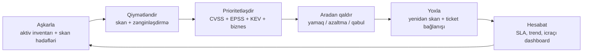

# Zəifliklərin İdarə Edilməsi

Hər ay 200 serverdən ibarət Windows/Linux mühiti təxminən **40 yeni CVE** qazanır — buraya əməliyyat sistemi, ara proqram təminatı, veb stekləri, firmware və onların üzərindəki tətbiqlər daxildir. Bəziləri önəmsizdir (heç kimin istifadə etmədiyi kitabxanada lokal çökmə), bəziləri isə günlər ərzində silahlandırılacaq internetə açıq RCE-lərdir. Təkrarlanan bir proses olmadan komanda "patch Tuesday" vasitəsilə bütün steki yamaq cəhdi edir və nəticədə əhəmiyyətli olanı buraxır: Exchange serveri, açıq Citrix gateway-i, vendor aparatının dərinliklərində yamaqlanmamış Log4j.

**Zəifliklərin idarə edilməsi** bu informasiya selini kiçik bir komandanın işləyə biləcəyi növbəyə çevirən intizamdır. Bu "rüblük olaraq bir dəfə skaner işlətmək" deyil; bu davamlı dövrədir — aşkarla, qiymətləndir, prioritetləşdir, aradan qaldır, yoxla, hesabat ver — hər mərhələdə açıq məsuliyyətlilər, SLA-lar və sübutlarla. Auditorlar *"bu gün kritik, real dünyada istismar edilən CVE işlətmədiyinizi necə bilirsiniz?"* soruşanda zəifliklərin idarə edilməsi proqramı cavabdır.

Bu dərs bütün həyat dövrünü izləyir: terminlərin əslində nə demək olduğu, istehsalatı sındırmadan necə skanlamaq, necə qiymətləndirmək və prioritetləşdirmək, yamaq mümkün olmayanda nə etmək və uydurma `example.local` şirkətində real aylıq siklin necə göründüyü.

## Zəiflik, təhdid və risk arasındakı fərq

Bu üç söz iclaslarda qarışıq istifadə olunur və bu real çaşqınlıq yaradır. Onları ayrı saxlayın.

| Termin | Nədir | Nümunə |
|---|---|---|
| **Zəiflik (vulnerability)** | Sistemdəki zəif nöqtə — çatışmayan yamaq, zəif parol siyasəti, açıq port | İnternetə açıq serverdə Log4j 2.14 |
| **Təhdid (threat)** | Həmin zəifliyi istismar edə biləcək kəs və ya nəsnə | Log4j axtaran ransomware qrupu |
| **Risk** | Təhdidin zəifliyi istismar etmə ehtimalı × baş verərsə təsir | "Yüksək — internetə açıq, RCE, serverdə müştəri məlumatı" |

Sürətli yoxlama: havada qalan laboratoriya maşınında həssas məlumatsız kritik CVE ciddi *zəiflikdir*, lakin aşağı *riskdir*. Eyni CVE ödəniş məlumatlarını idarə edən ictimai veb serverdə eyni zəiflikdir, amma on qat daha çox riskdir. Proqramınız CVSS rəqəmi üzrə deyil, risk üzrə optimallaşdırır.

Görəcəyiniz iki əlaqəli termin:

- **Ekspozisiya (exposure)** — zəifliyə imkan verən daha geniş vəziyyət: dəstəklənməyən OS, açıq S3 bucket-i, MFA-sı söndürülmüş admin. Ekspozisiyaların çox vaxt CVE-si olmur, lakin eyni dərəcədə təhlükəlidir.
- **Eksploit (exploit)** — zəiflikdən istifadə edən işləyən kod. "Eksploit mövcuddur" və "real dünyada istismar edilir" çox fərqli şeylərdir.

## Zəifliklərin idarə edilməsi həyat dövrü

Zəifliklərin idarə edilməsi **qapalı dövrədir**. Addımı buraxsanız, növbəti addımın çıxışı səhv olacaq.



**Aşkarla.** Mövcudluğunu bilmədiyiniz şeyi qoruya bilməzsiniz. Mənbələrə aşağıdakılar daxildir: Active Directory, DHCP icarələri, CMDB, bulud-təchizatçı API-ləri (Azure ARM, AWS Config), şəbəkə kəşf skanları (nmap sweep-ləri) və agent check-in-ləri. Nəticə sahib, kritiklik və mühit taqları ilə canlı aktiv siyahısıdır. Tipik alətlər: Lansweeper, ServiceNow CMDB, Microsoft Defender for Endpoint inventarı, Tenable Asset Inventory.

**Qiymətləndir.** Aktiv siyahısına qarşı autentifikasiyalı zəiflik skanlamaları işə sal — şəbəkə əsaslı skanerlər (Nessus, Qualys, OpenVAS) və endpoint agentləri (Rapid7 InsightVM agent, Qualys Cloud Agent, Defender Vulnerability Management). Dashboardda kimsə baxmadan əvvəl xam nəticələri CVE metadatası, CVSS, EPSS və KEV statusu ilə zənginləşdirin.

**Prioritetləşdir.** Xam skaner nəticəsi qırmızı dənizdir. Prioritetləşdirmə "bu həftə sonu yamaq" ilə "növbəti xidmət pəncərəsinə yığ" arasında fərq qoyduğunuz yerdir. Girişlər CVSS baza balı, EPSS (eksploit proqnozu), CISA KEV (məlum-istismar edilən siyahı), aktiv kritikliyi və internet ekspozisiyasıdır.

**Aradan qaldır.** Düzəlt. Yamaq açıq yoldur, lakin tək yol deyil — WAF qaydası ilə azalt, servisi yenidən konfiqurasiya et, şəbəkəni seqmentləşdir, hostu istifadədən çıxar və ya yazılı təsdiqlə riski qəbul et. Ticketlər skanerdən Jira / ServiceNow / Intune / WSUS / SCCM-ə axır.

**Yoxla.** Bağlanmış hər ticket həmin aktivin yenidən skanlamasını tətikləyir. Skaner nəticənin getdiyini bildirməyənə qədər getməyib. Bu addım "yamaqlandı amma yenidən başladılmadı", "səhv versiya yamaqlandı" və "yamaq GPO tərəfindən geri alındı" hallarını tutur.

**Hesabat.** Trend qrafikləri, SLA uyğunluğu, hər biznes vahidi üçün açıq kritik sayı. Hesabatlar davranışı yönləndirir — əgər komanda açıq-kritik sayını həftədən həftəyə açıq-aşkar görürsə, təmizləyir.

Təkrarla. Siklı hər ay (aylıq əməliyyat ritmi) davamlı aşkarlama və həftəlik skanlamalarla birlikdə işlə sal.

## Əvvəlcə aktiv inventarı

Aktiv siyahısı olmayan skaner qaranlıq otaqda fənərdir — şüanın vurduğunu görürsən, qalanını yox. Shadow IT, unudulmuş VM-lər, kimsənin 2019-da qurduğu test serveri və heç kimin sahiblənmədiyi IoT printeri qaranlıqda qalır.

**Yaxşı inventar üçün mənbələr:**

- **Active Directory** — son görülmə vaxtı damğası ilə bütün domen üzvü Windows hostları.
- **DHCP icarələri** — son 30 gündə IP soruşmuş hər şey.
- **DNS qeydləri** — kimsə adlandırmaq zəhmətini çəkdiyi hər şey.
- **Bulud təchizatçı API-ləri** — Azure Resource Graph, AWS Config, GCP Asset Inventory.
- **Şəbəkə skanları** — sahib olduğunuz hər CIDR-in nmap sweep-ləri, yuxarıdakılarla çarpaz istinadla. Burada görünən, amma AD/DHCP-də olmayan hər şey baxılmağa dəyər.
- **Agent check-in-ləri** — Intune, Defender, SCCM, Jamf, Rapid7 agent.
- **CMDB** — ServiceNow, Lansweeper, Device42. "Sahib" və "biznes kritikliyi"nin əslində yaşadığı yer.

**Hər aktivi bu taqlarla etiketlə:**

| Tag | Dəyərlər | Nə üçün |
|---|---|---|
| Mühit | prod, staging, dev, lab | Yamaq tezliyi, xidmət pəncərəsi |
| Kritiklik | crown-jewel, yüksək, orta, aşağı | Prioritetləşdirmə girişi |
| Sahib | şəxs və ya komanda | Ticketi kim alacaq |
| Ekspozisiya | internetə açıq, DMZ, daxili, air-gap | Prioritetləşdirmə girişi |
| Məlumat sinfi | PII, PCI, PHI, daxili, ictimai | Risk artırıcısı |

Yalnız iki tag əlavə edə bilsəniz, **kritiklik** və **ekspozisiya** olsun. Bu ikisi "CVSS 9.8"i "cümə yamaqla" və ya "növbəti xidmət pəncərəsi"nə çevirir.

## Skanlama növləri

Bütün skanlamalar eyni deyil və aralarındakı fərq nəticələri onluq dərəcələrlə dəyişir.

| Ox | Variant A | Variant B | Kompromis |
|---|---|---|---|
| **Autentifikasiya** | Credentialed (skaner admin kimi girir) | Non-credentialed (kənardan təxmin edir) | Credentialed 5–10x daha çox real problem tapır; non-credentialed autentifikasiyasız hücumçunun gördüyünü əks etdirir |
| **Yerləşdirmə** | Şəbəkə əsaslı (mərkəzi skaner) | Agent əsaslı (hər hostda yüngül klient) | Şəbəkə skaneri marşrut + kredensial tələb edir; agent gəzən laptoplarda işləyir |
| **Müdaxilə** | Qeyri-müdaxiləli (banner, versiya yoxlaması) | Müdaxiləli (eksploiti sınayır) | Müdaxiləli real problemləri tapır, lakin kövrək sistemləri sındıra bilər |
| **Perspektiv** | Xarici (internetdən) | Daxili (LAN-ın içindən) | Xarici hücum səthini göstərir; daxili şərq-qərb riskini göstərir |
| **Hədəf növü** | İnfrastruktur (OS, servislər) | Veb tətbiq (autentifikasiyalı crawl) | Veb tətbiqlər sessiya + crawl konfiqurasiyası tələb edir, sadəcə port skanı yox |
| **Rejim** | Aktiv (trafik göndərir) | Passiv (trafiki sniff edir) | Aktiv avtoritardır; passiv aktivin qaçırdığını tutur (IoT, kövrək OT) |

**Nümunəvi alətlər:**

| Alət | Kateqoriya | Tipik istifadə |
|---|---|---|
| **Nessus** (Tenable) | Şəbəkə skaneri | Server mühitinin autentifikasiyalı həftəlik skanlamaları |
| **OpenVAS / Greenbone** | Şəbəkə skaneri | Nessus-a açıq mənbəli alternativ |
| **Qualys VM / VMDR** | Şəbəkə + bulud agenti | Bulud əsaslı skanlama, laptoplar üçün agent |
| **Rapid7 InsightVM** | Şəbəkə + agent | Endpoint-lər üçün agent, serverlər üçün skaner |
| **Microsoft Defender Vulnerability Management** | Agent (Defender for Endpoint vasitəsilə) | Defender-dən istifadə edən Windows ağırlıqlı şirkətlər |
| **Nikto, OWASP ZAP, Burp Suite** | Veb tətbiq skaneri | Autentifikasiyalı veb tətbiq skanlamaları, bug hunting |
| **Nmap `--script vuln`** | Ad-hoc | Sürətli yoxlamalar, tək hədəflər |

**Credentialed skanlama — aktivləşdirə biləcəyiniz ən yüksək leverajlı parametr.** Tam yamaqlanmış Windows Server-in non-credentialed Nessus skanı ola bilsin bir neçə orta tapıntı göstərir (sertifikat gigiyenası, TLS versiyaları). Eyni host lokal admin hesabı ilə skanlananda OS, .NET və üçüncü tərəf tətbiqləri boyu yüzlərlə tapıntı göstərir. Bu dərsdən bir şey götürsəniz: **credentialed skanlamanı aktivləşdirin** və skan kredensiallarını vault-da idarə etmənin əməliyyat xərcini qəbul edin.

**Skan pəncərəsi vacibdir.** İş saatlarında "aqressiv" profillə istehsalatı skanlamaq onillərdir kövrək qurğuları sındırır. Xidmət pəncərəsinə əsaslanın, istehsalat üçün "safe checks" profilini istifadə edin və aqressiv profili staging-də saxlayın.

## CVE, CWE, CVSS bir səhifədə

SCAP ailəsindən gələn üç standart — hər gün görəcəksiniz.

### CVE — Common Vulnerabilities and Exposures

Spesifik məhsuldakı spesifik zəiflik üçün qlobal ID. Proqramı MITRE işlədir, yüzlərlə CNA (Numbering Authorities — Microsoft, Red Hat, Cisco, GitHub və s.) ID-lər verir.

Format: `CVE-YYYY-NNNNN` — nəşr ili, sonra ardıcıllıq nömrəsi.

```
CVE-2021-44228    Apache Log4j 2.x-də Log4Shell zəifliyi
CVE-2024-3094     XZ Utils backdoor
CVE-2017-0144     EternalBlue / SMBv1
```

Bir CVE = bir zəiflik. Eyni qüsurlu fərqli məhsullar fərqli CVE-lər alır.

### CWE — Common Weakness Enumeration

Zəiflik *siniflərinin* taksonomiyası. CVE-lər spesifikdir; CWE-lər CVE-nin aid olduğu ümumi kateqoriyadır.

```
CWE-79    Cross-site Scripting (XSS)
CWE-89    SQL Injection
CWE-502   Etibarsız Məlumatın Deseralizasiyası  ← CVE-2021-44228 buraya xəritələnir
CWE-287   Düzgün Olmayan Autentifikasiya
CWE-798   Hardcoded Kredensialların İstifadəsi
```

CWE-ləri trend təhlili ("CWE-79 buraxmağa davam edirik — məcburi output-encoding təlimi vaxtıdır") və kök səbəb kodlaşdırma rəhbərliyi üçün istifadə edin. CVE-ləri əməliyyatlar üçün istifadə edin.

### CVSS — Common Vulnerability Scoring System

0.0-dan 10.0-a qədər rəqəmsal ciddilik balı və rəqəmin necə əldə edildiyini göstərən standart vektor. CVSS v3.1 cari versiyadır; v4.0 mövcuddur, lakin 2026-da skanerlərin çıxardığı hələ də əsasən v3.1-dir.

**Ciddilik zolaqları (v3.1):**

| Bal | Reytinq |
|---|---|
| 0.0 | Yoxdur |
| 0.1 – 3.9 | Aşağı |
| 4.0 – 6.9 | Orta |
| 7.0 – 8.9 | Yüksək |
| 9.0 – 10.0 | Kritik |

**Baza vektoru — balı yaradan səkkiz metrik:**

| Metrik | Dəyərlər | Nəyi soruşur |
|---|---|---|
| AV — Attack Vector | N / A / L / P | Network / Adjacent / Local / Physical giriş lazımdır |
| AC — Attack Complexity | L / H | Aşağı / Yüksək — xüsusi şərtlər lazımdır |
| PR — Privileges Required | N / L / H | Yoxdur / Aşağı / Yüksək — eksploitdən əvvəl auth səviyyəsi |
| UI — User Interaction | N / R | Yoxdur / Tələb olunur — istifadəçi klikləməlidir |
| S — Scope | U / C | Unchanged / Changed — etibar sərhədindən keçirmi |
| C — Confidentiality | N / L / H | Məlumat məxfiliyinə təsir |
| I — Integrity | N / L / H | Məlumat bütövlüyünə təsir |
| A — Availability | N / L / H | Xidmət əlçatanlığına təsir |

**İşlənmiş nümunə — CVE-2021-44228 (Log4Shell):**

```
Vektor: CVSS:3.1/AV:N/AC:L/PR:N/UI:N/S:C/C:H/I:H/A:H
Baza balı: 10.0 Kritik
```

Parse et:

- `AV:N` — **Şəbəkə** üzərindən hücum edilə bilər (zəif log yayan endpoint-ə çata bilən hər yerdən)
- `AC:L` — **Aşağı** mürəkkəblik, xüsusi şərt yoxdur
- `PR:N` — İmtiyaz lazım deyil, tamamilə autentifikasiyasız
- `UI:N` — İstifadəçi qarşılıqlı təsiri yoxdur, hücumçu xüsusi hazırlanmış sətir göndərir
- `S:C` — **Scope dəyişdi**, istismar edilən JNDI lookup hücumçuya logging kitabxanasının kontekstindən çıxmağa imkan verir
- `C:H / I:H / A:H` — **Yüksək** təsir hər üçündə — tam RCE oxumaq, yazmaq və söndürmək deməkdir

Hər ölçüdə mümkün ən pis vektor → 10.0. Buna görə Log4Shell bütün sənayedə təcili yamaqlamağa səbəb oldu.

CVSS həmçinin **Temporal** və **Environmental** alt-balları (eksploit yetkinliyi, aradan qaldırma əlçatanlığı, mühitinizin modifikatorları) təyin edir. Əksər komandalar yalnız **base** balını istifadə edirlər, lakin Environmental "bu hostun şəbəkə ekspozisiyası yoxdur"un 9.8-i haqlı olaraq aşağı saldığı yerdir.

## Əslində işləyən prioritetləşdirmə

Yalnız CVSS üzrə sıralama "heç vaxt yamaqlamağı bitirməmək" kimi görünür. Tipik skaner CVSS 7+ olan minlərlə tapıntı buraxır. Heç kim bunu yığa bilməz.

**Real prioritetləşdirmə dörd siqnalı qarışdırır:**

1. **CVSS base** — istismar edilərsə ciddilik.
2. **EPSS** — [Exploit Prediction Scoring System](https://www.first.org/epss/) — **növbəti 30 gündə** eksploit edilmə ehtimalı (0–1). Təhlükə-kəşfiyyatı, eksploit kod əlçatanlığı, istinadlar və daha çoxundan hesablanır.
3. **CISA KEV** — [Known Exploited Vulnerabilities](https://www.cisa.gov/known-exploited-vulnerabilities-catalog) kataloqu. CVE KEV-də varsa, kimsə onu **hazırda** real dünyada istismar edir. Bu ən yaxşı prioritetləşdirmə siqnalıdır.
4. **Sizin mühitiniz** — aktiv internetə açıqdır? crown-jewel-dir? tənzimlənən məlumat daşıyır? zəif servis həqiqətən işləyir?

**Sadə prioritetləşdirmə matrisi:**

| KEV? | Ekspozisiya | CVSS | Tədbir | SLA |
|---|---|---|---|---|
| Bəli | İnternetə açıq | hər hansı | Təcili yamaq / azaltma | 72 saat |
| Bəli | Daxili | hər hansı | Növbəti pəncərədə yamaqla | 7 gün |
| Xeyr | İnternetə açıq | Kritik / Yüksək | Növbəti pəncərədə yamaqla | 14 gün |
| Xeyr | İnternetə açıq | Orta | Planlaşdır | 30 gün |
| Xeyr | Daxili | Kritik | Növbəti pəncərədə yamaqla | 30 gün |
| Xeyr | Daxili | Yüksək | Aylıq sikl | 60 gün |
| Xeyr | Daxili | Orta / Aşağı | Rüblük sikl | 90 gün |

Rəqəmləri risk iştahına və audit gözləntilərinizə uyğunlaşdırın, lakin struktur sağlamdır: **KEV və ekspozisiya CVSS-i dominant edir**. DMZ veb serverdə CVSS 6.3 KEV, CVSS 9.1 laboratoriya tapıntısından əvvəl yamaqlanır.

**EPSS niyə vacibdir.** FIRST.org EPSS modeli hər gün ~230,000 CVE-yə bal verir və ardıcıl göstərir ki, EPSS-in top 1%-i həqiqətən istismar edilənlərin 80%+-ni tutur. EPSS-i prioritetləşdirməyə qoşmaq 7+ bal alan 30%-i deyil, 1%-i birinci yamaqlamaq deməkdir.

## Aradan qaldırma yolları

Yamaqlamaq standartdır — amma tək variant deyil və belə davranmaq "bu 2015 LOB tətbiqini yamaqlaya bilmirik, ona görə heç nə etmirik" dalana aparır.

| Yol | Uyğun gəldiyi yer | Nümunə |
|---|---|---|
| **Yamaqla / yenilə** | Vendor düzəlişi var, tətbiq tolerant edir | `wsusscn2.cab` skanı, WSUS/Intune/SCCM yayımı, `dnf update`, `apt upgrade` |
| **Azalt (mitigate)** | Bu siklda yamaq mümkün deyil | Eksploit nümunəsini bloklayan WAF qaydası, zəif modulun söndürülməsi, konfiq dəyişikliyi, firewall ACL-ın daraldılması |
| **Seqmentləşdir** | Yamaqlana bilməz, inline azaldıla bilməz | Aktivi izolyasiya edilmiş VLAN-a köçür, daxili trafiki jump host-a məhdudlaşdır |
| **Çıxar / istifadədən sil** | Aktiv əslində lazım deyil | Yeganə istifadəçisi təqaüdə çıxmış köhnə Windows 2008 serverini söndür |
| **Əvəz et** | Düzəliş yeni məhsuldur | Dəstəklənməyən kitabxanadan miqrasiya, dəstəklənən əsas versiyaya yüksəlt |
| **Qəbul et** | Qalıq risk tolerant edilə bilər | Biznes sahibi tərəfindən imzalanmış sənədləşdirilmiş risk qəbulu, reyestrdə izlənilir, vaxtla məhdudlaşdırılır |
| **Transfer et** | Maliyyə riskini dəyiş | Kiber sığorta polisi, vendor ilə müqavilə şərti |

**İmzalanmış risk qəbulu "boş ver" deyil.** O daxildir: biznes əsaslandırması, bitmə tarixi (adətən 6–12 ay), imzalayan risk sahibi və kompensasiya nəzarəti. Tarix keçəndə yenidən növbəyə qayıdır.

**Yamaq idarəetməsinin reallığı.** Hər şirkətin yalnız Windows Server 2012 R2-də işləyən 10 illik LOB tətbiqi, CentOS 7 ilə gələn vendor aparatı və DBA-nın yenidən başlatmağa icazə vermədiyi istehsalat verilənlər bazası var. Təcili yamaqlamadan daha çox vaxtı bunların ətrafında kompensasiya nəzarətləri və seqmentasiyaya sərf edəcəksiniz. Bu normaldır.

## Skanlamalardan kənar təhlükəsizlik qiymətləndirmələri

Zəiflik skanlaması daha geniş qiymətləndirmə proqramındakı bir alətdir. Onu digərləri ilə qarışdırmayın.

| Qiymətləndirmə | Məqsəd | Əhatə | Kim aparır | Müddət | Xərc (təxmini) | Nəticə |
|---|---|---|---|---|---|---|
| **Zəiflik qiymətləndirməsi** | Məlum problemlərin geniş aşkarlanması | Geniş — əhatədəki hər aktiv | Nessus/Qualys ilə daxili komanda | Saatlar/günlər | $ | Prioritetləşdirilmiş CVE siyahısı |
| **Penetrasiya testi** | İstismar + təsirin sübutu | Dar — konkret hədəflər, vaxt çərçivəsi | Xarici konsultantlar | 1–3 həftə | $$ | İstismar edilmiş yollar, sübut, risk reytinqi ilə hesabat |
| **Red team çalışması** | Bütün təşkilatda aşkarlama + reaksiyanın yoxlanması | Hər şey əhatədədir, gizlilik tələb olunur | Xarici (və ya yetkin daxili komanda) | 4–12 həftə | $$$ | Hücum narrativi, blue-team boşluq analizi |
| **Purple team** | Red + blue-nun birgə detektləri yaxşılaşdırması | Spesifik TTP-lərə yönəlib | Qarışıq daxili / xarici | 1–2 həftə | $$ | Aşkarlama qaydaları, playbook yeniləmələri |
| **Bug bounty** | Davamlı crowdsourced test | Müəyyən əhatə, qarşılıqlı təsir qaydaları | İctimai və ya özəl tədqiqatçılar | Davamlı | $$ (etibarlı hər bag üçün ödə) | Platforma vasitəsilə göndərilmiş hesabatlar |
| **Konfiq auditi** | Konfiqi benchmarka qarşı müqayisə | OS / middleware / bulud | Daxili komanda və ya auditor | Günlər | $ | Benchmark uyğunluq hesabatı (CIS, DISA STIG) |
| **Kod baxışı / SAST / DAST** | Özəl koddakı baqları tap | Kod bazanız | Dev + AppSec | CI-da davamlı | $ | CI pipeline xətaları, Jira ticketləri |

**Skanerlər məlum CVE-ləri tapır. Pentestlər heç bir skanerin görmədiyi biznes məntiqi baqlarını tapır.** Əvvəlcə skaner işə salmadan pentest aparmaq $3k/il alətin tuta biləcəyi tapıntılarda bahalı konsultant vaxtını israf edir. Əvvəlcə skan, asan olanları düzəlt, *sonra* pentesti gətir.

## Praktiki çalışmalar

Laboratoriya VM-i və brauzerlə şagirdin edə biləcəyi dörd çalışma.

### 1. Test VM-ə qarşı `nmap --script vuln`

Qəsdən köhnəlmiş Linux VM-i işə sal (Metasploitable2 və ya məlum servislərlə köhnə Ubuntu). Eyni şəbəkədəki başqa serverdən:

```bash
# Əsas port + servis skanı
nmap -sV -p- 192.0.2.10

# Versiya uyğunlaşan zəiflik skriptləri
nmap -sV --script vuln 192.0.2.10 -oN vuln-scan.txt

# Daha kiçik hədəflənmiş icra — port 80-də yalnız HTTP skriptləri
nmap -sV --script "http-vuln*" -p 80 192.0.2.10
```

Nəticəni oxu. Portun altındakı hər `|_` sətri tapıntıdır — `CVE-YYYY-NNNNN`, `State: VULNERABLE` və istinadları qeyd et. İki CVE-ni çarpaz-yoxla:

- https://nvd.nist.gov/vuln/detail/CVE-YYYY-NNNNN — base balı, CWE, vektor.
- CISA KEV kataloqu — bu 1,200+ məlum-istismar edilənlərdən biridir?

Yuxarıdakı matrisdən istifadə edərək birinci hansı tapıntılara fəaliyyət göstərəcəyini və **niyə** yaz. "CVSS 9.8" cavab deyil; "KEV-də, internetə açıq, aradan qaldırma bir sətirlik konfiq dəyişikliyi" cavabdır.

### 2. CVSS v3.1 vektor sətirini əl ilə parse et

Verilmiş sətir:

```
CVSS:3.1/AV:N/AC:L/PR:N/UI:N/S:U/C:H/I:H/A:H
```

Hər metriki dekod et və zəifliyin Log4Shell-in `S:C` scope-undan daha pis və ya yaxşı olub-olmadığını göstər.

Gözlənilən cavab:

- `AV:N` — Şəbəkə hücum vektoru
- `AC:L` — Aşağı hücum mürəkkəbliyi
- `PR:N` — İmtiyaz lazım deyil
- `UI:N` — İstifadəçi qarşılıqlı təsiri yoxdur
- `S:U` — Scope **dəyişmədi** (Log4Shell-dən fərq)
- `C:H / I:H / A:H` — Tam təsir

Baza balı: **9.8 Kritik**. Log4Shell-dən bir qədər az ciddidir, çünki scope zəif komponentin içində qalır. Vektoru [FIRST CVSS v3.1 kalkulyatoruna](https://www.first.org/cvss/calculator/3.1) yapışdıraraq yoxla.

Sonra özün ağlabatan ssenari üçün vektor yazmağa çalış: Windows-da lokal imtiyaz artırma baqı, hücumçunun artıq aşağı imtiyazlı hesab istifadə etməsi tələb olunur və EXE işlətməyə aldadır. (Cavab: `AV:L/AC:L/PR:L/UI:R/S:U/C:H/I:H/A:H` → 7.3 Yüksək.)

### 3. Cari CISA KEV kataloqu JSON-unu çək və vendor üzrə filtr et

CISA KEV-i JSON kimi yayımlayır. Çək, parse et, filtr et.

```powershell
# PowerShell
$kev = Invoke-RestMethod `
    "https://www.cisa.gov/sites/default/files/feeds/known_exploited_vulnerabilities.json"

$kev.vulnerabilities.Count
$kev.vulnerabilities |
    Where-Object { $_.vendorProject -eq "Microsoft" } |
    Select-Object cveID, product, dateAdded, dueDate, knownRansomwareCampaignUse |
    Sort-Object dateAdded -Descending |
    Format-Table -AutoSize
```

```bash
# Bash + jq
curl -s https://www.cisa.gov/sites/default/files/feeds/known_exploited_vulnerabilities.json \
  | jq '.vulnerabilities[] | select(.vendorProject == "Microsoft")
        | {cveID, product, dateAdded, dueDate, knownRansomwareCampaignUse}'

# Neçə KEV-in ransomware-ə bağlı olduğunu say
curl -s https://www.cisa.gov/sites/default/files/feeds/known_exploited_vulnerabilities.json \
  | jq '[.vulnerabilities[] | select(.knownRansomwareCampaignUse == "Known")] | length'
```

Nəticəni aktiv inventarınla çarpaz istinad et. `product`-u işlətdiyin hər Microsoft KEV növbəti yamağındır. `dueDate`-i keçmiş hər hansı biri öz-özlüyündə tapıntıdır — ABŞ federal agentlikləri BOD 22-01 əsasında həmin tarixə qədər aradan qaldırmalıdırlar və tarix hamı üçün faydalı SLA-dır.

### 4. 10 uydurma tapıntı üçün 1 səhifəlik aradan qaldırma planı yaz

Sən təhlükəsizlik mühəndisisən. Bazar ertəsi skanından bu on tapıntın var. Çərşənbə axşamı triaj iclası üçün planı yaz.

| # | Aktiv | Ekspozisiya | CVE | CVSS | KEV? | EPSS |
|---|---|---|---|---|---|---|
| 1 | `dmz-web01` | İnternet | CVE-2024-XXXX (veb RCE) | 9.8 | Bəli | 0.92 |
| 2 | `dc01` | Daxili | CVE-2024-YYYY (imtiyaz artırma) | 7.8 | Bəli | 0.40 |
| 3 | `dev-jenkins` | Daxili | CVE-2024-AAAA (Jenkins plugin) | 6.5 | Xeyr | 0.08 |
| 4 | `file01` | Daxili | CVE-2021-ZZZZ (SMB info disclosure) | 5.5 | Xeyr | 0.01 |
| 5 | `dmz-web01` | İnternet | TLS 1.0 aktiv | 4.3 | n/a | n/a |
| 6 | `payroll-app` | Daxili | CVE-2022-BBBB (Log4j 1.x) | 9.0 | Xeyr | 0.30 |
| 7 | `printsrv01` | Daxili | PrintNightmare variantı | 8.8 | Bəli | 0.55 |
| 8 | `wsus01` | Daxili | WSUS öz-imzalı sertifikat | 3.1 | n/a | n/a |
| 9 | `sql01` | Daxili | Köhnə SQL CU | 6.8 | Xeyr | 0.04 |
| 10 | `laptop-fleet` | Mobil | Chrome 1 versiya geri | 8.1 | Xeyr | 0.12 |

Planın gözlənilən forması:

- **72 saat (təcili):** 1 (KEV + internet + kritik), 7 (print serverdə KEV, yamaq uzun çəksə də GPO ilə əvvəlcədən azaltmanı yerləşdir), 2 (DC-də KEV — daxili, amma istismar edilərsə oyun bitdi).
- **7 gün:** 6 (Log4j 1.x — bu gün KEV-də yoxdur, amma tarixən real dünyada istismar edilib və yenidən görünməsi ehtimal olunur), 10 (laptop Chrome — Intune avto-yeniləmə siyasəti).
- **Növbəti xidmət pəncərəsi (30 gün):** 3, 5, 9.
- **Rüblük / qəbul + sənədləşdir:** 4, 8.

Nəticə: cədvəl, hər sətir üçün sahib, hər sətir üçün hədəf tarix və bu rüblük yamaqlanmayan hər şey üçün "qalıq risk qəbul edildi" sətri olan bir səhifəlik sənəd.

## İşlənmiş nümunə — example.local aylıq sikli

Bu 200 server Windows + Linux, kiçik DMZ və ~600 laptopu olan `example.local` şirkətində real ritmin görünüşüdür.

**Həftəlik baza.**

- **Hər şənbə 02:00** — bütün `10.0.0.0/16` server mühitinin autentifikasiyalı Nessus skanı, komandanın parol menecerində saxlanılan `EXAMPLE\svc_scanner` hesabı ilə credentialed. Skan profili istehsalatda "safe checks", staging VLAN-da "aqressiv"dir.
- **Davamlı** — hər endpointdə Rapid7 / Defender agenti yamaqlar çatışmayan kimi delta tapıntıları hesabat verir.
- **Saatlıq** — CISA KEV JSON-u SIEM-ə çəkilir; CMDB-dəki aktivlərə uyğun gələn yeni qeydlər P1 Slack xəbərdarlığı qaldırır.

**Aylıq sikl.**

**1-ci həftə — skan və triaj.**

- *Bazar ertəsi* — həftə sonu skan nəticələri VM platformasına enir. Təhlükəsizlik mühəndisi CVSS ≥ 7 və ya KEV-dəki hər şeyi ixrac edir, aktiv kritikliyi və EPSS ilə zənginləşdirir, triaj cədvəlini hazırlayır.
- *Çərşənbə axşamı 10:00* — 60 dəqiqəlik triaj iclası. İştirakçılar: sec eng, Windows rəhbəri, Linux rəhbəri, DBA, şəbəkə, AppSec. Cədvəl sətir-sətir müzakirə olunur. Hər sətir iclasdan sahib, yol (yamaq / azalt / qəbul) və hədəf tarixlə çıxır.
- *Çərşənbə* — Jira-da ticketlər yaradılır, CMDB-yə bağlanır, SLA saatları başlayır.

**2-ci həftə — təcili və KEV yamaqları.**

- KEV-də olan və ya internetə açıq aktivlərdə CVSS 9+ olan hər şey **cümə iş gününün sonuna qədər** yamaqlanır. DMZ lazım gələrsə plan-xarici xidmət pəncərəsi alır.
- WSUS / Intune yamaqları təsdiqləyir; SCCM server kolleksiyasına gecə ərzində yerləşdirir.
- *Cümə günortadan sonra* — yalnız yamaqlanmış aktivlərin yenidən skanı. Hələ zəif ticket sahibə geri qayıdır.

**3-cü həftə — aylıq yamaq yayımı.**

- Patch Tuesday yeniləmələri gəlir (hər ay ikinci çərşənbə axşamı). WSUS sinxronlaşdırır, Intune çərşənbə pilot halqaya, cümə axşamı geniş halqaya, cümə gecəsi serverlərə yerləşdirir.
- Microsoft olmayan yamaqlar (Chrome, Firefox, Java, üçüncü tərəf draverlər) eyni alətlər vasitəsilə paralel olaraq gəlir.

**4-cü həftə — yoxlama və hesabatvermə.**

- Bütün mühitin yenidən skanı (həftənin ortası, iş saatlarından kənar). Keçən aya qarşı "açılan" və "bağlanan" deltaları müqayisə et.
- CISO və IT direktoruna aylıq VM hesabatı: cəmi açıq kritiklər, SLA-nı buraxmış sayı, top beş təkrar pozanlar (komandalar və CVE-lər), son 6 aya qarşı trend.

**Rüblük.**

- DMZ-ə qarşı xarici pentest (hər rübdə hansı tətbiq olacağı fırlanır).
- 10% nümunədə CIS Windows Server benchmark-ına qarşı konfiq auditi.
- Risk-qəbul reyestrinin baxışı — növbəti rübdə bitəcək hər şey triaja qayıdır.

**İllik.**

- NIST SP 800-30 / ISO 27005-ə qarşı formal risk qiymətləndirməsi.
- Skaner alətlərinin vendor baxışı, Qualys / Tenable / Rapid7 / Defender ilə müqayisə.
- Red team çalışması (ildən ilə "purple team" ilə növbələşir).

Hamısı budur. Alətlər yaxşı qurulubsa, bir mühəndis 200 serverlik şirkət üçün bunu işlədə bilər. Alətlərsiz eyni mühəndis boğulur.

## Ümumi səhvlər

- **İş saatlarında "aqressiv" profillə istehsalatı skanlamaq.** Nəhayət nəyisə sındıracaq — kövrək printer, köhnə HP iLO, köhnə SCADA qurğusu — və siz bunun səbəbi olacaqsınız. Prod-da safe-checks profili, staging-də aqressiv profil istifadə edin.
- **Credentialed skanların olmaması.** Kredensiallar olmadan həqiqi tapıntıların 10–20%-ni görürsünüz. Ən yaygın "niyə bu qədər az tapıntımız var?" səbəbi.
- **Aşağı CVSS-li, real dünyada istismar edilən CVE-ləri görməməzlikdən gəlmək.** KEV-dəki CVSS 6.1 ictimai eksploiti olmayan CVSS 9.8-dən daha təcilidir. Əvvəlcə KEV üzrə, sonra CVSS üzrə prioritetləşdirin.
- **Yoxlama olmadan yamaqlama.** "Yamaq yerləşdirildiyi üçün ticket bağlandı" "yenidən skan tapıntının getdiyini təsdiqləyir" ilə eyni deyil. GPO-lar geri alır, servislər yenidən başlamır, VM-lər snapshot-lardan geri qaytarılır.
- **Aradan qaldırma pəncərələrində SLA olmaması.** Son tarixlərsiz ticketlər həmişəlik yaşayır. Ciddilik başına SLA-ları tətbiq edin və buraxılmış-SLA sayını həftəlik dərc edin.
- **Skaner nəticəsini bitmiş məhsul kimi qəbul etmək.** Skanerlər xam tapıntılar yaradır; insanlar prioritetlər yaradır. Biznes sahibinə göndərilən hər dashboard artıq triaj edilmiş olmalıdır, CVE zibili deyil.
- **Şəbəkə və aparat firmware-ini unutmaq.** Switch-lər, firewall-lar, hipervizorlar, iLO / iDRAC / IPMI. Nessus SNMP və ya SSH kredensialları ilə əksərinə çata bilər — qurun.
- **"Bizdə firewall var, biz yaxşıyıq."** Firewall port 443-də RCE-li DMZ veb serveri üçün heç nə etmir. Perimetr nəzarətləri əhatədəki tətbiq zəiflikləri üçün kompensasiya nəzarətləri deyil.
- **Uyğunluq üçün ildə bir skan.** PCI minimum rüblük xarici və daxili skanlar tələb edir. Daha vaciblisi: bir il köhnə tapıntı bir il xəbərsiz olduğunuz riskdir.

## Əsas nəticələr

- Zəifliklərin idarə edilməsi qapalı dövrədir — aşkarla, qiymətləndir, prioritetləşdir, aradan qaldır, yoxla, hesabat ver — altında davamlı aşkarlama ilə aylıq işlət.
- Aktiv inventarı birinci gəlir. Etibarlı aktiv siyahısı olmayan skaner yararsızdır.
- Credentialed skanlama aktivləşdirə biləcəyiniz ən yüksək leverajlı parametrdir.
- CVE baqı müəyyənləşdirir, CWE zəifliyi təsnif edir, CVSS ciddiliyi qiymətləndirir. Fərqli məqsədlər üçün hər üçündən istifadə edin.
- KEV və ekspozisiya ilə prioritetləşdirin, xam CVSS ilə yox. KEV-də olan orta KEV-siz kritikdən üstündür.
- Yamaqlama altı aradan qaldırma yolundan biridir. Yamaq mümkün olmayanda azaltın, seqmentləşdirin, çıxarın, əvəz edin, qəbul edin və ya transfer edin — sükutla deyil, sənədləşdirilmiş risk qəbulu ilə.
- Pentestlər skanerlərin görə bilmədiyi biznes məntiqi baqlarını tapır — amma yalnız skanerin asan meyvələrini təmizlədikdən sonra.
- Hər bağlanmış ticket yenidən skanla yoxlanılmalıdır. "Yerləşdirildi" "düzəldildi" demək deyil.


## İstinad şəkilləri

Bu illüstrasiyalar orijinal təlim slaydından götürülüb və yuxarıdakı dərs məzmununu tamamlayır.

<div className="lesson-image-grid">
  <figure><figcaption>Slayd 4</figcaption></figure>
  <figure><figcaption>Slayd 7</figcaption></figure>
  <figure><figcaption>Slayd 10</figcaption></figure>
  <figure><figcaption>Slayd 10</figcaption></figure>
  <figure><figcaption>Slayd 10</figcaption></figure>
  <figure><figcaption>Slayd 12</figcaption></figure>
  <figure><figcaption>Slayd 14</figcaption></figure>
  <figure><figcaption>Slayd 14</figcaption></figure>
  <figure><figcaption>Slayd 14</figcaption></figure>
  <figure><figcaption>Slayd 14</figcaption></figure>
  <figure><figcaption>Slayd 17</figcaption></figure>
  <figure><figcaption>Slayd 17</figcaption></figure>
  <figure><figcaption>Slayd 24</figcaption></figure>
</div>
## İstinadlar

- NIST SP 800-40 Rev. 4 — *Guide to Enterprise Patch Management Planning* — https://csrc.nist.gov/publications/detail/sp/800-40/rev-4/final
- NIST SP 800-30 Rev. 1 — *Guide for Conducting Risk Assessments* — https://csrc.nist.gov/publications/detail/sp/800-30/rev-1/final
- NIST SP 800-126 Rev. 3 — *The Technical Specification for SCAP* — https://csrc.nist.gov/publications/detail/sp/800-126/rev-3/final
- CISA Known Exploited Vulnerabilities kataloqu — https://www.cisa.gov/known-exploited-vulnerabilities-catalog
- CISA KEV JSON feed — https://www.cisa.gov/sites/default/files/feeds/known_exploited_vulnerabilities.json
- CISA Binding Operational Directive 22-01 — https://www.cisa.gov/news-events/directives/bod-22-01-reducing-significant-risk-known-exploited-vulnerabilities
- FIRST CVSS v3.1 spesifikasiyası + kalkulyatoru — https://www.first.org/cvss/v3-1/specification-document / https://www.first.org/cvss/calculator/3.1
- FIRST EPSS (Exploit Prediction Scoring System) — https://www.first.org/epss/
- MITRE CVE — https://www.cve.org/
- MITRE CWE — https://cwe.mitre.org/
- NVD (National Vulnerability Database) — https://nvd.nist.gov/
- OWASP Risk Rating Methodology — https://owasp.org/www-community/OWASP_Risk_Rating_Methodology
- OWASP Web Security Testing Guide — https://owasp.org/www-project-web-security-testing-guide/
- PCI DSS 4.0 Requirement 11 (zəiflik + pen test) — https://www.pcisecuritystandards.org/document_library/
