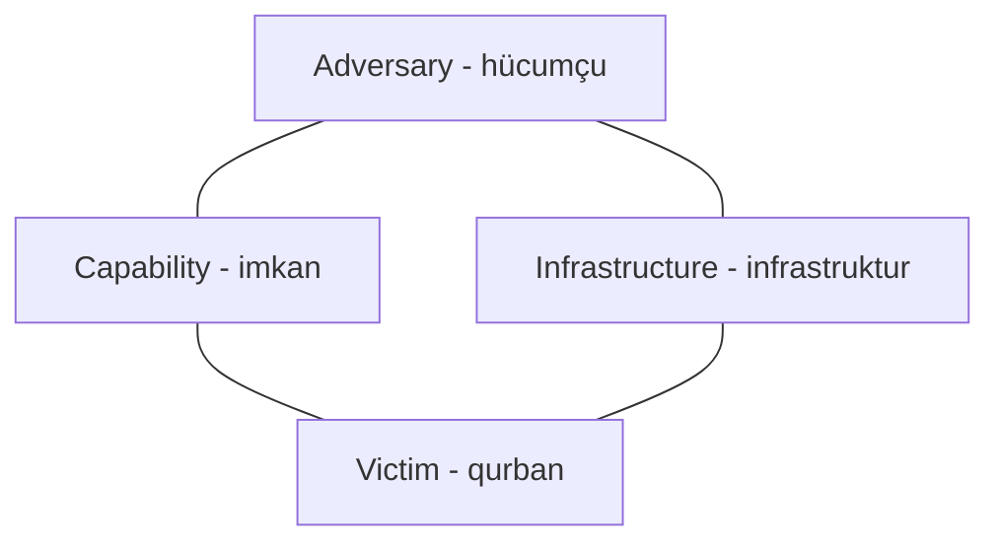

# Cyber Kill Chain, MITRE ATT&CK və Diamond Model

Bu modellər eyni hücumun fərqli tərəflərini göstərir. **Cyber Kill Chain** “hücum hansı mərhələyə çatıb?”, **MITRE ATT&CK** “hücumçu nəyi, hansı məqsədlə edib?”, **Diamond Model** isə “hansı hücumçu, imkan, infrastruktur və qurban sübutlarla əlaqələnir?” suallarına cavab verir. Onları birlikdə işlətmək olar. Heç biri real sistemdə test aparmaq üçün yazılı icazəni əvəz etmir.

## Cyber Kill Chain: hücumun irəliləyişi

Lockheed Martin modeli tipik müdaxilənin yeddi mərhələsini adlandırır. Müdafiəçi hər mərhələdə fəaliyyəti aşkarlamağa və ya dayandırmağa çalışa bilər.

| Mərhələ — English term | Mənası | Sadə nümunə | Müdafiə sualı |
|---|---|---|---|
| **1. Reconnaissance** | Hədəf haqqında məlumat toplamaq | Açıq mənbədən əməkdaş ünvanlarını toplamaq | Hansı məlumatları açıq paylaşırıq? |
| **2. Weaponization** | Zərərli yük və çatdırılma vasitəsi hazırlamaq | Zərərli əlavəli sənəd hazırlamaq | Yük göndərilməzdən əvvəl aşkarlana bilərmi? |
| **3. Delivery** | Yükü hədəfə çatdırmaq | Sənədi e-poçtla göndərmək | Poçt şlüzü və ya istifadəçi bunu görürmü? |
| **4. Exploitation** | Zəifliyi işə salmaq | Əlavə yenilənməmiş proqramdakı qüsurdan istifadə edir | Zəiflik aradan qaldırılıb və ya bloklanıbmı? |
| **5. Installation** | Sistemdə dayaq yaratmaq | Zərərli proqram kompüterə qurulur | Endpoint müdafiəsi bunu saxlayırmı? |
| **6. Command and Control (C2)** | Ələ keçirilmiş sistemlə əlaqə saxlamaq | Kompüter hücumçunun serverinə qoşulur | Xaricə bağlantı görünürmü? |
| **7. Actions on Objectives** | Hücum məqsədinə çatmaq | Məlumat oğurlamaq və ya xidməti pozmaq | Məqsəd dayandırılıb və təsir ölçülübmü? |

**İmtahan tələsi:** *Delivery* yükün hədəfə çatmasıdır; *Exploitation* zəifliyin işə salınmasıdır; *Installation* bundan sonra sistemdə dayaq yaradılmasıdır. Real hadisələr həmişə düz xətt üzrə getmir. Model ilkin girişdən sonrakı daxili hərəkətləri çox detallı göstərmir.

## MITRE ATT&CK: müşahidə edilmiş hücumçu davranışı

**ATT&CK** hücumçu davranışları haqqında yenilənən bilik bazasıdır. O, yeddi mərhələli ardıcıllıq və ya tam penetration testing metodologiyası deyil. Enterprise, Mobile və ICS bilik bazaları var. Əsas terminləri:

| English term | Sual | Nümunə |
|---|---|---|
| **Tactic** | Hücumçu *niyə* bunu edir? | **Credential Access**: giriş məlumatı əldə etmək |
| **Technique** | Məqsədə *necə* çatır? | İlkin giriş üçün **Phishing** |
| **Sub-technique** | Üsulun hansı daha konkret formasıdır? | Phishing-in müəyyən forması |
| **Procedure** | Konkret hücumçu praktikada *nə etdi*? | Hadisədə görünən konkret tələ, hesab və addımlar |

Bu üç əsas anlayış **TTPs — Tactics, Techniques and Procedures** adlanır. Tactic məqsədi, technique üsulu, procedure isə müşahidə edilmiş konkret icranı bildirir. Bir technique bir neçə tactic-ə xidmət edə bilər; ATT&CK universal xronoloji siyahı deyil. Matris və saylar yenilənir, buna görə taktika sayını deyil, anlayışların fərqini öyrənin.

**Nümunə:** analitik zərərli e-poçtdan sonra işçi kompüterində icra görür. Kill Chain bu hadisələri ardıcıllıqda yerləşdirir. ATT&CK müşahidə edilən davranışı uyğun tactic və technique-lərə bağlayır; komanda hansı aşkarlama qaydalarının işlədiyini yoxlayır. Sübut olmadan technique etiketini qəti nəticə saymayın.

## Diamond Model: əlaqələr

Diamond Model müdaxilə hadisəsini dörd bağlı hissə ilə təsvir edir:

| English term | Əsas sual | Mümkün sübut |
|---|---|---|
| **Adversary** | Fəaliyyətin arxasında kim var? | Hücumçu haqqında hipotez; kimlik naməlum qala bilər |
| **Capability** | Hansı bacarıq və vasitədən istifadə edir? | Zərərli proqram, phishing üsulu, exploit |
| **Infrastructure** | Fəaliyyət hansı sistemlər üzərindən keçir? | Domen, IP ünvanı, e-poçt hesabı, server |
| **Victim** | Kim və ya nə hədəflənir? | Təşkilat, hesab, endpoint |

**Nümunə:** şübhəli domen əməkdaşa giriş məlumatlarını oğurlayan məktub göndərir. Domen *infrastructure*, phishing üsulu *capability*, əməkdaş və təşkilat *victim* hissəsidir. *Adversary* hələ naməlum ola bilər. Təkrar hadisələrdə eyni infrastruktur və ya imkanın görünüb-görünmədiyini araşdırmaq olar. Tək bir ortaq domen və ya alətlə konkret qrupu günahlandırmayın.

## Eyni hadisədə üç model

Əməkdaş phishing məktubu alır, əlavəni açır və kompüteri xarici serverə qoşulur.

- **Kill Chain:** delivery → exploitation/installation → command and control. Hücumun harada kəsilə biləcəyini göstərir.
- **ATT&CK:** e-poçt, icra, persistence və C2 davranışlarını uyğun tactic və technique-lərə bağlayır. Nəyi aşkarlamaq və ya sınaqdan keçirmək lazım olduğunu göstərir.
- **Diamond Model:** ehtimal olunan hücumçunu, zərərli əlavə imkanını, göndərmə/C2 infrastrukturunu və qurbanı əlaqələndirir. Araşdırma və hadisələri tutuşdurmaq üçün faydalıdır.

**CEH ethical hacking framework** başqa modeldir. Onun beş fazası — reconnaissance, vulnerability scanning, gaining access, maintaining access və clearing tracks — CEH-də öyrədilən geniş hücumçu iş axınını göstərir. İcazəli tester Rules of Engagement-ə əməl edir, sübut saxlayır və nəticələri bildirir. *Clearing tracks* hücumçu davranışını anlamaq üçündür; testin izini sahibindən gizlətmək icazəsi vermir.

## Exam Focus / Yadda saxla

1. **Kill Chain = hücumun yeddi mərhələsi.** Delivery, exploitation və installation fərqini bilin.
2. **ATT&CK = davranış bilik bazası.** Tactic = niyə; technique = necə; procedure = müşahidə edilən konkret icra.
3. **Diamond Model = adversary + capability + infrastructure + victim.** Hadisədəki sübutları əlaqələndirir.
4. **CEH framework = beş geniş hacking fazası.** Bunları Kill Chain-in yeddi mərhələsi ilə qarışdırmayın.
5. Bu modellər təhlil və müdafiəyə kömək edir; real hədəfdə test icazəsi yaratmır.

## Qısa test

1. Zərərli sənəd hədəfə göndərilib. Bu, Kill Chain-in hansı mərhələsidir?
2. ATT&CK-də “Credential Access” *niyə*, yoxsa *necə* sualına cavab verir?
3. Diamond Model-də C2 domeni hansı hissəyə daxildir?
4. Tək bir ortaq alət hücumçunun kimliyini sübut edirmi?

**Cavablar:** 1. Delivery. 2. Niyə (tactic). 3. Infrastructure. 4. Xeyr.

## Mənbələr və əlavə oxu

- EC-Council, *Certified Ethical Hacker v13, Module 01: Introduction to Ethical Hacking*, “Hacking Methodologies and Frameworks”, modulun 45–65-ci səhifələri. Bu məqalə mənbəni öz sözlərimizlə izah edir və ayrıca nümunələr gətirir.
- [Lockheed Martin, Cyber Kill Chain](https://www.lockheedmartin.com/en-us/capabilities/cyber/cyber-kill-chain.html).
- [MITRE, Get Started with ATT&CK](https://attack.mitre.org/resources/).
- Caltagirone, Pendergast və Betz, [*The Diamond Model of Intrusion Analysis*](https://threatconnect.com/wp-content/uploads/The_Diamond_Model_of_Intrusion_Analysis.pdf).
