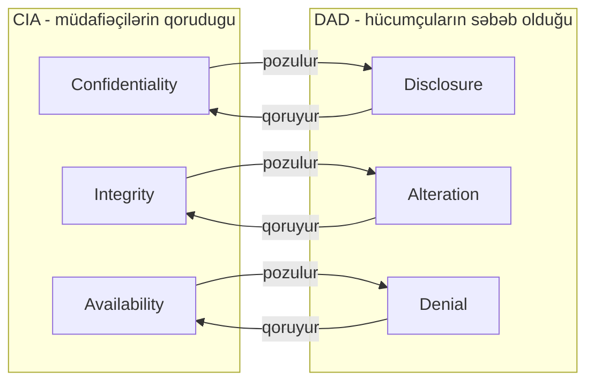
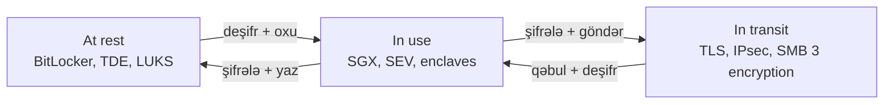

# CIA Triadası

**CIA triadası** — təhlükəsizlik mühəndisinin hadisənin *nəyi* pozduğunu, nəzarətin *niyə* mövcud olduğunu və tapıntının *nə qədər* vacib olduğunu izah etmək lazım gələndə müraciət etdiyi əsas modeldir. Kimsə "bu təhlükəsizlik hadisəsidir, yoxsa sadəcə kəsilmədir?" soruşduğu ilk dəfə, risk registri yazdığınız ilk dəfə, auditor xərc maddəsini əsaslandırmağı istədiyi ilk dəfə bu modelə müraciət edəcəksiniz. Bu, bir dəfə əzbərləyib unutduğunuz dərslik tərifi deyil — bu, hər həftə qarışıq reallığı ("satış CSV-si Gmail qaralamasında sona çatdı") təmiz biletə ("məxfilik pozuntusu, data təsnifatı nəzarəti uğursuz oldu, DLP qaydası + təlim ilə düzəldin") çevirmək üçün istifadə etdiyiniz lüğətdir.

CIA hər bir aktiva hər an verilən üç sualdır. Yalnız doğru insanlar bunu görə bilirmi? Bu, hələ də əvvəlki kimidirmi? Ondan istifadə etməli olan insanlar həqiqətən də ona çata bilirmi? Təhlükəsizlikdə olan hər şey — firewall-lar, backup-lar, RBAC, TLS, EDR, DLP — bütün üçünün cavabını *hə* saxlamaq üçün mövcuddur.

## Üç sütun

| Sütun | Sadə dildə izah | **Pozulma** misalı | **Nəzarət** misalı |
|---|---|---|---|
| **Məxfilik (Confidentiality)** | Yalnız icazə verilən subyektlər məlumatı oxuya bilər. | Əmək haqqı məlumatı olan şifrələnməmiş noutbuk taksidə qalır və tapan şəxs onu işə salır. | Tam disk şifrələməsi (BitLocker, LUKS), fayl paylaşımlarında RBAC, ötürmə zamanı TLS. |
| **Bütövlük (Integrity)** | Data və sistemlər dəqiq olduqları kimidir — icazəsiz dəyişiklik yoxdur. | Hücumçu debitor borcları jurnalını redaktə edərək $40 000 dəyərində fakturanı silir. | Fayl bütövlüyü monitorinqi, rəqəmsal imzalar, verilənlər bazası məhdudiyyətləri, hash-ləmə, kod imzalama. |
| **Əlçatanlıq (Availability)** | Qanuni istifadəçilər lazım gələndə sistemə və dataya çata bilirlər. | Ransomware hücumu fayl serverini şifrələyir və heyət üç gün ərzində heç bir Word sənədini aça bilmir. | Test edilmiş bərpa ilə backup, RAID, klasterləmə, DDoS qarşısının alınması, UPS + generator. |

Dərhal vurğulanmalı iki şey var.

1. **Pozuntu üçün hücumçu tələb olunmur.** Məxfilik səhv konfiqurasiya edilmiş S3 bucket-dən də itə bilər. Bütövlük bit-lərini çevirən pis bir USB kabeldən də itə bilər. Əlçatanlıq elektrik kəsintisindən də itə bilər. CIA motivi deyil, *nəticəni* təsnifləyir.
2. **Üçü bir-biri ilə ziddiyyət təşkil edə bilər.** Faylı güclü şifrələmə ilə qorumaq məxfiliyi qoruyur; açarı itirmək əlçatanlığı məhv edir. Hər kəsdən hardware token vasitəsilə MFA tələb etmək məxfilik və bütövlüyü yüksəldir; tokeni evdə qoyan istifadəçi üçün əlçatanlığı aşağı salır. Təhlükəsizlik — məhz bu üç tərəfli kompromisin açıq şəkildə danışılmasıdır.

### Non-repudiation haqqında qısa qeyd

Bəzi çərçivələr triadanı dördlüyə genişləndirir: CIA + **non-repudiation** (inkar-edilməzlik). Non-repudiation — istifadəçinin sonradan fəaliyyəti yerinə yetirmədiyini inandırıcı şəkildə iddia edə bilməməsi deməkdir. Üç hissədən ibarətdir və birlikdə işləyir: güclü **autentifikasiya** (istifadəçi etibarlı şəkildə müəyyən edildi), log qeydinin **bütövlüyü** (sonradan redaktə edilmədi) və **kriptoqrafik bağlantı** (yalnız istifadəçinin nəzarət etdiyi private key ilə rəqəmsal imza). Auditor "bu köçürməni Elnurun təsdiqlədiyini necə bilirsiniz?" soruşduqda, cavab non-repudiation-dır və o, işləmək üçün hər üç CIA sütununa söykənir. Bunu PKI, rəqəmsal-imza və audit-loglama kontekstlərində ayrıca qeyd edildiyini görəcəksiniz; qalan hər şey üçün CIA kifayətdir.

## DAD triadası — hücumçunun güzgüsü

**DAD** — CIA triadasının tərsi. CIA müdafiəçilərin qorumağa çalışdıqlarını adlandırırsa, DAD hücumçuların (və ya təsadüflərin) səbəb olmağa çalışdıqlarını adlandırır.

- **Disclosure (Açılma)** — həssas məlumat icazəsi olmayan şəxsə çatır. Bu, **Məxfiliyin** pozulmasıdır.
- **Alteration (Dəyişdirmə)** — data icazəsiz dəyişdirilir (və ya təsadüfi pozulur). Bu, **Bütövlüyün** pozulmasıdır.
- **Denial (Rədd)** — qanuni istifadəçilər hüququ olduqları sistemə çata bilmirlər. Bu, **Əlçatanlığın** pozulmasıdır.

Uyğunlaşma bir-birə birdir və hadisəni bir cümlə ilə təsnif etməyin yolu budur:

CIA eyni sahəni əhatə edirsə, niyə ümumiyyətlə DAD ilə məşğul olmalıyıq? Çünki hadisə triaj zamanı həmişə **artıq səhv olan** şeydən danışırsınız və DAD bunun üçün sizə fellər verir. "Səhv konfiqurasiya edilmiş S3 bucket vasitəsilə müştəri PII-sinin açılması" başlıqlı bilet "müştəri məxfilik hadisəsi"ndən daha aydındır. DAD — tapıntıların dili; CIA — nəzarətlərin dili.

## Təhlükəsizlik nəzarəti kateqoriyaları

Hər bir nəzarət, *kim* tətbiq etdiyinə və *necə* edildiyinə əsasən, üç **kateqoriyadan** birinə düşür. Bu kateqoriyalar birbaşa NIST SP 800-53-dən gəlir və hər auditdə ortaya çıxır.

| Kateqoriya | Nədir | Kiçik bir şirkətdə misallar (`example.local`, 80 istifadəçi, 3 server) |
|---|---|---|
| **Texniki (Technical)** | Təhlükəsizliyi birbaşa rəqəmsal müstəvidə tətbiq edən hardware və ya software. *Logical* (məntiqi) nəzarət də adlanır. | `\\FS01\Finance` üzərində NTFS ACL-ləri, Windows Firewall qaydaları, noutbuklarda BitLocker, Ubuntu web serverində TLS 1.2+, AD parol siyasəti, Defender for Endpoint. |
| **Əməliyyat (Operational)** | Gündəlik işləyən insan-və-proses nəzarətləri. Adətən insan dövrədədir. | `EXAMPLE\GRP-Finance` üçün aylıq istifadəçi-giriş baxışı, hər gecə ofsayt seyfə backup çıxarışı, patch çərşənbə axşamı rejimi, rüblük bərpa testi, help-desk kimlik təsdiq skripti. |
| **Menecerial (Managerial)** | Menecment tərəfindən yazılmış və sahiblənilmiş strateji, sənədləşdirilmiş, prosedural nəzarətlər. *Administrative* (inzibati) da adlanır. | Yazılı İnformasiya Təhlükəsizliyi Siyasəti, illik risk qiymətləndirməsi, vendor qəbul yoxlama siyahısı, işə götürmədə imzalanan istifadə qaydaları, CAB-dan keçən dəyişiklik-idarəetmə prosesi. |

Yaddaşda saxlamalı qayda: əgər insansız bir maşın bunu tətbiq edirsə, bu, **texnikidir**. Əgər insan bunu cədvəl üzrə yerinə yetirirsə, bu, **əməliyyatdır**. Əgər bu, imzalanmış sənəd və təsdiq kimi mövcuddursa, bu, **menecerialdır**. Real dünyada nəzarətlərin əksəriyyəti qarışıqdır — backup eyni anda texniki bir alət, əməliyyat runbook-u və menecerial saxlama siyasətidir — və siz onu üstünlük təşkil edən xüsusiyyətinə görə təsnifləyəcəksiniz.

Bəzi çərçivələrdə və bir çox imtahan planlarında rast gələcəyiniz dördüncü kateqoriya da var:

- **Fiziki (Physical)** — kilidlər, vəsiqələr, çəpərlər, CCTV, HVAC, yanğınsöndürmə. Bəzi çərçivələr fiziki nəzarətləri əməliyyat kateqoriyasına daxil edir, bəziləri ayrıca kateqoriya kimi göstərir. Aşağıdakı nəzarət matrisi bunu ayrı saxlayır — çünki əksər praktiklər məhz bu şəkildə düşünür.

## Təhlükəsizlik nəzarəti tipləri

Əgər *kateqoriya* "bunu kim tətbiq edir?" sualını verirsə, **tip** "hadisə dövründə bu nə edir?" sualını verir. Nəzarət eyni anda birdən çox tip ola bilər — müşahidə kamerası cinayəti *deter* edir, deter edə bilmədiyi cinayəti *detect* edir və sonra *corrective* fəaliyyət üçün sübut yaradır.

| Tip | Hadisə dövründə rolu | Sadə dildə misal |
|---|---|---|
| **Preventive (Qarşısını alan)** | Hadisənin ilk növbədə baş verməsinin qarşısını alır. | Firewall daxil olan SYN sel hücumunu bloklayır. |
| **Detective (Aşkar edən)** | Hadisənin baş verdiyini və ya baş verməkdə olduğunu görür. | SIEM bir dəqiqədə 200 uğursuz girişi qeyd edir. |
| **Corrective (Düzəldən)** | Hadisədən sonra sistemi bərpa edir. | Şifrələnmiş faylların üzərinə backup bərpa edilir. |
| **Deterrent (Qorxutan)** | Hücumçunu cəhd etməkdən çəkindirir. | Görünən CCTV gümbəzi və "Giriş qadağandır" işarəsi. |
| **Compensating (Kompensasiya edən)** | Əsas nəzarətdən istifadə oluna bilmədikdə alternativ. | Tətbiq hələ TLS-i dəstəkləmədiyindən əlavə loglama ilə vaxt məhdud firewall istisnası. |
| **Directive (Təlimatverici)** | İnsanlara nə etməli olduqlarını deyir. | İstifadə qaydaları, server otağının qapısında "Yanınca keçmək qadağandır" işarəsi. |

### Nəzarət matrisi

Müsahibələrdə, imtahanlarda və audit müsahibələrində doldurmağınız istəniləcək matris. Sətirlər nəzarət *kateqoriyasıdır* (inzibati, texniki, fiziki), sütunlar nəzarət *tipidir*. Misallar `example.local`-dandır.

| | Preventive | Detective | Corrective | Deterrent | Compensating | Directive |
|---|---|---|---|---|---|---|
| **İnzibati (Menecerial / Əməliyyat)** | İşə götürmə fon yoxlamaları, AD hesabı aktivləşdirilmədən əvvəl məcburi təhlükəsizlik təlimi, maliyyədə vəzifələrin ayrılması | `EXAMPLE\GRP-Admins` üçün aylıq giriş baxışı, daxili audit, faktura ilə alış sifarişinin uzlaşdırılması | Hadisəyə cavab planı, dərslərdən-öyrənilən iclası, intizam prosesi, BCP aktivləşdirilməsi | Logların izləndiyi barədə yazılı xəbərdarlıq, AUP-da sanksiyalar | PAM alətinin tədarükü zamanı `EXAMPLE\Domain Admins` parolu üçün iki-adam qaydası | İnformasiya təhlükəsizliyi siyasəti, istifadə qaydaları, data-təsnifat standartı |
| **Texniki (Logical)** | AD parol siyasəti, NTFS icazələri, Windows Firewall, BitLocker, TLS, MFA, EDR bloklama | SIEM korrelasiyası, Defender xəbərdarlıqları, IDS imzaları, fayl bütövlüyü monitorinqi | Avtomatik zərərli proqram karantini, Veeam bərpası, WSUS vasitəsilə patch yerləşdirilməsi, hesab yenidən aktivləşdirmə iş axını | RDP girişində xəbərdarlıq banneri ("yalnız icazəli istifadə, fəaliyyət izlənilir") | Şəbəkə seqmentasiyası hazır olmadığı üçün Ubuntu web serverində host-əsaslı firewall və jump-host kombinasiyası | Ekran kilidi vaxtını, giriş banneri mətnini məcbur edən Qrup Siyasəti, USB-blok GPO |
| **Fiziki** | Server otağının qapı kilidləri, data-mərkəz qəfəsində biometrik giriş, reception-da mantrap | Hərəkət aşkarlaması ilə CCTV, qapı-açıq siqnalları, gecə növbəsində mühafizəçi | Sınıq kilidlərin dəyişdirilməsi, itirilmiş giriş kartlarının yenidən verilməsi, yanğınsöndürmə boşalması + bərpa | Çəpərlər, işıqlandırma, görünən kameralar, mühafizə itləri, tikanlı məftil | Giriş-nəzarət sistemi dəyişdirilərkən müvəqqəti silahlı mühafizəçi | İşarələr ("vəsiqə həmişə görünməlidir"), təxliyə xəritələri, "yanınca keçmək olmaz" posterləri |

Hər bir hücrəni əzbərləmək lazım deyil. İstənilən tək nəzarətə baxıb — məsələn, RDP girişindəki xəbərdarlıq bannerinə — həm *kateqoriyasını* (texniki, çünki bunu GPO tətbiq edir) həm də *tipini* (deterrent və directive, çünki istifadəçini xəbərdar edir) adlandıra bilmək lazımdır. Məhz bu səriştə test olunur.

## Data vəziyyətləri və qorunması

Data həmişə üç vəziyyətdən birində olur və hər vəziyyətin öz qoruma texnologiyası var. Əgər müəyyən bir aktiv üçün üçünün də haqqında düşünməmisinizsə, boşluğunuz var.

| Vəziyyət | Mənası | Qoruma texnologiyası | Konkret misal |
|---|---|---|---|
| **At rest (Sakit)** | Diskdə, lentdə, backup-da və ya obyekt saxlama yerində — hərəkət etmir, emal olunmur. | Tam disk şifrələməsi, həcm şifrələməsi, fayl səviyyəli şifrələmə, verilənlər bazası TDE, şifrələnmiş backup-lar, güclü ACL-lər. | Hər noutbukda BitLocker; SQL Server instansında TDE; Ubuntu web serverində LUKS; SSE-KMS ilə şifrələnmiş S3 bucket. |
| **In transit (Ötürmədə)** | Şəbəkə üzərində hərəkətdə — LAN, WAN, internet, daxili xidmət meshi. | TLS 1.2+, IPsec VPN, SSH, SMB şifrələməsi, simsiz üçün WPA3. | Outlook Exchange ilə TLS danışır; `https://portal.example.local` daxili CA tərəfindən imzalanmış sertifikatdan istifadə edir; klientlər və `\\FS01` arasında SMB 3.1.1 şifrələməsi. |
| **In use (İstifadədə)** | Yaddaşa yüklənmiş, oxunan, redaktə edilən, hesablanan. Bu qorunması ən çətin vəziyyətdir, çünki CPU işi görmək üçün plaintext-i görməlidir. | Etibarlı icra mühitləri (Intel SGX, AMD SEV), secure enclaves (Apple T2, Android StrongBox), yaddaş qorunması, proses izolyasiyası, vaxtında-şifrəaçma, homomorf şifrələmə (hələ də production-da nadir). | SGX daxilində kart-təsdiq kernelini işə salan ödəniş prosessoru; plaintext-i dəqiq bir tranzaksiya üçün canlı saxlayan tətbiq kodunda sahə-səviyyəli deşifrələmə. |

Tipik səhv — "biz datamızı şifrələyirik" ifadəsinin kifayət olduğunu düşünməkdir. Sakit vəziyyətdə şifrələmə, əməliyyat sistemi işləyərkən və həcm bağlanmış halda heç nə etmir — canlı sessiyaya sahib olan oğru plaintext görür. Ötürmədə şifrələmə endpoint-də doğrulanmış zərərli insayderə qarşı heç nə etmir. Hər vəziyyətin öz nəzarətinə ehtiyacı var.

### Data üç vəziyyət arasında necə hərəkət edir

Real iş axını bir neçə saniyədə hər üç vəziyyətə toxunur. İstifadəçi `\\FS01\Finance`-dan cədvəli açır (server-in şifrələnmiş həcmində sakit), fayl şifrələmə ilə SMB üzərindən keçir (ötürmədə), Excel onu deşifr edir və noutbukun yaddaşına yükləyir (istifadədə), sonra yenidən yazılır — bütün dövrü tərs istiqamətdə keçir. Hər ox nəzarətin uğursuz ola biləcəyi yerdir.

### Bilməli olan kriptoqrafik blok daşları

- **Simmetrik şifrələmə** (AES-256, ChaCha20) — bir gizli açar, sürətli, kütləvi data üçün istifadə olunur: tam disk, backup-lar, TLS session trafiki handshake-dən sonra.
- **Asimmetrik şifrələmə** (RSA, ECC) — public/private açar cütü, yavaş, açar mübadiləsi, rəqəmsal imzalar və sertifikatlar üçün istifadə olunur.
- **Hash-ləmə** (SHA-256, SHA-3) — bir istiqamətli barmaq izi, *açarsız*, bütövlük yoxlamaları və parol saxlama üçün istifadə olunur (həmişə salt və bcrypt / Argon2 / PBKDF2 kimi yavaş KDF ilə).
- **MAC-lar və AEAD** (HMAC-SHA-256, AES-GCM) — doğrulanmış şifrələmə və ya müstəqil doğrulama teqləri; məxfiliyin üstündə sizə bütövlük verən məhz bunlardır.
- **Açar idarəetməsi** — TPM (cihazda), HSM (data mərkəzində), KMS (cloud-da). Ən zəif halqa demək olar ki, həmişə alqoritm deyil, açar saxlanması olur.

## Data Loss Prevention (DLP)

**DLP** — həssas datanın getmməli olmadığı yerlərdən getməsinin qarşısını alan alətlər və qaydalar toplusudur. İki istiqamətdə işləyir:

- **Discovery (Kəşf)** — saxlama yerlərini (fayl serverləri, poçt qutuları, SharePoint, endpoint-lər) həssas nümunələrə uyğun məzmun üçün skan edir: kredit kartı nömrələri, milli kimlik, "Confidential" etiketləri, mənbə kodu açar sözləri və s.
- **Enforcement (Tətbiq)** — hərəkətdə olan dataya (email, web yükləmə, USB köçürmə, cloud sinxron) baxır və qayda uyğun gəldikdə fəaliyyət tətbiq edir.

### Endpoint DLP və Network DLP

| | Endpoint DLP | Network DLP |
|---|---|---|
| Harada işləyir | Hər noutbuk / masaüstü / serverdə agent | Şəbəkə kənarında inline cihaz və ya proxy |
| Görür | İstifadəçinin yerli olaraq etdiyi hər şeyi — USB, clipboard, screenshot, print, klient-tərəfli hook vasitəsilə TLS üzərindən SaaS tətbiqləri | Inline olduğu şəbəkə perimetrini keçən hər şeyi |
| Kor nöqtələri | Agent-i silən istifadəçi, siyasət sinxrondan keçmiş oflayn cihazlar | Deşifrə edə bilmədiyi TLS-şifrələnmiş trafik, evdə Wi-Fi-də mobil işçilər, peer-to-peer |
| Tipik məhsul | Microsoft Purview Endpoint DLP, Symantec DLP Agent, CrowdStrike, Zscaler Client Connector | Forcepoint, Palo Alto NG DLP, Zscaler ZIA, Cisco Secure Email |

Yetkin proqramların əksəriyyəti hər ikisini işlədir — endpoint DLP USB və clipboard-la məşğul olur, network DLP email və web kanalını tutur.

### DLP fəaliyyətləri

Qayda uyğun gəldikdə, sistem dörd fəaliyyətdən birini (və ya kombinasiyasını) yerinə yetirə bilər:

| Fəaliyyət | Nə baş verir | Nə zaman istifadə edilir |
|---|---|---|
| **Log (Qeyd)** | Hadisə DLP konsoluna yazılır, istifadəçi narahat edilmir. | Tənzimləmə mərhələsi, aşağı ciddiyyətli nümunələr, yalnız telemetriya. |
| **Alert (Xəbərdarlıq)** | İstifadəçi popup görür ("bu email kredit kartı nömrələri ehtiva edir, əminsiniz?"), təhlükəsizlik komandası bilet alır. | İstifadəçini dürtmək, təsadüfləri üzə çıxarmaq, məlumatlılıq təliminə qidalandırmaq. |
| **Block (Blokla)** | Fəaliyyət rədd edilir. Email getmir, fayl köçürülmür. | Yanlış pozitivlərin ucuz başa gəldiyi yüksək ciddiyyətli nümunələr. |
| **Quarantine (Karantin)** | Fayl tutma sahəsinə köçürülür, göndərən xəbərdar edilir, nəzarətçi buraxır və ya atır. | Tənzimlənən data (PCI, PHI), böyük təsadüfi açıqlamalar. |

### Konkret misal

`example.local`-da istifadəçi yeni müştəri import CSV-si yazır və onu xaricə gedən emailə əlavə edir. Faylda 16 rəqəmli nömrələr olan 5000 sətir var.

1. İstifadəçi **Send** düyməsini basanda endpoint DLP agenti əlavəni skan edir.
2. Daxili "PAN (Primary Account Number) nümunəsi" qaydası uyğun gəlir, Luhn checksum testi ilə təsdiqlənir.
3. Qaydanın həddi "≥10 uyğunluq = yüksək ciddiyyət".
4. Fəaliyyət — **Block + Quarantine**.
5. İstifadəçi görür: *"Bu email kredit kartı nömrələri ehtiva etdiyi üçün bloklandı. Göndərmək lazımdırsa, təhlükəsizlik komandası ilə əlaqə saxlayın."*
6. Təhlükəsizlik komandası message-ID, göndərən, alıcı, uyğunluq sayı və əlavənin hash-i ilə bilet alır. Qərar verirlər: qanuni tərəfdaşa buraxın və ya telefonu götürün, çünki heç kim 5000 PAN-ı heç kimə email etməməlidir.

DLP hər şeyi tutmayacaq — qətiyyətli insayder ekrana şəkil çəkəcək və ya şəxsi noutbukuna datanı yenidən yazacaq — və bu, normaldır. DLP çoxsaylı qatlar arasında yalnız biridir. İşi *təsadüfləri* və *tənbəl* eksfiltrasiyanı dayandırmaq və qəsdən olanların səy xərcini insayderin digər nəzarətlərdə görünəcək qədər artırmaqdır (qeyri-adi giriş nümunələri, screenshot xəbərdarlıqları, fiziki monitorinq).

## Data minimizasiyası və obfuskasiyası

Bütün data əbədi mövcud olmamalıdır. Bütün data olduğu yerdə *oxunaqlı* olmamalıdır. **Data minimizasiyası** həssas datanın həcmini və ömrünü azaldır; **data obfuskasiyası** qalanın həssaslığını azaldır.

### Minimizasiya

- **Daha az toplayın.** Hesab açma formunun doğum tarixinə ehtiyacı yoxdursa, soruşmayın. Ən təhlükəsiz bayt — heç vaxt saxlamadığınız baytdır.
- **Daha az saxlayın.** Hər dataset orijinal biznes məqsədinə bağlı saxlama müddəti alır. Yalnız 90 gün faydalı olan loglar 91-ci gün silinir.
- **Düzgün məhv edin.** Fayl sistemindən *silmək* məhv etmək deyil — bitlər hələ də diskdədir. Binanı tərk edən mediya üçün kriptoqrafik silinmə (həcmi şifrələyən açarı məhv etmək), üzərinə yazmaq (DBAN, `shred`) və ya fiziki məhv (doğrayıcı, degausser) istifadə edin.

### Obfuskasiya texnikaları

| Texnika | Necə işləyir | Geri qaytarıla bilər? | Tipik istifadə |
|---|---|---|---|
| **De-identifikasiya** | Birbaşa identifikatorları (ad, SSN, email) silir. | Dizaynla xeyr, lakin yenidən-identifikasiya hücumları mövcuddur. | Tibbi kohortlarda analitika. |
| **Tokenizasiya** | Həssas dəyərləri mənasız token ilə əvəz edir; ayrıca seyf token → dəyər uyğunluğunu saxlayır. | Bəli, yalnız seyf sahibləri üçün. | PCI DSS — tətbiq tokeni saxlayır, yalnız ödəniş prosessoru detokenləşdirə bilər. |
| **Data masking** | Dəyəri eyni formada fiktiv biri ilə əvəz edir (`4532-7812-****-1234`). | Adətən xeyr. | Qeyri-production mühitləri, yalnız qismən data göstərən müştəri-xidməti ekranları. |
| **Hash-ləmə** | Bir istiqamətli funksiya; eyni giriş → eyni sabit çıxış, fərqli giriş → fərqli çıxış. | Xeyr — geri qaytarıla bilməz (yalnız təxmin ilə brute-force edilə bilər). | Parol saxlama (həmişə salt ilə), data bütövlüyü yoxlamaları, dedup açarları. |
| **Anonimləşdirmə** | Statistik transformasiya (k-anonimlik, differential privacy) — heç bir sətir bir şəxsə uyğun gəlmir. | Xeyr. | İctimai tədqiqat datasetləri, dərc edilmiş aqreqat statistika. |

**Masking** (kosmetik — plaintext hələ də bir yerdə mövcuddur) ilə **tokenizasiya**nı (struktural — plaintext sistemdə ümumiyyətlə mövcud deyil) qarışdırmayın. Auditorlar bunu ayırır. Siz də ayırmalısınız.

## Praktik: ssenarini təsnifləyin

Aşağıdakı hər ssenari üçün iki suala cavab verin:

1. **Hansı CIA sütunu pozuldu?** (Məxfilik / Bütövlük / Əlçatanlıq — birdən çox tətbiq oluna bilər.)
2. **Hansı nəzarət kateqoriyası bunun qarşısını almalı və ya düzəltməlidir?** (Texniki / Əməliyyat / Menecerial / Fiziki)

### Ssenarilər

1. `example.local`-da işçi əmək haqqı cədvəlini şəxsi Gmail-inə emaillə göndərir ki, həftə sonunda işləsin. Zərərli niyyət yoxdur.
2. UPS batareyası üç ildir test edilmədiyi üçün elektrik kəsintisi kiçik server rəfini söndürür. Fayl serveri altı saat çalışmır.
3. Hücumçu Ubuntu web serverində SQL injection-dan istifadə edir və üç məhsul qiymətini $99-dan $0.01-ə dəyişdirir. İki saat ərzində heç kim görmür.
4. Junior admin PowerShell skriptini səhv OU-da işə salır və AD-də 40 istifadəçi hesabını silir.
5. İşdən ayrılan developer mənbə kodu ilə dolu USB disk ilə çıxır. USB portu kilidlənməmişdi, noutbuk izlənmirdi.

### Cavab açarı

1. **Məxfilik.** Data icazəsi olmayan yerə çatdı (şəxsi, qeyri-korporativ hesab). Doğru nəzarət kateqoriyaları: **Menecerial** (bunu qadağan edən istifadə qaydaları) və **Texniki** (həssas məzmunlu şəxsi web poçt yükləmələrini bloklayan DLP qaydası). **Əməliyyat** məlumatlılıq proqramı hər ikisini gücləndirir.
2. **Əlçatanlıq.** Xidmət çatıla bilmir. Kateqoriyalar: **Əməliyyat** (rüblük UPS testi batareyanı tutacaqdı) və **Fiziki** (lazımi ətraf mühit nəzarətləri). **Menecerial** BCP test tezliyini ilk növbədə təyin edəcəkdi.
3. **Bütövlük** (data dəyişdirildi) və ehtimal ki **Məxfilik** (SQLi yazmadan əvvəl datanı da oxuyub). Kateqoriyalar: **Texniki** (giriş doğrulama, WAF, hazır ifadələr) və **Əməliyyat** (UPDATE-i dəqiqələr ərzində görəcək log baxışı).
4. **Bütövlük** və **Əlçatanlıq** (silinmiş hesablar daxil ola bilmirdi). Kateqoriya: **Əməliyyat** (dəyişiklik-idarəetmə təsdiqi, dağıdıcı skriptlər üçün dörd-göz qaydası) plus **Texniki** (AD Recycle Bin, test edilmiş bərpa).
5. **Məxfilik.** Kateqoriyalar: **Texniki** (USB-blok GPO, endpoint DLP), **Menecerial** (dərhal ləğv və çıxış müsahibəsi olan ayrılma yoxlama siyahısı), **Fiziki** (son gündə vəsiqə deaktivasiyası). Tək nəzarət bunu dayandırmır; qat-qat kombinasiya dayandırır.

## İşlənmiş misal: kiçik şirkət üçün risk baxışı

`example.local` — 80 nəfərlik peşəkar-xidmətlər firması. Onların infrastrukturu:

- **DC01** — Windows Server domain controller, DNS, DHCP, fayl paylaşımları. Hyper-V-də hostinq edilir.
- **FS01** — eyni Hyper-V host-unda fayl serveri, `\\FS01\Projects` və `\\FS01\Finance` paylaşımları.
- **WEB01** — internetə baxan Ubuntu server, şirkət saytını və klient portalını hostinq edir (`https://portal.example.local`).
- Səksən domenə qoşulmuş Windows noutbuk. MFA yalnız VPN üçün qurulub.

CIA triadasını mühitdə gəzdirmək üçün oturursunuz. **Bir real C, bir real I, bir real A riski** istəyirsiniz — hər birinə xüsusi nəzarətlər uyğunlaşdırılmış.

### Məxfilik riski — maliyyə paylaşımı

`\\FS01\Finance` hal-hazırda `EXAMPLE\Domain Users`-a oxuma icazəsi verir. İki il əvvəl rahatlıq üçün qısayol yaradıldığından, hər işçi əmək haqqı cədvəllərinin olduğu qovluğa baxa bilər.

Düzəldən nəzarətlər, prioritet sırası ilə:

1. **Texniki** — ACL-i yalnız `EXAMPLE\GRP-Finance` allow-list ilə əvəz edin (preventive).
2. **Əməliyyat** — CFO tərəfindən `EXAMPLE\GRP-Finance` üzvlüyünün aylıq giriş-baxışı (detective + inzibati).
3. **Menecerial** — əmək haqqını *Restricted* elan edən və sahibini adlandıran data-təsnifat standartını yazın (directive).
4. **Texniki** — `\\FS01\Finance`-dan şəxsi cloud storage-ə hər hansı fayl yükləməsini bloklayan qayda ilə Microsoft Purview endpoint DLP-ni işə salın (preventive + compensating, icazələri düzgün yenidən qurana qədər).

### Bütövlük riski — ictimai sayt

`WEB01` məlum deserializasiya xətası olan köhnə plugin ilə WordPress-i işə salır. Hücumçu məzmunu və müştəri datasını dəyişdirə bilər.

Nəzarətlər:

1. **Texniki** — plugini bu gün patch edin (corrective), təhlükəsizlik yeniləmələri üçün `unattended-upgrades` işə salın (preventive).
2. **Texniki** — sözügedən CVE üçün virtual-patching ilə WAF yerləşdirin (patching zamanı compensating, uzunmüddətli preventive).
3. **Əməliyyat** — `/var/www` üzərində hər gecə fayl-bütövlüyü monitorinqi, etibarlı baza ilə hash-lərin müqayisəsi; istənilən dəyişiklik biletdir (detective).
4. **Menecerial** — IT ops siyasətinə patch SLA əlavə edin: internetə baxan host-larda kritik CVE-lər 72 saat ərzində patch edilməlidir (directive).

### Əlçatanlıq riski — tək Hyper-V host

Həm DC01 həm də FS01 eyni Hyper-V host-da işləyir. Host ölərsə, bütün şirkət heç nəyə daxil olmur.

Nəzarətlər:

1. **Texniki** — ikinci Hyper-V host əlavə edin, failover klaster yaradın, DC01/FS01-i klaster storage-ə köçürün (preventive).
2. **Texniki** — yeni host-da ikinci domain controller DC02 işə salın ki, klaster olmadan da AD sağ qalsın (preventive).
3. **Əməliyyat** — ofsayt NAS-a gündəlik VM-səviyyəli Veeam backup-ları; aylıq bərpa testi (corrective + detective).
4. **Fiziki** — virtual klasterin təmiz söndürməsi üçün 15 dəqiqə tam yükə sizilmiş UPS qurun (preventive).
5. **Menecerial** — RTO (4 saat) və RPO (24 saat) sənədləşdirin — belə ki, ya qarşılaya biləcəyiniz ya da qarşılaya bilmədiyinizi elan edəcəyiniz ifadə edilmiş hədəf olsun (directive).

Diqqət edin ki, hər real düzəliş — tək qəhrəman alış deyil, kateqoriyalar arasında nəzarətlər yığınıdır. Təhlükəsizlik məhz belə işləyir.

### Risk registrində qeyd etmək

Nəzarətlər uyğunlaşdırıldıqdan sonra hər risk, idarə heyəti nəyin müalicə olunduğunu və nəyin qəbul olunduğunu görə bilməsi üçün risk registrində bir sətir alır:

| Risk | CIA sütunu | Ehtimal | Təsir | Daxili risk | Müalicə | Sahib | Qalıq risk | Baxış tarixi |
|---|---|---|---|---|---|---|---|---|
| `\\FS01\Finance`-ə həddindən artıq giriş | Məxfilik | Yüksək | Yüksək | Yüksək | Azalt (yuxarıda 4 nəzarət) | CFO + IT rəhbəri | Aşağı | 2026-07-23 |
| WEB01-də patch edilməmiş WordPress plugini | Bütövlük | Orta | Yüksək | Yüksək | Azalt (yuxarıda 4 nəzarət) | IT rəhbəri | Aşağı | 2026-07-23 |
| DC01 + FS01-i hostinq edən tək Hyper-V host | Əlçatanlıq | Orta | Kritik | Yüksək | Azalt (yuxarıda 5 nəzarət) | IT rəhbəri | Orta | 2026-07-23 |

Registrin məqsədi format deyil — nəzarətlərdən əvvəl və sonra *ehtimal* və *təsir* üçün rəqəm yazma aktıdır. Bu söhbət dürüstlüyü məcbur edir: əgər "yüksək" qalıq riskiniz daxili risklə eyni rəqəmdirsə, nəzarətləriniz əslində heç nəyə nəzarət etmir.

## Ümumi qarışıqlıqların həlli

### "Bütövlük şifrələmə deməkdir, elə deyilmi?"

Xeyr. **Bütövlük** icazəsiz *dəyişiklik* haqqındadır. Şifrələmə əsasən **məxfilik** nəzarətidir. İkisi qarışdırılır, çünki bir çox şifrələmə sxemləri sizə bütövlük də verən doğrulama etiketi daxil edir (AES-GCM, ChaCha20-Poly1305) — lakin sizə bütövlük verən mexanizm MAC/imzadır, şifrələmə özü deyil. Hash-ləmə, rəqəmsal imzalar və fayl-bütövlüyü monitorinqi bütövlük nəzarətləridir. AEAD rejimindən istifadə etdiyiniz təqdirdə şifrələmə əlavə üstünlükdür.

### "DLP giriş nəzarətini əvəz edir"

Xeyr. DLP datanın hərəkətini izləyir. Əgər istifadəçi faylı ilk növbədə açmalı olmayıbsa, DLP artıq gecdir — bu, **NTFS icazələri / RBAC / ABAC**-ın işi idi. Əvvəl giriş nəzarəti qurun, sonra DLP.

### "Bizdə backup var, yəni əlçatanlıqla bağlı qorunuruq"

Backup-lar *bərpa* üçün sizi qoruyur. Davam edən DDoS, ölü UPS, fiber kəsilməsi və ya cloud provayder kəsilməsi üçün heç nə etmirlər. Əlçatanlıq bir yığındır: artıqlıq, DDoS qorunması, tutum, monitorinq, failover *və* backup. Hər hansı qatı buraxmaq boşluq qoyur.

### "Məxfilik yalnız PII-yə aiddir"

Xeyr. Məxfilik təşkilatın qorumağı seçdiyi istənilən informasiyaya aiddir — ticarət sirləri, mənbə kodu, birləşmə planları, qiymət modelləri, daxili biletlər. PII — çox tənzimlənən bir altbölmədir, lakin qiymətlərinizi rəqibə itirmək eyni dərəcədə məxfilik hadisəsidir.

### "Deterrent nəzarət preventive ilə eynidir"

Xeyr. **Deterrent** cəhdi pəs etdirir — "CCTV istifadədədir" işarəsi, xəbərdarlıq banneri, çəpər arxasında görünən mühafizə iti. **Preventive** nəzarət cəhd yenə də baş verərsə, onu aktiv şəkildə dayandırır. İşarə — deterrent; kilidli qapı — preventive. Adətən hər ikisini istəyirsiniz.

### "Hash-ləmə və şifrələmə bir-birini əvəz edir"

Xeyr. **Şifrələmə** dizaynla geri qaytarılandır — plaintext-i geri lazımdır, ona görə də deşifr edə bilməlisiniz. **Hash-ləmə** qəsdən bir istiqamətlidir — plaintext-i heç vaxt geri lazım deyil, yalnız barmaq izlərini müqayisə etməlisiniz. Parollar şifrələnmir, hash-lənir, çünki sistem heç vaxt orijinal parolu bərpa edə bilməməlidir, yalnız istifadəçinin onu düzgün yazdığını yoxlamalıdır. "Parolları şifrələyən və sizə emaillə geri göndərə bilən" sistem — parolları bərpaedilə bilən formada saxlayan sistemdir — ki, bu da dərslik səviyyəsində səhv etmək deməkdir.

### "Air-gapped sistemə CIA təhlili lazım deyil"

Hələ də lazımdır. Air-gap *şəbəkə* hücum səthini öldürür; zərərli insayder (məxfilik), USB ilə gətirilmiş pozulmuş yeniləmə (bütövlük) və ya serveri bişirən sınıq kondisioner (əlçatanlıq) üçün heç nə etmir. Üç sualın hələ də cavaba ehtiyacı var; yalnız ehtimal olunan hücumçular dəyişir.

## Sürətli istinad sözlüyü

| Termin | Bir sətirlik mənası |
|---|---|
| **CIA** | Confidentiality, Integrity, Availability — təhlükəsizliyin qorumağa çalışdığı üç xüsusiyyət. |
| **DAD** | Disclosure, Alteration, Denial — CIA-nın qarşısını aldığı üç pozuntu. |
| **AAA** | Authentication, Authorization, Accounting — CIA-nı dəstəkləyən giriş-nəzarət üçlüyü. |
| **DLP** | Data Loss Prevention — həssas datanı kəşf edir və təşkilatdan çıxmasının qarşısını alır. |
| **TDE** | Transparent Data Encryption — verilənlər bazası mühərriki data fayllarını sakit halda şifrələyir. |
| **HSM** | Hardware Security Module — açar saxlama və kripto əməliyyatları üçün tamper-davamlı cihaz. |
| **TPM** | Trusted Platform Module — açarları saxlayan və boot bütövlüyünü ölçən on-board çip. |
| **MFA** | Multi-Factor Authentication — birləşdirir: bildiyiniz / sahib olduğunuz / olduğunuz nədənsə ikisini. |

## Əsas nəticələr

- CIA hər bir aktiv haqqında üç sual verir: onu kim oxuya bilər, hələ də doğrudurmu, qanuni istifadəçilər ona çata bilirmi.
- DAD — hücumçunun güzgüsüdür — disclosure/alteration/denial CIA-nın qarşısını almağa çalışdığı dəqiq pozuntulardır.
- Nəzarətlər eyni anda iki şəkildə çeşidlənir: **kateqoriya** (texniki / əməliyyat / menecerial, plus fiziki) və **tip** (preventive / detective / corrective / deterrent / compensating / directive). Tək bir nəzarətin adətən birdən çox tipi olur.
- Data at rest, in transit və ya in use-dadır — və hər vəziyyətin öz qorunmasına ehtiyacı var. Tək sakit vəziyyətdə şifrələmə kifayət deyil.
- DLP təsadüfləri dayandırır və qəsdənlər üçün səy xərcini artırır; bu qatdır, giriş nəzarətinin əvəzi deyil.
- Data minimizasiyası — ən ucuz nəzarətdir — heç vaxt saxlamadığınız baytlar sızdırıla bilməz.
- Real risk baxışları həmişə kateqoriyalar arasında nəzarətləri yığır. Tək qəhrəman nəzarət — aşkarda gizlənən boşluqdur.

## İstinadlar

- [NIST SP 800-53 Rev. 5 — Information Systems üçün Təhlükəsizlik və Məxfilik Nəzarətləri](https://csrc.nist.gov/publications/detail/sp/800-53/rev-5/final)
- [NIST SP 800-12 Rev. 1 — İnformasiya Təhlükəsizliyinə Giriş](https://csrc.nist.gov/publications/detail/sp/800-12/rev-1/final)
- [NIST Cybersecurity Framework 2.0](https://www.nist.gov/cyberframework)
- [OWASP — Confidentiality, Integrity, and Availability](https://owasp.org/www-community/Application_Threat_Modeling)
- [OWASP Top 10](https://owasp.org/www-project-top-ten/)
- [CISA — Cybersecurity Best Practices](https://www.cisa.gov/topics/cybersecurity-best-practices)
- [CISA — Defining Insider Threats](https://www.cisa.gov/topics/physical-security/insider-threat-mitigation/defining-insider-threats)
- [Microsoft Purview Data Loss Prevention sənədləri](https://learn.microsoft.com/en-us/purview/dlp-learn-about-dlp)
