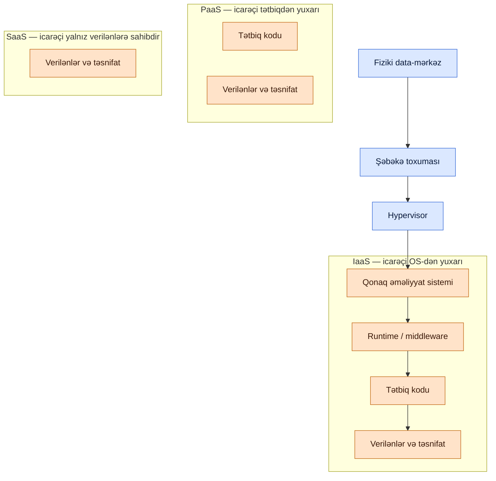

# Bulud Hesablama Təhlükəsizliyi

## Niyə bu vacibdir

Təşkilat yükü öz aparatından götürüb bulud provayderinə köçürdükdə təhlükəsizlik problemini yox etmir — onu bölür. Bəzi qatlar artıq provayderə, bəziləri isə hələ də icarəçiyə aiddir. Ən təhlükəli boşluq ortadakı hissədir: hər iki tərəf onun başqasına aid olduğunu fərz edir. Real bulud hadisələrinin çoxu mürəkkəb zero-day deyil; səhv konfiqurasiya olunmuş saxlama bucketləri, açıq repository-də təsadüfən qeyd olunmuş giriş açarları, həddən artıq geniş səlahiyyətli identitet rolları və privat olmalı verilənlər bazasının qarşısındakı açıq təhlükəsizlik qruplarıdır.

Bulud təhlükəsizliyi həm də hər şeyin sürətini dəyişdirir. Bir klik saniyələr içində virtual maşın qaldırır, CI/CD pipeline yük testi üçün əlli VM provision edir, tərtibatçı on regionda işləyən funksiya yerləşdirir. "Bir insan hər serveri əl ilə yoxlayır" prinsipinə əsaslanan nəzarətlər artıq miqyaslanmır. Aşkarlama provayderin buraxdığı loglardan, policy-as-code kimi yazılmış guardraillərdən və şəbəkə seqmenti yerinə hər resurslə birlikdə hərəkət edən identitet qaydalarından gəlməlidir.

Bu dərs konsepsiyaları xidmət modellərindən başlayıb hypervisor-a qədər gəzir. Nümunələrdə uydurma `example.local` təşkilatı və `EXAMPLE\` domeni istifadə olunur. Provayder adları (AWS, Azure, GCP) neytral şəkildə çəkilir — prinsiplər eynidir, yalnız menyu və ikonlar fərqlidir.

Hər bulud qəbul edən təşkilatın öz-özü üçün cavablandırmalı olduğu risk kateqoriyaları:

- **Verilənlərin yerləşdirilməsi və suverenliyi** — verilənlər fiziki olaraq harada oturur və hansı hüquqi rejimlər tətbiq olunur?
- **Identitet və giriş** — kim nəyi, hansı etimadnamələrlə, hansı şəbəkələrdən, hansı şərtlər altında edə bilər?
- **Konfiqurasiya** — nəzarətlər düzgün qurulubmu və o düzgün vəziyyətdən sürüşmə aşkar ediləcəkmi?
- **İcarəçi təcridi** — haqqında danışılan yük üçün provayderin hypervisor-una, çoxicarəçili xidmətlərinə və şəbəkə ayrılmasına güvənirsinizmi?
- **Əlçatanlıq və dayanıqlıq** — yük regional kəsinti, hesab blokunu və ya provayder hadisəsini dözə bilərmi?
- **Çıxış və daşınma** — verilənlərinizi və yüklərinizi haqq ödəmədən ağlabatan müddət ərzində geri ala bilərsinizmi?

Bu altı sual hər məsuliyyətli bulud-risk söhbətinin skeletini təşkil edir. Bu dərsin qalan hissəsi onlara cavab verən nəzarətlər haqqındadır.

## Əsas anlayışlar

Bulud təhlükəsizliyi təbəqəli problemdir. Ən altda provayderin idarə etdiyi fiziki data-mərkəz dayanır. Onun üzərində şəbəkə toxuması, hypervisor-lar, qonaq əməliyyat sistemləri, runtime-lar, tətbiqlər və nəhayət verilənlər yerləşir. Hər qatın sahibi xidmət modelindən asılıdır. Bu qatların harada yaşaması yerləşdirmə modelindən asılıdır. Qalanı bunun ardınca gəlir.

### Xidmət modelləri — IaaS, PaaS, SaaS və paylaşılan məsuliyyət

Üç klassik bulud xidmət modeli provayderin stek-in nə qədərini idarə etməsi ilə fərqlənir.

**Infrastructure as a Service (IaaS)** virtuallaşdırılmış hesablama, saxlama və şəbəkəni ödə-istifadə et əsasında resurs kimi təqdim edir. İcarəçi yenə də əməliyyat sistemlərini provision edir, yamaqlayır, middleware quraşdırır, təhlükəsizlik qruplarını konfiqurasiya edir və tətbiqi işlədir. Provayder yalnız fiziki data-mərkəzin, şəbəkə toxumasının və hypervisor-un sahibidir. IaaS ən çox nəzarət və ən çox məsuliyyət verir. Tipik təkliflər: virtual maşınlar, blok saxlama, xam VM-lərdə idarə olunan verilənlər bazaları və virtual privat bulud.

**Platform as a Service (PaaS)** kod və verilənləri yerləşdirmək üçün runtime təqdim edir, provayder isə runtime-ın altındakı hər şeyi — OS, yama, miqyaslama, yük balanslaşdırıcıları və çox vaxt verilənlər bazası mühərrikini idarə edir. İcarəçinin təhlükəsizlik vəzifəsi tətbiq koduna, identitetə və verilənlərin təsnifatına qədər kiçilir. PaaS server sahibi olmadan funksiya buraxmaq istəyən komandalara uyğundur.

**Software as a Service (SaaS)** web üzərindən tam tətbiq verir. İcarəçi yalnız öz istifadəçilərini, verilənlərinin təsnifatını və SaaS-ın qalan mühitlə inteqrasiyasını idarə edir. Ofis paketləri, CRM, HR və əməkdaşlıq alətləri ən çox nümunələrdir. Təhlükəsizlik işi əsasən identitet, verilənlər idarəçiliyi və paylaşım nəzarətidir — kodu və serverləri provayder idarə edir.

**Paylaşılan məsuliyyət modeli** hər icarəçinin mənimsəməli olduğu diaqramdır. Provayder *buludun təhlükəsizliyinə* cavabdehdir — fiziki obyektlər, şəbəkə toxuması, hypervisor-lar və xidmətlərin özləri. İcarəçi *buludda təhlükəsizliyə* cavabdehdir — identitet, konfiqurasiya, verilənlər və yerləşdirdiyi hər hansı kod. Hər iki tərəf öz hissəsini tutmalıdır və heç bir tərəf digərinin səhvini ört-bastır etmir.

**Paylaşılan məsuliyyət matrisi:**

| Qat | IaaS | PaaS | SaaS |
|---|---|---|---|
| Verilənlər təsnifatı və idarəçiliyi | İcarəçi | İcarəçi | İcarəçi |
| Identitet və giriş idarəçiliyi | İcarəçi | İcarəçi | İcarəçi |
| Tətbiq kodu | İcarəçi | İcarəçi | Provayder |
| Runtime / middleware | İcarəçi | Provayder | Provayder |
| Qonaq əməliyyat sistemi | İcarəçi | Provayder | Provayder |
| Virtual şəbəkə və təhlükəsizlik qrupları | İcarəçi | Paylaşılan | Provayder |
| Hypervisor | Provayder | Provayder | Provayder |
| Fiziki host | Provayder | Provayder | Provayder |
| Fiziki data-mərkəz | Provayder | Provayder | Provayder |

Ümumi qayda: provayder nə qədər çox iş görürsə, icarəçinin onun necə görülməsi üzərindəki nəzarəti də bir o qədər az olur — və icarəçinin provayderin iddialarını yoxlamaq üçün müqavilədən və uyğunluq sertifikatlarından asılılığı bir o qədər artır.

Xidmət modellərini düşünməyin faydalı yolu hesablama-saniyənin harada baş verdiyini soruşmaqdır. IaaS-də icarəçi VM-saat başına ödəyir və VM icarəçinin adlandırdığı, yamaladığı və snapshot etdiyi davamlı şeydir. PaaS-də icarəçi istək, gigabayt və ya rezerv edilmiş tutum başına ödəyir və altdakı serverin icarəçinin göstərə biləcəyi adı yoxdur. SaaS-də icarəçi yer və ya iş sahəsi başına ödəyir və hesablama tamamilə görünməzdir. Xərc modeli məsuliyyəti izləyir: sahib olduğun və idarə etdiyin şeylər üçün ödəyirsən və idarə etməyi dayandırdıqda ödəməyi dayandırırsan.

İkinci baxış bucağı partlayış radiusudur. Pozulmuş IaaS yükü VM-in şəbəkəsinin və identitetinin icazə verdiyi qədər uzağa yayıla bilər — çox vaxt gözləniləndən geniş, çünki VM identitetləri tez-tez həddən artıq əhatəli olur. Pozulmuş PaaS yükü adətən işləyən funksiya və ya konteyner şəkli ilə məhduddur, üstəgəl icra rolunun çata biləcəyi şeylər. Pozulmuş SaaS icarəçisi həmin SaaS iş sahəsi ilə əhatəlidir — lakin pozulmuş SaaS *identiteti* istifadəçinin federasiya olunduğu hər başqa xidmətə keçə bilər, buna görə SaaS hesab təhlükəsizliyi əsaslı şəkildə identitet problemidir.

### Yerləşdirmə modelləri — public, community, private, hybrid

Buludun harada yaşaması onun kimin üçün əlçatan olduğunu və necə idarə oluna biləcəyini dəyişir.

**Public bulud** kommersiya provayderi tərəfindən idarə olunan və hər ödəyən müştəriyə açıq olan çoxicarəçili mühitdir. İcarəçilər aparatla deyil, proqramla (hypervisor, identitet, şəbəkə) təcrid olunur. Public bulud ən ucuz və ən elastik seçimdir; həm də icarəçinin provayderin icarəçi-təcrid nəzarətlərinə güvənməli olduğu yerdir. Böyük kommersiya buludları — AWS, Azure, GCP, Oracle Cloud — public buluddur.

**Community bulud** ümumi missiyası və ya tənzimləyici profili olan bir neçə təşkilat tərəfindən paylaşılır. Dövlət qurumları, bir tədqiqat konsorsiumunda universitetlər və eyni tənzimləyiciyə tabe olan banklar xərci bölüşmək və icarəçilər hovuzunu kiçik və hesabat verilə bilən saxlamaq üçün community bulud paylaşa bilər. Bu həm qiymət, həm də etibar baxımından public və private arasındadır.

**Private bulud** bir təşkilata həsr olunur. O, icarəçinin öz data-mərkəzində yerləşdirilə və ya bir provayder tərəfindən tək icarəçi konfiqurasiyasında hostinq edilə bilər. Private buludlar ən güclü təcrid və ən aydın audit hekayəsi verir; həm də tutum vahidinə görə ən bahalıdır və public buludlardan daha az elastik miqyaslanır.

**Hybrid bulud** yuxarıdakıların iki və daha çoxunu birləşdirir ki, yüklər onların arasında hərəkət edə və ya uzansın. Tipik model: həssas tənzimlənən verilənlər private buludda, elastik hesablama public buludda və tələbata uyğun yükü bölüşdürən inteqrasiya skriptləri. Hybrid arxitektura vahid şəbəkə deyil — müəyyən şlüzlərlə bir-birinə bağlanmış iki və daha çox şəbəkədir, identitet, siyasət və verilənlərin təsnifatı hər iki tərəfdə ardıcıl işləməlidir.

**Yerləşdirmə modellərinin müqayisəsi:**

| Model | İcarəçilər | Tipik xərc | Təcrid | Miqyas | Uyğunluq hekayəsi |
|---|---|---|---|---|---|
| Public bulud | Çox (məhdudiyyətsiz) | Vahidə ən aşağı | Proqramla təmin olunur | Demək olar ki, qeyri-məhdud | Provayder sertifikatlarına əsaslanır |
| Community bulud | Az, ortaq maraq | Orta | Proqramla, lakin daha kiçik hovuz | Orta | Üzvlər arasında paylaşılan audit |
| Private bulud (on-prem) | Bir | Ən yüksək | Ən güclü, fiziki | Aparatla məhdud | Tam nəzarət |
| Private bulud (hostinq) | Bir | Yüksək | Güclü, müqavilə ilə dəstəklənir | Orta-yüksək | Provayder müqaviləsi üstəgəl icarəçi nəzarətləri |
| Hybrid bulud | Qarışıq | Dəyişən | Seqmentə görə | Public tərəfdə elastik | İki siyasət, bir idarəçilik qatı |

Modellər arasında seçim nadir hallarda saf olur. Əksər təşkilatlar *de facto* hybrid ilə nəticələnir — SaaS əməkdaşlıq paketi, public-bulud istehsal əmlakı, on-prem miras data-mərkəzi və yüksək tənzimlənən verilənlər üçün bir neçə private-bulud yükü. Vacib olan bölgünün qəsdli olmasıdır. Əgər arxitektura sənədi "maaş hesabı burada işləyir çünki yerləşdirmə, analitika orada işləyir çünki elastiklik, email SaaS-də işləyir çünki iqtisadiyyat" deyə bilirsə və hər yük bu cədvəldə hesablanıbsa, əmlak nəzarət altındadır. Əgər heç kimin bu cədvəldə yerləşdirə bilmədiyi "sirli" yüklər varsa, təşkilat əslində nəyə sahib olduğunu bilmir.

Multi-cloud — iki və daha çox public bulud arasında yerləşdirmə — çox vaxt hybrid ilə qarışdırılan ayrı dizayn seçimidir. Multi-cloud provayder uğursuzluğuna qarşı dayanıqlıq və danışıqlarda təzyiq alır, lakin əməliyyat yükünü artırır (iki IAM sistemi, iki şəbəkə dialekti, iki log pipeline, iki CIS benchmark dəsti). Faydanın əlavə mürəkkəbliyi açıq şəkildə aşdığı yerlərdə istifadə edin, defolt olaraq deyil.

### Bulud xidmət provayderləri, MSP və MSSP

**Bulud xidmət provayderləri (CSP)** bulud menyusunu satır: hesablama, saxlama, şəbəkə, idarə olunan xidmətlər və onları birləşdirən identitet və hesablama qatı. Ən böyüklər — AWS, Microsoft Azure, Google Cloud, Oracle Cloud — qlobal miqyasda və demək olar ki, məhdudiyyətsiz tutuma malikdirlər. Daha kiçik regional və ixtisaslaşmış provayderlər qiymət, yurisdiksiya və ya vertikal istiqamətlə rəqabət aparır. Təhlükəsizlik üçün vacib olan provayderin loqosu deyil — müqavilədə nə yazıldığı, sertifikat məktublarının nəyi əhatə etdiyi və abunə olduğunuz xidmət pilləsidir. Daxil olduğunu fərz etdiyiniz, lakin pilləyə daxil olmayan xüsusiyyət lazım olanda orada olmayacaq.

**Managed service provider (MSP)** icarəçinin IT əmlakının bir hissəsini uzaqdan idarə edən üçüncü tərəfdir — server idarəçiliyi, yedəkləmə, yama, şəbəkə əməliyyatları, help desk. Aktivlər icarəçidə qalır; MSP isə onları işlədir. MSP-lər kiçik və orta təşkilatların özləri tərkibində saxlaya bilməyəcəkləri əməliyyat örtüyünü necə əldə etdikləridir. Təhlükəsizlik mübadiləsi etibardır — MSP icarəçi sistemlərinə privileged etimadnamələrini saxlayır və normal əməliyyatlarda icarəçi verilənlərini görür.

**Managed security service provider (MSSP)** təhlükəsizlik üzrə ixtisaslaşmış versiyasıdır: SOC monitorinqi, SIEM əməliyyatları, zəiflik idarəçiliyi, insident cavabı retainerləri və bəzən təhdid kəşfiyyatı. MSSP icarəçinin öz komandasının başqa cür idarə edəcəyi təhlükəsizlik telemetriyasını idarə edir. Müqavilə əhatəni, eskalasiya meyarlarını, cavab SLA-larını və MSSP-nin hansı hərəkətləri müstəqil görə, hansılarının icarəçi təsdiqini tələb etdiyini aydın göstərməlidir.

Həm MSP, həm MSSP ilə "müqavilədə yoxdursa, görülmür" sağ qalma qaydasıdır. Defolt fərziyyələr keçərli deyil; sərhəd müqavilədir.

İki müqavilə bəndi başqa hər şeydən daha vacibdir. Birincisi, çıxış bəndi: əngəl sona çatdıqda icarəçi verilənlərini necə geri alır, hansı formatda və hansı qrafiklə? Bunu buraxan icarəçilər münasibət xoş olmayanda qəfildən daha az sərfəli olan xəbərdarlıq müddətləri və verilənlər-export haqqı olan satıcılara girov qalır. İkincisi, audit hüququ bəndi: icarəçi (və ya onun tənzimləyicisi) MSP/MSSP-nin nəzarətlərini hansı qrafiklə auditdən keçirə bilər? O hüquq olmadan icarəçi yalnız üçüncü tərəf sertifikatlarına arxalanır və ödədiyi xidməti müstəqil şəkildə yoxlaya bilmir.

### On-premises və off-premises, və kənar paradiqmalar — fog, edge, thin client

**On-premises** yükün icarəçinin birbaşa sahib olduğu və ya icarəyə götürdüyü obyektdə işləməsi deməkdir. Buluddan əvvəlki IT-nin qurulduğu baza budur. Üstünlüklər: tam nəzarət, yüksək bant genişliyi olan yerli əlaqə, proqnozlaşdırıla bilən yurisdiksiya. Mənfi tərəfləri: tutum üçün kapital xərci, miqyaslamanın yavaş olması, icarəçi stekin hər qatına və bütün əməliyyat əməyinə sahibdir.

**Off-premises** yükün başqa yerdə işləməsi deməkdir — kolokasiya obyektində hostinq, idarə olunan xidmət və ya bulud. Off-premises nəzarətin bir hissəsini əməliyyat rahatlığı və elastiklik üçün dəyişdirir.

Klassik bulud və klassik on-prem arasında hesablamanı verilənlərin yaradıldığı yerə daha yaxınlaşdıran, gecikmə və bant genişliyini idarə edən arxitekturalar dəsti var:

**Fog computing** yerli cihazlar və mərkəzi bulud arasında intellektual şlüzlər yerləşdirən paylanmış arxitekturadır. Şlüz zamana həssas işi yerli olaraq — məsələn, telemetriyanı toplamaq, anomaliyaları süzmək və ya analitika işlətmək — görür və xülasələri uzunmüddətli saxlama və dərin təhlil üçün buluda göndərir. Fog buludun əvəzi deyil, ona əlavədir; mərkəzi buluda gecikmə və ya bant genişliyi problem olanda və bəzi verilənlər yerli sayt tərk etmədən emal edilib atıla biləndə ən faydalıdır.

**Edge computing** hesablamanı verilənləri istehsal edən cihaza qədər — şəbəkənin kənarına — itələyir. Minlərlə sensorun olduğu Internet of Things (IoT) yerləşdirilməsində edge computing hər oxunuşu buluda göndərmək yerinə nəticə çıxarışını və nəzarət döngələrini yaxınlıqdakı kiçik cihazlarda işlədir. Edge fog-dan əsasən əhatə dairəsi ilə fərqlənir: fog ara şlüzlərdən, edge isə cihazların özlərindən və ya birbaşa onlara bağlı kiçik nodedən istifadə edir. Edge hər millisaniyə önəmli olanda — sənaye nəzarəti, avtonom nəqliyyat vasitələri, real vaxt təhlükəsizlik sistemləri — və şəbəkə əlaqəsi qırıq və ya bahalı olanda öz xərcini qazanır.

**Thin client**-lər əks yanaşma götürür: istifadəçinin masasında minimal hesablama, hər şey başqa yerdə serverlərdə işləyir. Thin client effektiv olaraq giriş-çıxış cihazıdır — klaviatura, monitor, şəbəkə — RDP kimi bir protokolla və ya brauzerlə mərkəzi olaraq idarə olunan masaüstlərinə və ya tətbiqlərə qoşulur. Thin client-lər verilənləri endpoint-lərdən uzaq saxlamağın təhlükəsizlik qalibiyyəti olduğu yerlərdə parlayır: call-center-lər, paylaşılan kiosklar, yüksək təhlükəsizlik mühitləri və virtual masaüstü infrastrukturu (VDI).

Edge-ə qarşı bulud seçimi həm də verilənlərin qorunması nəticələri daşıyır. Edge-də emal olunan verilənlər heç vaxt yerli saytdan çıxmır, bu da suverenlik uyğunluğunu sadələşdirir; buludda emal olunan verilənlər yurisdiksiyaları keçə bilər, bu da müqavilə və hüquqi nəzarətləri tətikləyir. Thin-client arxitekturaları verilənləri endpoint-lərdən uzaq saxlayır, bu da həm verilənlərin itirilməsinin qarşısının alınmasını, həm də itkidən sonrakı hekayəni gücləndirir — oğurlanmış thin client-in kopyalamaq üçün diski yoxdur. Fog şlüzləri maraqlı ortada yaşayır: cəlbedici hədəf olmaq üçün kifayət qədər verilənlər saxlayırlar, lakin nadir hallarda data-mərkəz avadanlığı qədər sərtləşdirilmişdirlər, buna görə onlar öz yama kadenslərinə, öz inventarlarına və öz fiziki-təhlükəsizlik vəziyyətinə layiqdirlər.

**Kənar paradiqmaların müqayisəsi:**

| Paradiqma | Hesablama harada işləyir | Gecikmə | Ən yaxşı üçün | Təhlükəsizlik narahatlığı |
|---|---|---|---|---|
| Bulud | Uzaq provayder regionu | Ən yüksək | Batch iş, analitika | Tranzit, verilənlərin suverenliyi |
| Fog | Yerli şlüz | Orta | IoT toplamaq, ilkin emal | Şlüz yaması, şlüz oğurluğu |
| Edge | Cihazın özündə | Ən aşağı | Real vaxt nəzarəti, IoT | Cihaz saxtalaşdırması, təchizat zənciri |
| Thin client | Mərkəzi server, sadə endpoint | Kanaldan asılı | VDI, paylaşılan terminallar | Sessiya qaçırması, kanal əlçatanlığı |
| Ənənəvi on-prem | Yerli server | Aşağı | Tam nəzarətli yüklər | CapEx, miqyaslama, miqyasda yama |

### Müasir iş yükü modelləri — konteynerlər, microservices və API, infrastructure as code, serverless

Bulud yalnız serverləri köçürmədi; tətbiqlərin necə qablaşdırıldığını və işlədildiyini də dəyişdirdi.

**Konteynerlər** tətbiqi onun kitabxanaları, ikili faylları, konfiqurasiyası və runtime asılılıqları ilə birlikdə paylaşılan host kernelinə qarşı işləyən daşınan şəkildə qablaşdırır. Konteynerlər tam virtual maşınlardan yüngüldür çünki hər biri tam qonaq əməliyyat sistemi daşımır. Saniyələr içində başlayır, host-da sıx yerləşir və eyni şəkil bitləri ilə inkişaf, test və istehsal arasında hərəkət edir. Ümumi runtime Docker və ya Open Container Initiative (OCI)-uyğun alternativdir; ümumi orkestrator Kubernetes-dir. Konteynerlərin təhlükəsizliyi şəkilə (içində nə var, asılılıqlarda hansı CVE-lər var), registrə (kimin push və pull edə biləcəyi), runtime-a (konteyner host-a yaza bilərmi, kernelə qaça bilərmi) və pod-dan-poda şəbəkəsinə keçir.

**Microservices və API**-lər konteynerlərin praktik etdiyi arxitektura cütüdür. Monolit tətbiq əvəzinə sistem hər biri bir məsuliyyətə sahib olan və müəyyən API-lər üzərindən əlaqə quran kiçik xidmətlərə bölünür. Adi API üslubu HTTP üzərindən REST-dir, dörd felə malikdir — oxumaq üçün GET, yaratmaq üçün POST, yeniləmək üçün PUT, silmək üçün DELETE — və JSON payload-ları ilə. Microservices dəyişiklik dövrlərini qısaldır və partlayış radiusunu təcrid edir; həm də idarə ediləcək şəbəkə endpoint-lərinin, identitetlərin və audit izlərinin sayını çoxaldır. API gateway-lər, service mesh-lər və mutual TLS modelin yaşaya bilməsini təmin edən təhlükəsizlik infrastrukturudur.

**Infrastructure as code (IaC)** bulud konsolunda klik-ops-u maşınla oxuna bilən şablonlarla — Terraform HCL, CloudFormation YAML, Bicep, Pulumi, Kubernetes manifestləri — əvəz edir, versiya nəzarətinə daxil edilir və pipeline tərəfindən tətbiq olunur. IaC infrastrukturu nəzərdən keçirilə bilən, diff edilə bilən, geri qaytarıla bilən artefakta çevirir. Təhlükəsizlik faydaları: həmkar nəzərdən keçirməsi, təhlükəli nümunələri apply-dan əvvəl bloklayan policy-as-code yoxlamaları (Open Policy Agent, tfsec, Checkov) və nə yerləşdirilməli olduğunun vahid mənbəyi. Təhlükəsizlik riskləri: şablon repository-sinə daxil edilmiş sirlər, heç kimin nəzərdən keçirmədiyi həddən artıq geniş IAM və kimsə konsolda klik etdikdə kodla real dünya arasında sürüşmə.

**Serverless arxitektura** tərtibatçının baxışından hətta server anlayışını çıxarır. İcarəçi funksiyanı (AWS Lambda, Azure Functions, Google Cloud Functions) və ya konteyner şəklini idarə olunan xidmətə yükləyir; provayder onu miqyaslayır, tələbata uyğun işlədir və çağırış başına hesablayır. Serverless əməliyyat yükünü kəskin azaldır və hadisə-yönümlü iş, burst yük və inteqrasiyalar üçün idealdır. Təhlükəsizlik nəticələri: hücum səthi demək olar ki, tamamilə identitetə (funksiyanın nə etməyə icazəsi var) və arxadakı verilənlər anbarlarına keçir. Runtime yaması və OS sərtləşdirilməsi provayderə keçir, lakin səhv konfiqurasiya olunmuş icra rolları, həddən artıq icazələr və ya açıq endpoint-lər icarəçi problemi olaraq qalır.

**Services integration** bütün bunları — növbələr, hadisə avtobusları, iş axını orkestratorları və identiteti — vahid biznes prosesinə tikən icarəçiyə məxsus qatdır. Müasir bulud dizaynlarının əksəriyyəti "bir server" haqqında deyil, "siyasətlə nəzarət olunan endpoint-lər üzərindən bir-biri ilə danışan idarə olunan xidmətlər qrafı" haqqındadır.

Bu nümunələrin təhlükəsizlik komandalarına məcbur etdiyi praktik dəyişiklik "kənarda perimeter firewall"-dan "hər sıçrayışda identitet"-ə keçiddir. İki microservice arasında mənalı nəzarət subnet deyil — A xidmətinin iş yükü identitetinin həmin spesifik marşrutda B xidmətini çağırmağa həqiqətən icazəsi olub-olmamasıdır. Funksiya ilə verilənlər bazası arasında nəzarət IP allowlist deyil, funksiyaya bağlanmış IAM rolundur. Konteyner və sirlər anbarı arasında nəzarət şəkildə yerləşdirilmiş etimadnamə deyil, bir sirrə əhatəli qısa-ömürlü tokendir. Identitet-birinci dizayn konteynerləri, microservices, IaC və serverless-i ardıcıl təhlükəsizlik hekayəsinə birləşdirən xəttdir; onsuz hər nümunə sadəcə olaraq əskik yoxlamanın nəzərə alınmadan keçə biləcəyi yerlər əlavə edir.

### Şəbəkə abstraksiyası — SDN, SDV, transit gateway, resource policies

Bulud şəbəkələri fiziki şəbəkələr kimi görünmür. Onlar API çağırışları ilə müəyyən edilmiş proqram artefaktlarıdır.

**Software-defined networking (SDN)** nəzarət planını (trafikin hara getməli olduğuna dair qərarlar) verilənlər planından (paketlərin hərəkəti) ayırır. SDN-də kontroller axın qaydalarını forwarding aparatına və ya virtual switch-lərə proqramlaşdırır; buludda SDN görünməyən infrastrukturdur — hər virtual şəbəkə, təhlükəsizlik qrupu və route table proqram təminatı ilə müəyyən edilmiş toxumaya API çağırışıdır. SDN şəbəkələri kodla yenidən konfiqurasiya edilə bilən edir, bu da miqyasda bulud üçün ilkin şərtdir. Əlaqəli konsepsiya olan **network function virtualisation (NFV)** xüsusi aparat cihazlarını (router, firewall, load balancer) standart aparatda işləyən proqram nümunələri ilə əvəz edir.

**Software-defined visibility (SDV)** eyni ideyanı trafik yoxlamasına genişləndirir. Firewall və ya IDS cihazını fiziki olaraq verilən axınına in-line daxil etmək əvəzinə, SDV seçilmiş trafiki virtual yoxlama nöqtələrinə yönəltmək üçün SDN primitivlərindən istifadə edir. Dərin paket yoxlanışı, TLS terminasiyası və DLP təhlili siyasətə görə birləşdirilə və ya ayrıla bilən xidmətlərə çevrilir, yenidən kabelləmə tələb etmədən.

**Transit gateway** çoxsaylı virtual private bulud-ları (VPC) bir-birinə və on-premises şəbəkələrə tək idarə olunan qoşulma üzərindən birləşdirən bulud-native şəbəkə hub-dır. VPC peering tor əvəzinə bütün qoşulmalar transit gateway-ə qoşulur və gateway-dəki route table-lar hansı seqmentlərin hansılara çata biləcəyini nəzarətdə saxlayır. Transit gateway-lər hybrid əlaqə üçün adi eniş nöqtəsidir — VPN tunelləri və ya xüsusi dövrələr — və bütün bulud mülkü üçün yoxlamanı və ya NAT-ı mərkəzləşdirmək üçün yerdir.

**Resource policies** nəyin, kim tərəfindən və hansı şərtlərdə provision edilə biləcəyini söyləyən deklarativ qaydalardır. AWS-də bunlar service control policies (SCP), IAM policy-lər və resurs-əsaslı policy-lər kimi görünür; Azure-da Azure Policy və RBAC rol təyinatları; GCP-də IAM şərtləri və təşkilat siyasətləri. Resource policies guardrail-lərdir: public saxlama bucketlərinin yaradılmasını inkar edə, xərc bölgüsü üçün teq tələb edə, yükün hansı regionlara yerləşdirilə biləcəyini məhdudlaşdıra və ya public IP-nin əlavə olunmasını qadağan edə bilər. Kod kimi ifadə edilib təşkilat səviyyəsində tətbiq olunduqda onlar icarəçinin əsas qabaqlayıcı nəzarətinə çevrilir.

Resource policies təbəqələndikdə ən yaxşı işləyir: təşkilat kökündə geniş inkar qaydaları, biznes bölməsi və ya mühit başına daha dar icazə qaydaları və yük səviyyəsində spesifik rol-əsaslı qaydalar. Ümumi nümunə "heç kimin public bucket yaratmamasına ümid etmək" əvəzinə "bu audit oluna bilən istisna hesabı xaric hər yerdə public bucket-i inkar et"-dir. IaC-da kodlanıb hər hansı apply işləyə bilməzdən əvvəl yoxlanılan belə siyasətlər səhv konfiqurasiyaların ümumiyyətlə istehsala çatmasının qarşısını alır — bu hadisədən sonra nəzərdən keçirmədə onları aşkar etməkdən dəfələrlə daha ucuzdur.

### Virtuallaşdırma təhlükəsizliyi — Type I və Type II hypervisor-lar, VM sprawl, VM escape

Demək olar ki, hər bulud xidmətinin altında virtuallaşdırma dayanır. İcarəçinin "serveri" hypervisor tərəfindən vasitəçilik edilən və bir çox başqaları ilə aparat paylaşan virtual maşındır (VM).

**Virtuallaşdırma** birdən çox əməliyyat sisteminə vahid fiziki host-da eyni vaxtda işləməyə imkan verir. Hypervisor CPU, yaddaş, I/O və şəbəkəni hər qonağa ayıran və onlar arasında təcridi təmin edən aşağı səviyyəli proqramdır. Qonaq OS-lər həsr olunmuş aparatda işlədiklərinə inanır; hypervisor bu illüziyanı işə salır və — ən vacib şəkildə — heç bir qonağın təyin edilmiş resurslarının xaricinə çıxmasının qarşısını almalıdır.

**Type I hypervisor-lar** birbaşa aparatda işləyir, altında host OS yoxdur. Onlara həmçinin bare-metal, native və ya embedded hypervisor-lar deyilir. CPU, yaddaş və I/O-ya birbaşa girişə sahib olduqları üçün Type I hypervisor-lar yüksək performanslı müəssisə seçimidir: VMware ESXi/vSphere, Microsoft Hyper-V Server, Xen, KVM. Hər əsas public bulud altda Type I hypervisor-lar işlədir.

**Type II hypervisor-lar** host əməliyyat sisteminin üzərində istifadəçi tətbiqi kimi işləyir. Oracle VirtualBox və VMware Workstation/Player klassik nümunələrdir. Type II quraşdırmaq daha sadədir, lakin daha yavaş və daha az təcrid edilmişdir — host OS artıq qonaq və aparat arasındadır, ona görə host OS-in hər hansı kompromisi hər qonağı təhlükəyə salır. Type II hypervisor-lar masaüstü inkişafa, laboratoriya istifadəsinə və kiçik test mühitlərinə uyğundur; çoxicarəçili istehsala uyğun deyil.

**VM sprawl** VM-lər yaratmaq asan olduğu və heç kimin onları təmizləmək üçün məsul olmadığı zaman baş verir. Üç rüb əvvəldən test VM-i hələ də işləyir və yamalanmamışdır — bu yalnız xərc israfı deyil, real IP, real etimadnamələri olan və heç kimin baxmadığı zəif endpoint-dir. Sprawl zamanla toplanır: sahibsiz VM unudulmuş VM-ə çevrilir, unudulmuş VM yama dövrünü buraxır, buraxılmış yama pozulmaya çevrilir. **VM sprawl avoidance** adlandırma konvensiyalarını, sahib və son tarix üçün məcburi teqləri, avtomatlaşdırılmış gigiyena hesabatlarını və həqiqətən hər şeyi sadalaya bilən VM idarəetmə aləti (vCenter, Azure Portal, AWS Systems Manager) birləşdirir. Əgər icarəçi beş dəqiqə ərzində "neçə VM-imiz var və hər birinin sahibi kimdir" sualına cavab verə bilmirsə, sprawl artıq başlayıb.

**VM escape** qonağın içində işləyən kodun VM-dən çıxıb altdakı hypervisor-da və ya başqa qonaqda icra olunduğu ssenaridir. Bu virtuallaşdırmanın ən pis halıdır və icarəçilərin təcrid olunduğu əsas fərziyyəni pozur. İllər ərzində real VM-escape zəiflikləri aşkar edilib yamalanıb (VMware üçün CVE-2017-4903, CVE-2015-3456 "VENOM" və s.); hər məsul bulud provayderi hypervisor yamasını ən yüksək prioritet hesab edir və uğurlu escape xərcini artırmaq üçün əlavə dərinliyi olan müdafiə hazırlayır — aparatla dəstəklənən təcrid xüsusiyyətləri Intel VT-x/VT-d və AMD-V, yaddaşa təhlükəsiz paravirtuallaşdırma və anomal hypercall-ların monitorinqi.

Birgə-icarəçilik qalıq riskinə dözə bilməyən icarəçilər üçün — tənzimlənən yüklər, sirr-idarə sistemləri, tac-dəyərli verilənlər bazaları — cavab buluddan qaçmaq deyil, düzgün icarəçilik modelini seçməkdir. Xüsusi host-lar, tək-icarəçi fiziki serverlər və məxfi-hesablama pillələri (hypervisor-dan belə yaddaşın SGX, SEV və ya TDX istifadə edərək şifrələndiyi) hamısı daha güclü təcrid zəmanətləri üçün qiymət qoyur. Qərar risk-əsaslıdır: hypervisor zəifliyindən istifadə olunarsa yükün partlayış radiusunu anlayın və yalnız paylaşılan icarəçilik qalıq riski dözülməz olduğu yerlərdə mükafatı ödəyin.

**Virtuallaşdırma nəzarətləri cədvəli:**

| Risk | Əsas nəzarət | İkinci dərəcəli nəzarət |
|---|---|---|
| VM sprawl | Teq siyasəti + sahib-qeydi + son tarix | Avtomatlaşdırılmış inventar uzlaşması |
| VM escape | Provayder hypervisor-u tez yamalayır | Dərinlikdə müdafiə: etibar zonalarının fərqli host hovuzlarına ayrılması |
| Oğurlanmış VM şəkli | Saxlamada şifrələnmiş şəkillər, imzalanmış şəkil mənşəyi | Registry ACL-ləri, şəkil-tarama gating |
| Həddən artıq imtiyazlı VM rolu | IAM ən az imtiyaz, əhatəli instance profilləri | Müntəzəm IAM giriş baxışları |
| Səsli-qonşu yan kanalı | Provayder tərəfi planlaşdırma, həssas yüklər üçün xüsusi host-lar | Tənzimlənən yüklər üçün birgə-icarəçilikdən qaçınmaq |
| Həssas verilənli snapshot-lar | Giriş-nəzarətli snapshot saxlama + şifrələmə | Snapshot-saxlama siyasəti və məhv |

## Paylaşılan məsuliyyət diaqramı

Aşağıdakı stek aşağıdan yuxarı oxunur — bazada fiziki obyekt, zirvədə icarəçi verilənləri. Hər xidmət modeli stek üzrə fərqli xətt çəkir: xəttdən aşağıda olan hər şey provayderə, yuxarıda olanlar isə icarəçiyə aiddir.

Diaqramı müqavilə kimi oxuyun: IaaS-də icarəçi OS-i yamalayır; PaaS-də provayder yamalayır və icarəçi kod göndərir; SaaS-də icarəçi istifadəçiləri və verilənləri idarə edir, qalanını isə provayder işlədir. Sərhəd icarəçinin abunə olduğu xidmət pilləsi tərəfindən çəkilir — ondan birtərəfli keçmək səhv konfiqurasiyaların necə baş verməsidir.

Aydınlaşdırmağa dəyər iki incəlik. Birincisi, "verilənlər və təsnifat" qatı həmişə icarəçinindir — heç bir xidmət modeli icarəçini verilənlərini təsnif etmək, nüsxələrin hara gedə biləcəyini qərar vermək və ya nəzarət etdiyi şifrələmə açarlarını tətbiq etmək vəzifəsindən azad etmir. İkincisi, identitet diaqramı şaquli kəsən ipdir: tətbiqə kim çata bilər, runtime-a kim çata bilər, hypervisor idarəetmə planına kim çata bilər. Identitet hər xidmət modelində icarəçinin işidir, çünki provayder işçilərinizdən hansının resurslarınızdan hansı üçün səlahiyyətli olduğunu bilməyin yolu yoxdur.

Ümumi icarəçi səhvi diaqramı bir dəfəlik arxitektura qərarı kimi qiymətləndirməkdir. Bu belə deyil — bu, işləyən əməliyyat modelidir. Hər yeni xidmət komandanın istehsaldan əvvəl anlamalı olduğu yeni məsuliyyət bölgüsü təqdim edir. VM-əsaslı SQL Server-dən idarə olunan SQL xidmətinə miqrasiya OS yamalamasını icarəçidən provayderə köçürür, lakin yedəkləmə-doğrulama və açar idarəçiliyi məsuliyyətlərini icarəçinin fərq etməli və kadr ayırmalı olduğu şəkildə dəyişdirir.

## Praktiki tapşırıqlar

Öyrənən şəxsin pulsuz bulud hesabları, terminal və ekzotik heç nə olmadan edə biləcəyi beş məşq. Heç biri ödənişli dəstək tələb etmir; hamısı real portfelin hissəsinə çevrilən artefaktlar (policy JSON, Dockerfile, Terraform modulu, runbook, honeypot log) istehsal edir.

Başlamazdan əvvəl təşkilatın əhəmiyyət verdiyi hər hansı bir şeydən ayrı həsr olunmuş bulud sandbox hesabı qurun. Aşağıdakı məşqlər qəsdən icazə-verici test resursları yaratmağı əhatə edir — bunların heç biri istehsal hesabına aid deyil və heç biri real sistemlərlə şəbəkələr, identitetlər və ya açarlar paylaşmamalıdır. Hər resursu `owner=<siz>` və `ttl=24h` ilə teq edin ki, təmizləmə avtomatik olsun.

### 1. Üç pilləli tətbiq üçün təhlükəsizlik qrupu siyasəti yaz

Klassik üç pilləli tətbiq üçün təhlükəsizlik qrupları (və ya şəbəkə təhlükəsizlik qrupları və ya firewall qaydaları — provayderiniz necə adlandırırsa) dizayn edin: public yük balanslayıcısı, private tətbiq serverləri, private verilənlər bazası. Cavablandırın:

- Hansı qrup internetdən trafiki qəbul edir və yalnız hansı portlarda?
- Hansı qrup yalnız yük balanslayıcı qrupundan trafiki qəbul edir və nə üçün qayda "qrupdan" yazılıb, IP aralığından deyil?
- Hansı qrup verilənlər bazası portunda yalnız tətbiq qrupundan trafiki qəbul edir və hansı qruplar heç vaxt verilənlər bazasına birbaşa çatmamalıdır?
- Egress harada məhdudlaşdırılır — tətbiq serverləriniz həqiqətən bütün internetə çatmalıdır, yoxsa yalnız bir neçə API-yə?

Qrupları sandbox-da yerləşdirin, sonra test VM-dən icazəsiz yolu açmağa çalışın və inkarın işlədiyini təsdiq edin.

### 2. Yalnız-oxuma root fayl sistemi ilə konteyner yerləşdir

Docker-də sadə bir veb tətbiqi götürün. Onu `--read-only` və tətbiqin həqiqətən yazdığı bir neçə qovluğa tmpfs mount ilə başladın. Cavablandırın:

- Hansı yollar qırıldı və o yazmalar qanunidir?
- Linux imkanlarını ata bilərsinizmi (`--cap-drop=ALL` sonra yalnız lazım olanı geri əlavə)?
- Non-root olaraq işlədinizmi (Dockerfile-də `USER`, root yox)?
- Baza şəklini float-edən `:latest` əvəzinə digest-ə (`@sha256:...`) bağladınızmı?

Son şəkli Trivy və ya ekvivalenti ilə taramadan keçirin və push etməzdən əvvəl yüksək/kritik CVE-ləri düzəldin.

### 3. Infrastructure as code-da ən az imtiyazlı IAM rolu müəyyən et

Kiçik bir tapşırıq seçin — bir monitorinq namespace-ə bir metrik yazan funksiya və ya bir növbədən oxuyan işçi. Terraform və ya provayder-native IaC dilində onun üçün IAM rolunu müəyyən edin. Wildcard istifadəsi istəyinə müqavimət göstərin. Cavablandırın:

- Yük hansı spesifik hərəkətlərə (fel) ehtiyac duyur? (məs., `cloudwatch:PutMetricData`, `cloudwatch:*` deyil)
- Hansı spesifik resurslar? (Adlandırılmış növbə ARN, adlandırılmış metrik namespace, `*` deyil)
- Siyasəti daha da daraldan şərt açarları varmı (mənbə VPC, teq, günün saatı)?

IaC-ı policy-as-code linter-i (Checkov, tfsec, Open Policy Agent) vasitəsilə işlədin ki, məlum pis nümunəni tətikləmədiyini təsdiq edəsiniz.

### 4. Host-da VM escape və yan-kanal yumşaldılmalarını aktivləşdir

Linux host-unda kernel yumşaldılmalarının Spectre, Meltdown və L1TF üçün aktiv olduğunu yoxlayın (`/sys/devices/system/cpu/vulnerabilities/`). VMware klasteri üçün VM başına qabaqcıl parametrləri təsdiq edin, məsələn həssas yüklər üçün `sched.cpu.affinity` və Side Channel-Aware Scheduler. Cavablandırın:

- Hypervisor özü ən son yama izindədirmi?
- Firmware/mikrokod host-da yenilənibmi?
- Həssas yüklər üçün paylaşılan icarəçilik əvəzinə xüsusi host və ya bare-metal pilləsi istifadə edirsinizmi?
- Runbook təcili hypervisor CVE-ləri üçün yama pəncərəsi əhatə edirmi?

### 5. Buludda honeypot laboratoriyası qur

Ayrı, təcrid olunmuş VPC-də birdəfəlik VM qurun və sadə honeypot quraşdırın — məsələn, Cowrie SSH honeypot. Ona public IP verin, hər şeyi loqlayın və trafiki 48 saat izləyin. Cavablandırın:

- İlk giriş cəhdinə qədər nə qədər vaxt keçdi? (Adətən dəqiqələr.)
- Ən çox hansı istifadəçi adları və parollar sınanır?
- Uğurlu saxta girişdən sonra hansı komandalar işlədilir?
- Mənbə ünvanlarının IP reputasiyası nədir?

Sonra ləğv edin, VPC-nin istehsala paylaşılan yolu olmadığını təsdiq edin və heç vaxt honeypot-un real sistemlərlə etimadnamələri, rolları və ya sirləri paylaşmasına icazə verməyin.

## İşlənmiş nümunə — `example.local` on-prem maaş hesabını hybrid buluda köçürür

`example.local` daxili maaş hesabı tətbiqini öz data-mərkəzindəki iki fiziki serverdə işlədir. O, Windows-əsaslıdır, verilənləri SQL Server verilənlər bazasında saxlayır və işçilər tərəfindən `EXAMPLE\` AD domeni üzərindən istifadə olunur. Maliyyə köhnəlmiş aparatı təqaüdə çıxarmaq və ayın sonunda elastiklik əldə etmək üçün tətbiqi buluda köçürmək istəyir. Uyğunluq isə maaş hesabı verilənlərinin tək adlandırılmış yurisdiksiyadan çıxa bilməyəcəyində təkid edir. CISO hybrid-bulud miqrasiyasını təsdiq edir.

**Hədəf dizaynı.** Tətbiq pilləsi yurisdiksiyaya uyğun regiondakı public-bulud VPC-sinə köçür. Ən sıx verilənlər-yerləşdirmə qaydalarına tabe olan verilənlər bazası pilləsi — əvvəlcə on-premises-də qalır və fəlakət bərpası üçün private-bulud hostinq nümunəsinə replikasiya olunur. Transit gateway on-prem şəbəkəsini və bulud VPC-sini birləşdirir. İdentitet federasiya olunub: `EXAMPLE\` on-prem AD-si təhlükəsiz konnektor vasitəsilə bulud identitet provayderi ilə sinxronlaşdırılır, buna görə istifadəçilər bir sign-in saxlayır.

**Xidmət modeli seçimi.** Tətbiq serverləri PaaS əvəzinə IaaS virtual maşınlarında işləyir, çünki maaş hesabı satıcısı yalnız spesifik OS və middleware versiyalarını dəstəkləyir. Digər tərəfdən, DR verilənlər bazası hədəfi idarə olunan PaaS relational xidmətindən istifadə edir — daha az əməliyyat yükü, eyni mühərrik versiyası. Xidmət modelləri üzrə hybrid bölgü arxitektura sənədində açıqdır.

**Yerləşdirmə modeli.** Tətbiq pilləsi: `region-A`-da public bulud. DR verilənlər bazası: managed service provider (MSP) tərəfindən hostinq olunan private bulud. On-prem: birinci ilin sonuna qədər etibarlı verilənlər bazası, sonra planlaşdırılmış keçid. Arxitektura beləliklə üç mühit üzrə hybrid-dir və paylaşılan məsuliyyət modeli mühit başına tətbiq olunur.

**Şəbəkə.** İki VPC: `payroll-prod` (tətbiq) və `payroll-dr` (DR verilənlər bazası replikasiyası). Hər ikisi həmçinin on-prem data-mərkəzinə iki müxtəlif VPN tunelini də nəticələndirən transit gateway-ə qoşulur. Təhlükəsizlik qrupları yalnız tətbiq VM-lərinə verilənlər bazası portuna çatmağa icazə verir; public buludda heç nə on-prem-ə birbaşa çatmır, yalnız transit gateway üzərindən və yalnız spesifik portlarda. DR verilənlər bazası üçün private endpoint istifadə olunur — public IP yoxdur, internet yolu yoxdur.

**İdentitet.** Tətbiq işçiləri on-prem AD-yə federasiya olunmuş SSO vasitəsilə təsdiqləyir. Xidmət hesabları — tətbiq pilləsi başına bir — VM-lərə əlavə olunan əhatəli IAM rolları, yerləşdirilmiş etimadnamələr deyil. Break-glass hesabı iki-şəxsli girişi olan anbarda saxlanılır və istifadə olunanda xəbərdarlıq verir.

**Resource policies.** Təşkilat səviyyəli siyasətlər `region-A` xaricində hər hansı resursun yerləşdirilməsini qadağan edir, verilənlər bazası subnet-lərində public IP ünvanlarını qadağan edir, `owner`, `app=payroll`, `classification=restricted` teqlərini tələb edir və şifrələnməmiş saxlamanı inkar edir. Siyasətlər kod kimi daxil edilir və hər hansı apply-dan əvvəl pull request-lərdə nəzərdən keçirilir.

**Konteynerlər və serverless.** Gecələr hesabat batch-i yalnız-oxuma root fayl sistemi, non-root istifadəçi və yalnız spesifik verilənlər bazası görünüşlərindən oxuyub bir obyekt saxlama bucket-inə yaza bilən əhatəli IAM rolu ilə orkestratorda işləyən konteynerə yenidən yazılır. Yüngül serverless funksiya ay-sonu bildiriş emaillərini idarə edir; onun yalnız bir bildiriş mövzusuna nəşr etmək icazəsi olan xüsusi icra rolu var.

**Infrastructure as code.** Bütün bulud infrastrukturu `EXAMPLE\DevOps` Git repository-sinə daxil edilmiş Terraform modullarında müəyyən edilir. Pipeline-lar Checkov, tfsec və hər hansı public saxlamanı və hər hansı IAM wildcard-ı bloklayan xüsusi siyasət işlədir. Sirlər bulud sirr meneceri-ndə saxlanılır; Terraform istinadları oxuyur, heç vaxt dəyərləri.

**Virtuallaşdırma nəzarətləri.** VM şəkilləri həftəlik yenidən qurulan sərtləşdirilmiş qızıl şəkildən qurulur. Hər VM-in məcburi teqləri var; Lambda funksiyası gecələr işləyir və sprawl-ı idarə etmək üçün 24 saatdan böyük teqsiz VM-ləri bağlayır. Hypervisor yama kadensi provayder müqaviləsinin bir hissəsidir; icarəçi məsləhətləri provayderin təhlükəsizlik bülleteni vasitəsilə izləyir və kritik hypervisor CVE nəşr olunanda dəyişiklik bileti açır.

**Monitorinq.** Bulud logları — VPC axın logları, CloudTrail-ekvivalent audit logları, yük balanslayıcısı giriş logları — transit gateway vasitəsilə on-prem SIEM-ə axır. Xəbərdarlıqlar elə tənzimlənir ki, hər hansı IAM siyasət dəyişikliyi, hər hansı yeni public IP, hər hansı uğursuz privileged sign-in və ya gözlənilməz mənbə VPC-dən hər hansı verilənlər bazası bağlantısı `EXAMPLE\secops` komandasını çağırsın.

**Verilənlərin məhvi.** On-prem aparat nəhayət decommission olunanda, disklər standart `example.local` məhv etmə runbook-unu izləyir — HDD-ləri degauss edin, SSD-ləri pulverise edin, iki `EXAMPLE\datacentre-techs`-dən chain-of-custody imzaları. Bulud saxlama bucketləri və snapshot-ları əsas metod kimi açar məhvi vasitəsilə crypto-erase istifadə edir, provayderin təsdiq edilmiş silmə prosesi ilə dəstəklənir.

Nəticə hər pillənin riskinə və məsuliyyətinə ən uyğun yerləşdirmə və xidmət modelində oturduğu, məsuliyyətin hər iki tərəfdə açıq olduğu və identitet, siyasət və verilənlərin təsnifatının sərhəd boyu ardıcıl hərəkət etdiyi hybrid dizayndır.

**Keçid mexanikası.** Miqrasiyanın özü üç mərhələdə təşkil edilir. Birinci mərhələ tətbiq pilləsini public-bulud VPC-sinə qaldırır, etibarlı verilənlər bazası isə on-prem-də qalır, transit gateway üzərindən 10ms-dən az gecikmə ilə qoşulur. İkinci mərhələ hostinq olunan private buludda DR verilənlər bazasını qurur, on-prem-dən gecələr replikasiya edir və `EXAMPLE\secops` komandasının tətbiq trafikini DR hədəfinə və geri keçirdiyi aylıq stolüstü məşq aparır. On ikinci ay üçün planlaşdırılan üçüncü mərhələ hostinq olunan private-bulud verilənlər bazasını etibarlıya, on-prem sistemi isə isti ehtiyata yüksəldir və son decommission-dan əvvəl biznesi heyrətləndirərsə geri qaytarıla bilən rollback pəncərəsi təmin edir.

**Müşahidəçilik və xərc.** Hər mərhələyə hesablama-teq siyasətləri müşayiət olunur ki, maliyyə maaş hesabı yükünün region, mühit və xidmət başına tam nə qədər olduğunu izləyə bilsin. Büdcələr xəbərdarlıqla `payroll-prod` və `payroll-dr` üçün ayrıca konfiqurasiya olunur ki, DR-də nəzarətdən çıxan skript sakitcə istehsal büdcəsini yandıra bilməsin. Müşahidəçilik — metriklər, loglar, izlər — mövcud SIEM-ə axır, verilənlər-təsnifat siyasətinə uyğun saxlama pillələri ilə (1 il isti, audit üçün əlavə 6 il soyuq).

**Çıxış hazırlığı.** Arxitektura komitəsi birinci gündə açıq çıxış planı qeyd edir: Terraform şablonları praktik olduğu qədər provayder-daşına bilən qalır, verilənlər bazası mühərriki və versiyası ən azı iki böyük provayderdən əlçatandır və yedəkləmə formatı provayder-mülki snapshot əvəzinə açıqdır (SQL dump + tape). Bunun heç biri pulsuz sığorta deyil, lakin bu o deməkdir ki, `example.local` provayderləri dəyişdirmək istəyərsə və ya dəyişdirməli olarsa, söhbət panikadan deyil, sənədləşdirilmiş plandan başlayır.

## Problemlər və tələlər

- **Səhv konfiqurasiya olunmuş saxlama bucketləri.** Saxlama bucket-ini "public" etmək ən çox yayılmış bulud pozulması manşetidir. Təşkilat səviyyəsində default-inkar public girişi, şifrələmə tələb edin və açıq istisna teq edilib nəzərdən keçirilməyincə bucket-in public edilməsini bloklayın.
- **Infrastructure as code-da sızmış giriş açarları.** Public və ya hətta geniş oxuna bilən private Git provayderinə daxil edilmiş IaC repository-ləri rəqiblər tərəfindən daim taranır. Sirr meneceri istifadə edin; pre-commit sirr skaneri işlədin; hətta tarix yenidən yazıldıqdan sonra da Git tarixində olmuş hər hansı açarı fırladın.
- **Paylaşılan məsuliyyət anlaşılmazlıqları.** "Biz provayderin OS-imizi yamaladığını fərz etmişdik" pozulmadan sonra deyilir; bu IaaS yükü idi. Komandalara istifadə etdikləri xidmət modelini və hər qatın hansı tərəfə aid olduğunu öyrədin. Bunu heç kimin oxumadığı wiki-də deyil, arxitektura diaqramına yazın.
- **VM sprawl.** Teqsiz, sahibsiz VM-lər toplanır və yamalanmadan qalır. İnventarı avtomatlaşdırın, sahib teqləri tələb edin, teqsiz resurslar üzərində xəbərdarlıq verin və onları cədvəl üzrə bağlayın.
- **Həddən artıq icazəli IAM rolları.** Siyasətlərdə wildcard-lar (`*`) zamanla böyüyür, çünki heç kim "çox giriş" üçün dəyişiklik biletini uğursuz etmir. Wildcard-ları bloklayan policy-as-code yoxlamalarını tətbiq edin, dövri giriş baxışları aparın və uzun-ömürlü giriş açarlarından qısa-ömürlü etimadnamələrə (STS, workload identity federation) üstünlük verin.
- **East-west trafiki üçün yoxlamanın olmaması.** Eyni VPC-də xidmətlər arasında bulud trafiki çox vaxt perimeter firewall-dan tamamilə yan keçir. Yanal hərəkəti görmək üçün SDV, mTLS ilə service mesh və SIEM-ə VPC axın logları istifadə edin.
- **Verilənlər bazalarında public IP.** Yaxşı dizayn edilmiş bulud mülkündə heç nənin public internetdə verilənlər bazasına ehtiyacı yoxdur. Private endpoint istifadə edin, təhlükəsizlik qruplarını məhdudlaşdırın və bunu resource policy ilə təmin edin.
- **Hesablar arasında paylaşılan şifrələnməmiş snapshot-lar.** Snapshot-lar təsadüfən başqa icarəçilərə oxuma giriş verə bilən icazələri miras alır. Snapshot-larda şifrələməni tələb edin, paylaşımı məhdudlaşdırın və hesablararası icazələri audit edin.
- **CI/CD tərəfindən istifadə olunan həddən artıq əhatəli xidmət hesabları.** Administrator hüquqları olan CI/CD runner tam pozulmadan bir kompromis uzaqdadır. Pipeline rollarını onların həqiqətən toxunduğu resurslara əhatə edin və prod pipeline-ın qeyri-prod etimadnamələrinə toxuna bilməməsi və əksinə üçün mühitə spesifik runner istifadə edin.
- **Blanket icazələri olan serverless icra rolları.** `s3:*` üzərində `*` olan Lambda bomba saatıdır. Hər funksiya öz rolunu alır, hər rol yalnız lazım olan spesifik hərəkətləri və resurs ARN-larını alır.
- **Unudulmuş private endpoint-lər və peer VPC-lər.** Bir layihə üçün yaradılmış və heç vaxt sökülməyən şəbəkə bağlantıları nəzərdə tutulmayan mühitlərə gizli yollara çevrilir. Onları inventar edin, həyat dövrü tarixi ilə teq edin və söküntü planlaşdırın.
- **Provayderdən fərz edilən uyğunluq.** Provayderin uyğunluq sertifikatı (SOC 2, ISO 27001, PCI) paylaşılan məsuliyyət modelinin provayder tərəfini əhatə edir. İcarəçi yenə də öz konfiqurasiyasında öz sertifikatını əldə etməlidir.
- **Konteyner şəkli sürüşməsi.** `:latest` teqli şəkil sabah eyni bitlər demək deyil. Digest-ə bağlayın, hər qurma-da skan edin və yerləşdirməni cari skan nəticəsi üzərində gating edin.
- **İstifadə etmədiyiniz regionları silməyi unutmaq.** Bəzi provayderlər defolt olaraq hər regionu aktivləşdirir. Təşkilatın heç vaxt yerləşdirməyəcəyi regionları söndürün; bu, hücumçunun oğurlanmış etimadnamələri sakitcə istifadə edə biləcəyi yeri aradan qaldırır.
- **Bulud konsolunu etibarlı hesab etmək.** Bulud konsolunda edilən kliklər IaC baxışını, policy-as-code-u yan keçir və kodun dediyi ilə buludun etdiyi arasında sürüşmə yaradır. Konsol girişini yalnız break-glass üçün məhdudlaşdırın və gündəlik dəyişiklikləri pipeline-lar vasitəsilə yönəldin.
- **Provayderin öz insidenti haqqında sizə məlumat verəcəyini fərz etmək.** Provayder pozulmaları onların seçdiyi vaxtda, onların seçdiyi kanallar vasitəsilə, onların seçdiyi təfsilat səviyyəsində açıqlanır. Provayder təhlükəsizlik bülletenlərinə abunə olun, onların status səhifələrini izləyin və öz əmlakınız yox, provayderin pozulduğu zaman nə edəcəyinizi göstərən playbook-unuz olsun.
- **Açar idarəçiliyinə laqeydlik.** Hər bulud KMS-i provayder-idarə olunan açarlar, müştəri-idarə olunan açarlar və bəzi pillələrdə müştəri-təmin edilmiş açarlar (BYOK/HYOK) arasında seçim imkanı verir. Hər seçimin fərqli bərpa, audit və uyğunluq nəticələri var. Şüurlu seçin və seçimi sənədləşdirin.
- **Pul bahasına olduğu üçün loqlamanı buraxmaq.** CloudTrail/Activity Log/Cloud Audit Logs seçim deyil. İnsident baş verdikdə, əskik loqlar bir saatlıq araşdırma ilə bahalı çoxaylıq forensik iş arasındakı fərqdir. Tam audit loqlamasını danışılmaz xətt maddəsi kimi büdcələşdirin.

## Əsas nəticələr

- Bulud təhlükəsizliyi məsuliyyəti provayder və icarəçi arasında bölür; paylaşılan məsuliyyət modeli hər qatda kimin nəyə sahib olduğunu söyləyir.
- Xidmət modelləri — IaaS, PaaS, SaaS — stek üzrə fərqli xətlər çəkir. Provayder tərəfindən daha çox idarə olunan daha az nəzarət, daha çox rahatlıq və müqavilədən daha çox asılılıq deməkdir.
- Yerləşdirmə modelləri — public, community, private, hybrid — təcridi, xərci, miqyası və yurisdiksiyanı müəyyən edir. Hybrid hər mühit üçün bir siyasət deyil, bütün seqmentlər üzrə işləyən idarəçilik tələb edir.
- CSP, MSP və MSSP fərqli hissələr təklif edir. Müqaviləni oxuyun — orada olmayan hər şey görülmür.
- Kənar paradiqmalar — fog, edge, thin client — hesablamanı verilənlərin olduğu yerə itələyir və ya onu endpoint-dən uzaq saxlayır. Gecikmə, bant genişliyi və verilənlərin təsnifat ehtiyaclarına əsasən seçin.
- Konteynerlər, microservices və API-lər, infrastructure as code və serverless müasir iş yükü formalarıdır. Təhlükəsizlik şəkil mənşəyinə, identitet əhatələrinə, API gateway-lərə və policy-as-code-a keçir.
- Şəbəkə abstraksiyası — SDN, SDV, transit gateway, resource policies — proqramla müəyyən edilmiş və API-yönümlüdür. Guardrail-lər wiki konvensiyalarında deyil, kodda olmalıdır.
- Virtuallaşdırma təməldir. Type I hypervisor-lar bare-metal işləyir və müəssisə standartıdır; VM sprawl teq və inventar vasitəsilə qarşısı alınmalıdır; VM escape ən pis haldır və yama və dərinlikdə müdafiə ilə yumşaldılır.
- Bulud hadisələrinin əksəriyyəti konfiqurasiya, identitet və proses uğursuzluqlarıdır — zero-day deyil. Ekzotik müdafiələrdən əvvəl policy-as-code, ən az imtiyazlı IAM və telemetriyaya investisiya edin.
- Xərc və təhlükəsizlik birləşir. Teq qoyma, büdcələr və region məhdudiyyətləri eyni zamanda maliyyə idarəçiliyi və təhlükəsizlik nəzarətləridir — teqsiz xərc həm də teqsiz hücum səthidir.
- Provayderi xaricə verilmiş komanda deyil, tərəfdaş kimi qəbul edin. Bülletenləri oxuyun, stek-inizə təsir edən önizləmə proqramlarına qoşulun və əlaqə menecerinin nömrəsini CISO-nun gecə saat 2-də tapa biləcəyi yerdə saxlayın.

Bu dərsin başındakı altı risk sualını — verilənlərin yerləşdirilməsi, identitet, konfiqurasiya, icarəçi təcridi, əlçatanlıq və çıxış — yazılı şəkildə, illik nəzərdən keçirilmiş, icraçı sponsor tərəfindən imzalanmış cavablandıran bulud-təhlükəsizlik proqramı təşkilatla miqyaslana bilən proqramdır. Onları tayfa biliyi və ad hoc qərarlarla cavablandıran isə öz ikinci auditindən sağ çıxmayacaq.

## İstinadlar

- NIST SP 800-145 — *The NIST Definition of Cloud Computing* — https://csrc.nist.gov/publications/detail/sp/800-145/final
- NIST SP 800-146 — *Cloud Computing Synopsis and Recommendations* — https://csrc.nist.gov/publications/detail/sp/800-146/final
- NIST SP 800-210 — *General Access Control Guidance for Cloud Systems* — https://csrc.nist.gov/publications/detail/sp/800-210/final
- Cloud Security Alliance — *Security Guidance for Critical Areas of Focus in Cloud Computing v4.0* — https://cloudsecurityalliance.org/research/guidance/
- Cloud Security Alliance — *Cloud Controls Matrix* — https://cloudsecurityalliance.org/research/cloud-controls-matrix/
- AWS Shared Responsibility Model — https://aws.amazon.com/compliance/shared-responsibility-model/
- Microsoft Azure Shared Responsibility — https://learn.microsoft.com/en-us/azure/security/fundamentals/shared-responsibility
- Google Cloud Shared Responsibility — https://cloud.google.com/architecture/framework/security/shared-responsibility-shared-fate
- ENISA — *Cloud Computing Risk Assessment* — https://www.enisa.europa.eu/topics/cloud-and-big-data
- Open Container Initiative — https://opencontainers.org/
- CIS Benchmarks for cloud providers and Kubernetes — https://www.cisecurity.org/cis-benchmarks
- Open Policy Agent — https://www.openpolicyagent.org/
- MITRE ATT&CK for Cloud matrix — https://attack.mitre.org/matrices/enterprise/cloud/
- OWASP Cloud-Native Application Security Top 10 — https://owasp.org/www-project-cloud-native-application-security-top-10/
