# Bulud Təhlükəsizlik Nəzarətləri və Həlləri

## Bu niyə vacibdir

Əvvəlki [bulud hesablama modelləri](./cloud-computing-security.md) dərsi *iş yükünün harada işlədiyi* və *stekdə hər qatın kimə məxsus olduğu* suallarına cavab verdi. Bu dərs növbəti suala cavab verir: iş yükü həmin buludda işləməyə başladıqdan sonra onu gündəlik olaraq hansı nəzarətlər qoruyur?

Cavab nadir hallarda tək bir məhsuldur. Yaxşı idarə olunan bir bulud mühiti hər biri dar bir problemi həll edən onlarla kiçik nəzarət istifadə edir — ictimai girişi bloklayan bucket siyasəti, yan hərəkəti dayandıran security group qaydası, qısa ömürlü verilənlər bazası parolları paylayan vault, API trafikini ictimai internetdən kənarda saxlayan private endpoint, kritik CVE aşkarlandıqda boru xəttini uğursuzluğa uğradan konteyner skanı. Ayrı-ayrılıqda hər biri darıxdırıcı görünür. Birlikdə onlar, ilk pis həftəsini sağ çıxan bir mühitlə növbəti rübün direktorlar iclasında nümayiş olunacaq xəbərdarlıq hekayəsinə çevrilən mühit arasındakı fərqdir.

Bulud hadisələrinin əksəriyyəti hələ də səhv konfiqurasiyadan qaynaqlanır — açıq qalan bir storage bucket, wildcard ilə IAM rolu, verilənlər bazası portuna `0.0.0.0/0` icazə verən security group, ictimai repoya yüklənmiş uzunmüddətli açar. Bu dərsdə əhatə olunan nəzarətlər məhz bu hadisələri dayandıranlardır. Onlar paylaşılan məsuliyyət xəttinin icarəçi tərəfində yerləşir — yəni heç bir provayder müqaviləsi və ya uyğunluq sertifikatı onları sizin üçün tətbiq etməyəcək.

Bu dərs nəzarətləri praktiki dildə təqdim edir — hər birinin nə etdiyini, nə vaxt istifadə olunduğunu, nəyə diqqət edilməli olduğunu — uydurma `example.local` təşkilatı və `EXAMPLE\` domeni vasitəsilə. Bulud provayderləri yalnız konkret terminin kömək etdiyi yerlərdə neytral şəkildə (AWS, Azure, GCP) adlandırılır; prinsiplər hamısında eynidir.

## Əsas anlayışlar

Buludun əməliyyat təhlükəsizliyi altı üst-üstə düşən sahəyə bölünür: əlçatanlıq, identifikasiya, yaddaş, şəbəkə, hesablama və digərlərini birləşdirən buluda xas təhlükəsizlik məhsulları. Yeddinci sual — bulud-native və üçüncü tərəf — bunların hamısından keçir və hansı aləti alacağınızı, quracağınızı və ya icarəyə götürəcəyinizi müəyyən edir.

### Dayanıqlılıq və əlçatanlıq

Söndürülən bir bulud mühiti ən əsas işini yerinə yetirməkdə uğursuz olan mühitdir. Buludda yüksək əlçatanlıq (HA) qəza domenləri arasında ehtiyatlandırma ilə təmin olunur, ən çox yayılmış forma isə **availability zone**lardır — bir regionun daxilindəki fiziki olaraq ayrılmış, aşağı gecikməli bağlantılarla əlaqəli, müstəqil enerji, soyutma və şəbəkə qoşulmalarına malik obyektlərdir. İki və ya üç zonaya yayılmış bir iş yükü bütöv bir verilənlər mərkəzini itirə və hələ də onlayn qala bilər.

Ehtiyatlandırma məqsədyönlü olmalıdır, avtomatik fərz edilməməlidir. Bir regionda VM yaratmaq onu avtomatik olaraq birdən çox zonaya yerləşdirmir. Load balancer zonaları əhatə etməlidir, auto-scaling qrupu nümunələri zonalar arasında paylaşdırmalıdır, idarə olunan verilənlər bazası səviyyəsi sinxron zona-səviyyəli replikasiya üçün konfiqurasiya edilməlidir, storage bucket isə yerinə yetirmə məhdudiyyətlərinə uyğun olaraq çoxzonalı və ya çoxregionlu replikasiya üçün qurulmalıdır. Mənbə materialı bunu açıq deyir: *"yüksək əlçatanlıq olacağını sadəcə fərz etmək olmaz. O, sizin şərtlərinizdə göstərilməli və provayder tərəfindən arxitekturaya daxil edilməlidir."*

Failover mümkün qədər görünməz olmalıdır. Bir komponent uğursuz olduqda, düzgün dizayn edilmiş HA sistemi istifadəçinin müdaxiləsi olmadan trafiki sağlam replikaya yönləndirir — ideal halda sessiya düşmədən. Sağlamlıq yoxlamaları, bağlantı drenajı, DNS yaşam müddəti və stateless tətbiq dizaynı bunu mümkün edən maddələrdir. Pis dizayn edilmiş HA sistemi kəsintini sağ çıxarır, lakin hər istifadəçini sistemdən çıxarır və ya failover edir, lakin geri qayıda bilmir və ya replika bir saat geridə qaldığı halda sağlam kimi görünür.

Zonalar arası replikasiyanın həm də xərci var. Zonalararası bant genişliyi ödənişlidir, regionlararası bant genişliyi daha bahadır və sinxron replikasiya hər yazı əməliyyatına gecikmə əlavə edir. Arxitektura qərarı "HA var, ya yox" deyil, "bu iş yükünün hansı Recovery Time Objective və Recovery Point Objective-ə ehtiyacı var və xərc haqlıdırmı?" — bir sualdır. Tier-0 ödəniş sistemi tam multi-region active-active layiqdir; tier-3 daxili wiki tək zonalı yerləşdirmə və gecəlik snapshotlarla kifayətlənir.

### İdentifikasiya və siyasət

İdentifikasiya hər bulud nəzarətinin keçid xəttidir. Əgər təcavüzkar geniş icazələri olan etibarlı bir identifikasiya əldə edərsə, şəbəkə seqmentasiyası, şifrələmə və loqlama hamısı səsə çevrilir. Təcavüzkar identifikasiya ala bilməzsə — ya yalnız on dəqiqəlik bir bucket üçün məhdudlaşdırılmış bir şey alırsa — digər nəzarətlərin əksəriyyəti başqa yerlərdəki səhv konfiqurasiyalara baxmayaraq qalır.

**Resource policy**lər (resurs siyasətləri) hər hansı bir identifikasiyanın verilmiş bulud obyekti üzərində nə edə biləcəyini deyən deklarativ bəyanatlardır. Bucket siyasəti kimin oxuya, yaza və hansı şəbəkələrdən daxil ola biləcəyini deyir. IAM rol siyasəti bir identifikasiyanın hansı resurslara qarşı hansı API çağırışlarını edə biləcəyini deyir. Təşkilat səviyyəli siyasət hansı regionlara icazə verildiyini, subnetə ictimai IP əlavə oluna biləcəyini və ümumiyyətlə şifrələnməmiş bir cildin mövcud olmasına icazə verilib-verilmədiyini deyir. Siyasətlər qatlarla yığılır — yuxarıda geniş təşkilati denylar, biznes vahidi başına xidmət-nəzarət qaydaları, ayrı-ayrı iş yüklərində rol siyasətləri — və ən məhdudlaşdırıcı qayda qalib gəlir.

**Müəssisə IAM-ı ilə inteqrasiya** resurs siyasətlərini mənalı edən əməliyyat reallığıdır. Bulud IAM-ı yalnız bulud üçün hesablar saxlayan kölgə kataloqunu əvəzinə, `EXAMPLE\` şirkətdaxili identifikasiya provayderi ilə federasiya etməlidir. Federasiya işə başlayanları, yerdəyişənləri və işdən çıxanları avtomatik axıdır; bu o deməkdir ki, bir `EXAMPLE\` işçisinin işdən çıxarılması onun bulud girişini bir addımda silir və hər kəs hər bulud konsoluna daxil olmağı xatırlasa yaxşı olardı deyə ümid etmək lazım deyil. İnteqrasiya həmçinin hər bir imtiyazlı əməliyyatı şirkətdaxili audit izinə daxil edir — uyğunluq proqramlarının əksəriyyəti onsuz da ora baxır.

**Secrets management** (sirrlərin idarə edilməsi) — şifrələmə, IAM və şəbəkənin hamısının öz qorumasına ehtiyacı olan açarlara, tokenlərə və parollara bağlı olması problemini həll edir. Bulud sirrlər xidməti (AWS Secrets Manager, Azure Key Vault, GCP Secret Manager, HashiCorp Vault) kredensialları şifrələnmiş şəkildə saxlayır, onları yoxlanılmış API çağırışları vasitəsilə identifikasiya olunmuş identifikasiyalara verir, avtomatik rotasiyanı dəstəkləyir və açıq mətnin mənbə nəzarətinə və ya konteyner imicinə heç vaxt düşməsinə imkan vermir. Mənbə materialı çatışmazlığı adlandırır: *"demək olar hər həftə bir bulud nümunəsindən şifrələnməmiş məlumatların aşkar olmasına dair məruzə baş verir."* İcarəçinin işi hər həssas məlumata şifrələmə və açar idarəçiliyi tətbiq etmək və açarların qoruduqları resursdan kənarda saxlanıldığını sübut etməkdir.

**Audit** — əks əlaqə dövrəsidir. Hər imtiyazlı API çağırışı, hər siyasət dəyişikliyi, hər IAM rol qəbulu SIEM-ə daxil olan bir log yazısı yayımlamalıdır. Buluda xas auditlər — SOC 1/2, HITRUST, PCI, FedRAMP — bu logların tam, dəyişikliyə qarşı aşkar və uyğunluq rejiminin tələb etdiyi müddətdə saxlanılmasından asılıdır. Pul qazanmaq üçün audit loqlamasını söndürmək, bir hadisəni bahalı məhkəmə təşəbbüsünə çevirməyin ən ucuz yoludur.

### Yaddaş təhlükəsizliyi

Bulud obyekt yaddaşı (S3, Azure Blob, GCS) ilk mainstream bulud xidməti olub və hələ də ən çox səhv konfiqurasiya edilən xidmət olaraq qalır. Dörd nəzarət işin əksəriyyətini görür:

**İcazələr.** İcarəçinin IAM-ı ilə inteqrasiya edilmiş bucket və obyekt səviyyəli siyasətlər kimin siyahıya ala, oxuya, yaza və silə biləcəyini müəyyən edir. Defolt deny olmalıdır. Açıq bir biznes əsaslandırması və baxılmış istisna olmadan ictimai bucketlər yaratmaq mümkün olmamalıdır.

**Saxlanılan zaman şifrələmə.** Hər obyekt, ideal olaraq provayderin defolt açarı ilə deyil, icarəçinin KMS-ində saxlanılan müştəri idarə olunan açarla şifrələnir. Müştəri idarə olunan açarlar ləğvi mənalı edir — açarı məhv edin və məlumat kriptoqrafik olaraq silinir, hətta provayderin infrastrukturunda başqa yerdə nüsxələr mövcud olsa belə.

**Replikasiya.** Zonalararası və regionlararası replikasiya davamlılığı və HA-nı təmin edir, lakin həmçinin məlumatın fiziki olaraq daha çox yerdə mövcud olması deməkdir. Replikasiya parametrləri məlumat yerləşməsi məhdudiyyətlərinə hörmət etməlidir — AB şəxsi məlumatları saxlayan bir bucket sadəcə şablon defolt olduğu üçün ABŞ regionuna replika olunmamalıdır. Şifrələnmiş replikasiya replikaların mənbəyi ilə eyni açarlarla qorunmasını təmin edir.

**HA-əhatəli bucketlər və yaddaş sinifləri.** Obyekt yaddaşı səviyyələri xərci əlçatanlıq və bərpa müddətinə qarşı dəyişdirir. Tez-tez daxil olunan məlumat standart çoxzonalı səviyyədə oturur; soyuq arxiv məlumatı glacier/arxiv səviyyəsində yaşayır. Lifecycle qaydaları obyektləri səviyyələr arasında avtomatik olaraq köçürür və təyin olunmuş saxlama müddətindən sonra silir. Pis idarə olunan bucketlər əbədi yığılır və həm xərc problemi, həm də kəşf sorğusu məsuliyyəti olur.

### Şəbəkə təhlükəsizliyi

Bulud şəbəkələri virtualdır, API proqramlaşdırıla biləndir və prinsipcə icarəçinin dizayn etdiyi qədər çevikdir. Praktikada əksər təşkilatlar bulud primitivlərinə uyğunlaşdırılmış, ənənəvi üç səviyyəli şəbəkəyə yaxın bir nümunəyə qərar verir.

**Virtual şəbəkələr** (AWS/GCP-də VPC, Azure-da VNet) icarəçinin provayderin fabriki üzərindəki parçasıdır. Bir VPC-nin içində icarəçi CIDR diapazonlarını, subnetlərini, yönləndirmə cədvəllərini, security qruplarını və şluzları müəyyən edir. VPC provayderin proqram təyinatlı şəbəkələşdirilməsi ilə digər hər bir icarəçidən təcrid olunur — fiziki kabel yoxdur, lakin digər icarəçinin trafiki də yoxdur.

**Açıq və özəl subnetlər** şirkətdaxili DMZ modelini əks etdirir. Açıq bir subnetin internet şluzuna yolu var; burada internetə baxan load balancerlər və tərs proksilər yaşayır. Özəl subnetin birbaşa internet yolu yoxdur; burada tətbiq serverləri, verilənlər bazaları, keşlər və daxili API-lər yaşayır. Özəl subnetlərdən çıxış NAT şluzu və ya açıq bir proksi vasitəsilə axır, icarəçiyə çıxan trafiki yoxlamaq üçün bir tək yer verir.

**Seqmentasiya** iş yüklərini ayırır ki, birinin pozulması hamısının pozulmasına çevrilməsin. Tierlənmiş security qruplar açıq subnetlərin yalnız tətbiq subnetinə xüsusi portlarda çata biləcəyini və tətbiq subnetinin yalnız verilənlər bazası portu üzərində verilənlər bazası subnetinə çata biləcəyini tətbiq edir. Ekstremalda, mikroseqmentasiya hər iş yükündən iş yükünə axına bir siyasət qoyur və hər şeyi rədd edir. İdeyanın zero-trust versiyası deyir ki, heç bir şəbəkə yeri öz-özünə etibar yaratmır — hər sorğu iş yükü sərhədində autentifikasiya edilir və səlahiyyətləndirilir.

**VPC endpoint**ləri (həmçinin private endpoint və ya service endpoint adlanır) VPC-dən idarə olunan bir bulud xidmətinə — obyekt yaddaşı, sirrlər meneceri, konteyner reyestri — trafikin ictimai interneti keçmədən özəl şəbəkə yolunu təmin edir. Fayda həm təhlükəsizlikdir (xidmət VPC-dən başqa heç yerdən əlçatan deyil), həm də uyğunluqdur (heç bir məlumat ictimai internetdən keçmir). Endpointlər həmçinin mənbə VPC-yə əsaslanaraq xidmətə girişi məhdudlaşdıran detallı resurs siyasətlərinə imkan verir, bu çox vaxt IP əsaslı icazə siyahılarından daha sərtdir.

**API yoxlanışı və inteqrasiya** — müasir trafikin əksəriyyətinin istifadəçinin veb-serverə dəyməsi deyil, A xidmətinin B xidmətinin API-ni çağırması olduğu reallığına verilən bulud cavabıdır. Hər sorğu autentifikasiya, səlahiyyətləndirmə və məzmun forması üçün yoxlanılmalıdır. Next-generation secure web gateway (NG-SWG) və bulud-native API şluzları tətbiq qatında yoxlanır, ənənəvi bir firewall-un heç vaxt görə bilmədiyi API trafikinə sxem yoxlaması, rate limiting və təhdid qaydaları tətbiq edir. API bədənlərinin məzmun yoxlanılması — JSON sxem yoxlamaları, anti-deserializasiya qaydaları, injection filtri — səhvlərin və hücumların mikroservislər arasında yayılmasını dayandırır.

### Hesablama təhlükəsizliyi

**Security group**lar (təhlükəsizlik qrupları) — buludda hesablama nümunələrinə qoşulmuş stateful firewall qaydalarıdır. Hər qrup icazə qaydalarının adlandırılmış çoxluğudur; defolt deny-dır. Qaydalar CIDR diapazonlarına və ya daha güclü şəkildə digər security qruplara istinad edə bilər — "3306 portuna `app-tier` security qrupundan icazə ver" — bu, IP dəyişikliyini və üfüqi ölçmə dəyişikliyini sağ çıxan məqsədli bir şey deyir. Adlandırma və məqsəd həlledicidir; `0.0.0.0/0` qaydaları ilə dolu qrupların köhnə firewall-da `ANY ANY PERMIT`-lə eyni semantik dəyəri var.

**Dinamik resurs bölüşdürülməsi** — buludun yüklənməyə əsasən hesablama tutumunu yuxarı və aşağı miqyaslandırma qabiliyyətidir. Auto-scaling qrupları CPU və ya növbə dərinliyi həddi keçdikdə nümunələr əlavə edir və tələb azaldıqda onları çıxarır. Təhlükəsizlik baxımından nəticə budur ki, bir iş yükünü işlədən maşınlar dəsti daim dəyişir — IP əsaslı etibar faydasızdır və nəzarətlər hər yeni nümunənin işə salınanda avtomatik olaraq əldə etdiyi iş yükü identifikasiyasına (instance profile, managed identity, workload identity federation) əlavə edilməlidir.

**Instance awareness** (nümunə xəbərdarlığı) — mənbə materialının firewall, SWG və CASB-lərin eyni bulud xidmətinin qanuni və zərərli *nümunələri* arasında fərq qoymaq qabiliyyəti üçün istifadə etdiyi termindir. `company-a.okta.com` və `attacker-tenant.okta.com` hər ikisi Okta-ya çatır; səthi "Okta" bloku hər ikisini bloklayır, səthi "Okta" icazəsi hər ikisinə icazə verir. Instance awareness paylaşılan SaaS hostnamının içindəki konkret tenant və ya iş sahəsini tanıyır və buna uyğun siyasət tətbiq edir — `example.local`-un Okta tenant-ına icazə ver, hər digərini blok et. Eyni məntiq bulud yaddaşına da tətbiq olunur (`example-corp` AWS hesabının bucketlərinə icazə ver, rastgəle bucketlər eksfiltrasiya təyinatlarını blokla).

**Container security** (konteyner təhlükəsizliyi) öz qatıdır. Konteynerlər tətbiqi asılılıqları ilə birlikdə paketləyir və paylaşılan bir nüvə üzərində işləyir. Təhlükəsizlik imic üzərində (build zamanı CVE üçün skan et, digestə sabitlə, istehsalda heç vaxt `:latest` çəkmə), reyestr üzərində (imzalı pushlar, ACL-lər, saxlanılanda skan), işləmə zamanı (yalnız oxumaq üçün kök fayl sistemləri, root olmayan istifadəçilər, buraxılmış qabiliyyətlər, seccomp profilləri) və orkestrator üzərində (pod-dan pod-a şəbəkə siyasətləri, xidmət hesabı məhdudlaşdırılması, təhlükəli manifestləri bloklayan admission controllerlər) cəmləşir. Buludda konteynerlər işlətmək buludun idarə olunan orkestrasiyasını (EKS, AKS, GKE) və reyestrini (ECR, ACR, Artifact Registry) gətirir — bu bir çox əməliyyat problemini həll edir, lakin paylaşılan məsuliyyət xəttini konteyner müstəvisinə də uzadır.

### Buluda xas təhlükəsizlik məhsulları

Bulud-formalı risklər üçün xüsusi olaraq bir neçə məhsul kateqoriyası mövcuddur.

**Cloud access security broker (CASB).** CASB istifadəçilərlə bulud xidmətləri arasında oturur, SaaS istifadəsi üzərində siyasət yoxlayır və tətbiq edir. O, belə suallara cavab verir: hansı işçilər hansı SaaS tətbiqlərini istifadə edir, təşkilatdan həmin tətbiqlərə hansı məlumatlar gedir, hansı tətbiqlər icazəlidir, hansı kölgə IT-dir və onlardan hər hansı biri tənzimlənən məlumatları uyğun olmayan şəkildə açıqlayırmı. CASB inline (proxy rejimi), SaaS provayderi ilə API inteqrasiyası vasitəsilə və ya hər iki yolla işləyə bilər. O, şirkətdaxili təhlükəsizlik stekinə görünməyən bir SaaS mühitində DLP, anomaliya aşkarlanması, giriş nəzarəti və uyğunluq siyasətləri tətbiq edir.

**Next-generation secure web gateway (NG-SWG).** SWG istifadəçi veb trafikini şirkət siyasətinə qarşı yoxlayır — URL filtri, tətbiq nəzarəti, data loss prevention, antivirus, HTTPS yoxlanışı — sorğuların internetə çatmasına icazə verməzdən əvvəl. Next-generation variant ənənəvi port-və-protokol firewalllarının rəqabət edə bilmədiyi tətbiq qatı xəbərdarlığı əlavə edir, o cümlədən SaaS trafikinin CASB üslubunda yoxlanılması. Mənbə materialı SWG və NG-firewallu birbaşa cütləyir: hər ikisi *"təkmilləşdirilmiş şəbəkə qorunması təmin edir və dostluq trafiki zərərli trafikdən fərqləndirə bilir,"* SWG-lər modern internet trafikinin tətbiq qatı yoxlanılmasında ixtisaslaşmışdır.

**Bulud firewall-ları.** Bulud firewall-u ya provayder-native xidmətdir (AWS Network Firewall, Azure Firewall, GCP Cloud Firewall), ya da VPC-də işləyən üçüncü tərəf bir virtual cihazdır. O, iş yükləri bir sıra bulud xidmətləri arasında bölündükdən sonra artıq mövcud olmayan şirkətdaxili dünyanın fiziki perimetr firewall-unu əvəz edir. Bulud firewall-ları internet kənarında şimal-cənub filtrasiyası və seqmentlər arasında şərq-qərb filtrasiyası edir. Xərc vacibdir: mənbə materialı qeyd edir ki, əsas bulud mühitləri firewall funksionallığını daxil etmir və əməliyyat xərci satınalma *və* yerləşdirmə *və* qayda saxlanılmasını əhatə edir.

**Buludda tətbiq təhlükəsizliyi.** Web Application Firewall (WAF), API şluzları və runtime application self-protection (RASP) hər biri bir rol oynayır. WAF veb tətbiqlərin qarşısında oturur və zərərli HTTP-ni filtrə edir — injection payloadları, bot trafiki, credential stuffing. Adətən bu, provayderin load balancerına bağlı idarə olunan xidmətdir. API şluzu API trafikini autentifikasiya edir, rate limit tətbiq edir və sxemi tətbiq edir. RASP tətbiqin özünü alətləyir, WAF-ın qaçırdığı hücumları tutmaq üçün. Tətbiq təhlükəsizliyinə kim sahib olur — xidmət modelinə bağlıdır: IaaS-da icarəçi tətbiqə qədər stekə sahibdir; PaaS-da icarəçi tətbiq koduna sahib olur və işləmə vaxtı yamaqları üçün provayderə güvənir; SaaS-da provayder bütün tətbiqə sahib olur və icarəçi yalnız identifikasiya və məlumat idarəçiliyi nəzarətləri ilə qalır.

### Bulud-native və üçüncü tərəf — balanslar və seqmentasiya

Yuxarıdakı hər nəzarət ən azı iki formada mövcuddur: provayder tərəfindən satılan bulud-native xidmət və ya ayrıca lisenziyalaşdırılmış və buluda yerləşdirilmiş üçüncü tərəf məhsulu. Qərar ikili deyil və nadir hallarda təmizdir.

**Bulud-native nəzarətlər** provayderin telemetriyası, identifikasiyası və fakturalaşdırması ilə sıx inteqrasiya edir. Onlar provayderin fabriki ilə miqyaslanır, provayderin konsolunda görünür və adətən qurmaq daha asandır. Provayderə görə qabiliyyətləri fərqlənir və onlar icarəçini həmin provayderin funksiya dəstinə bağlayır — başqa buluda köçmək yenidən alətlənmə tələb edir.

**Üçüncü tərəf nəzarətlər** adətən daha zəngindir, bulud arası birliyi təmin edir (çoxluqlu bulud mühitləri üçün vacibdir) və çox vaxt daha dərin siyasət mühərrikləri, daha yaxşı təhdid kəşfiyyatı və daha yetkin audit ixracına malikdir. Onlar həmçinin daha çox xərc çəkir, öz əməliyyat təcrübəsini tələb edir və icarəçinin istifadə etdiyi hər buludda yerləşdirilməli və saxlanılmalıdır.

Dürüst cavab adətən hibriddir: provayderin fabrikinə ən yaxın olan nəzarətlər üçün provayder-native (IAM, KMS, VPC flow logs, əsas firewall-lar) və buludlar arasında uyğun olmalı nəzarətlər üçün üçüncü tərəf (CASB, SWG, SIEM, konteyner imic skanlaması). Xərc, seqmentasiya ehtiyacları və əməliyyat yetkinliyi xəttin harada olduğunu müəyyən edir.

**Seqmentasiya xərcləri** xüsusi qeydə layiqdir. Seqmentlər arasındakı firewall-lar satın alınır, yerləşdirilir və idarə olunur və bu xərclər hər subnet sərhədi ilə artır. Mənbə materialı açıqdır: xərc *"yalnız bulud perimetri ətrafındakı firewalllar üçün deyil, həm də seqmentasiya üçün istifadə olunan daxili firewalllar üçün də daxil edilməlidir."* Kağızda mikroseqmentasiyaya çağıran, praktikada isə düz şəbəkə istifadə edən bir arxitektura xərc şüurlu bir arxitektura deyil — təxirə salınmış hadisədir.

**OSI qat uyğunlaşdırması.** Ənənəvi IT firewall-ları 3 və 4-cü qatlarda işləyirdi — IP ünvanları və portlar. Müasir hücumlar 4-7-ci qatlar arasında yaşayır, tətbiq qatı payloadları, TLS inkapsulasiyası və API semantikası ilə. Bulud firewall-ları, NG-firewall-lar və SWG-lər uyğun gəlmək üçün OSI stekinin yuxarısında işləyir. Bir bulud təhlükəsizlik məhsulunu qiymətləndirərkən "o hansı OSI qatlarını yoxlayır?" sualı adətən marketinq mətnini qabiliyyətdən ayırmağın ən sürətli yoludur.

**Qərar matrisi — bulud-native və üçüncü tərəf:**

| Meyar | Bulud-native | Üçüncü tərəf |
|---|---|---|
| Provayder telemetriyası ilə inteqrasiya | Dərin | Səthi və ya orta |
| Buludlararası uyğunluq | Zəif | Güclü |
| Funksiya dərinliyi | Dəyişkən | Adətən daha dərin |
| Xərc modeli | Paketlənmiş, istifadə ilə miqyaslanır | Lisenziyalı + yerləşdirmə |
| Əməliyyat öyrənmə əyrisi | Hər provayder üzrə aşağı | Bir alət, hər yerdə işləyir |
| Kilid-içi | Yüksək | Aşağı |
| Audit hekayəsi | Provayder sertifikatları daxilində | Provayderdən asılı olmayaraq |

## İstinad arxitektura diaqramı

Aşağıdakı diaqram `example.local`-da tipik bir iş yükü üçün çoxzonalı VPC-ni göstərir: istifadəçi SaaS trafikinin qarşısında CASB, ictimai subnet load balancer artı WAF, security qruplar və sirrlər vault inteqrasiyası olan özəl tətbiq subneti, şifrələnmiş replika edilmiş yaddaşı olan özəl məlumat subneti və hər nəzarət müstəvisi hadisəsini şirkətdaxili SIEM-ə daşıyan audit/log boru xətti.

```mermaid
flowchart TB
    users["EXAMPLE&#92; istifadəçiləri"]
    casb["CASB — SaaS yoxlama &amp; DLP"]
    saas["Təsdiqlənmiş SaaS tətbiqləri"]

    subgraph region["Bulud regionu"]
        subgraph vpc["VPC — example.local / payroll"]
            subgraph az1["Availability zone A"]
                pub1["Açıq subnet A: ALB + WAF"]
                app1["Özəl tətbiq subneti A: tətbiq VM + SG"]
                data1["Özəl məlumat subneti A: şifrəli DB"]
            end

            subgraph az2["Availability zone B"]
                pub2["Açıq subnet B: ALB + WAF"]
                app2["Özəl tətbiq subneti B: tətbiq VM + SG"]
                data2["Özəl məlumat subneti B: DB replikası"]
            end

            vault["Sirrlər vault — rotasiya &amp; yoxlanılan giriş"]
            endp["VPC endpointləri: storage, KMS, registry"]
        end

        audit["Bulud audit log boru xətti"]
    end

    siem["şirkətdaxili SIEM — EXAMPLE&#92; secops"]

    users --> casb --> saas
    users --> pub1
    users --> pub2
    pub1 --> app1
    pub2 --> app2
    app1 --> data1
    app2 --> data2
    app1 --> vault
    app2 --> vault
    app1 --> endp
    app2 --> endp
    data1 --- data2
    audit --> siem
    casb --> siem
```

Diaqramı tətbiq nöqtələri ardıcıllığı kimi oxuyun. SaaS-a gedən istifadəçi trafiki CASB-dən keçir, orada SaaS provayderinə çatmadan əvvəl siyasət tətbiq olunur. Tətbiqə gedən istifadəçi trafiki qarşısında WAF olan load balancerə dəyir, sonra hər iki zonada tətbiq səviyyəsinə security-group filtrli bir yol keçir. Tətbiq səviyyəsi verilənlər bazası kredensialları üçün sirrlər vault-a autentifikasiya edir və ictimai internetə dəymədən idarə olunan xidmətlərə çatmaq üçün VPC endpointlərindən istifadə edir. Verilənlər bazası səviyyəsi zonalar arasında replika olunur və heç vaxt ictimai IP-si olmur. Hər nəzarət müstəvisi hadisəsi audit boru xətti vasitəsilə şirkətdaxili SIEM-ə axır ki, burada `EXAMPLE\secops` bulud hadisələrini mühitin qalanı ilə korrelyasiya edə bilsin.

## Praktik məşqlər

Beş məşq öyrənənin pulsuz bir sandbox-da edə biləcəyi məşqlərdir. Hər biri təkrar istifadə edə bilən bir artefakt istehsal edir — siyasət JSON, Terraform modulu, runbook — portfeldə saxlamağa dəyər. Hər sandbox resursuna `owner=<you>` və `ttl=24h` teq verin ki, heç nə qalmasın.

### 1. Ən az imtiyazlı bucket siyasəti yazın

Sandbox-da bir obyekt yaddaşı bucket-i (`example-payroll-reports`) yaradın. Bir bucket siyasəti yazın ki:

- Defolt olaraq bütün ictimai girişi rədd etsin, o cümlədən `"Principal": "*"`-i açıq şəkildə bloklayan bir deny qaydası.
- Yalnız adlandırılmış bir IAM roluna (`example-payroll-reader`) bir prefiks (`reports/monthly/`) ilə məhdudlaşdırılmış `GetObject` icazə versin.
- İkinci bir rola (`example-payroll-writer`) eyni prefiks altında yalnız `PutObject`-ə icazə versin.
- Ötürmədə TLS tələb etsin (`aws:SecureTransport = true` və ya ekvivalent şərt).
- Yazı zamanı obyektlərin konkret müştəri idarə olunan açarla şifrələnməsini tələb etsin.

Üçüncü bir roldan oxumağa çalışaraq yoxlayın və deny-in qalib gəldiyini təsdiqləyin. Siyasət JSON-u təkrar istifadə şablonu kimi saxlayın.

### 2. Bir sirr qurun və onu IAM rolu vasitəsilə istehlak edin

Bulud sirrlər menecerində `example-payroll-db` üçün saxta verilənlər bazası parolu saxlayın. Hər 30 gündən bir avtomatik rotasiya konfiqurasiya edin. Sandbox VM və ya funksiyasına yalnız həmin bir sirri oxuma icazəsi ilə bir IAM rolu qoşun. VM-dən sirri işləmə zamanı bulud SDK-sı ilə alın — ətraf mühit dəyişəni deyil, diskdəki fayl deyil. Cavab verin:

- Rolu ayırsanız nə olar? (Alma uğursuz olmalıdır.)
- Rotasiya sonra — istehlakçı avtomatik olaraq yeni dəyəri götürürmü?
- `GetSecretValue` çağırışını audit izi harada qeyd edir?

### 3. Yan hərəkəti bloklayan bir security group qaydası yerləşdirin

Üç security group yaradın: `example-web-sg`, `example-app-sg`, `example-db-sg`. Qaydaları belə yazın ki:

- `example-web-sg` `0.0.0.0/0`-dan TCP/443 qəbul etsin.
- `example-app-sg` TCP/8080-i yalnız `example-web-sg`-dən qəbul etsin — IP ilə deyil, qrup ilə istinad edilsin.
- `example-db-sg` TCP/5432-ni yalnız `example-app-sg`-dən qəbul etsin.
- Heç bir qrup internetdən SSH/RDP qəbul etməsin.

Həmin qrupları istifadə edərək üç test VM işə salın. Web VM-dən verilənlər bazasına TCP/5432 üzərində bağlantı açmağa çalışın — uğursuz olmalıdır. App VM-dən uğurlu olmalıdır. Bu, səviyyələşdirilmənizin real olduğunun və yalnız arzu olunduğunun minimum yoxlanışıdır.

### 4. Yalnız özəl PaaS girişi üçün VPC endpoint aktivləşdirin

Bir idarə olunan xidmət seçin — obyekt yaddaşı yaxşı bir ilk hədəfdir. Sandbox VPC-də onun üçün bir VPC endpoint yaradın. 1-ci addımdakı bir bucket-ə yalnız giriş verən bir endpoint siyasəti əlavə edin. VM-in yönləndirmə cədvəlini endpointi istifadə edəcək şəkildə yeniləyin. VM-dən təsdiqləyin:

- Bucket-ə sorğular uğurludur.
- Trafik NAT şluzunda və ya internet şluzu axın loglarında görünmür.
- Endpoint siyasəti ilə örtülməyən başqa bir bucket-ə sorğular uğursuzdur.

İndi idarə olunan xidmət yalnız təyin olunmuş VPC-dən və yalnız bir bucket üçün əlçatan oldu — bu nümunə sirrlər menecerlərinə, konteyner reyestrlərinə və telemetriya endpointlərinə qədər miqyaslanır.

### 5. Bir konteyner imicini skan edin və build-i bloklayın

Sadə bir Python və ya Node veb tətbiqi seçin. Bir Dockerfile yazın ki:

- Digestə sabitlənmiş minimal əsas imic istifadə etsin (`python:3.12-slim@sha256:...`).
- Root olmayan `USER` təyin etsin.
- Kök fayl sistemini yalnız oxumaq üçün uyğun etsin (yalnız `/tmp`-a və ya adlandırılmış bir həcmə yazsın).

İmici qurun və onu Trivy (və ya Grype, yaxud provayderin native skaneri) ilə skan edin. Hər hansı bir `HIGH` və ya `CRITICAL` CVE mövcud olduqda build-i uğursuz edən bir CI boru xətti qaydası təyin edin. Əsas imici və ya asılılığı yüksəldərək bir CVE düzəldin, yenidən qurun və boru xəttinin indi keçdiyini təsdiqləyin. Sizin işlək shift-left skanınız var.

## İşlənmiş nümunə — `example.local` bulud tenantını sərtləşdirir

`example.local`-un orta ölçülü bir bulud mühiti var — təxminən 120 VM, bir düzün idarə olunan verilənlər bazası, hər mühit başına üç obyekt yaddaşı bucket-i, bir SaaS əməkdaşlıq paketi və böyüyən bir konteyner ayaq izi. Son daxili audit infrastruktur kodu şablonları ilə yerləşdirilmiş vəziyyət arasında drift, gözləniləndən daha geniş icazələri olan bir neçə storage bucket və SaaS istifadəsinin ardıcıl görünüşünün olmaması məsələlərini qeyd etdi. CISO altı aylıq sərtləşdirmə proqramı sifariş verir.

**İdentifikasiya və siyasət əsası.** Bulud IAM-ı şirkətdaxili `EXAMPLE\` identifikasiya provayderinə federasiya olunur ki, hər insan hesabı bir domain identifikasiyasına uyğun olsun. Break-glass hesabları iki nəfər girişli, çox-faktorlu sirrlər vault-a köçürülür və kredensiallar oxunan kimi pager xəbərdarlığı aktivləşir. Uzunömürlü giriş açarları aradan qaldırılır — CI/CD runnerlər hədəflədikləri mühitə məhdudlaşdırılmış qısaömürlü tokenlər almaq üçün workload identity federation istifadə edir. Təşkilat səviyyəli resurs siyasətləri yerləşdirilir: verilənlər bazası subnetlərində ictimai IP yoxdur, şifrələnməmiş yaddaş yoxdur, təsdiqlənmiş regionlardan kənar yerləşdirmə yoxdur, məcburi teglər (`owner`, `app`, `classification`, `environment`).

**Sirrlərin idarə edilməsi və rotasiya.** Verilənlər bazası parolları, API açarları və xidmət hesabı kredensialları bulud sirrlər menecerinə köçürülür. Xidmət dəstək verdiyi yerdə rotasiya aktivləşdirilir (verilənlər bazası üçün hər 30 gündə bir, xarici API açarları üçün 90 gündə bir). Tətbiqlər IAM-bağlı SDK çağırışları vasitəsilə işləmə zamanı sirrləri oxuyur; ətraf mühit dəyişənlərində, imiclərdə və ya konfiqurasiya fayllarında heç bir açıq sirr yaşamır. Gecəlik bir iş Git repolarını sirrlər menecerinin nümunələrinə uyğun hər hansı bir sətir üçün skan edir və hər bir uyğunluq üçün bilet açır.

**VPC topologiyası.** Hər mühit (`prod`, `stage`, `dev`) iki availability zona arasında üç səviyyəli subnetlə öz VPC-si alır. Açıq subnetlər idarə olunan WAF ilə tətbiq load balancerini saxlayır. Özəl tətbiq subnetləri tətbiq VM-lərini və konteyner iş yüklərini saxlayır. Özəl məlumat subnetləri idarə olunan verilənlər bazası və daxili keş saxlayır. Obyekt yaddaşı, sirrlər meneceri, konteyner reyestri, KMS və loglama xidməti üçün VPC endpointləri yaradılır — həmin xidmətlərə trafik heç vaxt VPC-dən kənara çıxmır. Bir transit gateway üç VPC və şirkətdaxili məlumat mərkəzini birləşdirir; marşrutlar açıqdır və `prod`-un `dev`-ə birbaşa şəbəkə yolu yoxdur.

**Security qruplar.** Mümkün olan hər yerdə qrup istinadları IP diapazonlarını əvəz edir. Nümunə `web-sg` → `app-sg` → `db-sg`, hər səviyyənin həqiqətən ehtiyacı olanla məhdudlaşdırılmış çıxış — verilənlər bazası səviyyəsinin heç bir çıxışı yoxdur. İdarəetmə girişi (SSH, RDP) yalnız VPN-in arxasında olan bir bastion host vasitəsilə əlçatandır, sessiya yazması aktivləşdirilib.

**SaaS qatı üçün CASB.** Əməkdaşlıq paketini, CRM-i və fayl paylaşma xidmətlərini əhatə etmək üçün bir CASB yerləşdirilir. Inline rejim yükləmələrdə real vaxt DLP-ni idarə edir; API rejimi tarixi skanlamanı tamamlayır və çox paylaşılan sənədləri kəşf edir. CASB-nin kölgə-IT kəşf panelı işçilərin istifadə etdiyi təsdiqlənməmiş SaaS-ı üzə çıxarır — rollout-dan əvvəl IT-yə üç tətbiq məlum deyildi. İki təsdiqlənib, biri bloklanıb. İmza anomaliya aşkarlaması `EXAMPLE\secops` SIEM-ə bağlanır.

**Konteyner boru xətti.** Standartlaşdırılmış bir əsas imic həftəlik olaraq sərtləşdirilmiş qızıl imicdən qurulur və imzalanır. Tərtibatçı Dockerfilelar qızıl bazadan türəməlidir. Hər push bir Trivy skan, Kubernetes manifestlərinin Checkov skanı və SBOM generasiyasını işə salır. Yüksək və ya kritik CVE-lər birləşməni bloklayır. Yerləşdirmə zamanı bir admission controller imzalı icazə siyahısında digesti olmayan hər hansı imici və imtiyazlı rejim, `hostNetwork` və ya root istifadəçi tələb edən hər hansı manifesti bloklayır.

**Bulud-native və üçüncü tərəf qərarlar.** İcarəçi KMS, VPC flow logs, əsas IAM və identifikasiya federasiyası üçün provayder-native xidmətlər istifadə edir — onlar fabriklə ən sıx inteqrasiya edir və provayderin sertifikatları ilə əhatə olunur. Üçüncü tərəf alətləri CASB (bu bir buluddan kənar SaaS-ı əhatə etməlidir), SIEM (bulud artı şirkətdaxili üzrə aqreqat etməlidir) və konteyner imic skanlaması (`EXAMPLE\` uyğunluq komandası üçün istifadə olunan audit artefaktları istehsal etməlidir) üçün seçilir. Hər üçüncü tərəf alətinin xərci hər yenilənmə dövrəsində ekvivalent native alternativinə qarşı yoxlanılır.

**Audit və log boru xətti.** Bulud nəzarət müstəvisi logları, VPC flow logları, load balancer giriş logları, CASB hadisələri və konteyner-işləmə hadisələri idarə olunan konnektor vasitəsilə şirkətdaxili SIEM-ə axır. Saxlama səviyyələşdirilir — 90 gün isti, 13 ay ilıq, 7 il soyuq — məlumat təsnifatı və tənzimləmə siyasətinə uyğun olaraq. Xəbərdarlıqlar hər hansı bir IAM siyasət dəyişikliyində, hər yeni ictimai IP-də, hər söndürülmüş loglamada, gözlənilməz mənbədən hər hansı uğurlu imtiyazlı imzalanmada və girişi genişləndirən hər hansı security group qaydasında işə salınır.

**Ölçülmüş nəticə.** Proqramın altı ayında IaC və yerləşdirilmiş vəziyyət arasındakı drift bilet açan aylıq drift aşkarlama işləri ilə azaldılır; storage bucketlərin hamısı müştəri idarə olunan açarlarla özəl olduğu təsdiqlənir; kölgə IT sayıldırılır və aylıq olaraq baxılır; və imtiyazlı siyasət dəyişikliyini aşkar etmək üçün orta vaxt "heç vaxt, təsadüfən"-dən on dəqiqənin altına düşür. Proqram bitməyib — heç vaxt bitməz — lakin mühit indi əvvəl tapılmayan tapıntılar olmadan növbəti auditindən keçir.

## Problem həlli və tələlər

- **Səhv konfiqurasiya edilmiş yaddaş.** İctimai bucketlər ən yuxarıdakı bulud hadisəsi olaraq qalır. Təşkilat səviyyəsində defolt-deny tətbiq edin, şifrələməni tələb edin və yeni ictimai bucketlərə yoxlanılan istisna yolundan başqa icazə verməyin. Mövcud bucketləri aylıq yoxlayın.
- **Koddakı statik açarlar.** Bir repoya yüklənmiş giriş açarları — ictimai və ya özəl — dəqiqələr ərzində təcavüzkarlar tərəfindən skan edilir. Hər hansı sızma zamanı, hətta tarix yenidən yazılandan sonra belə, dərhal rotasiya edin. Qısaömürlü kredensiallar (STS tokenləri, workload identity federation) və növbətini tutmaq üçün commit-əvvəli sirr skaneri istifadə edin.
- **Çox icazəli security qruplar.** Verilənlər bazası portunda `0.0.0.0/0` köhnə firewall üçün `ANY ANY PERMIT`-in bulud ekvivalentidir. Siyasət-kimi-kod linterləri pull request-lərdə wildcard açıq portları bloklamalıdır və gündəlik skan konsolda əl ilə açılmış hər hansı bir qrupda xəbərdarlıq etməlidir.
- **SaaS vasitəsilə kölgə IT.** İşçilər IT qiymətləndirmədən daha sürətli SaaS alətlərinə qoşulur. CASB və ya ekvivalent görünüş olmadan həssas məlumat heç kimin yoxlamadığı xidmətlərə axır. SaaS kəşfi yerləşdirin, tətbiqləri riskə görə sıralayın və aşağı riskli alətlər üçün biznesə sürətli təsdiq yolu verin ki, kölgə IT seçim olsun, zərurət deyil.
- **IaC ilə yerləşdirilmiş vəziyyət arasında drift.** Kimsə konsolda "təcili" dəyişiklik edir və onu şablonda əks etdirməyi unudur. Növbəti yerləşdirmə onu geri qaytarır; və ya daha pis, dəyişiklik heç vaxt baxışda görünmür. Gündəlik iş üçün konsola yalnız oxumaq üçün giriş verin, planlı drift aşkarlaması işlətin və dəyişiklikləri boru xətti vasitəsilə tələb edin.
- **Əslində tək zonalı olan fərz edilmiş HA.** Bir regionda VM qaldırmaq, şablon əks halda demədikcə, onu bir zonaya yerləşdirir. Load balancerlər, idarə olunan verilənlər bazaları və yaddaş açıq şəkildə çoxzonalı üçün konfiqurasiya edilməlidir. Failoveri hipotetik deyil, rüblük yoxlayın.
- **Tətbiqləri pozan sirr rotasiyası.** Hər istehlakçını yeniləmədən parol rotasiya etmək iş yükünü pozur. Sirrlər menecerinin rotasiya hookslarını (Lambda rotasiya funksiyaları, Key Vault hadisələri) istehlakçıları atomik şəkildə yeniləmək üçün istifadə edin və prosesin ömrü boyu onları saxlamaq əvəzinə keşlənmiş sirrləri yeniləmək üçün tətbiqlər qurun.
- **Çox icazəli endpoint siyasətləri olan VPC endpointlər.** Məhdudlaşdırıcı endpoint siyasəti olmadan VPC endpoint VPC-yə xidmət hesabındakı *hər* resursa giriş verir, təkcə nəzərdə tutulmuş olana deyil. Həmişə resurs-məhdud endpoint siyasəti əlavə edin və onu məqsədyönlü mənfi hal ilə yoxlayın.
- **SWG/CASB-də konfiqurasiya edilməmiş instance awareness.** Səthi "Dropbox" icazəsi hər Dropbox tenantına icazə verir; səthi blok digər tenantlarla korporativ Dropbox-u pozur. Instance awareness-i aktivləşdirin və `example.local` tenantlarını açıq şəkildə ağ siyahıya daxil edin.
- **Pul qazanmaq üçün söndürülmüş loglama.** Loglama söndürüldükdən sonra ilk rüb daha ucuz görünür. Loglama söndürüldükdən sonra ilk hadisə qənaətin on qatına başa gəlir. Tam audit loglaması danışılmaz sətrdir.
- **Konteyner imic drifti.** `:latest` çəkmə zamanı reyestrin dediyi deməkdir. Digestə sabitləyin, build-də skan edin, deploy-də bloklayın və xəbərdarlığı heç kim oxumayan bir komanda əvəzinə kritik CVE-lərdə boru xəttini uğursuzluğa uğradın.
- **Səhv hizalanmış audit əhatəsi.** Bulud auditləri (SOC 2, PCI, FedRAMP) "hər şey" kimi səhv oxunan xüsusi əhatələri əhatə edir. Hansı xidmətlərin və hansı regionların əhatədə olduğunu təsdiqləyin və abunə olmadığınız bir səviyyənin sertifikatlı olduğunu fərz etməyin.
- **Firewall-a heç vaxt dəyməyən şərq-qərb trafiki.** Security qruplar arasındakı daxili VPC trafiki çox vaxt perimetri firewall-u tamamilə keçir. VPC flow loglarını aktivləşdirin, şərq-qərb trafikini bir mesh və ya bulud-native firewall ilə yoxlayın və SIEM-ə korrelyasiya edin.
- **Tənzimlənməmiş miqyaslanmadan xərc sürprizləri.** Dinamik resurs bölüşdürülməsi ikiqat kəsən qılıncdır — əlçatanlığı qoruyur, lakin həm də xərci kapsız edir. Hər mühitə xəbərdarlıqlı büdcə qoyun və qaçan bir skript ayın bölgüsünü yandırmayacaq şəkildə istehsal olmayan büdcələrə sərt limit qoyun.

## Əsas nəticələr

- Bulud əməliyyat təhlükəsizliyi bir məhsul deyil, bir çox kiçik nəzarətin cəmidir. Bucket siyasətləri, security qrupları, VPC endpointləri, sirr rotasiyası, imic skanlaması və audit boru xətləri birlikdə müdafiəni təşkil edir.
- Əlçatanlıq fərz edilmir, arxitektura edilir. Çoxzonalı və çoxregionlu ehtiyatlandırma dizaynda göstərilməli və həqiqi failover təlimləri ilə yoxlanılmalıdır.
- İdentifikasiya keçid xəttidir. Şirkətdaxili `EXAMPLE\` IAM ilə federasiya, qısaömürlü kredensiallar və kod kimi ifadə edilmiş resurs siyasətləri digər hər şey uğursuz olduqda ən vacib olan nəzarətlərdir.
- Yaddaş təhlükəsizliyi dörd şeydir: icazələr, şifrələmə, replikasiya və səviyyələşdirmə. Hər biri məlumat təsnifatı və yerləşmə siyasətinə hörmət etməlidir.
- Buludda şəbəkə təhlükəsizliyi səviyyələndirilmiş subnetləri olan virtual şəbəkələr, security qruplar ilə tətbiq edilən seqmentasiya və idarə olunan-xidmət trafikini ictimai internetdən kənarda saxlayan VPC endpointləri deməkdir.
- Hesablama təhlükəsizliyi konteynerlərə uzanır. İmic mənşəyi, skanlama və admission nəzarəti konteyner boru xəttini hücum vektorundan nəzarət nöqtəsinə çevirir.
- CASB, NG-SWG, bulud firewall-ları və WAF hər biri bulud-formalı bir problemi həll edir. Onları iş yükünün həqiqətən harada yaşadığına əsasən seçin — SaaS CASB, veb tətbiqlər WAF, istifadəçi internet trafiki SWG, VPC trafiki bulud firewallu tələb edir.
- Bulud-native və üçüncü tərəf xərc, ardıcıllıq və kilid-içi qərardır. Yetkin mühitlərin əksəriyyəti hibrid olaraq qurtarır.
- Xərc və seqmentasiya bağlıdır. Hər sərhəddə firewall kağızda yaxşı səslənir və sürətlə artır; riskin əslində tələb etdiyi seqmentasiyanı dizayn edin və onu ilk günündən qiymətləndirin.
- Hadisələrin əksəriyyəti hələ də səhv konfiqurasiya, çox icazə və driftdir — yeni hücumlar deyil. Siyasət-kimi-kod, drift aşkarlaması və dürüst audit bahalı hadisələrin qarşısını alan darıxdırıcı nəzarətlərdir.

Bu nəzarətləri kod vasitəsilə tətbiq edən, logları vasitəsilə yoxlayan və planlaşdırılmış ritmlə baxılan bir bulud əməliyyat təhlükəsizlik proqramı miqyaslanan birdir. Tribal biliyə və əl ilə redaktə edilmiş konsol parametrlərinə güvənən bir proqram növbəti auditindən — və ya növbəti hadisəsindən keçməyəcək.

## İstinadlar

- NIST SP 800-210 — *General Access Control Guidance for Cloud Systems* — https://csrc.nist.gov/publications/detail/sp/800-210/final
- NIST SP 800-204B — *Attribute-based Access Control for Microservices-based Applications Using a Service Mesh* — https://csrc.nist.gov/publications/detail/sp/800-204b/final
- NIST SP 800-190 — *Application Container Security Guide* — https://csrc.nist.gov/publications/detail/sp/800-190/final
- Cloud Security Alliance — *Cloud Controls Matrix* — https://cloudsecurityalliance.org/research/cloud-controls-matrix/
- CIS Benchmarks for AWS, Azure, GCP, and Kubernetes — https://www.cisecurity.org/cis-benchmarks
- MITRE ATT&CK for Cloud matrix — https://attack.mitre.org/matrices/enterprise/cloud/
- OWASP API Security Top 10 — https://owasp.org/www-project-api-security/
- OWASP Cloud-Native Application Security Top 10 — https://owasp.org/www-project-cloud-native-application-security-top-10/
- Gartner — *Secure Access Service Edge (SASE) Convergence* araşdırma qeydləri
- AWS Security Reference Architecture — https://docs.aws.amazon.com/prescriptive-guidance/latest/security-reference-architecture/
- Microsoft Cloud Adoption Framework — Security — https://learn.microsoft.com/en-us/azure/cloud-adoption-framework/secure/
- Google Cloud Security Foundations Guide — https://cloud.google.com/architecture/security-foundations
- HashiCorp Vault sənədləri — https://developer.hashicorp.com/vault/docs
- Open Policy Agent — https://www.openpolicyagent.org/
