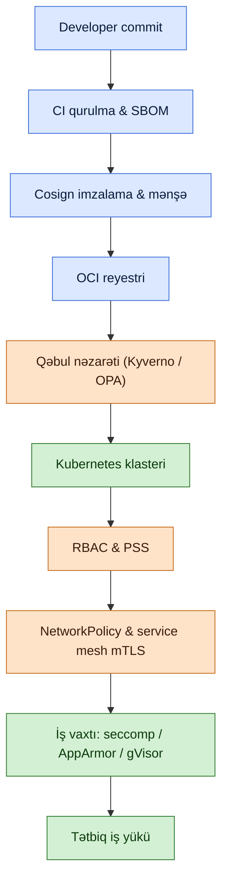

# Konteyner və Kubernetes Təhlükəsizliyi

## Niyə bu vacibdir

Konteynerlər və Kubernetes artıq yeni parıltılı şey deyil — onlar 2010-cu illərin sonundan bəri qurulmuş demək olar ki, hər bulud-yönlü iş yükü üçün defolt yerləşdirmə iş vaxtıdır. Müasir tətbiq nadir hallarda serverdə ikilik fayldır; o, reyestrdən çəkilən konteyner imiclərinin yığınıdır, Kubernetes tərəfindən işçi node-a planlaşdırılır, mesh vasitəsilə onlarla başqa servislə danışır və haradansa xarici sirləri oxuyur. Bu yığının hər təbəqəsi proqram təminatıdır, hər təbəqə dəyişəndir və hər təbəqədə səhv ola bilən konfiqurasiya var.

İctimai insident məlumatları hər il eyni hekayəni danışır: konteyner və Kubernetes pozuntuları demək olar ki, heç vaxt mürəkkəb kernel istismarları deyil. Onlar yanlış konfiqurasiyalardır. Pod root kimi işləyir, çünki heç kim `runAsNonRoot` təyin etməmişdir. Namespace-də NetworkPolicy yoxdur və ələ keçirilmiş pod sərbəst şəkildə verilənlər bazasına gedir. RBAC narahatedici göründüyü üçün bütün mühəndislik komandasına `cluster-admin` ClusterRoleBinding verilmişdir. `:latest` etiketli imic istehsala çəkilmişdir və heç kim içində hansı CVE-lərin olduğunu bilmir. İşçi node-da kubelet internetə açıqdır, çünki təhlükəsizlik qrupu çox icazəliydi. Bu nümunə CNCF post-mortemləri, pozuntu açıqlamaları və MITRE ATT&CK for Containers və Trail of Bits Kubernetes nəzərdən keçirməsindən nəşr olunan təhdid modellərində təkrarlanır.

Bu dərsdə uydurma `example.local` təşkilatı bir çox real təşkilatın getdiyi yolla gedir: tək host-da Docker-Compose faylından başlayaraq, idarə olunan Kubernetes klasterinə qədər böyüyür və tək host-da işləyən nəzarətlərin köçürülmədiyini öyrənir. Konteyner təhlükəsizliyi sadəcə "daha kiçik qutuda Linux təhlükəsizliyi" deyil. İmic, mənşəyi kriptoqrafik olaraq sübut edilməli olan qurulma zamanı artefaktdır; orkestrator öz hücum səthi olan idarəetmə müstəvisidir; pod-podla şəbəkə perimetr divarlarının heç vaxt görmədiyi şərq-qərb trafikidir; və iş vaxtı paylaşılır — bir konteynerdə kernel istismarı host-dakı hər konteynerə qarşı istismardır.

Bu dərs bütün yığını gəzir: imic qurulması, təchizat zənciri, iş vaxtı izolyasiyası, Kubernetes RBAC, qəbul nəzarəti, şəbəkə siyasətləri və onları bir-birinə bağlayan təhdid modeli. O, [Bulud Hesablama Təhlükəsizliyi](./cloud-computing-security.md) bölməsindəki geniş bulud mənzərəsi ilə tanışlığı qəbul edir və qoruma nəzarətləri kataloqu üçün [Bulud Təhlükəsizlik Həlləri](./cloud-security-solutions.md) ilə cütləşir.

## Əsas anlayışlar

### Konteyner əsasları qısa təkrar

Konteyner Linux prosesidir ki, qonşularından sistemə fərqli baxış görür. Kernel bu illüziyanı iki primitivdən istifadə edərək təmin edir: **namespace-lər** prosesin görə biləcəyini izolyasiya edir (PID, şəbəkə, mount, istifadəçi, IPC, UTS, cgroup) və **cgroup-lar** istifadə edə biləcəyini məhdudlaşdırır (CPU, yaddaş, I/O, PID-lər). Konteyner host kerneli paylaşır — virtual maşından fərqli olaraq, içəridə ikinci kernel yoxdur.

**Təbəqəli fayl sistemi** ikinci sütundur. İmic yalnız oxunan təbəqələrin yığınıdır (hər təbəqə fayl sistemi dəyişikliklərinin tar-ı və metadatadır) plus konteynerin iş vaxtında dəyişdirdiyi yazıla bilən yuxarı təbəqədir. Təbəqələr SHA-256 dijesti ilə məzmuna görə ünvanlanır, buna görə də `@sha256:...` ilə pinləmə mənalıdır və `:latest` ilə pinləmə deyil.

**Docker** formatı populyarlaşdırdı; **Open Container Initiative (OCI)** onu standartlaşdırdı. Bu gün OCI imic spesifikasiyası, OCI iş vaxtı spesifikasiyası (`runc`, `crun`, `runsc`, `kata-runtime` tərəfindən tətbiq olunur) və OCI distribusiya spesifikasiyası nəyin daşına biləcəyini müəyyən edir. Docker şirkəti indi bir çox şirkətdən biridir — `containerd`, `CRI-O`, `Podman` və başqaları hamısı OCI imiclərini istehlak edir. Kubernetes 1.24-də birbaşa Docker dəstəyini istənilən CRI-uyğun iş vaxtı lehinə köhnəlmiş elan etdi.

### İmic təhlükəsizliyi — minimal baza, pinləmə, çoxmərhələli

Konteyner imici qurulma prosesinin qoyduğu hər ikiliyi, kitabxananı, konfiqurasiya faylını və başıboş skripti daşıyır. Hər biri potensial hücum səthidir. Birinci rıçaq **baza imici**dir: minimal baza birinci gündən daha az CVE deməkdir.

- **Distroless imicləri** (gcr.io/distroless) yalnız dil iş vaxtını və tətbiqi göndərir — shell yoxdur, paket meneceri yoxdur, `curl` yoxdur. Shell-ə düşən təcavüzkarın hələ də işlədəcəyi heç nə yoxdur.
- **Alpine imicləri** kiçikdir, lakin glibc əvəzinə musl libc istifadə edir, bu da bəzən uyğunluq problemlərini ortaya çıxarır. Onlar `apk` və shell daxildir.
- **Scratch** boş bazadır. Statik tərtib edilmiş Go, Rust və ya Zig ikilikləri sözün əsl mənasında başqa heç nə olmadan `FROM scratch` üzərində işləyə bilər.
- **Wolfi / Chainguard imicləri** baş kömürdən təchizat zənciri gigiyenası üçün hazırlanmış daha yeni minimal və imzalanmış xəttdir.

İkinci rıçaq **etiket deyil, dijest ilə pinləmə**dir. `FROM nginx:1.25` qurulma zamanı reyestrin qaytardığı bitlərə həll olunur — saxlayıcı istənilən vaxt etiketi yenidən nəşr edə bilər. `FROM nginx@sha256:abc123...` həmişə eyni baytlara həll olunur. İstehsal qurulmaları hər baza imicini və hər asılılığı dijest ilə pinləməlidir; yeniləmələr mənbə nəzarətində açıq, nəzərdən keçirilə bilən diff olur.

Üçüncü rıçaq **çoxmərhələli qurulmalardır**. Dockerfile çoxlu `FROM` mərhələləri elan edə bilər, burada son mərhələ yalnız əvvəlki qurulma mərhələlərindən tərtib edilmiş artefaktı kopyalayır. Qurulma alət dəsti, mənbə kodu, test fixture-ləri, paket keşləri — heç biri iş vaxtı imicində qalmır. 1.2 GB qurulma mühiti 12 MB iş vaxtı konteynerinə qədər kiçilir.

### İmic skanlama — alətlərin nə tutduğu və tutmadığı

İmic skanerləri təbəqələri parse edir, quraşdırılmış paketləri və dil asılılıqlarını müəyyən edir və onları zəiflik bazasına qarşı uyğunlaşdırır. Aparıcı açıq alətlər **Trivy** (Aqua Security), **Grype** (Anchore) və **Snyk Container** və **Prisma Cloud** kimi kommersiya təklifləridir.

CVE əhatəsinin başa düşülməyə dəyər məhdudiyyətləri var:

- Skanerlər **OS paket CVE-lərini** (Debian, Alpine, RHEL məsləhətləri) etibarlı şəkildə tutur.
- Onlar **dil-ekosistem CVE-lərini** (npm, PyPI, Maven, Go modulları) manifest faylları mövcud və parse edilə bildikdə tutur.
- Onlar manifest girişi olmadan mənbə ağacına kopyalanmış **vendored asılılıqları** qaçırır.
- Onlar **imic daxilində yanlış konfiqurasiyaları** qaçırır (`/etc` üzrə `chmod 777`, daxili sirr, debug ikiliyi) — bunlar Trivy-nin misconfig rejimi, Dockle və ya Hadolint kimi ayrı skaner tələb edir.
- Onlar **iş vaxtı davranışı haqqında heç bir fikir bildirmir**; sıfır CVE-li imic hələ də zərərli ola bilər.

Skanlama həyat dövrünün üç yerinə uyğunlaşır: CI boru kəmərində qurulma zamanı (kritik CVE təqdim olunarsa birləşməni blok et), reyestr zamanında (yeni CVE-lər nəşr olunduqca saxlanan imicləri davamlı yenidən skanla) və qəbul zamanında (sonuncu skanı uğursuz olan imicin yerləşdirilməsini blok et).

### Proqram təchizat zənciri — SBOM, imzalama, SLSA

**Proqram təchizat zənciri** işləyən imici istehsal etməyə töhfə verən hər şeydir: mənbə kodu, asılılıqlar, qurulma mühiti, qurulma addımları və onlara toxunan insanlar və maşınlar. Təchizat zənciri hücumu bu mərhələlərin hər hansı birində zərərli bitlər inyeksiya edir.

**Software Bill of Materials (SBOM)** imicin ehtiva etdiyinin maşın oxunan inventarıdır: hər paket, hər versiya, hər lisenziya. İki açıq standart **CycloneDX** (OWASP) və **SPDX** (Linux Foundation)-dur. SBOM-lar qurulma tərəfindən istehsal olunur (Syft, Trivy, dil alət dəsti) və imicə qoşulur. Yeni CVE düşdükdə, SBOM-ları olan təşkilat "hansı işləyən imiclərimiz təsirlənir" sualına dəqiqələr ərzində cavab verə bilər; olmayan həftələr sürə bilər.

**İmic imzalama** imic dijestini şəxsiyyətə bağlayır. **Cosign** (**Sigstore** layihəsinin hissəsi) OCI imiclərini ya açar cütü ilə, ya da — daha maraqlı — OIDC vasitəsilə verilmiş qısamüddətli sertifikatla imzalayır, imzalama hadisəsi **Rekor** şəffaflıq qeydinə nəşr olunur. Qəbul zamanında doğrulama həm imzanı, həm də qeyd girişini yoxlayır. **Notary v2** Docker, Microsoft və başqalarının irəlilətdiyi OCI-spesifikasiya uyğun alternativdir.

**SLSA** (Supply-chain Levels for Software Artifacts) qurulma mənşəyi bütövlüyünün dörd səviyyəsini müəyyən edən çərçivədir:

| Səviyyə | Tələb olunanlar |
|---|---|
| SLSA 1 | Qurulma prosesi sənədləşdirilmişdir; mənşə avtomatik olaraq yaradılır |
| SLSA 2 | Mənbə və qurulma versiyalı; mənşə imzalanmışdır |
| SLSA 3 | Qurulma platforması sərtləşdirilmişdir; mənşə saxtalaşdırıla bilməz |
| SLSA 4 | Hər dəyişikliyin iki nəfər nəzərdən keçirməsi; hermetik, təkrarlana bilən qurulmalar |

**Mənşə təsdiqi** (in-toto formatında, Cosign ilə imzalanır) imici kimin qurduğunu, hansı mənbə commit-dən, hansı qurulma addımları ilə, hansı platformada qeyd edir. Qəbul siyasətləri həm etibarlı imza, həm də gözlənilən mənbə deposu ilə uyğunlaşan mənşə təsdiqi tələb edə bilər.

### İş vaxtı izolyasiyası — qabiliyyətlər, seccomp, AppArmor, gVisor

Konteyner işə düşdükdən sonra sual onun host-a nə edə biləcəyidir. Linux bir neçə nəzarət təqdim edir.

**Qabiliyyətlər** root-un hamısı-və ya-heç-biri gücünü 41 adlı imtiyaza bölür (`CAP_NET_ADMIN`, `CAP_SYS_ADMIN`, `CAP_CHOWN` və s.). Konteyner defolt olaraq bütün qabiliyyətləri tərk etməli və yalnız iş yükünün həqiqətən ehtiyac duyduğunu geri əlavə etməlidir. `docker run --cap-drop=ALL --cap-add=NET_BIND_SERVICE` məsuliyyətli üslubdur; Kubernetes-də ekvivalent `securityContext.capabilities`-də yaşayır.

**Seccomp** sistem çağırışlarını filtrləyir. Seccomp profili icazə verilən sistem çağırışlarının JSON siyahısıdır; başqa hər şey blok edilir. Docker defolt profili təxminən 50 təhlükəli sistem çağırışını blok edir; Kubernetes `RuntimeDefault` profili oxşardır. Sıx iş yüklü profillər `bpftrace` izləri və ya Inspektor Gadget operatoru kimi alətlərlə avtomatik yaradıla bilər.

**AppArmor** və **SELinux** prosesləri və resursları etiketləyən, sonra hər etiketin nəyə daxil ola biləcəyi haqqında siyasəti tətbiq edən məcburi giriş nəzarəti sistemləridir. AppArmor (Ubuntu, Debian) yol əsaslı qaydalardan istifadə edir; SELinux (RHEL, Fedora, Android) tip tətbiqindən istifadə edir. Hər ikisi ələ keçirilmiş konteynerin gözlənilən əhatəsindən kənar host fayllarını oxumasının qarşısını alır.

**İstifadəçi namespace-ləri** konteynerin root-unu (UID 0) host-da imtiyazsız UID-yə uyğunlaşdırır. Konteynerdən qaçış sonra host root-unun deyil, imtiyazsız host istifadəçisinin imtiyazlarına malikdir. Rootless konteynerlər (Podman, rootless Docker) bunu daha da götürür və bütün konteyner mühərrikini root olmadan işlədir.

**gVisor** (Google) sistem çağırışlarını ələ keçirən və onları Go-da yenidən tətbiq edən istifadəçi məkanı kernelidir, kiçik performans xərci ilə güclü izolyasiya təmin edir. **Kata Containers** hər pod-u öz kerneli olan yüngül VM-də işlədir, konteyner səviyyəli erqonomika ilə VM səviyyəli izolyasiya verir. Hər ikisi kernel istismarının partlayış radiusunun qəbuledilməz olduğu iş yüklərinə uyğun gəlir — çoxkirayəçili SaaS, etibarsız kod icrası, tənzimlənən iş yükləri.

### Kubernetes arxitekturası qısa təkrar

Kubernetes klasterində **idarəetmə müstəvisi** və bir və ya daha çox **işçi node** var.

İdarəetmə müstəvisi komponentləri:

- **kube-apiserver** — qabaq qapı; hər şey klaster vəziyyətini onun vasitəsilə oxuyur və yazır.
- **etcd** — bütün klaster vəziyyətini, o cümlədən sirləri saxlayan paylanmış açar-dəyər anbarı.
- **kube-scheduler** — hansı node-un hansı pod-u işlədəcəyinə qərar verir.
- **kube-controller-manager** — faktiki vəziyyəti istənilən vəziyyətə doğru sürən nəzarət dövrlərini işlədir.
- **cloud-controller-manager** — node-lar, yük balanslayıcılar, saxlama üçün bulud təminatçısı ilə danışır.

İşçi node-lar işlədir:

- **kubelet** — api-server ilə danışan və konteynerləri işə salan node agenti.
- **kube-proxy** — Service abstraksiyasını tətbiq edir (iptables və ya IPVS qaydaları).
- **konteyner iş vaxtı** — `containerd` və ya `CRI-O`, OCI konteynerlərini icra edir.

Klaster çoxkirayəçili platformadır. Çoxlu komandalar namespace-ləri, RBAC əhatələrini və əsas node-ları paylaşır. Yanlış konfiqurasiyanın partlayış radiusu açıq izolyasiya (namespace-lər + RBAC + NetworkPolicy + PodSecurity + resurs kvotaları) yerində olmadıqca bütün klasterdir.

### Kubernetes RBAC

Kubernetes **Role-Based Access Control** dörd obyektə malikdir:

- **Role** — namespace daxilində resurslar (`pods`, `secrets`, `deployments`) üzərində icazə verilən fellərin (`get`, `list`, `create`, `update`, `delete`, `watch`) dəstidir.
- **ClusterRole** — eyni, klaster geniş və namespace-siz resurslar üçün tələb olunur (`nodes`, `clusterroles`, `persistentvolumes`).
- **RoleBinding** — namespace daxilində Role-u subyektə (istifadəçi, qrup və ya ServiceAccount) verir.
- **ClusterRoleBinding** — ClusterRole-u klaster geniş verir.

**ServiceAccount** pod-un api-server-ə zəng etmək üçün istifadə etdiyi şəxsiyyətdir. Defolt olaraq hər pod namespace-in `default` ServiceAccount-unu alır; iş yükü başına açıq ServiceAccount-lar ən az imtiyazın bir hissəsidir.

Ümumi RBAC yanlış konfiqurasiyaları: "onlara debug etmək lazımdır" deyə developer komandasına `cluster-admin` vermək; namespace-də `*` resursları üzərində `*` felləri vermək; defolt ServiceAccount tokenini api-server-ə heç vaxt zəng etməyən pod-lara mount etmək; heç vaxt rotasiya olmayan uzunmüddətli tokenlərdən istifadə etmək.

### Autentifikasiya və avtorizasiya

Kubernetes-in daxili istifadəçi verilənlər bazası yoxdur. Autentifikasiya qoşulur:

- X.509 müştəri sertifikatları ilə **kubeconfig** — klaster adminləri üçün yaxşı, miqyasda ağrılıdır, çünki ləğv etmək çətindir.
- Xarici IdP (Okta, Entra ID, Keycloak) ilə **OIDC inteqrasiyası** — tövsiyə olunan insan istifadəçi yolu; Kubernetes JWT-ni doğrulayır və iddiaları RBAC üçün istifadə edir.
- **ServiceAccount tokenləri** — klaster daxili iş yükləri üçün. Müasir Kubernetes kubelet tərəfindən avtomatik rotasiya olunan qısamüddətli (bir saatlıq) tokenləri vermək üçün **BoundServiceAccountTokenVolume** istifadə edir, köhnə heç vaxt müddəti bitməyən tokenləri əvəz edir.
- Xüsusi şəxsiyyət təminatçıları üçün **Webhook autentifikatorları**.

Autentifikasiyadan sonra avtorizasiya təbəqələnir: RBAC, isteğe bağlı ABAC, isteğe bağlı Node avtorizatoru (kubelet-lərin nə edə biləcəyini məhdudlaşdırır) və nəhayət qəbul kontrollerləri (aşağıda əhatə olunur).

### Qəbul nəzarəti

Qəbul kontrollerləri autentifikasiya və avtorizasiyadan sonra api-server-ə hər yazıda işləyir. Onlar iki ləzzətdə gəlir:

- **Doğrulayan** qəbul webhook-ları sorğunu qəbul edir və ya rədd edir.
- **Mutasiya edən** qəbul webhook-ları sorğunu davamlı saxlanmadan əvvəl dəyişdirə bilər (sidecar inyeksiya etmək, defolt təyin etmək, annotasiya əlavə etmək).

İki ekosistem siyasət-kod sahəsində üstünlük təşkil edir:

- **OPA / Gatekeeper** — kitabxana üslublu ConstraintTemplates və klaster üzrə Constraints ilə deklarativ dil olan Rego-dan istifadə edir.
- **Kyverno** — mutate, validate, generate və verifyImages qaydaları ilə YAML kimi Kubernetes-yönlü siyasət.

Hər ikisi imzalı imicləri (Cosign doğrulaması) tətbiq edə, `:latest` etiketləri blok edə, resurs limitləri tələb edə, `hostPath` cildlərini qadağan edə, etiketlər tələb edə və onlarla daha çox şey edə bilər. Kyverno Rego mütəxəssisi olmayan komandalar üçün daha mehriban olmağa meyllidir; OPA mürəkkəb məntiq üçün daha çevikdir.

### Pod Security Standards

Köhnə **PodSecurityPolicy (PSP)** API-si Kubernetes 1.25-də silindi. Onun əvəzi daxili qəbul plagini (PodSecurity) və ya Kyverno/OPA ekvivalentləri vasitəsilə tətbiq olunan səviyyəli profil olan **Pod Security Standards (PSS)**-dir.

Üç profil:

| Profil | Əhatə dairəsi | Qadağan etdiyi nümunələr |
|---|---|---|
| Privileged | Məhdudiyyət yoxdur | Heç nə — yalnız etibarlı sistem iş yükləri üçün |
| Baseline | Məlum imtiyaz eskalasiyasını blok et | hostNetwork, hostPID, privileged konteynerlər, host-yol cildləri, təhlükəli qabiliyyətlər |
| Restricted | Sərtləşdirilmiş ən yaxşı təcrübə | runAsNonRoot, allowPrivilegeEscalation false, ALL qabiliyyətləri tərk et, yalnız oxunan root, seccomp RuntimeDefault |

PSS etiketləri namespace başına tətbiq olunur: `pod-security.kubernetes.io/enforce: restricted` Restricted-i pozan hər pod-u blok edir; `audit` və `warn` rejimləri blok etmədən qeyd edir. Əksər istehsal namespace-ləri Restricted işlətməlidir; Privileged tələb edən bir neçə az olmalı, adlandırılmalı və nəzərdən keçirilməlidir.

### Şəbəkə siyasətləri

Defolt olaraq hər pod namespace-lər arasında hər başqa pod-a çata bilər. **NetworkPolicy** bunu pod selektoru başına icazə verilən giriş və çıxışı elan edərək dəyişir.

Vacib olan nümunə: **namespace başına default-deny**, sonra açıq icazə qaydaları. Namespace-də bütün pod-ları seçən və sıfır giriş icazə verən NetworkPolicy default-deny baselindir; sonrakı siyasətlər lazımi axınları ağ siyahıya alır.

NetworkPolicy API-dir; onu tətbiq edən CNI plagininə ehtiyac duyur. **Calico** (iptables və ya eBPF istifadə edən) və **Cilium** (eBPF, CiliumNetworkPolicy vasitəsilə daha dərin L7 siyasəti ilə) aparıcı seçimlərdir. Cilium həmçinin pod həyat dövrü üçün daha yaxşı uyğun gələn keçici IP-lər deyil, pod etiketlərindən kilidlənmiş şəxsiyyət əsaslı siyasət təklif edir.

### Service mesh qısaca

**Service mesh** hər pod-a sidecar proxy (əksər mesh-lərdə Envoy) əlavə edir. Sidecar pod-lar arasında mTLS, dövrə qırılması, təkrar cəhdlər və zəngin telemetriya idarə edir, tətbiq koduna şəffafdır.

**Istio** xüsusiyyətlərlə zəngindir, mürəkkəbdir və böyük klasterlər üçün de-fakto standartdır. **Linkerd** daha sadədir, daha yüngüldür, məlumat müstəvisi üçün Rust-da yazılmışdır və işlədilməsi daha asandır. **Cilium Service Mesh** mesh-i sidecar-sız iş üçün CNI-yə inteqrasiya edir.

Təhlükəsizlik qələbəsi bütün klaster daxili trafik üçün **defolt mTLS**, plus SPIFFE / SPIRE vasitəsilə **iş yükü şəxsiyyəti**dir — hər pod kim olduğunu kriptoqrafik olaraq sübut edir, hər əlaqə autentifikasiya və şifrələnir və avtorizasiya siyasətləri IP deyil, iş yükü şəxsiyyəti baxımından ifadə edilə bilər.

### Sirlərin idarə edilməsi

Kubernetes **Secret** etcd-də base64 kodlu blobdur. Base64 şifrələmə deyil, kodlamadır — `get secrets` icazəsi olan hər kəs açıq mətni oxuyur. İki təbəqəli düzəliş:

- **etcd üçün dincliyə şifrələmə** — Secret resurslarını KMS dəstəkli açarla, ideal olaraq xarici KMS (AWS KMS, GCP KMS, Azure Key Vault, HashiCorp Vault Transit) ilə şifrələmək üçün `EncryptionConfiguration` konfiqurasiya edin ki, açar verilənlərin yanında saxlanmasın.
- **Xarici sirr anbarları** — Vault, AWS Secrets Manager, GCP Secret Manager, Azure Key Vault — pod-lar tərəfindən **External Secrets Operator** və ya **Secrets Store CSI Driver** vasitəsilə iş yükü şəxsiyyəti ilə (IRSA, Workload Identity Federation) əldə edilir, beləliklə klasterdə heç bir statik etimadnamə saxlanmır.

**Sealed Secrets** (Bitnami) orta yoldur: sirlər Git-də şifrələnir, klaster daxilində yalnız kontroler tərəfindən deşifrələnir. Xarici anbar hələ yerində olmadıqda GitOps üçün faydalıdır.

Daha geniş sirr-alət mənzərəsi üçün [Sirlər və İmtiyazlı Giriş İdarəetməsi](../open-source-tools/secrets-and-pam.md) baxın.

### Etcd təhlükəsizliyi

Etcd krallığı saxlayır: hər Secret, hər ConfigMap, hər iş yükü tərifi. Etcd-nin ələ keçirilməsi klasterin ələ keçirilməsidir.

Razılaşdırılmaz nəzarətlər: xarici KMS ilə **dincliyə şifrələmə**; bütün müştəri və yoldaş kommunikasiyası üçün **mTLS**; etcd-nin yalnız api-server şəbəkəsindən əldə edilə bilməsi üçün **şəbəkə izolyasiyası**; klaster xaricində saxlanan **müntəzəm şifrələnmiş ehtiyat nüsxələr**; istehsal zamanı kube-apiserver ilə birlikdə yerləşmək əvəzinə **ayrı etcd node-ları**.

İdarə olunan Kubernetes xidmətləri (EKS, GKE, AKS) sizin üçün etcd işlədir və bunun çoxunu idarə edir — lakin kirayəçi əksər təminatçılarda Secret resurs şifrələməni açıq şəkildə aktivləşdirməlidir.

### Təhdid modeli

İki istinad modeli konteyner təhdid modelləməsini idarə edir:

- **MITRE ATT&CK for Containers** — konteyner mühitləri üçün xüsusi taktika-və-texnika matrisi: İlkin Giriş, İcra, Davamlılıq, İmtiyaz Eskalasiyası, Müdafiədən Yayınma, Etimadnamə Girişi, Kəşf, Yan Hərəkət, Təsir.
- **Trail of Bits Kubernetes Threat Model** — idarəetmə müstəvisi, işçi və təchizat zənciri hücum vektorlarını əhatə edən CNCF tərəfindən nəşr olunan qiymətləndirmə.

Əsas hücum nümunələri:

- **İmtiyazlı pod vasitəsilə konteyner qaçışı** — `privileged: true` və ya xüsusi qabiliyyətlərlə (`CAP_SYS_ADMIN`, `CAP_SYS_PTRACE`) pod yarada bilən təcavüzkar host kerneline qaçır.
- **Kubelet ifşası** — hər işçi node-da kubelet 10250 portunda HTTP API-yə malikdir; autentifikasiyasız və əldə edilə bilərsə, hər kəs həmin node-dakı istənilən pod-a `exec` edə bilər.
- **Etcd oğurluğu** — etcd-yə birbaşa çatan təcavüzkar (şəbəkə, ehtiyat nüsxə, snapshot) klasterdəki hər Secret-i oxuyur.
- **İmic-etiket hiyləgərlikləri** — `:latest` və ya dəyişən etiketi zərərli imicə yenidən yönləndirmək, dijest ilə pinləməyən hər yerləşdirməni istismar etmək.
- **Ələ keçirilmiş CI** — klaster etimadnamələri olan boru kəmərləri yüksək dəyərli hədəfdir; bir oğurlanmış kubeconfig istehsala yerləşdirə bilər.
- **Təchizat zənciri inyeksiyası** — yazı səhvli asılılıq, ələ keçirilmiş saxlayıcı hesabı və ya backdoor edilmiş baza imici kodu etibarlı qurulma yolları vasitəsilə istehsala düşür.
- **Token oğurluğu** — ələ keçirilmiş pod və ya konteyner fayl sistemindən oğurlanan uzunmüddətli ServiceAccount tokenləri təcavüzkara pod-un API imtiyazlarını verir.
- **Sidecar sui-istifadəsi** — zərərli init konteyneri və ya qəbul webhook-u sirləri ekfiltrasiya edən sidecar inyeksiya edir.

Müdafiə forması: imici sərtləşdir, imzala və doğrula, iş vaxtını izolyasiya et, RBAC-ı əhatələ, qəbulda darvazala, şəbəkəni seqmentləşdir, etcd-ni şifrələ və hər şeyi auditlə.

## Bulud-yönlü təhlükəsizlik yığını

Aşağıdakı yığın developer commit-dən işləyən iş yüküne qədər hər nəzarətin harada olduğunu göstərir. Etibar soldan-sağa axır; hər hansı əvvəlki mərhələdə uğursuzluq hər sonrakı mərhələnin fərziyyələrini sındırır.

Bunu kriptoqrafik təsdiqlər və siyasət darvazaları zənciri kimi oxuyun. Qurulma mərhələsi mənbə commit-ə bağlı SBOM və imza istehsal edir. Reyestr həmin artefaktları saxlayır. Qəbul nəzarəti klaster iş yükünü davamlı saxlamadan əvvəl onları doğrulayır. RBAC, PSS və NetworkPolicy işləyən iş yükünün nə edə biləcəyinə qərar verir; iş vaxtı təbəqəsi yuxarıdakı hər şey uğursuz olarsa son müdafiə xəttidir.

Qaçınılmalı səhv bunlardan birini özlüyündə kafi kimi qəbul etməkdir. `cluster-admin` ServiceAccount-u olan imzalı imic hələ də gözləyən fəlakətdir; qəbul nəzarəti olmayan sərtləşdirilmiş iş vaxtı pozuntudan bir pis imic uzaqdadır.

## Praktiki / məşğələ

Yerli Kubernetes (kind, k3d, minikube), Docker və sərbəst mövcud alət dəsti ilə öyrənənin işlədə biləcəyi beş məşğələ. Heç biri pullu xidmətlər tələb etmir; hamısı nəzərdən keçirilə bilən artefaktlar istehsal edir.

### 1. Çoxmərhələli Dockerfile qur və Trivy ilə skanla

Kiçik Go və ya Python veb tətbiqi götürün. Çoxmərhələli Dockerfile yazın: tam alət dəstli `builder` mərhələsi və `gcr.io/distroless/static-debian12` (Go) və ya minimal Python iş vaxtı imicində son mərhələ. Hər iki baza imicini `@sha256:` dijest ilə pinləyin. Onu qurun, sonra `trivy image --severity HIGH,CRITICAL myapp:1.0` işlədin. Cavablandırın:

- Qurucu imicdə son imicə nisbətən neçə CVE var?
- Hansı paketlər CVE-lərə töhfə verdi və fərqli baza imici onları aradan qaldıra bilərmi?
- Trivy `USER` çatışmazlığı və ya root kimi işləmək kimi yanlış konfiqurasiyalar tapdı (`trivy config Dockerfile`)?

Son imic HIGH və CRITICAL-da təmiz skanlanana qədər təkrarlayın.

### 2. Cosign ilə imici imzala və qəbulda doğrula

`cosign` quraşdırın, açar cütü yaradın (`cosign generate-key-pair`), imicinizi yerli reyestrə itələyin və imzalayın (`cosign sign --key cosign.key registry.local/myapp:1.0`). İmzanı `cosign verify` ilə əl ilə doğrulayın. Sonra həmin reyestrdən hər hansı pod qəbul edilməzdən əvvəl `cosign verify`-nin uğur qazanmasını tələb edən Kyverno siyasətini yerləşdirin. İmzalanmamış imici itələyin və qəbulun rədd etdiyini təsdiqləyin.

### 3. `:latest`-i blok edən Kyverno siyasəti yerləşdir

Pod spesifikasiyalarını doğrulayan və `:latest` etiketi olan və ya heç etiketi olmayan istənilən konteyneri rədd edən Kyverno ClusterPolicy yazın. Onu klaster geniş tətbiq edin. `nginx:latest` və `nginx` (etiket yoxdur) yerləşdirməyə cəhd edin və hər ikisinin blok edildiyini təsdiqləyin. `nginx:1.25.4` yerləşdirin və qəbul edildiyini təsdiqləyin. Sonra siyasəti dijestlər (`@sha256:...`) tələb etmək üçün genişləndirin və uğursuzluq mesajını müşahidə edin.

### 4. Namespace-də default-deny NetworkPolicy yarat

Sandbox namespace-ində iki pod yerləşdirin: müştəri (`curl`) və server (`nginx`). Müştərinin serverə çatdığını təsdiqləyin. `podSelector: {}` və boş `ingress` array ilə NetworkPolicy tətbiq edin — namespace default-deny. Yenidən sınayın; müştəri uğursuz olmalıdır. Server pod-una müştəri pod-undan etiket ilə giriş icazə verən NetworkPolicy əlavə edin və əlçatanlığın geri qayıtdığını təsdiqləyin. Xüsusi hədəflərdən başqa çıxışı rədd etmək üçün təkrarlayın.

### 5. RBAC-ı developer yalnız bir namespace-ə daxil ola biləcək şəkildə konfiqurasiya et

`dev-team` namespace və `alice` ServiceAccount yaradın. Yalnız həmin namespace-də `pods`, `deployments`, `services` və `configmaps` üzərində `get`, `list`, `watch`, `create`, `update`, `delete` verən Role müəyyən edin. Bağlayın. ServiceAccount üçün kubeconfig yaradın. Həmin kubeconfig-dən `alice`-in `dev-team`-də iş yüklərini idarə edə biləcəyini, lakin `kube-system`-də pod-ları oxuya və ya `nodes` siyahısı çıxara bilməyəcəyini təsdiqləyin. Sonra eskalasiyaya cəhd edin: `alice` daha çox verən Role yarada bilərmi? (Cavab: yox — escalate feli tələb olunur.)

## İşlənmiş misal — `example.local` sərtləşdirilmiş Kubernetes platformasına köçür

`example.local` müştəri-yönlü veb platformanı — altı servis, on iki işçi proses, üç verilənlər bazası — tək Docker-Compose host-da işlədir. Host 32-nüvəli VM-dir, root girişi mühəndislik komandası tərəfindən paylaşılır, imic skanlaması yoxdur, sirr idarə edilməsi yoxdur və yerləşdirmə developer noutbukundan `docker compose up -d`-dir. İctimai-yönlü servisdə köhnə asılılıq CVE-sinin demək olar ki, istehsala göndərildiyi yaxın imtinadan sonra CTO sərtləşdirilmiş Kubernetes platformasına miqrasiyanı təsdiq edir.

**Hədəf arxitekturası.** İdarə olunan Kubernetes klasteri (üç idarəetmə müstəvisi replikası, üç əlçatanlıq zonasında yayılmış altı işçi node), şəxsi OCI reyestri, ayrı sərtləşdirilmiş hesabda işləyən CI/CD boru kəməri, FluxCD vasitəsilə GitOps barışdırma, Kyverno qəbul siyasətləri, namespace başına default-deny NetworkPolicies, L7 siyasəti və Hubble axın görünürlüğü üçün Cilium CNI kimi və Vault vasitəsilə xarici sirlər.

**İmic qurulma boru kəməri.** Hər servisdə distroless iş vaxtı mərhələsi olan çoxmərhələli Dockerfile, dijest ilə pinlənmiş baza imicləri və root olmayan UID təyin edən `USER` direktivi var. CI boru kəməri `trivy image` işlədir və hər HIGH və ya CRITICAL CVE-də qurulmanı uğursuz edir. Skandan sonra `syft` CycloneDX SBOM yaradır, `cosign sign --keyless` imici imzalayır (boru kəmərinin OIDC şəxsiyyətindən istifadə edərək) və `cosign attest` SBOM və SLSA mənşəyini qoşur. İmic şəxsi reyestrə `service-name:git-sha-short` etiketli olaraq itələnir.

**GitOps yerləşdirmə.** Ayrı Git deposu (`example.local-gitops`) dijest ilə pinlənmiş imic istinadları olan Kustomize manifestlərini saxlayır. Flux Kustomization klasteri hər dəqiqədə barışdırır. Developerlərin birbaşa klaster etimadnamələri yoxdur; onlar GitOps deposuna qarşı pull sorğularını qaldırırlar, nəzərdən keçirilir və birləşdirilir. Sonra Flux yeni manifestləri çəkir və tətbiq edir.

**Kyverno qəbul siyasətləri.**

- `verifyImages` — hər imicin `example.local` boru kəməri OIDC şəxsiyyəti tərəfindən imzalanmasını, imza Rekor-da olmasını tələb edir.
- `disallow-latest-tag` — `:latest` və etiketsiz imicləri blok edir.
- `require-non-root` — `runAsNonRoot: true` olmadan pod-ları rədd edir.
- `require-resource-limits` — hər konteynerdə CPU və yaddaş limitləri var.
- `restrict-host-namespaces` — `hostNetwork`, `hostPID`, `hostIPC`-i qadağan edir.
- `pod-security-standard` — bütün tətbiq namespace-ləri üçün namespace `enforce: restricted` təyin edir; yalnız `kube-system` və kiçik `infra` namespace-inə `baseline` icazə verilir.

**RBAC.** İş yükü başına ServiceAccount, hər biri pod-un faktiki oxuduğu resurslara əhatələnmiş Role ilə (adətən heç nə — əksər iş yükləri ümumiyyətlə API girişinə ehtiyac duymur). İnsan girişi `EXAMPLE\` SSO-ya OIDC federasiyası vasitəsilədir; developerlər komanda namespace-lərində Roles alır; cluster-admin tam olaraq dörd `EXAMPLE\platform-eng` mühəndis tərəfindən saxlanılır və aylıq auditlənir.

**Şəbəkə siyasətləri.** Hər namespace `default-deny` NetworkPolicy və açıq `allow-from-ingress-controller` və `allow-to-dns` siyasətləri ilə gəlir. Servis-servisə trafik `app=` etiketləri baxımından ifadə olunan Cilium-un şəxsiyyət əsaslı siyasətindən istifadə edir. Verilənlər bazası namespace-ləri yalnız uyğun tətbiq namespace-indən trafiki qəbul edir.

**Sirlər.** Vault bulud KMS vasitəsilə avto-açma ilə xüsusi namespace-də işləyir. External Secrets Operator sirləri Kubernetes Secrets-ə çəkir, onlar KMS təminatçısı plagini vasitəsilə etcd-də dincliyə şifrələnir. Vault BoundServiceAccountTokens istifadə edən Kubernetes auth metodu vasitəsilə pod-ları autentifikasiya edir, beləliklə heç bir yerdə statik etimadnamələr mövcud deyil.

**OPA / CI-də siyasət.** Hər hansı GitOps PR birləşdirilməzdən əvvəl, CI işi rendered manifestlərə qarşı OPA Conftest işlədir, eyni siyasətləri Kyverno-nun klasterdə tətbiq etdiyi kimi tətbiq edir, plus bir neçə qurulma vaxtı yoxlaması (üzən etiketlərlə `imagePullPolicy: Always` yox, vəziyyətli verilənlər üçün `emptyDir` yox). Uğursuzluqlar PR-da nəzərdən keçirmə şərhləri kimi görünür; birləşmələr təmiz olana qədər blok edilir.

**Etcd və idarəetmə müstəvisi.** İdarə olunan təminatçı etcd-ni işlədir; `example.local` KMS dəstəkli Secret şifrələməni aktivləşdirir, hər API yazısını SIEM-ə göndərmək üçün audit qeydini konfiqurasiya edir və api-server girişini məlum IP aralıqları siyahısı plus klasterin daxili yük balanslayıcısı ilə məhdudlaşdırır.

**Service mesh.** Linkerd tətbiq pod-ları arasında mTLS üçün yerləşdirilir. Mesh aktiv namespace-lərində hər pod üçün mTLS defolt olaraq aktivdir; ServerAuthorization siyasətləri hər servisə hansı müştəri şəxsiyyətlərinin çata biləcəyini məhdudlaşdırır.

**Nəticə.** Altı ay sonra `example.local`-da imic-etiket insidenti olmamışdır, heç bir sirr Git deposuna sızmamışdır (ön-commit hook-ları plus statik etimadnamələrin olmaması) və audit "burada hər işləyən imic üçün boru kəmərimiz tərəfindən imzalanmış SBOM, imza başına Rekor qeyd girişi ilə" cavabı ilə cavablandırıla bilər. Platforma komandasının "yeni kritik CVE nəşr olundu" üçün runbook-u hər təsirlənmiş işləyən imici komanda sahibi ilə sadalayan tək komandadır.

## Problemlərin həlli və tələlər

- **İstehsalda imtiyazlı konteynerlər.** `privileged: true` olan pod faktiki olaraq işçi node-da root-dur. PSS Restricted və ya Kyverno vasitəsilə qəbulda blok edin; yalnız sənədli əsaslandırma ilə adlandırılmış sistem namespace-lərində icazə verin.
- **`hostNetwork`, `hostPID`, `hostIPC`.** Bu bayraqlar host-un şəbəkə və ya proses namespace-lərini pod-la paylaşır. Ələ keçirilmiş pod node-dakı hər başqa prosesi görür və qarşılıqlı əlaqədə ola bilər. Onları qəbulda blok edin.
- **Kubelet anonim girişi.** 10250 portunda kubelet müştəri sertifikatı autentifikasiyası və avtorizasiya tələb etməlidir. Şəbəkəyə açıq anonim-icazəli kubelet-lər node-dakı hər pod-un bir addımlıq ələ keçirilməsidir.
- **kube-apiserver-i ictimai internetə ifşa etmək.** Güclü autentifikasiya ilə belə api-server klasterin qabaq qapısıdır. Məlum şəbəkələrlə məhdudlaşdırın; OIDC tələb edin; şəxsi son nöqtə olmadan heç vaxt `0.0.0.0`-da ifşa etməyin.
- **Hər yerdə `cluster-admin`.** RBAC narahatedici göründüyü üçün developer komandasına cluster-admin vermək ən ümumi Kubernetes RBAC uğursuzluğudur. Defolt olaraq namespace edilmiş Roles; cluster-admin üçün açıq, auditlənmiş əsaslandırma tələb edin.
- **Hər pod-a avtomatik mount edilən defolt ServiceAccount tokenləri.** Əksər iş yükləri heç vaxt api-server-ə zəng etmir. Buna ehtiyac duymayan Pod spesifikasiyalarına `automountServiceAccountToken: false` təyin edin; mount edilmiş token əks halda hər ələ keçirilmiş konteynerdən ekfiltrasiya oluna bilən etimadnamədir.
- **Uzunmüddətli ServiceAccount tokenləri.** 1.22 öncəsi tokenlər heç vaxt müddəti bitmirdi. Kubelet tərəfindən avtomatik rotasiya olunan bir saatlıq tokenləri vermək üçün BoundServiceAccountTokenVolume (müasir klasterlərdə defolt) istifadə edin.
- **Mühit dəyişənlərində sirlər.** Mühit dəyişənləri `ps`-də, əks olunarsa konteyner qeydlərində və Kubernetes hadisələrində görünür. Sirləri tmpfs cildi vasitəsilə fayllar kimi mount edin və ya xarici anbardan proyeksiya etmək üçün Secrets Store CSI Driver istifadə edin.
- **Köhnəlmiş imic skanları.** Altı ay əvvəlki skan keçən həftə nəşr olunan CVE-yə qarşı qorumur. Reyestr imiclərini davamlı yenidən skanlayın; ən son skan nəticəsində qəbulu darvazalayın; skan-status sürüşməsinə zəiflik kimi yanaşın.
- **İmic-etiket hiyləgərlikləri.** `:latest`, `:v1` və ya istənilən dəyişən etiket "reyestrin indi nə qaytardığı" deməkdir. Hər imici dijest ilə pinləyin; qəbulda tətbiq edin.
- **Çatışmayan seccomp profili.** Bir çox klaster pod-ları `seccompProfile: Unconfined` ilə işlədir, çünki 1.27-dən əvvəlki defolt məhdudiyyətsizdi. PSS Restricted və ya Kyverno mutasiyası vasitəsilə klaster geniş `seccompProfile.type: RuntimeDefault` təyin edin.
- **Pod Security tətbiqi yoxdur.** PSP silindi və bir çox klaster heç vaxt PSS qəbul etmədi. Hər tətbiq namespace-də Restricted-səviyyəli etiket mövcud ən yüksək rıçaqlı nəzarətlərdən biridir.
- **Yetərsiz audit qeydiyyatı.** api-server-in audit qeydi hər autentifikasiya edilmiş sorğunu qeyd edir; onsuz, insidentdən sonrakı məhkəmə təxmindir. Hərtərəfli audit siyasətini (rutin əməliyyatlar üçün Metadata, həssas fellər üçün Request/RequestResponse) aktivləşdirin və klaster xaricinə göndərin.
- **Sərhədsiz resurs sorğuları.** CPU və yaddaş limitləri olmayan pod-lar node-u ac qoya və səs-küylü qonşu uğursuzluqlarını tetikleyebilir. LimitRange vasitəsilə defoltlar təyin edin; Kyverno vasitəsilə limitləri tələb edin; metriklərlə müşahidə edin.
- **`hostPath` cildlərinə icazə vermək.** `hostPath` mount-u pod-un host fayl sistemini oxumasına və ya yazmasına icazə verir — kanonik konteyner-qaçış vektoru. Qəbulda blok edin; əvəzində açıq StorageClasses ilə PersistentVolumes istifadə edin.
- **Klaster daxili şəbəkəyə güvənmək.** Default-deny NetworkPolicy olmadan, hər pod hər başqa pod-a çata bilər. Bir pod ələ keçirilməsindən sonra yan hərəkət məhdudlaşdırılmamışdır. Namespace başına default-deny, sonra açıq icazə.
- **Açıq olaraq uğursuz olan mutasiya edən qəbul webhook-ları.** `failurePolicy: Ignore` olan webhook webhook çıxdıqda klasterin yazıları qəbul etməyə davam etdiyi deməkdir. Təhlükəsizlik-əhəmiyyətli webhook-lar üçün `failurePolicy: Fail` təyin edin və webhook-un yüksək əlçatanlıqlı olduğundan əmin olun; əməliyyat webhook-ları üçün açıq olaraq uğursuz olmaq doğru seçim ola bilər — lakin onu açıq edin.
- **GitOps sürüşməsi.** Mühəndislərin GitOps axınından kənarda birbaşa `kubectl apply` etməsinə icazə verən platforma komandasında iki həqiqət mənbəyi və audit izi yoxdur. RBAC vasitəsilə birbaşa apply-ı söndürün; bütün dəyişiklikləri GitOps deposu vasitəsilə yönləndirin.
- **Şifrələnməmiş və ya eyni partlayış radiusunda saxlanılan etcd ehtiyat nüsxələri.** Etcd ehtiyat nüsxəsini oxuyan təcavüzkar hər Secret-i oxuyur. Ehtiyat nüsxələri klasterin saxlamadığı açarla şifrələyin; onları ayrı hesabda və ya kirayəçilikdə saxlayın.

## Əsas çıxarışlar

- Konteynerlər təbəqəli fayl sistemi, namespace-lər və cgroup-lar ilə proseslərdir — onlar host kerneli paylaşırlar. İmic gigiyenası və iş vaxtı məhdudlaşdırma konteyner təhlükəsizliyinin iki yarısıdır.
- İmic təhlükəsizliyi minimal baza, dijest ilə pinləmə və çoxmərhələli qurulmalarla başlayır. CI-də, reyestrdə və qəbulda skanlayın; skanerlərin nə tutmadığını anlayın.
- Proqram təchizat zənciri SBOM-lar, imzalı imiclər (Cosign / Sigstore) və mənşə təsdiqlər (SLSA) tələb edir. Hər üçünü developer noutbukunda deyil, qəbulda doğrulayın.
- İş vaxtı izolyasiyası təbəqəlidir: qabiliyyətləri tərk edin, seccomp tətbiq edin, AppArmor və ya SELinux ilə etiketləyin, root olmayan və istifadəçi namespace-lərinə üstünlük verin. Etibarsız iş yükləri üçün gVisor və ya Kata.
- Kubernetes çoxkirayəçili platformadır. Namespace-lər + RBAC + NetworkPolicy + PodSecurity + ResourceQuota onu kirayəçi-təhlükəsiz edir; hər hansı biri olmadan, partlayış radiusu klasterdir.
- RBAC ən az imtiyaz olmalıdır. İş yükü başına ServiceAccount, faktiki ehtiyaclara əhatələnmiş Role, ehtiyac olmadıqda defolt token mount yoxdur, insanlar üçün OIDC, pod-lar üçün BoundServiceAccountTokens.
- Qəbul nəzarəti (Kyverno, OPA / Gatekeeper) siyasətin reallıqla görüşdüyü yerdir. İmzalanmamış imicləri, dəyişən etiketləri, imtiyazlı pod-ları, çatışmayan limitləri, host namespace-lərini və hostPath cildlərini blok edin.
- Pod Security Standards PodSecurityPolicy-ni əvəz etdi. Restricted istehsal defoltdur; Restricted-i qarşılamayan köhnə üçün Baseline; yalnız sıxı nəzarət olunan sistem namespace-ləri üçün Privileged.
- Şəbəkə siyasəti namespace başına default-deny ilə başlayır və açıq icazələr əlavə edir. CNI seçimi vacibdir — Calico və Cilium liderlərdir; Cilium şəxsiyyət əsaslı və L7 siyasəti təklif edir.
- Service mesh mTLS və iş yükü şəxsiyyətini şəffaf təmin edir. Klaster ölçüsü və riskinə nisbətdə faydalıdır; əməliyyat mürəkkəbliyində pulsuz deyil.
- Sirlər defolt olaraq şifrələnmir — onlar base64-dür. etcd-ni KMS ilə şifrələyin; iş yükü şəxsiyyəti vasitəsilə əldə edilən xarici anbarlara (Vault, bulud sirr menecerləri) üstünlük verin.
- Təhdid modeli nəşr olunmuşdur — MITRE ATT&CK for Containers və Trail of Bits Kubernetes nəzərdən keçirməsi. Kateqoriyaları yenidən kəşf etmək əvəzinə müdafiə əhatəsini sürmək üçün onları istifadə edin.

Hər mərhələdə commit-dən iş vaxtına qədər pinləyən, imzalayan, skanlayan, darvazalayan, seqmentləşdirən və auditləyən konteyner və Kubernetes proqramı platformanın mürəkkəbliyini öhdəliyə deyil, üstünlüyə çevirir. Tribal biliyə və "biz bunu sonra kilidləyəcəyik" güvənən nəhayət CVE-nömrəli post-mortemdə görünür.

## İstinadlar

- CIS Kubernetes Benchmark — [https://www.cisecurity.org/benchmark/kubernetes](https://www.cisecurity.org/benchmark/kubernetes)
- NIST SP 800-190 — *Application Container Security Guide* — [https://csrc.nist.gov/publications/detail/sp/800-190/final](https://csrc.nist.gov/publications/detail/sp/800-190/final)
- MITRE ATT&CK for Containers — [https://attack.mitre.org/matrices/enterprise/containers/](https://attack.mitre.org/matrices/enterprise/containers/)
- Kubernetes Pod Security Standards — [https://kubernetes.io/docs/concepts/security/pod-security-standards/](https://kubernetes.io/docs/concepts/security/pod-security-standards/)
- Kubernetes RBAC sənədləri — [https://kubernetes.io/docs/reference/access-authn-authz/rbac/](https://kubernetes.io/docs/reference/access-authn-authz/rbac/)
- Cosign / Sigstore — [https://docs.sigstore.dev/](https://docs.sigstore.dev/)
- SLSA çərçivəsi — [https://slsa.dev/](https://slsa.dev/)
- CycloneDX SBOM spesifikasiyası — [https://cyclonedx.org/](https://cyclonedx.org/)
- SPDX SBOM spesifikasiyası — [https://spdx.dev/](https://spdx.dev/)
- OWASP Kubernetes Top Ten — [https://owasp.org/www-project-kubernetes-top-ten/](https://owasp.org/www-project-kubernetes-top-ten/)
- Trail of Bits — *Kubernetes Threat Model and Security Audit (CNCF)* — [https://github.com/kubernetes/community/tree/master/wg-security-audit](https://github.com/kubernetes/community/tree/master/wg-security-audit)
- Kyverno sənədləri — [https://kyverno.io/docs/](https://kyverno.io/docs/)
- OPA Gatekeeper — [https://open-policy-agent.github.io/gatekeeper/](https://open-policy-agent.github.io/gatekeeper/)
- Cilium sənədləri — [https://docs.cilium.io/](https://docs.cilium.io/)
- Əlaqəli dərs — [Bulud Hesablama Təhlükəsizliyi](./cloud-computing-security.md)
- Əlaqəli dərs — [Bulud Təhlükəsizlik Həlləri](./cloud-security-solutions.md)
- Əlaqəli dərs — [Təhlükəsiz Tətbiq İnkişafı](../secure-app-development.md)
- Əlaqəli dərs — [Müəssisə Təhlükəsizlik Arxitekturası](../architecture/enterprise-security-architecture.md)
- Əlaqəli dərs — [Zəiflik və AppSec Alətləri](../open-source-tools/vulnerability-and-appsec.md)
- Əlaqəli dərs — [Sirlər və PAM Alətləri](../open-source-tools/secrets-and-pam.md)
- Əlaqəli dərs — [OWASP Top 10](../../red-teaming/owasp-top-10.md)
- Əlaqəli dərs — [Təhlükəsizlik Nəzarətləri](../../grc/security-controls.md)
