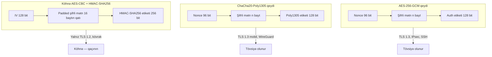

# Kriptoqrafiya — Qabaqcıl mövzular

[Əsaslar dərsi](./cryptography-basics.md) tikinti bloklarından bəhs edir: simmetrik və asimmetrik şifrələr, heşlər, imzalar və hibrid TLS əl sıxışması. Bu qabaqcıl baxış `example.local` üzərində işləyən real sistemlərin bu gün həqiqətən istifadə etdiklərini əhatə edir — AEAD rejimləri, elliptik əyri açar razılaşması, post-kvant miqrasiyası, blokçeyn ilkin elementləri, homomorf şifrələmə, sıfır-bilik sübutları və hadisə hesabatlarında daim görünən kriptoanaliz hücumları.

## Bu nə üçün vacibdir

Mühəndislərin əksəriyyəti AES, RSA və SHA-256 adlandıra bilər. Daha azı AES-GCM-in AES-CBC+HMAC-ı niyə əvəz etdiyini, bir dəfəlik nonce təkrarının niyə fəlakətli olduğunu, TLS 1.3 daxilində `X25519`-un nə etdiyini və ya CISO-nun 2026-cı ildə post-kvant miqrasiyası haqqında niyə memorandumlar göndərdiyini izah edə bilər. Lakin məhz bu suallar kod yoxlamasında, satıcı sorğularında və hər yetkin təhlükəsizlik auditində ortaya çıxır.

Əsaslar tikinti bloklarını öyrədir. Qabaqcıl mövzular həmin tikinti bloklarının istehsalda istifadə etdiyiniz protokollara birləşdirildiyi yerdir — və burada bir səhv fərziyyə (ECB rejimli verilənlər bazası sütunu, 32-bitlik GCM nonce, TLS zəncirində SHA-1 imzası) CVE-yə çevrilir. Bu dərs növbəti təbəqənin mühəndis turudur.

## Əsas konsepsiyalar

### Əməliyyat rejimləri yenidən

Xam blok şifrəsi yalnız bir bloku şifrələyir. Əməliyyat rejimləri blokları bir-birinə bağlayaraq ixtiyari uzunluqlu mesajları şifrələyir. Yanlış rejim seçimi başqa cür sağlam şifrəni qırır.

| Rejim | Bir cümlə ilə | Autentifikasiyalı | Bu gün istifadə |
|---|---|---|---|
| **ECB** | Hər bloku müstəqil şifrələ. | Xeyr | **Heç vaxt.** Eyni açıq mətn bloku eyni şifrli mətn verir ("ECB pinqvini"). |
| **CBC** | Hər açıq mətn blokunu əvvəlki şifrli mətn ilə XOR et, sonra şifrələ. Təsadüfi IV tələb edir. | Xeyr | Yalnız köhnə. Padding-oracle hücumları (POODLE, Lucky 13) onu TLS-də batırdı. |
| **CTR** | Sayğacı şifrələ, açıq mətnlə XOR et — blok şifrəsindən qurulan axın şifrəsi. | Xeyr | GCM daxilində tikinti bloku. Çılpaq CTR-i istifadə etməyin — bütövlük yoxdur. |
| **GCM** | CTR plus Galois sahə MAC etiketi. | **Bəli (AEAD)** | Hər yerdə standart — TLS 1.3, SSH, IPsec, disk şifrələmə. |
| **CCM** | CTR plus CBC-MAC. | **Bəli (AEAD)** | WPA2, IoT, məhdud cihazlar. "Onlayn" deyil — mesaj uzunluğu əvvəlcədən lazımdır. |
| **ChaCha20-Poly1305** | Poly1305 MAC ilə axın şifrəsi. | **Bəli (AEAD)** | TLS 1.3 alternativi, mobil və `AES-NI` olmayan CPU-larda üstün. |
| **XTS** | Sabit ölçülü sektorlar üçün iki açarlı tweakable rejim. | Xeyr (dizaynda) | Tam disk şifrələmə — BitLocker, LUKS, FileVault. |

Müasir kripto səhvlərinin əksəriyyətinin qarşısını alan tək qayda: **standart olaraq AEAD istifadə edin**. AES-GCM və ya ChaCha20-Poly1305. Çılpaq CBC, çılpaq CTR və ECB yeni kodda yeri yoxdur.

### AEAD — Əlaqəli Verilənlərlə Autentifikasiyalı Şifrələmə

2000-ci illərin böyük hissəsində mühəndislər məxfilik və bütövlüyü əl ilə tərkib etməyə çalışırdılar: AES-CBC ilə şifrələ, sonra şifrli mətni HMAC et, sonra etiketi əvvələ və ya sona əlavə et. Bu nümunə, "şifrələ-sonra-MAC", **mükəmməl** tətbiq olunarsa düzgündür — və əksər tətbiqlər deyildi. Padding-oracle hücumları (POODLE, Lucky 13, Bleichenbacher 2018) sorğu başına bir bit padding haqqında məlumat sızdığından "təhlükəsiz" CBC+HMAC TLS dəstlərindən təkrar-təkrar açıq mətn çıxardı.

AEAD şifrələmə və autentifikasiyanı vahid ilkin elementdə birləşdirir və qəbul edir:

- **Açıq mətn** — gizli baytlar.
- **Açar** — adətən 256 bit.
- **Nonce** — mesaj başına unikal (GCM üçün 96 bit, ChaCha20-Poly1305 üçün 96 bit).
- **Əlaqəli Verilənlər (AD)** — autentifikasiya olunan, lakin **şifrələnməyən** başlıq baytları. Tipik AD: TLS yazı başlığı, paket ardıcıllıq nömrəsi, fayl metadatası.

Şifrəaçma ya açıq mətni qaytarır, ya da sabit-zamanlı etiket yoxlaması ilə tamamilə uğursuz olur. "Şifrəaç və sonra yoxla" yoxdur — uğursuzluq yolu atomikdir, padding-oracle hücumlarını məhz bu öldürür.

Bu gün hamının daşıdığı iki AEAD:

- **AES-256-GCM** — `AES-NI` və `PCLMULQDQ` vasitəsilə hər müasir CPU-da aparat sürətləndirilmişdir. Server tərəfində TLS 1.3-də ən sürətlisi.
- **ChaCha20-Poly1305** — yalnız proqram təminatı, sabit-zamanlı, `AES-NI` olmayan CPU-larda (köhnə ARM, aşağı səviyyəli IoT) AES-dən 3-4 dəfə sürətli. RFC 8439 TLS 1.3-də məcburidir.

Kodunuz AEAD konstruksiyasından başqa bir şey çağırırsa, ya güclü səbəbiniz var, ya da gözləyən bir səhv var.

### Elliptik Əyri Kriptoqrafiyası (ECC)

RSA təhlükəsizliyi böyük tam ədədləri faktorlamağın çətinliyinə əsaslanır. ECC fərqli bir çətin problemə əsaslanır — elliptik əyri diskret loqarifması — və bu daha yaxşı miqyaslanır. Əsas rəqəm: 256-bitlik ECC açarı təxminən 3072-bitlik RSA açarı ilə eyni təhlükəsizliyi verir, 384-bitlik ECC açarı isə RSA-7680-ə uyğundur. Daha kiçik açarlar daha kiçik imzalar, daha kiçik sertifikatlar və əhəmiyyətli dərəcədə daha sürətli əl sıxışmaları deməkdir.

| Əyri | Təhlükəsizlik səviyyəsi | Hara çıxır |
|---|---|---|
| **P-256** (secp256r1, NIST P-256) | 128-bit | TLS-də standart ECDSA / ECDH əyrisi, əksər CA-lar. |
| **P-384** (secp384r1) | 192-bit | Yüksək-təminatlı və hökumət yerləşdirmələri (CNSA Suite 1.0). |
| **P-521** (secp521r1) | 256-bit | Niş; nadir hallarda tələb olunur. |
| **Curve25519 / X25519** | 128-bit | Müasir ECDH (TLS 1.3, SSH, WireGuard, Signal). Səhv-istifadəyə davamlı dizayn olunmuşdur. |
| **Ed25519** | 128-bit | Curve25519-un Edwards formasında imzalar. SSH standartı, bir çox JWT kitabxanası. |
| **Curve448 / X448 / Ed448** | 224-bit | Yüksək-təminatlı qoşa. TLS 1.3 dəstəkləyir. |

Praktikada iki ECC əməliyyatı görəcəksiniz:

- **ECDH** (Elliptik Əyri Diffie–Hellman) — hər iki tərəf açar cütü yaradır, açıqları mübadilə edir və hər biri eyni paylaşılan nöqtəni hesablayır. x-koordinatı paylaşılan sirr olur. **Açar razılaşması** üçün istifadə olunur, ixtiyari verilənləri şifrələmək üçün heç vaxt.
- **ECDSA / EdDSA** — imzalar. P-256 üzərində ECDSA hər yerdədir; Ed25519 müasir standartdır çünki o deterministikdir, sürətlidir və Sony PS3 ECDSA tətbiqini sındıran fəlakətli nonce-təkrarı səhvini aradan qaldırır.

Müasir tövsiyə: əgər uyğunluq rejimi P-256 və ya P-384 məcburi etmirsə, açar razılaşması üçün **X25519**, imzalar üçün **Ed25519** seçin.

### Diffie–Hellman variantları

1976-cı il Diffie–Hellman açar mübadiləsi istifadə etdiyiniz hər açar-razılaşma protokolunun atasıdır. Bilməli olduğunuz variantlar:

- **Klassik DH** — 2048+ bitlik sadə ədəd modulu üzrə multiplikativ qrupda. Hələ də IKEv2 və bəzi köhnə TLS-də istifadə olunur, lakin yavaşdır.
- **DHE** (efemer) — uzunmüddətli açar sessiya başına yeni açar ilə əvəz olunur. Mükəmməl Önə Doğru Gizliliyi (PFS) təmin edir.
- **ECDH / ECDHE** — eyni ideya elliptik əyri üzərində. Daha kiçik, daha sürətli, əsasdır.
- **X25519** — sabit parametrlərlə Curve25519 üzərində ECDH, səhv-istifadə etmək çətindir, TLS 1.3 standartı. RFC 7748.
- **X448** — Curve448 üzərində yüksək-təminatlı qardaş.

TLS 1.3-də **bütün** açar razılaşmaları efemerdir — RSA açar nəqli tamamilə silindi. Əgər TLS serveriniz hələ də qeyri-`ECDHE` dəsti danışırsa, o, TLS 1.2 və ya daha pisidir və önə doğru gizliliyi yoxdur.

### Post-Kvant Kriptoqrafiyası (PQC)

Shor alqoritmini icra edən kifayət qədər böyük kvant kompüteri geniş yerləşdirilmiş hər açıq-açar sistemini sındırır: RSA, DH, ECDH, ECDSA, Ed25519. Simmetrik kripto və heşlər zəifləyir (Grover alqoritmi effektiv təhlükəsizlik səviyyəsini yarıya endirir), lakin sınmır — AES-256 128-bitlik post-kvant təhlükəsizliyində qalır, bu da məqbuldur.

Təhlükə "kvant kompüterləri sabah mövcud olacaq" **deyil**. Bu **indi-yığ, sonra-şifrəaç** problemidir — düşmən dövlət bu gün TLS trafikinizi qeyd edir və 4000-kubitlik maşın çıxan il şifrəni açır. Uzun məxfilik üfüqü olan hər şey (tibbi qeydlər, kəşfiyyat teleqramları, bank PII, M&A layihələri) indi PQC planına ehtiyac duyur.

NIST 2024-cü ildə ilk PQC standartlarını tamamladı:

| Standart | Alqoritm | Əvəz edir | İstifadə |
|---|---|---|---|
| **FIPS 203 — ML-KEM** | Kyber (qəfəs əsaslı) | RSA / ECDH açar razılaşması | TLS, IPsec, SSH-də açar inkapsulasiyası. |
| **FIPS 204 — ML-DSA** | Dilithium (qəfəs əsaslı) | RSA / ECDSA / Ed25519 imzaları | Ümumi təyinatlı imzalar, kod imzalama. |
| **FIPS 205 — SLH-DSA** | SPHINCS+ (heş əsaslı) | — | Çox uzun ömürlü artefaktlar üçün konservativ imzalar (firmware etibar kökləri). |

Bu gün miqrasiya **hibriddir**: klassik KEM-i PQC KEM ilə birləşdirin və hər iki paylaşılan sirri KDF-ə verin. Hər hansı biri saxlanırsa, sessiya təhlükəsizdir. TLS 1.3-də artıq Chrome və Cloudflare-də göndərilən hibrid `X25519MLKEM768` qrupu var. IPsec, SSH və daxili PKI-də eyni nümunəni izləməyi planlaşdırın.

### Kriptoqrafik çeviklik

Bu dərsdəki hər alqoritm nəticədə köhnələcək — DES köhnəldi, MD5 köhnəldi, SHA-1 köhnəldi, RSA-1024 köhnəldi. Yenidən yazmadan ilkin elementləri dəyişməyə imkan verən proqram təminatı qurmaq **kriptoqrafik çeviklikdir**. Praktiki yoxlama siyahısı:

- Alqoritm və parametr identifikatorları verilənlərlə birlikdə səyahət edir — heç vaxt "AES-256-GCM"-i yeganə filial kimi sabit-kodlamayın.
- Çağırışları nazik daxili `crypto` moduluna sarın ki, yeni alqoritm bir-fayllıq dəyişiklik olsun.
- Hər şifrli mətn blobunu sehrli bayt və ya başlıqla versiyalayın ki, köhnə blobları müəyyən edib oxunduqda yenidən şifrələyə biləsiniz.
- Miqrasiya zamanı bir gecədə dəyişdirilmiş bir alqoritmi deyil, paralel iki alqoritmi planlaşdırın.
- Lazım olmadan əvvəl miqrasiya yolunu sınayın — TLS 1.3-ün mərhələli yayılması, hibrid PQC əl sıxışmaları, həm `RSA`, həm də `Ed25519` zəncirləri ilə imzalanmış kod.

CISO-nun işi siyasəti yazmaqdır. Sizin işiniz kodun bunu həqiqətən icra edə bilməsini təmin etməkdir.

### Blokçeyn kriptoqrafiyası

Blokçeyn vahid alqoritm deyil — o, məlum ilkin elementlərin spesifik bir quruluşa bağlanmış yığınıdır:

- **Heş zənciri** — hər blok `H(əvvəlki_blok || tranzaksiyalar)`-ı saxlayır. Hər hansı tarixi blokla manipulyasiya ondan sonrakı hər bloku etibarsız edir. Bitcoin ikiqat SHA-256-dan istifadə edir; Ethereum Keccak-256-dan istifadə edir.
- **Merkle ağacı** — blok daxilindəki tranzaksiyalar cüt-cüt vahid kökə qədər heşlənir. Yüngül müştəri blokda tranzaksiyanın olduğunu yalnız `O(log n)` heş göndərərək sübut edə bilər, tam blok deyil.
- **secp256k1 üzərində ECDSA** — Bitcoin və Ethereum ünvanları secp256k1 açıq açarlarından əldə edilir. İmzalar tranzaksiyaları icazələndirir.
- **BLS imzaları** — Ethereum 2.0 validatorları tərəfindən istifadə olunur. BLS **imza aqreqasiyasını** dəstəkləyir: minlərlə validator imzası bir qısa imzaya birləşir, on-chain saxlamanı azaldır.
- **Schnorr imzaları** — Bitcoin Taproot (BIP-340) ECDSA ilə yanaşı Schnorr əlavə etdi. Xətti, aqreqasiya oluna bilən, daha kiçik.
- **Heş əsaslı iş-sübutu / pay-sübutu** — kripto ilkin elementlərinə ortoqonal, lakin heş çətinliyi üzərində qurulmuşdur.

Blokçeyn kriptosu haqqında yalnız bir şey xatırlayacaqsınızsa, hər cüzdanın təhlükəsizliyinin "istifadəçi secp256k1 özəl açarını təhlükəsiz saxladımı?" — hər başqa ECDSA açarı ilə eyni təhlükə modeli, lakin daha yüksək mükafatla — sualına gəldiyini xatırlayın.

### Homomorf şifrələmə

Homomorf şifrələmə şifrli mətn üzərində hesablama aparmağa imkan verir: bəzi operator üçün `Enc(a) ⊕ Enc(b) = Enc(a + b)`. Şifrəaçılan nəticə açıq mətn hesablaması ilə eyni olur. Şifrəaçma açarı verilən sahibindən heç vaxt ayrılmır.

Üç səviyyə:

- **Qismən Homomorf Şifrələmə (PHE)** — bir əməliyyatı qeyri-müəyyən şəkildə dəstəkləyir. RSA multiplikativ homomorfdur; ElGamal multiplikativ homomorfdur; Paillier additiv homomorfdur. Ucuz, yetkin, dar.
- **Bir Qədər Homomorf Şifrələmə (SHE)** — məhdud sayda toplama və vurmanı dəstəkləyir. Əksər praktiki sxemlərin əsasını təşkil edir.
- **Tam Homomorf Şifrələmə (FHE)** — ixtiyari hesablamanı dəstəkləyir. Sxemlər: BFV, BGV (tam ədəd arifmetikası), CKKS (təxmini real arifmetika, ML üçün populyar), TFHE (Boolean dövrələr, sürətli). Əsas kitabxanalar Microsoft SEAL, OpenFHE, IBM HElib, Zama Concrete-dir.

FHE 2020-ci ilə qədər tədqiqat marağı idi. İndi real: şifrələnmiş tibbi analitika, şifrələnmiş ML çıxarışı, özəl verilənlər bazası sorğuları. Tutucu məsələ performansdır — sxemdən və dövrə dərinliyindən asılı olaraq FHE əməliyyatları açıq mətndən 1.000-dən 1.000.000 dəfəyə qədər daha yavaşdır. Məxfilik qazancı bu dəyəri əsaslandırırsa istifadə edin; əks halda etibarlı icra mühitlərinə (Intel SGX, AMD SEV, AWS Nitro Enclaves) və ya təhlükəsiz çoxtərəfli hesablamaya baxın.

### Sıfır-bilik sübutları

Sıfır-bilik sübutu (ZKP) sübut edicinin yoxlayıcını bəzi ifadənin doğru olduğuna inandırmasına imkan verir, **niyə** doğru olduğunu açıqlamadan. Klassik oyuncaq nümunəsi: gizli rəng-koru-fərqlənə-bilən corab cütünü göstərmədən bildiyinizi sübut etmək.

İki növ:

- **İnteraktiv ZKP-lər** — sübut edici və yoxlayıcı çoxsaylı çağırış-cavab raundu mübadilə edirlər (Schnorr identifikasiyası, transformasiyadan əvvəl Fiat–Shamir).
- **Qeyri-interaktiv ZKP-lər (NIZK)** — bir mesaj kifayətdir, adətən çağırışları heşdən əldə etmək üçün Fiat–Shamir evristikasından istifadə edir. İstehsal sistemləri bunu istifadə edir.

İki istehsal səviyyəli NIZK ailəsi:

- **zk-SNARK-lar** — Yığcam Qeyri-interaktiv Bilik ARqumentləri. Kiçik sübutlar (bir neçə yüz bayt), millisaniyə yoxlaması, lakin dövrə başına **etibarlı qurulum** mərasimi tələb edir. Zcash, Tornado Cash, ZK-rollup-lar (zkSync, Scroll) tərəfindən istifadə olunur.
- **zk-STARK-lar** — Miqyaslı Şəffaf Bilik ARqumentləri. Daha böyük sübutlar (onlarla kilobayt), daha yavaş yoxlama, lakin **etibarlı qurulum yoxdur** və yalnız heş funksiyasına ehtiyac duyduqları üçün **post-kvantdır**. StarkNet, dYdX tərəfindən istifadə olunur.

ZKP-lərin bu gün real sistemlərdə yer aldığı yerlər: məxfilik sikkələri, Ethereum miqyaslandırılması üçün ZK-rollup-lar, anonim sertifikatlar, parol-sızıntı yoxlamaları, yaşı açıqlamadan yaş təsdiqi və daha yeni zkML (modeli açıqlamadan ML modelinin müəyyən nəticə verdiyini sübut etmək).

### Kriptoanaliz hücumları

Real dünyada sınmalar nadir hallarda riyaziyyatın sınmasından gəlir. Onlar ətraf tətbiqin sınmasından gəlir. Hər müdafiəçinin bilməli olduğu hücum kataloqu:

- **Kobud güc** — hər açarı sınayın. Kifayət qədər açar uzunluğu ilə dəf olunur (AES-128 görünən gələcək üçün kobud-güc-təhlükəsizdir).
- **Lüğət hücumu** — heşə qarşı ümumi parolları sınayın. Salt və yavaş KDF-lərlə (Argon2id, scrypt, bcrypt) dəf olunur.
- **Göy qurşağı cədvəlləri** — əvvəlcədən hesablanmış heş → parol axtarış cədvəlləri. İstifadəçi başına salt ilə tamamilə dəf olunur.
- **Doğum günü hücumu** — `n`-bitlik heşdə təxminən `2^(n/2)` iş ilə toqquşan iki giriş tap. MD5 (128-bit, 2^64 iş) və SHA-1 (160-bit, 2^80 iş) niyə öldü.
- **Yan-kanal hücumları** — vaxt, enerji istehlakı, elektromaqnit emissiyaları və ya keş davranışından istifadə edir. **Sabit-zamanlı** kodla (`crypto.subtle`, libsodium, BoringSSL) dəf olunur — heç vaxt MAC-ları `==` ilə müqayisə etməyin, həmişə `crypto_verify_16` istifadə edin.
- **Məlum açıq mətn** — hücumçunun uyğun açıq mətn / şifrli mətn cütləri var. Müasir şifrələr buna qarşı dizayn olunmuşdur.
- **Seçilmiş açıq mətn (CPA)** — hücumçu ixtiyari açıq mətnləri şifrələyə bilər. AEAD rejimləri CPA-təhlükəsizdir.
- **Seçilmiş şifrli mətn (CCA)** — hücumçu seçilmiş şifrli mətnləri şifrəaçma orakuluna təqdim edə bilər. AEAD rejimləri CCA-təhlükəsizdir; çılpaq CBC deyil.
- **Padding-oracle** — server bir bit sızdırır ("padding etibarlı" və ya "MAC uğursuz"), hücumçu şifrli mətni bayt-bayt gəzir. POODLE (SSL 3.0), BEAST, Lucky 13 (TLS-CBC).
- **Bleichenbacher** — RSA PKCS#1 v1.5 padding orakulu. 1998-ci il məqaləsi vaxtaşırı ROBOT (2017) və Marvin (2023) kimi qayıdır. PKCS#1 v1.5 deyil, RSA-OAEP istifadə edin.
- **Lucky 13** — TLS-CBC HMAC yoxlamasında mikro-vaxt hücumu. TLS 1.3-də CBC dəstlərini öldürdü.
- **DROWN, FREAK, Logjam** — köhnə SSL/TLS-ə qarşı protokol səviyyəli endirmə hücumları. Sınmış şifrələri tamamilə silməklə öldürüldü.

Nümunə ardıcıldır: **alqoritm yaxşıdır, protokol və ya tətbiq sızdırır**. Müdafiəniz müasir AEAD, sabit-zamanlı kitabxanalar istifadə etmək və kriptoqrafik perimetri mümkün qədər kiçik saxlamaqdır.

### Açar idarəetmə həyat dövrü

Alqoritmlər yetkindir; açar idarəetmə əksər real sistemlərin uğursuz olduğu yerdir. Hər açarın izləməli olduğu həyat dövrü:

1. **Yaratma** — CSPRNG-dən (`/dev/urandom`, `BCryptGenRandom`, `getrandom(2)`), mümkünsə HSM daxilində.
2. **Paylanma** — yüksək səviyyəli mexanizmlə təhlükəsizləşdirilir (TLS-qorunan qeydiyyat, əl ilə nəqliyyat, kök açarlar üçün Shamir bölünməsi).
3. **Saxlama** — HSM, KMS (AWS KMS, Azure Key Vault, GCP KMS), TPM və ya minimum sirr menecerindən master açarla şifrələnmiş.
4. **İstifadə** — yalnız ən-az-imtiyazlı xidmətlər tərəfindən əlçatandır, audit edilir, dərəcə-məhdudlaşdırılır.
5. **Rotasiya** — qrafik üzrə (TLS 90 gün, imzalama açarları illik, simmetrik verilənlər açarları verilənlər həcmi ilə idarə olunur) və şübhəli kompromisdən sonra **dərhal**.
6. **Eskrov** — məhkəmə sərəncamlı və ya iş-davamlılıq surətləri bölünmüş himayədə. Son istifadəçi açarları üçün demək olar ki, heç vaxt uyğun deyil.
7. **Məhv etmə** — açar təqaüdə çıxarıldıqda kriptoqrafik şəkildə doğrayın (üzərinə yazın + silin). HSM zeroise əmri qızıl standartdır.

Həyat dövrünü izləyin. Sənədləşmiş bitmə tarixi olmayan açar əbədi yaşayan açardır, bu da nəticədə sızan açardır.

## Rejimlər diaqramı

Ən tez-tez görəcəyiniz üç konstruksiyada simli format necə fərqlənir:



İki AEAD konstruksiyası simdə demək olar ki, eyni görünür — bir nonce, bir şifrli mətn, bir etiket, hamısı atomik. Köhnə CBC+HMAC tərtibatında daha çox hərəkətli hissə var və tətbiqin MAC-sonra-şifrələ vs şifrələ-sonra-MAC-ı düzgün etməsindən asılıdır. TLS 1.3-ün onu atmasının səbəbi məhz budur.

## Praktiki / məşğələlər

Beş məşğələ. Onları laboratoriya qutusunda işlədin; istehsala yönəltməyin.

### 1. AES-256-GCM ilə Python-da fayl şifrələmə

```python
# pip install cryptography
import os
from cryptography.hazmat.primitives.ciphers.aead import AESGCM

key   = AESGCM.generate_key(bit_length=256)
nonce = os.urandom(12)            # 96-bit nonce — mesaj başına unikal
aead  = AESGCM(key)

plaintext = b"example.local ucun gizli memo"
aad       = b"doc-id=42; classification=internal"

ciphertext = aead.encrypt(nonce, plaintext, aad)
recovered  = aead.decrypt(nonce, ciphertext, aad)
assert recovered == plaintext
print("OK — sifrli metn uzunlugu:", len(ciphertext), "bayt")
```

Diqqət edilməli məqamlar: nonce eyni açar altında **heç vaxt** təkrarlanmır, AAD autentifikasiya olunur, lakin şifrələnmir, və `decrypt` ya açıq mətni qaytarır, ya da `InvalidTag` qaldırır — "qismən" uğursuzluq yoxdur.

### 2. OpenSSL ilə ECDH açar razılaşması

```bash
# Hər iki tərəf X25519 açar cütləri yaradır
openssl genpkey -algorithm X25519 -out alice.key
openssl genpkey -algorithm X25519 -out bob.key

# Açıqları çıxarın
openssl pkey -in alice.key -pubout -out alice.pub
openssl pkey -in bob.key   -pubout -out bob.pub

# Hər tərəf eyni paylaşılan sirri əldə edir
openssl pkeyutl -derive -inkey alice.key -peerkey bob.pub   -out alice_shared.bin
openssl pkeyutl -derive -inkey bob.key   -peerkey alice.pub -out bob_shared.bin

# Uyğunluğu təsdiqləyin
sha256sum alice_shared.bin bob_shared.bin
```

İki SHA-256 cəmi uyğun olmalıdır. Həmin paylaşılan sirri simmetrik açar kimi istifadə etməzdən əvvəl HKDF-ə daxil edin — heç vaxt xam ECDH çıxışını birbaşa istifadə etməyin.

### 3. Ed25519 imzasını yoxlayın

```bash
# İmzalayın
openssl genpkey -algorithm Ed25519 -out signer.key
openssl pkey    -in signer.key -pubout -out signer.pub

echo "example.local agent 1.4.0 buraxilisi" > release-notes.txt
openssl pkeyutl -sign -inkey signer.key -rawin -in release-notes.txt -out release-notes.sig

# Yoxlayın
openssl pkeyutl -verify -pubin -inkey signer.pub \
    -rawin -in release-notes.txt -sigfile release-notes.sig
# Çıxış: Signature Verified Successfully
```

`release-notes.txt`-də bir baytı dəyişin və yoxlama addımını yenidən işlədin. İmza səslə uğursuz olmalıdır. "Kifayət qədər yaxın" yoxdur — hər rəqəmsal imza ikilikdir.

### 4. Minimal Merkle ağacı qurun

```python
import hashlib

def H(b: bytes) -> bytes:
    return hashlib.sha256(b).digest()

def merkle_root(leaves: list[bytes]) -> bytes:
    nodes = [H(l) for l in leaves]
    while len(nodes) > 1:
        if len(nodes) % 2 == 1:
            nodes.append(nodes[-1])      # son yarpagi tekrarla
        nodes = [H(nodes[i] + nodes[i+1]) for i in range(0, len(nodes), 2)]
    return nodes[0]

txs  = [b"tx-A", b"tx-B", b"tx-C", b"tx-D"]
root = merkle_root(txs).hex()
print("Merkle koku:", root)
```

İstənilən tranzaksiya baytını dəyişin və kök çevrilir. Bu, Bitcoin bloklarının, Git-in obyekt ağacının, Sertifikat Şəffaflığı qeydlərinin və ZFS verilən təmizləməsinin altındakı bütövlük ilkin elementidir.

### 5. Padding-oracle hücumunu nümayiş etdirin (yalnız laboratoriya)

Qəsdən-zəif CBC xidməti qaldırın — məsələn, "Cryptopals Set 3 Challenge 17" referans serveri və ya GitHub-dan `padding-oracle-attacker`. Sorğu başına bir bit qaytaran müştərini ona yönəldin: "padding etibarlı" və ya "padding etibarsız". Server dəyişdirilmiş paddingi qəbul edənə qədər əvvəlki CBC blokunu manipulyasiya edərək bayt-bayt bərpa edin.

Bunu bir dəfə etməkdən iki dərs:

- Tək bir bit yan-kanal sızıntısı bütün açıq mətni bərpa etmək üçün kifayətdir. "Az sınmış" CBC yoxdur.
- Düzəliş "səhv mesajını yamağa salmaq" deyil — "ayrı MAC ilə CBC-ni dayandır, AEAD-a keç"-dir.

Bunu sahibi olmadığınız sistemə heç vaxt yönəltməyin. Padding-oracle hücumları əksər yurisdiksiyalarda kompüter sui-istifadə cinayətləridir.

## İşlənmiş nümunə — example.local PQC miqrasiyasını planlaşdırır

`example.local` orta ölçülü maliyyə şirkətidir. CISO bir memorandum göndərir: 2030-cu ilə qədər tənzimlənən verilənləri saxlayan hər sistem NIST PQC alqoritmindən istifadə etməlidir, indi-yığ-sonra-şifrəaç trafiki bu maliyyə ilindən başlayaraq hibrid-şifrələnməlidir. Kripto komandası planı yazır.

**Addım 1 — inventarlaşdırma.** Hər host, xidmət və sertifikat skan edilərək `crypto-bom` (kriptoqrafik material siyahısı) qurulur. Çıxış kripto-istifadə edən hər sistem üçün bir sətir olan Excel cədvəlidir: alqoritm, açar ölçüsü, açar yeri, verilənlər həssaslığı və məxfilik üfüqü.

| Sistem | Bu günkü alqoritm | Məxfilik üfüqü | Risk dərəcəsi |
|---|---|---|---|
| Müştəri-portal TLS (`portal.example.local`) | RSA-2048 + ECDHE P-256 + AES-128-GCM | 2 il | Yüksək (PII tranzitdə) |
| DC-lərə daxili RDP | TLS 1.0 + RSA-2048 | Əbədi (Kerberos sirləri) | Kritik |
| Hüquq poçtunda S/MIME | RSA-2048 + AES-128-CBC | 25 il | Kritik |
| Sənəd imzalama CA | RSA-4096, SHA-256 | 30 il | Kritik |
| Noutbuklarda BitLocker | AES-256-XTS | 5 il | Orta (simmetrik, PQC-təhlükəsiz) |
| Obyekt yaddaşına ehtiyatlar | AES-256-GCM | 10 il | Orta |
| Daxili mikroservis mTLS | ECDSA P-256 | 90 günlük rotasiya | Aşağı |

**Addım 2 — məruz qalmaya görə təsnif edin.** Etibarsız şəbəkəni keçən və uzun üfüqü olan hər şey növbənin başına gedir. Noutbuklardakı BitLocker gözləyə bilər — AES-256 post-kvant məqbuldur. Uzun ömürlü imzalar (sənəd imzalama CA-sı) müdafiə dərinliyi üçün PQC imzaları **və** arxiv heş əsaslı imzalar (SLH-DSA) tələb edir.

**Addım 3 — hibrid TLS-i prioritetləşdirin.** İlk məhsul müştəri portalında hibrid `X25519MLKEM768`-dir. Həm Chrome, həm də example.local mobil tətbiqi onu artıq dəstəkləyir. Kanareyka kənarda yayın, əl sıxışma uğursuzluq nisbətlərini və əlavə gecikməni izləyin (ClientHello-da təxminən 1 KB əlavə, tək rəqəmli millisaniyə), sonra bütün filo boyunca itələyin.

**Addım 4 — çoxillik yol xəritəsi.**

- **2026 Q3** — bütün internetə yönəlmiş son nöqtələrdə hibrid PQC TLS (`portal`, `api`, `vpn`).
- **2026 Q4** — daxili CA cüt-imzalı sertifikatlar (ECDSA + ML-DSA) buraxır. Hər istehlakçı hər ikisini doğrulayacaq şəkildə yenilənir.
- **2027** — S/MIME və imzalanmış e-poçt ML-DSA-ya köçür. Köhnə arxivlər yerində yenidən imzalanır.
- **2028** — SSH host və istifadəçi açarları hibrid Ed25519+ML-DSA dəstləri ilə yenidən buraxılır.
- **2029** — Kerberos və Active Directory köçür (Microsoft-un PQC yol xəritəsini gözləyir).
- **2030** — köhnə yalnız-klassik yollar deaktiv edilir. Rüblük crypto-bom yoxlaması daimi nəzarətə çevrilir.

**Addım 5 — davam edən xərcləri tutun.** PQC açarları daha böyükdür (ML-KEM açıq açarları ~1.2 KB; ML-DSA imzaları ~2.4 KB). Genişzolaqlı bant, sertifikat ölçüləri, aparat tokenləri və HSM tutumu yenidən ölçülməlidir. Bunu büdcəyə erkən daxil edin — layihələr tutum bir il gec gəldikdə uğursuz olur.

Məqsəd "2026-da mükəmməl post-kvant təhlükəsizliyi" deyil. Bu "kvant kompüteri ağlabatan olduğu zaman `example.local`-da heç bir sistem hələ də yalnız-klassik deyildir"-dir. İnventarı nə qədər tez başlasanız, miqrasiya bir o qədər ucuz olur.

## Nasazlıqların aradan qaldırılması və tələlər

Auditlərdə və post-mortemlərdə daim görünən on səkkiz uğursuzluq rejimi.

- **Köhnə kodda ECB rejimi.** "ECB pinqvini" realdır — bəzi 2010-cu illər verilənlər bazalarında sütun səviyyəsində şifrələmə hələ də ECB altındadır. Yenidən şifrələyin və köçürün.
- **Eyni açar altında GCM nonce təkrarı.** Tək toqquşma hücumçuya GHASH açarını bərpa etmək və hər gələcək etiketi saxtalaşdırmaq imkanı verir. Sərt sayğac və ya 96-bitlik təsadüfi nonce istifadə edin, bir anda hər ikisini deyil.
- **Bir dəfəlik pad açarının təkrar istifadəsi.** "İki dəfəlik pad" — iki şifrli mətni XOR edin və açar axını ləğv olur, açıq mətn-XOR-açıq mətn qalır. Onilliklərlə II Dünya müharibəsi kriptoanalizi Venona trafikini bu yolla öldürdü.
- **Köhnə kod yollarında MD5 və ya SHA-1.** "Yalnız keş açarları üçün istifadə olunur" olsa belə, hücumçular yol tapır. Onları kökündən çıxarın.
- **Sabit-kodlu əyrilər və ya alqoritmlər.** ML-KEM-ə miqrasiya edəndə "repodakı hər sabit-kodlu P-256-nı tap" yanlış başlanğıc nöqtəsidir. Alqoritm seçimini sarın.
- **PQC yol xəritəsini atlamaq.** "Kvantla sonra məşğul olarıq" 25 illik məxfilik tələbləri ilə birləşdikdə gələcək tənzimləyicinin sizi necə tapdığıdır.
- **Öz kriptonuzu yazmaq.** Hətta Bruce Schneier deyir ki, öz kriptonuzu yazmayın. libsodium, Tink, BoringSSL, .NET `System.Security.Cryptography`, Windows CNG və ya OpenSSL EVP istifadə edin — heç vaxt dərslik tətbiqi.
- **MAC-ları `==` ilə müqayisə etmək.** Dəyişən-zaman müqayisəsi etiketi bayt-bayt sızdırır. `hmac.compare_digest`, `crypto.timingSafeEqual`, `subtle.ConstantTimeCompare` istifadə edin.
- **Açarlar üçün `Math.random()` və ya `rand()`-a etibar etmək.** Onlar kriptoqrafik təhlükəsiz deyil. `secrets`, `crypto.randomBytes`, `BCryptGenRandom`, `getrandom(2)` istifadə edin.
- **Açarları qoruduğu verilənlərin yanında saxlamaq.** Yan qonşusunda `appsettings.json`-da açarı olan "şifrələnmiş verilənlər bazası" teatrdır. KMS və ya HSM istifadə edin.
- **Açar rotasiya siyasəti yoxdur.** Bir dəfə fırlatmaq yaxşıdır; avtomatlaşdırma ilə qrafik üzrə fırlatmaq məqsəddir.
- **İstehsalda "müvəqqəti" özü-imzalı sertifikatlar.** Onlar heç vaxt əvəz olunmur. Birinci gündən daxili CA və ya ACME istifadə edin.
- **RSA ilə PKCS#1 v1.5 imzalamaq.** Yeni kod üçün RSA-PSS istifadə edin. Bleichenbacher və dostları v1.5-i sui-istifadə etmək yollarını tapmaqda davam edirlər.
- **TLS-in CBC dəstlərinə icazə verməsi.** Skanyeriniz `AES_128_CBC_SHA`-nın hələ də danışıldığını bildirirsə, manşetlərdən bir Lucky-13-tipli səhv uzaqdasınız.
- **"İşlətmək üçün" sertifikat doğrulamasını söndürmək.** `curl -k`, `verify=False`, `TrustManager { return true }` — hər biri MITM dəvətidir.
- **HMAC etiketini rəqəmsal imza ilə qarışdırmaq.** HMAC "paylaşılan açarı olan kimsə bunu yazdı"-nı sübut edir. İmzalar "məhz bu özəl açar bunu yazdı"-nı sübut edir. Onlar inkar-edilməzlik üçün bir-birini əvəz etmir.
- **İmza yoxlamasında sabit-zaman yoxlaması yoxdur.** İlk bayt uyğunsuzluğunda qısa-dövrələnən ECDSA yoxlaması imzanı bayt-bayt sızdırır.
- **FHE və ZKP-ləri "hələ real deyil" kimi qiymətləndirmək.** Onlar realdır, yerləşdirilmişdir və hər əsas buludun məxfi-hesablama hekayəsinin yol xəritəsindədir. Memarlıq görüşündən əvvəl sənədləri oxuyun.

## Əsas çıxarışlar

- Əməliyyat rejimləri şifrədən daha çox əhəmiyyət daşıyır — standart olaraq AEAD (AES-GCM və ya ChaCha20-Poly1305) seçin və ECB-ni heç vaxt istifadə etməyin.
- AEAD səhv-meylli "şifrələ-sonra-MAC" nümunəsini vahid ilkin elementlə əvəz edir, məxfilik və bütövlüyü təsadüfən ayırmaq mümkün olmur.
- ECC RSA ilə eyni təhlükəsizliyi çox daha kiçik açarlarla təqdim edir; X25519 və Ed25519 müasir səhv-istifadəyə davamlı standartlardır.
- TLS 1.3 efemer açar razılaşmasını tələb edir — önə doğru gizlilik artıq isteğe bağlı deyil.
- Post-kvant miqrasiyası **indi** hibrid əl sıxışmaları vasitəsilə baş verir; indi-yığ-sonra-şifrəaç o deməkdir ki, uzun ömürlü verilənlər artıq plana ehtiyac duyur.
- Kriptoqrafik çeviklik memarlıq tələbatıdır, gözəl-sahib-olmaq deyil — bu dərsdəki hər alqoritm nəticədə əvəz ediləcək.
- Blokçeyn, FHE və ZK-sübutlar tanış tikinti bloklarından tərkib olunmuş kripto ilkin elementləridir; tikinti bloklarını anlamaq buzz-sözləri sirsizləşdirir.
- Real sınmalar alqoritmlərdən deyil, tətbiqlərdən və protokollardan gəlir — sabit-zamanlı kod, autentifikasiyalı rejimlər və ciddi açar idarəetmə fərqi əksinə bağlayır.
- Açar idarəetmə kripto investisiyanızın nəticə verib-verməməsini həll edən intizamdır; hər açarı yaratma, rotasiya və məhv etmə vasitəsilə izləyin.


## İstinad şəkilləri

Bu illüstrasiyalar orijinal təlim slaydından götürülüb və yuxarıdakı dərs məzmununu tamamlayır.

<div className="lesson-image-grid">
  <figure><figcaption>Slayd 1</figcaption></figure>
  <figure><figcaption>Slayd 2</figcaption></figure>
  <figure><figcaption>Slayd 8</figcaption></figure>
  <figure><figcaption>Slayd 9</figcaption></figure>
  <figure><figcaption>Slayd 11</figcaption></figure>
  <figure><figcaption>Slayd 12</figcaption></figure>
  <figure><figcaption>Slayd 17</figcaption></figure>
  <figure><figcaption>Slayd 23</figcaption></figure>
  <figure><figcaption>Slayd 24</figcaption></figure>
  <figure><figcaption>Slayd 38</figcaption></figure>
</div>
## İstinadlar

- NIST FIPS 197 — *Advanced Encryption Standard (AES).* [csrc.nist.gov/publications/detail/fips/197/final](https://csrc.nist.gov/publications/detail/fips/197/final)
- NIST SP 800-38D — *Recommendation for Block Cipher Modes of Operation: Galois/Counter Mode (GCM) and GMAC.* [csrc.nist.gov/publications/detail/sp/800-38d/final](https://csrc.nist.gov/publications/detail/sp/800-38d/final)
- NIST SP 800-56A Rev. 3 — *Recommendation for Pair-Wise Key Establishment Schemes Using Discrete Logarithm Cryptography.* [csrc.nist.gov/publications/detail/sp/800-56a/rev-3/final](https://csrc.nist.gov/publications/detail/sp/800-56a/rev-3/final)
- RFC 8439 — *ChaCha20 and Poly1305 for IETF Protocols.* [rfc-editor.org/rfc/rfc8439](https://www.rfc-editor.org/rfc/rfc8439)
- RFC 8446 — *The Transport Layer Security (TLS) Protocol Version 1.3.* [rfc-editor.org/rfc/rfc8446](https://www.rfc-editor.org/rfc/rfc8446)
- NIST Post-Quantum Cryptography layihəsi — FIPS 203 ML-KEM, FIPS 204 ML-DSA, FIPS 205 SLH-DSA. [csrc.nist.gov/projects/post-quantum-cryptography](https://csrc.nist.gov/projects/post-quantum-cryptography)
- Latacora — *Cryptographic Right Answers (2018, hələ də cari).* [latacora.micro.blog/2018/04/03/cryptographic-right-answers.html](https://latacora.micro.blog/2018/04/03/cryptographic-right-answers.html)
- Real World Crypto simpoziumu materialları. [rwc.iacr.org](https://rwc.iacr.org/)
- Həmçinin baxın: [Kriptoqrafiya əsasları](./cryptography-basics.md), [PKI](./pki.md), [Təhlükəsizlik nəzarətləri](../../grc/security-controls.md), [Təhlükəsiz protokollar](../../networking/secure-design/secure-protocols.md), [VPN](../../networking/secure-design/vpn.md).
