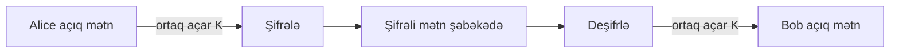
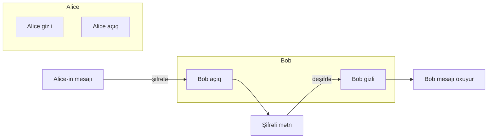
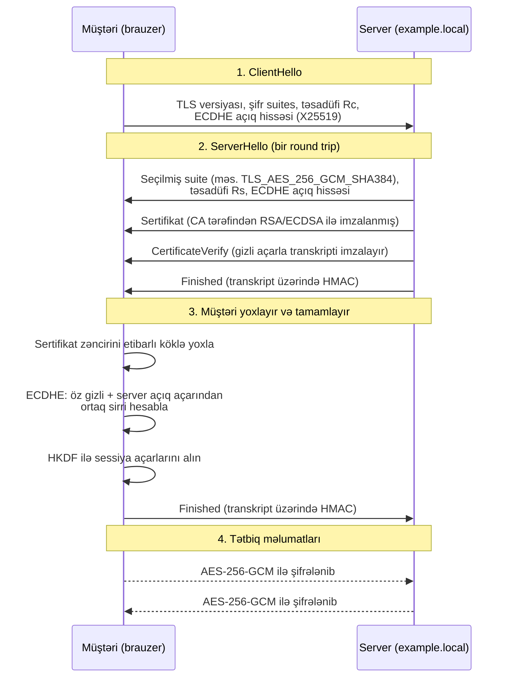
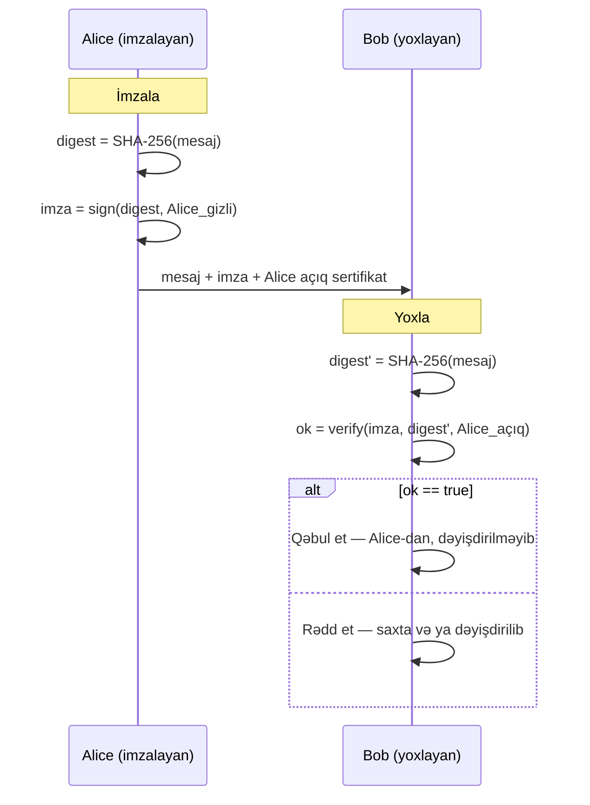

# Kriptoqrafiyanın əsasları

Kriptoqrafiya mücərrəd riyaziyyat dərsi deyil — bu, planetdə ən çox istifadə olunan təhlükəsizlik texnologiyasıdır. Brauzerdə kilid işarəsini gördüyünüz hər dəfə, parol ilə Wi-Fi-ya qoşulduqda, BitLocker ilə şifrələnmiş noutbukun kilidini açdıqda, imzalanmış git commit göndərdikdə, `dc01.example.local`-a RDP ilə qoşulduqda və ya kart ilə ödəniş etdikdə, kriptoqrafiya işləyir. Onsuz internet — hər kafe Wi-Fi-nin qonşusunun e-poçtunuzu oxuduğu açıq yayım sistemidir.

Kriptoqrafiyanın işi etibarsız kanalın üstündə dörd zəmanət verməkdir:

- **Məxfilik (Confidentiality)** — yalnız nəzərdə tutulan alıcı mesajı oxuya bilər.
- **Bütövlük (Integrity)** — mesaj nəqliyyatda və ya saxlanmada dəyişdirilməyib.
- **Autentifikasiya (Authentication)** — qarşı tərəf həqiqətən iddia etdiyi şəxsdir.
- **İnkaredilməzlik (Non-repudiation)** — göndərən daha sonra imzaladığı mesajı göndərmədiyini iddia edə bilməz.

Müasir kriptoqrafiya bu dörd zəmanəti üç əsas ailə vasitəsilə təqdim edir — simmetrik şifrələr, asimmetrik şifrələr və heşləmə funksiyaları — və onlar TLS, IPsec, SSH, Kerberos, S/MIME, Signal kimi protokollarda birləşdirilir. Bu dərs həmin ilkin elementlərin mühəndis baxışından turudur: onlar nə edir, harada işlənilir, və insident analizlərində hansı səhvlər təkrarlanır.

## Ötürməməli olduğunuz terminologiya

Bu terminlər hər kripto söhbətində keçir. Onların səhv işlədilməsi mühəndislərin bir-birini anlamamasının səbəbidir.

| Termin | Bir sətirlik tərif | Konkret nümunə |
|---|---|---|
| **Açıq mətn (Plaintext)** | Şifrələnmədən əvvəl oxunan məlumat. | `SELECT * FROM users;` |
| **Şifrələnmiş mətn (Ciphertext)** | Şifrələndikdən sonra qarışmış nəticə. | `4f8b2a91...e7c3` (təsadüfi görünür) |
| **Açar (Key)** | Şifrələmə / deşifrləmənin işləməsini təmin edən sirr. | 256-bitlik AES açarı. |
| **Şifrə (Cipher)** | Açıq mətni ↔ şifrəli mətnə çevirən alqoritm. | AES, ChaCha20. |
| **Alqoritm** | Tam riyazi spesifikasiya (şifrə + rejim + parametrlər). | `AES-256-GCM`. |
| **Kodlaşdırma (Encode)** | Geri qaytarıla bilən format çevrilməsi — **sirr yoxdur**. | Base64, UTF-8. Təhlükəsizlik *deyil*. |
| **Şifrələmə (Encrypt)** | Açar ilə çevirmə — yalnız açarla geri qaytarılır. | Faylın AES-CBC şifrələnməsi. |
| **Confusion** | Şifrələnmiş mətn açarı aşkar etməməlidir. | AES-in daxilindəki S-box substitusiyası. |
| **Diffusion** | Açıq mətnin bir bitinin dəyişdirilməsi şifrələnmiş mətnin çox bitini dəyişir. | AES raund qarışdırılması. |
| **IV** (İnisializasiya vektoru) | Eyni açıq mətnin hər dəfə fərqli şifrələnməsi üçün təsadüfi giriş. | AES-CBC üçün 128-bitlik IV. |
| **Nonce** | "Bir dəfə işlədilən rəqəm" — hər mesaj üçün unikal, mütləq sirr olmaq məcburiyyətində deyil. | AES-GCM üçün 96-bitlik nonce. |
| **Salt** | Eyni parollar fərqli heşlənsin deyə parol heşinə qarışdırılan təsadüfi dəyər. | bcrypt üçün hər istifadəçiyə 16 baytlıq salt. |

Kodlaşdırma/şifrələmə fərqi başlanğıc mühəndisləri daim çaşdırır. Base64 **şifrələmə deyil**. `SGVsbG8gd29ybGQ=`-ni görən hər kəs onu bir komanda ilə geri çevirə bilər. Əgər ticket-də "parol Base64-də kodlaşdırılıb" yazılıbsa, onu açıq mətn kimi qəbul edin.

## Çox qısa tarix

Kriptoqrafiya tarixi — mesajları gizlətməyə çalışan insanlarla onları oxumağa çalışanlar arasında 2000 illik silah yarışıdır. Erkən şifrələr *gizli alqoritmə* əsaslanırdı; müasir kriptoqrafiya isə *açıq alqoritmlərə və gizli açarlara* əsaslanır — buna Kerckhoffs prinsipi deyilir. Enigma-dan aşağı olanların hər biri yalnız tarixi marağa malikdir; özünüz heç vaxt yazmayın və təhlükəsizlik üçün istifadə etməyin.

- **~E.ə. 50 — Sezar şifri.** Hər hərfi 3 mövqe sürüşdür. Tezlik analizi ilə saniyələrdə qırılır.
- **1553 — Vigenère şifri.** Təkrarlanan açar sözlü Sezar şifri. Təxminən 300 il dayanıb, 1863-cü ildə Kasiski tərəfindən qırılıb.
- **I / II Dünya müharibələri — Enigma, Purple, SIGABA.** Elektro-mexaniki rotor maşınları. Enigma Bletchley Park-da Rejewski, Turing və həmkarları tərəfindən qırılıb — bu, kompüter elminin doğuşu hesab olunur.
- **1976 — Diffie–Hellman.** İlk açıq açar mübadiləsi. "İki yad adam açıq xəttdə necə sirr razılaşdıra bilər?" problemini həll etdi.
- **1977 — RSA.** İlk praktik açıq-açar sistemi.
- **1991 — PGP (Zimmermann).** Açıq-açar kriptoqrafiyasını e-poçta gətirdi.
- **1994–1999 — SSL 1/2/3 → TLS 1.0.** Kriptoqrafiya veb-ə gəlir.
- **2001 — AES standartlaşdırıldı.** Rijndael NIST müsabiqəsini udub DES-i əvəz etdi.
- **2008 — ChaCha20, sonra Poly1305.** Müasir stream şifri + MAC, təkcə proqram təminatlı platformalarda (mobil) sürətli.
- **2018 — TLS 1.3 (RFC 8446).** Qırılmış hər şeyi çıxardı, forward secrecy-ni məcburi etdi.
- **İndi — Post-kvant kriptoqrafiya.** NIST gələcəkdə kvant kompüterinə qarşı davam etmək üçün Kyber (ML-KEM) və Dilithium (ML-DSA) standartlaşdırır.

Xronologiyadan dərs sadədir: **iyirmi il əvvəl "güclü" sayılan kriptoqrafiya bu gün qırılıb.** Açar ölçüləri böyüyür, alqoritmlər köhnəlir, və qurduğunuz hər sistem tam yenidən yazılmadan yeni ilkin elementlərə keçməyə imkan verməlidir.

## Simmetrik kriptoqrafiya

Simmetrik kriptoqrafiya sadə haldır — bir ortaq gizli açar, həm şifrələmə, həm də deşifrləmə üçün istifadə olunur. Sürətli, yaddaşa qənaətlidir və böyük həcmli məlumatlar üçün idealdır: disk şifrələməsi, VPN tunelləri, TLS-in daxilindəki real tətbiq məlumatları.



Bütün sistem açar sızdıqda çökür — `K`-ya sahib hər kəs hər şeyi oxuyur. Ona görə də simmetrik kriptoqrafiyanın çətin hissəsi riyaziyyat deyil, **açar paylanmasıdır**: Alice ilə Bob görüşmədən `K` üzərində necə razılaşa bilərlər? Bu problem asimmetrik kriptoqrafiya ilə həll olunur (növbəti bölmə).

### Əsas simmetrik alqoritmlər

| Alqoritm | Açar ölçüsü | Status | Qeydlər |
|---|---|---|---|
| **AES-128 / AES-256** | 128 və ya 256 bit | Tövsiyə olunur | Hər yerdə standart. Bütün müasir CPU-larda aparat sürətləndirilir (`AES-NI`). |
| **ChaCha20-Poly1305** | 256 bit | Tövsiyə olunur | Daxili MAC-lı stream şifri. AES-NI olmayan telefon və qurğularda seçilir. |
| **3DES** | 168-bit effektiv | Köhnəlib | 2023-dən sonra NIST tərəfindən qadağan olundu. Blok ölçüsü çox kiçikdir (`Sweet32` hücumu). |
| **DES** | 56 bit | Qırılıb | Müasir aparatda saatlar içində tam şəkildə sındırılır. Heç vaxt istifadə etməyin. |
| **RC4** | Dəyişkən | Qırılıb | Keystream-də qərəzlər. TLS-dən çıxarıldı. |
| **Blowfish / Twofish** | 128–448 bit | Miras | Riyaziyyat yaxşıdır, AES tərəfindən əvəz olunub. |

### Blok şifri və stream şifri

**Blok şifri** sabit ölçülü hissələri şifrələyir (AES üçün 16 bayt). **Stream şifri** psevdo-təsadüfi keystream yaradıb açıq mətnlə bayt-bayt XOR edir. AES blok şifridir; ChaCha20 isə stream şifridir. Əslində müasir AES tətbiqlərinin çoxu AES-i stream kimi işləməsi üçün bir *rejimə* bağlayır — aşağı baxın.

### Əməliyyat rejimləri — insanların səhv etdiyi şey

Xam blok şifri yalnız bir bloku şifrələyir. Daha böyük məlumat üçün **əməliyyat rejimi** lazımdır. Yanlış rejim seçmək yaxşı şifrələrin necə qırıldığıdır.

| Rejim | Nə edir | İstifadə? |
|---|---|---|
| **ECB** (Electronic Codebook) | Hər 16 baytlıq bloku müstəqil şifrələ. | **Yox.** Eyni açıq mətn blokları eyni şifrəli mətn verir — məşhur "ECB penguin" şəkli Linux penqvininin konturunun şifrələmədən sonra hələ də göründüyünü göstərir. |
| **CBC** (Cipher Block Chaining) | Hər blok şifrələmədən əvvəl əvvəlki şifrəli mətnlə XOR edilir. Təsadüfi IV tələb edir. | Miras. Yanlış MAC ilə birləşdirildikdə padding-oracle hücumlarına həssasdır. |
| **CTR** (Counter) | Sayğacı şifrələyərək blok şifrini stream şifrinə çevirir. | Yaxşı, amma öz-özünə bütövlük vermir. |
| **GCM** (Galois/Counter Mode) | CTR + daxili autentifikasiya teq-i (AEAD). | **Bəli.** TLS, SSH, disk şifrələməsi üçün standart. |
| **CCM** | Counter rejimi + CBC-MAC, AEAD. | Məhdud qurğularda və Wi-Fi-da (WPA2) istifadə olunur. |
| **XTS** | Disk sektorları üçün iki açarlı rejim. | Tam disk şifrələməsi üçün **bəli** — BitLocker, LUKS, FileVault. |

Müasir qayda: **AEAD rejimlərindən istifadə edin** (Associated Data ilə Authenticated Encryption) — AES-GCM və ya ChaCha20-Poly1305. AEAD bir ilkin elementdə həm məxfilik, həm də bütövlük verir ki, səhvən autentifikasiya olunmayan şifrələməyə yol verməyəsiniz.

## Asimmetrik kriptoqrafiya

Asimmetrik kriptoqrafiya hər tərəfə riyazi olaraq əlaqəli iki açar istifadə edir: dünya ilə paylaşa biləcəyiniz **açıq açar** və kredit kartı PIN-i kimi qoruduğunuz **gizli açar**. Açıq açarla şifrələnən hər şey yalnız uyğun gizli açarla deşifrlənə bilər — və tərs istiqamətdə, gizli açarla imzalanan hər şey açıq açara sahib olan hər kəs tərəfindən yoxlanıla bilər.



Bu, simmetrik kriptoqrafiyanın həll edə bilmədiyi problemi həll edir: **Alice ilə Bob-un əvvəlcədən sirr paylaşması lazım deyil.** Alice sadəcə Bob-un açıq açarını kataloqdan (və ya TLS sertifikatından) götürüb ona şifrələyir.

### Əsas asimmetrik alqoritmlər

| Alqoritm | Açar ölçüsü | İstifadə |
|---|---|---|
| **RSA-2048** | 2048-bit modul | Bu gün minimum qəbul edilən. TLS sertifikatları, kod imzası, S/MIME. |
| **RSA-4096** | 4096-bit modul | Daha yüksək təhlükəsizlik rezervi, daha yavaş. Kök CA-lar. |
| **ECDSA** (P-256, P-384) | 256 / 384-bit elliptik əyri | Eyni təhlükəsizlik üçün RSA-dan sürətli və kiçikdir. TLS, kod imzası. |
| **Ed25519** | 256-bit Edwards əyrisi | SSH açarları, JWT `EdDSA`, müasir TLS üçün yeni standart. |
| **ECDH / ECDHE** | 256-bit+ | Açar mübadiləsi — şifrələmə deyil. "Açar mübadiləsi" bölməsinə baxın. |
| **Kyber (ML-KEM)** | — | Post-kvant açar inkapsulyasiyası, 2024-də NIST tərəfindən standartlaşdırıldı. |

### Niyə asimmetriki hər şey üçün istifadə etmirik?

Çünki o, **simmetrikdən 100–1000 dəfə yavaşdır** və nəticə girişdən çox böyükdür. 1 GB video faylı RSA ilə şifrələmək ağıldan kənardır. Real sistemlərdə asimmetrik kriptoqrafiyanı yalnız qısa simmetrik açarı mübadilə etmək üçün istifadə edirlər, sonra əsas məlumatı AES və ya ChaCha20 ilə şifrələyirlər. Bu, **hibrid model**-dir — və TLS də məhz bunu edir.

## Hibrid praktikada (TLS handshake mini-baxış)

TLS 1.3 handshake, simmetrik, asimmetrik və heşləmənin birləşdiyi yerdir. Brauzer `https://example.local`-a qoşulduqda bu təxminən 1 rounde-ə icra olunur:



Hər ilkin elementin işi:

- **ECDHE** (asimmetrik) — müştəri ilə server hər biri müvəqqəti açar cütü yaradır və açıq hissələri mübadilə edir; hər ikisi müstəqil olaraq eyni ortaq sirri əldə edir. Forward secrecy buradan gəlir.
- **Sertifikat + imza** (asimmetrik) — server handshake transkriptini öz uzunmüddətli gizli açarı ilə imzalayır. Müştəri sertifikat zəncirini etibar etdiyi CA-ya qədər yoxlayır. Bu, serveri autentifikasiya edir.
- **HKDF + SHA-384** (heşləmə) — ortaq sirri və transkripti faktiki sessiya açarlarına qarışdırır.
- **AES-256-GCM** (simmetrik AEAD) — handshake-dən sonra hər tətbiq baytını şifrələyir və autentifikasiya edir.

Diqqət edin: bahalı asimmetrik riyaziyyat yalnız *bir dəfə* başlanğıcda işləyir; qalan sessiya ucuz simmetrik AES-GCM-dir. Bu, praktikada hibrid modeldir və internet üzrə ən vacib kriptoqrafik protokoldur.

## Heşləmə funksiyaları

Heşləmə funksiyası hər hansı girişi — bir baytdan bir qiqabaytaya qədər — qəbul edib sabit ölçülü barmaq izi (**digest**) yaradır. Yaxşı kriptoqrafik heşləmə funksiyalarının üç xüsusiyyəti var:

1. **Ön-şəkil müqaviməti (Pre-image resistance)** — hash verilmişsə, onu yaradan girişi tapa bilməzsən.
2. **İkinci ön-şəkil müqaviməti** — giriş verilmişsə, eyni hash-a malik *fərqli* giriş tapa bilməzsən.
3. **Toqquşma müqaviməti (Collision resistance)** — *hər hansı* iki eyni hash-lı giriş tapa bilməzsən.

Heşlər **birtərəflidir** — "heş-i deşifrlə" əməliyyatı yoxdur. Sizə "MD5 deşifrləyən" proqram satanlar əslində əvvəlcədən hesablanmış ümumi sətirlərin axtarışını satırlar.

| Alqoritm | Digest ölçüsü | Status | İstifadə |
|---|---|---|---|
| **MD5** | 128 bit | Qırılıb (2004) | Heç vaxt, təhlükəsizlik olmayan checksum kimi istisna ilə. |
| **SHA-1** | 160 bit | Qırılıb (2017, SHAttered) | Yeni sistemlər üçün heç vaxt. Git ondan uzaqlaşır. |
| **SHA-256 / SHA-512** | 256 / 512 bit | Tövsiyə olunur | Ümumi təyinatlı standart, TLS, kod imzası. |
| **SHA-3** | 224–512 bit | Tövsiyə olunur | Fərqli dizayn (Keccak), SHA-2 qırılmalarına qarşı ehtiyat. |
| **BLAKE3** | 256 bit | Tövsiyə olunur | SHA-256-dan sürətli, paralel, müasir dizayn. |
| **bcrypt / scrypt / Argon2** | Dəyişkən | Tövsiyə olunur | **Parol** heşləməsi — qəsdən yavaş, yaddaş-sərt. |

Parolları SHA-256 ilə heşləməyin. Parol heşləməsi brute-force-a qarşı **qəsdən yavaşlığa** ehtiyac duyur; bcrypt, scrypt və ya (üstünlük verilir) Argon2id istifadə edin.

### Konkret nümunə — faylın yoxlanması

Hər iki əməliyyat sistemi daxili SHA-256 alətləri ilə gəlir.

**Windows (PowerShell):**

```powershell
Get-FileHash -Algorithm SHA256 "C:\Downloads\Windows11.iso"
```

Çıxış:

```
Algorithm   Hash                                                              Path
---------   ----                                                              ----
SHA256      E7A1F2C3...9B4D5E6F                                               C:\Downloads\Windows11.iso
```

**Linux / macOS / WSL:**

```bash
sha256sum /downloads/Windows11.iso
# və ya macOS-da
shasum -a 256 /downloads/Windows11.iso
```

Çıxış:

```
e7a1f2c3...9b4d5e6f  /downloads/Windows11.iso
```

Digest-i təchizatçının HTTPS səhifəsində dərc olunanla bayt-bayt müqayisə edin. Uyğun gəlirsə, fayl nəqliyyatda xarab olmayıb *və* manipulyasiya edilməyib. Bir bayt belə fərqlənsə, yüklənməni atın — yaxşı heş hamısı və ya heçnədir. Linux ISO mirror-ları, Windows yeniləmə paketləri və Docker image qatları bu üsulla bütövlüyü yoxlayır.

## Rəqəmsal imzalar

Rəqəmsal imza eyni vaxtda iki suala cavab verir: **bunu kim göndərdi** və **yolda dəyişdirilibmi**. Bu, əl ilə yazılmış imzanın asimmetrik ekvivalentidir, lakin riyazi olaraq məcburiləşdirilə bilər.



İmzalamaq həmişə `heş + gizli açarla asimmetrik şifrələmə`-dir. Mesajı birbaşa heç vaxt imzalamırsınız — bu yavaş olardı və strukturu sızdırardı. Əvvəlcə heşləyirsiniz, sonra digest-i imzalayırsınız.

### Rəqəmsal imzaları artıq gördüyünüz yerlər

- **Microsoft Authenticode.** Windows-da hər imzalanmış `.exe` və `.dll` nəşriyyatın imzasını daşıyır. `signtool verify /pa installer.exe` onu yoxlayır. İmzalanmamış ikililər SmartScreen xəbərdarlıqları törədir.
- **Git commit / tag imzalaması.** `git commit -S -m "fix"` commit-i imzalamaq üçün GPG və ya SSH açarınızı istifadə edir. GitHub "Verified" nişanı göstərir; `EXAMPLE\` CI-niz imzalanmamış commit-ləri rədd edə bilər.
- **JWT `RS256` / `ES256`.** API-nizin verdiyi autentifikasiya token-i header + payload + imzadır. API server imzanı naşirin açıq açarı ilə yoxlayır — DB axtarışı lazım deyil.
- **CI-də kod imzalaması.** Paketlər (`.msi`, `.appx`, `.deb`, cosign ilə konteyner image-ləri, PowerShell modulları) build pipeline tərəfindən imzalanır; endpoint yalnız imza etibarlı naşirə qədər zəncirlənirsə quraşdırır.
- **TLS sertifikatları.** CA server-in açıq açarını imzalayır; brauzeriniz `https://example.local`-ı yalnız bu imza etibar etdiyi köklə zəncirlənirsə qəbul edir.

İmza uğursuzluğu heç vaxt "bəlkə" deyil — ya yoxlanır, ya yox. Yoxlama uğursuz olursa, artefaktı düşmən kimi qəbul edin.

## Açar mübadiləsi və PFS

**Açar mübadiləsi** iki tərəfin həmin simmetrik açarı şəbəkədə göndərmədən eyni açara sahib olmasının mexanizmidir. **Diffie–Hellman** (1976) birincidir: hər iki tərəf gizli rəqəm yaradır, ondan açıq rəqəm alır (klassik DH-də `g^a mod p`, ECDH-də isə elliptik əyri üzərində nöqtə), açıq hissələri mübadilə edir, və hər biri öz gizli və qarşı tərəfin açıq açarından ortaq sirri hesablayır. Passiv dinləyici hər iki açıq hissəni görür, lakin sirri bərpa edə bilmir — bu, diskret loqarifm çətin problemidir.

**Perfect Forward Secrecy (PFS)** açar mübadiləsi açarlarının **müvəqqəti** olmasını bildirir — hər sessiya üçün yeni cüt, sessiya bitdikdə atılır. Gələn il server-in uzunmüddətli gizli açarı oğurlansa belə, keçmişdə yazılmış trafik deşifrlənə bilməz, çünki həmin trafik əslində müvəqqəti açarlarla qorunurdu və onlar artıq yoxdur. TLS-də `DHE` və `ECDHE` şifr suites PFS təmin edir; köhnə `RSA` açar-nəqli suites isə vermir — məhz ona görə TLS 1.3 onları çıxarır.

Trafiki yazıb "kriptoqrafiya ilə sonra məşğul olarıq" demək olmaz. PFS ilə qərar handshake vaxtında alınır; PFS olmadan gələcəkdə sızmaq keçmişi deşifrlə eyniləşir.

## Praktik tapşırıqlar

Dörd qısa məşq. Hər lab maşında edin.

### 1. Windows və Linux-da faylı heşlə

**Windows PowerShell:**

```powershell
# Test faylı yarat
"Salam, example.local" | Out-File -FilePath C:\temp\hello.txt -Encoding utf8

# Heşlə
Get-FileHash -Algorithm SHA256 C:\temp\hello.txt
Get-FileHash -Algorithm MD5    C:\temp\hello.txt   # yalnız nümayiş — MD5-i təhlükəsizlik üçün istifadə etmə
```

**Linux / WSL:**

```bash
echo "Salam, example.local" > /tmp/hello.txt
sha256sum /tmp/hello.txt
md5sum    /tmp/hello.txt         # yalnız nümayiş
```

Faylda bir simvolu dəyişdirib yenidən icra edin. Bütün digest dəyişir — bu, diffusion prinsipidir.

### 2. ssh-keygen ilə RSA və ya Ed25519 açar cütü yaradın

Windows-da (PowerShell ilə OpenSSH) və Linux-da eyni şəkildə işləyir:

```bash
# Klassik RSA
ssh-keygen -t rsa -b 4096 -C "e.mammadov@example.local" -f ~/.ssh/id_example_rsa

# Müasir, qısa, sürətli
ssh-keygen -t ed25519 -C "e.mammadov@example.local" -f ~/.ssh/id_example_ed25519
```

İki fayl alırsınız: `id_example_ed25519` (**gizli** açar — heç vaxt paylaşmayın) və `id_example_ed25519.pub` (**açıq** açar — bunu serverlərdə `~/.ssh/authorized_keys`-ə əlavə edin). Onları yoxlayın:

```bash
ssh-keygen -l -f ~/.ssh/id_example_ed25519.pub      # barmaq izi
ssh-keygen -y -f ~/.ssh/id_example_ed25519          # gizlidən açığı al
```

### 3. Real TLS sertifikatını brauzerdə oxuyun

1. Hər hansı HTTPS saytına gedin — `https://example.com`.
2. Kilidə klikləyin → **Bağlantı təhlükəsizdir** → **Sertifikat etibarlıdır** (Chrome) / **Show Certificate** (Firefox).
3. Tapın:
   - **Subject** — sertifikat kimi identifikasiya edir.
   - **Issuer** — hansı CA imzalayıb.
   - **Public Key Info** — adətən `RSA 2048` və ya `ECDSA P-256`.
   - **Signature Algorithm** — adətən `sha256WithRSAEncryption` və ya `ecdsa-with-SHA384`.
   - **Validity** — verilmə və bitmə tarixləri. Əksər müasir sertifikatlar 90 gün (Let's Encrypt) və ya maksimum 1 il yaşayır.

Qeyd edin: sertifikatın açıq açar alqoritmi (sertifikatın açarının nə olduğu) və imza alqoritmi (CA-nın sertifikatı imzalamaq üçün istifadə etdiyi) bir-birindən müstəqildir — server-in RSA-yönlü zəncirlə imzalanmış ECDSA açarı ola bilər.

### 4. OpenSSL AES-256-GCM ilə faylı şifrələyin və deşifrləyin

OpenSSL Linux-da və müasir Windows-da (`C:\Windows\System32\OpenSSL`, və ya `winget install OpenSSL` ilə) mövcuddur.

```bash
# Şifrələ
openssl enc -aes-256-gcm \
    -pbkdf2 -iter 600000 \
    -in  secret.txt \
    -out secret.enc \
    -pass pass:CorrectHorseBatteryStaple

# Deşifrlə
openssl enc -aes-256-gcm -d \
    -pbkdf2 -iter 600000 \
    -in  secret.enc \
    -out secret.out \
    -pass pass:CorrectHorseBatteryStaple

diff secret.txt secret.out   # çıxış yoxdur = eynidir
```

`-pbkdf2 -iter 600000` parolu yavaş açar-çıxarış funksiyası ilə düzgün açara çevirir. Bu bayraqlar olmadan OpenSSL köhnəlmiş, sürətli çıxarışa düşür və şifrəli mətn zəif qorunur. Həmişə onları daxil edin.

## İşlənilmiş nümunə — example.local üçün fayl paylaşımının qorunması

Şirkət fayl paylaşımı üç kripto qatı tələb edir. Hər biri üçün ilkin element seçin.

**Ssenari.** `FS01.example.local` `\\FS01\Projects`-i host edir. Yalnız `EXAMPLE\GRP-Engineers`-də olan domen istifadəçiləri oxuya bilməlidir. Disk oğurlansa, hücumçu LAN-ı dinləsə, və ya yaramaz admin fayl serverini təqlid etməyə çalışsa məlumat sirr qalmalıdır.

| Təhdid | Nəzarət | İlkin element |
|---|---|---|
| Disk server raf-dan oğurlandı | Məlumat volume-da BitLocker (Windows) və ya LUKS2 (Linux) | **AES-256-XTS** saxlanmada |
| Hücumçu eyni VLAN-da trafiki dinləyir | SMB3 şifrələməsi (`Set-SmbServerConfiguration -EncryptData $true`) | **AES-128-GCM** / AES-128-CCM nəqliyyatda |
| Fayl serverinin imitasiyası | DC-yə qarşı Kerberos qarşılıqlı autentifikasiyası | **AES** sessiya açarları + **HMAC-SHA-256** |
| Paylaşımdakı hər hansı konfiqurasiya faylının bütövlüyü | Dərc etməzdən əvvəl admin tərəfindən SHA-256 + imza | **SHA-256 + RSA / Ed25519** |
| Sabah KDC-nin uzunmüddətli açarı sızarsa | Kerberos PFS deyil — qısa ticket ömrü + tez-tez açar rotasiyası ilə azaldın | N/A (qalıq riski qəbul et) |

Dörd müstəqil kripto ilkin elementin necə bir müdafiə edilə bilən sistemə yığıldığına diqqət edin: disk üçün AES-XTS, xətt üçün AES-GCM, autentifikasiya üçün Kerberos ticket-lər, dərc edilmiş konfiqurasiyanın bütövlüyü üçün SHA-256 + imzalar. Birini buraxsanız, boşluq qalır.

## Tipik səhvlər

Real kriptoqrafik alqoritmlər yetkin olduğu halda. Real insidentlərin çoxu bu mühəndislik səhvlərindən yaranır.

- **Qaynaq kodunda sabit kodlanmış açarlar.** Açarlar KMS, Vault və ya HSM-də olmalıdır, `config.py`-də yox. Bir açar git repo-ya düşdükdən sonra onu əbədi olaraq açıq hesab edin — onu rotasiya etmək və tarixi yenidən yazmaq sizi xilas etməyəcək.
- **Parollar üçün MD5 və ya SHA-1 istifadə etmək.** Hətta bcrypt artıq köhnə tövsiyədir; **Argon2id** cari standartdır. Və həmişə **salt** istifadə edin.
- **Eyni açarla IV və ya nonce-ni təkrar istifadə etmək.** AES-GCM üçün bu faciədir — tək bir nonce toqquşması autentifikasiya açarını sızdırır və iki açıq mətnin XOR-unu aşkar edir. Sayğac və ya 96-bitlik təsadüfi nonce istifadə edin, heç vaxt təkrarlamayın.
- **Real məlumat üzərində ECB rejimi.** Əgər şifrələdiyiniz şeyin konturunu görə bilirsinizsə, əməliyyat rejiminiz qırılıb. Əvəzində GCM və ya XTS istifadə edin.
- **Öz kriptoqrafiyanızı yazmaq.** Alqoritm nadir hallarda ən zəif həlqədir; *onu tətbiqiniz* — odur. libsodium, Windows CNG, .NET `System.Security.Cryptography`, və ya OpenSSL EVP interfeysindən istifadə edin — dərslik deyil.
- **"Yalnız indilik" öz-özünə imzalanmış sertifikata etibar etmək.** O heç vaxt dəyişdirilmir. İlk gündən öz daxili CA-dan və ya Let's Encrypt-dən istifadə edin.
- **Açar rotasiyası yoxdur, HSM yoxdur.** Əbədi yaşayan açarlar sonda sızdırır. Cədvəllə rotasiya edin (SSH host açarları: hər bir neçə il; TLS: 90 gündən 1 ilə qədər; simmetrik: məlumat həcmi ilə idarə olunur).
- **Base64-ü şifrələmə kimi qəbul etmək.** O, şifrələmə deyil. Əgər sirr lazımdırsa, onu şifrələyin.
- **"İşləməsi üçün" sertifikat yoxlamasını keçmək.** `curl -k`, `CURLOPT_SSL_VERIFYPEER = false`, `TrustManager { return true }` — bunların hər biri MITM-ə dəvətdir.
- **Kvantın başqasının problemi olduğunu düşünmək.** Uzun ömürlü məlumatlar (milli ID, tibbi qeydlər, dövlət sirləri) artıq post-kvant KEM-də bükülməlidir. Hücumçular bu gün şifrəli mətni yığıb sabah deşifrləyəcəklər.

## Əsas nəticələr

- Kriptoqrafiya dörd zəmanət verir — məxfilik, bütövlük, autentifikasiya, inkaredilməzlik — və real sistemlərə hər dördü də lazımdır.
- Üç ilkin element ailəsi işi görür: böyük məlumat üçün simmetrik şifrələr, identity və açar mübadiləsi üçün asimmetrik şifrələr, və bütövlük üçün heşləmə funksiyaları.
- Simmetrik (AES-GCM, ChaCha20-Poly1305) sürətlidir; asimmetrik (RSA, ECC, Ed25519) yavaşdır. TLS kimi hibrid protokollar hər ikisindən ən yaxşısını istifadə edir.
- Xam blok şifrlərini heç vaxt istifadə etməyin — həmişə AEAD rejimi seçin. ECB-ni heç vaxt istifadə etməyin.
- Heş ≠ şifrələmə. Kodlaşdırma ≠ şifrələmə. Ticket açmadan əvvəl fərqi bilin.
- MD5 və SHA-1 qırılıb; SHA-256, SHA-3 və BLAKE3 standartlardır.
- Rəqəmsal imzalar = heş + gizli açarla asimmetrik şifrələmə. Onlar hər real "etibar" qərarının (imzalanmış kod, imzalanmış commit-lər, TLS sertifikatları) əsasıdır.
- 2026-da forward secrecy müzakirə edilməzdir — `ECDHE` şifr suites və TLS 1.3 istifadə edin.

## İstinadlar

- NIST SP 800-175B Rev. 1 — *Guideline for Using Cryptographic Standards in the Federal Government: Cryptographic Mechanisms.* https://csrc.nist.gov/publications/detail/sp/800-175b/rev-1/final
- NIST SP 800-57 Part 1 Rev. 5 — *Recommendation for Key Management.* https://csrc.nist.gov/publications/detail/sp/800-57-part-1/rev-5/final
- RFC 8446 — *The Transport Layer Security (TLS) Protocol Version 1.3.* https://www.rfc-editor.org/rfc/rfc8446
- RFC 5869 — *HMAC-based Extract-and-Expand Key Derivation Function (HKDF).* https://www.rfc-editor.org/rfc/rfc5869
- OWASP — *Cryptographic Storage Cheat Sheet.* https://cheatsheetseries.owasp.org/cheatsheets/Cryptographic_Storage_Cheat_Sheet.html
- OWASP — *Transport Layer Security Cheat Sheet.* https://cheatsheetseries.owasp.org/cheatsheets/Transport_Layer_Security_Cheat_Sheet.html
- Jean-Philippe Aumasson — *Serious Cryptography, 2nd Edition* (No Starch Press, 2024). Mütəxəssislərin standart kitabı.
- Mozilla — *Server Side TLS configuration guidelines.* https://wiki.mozilla.org/Security/Server_Side_TLS
- NIST — *Post-Quantum Cryptography standards (FIPS 203 ML-KEM, FIPS 204 ML-DSA, FIPS 205 SLH-DSA).* https://csrc.nist.gov/projects/post-quantum-cryptography
