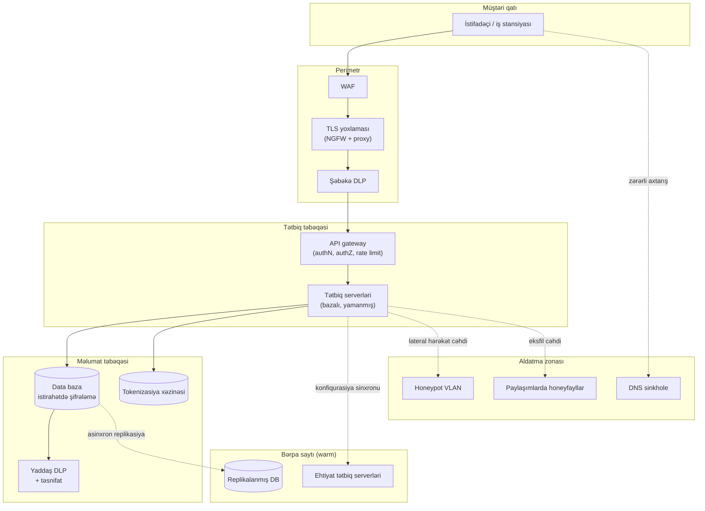

# Müəssisə Təhlükəsizlik Arxitekturası

## Nə üçün vacibdir

Yaxşı işləyən bir noutbuk hələ müəssisə deyil. İki sistemin bir-biri ilə danışması lazım gəldiyi andan kimsə qərar verməlidir ki, onlar adlar, ünvanlar, şəxsiyyət, şifrələmə, jurnallar və biri uğursuz olduqda nə baş verəcəyi barədə necə razılaşacaqlar. Bunu beş yüz istifadəçi, üç data mərkəzi, iyirmi SaaS kirayəçisi, bir neçə partnyor inteqrasiyası və iki yurisdiksiyadan izləyən bir tənzimləyici ilə çarpın — qərarlar artıq lokal seçimlər olmaqdan çıxır və arxitektura olur.

Müəssisə təhlükəsizlik arxitekturası bu qərarları yazılı, izlənilən və audit oluna bilən sxemə çevirən intizamdır. Bu, yeni Windows serverinin admin parolu ilə `Yay2026` kimi göndərilməsinin qarşısını alan şeydir, çünki baza başqa cür deyirdi. Bu, maliyyə bazasının hava limanında oğurlanmış noutbukdan sızmamasını təmin edir, çünki istirahətdəki məlumat şifrələnmişdi və panoya DLP tərəfindən nəzarət edilirdi. Bu, optik kabelin kəsilməsi əsas data mərkəzini söndürdükdə biznesin işləməsini davam etdirmək deməkdir, çünki isti sayt təyin edilmiş, test edilmiş və hazır idi.

Arxitekturanı səhv qursanız, hər digər nəzarət üzrə seçim məsələsidir. Yamanmamış serverin qarşısındakı gözəl tənzimlənmiş təhlükəsizlik duvarı pozulmanı gözləmə zalıdır. Adları təsadüfi olan və subnet'ləri üst-üstə düşən xostlardan gələn SIEM heç kəsin araşdıra bilmədiyi xəbərdarlıqlar yaradır. Həssas sütunlar etiketlənməmiş bir bazaya qarşı yazılmış DLP qaydası heç nəyi tutmur. Arxitektura skeletdir; fərdi nəzarətlər əzələdir; skeleti çıxardın və bütün bədən çökür.

Bu dərs arxitekturanın qatlarını təyin edilmiş şəkildə gedir — konfiqurasiyaların necə müəyyən edilib düzgün saxlanıldığı, məlumatın ömür boyu necə qorunduğu, coğrafiya və tənzimləmənin dizayna necə məhdudiyyət qoyduğu, bina dayanmayanda saytın necə ayaq üstə qaldığı, kriptoqrafik sərhədlərin pozulmadan necə yoxlanıldığı və aldatmanın necə hücumçunun kəşfiyyatını müdafiəçinin erkən xəbərdarlıq sisteminə çevirdiyi. Nümunələr uydurma `example.local` müəssisəsini və `EXAMPLE\` domenini istifadə edir.

Təkrarlanan mövzu budur ki, təhlükəsizlik arxitekturası qurulmamışdan əvvəl yazılır. Bu dərsdəki hər element — baza, adlandırma qaydası, subnet planı, təsnifat sxemi, bərpa-saytı tier'i, TLS-yoxlama siyasəti, honeynet yerləşdirməsi — əvvəlcə sənəd kimi mövcud olur. Sənəd nəzərdən keçirilir, razılaşdırılır və versiyalanır. Mühəndislik ikinci gəlir və sənədin dediyini icra edir. Bu sıranı tərsinə çevirən komandalar — mühəndislik birinci, sənəd "vaxtımız olanda" — dizayn edilən sistemdən daha çox faktiki mövcud olan sistemlə nəticələnirlər və ikisi arasındakı boşluq auditlərin uğursuz olduğu və pozulmaların yaşadığı yerdir.

## Əsas anlayışlar

Müəssisə təhlükəsizlik arxitekturası qatlı problemdir. Heç bir tək nəzarət — heç bir mükəmməl baza, heç bir şifrələmə alqoritmi, heç bir honeypot — özü-özlüyündə kifayət deyil. Aşağıdakı bölmələr arxitektorun qurğuları dizayn edəcəyi sıra ilə qatları əhatə edir: əvvəlcə sistemlərin forması (konfiqurasiya), sonra onların saxladığı məlumat (qorunma), sonra onlara məhdudiyyət qoyan yurisdiksiyalar (coğrafiya), sonra necə işləməyə davam etdikləri (davamlılıq), sonra təhlükəsizlik alətlərinin içəri baxmasına imkan verən sərhədlər (kriptoqrafiya) və nəhayət, hücumçunun ilk addımını siqnala çevirən qəsdən qurulmuş tələlər.

### Konfiqurasiya idarəetməsi və bazalar

Düzgün konfiqurasiya təməldir. Sistemin təhlükəsizlik mövqeyi satıcının göndərdiyi şey deyil — operatorun üzərinə tətbiq etdiyi şeydir. Konfiqurasiya idarəetməsi həmin "üzərini" aydın şəkildə müəyyən etmək, onu ardıcıl tətbiq etmək və sürüşməni (drift) izləmək intizamıdır. Konfiqurasiyalara edilən dəyişikliklər funksionallığı əlavə edə, funksionallığı silə və ya — ən təhlükəlisi — xarici kodu çəkərək mövcud proqramın davranışını səssizcə dəyişə bilər. İcazəsiz konfiqurasiya dəyişikliyinə qarşı monitorinq birinci-sinif təhlükəsizlik nəzarətidir.

**Baza konfiqurasiyası** qeyd edilmiş başlanğıc nöqtəsidir: təsdiqlənmiş image, möhkəmləndirmə parametrləri, quraşdırılmış agentlər, hesab siyasəti, audit siyasəti, təhlükəsizlik duvarı qaydaları, söndürülmüş xidmətlər, tətbiq edilmiş yamaqlar. Sistem qurulduqda yaradılır, təsdiqlənir və istinad nöqtəsi elan olunur. Gələcək hər qiymətləndirmə bazaya qarşı müqayisədir.

**Baza sapması** bu istinaddan hər hansı dəyişikliydir. Sapmalar müsbət ola bilər (yeni yamaq riski azaldır) və ya mənfi (bir quraşdırıcının səssizcə yenidən aktivləşdirdiyi xidmət riski artırır). İş bütün sapmaların qarşısını almaq deyil — sistemlər inkişaf edir — iş sapmanı görmək, qiymətləndirmək və ya yeni bazaya hopdurmaq, ya da aradan qaldırmaqdır. Avtomatlaşdırma bunu miqyasda mümkün edir. Yüz serverə qarşı həftəlik CIS-CAT scan'i işə salmaq və son təmiz qaçışla müqayisə etmək insanın fərq etməyəcəyi sürüşmüş host'u tutur.

Üç əsas mənbə baza benchmark'ları təmin edir və yetkin müəssisələr hamısından götürür:

- **Satıcı möhkəmləndirmə bələdçiləri.** Microsoft Security Baselines, Red Hat STIGs, Cisco hardening guides. Konkret məhsul üçün səlahiyyətli, adətən mühafizəkar və tez-tez auditorun qəbul edəcəyi minimum.
- **Dövlət benchmark'ları.** DISA STIGs, ANSSI bələdçiləri, NCSC profilləri. Tənzimlənən sektorlarda məcburi, təfərrüatla yüklü, avtomatlaşdırma olmadan tətbiq etmək ağırdır.
- **Müstəqil benchmark'lar.** Center for Internet Security (CIS) qiymətləndirilmiş Səviyyə 1 və Səviyyə 2 profilləri ilə ən geniş qəbul edilmiş platformalararası benchmark'ları dərc edir. Səviyyə 1 ağlabatan default'dur; Səviyyə 2 funksionallıq bahasına daha çox möhkəmləndirir.

**Diaqramlar** arxitekturanı daşıyır. Şəbəkə diaqramları fiziki və məntiqi əlaqələri göstərir; məlumat axını diaqramları nəyin haraya getdiyini göstərir; etibar zonası diaqramları hansı sistemin hansına çata biləcəyini göstərir. Qrafik təsvir bəzək deyil — orta ölçülü müəssisəni insan ağlında tuta biləcəyi yeganə yoldur. Altı ay köhnəlmiş diaqram diaqramsız olmaqdan daha pisdir, çünki insanlar ona etibar edir.

**Standart adlandırma qaydaları** bütöv bir səhv sinfini aradan qaldırır. `WEBPRD-EU1-APP-03` adlı server siz konsol açmamışdan əvvəl rolu (veb), mühiti (istehsal), regionu (EU1), təbəqəni (tətbiq) və indeksi (03) söyləyir. `SRV42` adlı server sizə heç nə deməz. Müəssisə miqyaslı qayda serverləri, iş stansiyalarını, istifadəçi hesablarını, qrupları, xidmət hesablarını, şəbəkə cihazlarını, VLAN'ları, paylaşımları, DNS zonalarını və avtomatlaşdırma artefaktlarını əhatə edir. Qayda dərc edilmiş sənəddə yaşayır; onboarding buradan keçir; istisnalar qeyd olunur.

Qısa `example.local` adlandırma sxemi:

| Obyekt | Nümunə | Misal |
|---|---|---|
| Server | `{ROL}-{MUHIT}-{SAYT}-{NN}` | `APP-PRD-DC1-07` |
| İş stansiyası | `{SAYT}-{SOBE}-{NN}` | `HQ-FIN-042` |
| İstifadəçi hesabı | `{ad}.{soyad}` | `ayten.mammadova` |
| İmtiyazlı hesab | `adm-{ad}.{soyad}` | `adm-ayten.mammadova` |
| Xidmət hesabı | `svc-{app}-{muhit}` | `svc-payroll-prd` |
| Təhlükəsizlik qrupu | `sg-{resurs}-{huquq}` | `sg-finance-share-rw` |
| DNS zonası (daxili) | `{sayt}.example.local` | `dc1.example.local` |
| VLAN | `V{NNN}-{məqsəd}` | `V210-srv-app` |

**İnternet Protokol (IP) sxemi** adlandırmanın digər yarısıdır. Ünvan şəbəkə hissəsinə və host hissəsinə malikdir; bunları necə bölüşdürdüyünüz subnet'də neçə host'un sığacağını və subnet'lərin necə yerləşəcəyini müəyyən edir. Tarixi **A/B/C sinifli** sxem bayt sərhədlərində bölünür; müasir **CIDR notasiyası** (`10.20.0.0/16`) bitdə bölünür, daha incə qranularlıq verir. Ağlabatan sxem sayt, mühit və təbəqə üzrə — istehsal, qeyri-istehsal, DMZ, idarəetmə — aralıqları qoruyur ki, təhlükəsizlik duvarı qaydası host siyahısına deyil, aralığa qarşı yazıla bilsin. Üst-üstə düşən və ya ad-hoc aralıqlar VPN'lərin, birləşmələrin və hər gələcək bulud inteqrasiyasının düşmənidir.

Minimal `example.local` IP planı:

| Aralıq | Məqsəd | Qeydlər |
|---|---|---|
| `10.10.0.0/16` | HQ saytı | VLAN başına /24 subnet'lərə bölünür |
| `10.20.0.0/16` | DC1 istehsal | `10.20.10.0/24` serverlər, `10.20.20.0/24` yaddaş |
| `10.30.0.0/16` | DC2 isti sayt | DC1 ikinci oktetini güzgüləyir |
| `10.40.0.0/16` | Filial ofisləri | Filial başına /22 |
| `10.99.0.0/16` | İdarəetmə / OOB | Heç vaxt istifadəçi şəbəkələrinə yönəldilmir |
| `172.16.0.0/20` | Lab / qeyri-istehsal | İstehsaldan təcrid edilmişdir |
| `192.168.250.0/24` | Honeynet | Aldatma bölməsinə baxın |

### Məlumat qorunma həyat dövrü

Avadanlığı əvəz etmək olar; məlumatı yox. Məlumat qorunması üç vəziyyətdə — istirahətdə, hərəkətdə və emal zamanı — məlumatı məxfi, toxunulmaz və əlçatan saxlayan siyasətlər, prosedurlar, alətlər və arxitekturalar toplusudur.

**Məlumat suverenliyi** başlanğıc məhdudiyyətdir. Bir neçə ölkə vətəndaşları haqqında məlumatların və ya sərhədləri daxilində yaranan məlumatların o sərhədlər daxilində saxlanması və yerli qanuna tabe olması üçün qanunlar qəbul edib. LinkedIn məşhur şəkildə Rusiya bazarından Rusiya istifadəçi məlumatını Rusiya serverlərində saxlamaq üçün yenidən arxitekturalaşmaqdansa, məlumat lokallaşdırma sərəncamından sonra çıxdı. Çoxmillətli `example.local` ilk bayt yazılmamışdan əvvəl hansı yurisdiksiyanın hansı məlumatı saxladığına və hansı tətbiqlərin sərhədləri keçə biləcəyinə qərar verməlidir. Həmin qərar data baza yerləşdirməsinə, replika topologiyasına, SaaS kirayəçi regionuna, ehtiyat nüsxə yerinə və administratorların kim olduğuna tökülür.

**Məlumat itkisinin qarşısının alınması (DLP)** icazəsiz məlumatın şəbəkədən çıxmasını müşahidə edir. O, məlumat təsnifatı, istifadəçi davranışı və şəbəkə və ya endpoint nəzarətinin kəsişməsində oturur. Müəssisə DLP'si üç nöqtədə işləyir:

- **Endpoint DLP** — iş stansiyasında agent clipboard, USB, print və fayl əməliyyatlarını yoxlayır, kredit kartı nömrələri, milli kimliklər və ya etiketlənmiş korporativ sənədlər kimi nümunələri gördükdə bloklayır və ya qeyd edir.
- **Şəbəkə DLP** — inline cihaz və ya bulud xidməti SMTP, HTTP və HTTPS'i (TLS yoxlaması ilə) eyni nümunələr üçün çıxışda yoxlayır.
- **Yaddaş DLP** — skanerlər fayl paylaşımlarını, SharePoint'i və data bazaları nə zaman lazım olmadığı yerdə oturduqlarını tapmaq üçün araşdırır, beləliklə köçürülə və ya etiketlənə bilsinlər.

DLP yalnız təsnifatı qədər yaxşıdır. "Kredit kartı nömrələri" qaydası aydın olanı tutur; "`example.local/confidential` etiketli fayllar" qaydası biznesin əhəmiyyət verdiyi hər şeyi tutur, təsnifat ardıcıldırsa. Arxitektura qərarı icra nöqtələrini harada qoymaq və onları qidalandıran məlumatı necə etiketləmək məsələsidir.

**Məlumat maskalama** dəyişdirilmiş dəyərləri əvəz etməklə məlumatı gizlədir. İstehsaldan qurulmuş test data bazası maskalanır ki, adlar təxəllüslərə, milli kimliklər etibarlı görünüşlü lakin saxta nömrələrə və ünvanlar sintetik olsun. Kredit kartı qəbzləri `**** **** **** 1234` göstərir — rəqəmlərin əksəriyyəti redaktə edilmiş, istifadəçi tanıması üçün son dördü qalmışdır. Maskalama geri mühəndisliyi qeyri-mümkün edir, çünki orijinal dəyər yoxdur. Ümumi istifadələr test data setləri, təlim mühitləri, sənədlərdə ekran görüntüləri və honeypot'ların inandırıcı-lakin-saxta məlumatla yüklənməsidir.

**Tokenizasiya** həssas dəyəri əlaqəsiz təsadüfi token ilə əvəz edir. Klassik nümunə kart ödənişidir: tacir kart nömrəsini heç vaxt saxlamır; bunun əvəzinə, ödəniş prosessoru prosessorun xəzinəsindəki əməliyyata istinad edən token qaytarır. Tacirin data bazası pozulursa, token'lar heç nə açıqlamır — tərsinə çevirmək üçün riyazi əlaqə yoxdur. Tokenizasiya şifrələmədən fərqlidir: şifrələnmiş məlumat açarla deşifrə edilə bilər, token isə sadəcə başqa yerdə saxlanılan qeydə göstəricidir. Tokenizasiya istinad bütövlüyünü qoruyur (eyni kart əhatə daxilində həmişə eyni token'ı yaradır), buna görə analitika və uzlaşdırma hələ də işləyir.

**Hüquq idarəetməsi** insanların məlumatı əldə etdikdən sonra onunla nə edə biləcəyini nəzarət edir. Fayl sistemi səviyyəsində bu oxu/yazma/icra'dır; sənəd səviyyəsində redaktə, print, kopyalama, ötürmə, screenshot və ləğv etməyi genişləndirir. **Rəqəmsal hüquq idarəetməsi (DRM)** ümumi termindir; Microsoft Purview Information Protection və Azure RMS kimi müəssisə versiyaları hüquqları sənədə özünə quraşdırır ki, təşkilatdan kənara göndərilən kopiya açıldıqda hələ də "çap etmə, 30 gündə bitir" icra olunsun. Hüquq idarəetməsi yalnız müəssisənin ictimai, daxili, məxfi, məhdudlaşdırılmış təsnifat sxemi və onu ardıcıl tətbiq edən alətləri olduqda miqyaslanır.

**Şifrələmə** onurğadır. Üç vəziyyət, üç yanaşma:

- **İstirahətdə** — yaddaşdakı məlumat. Bütöv disk şifrələməsi (BitLocker, FileVault, LUKS) itmiş noutbuku qoruyur. Data baza səviyyəsi şifrələmə (TDE) oğurlanmış ehtiyat nüsxəni qoruyur. Sütun səviyyəli şifrələmə DBA'dan belə konkret həssas sahələri qoruyur. Obyekt yaddaşı şifrələməsi bulud bucket'lərini qoruyur. Seçim təhdid modelindən asılıdır: oğurlanmış avadanlıq, zərərli insider və ya bulud provayderinin pozulması.
- **Hərəkətdə** — sistemlər arasında hərəkət edən məlumat. TLS 1.2 və ya 1.3 etibarsız şəbəkəni keçən hər şey üçün default'dur; IPsec VPN'ləri və ya WireGuard sayt-sayta keçidləri qoruyur; SSH administrativ girişi qoruyur. Arxitektura qərarı etibar sərhədlərinin harada olduğudur — etibarlı data mərkəzi VLAN daxilində şifrələnməmiş daxili trafiki qəbul edə bilərsiniz; regionlar arasında və ya internet üzərində heç vaxt.
- **Emal zamanı** — yaddaşda və ya CPU'da aktiv istifadə olunan məlumat. Şifrələnmiş məlumat üzərində əməliyyatlar ümumən praktik deyil (homomorfik şifrələmə mövcuddur, lakin əksər iş yükləri üçün çox yavaşdır), buna görə qorunma digər mexanizmlərdən gəlir: **qorunan yaddaş sxemləri**, **ünvan sahəsi tərtibatının təsadüfiləşdirilməsi (ASLR)**, aparat enclave'ləri (Intel SGX, AMD SEV, ARM TrustZone) və istifadədən dərhal sonra yaddaşdan həssas dəyərləri silən təhlükəsiz kodlaşdırma təcrübələri.

**Şifrələmə-vəziyyət xülasəsi:**

| Vəziyyət | Əsas təhdid | Tipik nəzarət | Harada yerləşir |
|---|---|---|---|
| İstirahətdə | Oğurlanmış cihaz / ehtiyat nüsxə | FDE, TDE, sütun və ya fayl şifrələməsi | Disk, DB, obyekt store |
| Hərəkətdə | Şəbəkədə dinləmə / MITM | TLS, IPsec, SSH, WireGuard | Şəbəkə qatı |
| Emal zamanı | Yaddaş oxuma, yan-kanal | ASLR, enclave'lər, təhlükəsiz kodlaşdırma | CPU, RAM |

Açar idarəetməsi şifrələmə hekayəsinin insanların unutduğu hissəsidir. Eyni diskdə saxlanılan açarla şifrələnmiş disk heç nəyi qorumur. Müəssisə açar idarəetməsi xüsusi **açar idarəetmə xidməti (KMS)** istifadə edir — bulud-native AWS KMS, Azure Key Vault və ya GCP Cloud KMS kimi, və ya on-prem Thales, Entrust və ya SafeNet HSM'ləri kimi. KMS **master açarları** saxlayır, tətbiqlərə qısa-ömürlü **məlumat açarları** verir, rol-əsaslı girişi icra edir və hər açar istifadəsini qeyd edir. Rotasiya siyasəti, müştəri-idarə olunan və ya provayder-idarə olunan və HSM-dəstəkli və ya proqram-dəstəkli — hamısı bilet deyil, dizayn sənədinə aid arxitektur qərarlardır.

### Coğrafi və tənzimləyici mülahizələr

İnternetin sərhədləri yoxdur, lakin qanunların var. Birdən çox yurisdiksiyada fəaliyyət göstərən hər müəssisə məlumatın harada yaşaya biləcəyi, kimin daxil ola biləcəyi və bir şey səhv gedəndə kimə bildirmək lazım olduğu barədə qaydalar birləşməsinin ətrafında dizayn etməlidir. Bunu səhv etməyin dəyəri xəbərdarlıq məktubundan yüzlərlə milyon cərimə və ekstremal hallarda bazarda ümumiyyətlə fəaliyyət göstərmək qabiliyyətini itirməyə qədər dəyişir.

Avropa İttifaqının **GDPR**'si EU sakinlərinin şəxsi məlumatlarının hər hansı emalına, prosessorun harada oturmasından asılı olmayaraq tətbiq olunur. Böyük Britaniyanın öz Brexit sonrası ekvivalenti var. Kaliforniyanın CCPA'sı, Braziliyanın LGPD'si və yüzdən çox ölkədəki oxşar qanunlar eyni model üzərində qurulur. Bir neçə ölkə — Çin, Rusiya, Hindistan, İndoneziya — göstərilən kateqoriyalar üçün ölkə daxilində saxlamanı məcbur edən açıq **məlumat lokallaşdırması** tələblərini əlavə edir. Nəticədə bu müəssisə-arxitektura sualıdır, hüquqi deyil: hansı data baza hansı regionda oturur, hansı replika hansı sərhədi keçir, hansı ölkədə hansı administrator hansı qeydi görə bilər.

Bazar qüvvələri ikinci təzyiq əlavə edir. 2020 pandemiyası dövründə Zoom istifadəçilər görüş metadata'sının Çin data mərkəzlərindən ötürüldüyünü kəşf etdikdə kütləvi qəzəblə üzləşdi; şirkət ötürməni həftələr ərzində yenidən mühəndisləşdirdi. Müştərilər indi SaaS provayderlərindən almadan əvvəl məlumatın harada yaşadığını soruşur. Təmiz coğrafi hekayə — "EU məlumatı EU regionlarında qalır, EU'da administratorlar, EU'da ehtiyat nüsxələr" — təkcə uyğunluq deyil, satış aktividir.

Coğrafiya tərəfindən idarə olunan arxitektur seçimləri:

- **Region-təsbitlənmiş bulud kirayəçiləri.** M365 kirayəçisi, AWS regionu, Azure resurs qrupu konkret coğrafi regionda yaradılır və orada qalır. Çox-region replikasiyası avtomatik deyil, qəsdidir.
- **Region başına data baza shard'ları.** Müştəri qeydləri yaşayış ölkəsi ilə shard'lanır; region-arası sorğular idarəetmə qatından keçir.
- **Lokallaşdırılmış SaaS müqavilələri.** Qlobal SaaS məhsulu regional təcrid təklif etmədikdə, müəssisə yurisdiksiya başına ayrıca kirayəçi ilə müqavilə bağlaya bilər.
- **Lokallaşdırılmış administrator siyahıları.** Yalnız yurisdiksiya daxilindəki administratorlar həmin yurisdiksiyanın məlumatına daxil ola bilər; qlobal dashboard'lar qeydləri deyil, aqreqatları göstərir.
- **Məlumat köçürmə təsir qiymətləndirmələri.** Hər sərhədi keçən axın sənədləşdirilir, əsaslandırılır və qəbul edən ölkənin qanunlarına qarşı yoxlanılır.
- **Müştəri-saxlanılan açarlarla şifrələmə.** Məlumat xarici yurisdiksiyada oturmalı olduqda, lakin operator yerli bulud provayderinin (və ya yerli qanun icrası orqanlarının) onu oxuya bilməməsini istədikdə, müştəri-idarə olunan və ya müştəri-saxlanılan açarlar kriptoqrafik etibar sərhədini müştərinin yurisdiksiyasına geri qaytarır.
- **Yurisdiksiya-bilikli jurnallaşdırma.** Giriş jurnalları özləri tənzimlənən məlumat ola bilər. EU istifadəçi giriş jurnallarını ABŞ SIEM'ə yönləndirmək köçürmə sualı yarada bilər; regional SIEM tier bundan qaçır.

Arxitektur qərarları idarə edən qısa uyğunluq-rejim xülasəsi:

| Rejim | Əhatə dairəsi | Arxitektur təsir |
|---|---|---|
| GDPR (EU, 2018) | Hər yerdə EU sakini şəxsi məlumatı | Regional kirayəçi, DPO, DPIA, 72 saatlıq pozulma bildirişi |
| UK GDPR + DPA 2018 | UK sakini şəxsi məlumatı | GDPR'a yaxın; köçürmələr üçün adekvatlıq qərarları |
| CCPA / CPRA (Kaliforniya) | Kaliforniya sakini məlumatı | İstehlakçı hüquqları, satışdan imtina, müəyyən edilmiş pozulma vəzifələri |
| LGPD (Braziliya, 2020) | Braziliya şəxsi məlumatı | GDPR'a yaxın ekvivalent, Braziliya DPA (ANPD) |
| PIPL (Çin, 2021) | Çində fərdlər haqqında məlumat | Kritik operatorlar üçün lokallaşdırma, ixrac üçün təhlükəsizlik qiymətləndirməsi |
| HIPAA (ABŞ) | Qorunan səhiyyə məlumatı | Şifrələmə, hər prosessor ilə BAA, audit jurnalı saxlanılması |
| PCI DSS | Kart sahibi məlumatı | Tokenizasiya, şəbəkə seqmentasiyası, rüblük skanlar |

### Sayt davamlılığı

Bina yanır. Fiber kəsilir. Region sönür. Sayt davamlılığı arxitektura cavabıdır: əməliyyatların davam edə biləcəyi ikinci yer.

**Cavab və bərpa nəzarətləri** planı əzələyə çevirir. **Fəlakətdən bərpa (DR)** pozucu hadisədən sonra sistemlərin texniki bərpasıdır. **Biznes davamlılığı (BC)** DR icra edilərkən təşkilatın xidmətlərini çatdırmasını davam etdirən daha geniş plandır. Ehtiyat nüsxələr problemin yarısıdır; onları düzgün sırada, düzgün miqyasda, düzgün icazələrlə bərpa etmək digər yarısıdır. Tam data mərkəzi bərpası çoxgünlük əməliyyat ola bilər, burada sıra vacibdir — tətbiqlərdən əvvəl direktorluq xidmətləri və DNS, kütləvi bərpalardan əvvəl bant genişliyi və əsas sistemlər qayıtdıqda geri-keçid planı. Bərpa həmçinin əvvəlcədən hazırlanmış strukturları və icazələri tələb edir: məlumat içinə enmədən əvvəl yeni mühit mövcud olmalı və məlumata sahib olan hesablar məlumat onlara çatmadan əvvəl mövcud olmalıdır.

Üç klassik bərpa-sayt modeli sürət və dəyəri balanslaşdırır:

- **İsti sayt** — tam konfiqurasiya edilmiş mühit, istehsala uyğun, ya işçi heyətli, ya da heyət götürməyə hazır, real-vaxta yaxın məlumat replikasiyası ilə. Bərpa vaxtı dəqiqələr və ya saatlardır. Ən bahalı; dəqiqə başına ölçülə bilən pul qazandıran tier-1 sistemlər üçün istifadə olunur.
- **İsti (warm) sayt** — qismən konfiqurasiya edilmişdir. Aparat mövcuddur, proqram təminatı mövcud ola bilər, lakin məlumat ehtiyat nüsxədən bərpa olunur və son konfiqurasiya çağırış zamanı tətbiq olunur. Bərpa vaxtı saatlar və bir neçə gündür. Orta dəyər; vacib-lakin-kritik olmayan xidmətlər üçün istifadə olunur.
- **Soyuq sayt** — əsas ətraf mühit idarələri (enerji, soyutma, şəbəkə nöqtələri) və boş mərtəbə sahəsi. Aparat fəlakətdən sonra tədarük olunur və ya göndərilir. Bərpa vaxtı həftələrdir. Ən ucuz; uzun kəsintilərə dözə bilən sistemlər və ya artıq tutum üçün istifadə olunur.

**Bərpa-saytı balansları:**

| Sayt növü | RTO | RPO | Tipik dəyər | Uyğundur |
|---|---|---|---|---|
| İsti (hot) | Dəqiqələr və saatlar | Saniyələr və dəqiqələr | Yüksək | Tier-1 gəlir sistemləri |
| İsti (warm) | Saatlar və günlər | Saatlar | Orta | Tier-2 biznes xidmətləri |
| Soyuq | Həftələr | Son tam ehtiyat nüsxə | Aşağı | Tier-3 / arxiv |
| Bulud pilot-işığı | Dəqiqələr | Dəqiqələr | Orta | warm'un müasir bulud ekvivalenti |
| Çox-region aktiv/aktiv | Sıfır | Sıfır | Ən yüksək | Qlobal həmişə-açıq xidmətlər |

Arxitektura qərarı "hansı biri" deyil, "hansı xidmət üçün hansı tier"dir. 500 nəfərlik müəssisə adətən tier-1'i (identity, e-poçt, ERP core) isti və ya aktiv/aktiv üzərində işlədir; tier-2'ni (əməkdaşlıq, intranet, analitika) warm üzərində; və tier-3'ü (arxiv, hesabat) sənədləşdirilmiş əl bərpası ilə soyuq üzərində.

**Bərpa məqsədləri dizaynı idarə edir.** Hər bərpa söhbətini iki rəqəm idarə edir: **Bərpa Vaxt Məqsədi (RTO)**, xidmət geri qayıtmadan əvvəl qəbul edilə bilən maksimum dayanma, və **Bərpa Nöqtəsi Məqsədi (RPO)**, vaxtla ölçülən qəbul edilə bilən maksimum məlumat itkisi. 15 dəqiqəlik RTO və 1 dəqiqəlik RPO ilə tier-1 ödəniş sistemi sinxron replikasiya və hot standby tələb edir. 5 günlük RTO və 24 saatlıq RPO ilə tier-3 hesabat arxivi gecə lent rotasiyası ilə mükəmməl şəkildə xidmət göstərilir. Biznes məqsədləri müəyyən edir; arxitektura vasitələri çatdırır.

**Ehtiyat nüsxələr, snapshot'lar və replikalar fərqlidir.** Ehtiyat nüsxə offline və ya dəyişilməz saxlanılan nöqtə-zaman kopyasıdır; ransomware və operator səhvlərinə qarşı sonuncu bərpadır. Snapshot orijinalla yaddaşı paylaşan real-vaxta yaxın kopyadır; yaratmaq sürətli, bərpa etmək sürətli, altdakı yaddaş itirilərsə faydasızdır. Replika ayrı yaddaşda və ya ayrı saytda davamlı yenilənən kopyadır; sayt uğursuzluğu üçün yaxşı, məntiqi zədələnmə üçün pis, çünki zədələnmə də replikalanır. Davamlı arxitektura hər üçünü istifadə edir — sayt uğursuzluğu üçün replika, sürətli geri qayıtma üçün snapshot, ransomware üçün ehtiyat nüsxə (offline, dəyişilməz).

### Kriptoqrafik sərhəd nəzarətləri

Şifrələmə məlumatı qoruyur, lakin eyni zamanda təhdidləri görməli olan təhlükəsizlik alətlərindən məlumatı gizlədir. Kriptoqrafik sərhəd arxitekturanın hansı trafiki yoxlayacağına və necə yoxlayacağına qərar verdiyi yerdir.

**SSL/TLS yoxlaması** şəbəkə kənarında kanonik sərhəd nəzarətidir. TLS müştəri-server trafikini dinləmədən qoruyur, bu yaxşıdır — və eyni zamanda IDS, DLP və zərərli proqram sandbox'larını kor edir, bu daha az yaxşıdır. Növbəti nəsil firewall (NGFW) və ya xüsusi proxy TLS əlaqəsini ləğv edərək, yükü deşifrə edərək, təhlükəsizlik funksiyalarını (IDS, URL filtrləmə, DLP, sandbox) tətbiq edərək, fərqli açarla yenidən şifrələyərək və təyinat yerinə yönləndirərək yoxlama aparır. İki növ:

- **Çıxan (müştəri-qoruma) yoxlama** — firewall şəbəkədən çıxan müştərilər üçün TLS serveri rolunu oynayır. Müştərilər hər korporativ cihazda quraşdırılmış özəl CA'ya etibar edir; firewall həmin CA tərəfindən imzalanmış hər sayt üçün dinamik cert yaradır.
- **Daxil olan (server-qoruma) yoxlama** — firewall daxili serverlər adından TLS'i sona yetirir, real server sertifikatını qəbul edir və müştərilərin göndərdiklərini yoxlayır.

TLS yoxlaması pulsuz deyil. O, mobil tətbiqlərdə sertifikat pinning'ini pozur, bank və ya tibbi saytlar kimi kateqoriyalar üçün tənzimləyici məxfilik tələblərini poza bilər və yüksək dəyərli hədəf yaradır — yoxlama proxy'si hər yoxlanan sessiyanın açarlarını saxlayır. Arxitektura qərarı hansı kateqoriyaları deşifrə etmək (ümumi veb) və hansıları bypass etmək (bank, səhiyyə, şəxsi), hansı istifadəçilərin əhatə dairəsində olduğu (korporativ cihazlarda işçilər) və hansıların olmadığı (BYOD'da müqavilə əsaslı işçilər) məsələsidir.

**Hashing** fərqli növ sərhəddir: məlumatı saxlamadan məlumatın təmsili ilə işləməyə imkan verir. Sabit uzunluqlu xülasə (SHA-256, SHA-3) girişi açıqlamadan unikal şəkildə müəyyən edir. Müəssisə istifadələri:

- **Bütövlüyün yoxlanılması** — faylın hash'i yaradılmada qeyd olunur; sonrakı istənilən zədələnmə hash'i dəyişir.
- **Parol saxlama** — parollar duzlu hash'lər kimi saxlanılır (bcrypt, Argon2, scrypt) ki, data baza pozulması etimadnaməni açıq mətndə sızdırmasın.
- **İdentifikatorların tokenizasiyası** — işçi nömrəsi sabit, geri qaytarıla bilməyən analitika açarı yaratmaq üçün pepper ilə hash oluna bilər.
- **Dedublikasiya** — yaddaş sistemləri məzmunu müqayisə etmədən dublikatları aşkar etmək üçün blokları hash edir.

Hashing müqayisənin əhəmiyyətli və geri qaytarmanın əhəmiyyətsiz olduğu kontekstlərdə məlumatın əvəzlənməsidir. O, şifrələmə deyil — açar yoxdur və əməliyyat qəsdən birtərəflidir.

**API mülahizələri** sərhəd müzakirəsini bağlayır. Müasir müəssisə tətbiqləri bir-biri ilə API'lar — REST, GraphQL, gRPC — vasitəsilə danışır və hər API arxasındakı məlumata açılan qapıdır. Təhlükəli API'lar ən çox yayılmış pozulma vektorlarından biridir, ardıcıl olaraq OWASP API Security Top 10'un başında yer alır və son ən böyük pozulmaların bəzilərinin arxasında görünür (Optus 2022, T-Mobile 2023, Dell 2024). Arxitektur nəzarətlər:

- **Autentifikasiya.** Hər API zəngi etimadnamə daşıyır — OAuth 2.0 bearer token, mutual TLS, imzalanmış JWT. Anonim API'lar son nöqtə başına əsaslandırılır və sənədləşdirilir, fərz edilmir.
- **Avtorizasiya.** Autentifikasiya kimi sübut edir; avtorizasiya nə etdiyinə qərar verir. Tokenlərdə incə-qranul əhatə dairələri, son nöqtə başına rol yoxlamaları və obyekt səviyyəsində avtorizasiya (istifadəçi 42 saylı sifarişi görə bilər, əgər istifadəçi 42 saylı sifarişə sahibdirsə) — "pozulmuş obyekt səviyyəsi avtorizasiyası" — ən çox yayılmış API qüsurunun qarşısını alır.
- **Rate limiting.** Token başına, IP başına, son nöqtə başına. Scraping və etimadnamə doldurmadan qoruyur.
- **Giriş yoxlaması.** Hər sorğu üzrə sxem tətbiqi; məlumat biznes məntiqinə çatmamışdan gözlənilməyən hər şeyi rədd edin.
- **İnventarlaşdırma.** Bilmədiyiniz API'ları təmin edə bilməzsiniz. API gateway və ya API inventarlaşdırma aləti kölgə API'ları — tərtibatçıların arxitektur baxışı olmadan dərc etdiyi son nöqtələri — aşkar edir.
- **Jurnallaşdırma.** Hər autentifikasiya edilmiş zəng istifadəçi, son nöqtə, parametrlərin xülasəsi və nəticə ilə SIEM'i qidalandıraraq qeyd olunur.

### Aldatma və pozuntu texnologiyası

Ənənəvi nəzarətlər hücumçuları kənar saxlamağa çalışır. Aldatma texnologiyası fərz edir ki, bəzi içəri girir və onların ətraf mühitə atdığı ilk addımın tələyə getməsini təmin edir.

İdeya budur ki, kəşfiyyat aparan təhdid aktoru qanuni istifadəçinin gördüyü eyni şeyi görür. Ətraf mühit saxta aktivlər — real görünən lakin olmayan serverlər, real görünən lakin olmayan fayllar, heç vaxt istifadə olunmayan data bazadakı qeydlər — ehtiva edirsə, onda bu aktivlərlə istənilən qarşılıqlı əlaqə icazəsiz fəaliyyətin etibarlı göstəricisidir. Heç bir qanuni onları toxunmaz. Hər toxunma siqnaldır.

Bu standart aşkarlama probleminin güclü tərsinə çevrilməsidir. Əksər SIEM qaydaları siqnal-səs nisbəti ilə mübarizə aparır: "bu proses qeyri-adidir, lakin kifayət qədər qeyri-adidirmi?" Aldatma aktivi base səsə malik deyil — qanuni istifadəçilərin HR paylaşımında `salary_2026_final.xlsx` faylını açmaq üçün səbəbi yoxdur, çünki bu real fayl deyil, və qanuni sistemlərin saxta domen nəzarətçisinə autentifikasiya etmək üçün səbəbi yoxdur, çünki bu real DC deyil. Bir hit kifayətdir. Yalan pozitivlər demək olar ki, sıfıra düşür və cavab komandası etimadla hərəkət edə bilər.

**Honeypot'lar** hücumçuları cəlb etmək üçün nəzərdə tutulmuş tək yem sistemlərdir. Honeypot serveri inandırıcı hostname, inandırıcı xidmətlər və saxta məlumatla real istehsal serveri kimi görünməyə konfiqurasiya edilir. O, izlənilən şəbəkə seqmentində oturur; qəbul etdiyi hər paket qeyd olunur. Aşağı qarşılıqlı əlaqəli honeypot protokol səviyyəsində xidmətləri simulyasiya edir (avtomatlaşdırılmış skanerləri tutmaq üçün faydalıdır); yüksək qarşılıqlı əlaqəli honeypot real xidmətləri olan real əməliyyat sistemidir (faktiki hücumçu davranışını öyrənmək üçün faydalıdır, daha yüksək yerləşdirmə riski). Yerləşdirmədə balans vacibdir: aşağı qarşılıqlı əlaqəli honeypot mənalı şəkildə pozula bilməz, lakin həmçinin hücumçu sənətkarlığını da açıqlamır; yüksək qarşılıqlı əlaqəli honeypot diqqətlə təcrid olunmazsa pozula və pivot kimi istifadə oluna bilər.

**Honeyfayllar** real fayl paylaşımlarında səpələnmiş yem fayllardır. HR paylaşımında `salary_2026_final.xlsx` və ya administrator'un ev diskində `domain_admin_passwords.txt` adlı fayl müqavimətsiz əldə edilə bilər — və qanuni istifadəçilər tərəfindən heç vaxt istifadə olunmur. Girişlər DLP sistemi vasitəsilə naqilli edilə bilər ki, honeyfaylın açılması, kopyalanması və ya eksfiltrasiyası xəbərdarlıq yaratsın. Honeyfayllar işləyir, çünki lateral hərəkət edən hücumçular maraqlı fayl adları axtarırlar; ad yemdir. Variasiya **honeyrecord'dur** — real data baza cədvəlində saxta sətir, heç bir yerdə görünməyən canary identifikatorlu. Həmin identifikator jurnallarda, API zəngində və ya məlumat-pozulma bildirişində göstərilərsə, sızmanın mənbəyi lokallaşdırılır.

**Honeynet'lər** bütöv honeypot şəbəkələridir — real olanın içində saxta müəssisə. Saxta domen nəzarətçiləri, saxta fayl serverləri, saxta tətbiq serverləri, saxta iş stansiyaları, hamısı heç bir qanuni sistemin toxunmadığı ayrıca VLAN'da oturur. Honeynet hücumçunun kəşfiyyat mərhələsində cəlbedici hədəfdir; onlar məşğul olduqdan sonra müdafiəçi alətləri, əmrləri və məqsədləri nəzarət edilən mühitdə müşahidə edir. Müasir aldatma platformaları (nümunələr: Illusive, TrapX, Thinkst Canary) yerləşdirməni avtomatlaşdırır və honeynet'in real mühitdən ayırd edilməyən görünüşünü təmin edir.

**Saxta telemetri** aldatmanın işləməsini təmin edən detaldır. Honeypot'da yerləşən və heç bir şəbəkə trafiki, DNS sorğusu, giriş və proses fəaliyyəti görməyən hücumçu tezliklə başa düşür ki, saxta mühitdədir. Saxta telemetri honeynet'də yaradılan sintetik trafikdir — simulyasiya edilmiş istifadəçi girişləri, simulyasiya edilmiş fayl köçürmələri, simulyasiya edilmiş DNS sorğuları — real müəssisəyə uyğun həcmdə. Hücumçu canlı sistem kimi görünən bir şeyi görür; müdafiəçi hücumçunun göndərdiyi hər real paketi bilinən-təmiz base'ə qarşı görür.

**DNS sinkhole'ları** əlaqəli aldatma və pozuntu nəzarətidir. DNS sinkhole göstərilən zərərli və ya arzuolunmaz domenlər üçün qeyri-yönləndirilə bilən ünvanı (və ya izləmə serveri ünvanını) qaytarmaq üçün konfiqurasiya edilmiş rekursiv DNS serveridir. Yoluxmuş hostda zərərli proqram öz komanda-və-idarəetmə domeni ilə əlaqə saxlamağa çalışdıqda, sinkhole `127.0.0.1` və ya daxili tədqiqat serveri qaytarır. Zərərli proqram C2'yə çata bilmir; müdafiəçi hansı hostun soruşduğunu görür və onu təcrid edə bilər. Sinkhole'lar fərqli miqyaslarda fəaliyyət göstərir — korporativ resolver öz müəssisəsi üçün sinkhole edir; Quad9 kimi ictimai resolver öz istifadəçiləri üçün sinkhole edir; yuxarı-səviyyə domen sinkhole'u bütöv botnet'ləri aşağı sala bilər. 2017 WannaCry vəziyyəti məşhur şəkildə təhlükəsizlik tədqiqatçısının zərərli proqramın kill-switch domenini qeydiyyata alması ilə yavaşladıldı, beləliklə internet miqyaslı sinkhole yaradıldı.

**Aldatma-qatı xülasəsi:**

| Nəzarət | Nə olduğu | Nə tutur |
|---|---|---|
| Honeypot | Tək yem sistem | Skanerlər, lateral hərəkət |
| Honeyfayl | Yem fayl və ya sənəd | İnsider eksfiltrasiyası, ransomware |
| Honeyrecord | Real data bazada yem sətir | Məlumat-sızma mənbəyi atribusiya |
| Honeynet | Honeypot'lar şəbəkəsi | Tam hücumçu sənətkarlığı |
| Saxta telemetri | Honeynet'də sintetik trafik | Tələni inandırıcı edir |
| DNS sinkhole | Pis domenləri yönləndirən DNS | C2 rabitəsi, zərərli proqram işarələri |

## Arxitektura diaqramı

Yuxarıdakı parçalar qatlı müəssisə istinad arxitekturasına yığılır. İstifadəçi trafiki soldan kriptoqrafik-yoxlama perimetri vasitəsilə, özləri seqmentləşdirilmiş tətbiq və məlumat təbəqələrinə, yanında güzgülənmiş bərpa saytı və orada olmamalı olanları tutmaq üçün qəsdən mühitə qoşulmuş aldatma zonası ilə axır. Diaqram sadələşdirmədir — real mühitdə daha çox komponent var (SIEM, IdP, MDM, PAM, sirlər xəzinəsi, CI/CD kəmərləri) — lakin göstərdiyi onurğa hər konkret dizaynın varis aldığı onurğadır.

Bunu iki yol kimi oxuyun. Qanuni yol istifadəçi → perimetr → tətbiq → məlumat üzrə gedir, bərpa saytı davamlılıq üçün məlumat təbəqəsini kölgələndirir. Hücumçu yolu nöqtəli xətlər dəstidir — sinkhole'a zərərli proqram axtarışları, honeypot VLAN'a lateral hərəkət, honeyfayllara eksfiltrasiya cəhdləri. Hər nöqtəli xətt xəbərdarlıqdır və hər xəbərdarlıq yüksək inamlıdır, çünki heç bir qanuni bu yollardan keçmir.

## Praktik məşğələlər

Öyrənicinin noutbuk, hipervizor və səbirlə edə biləcəyi beş məşq.

### 1. Windows Server üçün baza yaz

Yeni Windows Server 2022 VM seçin. CIS Səviyyə 1 benchmark'ını əl ilə — və ya daha real olaraq, Microsoft Security Compliance Toolkit və CIS tərəfindən dərc olunmuş GPO ilə — tətbiq edin. Dəyişdirilən hər parametr üçün qeyd edin:

- Default nə idi.
- CIS tövsiyəsi nədir.
- Dəyişikliyin əməliyyat təsiri nədir (RDP timeout qanuni admin iş axınlarını pozurmu?).
- Benchmark'dan olan sapma, əgər varsa, və səbəbi.

Son konfiqurasiyanı GPO backup və LGPO scripti kimi ixrac edin. O script sizin bazanızdır. Növbəti həftə, eyni bazanı ikinci VM'ə tətbiq edin, CIS-CAT scan işə salın və hər iki sistemin eyni balları istehsal etdiyini təsdiq edin. Bu miniatür konfiqurasiya idarəetməsidir.

### 2. Hipotetik 500 nəfərlik müəssisə üçün IP sxemi dizayn et

`example.local`'in üç saytı var — HQ (300 istifadəçi), DC1 əsas data mərkəzi (150 server), DC2 warm sayt (DC1'ə uyğundur). Bir özəl IP planı dizayn edin:

- 3× böyümək üçün yerlə sayt başına aralıqları ayırır.
- Hər saytı istifadəçi, server, printer, kamera, idarəetmə və qonaq VLAN'larına subnet edir.
- Honeynet üçün üst-üstə düşməyən aralıq və gələcək bulud VPC peering'i üçün üst-üstə düşməyən aralıq saxlayır.
- Ardıcıl ikinci-oktet qaydasını (məsələn, sayt) və üçüncü-oktet qaydasını (məsələn, VLAN funksiyası) istifadə edir ki, admin `10.20.10.15`'i oxuya və təkcə ünvandan sayt/VLAN/host-u bilə bilsin.

Bunu cədvəldə sənədləşdirin və şəbəkə diaqramını çəkin. Hər ikisini arxitektura repo'suna commit edin.

### 3. Kredit kartı eksfiltrasiyası üçün DLP qaydası yerləşdir

Microsoft 365 və ya Microsoft Purview kirayəçisində (istehsal girişiniz yoxdursa tərtibatçı kirayəçisindən istifadə edin) DLP siyasəti konfiqurasiya edin:

- Yerləşdirilmiş həssas məlumat növündən istifadə edərək kredit kartı nömrələrini (PAN) aşkar edir.
- Exchange Online, OneDrive, SharePoint və Teams-i əhatə edir.
- İlk uyğunluqda tətbiqdaxili bildirişlə istifadəçiyə xəbərdarlıq edir və sonrakı uyğunluqlarda override + əsaslandırma ilə xarici göndərməni bloklayır.
- Hər uyğunluğu xüsusi poçt qutusuna və SIEM konnektoruna hesabat verir.

Test sənədini on sintetik kart nömrəsi ilə qidalandırın (sənədləşdirilmiş test kartı aralıqlarından istifadə edin, heç vaxt real PAN deyil) və onu xaricə e-poçtla göndərməyə cəhd edin. Blokunu, override axınını, audit jurnalı girişini və SIEM xəbərdarlığını yoxlayın. Sonra kanal əhatəsini sübut etmək üçün Teams söhbətində qəsdən bir nömrə sızdırın.

### 4. Honeypot VM quraşdır

Təcrid edilmiş VLAN'da (və ya laboratoriya hipervizorunuzda host-only şəbəkə) sadə honeypot qaldırın. İki variant:

- **Aşağı qarşılıqlı əlaqəli:** Cowrie SSH honeypot konteyneri yerləşdirin. İnandırıcı `root` / `admin` / `user` hesabı konfiqurasiya edin, zəif parollar təyin edin və hər sessiyanı fayla və uzaq syslog'a qeyd edin.
- **Yüksək qarşılıqlı əlaqəli:** minimal Ubuntu VM quraşdırın, SSH açıqdır, Filebeat auth jurnallarını ELK stack'ə göndərir və Auditd hər əmri qeyd edir.

Eyni VLAN'dakı başqa VM'dən portscan edin və qarşılıqlı əlaqənin qeyd edildiyini təsdiq edin. İnternetə əlçatan şəbəkədə (həmişə firewall-məhdudlaşdırılmış mənbə ilə, heç vaxt tamamilə açıq deyil) bir həftə işləyən buraxın və internetin nə göndərdiyinə baxın. Bu məşğələ real internetin nə qədər səs yaratdığını və müəssisə daxilindəki honeypot'un niyə daha güclü siqnal olduğunu göstərir — çünki içəridə base səs yoxdur.

### 5. Sayt bərpası planı hazırla

`example.local`'də bir tier-1 xidmət seçin — məsələn, Active Directory. Bu suallara cavab verən bərpa runbook'u yazın:

- Bərpa məqsədi nədir (RTO, RPO)?
- Hansı bərpa-saytı tier'i tətbiq olunur (hot, warm, cold) və harada yerləşir?
- Hansı məlumat nə intervalında, hansı kanalda replikalanır?
- Bəyannamə prosesi nədir — DR'yi çağırmaq üçün kimin səlahiyyəti var?
- Bərpa sırası nədir — AD'dən əvvəl DNS, tətbiqlərdən əvvəl AD, istifadəçi girişindən əvvəl tətbiqlər?
- Failover necə test olunur və nə qədər tez-tez (rüblük masa-üstü, illik canlı)?
- Əsas qayıtdıqda fail-back planı nədir?
- İnsident komandiri kimdir; rabitə aparıcısı kimdir; icraçını kim brifinq edir?

On səhifə daxilində saxlayın. 03:00'da heç kəsin oxuya bilmədiyi runbook runbook deyil.

## İşlənmiş nümunə — 500 istifadəçi üçün `example.local` müəssisə arxitekturası

`example.local` üç şəhərdə ofisləri, əsas data mərkəzi (DC1), warm bərpa data mərkəzi (DC2), əməkdaşlıq üçün Microsoft 365 kirayəçisi və müştəriyə yönəlmiş veb tətbiqlər üçün kiçik AWS izi olan 500 nəfərlik peşəkar xidmətlər firmasıdır. CISO arxitektura komandasından konfiqurasiyanı, məlumat qorunmasını, davamlılığı və aldatmanı birləşdirən bir səhifəlik istinad arxitekturası hazırlamağı xahiş edir.

**Konfiqurasiya bazası.** Bütün Windows serverləri aylıq qurulan möhkəmləndirilmiş image'dən yerləşdirilir. Image Microsoft Security Baseline'i artı `example.local` override'larını (daha sərt parol siyasəti, icazə verilən xidmətlərin açıq siyahısı, Defender ASR qaydaları) tətbiq edir. Hər server ilk yükləmədə Microsoft Configuration Manager'da `sg-baseline-prd` kolleksiyasına qoşulur, o da 24 saat içində CIS-CAT scan işə salır. Sapmalar ServiceNow vasitəsilə platforma komandasına xəbərdarlıq verir. Linux serverləri CIS Ubuntu Səviyyə 1'i izləyir, Ansible vasitəsilə yerləşdirilir, eyni sapma hesabatı SIEM'ə gedir.

**Adlandırma və IP.** Serverlər `{ROL}-{MUHIT}-{SAYT}-{NN}`'i izləyir — beləliklə `APP-PRD-DC1-07` DC1'də yeddinci istehsal tətbiq serveridir. İstifadəçi hesabları `ad.soyad`'dır; imtiyazlı hesablar `adm-ad.soyad`'dır və öz smart-kart MFA'sı ilə ayrı forest root OU'da yaşayır. IP sxemi HQ'ya `10.10.0.0/16`'yı, DC1'ə `10.20.0.0/16`'yı, DC2'yə `10.30.0.0/16`'yı (DC1 ilə eyni üçüncü-oktet qaydası), filiallara `10.40.0.0/16`'yı, out-of-band idarəetməyə `10.99.0.0/16`'yı ayırır. Honeynet `192.168.250.0/24`'də idarəetmə üçün yalnız NOC'dan çatılan xüsusi VLAN'da yaşayır.

**Məlumat qorunması.** Məlumat Microsoft Purview Information Protection etiketlərindən istifadə edərək yaradılmada tətbiq olunan dörd səviyyəyə — ictimai, daxili, məxfi, məhdudlaşdırılmış — təsnif edilir. Məhdudlaşdırılmış məlumat (müştəri iş faylları, M&A sənədləri, HR qeydləri) on-prem HSM'də müştəri-idarə olunan açarlarla istirahətdə şifrələnir, hərəkətdə TLS 1.3 ilə qorunur və emal zamanı ayrıca VLAN'daki xüsusi tətbiq serverlərinə kilidlənir. DLP qaydaları override olmadan məxfi-və-yuxarı xarici göndərməni bloklayır və yaddaş DLP'si etiketlənməmiş həssas məlumatı tapmaq üçün hər fayl paylaşımını aylıq skan edir. Kredit kartı məlumatı ödəniş-prosessor sərhədində tokenləşdirilir; müəssisə data bazası yalnız token'ları saxlayır.

**Coğrafi mülahizələr.** Firmanın EU müştəriləri var, buna görə EU müştəri məlumatı EU-region M365 kirayəçisində və EU-region AWS hesabında, EU ofisində yerləşən administratorlarla yaşayır. Sərhədi keçən məlumat girişi sorğu başına təsdiqlə idarəetmə iş axınından keçir. EU məlumatının ehtiyat nüsxələri yalnız EU yaddaşında saxlanılır.

**Sayt davamlılığı.** AD, e-poçt, ERP core və müştəriyə yönəlmiş veb tətbiq DC2'nin warm sayt kimi tier-1'dir (4 saatlıq RTO, 15 dəqiqəlik RPO). Əməkdaşlıq, analitika və intranet 24 saatlıq RTO ilə tier-2'dir. Arxiv və hesabat ehtiyat nüsxədən 7 günlük RTO ilə tier-3'dür. Warm sayt rüblük masa-üstü və ERP'nin illik canlı qismən failover ilə məşq edilir. Runbook'lar qısadır, versiyalanıb və NOC'da rəqəmsal surətləri ilə yanaşı çap edilib.

**Kriptoqrafik sərhədlər.** İnternet perimetrində bir cüt NGFW hər korporativ cihaz tərəfindən GPO vasitəsilə etibar edilən özəl CA istifadə edərək bank və səhiyyə istisna olmaqla bütün kateqoriyalar üçün çıxan TLS yoxlaması aparır. Müştəriyə yönəlmiş veb tətbiqinə gələn trafik yoxlayan, sonra backend'ə yenidən şifrələyən WAF'da TLS'i sona yetirir. Parollar Argon2 hash'ləri kimi saxlanılır. Kritik serverlərdə fayl bütövlüyü Tripwire ilə izlənilir.

**API mövqeyi.** Hər daxili mikroxidmət daxili identity provayderindən mutual TLS artı OAuth 2.0 bearer token ilə autentifikasiya edir. Partnyorlar üçün xarici API'lar partnyor başına rate limit'lərini, sxem yoxlamasını və incə-qranul əhatə dairələrini icra edən Apigee gateway'dən keçir. Rüblük API inventarı kəşfiyyat qaçışı kölgə son nöqtələri tutur, onlar gateway'ə qəbul edilir və ya təqaüdə çıxarılır.

**Aldatma zonası.** Honeynet VLAN normal kəşfiyyat səthinə saxta iş stansiyalarını, saxta fayl serverlərini və saxta domen nəzarətçisini yansıtan aldatma platformasını hostlayır. İnandırıcı adlı honeyfayllar (`payroll_q3.xlsx`, `wiring_instructions.pdf`) hər istifadəçi-paylaşım üst-səviyyə qovluğunda oturur və girişdə DLP və SIEM xəbərdarlıqlarını tetikləyir. Veb jurnalları, API zəngləri və ictimai sızma feed'ləri üzrə izlənilən canary identifikatorları ilə müştəri data bazasında üç honeyrecord mövcuddur. DNS resolver bilinən zərərli domenlərin müntəzəm yenilənən siyahısını sinkhole edir, hər hit üçün mənbə hostu qeyd edən yerli izləmə ünvanını qaytarır.

**Monitorinq.** Hər qat mərkəzi SIEM'ə jurnallar göndərir: konfiqurasiya-sürüşmə xəbərdarlıqları, DLP uyğunluqları, TLS yoxlama qərarları, autentifikasiya hadisələri, honeynet qarşılıqlı əlaqələri, sinkhole hit'ləri, API-gateway anomaliyaları. SIEM korrelyasiya edir — tək honeypot toxunması artı daxili etimadnamə istifadəsi artı DNS sinkhole hit'i insident bərabərdir və on-call'u çağırır.

Nəticə yeni işə qəbul edilənlər üçün oxunaqlı, auditorlar üçün müdafiə oluna bilən və hücumçular üçün düşmən arxitekturadır. Heç bir nəzarət mükəmməl deyil; birlikdə onlar bir-birini gücləndirir.

## Problemlərin aradan qaldırılması və tələlər

Aşağıdakı tələlərin əksəriyyəti texniki deyil — onlar proses uğursuzluqlarıdır. Arxitektura ilkin dizayndan daha çox izləmədə uğur qazanır və ya uğursuz olur. Demək olar ki, bu problemlərin hər birində ümumi xətt yazılan və insanların gündəlik etdikləri arasındakı boşluqdur. Avtomatlaşdırma, auditlər və arxitekturaya səlahiyyət kimi yanaşan mühəndislik mədəniyyəti ilə bu boşluğu bağlayın və aşağıdakı problemlərin əksəriyyəti heç vaxt baş verməz.

- **Yazılan, lakin tətbiq edilməyən bazalar.** İstehsala heç vaxt çatmayan Confluence'dəki möhkəmləndirmə bələdçisi bəzəkdir. Tətbiqi (GPO, Ansible, Terraform) avtomatlaşdırın və yoxlamanı (CIS-CAT, skanerlər) avtomatlaşdırın. Parametr yoxlanıla bilmirsə, bazanın bir hissəsi deyil.
- **Diaqram sürüşməsi.** Go-live zamanı dəqiq olan şəbəkə diaqramı altıncı ayda səhvdir. Diaqramları versiya nəzarəti altına qoyun, hər dəyişiklik bileti üçün diaqram yenilənməsini tələb edin və faktiki şəbəkəyə qarşı təkrarlanan uzlaşdırma işə salın.
- **Adlandırma qaydası istisnaları.** `APP-PRD-DC1-07` dənizində bir `SRV42` daha çoxunu dəvət edir. Provisionlaşdırma kəmərlərində adlandırmanı icra edin; audit vaxtında deyil, yerləşdirmə vaxtında uyğun olmayan adları rədd edin.
- **Üst-üstə düşən IP aralıqları.** İki subnet illərlə ayrı `10.10.10.0/24`'ü seçdi. Bunu birləşmə və ya bulud miqrasiyası zamanı düzəltmək ağrılıdır. Mərkəzi IPAM alətini saxlayın; hər yeni subnet ondan keçir.
- **Hər şeyi bloklayan DLP siyasətləri.** Hər 16-rəqəmli nömrəni işarələyən qayda kredit kartlarını və həmçinin hissə nömrələrini tutur. Nümunələrlə tənzimləyin, qaydaları yalnız-bildiriş rejimində bir ay mərhələli edin, sonra bloka keçin.
- **Geri qaytarıla bilən maskalama.** Hər yerdə `1` üçün `A`, `2` üçün `B` əvəz etmək maskalama deyil. Format-qoruyucu şifrələmə, deterministik tokenizasiya və ya düzgün təsadüfi əvəzləmədən istifadə edin — və maskalanmış setdən tək başına geri qaytarmanın qeyri-mümkün olduğunu yoxlayın.
- **Şifrələmə kimi qəbul edilən tokenizasiya.** Tokenizasiya xəzinələri təcrid edilməli, diqqətlə replikalanmalı və ehtiyat nüsxələnməlidir — çünki xəzinəni itirmək xəritəni itirmək deməkdir, bu da məlumatı itirmək deməkdir.
- **Pinning ilə pozulmuş TLS yoxlaması.** iOS bank tətbiqi sertifikat pinning'inə görə korporativ proxy vasitəsilə əlaqə yaratmaqdan imtina edir. Cavab cihazda pinning'i söndürmək deyil, bypass kateqoriyalaşdırmasıdır (bank bypass).
- **Əslində işləyə bilməyən isti sayt.** Heç vaxt məşq edilməmiş warm və ya hot sayt illüziyalı soyuq saytdır. İllik canlı failover'ları işə salın, nəyin pozulduğunu sənədləşdirin, düzəldin, təkrarlayın.
- **Bərpa testi olmadan ehtiyat nüsxə.** Ehtiyat nüsxə hər gecə uğurlu olur; ilk bərpa cəhdi fəlakət zamanıdır. Rüblük ehtiyat nüsxədən təsadüfi tier-1 sistemini bərpa edin və təmiz gəldiyini yoxlayın.
- **Aktiv inventarında görünən honeypot'lar.** Honeynet'i istehsal kimi qəbul edən zəifllik skaneri saxta kritiklər yaradır və real siqnalı maskalayır. Honeypot aktivlərini inventarda ayrıca etiketləyin və standart skanlarda bastırın.
- **İstehsal xidmətlərinə qoşulmuş honeypot'lar.** Real domen nəzarətçisinə çata bilən honeypot honeypot deyil, hücum yoludur. Xüsusi VLAN'da təcrid edin, yalnız aldatma-idarəetmə planına çıxışa icazə verin.
- **İnventarsız API'lar.** Komanda yeni API son nöqtəsi göndərir; istehsalda görünür; heç bir təhlükəsizlik baxışı baş vermir, çünki heç kim bilmirdi. Gateway qeydini müştərilərə çatmağın yeganə yolu kimi məcbur edin; trafik təhlili ilə kölgə API'ları aşkar edin.
- **Audit vaxtına qədər iqnorlanan məlumat suverenliyi.** Tənzimləyici EU məlumatının harada saxlandığını soruşur; cavab "us-east-1'də bir yerdə"dir. Audit vaxtı düzəlişi çox bahalıdır. Region təsbitləməni platforma default'ları daxilində bişirin.
- **Jurnallaşdırma olmadan DNS sinkhole.** Sinkhole səssizcə yönləndirir; heç kim hit'ləri nəzərdən keçirmir. Sinkhole'un dəyəri hit siyahısıdır — hər hit pozulmuş hostdur. Onu SIEM'ə qidalandırın.

## Əsas nəticələr

Müəssisə təhlükəsizlik arxitekturası "yaxşı təcrübələr" toplusunu insanların izləyə, audit edə və təkmilləşdirə biləcəyi ahəngdar dizayna çevirir. Bu dərsdən götürüləcək mövzular hər hansı tək nəzarət haqqında deyil, nəzarətlərin necə birləşdiyi və arxitekturanın birdəfəlik təslim edilən iş deyil, yaşayan sənəd olduğu haqqındadır.

- Müəssisə təhlükəsizlik arxitekturası hər digər nəzarətin asıldığı skeletdir — konfiqurasiya, məlumat, coğrafiya, davamlılıq, kriptoqrafiya və aldatma qatlı müdafiədə.
- Konfiqurasiya idarəetməsi bazadan (satıcı + dövlət + CIS) başlayır, onu ardıcıl tətbiq edir və sürüşməni izləyir; adlandırma qaydaları və intizamlı IP sxemi əməliyyatların qalanını oxunaqlı edir.
- Məlumat qorunması üç vəziyyəti əhatə edir — istirahətdə, hərəkətdə, emal zamanı — şifrələmə onurğa kimi və məlumat təsnifatına uyğunlaşdırılmış DLP, maskalama, tokenizasiya və hüquq idarəetməsi vasitəsilə genişlənir.
- Coğrafi və tənzimləyici məhdudiyyətlər arxitekturanı idarə edir: region-təsbitlənmiş kirayəçilər, yurisdiksiya başına shard'lar və sənədləşdirilmiş sərhədi keçən axınlar müəssisəni uyğun və satıla bilən saxlayır.
- Sayt davamlılığı hər xidmət tier'inə bərpa-saytı tier'i (hot, warm, cold) uyğunlaşdırır; DR və BC planları yalnız yazılmır, test olunur və yoxlanılmış bərpaları olmayan ehtiyat nüsxələr vədidir, nəzarət deyil.
- Kriptoqrafik sərhədlər — TLS yoxlaması, hashing, sərtləşdirilmiş API gateway'lər — təhlükəsizlik alətlərinə son nöqtələrin təhlükəsizliyini pozmadan şifrələnmiş trafikin içinə baxmağa imkan verir.
- Aldatma texnologiyası (honeypot'lar, honeyfayllar, honeyrecord'lar, honeynet'lər, saxta telemetri, DNS sinkhole'ları) hər hücumçu qarşılıqlı əlaqəsini yüksək-siqnallı xəbərdarlığa çevirir, çünki heç bir qanuni yemə toxunmur.
- `example.local` və hər real müəssisə arxitekturadan aşağı dizayn olunur, biletdən yuxarı deyil — yazılmış, versiyalanmış, nəzərdən keçirilmiş və test edilmiş.

## İstinadlar

- NIST SP 800-53 Rev. 5 — *Security and Privacy Controls for Information Systems and Organizations* — https://csrc.nist.gov/publications/detail/sp/800-53/rev-5/final
- NIST SP 800-160 Vol. 1 Rev. 1 — *Engineering Trustworthy Secure Systems* — https://csrc.nist.gov/publications/detail/sp/800-160/vol-1-rev-1/final
- NIST SP 800-34 Rev. 1 — *Contingency Planning Guide for Federal Information Systems* — https://csrc.nist.gov/publications/detail/sp/800-34/rev-1/final
- NIST SP 800-209 — *Security Guidelines for Storage Infrastructure* — https://csrc.nist.gov/publications/detail/sp/800-209/final
- CIS Benchmarks — https://www.cisecurity.org/cis-benchmarks
- CIS Controls v8 — https://www.cisecurity.org/controls
- Microsoft Security Baselines — https://learn.microsoft.com/en-us/windows/security/threat-protection/windows-security-configuration-framework/windows-security-baselines
- ISO/IEC 27001:2022 — https://www.iso.org/standard/27001
- ISO/IEC 27002:2022 — https://www.iso.org/standard/75652.html
- GDPR — Regulation (EU) 2016/679 — https://gdpr-info.eu/
- OWASP API Security Top 10 — https://owasp.org/www-project-api-security/
- MITRE Engage — Aldatma və məşğulluq çərçivəsi — https://engage.mitre.org/
- The Honeynet Project — https://www.honeynet.org/
- Quad9 DNS sinkhole xidməti — https://www.quad9.net/
- TOGAF — The Open Group Architecture Framework — https://www.opengroup.org/togaf
- SABSA — Sherwood Applied Business Security Architecture — https://sabsa.org/
