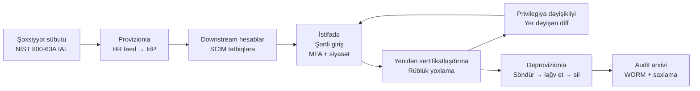

# Şəxsiyyət və Hesab İdarəetməsi

Əgər [AAA](./aaa-non-repudiation.md) girişin dilidirsə, **Şəxsiyyət və Hesab İdarəetməsi (IAM)** onun altındakı əməliyyat sistemidir. Autentifikasiya etdiyiniz hər giriş hadisəsi, qəbul etdiyiniz hər avtorizasiya qərarı, saxladığınız hər uçot qeydi — hamısı şəxsiyyətin mövcud olduğunu, onun yoxlanıldığını, düzgün atributlar daşıdığını və insan getdikdə təmizlənəcəyini güman edir. Şəxsiyyət qatını səhv qurduğunuz halda, AAA stekinizin qalan hissəsi boş bir qutunu müdafiə edir.

Müasir müəssisələr artıq bir xətti keçiblər: perimetr yoxdur, yalnız şəxsiyyətlər var. Düzgün tokeni olan kafe noutbuku "içəridədir"; data mərkəzində səhv tokeni olan server isə "kənardadır". Bulud provayderləri, SaaS tətbiqləri, partnyor inteqrasiyaları, podratçı noutbukları, CI/CD sistemləri — onların hər biri bir şəxsiyyətə, bir hesaba və icazə verib-verməməyi həll edən siyasətlər toplusuna gətirib çıxarır. IAM bu həll prosesini düzgün, ardıcıl və bərpa edilə bilən etmək intizamıdır.

## Bu nə üçün vacibdir

Bulud dövrünün demək olar ki, bütün insident hesabatlarında üç model təkrarlanır:

1. **Səhv konfiqurasiya edilmiş giriş bulud sızmalarının bir nömrəli vektorudur.** Hər böyük insident icmalı — Verizon DBIR, Mandiant M-Trends, [CISA bulud xəbərdarlıqları](https://www.cisa.gov/news-events/cybersecurity-advisories) — eyni kök səbəbləri sadalamağa davam edir: həddən artıq icazəli IAM rolları, sızdırılmış uzun ömürlü açarlar, dəyişdirilməyən xidmət principalları, geniş əhatəli federasiya tokenleri və unudulmuş admin hesabları. Hücumçular autentifikasiyanı sındırmırlar; mövcud olmamalı olan hesablardan içəri girirlər.
2. **Şəxsiyyət yeni perimetrdir.** Şəbəkə sərhədi əriyəndə, qalan yeganə davamlı sərhəd *kim soruşur* sualıdır. Şərtli giriş, cihaz vəziyyəti, JIT yüksəltmə, imzalanmış audit izləri — bütün bunlar hər insan və hər iş yükü üçün vahid, yaxşı idarə olunan şəxsiyyəti güman edir. Bu olmadan "sıfır etibar" düz şəbəkənin üzərinə çəkilmiş marketinq şüarıdır.
3. **İşə gələn-yer dəyişən-ayrılan dövrü ilk pozulan mexanizmdir.** Yeni işçi bazar ertəsi heç bir hesabsız gəlir. Maliyyə katibi satınalmaya keçir və köhnə ödəniş təsdiq hüquqlarını saxlayır. Mühəndis ayrılır və onun GitLab tokeni altı ay ərzində deploy etməyə davam edir. Həyat dövrünün hər boşluğu baş verməyi gözləyən bir audit tapıntısıdır — və istifadə etməyi gözləyən bir hücumçu.

IAM proqramının işi bu qarışıq reallığı təkrarlana bilən proseslərin kiçik dəstinə çevirməkdir: insanın iddia etdiyi şəxs olduğunu sübut etmək, düzgün hesablar yaratmaq, düzgün siyasətlər tətbiq etmək, istifadəni izləmək, girişi yenidən sertifikatlaşdırmaq və sonda hamısını söndürmək. Bir addımı atlasanız, [idarəetmə tapıntıları](../grc/security-governance.md) sızmadan əvvəl gələcək.

Bu dərs boyunca yadda saxlanılması dəyər ikinci bir baxış: IAM əvvəllər ayrı olan üç dünyanın görüş nöqtəsidir. **HR** kimin işçi olduğunu sahib edir. **Təhlükəsizlik** siyasətlərə sahib olur. **İT əməliyyatları** kataloqları, tokenleri və sessiyaları sahib edir. Üçündən heç biri tək başına IAM proqramını idarə edə bilməz. HR cümə günü kimisə işdən çıxaranda və İT bunu yalnız bazar ertəsi standap zamanı öyrənəndə, sızma pəncərəsi həftəsonudur. Təhlükəsizlik əməliyyatların həyata keçirə bilməyəcəyi JIT siyasətini yazanda, siyasət rəfdə qalır. Bu dərsdəki strukturlar, nəzarətlər və xəritələr bu üç komandanın bir-biri ilə danışdığını güman edir; əgər danışmırlarsa, ilk IAM layihəsi onları danışdırmaqdır.

## Əsas anlayışlar

### Şəxsiyyət sübutu (identity proofing)

Hesab yaratmadan əvvəl, qarşınızdakı insanın hesabın aid olduğu insan olduğuna *nə qədər əmin* olduğunuza qərar verirsiniz. [NIST SP 800-63A](https://pages.nist.gov/800-63-3/sp800-63a.html) buna **şəxsiyyət sübutu** deyir və üç Şəxsiyyət Təminat Səviyyəsində (IAL) reytinqləşdirir:

- **IAL1** — özü-iddia. İstifadəçi ad və email yazır; heç nə yoxlanılmır. Xəbər abunələri üçün uyğundur, əmək haqqı üçün yararsızdır.
- **IAL2** — nüfuzlu sübutun (pasport, milli ID, sənədə qarşı biometrik uyğunluq) uzaqdan və ya şəxsən yoxlanılması. Hazırda işçilər, maliyyə müştəriləri və əksər B2B onboardinqi üçün standart.
- **IAL3** — biometrik tutma və yoxlayıcı səviyyəli sübut ilə şəxsən, nəzarət altında sübut. Çox yüksək etibar tələb edən populyasiyalar üçün lazımdır: federal podratçılar, məxfilik sahibləri, rəhbərlər üçün imza sertifikatları.

Sübut uğursuzluqları sonradan *hesab ələ keçirmə* və *sintetik şəxsiyyət fırıldağı* kimi üzə çıxır: qeyri-müəyyən iddiaya verilmiş hesab, iddianın səhv olduğu üzə çıxanda müdafiə edilə bilməz. Sübut qərarını şəxsiyyət qeydində saxlayın ki, gələcək risk mühərriklərı və auditorlar bu hesabın niyə mövcud olduğunu görə bilsin.

Daha incə bir məqam: **IAL autentifikator gücü ilə eyni deyil**. İstifadəçi işə qəbul zamanı IAL2 səviyyəsində sübut edilə və sonra zəif parol ilə təchiz edilə bilər; əksinə, qeydiyyat zamanı özü-iddia edən istifadəçi (IAL1) sonradan aparat açar (NIST terminologiyasında AAL3) qeydiyyatdan keçirə bilər. Siyasətdə iki oxu ayrı saxlayın: sübut səviyyəsi mövcud olmasına etibar etdiyiniz şəxsiyyətlər populyasiyasını idarə edir; autentifikator səviyyəsi hər girişin həmin şəxsiyyətə nə qədər güclü bağlandığını idarə edir. İkisini qarışdırmaq qarışıq tələblərin yayğın mənbəyidir ("MFA-ya ehtiyacımız var" əslində çatışmayanın şəxsiyyət sübutu olduğu zaman, və ya əksinə).

### Hesab tipləri

İnsan (və ya iş yükü) sübut edildikdən sonra beş hesab tipindən birini yaradırsınız — və tip qalan hər şeyi (siyasət, həyat dövrü, monitorinq) idarə edir:

- **Standart istifadəçi hesabı** — bir insan, bir hesab, gündəlik iş üçün istifadə olunur. Qeyd sistemi olan HR-dən verilir, rola uyğun məhdudlaşdırılır, standart parol və MFA siyasəti ilə idarə olunur.
- **Privilegiyalı / admin hesab** — yüksək hüquqlar, istifadəçinin gündəlik hesabından ayrı. Mühəndislər email üçün `EXAMPLE\elnur.aliyev`, domen admin işi üçün isə `EXAMPLE\adm-elnur.aliyev` ilə daxil olurlar. Bu bölgü gündəlik hesaba olunan fişinqin privilegiyalı hesabı təhlükəyə atmasının qarşısını alır.
- **Xidmət hesabı** — qeyri-insan, tətbiq və ya planlaşdırılmış tapşırıq tərəfindən sahib olunur. İnteraktiv giriş edə bilməz, avtomatlaşdırma ilə dəyişdirilən uzun təsadüfi sirri var və heç vaxt yatmadığı üçün insan hesablarından daha sərt monitorinq olunur.
- **Paylaşılan / generik hesab** — bir neçə insan tərəfindən istifadə olunur. "Hər hərəkəti fərd ilə izləmək" qaydasını pozur və qarşısı alınmalıdır. Qaçılmaz olan yerdə (kiosklar, batch işlər, break-glass) PAM sessiya brokerinqi ilə örtün ki, insan ayrıca qeydə alınsın.
- **Qonaq / xarici hesab** — ziyarətçilər, podratçılar, partnyorlar. Vaxtla məhdudlaşdırılır, əhatə dairəsi məhduddur, çox vaxt yerli olaraq provizionlanmaq əvəzinə partnyorun öz IdP-sindən federasiya olunur.

Faydalı bir dizayn qaydası: heç vaxt xidmət hesabının istifadəçi kimi davranmasına icazə verməyin, heç vaxt istifadəçi hesabının xidmət kimi davranmasına icazə verməyin. İkisini qarışdırmaq dəyişikliyi qeyri-mümkün edir (istifadəçi paroldan "asılıdır") və hesabatlılıq qeyri-mümkün olur (xidmət hesabı bir neçə insan ilə "paylaşır").

Müasir bulud platformaları açıq şəkildə adlandırmağa dəyər iki tip də əlavə edir. **İş yükü şəxsiyyəti** (AWS IAM Roles, Azure managed identity, GCP service account, Kubernetes ServiceAccount) — sirləri heç vaxt konfiqurasiya faylında oturmayan xidmət hesabıdır — platforma iş yükünün harada işlədiyinə əsasən iş zamanı qısa ömürlü token zərb edir. Mümkün olan hər yerdə uzun ömürlü xidmət hesabı sirri yerinə iş yükü şəxsiyyətinə üstünlük verin. **Xarici / federasiyalaşdırılmış şəxsiyyət** — sizin IdP-yə yerli olan, faktiki autentifikasiya üçün partnyor IdP-yə işarə edən istifadəçi qeydidir; yerli qeyd siyasət və qrup üzvlüyünü daşıyır, partnyor IdP isə parol və MFA-nı daşıyır. Hər iki tip aşağıdakı həyat dövrü addımlarını izləyir, sadəcə fərqli provizionia mənbələri ilə.

### Hesab idarəetmə həyat dövrü

Tipindən asılı olmayaraq, hər hesab eyni mərhələlərdən keçməlidir:

1. **Provizionia** — nüfuzlu mənbə tərəfindən başladılır (işçilər üçün HR sistemi, satıcılar üçün podratçı izləməsi, xidmət hesabları üçün ticket iş axını). IAM platforması kataloqda hesabı yaradır, ilkin atributları təyin edir və downstream provizioniyanı itələyir.
2. **Konfiqurasiya** — rolları, qrup üzvlüklərini, şərtli giriş siyasətlərini, MFA qeydiyyatı tələbini, uyğunsa hesab vaxtının bitmə tarixini təyin edir. Bu, ən az privilegiyanın doğum zamanı tətbiq olunduğu yerdir, sonradan əlavə olunmur.
3. **İstifadə** — hesab yuxarıdakı siyasətlər altında öz gündəlik işini görür. Autentifikasiya hadisələri, avtorizasiya qərarları və uçot qeydləri SIEM-ə axır.
4. **Yenidən sertifikatlaşdırma** — hesab meneceri və resurs sahibi tərəfindən dövri yoxlama (rüblük adətən): *bu girişə hələ də ehtiyacınız var?* Təsdiqlənməyən hər şey silinir.
5. **Privilegiya dəyişikliyi** — yüksəliş, transfer, layihə dəyişikliyi. IAM platforması köhnə rolu yenisi ilə müqayisə edir və yeni rolun əsaslandırmadığı hər şeyi silir. "Yer dəyişən" addımı ən çox lateral hüquqların artmasının sistemə daxil olduğu yerdir.
6. **Deprovizionia** — son gün söndürmək, giriş tokenlərini silmək, sertifikatlar və açarları geri çağırmaq, sahib olunan faylları arxivləşdirmək və saxlama pəncərəsindən sonra silmək (və ya tombstone). Əvvəlcə söndürün, sonra silin — aşağıdakı söndürmə-vs-silmə qeydinə baxın.

Bir neçə invariant həyat dövrünü praktikada işlədir. **Hər şəxsiyyət tipi üçün bir nüfuzlu mənbə** olmalıdır (işçilər üçün HR, satıcılar üçün podratçı idarəetmə, xidmət hesabları üçün asset DB) — bu olmadan iki sistem eyni qeyd üzərində mübahisə edəcək. Hər addım auditora uyğun **sübut** istehsal etməlidir: ticket ID, vaxt damğası, aktyor, nəticə. Və hər hesabın hər zaman **adlandırılmış sahibi** olmalıdır — sahib ayrıldıqda, sahibin köçürülməsi *onun* offboardinqinin bir hissəsi kimi baş verir, sonra deyil.

Əməli olaraq həyata keçirilməsi ən çətin mərhələ *yer dəyişəndir*. İşə gələnlərin və ayrılanların təbii triggerləri var (HR qeydləri); yer dəyişənlərin çox vaxt yoxdur, çünki HR-də transfer hansı köhnə sistemlərdən girişin silinəcəyini sadalamaya bilər. Düzəliş hər transferdə **rol diff-i** hesablamaqdır — köhnə rolun səlahiyyətləri minus yeni rolun səlahiyyətləri ləğv ediləcək olanlara bərabərdir — və yeni menecerdən yeni rolun girişinin düzgün olduğuna dair müsbət təsdiq tələb etməkdir. Bu olmadan, yer dəyişmə hadisələri istifadəçi ən az privilegiyanın gəzən pozuntusuna çevrilənə qədər kruşka toplayır.

### Giriş nəzarəti modelləri

IAM [AAA dərsində](./aaa-non-repudiation.md) gördüyünüz eyni beş avtorizasiya modelindən istifadə edir, və seçim bütün platforma formasını idarə edir:

| Model | Qərar əsası | Harada parlayır |
|---|---|---|
| **DAC** | Resurs sahibi giriş verir. | NTFS paylaşımları, delegatlanmış sahibləri olan SharePoint saytları. |
| **MAC** | Sistem etiketli icazələri tətbiq edir; istifadəçilər ləğv edə bilməz. | Məxfi şəbəkələr, SELinux, həssaslıq etiketləri olan tənzimlənən data. |
| **RBAC** | İcazələr rollara əlavə olunur; istifadəçilər rolları irsən alırlar. | Active Directory qrupları, Kubernetes Roles, AWS IAM rolları. |
| **ABAC** | Siyasət istifadəçi, resurs və mühit atributlarını qiymətləndirir. | Şərtli giriş, şərtlərlə AWS IAM, OPA / Rego. |
| **ReBAC** | İcazələr qrafda münasibətləri izləyir. | Müasir SaaS paylaşma modelləri (Google Drive, Notion, Zanzibar tərzi). |

Əksər böyük təşkilatlar **kütlə üçün RBAC və kənarlar üçün ABAC** ilə nəticələnir: rollar təşkilat sxeminə uyğun olan girişin 80%-ni idarə edir; atribut siyasətləri kontekstual 20%-ni idarə edir (idarə olunmayan cihazdan blok, yeni ölkədən step-up MFA tələb et, data həssaslıq etiketinə görə məhdudlaşdır). MAC tənzimlənən enklavlarda qalır; DAC kollaborativ fayl iş yüklərində qalır; ReBAC paylaşımın qraf-formalı olduğu hər yerə daxil olur.

İki dizayn qaydası modelin öz çəkisi altında dağılmasının qarşısını alır. Birincisi, **rol partlayışı təmiz RBAC-ın uğursuzluq rejimidir** — hər departament öz rolunu istəyəndə və hər layihə alt-rol istəyəndə, heç kimin auditləyə bilmədiyi minlərlə rolla nəticələnirsiniz. Rolları kiçik *səlahiyyət dəstələri* (read-finance, write-finance, approve-finance) toplusundan tərtib etməklə və tez-tez dəyişən atributları (departament, layihə, məkan) rol adından çıxarıb ABAC şərtlərinə yerləşdirməklə zərəri azaldın. İkincisi, **siyasət qərarları siyasət mühərrikinə aiddir, tətbiq koduna deyil** — OPA, Cedar və ya bulud provayderinin yerli mühərriki kimi PDP-yə (siyasət qərar nöqtəsi) çıxarın ki, siyasət dəyişikliyi kod deploy tələb etməsin. Hər iki qayda [təhlükəsizlik nəzarətləri kataloqunda](../grc/security-controls.md) və müasir referans arxitekturalarında əks-səda verir.

### Hesab siyasətləri

Hesaba əlavə olunan siyasətlər, parolun düzgün olub-olmamasından asılı olmayaraq *nə vaxt* və *haradan* autentifikasiya edə biləcəyini idarə edir:

- **Giriş saatları / vaxt-əsaslı** — əksər işçilərə 03:00 admin girişi lazım deyil. İş saatı rollarını iş saatları ilə məhdudlaşdırın; iş saatları xaricindəki iş üçün açıq break-glass tələb edin.
- **Şəbəkə məkanı** — istehsalat mərtəbəsi VLAN-dan CFO girişlərini blok edin, kiosk altşəbəkələrini administrativ tətbiqlərdən blok edin. Şəbəkə artıq perimetr deyil, lakin hələ də faydalı *atributdur*.
- **Geofencing və geolokasiya** — IP-əsaslı ölkə və regionun məhdudiyyətləri. Əlavə siqnal kimi faydalıdır, vahid nəzarət kimi zəifdir, çünki VPN-lər və yaşayış proksiləri asanlıqla məğlub edir. Cihaz vəziyyəti və risk skoru ilə birləşdirin.
- **Eyni vaxtda sessiyalar** — hər insan, hər cihaz sinfi üzrə bir interaktiv sessiya. Müxtəlif ölkələrdən beş eyni vaxtda giriş güclü istifadəçi deyil, kredensial sızmasıdır.
- **Bloklama siyasəti** — M dəqiqədə N uğursuz cəhd eksponensial backoff ilə müvəqqəti blok yaradır. Təhlükəyə uyğunlaşdırın: çox aqressiv olsa unudulmuş parol help-desk ticketinə çevrilir; çox boş olsa onlayn parol spreyi uğur qazanır.
- **Parol mürəkkəbliyi və tarixi** — [parol təlimatına](./aaa-non-repudiation.md) baxın. Müasir siyasət uzun parol ifadələri, MFA-tələbli və sızma korpuslarına qarşı yoxlamadır; "simvol olmalıdır" deyil.
- **Hesab vaxtının bitməsi** — hər podratçı, intern və layihə hesabı yaradılarkən bitmə vaxtı alır. Bitmə vaxtını təyin etməyi unutmaq dörd il yaşı olan hesabların Belarusdan daxil olmasının səbəbidir.
- **Mümkün olmayan səyahət və riskli giriş siyasəti** — IdP Bakı və Sinqapurdan 12 dəqiqə fərqlə girişlər görəndə, həmin hesab step-up auth və ya məcburi blok tetikləyir. Müasir IdP-lər bunu daxili siyasət kimi göndərirlər.

Hesab siyasətləri haqqında düşünməyin doğru yolu **qatlanmış defaultlardır**. Baselayn hər hesaba tətbiq olunur; daha sərt overlay privilegiyalı hesablara tətbiq olunur; daha-daha sərt overlay break-glass hesablarına tətbiq olunur. Yeni hesablar baselayni avtomatik irsən alır; privilegiyalı rola yüksəliş ayrı bir ticket olmadan siyasəti *avtomatik* təkmilləşdirir. Əgər platformanız hesab başına manual siyasət təyinatı tələb edirsə, artıq uduzmusunuz — təyinatlar dreyf edəcək, istisnalar toplanacaq və audit boşluqları tapacaq.

### JIT giriş və JEA

**Just-In-Time (JIT)** giriş "Bob həmişə domain admindir"i "Bob növbəti 60 dəqiqə üçün təsdiqlə domain admin tələb edə bilər, sonra hüquqlar avtomatik bitir" ilə əvəz edir. Daimi privilegiya ayaq izi sıfıra doğru azalır və hər yüksəlmə əsaslandırma ilə qeyd olunur.

**Just Enough Administration (JEA)** tamamlayıcı ideyadır: hətta Bob yüksəldildikdə də onu *tam olaraq* tapşırıq üçün lazım olan əmrlərlə məhdudlaşdırın. PowerShell JEA endpointləri, əmr allowlistləri olan sudo və namespace-ə məhdudlaşdırılmış Kubernetes RoleBindings — hamısı bunu həyata keçirir — işi hələ də tamamlayan ən kiçik imkanlar dəstini verin.

JIT + JEA birlikdə admin girişini daimi şəxsiyyət xüsusiyyətindən qısa, auditlənmiş, dar əhatəli hadisəyə çevirir. PAM (növbəti) ilə birləşdirin və müasir privilegiyalı giriş modeliniz olur.

Mədəni dəyişiklik alətlər qədər vacibdir. Daimi girişə öyrəşmiş mühəndislər çox vaxt JIT-ə müqavimət göstərirlər çünki iş axını sürtünmə əlavə edir. Əks-arqument iki hissəlidir: (1) sürtünməni mühəndis nadir hallarda ödəyir, sürtünmənin olmaması isə noutbuk oğurlandıqda və ya hesab fişinq edildikdə hər kəs tərəfindən ödənilərdi; və (2) iş axını sürətli olduqda (rutin yüksəltmələr üçün 30 saniyədən az təsdiqlər, menecer təsdiqi yerinə peer təsdiqi, mühəndisin mövcud chat alətinə inteqrasiya) sürtünmə fərq edilməz səviyyədədir. Təsdiq üçün on dəqiqə tələb edən JIT iş axını bir həftə ərzində yan keçiriləcək; otuz saniyə tələb edən isə görünməz olur.

### PAM — vault, sessiya brokerinqi, JIT yüksəltmə

[Privileged Access Management (PAM)](./open-source-tools/secrets-and-pam.md) üç imkanı bir platformada bağlayır:

1. **Vault** — sirlər anbarı: uzun ömürlü xidmət hesabı parolları, break-glass üçün root kredensialları, imza açarları, verilənlər bazası admin kredensialları. İnsanlar sirri birbaşa görmürlər; sessiya üçün onu çıxarırlar və PAM aləti onu inyeksiya edir.
2. **Sessiya brokerinqi** — insan PAM bastionuna qoşulur, PAM bastionu onun adından hədəf sistemə qoşulur və bütün sessiya qeyd olunur (əmrlər, ekran, transkript). İnsan və hədəf heç vaxt birbaşa TCP yolunu paylaşmırlar.
3. **JIT yüksəltmə** — insan "bir saatlıq production verilənlər bazası oxuma girişi" tələb edir. Təsdiq iş axını işləyir (peer + dəyişiklik ticketi), PAM aləti qısa ömürlü kredensial verir və hüquqlar avtomatik bitir.

Açıq mənbə və kommersiya implementasiyaları (Teleport, HashiCorp Boundary, CyberArk, BeyondTrust, Delinea) xüsusiyyət vurğusunda fərqlənir, lakin model eynidir. PAM aləti olmadan, "adminlər üçün ən az privilegiya" yaxşı niyyətlərlə daimi hüquqları nəzərdə tutur; PAM aləti ilə isə beş dəqiqə əvvəl mövcud olmayan və beş dəqiqədən sonra mövcud olmayacaq hüquqları nəzərdə tutur.

İki əməliyyat təfərrüatı işləyən PAM yerləşdirməsini satıcı demosundan ayırır. Birincisi, PAM alətinin özü **arxasındakı sistemlər qədər monitorlanmalı və qorunmalıdır** — öz adminləri, öz MFA-sı, öz break-glass-ı, öz dəyişməz logları. İkincisi, **sessiya yazısı yalnız kimsə baxırsa faydalıdır** — SIEM-ə nümunə-yoxlama iş axını qoşun (hər N-ci privilegiyalı sessiya peer və ya təhlükəsizlik tərəfindən yoxlanılır) ki, yazılar toxunulmamış arxiv həcmi yerinə qadağa funksiyası kimi işləsin. [Sirlər və PAM dərsi](./open-source-tools/secrets-and-pam.md) əməliyyat dərinliyini əhatə edir; buradakı dərs odur ki, PAM *privilegiyalı şəxsiyyətin* və *privilegiyalı əməliyyatların* nəhayət qarşılaşdığı yerdir.

### SSO — SAML 2.0 və OIDC

Single Sign-On istifadəçiyə IdP-də bir dəfə autentifikasiya etməyə və paroldur yenidən yazmadan bir çox tətbiqə çatmağa imkan verir. İki protokol üstünlük təşkil edir:

- **SAML 2.0** — XML-əsaslı təsdiqlər, IdP tərəfindən imzalanır. Daha köhnə, daha ağır, korporativ SaaS və yerli federasiyada üstündür. İki axın forması: **SP-başladıcı** (istifadəçi tətbiqdə "daxil ol" düyməsini basır, tətbiq IdP-yə yönəldir, IdP autentifikasiya edir və imzalanmış təsdiq qaytarır) və **IdP-başladıcı** (istifadəçi IdP portalında başlayır, tətbiq seçir, IdP istənilməyən təsdiq itələyir). SP-başladıcı daha təhlükəsiz defaultdur; IdP-başladıcı tətbiqin relay-state yoxlamalarını yan keçir və fişinq vektoru olub.
- **OIDC** — OpenID Connect, OAuth 2.0 üzərində JSON tokenler (JWT). Daha yüngül, mobil, SPA və müasir SaaS üçün dizayn olunub. ID token şəxsiyyət iddialarını daşıyır; access token API çağırışlarını avtorizasiya edir; refresh token yenidən autentifikasiya olmadan yeni qısa ömürlü tokenler alır.

Yeni qurmalar üçün OIDC seçin; SaaS satıcısının yalnız onu dəstəklədiyi yerdə SAML saxlayın. Hər halda, hər təsdiq və ya tokeni imzalayın və yoxlayın, qısa ömür təyin edin, mümkünsə tokenleri cihaza bağlayın və SP-başladıcının işləyəcəyi yerdə heç vaxt IdP-başladıcı SAML istifadə etməyin.

İnsident hesabatlarında bir neçə SSO antimodeli təkrarlanır: zəif imza alqoritmləri (SHA-1, RSA-1024) ilə qəbul edilən təsdiqlər; `iss`, `aud` və `exp` iddialarını yoxlamadan yoxlanılan JWT-lər; cross-site script-in çıxara biləcəyi brauzer local storage-də saxlanılan refresh tokenler; və SSO yoxlaması uğursuz olduqda "yerli parol" autentifikasiyasına geri qayıdan, federasiyanın bütün məqsədini məğlub edən tətbiqlər. Hər SSO inteqrasiyası üçün kod yoxlaması bunları açıq şəkildə axtarmalıdır — bunlar ekzotik zəifliklər deyil, hər penetrasiya testi hesabatında üzə çıxan darıxdırıcı uğursuzluqlardır.

### Federasiya — SCIM və domenlər arası etibar

**Federasiya** şəxsiyyət domenləri arasındakı etibar münasibətidir. Sizin `example.local` IdP-niz həmin partnyorun istifadəçiləri üçün `partner.example` IdP-yə etibar edir, beləliklə yerli hesabları provizionia etmədən portalınıza çata bilərlər. IdP-IdP münasibəti bir dəfə qurulur (metadata mübadiləsi, imza sertifikatları) və hər giriş üçün təkrar istifadə olunur.

Federasiya **autentifikasiyanı** idarə edir — *bu istifadəçi etibarlı IdP tərəfindən autentifikasiya edildi?* — lakin **provizioniyanı** idarə etmir — *bu istifadəçi sistemimizdə ümumiyyətlə mövcuddur?* Bu boşluğu **SCIM 2.0** ([RFC 7643](https://datatracker.ietf.org/doc/html/rfc7643), [RFC 7644](https://datatracker.ietf.org/doc/html/rfc7644)), Cross-domain Identity Management üçün Sistem doldurur. SCIM sistemlər arasında şəxsiyyət qeydlərinin yarat / yenilə / söndür / sil üçün REST API müəyyən edir, beləliklə HR yeni işçi əlavə etdikdə, SCIM hesabı dəqiqələr ərzində Salesforce, GitLab, AWS, Slack və qalanlarına itələyir.

Cütlük **giriş üçün federasiya, həyat dövrü üçün SCIM-dir**. SCIM olmadan federasiya sizə downstream tətbiqlərinin heç vaxt eşitmədiyi istifadəçilər üçün giriş verir; federasiya olmadan SCIM hələ də öz parollarına ehtiyacı olan hesablar verir. Birlikdə müasir çox tətbiqli şəxsiyyətin onurğa sütunudur.

Plan etmək üçün praktik bir təfərrüat: hər SaaS tətbiqi SCIM-i dəstəkləmir və dəstəkləyənlər çox vaxt bunun üçün "müəssisə pilləsi" əlavə haqqı tələb edirlər. *SCIM dəstəklənən / SCIM aktivləşdirilən / həyat dövrü metodu* sütunu olan SaaS inventarı saxlayın. SCIM-i olmayan tətbiqlərə geri çəkilmə lazımdır: IdP-dən planlaşdırılmış CSV ixracı, xüsusi IdP konnektoru və ya ən pis halda, adlandırılmış sahibi və həftəlik dreyf hesabatı olan manual işə-gələn-yer-dəyişən-ayrılan runbooku. İlin sonunda enəcək audit sualı sadədir — "istifadə etdiyiniz hər SaaS tətbiqi üçün ayrılanların X saat ərzində necə silindiyini göstərin."

### Bulud şəxsiyyəti — Entra, Workspace, AWS IAM, şərtli giriş

Əsas bulud şəxsiyyət platformaları oxşar sahəni fərqli lüğətlə əhatə edir:

- **Microsoft Entra ID** (əvvəlki Azure AD) — kataloq, MFA, şərtli giriş, şəxsiyyət qoruması (risk skorlaması), Privileged Identity Management (PIM, JIT qatı), partnyorlar üçün B2B, müştərilər üçün B2C. Entra Connect vasitəsilə yerli AD-yə federasiya edir.
- **Google Workspace / Cloud Identity** — kataloq, 2 addımlı yoxlama, kontekst-aware giriş, sıfır-etibar tətbiq girişi üçün BeyondCorp Enterprise, qeyri-Workspace şəxsiyyətləri üçün Cloud Identity Premium.
- **AWS IAM və IAM Identity Center** — rollar, siyasətlər, federasiya (SAML və OIDC), AWS hesabları üzrə SSO üçün Identity Center, taglar və şərtlərlə incə-əhatəli ABAC, iş yükləri üçün qısa ömürlü STS kredensialları.
- **Şərtli giriş** — üçündə də ümumi olan siyasət mühərriki: *əgər istifadəçi idarə olunan cihazdadırsa, etibarlı şəbəkədədirsə, aşağı risk skoru ilə, icazə ver; əks halda step-up tələb et; əks halda blok et.* Bu istehsalda ABAC-dır və əksər bulud sızmalarının siyasətlərin yox olduğu və ya səhv konfiqurasiya edildiyi zaman boş şəkildə uğursuz olduğu yerdir.

Platformalar fərqlidir; intizam yox. Şəxsiyyəti bir IdP-də mərkəzləşdirin, hər buluda federasiya edin, üzərinə şərtli giriş qoyun və bütün hadisələri SIEM-ə yönləndirin.

İncə, lakin vacib bir məqam: bulud IAM-ın istifadəçi şəxsiyyəti *olmayan* öz şəxsiyyət modeli var. AWS IAM istifadəçiləri, Entra service principalları, GCP service hesabları — bunlar buludun özünün daxili olaraq istifadə etdiyi iş yükü şəxsiyyətləridir, hətta insan girişi başqa yerdən federasiya edildikdə də. Onların öz həyat dövrü (yaratma, sahiblik, dəyişdirmə, deprovizionia), öz auditi və öz ən az privilegiya rejimi lazımdır. "Sızdırılmış AWS access key" tapan sızma yoxlaması demək olar ki, həmişə onu illər əvvəl təcrübə üçün yaradılmış, heç vaxt silinməmiş və yavaş-yavaş istehsal icazələri toplamış iş yükü şəxsiyyətində tapır. Həm insan şəxsiyyətlərini, həm də iş yükü şəxsiyyətlərini inventarlaşdırın; hər ikisini həyat dövrünə tabe edin.

### Hibrid şəxsiyyət — sinxron modelləri, federasiyalaşdırılmış etibar, çətinliklər

Əksər real təşkilatlar hibriddir: legacy tətbiqlər üçün yerli AD, bulud SaaS üçün Entra və ya Okta, bəzən yanında Google Workspace. Üç inteqrasiya modeli görünür:

- **Yalnız bulud** — bulud IdP-si həqiqət mənbəyidir; yerli işə gələnlər yuxarı miqrasiya olunur. Ən təmiz, lakin AD-bağlı tətbiqlərin çıxarılmasını və ya müasir auth proksiləri ilə fronta çıxarılmasını tələb edir.
- **Sinxronlaşdırılmış / hash sinxron** — AD həqiqət mənbəyi olaraq qalır, IdP sinxronlaşdırılmış surət alır (Entra Connect Password Hash Sync üçün hash-of-hashes kimi parollar). Autentifikasiya hər iki yerdə baş verə bilər. Sadə, bulud xidmət kəsilməsinə davamlı, lakin şəxsiyyət dəyişiklikləri yerli mənbədən dəqiqələr geri qalır.
- **Federasiyalaşdırılmış etibar** — AD mənbə olaraq qalır, bulud IdP-si hər giriş üçün ADFS və ya Entra Connect Pass-Through Authentication-a federasiya edir. Ən güclü vahid-həqiqət-mənbəyi, lakin yerli federasiya serveri söndüyündə bulud SSO pozulur.

Plan üçün hibrid çətinliklər: yerli və bulud atributları arasında dreyf, ziddiyyətli sxem (AD `sAMAccountName` vs Entra UPN), yalnız AD-də mövcud olan xidmət hesabları, yalnız buludda mövcud olan partnyor B2B istifadəçiləri və "bu Elnur yerli olan, yoxsa bulud olan?" sualını həll edən *master qeyd*ə universal ehtiyac. Yaxşı hibrid IAM dizaynı bu master qeydi adlandırır və sualın heç vaxt qeyri-müəyyən olmasına imkan vermir.

Tamamlayıcı sual **parol idarə edilməsidir**. Hash-sinxronda yerli parol (bulud tərəfli yenidən hash etdikdən sonra) bulud IdP-nin yoxladığıdır; pass-through və federasiyada hər bulud girişi hələ də yerli AD-yə toxunur. Hər seçimin fərqli break-glass hekayəsi, fərqli gecikmə profili və yerli mühit kompromis edildikdə fərqli partlama radiusu var. Hansı modeli istifadə etdiyinizi, niyə və yerli tərəf çatılmaz olduqda nə baş verdiyini sənədləşdirin — bu sualı kəsmədən əvvəl, kəsmə zamanı deyil, ağ taxtada cavablandırın.

### Şəxsiyyət yenidən sertifikatlaşdırması və giriş yoxlamaları

Yenidən sertifikatlaşdırma hər giriş təyinatının yenidən əsaslandırıldığı dövri ritualdır. Sahiblər (xətti menecerlər, resurs sahibləri, tətbiq sahibləri) kimin hansı girişi olduğuna dair siyahı alırlar və hər sətirdə *saxla / ləğv et / delegat et* basırlar. Pəncərə daxilində təsdiqlənməyən hər şey avtomatik silinir.

Müasir şəxsiyyət platformaları (Entra Access Reviews, Okta Access Certifications, SailPoint, Saviynt) kampaniyanı avtomatlaşdırır: planlaşdır, bildiriş et, eskalasiya et, tətbiq et, audit et. İntizam *nəticə üzərində hərəkət etməkdədir*: əgər menecer hər sətrə möhür vurursa, yoxlama teatr üçündür; əgər ləğvlər baş verirsə və hesablar rüb üzrə azalırsa, yoxlama realdır. Yenidən sertifikatlaşdırmanı [təhlükəsizlik nəzarətləri kataloquna](../grc/security-controls.md) və framework tələbinə (CIS Control 6, ISO/IEC 27001 A.9, SOX, HIPAA) xəritələşdirin ki, iş təhlükəsizlik dəyəri ilə yanaşı audit dəyərinə də malik olsun.

Üç kampaniya tezliyi əksər ehtiyacları əhatə edir. **Rüblük** privilegiyalı qruplar, tətbiq sahibləri və yüksək riskli rollar üçün. **İllik** standart istifadəçi girişi və qrup üzvlüyü üçün. **Hadisə-əsaslı** hər transferdə, rol dəyişikliyində və ya uzun müddətli yoxluqda — əvvəlki rola qarşı diff yenidən sertifikatlaşdırmadır, yeni menecer tərəfindən həyata keçirilir. Yaxşı qurulduqda, yenidən sertifikatlaşdırma menecerin qorxduğu yük olmaqdan çıxır və menecerin komandasının əslində nə edə biləcəyini kəşf etmək üçün istifadə etdiyi alətə çevrilir.

## IAM həyat dövrü diaqramı

Ən vacib oxlar dövrlərdir: *İstifadə → Yenidən sertifikatlaşdırma → Privilegiya dəyişikliyi → İstifadə* sabit-vəziyyət mühərrikidir; *İstifadə → Deprovizionia → Audit arxivi* hər hesabın nəticədə götürəcəyi çıxış rampasıdır. Heç vaxt hesabları bağlamayan proqramda sızıntı var; onları bağlayan, lakin audit izini arxivləşdirməyən proqramın sonradan müdafiə edilə bilən qeydi yoxdur.

## Praktiki məşqlər

Hər biri bir neçə saatlıq olan beş məşq. Onlar noutbuk və pulsuz bulud hesabından başqa heç bir lab tələb etmədən yuxarıdakı anlayışları gücləndirir.

### Məşq 1 — Keycloak-dan nümunə tətbiqə SAML SSO qurun

Keycloak-ı konteynerdə yerləşdirin. Realm yaradın, iki test istifadəçisini qeydiyyatdan keçirin və nümunə tətbiq üçün SAML klienti konfiqurasiya edin (hər hansı açıq mənbə SAML SP — Grafana, GitLab və ya SAMLtest.id sandbox). Üç şeyi yoxlayın: (1) tətbiqdən SP-başladıcı giriş Keycloak-a yönəldir, autentifikasiya edir və imzalanmış təsdiq qaytarır; (2) təsdiqin imzası yoxlanır və tətbiq istifadəçi adı və qrup iddialarını çıxarır; (3) IdP-başladıcı giriş, tətbiq açıq şəkildə tələb etmədikcə, *söndürülmüş* olur. Metadata mübadiləsini və imza sertifikatı dəyişdirmə planını sənədləşdirin.

Sonra uğursuzluq rejimlərinin necə göründüyünü görmək üçün qəsdən pozun: təsdiqin bir baytını dəyişdirin və tətbiqin rədd etdiyini təsdiq edin; IdP imza sertifikatının vaxtının bitməsinə icazə verin və xəta yolunu müşahidə edin; təsdiqi SHA-1 istifadə etməyə məcbur edin və müasir SP-nin rədd etdiyini təsdiq edin. Məşqin məqsədi yalnız SSO-nu işlətmək deyil, harada uğursuz olduğunu hiss etməkdir — bunlar istehsalda görəcəyiniz xəbərdarlıqlardır.

### Məşq 2 — Downstream tətbiqə SCIM provizioniyanı konfiqurasiya edin

Eyni Keycloak (və ya Entra ID pulsuz pilləsi) ilə dəstəkləyən downstream tətbiqə (GitLab, Slack və ya SCIM mock serveri) SCIM 2.0 provizioniyanı aktivləşdirin. IdP-də istifadəçi yaratmağın saniyələr ərzində downstream-da hesab yaratdığını, atributların yenilənməsinin yayıldığını və istifadəçinin söndürülməsinin downstream hesabını söndürdüyünü təsdiqləyin. SCIM bearer tokeninin harada saxlandığını, necə dəyişdirildiyini və SCIM endpointi əlçatmaz olduqda nə baş verdiyini yazın.

Bir uzanma tapşırığı əlavə edin: IdP və downstream tətbiq arasında on dəqiqəlik şəbəkə bölgüsünü simulyasiya edin, sonra əlaqə bərpa olunduqda barışdırma davranışını izləyin. IdP yenidən cəhd edirmi? Toplayırmı? Həyat dövrü hadisələrinin itirildiyi boşluqlar var? Real dünyada SCIM nadir hallarda səs-küylü uğursuz olur — daha çox sakitcə hadisələri buraxır — və əminlik onların əhəmiyyət kəsb etməzdən əvvəl bərpa semantikasını anlamaqdan gəlir.

### Məşq 3 — İstehsal üçün JIT giriş iş axını dizayn edin

Bəzən istehsal verilənlər bazası girişinə ehtiyacı olan kiçik mühəndislik komandası üçün JIT iş axınını sxematləşdirin. Qərar verin: kim təsdiqləyir (peer? menecer? on-call lider?), hansı əsaslandırma tələb olunur (dəyişiklik ticketi? insident ID-si?), yüksəltmə nə qədər davam edir (15 dəqiqə? 4 saat?), nə qeyd olunur (sessiya transkripti? sorğu loqu?) və təsdiqləyən əlçatmaz olduqda break-glass necə işləyir. Confluence-də kağız versiya həyata keçirin, sonra hansı PAM alətini (Teleport, HashiCorp Boundary, CyberArk) alacağınızı və ya quracağınızı qiymətləndirin. JIT alətinin özü söndüyündə geri qayıtma planı daxil edin.

Əvvəldən üç ölçülə bilən məqsəd təsbit edin: təsdiq üçün median vaxt, dəyişiklik ticketi daxil olan yüksəltmələrin faizi və yerləşdirmədən sonra daimi-privilegiya sayı. Bu rəqəmlər olmadan, "indi JIT istifadə edirik" "hücum səthində real azalma"dan tutmuş "eyni daimi giriş plus bir klik"ə qədər hər mənanı verə bilər.

### Məşq 4 — Həddən artıq icazəli paylaşılan hesabları auditləşdirin

Real və ya lab mühitini seçin və "paylaşılan", "generik", "xidmət" və ya "kiosk" kimi qeyd olunmuş hər hesabın siyahısını çəkin. Hər biri üçün cavab verin: kim sahibdir, nə edir, interaktiv giriş edə bilərmi, hansı privilegiyaları var, parolu son nə vaxt dəyişdirilib və sabah onu söndürsəniz nə pozular. Ən üst üç həddən artıq icazəli paylaşılan hesabı yazın və ya əvəzləmə (hər istifadəçi üçün PAM çıxarış) və ya sərtləşdirmə (interaktiv giriş yoxdur, məhdudlaşdırılmış service principal, avtomatlaşdırılmış dəyişdirmə) təklif edin.

### Məşq 5 — Hesab yenidən sertifikatlaşdırma kampaniyası skripti qurun

IdP-nizdəki üç privilegiyalı qrupun (`Domain Admins`, `Cloud Admins`, `Database Admins`) hər üzvünü çəkən, hər üzvü HR feedi ilə əlaqələndirən, aktiv işçi siyahısında olmayan və ya meneceri itkin olan hər kəsi qeyd edən və hər menecerə bir-klik "saxla / ləğv et" forması göndərən PowerShell və ya Python skripti yazın. 14 günlük müddət və hərəkət edilməmiş sətirlər üçün avtomatik ləğv əlavə edin. Skripti dry-run rejimində işlədin və hər hesab toxunulmamışdan əvvəl maraqlı tərəflə çıxışı yoxlayın.

Vaxt ərzində hər kampaniyanın *nəticəsini* izləyin: neçə üzv yoxlanıldı, neçəsi ləğv edildi, müddət-əsaslı ləğvlər nə qədər vaxta baş verdi və növbəti rübə neçə hesab geri qayıtdı (ləğvlərin izləmə olmadan geri çevrildiyinin əlaməti). Skript bir alətdir; metrika proqramdır.

## Praktiki nümunə: example.local IAM-ı modernləşdirir

`example.local` [AAA dərsində](./aaa-non-repudiation.md) və [CIA triadası dərsində](./cia-triad.md) olan eyni 80 nəfərlik şirkətdir. Onların şəxsiyyət qatı orqanik şəkildə böyüyüb: yerli AD, Salesforce və GitLab-a manual provizionia, AWS-də paylaşılan `admin` hesab, yenidən sertifikatlaşdırma yox, SCIM yox, JIT yox. CFO iki rüblük modernləşdirməni təsdiq edib.

### Hədəf arxitektura

- **Həqiqət mənbəyi** — HR sistemi (BambooHR) şəxsiyyəti idarə edir. HR-də yeni işə gələn qeydi IAM iş axınını tetikləyir; xitam qeydi deprovizioniyanı tetikləyir.
- **Şəxsiyyət provayderi** — Microsoft Entra ID, Entra Connect vasitəsilə yerli AD-yə federasiya edilib (parol hash sinxron, bulud autentifikasiyası əsas). Mövcud AD hesabları və qrupları yuxarı sinxronlaşır; yeni hesablar HR-də doğulur və SCIM vasitəsilə yayılır.
- **Downstream provizionia** — Entra ID-dən Salesforce, GitLab, AWS Identity Center, Slack və daxili portala SCIM 2.0. İşə gələn-yer dəyişən-ayrılan HR dəyişikliyindən beş dəqiqə ərzində yayılır.
- **Şərtli giriş** — admin əhatəsi üçün idarə olunan cihaz + aşağı risk skoru tələb olunur; hər giriş üçün MFA tələb olunur; legacy autentifikasiya bloklanıb; gözlənilməz ölkələrdən girişlər step-up və ya blok tetikləyir.
- **PAM vasitəsilə istehsal girişi** — Teleport (və ya HashiCorp Boundary) AWS istehsalına SSH və verilənlər bazası sessiyalarını brokerləşdirir. Mühəndislər dəyişiklik ticketi referansı ilə JIT yüksəltmə tələb edirlər; "Domain Admin" sinifli hərəkətlər üçün peer təsdiqi tələb olunur; sessiyalar qeyd olunur, transkriptlər WORM-da saxlanılır.
- **Yenidən sertifikatlaşdırma** — Entra Access Reviews vasitəsilə rüblük giriş yoxlamaları. Hər privilegiyalı qrup, hər qonaq hesab, hər cross-tenant giriş təyinatı. Təsdiqlənməyən giriş müddət sonunda avtomatik ləğv edilir.
- **Audit və uçot** — hər Entra hadisəsi, AD təhlükəsizlik loqu, SCIM əməliyyatı, PAM sessiyası və HR feed dəyişikliyi SIEM-ə düşür. Loqlar daxiletmədə hash-zəncirlənir və [təhlükəsizlik idarəetmə](../grc/security-governance.md) siyasətinə əsasən saxlanılır (90 gün isti, 1 il ilıq, tənzimlənən data üçün 7 il soyuq).

### Yerləşdirmə mərhələləri

1. **Rüb 1 — şəxsiyyət konsolidasiyası.** Entra ID-ni qaldırın, Entra Connect-i konfiqurasiya edin, mövcud AD-ni federasiya edin. Bir downstream tətbiqə (GitLab) SCIM provizioniyanı pilot edin. Adminlərə WebAuthn açarları verin. İcradan əvvəl pozulmuş axınları tapmaq üçün şərtli girişi *yalnız hesabat* rejimində aktivləşdirin.
2. **Rüb 1 — işə gələn-yer dəyişən-ayrılan.** BambooHR-i Entra-ya provizionia mənbəyi kimi qoşun. Salesforce, AWS Identity Center və Slack-i SCIM-ə kəsin. Manual ticket-əsaslı hesab yaratmanı çıxarın.
3. **Rüb 2 — privilegiyalı giriş.** Teleport-u yerləşdirin. Mühəndisləri uzun ömürlü SSH açarlarından qısa ömürlü sertifikatlara köçürün. Bütün istehsal AWS hesablarını PAM bastionunun arxasına qeydiyyatdan keçirin. Hər cihazdakı paylaşılan `admin` hesabını ləğv edin.
4. **Rüb 2 — yenidən sertifikatlaşdırma və audit.** İlk rüblük giriş yoxlamasını planlaşdırın. SIEM hash-zəncirli daxiletməni konfiqurasiya edin. "IdP söndüyündə nə olar" tabletop-u keçirin və break-glass prosedurunu doğrulayın.

### IAM domenlərinə xəritələnmiş nəzarətlər

| Nəzarət | Şəxsiyyət sübutu | Provizionia | Authn / Authz | Yenidən sert. | Deprovizionia |
|---|---|---|---|---|---|
| HR feed → Entra ID | İşə qəbulda tutulur | Həqiqət mənbəyi | n/a | Yoxlama əhatəsini idarə edir | Xitam off-board tetikləyir |
| Downstream-a SCIM | n/a | Bəli | n/a | Dreyf aşkarlanması | Ləğvdə söndürür |
| Şərtli giriş | n/a | n/a | Bəli (ABAC) | n/a | n/a |
| Teleport PAM | n/a | n/a | JIT sert. verilməsi | Sessiya loq yoxlaması | Bitmədə ləğv edir |
| Entra Access Reviews | n/a | n/a | n/a | Bəli | Müddət sonunda avto-ləğv |
| SIEM hash-zəncirli daxiletmə | n/a | n/a | n/a | Yoxlama üçün sübut | Pozuntu-açıq audit |

Bu kiçik müəssisədə müasir IAM stekinin necə göründüyüdür — bir məhsul deyil, HR şəxsiyyəti idarə edən, IdP autentifikasiya edən, SCIM provizionia edən, şərtli giriş qərar verən, PAM yüksəldən, yoxlamaların yenidən sertifikatlaşdıran və SIEM-in xatırladığı ardıcıl axın.

### Yerləşdirmə üçün uğur metrikləri

- **Həyat dövrü gecikməsi** — HR dəyişikliyindən downstream hesab vəziyyətinə qədər dəqiqələr. İşə gələnlər və yer dəyişənlər üçün 10 dəqiqədən az; ayrılanlar üçün 5 dəqiqədən az hədəf.
- **Daimi privilegiya ayaq izi** — həmişə-açıq admin hüquqları olan hesabların sayı. JIT daimi olanı əvəz etdikcə Q2 sonunda 90 % azalma hədəf.
- **Yenidən sertifikatlaşdırma ləğv tezliyi** — rüblük dövr başına ləğv edilən giriş sətirlərinin faizi. Sağlam proqram 5–15 % işləyir; sıfır ləğvlər möhür vurmaq deməkdir.
- **Yetim hesab sayı** — hər hansı sistemdə uyğun aktiv işçi və ya sahib olunmuş xidmət olmadan hesablar. Sıfır hədəf, həftəlik audit.
- **Privilegiyalı qruplarda MFA əhatəsi** — fişinqə davamlı MFA-ya qeydiyyatdan keçmiş privilegiyalı qrup üzvlərinin faizi. 100 % hədəf; qismən əhatə qeydiyyatdan keçməmiş hesabların hücumçunun ilk dayanacağı olduğunu bildirir.
- **JIT üçün təsdiq vaxtı** — sorğudan təsdiqə qədər median saniyələr. Rutin yüksəltmələr üçün 60 saniyədən az hədəf; daha uzun mühəndislərin "hər ehtimala qarşı" daimi giriş yığacağı deməkdir.

### Yerləşdirmədən dərslər

Bir neçə model açıq şəkildə adlandırılmağa dəyər çünki hər IAM modernləşdirməsi onlara rast gəlir. **İlk SCIM keçidi həmişə iki sistemi razılaşmaz tapır** — adətən illərlə manual redaktə edilmiş, həqiqət mənbəyindən dreyf etmiş və indi barışmağı rədd edən istifadəçi qeydləri olan bir SaaS tətbiqi. İlk böyük tətbiq üçün iki həftəlik barışdırma pəncərəsi planlaşdırın və təmizləmə üçün mühəndis vaxtı büdcəsi ayırın. **Şərtli giriş icra rejimində həmişə bir VIP-i bloklayır** — gözlənilməz ölkədə şəxsi noutbukda direktorlar şurası üzvü, müasir auth-u dəstəkləməyən köhnə telefonu olan CFO. Düyməni çevirməzdən əvvəl ilk on kənar halı müəyyən edin və əvvəlcədən idarə edin. **PAM aləti** növbəti red-team məşqinin ilk hədəfi olacaq çünki o, krallığın açarlarını cəmləşdirir; ona uyğun olaraq möhkəmləndirin, öz MFA-sı, öz monitorinqi və PAM alətinin özündə deyil, möhürlənmiş zərfdə sənədləşdirilmiş öz break-glass hekayəsi ilə.

## Problemlərin aradan qaldırılması və tələlər

- **Söndürmə vs silmə** — insan ayrıldıqda söndürün, yalnız saxlamadan sonra silin. Erkən silmə faylları yetim qoyur, sahiblik zəncirlərini pozur və audit izlərini silir. Söndürülmüş hesab offboardinq səhv idisə geri qaytarıla bilər; silinmiş isə xeyr.
- **Yetim xidmət hesabları** — beş il əvvəl tətbiqi çıxarılmış xidmət hesabı, hələ aktiv, hələ haradansa autentifikasiya edən. Hər xidmət hesabını adlandırılmış sahibə və yenilənmə tarixinə bağlayın; sahibi ayrılmış hesabları avto-söndürün.
- **Şəbəkə avadanlığında paylaşılan `admin` hesabları** — ən yayılmış AAA uğursuzluğu. Bir parol, on mühəndis, fərdi hesabatlılıq yoxdur. AD-yə hər istifadəçi üçün RADIUS / TACACS+ ilə əvəzləyin; seyfdə dəyişiklikdə-istifadə möhürü ilə bir break-glass hesabı saxlayın.
- **Uzun ömürlü bulud giriş açarları** — dəyişdirilməsi olmayan, əhatəsi olmayan, çox vaxt "yalnız test üçün" şəxsi repoya commit edilən AWS giriş açarları. Qısa ömürlü STS rolları, IAM Identity Center və ya iş yükü şəxsiyyət federasiyası ilə ləğv edin.
- **SCIM token sızması** — SCIM bearer tokeni downstream provizionia üçün master açardır. Sirlər vaultunda saxlayın, rüblük dəyişdirin, IdP egress-ini SCIM endpoint IP diapazonuna məhdudlaşdırın, başqa yerdən istifadə üçün xəbərdarlıq edin.
- **İcra rejimində şərtli giriş səhv konfiqurasiyası** — go-live səhəri leqitim Exchange ActiveSync istifadəçisini tutan "legacy auth-u blok et" qaydası. Yeni siyasətləri icradan əvvəl iki həftə həmişə *yalnız hesabat*da işlədin; hər blok üçün adlandırılmış məsul insan olsun.
- **Paylaşılan hesabları istismar edən MFA yorğunluğu** — son nəticədə təsdiqləyən kiosk operatorunun paylaşılan telefonuna push prompt-ları. Paylaşılan hesabları hər istifadəçi ilə əvəzləyin; hər push-da rəqəm uyğunlaşması tələb edin.
- **Federasiya IdP kəsilməsi hər şeyi söndürür** — Entra çatılmaz olduqda hər federasiyalaşdırılmış SaaS çatılmazdır. Ən kritik sistemlərdə break-glass yerli hesab planlaşdırın; bərpanı sənədləşdirin və test edin; IdP əlçatanlığını P1 xidməti kimi monitorlayın.
- **Köhnəlmiş qonaq / B2B hesablar** — iki layihə əvvəl dəvət edilmiş partnyor podratçıları, hələ aktiv, hələ paylaşılan kanallarda. Hər qonağı dəvətdə vaxtla məhdudlaşdırın, rüblük yenidən-dəvət tələb edin, bitmədə avto-söndürün.
- **Həddən artıq geniş RBAC rolları** — rol bir dəfə dizayn edilib və heç vaxt daraldılmadığı üçün hər müştəri qeydi üzərində oxu-yazma verən `App Owner`. Rol üzvlüyünü və rol icazələrini real istifadəyə qarşı auditləşdirin; istifadə fərqləndikdə rolları bölün.
- **Təsdiqsiz JIT** — peer təsdiqləyəni olmayan "self-service admin yüksəltmə" əlavə kliklərlə daimi privilegiyadan başqa bir şey deyil. İstehsal-təsirli yüksəltmələr üçün ikinci insan tələb edin.
- **Yenidən sertifikatlaşdırmanın möhür vurulması** — menecerlər 30 saniyədə 100 sətrı təsdiqləyirlər. Yoxlamaları nümunə olaraq auditləşdirin; ləğv tezliyini izləyin; privilegiyalı rollar üçün saxlama qərarlarında əsaslandırma tələb edin.
- **Hibrid dreyfi** — AD-də dəyişdirilmiş, lakin Entra-ya (və ya əksinə) heç vaxt yayılmamış atribut, beləliklə atribut əsasında siyasət qərarları səhv işə düşür. Sinxron pipeline-ı monitorlayın, geri qalmaya xəbərdarlıq edin, rüblük dreyf hesabatları işlədin.
- **Sahibi = "paylaşılan poçt qutusu" olan service principallar** — qeydiyyatdan keçən sahib ayrılıb, poçt qutusu qalır, heç kim hesabatlı deyil. Service principallarda qeyri-insan sahibləri qadağan edin; adlandırılmış insan plus ehtiyat tələb edin.
- **Şərtli giriş istisna siyahıları** — "bu bir istifadəçi istisnadır" heç kimin yoxlamadığı 200 adlı istisna qrupuna çevrilir. Hər istisnanı vaxtla məhdudlaşdırın, ticketə bağlayın, rüblük yenidən sertifikatlaşdırın.
- **PAM alətinin özünün vahid uğursuzluq nöqtəsinə çevrilməsi** — hər admin yolu bir bastion vasitəsilə işləyir; bastion sönüb, bank ofludur. Break-glass-ı planlaşdırın: sənədləşdirilmiş prosedur, seyfdə möhürlənmiş kredensiallar, açmaq üçün ikiqat nəzarət.
- **Tətbiq qatında loqlama boşluqları** — IdP və OS loqları "istifadəçi daxil oldu" göstərir, lakin "istifadəçi müştəri siyahısını ixrac etdi"ni göstərmir. Biznes-kritik tətbiqləri uçot tamlığı üçün auditləşdirin, yalnız platformanı deyil.
- **Şəxsiyyət sübut çürüməsi** — sübut işə qəbulda bir dəfə edildi və heç vaxt yenilənmədi. Yüksək etibar rolları üçün rol dəyişikliyində və uzun yoxluqlarda yenidən sübut edin; qərarı şəxsiyyət qeydində tutun.
- **Effektiv icazələri gizlədən qrup yuvalanması** — `App Read` `App Reviewer`-in üzvüdür, o da `App Owner`-in üzvüdür və `App Read`-ə yerləşdirilmiş podratçı irs vasitəsilə sahib hüquqları ilə nəticələnir. Yalnız birbaşa qrup üzvlüyünü deyil, *effektiv* icazələri auditləşdirin; auditin əsaslandıra bilmədiyi yerdə yuvalanmanı düzləşdirin və ya məhdudlaşdırın.
- **Vahid bildiriş kanalı tərəfindən məğlub edilən iki-insan qaydası** — təsdiqləyənin telefonu eyni zamanda sorğu verənin telefonudur. Təsdiqləri fərqli cihaz sinfinə və ya fərqli kanala bağlayın (noutbukdan SSH JIT sorğusu üçün Slack təsdiqi, heç vaxt eyni cihazda hər ikisi).
- **Hesablar yaradan idarə edilməyən avtomatlaşdırma** — Ansible playbookı, CI pipeline-ı və ya Terraform modulu IAM platformasından kənar IAM istifadəçiləri sakitcə yaradır. Kimin hesab yarada biləcəyini inventarlaşdırın; yaratma hadisəsi IAM-platforma əsas qeydi olmayan hər hesaba xəbərdarlıq edin.
- **"Etibarlı IP-lər" vasitəsilə şərtli giriş yan keçilməsi** — etibarlı qeyd edilmiş ofis NAT diapazonu, sonra eyni diapazona əlavə edilmiş VPN konsentratoru, sonra partnyor şəbəkəsi, "etibarlı IP" yavaş çərşənbə axşamı internetin yarısından çoxu mənasını verənə qədər. Etibarlı şəbəkə siyahılarını rüblük yenidən sertifikatlaşdırın; mümkün olan hər yerdə IP-dən cihaz vəziyyətinə üstünlük verin.

## Tez-istinad lüğəti

| Termin | Bir-sətirli məna |
|---|---|
| **IAM** | Şəxsiyyət və Giriş İdarəetmə — şəxsiyyətlər, hesablar və girişin intizamı. |
| **Şəxsiyyət sübutu** | Hesab vermədən əvvəl insanın iddia etdiyi şəxs olduğunu yoxlamaq (NIST IAL1/2/3). |
| **Provizionia** | Hesablar və səlahiyyətlər yaratmaq, ideal halda nüfuzlu mənbədən idarə olunan. |
| **Deprovizionia** | İstifadəçi ayrıldıqda və ya yer dəyişdikdə hesabları söndürmək və nəhayət silmək. |
| **Yenidən sertifikatlaşdırma** | Girişin yenidən əsaslandırıldığı və ya silindiyi dövri yoxlama. |
| **JIT / JEA** | Just-In-Time yüksəltmə / Just Enough Administration — qısa ömürlü, dar əhatəli admin hüquqları. |
| **PAM** | Privileged Access Management — vault, sessiya brokerinqi və JIT yüksəltmə bir platformada. |
| **SSO** | Single Sign-On — IdP-də bir dəfə autentifikasiya edin, bir çox tətbiqə çatın. |
| **SAML 2.0 / OIDC** | Domenlər arası SSO daşıyan iki federasiya protokolu. |
| **SCIM 2.0** | Cross-domain şəxsiyyət provizioniyası üçün REST API standartı (RFC 7643/7644). |
| **Federasiya** | Cross-org giriş üçün şəxsiyyət domenləri arasında etibar münasibəti. |
| **Şərtli giriş** | Sorğu üzrə icazə ver / step-up / blok et qərarı verən ABAC siyasət mühərriki. |
| **Hibrid şəxsiyyət** | Sinxron və ya federasiya vasitəsilə inteqrasiya edilmiş yerli və bulud şəxsiyyət stekləri. |
| **Xidmət hesabı** | İş yükü üçün qeyri-insan hesabı; interaktiv giriş edə bilməz, avtomatlaşdırma ilə dəyişdirilir. |
| **Break-glass** | Fövqəladə-istifadə hesabı, seyfdə möhürlənmiş, istifadə edildikdə dünyaya xəbərdarlıq edir. |

## Yetkinlik nərdivanı

Təşkilatın harada olduğunu və növbəti nəyi quracağını xəritələmək üçün kiçik qiymətləndirmə:

| Səviyyə | Şəxsiyyət | Provizionia | Privilegiya | Yenidən sertifikatlaşdırma |
|---|---|---|---|---|
| **Ad hoc** | Hər tətbiq üçün yerli hesablar | Email / ticket-əsaslı | Daimi paylaşılan admin | Yox |
| **Təkrarlana bilən** | Mərkəzi kataloq (AD) | Manual, lakin sənədləşdirilmiş | Gündəlikdən ayrı hər istifadəçi üçün admin | İllik, ad-hoc |
| **Müəyyənləşdirilmiş** | SSO üçün vahid IdP | Əsas tətbiqlər üçün SCIM | Bəzi kritik yollar üçün JIT | Privilegiyalı üçün rüblük |
| **İdarə olunan** | HR-əsaslı həyat dövrü | SCIM uçdan-uca | JIT default + JEA + PAM | Rüblük + hadisə-əsaslı |
| **Optimallaşdırılmış** | Bütün avtomatlaşdırma üçün iş yükü şəxsiyyəti | Siyasət dayaqları ilə self-service | Sıfır daimi privilegiya | Davamlı + risk-skorlanmış |

Əksər təşkilatlar Təkrarlana bilən və Müəyyənləşdirilmiş arasında oturur; İdarə olunana səyahət IAM modernləşdirmə proqramının cövhəridir; Optimallaşdırılmış mühəndislik mədəniyyətinə alət qədər asılı olan çoxillik təyinatdır. Pillələri rübbərüb realist hədəflər təyin etmək və bir pilləyə qalxmaq üçün lazım olan büdcəni mübahisə etmək üçün istifadə edin.

## Əsas məqamlar

- Şəxsiyyət yeni perimetrdir. Səhv konfiqurasiya edilmiş giriş bulud sızmalarının bir nömrəli vektorudur; IAM bunun sizinki olmasının qarşısını alan intizamdır.
- Şəxsiyyət sübutu hesab yaratmadan əvvəl baş verir, [NIST SP 800-63A](https://pages.nist.gov/800-63-3/sp800-63a.html) IAL səviyyələrini izləyir və gələcək qərarlar istinad edə bilməsi üçün şəxsiyyət qeydində tutulur.
- Hesab tipləri (standart, privilegiyalı, xidmət, paylaşılan, qonaq) müxtəlif siyasətləri və həyat dövrlərini idarə edir; heç vaxt bir tipin başqa tip kimi davranmasına icazə verməyin.
- Həyat dövrü provizionia → konfiqurasiya → istifadə → yenidən sertifikatlaşdırma → privilegiya dəyişikliyi → deprovizionia → audit arxividir. Dövrdəki hər boşluq tapıntıdır.
- RBAC kütləni idarə edir; ABAC kontekstual kənarları idarə edir; şərtli giriş istehsalda ABAC-dır.
- JIT + JEA + PAM birlikdə daimi admin hüquqlarını qısa, auditlənmiş, dar əhatəli hadisələr ilə əvəz edirlər.
- SSO istifadəçi təcrübəsidir; federasiya etibardır; SCIM provizioniyadır. Yeni qurmalar üçün OIDC, məcbur qaldığınız yerdə SAML, dəstəkləyən hər şey üçün SCIM istifadə edin.
- Bulud şəxsiyyəti (Entra, Workspace, AWS IAM) fərqli lüğət altında eyni intizamı paylaşır; bir IdP-də mərkəzləşdirin, şərtli giriş qoyun, hər şeyi SIEM-ə yönləndirin.
- Yenidən sertifikatlaşdırma yalnız ləğvlər istehsal edirsə realdır. Tezliyi izləyin, yoxlayanları auditləşdirin, möhür vurmağı rədd edin.
- Yetkinlik nərdivanı (Ad hoc → Təkrarlana bilən → Müəyyənləşdirilmiş → İdarə olunan → Optimallaşdırılmış) rüblük hədəflər təyin etmək və IAM investisiyasını mübahisə etmək üçün faydalı paylaşılan lüğətdir.
- HR, təhlükəsizlik və İT əməliyyatları IAM proqramını birlikdə işlətməlidirlər; istənilən ikisi arasındakı divar demək olar ki, hər həyat dövrü boşluğunun kök səbəbidir.
- İş yükü şəxsiyyətləri (bulud rolları, idarə olunan şəxsiyyətlər, K8s xidmət hesabları) insanlarla eyni həyat dövrünü izləyirlər; onları konfiqurasiya kimi deyil, birinci-sinif şəxsiyyətlər kimi qəbul edin.

## İstinadlar

- [NIST SP 800-63A — Digital Identity Guidelines: Enrolment and Identity Proofing](https://pages.nist.gov/800-63-3/sp800-63a.html)
- [NIST SP 800-63B — Digital Identity Guidelines: Authentication and Lifecycle Management](https://pages.nist.gov/800-63-3/sp800-63b.html)
- [NIST SP 800-63C — Digital Identity Guidelines: Federation and Assertions](https://pages.nist.gov/800-63-3/sp800-63c.html)
- [SAML 2.0 — OASIS Security Assertion Markup Language](https://docs.oasis-open.org/security/saml/v2.0/saml-core-2.0-os.pdf)
- [OpenID Connect Core 1.0](https://openid.net/specs/openid-connect-core-1_0.html)
- [RFC 7643 — System for Cross-domain Identity Management: Core Schema](https://datatracker.ietf.org/doc/html/rfc7643)
- [RFC 7644 — System for Cross-domain Identity Management: Protocol](https://datatracker.ietf.org/doc/html/rfc7644)
- [CIS Controls v8 — Control 5: Account Management](https://www.cisecurity.org/controls/account-management)
- [CIS Controls v8 — Control 6: Access Control Management](https://www.cisecurity.org/controls/access-control-management)
- [ISO/IEC 24760-1 — A framework for identity management](https://www.iso.org/standard/77582.html)
- [Cross-link: AAA və İmtinaedilməzlik](./aaa-non-repudiation.md)
- [Cross-link: IAM və MFA alətləri](./open-source-tools/iam-and-mfa.md)
- [Cross-link: Sirlər və PAM](./open-source-tools/secrets-and-pam.md)
- [Cross-link: Active Directory Domain Services](../servers/active-directory/active-directory-domain-services.md)
- [Cross-link: LAPS — Local Administrator Password Solution](../servers/active-directory/laps.md)
