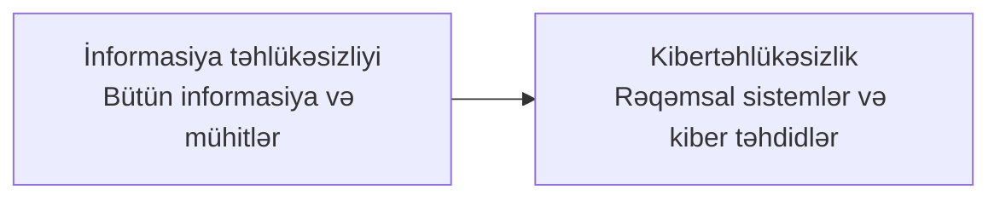

# İnformasiya təhlükəsizliyi və kibertəhlükəsizlik

**İnformasiya təhlükəsizliyi** və **kibertəhlükəsizlik** gündəlik danışıqda çox vaxt eyni mənada işlədilir. Onlar bir-birinə çox yaxındır, lakin tam sinonim deyil. Hər iki sahənin məqsədi məlumatı və onu işlədən sistemləri qorumaqdır; əsas fərq **nəyin qorunduğu və təhlükəsizliyin hansı mühitdə tətbiq olunduğudur**.

Qısa yaddaş qaydası:

> **İnformasiya təhlükəsizliyi məlumatın istənilən formada qorunmasıdır. Kibertəhlükəsizlik isə rəqəmsal sistemlərin, şəbəkələrin, cihazların, tətbiqlərin və həmin sistemlərdəki məlumatın kiberhücumlardan qorunmasıdır.**

## İnformasiya təhlükəsizliyi nədir?

İnformasiya təhlükəsizliyi (Information Security və ya **Infosec**) məlumatın **məxfiliyini, bütövlüyünü və əlçatanlığını** qorumaq üçün tətbiq edilən siyasət, proses, insan, fiziki və texniki nəzarətlərin məcmusudur. Bu məlumatın kompüterdə olması vacib deyil: kağız sənəd, şifahi məlumat, USB daşıyıcısı, serverdəki verilənlər bazası və ehtiyat nüsxə də informasiya aktividir.

İnformasiya təhlükəsizliyinin əsas sualları bunlardır:

- Məlumatı yalnız görməyə icazəsi olan şəxslər görə bilirmi?
- Məlumat icazəsiz və ya səhv şəkildə dəyişdirilməyibmi?
- Məlumat lazım olan vaxt səlahiyyətli istifadəçiyə əlçatandırmı?
- Məlumatın kim tərəfindən, nə vaxt və hansı məqsədlə istifadə edildiyini göstərə bilirikmi?

Məsələn, şirkət məxfi müqavilələri kilidli şkafda saxlayır, həmin şkafa girişi məhdudlaşdırır, sənədlərin məhv edilməsini qeydiyyata alır və əməkdaşlara məlumatın necə idarə olunacağını öyrədirsə, bu informasiya təhlükəsizliyidir. Burada kompüter və ya internet hücumu mütləq deyil.

## Kibertəhlükəsizlik nədir?

Kibertəhlükəsizlik (Cybersecurity) kompüterlərin, serverlərin, mobil və IoT cihazlarının, şəbəkələrin, bulud xidmətlərinin, tətbiqlərin və rəqəmsal məlumatın icazəsiz giriş, istismar, pozulma, məlumat sızması və xidmətin dayandırılması kimi kiber təhdidlərdən qorunmasıdır.

Kibertəhlükəsizlik texnologiya ilə məhdudlaşmır. Güclü firewall-a malik olmaq kifayət deyil; təhlükəsiz konfiqurasiya, yamaqların vaxtında quraşdırılması, giriş hüquqlarının idarə edilməsi, logların izlənməsi, istifadəçi təlimi və insidentə cavab planı da bu sahəyə daxildir.

Kibertəhlükəsizliyin tipik işləri:

- endpoint, server və şəbəkə trafikini izləmək;
- zəiflikləri tapmaq və yamaqlamaq;
- çoxfaktorlu autentifikasiya və ən az imtiyaz prinsipini tətbiq etmək;
- zərərli proqramı, fişinqi, ransomware-i və icazəsiz giriş cəhdlərini aşkar etmək;
- hadisəni araşdırmaq, yayılmanı məhdudlaşdırmaq və sistemləri bərpa etmək;
- ehtiyat nüsxələri mütəmadi yoxlamaq və bərpa sınaqları keçirmək.

## Əsas fərq: əhatə dairəsi

İnformasiya təhlükəsizliyi daha geniş çətirdir; kibertəhlükəsizlik həmin çətirin rəqəmsal və şəbəkəyə bağlı hissəsinə fokuslanır.

| Mövzu | İnformasiya təhlükəsizliyi | Kibertəhlükəsizlik |
|---|---|---|
| Qorunan aktiv | İstənilən formada informasiya: kağız, şifahi, fiziki və rəqəmsal | Rəqəmsal cihazlar, şəbəkələr, tətbiqlər, bulud və elektron məlumat |
| Təhlükələr | Səhv paylaşma, oğurluq, yanğın, daxili sui-istifadə, səhv silinmə və kiberhücum | Fişinq, malware, ransomware, DDoS, istismar, hesab ələ keçirmə və məlumat sızması |
| Nəzarətlər | Siyasətlər, məlumat təsnifatı, fiziki giriş, məhv etmə qaydası, təlim, audit | Firewall, EDR/antivirus, IDS/IPS, SIEM, MFA, şifrələmə, zəiflik idarəetməsi |
| Nəticə | Məlumatın bütün həyat dövrü üzrə qorunması | Rəqəmsal mühitdə hücumların qarşısının alınması, aşkarlanması və onlara cavab |

Bu cədvəl sərt sərhəd deyil. Məsələn, məlumat təsnifatı həm Infosec siyasətidir, həm də DLP qaydalarının texniki əsasını yaradır. Əksər təşkilatlarda eyni komanda hər iki sahə ilə məşğul olur.

## Onlar necə əlaqəlidir?

Kibertəhlükəsizlik informasiya təhlükəsizliyinin **alt çoxluğu** kimi düşünülə bilər:

Ancaq bu, “biri digərindən vacibdir” demək deyil. Şəbəkə hücumunu bloklayan firewall çox faydalıdır, lakin server otağına icazəsiz şəxsin daxil olması və ya əməkdaşın məxfi sənədi səhv ünvana göndərməsi də informasiya təhlükəsizliyi hadisəsidir. Rəqəmsal nəzarətlərin yaxşı olması bu riskləri avtomatik həll etmir.

## CIA triadası: hər iki sahənin ortaq təməli

Həm Infosec, həm də kibertəhlükəsizlik **CIA triadasına** əsaslanır:

| Prinsip | Mənası | Nümunə nəzarət |
|---|---|---|
| **Məxfilik (Confidentiality)** | Məlumatı yalnız səlahiyyətli şəxslər görür | Giriş hüquqları, şifrələmə, məlumat təsnifatı |
| **Bütövlük (Integrity)** | Məlumat icazəsiz dəyişdirilmir və korlanmır | Hash, rəqəmsal imza, fayl bütövlüyü monitorinqi |
| **Əlçatanlıq (Availability)** | Səlahiyyətli istifadəçi məlumatı lazım olan vaxt əldə edir | Backup, bərpa sınağı, RAID, redundans, DDoS müdafiəsi |

Pozuntu üçün mütləq hücumçu lazım deyil. Səhv konfiqurasiya məxfiliyi, yanlış skript bütövlüyü, elektrik kəsilməsi isə əlçatanlığı poza bilər. CIA triadası motivi deyil, nəticəni təsnif edir.

## İnformasiya təhlükəsizliyinin əsas sahələri

İnformasiya təhlükəsizliyi proqramı adətən aşağıdakı sahələri əhatə edir:

1. **İdarəetmə və risk:** təhlükəsizlik siyasəti, risk qiymətləndirməsi, uyğunluq və vendor riskləri.
2. **Məlumatın idarə edilməsi:** təsnifat, saxlanma müddəti, paylaşma, arxivləşdirmə və təhlükəsiz məhvetmə.
3. **İnsan və proses:** təhlükəsizlik məlumatlılığı, vəzifələrin ayrılması, işə qəbul və işdən çıxış prosedurları.
4. **Fiziki təhlükəsizlik:** server otağına giriş, kilidlər, kamera, yanğın və elektrik kəsintisinə hazırlıq.
5. **Girişin idarə edilməsi:** autentifikasiya, avtorizasiya, MFA, ən az imtiyaz və mütəmadi giriş baxışı.
6. **Davamlılıq və bərpa:** insidentə cavab, biznesin davamlılığı, fəlakətdən bərpa və test edilmiş backup.
7. **Kibertəhlükəsizlik əməliyyatları:** endpoint, şəbəkə və bulud təhlükəsizliyi, zəifliklərin idarəsi və monitorinq.

## Kibertəhlükəsizliyin əsas sahələri

Kibertəhlükəsizlik daha çox rəqəmsal hücum səthinə yönəlir:

- **Şəbəkə təhlükəsizliyi:** firewall, seqmentasiya, VPN, IDS/IPS və təhlükəsiz protokollar.
- **Endpoint təhlükəsizliyi:** antivirus və EDR, cihaz sərtləşdirməsi, tətbiq nəzarəti və disk şifrələməsi.
- **Tətbiq və API təhlükəsizliyi:** təhlükəsiz proqramlaşdırma, kod yoxlaması, autentifikasiya və OWASP riskləri.
- **Bulud təhlükəsizliyi:** IAM, təhlükəsiz saxlama konfiqurasiyası, workload qorunması və audit logları.
- **Təhdid aşkarlanması və cavab:** SIEM, threat hunting, rəqəmsal kriminalistika və insidentə cavab.
- **İstifadəçi təhlükəsizliyi:** fişinqdən qorunma, parol siyasəti, MFA və şübhəli fəaliyyətin bildirilməsi.

## Təhlükələrə nümunələr

PDF-də sadalanan zərərli proqram növləri bu sahəni başa düşmək üçün faydalıdır:

- **Virus** fayllara və ya proqramlara qoşularaq yayıla bilər.
- **Worm (soxulcan)** istifadəçi müdaxiləsi olmadan şəbəkə və sistemlər arasında yayıla bilər.
- **Trojan** faydalı və ya qanuni proqram kimi görünərək zərərli əməliyyat icra edə bilər.
- **Spyware (casus proqram)** istifadəçini və ya sistemi gizli şəkildə izləyib məlumat toplaya bilər.
- **Ransomware (fidyə proqramı)** məlumatı şifrələyib açar qarşılığında ödəniş tələb edə bilər.

Fişinq mesajı ilə başlayan ransomware hadisəsi həm kibertəhlükəsizlik hadisəsidir, həm də informasiya təhlükəsizliyi problemidir: rəqəmsal sistemlər hücuma məruz qalır, məlumatın məxfiliyi və ya əlçatanlığı pozulur, təşkilat isə proses və bərpa qərarları verməlidir.

## Praktik nümunələr: hansına aiddir?

| Hadisə | Əsasən hansı sahə? | Səbəb |
|---|---|---|
| Server otağına icazəsiz şəxsin daxil olması | İnformasiya təhlükəsizliyi | Fiziki informasiya aktivlərinin qorunmasıdır |
| Əməkdaşın məxfi kağız sənədi printerdə qoyması | İnformasiya təhlükəsizliyi | Rəqəmsal hücum olmadan məxfilik pozulur |
| Fişinq linki ilə Microsoft 365 hesabının ələ keçirilməsi | Hər ikisi | Kiber hücum informasiya aktivinə təsir edir |
| Web tətbiqində SQL injection | Kibertəhlükəsizlik | Rəqəmsal tətbiqin istismarıdır |
| Backup serverinin elektrik kəsintisindən sonra işləməməsi | Hər ikisi | Əlçatanlıq və biznesin davamlılığı riski yaranır |
| İşçinin bütün sistemlərdə ortaq admin parolundan istifadə etməsi | Hər ikisi | Proses zəifliyi rəqəmsal hücumu asanlaşdırır |

## Sağlam təhlükəsizlik proqramı necə qurulur?

1. **Aktivləri və məlumatı inventarlaşdırın.** Nəyi qoruduğunuzu bilmədən risk qiymətləndirmək mümkün deyil.
2. **Məlumatı təsnifləşdirin.** Məlumatın həssaslığına görə kimlərin daxil ola biləcəyini və nə qədər saxlanacağını müəyyənləşdirin.
3. **Əsas nəzarətləri tətbiq edin.** MFA, ən az imtiyaz, patch idarəetməsi, şifrələmə, backup və fiziki giriş nəzarəti başlanğıc üçün vacibdir.
4. **İnsanları hazırlayın.** İstifadəçilərə şübhəli e-poçtu, USB-ni və məlumat paylaşma risklərini tanımağı öyrədin.
5. **İzləyin və sınayın.** Logları toplayın, xəbərdarlıqları yoxlayın, zəiflikləri skan edin və backup-dan bərpanı real ssenari ilə sınaqdan keçirin.
6. **Hadisəyə cavabı əvvəlcədən planlayın.** Kim qərar verir, hansı sistem təcrid olunur, kimə xəbər verilir və sübutlar necə qorunur — bunlar insident zamanı ilk dəfə düşünülməməlidir.

## Nəticə

**İnformasiya təhlükəsizliyi** daha geniş anlayışdır: məlumatı kağızda, danışıqda, cihazda, buludda və proseslər daxilində qoruyur. **Kibertəhlükəsizlik** bu çərçivənin rəqəmsal sistemlərə və kiber təhdidlərə yönəlmiş hissəsidir. Bir təşkilat yalnız firewall və antivirus quraşdırmaqla informasiya təhlükəsizliyini təmin etmiş sayılmır. Effektiv müdafiə siyasətləri, insanlar, fiziki nəzarətlər, texnologiya, monitorinq və sınaqdan keçirilmiş bərpanın birlikdə işləməsindən yaranır.
