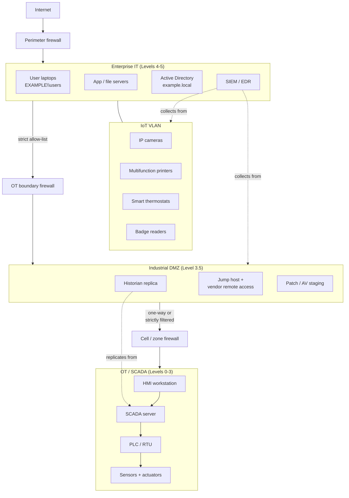

# Quraşdırılmış sistemlər, IoT və ICS təhlükəsizliyi

## Niyə bu vacibdir

Əvvəllər korporativ şəbəkə serverlərin, noutbukların və printerlərin siyahısı idi. Bu gün eyni şəbəkədə həm də girişdəki kart oxuyucular, zirzəmidəki HVAC kontrolleri, avtodayanacaqdakı IP kameralar, sex mərtəbəsindəki etiket printerləri, konveyeri idarə edən PLC, xəstə şöbəsindəki infuziya nasosu və iclas otağındakı ağıllı televizor işləyir. Bu cihazların əksəriyyətini IT-yə tabe olmayan komanda alıb, illər öncə ayrılmış inteqrator quraşdırıb və yeniləmələr — əgər ümumiyyətlə olubsa — yalnız tədarükçü icazə verdikdə tətbiq edilib. 2026-cı ildə tipik orta ölçülü müəssisənin şəbəkəsində noutbuklardan çox sayda quraşdırılmış cihaz var və onların yalnız kiçik bir hissəsi CMDB-də qeydə alınıb.

Bu cihazların hər biri bir **quraşdırılmış sistemdir** (embedded system): kompüter kimi satılmayan bir şeyin içində gizlənmiş məqsədyönlü kompüter. Bir-biri ilə IP üzərindən ünsiyyət qurduqda bu birliyi **IoT** (Internet of Things — Əşyaların İnterneti) adlandırırıq. Fiziki prosesləri — nasosları, klapanları, turbinləri, konveyer lentlərini — idarə etdikdə buna **OT** (Operational Technology — Əməliyyat Texnologiyası) deyilir və idarəetmə proqramlarının ümumi adı **ICS** (Industrial Control Systems) və ya **SCADA** (Supervisory Control and Data Acquisition) olur. Bu kateqoriyalar bir-birini üst-üstə düşür: ağıllı termostat IoT-dir, onunla danışan bina miqyaslı HVAC kontrolleri OT-dir və hesabat üçün hər şeyi saxlayan historian bazası hər iki dünyanın arasında dayanır.

Təhlükəsizlik mənzərəsi çirkindir. Quraşdırılmış sistem tədarükçüləri təhlükəsizliyi deyil, qiyməti və funksiya sürətini optimallaşdırırlar. Defolt hesab məlumatları istifadəçi təlimatında sənədləşdirilib. Proqram təminatı yeniləmələri gec, USB portu vasitəsilə, bəlkə də heç vaxt gəlmir. Cihaz istehsaldan bəri yenilənməmiş çipdə 2014-cü il Linux kernelini işlədir. Şəbəkə yığını eyni VLAN-dakı hər şeyə etibar edir. Və cihaz "kompüter deyil" olduğu üçün heç kim onun domendə olmalı, skan edilməli, loglanmalı və ya MFA-ya malik olmalı olduğunu soruşmur.

Hadisələr bu laqeydliyi izləyir. Mirai 62 defolt hesab məlumatlarının siyahısından istifadə edərək yüz minlərlə IP kamera və DVR-ı ələ keçirdi. Stuxnet göstərdi ki, dövlət dəstəkli aktor PLC vasitəsilə sənaye sentrifuqalarını məhv edə bilər. Target şirkətindəki sızma bir HVAC tədarükçüsündən başladı. Tək bir HMI iş stansiyasındakı ransomware boru kəmərlərini, xəstəxanaları və qida emalı zavodlarını dayandırdı. Bunların heç biri yeni kriptoqrafik yarışma tələb etmirdi; hamısı müdafiəçinin çatılan şəbəkədə tədarükçü defoltları ilə quraşdırılmış cihazı buraxmasını tələb edirdi.

Müdafiəçi tərəfindəki iqtisadi mənzərə eyni dərəcədə narahatedicidir. SIEM lisenziyasına büdcə ayrılır, çünki maliyyə direktoru sızmanı təsəvvür edə bilir. Bina avtomatlaşdırma VLAN-ını seqmentləşdirmək, inteqrator üçün jump host əlavə etmək və HVAC tədarükçüsünün noutbukuna birbaşa şəbəkə girişini qadağan etmək — bunlar heç kimin dashboard-unda görünmür, ta ki artıq baş verməyən bir hadisənin qarşısının alındığı gün gələnə qədər. İş cəlbedici deyil, funksiyalararasıdır və asanlıqla təxirə salına bilər. Eyni zamanda bu, kiçik təhlükəsizlik komandasının edə biləcəyi ən yüksək təsirli işdir.

Bu dərs bu mənzərəni gəzir: aparat kateqoriyalarının (Raspberry Pi, Arduino, FPGA, SoC) nə olduğu, SCADA/ICS mühitlərinin IT şəbəkələrindən necə fərqləndiyi, ixtisaslaşdırılmış sistemlərin (tibbi, nəqliyyat, aviasiya, ağıllı sayğaclar) gətirdikləri, bu cihazlarda hansı rabitə texnologiyalarının (5G, Zigbee, dar zolaq, SIM) göründüyü və hər qərarı formalaşdıran dizayn məhdudiyyətləri — güc, hesablama, yeniləmə, nəzərdə tutulan etibar. `example.local` üzrə işlənmiş nümunə ilə bitirəcəyik: obyekt HVAC üçün sənaye SCADA stekini yerləşdirən orta ölçülü müəssisə və təhlükəsizliyin hər qatda necə toxunduğu.

## Əsas anlayışlar

### Quraşdırılmış və ümumi təyinatlı sistemlər

**Ümumi təyinatlı kompüter** — noutbukunuz, server, virtual maşın — ixtiyari iş yüklərini icra etmək üçün qurulub. Onun tam OS-ü, paket meneceri, yeniləmə strategiyası, istifadəçi modeli və günlərlə ölçülən yeniləmə həyat dövrü var. **Quraşdırılmış sistem** isə əksidir: on il boyu bir iş görmək üçün qurulmuş, daha böyük məhsulun içində lehimlənmiş sabit təyinatlı kompüter. Linux, RTOS işlədə bilər və ya ümumiyyətlə OS-suz ola bilər. Onun çox vaxt paket meneceri, uzaqdan shell, syslog və seriya portunda heç kimin qoşulmadığı root əmrindən başqa istifadəçi hesabı olmur.

Təhlükəsizlik üçün nəticələr:

| Xüsusiyyət | Ümumi təyinatlı | Quraşdırılmış |
|---|---|---|
| Yeniləmə tezliyi | Ən azı aylıq | Nadir, çox vaxt heç vaxt |
| Yeniləmə kanalı | OS tədarükçüsü + app store | İstehsalçıdan firmware obrazı |
| İstifadəçi modeli | Çox istifadəçili, RBAC | Adətən yoxdur və ya bir sabit admin |
| Hücum səthi | Geniş, lakin məlum | Dar, lakin monitorinq edilmir |
| Həyat dövrü | 3–5 il | Sahədə 10–20 il |
| Monitorinq | SIEM agentləri, EDR | Adətən yoxdur |
| Dizayn prioritetləri | Təhlükəsizlik + uyğunluq | Qiymət + funksiya sürəti |
| Tənzimləmə | Sektora xas | Çox vaxt heç yox |

Mükafat proqnozlaşdırıla bilənlikdir: quraşdırılmış sistem bir işi həmişəlik etibarlı şəkildə yerinə yetirir. Qiyməti isə boşluq yaranarkən reaksiya üçün məhdud alətlərə malik olmağınızdır. Quraşdırılmış təhlükəsizlik hadisələrinin böyük əksəriyyəti cihazların **tam olaraq dizayn edildiyi şeyi etməsindən** gəlir — Modbus yazısına cavab vermək, firmware obrazını qəbul etmək, autentifikasiyasız yoldaşa etibar etmək — dizayn edənin heç vaxt nəzərdə tutmadığı hücumçu tərəfindən istifadə edilməsi.

### İnkişaf platformaları — Raspberry Pi, Arduino, FPGA

Korporativ mühitlərdə dəfələrlə görünən üç prototipləmə platforması — bəzən qanuni alətlər kimi, bəzən isə kiminsə məhsuldar şəbəkəyə qoşduğu kölgə IT kimi.

**Raspberry Pi.** ARM prosesorunda tam Linux distributivi işlədən aşağı qiymətli tək lövhəli kompüter (100 USD-dən aşağı). Tipik göstəricilərə dörd nüvəli CPU, bir neçə qiqabayt RAM, 2,4 və 5 GHz Wi-Fi, Bluetooth, Gigabit Ethernet, USB, aparatla əlaqə üçün GPIO pinləri və masaüstü kimi fəaliyyət göstərmək üçün kifayət qədər güc daxildir. Tam Linux maşını olduğu üçün ona hər hansı Linux hostu kimi yanaşın: unikal hesab məlumatları, SSH açar autentifikasiyası, avtomatik yeniləmələr, host firewall və aktiv inventarında yer tutması. Onu həvəskarlar arasında populyar edən rahatlıq eyni zamanda onu kiminsə stolunun altına qoşulmuş icazəsiz jump box kimi və az həcmli kommersiya məhsullarında istehsal elementi kimi populyar edir.

**Arduino.** Mikrokontroller lövhəsidir, kompüter deyil. Defolt olaraq OS, fayl sistemi və ya şəbəkə yoxdur — güc tətbiq edildikdə proqram birbaşa çipdə işləyir. Sensor girişi və aktuator çıxışı üçün, xüsusilə sensorlar və cihazlarla əlaqə üçün nəzərdə tutulub. Güc itdikdə və bərpa olunduqda cihaz yenidən işə başlaya bilər — kompüterdən fərqli olaraq, kompüter yenidən yüklənməli olur. Arduino platforması şəbəkə, ekran, məlumat qeydiyyatı və digər xüsusi funksiyalar əlavə edən **shield** adlanan bir sıra əlavə lövhələrlə genişlənir. Təhlükəsizlik hekayəsi Pi-dən fərqlidir: hücum ediləsi şəbəkə interfeysi nadirdir, lakin çipdəki kod adətən imzalanmamışdır və onu fiziki olaraq dəyişmək asandır. Arduino-lar xüsusi aparat layihələrində, laboratoriya avadanlıqlarında və meyker tərəfindən qurulan obyekt əlavələrində görünür.

**FPGA (Field Programmable Gate Array — Sahədə Proqramlaşdırıla Bilən Qate Massivi).** Proqramlaşdırıla bilən interkonnektlər vasitəsilə birləşdirilmiş konfiqurasiya edilə bilən məntiq bloklarının (CLB) matrisindən qurulmuş yarımkeçirici çiplər. Məntiq istehsaldan sonra VHDL və ya Verilog kimi aparat təsvir dilləri vasitəsilə proqramlaşdırılır və dizayn inkişaf etdikcə yenidən proqramlaşdırıla bilər. ASIC-lərdən (zavodda tək funksiya üçün hazırlanmışdır) fərqli olaraq, FPGA sahədə yenidən konfiqurasiya edilə bilər. Rəqəmsal siqnal emalı, təsvir və video ardıcıllıqları, kriptoqrafik sürətləndirmə və proqram təminatı ilə təyin edilən radiolar (radionun funksiyası proqramda təyin edilir və yenilənə bilər) üçün istifadə olunur. Təhlükəsizlik xüsusiyyətləri: FPGA-ya yüklənən bit axını imzalana və ya şifrələnə bilər; köhnə və ya ucuz hissələr bunu tətbiq etmir və bədniyyətli bit axını əvəzlənə bilər. FPGA-lar paralellikdə fərqlənirlər — bir anda çoxlu müstəqil tapşırıq emal edə bilirlər, buna görə real zaman təsvir ardıcıllıqlarında və kripto sürətləndiricilərində görünürlər. Çatışmazlıqlar: HDL bacarığı tələb edir və eyni iş yükü üçün xüsusi ASIC-dən daha çox güc istehlak edə bilər.

**Geyilə bilən cihazlar.** İnkişaf lövhəsi dünyasının yaxın qohumu — fitnes izləyiciləri, ağıllı saatlar, adətən stripped-down Linux və ya RTOS işlədən kiçik kompüter ətrafında qurulmuş biometrik sensorlar. Geyilə bilən cihazlar getdikcə daha zəngin məlumat mənbələrinə çevrilir (ürək döyüntüsü, yuxu, məkan, fəaliyyət) və bu məlumatı qorumaq onların əsas təhlükəsizlik məqsədidir.

### SCADA / ICS baxışı

**SCADA** (Supervisory Control and Data Acquisition) şəbəkəli kompüterlər vasitəsilə fiziki prosesləri idarə edən sistemlər üçün ümumi termindir. Sahəyə görə **DCS** (Distributed Control System — Paylanmış İdarəetmə Sistemi) və ya **ICS** (Industrial Control Systems — Sənaye Nəzarət Sistemləri) adlarını da eşidə bilərsiniz — praktiki olaraq eyni şeyi təsvir edirlər. Kompüterlər birbaşa fiziki prosesi idarə etdiyi yerdə SCADA mənzərədədir.

SCADA bir çox sahədə görünür:

- **Obyektlər.** Bina avtomatlaşdırması, HVAC, liftlər, su təzyiqi nasosları, yanğın həyəcanları, giriş nəzarətləri.
- **Sənaye müəssisələri.** Ətraf mühit monitorinqi, nəzarət, yanğın sistemləri, ümumi proses kompüter nəzarəti.
- **İstehsal.** Sensor göstəriciləri və aktuator parametrlərinə əsasən prosesə xas təlimatları icra edən proqramlaşdırıla bilən məntiq kontrolleri — istehsal xətləri biznes üçün kritik olduğundan burada sərt şəbəkə seqmentasiyası standart təcrübədir.
- **Enerji.** Elektrik istehsalı və bölgüsü, kimyəvi, neft, boru kəmərləri, nüvə, günəş, hidrotermal. Xüsusilə bölgü coğrafi olaraq geniş — boru kəmərləri və ötürmə xətləri korporativ perimetrdən kənarda yerləşir.
- **Logistika.** Materialı A nöqtəsindən B nöqtəsinə dənizlə, dəmir yolu, yol və ya hava ilə daşımaq. İdarə olunan iki şey: nəqliyyat sistemi və materialın özü.

Tipik SCADA yığınında beş tanına bilən qat var, adətən **Purdue Enterprise Reference Architecture** səviyyələrinə xəritələnir:

- **Səviyyə 0 — Sahə cihazları.** Sensorlar və aktuatorlar — temperatur zondları, axın sayğacları, klapanlar, motorlar.
- **Səviyyə 1 — Kontrollerlər.** Sensor oxuyan və aktuatoru real vaxtda idarə edən PLC-lər (Programmable Logic Controllers) və RTU-lar (Remote Terminal Units).
- **Səviyyə 2 — Nəzarət / HMI.** Operatorların prosesi gördüyü və müdaxilə edə biləcəyi İnsan-Maşın İnterfeysi iş stansiyaları. Historian-lar (zaman sıralı verilənlər bazaları) hər şeyi qeyd edir.
- **Səviyyə 3 — Əməliyyat idarəetməsi.** Müəssisə üzrə MES, batch meneceri, mühəndislik iş stansiyaları.
- **Səviyyələr 4 / 5 — Korporativ IT.** Korporativ şəbəkə, ERP, e-poçt və biznesin qalan hissəsi.

Tarixən Səviyyə 0–3 IT şəbəkəsindən **air-gapped** (hava boşluğu ilə ayrılmış) idi — birbaşa şəbəkə bağlantısı olmadan, məlumat USB və ya əl ilə ötürülürdü. Bu izolyasiya aşınır: müasir biznes ERP-də real vaxt istehsal məlumatı, uzaqdan tədarükçü dəstəyi və bulud analitikası istəyir. Hər yeni bağlantı hücum səthini genişləndirir və hər SCADA mühiti indi əvvəllər lazımsız olan IT tərzi nəzarətlərə ehtiyac duyur: seqmentasiya, monitorinq, autentifikasiya, yeniləmə. SCADA şəbəkəsi adi IT şəbəkəsinə nə qədər bənzəyirsə, bir o qədər IT tərzi təhlükəsizliyə ehtiyacı olur.

### IoT cihaz anatomiyası

Müxtəlifliyə baxmayaraq, əksər IoT cihazları ümumi formaya malikdir:

- **Sensor və ya aktuator** — cihazın mövcud olma səbəbi (temperatur zondu, kamera sensoru, motor sürücüsü).
- **Mikrokontroller və ya SoC** — firmware işlədir, sensorla danışır, radiosu idarə edir.
- **Radio** — Wi-Fi, Bluetooth, Zigbee, hüceyrəli, LoRa və ya oxşar.
- **Firmware obrazı** — adətən bir dəfə qurulmuş və milyonlarla cihaza yerləşdirilmiş quraşdırılmış Linux və ya RTOS.
- **Bulud arxa ucu** — cihazın zəng etdiyi tədarükçünün xidməti, çox vaxt MQTT və ya HTTPS vasitəsilə.
- **Mobil tətbiq** — son istifadəçinin cihazı konfiqurasiya etdiyi yer.

Ümumi xətalar bu hissələri izləyir: defolt hesab məlumatları, imzalanmamış firmware, açıq mətn protokolları, sabitlənmiş bulud son nöqtələri və hər autentifikasiya edilmiş cihaza etibar edən bulud API-ləri. IoT tədarükçüləri funksiya miqyasını qovur; təhlükəsizlik əgər varsa, ikinci sıradadır.

**Sensorlar** öz cümləsinə layiqdir. Onlar fiziki siqnalı (temperatur, təzyiq, gərginlik, mövqe, rütubət) rəqəmsal oxunuşa çevirirlər. Dəqiqlik, diapazon, nümunə götürmə dərəcəsi və ətraf mühit dayanıqlığı dizayn oxlarıdır. İldə bir dəfə 5% sürüşən rütubət sensoru hələ də işləyir; təhlükəsizlik kilidini qidalandıran sensor səssizcə sürüşərsə, hadisəyə səbəb ola bilər. Təhlükəsizlik baxımından sensorlar əsasən maraqlıdır, çünki onların **oxunuşları girişlərdir** ki, aşağı axın məntiqi onlara etibar edir — sensoru saxtalaşdırmaq bəzən kontrolleri sındırmaqdan daha asandır.

**Obyekt avtomatlaşdırması** — bütün bunların binada bir araya gəldiyi yer: təhlükəsizlik sistemləri, HVAC, yanğın sensorları, lift nəzarətləri, qapı oxuyucuları və aralarındakı hadisələri bağlayan IFTTT tipli avtomatlaşdırma qaydaları. Mükafat reaksiya sürəti və aradan qaldırılan əl xətalarıdır; qiyməti isə tək bir komprometasiyanın təsir dairəsini genişləndirən sıx, bir-birinə bağlı idarəetmə səviyyəsidir.

### İxtisaslaşdırılmış sistemlər — tibbi, nəqliyyat, aviasiya, ağıllı sayğaclar

Dörd ixtisaslaşdırılmış kateqoriya ayrıca rəftara layiqdir, çünki istismarın təhlükəsizlik nəticələri var — insanlar zərər görür, sadəcə məlumat itmir.

**Tibbi cihazlar.** Ritm sürücüləri, infuziya nasosları, MRT maşınları, laboratoriya analizatorları. Tez-tez cihaz beş və ya on il əvvəl göndəriləndə aktual olan azaldılmış quraşdırılmış Linux kernellərini işlədirlər. Tənzimləyici təsdiq (FDA 510(k), EU MDR) yeniləməni yavaş bir proses edir, çünki hər hansı dəyişiklik yenidən sertifikatlaşdırma tələb edə bilər. Baza kernel versiyası qocaldıqca, yuxarı axın kodunda yeni boşluqlar görünür və quraşdırılmış cihaz yenilənə bilməyən versiyada dondurulmuş qalır. Xəstə təhlükəsizliyi onları yüksək təsirli hədəflər edir, buna görə FDA indi kibertəhlükəsizliyi bazar öncəsi təqdimatlarda açıq şəkildə tələb edir.

**Nəqliyyat vasitələri.** Müasir avtomobildə **CAN şinində** (Controller Area Network) yüzlərlə mikrokontroller var. Robert Bosch 1980-ci illərdə böyük naqil paketlərini əvəz etmək üçün CAN şinini hazırladı və BMW 1986-cı ildə ilk CAN avtomobilini göndərdikdə naqil çəkisi 100 funtdan çox azaldı. 2008-ci ildən yeni ABŞ və Avropa avtomobillərində CAN şini məcburidir. Şin autentifikasiya olmadan dizayn edilib — hər hansı nod hər hansı mesaj göndərə bilər — və tədqiqat (Miller və Valasek-in 2015-ci il Jeep hack-i, davam edən Tesla və Toyota CAN işi) dəfələrlə göstərib ki, infotainment və ötürmə eyni şini paylaşdıqda tam uzaqdan nəzarət mümkündür. Nümayiş olunmuş hücumlar arasında internet üzərindən hərəkətdə olan avtomobili söndürmək və əyləncə, sükan və əyləci manipulyasiya etmək var.

**Aviasiya.** Müasir pilot kabinələri "tam şüşəlidir" — analoq göstəriciləri toxunma ekranlar əvəz edir. Uçuş zamanı əyləncə tez-tez standart Linux işlədir və fiziki izolyasiya deyil, firewall-larla ayrılmış eyni uçuş aparatı şəbəkəsində oturur. Aviasiya tənzimləməsi ilə yeniləmə boğulur; ümumi boşluqlar digər yerlərdə təmizlənirkən köhnə OS versiyalarında toplanır.

**Ağıllı sayğaclar.** Qabaqcıl Ölçmə İnfrastrukturu (AMI) ABŞ Enerji Departamentinin təşəbbüsüdür və kommunal xidmətlərə hər sayğacla iki yönlü rabitə verir — real vaxt istifadəsi (aylıq əl oxunuşu deyil, dəqiqələrlə dənəvərlik), uzaqdan xidmət dəyişikliyi, bağlanma, yenidən birləşmə, dayanma aşkarlanması. Hücum səthi sayğacın radiosunu, məhəllə konsentratorunu və kommunal xidmətin baş ucunu əhatə edir. Kompromis edilmiş baş uc kütləvi bağlantıyı kəsmə əmrləri verə bilər — bunun təsiri nəzəri deyil.

**Real vaxt əməliyyat sistemləri (RTOS).** Bu ixtisaslaşdırılmış cihazların bir çoxu ümumi təyinatlı OS əvəzinə RTOS işlədir. RTOS elə dizayn edilib ki, hər giriş müəyyən vaxt büdcəsi daxilində emal olunur; Windows və Linux kimi ümumi təyinatlı OS-lər real vaxt prosessorlar üçün zəifdir, çünki çoxlu thread-lərin planlaşdırılmasının əlavə yükü proqnozlaşdırıla bilməyən gecikməyə səbəb olur. RTOS dizaynının təhlükəsizlik nəticəsi odur ki, vaxt büdcəsinə müdaxilə edən istənilən hadisə sistemin tapşırığını yerinə yetirməməsinə səbəb ola bilər — və RTOS tək bir işə sıx şəkildə yönləndirildiyi üçün yamalar və yeniləmələr nadirdir. Uzun ömürlü, yamasız, vaxt həssas cihazları planlaşdırın və müvafiq olaraq kompensasiya nəzarətləri qurun.

**Nəzarət sistemləri** də öz paraqrafına layiqdir. Mətbuat və korporativ mühitlərdə təsvir prosessorları və 4K axınları olan yüksək dərəcəli rəqəmsal kameralar görünür və əksəriyyəti həmişə aktiv VPN daşıyır, çünki görüntü qorunmağa dəyər. Spektrin digər ucunda ucuz istehlakçı kameraları var — ev nəzarəti, uşaq monitorları, qapı zəngləri — zəif defoltlarla göndərilir və Mirai botnet nodları kimi ikinci həyat yaşayır.

Adlandırılmağa layiq digər ixtisaslaşdırılmış sistemlər:

- **VoIP telefonlar.** Korporativ səs şəbəkəsi indi IP trafikidir. VoIP xidmətdən imtina, toll fırıldaqçılığı (kənar şəxslərin sizin PBX-də beynəlxalq zənglər etməsi), dinləmə və spoofingə qarşı həssasdır. Əvvəllər ənənəvi telefon şirkəti bunun çoxunu idarə edirdi; VoIP ilə bu sizin üzərinizdədir. SIP over TLS və media axını üçün SRTP baza təminatıdır.
- **HVAC / bina avtomatlaşdırması.** Parlaq deyil, lakin nəticəlidir — 2013-cü il Target sızmasının giriş nöqtəsi HVAC tədarükçüsü idi. "Ağıllı bina" sistemləri mərkəzi monitorinq üçün müstəqildən internetə qoşulmuşa keçib; hücum səthi müvafiq olaraq böyüyüb.
- **Dronlar / UAV-lar.** Uzaqdan radio idarəsi, kamera telemetriyası, autopilot firmware-i. Hətta həvəskar dronları mürəkkəb autopilotlar daşıyır. Korporativ yerləşdirmələr (yoxlama, ölçmə, çatdırılma) filo idarəetməsini və video qəbulunu əlavə edir.
- **Çoxfunksiyalı printerlər / MFP-lər.** Print serveri + skan + faks, tez-tez heç kimin yeniləmədiyi tam Linux işlədir. Tədqiqat göstərib ki, MFP-lər onlar vasitəsilə çap edən iş stansiyalarına zərərli proqram ötürə bilər.
- **Nəzarət kameraları.** Tez-tez sərt kodlaşdırılmış hesab məlumatları ilə göndərilir — Mirai botnet ailəsi bunlarda yaşayır. Müasir yüksək dərəcəli kameralar şəbəkə yığını, təsvir prosessoru və 4K video çıxışı olan kiçik kompüterdir; çoxu canlı yayım üçün həmişə açıq VPN təklif edir.
- **RTOS idarə olunan sənaye avadanlıqları.** Robotlar, bloklanma əleyhinə əyləc kompüterləri, montaj xətti kontrolleri — sərt real vaxt reaksiyası tələb olunan hər yerdə. Yamalar nadirdir, çünki cihaz ümumi təyinatlı platforma deyil.
- **Çipdə sistem (SoC) dizaynları.** Tək bir çipdə tam hesablama platforması (CPU, GPU, şəbəkə, bəzən yaddaş). Telefonlar, planşetlər, quraşdırılmış cihazlar üçün güc verir. Təhlükəsizlik xüsusiyyətləri SoC tədarükçüsündən miras qalır — baseband izolyasiyası, təhlükəsiz yükləmə, etibarlı icra mühiti — və tez-tez cihaz inteqratoruna qeyri-şəffafdır.

### Rabitə texnologiyaları — 5G, dar zolaq, baseband, SIM, Zigbee

İş üçün uyğun radiosu seçin. Uzaq meşədəki vəhşi təbiət sensoru və anbardakı palet izləyicisi hər ikisinin məlumat köçürməsinə ehtiyacı var, lakin düzgün cavab çox fərqlidir.

| Texnologiya | Nədir | Nə üçün yaxşıdır | Kompromis |
|---|---|---|---|
| **5G** | Ən son hüceyrəli nəsil | Geniş sahə, yüksək bant genişliyi, aşağı gecikmə | Bahalı, sadə sensorlar üçün həddindən artıq |
| **Dar zolaqlı radio** | Dar tezlik zolağında aşağı məlumat dərəcəli radio | Uzun məsafə, aşağı güc (neft sahəsi telemetriyası, uzaq sensorlar) | Kiçik bant genişliyi |
| **Baseband radiosu** | Tək kanallı, modulyasiya olunmamış siqnal | Sadə nöqtədən-nöqtəyə | Multipleksasiya yoxdur |
| **SIM kartı** | UICC-də abunəçi şəxsiyyət modulu | Hüceyrəli şəbəkələr üçün kimlik + açarlar | Fiziki oğurluq, SIM-swap hücumları |
| **Zigbee** | PAN-lar üçün IEEE 802.15.4 mesh | Ev avtomatlaşdırması, tibbi telemetriya, aşağı güc mesh | Qısa məsafə, kiçik şəbəkə |
| **Wi-Fi** | 802.11 ailəsi | Hər yerdə, yaxşı dəstəklənir | Güc aclığı |
| **Bluetooth / BLE** | Qısa məsafəli PAN | Geyilə bilən, periferiya | Qısa məsafə, qoşulma hücumları |
| **LoRa / LoRaWAN** | Uzun məsafəli aşağı güclü WAN | Şəhər miqyaslı sensor şəbəkələri | Aşağı məlumat dərəcəsi |

**Baseband** ikinci dəfə qeyd edilməyə layiqdir. Hüceyrəli cihazlarda baseband prosessoru hüceyrəli şəbəkə ilə danışan qapalı mənbəli real vaxt yığınını işlədən ayrıca bir çipdir. Tarixən bir çox baseband qüllədən gələn istənilən mesaja etibar edir, buna görə saxta baza stansiyaları (IMSI catcher-lər) işləyir. Baseband həm də ümumi olaraq ötürülmədən əvvəl daşıyıcıda kodlanan orijinal modulyasiya edilməmiş siqnala istinad edir — tək bir rabitə kanalı. Broadband isə əksinə, bir çox kanalı birlikdə yığır və onları yenidən ayırmaq üçün avadanlıq tələb edir.

**SIM kartları** abunəçi kimliyini və şəbəkənin cihazı autentifikasiya etmək üçün istifadə etdiyi kriptoqrafik açarları saxlayır. Tədarükçü identifikatoru, seriya nömrələri və uzun müddətli açarlar kimi elementlər Universal İnteqrasiya Edilmiş Dövrə Kartında (UICC) yerləşir. SIM-ə hücumlar fiziki çıxarmanı və indi məşhur olan **SIM-swap**-ı (operatoru nömrəni hücumçunun SIM-inə keçirməyə aldatmağı) əhatə edir — xüsusilə risklidir, çünki bir çox autentifikasiya axını hələ də SMS istifadə edir.

**Zigbee** kiçik, aşağı güclü şəxsi sahə şəbəkələri üçün dizayn edilmiş IEEE 802.15.4 mesh protokoludur — ev avtomatlaşdırması, tibbi sensor telemetriyası və aşağı bant genişlikli sənaye məlumatları. Məsafə və bant genişliyini illərlə ölçülən batareya ömrü ilə dəyişir. Təhlükəsizlik standartda təyin olunub, lakin tarixən ucuz istehlakçı avadanlıqları tərəfindən pis tətbiq olunub; defolt açarlar və zəif açar paylama istismar edilib.

### Dizayn məhdudiyyətləri — güc, hesablama, yeniləmə, nəzərdə tutulan etibar

Quraşdırılmış dizayndakı hər qərar ümumi təyinatlı hesablamada mövcud olmayan məhdudiyyətlərə qarşı təzyiq göstərir:

- **Güc.** Bir çox IoT cihazları illərlə batareya və ya toplanmış enerjidə işləyir. TLS, böyük kripto açarları və ya boş CPU-ya sərf olunan hər joule cihazın əsl məqsədi üçün əlçatmaz olan bir joule-dur. Güc həmçinin radio seçimini diktə edir: hüceyrəli çox şey tələb edir; Zigbee və LoRa çox az.
- **Hesablama.** Kiçik mikrokontrollerlərdə kilobaytlarla RAM və meqahersli tezlik var. Sabit zamanda AES-256, sertifikat yoxlaması və ya tam TLS əl sıxması bir neçə saniyəlik dayanma ola bilər. FPGA-lar, ASIC-lər və SoC-lər hesablama variantlarıdır; hər biri performans, çeviklik və qiyməti fərqli şəkildə dəyişir.
- **Şəbəkə.** Bant genişliyi bahalıdır (hüceyrəli məlumatlar), qıtdır (Zigbee) və ya hər ikisi. Protokollar sadələşdirilib; MQTT və CoAP HTTP-ni əvəz edir. Şəbəkələnmiş filonun dəyəri təxminən nod sayının kvadratı ilə artır, buna görə tədarükçülər hər şeyi ehtiyacı olmasa belə şəbəkəyə itələyirlər.
- **Kriptoqrafiya.** Yuxarıdakı ikisi tərəfindən idarə olunur. NIST Lightweight Cryptography layihəsi quraşdırılmış cihazlara enerji xərclərinin bir hissəsində məqbul kripto vermək üçün Ascon ailəsini standartlaşdırma üçün seçib. (Qeyd: Ascon post-kvant təhlükəsiz deyil.) Tam TLS çox ağır olduğu yerlərdə dizaynerlər əvvəlcədən paylaşılan açarlara, DTLS-ə və ya yalnız simmetrik sxemlərə müraciət edirlər — hər biri öz əməliyyat baş ağrısı ilə.
- **Yeniləmə edə bilməmək.** Əksər quraşdırılmış cihazların ekosistemində yeniləmə mədəniyyəti yoxdur — OTA konveyeri yoxdur, imzalama açarları istifadə olunmur, firmware-i müntəzəm olaraq quran CI yoxdur. Bir çox cihaz bir dəfə göndərilir və heç vaxt yenilənmir. Raspberry Pi və ya Arduino-nun aydın yeniləmə yolu var; nəzarət kamerasındakı quraşdırılmış kontrollerin yoxdur.
- **Autentifikasiya.** İxtisaslaşdırılmış cihazların çox vaxt heç bir istifadəçisi yoxdur və ya PIN-i olan bir texniki var. Tam RBAC həddindən artıqdır; PIN üstəgəl fiziki təhlükəsizlik dizayn hədəfidir. Bu, cihaz internetə baxan şəbəkədə qurtarana qədər işləyir, nə vaxt ki etibarlı quraşdırıcı haqqında nəzərdə tutulan fərziyyə buxarlanır.
- **Məsafə.** Məsafə gücün və tezliyin funksiyasıdır. Məsafəni uzatmaq güc xərcləyir və internet əlaqəsi təhlükəsizliyə baha başa gəlir. Radioya itələnən hər vat sensora verilməyən bir vatdır.
- **Qiymət.** Dəyər təklifi yerləşdirilən nod başına qiymətdir. Əlavə xüsusiyyətlər pula başa gəlir; təhlükəsizlik spesifikasiyada nadir hallarda görünən xüsusiyyətdir. Qiymət eyni zamanda cihazın mövcud olma səbəbi və cihazı qorumağın çətin olmasının səbəbidir.
- **Nəzərdə tutulan etibar.** Ən dərin məsələ. İxtisaslaşdırılmış cihazlar rəqib şəbəkələri nəzərə alaraq dizayn edilməyib, buna görə danışa bildikləri hər şeyə etibar edirlər. Onları düzgün seqmentasiya ilə əhatə edin, əks halda naqildəki hər kəsə açarları təslim edəcəklər.

Sonra klassik quraşdırılmış tələ var: **zəif defoltlar**. Cihazlar sənədləşdirilmiş admin/admin hesab məlumatları və quraşdırıcının onu dəyişdirəcəyinə dair gözlənti ilə göndərilir. Yüzlərlə sayğac, kamera və ya kommutator boyunca miqyasda əhəmiyyətli bir hissə heç vaxt dəyişdirilmir. Bu, açıq IoT sızmalarında ən çox yayılmış kök səbəbdir. Tənzimləyicilər istehlakçı IoT üçün admin-admin ilə göndərmə defoltlarını qadağan etməyə başlayıblar (Böyük Britaniya PSTI Aktı, Kaliforniya SB-327); müəssisə dərəcəli cihazlar isə tez-tez geridə qalır. Satınalma komandanız ilk yükləmədə unikal hesab məlumatlarını məcburi etməyən heç nəyi almaqdan imtina etməlidir.

## Arxitektura diaqramı

`example.local`-da həm IT, həm də OT / IoT işlədən müəssisə üçün istinad seqmentasiyası. Şəklin əsas nöqtəsi biznes IT-sini idarəetmə şəbəkəsindən ayıran ikili DMZ, üstəgəl ümumi istifadəçi trafikinin yanında heç vaxt oturmamalı IoT cihazları üçün xüsusi VLAN-lardır. Yuxarıdan aşağıya oxuyun: internetdən nə qədər uzaqlaşsanız, verilmiş qutuya çata bilən insanların və cihazların sayı o qədər az olmalıdır və autentifikasiya, qeydiyyat və dəyişiklik nəzarəti daha sərt olmalıdır.



Qaydalar: IT-də heç nə birbaşa PLC ilə danışmır; hər şey sənaye DMZ-dən keçir. Historian DMZ-də yaşayır və OT tərəfindən replikasiya olunur. Tədarükçü uzaqdan girişi MFA və sessiya qeydi olan jump host-da bitir. IoT VLAN ümumi istifadəçi alt şəbəkələrindən firewall ilə ayrılıb və yalnız bulud son nöqtələrinə və SIEM kollektoruna çatmasına icazə verilir.

Adlandırılmağa layiq ikinci model **tək yönlü şlüz** və ya **məlumat diodudur** — fiziki olaraq trafikə yalnız bir istiqamətdə icazə verən aparat komponenti (adətən OT-dən IT-yə, beləliklə historian replikası qayıtma yolu açılmadan doldurula bilər). OT kompromisinin biznes təsirinin yüksək olduğu mühitlərdə — enerji istehsalı, kimyəvi zavodlar, təhlükəsizlik alətləri ilə təchiz olunmuş sistemlər — diodlar xərcə dəyər. Bir çox müəssisə üçün deny-by-default qaydaları və qeydiyyatı ilə sərt firewall kifayətdir.

Diaqramdakı IoT VLAN OT/SCADA tərəfindən qəsdən ayrılmışdır. IoT cihazları (kameralar, kart oxuyucular, MFP-lər) istehlakçı səviyyəli şəbəkələr üçün qurulub və sənaye idarəetmə səthlərinin yaxınlığına icazə verilməməlidir. Hər ikisini yerləşdirən tək bir düz şəbəkə real dünyada ən çox yayılmış səhvdir.

## Təcrübə / praktika

Öyrənənin laboratoriya şəbəkəsinə və ya könüllü istehsal infrastrukturu parçasına qarşı işlədə biləcəyi beş məşq. Məqsəd öz gözlərinizlə görməkdir ki, quraşdırılmış və ya OT cihazı ətrafındakı şəbəkəyə nə açır. Bunların əksəriyyəti bir saatdan az çəkir və təhlükəsizlik iş stansiyasında artıq olan alətlərdən istifadə edir.

### 1. Şəbəkədə IoT cihazını barmaq izi ilə müəyyən edin

Laboratoriya VLAN-ında IP kamera, printer və ya ağıllı rozetka seçin. Linux və ya WSL qutusundan:

```bash
# Find it on the segment
nmap -sn 192.0.2.0/24

# Full service + OS fingerprint
nmap -sV -O -p- 192.0.2.50 -oN iot-fingerprint.txt

# Banner grab the web UI
curl -sI http://192.0.2.50/
curl -s http://192.0.2.50/ | head -50

# SNMP sysDescr (often leaks full model + firmware)
snmpwalk -v2c -c public 192.0.2.50 sysDescr sysName
```

Axtarın: bannerlərdə firmware versiyası, defolt veb yolları (`/cgi-bin/`, `/admin/`, `/setup.cgi`), model adını sızdıran HTTP basic auth realm-ləri, açıq Telnet (port 23), açıq RTSP (port 554) və 161-də SNMP. Cihazın sizə autentifikasiyasız söylədiklərini yazın — eyni VLAN-dakı hücumçunun gördüyü budur. Cihaz `public` cəmiyyət sətri ilə SNMP-yə cavab verirsə, bu özü-özlüyündə bir tapıntıdır.

### 2. Defolt hesab məlumatlarını tədarükçü siyahısı ilə müqayisə edin

Zəif defoltlar açıq IoT sızmalarının ən çox yayılmış kök səbəbidir, buna görə bu nəzəri məşq deyil. 1-ci məşqdən barmaq izindən istifadə edərək, brendini və modelini tədarükçünün dəstək səhifəsində və ictimai defolt-hesab-məlumatları siyahılarında axtarın (məsələn, Mirai mənbə kodunda cədvəl var; CIRT defolt parol DB-si başqasıdır). Sonra hesab məlumatlarının dəyişdirildiyini təsdiqləyin:

```bash
# If Telnet is open (it should not be)
telnet 192.0.2.50

# HTTP basic auth probe (do not brute-force, just try the documented default)
curl -u admin:admin -sI http://192.0.2.50/

# For an MFP, probe the management port
curl -sI http://192.0.2.60:9100/

# SNMPv2 with the default community
snmpwalk -v2c -c public 192.0.2.50 system
```

Daxil olan hər şeyi qeyd edin. İnventarda sənədləşdirilmiş defoltu hələ də işləyən istənilən cihaz P1 tapıntısıdır — hesab məlumatlarını dərhal fırladın və cihaz istifadəçi və ya server alt şəbəkələrinə çata bilən seqmentdədirsə eskalasiya edin. Testi **dar və sənədləşdirilmiş** saxlayın — sənədləşdirilmiş defoltla tək autentifikasiya cəhdi qanuni qiymətləndirmədir; istehsal avadanlığına qarşı brute-force icra belə deyil.

### 3. OT / IT seqmentasiyasının yoxlanılması

Seqmentasiya IT və OT arasındakı ən vacib nəzarətdir. Eyni zamanda biri bir dashboard işlətmək üçün "yalnız bir qayda daha" əlavə etdikcə ən çox yanlış konfiqurasiya edilən və ya zaman keçdikcə səssizcə geri çəkilən nəzarətdir. Bu məşqin məqsədi adi istifadəçi iş stansiyasından birbaşa OT aktivlərinə çata bilmədiyinizi təsdiq etməkdir.

Şəbəkə diaqramınızdan hüceyrə və ya IoT VLAN seçin. Təsdiqləyin ki, istifadəçi VLAN-dakı host **ixtiyari portları açmaqla** ona daxil ola bilməz. İstifadəçi alt şəbəkəsindəki test noutbukundan:

```bash
# Connectivity probe on a known OT port (Modbus TCP = 502, Ethernet/IP = 44818)
nc -vz 10.30.0.15 502
nc -vz 10.30.0.15 44818

# Scan the whole OT subnet for reachable TCP services
nmap -Pn -sT --top-ports 1000 10.30.0.0/24
```

Geri qayıdan hər şey OT sərhəd firewall-ında qəsdən allow-list qeydi olmalıdır (məsələn, DMZ-yə 1433 portunda historian replikasiyası). İstifadəçi VLAN-dan birbaşa 502 portunda PLC-yə çata bilirsinizsə, seqmentasiya pozulub və düzəliş firewall qaydasıdır, arzu deyil. P1 tapıntısı qeyd edin və şəbəkə sahibini cəlb edin — bu baş verməyi gözləyən bir sızmadır.

Testi rüblük təkrarlayın. Qaydalar sürüşür; mühəndislər tədarükçü çağırışı üçün "müvəqqəti" nəyisə açırlar və geri qaytarmağı unudurlar. Müntəzəm, qəsdən, sənədləşdirilmiş yoxlamalar bunu rəqib tapmadan əvvəl tutur.

### 4. Firmware versiyası auditi

Firmware quraşdırılmış dünyada proqram yamasının ekvivalentidir. Hər IoT / OT aktivi üçün bilmək istəyirsiniz: hansı versiya yerləşdirilib, tədarükçü ən son hansı versiyanı buraxıb və bu ikisi arasındakı hər hansı buraxılış təhlükəsizlik problemlərini həll edibmi.

CMDB-nizdən və ya tədarükçünün idarəetmə alətindən hər IoT / OT cihazı, onun modeli və cari firmware-i ilə CSV ixrac edin. Sonra hər tədarükçü üçün ictimai dəstək səhifəsindən ən son buraxılmış firmware-i çəkin və müqayisə edin:

```powershell
# PowerShell — compare installed vs latest for a printer fleet
Import-Csv .\mfp-inventory.csv |
    ForEach-Object {
        [pscustomobject]@{
            Host    = $_.Host
            Model   = $_.Model
            Current = $_.FirmwareVersion
            Latest  = (Get-VendorLatest -Model $_.Model)
        }
    } |
    Where-Object { $_.Current -ne $_.Latest } |
    Sort-Object Model |
    Export-Csv .\mfp-firmware-delta.csv -NoTypeInformation
```

Bir buraxılışdan çox geridə olan — və ya tədarükçünün dəyişiklik jurnalında təhlükəsizlik əhəmiyyətli kimi qeyd edilmiş buraxılışdan geridə olan — hər şey düzəliş namizədidir. Məruz qalmanı qeyd edin, aktiv sahibinə qarşı bilet açın və SLA matrisinə uyğun son tarix təyin edin. Tədarükçü verilmiş model üçün firmware göndərməyi dayandırıbsa, cihaz təhlükəsizlik baxımından həyat dövrünün sonundadır; bunu əbədi sürməyə icazə verməkdənsə, əvəzetmə planına ötürün.

### 5. IoT cihazından şəbəkə trafikinin baza xəttini yaradın

Əksər IoT cihazlarında kiçik, proqnozlaşdırıla bilən çıxış təyinatları dəsti var. Bir saat üçün birinə tutum nöqtəsi tuşlayın və görün:

```bash
# Capture all traffic to/from the device
sudo tcpdump -i eth0 -w iot-capture.pcap host 192.0.2.50

# Summarise destinations afterwards
tshark -r iot-capture.pcap -qz conv,ip
tshark -r iot-capture.pcap -qz hosts

# Decode application protocols (MQTT, HTTP, TLS SNI)
tshark -r iot-capture.pcap -Y "mqtt || http.request"
tshark -r iot-capture.pcap -Y "tls.handshake.extensions_server_name" \
  -T fields -e tls.handshake.extensions_server_name | sort -u
```

Gözlənilən: bir və ya iki DNS sorğusu, NTP və tədarükçünün buludu ilə 443 portunda əlaqə. Gözlənilməz: tədarükçünün ASN-dən kənar IP-lərə əlaqələr, 80 portunda açıq mətn HTTP, SMB skanları və ya əmr-və-nəzarət siqnalına bənzər hər şey. Gözlənilməz hər şeyi hadisə kimi qəbul edin və araşdırarkən cihazı şəbəkədən ayırın. Tutumu məlum-yaxşı baza xətti kimi saxlayın — gələcək anomaliyalar istinada qarşı daha asan nöqtəyə alınacaq.

## İşlənmiş nümunə

`example.local` üç sahəsi olan 1500 işçili istehsal şirkətidir. Obyekt idarəetməsi bütün üç binada yeni **SCADA əsaslı HVAC kontrollerini** yerləşdirmək istəyir — köhnəlmiş analoq BMS adlı tədarükçüdən müasir Modbus/TCP + OPC UA yığını ilə əvəzlənir, baş ofisdən uzaqdan monitorinqlə. Tədarükçü təklifi internetə qoşulmuş bulud dashboard-u, 24/7 uzaqdan dəstək tuneli və yeni PLC-lərin mövcud korporativ şəbəkəyə birbaşa qoşulmasını ehtiva edir.

Təhlükəsizlik "yox" deyərək geri itələmir. Təhlükəsizlik yerləşdirməni yenidən layihələndirərək geri itələyir, beləliklə biznes dəyəri qorunur və risk məhdudlaşır. Təhlükəsizlik proqramının hər fazaya necə toxunduğu budur.

**Faza 1 — yerləşdirmədən əvvəl təhdid modeli.**

Sec eng və obyekt lideri ilk sensor quraşdırılmazdan iki ay əvvəl inteqrator ilə oturur. Onlar sadalayır:

- Aktivlər: hər sahə üçün hər mərtəbədə bir olmaqla 12 PLC, 4 HMI iş stansiyası, hər sahə üçün 1 SCADA server, HQ-da 1 mərkəzi historian, üç bina boyunca 350 sensor və 80 aktuator.
- Etibar sərhədləri: sensor şəbəkəsi və PLC arasında, PLC və HMI arasında, HMI və historian arasında, sahə və HQ arasında, HQ SCADA və korporativ IT şəbəkəsi arasında.
- Təhdidlər: HMI iş stansiyalarında ransomware (Windows 10 LTSC); Modbus/TCP-də icazəsiz əmrlər (protokolda autentifikasiya yoxdur); tədarükçü uzaqdan girişin sui-istifadəsi; PLC-lərdə zəif defoltlar; IoT VLAN-dan (ağıllı termostatların yaşadığı yerdən) OT-yə yan hərəkət.
- Tac cəvahiratlar: iş saatlarında fasiləsiz əməliyyat; buxar qazanı nəzarətində təhlükəsizlik kilidlərı.

Nəticə: prioritetləşdirilmiş risk registri olan bir səhifəlik təhdid modeli. İnteqratorun müqaviləsi aşağıdakıları tələb etmək üçün yenidən yazılır: yalnız imzalanmış firmware, sahə sərhədləri boyunca açıq mətn protokolları yox, sərt kodlaşdırılmış hesab məlumatları yox, quraşdırılmış komponentlərə təsir edən kritik CVE-lər üçün 72 saatlıq yamaq SLA.

**Faza 2 — şəbəkə dizaynı.**

Purdue modelinə uyğun qurulub. Əsas qərar mövcud korporativ IT və yeni SCADA yığınının hər hansı səviyyədə yayım domenini paylaşmamasıdır — hər keçid firewall vasitəsi ilə edilir və hər firewall-da adı verilmiş allow qaydaları ilə deny-by-default var.

- **OT VLAN (10.30.0.0/24)** — PLC-lər, sensorlar, aktuatorlar. İnternet yoxdur. IT trafiki yoxdur.
- **HMI VLAN (10.31.0.0/24)** — HMI iş stansiyaları və SCADA serverləri. OT VLAN ilə sərt allow-list üzərində danışır (Modbus, OPC UA).
- **Sənaye DMZ (10.32.0.0/24)** — historian replikası, yamaq staginqi, MFA və sessiya qeydi olan tədarükçü jump hostu. HMI VLAN ilə sərt allow-list üzərində danışır (historian-a OPC UA tuneli, jump hostdan HMI-yə RDP).
- **IT nüvəsi** — AD (`example.local`), SIEM, son nöqtə idarəetməsi. DMZ ilə sərt allow-list üzərində danışır (SIEM toplanması, yamaq sinxronizasiyası).

OT sərhəd firewall-ı hər iki istiqamətdə deny-by-default. Hər axın dəyişiklik biletində sənədləşdirilmiş əsaslandırmaya malikdir.

**Faza 3 — son nöqtələrin sərtləşdirilməsi.**

- **PLC-lər.** PLC şəbəkəyə qoşulmamışdan əvvəl defolt parollar fırladılır. Proqramlaşdırma portu (fiziki) adətən RUN mövqeyində qalmış açar açarı ilə əlil edilir, açar OT liderindədir. Firmware işə salmadan əvvəl tədarükçünün cari buraxılışına yenilənir.
- **HMI iş stansiyaları.** Windows 10 LTSC, WDAC vasitəsilə tətbiq whitelisting, `EXAMPLE\hmi-admin` kimi LAPS vasitəsilə fırladılan yerli admin, sərt GPO ilə xüsusi OU-ya qoşulmuş domen. E-poçt yoxdur, veb sərfinq yoxdur — HMI ümumi iş stansiyası deyil. USB portları xüsusi whitelist-ə salınmış baxım çubuqlarından başqa firmware və ya GPO vasitəsilə əlil edilib.
- **SCADA serverlər.** CIS benchmark-ına uyğun sərtləşdirilib, minimum xidmətlər, korporativ boşluqların idarə edilməsi platformasına hesabat verən skaner agenti, loglar SIEM-ə yönləndirilir. Hər sahə üçün ayrı fiziki aparatda isti gözləmədə ikinci SCADA server.
- **Historian.** DMZ-dəki replika OT tərəfindən tək yönlü qəbul edir (büdcə imkan verdiyi yerdə məlumat diodu, əks halda sərt firewall + tək yönlü şlüz). DMZ kopyası IT analitikasının sorğuladığı kopyadır. Heç bir IT istifadəçisinin mənbə historian-a birbaşa çata bilən hesab məlumatları yoxdur.

**Faza 3b — hesab məlumatları və açar idarəetməsi.**

- Qoşulmadan əvvəl hər cihaz hesab məlumatları zavod defoltundan fırladılır. Hesab məlumatları audit qeydi ilə korporativ parol seyfində saxlanılır.
- Korporativ boşluq skaneri tərəfindən HMI və SCADA server aktivlərini inventarlaşdırmaq üçün tək bir xidmət hesabı `EXAMPLE\svc_scada_scan` istifadə olunur; yalnız oxuma hüquqları var və aylıq fırladılır.
- Jump hosta giriş lazım olan mühəndislər normal MFA faktorunun əlavəsi olaraq FIDO2 təhlükəsizlik açarı qeyd edirlər. Əlavə faktor xüsusilə OT-yə təsir edən tapşırıqlar üçündür.
- HMI-lərdə paylaşılan hesab yoxdur. Hər operatorun Active Directory-yə bağlı adlandırılmış girişi var.

**Faza 4 — monitorinq.**

- SIEM HMI VLAN-dan, DMZ-dən və IT tərəfdən toplayır. PLC-lər qeyd etmək üçün çox axmaqdır; əvəzində OT VLAN-da passiv şəbəkə kranı Modbus və OPC UA-nı başa düşən və gözlənilməz funksiya kodlarını, yeni PLC firmware itələnmələrini və ya icazəsiz yazma əmrlərini qeyd edə bilən OT-məlumatlı IDS-ə (Nozomi, Dragos və ya Claroty kimi alətlər) qida verir.
- Baza xətti normal əməliyyatın ilk iki həftəsi ərzində qurulur. Xəbərdarlıqlar anomaliyalara uyğunlaşdırılır: HMI-nin daha əvvəl heç danışmadığı PLC ilə danışması, iş saatlarından kənar yazma əmri, OT VLAN-da yeni MAC ünvanı.
- Hər tədarükçü uzaqdan dəstək sessiyası MFA və sessiya qeydi olan jump hostdan keçir. Qeydlər 12 ay saxlanılır.
- SCADA yığını əlçatmaz olduğu halda üçün sənədləşdirilmiş fiziki "şüşəni sındır" proseduru — əl ilə klapan əməliyyatı, kağız qeydiyyat və açıq adlandırılmış hadisə komandiri. Təhlükəsizlik nəzarətləri zavodun böhranda analoq əməliyyata qayıtmasına mane olmamalıdır.

**Faza 5 — davamlı saxlama.**

- PLC-lərə və sensorlara firmware yeniləmələri obyektlərlə koordinasiya edilmiş planlaşdırılmış rüblük baxım pəncərələri zamanı baş verir. Tədarükçünün yamaq qeydləri kvalifikasiyalı mühəndis tərəfindən nəzərdən keçirilir; yeniləmələr əvvəlcə laboratoriyadakı əkiz üzərində hazırlanır.
- HMI Windows yeniləmələri korporativ yamaq dövrünün üzərinə minir, lakin əsas server filosunun arxasında bir həftə gecikmə ilə, beləliklə hər hansı sınıq yamaq OT-yə çarpmadan əvvəl IT-də tutulur.
- İllik red-team məşqi OT sərhədini əhatə edir; açıq kəmər qaydaları "aşkar edin və seqmentləşdirin, istehsal komprometasiyası etməyin" deyir.
- Risk qəbulu registri rüblük nəzərdən keçirilir; yamaqlana bilməyən hər PLC sənədləşdirilmiş kompensasiya nəzarətinə (əlavə seqmentasiya, daha sıx monitorinq, fiziki açar kilidi) malikdir.
- Sensor və aktuator inventarı ildə iki dəfə CMDB ilə uyğunlaşdırılır; CMDB qeydi olmadan OT VLAN-da görünən hər hansı cihaz tapıntı kimi qəbul edilir.

**Nəticə.** Obyekt yeniləməsi real vaxt enerji dashboard-larını, uzaqdan problem triajını və mərkəzləşdirilmiş hesabatı təslim edir — buxar qazanı kontrolleri fişinq linki ilə əlçatan olmadan. Qiymət sərhəd firewall-ı, jump host, OT-məlumatlı IDS lisenziyası və təxminən iki əlavə inteqrator vaxtıdır. Bu, növbəti HVAC tədarükçüsü sızma iş nümunəsi olmaqdan qaçmağın ucuz yoludur.

**Təhlükəsizlikdən nə xahiş edilmədi.** Eyni dərəcədə vacibdir: proqram PLC-yə EDR agenti qoymağa çalışmadı, tədarükçünün yalnız xüsusi yamaq səviyyəsində dəstəkləyəcəyi HMI-də Windows Update tələb etmədi və inteqratordan firmware mənbəyini təhvil verməyi tələb etmədi. Cihazların host edə bilmədiyi nəzarətləri itələmək təhlükəsizliyin mühəndisliklə etibarını itirməsidir. Doğru cavab seqmentasiya, monitorinq, qutuya kimin çatacağına nəzarət etmək və aldığınız qutunun təhlükəsizliyi ciddi qəbul edən tədarükçünün qutusu olduğuna əmin olmaqdır.

**Yerləşdirmənin necə ölçüldüyü.** CISO-ya rüblük hesabat verilən bir neçə rəqəm: OT sərhəd firewall-ından keçməyə icazə verilən axınların sayı (hədəf: sabit və ya azalan), tədarükçü uzaqdan sessiyalarının sayı (məqsədlə loglanan), anomaliyalı OT trafikini aşkar etmənin orta vaxtı, HMI iş stansiyaları üçün yamaq SLA uyğunluğu və PLC-lər üçün ən son tədarükçü buraxılışına qarşı firmware versiya fərqi. Hər rəqəm göstəricidir; birlikdə proqramın aşınıb-aşınmadığı və ya tutduğu haqqında hekayə deyirlər.

## Nasazlıqların aradan qaldırılması və tələlər

- **IoT cihazlarına "sadəcə başqa bir kompüter" kimi yanaşmaq.** Onlar deyillər. Agent dəstəyi, yamaq tezliyi və istifadəçi hesabları yoxdur. Kameraya son nöqtə idarəetməsini zorla tətbiq etmək kameranı sındırır. IoT nəzarətlərini host agentləri ətrafında deyil, şəbəkə seqmentasiyası və monitorinqi ətrafında qurun.
- **Həyat dövrü söhbəti olmadan satın almaq.** Obyektlər yeni BMS-i kapital xərcləri dövründə aldı; IT-yə firewall tələbi üç ay sonra verildi. Təhlükəsizliyi satınalmada cəlb edin, canlı çıxışda yox.
- **Miqyasda yerləşdirilən hər şeydə defolt hesab məlumatlarını saxlamaq.** 200 kamera yerləşdirsəniz və parolu 190-da fırladsanız, qalan 10 sizin sızma hekayənizdir. Məcburi hesab məlumatlarının fırladılması addımı olan quraşdırma yoxlama siyahılarından istifadə edin və skaner süpürülməsi ilə yoxlayın.
- **Zavoddakı düz şəbəkələr.** "Perimetrdə firewall-umuz var" HMI və korporativ noutbuk eyni VLAN-da olduqda heç nə ifadə etmir. Düz zavod şəbəkəsində şərq-qərb trafiki ransomware-in e-poçt əlavəsindən PLC-lərə necə çatmasıdır.
- **Tədarükçü uzaqdan girişinin birbaşa OT-yə.** İnteqratorun idarəetmə şəbəkəsinə statik VPN-li noutbuku dərslik ransomware giriş nöqtəsidir. Uzaqdan girişi MFA və sessiya qeydi olan jump hostda bitirin.
- **SCADA-nı IT kimi yamaqlamaq.** İşləyən PLC-yə Patch Tuesday yenidən yükləməsini tətbiq edə bilməzsiniz. OT yamaqlaması planlaşdırılmış pəncərələr, tədarükçü təsdiqlənməsi və sınanmış geri qayıtma tələb edir. Yamaqları DMZ-də hazırlayın, əkiz üzərində sınayın, baxım pəncərələrində yerləşdirin.
- **İxtisaslaşdırılmış sistemlərin həyat-təhlükəsizlik sistemləri olduğunu unutmaq.** Tibbi cihazlar, nəqliyyat vasitələri, təyyarələr və müəyyən sənaye nəzarətləri səhv davrandıqda insanları öldürə bilər. Bu cihazlarda təhlükəsizlik təhlükəsizlik mühəndisliyidir — sənədləşdirin, nəzərdən keçirin və rəsmi risk analizi olmadan dəyişiklik göndərməyin.
- **Air-gap-ın hələ də bütöv olduğunu fərz etmək.** Hər "air-gapped" şəbəkənin USB çubuqu, baxım noutbuku və ya rogue hüceyrəli modemə malik olduğu ortaya çıxır. Guya təcrid olunmuş seqmentdən DNS sorğularına baxaraq dövri olaraq audit edin.
- **Radio qatının qəribə olduğu üçün təhlükəsiz olduğuna inanmaq.** Zigbee, baseband, xüsusi 433 MHz — hamısı açıq şəkildə sındırılıb. SDR və həftəsonu olan tədqiqatçı tez-tez yenidən oynada və ya yeridə bilər; bir neçə min dollarlıq dəst olan motivasiyalı rəqib mütləq edə bilər.
- **Tədarük zəncirini unutmaq.** Həmin kameradakı firmware çip tədarükçüsünün Linux obrazı üzərində, SoC tədarükçüsünün kitabxanaları ilə, inteqrator tərəfindən çatdırılıb, subpodratçı tərəfindən quraşdırılıb. Hər biri sizə arxa qapı göndərə bilər; yeganə müdafiəniz seqmentasiya və monitorinqdir.
- **Həyat dövrü planı yoxdur.** 2020-ci ildə alınmış cihazlar hələ 2035-də şəbəkənizdə olacaq. Çıxarma tarixini satınalmada planlaşdırın; tədarükçü firmware göndərməyi dayandırdıqda kəşf etməyin.
- **Təhlükəsizlik işini nəzərə almamaq.** OT-də ilk sual həmişə "bu nəzarət prosesin fizikasını dəyişdirirmi?" olmalıdır. Buxar qazanının həddindən artıq təzyiq altında qalmasına səbəb ola biləcək təhlükəsizlik səhvi mühəndislik problemidir, IT problemi deyil. Təhlükəsizlik mühəndisliyini dəyişiklik-idarəetmə axınına daxil edin.
- **Tədarükçü uzaqdan sessiyalarının qeydi yoxdur.** İnteqratorunuz PLC-ni yamaqlamaq üçün bir podratçı ödəyir, həmin podratçının noutbukunda ransomware daşınır, həftəsonunuz məhvdir — və nə edildiyinin qeydi yoxdur, çünki jump hostda "performans üçün" sessiya qeydi əlil edilib. Həmişə qeyd edin, həmişə qeydi saxlayın, həmişə dövri olaraq nəzərdən keçirin.
- **Kövrək OT cihazlarına qarşı skaner süpürmələri.** İllərdir ki, hətta nəzakətli port skanı PLC-ləri, HMI-ləri və sensorları sındırıb. OT VLAN üçün aktiv nmap əvəzinə passiv kəşfdən (OT-məlumatlı alətə qida verən span portu) istifadə edin. Aktiv skanlanmanı IT və DMZ üçün qoruyun.
- **Bir standardın hamısına uyğun olduğunu fərz etmək.** Modbus, OPC UA, DNP3, BACnet, EtherNet/IP, PROFINET — sənaye protokolları zoopark. Hər birinin öz təhlükəsizliyi (və ya onun olmaması) var. Modbus üçün məntiqli olan qayda OPC UA üçün səhvdir. Əslində işlətdiyiniz protokolları danışan OT-məlumatlı IDS-ə sərmayə qoyun.
- **"Onu seqmentləşdirdik"-i "onu düzgün seqmentləşdirdik" ilə qarışdırmaq.** Tək VLAN seqmentasiya deyil; VLAN-lar arasındakı router və ya firewall seqmentasiyadır. "OT VLAN" istifadəçi trafiki ilə L3 şlüzünü paylaşır və ACL yoxdursa, seqmentləşdirilməmişdir.

## Əsas çıxarışlar

- Quraşdırılmış sistemlər printerlərdən ritm sürücülərinə qədər hər şeyin içindəki məqsədyönlü kompüterlərdir. Təhlükəsizliyi deyil, qiyməti və uzunömürlülüyü optimallaşdırırlar.
- IoT şəbəkəyə qoşulmuş variantdır; OT / ICS / SCADA sənaye variantıdır. Onlar üst-üstə düşür, lakin mühəndislik mədəniyyətləri fərqlidir.
- İnkişaf lövhələrini — Raspberry Pi, Arduino, FPGA — istehsala girdikdə real aktivlər kimi qəbul edin; xüsusilə Pi, o tam Linux hostudur.
- SCADA şəbəkələri Purdue modelinə uyğun seqmentləşdirilməlidir: sahə cihazları və kontrollerlər içəridə, keçidlər üçün DMZ, IT xaricdə.
- İxtisaslaşdırılmış sistemlər (tibbi, nəqliyyat, aviasiya, ağıllı sayğaclar) təhlükəsizlik nəticələri gətirir — oradakı təhlükəsizlik təhlükəsizlik mühəndisliyidir.
- Rabitə qatı vacibdir: 5G, Zigbee, dar zolaq, baseband və SIM-in hər birinin öz uğursuzluq rejimləri və uyğun istifadələri var.
- Müəyyən edən dizayn məhdudiyyətləri güc, hesablama, yamaqlana bilərlik, autentifikasiya, məsafə, qiymət və nəzərdə tutulan etibardır. Hər təhlükəsizlik qərarı bunlara qarşı mübadilə edir.
- Zəif defoltlar üstəgəl yamaq edə bilməmək daimi məruz qalma deməkdir. Yamaqlama mümkün olmadıqda seqmentasiya, monitorinq və kompensasiya nəzarətləri ilə azaldın.
- Tədarükçü uzaqdan girişi və düz OT şəbəkələri ən çox yayılmış real dünya sızma yollarıdır. Başqa hər şeydən əvvəl hər ikisini düzəldin.
- Quraşdırılmış və OT üçün təhlükəsizlik əsasən saxlama ilə bağlıdır. Hər şeyi yamaqlaya bilməzsiniz; kimin kiminlə danışdığına nəzarət edə, sürprizlərə diqqət edə və əl ilə geri dönüş saxlaya bilərsiniz.
- Satınalma quraşdırılmış təhlükəsizliyin qazanıldığı və ya itirildiyi yerdir. Pul əl dəyişməmişdən əvvəl təhlükəsizlik tələblərini müqaviləyə itələyin.


## İstinad şəkilləri

Bu illüstrasiyalar orijinal təlim slaydından götürülüb və yuxarıdakı dərs məzmununu tamamlayır.

<div className="lesson-image-grid">
  <figure><figcaption>Slayd 1</figcaption></figure>
  <figure><figcaption>Slayd 2</figcaption></figure>
  <figure><figcaption>Slayd 4</figcaption></figure>
  <figure><figcaption>Slayd 5</figcaption></figure>
  <figure><figcaption>Slayd 7</figcaption></figure>
  <figure><figcaption>Slayd 8</figcaption></figure>
  <figure><figcaption>Slayd 15</figcaption></figure>
  <figure><figcaption>Slayd 16</figcaption></figure>
  <figure><figcaption>Slayd 18</figcaption></figure>
  <figure><figcaption>Slayd 19</figcaption></figure>
  <figure><figcaption>Slayd 22</figcaption></figure>
  <figure><figcaption>Slayd 25</figcaption></figure>
  <figure><figcaption>Slayd 26</figcaption></figure>
  <figure><figcaption>Slayd 27</figcaption></figure>
  <figure><figcaption>Slayd 28</figcaption></figure>
  <figure><figcaption>Slayd 29</figcaption></figure>
  <figure><figcaption>Slayd 31</figcaption></figure>
  <figure><figcaption>Slayd 32</figcaption></figure>
  <figure><figcaption>Slayd 33</figcaption></figure>
  <figure><figcaption>Slayd 35</figcaption></figure>
  <figure><figcaption>Slayd 36</figcaption></figure>
  <figure><figcaption>Slayd 37</figcaption></figure>
  <figure><figcaption>Slayd 38</figcaption></figure>
  <figure><figcaption>Slayd 39</figcaption></figure>
  <figure><figcaption>Slayd 52</figcaption></figure>
  <figure><figcaption>Slayd 54</figcaption></figure>
  <figure><figcaption>Slayd 55</figcaption></figure>
  <figure><figcaption>Slayd 56</figcaption></figure>
  <figure><figcaption>Slayd 57</figcaption></figure>
  <figure><figcaption>Slayd 58</figcaption></figure>
  <figure><figcaption>Slayd 59</figcaption></figure>
  <figure><figcaption>Slayd 60</figcaption></figure>
  <figure><figcaption>Slayd 61</figcaption></figure>
  <figure><figcaption>Slayd 62</figcaption></figure>
  <figure><figcaption>Slayd 63</figcaption></figure>
  <figure><figcaption>Slayd 65</figcaption></figure>
  <figure><figcaption>Slayd 66</figcaption></figure>
  <figure><figcaption>Slayd 67</figcaption></figure>
  <figure><figcaption>Slayd 68</figcaption></figure>
  <figure><figcaption>Slayd 69</figcaption></figure>
  <figure><figcaption>Slayd 71</figcaption></figure>
  <figure><figcaption>Slayd 72</figcaption></figure>
  <figure><figcaption>Slayd 73</figcaption></figure>
  <figure><figcaption>Slayd 77</figcaption></figure>
  <figure><figcaption>Slayd 79</figcaption></figure>
</div>
## İstinadlar

- CompTIA Security+ SY0-701 — quraşdırılmış və ixtisaslaşdırılmış sistem obyektləri
- NIST SP 800-82 Rev. 3 — *Guide to Operational Technology (OT) Security* — https://csrc.nist.gov/publications/detail/sp/800-82/rev-3/final
- NIST SP 800-213 — *IoT Device Cybersecurity Guidance for the Federal Government* — https://csrc.nist.gov/publications/detail/sp/800-213/final
- NIST SP 800-213A — *IoT Device Cybersecurity Requirements Catalog* — https://csrc.nist.gov/publications/detail/sp/800-213a/final
- NISTIR 8259 series — *Foundational Cybersecurity Activities for IoT Device Manufacturers* — https://csrc.nist.gov/publications/detail/nistir/8259/final
- NIST Lightweight Cryptography Project (Ascon) — https://csrc.nist.gov/Projects/lightweight-cryptography
- ISA/IEC 62443 — *Security for Industrial Automation and Control Systems* — https://www.isa.org/standards-and-publications/isa-standards/isa-iec-62443-series-of-standards
- Purdue Enterprise Reference Architecture — https://www.isa.org/
- CISA ICS Advisories — https://www.cisa.gov/news-events/cybersecurity-advisories/ics-advisories
- CISA — *Recommended Practice for Securing Control Systems* — https://www.cisa.gov/uscert/ics/Recommended-Practices
- OWASP IoT Top 10 — https://owasp.org/www-project-internet-of-things-top-10/
- OWASP Embedded Application Security Project — https://owasp.org/www-project-embedded-application-security/
- FDA Cybersecurity in Medical Devices — https://www.fda.gov/medical-devices/digital-health-center-excellence/cybersecurity
- Auto-ISAC — https://automotiveisac.com/
- Zigbee Alliance / Connectivity Standards Alliance — https://csa-iot.org/
- 3GPP 5G Security specifications (TS 33.501) — https://www.3gpp.org/
