# Fiziki Təhlükəsizlik Nəzarətləri

## Bu niyə vacibdir

Mükəmməl sərtləşdirilmiş server belə, kimsə onun sərt diskini bel çantasında binadan çıxaran kimi əhəmiyyətini itirir. Fiziki səviyyədən yuxarıda olan bütün nəzarətlər — EDR, SIEM, ən az imtiyaz prinsipi ilə qurulmuş AD, tam diskin şifrələnməsi — hücumçunun metalı ələ keçirə bilməyəcəyini güman edir. Bu güman aradan qalxdığı anda, bütün təhlükəsizlik sistemi çökür: disklər stenddə klonlanır, proshivka yenidən yazılır, RAM soyuq-yükləmə hücumu ilə boşaldılır, yaxud hücumçu sadəcə boş şəbəkə yuvasına yad bir qurğu qoşur və içəriyə doğru hərəkət edir.

Fiziki təhlükəsizlik məhz bu fərziyyəni düzgün saxlayan intizamdır. Səki kənarından seyfin içinə qədər uzanır və nəzarətləri elə təbəqələyir ki, birinin sındırılması qalanını sındırmasın. Bir boloard ya bir badge oxuyucusu motivasiyalı hücumçunu dayandırmayacaq — lakin hasar, darvaza, registratura, mantrap, badge, kamera, gözətçi və kilidli rack birlikdə sürətli bir hücum cəhdini zamanı uzadan, səs-küy yaradan, arxasında dəlil qoyan çoxmərhələli əməliyyata çevirir.

Bu dərs təbəqələri bayırdan içəri doğru nəzərdən keçirir — perimetr, giriş nəzarətləri, müşahidə, personal, kilidlər və tokenlər, ətraf mühit təhlükələri, həssas zonalar — və aktivlərin həyat dövrünün sonunda, məlumat məhvi mərhələsində tamamlanır; bu mərhələ təşkilatın istehsal etdiyi hər bayt üçün dövrəni bağlayır. Nümunələr xəyali `example.local` data mərkəzindən və `EXAMPLE\` domenindən istifadə edir.

## Əsas anlayışlar

Fiziki təhlükəsizlik dərinlikli müdafiə problemidir. Məqsəd bir keçilməz divar deyil, hər təbəqənin vaxt qazandırdığı, siqnal yaratdığı və növbəti təbəqənin işini asanlaşdırdığı ardıcıl nəzarətlərdən ibarətdir. Aşağıdakı təbəqələr hücumçunu küçədən seyfə qədər izləyir.

### Perimetr — boloardlar, hasarlar, işıqlandırma

Perimetrin ilk vəzifəsi mülkiyyətin harada başladığını aydın göstərmək, təsadüfi müdaxiləni çəkindirmək və avtomobillə hücumlara qarşı durmaqdır. **Boloardlar** — piyadaların keçməsinə icazə verərkən avtomobilin binanın divarına yaxud giriş qapılarına çatmasının qarşısını alan qısa, möhkəm dirəklərdir. İcarəyə götürülmüş yük maşınının lobbiyə doğru sürülməsinin qarşısını məhz bu nəzarətlər alır. Sayı deyil, yerləşdirmə daha önəmlidir — şüşə fasadların qarşısında, kritik avadanlıq yaxınlığında, piyada girişlərində, avtomobilin yanaşa biləcəyi yerlərdə.

**Barrikadalar** fikiri divarlar, geri çəkilən darvazalar və həm də avtomobil maneəsi rolunu oynayan qablı güldanlarla genişləndirir. Obyekt daxilində maneə sadəcə lobbini işçi koridordan ayıran turniket də ola bilər.

**Hasarlar** mülkiyyətin ətrafındakı əsas xarici həlqədir. Adi zəncirvarı hasar ən çox yayılan seçimdir; tikanlı yaxud ülgüclü məftil dırmanma qiymətini artırır. Daha yüksək təhlükəsizlik tələb edən sahələrdə dırmanmaya qarşı hasar istifadə olunur — bir-birinə sıx yerləşdirilmiş uzun şaquli dirəklərdən ibarət, heç bir ayaq dayağı vermir. Hasarların üç məqsədi var: hüquqi sərhəddi göstərmək, dırmananı görünə biləcək qədər ləngitmək və ayaq trafikini nəzarət altında saxlanılan darvazaya doğru yönəltmək.

**İşıqlandırma** bütün digər nəzarətləri daha effektiv edir. Kameralar daha yaxşı görür, gözətçilər anomaliyaları sezir, potensial müdaxiləçilər görünəcəklərini bilir. Zəif işıqlandırılmış parkinqlər, yükləmə dokları və yan girişlər — hadisələrin baş verdiyi yerlərdir; server otaqlarının ətrafındakı yaxşı işıqlandırılmış keçidlər və daxili məkanlar hücumçunun müşahidə olunmadan işləyə biləcəyi sahəni kəskin azaldır.

Yerləşdirmə tövsiyəsi: giriş və pəncərələri elə planlaşdırın ki, təhlükəsizlik posta hər nəzarət altındakı qapıya birbaşa görmə xətti olsun. Monitor divarına baxan gözətçi bir uğursuzluq variantıdır; lobbinin şüşəsindən şübhəli yanaşmanı görən gözətçi isə çox daha yaxşı variantdır.

**Perimetr nəzarəti qısa baxışda:**

| Nəzarət | Nəyi dayandırır | Nəyi dayandırmır | Adi xərc səviyyəsi |
|---|---|---|---|
| Boloardlar | Avtomobillə zərbə | Piyadanı | $$ hər boloard; qəza-reytinqli daha baha |
| Zəncirvarı hasar | Təsadüfi müdaxilə | Əlcəkli dırmananı | $ xətti fut başına |
| Dırmanmaya qarşı hasar | Dırmanma | Qətiyyətli kəsilmə | $$$ xətti fut başına |
| Tikanlı / ülgüclü məftil | Dırmanma (ağrı + vaxt əlavə edir) | Yer səviyyəsində heç nəyi | $ əlavə fut başına |
| LED perimetr işıqlandırması | Gecə gizlənməsi | Gündüz fəaliyyətini; floodlight ilə kor olmuş kameraları | $ dirək başına, az istismar xərci |
| İntercomlu avtomobil darvazası | Dəvətsiz avtomobilləri | Piyadaları; "piggybacking" avtomobilləri | $$ darvaza + oxuyucu |

### Giriş nəzarətləri — vestibüllər, badge-lar, registratura, iki-nəfər bütövlüyü

Ziyarətçi binaya çatdıqdan sonra növbəti təbəqə içəriyə kimin girəcəyini müəyyən edir.

**Giriş nəzarəti vestibülü** (əvvəllər *mantrap* adlanırdı) — bir-birinə yaxın yerləşdirilmiş iki qapıdan ibarətdir; ikinci qapı birincinin bağlanıb yenidən kilidlənməsindən əvvəl açılmır. Nəticədə bir anda yalnız bir adam keçir, və ən çox yayılmış fiziki bypass — tailgating (başqasının arxasınca içəri keçmək) — gözə açıq olur. Müdaxiləçi birinci qapıya cəld girsə, kamera və gözətçinin tam görüş sahəsində iki kilidli qapı arasında tələyə düşür.

**Badge-lar** ofis daxilində əsas kimlik tokenidir. Şəkilli şəxsiyyət badge-i hər işçiyə işçini ziyarətçidən bir baxışla ayırmağa imkan verir; rəngli bağcıqlar və badge fonları bu siqnalı genişləndirir ("qırmızı bağcıq = ziyarətçi, müşayiət olunmalıdır"). Müasir badge-lar **RFID** yaxud kontaktsız smart-kart texnologiyasını özündə daşıyır; beləliklə qapılardakı girişə nəzarət oxuyucuları hər keçidi qeydə alır, keçidi istifadəçi hesabına bağlayır və işçi ayrıldığı dəqiqə mərkəzləşdirilmiş şəkildə ləğv edə bilir.

**Tabellər (signage)** bütün giriş-nəzarəti sxemini gücləndirir. Məhdud-zona tabelləri kənar şəxsləri xəbərdar edir, qapılardakı "yalnız səlahiyyətli personal" tabelləri personalı yad şəxsi sorğulamağa hazırlayır, və "yalnız təcili çıxış — siqnal səslənəcək" tabelləri təsadüfi bypassı azaldır. Badge rəngi, bağcıq rəngi və rəngli qovluqlar kimi vizual göstəricilər hər kəsə nəyinsə yerində olmadığını sezmək üçün koqnitiv qısa yol verir. Tabellər ucuzdur və bu səhifədəki hər digər nəzarətin davranışını yaxşılaşdırır.

Adi bir `example.local` badge-rəng sxemi:

| Bağcıq / badge | Rol | Müşayiət tələb olunur |
|---|---|---|
| Mavi | Tam-ştatlı işçi | Yox |
| Yaşıl | Çox-aylıq giriş olan podratçı | Səlahiyyətli mərtəbələr daxilində yox |
| Sarı | Qısa-müddətli podratçı / auditor | Təhlükəsiz sahələrdə bəli |
| Qırmızı | Ziyarətçi | Lobbidən sonra hər yerdə bəli |
| Narıncı | Satıcı çatdırılması / texniki xidmət | Bütün xidmət sahələrində bəli |
| Ağ | Müvəqqəti / günlük keçid | Bəli |

**Registratura** lobbi ilə iş mərtəbəsi arasındakı insan təbəqəsidir. Resepşinst ziyarətçiləri qeyd edir, müvəqqəti badge verir, müşayiətçiləri çağırır və saxta kuryerlər, uydurma "İT podratçıları" kimi sosial mühəndislik cəhdlərinə qarşı ilk filtr rolunu oynayır. Yüksək təhlükəsizlik mühitlərində resepşinst qapını özü açmır — başqa bir şəxs görüş xəttinin arxasından qapıya nəzarət edir ki, resepşinsti məcbur edib kimisə içəri buraxmasınlar.

**İki-nəfər bütövlüyü / nəzarəti** bu bölünməni rəsmiləşdirir. Ciddi risk daşıyan əməliyyatlar üçün — seyfin açılması, iş saatlarından sonra data mərkəzinə giriş, imtiyazlı etimadnamənin verilməsi — iki səlahiyyətli şəxs hər biri öz tapşırığını yerinə yetirməlidir, və istənilən birinin imtinası əməliyyatı dayandırır. Bu, dəyişiklik idarəçiliyindəki dörd-gözlü təsdiqin fiziki ekvivalentidir: tək səhv yaxud tək məcburetmə kifayət etmir.

**Giriş-nəzarətinin müqayisəsi:**

| Nəzarət | Aradan qaldırdığı əsas bypass | Hücumçuya qiyməti | Jurnal keyfiyyəti |
|---|---|---|---|
| Yalnız resepşinst | Təsadüfi içəri girmə | Sosial mühəndislik işləyir | Manual, saxtalaşdırmaq asan |
| Tək badge oxuyucu | İcazəsiz giriş | Kloneləmə, itmiş kart | Avtomatik, badge başına |
| Turniket | Yandan keçmə | Atlama, paylaşılan badge | Badge-keçid başına |
| Giriş nəzarəti vestibülü | Tailgating | Məcburetmə, saxta badge | Şəxs başına, anti-passback |
| Mantrap + biometrika | Badge kloneləmə | Biometrik saxtakarlıq, içəridən | Ən güclü standart |
| İki-nəfər bütövlüyü | Tək güzəştə getmiş içəri şəxs | İki sövdələşmiş içəri şəxs | İki-tərəfli imzalanmış jurnal |

### Müşahidə — kameralar, CCTV, hərəkət tanıma, obyekt aşkarlama, sənaye kamuflyajı

Müşahidə passiv obyektləri aktivə çevirir. **Kameralar** sübut qeyd edir, real vaxt monitorinqini təmin edir və "heç kim baxmır" deyə edilən cəhdləri qabaqcadan dayandırır. Tək kamera faydalıdır; giriş-çıxışlarda, parkinqdə, yükləmə doklarında, server-otaq qapılarında və data zalının daxili keçidlərində kor nöqtəsi olmayan əhatə xəritəsi əsl məqsəddir.

**Qapalı dövrəli televiziya (CCTV)** ümumi termindir, lakin müasir sistemlər demək olar ki, tam IP əsaslıdır. IP kameralar videonu şəbəkə üzərindən video idarəetmə sisteminə (VMS) ötürür; bu sistem qısa videoları saxlayır, arxivləşdirmə müddətini idarə edir, bildirişlər göndərir və vahid baxış təqdim edir. Bu rahatlıq bir qiymət bahasına gəlir: IP kamera şəbəkədəki komputerdir və istənilən uç nöqtəyə aid olan hücumlara — zəif standart etimadnamələr, yamaqlanmamış proshivka, açıq veb admin portları — həssasdır. Kamera VLAN-ına həssas səviyyə kimi yanaşın.

**Hərəkət tanıma** infraqırmızı (IR) yaxud proqram əsaslı hərəkət tetikləyiciləri ilə yalnız fəaliyyət olduqda yazmağa başlayır. Bu yaddaş ehtiyacını azaldır və baxışı praktik edir — saatlarla heç-nə kadrlarının yerinə bir neçə saniyəlik real hadisələr qalır. IR hərəkət sensorları qaranlıqda belə istilik izlərini görür; perimetr sistemləri məhz beləcə kölgədə gizlənmiş adamları aşkar edir.

**Obyekt aşkarlama** hərəkətin üzərində növbəti addımdır. Müasir analitika insanları avtomobillərdən və heyvanlardan ayırır, təyin edilmiş zonalarda keçidləri sayır, unudulmuş obyektləri aşkar edir və kimsə qadağan zonaya girdikdə xəbərdarlıq edir. Eyni analitika gözətçilərə onlarla kamera fid-ini idarə etməyə kömək edir — yalnız əhəmiyyəti olanları üzə çıxarmaqla.

**Kamera əhatə planlaması:**

| Zona | Kamera növü | Minimum əhatə | Saxlama |
|---|---|---|---|
| Perimetr hasarı | PTZ + sabit IR, üst-üstə düşən | Tərəf başına iki kamera, kor üst-üstə olmasın | 30–90 gün |
| Avtomobil darvazası | Sabit HD + ANPR (nömrə oxuyucu) | Hər keçən avtomobilin ön və arxa tərəfi | 90 gün |
| Əsas giriş | Sabit HD, üz-hündürlüyündə | Tam lobbi, registratura postu, daxili qapılar | 90 gün |
| Vestibül / mantrap | Daxildə sabit HD, yuxarıdan | İki bucaqdan hər şəxs | 90 gün |
| Server otağı girişi | Sabit HD + biometrik jurnal korrelyasiyası | Bütün giriş və çıxışlar | 1 il |
| Server zalı daxili | Yuxarı balıqgözü + sıra-sonu PTZ | Hər keçid, hər rack qapısı | 1 il |
| Yükləmə doku | Sabit HD + nömrə plakası | Bütün avtomobillər, bütün çatdırılmalar | 90 gün |
| Parkinq | Sabit HD + gecə termal | Hər sıra üzrə üst-üstə düşən | 30 gün |

**Sənaye kamuflyajı** — həssas aktivin varlığını gizlətməyin hücum səthini azalması ideyasıdır. Ağac formasında qurulmuş mobil qüllələr, sadə divarlarla bağlanmış elektrik alt-stansiyaları, anbar kimi görünən data mərkəzləri — hamısı eyni prinsipi tətbiq edir. Hədəfi tapa bilməyən hücumçu onu effektiv şəkildə hədəf ala bilmir. Korporativ mühitdə bu, ofis mərtəbəsi daxilində işarələnməmiş server otaqları, "Data Center" tabelinin olmaması və kolo binaları üçün sadə xarici brendinq kimi göstərilir.

**Həyəcan siqnalları** sensorları insan reaksiyasına bağlayır. Sensor işləyir, siqnal işləyir, kimsə hərəkət edir. Bu zəncir yalnız siqnallar tənzimləndikdə işləyir — çox yanlış müsbətlər olduqda operatorlar onları nəzərə almamağa başlayır ("alarm fatigue"); çox az əsl müsbətlər olduqda isə bütün sistem teatrdır. Yaxşı siqnal dizaynı: az, mənalı, hərəkət-qabil; eskalasiya edən şiddət; və düzgün rola düzgün cədvəllə yönləndirilmə. Saat 03:00-da işğal olunmamış server zalındakı hərəkət siqnalı növbətçini oyatmalı; eyni sensor saat 14:00-da təmizləyicilərin olduğu üçün söndürülməlidir. Müasir PSIM platformaları bu qaydaları kodlaşdırmağa imkan verir.

### Personal — gözətçilər, robot sentri, ziyarətçi jurnalları

İnsanlar da nəzarətlərdir. **Təhlükəsizlik gözətçiləri** avtomatlaşdırılmış sistemlərin qaçırdığı anomaliyaları sorğulamaq üçün səlahiyyət və qərar qabiliyyəti ilə görünən iştirak təmin edir. Kamera açıq qapını görə bilər; gözətçi isə yaxınlaşa, qapının stulla sıxılıb açıq saxlandığını görə, bunu edən işçini müəyyən edə və məsələni yerindəcə bağlaya bilər. Gözətçilər registraturanı idarə edir, koridorlarda patrulluq edir, iş saatlarından sonrakı girişləri yoxlayır və ziyarətçi hərəkətlərini qeyd edir. İnformasiya aktivlərinin qorunmasında effektiv olmaq üçün gözətçi başa düşməlidir ki, izlədiyi noutbuk ətrafındakı binadan daha dəyərli ola bilər — kiber-məlumatlı gözətçilik bir təlim proqramı olmalıdır, təbii hal kimi qəbul edilməməlidir.

**Robot sentri** aşağı marjinal xərclə gözətçi əhatəsini genişləndirir. Robotlar boş koridorlarda, anbarlarda və server zallarında patrulluq edir; kamera, termal görüntüləyici və LIDAR-dan istifadə edərək icazəsiz şəxsləri aşkar edir, sonra insan operatora eskalasiya edir. Xüsusilə tam insan patrulunun bahalı yaxud təhlükəli olduğu böyük obyektlərdə iş saatlarından sonra əhatə üçün faydalıdır.

**Ziyarətçi jurnalları** binaya kimin, nə vaxt girdiyini, kiminlə görüşdüyünü, nə vaxt getdiyini və hansı badge-i daşıdığını qeyd edir. Kağız jurnallar hələ də işləyir; əksər obyektlər onları badge sistemindən gələn RFID əsaslı avtomatik jurnallarla birləşdirir. Jurnallar həm araşdırma vasitəsidir — hadisədən *sonra* binada kimin olduğunu bərpa edir — həm də çəkindirici amildir — ziyarətçilər varlıqlarının qeydə alındığını bilir. Yaxşı jurnal həmçinin avadanlığı da əhatə edir: binanı tərk edən hər noutbuk, kaset, server və əvəz diski sahib və təyinat qeyd olunmaqla imzalanır.

**Personal-nəzarəti müqayisələri:**

| Nəzarət | Güclü tərəf | Zəif tərəf | Ən uyğun |
|---|---|---|---|
| Daxili gözətçilər | Mühakimə, təşkilati bilik | Baha, kadr dəyişkənliyi, yorğunluq | 24/7 kritik sahələr |
| Podratla alınan gözətçilər | Ucuz, miqyaslaşdırılan | Aşağı sadiqlik, ümumi təlim | Qeyri-kritik və ya artıq növbələr |
| Robot sentri | Yorulmaz, ardıcıl, saat başına ucuz | Məhdud mühakimə, yeni ssenarilərlə asan aldatmaq | Böyük sahələr gecə |
| Konsyerj / resepşinst | Dost olan ilk təəssürat, sosial filtr | Fiziki maneə deyil | Gündüz lobbisi |
| Polis / növbətçi reaksiyası | Həbsetmə səlahiyyəti | Gec çatan, preventiv deyil | Əsl hadisələr |
| Müşayiət proqramı | Ziyarətçi hərəkətinə nəzarət | Ev sahibinin olmasını tələb edir | Həssas mərtəbələrə bütün ziyarətçi girişi |

### Kilidlər və tokenlər — elektron, fiziki, kabel, USB blokatorları, kartlar

Kilidlər "bina daxili" anlayışını müxtəlif etibar səviyyələrinə malik bölmələrə çevirir.

**Fiziki kilidlər** ən qədim, hələ də istifadədə olan nəzarətdir — metal açar mexaniki silindirdə pinləri düzüldür. Onlar ucuzdur, enerji tələb etmirlər və standart olaraq etibarlı sayılırlar. Həm də onları peşəkar hücumçu adi alətlərlə saniyələrdən dəqiqələrə qədərki müddətdə çox asan aça bilər; istehsal dözümlüyü istismara açıqdır. Fiziki kilidlər təsadüfi oportunisti dayandırır, amma qətiyyətli müdaxiləçini yox.

**Elektron kilidlər** mexaniki silindri kod və ya kart oxuyucu kontrolleri ilə əvəz edir. PIN, RFID badge və ya mobil etimadnamə stopu aradan götürür və cəhd mərkəzi qeyd olunur. Onları mexaniki sındırmaq daha çətindir və çilingər çağırmadan proqram təminatı ilə yenidən açarlaşdırmaq mümkündür — lakin kontroller, etimadnamə bazası və qidalanma mənbəyi ətrafında yeni hücum səthi yaranır. Ümumi hibrid dizayn: mexaniki rizə əlavə elektron giriş — elektronika xarab olsa, qapı hələ də kilidlidir, mexaniki açar isə audit edilən kiçik bir qrupda saxlanılır.

**Kabel kilidləri** (Kensington-tipli) noutbukları, projektorları və digər portativ avadanlıqları qurğu korpusundakı yuva vasitəsilə sabit obyektə bərkidir. Onlar açıq planlı ofislərdə, konfrans mərkəzlərində və hava limanı lounge-larında qapıb-qaçma oportunizmini dayandırır. Arxada tel-kəsən daşıyan peşəkarın qarşısını almazlar, lakin oğurluğun vaxt və səs-küy xərcini hücumçunun daha asan hədəf axtardığı səviyyəyə qaldırırlar.

**USB məlumat blokatorları** (bəzən "USB prezervativi" də deyilir) — USB konnektorunun məlumat pinlərini fiziki olaraq sındıran, enerji pinlərini isə saxlayan kiçik ötürücü donqlardır. Telefonu naməlum şarj kioskuna məlumat blokatoru ilə qoşduqda telefon hələ də şarj olur, lakin məlumat heç bir istiqamətdə hərəkət edə bilmir — şarj kabeli vasitəsilə zərərli proqram quraşdırmağa yaxud məlumat çıxarmağa çalışan "juice-jacking" hücumlarının qarşısı alınır. Ucuzdurlar, açarlıqda yer tutur və hər səfər dəstinə girməyə layiqdir.

**Kartlar** müasir əksər obyektlərdə işçi etimadnaməsidir. Proximity kartları, smart kartlar və telefondakı mobil etimadnamələr — hamısı şəkil çəkmə açarını qeydə alına, ləğv oluna və istifadəçi hesabına bağlana bilən token ilə əvəz edir. Kartlar şəxsi olduğu üçün, giriş sistemi istifadəçi əsaslı siyasətlər verə bilir — "Aliya binaya 24/7 girə bilər; Bəhruz yalnız 07:00–19:00 arasında; Cəmil server otağına yalnız müşayiət edən biri ilə girə bilər" — və real audit izləri yarada bilir. Kartın itirilməsi dəqiqələr içində ləğvi tetikləyir, çilingərin gəlməsini günlərlə gözləmək lazım deyil.

**Kilid və token növlərinə qısa baxış:**

| Növ | Enerji tələbi | Yenidən açarlama qiyməti | Audit izi | Adi hücum |
|---|---|---|---|---|
| Mexaniki pin-tumbler | Yox | Silindr başına çilingər | Yox | Lock picking, bumping, impressioning |
| Kombinasiya asma kilidi | Yox | İstifadəçi tənzimləyə bilər | Yox | Shimming, decode hücumları |
| Elektron klaviatura | Var | Proqram yeniləməsi | Cəhd başına | Çiyin üzərindən baxma, kod təkrarı |
| Proximity kart (125 kHz) | Yalnız oxuyucuda | Proqramda ləğv | Keçid başına | Uzun məsafəli klonlama |
| Smart kart (13.56 MHz) | Yalnız oxuyucuda | Ləğv + yenidən vermə | Keçid başına (PKI ilə) | Relay hücumları, itmiş kart + PIN |
| Mobil etimadnamə (BLE/NFC) | Telefonun batareyası | MDM-də ləğv | Keçid başına + cihaz ID | Telefon oğurluğu, ƏS güzəşti |
| Yalnız biometrika | Oxuyucuda | Tətbiq edilmir (yenidən qeydiyyat) | Cəhd başına | Saxtakarlıq, məcburetmə |
| Kabel kilidi | Yox | Sadə yenidən açarlama | Yox | Bolt cutters, dəqiqələrdə vintaçan |
| USB məlumat blokatoru | Yox | Tətbiq edilmir | Yox | Tətbiq edilmir — yalnız keçid |

### Ətraf mühit təhlükələri — yanğın, rütubət, temperatur

Fiziki təhlükəsizlik yalnız düşmənlərlə bağlı deyil. Yanğın, su və istilik istənilən hücumçudan daha çox komputer məhv edib.

**Su əsaslı yanğın söndürmə sistemləri** ofislərdəki struktur yanğınlar üçün standart vasitədir. Spinklerlər binanı etibarlı şəkildə xilas edir. Onlar həm də üzərlərinə su səpdikləri istənilən hesablama avadanlığını etibarlı şəkildə məhv edir. Ümumi ofislər kimi insan və avadanlığın qarışdığı otaqlarda su düzgün kompromisdir. Data mərkəzləri, lent seyfləri və şəbəkə otaqları kimi avadanlıq-birinci otaqlarda su son çarədir.

**Təmiz-agent yanğın söndürmə sistemləri** otağı islatmadan yanma zəncirini kəsə biləcək qədər oksigeni sıxışdıran və ya boğan qazdan istifadə edir. Geniş yayılmış agentlər:

- **CO₂** — oksigeni sıxışdırmaqla yanğını boğur. Effektivdir, lakin insanlar üçün öldürücü oksigen səviyyəsinə gətirir — yalnız işğal olunmamış sahələrdə və ya məcburi bəyanat-öncə evakuasiya siqnalları ilə istifadə olunur.
- **Arqon** — oksigeni təxminən 12.5%-ə endirən inert qaz; bu yanma üçün lazım olan ~15%-dən aşağı, amma insanın huşunu itirdiyi ~10%-dən yüksəkdir. İnsanlar təxliyə zamanı və sonra otaqda qala bilər.
- **Inergen (IG-541)** — azot, arqon və CO₂ qarışığı; eyni oksigen azalmasını verir, az miqdarda olan CO₂ isə insanların daha dərin nəfəs alaraq daha yaxşı dözməsinə kömək edir.
- **FM-200 / Novec 1230** — oksigeni sıxışdırmaq əvəzinə istiliyi udan və yanma kimyasını pozan sintetik agentlər.

**Otaq növünə görə yanğın söndürmə seçimi:**

| Otaq | İşğallıq | Tövsiyə olunan sistem | Niyə |
|---|---|---|---|
| Ümumi ofis | Həmişə işğal | Yaş-boru spinkler | Əvvəl həyat təhlükəsizliyi; mebel üzərində su qəbul olunandır |
| Server zalı | Nadirən işğal | Təmiz-agent (Inergen, FM-200, Novec 1230) + pre-action spinkler | Su avadanlığı məhv edir; qaz təhlükəsiz çıxışa imkan verir |
| Lent seyfi / arxiv | İşğal olunmamış | CO₂ və ya təmiz-agent | İnsan yoxdur; tam dolma məqbuldur |
| Şəbəkə / MDF otağı | Nadirən işğal | Təmiz-agent + VESDA erkən aşkarlama | Kiçik otaq, yüksək aktiv sıxlığı |
| Mətbəx / yeməkxana | Həmişə işğal | Class K yaş-kimyəvi kabinədə, digər yerlərdə spinkler | Yağ yanğın kimyası |
| Batareya / UPS otağı | İşğal olunmamış | Təmiz-agent, litium yaxınlığında CO₂ yox | CO₂ termal yürüşü ağırlaşdıra bilər |

**Əlcə yanğın söndürücülər** bina miqyaslı sistem işə düşməzdən əvvəl kiçik yanğına ilk cavabdır. Personal onların harada olduğunu, hansı yanğın sinfinə (A adi, B alışqan maye, C elektrik, D metal, K mətbəx) uyğun olduğunu və nə vaxt istifadə etmək, nə vaxt təxliyyə edib siqnalı işə salmaq lazım olduğunu bilməlidir.

**Yanğın aşkarlama cihazları** erkən xəbərdarlıqla söndürməni tamamlayır. Fotoelektrik tüstü detektorları tüstüləyən yanğınları sezir. İonlaşma tüstü detektorları sürətli, alovlu yanğınları sezir. İstilik detektorları temperatur həddinə reaksiya verir. Çox-kriteriyalı detektorlar sensorları birləşdirərək data mərkəzinin dasız altqat kimi tozlu mühitlərdə yanlış siqnalları azaldır. **VESDA** (çox erkən tüstü-aşkarlama aparatı) sistemləri boru şəbəkəsi vasitəsilə havanı daimi olaraq seçir və nöqtə detektorunun gördüyündən çox aşağı hissəcik qatılıqlarında ön-həyəcan qaldırır — operatorlara əsl yanğın yaranmadan əvvəl dəqiqələr araşdırma vaxtı verir.

Yanğından başqa, ətraf mühit sensorları digər təhlükələri əhatə edir:

- **Rütubət / sızıntı sensorları** — qaldırılan döşəmələrin altında, soyudulmuş-su xətlərinin yanında və dam quraşdırmalarında — suyun döşəmədə görünməsindən saatlar əvvəl sızmaları sezir.
- **Temperatur sensorları** — data mərkəzində rack üzrə və ya sıra üzrə — HVAC mübarizəni itirdikdə xəbərdarlıq edir. Gözlənilən soyuq-keçid temperaturundan bir neçə dərəcə yüksək normaldır; yuxarı tendensiya və ya sürətli sıçrayış — CRAC-ın xarab olması ya da hava axınının bloklanması demək olur.

**Ətraf mühit sensorlarının yerləşdirilməsi şpar:**

| Sensor | Harada yerləşir | Həyəcan siqnalı həddi |
|---|---|---|
| Soyuq-keçid temp | Rack üstü, soyuq tərəf | Davamlı 24 °C-dən yuxarı |
| İsti-keçid temp | Hər sıranın arxası | Saat başına 5 °C-dən yüksək qalxma |
| Altqat rütubət | Hər sıra, soyudulmuş-su xətləri yaxın | Aşkar edilmiş hər hansı maye |
| Otaq rütubəti | Otaq başına iki, əks küncləri | 40%-dən aşağı və ya 60%-dən yuxarı |
| Dam sızması | Su xətləri yaxınlığında hər düşən-tavan paneli üstündə | Aşkar edilmiş hər hansı maye |
| UPS-otağı temp | Hər UPS başına bir | İstehsalçı spesifikasiyasına görə |

### Sensorlar — hərəkət, səs, yaxınlıq, rütubət, temperatur

Sensorlar fiziki təhlükəsizlik planının sinir sistemidir. Hər sensor "bu məkanda indi nə baş verir" problemini sistemin hərəkət edə biləcəyi siqnala endirir.

- **Hərəkət detektorları** — adətən passiv infraqırmızı (PIR) — əhatə olunmuş həcmdə hərəkət edən isti bədəni sezir. İş saatlarından sonra boş sahələrdə müdaxiləni tutmaq üçün, və hər zaman kameranın yazışını tetikləmək üçün istifadə olunur ki, saatlarla "heç-nə" kadrları heç vaxt baxılmağa məcbur olmasın.
- **Səs detektorları** — konkret siqnaturalara tənzimlənmiş akustik sensorlar. Şüşənin sınma detektorları sınan şüşənin konkret tezliyini dinləyir. Daha yüksək təhlükə mühitlərində silah atəşi detektorları mövcuddur. Geniş-zolaqlı səs detektorları sakit olmalı məkandakı gözlənilməz səslərə reaksiya verə bilər.
- **Yaxınlıq oxuyucuları** — adətən RFID və ya NFC — qısa məsafədə badge-i sezir. Aşkar istifadə qapılardır; az aşkar istifadə isə gözətçi patrul yoluna nəzarət nöqtələridir — beləcə gözətçinin həqiqətən marşrutu qət etdiyinə dair sübut olur, yoxsa stolunda oturub qalmasına.
- **Rütubət detektorları** — maye suyun mövcudluğunu, həddindən yüksək rütubəti və ya səth üzərindəki kondensasiyanı sezir. Altqat rütubət sensorları server zallarını xilas edir.
- **Temperatur sensorları** — rack və ya zona üzrə termal anomaliyaları sezir. Temperaturu yüklə və hava axını ilə əlaqələndirən DCIM (data-center infrastructure management) paneline qoşulur.

Sensorlar qərar vermir; onlar aşkarlama təmin edir. Dəyər onların siqnallarını SIEM yaxud PSIM (physical-security information management) platformasına yönləndirməkdədir — burada həyəcan siqnalları korrelyasiya edilir və prioritetləşdirilir, operatorlar səs-küyə deyil, real hadisələrə reaksiya verir.

**Sensordan-nəzarətə xəritələşdirmə:**

| Sensor | Nəyi aşkarlayır | Nəyi tetikləyir |
|---|---|---|
| PIR hərəkət | Həcmdə isti bədən | Kamera yazılış, həyəcan siqnalı, işıq |
| Mikrodalğa hərəkət | Divarlar arasında hərəkət | Yüksək-təhlükəsizlik müdaxilə siqnalı |
| Şüşə-sınma akustik | Şüşənin sınmasının konkret tezliyi | Həyəcan siqnalı, kamera tag-i |
| Qapı kontaktı (maqnit reed) | Açılmış qapı | Jurnal qeydi, saat-xarici açılsa siqnal |
| RFID yaxınlıq | Təqdim edilmiş badge | Qapını aç, keçid qeyd et |
| Temperatur (rack başına) | Hədd keçidi | HVAC xəbərdarlığı, DCIM biletı |
| Rütubət (sıra başına) | Maye su | Obyekt həyəcan siqnalı, sızma-reaksiya komandası |
| Tüstü (fotoelektrik) | Tüstüləyən hissəciklər | Yanğın-panel siqnalı |
| Tüstü (ionlaşma) | Sürətli-yanan yanğın hissəcikləri | Yanğın-panel siqnalı |
| İstilik (yüksəlmə sürəti) | Sürətli temperatur dəyişikliyi | Yanğın-panel siqnalı |
| VESDA (hava-nümunə) | İz tüstü hissəcikləri | Ön-həyəcan, erkən araşdırma |

### Həssas zonalar — seyf, xırda seyf, ekranlaşdırılmış alt-şəbəkə, air gap, Faraday qəfəsi, isti/soyuq keçidlər, qorunan kabel paylanması

Bina daxilində ən həssas aktivlər əlavə fiziki nəzarətlərin arxasında yerləşir.

**Seyf (vault)** — gücləndirilmiş divarları, ağır-qiymətli qapısı, çox-amilli giriş nəzarətləri olan və adətən ətraf mühit sərtləşdirməsi (yanğın, temperatur, rütubət) ilə təchiz edilmiş otaq ölçülü qorunan məkandır. Bank seyfləri nağdı qoruyur; korporativ seyflər ehtiyat nüsxəsi mediyasını, master açarları, HSM-ləri və əvəzsiz qeydləri qoruyur.

**Xırda seyf (safe)** — eyni fikrin daha kiçik versiyasıdır: kilidli konteyner, zorla girişə nə qədər müqavimət göstərdiyinə görə reytinqlənir (məsələn, "TL-30" — UL-sertifikatlı test aləti ilə 30 dəqiqə hücuma tab gətirmiş deməkdir). Reytinqlər həm də yanğına davamlılığı əhatə edir (standart yanğına məruz qalan seyfin içi zədə həddindən aşağı nə qədər qalır). Təhlükəsiz dolablar və qapalı konstruksiyalar daha aşağı, lakin ucuz müdafiə səviyyəsi təklif edir — tam seyfin artıq olduğu böyük həcmli saxlama üçün yaxşıdır.

**Ekranlaşdırılmış alt-şəbəkə** (əvvəllər *DMZ*) — bina lobbisinin şəbəkə-səviyyəsindəki analoqudur: xarici və daxili trafikin nəzarət altında olan risk ilə qarşılaşdığı sahə. Fiziki baxımdan ekvivalent registratura zonası ilə həqiqətən təhlükəsiz mərtəbə arasındakı ümumi məkandır: ümumi koridorlar, konfrans otaqları və işçi kafeteryaları. Bunlar əsas dəyərlər deyil, amma ictimai səki də deyil, və giriş məhdudlaşdırılır.

**Air gap** — həssas sistemlə xarici dünya arasında hər hansı şəbəkə bağlantısının olmamasıdır. Klassifikasiya edilmiş şəbəkələr, sənaye idarəetmə sistemləri və kök sertifikat orqanı imza mühitləri tez-tez air-gapped işləyir. İntizam ilk dəfə bir adam məlumatı "yalnız bu dəfə" köçürmək üçün gapın bir tərəfindən o biri tərəfinə USB-stik aparanda qırılır — məşhur "sneaker net". Air gaplar yalnız ciddi media-idarəçilik siyasəti və monitorinq ilə müşayiət olunduqda işləyir.

**Faraday qəfəsləri** — elektromaqnit sahələrini bloklamaq üçün istifadə olunan keçirici qapalı konstruksiyalardır: ya xarici müdaxilənin içəri girməsinin qarşısını almaq üçün (həssas ölçmə avadanlığını qorumaq), ya da siqnalları içəridə saxlamaq üçün (elektromaqnit emissiyaları vasitəsilə qulaq asmanın — "TEMPEST" — qarşısını almaq). Tam hündürlüklü Faraday-ekranlanmış otaq klassifikasiya edilmiş hesablama üçün istifadə olunur; daha kiçik ekranlanmış qapalı konstruksiya test stendində məhkəmə analizi və ya kriptoqrafik açar mərasimini qoruyur.

**İsti və soyuq keçidlər** — yüksək rack sıxlığında soyutmanın səmərəli qalmasını təmin edən data mərkəzi yerləşdirmə nümunəsidir. Bütün rack önləri soyuq keçidə, bütün rack arxaları isti keçidə baxır; soyuq hava qaldırılan döşəmədən soyuq keçiddə yuxarı qalxır, isti hava qalxır və isti keçidin yuxarısındakı kanallarla geri qayıdır. Boş rack yuvalarını bağlayan boş paltalar hava axınının rack boyu qısa dövrə etməsinin qarşısını alır. İsti-keçid və soyuq-keçid kontaynmenti — sürüşkən qapılar və keçidi möhürləyən şəffaf tavanlar — bütün soyuq havanı serverlər içindən keçməyə məcbur etməklə səmərəliliyi daha da qaldırır. Bu nümunə fiziki nəzarətdir, çünki pozulduğu anda — dolab tərs, boş paltalar itib, qapılar açıq qalıb — termal siqnallar yaranır və avadanlıq throttling-ə başlayır.

**Qorunan kabel paylanması (PDS)** — fiziki səviyyəni toxunma və zədədən sərtləşdirir. PDS metal boru, tökülmüş beton, möhürlənmiş çəkmə qutuları və ya təzyiqləndirilmiş borudakı fiber ola bilər. Məqsəd — kabelin hər hansı birləşdirmə və ya kəsilmə cəhdinin ya tamamilə qarşısının alınması, ya da görünən sübut buraxmasıdır. Yüksək təmin etmə mühitlərində klassifikasiya edilmiş trafiki daşıyan kabellər akkreditasiya olunmuş məkanlar arasında PDS-də keçməlidir; digər yerlərdə sadə boru və patç panel nəzarətləri kommersiya kabellərini səliqəli və toxunma-aşkar edən saxlayır.

**Həssas-zona nəzarətlərinin xülasəsi:**

| Zona | Əsas təhlükə | Əsas nəzarət | Toxunmanın adi sübutu |
|---|---|---|---|
| Seyf | Böyük həcmdə həssas aktivlərin oğurluğu | Gücləndirilmiş divarlar + reytinqli qapı + iki-nəfər nəzarəti | Qapı jurnalı, seysmik sensor, CCTV |
| Xırda seyf | Tək-tək yüksək-dəyərli əşyaların oğurluğu | UL/EN-reytinqli korpus + kombinasiya ya biometrika | Cəhd sayğacı, toxunma açarı |
| Air-gapped şəbəkə | Çarpaz-çirklənmə | Şəbəkə yolu yox + media nəzarətləri | USB hadisə jurnalı, təmizlənmiş disk inventarı |
| Ekranlaşdırılmış alt-şəbəkə (fiziki) | İctimai və personal axınının qarışması | Nəzarət edilən ümumi sahələr, yalnız-badge daxili qapılar | Badge jurnalları, ziyarətçi qeydi |
| Faraday qəfəsi | EM emanasiya / TEMPEST | Keçirici konstruksiya, hər nüfuzetmədə filtr | RF sorğusu, möhür yoxlaması |
| İsti/soyuq keçid | Termal uğursuzluq, hava axını itkisi | Boş paltalar + kontaynment qapıları | DCIM temp tendensiyası, qapı-açıq sensoru |
| Qorunan kabel paylanması | Kabel toxunması / kəsilməsi | Boru, təzyiqli boru, toxunma-aşkar möhürlər | Təzyiq siqnalı, möhür yoxlaması |

### Təhlükəsiz məlumat məhvi — yandırma, doğrama, pulpaya çevirmə, əzilmə, deqauslama, təmizləmə, üçüncü tərəf

Son fiziki nəzarət çıxış yolundadır. Köhnə çap, silinmiş disklər, aşınmış kasetlər və təqaüdə çıxarılmış smartfonlar — hamısı məlumat daşıyıb. Əgər bu media məhv edilmədən binanı tərk edirsə, məlumat da onunla birlikdə gedib. Müxtəlif mediaya müxtəlif metodlar tətbiq olunur:

- **Yandırma** — idarə olunan sobada incinerasiya. Kağız və doğranmış plastik/metal üçün effektivdir. Yanma tam olduqda geri qaytarılmazdır.
- **Doğrama** — kiçik parçalara fiziki qopartma. Cross-cut və micro-cut doğrayıcılar kağızı idarə edir; sənaye doğrayıcıları disk, kaset və hətta bütöv sərt diskləri idarə edir.
- **Pulpaya çevirmə** — doğranmış kağız su və mürəkkəbi məhv edən kimyəvi ağartma ilə qarışdırılır, sonra qarışıq yeni kağıza çevrilir. Böyük çap-məhv xidmətlərində geniş yayılmışdır.
- **Əzilmə** — yararsız fraqmentlərə mexaniki qırma. Sərt disklərdə və SSD-lərdə istifadə olunur. Müasir proqram ekvivalenti **crypto-erase**-dir: məlumat şifrəli saxlanır, və açarın məhvi bütün ciphertext bloklarını saniyənin bir hissəsində bərpaolunmaz edir.
- **Deqauslama** — maqnit mediasını (fırlanan disklər, kaset) maqnit domenlərini təsadüfiləşdirən güclü maqnit sahəsinə məruz qoyur. Ənənəvi HDD-lər və maqnit kasetlərində effektivdir; SSD və optik mediada **işləmir**, çünki onlar məlumatı maqnit olaraq saxlamır.
- **Təmizləmə (purging)** — saxlama məkanının sanitasiyası; məlumat bərpa edilə bilməz, amma media yenidən istifadəyə yararlıdır. Yenidən yazma (çox-keçidli yazılar), kriptoqrafik silinmə və istehsalçı-təqdimatlı secure-erase əmrlərini əhatə edir.
- **Üçüncü tərəf məhvi** — podratçı-satıcı media toplayır, məhv edir və sertifikat verir. Yaxşı müqavilələr saxlama zəncirini, şahidli məhvi və sertifikatda seriya nömrəsi olan məhv sertifikatlarını təsbit edir. Pis müqavilələr satıcıya subpodrat verməyə icazə verir — məhz burada media illər sonra açıq satış saytlarında yenidən görünür. NAID AAA sertifikatını axtarın, imzalamazdan əvvəl sahə ziyarətinə israr edin və aktiv seriya nömrələrinə bağlanmış partiya-başına məhv sertifikatlarını tələb edin. Satıcı məhvi canlı göstərə bilmirsə — sizin personalınızın müşahidəsi altında sahədə və ya vaxt işarəsi olan yüksək-həllli videoda — bunu qırmızı bayraq kimi qəbul edin.

Metodu medianın növünə və həssaslığına uyğunlaşdırın. Kağız memolar: cross-cut doğrayıcı kifayətdir. Fırlanan diskdə müştəri PII-si: əvvəlcə deqauslama, sonra əzilmə. Əsas dəyər bazasından çıxarılmış SSD-lər: kriptoqrafik silinmə, sonra doğrama və ya incinerasiya — deqauslama yox. Ən gizli klassifikasiya edilmiş media: siyasətə uyğun yandırılır.

**Mediaya görə məhv metodu:**

| Media | Doğrama | Yandırma | Deqauslama | Əzilmə | Crypto-erase | Qeydlər |
|---|---|---|---|---|---|---|
| Kağız | bəli | bəli | yox | yox | yox | Cross-cut və ya micro-cut minimum; böyük həcmdə pulpaya çevirmə |
| CD / DVD / Blu-ray | bəli | bəli | yox | bəli | yox | Optik, maqnit deyil |
| Sərt disk (HDD) | bəli | bəli | bəli | bəli | bəli (şifrəli olsa) | Deqauslama + əzilmə qızıl standartdır |
| Solid-state disk (SSD) | bəli | bəli | yox | bəli | bəli | Deqauslama heç nə etmir; crypto-erase və ya fiziki |
| Maqnit kaset | bəli | bəli | bəli | bəli | yox | Bobini deqauslayın, sonra doğrayın |
| USB flash disk | bəli | bəli | yox | bəli | bəli | SSD ilə eyni |
| Mobil telefon | bəli | bəli | yox | bəli | bəli (MDM ilə) | Zavod sıfırlaması + crypto-erase + fiziki |
| Printer sərt diski | bəli | bəli | bəli | bəli | bəli | Tez-tez unudulur; MFP-lər çap işlərini keş edir |

## Dərinlikli müdafiə diaqramı

Yuxarıdakı təbəqələr küçədən içəri doğru dərzlənir. Hər təbəqə bir nəzarətdir; hər nəzarət növbəti üçün vaxt qazandırır və siqnal yaradır.

```mermaid
flowchart LR
    road["Public road"]
    fence["Fence + bollards<br/>perimeter lighting"]
    gate["Gate + guard<br/>vehicle control"]
    reception["Reception desk<br/>visitor log, badges"]
    mantrap["Access control vestibule<br/>(mantrap)"]
    office["Office floor<br/>cameras, motion sensors"]
    server["Server room<br/>card reader + biometric"]
    vault["Vault / safe<br/>two-person control"]

    road --> fence --> gate --> reception --> mantrap --> office --> server --> vault
```

Bunu ziyarətçinin deyil, hücumçunun yolu kimi oxuyun. Kənar şəxs hər təbəqəni keçməlidir; etibar edilən içəri şəxs xarici təbəqələri atlayır, lakin içəridəki hər sərhəddə giriş nəzarətləri və jurnallarla qarşılaşır. Hər təbəqə həm də müşahidəni qidalandırır — kameralar və sensorlar — beləliklə təbəqələrdə irəliləyiş sakitlik deyil, sübut yaradır.

## Praktiki / məşq

Tələbənin yalnız bir dəftər, mərtəbə planı və artıq sahib olduğu alətlərlə edə biləcəyi dörd məşq.

### 1. Auditor kimi binanı gəzin

Çalışdığınız ofisin mərtəbə planını çap edin. İctimai səkidən başlayaraq, ziyarətçinin server otağına çatmaq üçün keçəcəyi marşrutu gəzin. Hər sərhəddə — darvaza, qapı, turniket, registratura, pilləkən — qeyd edin:

- Hansı nəzarət mövcuddur (hasar, gözətçi, badge oxuyucu, kamera, kilid)?
- Uğursuzluq variantı nədir? (Stulla sıxılaraq açıq saxlanan qapı? Divara yönəlmiş kamera? İstənilən RFID taq-ı açan badge oxuyucu?)
- Bypass cəhdi hansı siqnalı yaradardı və kim bunu görərdi?

Təbəqələri hesablayın. Yaxşı tərtib edilmiş binada küçə ilə server rackları arasında altı-səkkiz fərqli nəzarət olur. Zəif binada iki-üç və çox xoş niyyət.

### 2. Giriş nəzarəti vestibülü dizayn edin

Təhlükəsiz ofis girişi üçün iki qapılı vestibülün düzümünü eskiz edin. Cavablayın:

- İki qapı nə qədər enindədir və bir-birindən nə qədər uzaqdır?
- Hər qapı hansı istiqamətdə açılır?
- Badge oxuyucu haradadır və daxili qapının hər iki tərəfində (çıxış üçün) var?
- Kamera haradadır və nəyi görür?
- Vestibülü müşahidə edən gözətçi posta haradadır?
- Daxili qapı ilişib qalsa nə olur — sakinlər tələyə düşür? (Düşməməlidir — daxili tərəfdə təcili çıxış aparatı müzakirə olunmazdır və yanğın siqnalında mütləq fail-safe olmalıdır.)
- Təkərli kreslo, böyük çatdırılma və yanğın təxliyyəsi ilə necə işləyirsiniz?

Cavab qapı ölçüsündən sensor yerləşdirməsinə qədər hər şeyi dəyişir və "sadəcə mantrap quraşdır" ifadəsinin göründüyündən daha böyük dizayn məşqi olduğunu göstərir.

### 3. Məlumat məhvi siyasəti yazın

Beş media növünü — kağız, sərt disklər, SSD-lər, maqnit kasetləri və mobil telefonlar — əhatə edən bir səhifəlik siyasət tərtib edin. Hər biri üçün müəyyənləşdirin:

- Məhv metodu (doğrama, deqauslama, əzilmə, crypto-erase, yandırma)
- Tələb olunan məhv sübutu (jurnal qeydi, sertifikat, şəkil)
- Məhvi həyata keçirmək və ya şahidlik etmək üçün səlahiyyətli olan kim?
- Məhv qeydlərinin saxlanma müddəti
- Metodun təsdiq edildiyi məlumat sinifləri (ictimai, daxili, məxfi, məhdud)

Qısa "etməyin" siyahısı əlavə edin: diskləri zibil qabına atmayın, saxlamanı təsnifat arasında yenidən istifadə etməyin, təsnif olunmuş medianı ümumi məqsədli bərpa şirkətlərinə göndərməyin. Layihəni xəyali `example.local` CISO-su ilə imzalayın və giriş-nəzarət siyasətinin yanında arxivləşdirin.

### 4. CCTV əhatə xəritəsini nəzərdən keçirin

1-ci məşqdən götürülmüş eyni ofis mərtəbə planını götürün və mövcud kamera mövqelərini və görmə sahələrini üst-üstə qoyun. Kor nöqtələri qırmızı qələmlə işarələyin. Hər kor nöqtə üçün cavablayın:

- Bu hücumçunun müşahidə olunmadan işləyə biləcəyi yerdir?
- Daha bir kamera əlavə etmək və ya mövcud olanı yenidən yerləşdirmək boşluğu bağlayar?
- Kor nöqtə əslində məxfilik tələbidir (tualet qapısı, süd verən otaq, konsultasiya ofisi)?
- Boşluğu hansı kompensasiya nəzarəti örtür? (Hərəkət sensoru plus qapı siqnalı; gözətçi patrulu; giriş-jurnal korrelyasiyası.)

Sonra işıqlandırmaya baxın: hər kamera yalnız öz görmə sahəsindəki işıq qədər yaxşıdır. İşıqsız sahələri olan gecə əhatəsi teatrlı təhlükəsizlikdir.

### 5. Təqaüdə çıxarılmış-disklərin məhv icrasını planlaşdırın

50 istifadəyə yararsız diskdən ibarət partiya məhv olunmalıdır. Runbook yazın:

- Xidmətdən çıxarılma ilə məhv arasındakı diskləri necə toplayır və izləyirsiniz? (Kilidli daşıma çantası, imzalanmış manifest, seriya-nömrə jurnalı.)
- Gözləmə zamanı harada saxlanılırlar?
- Partiyadakı HDD-lərə və SSD-lərə hansı məhv metodu tətbiq olunur?
- Məkan daxilində öz doğrayıcınızla məhv edirsiniz, yoxsa üçüncü-tərəf satıcıya göndərirsiniz?
- Sonda hansı sertifikat və saxlama-zənciri sübutuna ehtiyacınız var və harada arxivləşdirilir?
- Altı ay sonra auditora uyğunluğu necə nümayiş etdirərdiniz?

Runbook-u elə qısa saxlayın ki, yeni işə götürülən onu sual verməyə ehtiyac olmadan icra edə bilsin.

## İşlənmiş nümunə — yeni `example.local` data mərkəzi

`example.local` şəhərətrafı sənaye parkında yeni 1,500 m² data mərkəzi açır. Bina ~400 rack, lent seyfi, şəbəkə-əməliyyat mərkəzi (NOC) və ~40 işçi üçün ofisləri yerləşdirir. CISO fiziki-təhlükəsizlik komandasından nəzarətləri küçədən içəri doğru planlaşdırmağı xahiş edir.

**Perimetr.** Ərazi ümumi darvazalı sənaye ərazisinin içindədir, lakin `example.local` bina sahəsinin ətrafında şərq tərəfdə tək avtomobil darvazası olan öz anti-dırmanma hasarını əlavə edir. Boloardlar — gücləndirilmiş polad, qəza-reytinqli — avtomobillə hücumu dayandırmaq üçün lobbiyə şüşələrinin qarşısındakı səkidə sıralanır. LED perimetr işıqlandırması hasar xətti boyunca alaqaranlıq-şəfəq taymerləri ilə işləyir; darvazada və arxa yükləmə dokunda hərəkət-aktivləşdirilmiş yüksək-çıxışlı işıqlar var. Tərəf başına iki perimetr kamerası üst-üstə düşən əhatə təmin edir; termal kamera işıqlandırmanın qəsdən solğun olduğu arxa xidmət sahəsini izləyir.

**Avtomobil və darvaza.** Avtomobil darvazası elektrikdir, badge oxuyucu və NOC-a video ötürülməli intercom ilə işlədilir. Əvvəlcədən qeydiyyatdan keçmiş görüşü olmayan sürücülər giriş edə bilməz. Darvaza içərisində ziyarətçilər üçün parkinq pad-i işçi parkinqdən yalnız personal üçün ikinci elektrik darvazası ilə ayrılır. Çatdırılmalar kameranın altındakı və ayrı `EXAMPLE\logistics` badge qrupundakı xüsusi yükləmə dokuna gedir — yük sürücülərinin əsas binaya heç vaxt girişinə ehtiyacı yoxdur.

**Registratura və lobbi.** Əsas giriş tam şüşələnmişdir; beləliklə təhlükəsizlik posta parkinq pad-inə birbaşa görmə xəttinə malikdir. İki resepşinst iş saatlarında posta xidmət edir; iş saatlarından sonra posta NOC tərəfindən uzaqdan qapı nəzarəti ilə dəstəklənir. Ziyarətçilər planşetdə qeydiyyatdan keçir, planşet vaxt bitmə qeydi olan şəkilli badge çap edir, ziyarətçiyə qırmızı-bağcıqlı badge verir və ev sahibini Teams-lə götürməyə gəlməyə çağırır. Bufer çarpayısı qeydiyyat zonasını daxili qapılardan ayırır ki, tailgater sadəcə postun yanından keçə bilməsin.

**Giriş nəzarəti vestibülü.** Lobbi ilə ofis mərtəbəsi arasındakı daxili qapı iki-qapılı vestibüldür. Xarici qapı lobbi tərəfindən badge ilə açılır; daxili qapı yalnız xarici qapı bağlanıb yenidən kilidləndikdən sonra sərbəst buraxılır və ikinci badge toxunuşu tələb edir. Vestibül daxilindəki kamera hər keçidi yazır. Tailgating həyəcan siqnalını tetikləyir və gözətçi onu təmizləyənə qədər daxili qapını dondurur.

**Ofis mərtəbəsi və NOC.** Ofis mərtəbəsində hər kəsişmədə yuxarıdan kameralar var və konfrans otaqlarında hərəkət-tetikli yazılış var. NOC-un özü ekranlaşdırılmış alt-şəbəkə zonasıdır — yalnız personal, kart-giriş, şüşə-divarlı; beləliklə əməliyyat stolundakı istənilən kəs koridoru görə bilir, ikinci mantrap isə ümumi ofisdən giriş nöqtəsini qoruyur.

**Server zalı.** Server zalı arxa-qapı istilik dəyişdiriciləri ilə isti-keçid/soyuq-keçid düzümündən istifadə edir; soyuq keçidlər sürüşkən qapılar və şəffaf tavanlarla örtülür ki, bütün soyuq hava serverlərin içindən keçsin. Racklar kilidlidir; `EXAMPLE\datacentre-techs` AD qrupu master açarları saxlayır, və rack-başına fərdi elektron kilidlər hər aç-bağla hadisəsini qeyd edir. Server zalına giriş vestibüldə badge plus PIN tələb edir; iş saatlarından sonra giriş əlavə olaraq iki-nəfər bütövlüyü tələb edir — `EXAMPLE\datacentre-techs` qrupunun iki üzvü 30 saniyə pəncərə ərzində badge ilə giriş etməlidir, əks halda qapı açılmır.

**Kabelləşdirmə.** Bütün otaqlararası trank-lar asılmış tavanın üstündə metal boruda keçir, açıqca görünən mühafizə möhürləri ilə. MDF-yə fiber PDS təzyiqli boruda keçir; təzyiq itkisi NOC-da həyəcan siqnalını qaldırır.

**Yanğın söndürmə.** Ofislər standart su əsaslı spinkler sistemindədir. Server zalı və lent seyfi təmiz-agent sistemindən — Inergen — istifadə edir, 30-saniyəlik təxliyyə gecikməsi və eşidilə/görünən həyəcan siqnalları ilə. VESDA (çox erkən tüstü-aşkarlama aparatı) hava-nümunə detektorları altqatda və düşən tavanın üstündə işləyir ki, həddindən isitiləmiş avadanlığı alovlanmadan əvvəl tutsun. Əlcə CO₂ söndürücülər hər çıxışa quraşdırılıb.

**Ətraf mühit sensorları.** Rütubət sensorları tam soyudulmuş-su döngəsi boyunca və qaldırılan döşəmənin hər sırası altında işləyir. Temperatur sensorları hər rack üçün top-of-rack yerləşdirilib; DCIM panellərinə gedir və 24 °C-dən yuxarı hər soyuq-keçid temperaturunda və ya saatda 5 °C-dən böyük isti-keçid qalxmasında xəbərdarlıq edir.

**Seyf.** Ayrılmış lent seyfi server zalının arxasında ehtiyat lentləri və HSM açar materialı üçün yerləşir. Divarlar gücləndirilmişdir, qapı Class-II reytinqli kombinasiyalı seyf qapısıdır, və giriş iki-nəfər bütövlüyü plus jurnal qeydi tələb edir. Saytdan kənar rotasiya üçün seyfdən çıxan lentlər registratura postunda imzalanan kilidli daşıma çantasına qoyulur.

**Müşahidə.** Bütün kameralar ayrılmış kamera VLAN-dakı mərkəzi VMS-ə ötürür. Saxlama müddəti ümumi kadrlar üçün 90 gündür, data-zal kadrları üçün 1 ildir və təhlükəsizlik hadisəsi zamanı teqlənmiş kadrlar üçün qeyri-məhduddur. Obyekt aşkarlama məhdud sahələrdəki insanları, hasar yaxınlığında boş dayanan avtomobilləri və icazəli-giriş siyahısı xaricində server zalındakı istənilən hərəkəti işarələyir.

**Məlumat məhvi.** İstifadədən çıxarılan disklər server zalının kənarındakı kilidli qutuda saxlanır, seriya nömrəsi ilə qeydə alınır. Həftəlik olaraq qutu iki `EXAMPLE\datacentre-techs` tərəfindən toplanır və məkan daxilindəki deqauserdən (HDD-lər üçün) və məkan daxilindəki əzicidən (həm HDD, həm SSD üçün) keçirilir. Kağız hər ziyarət başına şahidli məkan daxilində doğrama və imzalanmış məhv sertifikatı ilə NAID-sertifikatlı üçüncü-tərəf satıcı tərəfindən boşaldılan kilidli doğrama konsollarına gedir. İstifadədən çıxarılmış telefonlar zavod sıfırlanır, sonra MDM vasitəsilə crypto-erase edilir, sonra əzilir.

Nəticə küçə ilə lentlər arasında səkkiz təbəqədir, hər təbəqə siqnal yaradır, və hər nəzarətin geri-dönüş variantı var. Heç bir təbəqə mükəmməl deyil; birlikdə onlar kompromisi bahalı, səs-küylü və ləng edir.

## Problemlərin həlli və tələlər

- **Stulla sıxılıb açıq saxlanmış qapılar.** Ən çox yayılmış bypass. Hava axını üçün tıxanan yanğın qapısı, çatdırılma üçün açıq saxlanan vestibül. 30-saniyəlik taymeri olan qapı-açıq siqnallarını yerləşdirin və siqnal hesabını obyekt rəhbərliyinə açıqca yayın ki, mədəniyyət izləsin.
- **Divarlara baxan kameralar.** IP kameralar hərəkət etdirilir, texniki xidmət onları örtür, və konfiqurasiyalar zaman keçdikcə dəyişir. CCTV əhatə xəritəsini ildə iki dəfə planşetdə canlı yayımla binanı gəzərək audit edin.
- **Kameralarda və giriş panellərində zəif standart etimadnamələr.** IP kameralar admin/admin ilə göndərilir və belə qalır. Hər fiziki-təhlükəsizlik qurğusuna uç nöqtə kimi yanaşın — standartları dəyişdirin, proshivkanı yamayın, kamera VLAN-ını seqmentləyin və istifadə etmədiyiniz xidmətləri söndürün.
- **Paylaşılan badge-lər.** "Rahatlıq üçün" bir badge-i paylaşdıran komanda audit izini məhv edir. Hər şəxs, hər badge, həmişə. Giriş sistemində anti-passback ilə tətbiq edin ki, badge əvvəl çıxmadan iki dəfə giriş edə bilməsin.
- **Tailgating mədəniyyəti.** Nəzakətdən yadlara qapı tutan personal mantrap investisiyasını məhv edir. Təlim, tabellər və test aparan şəxsin içəri tailgate edib onu buraxan adamı sakit şəkildə debrif etdiyi ara-sıra təlim-məşqi normanı dəyişdirir.
- **Otağa uyğun olmayan yanğın söndürmə.** Server otağında su fəlakətdir. İşğal olunmuş ofisdə təmiz-agent israfdır (və zəif möhürlənsə potensial təhlükəlidir). Söndürməni işğal və aktiv növünə uyğunlaşdırın.
- **SSD-lərin deqauslanması.** Deqauserlər flash yaddaşa heç nə etmir. Runbook "diskləri deqausla" deyirsə, amma partiyanın yarısı SSD-dirsə, o disklər oxunaqlı məlumatla binanı tərk edib.
- **USB vasitəsilə air gap-ın bypass-ı.** Air gaplar yalnız media-idarəçilik siyasəti tətbiq edildikdə işləyir. Mühəndis "yalnız bu dəfə" USB-stik ilə gap-ı keçdiyi ilk dəfə, gap bitib.
- **Məhv addımı üçün inventar yoxdur.** Disklər illik məhv hadisəsini gözləyərək dolabda yığılır. İndi ilə onda arasında onlar oğurlanır ya unudulur. Məhvi təqvimlə aparın, "vaxt tapanda" əsaslı deyil.
- **Elektron kilidlər üçün enerjidə tək uğursuzluq nöqtəsi.** UPS uğursuz olduqda, qapılar fail-safe (açıq, həyat-təhlükəsizliyi) yoxsa fail-secure (kilidli, aktiv-təhlükəsizliyi) olur? Cavab qapı üzrə fərqlənir — xarici həyat-təhlükəsizliyi qapıları mütləq fail-safe olmalı; server rack qəfəsləri mütləq fail-secure olmalı. Qapı üzrə seçimi sənədləşdirin, ildə bir dəfə test edin.
- **Yükləmə dokunun unudulması.** Hər anbar-sındırma hekayəsi nəzarətsiz dokla başlayır. Xidmət girişinə əsas qapı kimi yanaşın.
- **Yanğın-söndürmə testlərinin lazımsız sayılması.** Heç canlı sınanmayan təmiz-agent sistemi — yeganə yanğınınız zamanı səhv konfiqurasiyada olduğunu aşkar etdiyiniz sistemdir. Satıcı ilə illik boşaltma testləri planlaşdırın.
- **Printer/MFP sərt disklərinin unudulması.** Çox-funksiyalı printerlər hər çapı, skanı və faksı daxili diskdə keşləyir. Qurğu binanı tərk etdikdə həmin diski məhv edin və ya təmizləyin.

## Əsas xülasələr

- Fiziki təhlükəsizlik ictimai yoldan içəri doğru dərinlikli müdafiədir — hasar, darvaza, registratura, vestibül, ofis, server otağı, seyf. Tək nəzarət kifayət deyil; təbəqələr birlikdə kompromisi bahalı və ləng edir.
- Hər fiziki nəzarətin uğursuzluq variantı var. Stulla sıxılmış qapılar, söndürülmüş kameralar, paylaşılan badge-lər, uyğun olmayan yanğın söndürmə — yalnız nəzarəti deyil, uğursuzluq variantını da audit edin.
- Müşahidə hərəkət tetikləyiciləri, obyekt aşkarlama və operatora çatan həyəcan siqnalları ilə təbəqələşdirildikdə ən faydalıdır; heç kimin baxmadığı xam video arxivi teatrdır.
- Personal — gözətçilər, resepşinstlər, müşayiətçilər — təhlükəsizlik nəzarətləridir və yalnız fiziki deyil, informasiya aktivləri üzrə təlim lazımdır.
- Sensorlar (hərəkət, səs, yaxınlıq, rütubət, temperatur) fiziki planın sinir sistemidir; siqnalları PSIM ya SIEM-ə yönləndirin ki, siqnallar prioritetləşdirilmiş xəbərdarlıqlara çevrilsin.
- Ətraf mühit təhlükələri — yanğın, su, istilik — hücumçulardan daha çox sistem məhv edir. Yanğın söndürməni otağa uyğunlaşdırın, sızma və temperatur sensorları yerləşdirin və HVAC itkisi üçün planlaşdırın.
- Həssas zonalar bina daxilində çıtanı qaldırmaq üçün seyf/xırda seyf, air gap, Faraday qəfəsi, isti/soyuq keçid və qorunan kabel paylanmasından istifadə edir.
- Məlumat məhvi son fiziki nəzarətdir və çox vaxt keçirilən biridir. Metodu mediaya uyğunlaşdırın — HDD-ləri deqauslayın, SSD-ləri crypto-erase edin ya əzin, kağızı doğrayın, klassifikasiya olunanı yandırın — və həmişə saxlama-zənciri və sertifikat sübutunuz olsun.
- `example.local` və istənilən real obyekt küçədən içəri doğru planlaşdırılmalıdır, server otağından bayıra doğru deyil.

## İstinadlar

- NIST SP 800-88 Rev. 1 — *Guidelines for Media Sanitization* — https://csrc.nist.gov/publications/detail/sp/800-88/rev-1/final
- NIST SP 800-53 Rev. 5 — *Security and Privacy Controls*, Physical and Environmental Protection family (PE) — https://csrc.nist.gov/publications/detail/sp/800-53/rev-5/final
- ISO/IEC 27001:2022 — Annex A.7 Physical controls — https://www.iso.org/standard/27001
- CPTED — Crime Prevention Through Environmental Design — https://www.cpted.net/
- NFPA 75 — *Standard for the Fire Protection of Information Technology Equipment* — https://www.nfpa.org/codes-and-standards/all-codes-and-standards/list-of-codes-and-standards/detail?code=75
- NFPA 2001 — *Standard on Clean Agent Fire Extinguishing Systems* — https://www.nfpa.org/codes-and-standards/all-codes-and-standards/list-of-codes-and-standards/detail?code=2001
- ASHRAE TC 9.9 — *Thermal Guidelines for Data Processing Environments* — https://tc0909.ashraetcs.org/
- NAID AAA Certification for secure data destruction vendors — https://naidonline.org/
- Uptime Institute Tier Standard — https://uptimeinstitute.com/tiers
- TIA-942 — *Telecommunications Infrastructure Standard for Data Centers* — https://tiaonline.org/products/tia-942brevi/
- CISA Physical Security guidance — https://www.cisa.gov/physical-security
- FEMA 426 — *Reference Manual to Mitigate Potential Terrorist Attacks Against Buildings* — https://www.fema.gov/
