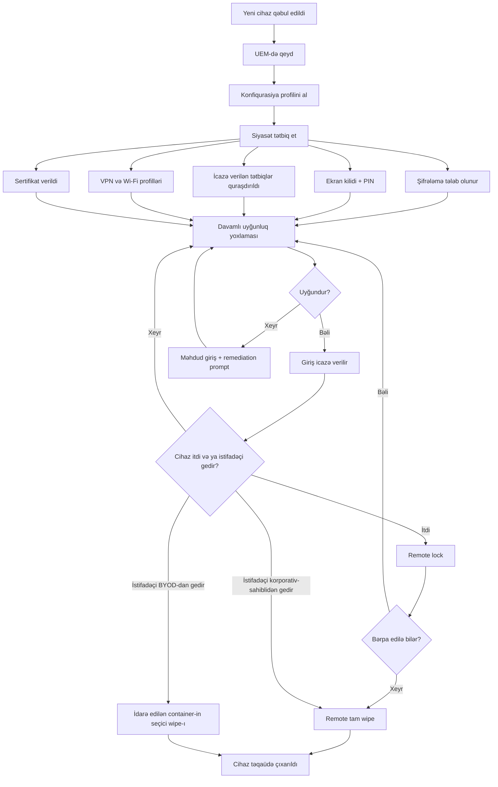

# Mobil Cihaz Təhlükəsizliyi

## Bu nə üçün önəmlidir

Müasir müəssisə hər axşam binadan çıxır. Noutbuklar, telefonlar, planşetlər və smart saatlar təqvim qeydlərini, müştəri yazılarını, mühəndislik sxemlərini, imtiyazlı kredensialları və ikinci-faktor tokenlərini ictimai nəqliyyata, kafelərə, hava limanlarına və evlərə daşıyır. Fiziki perimetr daxilində masaya bərkidilmiş bir desktopdan fərqli olaraq, mobil cihaz hər işıqlandığı dəqiqədə itki və ya oğurluq riski altındadır və korporativ firewall heç vaxt görməyəcəyi radio hücumlarına, zərərli proqram mağazalarına, düşmən şarj portlarına və captive-portal Wi-Fi şəbəkələrinə açıqdır.

Bu, təhlükəsizlik modelini üç konkret yolla dəyişir. Birincisi, cihazın özü perimetrdir — əgər hücumçu kilidlənməmiş telefonun fiziki sahibinə çevrilirsə, badge oxuyucu, firewall və SOC heç bir şey vermir. İkincisi, cihazdakı radiolar (cellular, Wi-Fi, Bluetooth, NFC) eyni anda fəal hücum səthidir və əksəriyyəti default açıqdır. Üçüncüsü, istifadəçi həm operator, həm də müəyyən mənada düşməndir: qatarda xərc hesabatını açmaq lazım olan eyni şəxs həmçinin üçüncü tərəf mağazasından flashlight tətbiqi quraşdırmaq, kilid ekranını fərdiləşdirmək üçün cihazı jailbreak etmək və ya oyun sideload etmək istəyir. Mobil təhlükəsizlik təhlükəsiz yolu asan yol etməlidir.

Bu dərs radio və əlaqə hücum səthini (Wi-Fi, Bluetooth, NFC, infrared, USB, GPS, RFID), cihazın özünün tətbiq edə biləcəyi authentication nəzarətlərini (PIN-lər, biometrika, kontekst-bilən faktorlar, push bildirişləri), korporativ siyasəti miqyasda tətbiq edən idarəetmə platformalarını (MDM, UEM, MAM), cihaz üzərində məlumat qorunmasını (tam-cihaz şifrələmə, containerizasiya, storage seqmentləşdirmə, MicroSD HSM-lər), manipulyasiya və bütövlük təhdidlərini (rooting, jailbreaking, sideloading, custom firmware, carrier unlocking, SEAndroid), siyasətin qeyd etməli olduğu periferik və əlaqə nəzarətlərini (kamera, mikrofon, SMS/MMS/RCS, Wi-Fi Direct, tethering, hotspot, USB OTG, GPS tagging, mobil ödəniş) və təşkilatın seçdiyi deployment modellərini (BYOD, COPE, CYOD, korporativ-sahibli, VDI) əhatə edir. Nümunələrdə uydurma `example.local` təşkilatı və `EXAMPLE\` domeni istifadə olunur.

## Əsas anlayışlar

Mobil təhlükəsizlik wireless təhlükəsizliyi kimi qatlanmışdır. Aşağıda radiolar var — onlar əlçatan hücum səthini müəyyən edir. Onların üzərində əməliyyat sisteminin etibar modeli (kod imzalama, sandboxing, məcburi giriş nəzarəti) və cihazın hardware təhlükəsizlik primitivləri (secure enclave, trusted execution environment, MicroSD HSM) yerləşir. Bunun üzərində korporativ idarəetmə platforması (MDM/UEM/MAM) cihaza korporativ siyasəti proyeksiya edir. İstifadəçinin seçimləri — passcode gücü, biometrik qeydiyyat, hansı tətbiqləri quraşdırması, hansı şəbəkələrə qoşulması — bu qatların həqiqətən nəzərdə tutulduğu kimi işləyib-işləməməsini müəyyən edir.

### Radio və əlaqə hücum səthi

Smartfon radiolar dəstəsini açıb göstərir. Hər biri məlumat sızdırma, malware çatdırılması və ya nəzarət üçün potensial kanaldır və hər birinin öz protokolu, range profili və hücum tarixi var.

**Wi-Fi** Wi-Fi Alliance tərəfindən idarə olunan 2.4 GHz və 5 GHz lentlərini istifadə edir. Mobil cihaz müəssisənin, istifadəçinin ev şəbəkəsinin, istifadəçinin keçdiyi hər hansı kafenin, hava limanının və ya hotelin və range daxilində rogue AP işlədən hər hansı hücumçunun sahib olduğu access point-lərlə əlaqələnir. Wireless-security dərsi protokol qatını dərinləmə əhatə edir; mobildə kritik nəzarətlər WPA2/WPA3-Enterprise profilləri üçün ciddi server-sertifikat doğrulanması, naməlum açıq şəbəkələr üçün auto-join-i deaktivləşdirmək və istifadəçi-tərtibli konfiqurasiyalardan çox MDM vasitəsilə çatdırılan müəssisə-idarəli profillərə üstünlük verməkdir.

**Bluetooth** 2.4 GHz-də qısa-orta range wireless protokoldur, əvvəlcə təxminən 10 metrlik şəxsi sahə şəbəkələri üçün dizayn edilmiş, lakin indi yüksək-gainli antennalar və yeni versiyalar vasitəsilə bir neçə yüz metr və ya bəzi açıq hava tətbiqlərində kilometrlərə qədər uzadılmışdır. Bluetooth pairing iki cihaz arasında passkey istifadə edərək etibar əlaqəsi qurur. Tarixi zəifliklər — default passkey-lər, açıq qoyulmuş discoverable mode, bluejacking, bluesnarfing, BlueBorne — müasir stack-larda əsasən aradan qaldırılıb, lakin təhlükəsiz default-lar hələ də tətbiq olunur: aktiv pairing olmadıqda discoverable mode bağlı, fabrika default-una etibar etmək yerinə hər iki cihazda passkey daxil edilməsi, pairing-lərin vaxtaşırı yoxlanılması və təmizlənməsi və çox yüksək-təhdidli mühitlərdə Bluetooth-un tamamilə deaktivləşdirilməsi.

**NFC (Near Field Communication)** çox qısa range radio standartıdır — təxminən 10 sm və ya az — bu gün əsasən təmasısız ödəniş və nəqliyyat kartları üçün istifadə olunur. Onun qısa range-i əsas müdafiəsidir. Hücumçu istifadəçinin diqqət edəcəyi qədər yaxın olmalıdır, baxmayaraq ki cibdən skimming hələ də xüsusi qurulmuş oxuyucu ilə mümkündür. NFC trafikinin özü protokol səviyyəsində kriptoqrafik olaraq qorunmur; üzərində işləyən tətbiqlər (Apple Pay, Google Pay, nəqliyyat applet-ləri) öz authentication və tokenizasiyalarını əlavə edir. Relay hücumları, hücumçunun cihazı və qurbanın tag-ı arasında iki radio effektiv range-i uzadır, əsas praktiki təhdiddir.

**Infrared (IR)** bəzi cihazlarda uzaqdan idarəetmə transmitter kimi və bəzi xüsusi səhiyyə və sənaye avadanlığında qalır. IR divarlardan keçə bilməz, range-i qısadır və əsas protokolda şifrələmə yoxdur — IR üzərində məxfilik tələb edən hər hansı tətbiq onu qatlamalıdır. Müasir handset-lər eyni istifadə halları üçün Bluetooth və ya Wi-Fi Direct lehinə əsasən IR-dan imtina edib.

**USB** fiziki kabel interfeysidir. Mobil cihazlar eyni konnektor üzərindən şarj edir və məlumat ötürür (Lightning, USB-C, köhnə Android-də micro-USB), bu o deməkdir ki hər şarj portu potensial məlumat portudur. Zərərli USB şarj cihazları ("juice jacking"), klaviaturanı təqlid edən BadUSB cihazları və kilidlənməmiş cihazları istismar edən forensik alətlər hamısı real hücumlardır. Nəzarətlərə cihaz bir saatdan çox kilidləndikdə məlumat ötürməsini bloklayan USB Restricted Mode (iOS), ilk qoşulmada açıq icazə tələb etmək ("Bu kompüterə etibar edirsinizmi?") və istifadəçinin öz şarj cihazı və ya USB data blocker lehinə ictimai şarj portlarından qaçmaq daxildir.

**GPS (Global Positioning System)** yalnız-qəbul radiosudur — peyklər yüksək dəqiqlikli vaxt siqnallarını ötürür və qəbuledici öz mövqeyini hesablayır. GPS-in özünün authentication-ı yoxdur, ona görə GPS spoofing (saxta peyk siqnallarını ötürmək) cihazı yanlış mövqeyini bildirməyə çağıra bilər. Əksər kommersiya mühitlərində bu əsas təhdid deyil; yüksək-riskli mühitlərdə (hökumət, kritik infrastruktur) anti-spoofing qəbuledicilər və ya cellular triangulasiya və Wi-Fi geolocation ilə cross-check-lər vacibdir.

**RFID (Radio Frequency Identification)** tag-ları badge-lərdə, inventar etiketlərində, bəzi smart kartlarda və embedded sistemlərdə yerləşir. Tag-lar aktivdir (batareya ilə işləyir) və ya passivdir (oxuyucunun RF enerjisindən güc çəkir). Range tipdən asılı olaraq santimetrlərdən bir neçə yüz metrə qədər dəyişir. RFID bir çox müəssisədə bina-girişi kartları üçün identifikasiya mediumu olduğundan RFID təhlükəsizliyi bina təhlükəsizliyidir.

RFID-ə bir neçə hücum sinfi tətbiq olunur:

- **Tag və oxuyucu çiplərinin özlərinə hücumlar** — fiziki manipulyasiya, side-channel təhlili, power-glitching.
- **Əlaqə kanalına hücumlar** — software-defined radio ilə eavesdropping, qanuni mübadiləni tutaraq sonradan oynadan replay hücumları, eavesdropping və saxta cavabları birləşdirməklə man-in-the-middle.
- **Arxa tərəf oxuyucu və verilənlər bazasına hücumlar** — oxuyucunun əlaqə saxladığı web, verilənlər bazası və API endpoint-lərinin adi IT hücum səthi.
- **Klonlama** — əgər tag kriptoqrafik challenge-response istifadə etmirsə, eavesdrop edilmiş mübadilə saxta tag istehsal etmək üçün kifayətdir.

ISO/IEC 18000 və ISO/IEC 29167 RFID məxfiliyi, tag və oxuyucu qarşılıqlı authentication-ı, izlənilməzliyi və over-the-air məxfiliyi üçün kriptoqrafik primitivləri müəyyən edir; ISO/IEC 20248 rəqəmsal-imza məlumat strukturu əlavə edir. Bu standartları istifadə edən müasir bina-girişi kartları klonlamaya müqavimət göstərir; köhnə aşağı-tezlikli 125 kHz proximity kartları (HID Prox, EM4100) ümumiyyətlə müqavimət göstərmir və red-team engagement-lərində mütəmadi olaraq klonlanır.

**Point-to-point və point-to-multipoint** bu radiolardan bir neçəsinə tətbiq olunan əlaqə-topologiya terminləridir. Point-to-point bir transmitterin tam olaraq bir qəbuledici ilə danışmasını bildirir — Bluetooth pairing və USB kabeli hər ikisi bu modelə uyğundur. Point-to-multipoint bir transmitterin çoxlu qəbuledicilərə yayım etməsini bildirir — Wi-Fi beacon frame-ləri və yaxındakı hər oxuyucu tərəfindən NFC tag oxunması bu modelə uyğundur. Fərq vacibdir, çünki broadcast-mode trafiki tərif etibarilə daha böyük müşahidə edilə bilən hücum səthinə malikdir.

### Mobildə authentication

Mobil təhlükəsizliyin hər qatı cihaz səviyyəsində authentication-ın düzgün edilməsindən asılıdır. Kilidlənməmiş cihaz hücumçuya hər şeyi verir — email, mesajlaşma tətbiqləri, brauzerdə saxlanılmış parollar, single-sign-on tokenləri, istifadəçinin digər hesabları üçün ikinci faktor.

**Parollar və PIN-lər** baseline-dır. Korporativ siyasət qalan parol siyasətinə uyğun minimum uzunluq, mürəkkəblik və rotasiya tətbiq etməlidir. `EXAMPLE\` email saxlayan cihazda trivial dörd-rəqəmli PIN qəbul edilməzdir; minimum altı rəqəm, üstünlük verilən səkkiz və yüksək-riskli rollar üçün alfanumerik passphrase. Jest əsaslı kilidaçma pattern-ləri (Android-də nöqtələri swipe etmək) rahatdır, lakin ekran səthindəki yağ ləkəsi vasitəsilə formalarını sızdırır; düzgün bucaqdan cihazı görən hücumçu pattern-i vizual olaraq bərpa edə bilər.

**Biometrika** — barmaq izi, üz tanıma, iris — PIN və ya passphrase üzərində qatlanmış rahatlıq xüsusiyyətidir. Müasir tətbiqlər (Apple-ın Secure Enclave-i, Android-in StrongBox-əsaslı biometriği) erkən-nəsil sensorlardan çox-çox yaxşıdır, lakin tədqiqatçılar və təhlükəsizlik konfransları mütəmadi olaraq qaldırılmış barmaq izləri, 3D-çap maskalar və eyni-əkiz təqlidi ilə bypass-ları nümayiş etdirir. Biometrika cihazı kifayət qədər rahat edir ki istifadəçilər güclü əsas PIN-ləri qəbul etsinlər. Biometrika yüksək-dəyərli əməliyyatlar üçün heç vaxt yeganə faktor olmamalıdır; onlar cihazı kilidaçmalıdır və ödəniş icazəsi və ya müəssisə tətbiq girişi kimi şeyləri ayrı PIN və ya passphrase keçirməlidir.

**Kontekst-bilən authentication** authentication cəhdi haqqında metaməlumatları istifadə edir ki ona etibar edib-etməməsinə qərar versin — istifadəçinin kim olduğu, hansı resursu istədiyi, hansı cihazda olduğu, hansı şəbəkədə olduğu, hansı coğrafi mövqedə olduğu, indi nə vaxt olduğu, cihazın son zamanlar kompromisə uğradığı. Kontekst-bilən siyasət ofisin daxilində qeyd edilmiş korporativ cihazda olan istifadəçiyə SharePoint-ə tək faktorla giriş icazəsi verə, eyni istifadəçi ictimai Wi-Fi-də olduqda MFA tələb edə və əgər cihaz son uyğunluq yoxlamasından keçməyibsə və ya sanksiya edilmiş ölkədədirsə tamamilə girişi bloklaya bilər. Microsoft Entra, Okta və Google Workspace-də şərti-giriş mühərrikləri bu pattern-i `EXAMPLE\` identitet bazasına qarşı tətbiq edir.

**Push bildiriş authentication** etibarlı cihaza — adətən istifadəçinin artıq qeyd edilmiş telefonuna — onlardan girişi təsdiq və ya rədd etməyi xahiş edən prompt çatdırır. Apple-ın Apple Push Notification service (APNs) və Google-un Firebase Cloud Messaging (əvvəllər Android Cloud to Device Messaging) bu prompt-ları daşıyır. Push SMS-əsaslı MFA-dan ciddi şəkildə güclüdür, çünki SIM-swap hücumlarına və ya SS7 kəsilməsinə həssas deyil, lakin "MFA fatigue" adlanan sosial-mühəndislik nasazlıq rejiminə malikdir — paroldakı hücumçu istifadəçi səs-küyü dayandırmaq üçün Approve düyməsinə tıklayanadək təkrarlanan push prompt-ları işə salır. Number-matching prompt-ları (istifadəçi giriş səhifəsində göstərilən nömrəni push prompt-a yazmalıdır) bu hücumu aradan qaldırır və indi əksər müəssisə MFA platformalarında standartdır.

### MDM, UEM və MAM

Miqyasda müəssisə mobil təhlükəsizliyi idarəetmə platforması tələb edir. Üç üst-üstə düşən kateqoriya:

**Mobile Device Management (MDM)** orijinal kateqoriyadır. MDM agent cihazda işləyir və korporativ siyasəti tətbiq edir: tələb olunan PIN uzunluğu, şifrələmə açıq, ekran-kilid timeout, icazə verilən və bloklanan tətbiqlər, serverdən push edilən Wi-Fi və VPN profilləri, sertifikat təminatı və remote lock və ya wipe. Apple-ın Device Enrolment Program-ı, Google-un Android Enterprise-ı və Microsoft Intune, Jamf, VMware Workspace ONE və MobileIron kimi vendor platformaları hamısı MDM-i tətbiq edir. Yaxşı konfiqurasiya edilmiş MDM siyasəti ən azı bunları tətbiq etməlidir:

- Güclü PIN və ya passphrase ilə cihazı kilidləmə.
- Cihazda məlumat şifrələməsi (adətən müasir iOS və Android-də default açıq, lakin siyasət vasitəsilə doğrulanmış).
- Hərəkətsizlik müddətindən sonra avtomatik kilid — adətən 2-5 dəqiqə.
- Cihaz itkin elan edildikdə remote lock imkanı.
- Konfiqurasiya edilmiş uğursuz PIN cəhdlərindən sonra avtomatik wipe — adətən 10.
- İtkin və ya oğurlanmış cihazlar üçün remote wipe imkanı.

**Unified Endpoint Management (UEM)** MDM-in əhatəsini telefonlardan və planşetlərdən hər növ endpoint-ə — noutbuklara, masaüstü kompüterlərə, geyilə bilən cihazlara, IoT-ya, kioskalara qədər genişləndirir. Dəyər təklifi hər form factor üçün ayrı alətlər yerinə bütün endpoint sahəsini əhatə edən tək konsol və tək siyasət çərçivəsidir. Intune, Workspace ONE, Jamf Pro (Apple üçün) və Ivanti Neurons böyük UEM platformalarıdır; müasir müəssisə deployment-ləri demək olar ki həmişə təmiz MDM yerinə UEM-dir.

**Mobile Application Management (MAM)** MDM/UEM ilə yan-yana oturur və cihaz yerinə tətbiqlərə fokuslanır. MAM idarə edilən cihazlarda müəssisə tətbiqlərini paylayır, konfiqurasiya edir, yeniləyir və geri çağırır və bəzi platformalarda idarə edilməyən (BYOD) cihazlarda belə per-app siyasətləri tətbiq edə bilər — korporativ və şəxsi tətbiqlər arasında copy-paste məhdudiyyətləri, per-app VPN, per-app şifrələmə, app-səviyyəli remote wipe. MAM işəgötürənin bütün cihazı idarə etmədiyi, lakin müəyyən tətbiqlərdəki korporativ məlumatları qorumaq lazım olduğu BYOD modelləri üçün açar texnologiyadır.

Bu platformalar arasında bir neçə imkan təkrar görünür:

- **Enrollment.** Cihaz idarəetmə altına gətirilir — istifadəçi-başlatılan (istifadəçi agent quraşdırır və authenticate edir), zero-touch (Apple Business Manager və ya Android zero-touch təminatı cihazı satınalma zamanında müəssisəyə bağlayır və enrollment avtomatik baş verir) və ya korporativ-sahibli cihazlar üçün admin-başlatılan.
- **Konfiqurasiya profilləri.** Server parametr dəstini — Wi-Fi, VPN, email hesabları, sertifikat payload-ları, məhdudiyyətlər — push edir ki OS onu tətbiq etsin və istifadəçi manipulyasiyasından qorusun.
- **App catalog.** Müəssisə tərəfindən kuratorlaşdırılmış təsdiq edilmiş tətbiqlər siyahısı, ya idarə edilən cihazlara səssiz push edilən, ya da self-service mağaza vasitəsilə təklif edilən.
- **Content management.** Cihazda hansı faylların saxlanıla biləcəyi, hansı tətbiqlərdə açıla biləcəyi, hansı xidmətlərə paylaşıla biləcəyi haqqında qaydalar. `EXAMPLE Internal` təsnif edilmiş sənəd idarə edilən email müştərisində icazə verilərkən şəxsi cloud-storage tətbiqində açılması bloklana bilər.
- **Remote wipe.** Müəssisə bütün cihazın wipe-ını (tam fabrika resetı) və ya yalnız idarə edilən profili və onun tətbiqləri və məlumatlarını silən, şəxsi məzmunu toxunulmaz buraxan seçici wipe işə sala bilər. Seçici wipe BYOD üçün ağıllı default-dır; tam wipe korporativ-sahibli üçün uyğundur. BYOD dilemması itkin cihazın tam wipe-ı həm də istifadəçinin şəxsi fotoları, kontaktları və tətbiqlərini silir, ona görə containerizasiya və seçici wipe mövcuddur.
- **Compliance check-ləri.** MDM agent vaxtaşırı duruşu hesabat verir — OS versiyası, jailbreak statusu, şifrələmə vəziyyəti, tələb olunan tətbiqlər quraşdırılmış, tələb olunan patch-lər tətbiq olunmuş. Uyğun olmayan cihazlar məhdudlaşdırılmış vəziyyətə (xəbərdarlıq banneri, məhdud giriş) qoyula və ya şərti giriş vasitəsilə müəssisə resurslarından tamamilə bloklana bilər.
- **Geofencing və geolocation.** Geofencing GPS və ya RFID istifadə edərək virtual sərhəd müəyyən edir; cihazlar onu keçdikdə hərəkətlər tetiklenir (sahədə VPN-i auto-açma, istehsal mərtəbəsində kameranı deaktivləşdirmə, tag-lanmış aktiv binadan çıxdıqda xəbərdarlıq). Geolocation cihazın mövqeyini izləmə hərəkətidir, itkin cihazları bərpa etmək və tənzimlənən sənayelərdə uyğunluq üçün faydalıdır. Hər iki xüsusiyyət məxfilik qanununa görə diqqətli siyasət çərçivəsi tələb edir.

### Cihazda məlumat qorunması

Cihaz idarə edildikdən sonra növbəti sual itki və ya oğurluğun real təhdidinə qarşı üzərindəki məlumatı qorumaqdır.

**Tam cihaz şifrələmə (FDE)** bütün storage volume-unu cihazın hardware-ə və istifadəçinin kilidaçma kredensialına bağlı açarla şifrələyir. Müasir iOS şifrələnmiş storage-ı iPhone 3GS-dən bəri standart olaraq daşıyır; müasir Android Android 10-dan bəri bütün cihazlarda FDE və ya file-based encryption (FBE)-yə malikdir. Siyasət FDE-nin aktiv olduğunu doğrulamalıdır — MDM uyğunluq yoxlaması — onu fərz etmək yerinə. Tənzimlənən mühitlər bəzən hələ də xüsusi FIPS-doğrulanmış şifrələmə modullarını tələb edir; commercial-off-the-shelf icmal kifayət etməyə bilər.

**Containerization** cihazı ayrı icra domenlərinə bölür, adətən biri iş və biri şəxsi üçün. Hər container öz tətbiqləri, məlumatları və şifrələməsinə malikdir; iş container-indəki tətbiqlər şəxsi container-də olan məlumatı oxuya bilməz və əksinə və MDM iş container-ini şəxsi tərəfə toxunmadan uzaqdan idarə edə (seçici wipe daxil olmaqla) bilər. Samsung Knox, Android Work Profiles (Android Enterprise) və iOS User Enrolment bu pattern-in variantlarını tətbiq edir. Containerizasiya offboarding-də istifadəçinin şəxsi məlumatını məhv etməyən BYOD-un texniki əsasıdır — iş container-ini wipe edin, qalanına toxunmayın.

**Storage seqmentləşdirmə** əlaqəli anlayışdır: cihazın storage-ı daxilində şəxsi və korporativ məlumatın məntiqi ayrılması, hətta tam-genişlikdə container izolyasiyası olmasa da. Müəssisə tətbiqləri müəssisə-tag-lanmış storage sahələrinə yazır; siyasət məlumatın bu sahələrdən hərəkətini məhdudlaşdırır.

**MicroSD Hardware Security Module (HSM)** MicroSD form factor-da hardware təhlükəsizlik modulu. O kriptoqrafik açarlar — imzalama açarları, PKI özəl açarları, açar-yedək tokenləri — üçün host cihazı kompromisə uğradılsa belə çıxarılmaya müqavimət göstərən portativ secure element təmin edir. Kart adi HSM əməliyyatlarını yerinə yetirən tətbiqlə cütlənir: açar generasiyası, yedək, bərpa, imzalama. MicroSD HSM-lər niş-dir — əksər istifadəçilər cihazın daxili secure enclave-inə güvənir — lakin açarların cihazlar arasında hərəkət etməli və ya cihaz wipe-dan sağ çıxmalı olduğu yüksək-təminat rollarında görünür.

### Manipulyasiya və bütövlük

iOS və Android-də OS-tətbiq edilmiş etibar modeli hər şeyin üzərində dayandığı təməldir. İstifadəçi (və ya hücumçu) bu modeli məğlub etdikdə təhlükəsizlik hekayəsi çökür. Bir neçə xüsusi təhdid:

**Rooting** Android termini superuser imtiyazına yüksəlmək, tətbiqlər və istifadəçinin nə edə biləcəyinə dair OS-tərəfindən tətbiq edilən məhdudiyyətləri bypass etmək üçün istifadə olunur. Rooted cihaz hər faylı oxuya, sistem parametrlərini dəyişdirə, kernel modulları quraşdıra və istəyə görə təhlükəsizlik xüsusiyyətlərini deaktivləşdirə bilər. İstifadəçilər cihazları qanuni səbəblərlə root edirlər — custom ROM-lar, carrier bloatware-ı silmək — lakin müəssisənin etibar etdiyi təhlükəsizlik nəzarətləri (tətbiq sandboxing, şifrələmə açarı qorunması, MDM siyasət tətbiqi) kifayət qədər motivasiyalı rooted istifadəçi tərəfindən pozula bilər.

**Jailbreaking** iOS ekvivalentidir. Apple-ın App Store gatekeeping-i, kod-imzalama tələbləri və sandbox-ı bypass edilir; tətbiqlər imzasız və yüksəldilmiş imtiyazlarla işləyə bilər. Jailbroken iPhone artıq stock iPhone ilə eyni etibar mühiti deyil və iOS MDM nəzarətləri jailbroken cihazda dövrə vurula bilər. Jailbreaking Apple zəmanətini ləğv edir və App Store girişini bloklayır.

Hər iki halda MDM platformaları stock cihazda olmamalı olan tell-tale fayllar, xidmətlər, SELinux vəziyyəti və kod-icra imkanlarını axtararaq root/jailbreak-i aşkar edir. Aşkarlama silah yarışıdır — sofistikə edilmiş rooter-lər izlərini gizlədir — lakin ümumi-hal düşmən üçün aşkarlama əksər rooted cihazları tutur. Siyasət adətən rooted və ya jailbroken cihazları müəssisə resurslarından tamamilə bloklayır.

**Sideloading** vendor-un rəsmi mağazası xaricində tətbiqlərin quraşdırılmasıdır. Android-də sideloading daxili xüsusiyyətdir ("Naməlum tətbiqləri quraşdır"-ı aktivləşdirin və hər mənbədən APK quraşdırın); iOS-da sideloading developer sertifikatları, müəssisə təminat profilləri və ya jailbreaking tələb edir, baxmayaraq ki AB-nin Digital Markets Act-i daha geniş dəstəyi təşviq edir. Sideload edilmiş tətbiqlər mağazanın malware icmalını bypass edir, ona görə istifadəçi APK-nı təmin edən hər kəsə güvənir. MDM vasitəsilə müəssisə siyasəti adətən müəssisə app catalog-undan başqa bütün tətbiqlər üçün "naməlum tətbiqləri quraşdır" icazəsini deaktivləşdirir.

**Custom firmware** cihaza flash edilmiş alternativ ROM və ya əməliyyat sistemi imicidir, vendor firmware-ini əvəz edir. LineageOS və GrapheneOS məşhur Android nümunələridir. Custom firmware məxfiliyi yaxşılaşdıra və vendor bloatware-ı silə bilər, lakin həm də vendor təhlükəsizlik testini bypass edir, hardware təhlükəsizlik xüsusiyyətlərini buraxa və ya deaktivləşdirə bilər və əksər MDM platformaları tərəfindən etibar edilmir. Korporativ-sahibli cihazlar üçün custom firmware qadağan edilməlidir; BYOD üçün, MAM kifayət qədər app-səviyyəli nəzarətləri müstəqil tətbiq edirsə icazə verilə bilər.

**Carrier unlocking** cihazdan carrier kilidini aradan qaldırmaq prosesidir ki o hər carrier-dən SIM qəbul etsin. Tarixən boz sahə, indi əksər yurisdiksiyalarda ağlabatan sahibkarlıq dövründən sonra açıq şəkildə qanunidir. Unlocking-in özü təhlükəsizlik məsələsi deyil; unlocking-in texniki prosesi bəzən imzasız firmware və ya debug interfeysləri əhatə edir, ona görə təhlükəsizlik baxımından əhəmiyyətli sual unlock-un necə həyata keçirildiyidir, edildiyi deyil.

**Firmware OTA (over-the-air) yenilikləri** kabel olmadan və ya vendor-a səfər olmadan cihaza patch-ləri çatdırır. OS vendor-ları firmware imicləri imzalayır və cihaz quraşdırmadan əvvəl imzanı doğrulayır; bu zərərli firmware paylayan hücumçuya qarşı əsas müdafiədir. İstifadəçilər mümkün olduqda avtomatik OTA yeniləmələri aktivləşdirməlidir və MDM siyasəti cihazların dəstəklənən OS versiyalarında işlədiyini doğrulamalıdır. Carrier-driven OTA gecikmələri xroniki Android problemidir; Android müəssisə proqramları yenilikləri birbaşa çatdırmaq üçün getdikcə carrier-i bypass edir.

**SEAndroid (Security Enhanced Android)** SELinux-un Android port-udur, cihazda hər prosesə — hətta root kimi işləyən proseslərə də — məcburi giriş nəzarəti (MAC) təmin edir. SEAndroid default-deny siyasəti tətbiq edir: siyasət tərəfindən açıq şəkildə icazə verilməyən hər şey rədd edilir. Bu standart Android sandbox-un üzərində əhəmiyyətli defence-in-depth qatıdır, çünki root-a uğurlu imtiyaz yüksəlişi hücumçunu SEAndroid siyasəti ilə məhdudlaşdırılmış buraxır. SEAndroid istifadəçi-üzlü deyil; kernel və siyasət fayllarında səssiz işləyir. SEAndroid deaktiv və ya permissive-ə təyin edilmiş rooted cihaz hələ də enforcing olan birinə nisbətən xeyli daha böyük narahatlıqdır.

**Tətbiq və monitorinq** yuxarıdakı hər şeyin həqiqətən işləməsini təmin edən əməliyyat qatıdır. Siyasətlər qalan təhlükəsizlik siyasəti ilə uyğun olmalıdır. Təlim mobili əhatə etməlidir. Pozuntu üçün intizam tədbiri uyğun olmalıdır. Monitorinq proqramı şərtləri həqiqətən izləməli — MDM konsolunda uyğun olmayan cihazlar, qeyri-adi coğrafi giriş pattern-ləri, cihaz duruşunda qəfil dəyişikliklər — və işlənən bilet yaratmalıdır. Siyasət buraxan, lakin heç vaxt audit etməyən mobil təhlükəsizlik proqramı təhlükəsizlik teatrıdır.

**Üçüncü-tərəf tətbiq mağazaları** Android-də malware-in təkrar mənbəyidir. Apple App Store iOS-da praktikada malware-in nadir olması üçün kifayət qədər ciddidir; Google Play daha az ciddidir və silinmədən əvvəl milyonlarla quraşdırmaya çatan malware-i təkrarən yerləşdirib; üçüncü-tərəf mağazalar (Apple və ya Google tərəfindən idarə edilməyənlər) ağıllı kuratorlaşdırılmışdan açıq-aşkar zərərli olana qədər dəyişir. İdarə edilən cihazlar üçün müəssisə siyasəti tətbiq quraşdırmasını təsdiq edilmiş mağaza və müəssisə app catalog-una məhdudlaşdırmalıdır.

### Periferik və əlaqə nəzarətləri

Telefonun mikrofonları, kameraları, storage-i və əlaqə kanalları var ki faydalıdır və eyni zamanda məlumat exfiltration kanallarıdır.

**Kameralar** mobil cihazlarda praktiki mənada həmişə açıqdır və ağ-tabloları, sənədləri, ekranları və müəssisə yerləşdirilməsini şəkilə ala bilər. GPS tagging (geo-tagging) tutma yerini foto metaməlumatına yerləşdirir; əgər cihaz bunu silmək üçün konfiqurasiya edilməyibsə, ictimai internetə yüklənən foto istifadəçinin mövqeyini sızdırır. Kamera istifadəsi siyasəti foto qadağan olunan obyektləri, həssas sahələrin işarələnməsini və MDM-in geofencing vasitəsilə kamera olmayan zonaları tətbiq edib-etməməsini müzakirə etməlidir.

**Mikrofonlar** səsi davamlı və açıq göstərici olmadan yaza bilər. Mikrofon icazəsini istəyən tətbiqlər ləğv edilənə qədər onu alır; mikrofon icazəsi olan zərərli tətbiq canlı nəzarət cihazıdır. Siyasət tələb etməyən tətbiqlər üçün mikrofon icazəsini default-deny etməli, OS-səviyyəli mikrofon göstəricisini aktivləşdirməli və audio-imkanlı cihazlar üçün iclas otağı siyasətini həll etməlidir.

**SMS, MMS və RCS** cellular-şəbəkə mesajlaşma protokollarıdır. SMS qısa mətni siqnallaşma yolu üzərindən daşıyır və 1980-ci illərdən bəri mobil mesajlaşma standartı olub; MMS multimedia məzmunu daşıyır; RCS (Rich Communication Services) qrupları, oxunma qəbzlərini, mediya və şifrələməni dəstəkləyən müasir carrier-grade əvəzedicidir. Təhlükəsizlik nəticələri: SMS siqnallaşma şəbəkəsi üzərindən aydın şəkildə göndərilir və carrier və SS7 girişi olan hər hansı düşmən tərəfindən oxuna bilər; SMS vasitəsilə fişinq (smishing) korporativ email filtrlərini bypass edir; MMS tarixən parser zəifliklərinə (Android-də Stagefright) malik olub ki qəbul üzərində uzaqdan kod icrasına icazə verirdi. RCS bəzi SMS boşluqlarını bağlayır, lakin yalnız hər iki endpoint və hər iki carrier dəstəklədikdə. Müəssisə mesajlaşma həssas hər şey üçün SMS yerinə end-to-end şifrələnmiş müştərilər (Signal, müəssisə-idarə edilən Teams/Slack) istifadə etməlidir.

**Wi-Fi Direct** access point olmadan iki cihaz arasında peer-to-peer Wi-Fi əlaqəsidir — bir cihaz digəri üçün AP kimi çıxış edir. Şifrələmə üçün WPA2 istifadə edir və service discovery-ni dəstəkləyir ki cihazlar pairing-dən əvvəl imkanları reklam etsin (AirDrop, miracast, bəzi printerlər tərəfindən istifadə olunur). Müəssisə narahatlığı: Wi-Fi Direct müəssisə şəbəkə monitorinqinə görünməyən ad-hoc əlaqə yaradır və yaxındakı hücumçu bəzən service discovery açıq qaldıqda cihazı qoşulmağa aldada bilər. Həssas cihazlarda deaktivləşdirin.

**Tethering** bir cihazı digərinə qoşmaq deməkdir ki birincisi şəbəkə girişini paylaşa bilsin. Klassik hal telefonun cellular məlumatını noutbukla paylaşmasıdır. Tethering müəssisənin monitorinq etməyəcəyi yeni xarici şəbəkə əlaqəsi əlavə edir — cellular üzərindən tether edilmiş noutbuk korporativ proxy və DLP-ni bypass edir. İdarə edilən noutbuklarda siyasət tez-tez tethering-i deaktivləşdirir və ya həmişə aktiv olan VPN terminator tələb edir.

**Hotspot** digər istiqamətdən eyni anlayışdır — cihaz digər cihazlar üçün access point kimi işləyir. Noutbukuna internet vermək üçün telefonunun hotspot-unu açan istifadəçinin eyni monitorinq boşluğu var.

**USB On-The-Go (USB OTG)** USB-i genişləndirir ki mobil cihaz host və ya periferik kimi çıxış edə bilsin. OTG kabeli telefonun USB flash drive oxumasına, klaviatura qoşmasına və ya başqa cihazı şarj etməsinə imkan verir. Təhlükəsizlik nəticələri: OTG müəssisənin görə bilmədiyi storage-ə məlumat-exfiltration yolu və zərərli USB cihazları üçün məlumat-ingress yoludur. İdarə edilən cihazlarda MDM USB OTG-ni deaktivləşdirə və ya xüsusi periferik siniflərinə məhdudlaşdıra bilər.

**Xarici media** — flash drive-lar, xarici hard disklər, musiqi pleyerləri, smart saatlar — hamısı cihaza məlumat giriş və çıxışı üçün yollardır. Siyasət xarici medianın icazə verildiyi və qadağan olunduğu yerləri müəyyən etməli və monitorinq faktiki istifadəni audit etməlidir.

**GPS tagging** tutma yerini foto və videolara yerləşdirir. CompTIA buna GPS tagging deyir; dünyanın qalan hissəsi geo-tagging adlandırır. Onlayn marketplace-ə drive-da maşının geo-tag-lı fotosunu yerləşdirmək ev ünvanını yayımlayır. Siyasət əksər istifadəçilər üçün geo-tagging-i default-disable etməli və yalnız xüsusi istifadə halları üçün aktivləşdirməlidir.

**Mobil ödəniş** — Apple Pay, Google Pay, Samsung Pay — tokenizasiya edilmiş kredit və ya debit kart nömrəsini ödəniş terminalına ötürmək üçün NFC istifadə edir. Faktiki kart nömrəsi heç vaxt cihazı tərk etmir; NFC üzərindən gedən bu xüsusi əməliyyatdan kənar yararsız olan birdəfəlik tokendir. NFC ötürülməsindən əvvəl cihazda biometrik və ya PIN authentication tələb olunur. Bu stack fiziki kartdan əhəmiyyətli dərəcədə daha təhlükəsizdir, fiziki kart həqiqi nömrəni NFC üzərindən və magstripe vasitəsilə yayımlayır.

### Müəssisə deployment modelləri

Təşkilatın mobil cihazları necə daxil etməsi istifadəçi üstünlüyü (tək cihaz, tanış seçim, öz OS versiyası), korporativ nəzarət (sərt siyasət, zəmanətli uyğunluq, mərkəzləşdirilmiş inventar) və xərc (korporativ ödəyir vs istifadəçi gətirir) arasında balans alır.

**Bring Your Own Device (BYOD)** işçilərin iş üçün şəxsi cihazlarını istifadə etməsidir. Üstünlüklər: istifadəçilər bir cihaz və artıq tanıdıqları birini daşımağa üstünlük verir; cihaz hardware xərci istifadəçiyə keçir; müvəqqəti işçilər üçün daha sürətli onboarding. Çatışmazlıqlar: istifadəçilər şəxsi cihazlarına müəssisə məhdudiyyətlərinə müqavimət göstərir; korporativ nəzarət məhduddur; offboarding üçün seçici-wipe texnologiyası tələb olunur; işəgötürənin şəxsi cihazda nə görə biləcəyi ilə bağlı hüquqi və məxfilik məsələləri. BYOD kiçik firmalarda və çoxlu müvəqqəti işçilərə malik təşkilatlarda populyardır.

**Corporate-Owned, Personally Enabled (COPE)** təşkilatın cihazı təmin etməsi, ödəməsi və işçinin onu şəxsi fəaliyyət üçün istifadə etməsinə icazə verməsidir. Təşkilat təhlükəsizlik duruşunu nəzarətdə saxlayarkən işçiyə ağlabatan istifadəçi təcrübəsi verir. COPE əksər orta-ölçülü müəssisələr üçün kompromis cazibə nöqtəsidir — təşkilat təsdiq edilmiş cihazları seçə, onları qeyd edə, siyasəti tətbiq edə və çıxışda onları wipe edə bilərkən işçi iki telefon daşımalı deyil.

**Choose Your Own Device (CYOD)** istifadəçiyə təsdiq edilmiş siyahıdan seçim verir. Cihaz təşkilat-sahiblidir; istifadəçi (məsələn) üç iPhone modeli və UEM-in dəstəklədiyi iki Android modelindən seçir. CYOD daha böyük müəssisələrdə yayılmışdır, burada cihaz modellərinin sonsuz matrisini dəstəkləmək dəstək komandasını sındırardı.

**Corporate-Owned, Business Only (COBO)** təşkilatın yalnız iş üçün istifadə edilən cihazlar təmin etməsidir. İşçi ayrı şəxsi cihaz daşıya və ya daşımaya bilər. Bu model korporasiyaya tam nəzarət verir və tənzimlənən, yüksək-riskli və ya təsnif edilmiş mühitlər üçün uyğundur; mənfi tərəf istifadəçi narazılığı (iki telefon) və xərcdir (təşkilat hər iki telefonu birbaşa və ya dolayı yolla ödəyir).

**Virtual Desktop Infrastructure (VDI)** hesablamanı nəzarətli datacentrə qaytararaq mobil-təhlükəsizlik problemini yan keçir. İstifadəçinin cihazı IT komandasının tam nəzarət etdiyi təhlükəsiz mühitdə işləyən müəssisənin ev sahibliyi etdiyi virtual desktop-a pəncərəyə çevrilir. VDI xüsusilə noutbuklar üçün faydalıdır — şəxsi noutbuklu kontraktor müəssisəyə VDI müştərisi vasitəsilə daxil olur və heç bir müəssisə məlumatı kontraktorun maşınında qalmır. VDI datacentrə tərəfdə əhəmiyyətli IT investisiyası və endpoint-də yaxşı şəbəkə əlaqəsi tələb edir; mövcud olduqda təhlükəsizlik hekayəsi mükəmməldir.

Bir baxışda trade-off matrisi:

| Model | Cihaz sahibi | İstifadəçi azadlığı | Korporativ nəzarət | İşəgötürənə xərc |
|-------|--------------|---------------|---------------------|------------------|
| BYOD | İşçi | Yüksək | Aşağı (yalnız MAM) | Aşağı |
| CYOD | İşəgötürən | Orta (siyahı daxilində seçim) | Yüksək | Orta |
| COPE | İşəgötürən | Orta-yüksək (şəxsi istifadə icazə verilir) | Yüksək | Orta-yüksək |
| COBO | İşəgötürən | Aşağı (yalnız iş istifadəsi) | Çox yüksək | Yüksək |
| VDI | Hər ikisi | Cihaz: dəyişir; VDI: aşağı | Çox yüksək (VDI daxilində) | Yüksək (datacentrə) |

## Enrollment və MDM lifecycle diaqramı

Aşağıdakı diaqram idarə edilən mobil cihazın enrollment-dən rutin uyğunluğa, sonda isə wipe-a qədər lifecycle-ını izləyir.

Açar keçidlər:

- **Enrollment** istifadəçi-başlatılan, zero-touch (Apple Business Manager, Android zero-touch) və ya staging üçün admin-başlatılan ola bilər.
- **Konfiqurasiya profili** UEM tərəfindən imzalanmış Wi-Fi, VPN, email, sertifikat və məhdudiyyət payload-larını daşıyır.
- **Compliance check** vaxtaşırı işləyir — adətən hər bir neçə saatdan bir — və duruşu UEM-ə geri hesabat verir.
- **Şərti giriş** identitet provayderi vasitəsilə uyğunluq statusunu resurs girişinə bağlayır; uyğun olmayan cihaz remediation edilənə qədər SharePoint, Exchange və həssas tətbiqlərdən rədd edilir.
- **Remote wipe** iki növə malikdir: BYOD üçün seçici (yalnız idarə edilən container-i wipe edir, şəxsini buraxır) və seçicinin kifayət etmədiyi korporativ-sahibli və ya itkin cihazlar üçün tam (bütün cihazı fabrika reseti).

## Praktika

Real MDM/UEM platforması (Intune, Jamf və ya Workspace ONE) və sahib olduğunuz və ya idarə etmək üçün icazəli test cihazları ilə nəzarətli laboratoriyada işləyən beş tapşırıq.

### 1. MDM konfiqurasiya profilini deploy edin

Intune-da (və ya ekvivalent) iOS və Android üçün aşağıdakı tələblərlə cihaz uyğunluq siyasəti yaradın: minimum OS versiyası, şifrələmə tələb olunur, minimum 6-rəqəmli PIN, 5 dəqiqədən sonra ekran kilidi, wipe-dan əvvəl maksimum uğursuz cəhdlər 10, jailbreak/root aşkarlanması aktiv və ən azı iki adətən sui-istifadə edilən utiliti daxil edən qadağan olunmuş tətbiq siyahısı. Siyasəti bir iOS və bir Android cihazını ehtiva edən test cihaz qrupuna təyin edin.

Cavab: Yeni qeyd edilmiş cihazın siyasəti almasına nə qədər vaxt lazımdır? Cihaz uyğunsuz olduqda istifadəçi nə görür (məsələn, yanlış PIN uzunluğu)? Cihaz məcburi root və ya jailbreak edildikdə nə baş verir — UEM bunu xəbər verir, aşkarlama nə qədər vaxt aparır və hansı şərti-giriş hərəkəti tətiklenir? Həm uyğun, həm də uyğunsuz cihazı göstərən uyğunluq konsolundan ekran görüntülərini çəkin.

### 2. Geofencing-i tətbiq edin

UEM-in mövqe xidmətlərini istifadə edərək laboratoriya (və ya test ofisi) ətrafında geofence konfiqurasiya edin. Hasarın daxilində kameranı deaktivləşdirən və xaricdə aktivləşdirən siyasət yaradın. Test cihazını sərhəddən keçirin və siyasətin tətbiq olunduğunu doğrulayın.

Cavab: UEM cihazın yerini necə müəyyən edir — GPS, Wi-Fi, cellular və ya kombinasiya? Hasarı keçmək və siyasətin qüvvəyə minməsi arasında latency nə qədərdir? İstifadəçi nə görür? Geofencing BYOD cihazları üçün hansı məxfilik nəticələrinə malikdir və UEM bunu istifadəçilərə necə bildirir? UEM-in enrollment-də göstərdiyi razılıq dilini sənədləşdirin.

### 3. Remote wipe-ı aktivləşdirin və test edin

UEM konsolunda BYOD rejimində qeyd edilmiş test cihazında remote-lock və sonra seçici remote wipe işə salın. Korporativ-sahibli rejimdə qeyd edilmiş test cihazı ilə təkrarlayın və tam wipe işə salın.

Cavab: Konsolda wipe düyməsinə basmaq və cihazın faktiki olaraq wipe edilməsi arasında vaxt nə qədərdir? Seçici wipe-da hansı məlumat silinir — tətbiqlər, profillər, sertifikatlar, email, keş edilmiş fayllar — və nə qalır? Wipe sorğusu zamanı cihaz oflayn olduqda nə baş verir? Cihaz onlayna qayıtdıqda nə baş verir? Wipe bileti davam edirmi və əgər belədirsə, nə qədər?

### 4. Jailbreak aşkarlama qaydasını test edin

Test Android cihazından istifadə edin. Rooting alətini quraşdırın (Magisk adi başlanğıc nöqtəsidir — gündəlik istifadə yox, xüsusi cihazdan istifadə edin). UEM-in uyğunluq yoxlama intervalı daxilində root-u aşkarlayıb-aşkarlamadığını müşahidə edin. Sonra aşkarlamadan qaçmaq cəhdi üçün root-gizlədən modullardan istifadə edin. Uyğunluğu yenidən yoxlayın.

Cavab: UEM root-u aşkarlamaq üçün hansı faylları, prosesləri və sistem xüsusiyyətlərini yoxlayır? Aşkarlama nə qədər tez tətiklenir? Hansı qaçınma texnikaları UEM-in yoxlamalarını məğlub edir və UEM vendoru aşkarlama zəmanətləri haqqında nə deyir? Uyğunsuzluqda hansı şərti-giriş hərəkəti tətiklenir — bütün girişi blokla, yalnız həssas resursları blokla, xəbərdarlıq göndər və ya sadəcə log? Qaçınma texnikalarını və UEM-in istifadə etdiyi əlavə attestation mexanizmlərini (Google Play Integrity, Apple DeviceCheck) sənədləşdirin.

### 5. BYOD siyasəti dizayn edin

`example.local` üçün iki səhifəlik BYOD siyasəti yazın. O əhatə etməlidir: hansı cihazlar və OS versiyalarına icazə verilir; istifadəçinin nəyə razı olduğu (kamera, mövqe, idarə edilən container-in müəssisə wipe-ı); müəssisənin BYOD cihazda nəyi görə və görə bilməyəcəyi; tələb olunan təhlükəsizlik duruşu (PIN, şifrələmə, OS versiyası); app-səviyyəli nəzarətlər (MAM siyasətləri, containerizasiya); offboarding-də seçici-wipe prosesi; seçici wipe səhvən şəxsi məlumatı silirsə istifadəçinin müraciəti; və yurisdiksiya-spesifik məxfilik mülahizələri (Avropada GDPR, Kaliforniyada CCPA, yerli işçi qanunu).

Cavab: Hansı maraqlı tərəflərin siyasəti təsdiq etməsi lazımdır? Siyasətin hansı hissələri UEM-də tətbiq olunan və hansı yalnız müqaviləlidir? Enrollment-də istifadəçidən hansı təlim və ya attestation tələb olunur? Siyasəti yerinə yetirə bilməyən istifadəçilər üçün (köhnə OS, çatışmayan hardware təhlükəsizliyi) hansı istisna prosesi mövcuddur? Siyasət sənədini, bir səhifəlik istifadəçi-üzlü xülasəni və BYOD cihazının müəssisə resurslarına yaxınlaşmasına icazə verilməzdən əvvəl enrollment mühəndisinin hər şeyin yerində olduğunu təsdiq etmək üçün istifadə etdiyi check-list yaradın.

## İşlənmiş nümunə — `example.local` 800 qarışıq iOS/Android cihaz üçün UEM rolloutu edir

`example.local` 1,200 nəfərlik peşəkar-xidmətlər firmasıdır. CIO 800 mobil cihaz (telefonlar və planşetlər) və 900 noutbuk əhatə edən müasir UEM ilə miras qalmış Exchange ActiveSync-only deployment-i əvəz etmək üçün 12-aylıq mobil-təhlükəsizlik proqramını təsdiq etdi. Bugünkü mobil park təxminən 55% iOS və 45% Android-dir, beş nəsil hardware arasında bölünüb. İstifadəçilərin təxminən 60%-i şəxsi telefonunu gətirmək istəyir (BYOD); 40% korporativ-təmin edilmiş cihaz qəbul edir (COPE). CISO-nun tələbləri: məcburi şifrələmə, Microsoft 365 və Salesforce-a MFA-əsaslı giriş, remote wipe imkanı, jailbreak/root aşkarlanması və BYOD cihazlarında korporativ məlumatın şəxsi məlumatdan necə ayrıldığı haqqında auditorlar üçün etibarlı hekayə.

**Platforma seçimi.** RFP-dən sonra komanda artıq noutbuk idarəetməsində istifadə olunan Microsoft Intune-u seçir və onu mobilə genişləndirir. Apple Business Manager hər yeni korporativ-sahibli iPhone-u avtomatik qeyd etmək üçün konfiqurasiya olunur; Android Enterprise managed Google Play üçün Work Profile (BYOD) və Fully Managed (COPE) deployment rejimləri ilə konfiqurasiya olunur. Identity `EXAMPLE\` Azure AD-dir; RADIUS sertifikat səlahiyyəti (`EXAMPLE-WIFI-CA`) Wi-Fi üçün korporativ-sahibli cihazlara EAP-TLS sertifikatları verir; həm BYOD, həm də korporativ cihazlara şərti giriş üçün ayrı cihaz-etibar sertifikatı verilir.

**Siyasət baseline.** Uyğunluq siyasətləri dörd cihaz sinfinin hər biri üçün yazılır: korporativ iOS, korporativ Android, BYOD iOS (modeldən asılı olaraq Work Profile və ya User Enrolment), BYOD Android (Work Profile). Hər dördündə ümumi tələblər: minimum dəstəklənən OS versiyası (iOS 17+, Android 13+, illik tənzimlənir), şifrələmə tələb olunur, minimum 6-rəqəmli PIN (korporativ-sahibli üçün 8), 5 dəqiqədən sonra ekran kilidi, wipe-dan əvvəl maksimum 10 uğursuz PIN cəhdi, jailbreak/root aşkarlanması açıq, Android-də SafetyNet/Play Integrity attestation tələb olunur, PIN üzərində kilidaçma rahatlığı kimi TouchID/FaceID və ya barmaq izi biometriği icazə verilir. Korporativ-sahibli cihazlar əlavə olaraq USB OTG-ni bloklayır, `EXAMPLE\` idarə edilən Wi-Fi və VPN profilləri tələb edir və üçüncü-tərəf tətbiq mağazalarını bloklayır. BYOD cihazları məhdudiyyət olmadan şəxsi tətbiqlərə icazə verir, lakin idarə edilən iş tətbiqlərinə per-app siyasətləri tətbiq edir.

**App catalog və MAM siyasətləri.** Korporativ catalog Outlook, Teams, OneDrive, SharePoint mobile, Salesforce Mobile, daxili xərc-və-vaxt-izləmə tətbiqi (Intune App Wrapping vasitəsilə nəşr olunmuş) və bir neçə təsdiq edilmiş məhsuldarlıq alətini ehtiva edir. Microsoft 365 tətbiqlərində MAM siyasətləri tətbiq edir: tətbiq məlumatının şifrələnməsi, idarə edilən tətbiqlərdən idarə edilməyənlərə copy/paste yox, idarə edilməyən printerlərə çapı blokla, Outlook-u yeganə idarə edilən email müştərisi kimi tətbiq et, şəxsi cloud storage-ə save-as yox, cihaz PIN-dən ayrı app-səviyyəli PIN və 30 gün oflayn tətbiq məlumatlarının avtomatik wipe-ı.

**Containerizasiya.** BYOD Android-də Work Profile iş tətbiqlərini və məlumatlarını şəxsidən təmiz şəkildə ayırır. User Enrolment ilə BYOD iPhone-da OS iş məlumatları üçün idarə edilən APFS volume yaradır, şəxsidən fayl sistemi səviyyəsində ayrılmışdır. Hər iki model offboarding-də seçici wipe-ı dəstəkləyir: istifadəçi şirkəti tərk etdikdə və ya cihazı itkin elan etdikdə Intune iş container-ini wipe edir və şəxsi məlumatı toxunulmaz buraxır. Bu BYOD üçün ən vacib yeganə texniki nəzarətdir; bu olmadan BYOD proqramı hüquqi və əməliyyat baxımından dayanıqsız olardı.

**Şərti giriş.** Azure AD şərti-giriş siyasətləri cihaz uyğunluğunu resurs girişinə bağlayır. Uyğun olmayan cihaz remediation edilənə qədər Microsoft 365, Salesforce və daxili SharePoint-dən rədd edilir. Sanksiya edilmiş ölkədə (ixrac nəzarətləri) cihaz həssas məlumat üçün bloklanır. MFA hər yerdən tələb olunur; number matching ilə Microsoft Authenticator push ilə şifrəsiz authentication üstünlük verilən ikinci faktordur. SMS-əsaslı MFA deaktivdir.

**Remote wipe və hadisə cavabı.** Xidmət masasının sənədləşdirilmiş runbook-u var: itkin cihaz xəbər verildi -> identitet təsdiq et -> Intune vasitəsilə remote-lock -> 24 saatda bərpa olunmazsa, BYOD üçün seçici wipe və ya korporativ-sahibli üçün tam wipe -> itki və wipe arasındakı pəncərədə cihazdan hər hansı girişi nəzərdən keçirmək üçün SOC-a bilet. İtkin cihaz çağırış həcmi bu ölçüdə ayda təxminən 3-5 gözlənilir.

**Jailbreak və root.** Intune-un daxili jailbreak və root aşkarlanması, Android-də Play Integrity attestation və iOS-da DeviceCheck ilə artırılmış, manipulyasiya edilmiş cihazları işarələyir. Siyasət sərtdir: attestation-dan keçməyən cihaz bütün korporativ resurslardan bloklanır. Rooted Android telefonlarda və ya jailbroken iPhone-larda təkid edən istifadəçilər proqramdan açıq şəkildə xaric edilir və loaner istifadə etməlidir.

**Cellular və mesajlaşma.** Korporativ SMS heç bir həssas şey üçün istifadə olunmur. RCS istehlakçı-istehlakçı mesajlaşma üçün icazə verilir, lakin biznes üçün yox. Hər hansı biznes-kritik mesajlaşma audit və saxlama siyasətləri tətbiq edilmiş Teams vasitəsilə gedir.

**İstifadəçi təcrübəsi.** Proqram Intune-un BYOD cihazlarında nə gördüyü və görmədiyini izah edən istifadəçi təlimatını dərc edir (o idarə edilən tətbiqləri və idarə edilən container-i görür; SMS, şəxsi fotoları, şəxsi tətbiqləri, çağırış tarixçəsini və ya geofence siyasətindən kənar mövqeni görmür). Enrollment Company Portal tətbiqi vasitəsilə self-service prosesidir, cihaz başına təxminən 15 dəqiqə çəkir. IT yardım masasının rolloutun ilk üç ayı üçün mobil məsələlər üçün xüsusi növbəsi var, sonra ümumi dəstəyə qatlanır.

**Rollout dalğaları.** IT əvvəlcə qeyd edir (dalğa 1, 50 cihaz), sonra altı həftə ərzində hər biznes vahidi (dalğa 2-6). Dalğa 1 üç problem tutur — Work Profile-ı qəbul etməyəcək qaranlıq Samsung modeli, partnyorla təqvim federasiyasını sındıran Outlook MAM siyasəti və yanlış RADIUS-a işarə edən Wi-Fi profil yazıt — hamısı rollout genişlənmədən əvvəl düzəldilir. Tam 800-cihaz rolloutu tamamlandıqdan sonra miras qalmış ActiveSync girişi deaktiv edilir.

**Uyğunluq hesabatı.** CISO-ya aylıq və audit komitəsinə rüblük hesabatlar parkın hər uyğunluq siyasətini yerinə yetirən faizini, hadisələrin sayını (itkin/oğurlanmış), remediation müddətlərini və istisna statusunu göstərir. Proqramın hədəfi rolloutdan altı ay sonra parkda >97% uyğunluqdur; faktiki rəqəmlər bu hədəfə qarşı izlənilir.

**Audit dəlilləri.** SOC 2 auditoru gəldikdə dəlil paketi şunları əhatə edir: Intune siyasət ixracları, şərti-giriş siyasət ixracları, cihaz enrollment sayları, son 12 ayın uyğunluq hesabatları, remote-wipe hadisə logu, BYOD siyasətinin istifadəçi qəbulu (Microsoft 365 attestation vasitəsilə) və tətbiq edilmiş siyasətləri göstərən nümunə cihaz ekran görüntüləri. Auditor bunu mobil-cihaz nəzarət məqsədi üçün kifayət qədər qəbul edir.

Proqram, yenə də, innovativ deyil. Bu, aydın siyasətə qarşı diqqətlə deploy edilmiş Apple Business Manager və Android Enterprise ilə Intune-dur, BYOD-da ağır işləri görən containerizasiya və uyğun olmayan quyruqu kəsən şərti girişlə. Bu mobili "idarə edilməyən məsuliyyət"-dən "sənədləşdirilmiş və audit edilmiş nəzarət"-ə çıxarmaq üçün kifayətdir.

## Problemlərin həlli və tələlər

- **İstifadəçi tərəfindən BYOD enrollment rədd edilir.** İstifadəçilər məxfilik narahatlığından şəxsi cihazlarda MDM-ə müqavimət göstərir. UEM-in nə görə və görə bilməyəcəyini açıq şəkildə dərc edin, BYOD-a alternativ olaraq loaner təklif edin və istifadəçilərin bir faizini COPE-a itirməyə hazır olun. Məxfilik sualını həll etməyən BYOD proqramı uğursuz olur.
- **Jailbreak/root aşkarlaması bypass edildi.** Aşkarlama silah yarışıdır. UEM-yerli aşkarlamanı attestation xidmətləri (Android-də Play Integrity, iOS-da DeviceCheck) ilə tamamlayın. Qətiyyətli hücumçunun bir çox aşkarlama metodundan rooted cihazı gizlədə biləcəyini qəbul edin; kompensasiya nəzarətlərindən istifadə edin.
- **Köhnəlmiş OS versiyaları.** Köhnə telefonlar vendor-müəyyən pəncərədən sonra təhlükəsizlik yeniliklərini almağı dayandırır — adətən Android üçün 3 il, iOS üçün 5-7 il. Siyasət dəstəklənən OS versiyasını tələb etməli və UEM onu tətbiq etməlidir; əks halda park patch-siz cihazları toplayır.
- **Carrier-imposed yenilik gecikmələri.** Android yenilikləri tez-tez carrier-in test dövrü ilə gecikir. Android Enterprise mümkün olduqda qeyd edilmiş cihazlar üçün carrier-i bypass edir; Android Enterprise Recommended proqramında və ya zero-touch vasitəsilə deploy edilmiş cihazlara üstünlük verin.
- **Seçici wipe sızıntıları.** Siyasət pəncərəsindən daha uzun oflayn olduğu üçün idarə edilən tətbiqi qaçıran seçici wipe cihazda korporativ məlumat buraxır. MAM app-səviyyəli siyasət tətbiqin yerli olaraq özünü wipe etdiyi maksimum oflayn dövrünü əhatə etməlidir.
- **Geofencing yeganə nəzarət kimi.** Geofencing kömək edir, lakin cihazlar hasarı tərk edir. Cihaz və onun məlumatı səyahət edir; onları qoruyan siyasətlər hasardan kənarda da işləməlidir. Geofencing-i hər hansı həssas məlumat sinfinə yeganə nəzarət etməyin.
- **Siyasətə baxmayaraq zəif PIN-lər.** İstifadəçilər minimum-uyğun PIN seçir, hələ də zəifdir. Məlumat təsnifatına uyğun minimum uzunluq tətbiq edin. Yüksək-riskli rollar üçün PIN yerinə passphrase tələb edin.
- **Yüksək-dəyərli əməliyyatlar üçün yalnız-biometrik authentication.** Cihaz-kilidaçma biometriği wire transfer və ya kredensial dəyişikliyini təsdiq edən yeganə faktor olmamalıdır. Yüksək-dəyərli əməliyyatlar üçün step-up authentication (PIN yenidən-daxil etmə, push təsdiqi) əlavə edin.
- **SMS-əsaslı MFA.** SMS SIM-swap və SS7 kəsilməsinə həssasdır. Mümkün olduqda push-əsaslı MFA (MFA fatigue-ı məğlub etmək üçün number matching ilə), TOTP və ya FIDO2 hardware tokenlərlə əvəz edin.
- **İdarə edilən cihazlarda üçüncü-tərəf tətbiq mağazaları.** Android-də malware-in əksəriyyəti istifadəçilərə sideloading və ya qeyri-rəsmi mağazalar vasitəsilə çatır. Korporativ-sahibli cihazlarda naməlum-mənbə quraşdırmasını deaktivləşdirin; BYOD cihazlarında istifadəçinin başqa nə quraşdırmasından asılı olmayaraq MAM korporativ məlumatı qorumalıdır.
- **Həssas cihazlarda USB OTG və çıxarıla bilən media.** USB OTG kabeli və bir neçə dəqiqəsi olan hücumçu çoxlu məlumatı exfiltrate edə bilər. USB məlumat ötürülməsini deaktivləşdirin, OTG-ni məhdudlaşdırın və iOS USB Restricted Mode-u konfiqurasiya edin.
- **İctimai şarj və juice-jacking.** İctimai USB şarj portları kilidlənməmiş cihazlardan məlumatı exfiltrate edə bilər. Siyasət onları məsləhət görməməlidir; istifadəçi təlimi səbəbini izah etməlidir. USB data blocker-lər ("USB condom-ları") səyahətçilər üçün ucuz mitigasiyadır.
- **Bluetooth discoverable buraxıldı.** Discoverable rejimdə buraxılmış telefon fürsətçi pairing cəhdləri üçün hədəfdir. Discoverable yalnız aktiv pairing zamanı açıq olmalıdır və Bluetooth pairing-ləri vaxtaşırı nəzərdən keçirilməli və təmizlənməlidir.
- **Kamera və mikrofon icazəsi sürünməsi.** Tətbiqlər vaxt keçdikcə icazələri toplayır. Mikrofon, kamera, kontaktlar və mövqe girişi olan tətbiqləri vaxtaşırı audit edin və artıq əsaslandırılmayan icazələri ləğv edin.
- **MDM-idarə edilən məlumatın şəxsi hesablara cloud yedəkləməsi.** Şəxsi Apple ID-də iCloud Backup aktiv olan istifadəçi idarə edilən məlumatı şəxsi cloud-a yedəkləyə bilər və seçici wipe-ı məğlub edə bilər. MAM siyasəti idarə edilən tətbiqlər üçün şəxsi hesablara yedəkləməni bloklamalıdır.
- **Qarışıq şəxsi və korporativ kontaktlar.** Korporativ Exchange-dən şəxsi telefona sinxronlaşdırılan kontaktlar kontakt-siyahısı icazəsi olan hər şəxsi tətbiqə əlçatan olur. Containerizasiya və per-app siyasətləri bunu düzəldir; idarə edilməyən ActiveSync etmir.
- **MDM agent istifadəçi tərəfindən öldürüldü.** Rooted Android-də istifadəçi MDM agent-i öldürə bilər. Manipulyasiya aşkarlamasından istifadə edin, "cihaz check-in etmədi" şərtini xəbər verin və qısa lütf pəncərəsindən sonra girişi bloklayın.
- **Köhnəlmiş sertifikatlar.** EAP-TLS və sertifikat-əsaslı VPN-lər etibarlı, müddəti bitməmiş, ləğv edilməmiş sertifikatlar tələb edir. UEM-idarə edilən sertifikat yenilənməsi bunu avtomatik idarə edir; əl ilə proseslər drift edir və kəsintilərə səbəb olur.
- **VPN həmişə-açıq səhv-skoplaşdırıldı.** Həmişə-açıq VPN idarə edilməyən Wi-Fi üçün vacibdir, lakin split-tunnel ssenarilərini (daxili şəbəkələr, captive portal-lar) sındıra bilər. Parkın qarşılaşdığı real şəbəkə ssenarilərinin hər birində həmişə-açıq VPN davranışını test edin.
- **Uyğunluq lütf dövrləri çox uzun.** Uyğunsuzluq və bloklanmış giriş arasında 14-günlük lütf dövrü hücumçuya uyğun olmayan cihazda iki həftə verir. Lütf dövrləri istifadəçi-friksiyanı risklə balanslamalıdır; əksər siyasətlər üçün 24-72 saat daha müdafiəolunandır.
- **Təqaüdə çıxarılmış cihazlar hələ də qeyd edilmiş.** Cihaz dekommisia edildikdə və ya satıldıqda UEM-dən silinməli və wipe edilməlidir. Əks halda ikinci əl alıcı enrollment qeydini və mümkün ki girişi alır.
- **GPS tagging aktiv buraxıldı.** İstifadəçilər onlayn geo-tag-lı fotolar yerləşdirir və mövqeyi sızdırır. İdarə edilən cihazlarda geo-tagging-i default-disable edin və təlim itələməsi təmin edin.
- **İş saatlarından sonra şəxsi üçün istifadə edilən korporativ-sahibli cihazlar.** COPE bunu dizayn üzrə icazə verir, lakin məzmun-təsnifatı qeyri-müəyyənliyi yaradır. Siyasət aydın olmalıdır: şəxsi istifadə icazə verilir, lakin cihaz korporativ mülkiyyət olaraq qalır və korporativ monitorinqə tabedir.
- **Kontraktor cihazları idarə edilmir.** Kontraktorlar tez-tez öz noutbuk və telefonlarını gətirirlər. Əgər onlar korporativ resurslara daxil olursalar, giriş VDI, idarə edilən workspace tətbiqi və ya əlaqəyə uyğun enrollment profili vasitəsilə getməlidir. İdarə edilməyən kontraktor cihazları təkrarlanan hadisə sinfinin mənbəyidir.
- **SIEM inteqrasiyasının olmaması.** UEM uyğunluq hadisələri — jailbreak aşkarlanması, siyasət pozuntusu, remote wipe — yüksək siqnaldır. Onlar digər təhlükəsizlik telemetriyası ilə korrelyasiya üçün SIEM-ə axmalıdır.
- **Hüquqi nəzərdən keçirmə olmadan BYOD.** BYOD proqramının hüquqi şərtləri — işəgötürənin nəyə daxil ola biləcəyi, wipe-ların necə idarə edildiyi, yurisdiksiya-spesifik məxfilik qanunu — rolloutdan əvvəl hüquq və HR tərəfindən nəzərdən keçirilməlidir. Bu addımı atlamaq icra edilə bilməyən məhkəmələr və wipe-lar yaradır.

## Əsas nəticələr

- Mobil cihazlar müəssisə məlumatlarını işçinin getdiyi hər yerə daşıyır, ona görə cihazın özü perimetr və fiziki itki və ya oğurluq birinci-sinif təhdiddir.
- Hər radio (Wi-Fi, Bluetooth, NFC, infrared, USB, GPS, RFID) öz hücum səthinə malikdir; default-lar konservativ olmalı və bütün stack audit edilə bilməlidir.
- RFID hücumları tag-ı, əlaqə kanalını və back-end oxuyucu/verilənlər bazasını əhatə edir; ISO/IEC 18000, 29167 və 20248 kriptoqrafik müdafiələri müəyyən edir və qorunmayan köhnə prox kartları trivial olaraq klonlanır.
- Cihaz authentication-ı altda PIN/passphrase, üzərində rahatlıq olaraq biometrik və yuxarıda kontekst-bilən faktorları yığır. Number matching ilə push bildirişləri əksər istifadəçilər üçün ən güclü MFA faktorudur.
- MDM, UEM və MAM üst-üstə düşən müəssisə idarəetmə kateqoriyalarıdır. UEM bütün endpoint sahəsini əhatə edir; MAM app-səviyyəli nəzarətlərə fokuslanır və BYOD üçün vacibdir.
- Tam cihaz şifrələməsi, containerizasiya, storage seqmentləşdirmə və MicroSD HSM-lər birlikdə cihazda məlumatı qoruyur. Müasir iOS və Android default-da FDE-yə malikdir; siyasət fərz etmək yerinə doğrulamalıdır.
- Rooting, jailbreaking, sideloading və custom firmware OS etibar modelini sındırır və cihazları müəssisə girişindən diskvalifikasiya edir. Attestation xidmətləri (Play Integrity, DeviceCheck) UEM aşkarlamasını tamamlayır.
- SEAndroid Android-də məcburi giriş nəzarətini tətbiq edir; o tətbiq sandbox-un altında defence-in-depth qatıdır, hətta rooted prosesləri də məhdudlaşdırır.
- Periferik nəzarətlər — kamera, mikrofon, USB OTG, GPS tagging, Wi-Fi Direct, tethering, hotspot, xarici media — siyasətin əhatə etməli olduğu məlumat-exfiltration yollarıdır.
- Tokenizasiya edilmiş NFC ilə mobil ödəniş (Apple Pay, Google Pay) fiziki kartlardan güclüdür; kart nömrəsi heç vaxt cihazı tərk etmir.
- Deployment modelləri (BYOD, COPE, CYOD, COBO, VDI) istifadəçi üstünlüyü ilə korporativ nəzarəti dəyişir; COPE və CYOD ümumi müəssisə kompromisləridir.
- İdarə edilən container-in seçici wipe-ı ən vacib yeganə BYOD nəzarətdir; o işəgötürənə şəxsi məlumatı məhv etmədən korporativ məlumatı silməyə imkan verir.
- Tətbiqsiz UEM siyasət teatrıdır; uyğunluq hesabatları, şərti giriş və hadisə-cavab runbook-u platformanın həqiqətən işləməsini təmin edən şeylərdir.

"Hansı cihazlar qeyd edilib, hansı OS versiyaları dəstəklənir, siyasət nə deyir, itki zamanı nə baş verir, BYOD məlumatı necə ayrılır və manipulyasiyanı necə aşkarlayırıq" suallarına cavab verə bilən müəssisə həm audit, həm də red team-ə qarşı duran mobil təhlükəsizlik hekayəsinə malikdir. Cavab verə bilməyən müəssisə 800 dolaşan endpoint-in özünü düzgün aparmasına güvənir.

## İstinadlar

- NIST SP 800-124 Rev. 2 — *Guidelines for Managing the Security of Mobile Devices in the Enterprise* — https://csrc.nist.gov/publications/detail/sp/800-124/rev-2/final
- NIST SP 800-164 — *Guidelines on Hardware-Rooted Security in Mobile Devices (Draft)* — https://csrc.nist.gov/publications/detail/sp/800-164/draft
- NIST SP 800-163 Rev. 1 — *Vetting the Security of Mobile Applications* — https://csrc.nist.gov/publications/detail/sp/800-163/rev-1/final
- OWASP Mobile Application Security Verification Standard (MASVS) — https://mas.owasp.org/MASVS/
- OWASP Mobile Security Testing Guide (MSTG) — https://mas.owasp.org/MASTG/
- Apple Platform Security Guide — https://support.apple.com/guide/security/
- Android Enterprise Security Paper — https://www.android.com/enterprise/security/
- Microsoft Intune documentation — https://learn.microsoft.com/mem/intune/
- Google Play Integrity API — https://developer.android.com/google/play/integrity
- ISO/IEC 18000 — *Information technology — Radio frequency identification for item management*
- ISO/IEC 29167 — *Information technology — Automatic identification and data capture techniques — Air interface for security services*
- ISO/IEC 20248 — *Automatic identification and data capture techniques — Data structures — Digital signature data structure*
- Samsung Knox Whitepaper — https://www.samsungknox.com/en/resources
- SEAndroid project page — https://source.android.com/docs/security/features/selinux
- Apple Business Manager — https://support.apple.com/guide/apple-business-manager/
- Android zero-touch enrolment — https://www.android.com/enterprise/management/zero-touch/
