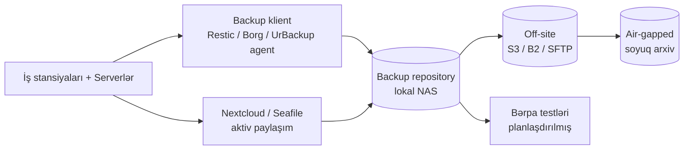

# Açıq Mənbə Backup və Fayl Paylaşımı

Datanı sakit halda və insanlar arasında ötürmə zamanı qoruyan açıq mənbə alətlərinə fokuslu baxış — ransomware-i sağ qalına bilən hala gətirən backup mühərrikləri və təşkilat daxilində istehlakçı cloud hesablarını əvəz edən self-hosted fayl-paylaşım platformaları.

Bu səhifə daha geniş [Açıq Mənbə Təhlükəsizlik Alətləri — İcmal](./overview.md) səhifəsinin bacısıdır və [SIEM, Loglama və Monitorinq](./siem-and-monitoring.md) içərisindəki aşkarlama əhatəsini, [Threat Intelligence və Malware Analizi](./threat-intel-and-malware.md) içərisindəki malware-cavab materialını tamamlayır. Alətlərin özündən kənar server-tərəfli backup arxitekturası üçün [Server backup strategiyası](../../servers/storage/backup.md) səhifəsinə baxın.

Buradakı backup alətləri data-qoruma hekayəsinin bərpa yarısıdır; fayl-paylaşım alətləri isə gündəlik-əməkdaşlıq yarısıdır. Hər iki yarı birlikdə əksər təşkilatların qəsdən başqa cür seçməyəndə default olaraq qoyduğu SaaS bundle-ı əvəz edir.

## Bu nə üçün önəmlidir

Backup ransomware-ə qarşı son müdafiə xəttidir. Hər digər nəzarət — endpoint aşkarlama, şəbəkə seqmentasiyası, MFA, patching — dağıdıcı insidentin *ehtimalını* azaltmaq üçün mövcuddur. Backup isə baş verdikdə *partlama radiusunu* məhdudlaşdırmaq üçün mövcuddur. Test edilmiş, off-site, immutable backup-ları olan təşkilat ransomware-ə dayanma kimi yanaşır; onları olmayan təşkilat isə ona ölümə yaxın təcrübə kimi yanaşır.

Kommersial backup proqram təminatı IT büdcəsinin daha bahalı küncələrindən biridir. Veeam, Commvault, Rubrik və Cohesity — hamısı orta ölçülü mühit üçün ildə on minlərlə və ya yüz minlərlə dollara qiymətləndirilir, bu da saxlama xərclərindən əvvəldir. Tək NAS-dan çıxmış SMB-lər, universitet labları, hobbi homelab-lar və hətta orta səviyyəli müəssisələr üçün açıq mənbə alternativləri — **BorgBackup**, **Restic**, **UrBackup** — eyni bərpa ssenarilərini xərcin bir hissəsinə və şifrələmə açarlarının tam sahibliyi ilə əhatə edir.

Self-hosted fayl paylaşımı aktiv əməkdaşlıq datası üçün paralel hekayədir. İstehlakçı Dropbox, Google Drive Personal və OneDrive Personal hesabları satınalma addımını atlayan hər təşkilatda yayılır və mülkiyyət intellektual əmlakını da götürür. **Nextcloud**, **Seafile** və **OnionShare** komandaya mühəndislik mənbə fayllarını onları oxuya bilən üçüncü tərəfdən keçirmədən əməkdaşlıq, sync və paylaşım imkanı verir.

- **Backup bərpa vaxtıdır, backup vaxtı deyil.** Vendor-lar backup sürəti üzrə rəqabət edir; əhəmiyyətli olan bərpa sürəti, bərpa etibarlılığı və son *uğurla test edilmiş* bərpanın nə qədər yeni olduğudur.
- **Açıq mənbə backup alətləri istehsalat bazarının real payına sahibdir.** Borg və Restic böyük host-larda və SaaS provayderlərində istehsalatda yerləşir; bu yalnız homelab məkanı deyil.
- **Self-hosted fayl paylaşımı suverenlik məsələsidir.** Mənbə kodu, müştəri datası və daxili sənədlər vendor-un infrastrukturunda yaşadıqda, etiraf etsəniz də etməsəniz də həmin vendor sizin təhlükə modelinizin bir hissəsidir.
- **Şifrələmə-açar hekayəsi vacibdir.** Borg, Restic və Nextcloud ilə açarlar sizinkidir. Əksər SaaS cloud backup ilə açarlar vendor-undur və hər məcburi açıqlama və ya pozulma sizin udmalı olduğunuz şeydir.
- **Xərc miqyaslanması dramatik fərqlidir.** Kommersial backup qorunan tutum ilə 50 TB-lıq mühiti altı rəqəmli illik xətt elementinə çevirəcək şəkildə böyüyür. Açıq mənbə hardware tutumu ilə böyüyür və bu təxminən iki sıra dərəcəsi daha ucuzdur.

Bu səhifə iki ailəni — **backup alətləri** və **self-hosted fayl paylaşımı** — aparıcı açıq mənbə layihələrinə xəritələyir, hər birinin haraya uyğun gəldiyini izah edir və kopyalaya biləcəyiniz 3-2-1-aligned deployment eskizini verir.

## Stack icmalı

Backup və fayl-paylaşım stack-ları iki paralel data axını ilə tək data-qoruma müstəvisinə birləşir — backup zənciri vasitəsilə *passiv* qoruma, fayl-paylaşım qatı vasitəsilə *aktiv* əməkdaşlıq. Hər ikisi təşkilat datasının bərpa-test edilmiş, off-site nüsxələrində bitir, lakin giriş nümunələri və alətlər qəsdən fərqlidir.

Diaqramı data axını kimi oxuyun, deployment kimi yox. Praktikada backup repository, off-site replika və soyuq arxivin hər biri fərqli infrastrukturda yaşaya bilər — 3-2-1 qaydasının məğzi budur. Nextcloud və Seafile istifadəçilərin əslində toxunduğu *canlı* data müstəvisi kimi backup zəncirinin yanında oturur və özləri Borg və ya Restic tərəfindən eyni repository-yə backup edilir.

Mənimsənilməli iki nümunə. Birincisi, **aktiv paylaşım və passiv backup fərqli işlərdir**: Nextcloud əməkdaşlıq üçündür, "auditorların bu gün istədiyi altı ay əvvəl sildiyim fayl" üçün deyil — bu backup alətinin işidir. İkincisi, **backup zənciri yalnız off-site nüsxə müstəqil olaraq yoxlanıldıqda 3-2-1 sayılır**; pozulmuş lokal repo-nu S3-ə replikasiya etmək bir sağlam deyil, iki pozulmuş nüsxə yaradır.

## 3-2-1 backup qaydası

3-2-1 qaydası bir səbəbdən ən çox təkrarlanan tək backup məsləhətidir: maddi cəhətdən əlçatmaz olmadan əksər real uğursuzluq rejimlərini sağ qalır. Datanın **üç** nüsxəsini, **iki** fərqli media tipində, **bir** off-site nüsxə ilə saxlamağı söyləyir. Müasir variantlar onu 3-2-1-1-0-a genişləndirir — bir immutable və ya air-gapped nüsxə və ən son bərpa testində sıfır verifikasiya səhvi əlavə edir.

Burada əhatə olunan hər alət qaydanı bir az fərqli şəkildə tətbiq edir:

- **BorgBackup** adətən lokal-NAS nüsxəsinə (nüsxə 1) və fərqli saytdakı uzaq SFTP və ya `borg serve` nüsxəsinə (nüsxə 2) sahibdir. Append-only rejim və açar-əsaslı giriş ransomware-ə qarşı məntiqi air-gap istehsal edir.
- **Restic** native S3, B2, Azure Blob, GCS və SFTP backend-ləri sayəsində cloud nüsxəsi (nüsxə 2 və ya 3) üçün uyğun gəlir. Object-lock aktiv olan Backblaze B2-də Restic repository sizə bir addımda həm off-site, həm də immutable verir.
- **UrBackup** endpoint-lərin on-prem nüsxəsi (nüsxə 1, image-əsaslı) üçün ən güclü seçimdir, çünki agent-və-server modeli və veb UI əksər komandaların əslində desktop və laptop backup-ı necə işlətdiyinə uyğun gəlir.
- **Nextcloud** və **Seafile** backup alətləri deyil, lakin onların server-tərəfli datası yuxarıdakılardan biri tərəfindən backup edilməlidir; klient-tərəfli sync həmçinin əksər kiçik komandalarda istifadəçi tərəfindən redaktə edilmiş faylların yumşaq ikinci nüsxəsi kimi çıxış edir.

Əksər komandaların düşdüyü tələ "bizim backup-ımız var" — hansı nüsxələrin, hansı medianın, hansı saytların və son bərpanın nə vaxt işlədiyini göstərmədən. `example.local` üçün 3-2-1 xəritələməsini bir səhifəyə yazın və rüblük baxış keçirin.

3-2-1-1-0 genişləndirməsi haqqında praktiki qeyd: əlavə "1" immutable nüsxəni, "0" isə son testdə sıfır verifikasiya səhvini bildirir. Hər iki əlavə tam olaraq vacibdir, çünki ransomware operatorları hücumun bir hissəsi olaraq backup zəncirini silməyi və ya şifrələməyi öyrəniblər — tarixi 3-2-1 qaydası həmin təhlükə modeli mövcud olmamışdan əvvəl yazılmışdı və yenilənməlidir.

## Backup — BorgBackup (Borg)

BorgBackup, adətən Borg adlandırılır, Linux və Unix sistemləri üçün dedup edən, şifrələnmiş, sıxılmış backup proqramıdır. Server-tərəfli backup üçün uzunmüddətli, mühafizəkar seçimdir və əksər "öz infrastrukturumu işlədirəm" mühəndisinin ilk uzandığı şeydir.

Açıq mənbə backup məkanında Borg server-üçün-default mövqeyinə ən güclü iddiaya sahibdir. On-disk format sabitdir, dedup virtual maşın image-ləri və böyük qovluqlarda yaxşı işləyən content-defined chunking-dir və təhlükəsizlik modeli düşmənçil uzaq saxlama fərziyyəsi ətrafında dizayn edilib.

- **Dedup-əvvəlcə dizayn.** Borg faylları dəyişən-ölçülü chunk-lara bölür, hər chunk-ı hash edir və onlarla backup-da göründükdə belə bir dəfə saxlayır. 200 GB serverin gecəlik backup-ı ilkin seed-dən sonra adətən gecədə 2–5 GB yeni data istehsal edir.
- **Default şifrələmə.** Repository-lər autentifikasiya edilmiş şifrələmə (`repokey` və ya `keyfile` rejimləri) istifadə edir, beləliklə uzaq saxlama host-u yalnız qeyri-şəffaf ciphertext-i görür. Saxlama host-unu kompromentasiya datayı kompromentasiya etmir.
- **Append-only repository-lər.** Repository elə konfiqurasiya edilə bilər ki, klient əvvəlki backup-ları silə bilməsin, yalnız yenilərini əlavə edə bilsin. Pruning ayrı etibarlı hesabdan işləyir. Bu tək xüsusiyyət ən geniş yayılmış ransomware backup-yox-etmə nümunəsini məğlub edir.
- **Sıxılma.** Borg dedup ilə yanaşı `lz4`, `zstd`, `zlib` və `lzma` sıxılmasını dəstəkləyir. `zstd,3` müasir şirin nöqtədir — qəbul edilə bilən CPU xərcində `lz4`-dən daha yaxşı nisbətlər.
- **Yetkin CLI və ekosistem.** `borgmatic` YAML-əsaslı wrapper, systemd timer unit-ləri, retention siyasətləri və pre/post hook-ları təmin edir. Əksər istehsalat Borg deployment-ləri əslində alt qatda `borgmatic` deployment-ləridir.
- **Trade-off-lar.** Borg-un birinci-tərəfli veb UI-ı yoxdur; icma frontend-ləri (BorgWarehouse, Vorta) desktop istifadəni əhatə edir, lakin server komandası adətən CLI-da yaşayır. Borg həmçinin repository əməliyyatları üçün tək-thread-lidir, bu da çox böyük repository-lərdə bottleneck ola bilər.
- **Nə vaxt seçmək.** Linux-ağırlıqlı park-lar, server backup, append-only / düşmən-uzaq saxlama fərziyyələri, dedup-dostu workload-lar — VM image-ləri və database dump-ları kimi.

`example.local` üçün Borg lokal NAS-a gecəlik server backup üçün default alətdir, repository `repokey-blake2` rejimində və saxlama serverində append-only tətbiq edilmişdir.

## Backup — Restic

Restic Borg ilə birbaşa rəqabət aparan daha cavan, Go-əsaslı backup proqramıdır. Güclü cloud backend dəstəyi, daha sadə əməliyyat erqonomikası və tək statik binary istədiyiniz zamankı seçimdir.

- **Default multi-backend.** Restic lokal fayl sistemi, SFTP, S3, Backblaze B2, Azure Blob, Google Cloud Storage, OpenStack Swift və hər rclone-dəstəkli backend üçün native dəstək göndərir. Bu Borg-dən ən böyük praktiki fərqdir, Borg ən çox SFTP və `borg serve` ilə xoşbəxtdir.
- **Dedup və şifrələmə.** Borg kimi, Restic dedup üçün content-defined chunking və şifrələmə üçün Poly1305 ilə AES-256-CTR istifadə edir. Şifrələmə məcburidir; plaintext rejim yoxdur.
- **Tək statik binary.** Restic deployment-i bir Go binary-dir. Daemon yox, agent yox, mərkəzləşdirilmiş manager yox. Cron və binary deployment-dir.
- **Snapshot modeli.** Hər backup hash ilə identifikasiya edilən snapshot-dır. Snapshot ID və ya `latest` ilə bərpa edin. Snapshot siyahısı repository parolu olan istənilən klientdən sorğulana bilər.
- **Konkurens.** Restic həm backup, həm də bərpa üçün default paraleldir, bu da onu sürətli saxlamaya malik multi-core sistemlərdə Borg-dən maddi cəhətdən daha sürətli edir.
- **Trade-off-lar.** Yaddaş istehlakı çox böyük repository-lərdə (yüz milyonlarla obyekt) yüksək ola bilər, çünki in-memory indeks əməliyyatlar zamanı RAM-da saxlanır. `prune` addımı tarixən Borg-dənkindən daha yavaş olub; son versiyalar bunu əhəmiyyətli dərəcədə yaxşılaşdırıb.
- **Nə vaxt seçmək.** Cloud-əvvəlcə backup, Windows serverlər (Restic Borg-un etmədiyi yerdə Windows-u native dəstəkləyir), heterogen park-lar, Borg-dən daha sadə əməliyyatlar və saxlama backend-inin S3-uyğun obyekt saxlama olduğu hər hal.

`example.local` üçün Restic 3-2-1-in *off-site* ayağı üçün default alətdir — Borg repository-lərinin özlərini immutable üçün object-lock ilə Backblaze B2-yə backup etmək.

## Backup — UrBackup

UrBackup fərqli yanaşma götürən klient/server backup sistemdir: veb UI-lı mərkəzləşdirilmiş server, hər klientdə quraşdırılmış agentlər və həm fayl-səviyyəli *və* image-səviyyəli backup üçün dəstək. Borg və Restic CLI-əvvəlcə server alətləri olan yerdə, UrBackup GUI-əvvəlcə endpoint-və-server alətdir.

- **Image və fayl backup-ları.** UrBackup VSS inteqrasiyası ilə Windows endpoint-lərinin düzgün image-səviyyəli backup-ını edən az açıq mənbə alətindən biridir. Boot edilə bilən recovery ISO-dan tam disk image-ini bare metal-a bərpa edə bilərsiniz.
- **Veb idarəetmə UI.** Mərkəzi server klient statusu, backup tarixi, bərpa browse və planlaşdırma üçün veb dashboard təmin edir. Operatorların gecə nəyin backup edildiyini görmək üçün hara isə SSH etmələri lazım deyil.
- **Cross-platform agentlər.** Agentlər Windows, Linux və macOS-də işləyir. Mobile (iOS, Android) dəstəklənmir.
- **Inkremental və dedup.** Fayl-səviyyəli backup-lar klientlər üzrə fayl-hash dedup ilə rsync-stil inkremental ötürmələr istifadə edir. Image backup-ları konsistentlik üçün Windows-da Volume Shadow Copy istifadə edir.
- **Trade-off-lar.** Multi-tenant və ya böyük müəssisə mühitləri üçün dizayn edilməyib — database ağır park ölçüləri altında qeyri-məhdud böyüyə bilər və multi-region replikasiyası üçün daxili dəstək yoxdur. Sakit halda backup-ların şifrələnməsi dəstəklənir, lakin default deyil; deploy zamanı aktiv edin.
- **Nə vaxt seçmək.** Endpoint backup (laptoplar, desktoplar), bare-metal Windows bərpası, mərkəzi veb UI-ın əhəmiyyətli olduğu qarışıq-OS kiçik-orta mühitlər və image-səviyyəli bərpanın sərt tələb olduğu hər hal.

`example.local` üçün UrBackup laptop parkı üçün təbii seçimdir — ofisdə tək UrBackup serveri, hər Windows və macOS laptop-unda agentlər və serverin data store-u özü Borg tərəfindən gecəlik backup edilir.

## Borg vs Restic vs UrBackup — müqayisə

| Ölçü | BorgBackup | Restic | UrBackup |
|---|---|---|---|
| Dil | Python + C | Go | C++ |
| Dedup | Content-defined chunking | Content-defined chunking | Fayl-səviyyəli + image dedup |
| Şifrələmə | Autentifikasiya edilmiş, məcburi | AES-256 + Poly1305, məcburi | Opsional, default off |
| Multi-target | SFTP, `borg serve`, lokal | S3, B2, Azure, GCS, SFTP, lokal, rclone | Yalnız lokal server |
| Fayl / image | Yalnız fayl-səviyyəli | Yalnız fayl-səviyyəli | Fayl və image |
| Veb UI | Birinci-tərəfli yox | Birinci-tərəfli yox | Daxili dashboard |
| Append-only | Bəli (server-tətbiqli) | Backend vasitəsilə object-lock | Server-tətbiqli retention |
| Ən yaxşı | Linux server backup | Cloud-tier və Windows | Endpoint + image |
| Konkurens | Repo başına tək-thread | Default paralel | Multi-klient server |

Səmimi xülasə: **on-prem server backup üçün Borg, cloud tier üçün Restic, endpoint-lər üçün UrBackup**. Onlar bir-birini istisna etmir — əksər yetkin `example.local`-formalı mühitlər üçü də işlədir.

## Fayl paylaşımı — Nextcloud

Nextcloud self-hosted fayl-paylaşım platformalarından ən genişidir. Tam Dropbox-plus-Office-365 əvəzedicisi kimi mövqeləndirilir: fayl sync, calendar, contacts, video çağırışlar, sənəd redaktəsi və yüzlərlə icma app ilə plugin marketplace.

- **Tam əməkdaşlıq paketi.** Baza serveri fayl sync ehtiva edir. Üstündə Calendar, Contacts, Talk (video konfrans), Mail, Deck (Trello-stil board-lar) və browser sənəd redaktəsi üçün Collabora Online və ya OnlyOffice ilə inteqrasiyalar bolt edilir.
- **End-to-end şifrələmə.** Nextcloud həssas data üçün qovluq başına E2EE-ni hər şey üçün server-tərəfli şifrələmə ilə yanaşı dəstəkləyir. E2EE qovluqları üçün açar idarəsi klient-tərəflidir.
- **Identity inteqrasiyası.** LDAP, SAML 2.0, OpenID Connect və OAuth2 birinci-sinifdir. MFA TOTP, WebAuthn və U2F vasitəsilə dəstəklənir.
- **Plugin ekosistemi.** Nextcloud App Store icma developerlərindən minlərlə app-a sahibdir. Keyfiyyət dəyişir, ona görə istehsalata quraşdırmazdan əvvəl audit edin.
- **Trade-off-lar.** Nextcloud-un PHP backend-i yavaş disklərdə və kiçik instance-larda performance-həssasdır. Desktop klientlərdən "Files API" çağırış nümunəsi ağır istifadə altında kiçik VM-i doyura bilər. Bir neçə onlarla istifadəçidən yuxarıda Redis, OPcache və database-i tune etmək məcburidir.
- **Nə vaxt seçmək.** Kiçik-orta komanda üçün Dropbox plus Office 365-i əvəz edən tək platforma istəyirsiniz, plugin genişlənə bilərliyini qiymətləndirirsiniz və PHP-ni tune etmək və yanında database işlətmək üçün mühəndislik qabiliyyətiniz var.

`example.local` üçün Nextcloud komandanın fayl sync-dən *artıq* — bir yerdə calendar, contacts, video çağırışlar və sənəd redaktəsi — ehtiyac duyduğu zamankı seçim platformasıdır.

## Fayl paylaşımı — Seafile

Seafile qəsdən daha dar yanaşma götürür: o, Nextcloud-dan daha kiçik footprint və böyük repository-lərdə davamlı olaraq onu məğlub edən desktop-klient təcrübəsinə malik sürətli, sync-fokuslu fayl platformasıdır.

- **Sync performansı.** Seafile-ın "library" modeli və block-səviyyəli sync protokolu eyni hardware tier-də Nextcloud-dan daha yaxşı böyük qovluqları və böyük faylları idarə edir. 100 GB+ mühəndislik qovluqlarını sync edən komandalar adətən Seafile-a üstünlük verir.
- **Library başına opsional E2EE.** Hər library (yuxarı-səviyyəli qovluq) parolu yalnız klient-tərəfli saxlanmaqla şifrəli yaradıla bilər.
- **Daha kiçik footprint.** Seafile-ın Go və Python backend-i müqayisə edilə bilən istifadəçi saylarında Nextcloud-dan az RAM istifadə edir. Kiçik VM daha uzağa gedir.
- **Cross-platform klientlər.** Desktop, mobile və veb klientlər mövcud və sabitdir.
- **Trade-off-lar.** Daha az daxili əməkdaşlıq app-ları — calendar yoxdur, contacts yoxdur, video çağırışlar yoxdur, daxili sənəd redaktoru yoxdur. Bəzi qabaqcıl xüsusiyyətlər (online office inteqrasiyası, audit log-ları) Community edisiyasından daha çox Pro edisiyasında yaşayır.
- **Nə vaxt seçmək.** Birinci olaraq sürətli fayl sync və ikinci olaraq əməkdaşlıq xüsusiyyətləri istəyirsiniz. Calendar, mail və chat üçün başqa alətləriniz var. Hardware dolları başına performansa əhəmiyyət verirsiniz.

`example.local` üçün Seafile komandanın yalnız sync-ə ehtiyac duyduğu və əməkdaşlıq paketi üçün Microsoft 365 və ya Google Workspace-i ayrıca ödədiyi zamankı Nextcloud-a alternativdir.

## Fayl paylaşımı — OnionShare

OnionShare tamamilə fərqli kateqoriyadan alətdir: Tor şəbəkəsi üzərindən *birdəfəlik, anonim* fayl paylaşımı üçündür. Mərkəzi server yox, hesab yox, davamlı saxlama yox və paylaşım bitdikdə onun qeydi yox.

- **Tor onion xidmətləri.** Hər OnionShare sessiyası ephemeral `.onion` ünvanı yaradır. Alıcılar ona Tor Browser vasitəsilə daxil olurlar; göndərənin IP-si heç vaxt görünmür.
- **Üç rejim.** "Share" (göndərəndən endirmə), "Receive" (göndərənə yükləmə) və "Host a website". "Receive" rejimi e-mail istifadə edə bilməyən mənbədən həssas materialı toplamaq üçün xüsusilə faydalıdır.
- **Server infrastrukturu yox.** OnionShare göndərənin laptop-unda işləyir. Laptop bağlandıqda, paylaşım gedir.
- **Sadə GUI və CLI.** Həm desktop, həm də komanda sətri versiyaları mövcuddur; CLI drop nöqtəsi kimi çıxış edən headless serverlər üçün uyğundur.
- **Trade-off-lar.** Hər iki uca Tor lazımdır — alıcıya Tor Browser, göndərənə işləyən OnionShare lazımdır. Throughput Tor sürətləri ilə məhdudlaşır (adətən bir neçə MB/s). Uzun yükləmələr Tor circuit-ləri dəyişdikdə orta-axında uğursuz ola bilər.
- **Nə vaxt seçmək.** Whistleblower və jurnalist mənbə-qoruma workflow-ları. Heç bir tərəfin vendor xidməti istifadə etdiyi müşahidə edilə bilməyəcəyi alıcı ilə tək həssas faylı paylaşmaq. Bir-birinin MFT-sinə güvənməyən təşkilatlar arasında insident cavab dəlilləri üçün dead-drop.

`example.local` üçün OnionShare təhlükəsizlik komandasının korporativ fayl paylaşımı təmin edə bilməyən şərtlər altında forensik artefaktları xarici cavabdehlər və ya hüquq mühafizə orqanları ilə paylaşmaq üçün insident cavab kit-ində saxladığı alətdir.

## Alət seçimi

Aşağıdakı matris bu məkanda ən geniş yayılmış ehtiyacları tövsiyə olunan açıq mənbə alətinə xəritələyir. Onu son arxitektura kimi yox, başlanğıc nöqtəsi kimi istifadə edin.

| Ehtiyac | Seçim | Niyə |
|---|---|---|
| On-prem Linux server backup | BorgBackup | Yetkin, append-only, dedup-dostu |
| Cloud-tier backup | Restic | Native S3/B2/Azure/GCS backend-lər |
| Windows endpoint image backup | UrBackup | VSS-inteqrasiyalı image, veb UI |
| Qarışıq laptop parkı, mərkəzi UI | UrBackup | Cross-platform agentlər, dashboard |
| Off-site immutable nüsxə | Restic + B2 object-lock | Onun üçün qurulub, log-lar sübut edir |
| Database / VM-image dedup | BorgBackup | Həmin workload-larda ən yaxşı dedup nisbəti |
| Tam Dropbox + Office əvəzedicisi | Nextcloud | Calendar, contacts, talk, plugin-lər |
| Yalnız sync, böyük qovluqlarda sürətli | Seafile | Block-səviyyəli sync, daha kiçik footprint |
| Anonim birdəfəlik fayl ötürmə | OnionShare | Tor onion xidməti, infra yox |
| Mənbə-qoruma workflow | OnionShare | Hesab yox, log yox, yalnız Tor |
| 3-2-1 tətbiqi | Borg + Restic + Soyuq | Bir on-prem, bir cloud, bir air-gap |

Əksər `example.local`-formalı mühitlər üçün cavab **on-prem server backup üçün Borg + cloud tier üçün Restic + endpoint-lər üçün UrBackup + aktiv əməkdaşlıq üçün Nextcloud (və ya Seafile) + IR alət dəstində OnionShare**.

## Hands-on / praktika

Beş məşq `example.local` üçün ev labında və ya sandbox mühitində bunu konkretləşdirmək üçün. Hər biri stack-ın fərqli qatını hədəfləyir.

1. **Borg repo qurun və `/etc`-i cron ilə gecəlik backup edin.** `repokey-blake2` rejimində `/srv/borg/etc-backup`-da yeni repository başladın. `/etc`-ə qarşı `borg create ::etc-{now}` çağıran, parolu yalnız-root fayldan ixrac edən və 7 gündəlik, 4 həftəlik və 6 aylıq arxiv saxlamaq üçün prune edən wrapper script yazın. 02:00-da gecəlik cron entry əlavə edin. Növbəti səhər `borg list`-in yeni arxivlər göstərdiyini və son arxivə qarşı `borg extract --dry-run`-un təmiz tamamlandığını yoxlayın.
2. **Restic-i B2 backend ilə yerləşdirin və bərpa yoxlayın.** Compliance rejimində object-lock ilə Backblaze B2 hesabı və bucket yaradın. Bucket-ə qarşı Restic repository başladın. `restic backup` ilə `/var/log`-u backup edin. Bir gün gözləyin, ikinci backup işlədin və `restic stats`-dan dedup statistikasını təsdiqləyin. Sonra ilk snapshot-u müvəqqəti qovluğa bərpa edin və dəyişməmiş fayllar üçün bərpanın bayt-eyni olduğunu sübut etmək üçün orijinala qarşı `diff -r` edin.
3. **UrBackup serveri plus Windows agent quraşdırın.** UrBackup serverini Linux VM-də və agenti Windows test maşınında yerləşdirin. Gündəlik cədvəldə həm fayl-səviyyəli, həm də image-səviyyəli backup konfiqurasiya edin. Tam image-in tamamlanmasını gözləyin, sonra ayrı VM-də recovery ISO-nu boot edin və bare-metal bərpanın əslində işlədiyini təsdiqləmək üçün image-i bərpa edin. Bərpa vaxtını sənədləşdirin.
4. **Nextcloud-u obyekt-saxlama backend ilə Docker-də yerləşdirin.** `docker compose` vasitəsilə MariaDB sidecar ilə rəsmi Nextcloud image-ini qaldırın. İlkin fayl saxlamasını S3-uyğun obyekt store-a göstərmək üçün konfiqurasiya edin (MinIO lab üçün lokal işləyir). Üç test istifadəçisi yaradın, aralarında qovluq paylaşın və alt qatdakı obyektlərin bucket-də göründüyünü təsdiqləyin. Admin hesabı üçün TOTP MFA-nı aktiv edin.
5. **Tor üzərində alıcıya OnionShare vasitəsilə həssas fayl paylaşın.** Göndərən maşına OnionShare quraşdırın, ayrı alıcı maşına Tor Browser quraşdırın. Tək fayl üçün yeni "Share" sessiyası yaradın, alınmış `.onion` URL-i kanardan kopyalayın, alıcıda Tor Browser-də açın və faylı endirin. OnionShare UI-nı yoxlayaraq paylaşımın bir endirmədən sonra avtomatik bağlandığını təsdiqləyin.

## İşlənmiş nümunə — `example.local` 3-2-1 strategiyası

`example.local` əvvəllər fayl share-lərinin gecəlik snapshot-larını edən tək Synology NAS, server backup-ı yox və şəxsi hesablarda mühəndislik mənbə fayllarını toplayan free-tier Dropbox-a sahib idi. Yeni dizayn açıq mənbə alətləri ilə həqiqi 3-2-1 tətbiq edir.

Sürücü qardaş təşkilatda Ryuk-ailəli ransomware ilə yaxın-qaçınma idi. Liderlik off-site, immutable və test edilmiş nüsxələr üçün açıq tələblərlə növbəti rüb backup layihəsini təsdiqlədi.

- **Nüsxə 1 — Lokal NAS-a Borg gecəlik (on-prem).** Hər Linux server 02:00-da ofisdəki həsr edilmiş NAS-da Borg repository-yə qarşı `borgmatic` işlədir. NAS repository-ni `borg serve --append-only` ilə SSH üzərindən expose edir, beləliklə kompromentasiya edilmiş server əvvəlki arxivləri silə bilməz. Retention: 14 gündəlik, 8 həftəlik, 12 aylıq. Gecəlik Healthchecks.io ping cron işinin işlədiyini yoxlayır.
- **Nüsxə 2 — Backblaze B2-yə Restic həftəlik (cloud).** Hər bazar gecəsi Restic işi Borg repository-lərinin özlərini 90 günə qoyulmuş compliance rejimində object-lock ilə Backblaze B2 bucket-ə backup edir. Cloud nüsxəsi beləliklə on-prem tərəfindəki ransomware-in geri uzanaraq şifrələyə və ya silə bilməyəcəyi nüsxə-nüsxəsidir.
- **Nüsxə 3 — Yanmaz seyfdəki USB diskinə aylıq soyuq arxiv (off-site air-gap).** Hər ayın ilk bazar ertəsində 4 TB USB disk ayrı binadakı yanmaz seyfdən rotasiya edilir, backup host-una qoşulur, təzə Restic snapshot ilə doldurulur, sonra seyfə qaytarılır. İkinci disk bank əmanət qutusunda saxlanır və rüblük rotasiya edilir. Bu son çarə bərpa nüsxəsidir və həqiqətən bir dəfədə 30 gün off-line-dır.
- **Aktiv əməkdaşlıq — Nextcloud şəxsi cloud hesablarını əvəz edir.** Ofisdə həsr edilmiş VM-də host edilən Nextcloud instance mühəndislik komandasının paylaşılan iş sahəsinə çevrildi. Şəxsi Dropbox hesabları inventarlaşdırıldı, məzmun miqrasiya edildi və hesablar 90 gün ərzində bağlandı. Nextcloud data qovluğu özü nüsxə 1-in bir hissəsi olaraq Borg, nüsxə 2-nin bir hissəsi olaraq Restic və nüsxə 3-ün bir hissəsi olaraq soyuq arxiv tərəfindən backup edilir.
- **Endpoint-lər — Laptoplar üçün UrBackup.** Ofisdəki tək UrBackup server korporativ şəbəkədə olan zaman hər Windows və macOS laptop-u gecəlik backup edir, image-səviyyəli backup həftəlik və fayl-səviyyəli gündəlik. Laptop istifadəçiləri artıq öz backup-larını idarə etmir; bərpa şəxsi problem əvəzinə IT-ə bilet olur.
- **Bərpa testləri — rüblük.** Hər rüb IT komandası təsadüfi olaraq bir server, bir laptop və bir Nextcloud istifadəçisi seçir və ən son off-site nüsxədən tam bərpa edir, hər bərpa-nı saatlayır və nəticəni imzalayır. Uğursuzluqlar backup zəncirinin özündə dayanma elan edilməsi ilə nəticələnir.
- **Xərc.** Hardware: NAS, USB diskləri və UrBackup VM üçün ~$8,000 birdəfəlik. Cloud: Backblaze B2 üçün ayda ~$120. Abunələr: $0. Mühəndislik: rollout üçün 4 həftə, davam edən bir FTE-nin ~10%-i.

İlk real fəlakət-bərpa təlimi, altı ay sonra, dörd ay əvvəl silinmiş faylı 90 dəqiqədə soyuq arxivdən bərpa etdi — köhnə tək-NAS rejimi altında qeyri-mümkün olacaq nəticə.

## Backup gigiyenası

Backup deployment-ini "bizim backup-ımız var"-dan "biz ransomware-i sağ qala bilərik"-ə çevirən qısa gigiyena təcrübələri siyahısı.

- **Bərpa testləri planlaşdırın.** Test edilməmiş backup arzudur, backup deyil. Hər backup alətinin sıfır-olmayan səssiz korruptsiya nisbəti var; yalnız periodik bərpa testləri onu tapır. Rüblük mərtəbədir; ən kritik data üçün aylıq daha yaxşıdır.
- **Backup sağlamlığını monitor edin.** Hər backup işi monitorinq sisteminə uğur və ya uğursuzluq siqnalı yaymalıdır. Sadəcə alarm olmadan dayanan iş "yeni backup-larımızın olmadığını kəşf etdik" hekayələrinin ən geniş yayılmış səbəbidir.
- **Köhnəlmiş backup-lara xəbərdarlıq.** "Son uğurlu backup 36 saatdan çox əvvəl" kimisə page etməlidir. Səssiz backup uğursuzluqları insident-in ən bahalı növüdür, çünki heç kim bərpa vaxtına qədər onları kəşf etmir.
- **Şifrələmə açarlarını rotasiya edin.** Backup şifrələmə açarları parol meneceri və ya HSM-də olmalıdır, sənədləşdirilmiş rotasiya tezliyi (illik əksər mühitlər üçün yaxşıdır) və istehsalat mühitinin sıradan çıxdığı və açarın lazım olduğu hal üçün sənədləşdirilmiş bərpa proseduru ilə.
- **Immutable / append-only bucket-ləri istifadə edin.** S3 və B2-də object-lock, Borg-də append-only rejim, air-gap üçün write-once media. Immutability olmadan serverlərinizi şifrələyən ransomware həm də backup-larınızı şifrələyəcək.
- **Backup credential-larını istehsalat credential-larından ayırın.** Kompromentasiya edilmiş istehsalat admin hesabı backup-ları silə bilməməlidir. Backup işlərini repository-yə append-only girişi olan həsr edilmiş identity kimi işlədin.
- **Bərpa runbook-unu sənədləşdirin.** İnsident zamanı `borg extract` sintaksisini öyrənmək vaxtı deyil. Hər alət üçün bərpa prosedurunun çap edilmiş, off-line nüsxəsi, soyuq-arxiv diskləri ilə eyni yanmaz seyfdə saxlanılır, dəqiq bir dəfə qarşılığını verən hazırlıq növüdür.

## Troubleshooting və tələlər

Açıq mənbə backup və fayl-paylaşım stack-ını "bizi xilas edən şey"-dən "heç vaxt test etmədiyimiz şey"-ə çevirən qısa səhv siyahısı.

- **Konkurens işlər altında Borg repository lock-ları.** Borg repository eyni vaxtda yalnız bir yazıçı yol verir. Eyni repository üçün yarışan iki cron işi `LockTimeout` və uğursuz backup istehsal edir. İşləri stagger edin və ya host başına bir repository istifadə edin və ya `borgmatic`-in daxili lock idarəetməsini istifadə edin.
- **Nəhəng repository-lərdə Restic yaddaş partlaması.** Restic əməliyyatlar zamanı repository indeksini yaddaşda saxlayır. On milyonlarla kiçik fayl olan repository prune və check əməliyyatları üçün 8–16 GB RAM tələb edə bilər. Backup host-unu uyğun ölçün və ya çoxlu repository-yə bölün.
- **UrBackup database qeyri-məhdud böyüyür.** UrBackup serveri fayl başına metadata-nı SQLite və ya MariaDB-də saxlayır. Retention pruning olmadan, 100 endpoint-lik park database-i on GB-larla böyüdə bilər və veb UI-nı sürünə-sürünə yavaşlada bilər. Retention limitlərini əvvəldən konfiqurasiya edin və database ölçüsünü aylıq monitor edin.
- **Yavaş disklərdə Nextcloud "Files API" performansı.** Nextcloud-un PHP-əsaslı fayl metadata əməliyyatları fırlanan disklərdə və kiçik instance-larda yavaşdır. Desktop klientin discovery fazası başlanğıcda kiçik VM-i doyurur. SSD-lər, OPcache, Redis və tune edilmiş database 50 aktiv istifadəçidən yuxarıda qeyri-müzakirə edilə bilər.
- **Uzun yükləmələr zamanı OnionShare circuit uğursuzluqları.** Tor circuit-ləri periodik rotasiya edir və böyük transferlər orta-axında uğursuz ola bilər. ~1 GB-dan yuxarı fayllar üçün `split` ilə bölün və alıcıda yenidən birləşdirin və ya yenidən cəhdlərin workflow-un bir hissəsi olduğunu qəbul edin.
- **"Yalnız birinci gün test edildi" sindromu.** Ən geniş yayılmış backup uğursuzluq nümunəsi uğurlu ilkin testdən sonra illərlə test edilməmiş əməliyyat və real insident zamanı korruptsiyanın kəşf edilməsidir. Təqvimdə rüblük bərpa-test hadisəsi yoxdursa, backup-lar nəzəridir, real deyil.
- **İstehsalatla birlikdə yerləşən backup-lar.** Qoruduğu data ilə eyni hypervisor klasteri, eyni SAN və ya eyni binadakı backup repository eyni dərəcədə faydasız olmaqdan bir ransomware partlaması uzaqdır. Off-site-ın bütün mənası *off-site*-dır.
- **Nextcloud və Seafile-ın özlərinin data olduğunu unutmaq.** Self-hosted fayl platformasının server-tərəfli data qovluğu təşkilatın sahib olduğu ən vacib datanın bir hissəsidir. O backup əhatəsində olmalıdır və backup yalnız fayl ağacını deyil, database-i ehtiva etməlidir.

## Əsas çıxarışlar

Bu dərsdən götürüləcək başlıq nöqtələri, "həmişə doğru"-dan "xatırladığınız zaman faydalı"-ya qədər sıralanmışdır.

- **Borg, Restic və UrBackup birlikdə tam backup stack-ını əhatə edir** — server, cloud, endpoint — kommersial alət xərcinin kiçik bir hissəsində, açarların tam sahibliyi ilə.
- **3-2-1 müzakirə edilməzdir.** Üç nüsxə, iki media, bir off-site — və getdikcə bir immutable. Bundan az olan hər şey data itkisindən bir uğursuzluq uzaqdır.
- **Test edilməmiş backup-lar arzulardır.** Bərpa testlərini təqvimdə planlaşdırın; uğursuzluqlar dayanma sayılır.
- **Immutability ən geniş yayılmış ransomware backup-yox-etmə nümunəsini məğlub edir.** Object-lock, append-only rejim və ya air-gap — ən azı bir nüsxə üçün ən azı birini seçin.
- **Nextcloud və Seafile təşkilat daxilində istehlakçı cloud hesablarını əvəz edir** və xərc qədər suverenlik, IP qoruması və tənzimləyici məruziyyət üçün vacibdir.
- **OnionShare bilməyə dəyər ixtisaslaşmış alətdir** — yalnız onun işləyəcəyi nadir hal üçün — anonim, ephemeral, infrastruktur yox.
- **Backup alətləri və self-hosted fayl paylaşımı üst-üstə düşməyən, tamamlayıcıdır.** Fayl-paylaşım platforması aktiv dataya sahibdir; backup aləti tarixi və bərpa nüsxələrinə sahibdir.
- **Ən böyük açıq mənbə backup riski operator qabiliyyəti deyil, alət qabiliyyətidir.** Alətlər işləyir; uğursuzluq rejimi onları izləməkdən imtina edən komandadır.
- **Birinci gündən 3-2-1-1-0 üçün planlaşdırın.** Immutability və verifikasiyanı ilk qorxudan sonra retrofit etməkdənsə rollout-a dizayn etmək çox daha ucuzdur.
- **Backup üçün xərc hekayəsi bütün hekayə deyil.** Bəli, pul qənaət edirsiniz. Daha böyük qələbə *bərpa inamıdır* — keçən rübün bərpa testinin gücünə əsasən növbəti ransomware insidentinin ölüm hökmü deyil, dayanma olduğunu əvvəlcədən bilmək.

Açıq desək: Borg + Restic + UrBackup + Nextcloud (və ya Seafile) qəbul edən `example.local`-formalı təşkilat kommersial backup-və-əməkdaşlıq əhatəsini xərcin bəlkə də 5%-ə uyğunlaşdıra bilər — stack-ı işlətmək, monitor etmək və bərpa-test etmək üçün mühəndislik qabiliyyəti mövcud olduqda.

## İstinadlar

- [BorgBackup — borgbackup.org](https://www.borgbackup.org)
- [borgmatic — torsion.org/borgmatic](https://torsion.org/borgmatic/)
- [Restic — restic.net](https://restic.net)
- [Restic sənədləri — restic.readthedocs.io](https://restic.readthedocs.io)
- [UrBackup — urbackup.org](https://www.urbackup.org)
- [Nextcloud — nextcloud.com](https://nextcloud.com)
- [Nextcloud admin manual](https://docs.nextcloud.com/server/latest/admin_manual/)
- [Seafile — seafile.com](https://www.seafile.com)
- [OnionShare — onionshare.org](https://onionshare.org)
- [Backblaze B2 object-lock](https://www.backblaze.com/cloud-storage/object-lock)
- [NIST SP 800-34 — Contingency Planning Guide](https://csrc.nist.gov/pubs/sp/800/34/r1/upd1/final)
- [CISA — Stop Ransomware: backup təlimatları](https://www.cisa.gov/stopransomware)
- [CISA / NSA / FBI ransomware cavab checklist](https://www.cisa.gov/sites/default/files/2023-02/StopRansomware-Guide_508c_v3_1.pdf)
- [3-2-1 backup qaydası — US-CERT tarixi təlimatları](https://www.cisa.gov/news-events/news/data-backup-options)
