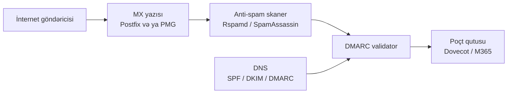

# Açıq Mənbə Email Təhlükəsizliyi

Email perimetrini müdafiə edən açıq mənbə alətlərinə fokuslu baxış — mesajları qiymətləndirən spam skanerləri, poçt qutularının qarşısında oturan poçt gateway-ləri və kiçik komandanın onlarla daemon-u əl ilə qaldırmadan öz serverini idarə etməsinə imkan verən hamısı-bir-yerdə poçt bundle-ları.

Bu səhifə [Açıq Mənbə Stack İcmalı](./overview.md) dərsini artıq oxuduğunuzu və [Firewall, IDS/IPS, WAF və NAC](./firewall-ids-waf.md) dərsindən ən azı işlək firewall-a sahib olduğunuzu nəzərdə tutur. Email demək olar ki, hər digər təhlükəsizlik qatına toxunur — phishing [Sosial Mühəndislik](../../red-teaming/social-engineering.md) ilə axır, malware əlavələri [Threat Intel və Malware Analizi](./threat-intel-and-malware.md) ilə kəsişir və daxil olan rejection-lar [SIEM və Monitorinq](./siem-and-monitoring.md) dashboard-larında görünür.

## Bu nə üçün önəmlidir

Email hələ də ilkin-girişin bir nömrəli vektorudur. Verizon DBIR onillik ərzində hər il phishing və email-vasitəli payload-ları breach-səbəb siyahısının başına qoyub və hər red-team retro-su eyni hekayəni danışır: əksər mühitlərə ən ucuz giriş yolu kiminsə inbox-una yaxşı hazırlanmış mesajdır. Bu tənliyin müdafiə tərəfi iki kommersial vendor — Proofpoint və Mimecast — tərəfindən domine edilir, hansı ki poçt qutusu başına illik ödəniş alırlar, böyük müqavilələr bir neçə min yer üçün altı rəqəmə qədər çıxır.

Bu rəqəmləri qaldıra bilməyən kiçik və ya orta biznes üçün açıq mənbə tərəfi eyni sahənin əksəriyyətini əhatə edir. Rspamd və ya SpamAssassin kimi skaner kütləvi-poçt və phishing-nümunə qiymətləndirməsini həll edir; Proxmox Mail Gateway kimi appliance idarə olunan ön qapı qoyur; Mailcow, Mail-in-a-Box və iRedMail kimi bundle-lar lazım gələrsə bütün poçt stack-ını self-host etmənizə imkan verir. Üzərində qatlanan üç DNS-əsaslı autentifikasiya standartı — SPF, DKIM və DMARC — heç bir skanerin tək-başına edə bilməyəcəyi siyasət işini görür.

`example.local` üçün — Microsoft 365 qarşısında kommersial email təhlükəsizliyi gateway-i üçün illik 30,000$ ödəyən 200 nəfərlik təşkilat — açıq mənbə yolu realdir. **M365 qarşısında Proxmox Mail Gateway**, **ağır filtrasiyanı edən Rspamd** və **DNS qatında tətbiq olunan SPF + DKIM + DMARC** gündəlik phishing, spam və malware filtrasiyasını kommersial qiymətin təxminən dörddə birinə əhatə edir.

- **Phishing ilkin-girişin bir nömrəli vektorudur.** İldən-ilə. Heç bir firewall, EDR və ya SIEM bunu aradan qaldırmır — yalnız gateway-də filtrasiya və DNS qatında autentifikasiya edə bilər.
- **Kommersial filtrlər bahalı və qeyri-şəffafdır.** Proofpoint və Mimecast hesabları risk ilə yox, poçt qutusu sayı ilə böyüyür və nəyin karantinə salındığına qərar verən qayda məntiqi vendor qara qutusudur.
- **Açıq mənbə filtrləri yetkindir.** Rspamd və SpamAssassin hər ikisi kommersial bazarın əksəriyyətindən əvvəl mövcud olub və milyonlarla poçt qutusunda döyüş-sınaqlıdır — onlar oyuncaq deyil.
- **Autentifikasiya pulsuzdur.** SPF, DKIM və DMARC yalnız DNS yazıları və bir az imzalama infrastrukturuna başa gəlir. Onları atlamaq müasir email təhlükəsizliyində ən böyük məcburi olmayan səhvdir.
- **Self-hosting xərci məsuliyyətə dəyişir.** Mailcow kimi bundle bir axşamda tam poçt server verir, lakin keçid etdiyiniz an IP-reputasiya idarəetməsi, deliverability tənzimləməsi və 24x7 uptime öhdəliklərini miras alırsınız.
- **Yalnız-gateway deployment-lər cloud poçt qutusu iqtisadiyyatını qoruyur.** Proxmox Mail Gateway-i M365 və ya Google Workspace qarşısına qoymaq host edilən poçt qutularının əməliyyat üstünlüklərini itirmədən filtrasiya üzərində nəzarət verir.

Bu səhifə alətlərin dörd ailəsini — **anti-spam skanerlər, poçt gateway-ləri, hamısı-bir-yerdə bundle-lar və autentifikasiya** — konkret seçimlərə xəritələyir, hər birinin haraya uyğun gəldiyini izah edir və `example.local` üçün işlənmiş deployment verir.

## Stack icmalı

Aşağıdakı diaqram tək daxil olan mesajı internetdən poçt qutusuna qədər izləyir, üç DNS-əsaslı autentifikasiya yazısı axında düzgün yerdə validator-a daxil olur. Onu data axını kimi oxuyun, deployment kimi yox — praktikada skaner və validator eyni daemon içində yaşaya bilər.

Mənimsənilməli iki nümunə. Birincisi, **eyni daemon hər iki işi gördükdə belə skaner və autentifikasiya validator-u konseptual olaraq ayrıdır**: qiymətləndirmə "bu spam-formalıdırmı" qərar verir, validasiya "bu domain bu göndəricini avtorizasiya etdimi" qərar verir. İkisini qarışdırmaq pis qaydalara aparır — autentifikasiya olunmuş marketinq poçtunu karantinə salmaq və ya öz CFO-nuzun spoof edilmiş ünvanından imzasız spear-phishing-i qəbul etmək. İkincisi, **DNS yazıları təhlükəsizlik stack-ının hissəsidir**: SPF, DKIM və DMARC poçt serverindən kənarda yaşayan, lakin birbaşa validator-a daxil olan konfiqurasiyadır. Onları dərc etməyi unutmaq qorunan və açıq olmaq arasındakı fərqdir.

## Anti-spam — Rspamd

Rspamd açıq mənbə poçt filtrasiyası üçün müasir default seçimdir — Lua skript ilə C-də yazılıb, asinxron və köhnə alternativlərindən təxminən bir dərəcə daha sürətlidir. İllər ərzində Mailcow və bir neçə digər bundle-da default skaner olub və layihə Vsevolod Stakhov-un məsləhətləşməsi vasitəsilə sabit kommersial dəstəyə malikdir.

Arxitektura hadisə-idarə olunan və yüksək-throughput mühitləri üçün qurulub. Rspamd SpamAssassin-in Perl boru kəmərinin etdiyi kimi fərdi yoxlamalarda bloklanmır — DNSBL axtarışlarını, məzmun skanlarını, statistik qiymətləndirməni və Bayes təsnifatını paralel olaraq fan-out edir və nəticəni aqreqasiya edir.

- **Qiymətləndirmə mühərriki.** Hər mesaj onlarla müstəqil yoxlamadan (DNSBL hit-ləri, məlum-spam korpuslarına qarşı fuzzy uyğunluqları, statistik token analizi, başlıq anomaliyaları, URL reputasiyası) bal toplayır. Yekun bal hərəkəti müəyyən edir — qəbul, greylist, soft-reject, hard-reject və ya mövzunu yenidən yazmaq.
- **Fuzzy hash.** Rspamd mesaj bədənlərinin shingled fingerprint-lərini qurur və onları fuzzy-storage klasteri arasında paylaşır. Kampaniya bir node-da fingerprint edildikdən sonra, qalan flot onun mutasiya olunmuş kopyalarını tanıyır. Bu məzmun qaydalarını məğlub edən kütləvi kampaniyaları tutan şeydir.
- **Bayes və neyron-şəbəkə təsnifatçıları.** Daxili Bayes təsnifatçısı operator-etiketli korpuslardan ham vs spam öyrənir. Opsional neyron-şəbəkə plugin üstünə TensorFlow-üslublu qat əlavə edir, çətin künc hallarda dəqiqliyi tez-tez yaxşılaşdırır — qeyri-şəffaf qiymətləndirmə qərarları bahasına.
- **Native autentifikasiya yoxlamaları.** SPF, DKIM imzalama və yoxlama, DMARC qiymətləndirməsi, ARC və DKIM açar rotasiyası — hamısı daxili olaraq qurulub. Rspamd ilə yanaşı ayrı `opendkim` və ya `policyd-spf` daemon-una ehtiyacınız yoxdur.
- **Postfix və Exim inteqrasiyası.** Rspamd milter protokolu vasitəsilə Postfix-ə və ya spam-yoxlama ACL vasitəsilə Exim-ə qoşulur. İnteqrasiya sənədləşdirilib və ətrafdakı poçt server qaldırıldıqdan sonra tipik quraşdırma dəqiqələr çəkir.
- **Web UI.** Canlı mesaj qiymətləndirməsi, statistika, karantindən öyrənmə və qayda tənzimləməsi üçün daxili dashboard. UI köhnə filtrlərin mətn-fayl erqonomikasından mənalı bir addım irəlidir.
- **Nə vaxt seçməli.** Yeni deployment-lər, yüksək-throughput mailflow-lar, qiymətləndirmə, autentifikasiya və təsnifatçı öyrənməsini bir dam altında idarə edən tək daemon istədiyiniz hər yer.

## Anti-spam — SpamAssassin

SpamAssassin yaşlı dövlət xadimidir — ilk dəfə 2001-ci ildə buraxılıb, Perl-də yazılıb və hələ də saysız hosting-provayder poçt stack-larında göndərilən filtr. Apache Software Foundation onu saxlayır və qayda korpusu SpamAssassin Rules Project vasitəsilə yeniləmələr almağa davam edir.

O Rspamd-dan daha yavaşdır, yaddaşa daha çox aclıqdır və Perl-on-startup modeli müasir konteynerləşdirilmiş deployment-ləri sevmir. Bunların heç biri onu iyirmi ildir onu işlədən milyonlarla poçt serverindən tərpətmiyib — cPanel, Plesk və paylaşılan-hosting quraşdırmalarının uzun quyruğu var ki SpamAssassin ən az müqavimət yolu olaraq qalır.

- **Qayda-idarə olunan qiymətləndirmə.** Hər mesaj regex və başlıq qaydalarının böyük kataloqundan ballar toplayır. Default eşik (adətən 5.0) mesajı spam kimi işarələyir; qaydalar əsas paylanmanın hissəsi kimi və həftəlik yenilənən əlavə qayda kanalları vasitəsilə göndərilir.
- **Bayes təsnifatçısı.** Token-tezliyi Bayes mühərriki zaman keçdikcə ham/spam öyrənir. Operatorlar onu karantin və təsdiqlənmiş-təmiz korpuslara qarşı `sa-learn` vasitəsilə qidalandırır.
- **DNSBL və URIBL axtarışları.** Spamhaus, Barracuda, SURBL və onlarla digər reputasiya siyahılarına qarşı plug-in axtarışlar. Nəticələr birbaşa qəbul və ya rədd etmək yerinə mesaj balına töhfə verir.
- **Pyzor, Razor və DCC.** Rspamd-ın fuzzy hash-na ruh etibarilə oxşar paylanmış-checksum şəbəkələri — fərqli protokollar, oxşar effekt.
- **Amavisd inteqrasiyası.** Şərti deployment SpamAssassin-i `amavisd-new` arxasına qoyur, hansı ki məzmunu SA, ClamAV və digər skanerlərə fan-out edir və verdikti Postfix-ə yenidən inject edir.
- **Nə vaxt seçməli.** SA-nın artıq qoşulduğu mövcud hosting mühitləri, Perl overhead-in əhəmiyyətli olmadığı kiçik həcmlər və ya Rspamd-ın birləşmiş-mühərrik yanaşmasından çox SA qiymətləndirmə modelinin qayda-bə-qayda oxunaqlılığını üstün tutan təşkilatlar.

## Anti-spam — müqayisə

Aşağıdakı cədvəl iki filtri praktikada qərarı domine edən ölçülərdə müqayisə edir — sürət, dəqiqlik, inteqrasiya forması və davam edən baxım yükü.

| Ölçü | Rspamd | SpamAssassin |
|---|---|---|
| Dil / runtime | C + Lua, asinxron | Perl, mesaj başına fork |
| Throughput | Yüksək (saniyədə minlərlə msg/node) | Orta (saniyədə yüzlərlə msg/node) |
| Yaddaş izi | Kompakt, tək daemon | Daha ağır, Perl tərcüməçiləri |
| Daxili auth (SPF/DKIM/DMARC) | Bəli, native | Plugin və ya xarici daemon vasitəsilə |
| Fuzzy / paylaşılan-korpus uyğunluğu | Native fuzzy storage | Pyzor, Razor, DCC plugin-ləri |
| ML / neyron-şəbəkə opsiyası | Bəli (TensorFlow plugin) | Yox (yalnız Bayes) |
| Default UI | Daxili web dashboard | Yox (mətn + amavisd-new əlavələri) |
| İnteqrasiya | Postfix milter, Exim ACL | Amavisd, MIMEDefang, MailScanner |
| Qayda yeniləmə tezliyi | Davamlı, avto | `sa-update` vasitəsilə həftəlik |
| Ən uyğun | Yeni, yüksək-throughput | Köhnə, hosting-platforma |

Qısa versiya: **yeni deployment-lər üçün Rspamd**, SpamAssassin yalnız mövcud platforma əllərinizi bağladıqda və ya SA-nın qayda oxunaqlılığı operatorlarınız üçün xam throughput-dan daha vacib olduqda.

## Poçt gateway — Proxmox Mail Gateway

Proxmox Mail Gateway (PMG) Proxmox VE arxasında olan eyni komandadan Debian-əsaslı appliance-dir. O, Postfix, Rspamd-i (və ya SpamAssassin), ClamAV, karantin verilənlər bazası və veb admin UI-ı mövcud poçt serverinin qarşısına düşən tək ISO-ya bundle edir — Microsoft 365, Google Workspace və ya self-hosted Exchange yaxud Postfix.

PMG-nin məqsədi ön qapı olmaqdır. Sizin MX yazınız PMG-yə işarə edir; PMG daxil olan poçtu qəbul edir, skanlayır və sağ qalan mesajları arxasındakı real poçt qutusu infrastrukturuna ötürür. Real poçt qutusu serveri internetlə birbaşa danışmır.

- **Stack məzmunu.** SMTP mühərriki kimi Postfix, Rspamd və SpamAssassin hər ikisi mövcud (Rspamd müasir buraxılışlarda default-dur), malware skanlama üçün ClamAV, regex və DKIM/SPF/DMARC siyasətləri və PostgreSQL ilə dəstəklənən istifadəçi başına karantin verilənlər bazası.
- **Axında mövqe.** PMG perimetr skaneridir, poçt qutusu host-u deyil. Tipik deployment PMG-ni ictimai MX yazıları ilə qoyur və Postfix/Exchange/M365 onun arxasında özəl interfeysdə oturur, yalnız PMG-nin IP-sindən poçt qəbul edir.
- **Web admin.** Bütün siyasət, karantin nəzərdən keçirməsi, istifadəçi idarəetməsi və izləmə veb UI vasitəsilə baş verir. İnterfeys möhkəmdir — Proxmox VE-ni yaradan eyni mühəndislik mədəniyyəti.
- **Klaster rejimi.** PMG sinxronlaşdırılmış karantin və siyasət verilənlər bazasını paylaşan eyni node-ların klasteri kimi işləyə bilər. Kiçik miqyasda HA üçün faydalıdır; lisenziya-pulsuz versiya klasterləməni dəstəkləyir.
- **Üstünlüklər.** Özünü-əhatələyən appliance, ağıllı default-lar, güclü veb UI, xam Rspamd-dan daha dostluq admin qatı altında Rspamd-ın müasir skanlamasını inteqrasiya edir. Kiçik təşkilatlar üçün tək VM-də işlətmək ucuzdur.
- **Dəyişimlər.** Açıq mənbə nəşri kommersial abunəliyin imzalı paket repozitoryası və birbaşa dəstəyindən məhrumdur — onu istehsalatda pulsuz işlədə bilərsiniz, lakin yenilənmə yolu sizin ya abunə olmağınızı ya da abunəsiz kanal ilə rahat olmağınızı gözləyir. Karantin UI gözəldən çox funksionaldır.
- **Nə vaxt seçməli.** Artıq işlək poçt backend-iniz var (M365, Google Workspace, Exchange, on-prem Postfix) və poçt qutusu qatını yenidən qurmadan onun qarşısında idarə olunan-hisslə açıq mənbə filtri istəyirsiniz.

## Self-hosted bundle — Mailcow

Mailcow Docker-native hamısı-bir-yerdə açıq mənbə poçt serveridir. "Dockerised" nəşri Postfix, Dovecot, Rspamd, ClamAV, SOGo (groupware), nginx və veb admin UI-ı təzə VM-də bir saatdan az ərzində qalxan tək `docker-compose` deployment-inə yığır.

Layihə Avropalıdır, GPLv3-dür və dostluq aktiv icmaya malikdir. O, öz glue-larını yazmadan tam self-hosted poçt təcrübəsi istəyən komandaların əksəriyyətinin əldə etdiyi default açıq mənbə bundle-dır.

- **Komponentlər.** Postfix (SMTP), Dovecot (IMAP/POP3, sieve), Rspamd (filtrasiya), ClamAV (malware), SOGo (webmail + CalDAV/CardDAV), nginx (reverse proxy), MariaDB (saxlama), Redis (cache və növbələr), ACME klienti (Let's Encrypt avtomasiyası).
- **Web UI.** Mailcow-un admin UI-ı domain yaratma, poçt qutusu idarəetməsi, alias və forwarding qaydaları, karantin nəzərdən keçirməsi, DKIM açar generasiyası və istifadəçi başına 2FA-nı idarə edir. Operatorlar ilkin deployment-dən sonra nadir hallarda config faylına toxunmalı olurlar.
- **DKIM və ARC imzalama.** Daxilidir. Yeni domain üçün DKIM açarı yaratmaq bir-klikli əməliyyatdır; açıq açar DNS yazısı yapışdırmaya hazır göstərilir.
- **Rspamd dashboard.** Mailcow Rspamd-ın veb UI-ını admin paneldə tab kimi göstərir, beləliklə bundle-dan çıxmadan balları oxuya, ham/spam korpuslarını öyrədə və eşikləri tənzimləyə bilərsiniz.
- **Yeniləmələr.** `update.sh` skripti yeni konteyner şəkilləri çəkir və sxemi miqrasiya edir. Yeniləmələr adətən ağrısızdır, lakin bəzən pozucu dəyişikliklər təqdim edir — istehsalatda spesifik tag-lara pin edin və əvvəl staging-də sınayın.
- **Nə vaxt seçməli.** Müasir filtrasiya ilə tam self-hosted poçt server istəyirsiniz, Docker ilə rahatsınız və əl ilə yığılmış stack yerinə vahid uyğun layihə istəyirsiniz.

## Self-hosted bundle — Mail-in-a-Box

Mail-in-a-Box "bu gün axşam poçt server istəyirəm"ə yönəlmiş fikir-formalı tək-qutu bundle-dır. O təzə Ubuntu 22.04 VM-i təxminən iyirmi dəqiqədə işlək poçt server, web mail və DNS host-una çevirən bash quraşdırıcı kimi göndərilir.

Layihənin bildirilmiş məqsədi self-hosted poçtu qeyri-mütəxəssislərə əlçatan etməkdir və dizayn seçimləri bunu əks etdirir — bir dəstəklənən OS, bir dəstəklənən deployment forması və çox az tənzimləmə səthi var. Bu sadəlik təklifdir.

- **Komponentlər.** Postfix, Dovecot, Roundcube webmail, OpenDKIM, OpenDMARC, SpamAssassin, ClamAV, autoritativ DNS server kimi nsd, reverse proxy kimi nginx və kiçik admin UI.
- **Bundle-ın hissəsi kimi DNS.** Mailcow-dan fərqli olaraq, Mail-in-a-Box öz autoritativ DNS-ini işlədir — registrar-ınızı qutuya işarə edirsiniz və o avtomatik olaraq SPF, DKIM və DMARC yazılarını xidmət edir. Bu rahatdır və bir az qeyri-adidir; o həm də qutunun indi DNS yolunuzda olduğunu bildirir.
- **Backup-lar.** Duplicity istifadə edərək daxili şifrələnmiş backup-to-S3 (və ya uyğun). Bərpa sənədləşdirilmiş prosedurdur və praktikada işləyir.
- **Üstünlüklər.** Həqiqətən sürətli işə-vaxta-qədər, uçdan-uca ağıllı default-lar, əksər şeyləri etmək üçün bir doğru yol olduğu qədər fikir-formalı.
- **Zəifliklər.** Mailcow-dan az çevikdir — tək-qutu, tək-OS, daxili klasterləmə yoxdur. Rspamd əvəzinə SpamAssassin istifadə edir, beləliklə filtr throughput-u daha aşağıdır. Daha kiçik icma, daha yavaş buraxılış tezliyi.
- **Nə vaxt seçməli.** Özünü işlədən şəxsi və ya ailə-domain poçt server istəyirsiniz, və ya daha çevik platformaya qoşulmadan əvvəl qiymətləndirmə deployment-i istəyirsiniz.

## Self-hosted bundle — iRedMail

iRedMail iRedMail.org-dan uzun-müddətli açıq mənbə poçt server bundle-dır, pulsuz açıq mənbə özəyi və ödənişli Pro tier (iRedAdmin-Pro) ilə qabaqcıl admin xüsusiyyətləri əlavə edir. O, digər bundle-lardan daha geniş OS matrisini dəstəkləyir — Debian, Ubuntu, RHEL/Rocky/AlmaLinux, FreeBSD və OpenBSD.

Arxitektura Docker-native əvəzinə bare-metal-dostudur, hansı ki konteyner orkestrasiyası üzərində sistem paketləri və `systemd` unit-lərini üstün tutan operatorlara cəlb edir. O, hosting və idarə olunan-xidmət dükanlarında populyar seçimdir.

- **Komponentlər.** Postfix, Dovecot, Amavisd-new, SpamAssassin, ClamAV, webmail üçün Roundcube və ya SOGo, nginx və ya Apache, backend store opsiyaları kimi OpenLDAP / MariaDB / PostgreSQL.
- **Backend seçimi.** Qeyri-adi çeviklik — IT mühitinizə uyğun olana görə istifadəçi hesablarını OpenLDAP, MariaDB və ya PostgreSQL-də saxlaya bilərsiniz. Əksər digər bundle-lar birini seçir və orada qalır.
- **Multi-OS.** Həm Debian-ailəsi, həm RHEL-ailəsi Linux-lar, plus BSD-lər üçün birinci-sinif dəstək. Korporativ siyasət spesifik baza OS məcbur etdikdə faydalıdır.
- **iRedAdmin (pulsuz) vs iRedAdmin-Pro (ödənişli).** Pulsuz admin UI funksionaldır, lakin məhduddur; istifadəçi başına siyasətlər, karantin nəzərdən keçirməsi, parol vaxtının bitməsi və audit loqlama ödənişli tier-də yaşayır. Poçt serverinin özü tam açıq mənbədir və Pro UI olmadan işləyir.
- **Üstünlüklər.** Yetkin, OS-aqnostik, Docker istəməyən sysadmin-lər üçün rahat. Mövcud sistem-idarəetmə alətləri (Ansible, Salt, Puppet) ilə birlikdə yaxşı işləyir.
- **Zəifliklər.** Filtr tərəfi SpamAssassin-əsaslıdır, beləliklə Mailcow-dan daha yavaşdır; pulsuz admin UI üç bundle-ın ən zəifidir; Pro-ya upsell daimidir.
- **Nə vaxt seçməli.** Docker-suz bundle istəyirsiniz, RHEL və ya BSD dəstəyinə ehtiyacınız var və ya komandanız konteyner orkestrasiyası üzərində sistem paketlərini üstün tutur.

## Bundle-lar — müqayisə

Aşağıdakı matris üç bundle-ı praktikada qərarı domine edən ölçülərdə müqayisə edir — qablaşdırma forması, filtr mühərriki və əməliyyat mürəkkəbliyi.

| Ölçü | Mailcow | Mail-in-a-Box | iRedMail |
|---|---|---|---|
| Qablaşdırma | Docker Compose | Ubuntu-da bash quraşdırıcı | Sistem paketləri, multi-OS |
| Default filtr | Rspamd | SpamAssassin | SpamAssassin |
| Webmail | SOGo | Roundcube | Roundcube və ya SOGo |
| Groupware (CalDAV/CardDAV) | Bəli (SOGo) | Məhdud | Bəli (SOGo opsiyası) |
| DKIM idarəetməsi | UI, bir-klik | UI, avtomatik | UI, qismən |
| Daxili DNS | Yox (xarici DNS) | Bəli (nsd) | Yox (xarici DNS) |
| Multi-OS | Linux + Docker | Yalnız Ubuntu | Debian, RHEL, BSD |
| Klasterləmə | Mümkün (manual) | Yox | Məhdud |
| Pulsuz admin UI | Tam | Tam | Məhdud (tam üçün Pro) |
| Ən uyğun | Müasir self-hosted | Tək-qutu, az-toxunma | Multi-OS, bare-metal |

Qısa versiya: Docker işlədə bilirsinizsə və ən müasir bundle istəyirsinizsə **Mailcow**; sadəcə işləyən bir qutu istəyirsinizsə **Mail-in-a-Box**; RHEL/BSD və ya sistem-paket idarəetməsinə ehtiyacınız varsa **iRedMail**.

## Email autentifikasiya əsasları

Heç bir filtr, nə qədər yaxşı olsa da, üç DNS-əsaslı autentifikasiya standartını əvəz etmir. SPF, DKIM və DMARC dünyaya domain-iniz üçün hansı serverlərin poçt göndərməyə icazə verildiyini və başqa nə isə cəhd etdikdə nə etmək lazım olduğunu deyən siyasət qatıdır.

- **SPF (Sender Policy Framework, RFC 7208).** Domain-inizdən poçt göndərməyə avtorizasiya edilmiş IP ünvanlarını və hostname-ləri sadalayan DNS TXT yazısı. Qəbuledicilər qoşulan IP-ni yazıya qarşı müqayisə edirlər. SPF tək başına kövrəkdir — forwarding-də pozulur — lakin hər şeyin üzərində qurulduğu təməldir.
- **DKIM (DomainKeys Identified Mail, RFC 6376).** Açıq açarı DNS-də dərc edilmiş, çıxan poçt başlıqlarına əlavə olunan kriptoqrafik imza. Qəbuledicilər imzanı dərc olunan açara qarşı yoxlayırlar. DKIM forwarding-dən sağ çıxır (imza mesajla birlikdə səyahət edir) və mesajın tranzitdə dəyişdirilmədiyini sübut edir.
- **DMARC (Domain-based Message Authentication, Reporting and Conformance, RFC 7489).** "Əgər SPF və DKIM hər ikisi uğursuz olsa (və From: domain-i ilə uyğunlaşmasa), bunu et" deyən siyasət yazısı — `none` (yalnız monitor), `quarantine` və ya `reject`. DMARC həm də domain sahibinə kim sizin domain-inizlə poçt göndərdiyini görmək imkanı verən aqreqat hesabatlar istehsal edir.
- **Uyğunlaşma.** DMARC SPF və ya DKIM domain-inin görünən From: ünvanı ilə uyğun gəlməsini (uyğunlaşmasını) tələbinə əlavə edir. Bu spoofing-i həqiqətən dayandıran hissədir — SPF və ya DKIM tək başına əlaqəsiz domain üçün keçə bilər və yenə də brendinizi imitasiya edilə bilən qoyur.
- **Qatlama sırası.** Əvvəl SPF dərc edin, sonra DKIM, sonra hesabatlar toplamaq üçün `p=none`-də DMARC. Hesabatlar legitimat mənbələrinizin uyğunlaşdığını göstərdikdə DMARC-ı `p=quarantine`-ə keçirin, sonra heç bir legitimat şeyin tutulmadığına əmin olduqda `p=reject`-ə.
- **BIMI (Brand Indicators for Message Identification).** Brendlərə dəstəkləyən klientlərdə (Gmail, Apple Mail, Yahoo) autentifikasiya olunmuş poçtun yanında yoxlanılmış loqo göstərməyə imkan verən daha yeni standart. `p=quarantine` və ya daha sərt DMARC, plus tanınmış orqandan Verified Mark Certificate tələb edir. Təhlükəsizlik-kritik əvəzinə marketinq-idarə olunan, lakin sərt DMARC qəbuluna faydalı təkan.

## Alət seçimi

Aşağıdakı matris ən ümumi email-təhlükəsizlik ehtiyaclarını tövsiyə olunan açıq mənbə alətinə xəritələyir, bir-sətirlik "niyə" ilə — onu build skoplaşdırarkən başlanğıc nöqtəsi kimi istifadə edin, yekun arxitektura kimi yox.

| Ehtiyac | Seçim | Niyə |
|---|---|---|
| Yalnız filtr, M365/Workspace qarşısında | Proxmox Mail Gateway | Appliance forması, ağıllı default-lar |
| Self-built stack üçün filtr daemon | Rspamd | Müasir, sürətli, native auth yoxlamaları |
| Köhnə hosting platforması üçün filtr | SpamAssassin | Artıq cPanel/Plesk-ə qoşulub |
| Self-hosted poçt server (Docker) | Mailcow | Ən müasir bundle, Rspamd daxilidir |
| Self-hosted poçt (tək-qutu, az-toxunma) | Mail-in-a-Box | Bir-atışlı quraşdırıcı, sadəcə işləyir |
| Self-hosted poçt (RHEL və ya BSD) | iRedMail | Multi-OS, sistem paketləri |
| Autentifikasiya siyasəti | SPF + DKIM + DMARC | Təməl, pulsuz, yalnız-DNS |
| Dəstəkləyən klientlərdə brend loqosu | BIMI | Onsuz da sərt DMARC tələb edir |
| Çıxan malware skanlaması | ClamAV (PMG/Mailcow-da) | Bundle olunub, pulsuz signature feed |

M365 və ya Google Workspace işlədən əksər `example.local`-formalı mühitlər üçün cavab **qarşıda PMG, içində Rspamd, DNS qatında SPF + DKIM + DMARC**. Cloud poçt qutusu vendoru tərk etmək istəyən mühitlər üçün **Mailcow** default başlanğıc nöqtəsidir.

## Praktika / məşq

Bunu `example.local` üçün ev laboratoriyasında və ya sandbox mühitində konkret etmək üçün beş məşq. Hər biri email təhlükəsizliyi stack-ının fərqli qatını hədəf alır və birlikdə filtrasiya, autentifikasiya və uçdan-uca deliverability validasiyasını məşq edirlər.

1. **Mailcow-u Docker-də deploy edin.** Public IP və test domain ilə təzə Ubuntu 22.04 VM qaldırın. Mailcow repo-nu klonlayın, `generate_config.sh` və `docker compose up -d` işlədin, sonra admin UI-dan keçin — domain əlavə edin, iki poçt qutusu yaradın, DKIM açarı yaradın və iki hesab arasında test mesajı göndərin. Roundcube-da mesaj başlıqlarını yoxlayaraq DKIM imzasının keçdiyini təsdiqləyin.
2. **Rspamd-i neyron-şəbəkə plugin ilə konfiqurasiya edin.** Mailcow və ya müstəqil Rspamd quraşdırmasında `neural` modulunu aktivləşdirin. Rspamd web UI-nın öyrənmə nəzarətlərindən istifadə edərək onu etiketli ham və spam korpusları ilə qidalandırın (hər birindən bir neçə yüz baseline üçün kifayətdir). Məlum-spam-formalı test mesajı göndərin və Rspamd bal panelini yoxlayaraq neyron modulunun verdiktə töhfə verdiyini təsdiqləyin.
3. **`example.local` üçün SPF, DKIM və DMARC quraşdırın.** Göndərmə mənbələrinizi sadalayan SPF yazısı dərc edin, DKIM açar cütü yaradın və açıq yarısını dərc edin, sonra `rua=` aqreqat-hesabat poçt qutusu ilə `p=none`-də DMARC yazısı dərc edin. Gmail hesabına mesaj göndərin, orijinala baxın və üç yoxlamanın hamısının `pass` göstərdiyini təsdiqləyin.
4. **Proxmox Mail Gateway-i relay kimi deploy edin.** PMG-ni kiçik VM-də ISO-dan quraşdırın. `example.local`-u relay domain kimi əlavə edin və PMG-ni real poçt serverinizə (və ya M365 endpoint-inə) növbəti-hop kimi yönləndirin. PMG-ni ictimai MX etmək üçün DNS-i yeniləyin, xarici ünvandan test poçtu göndərin və mesajın PMG karantin və izləmə görünüşləri vasitəsilə real poçt qutusuna düşdüyünü təsdiqləyin.
5. **DMARC və deliverability test edin.** Real konfiqurasiya edilmiş göndəricinizdən [mail-tester.com](https://www.mail-tester.com) tərəfindən göstərilən ünvana mesaj göndərin. Yaranan hesabatı oxuyun — SPF, DKIM və DMARC-ın hamısının keçdiyini təsdiqləyin, hər hansı blacklist hit-i və ya məzmun xəbərdarlıqlarını düzəldin və 10/10 bal alana qədər yenidən test edin. Müqayisə üçün eyni testi Mailcow quraşdırmasından təkrarlayın.

## İşlənmiş misal — `example.local` PMG-ni M365 qarşısına qoyur

`example.local` poçt qutuları üçün Microsoft 365 işlədir. Cari kommersial email təhlükəsizliyi gateway hesabı 200 istifadəçi üçün təxminən illik 30,000$-dır — təhlükəsizlik alətləri büdcəsinin böyük fraksiyası. Yeni dizayn M365 poçt qutularını saxlayır (çünki onları köçürmək hər hansı filtr qənaətini cırardı) və kommersial filtri qarşıda Proxmox Mail Gateway ilə əvəz edir.

İdarəedici ikilidir: xərclərin azaldılması və kommersial vendorun bahalı peşəkar xidmətlər olmadan özəlləşdirməyəcəyi filtr qaydaları və karantin siyasəti üzərində nəzarət.

- **PMG klaster.** Kiçik klasterdə iki PMG node, hər biri firewall ilə eyni data mərkəzində 4-vCPU / 8 GB VM-də. İctimai DNS MX yazıları iki node-un qarşısında yük-balanslaşdırılmış IP-yə işarə edir. ClamAV aktivləşdirilib, Rspamd aktiv skanerdir və admin UI-da 14 günlük karantin saxlama siyasəti təyin edilib.
- **Daxil olan axın.** İnternet göndəriciləri PMG MX-ə vurur. PMG SPF, DKIM və DMARC validasiyası həyata keçirir, Rspamd qiymətləndirməsini işlədir, malware və məlum-pis göndəriciləri atır və sağ qalanları M365 daxil olan konnektora ötürür. M365 konnektoru yalnız PMG-nin çıxan IP-lərindən poçt qəbul etməyə məhdudlaşdırılıb.
- **Çıxan axın.** M365 konnektor vasitəsilə PMG-yə çıxan poçt göndərir, hansı ki korporativ DKIM imzasını əlavə edir, hər hansı çıxan məzmun qaydalarını tətbiq edir və ictimai internetə ötürür. Bu PMG-ni email üçün tək çıxış nöqtəsi edir və təhlükəsizlik komandasına DLP-üslublu çıxan qaydalar əlavə etmək üçün yer verir.
- **DNS.** SPF yazısı PMG-nin çıxan IP-lərini və Microsoft-un `include:spf.protection.outlook.com`-unu sadalayır. DKIM açarı PMG tərəfindən yaradılıb, açıq yarısı TXT yazısı kimi dərc edilib. DMARC yazısı `p=quarantine`-də xüsusi poçt qutusuna aqreqat hesabatlama ilə; hesabatlar yeni göndəriciləri və kölgə-IT poçt axınlarını aşkar etmək üçün həftəlik parse edilir.
- **Əməliyyat inteqrasiyası.** Karantin bildirişləri istifadəçilərə gündəlik gedir; admin-lər PMG dashboard-unu gündə bir dəfə nəzərdən keçirirlər. PMG node sağlamlığı üzrə xəbərdarlıqlar mövcud Prometheus və Slack stack-ına axır. Rspamd təlim datası açıq istifadəçi düymələrindən deyil (hansı ki səs-küylüdür), operator-təsdiqlənmiş karantin yazılarından mənbələnir.
- **Xərc.** PMG infrastrukturu illik ~2,000$ (iki VM və kiçik load balancer). Mühəndislik: rollout üçün ~3 həftə, sonra tənzimləmə, karantin nəzərdən keçirilməsi və DMARC hesabat analizi üçün bir FTE-nin ~10%-i. Əvvəlki gateway-ə qarşı net qənaət: təxminən illik 20,000$, nəzarət və görünürlükdə mənalı qazanclarla yanaşı.

Əvvəlki kommersial gateway qeyri-şəffaf idi: bloklanmış mesajlar vendor-tərəfli ticket eskalasiyası tələb edirdi və qayda dəyişiklikləri istifadəçi-tənzimlənən deyildi. Yeni stack tam komanda nəzarəti altındadır, qaydalar və siyasətlər versiya nəzarətindədir və DMARC hesabatlaması tək başına IT komandasında heç kimin bilmədiyi iki üçüncü tərəf göndəricisini aşkar edib.

## Problem həlli və tələlər

Təmiz açıq mənbə email stack-ını deliverability insidentinə çevirən səhvlərin qısa siyahısı. Əksəriyyəti texniki əvəzinə əməliyyatdır — alətlər işləyir, uğursuzluq rejimləri insan-və-DNS nümunələridir.

- **DMARC `p=reject` çox tez deploy edilir.** Aqreqat hesabatları oxumadan DMARC-ı birbaşa `p=reject`-ə keçirmək demək olar ki, həmişə ən azı bir legitimat göndəricini pozur — marketinq platforması, payroll provayder, unudulmuş daxili tətbiq. Həmişə əvvəl ən azı bir neçə həftə `p=none`-də işlədin, uyğunlaşma boşluqlarını düzəldin, sonra `quarantine`-ə keçin, sonra `reject`-ə.
- **DKIM açar rotasiyası unudulur.** DKIM açarları periodik rotasiya edilməlidir (illik ümumi tezlikdir). Rotasiya etməyi unutmaq texniki uğursuzluq deyil, lakin təhlükəsizlik zəmanətini aşındırır — və üçüncü tərəf platformasında DKIM açar kompromisi real insident sinifidir.
- **Çıxan self-hosting zamanı IP reputasiyası.** Yeni self-hosted poçt server naməlum IP-də başlayır və əsas provayderlər (Gmail, Microsoft) reputasiya qurulana qədər ondan poçtu həftələrlə throttle və ya junk edirlər. Self-host edirsinizsə, IP-ni tədricən qızdırın, feedback loop-larına qeydiyyatdan keçin və böyük mailing siyahıları birinci gün miqrasiya etməyin.
- **Rspamd təlim datasının sızması.** Son istifadəçilərin düymə vasitəsilə hər şeyi "spam" kimi işarələmələrinə icazə vermək Bayes və neyron təsnifatçılarına zibil verir — onların sadəcə istəmədikləri legitimat poçt daxil olmaqla. Təlim datasını xam istifadəçi kliklərindən deyil, operator-təsdiqlənmiş karantindən mənbələyin.
- **Mailcow yeniləmələri inteqrasiyaları pozur.** Mailcow-un `update.sh`-i ümumiyyətlə təhlükəsizdir, lakin bəzən inteqrasiyanı pozan asılılığı yüksəldir (SOGo URL dəyişiklikləri, Rspamd modul yenidən qarışdırmaları). İstehsalatda spesifik tag-lara pin edin, staging-də sınayın, yeniləmədən əvvəl release qeydlərini oxuyun.
- **Catch-all ünvanlar malware kanalları kimi.** Hər hansı naməlum local-part-a poçt qəbul edən `catch-all@example.local` ünvanı yüksək həcmdə əlavə-yüklü spam toplayacaq. Spesifik biznes səbəbiniz olmadığı sürəcə catch-all-ları söndürün.
- **Yedək olmadan yalnız-MX yazıları.** Tək host-a işarə edən tək MX yazısı daxil olan poçt üçün tək-nöqtə-uğursuzluq deməkdir. İki MX yazısı (və ya PMG kimi klasterləşdirilmiş gateway) işlədin və hər ikisinin əlçatan olduğundan əmin olun.
- **TLS səhv konfiqurasiyası.** Bir çox müasir göndərici STARTTLS-i üstün tutur və ya tələb edir. Vaxtı keçmiş və ya self-signed sertifikatla poçt gateway hələ poçtu qəbul edə bilər, lakin opportunistic TLS-in məxfilik zəmanətlərini itirir — və MTA-STS (RFC 8461) getdikcə daha çox tətbiq edilir. Let's Encrypt istifadə edin və müddəti monitor edin.
- **Karantin heç vaxt nəzərdən keçirilmir.** Heç bir insanın açmadığı karantin false-positive qara dəliyə çevrilir. Onu cədvəllə nəzərdən keçirin və ya istifadəçi-görünən karantin bildirişlərini səthləşdirin ki, istifadəçilər öz false positive-lərini buraxa bilsinlər.
- **Backup MX strategiyası olmadan self-hosting.** Tək self-hosted poçt serveriniz bir günortadan sonra düşərsə, poçt geri qayıdır. Riski açıq şəkildə qəbul edin, klasterləşdirilmiş quraşdırma işlədin və ya backup MX xidməti müqavilə bağlayın.
- **Mermaid diaqramlar implementasiya əvəzinə siyasət kimi.** Bu səhifədəki stack icmalı diaqramı nümunədir, konfiqurasiya deyil. Hər arxitektura dəyişikliyindən sonra onu təzələyin və ya çəkməyi dayandırın — köhnəlmiş diaqram heç birindən pisdir.

## Əsas tezislər

Bu dərsdən götürüləcək başlıq nöqtələri, "həmişə doğru"dan "xatırladıqda faydalı"ya qədər sırayla.

- **Email hələ də ilkin-girişin bir nömrəli vektorudur.** Filtrləyin və autentifikasiya edin və ya ön qapını açıq qoyduğunuzu qəbul edin.
- **Rspamd müasir default filtrdir.** SpamAssassin köhnə və hosting mühitlərində sağ qalır; yeni build-lər Rspamd ilə başlamalıdır.
- **PMG M365 / Google Workspace dükanları üçün düzgün gateway formasıdır.** Cloud poçt qutularını saxlayın, kommersial filtri əvəz edin, sətir maddəsinin 60-80%-ni qənaət edin.
- **Mailcow, Mail-in-a-Box və iRedMail fərqli problemləri həll edirlər.** Mailcow müasir Docker-native dükanlar üçün, Mail-in-a-Box bir-qutu deployment-lər üçün, iRedMail RHEL/BSD və ya sistem-paket seçimləri üçün.
- **SPF + DKIM + DMARC danışıqsızdır.** O pulsuzdur, yalnız-DNS-dir və domain spoofing-i dayandıran yeganə şeydir.
- **DMARC-ı tədricən rollout edin.** `none` sonra `quarantine` sonra `reject`, hər addım arasında həftələrlə və hər mərhələdə hesabat nəzərdən keçirilməsi.
- **Self-hosting poçt uzun-müddətli əməliyyat öhdəliyidir.** Deliverability, IP reputasiyası və uptime keçid etdiyiniz gün hamısı sizin probleminizə çevrilir.
- **Karantin nəzərdən keçirməsi real işdir.** Karantinə salan və heç vaxt oxunmayan filtr təhlükəsizlik nəzarəti deyil, deliverability məsuliyyətinə çevrilir.
- **Email təhlükəsizliyinə kod kimi yanaşın.** DNS yazılarını, rspamd qaydalarını və PMG siyasətlərini versiya nəzarətinə salın; firewall qaydalarını nəzərdən keçirdiyiniz eyni şəkildə dəyişiklikləri pull request vasitəsilə nəzərdən keçirin.
- **Hər dəyişiklikdən əvvəl və sonra deliverability test edin.** mail-tester.com, Gmail-in "show original"-ı və öz DMARC aqreqat hesabatlarınız alacağınız ən ucuz görünürlükdür.
- **Xərc hekayəsi realdır, lakin nəzarət hekayəsi daha çox önəmlidir.** Filtr lisenziyası üzərində pul qənaət etmək yaxşıdır; qayda məntiqinə, karantin siyasətinə və dataya sahib olmaq strategikdir.

Onu açıq deyək: PMG + Rspamd + SPF/DKIM/DMARC qəbul edən `example.local`-formalı təşkilat kommersial-filtr əhatəsinə xərcin bir fraksiyası ilə uyğunlaşa bilər — şərtlə ki, kim isə cədvəllə karantini və DMARC hesabatlarını nəzərdən keçirsin.

## İstinadlar

- [Rspamd — rspamd.com](https://rspamd.com)
- [Rspamd sənədləri](https://rspamd.com/doc/)
- [SpamAssassin — spamassassin.apache.org](https://spamassassin.apache.org)
- [Mailcow — mailcow.email](https://mailcow.email)
- [Mailcow sənədləri](https://docs.mailcow.email)
- [Mail-in-a-Box — mailinabox.email](https://mailinabox.email)
- [iRedMail — iredmail.org](https://www.iredmail.org)
- [Proxmox Mail Gateway — proxmox.com](https://www.proxmox.com/en/proxmox-mail-gateway)
- [ClamAV — clamav.net](https://www.clamav.net)
- [Postfix — postfix.org](https://www.postfix.org)
- [Dovecot — dovecot.org](https://www.dovecot.org)
- [RFC 7208 — Sender Policy Framework (SPF)](https://datatracker.ietf.org/doc/html/rfc7208)
- [RFC 6376 — DomainKeys Identified Mail (DKIM)](https://datatracker.ietf.org/doc/html/rfc6376)
- [RFC 7489 — Domain-based Message Authentication, Reporting and Conformance (DMARC)](https://datatracker.ietf.org/doc/html/rfc7489)
- [RFC 8461 — SMTP MTA Strict Transport Security (MTA-STS)](https://datatracker.ietf.org/doc/html/rfc8461)
- [BIMI Group — bimigroup.org](https://bimigroup.org)
- [mail-tester.com — deliverability qiymətləndirməsi](https://www.mail-tester.com)
- Əlaqəli dərslər: [Açıq Mənbə Stack İcmalı](./overview.md) · [Firewall, IDS/IPS, WAF və NAC](./firewall-ids-waf.md) · [SIEM və Monitorinq](./siem-and-monitoring.md) · [Threat Intel və Malware Analizi](./threat-intel-and-malware.md) · [Sosial Mühəndislik](../../red-teaming/social-engineering.md)
