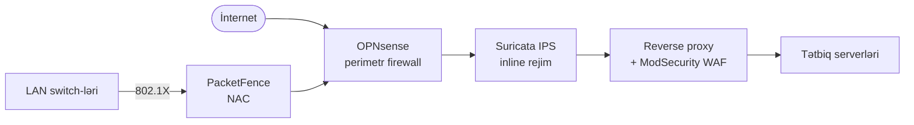

# Açıq Mənbə Firewall, IDS/IPS, WAF və NAC

Müdafiəolunan şəbəkənin perimetr və inline-müdafiə qatlarını təşkil edən açıq mənbə alətlərinə fokuslu baxış — kiçik komandaların bir lisenziya dolları olmadan idarə edə biləcəyi firewall-lar, intrusion detection mühərrikləri, web application firewall-lar və network access control sistemləri.

## Bu nə üçün önəmlidir

Hər kommersial next-generation firewall vendoru sizə bir cüt cihaz üçün altı rəqəmli qiymət təklif edəcək, üstəgəl abunə, üstəgəl peşəkar xidmətlər. Regional bank, tənzimləyici-məcburi pərakəndə satıcı və ya suveren-dövlət agentliyi üçün bu qiymət sadəcə biznes etmənin maya dəyəridir. `example.local` üçün — real perimetr nəzarətlərinə ehtiyacı olan, lakin 80,000$-lıq Palo Alto hesabını qaldıra bilməyən 200 nəfərlik təşkilat — söhbət fərqlidir.

Yaxşı xəbər: **OPNsense + Suricata + ModSecurity** ətrafında qurulmuş açıq mənbə perimetr stack-ı kommersial NGFW marketinq slaydının vəd etdiyinin təxminən 80%-ni əhatə edir. Bir qədər cila, bir qədər vendor-idarə edilən təhdid intel feed-ləri və bir qədər 24/7 telefon dəstəyini itirirsiniz. Tam nəzarət, tam müşahidə qabiliyyəti, "rug-pull"ların olmaması və çox illik capex xəttinə yox, bir FTE maaşına sığan büdcə qazanırsınız.

- **Perimetr və inline aşkarlama opsional deyil.** Hətta kiçik bir ofis stateful firewall, egress filtrləmə və WAN edge-də hansısa intrusion detection növünə ehtiyac duyur. Bunları atlamaq "çox kiçikik, vecimizə deyil" demək deyil — qapını açıq qoyub heç kimin diqqət etməməsinə ümid etməkdir.
- **Kommersial NGFW xərcləri throughput ilə miqyaslanır, riskə görə yox.** Üç illik abunə ilə birlikdə 1 Gbps cihaz cütü adətən 50k$–150k$ aralığında yer alır. Eyni iş yükü OPNsense + Suricata üzərində 1,500$-lıq mini-PC-də eyni effektiv ruleset ilə işləyir.
- **Community feed-lər realdır.** Emerging Threats Open və OWASP Core Rule Set bir neçə kommersial məhsulun səssizcə bundle etdiyi eyni signature bazalarıdır. Endirimli məhsul işlətmirsiniz — fərqli SKU ilə eyni mühərriki işlədirsiniz.
- **Kompromis operator səyidir.** Açıq mənbə perimetr alətləri kiminsə onları tune etməsini, alert-lərə baxmasını və qaydaları yeniləməsini tələb edir. Əgər heç kim bu işi görməyəcəksə, kommersial məhsul alın. Kim varsa görəcək, qənaət böyükdür.

Bu səhifə dörd nəzarət ailəsini — **firewall, IDS/IPS, WAF, NAC** — aparıcı açıq mənbə alətlərinə xəritələyir, hər birinin haraya uyğun gəldiyini izah edir və kopyalaya biləcəyiniz konkret deployment eskiz verir.

## Stack icmalı

Dörd nəzarət ailəsi tək inline yola birləşir. İnternetdən gələn trafik perimetr firewall-a dəyir, IDS/IPS mühərriki tərəfindən yoxlanılır, ModSecurity ilə reverse proxy-də terminate olunur tətbiqin qarşısında, NAC isə LAN-a kimin qoşula biləcəyini tətbiq edir.

Diaqramı sorğu yolu kimi oxuyun, deployment diaqramı kimi yox. Praktikada OPNsense, Suricata və reverse proxy üç qutuda və ya bir qutuda yaşaya bilər; PacketFence access switch-lərlə RADIUS danışan ayrı cihaz cütüdür. Məsələ nəzarətlərin *sırasıdır* — əvvəl firewall, ikinci IPS, tətbiqə ən yaxın WAF, L2 access qatını idarə edən NAC.

## Firewall-lar — OPNsense və pfSense

İki dominant açıq mənbə firewall distribusiyası eyni FreeBSD + pf nəslindən enir, lakin idarəetmə və tempdə fərqlənir.

### OPNsense

OPNsense FreeBSD əsaslı açıq mənbə firewall və routing platformasıdır ki idarəetmə anlaşılmazlıqları üzündən 2015-ci ildə pfSense-dən fork olunub. Stateful firewall, IPsec/OpenVPN/WireGuard, DHCP, DNS resolver, captive portal, HAProxy və inline Suricata IPS bundle edir — hamısı müasir veb UI-nin arxasında.

- **Əsas xüsusiyyətlər.** Stateful packet filter, çox-WAN, traffic shaping, Suricata və ya Zenarmor vasitəsilə IDS/IPS, Netflow ixracı, iki-faktor admin girişi, bir kliklə geri qayıtma ilə tam konfiqurasiya tarixçəsi.
- **Plugin ekosistemi.** ntopng, HAProxy, Nginx, Tinc, Zerotier, Telegraf, Sensei (Zenarmor) üçün birinci tərəf plugin-lər. Plugin-lər imzalanır və core release-ə version-pinned-dir.
- **Release tempi.** Proqnozlaşdırıla bilən: hər altı ayda bir əsas release (year.1 / year.7) dərc olunmuş roadmap ilə. Təhlükəsizlik backport-ları günlər ərzində yerləşdirilir.
- **High availability.** Aktiv/passiv failover üçün native CARP dəstəyi; peer-lər arasında konfiqurasiya sinxronizasiyası daxili.
- **Nə vaxt seçmək.** Müasir UI, hər release-i imzalayan aktiv maintainer və aydın idarəetmə istəyirsiniz — və pfSense-dən bir qədər fərqli idiomları öyrənməyə hazırsınız.

### pfSense

pfSense (community edition, "CE") m0n0wall-un orijinal FreeBSD əsaslı fork-udur. Cihaz və kommersial "Plus" edition-u da satan Netgate tərəfindən saxlanılır.

- **Əsas xüsusiyyətlər.** Eyni FreeBSD + pf core, stateful firewall, VPN, traffic shaping, Suricata və Snort ilə package manager.
- **Plugin ekosistemi.** OPNsense-nin-dən kiçik və daha yavaş hərəkət edir; bəzi paketlər ödənişli Plus-only xüsusiyyətləri lehinə dəstəkdən çıxarılıb.
- **Release tempi.** Community edition release-ləri Plus-dan geri qalıb, son illərdə CE versiyaları arasında daha uzun fasilələrlə.
- **Hardware tərəfi.** Netgate pfSense Plus ilə əvvəlcədən yüklənmiş cihazlar satır; eyni hardware öz əlinizlə flash etsəniz CE işlədə bilər.
- **Nə vaxt seçmək.** Mövcud pfSense təcrübəniz var, dəstəkləmək istədiyiniz Netgate cihazınız var və ya ödənişli quraşdırmada xüsusilə pfSense Plus xüsusiyyətlərinə ehtiyacınız var.

## OPNsense vs pfSense — müqayisə

| Ölçü | OPNsense | pfSense CE |
|---|---|---|
| Release tempi | İldə iki dəfə, proqnozlaşdırıla bilən | Müntəzəm olmayan, CE Plus-dan geri qalır |
| GUI | Müasir, AJAX-ağır, dark mode | Klassik, təkmilləşmədə yavaş |
| Plugin ekosistemi | Aktiv, imzalanmış, version-pinned | Daha kiçik, bəzi dəstəkdən çıxarmalar |
| Lisenziya | BSD 2-clause | Apache 2.0 |
| İdarəetmə | Deciso B.V. + community | Netgate (kommersial vendor) |
| Fork tarixi | 2015-də pfSense-dən fork | 2004-də m0n0wall-dan fork |
| IDS/IPS | Suricata (daxili), Zenarmor plugin | Suricata və ya Snort (paketlər) |
| Default IPS | Suricata | Quraşdırılana qədər heç biri |

`example.local`-da greenfield deployment üçün OPNsense idarəetmə və release tempinə görə daha təhlükəsiz seçimdir. pfSense artıq onu işlədirsinizsə və operatorlarınız onun fərqliliklərini bilirsə yenə də yaxşı seçimdir.

## IDS/IPS — Suricata, Zeek, Snort

Üç layihə açıq mənbə şəbəkə aşkarlamasında dominantdır. Onlar ekvivalent deyil: Suricata və Snort signature-driven mühərriklərdir ki paketləri inline drop edə bilər, Zeek isə bloklamaqdansa müşahidə edən protokol-bilən logging və scripting framework-üdür.

### Suricata

Suricata yüksək-performanslı, multi-threaded IDS, IPS və şəbəkə təhlükəsizliyi monitoring mühərrikidir. Snort signature dilini danışır, Lua scripting-i dəstəkləyir və ELK, Splunk və ya Wazuh-a təmiz şəkildə daşınan strukturlu EVE JSON log-ları emit edir.

- **Aşkarlama yanaşması.** HTTP/TLS/SSH/DNS/SMB üçün protokol parsing və fayl çıxarılması ilə anomaly detection-lı signature-əsaslı.
- **Performans.** Dizayn üzrə multi-threaded — düzgün NIC offload-larla (AF_PACKET, RSS, DPDK) 40+ Gbps-ə qədər core-larla xətti miqyaslanır.
- **Deployment rejimləri.** IDS (passiv, SPAN/TAP), IPS (inline, NFQUEUE və ya AF_PACKET inline) və ya NSM (yalnız logging).
- **Qayda mənbələri.** Emerging Threats Open (pulsuz) və ET Pro (ödənişli) əksər ümumi aşkarlamaları əhatə edir; OISF mühərrikinin özünü Open Information Security Foundation altında saxlayır.
- **SIEM inteqrasiyası.** Native EVE JSON; Filebeat/Vector log-ları ELK və ya Wazuh-a qutudan kənar daşıyır.

### Zeek (əvvəllər Bro)

Zeek signature mənasında IDS deyil — paketləri zəngin, protokol-bilən log-lara çevirən və onlar üzərində script-lər işlədən şəbəkə təhlili framework-üdür. SOC-lar onu signature mühərriklərinin qaçırdığı forensik dərinlik, threat hunting və anomaly detection üçün istifadə edir.

- **Aşkarlama yanaşması.** Script-əsaslı: Zeek-in domain-spesifik dili analitiklərə əlaqələr boyunca stateful məntiq ifadə etməyə imkan verir (məs., "host bir saat ərzində hər 60s-də beacon edirsə alert").
- **Performans.** Single-threaded core, lakin Zeek Cluster vasitəsilə worker proseslər boyunca üfüqi miqyaslanır.
- **Output.** Per-protokol log-lar (`http.log`, `dns.log`, `ssl.log`, `conn.log`) — hadisə zaman çizgiləri üçün forensik qızıl mədən.
- **İrs.** 1990-cı illərdə Lawrence Berkeley National Lab-da Bro kimi yaranıb; 2018-də Zeek adlandırılıb. Hələ də araşdırma və akademik şəbəkələrdə geniş istifadə olunur.
- **Nə vaxt seçmək.** Signature mühərrikinin yanında (yerinə yox) metadata-zəngin log-lar və hunting platforması istəyirsiniz.

### Snort

Snort orijinal açıq mənbə IDS-dir, indi yenidən yazılmış multi-threaded mühərriklə versiya 3-də. Cisco Talos tərəfindən saxlanılır, Cisco Firepower-da istifadə olunan eyni kommersial-keyfiyyətli Talos qayda abunələri ilə daşınır.

- **Aşkarlama yanaşması.** Signature-əsaslı, üstəgəl preprocessor-əsaslı anomaly detection.
- **Performans.** Snort 3 multi-threaded-dir və Suricata ilə rəqabətlidir; Snort 2 single-threaded idi və indi legacy-dir.
- **Qayda formatı.** Snort qaydaları; Suricata əsasən uyğundur, ona görə ET qaydaları hər ikisində işləyir.
- **Abunələr.** Talos community qaydaları 30 günlük gecikmə ilə pulsuzdur; cari qaydalar ödənişli Talos abunəsi tələb edir.
- **Nə vaxt seçmək.** Mövcud Talos abunəniz var, komandanız Snort bilir və ya xüsusilə Cisco-aligned qayda paketləri istəyirsiniz.

## IDS/IPS — müqayisə

| Ölçü | Suricata | Zeek | Snort 3 |
|---|---|---|---|
| Per-node throughput | 10–40+ Gbps | 1–10 Gbps per worker | 5–20 Gbps |
| Deployment rejimi | IDS, IPS, NSM | Yalnız NSM | IDS, IPS |
| Qayda formatı | Suricata qaydaları (Snort-uyğun) | Zeek script-ləri | Snort qaydaları |
| Dil ekosistemi | Lua scripting, EVE JSON | Zeek DSL, çox ifadəli | C++ plugin-lər |
| Default qayda mənbəyi | ET Open, ET Pro | Heç biri — community script-lər | Talos community + abunə |
| SIEM inteqrasiyası | Native EVE JSON | Per-protokol log-lar | Plugin vasitəsilə Unified2 / JSON |
| Ən yaxşı | Inline bloklama + alerting | Forensik dərinlik, hunting | Cisco-aligned signature-lər |

Əksər müasir SOC-lar **Suricata + Zeek-i birlikdə** işlədir — Suricata alerting və inline bloklama üçün, Zeek hunting və hadisə cavabını gücləndirən metadata qatı üçün.

## Web Application Firewall — ModSecurity, BunkerWeb, SafeLine, wafw00f

Açıq mənbə WAF-lar qayda-mühərrik kitabxanalarına (ModSecurity), all-in-one reverse-proxy distribusiyalarına (BunkerWeb, SafeLine) və başqasının WAF-ını fingerprint edən recon alətlərinə (wafw00f) bölünür.

### ModSecurity

ModSecurity orijinal açıq mənbə WAF qayda mühərrikidir. Apache, Nginx və ya IIS daxilində modul kimi işləyir və HTTP sorğu və cavablarına qarşı qayda dilini (SecRule) tətbiq edir. Demək olar ki həmişə OWASP Core Rule Set (CRS) ilə birləşdirilir — istehsalda əksər ModSecurity deployment-lərini gücləndirən açıq mənbə qayda paketi.

- **Rolu.** Tam məhsul deyil, qayda mühərriki — web server və qayda paketini siz gətirirsiniz.
- **Güclü tərəflər.** Yetkin, Nginx/Apache-də daxili, OWASP CRS OWASP Top 10 hücumlarına qarşı güclü baseline verir.
- **Zəif tərəflər.** False positive tuning real davamlı işdir; v3 və libmodsecurity yenidən yazma mürəkkəb maintenance tarixçəsinə malik olub.

### BunkerWeb

BunkerWeb müasir Nginx əsaslı WAF distribusiyasıdır ki ModSecurity + CRS, anti-bot, rate limiting və TLS termination-u tək konfiqurasiya səthinin arxasında bundle edir. Docker, Kubernetes və ya native Linux paketləri kimi daşınır.

- **Rolu.** WAF default-ları açıq olan all-in-one reverse proxy.
- **Güclü tərəflər.** Ağıllı default-lar, container-native, bir və ya iki web tətbiqi işlədən tək komanda üçün yaxşı uyğunluq.
- **Zəif tərəflər.** Standalone ModSecurity-dən kiçik community; sənədləşmə qabaqcıl xüsusi qaydalarda boşluqlara malikdir.

### SafeLine

SafeLine (Chaitin tərəfindən hazırlanmış) reverse-proxy WAF-dır ki hücumları aşkarlamaq üçün təmiz regex matching yerinə semantik təhlil istifadə edir. Çində geniş yerləşdirilib və başqa yerlərdə qəbul qazanır.

- **Rolu.** Cilalı veb UI ilə standalone reverse-proxy WAF.
- **Güclü tərəflər.** Semantik aşkarlama obfuscated payload-larda daha az false positive iddia edir; asan installer.
- **Zəif tərəflər.** Əsasən Çin-dilli community; ingilis sənədləşmə təkmilləşir, lakin hələ də geri qalır.

### wafw00f

wafw00f WAF deyil — probe sorğuları göndərərək və cavab signature-lərini uyğunlaşdıraraq hədəfin hansı WAF işlətdiyini fingerprint edən reconnaissance alətidir. Pentester-lər bypass cəhdlərini planlaşdırmaq üçün istifadə edir.

- **Rolu.** WAF identifikasiyası, müdafiə yox.
- **Güclü tərəflər.** 150+ kommersial və açıq mənbə WAF-ı tanıyır.
- **İstifadə halı.** Xarici test zamanı və ya `example.local`-un ictimai saytlarının attack-surface icmalının bir hissəsi kimi işlədin.

## WAF qayda mühərrikləri — OWASP CRS

**OWASP Core Rule Set** açıq mənbə qayda paketidir ki ModSecurity-yə (və hər hansı uyğun mühərrikə) onun faktiki aşkarlama məntiqini verir. CRS qaydaları kateqoriyalara təşkil olunub — SQL injection, XSS, RCE, LFI, protokol pozuntuları — və hər qayda ciddilik balı daşıyır. Sorğular bütün uyğun qaydalar boyunca balları toplayır; sorğu **anomaly threshold**-u keçdikdə (gələn üçün default 5), bloklanır.

Bu balı modeli CRS-i istehsalda işlətməyin açarıdır. Tək yüksək-ciddilik qaydası dərhal bloklayır; çoxlu aşağı-ciddilik qaydaları cascade edir və birləşir. Deployment-i tune etmək *qaydaların balı necə töhfə etdiyini tənzimləmək* deməkdir, kateqoriyaları tamamilə deaktivləşdirmək yox. CRS qayda paketinin nə qədər aqressiv olduğunu nəzarət edən "paranoia level" düyməsi (1–4) ilə daşınır — false positive-lər tune edildikdən sonra PL2-yə çıxmaq üçün PL1-də monitor rejimində başlayın.

## Network Access Control — PacketFence, OpenNAC, FreeRADIUS

NAC LAN-a *kim və nə*-nin qoşula biləcəyini idarə edir. Açıq mənbə sahəsində tam-xüsusiyyətli paketdən DIY framework-ə qədər miqyaslanan üç ciddi oyunçu var.

### PacketFence

PacketFence ən tam-xüsusiyyətli açıq mənbə NAC-dır. 802.1X, MAC authentication bypass, qonaq girişi üçün captive portal, BYOD onboarding, VLAN təyini və RADIUS, LDAP və Active Directory ilə inteqrasiyanı dəstəkləyir.

- **Deployment qeydləri.** Öz DHCP, DNS və access switch-lərinizə SNMP read/write girişi tələb edir. İstehsalda clusterləşdirilmiş cüt planlaşdırın — single-node PacketFence şəbəkə girişi üçün single point of failure-dir.
- **Nə vaxt seçmək.** İdarə edilən switch-ləri və real BYOD/qonaq problemi olan orta ölçülü təşkilat.

### OpenNAC

OpenNAC daha kiçik community ilə modul NAC framework-üdür. 802.1X və inline tətbiqi dəstəkləyir və çoxlu authentication backend-ləri ilə inteqrasiya edir.

- **Deployment qeydləri.** PacketFence-dən yüngül, lakin daha az hazır inteqrasiyalar və daha nazik sənədləşmə bazası ilə.
- **Nə vaxt seçmək.** Daxildə genişləndirə biləcəyiniz daha sadə NAC istəyirsiniz və PacketFence-in footprint-i çox böyükdür.

### FreeRADIUS

FreeRADIUS de-facto açıq mənbə RADIUS server-idir. Tək başına tam NAC deyil — 802.1X müştərilərini authenticate edən protokol mühərrikidir, çox vaxt Python və ya shell-də xüsusi siyasət qatına yapışdırılır.

- **Deployment qeydləri.** Son dərəcə yüngül. İstifadəçi authentication üçün LDAP/AD ilə və posture yoxlamaları üçün daxili script-lərlə təbii cütləşir.
- **Nə vaxt seçmək.** 802.1X authentication-a ehtiyacınız var və komandanız siyasət və idarəetmə yapışdırıcısını özləri yazmaqdan məmnundur.

## Praktika

Beş tapşırıq ki bunu home lab-da və ya `example.local` üçün sandbox mühitində konkret etsin.

1. **OPNsense-i WAN və LAN interfeyslərlə VM-də deploy edin.** İki virtual NIC ilə OPNsense VM-i işə salın — biri ev WAN-ınıza bridge, digəri izolyasiyalı LAN-da. Installer-i keçin, LAN IP-ni `192.168.50.1/24`-ə təyin edin, LAN-da DHCP aktivləşdirin və arxasındakı müştərinin internetə çata bildiyini təsdiq edin.
2. **Suricata quraşdırın və ET Open ruleset-i yükləyin.** LAN-da Linux qutusunda Suricata quraşdırın, IDS rejimində WAN-üzlü interfeysə yönəldin və `suricata-update` ilə Emerging Threats Open ruleset-ini çəkin. testmyids.com layihəsindən bilinən malware-signature URL-ə curl edərək test alert generasiya edin.
3. **ModSecurity-ni nginx test tətbiqinin qarşısında deploy edin və SQLi qaydasını tetikleyin.** Sadə nginx + ModSecurity + OWASP CRS konteyneri qurun, qəsdən zəif PHP test tətbiqini arxasında qoyun və `?id=1' OR '1'='1` sorğusu göndərin. Sorğunun PL1-də bloklandığını və audit log-un qayda ID-lərini qeyd etdiyini təsdiq edin.
4. **FreeRADIUS ilə 802.1X port authentication konfiqurasiya edin.** FreeRADIUS işə salın, idarə edilən switch portunu RADIUS vasitəsilə ona yönəldin, EAP-TLS üçün `wpa_supplicant` ilə Linux müştərisi konfiqurasiya edin və portun yalnız sertifikat təqdim edildikdən sonra açıldığını təsdiq edin.
5. **wafw00f ilə hədəfin hansı WAF istifadə etdiyini müəyyən edin.** Üç öz ictimai saytınıza qarşı `wafw00f https://example.com` işlədin (icazə ilə). Output-u oxuyun, sonra ikinci aləti sınayın (Nmap-ın http-waf-detect script-i kimi) və nəticələri müqayisə edin.

## İşlənmiş nümunə — `example.local` perimetr yenidən qurulması

`example.local` 200 nəfərlik mühəndislik təşkilatıdır ki dörd ildir bütün perimetr olan kiçik biznes "all-in-one" router-dən köçür. Router-də IDS yoxdur, WAF yoxdur, zəif logging-dir və məcburi cloud-management portalı var. Yeni dizayn onu düzgün açıq mənbə perimetr stack-ı ilə əvəz edir.

- **Edge firewall — OPNsense.** İki ISP uplink-i terminate edən CARP HA-da iki mini-PC node. Stateful filter, cloud VPC-yə IPsec, uzaq işçilər üçün WireGuard. Log-lar SIEM-ə syslog vasitəsilə daşınır.
- **IDS — SPAN portda Suricata.** Core switch-də xüsusi mirror portu ET Open + kiçik daxili xüsusi qaydalar dəsti işlədən Suricata qutusuna feed verir. Alert-lər Wazuh-a düşür; yüksək-ciddilik alert-ləri on-call-u page edir.
- **Reverse proxy + WAF — Nginx + ModSecurity + OWASP CRS.** `app.example.local` və `api.example.local` üçün bütün gələn web trafiki DMZ-də Nginx node cütündə terminate olur. ModSecurity iki həftə monitor rejimində PL1-də işləyir, sonra tuning oturduqdan sonra bloka çevrilir.
- **NAC — istifadəçi VLAN-ında PacketFence.** Bütün access switch-lər 802.1X üçün PacketFence-i RADIUS backend kimi yenidən konfiqurasiya edilib. Korporativ noutbuklar maşın sertifikatları ilə authenticate edir; telefonlar və BYOD cihazları captive portal alır və yalnız internet egress-i olan qonaq VLAN-ına düşür.
- **Maya.** Hardware: firewall cütü, IDS qutusu, iki Nginx node və PacketFence cütü boyunca ~8,000$. Abunələr: 0$ (ET Open və OWASP CRS istifadə edərək). Mühəndislik: bir mühəndisin vaxtının ~3 ayı, davamlı bir FTE-nin ~10%-i.

Əvvəlki all-in-one router ildə təxminən eyni qədər abunədə xərc edirdi. Yeni stack ölçülə bilən aşkarlama çatdırır, rollout zamanı real hücumları bloklayır və SIEM-in korrelyasiya edə biləcəyi log-lar yaradır. Bu açıq mənbə perimetr kompromisi bir paraqrafda: dolları mühəndis-saatlarına dəyişirsiniz və daha yaxşı nəticə alırsınız.

## Problemlərin həlli və tələlər

Açıq mənbə perimetri "müdafiəolunan"-dan "bahalı teatr"-a çevirən səhvlərin qısa siyahısı.

- **Alerting yapışdırıcısı olmadan IDS teatrdır.** Heç kimin oxumadığı milyon `eve.json` xətti generasiya edən Suricata aşkarlama deyil — disk istifadəsidir. Alert-ləri SIEM-ə bağlayın, hansı signature-lərin on-call-u page edəcəyini müəyyən edin və qalanını həftəlik nəzərdən keçirin. Bu addım olmadan IDS dekorativdir.
- **Həmişə monitor-only rejimində qalmış WAF.** Hər komanda ModSecurity-ni tuning bitdikdən sonra "DetectionOnly"-dən "On"-a çevirməyi planlaşdırır. Çoxları heç vaxt etmir, çünki həmişə bir false positive daha var. Sərt son tarix təyin edin (iki həftə monitoring, sonra blok) və qəbul edin ki bəzi qanuni sorğulara qayda istisnaları lazım olacaq.
- **Yüksəltmədə OPNsense plugin münaqişələri.** Əsas OPNsense release-ləri vaxtaşırı üçüncü tərəf plugin-lərini sındırır. Yüksəltmədən əvvəl release notes-ları oxuyun, VM-i snapshot edin və geri qayıtma planınız olsun. İstehsal firewall-ları release günündə yox, maintenance pəncərəsində yüksəlir.
- **PacketFence real infrastruktur tələb edir.** PacketFence axşamüstü işə saldığınız tək VM deyil. İdarə edə biləcəyi DHCP, DNS qeydləri, hər access switch-də SNMP read/write, RADIUS shared secret-ləri və clusterləşdirilmiş backend tələb edir. Real deployment üçün gün yox, həftələr büdcə tutun.
- **Qayda dəsti gecikmə vaxtı.** ET Open və OWASP CRS əladır, lakin real-time deyil — yeni hücum texnikası ilə ictimai signature arasında saatlardan günlərə qədər pəncərə var. Açıq mənbə feed-lərini `example.local`-a xas təhdidlər üçün ən azı bir daxili aşkarlama (Zeek script, xüsusi Suricata qaydası) ilə cütləşdirin.
- **Perimetrdə single point of failure.** Standalone OPNsense qutusu öləndə bütün blast radius-dur. Əlavə mini-PC bahasına olsa belə, istehsalda CARP HA cütlərini işlədin.

## Əsas nəticələr

- **OPNsense + Suricata + ModSecurity stack kommersial NGFW-nin vəd etdiyinin ~80%-ni əhatə edir**, xərcin bir hissəsində — kim isə onu tune edib və izləyirsə.
- **Greenfield üçün pfSense CE-dən OPNsense-i seçin**: daha yaxşı release tempi, daha təmiz idarəetmə, daha aktiv plugin ekosistemi.
- **Suricata-nı alerting və inline bloklama üçün, Zeek-i forensik dərinlik üçün işlədin.** Onlar bir-birini tamamlayır; yetkin SOC-lar hər ikisini işlədir.
- **WAF-lara qayda paketləri lazımdır.** OWASP CRS olmadan ModSecurity sadəcə regex mühərrikidir — CRS onu faydalı edən şeydir. Paranoia level-i tune edin, monitor rejimini tərk etmək üçün son tarix təyin edin.
- **NAC ağırdır.** PacketFence işləyir, lakin infrastruktur asılılıqlarını (DHCP, DNS, SNMP, switch konfiqurasiyası) planlaşdırın. Bir çox kiçik təşkilat üçün təkcə FreeRADIUS kifayətdir.
- **Açıq mənbə perimetri mühəndis-saatlarıdır, dollar yox.** Operator bacarığınız varsa, bütün təhlükəsizlik büdcəsində ən yüksək-leverage swap-lardan biridir.

## İstinadlar

- [OPNsense — opnsense.org](https://opnsense.org)
- [pfSense — pfsense.org](https://www.pfsense.org)
- [Suricata — suricata.io](https://suricata.io)
- [Zeek — zeek.org](https://zeek.org)
- [Snort — snort.org](https://www.snort.org)
- [ModSecurity — github.com/owasp-modsecurity/ModSecurity](https://github.com/owasp-modsecurity/ModSecurity)
- [OWASP Core Rule Set — coreruleset.org](https://coreruleset.org)
- [BunkerWeb — bunkerweb.io](https://www.bunkerweb.io)
- [SafeLine — github.com/chaitin/safeline](https://github.com/chaitin/SafeLine)
- [wafw00f — github.com/EnableSecurity/wafw00f](https://github.com/EnableSecurity/wafw00f)
- [PacketFence — packetfence.org](https://packetfence.org)
- [OpenNAC — opennac.org](https://opennac.org)
- [FreeRADIUS — freeradius.org](https://freeradius.org)
- [Emerging Threats Open ruleset — rules.emergingthreats.net](https://rules.emergingthreats.net/open/)
- [MITRE ATT&CK — Şəbəkə aşkarlama xəritələri](https://attack.mitre.org/techniques/enterprise/)
- Əlaqəli dərslər: [Açıq Mənbə Stack İcmalı](./overview.md) · [SIEM və Monitoring](./siem-and-monitoring.md) · [Vulnerability və AppSec](./vulnerability-and-appsec.md) · [Şəbəkə Cihazları](../../networking/foundation/network-devices.md) · [Təhlükəsiz Şəbəkə Dizaynı](../../networking/secure-design/secure-network-design.md)
